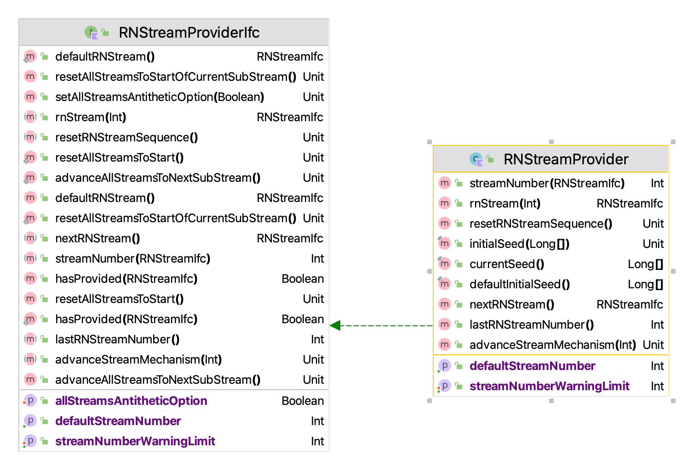
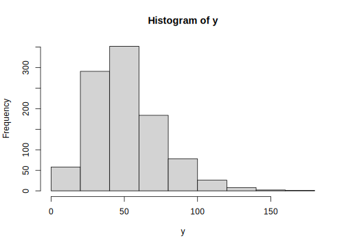
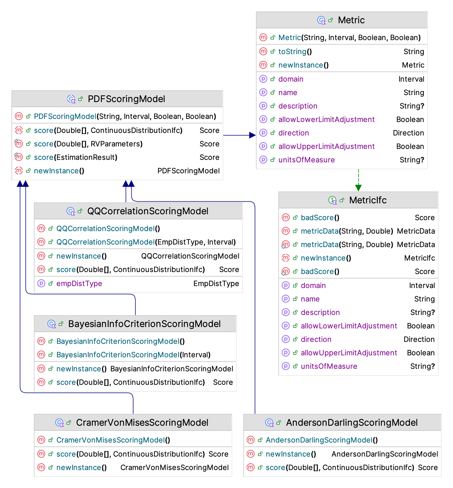
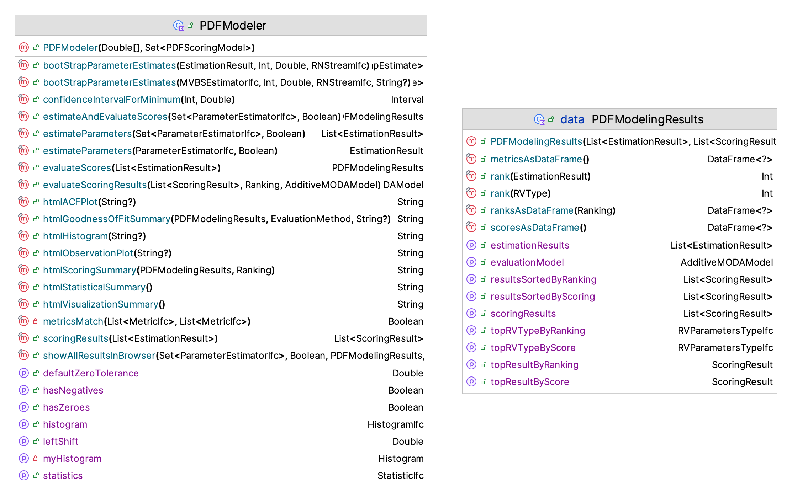
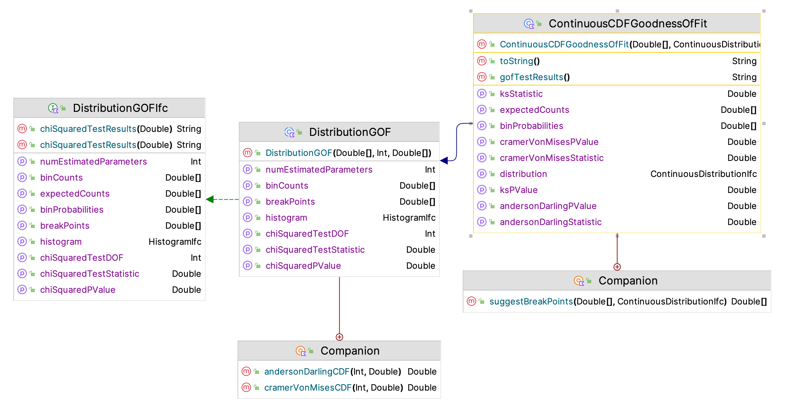
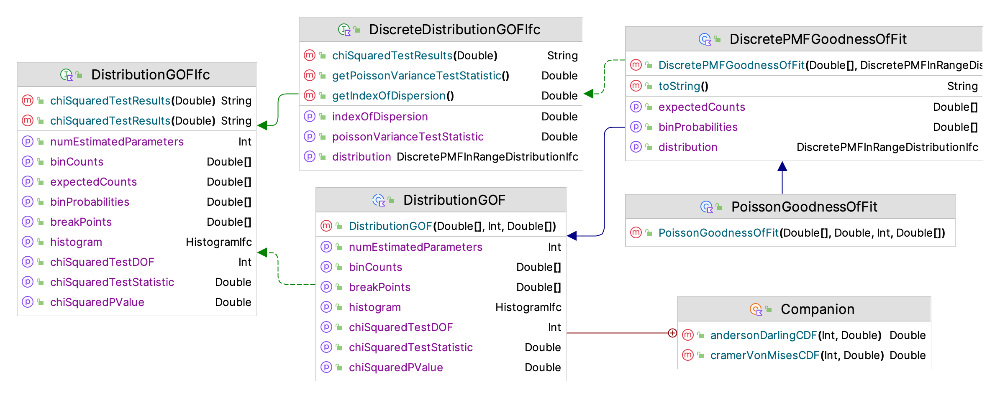

# Modeling Randomness {#ch2rng}

**[Learning Objectives]{.smallcaps}**

- To be able to generate random numbers using the Kotlin Simulation Library (KSL)
-	To understand how to control random number streams within the KSL
- To be able to generate random variates using the KSL
-	To understand how to use the KSL for basic probability computations

This chapter overviews the functionality of the KSL for modeling randomness within simulation models.  The focus of this chapter is on getting started using the basic classes and functionality of the KSL.  The theory and methods related to random number generation and random variate generation are provided in Appendix \@ref(appRNRV).  In that appendix, the underlying theory of the inverse transform method, convolution, acceptance rejection, and particular distribution modeling concepts are reviewed. In addition, the concepts of pseudo-random number generation are discussed. This chapter assumes that the reader has some familiarity with the general concepts presented in Appendix \@ref(appRNRV).

::: {.infobox .note data-latex="{note}"}
**NOTE!**
This chapter provides a series of example Kotlin code that illustrates the use of KSL constructs for generating random numbers and random variates. The full source code of the examples can be found in the accompanying `KSLExamples` project associated with the [KSL repository](https://github.com/rossetti/KSL). The files for each example of this chapter can be found [here](https://github.com/rossetti/KSL/tree/main/KSLExamples/src/main/kotlin/ksl/examples/book/chapter2).
:::

## Random Number Generator {#ch2generator}

This section discusses how to random number generation is implemented
within the KSL. The purpose is to present how these concepts can be put into
practice. 

The random number generator used within the KSL is described in
@ecuyer2002an and has excellent statistical properties. It is based on the
combination of two multiple recursive generators resulting in a period
of approximately $3.1 \times 10^{57}$. This is the same generator that
is now used in many commercial simulation packages. The generator used in the KSL is 
defined by the following equations.

$$
\begin{aligned}
R_{1,i} & = (1,403,580 R_{1,i-2} - 810,728 R_{1,i-3})\bmod (2^{32}-209)\\
R_{2,i} & = (527,612R_{2,i-1} - 1,370,589 R_{2,i-3})\bmod (2^{32}-22,853)\\
Y_i & = (R_{1,i}-R_{2,i})\bmod(2^{32}-209)\\
U_i & = \frac{Y_i}{2^{32}-209}
\end{aligned}
$$

To illustrate how this generator works, consider generating an initial sequence of
pseudo-random numbers from the generator. The generator takes as its
initial seed a vector of six initial values
$(R_{1,0}, R_{1,1}, R_{1,2}, R_{2,0}, R_{2,1}, R_{2,2})$. The first
initially generated value, $U_{i}$, will start at index $3$. To produce five pseudo random numbers using this generator we need an initial seed vector, such as:
$$\lbrace R_{1,0}, R_{1,1}, R_{1,2}, R_{2,0}, R_{2,1}, R_{2,2} \rbrace = \lbrace 12345, 12345, 12345, 12345, 12345, 12345\rbrace$$

Using the recursive equations, the resulting random numbers are as follows:

                       i=3              i=4              i=5              i=6             i=7           
  -------------- ---------------- ---------------- ---------------- --------------- ---------------- -- --
    $Z_{1,i-3}=$      12345            12345            12345         3023790853       3023790853       
    $Z_{1,i-2}=$      12345            12345          3023790853      3023790853       3385359573       
    $Z_{1,i-1}=$      12345          3023790853       3023790853      3385359573       1322208174       
    $Z_{2,i-3}=$      12345            12345            12345         2478282264       1655725443       
    $Z_{2,i-2}=$      12345            12345          2478282264      1655725443       2057415812       
    $Z_{2,i-1}=$      12345          2478282264       1655725443      2057415812       2070190165       
      $Z_{1,i}=$    3023790853       3023790853       3385359573      1322208174       2930192941       
      $Z_{2,i}=$    2478282264       1655725443       2057415812      2070190165       1978299747       
          $Y_i=$    545508589        1368065410       1327943761      3546985096       951893194        
          $U_i=$  0.127011122076   0.318527565471   0.309186015655   0.82584686312   0.221629915834     

While it is beyond the scope of this document to explore the theoretical
underpinnings of this generator, it is important to note that the generator allows multiple independent streams to be defined along with sub-streams.

The fantastic thing about this generator is the sheer size of the
period. Based on their analysis, @ecuyer2002an state that it will be
"approximately 219 years into the future before average desktop
computers will have the capability to exhaust the cycle of the
(generator) in a year of continuous computing." In addition to the
period length, the generator has an enormous number of streams,
approximately $1.8 \times 10^{19}$ with stream lengths of
$1.7 \times 10^{38}$ and sub-streams of length $7.6 \times 10^{22}$
numbering at $2.3 \times 10^{15}$ per stream. Clearly, with these
properties, you do not have to worry about overlapping random numbers
when performing simulation experiments. The generator was subjected to a
rigorous battery of statistical tests and is known to have excellent
statistical properties.

### Random Package {#ch2randompkg}

The concepts within L'Ecuyer et al. (2002) have been implemented within the `ksl.utilities.random.rng` package in the KSL. A key organizing principle for the `random` package is the use of interfaces. An interface allows classes to act like other classes. It is a mechanism by which a class can promise to have
certain behaviors (i.e. methods). The KSL utilizes interfaces to
separate random number generation concepts from stream control concepts.

<div class="figure">

<p class="caption">(\#fig:RNStreamInterfaces)Random Number Stream Interfaces</p>
</div>

Figure \@ref(fig:RNStreamInterfaces) shows the important interfaces within the
`ksl.utilities.random.rng` package. The `RandU01Ifc` defines the methods for
getting the next pseudo-random number and the previous pseudo-random
number via `randU01()` and `previousU.` The `randInt(i: Int, j: Int)` method can be used to generate
a random integer uniformly over the range from $i$ to $j$. 
The `GetAntitheticStreamIfc` and `RNStreamNewInstanceIfc` interfaces allow a new object
instance to be created from the stream.  In the case of the `GetAntitheticStreamIfc` interface
the created stream will produce antithetic variates from the stream. If $U$ is a pseudo-random number,
then $1-U$ is the antithetic variate of $U$.

The `RNStreamControlIfc` defines methods for controlling the underlying stream of pseudo-random numbers.

*   `resetStartStream()` - positions the random number stream at the
    beginning of its sequence This is the same location in the stream as
    assigned when the random number stream was created and
    initialized.
*   `resetStartSubstream()` - resets the position of the random number
    stream to the start of the current substream. If the random
    number stream has advanced into the substream, then this method
    resets to the beginning of the substream.
*   `advanceToNextSubStream()` - positions the random number stream at
    the beginning of its next substream. This method move through the
    current substream and positions the stream at the beginning of
    the next substream.
*   `antithetic` indicates to the stream to start producing antithetic variates. If the option is true, the
    stream should start producing antithetic variates with the next
    call to `randU01().` If the option is false, the stream should stop
    producing antithetic variates. 
    
The `StreamOptionIfc` defines methods for automating the control of the stream during simulation runs.
    
*   `advanceToNextSubStreamOption` - Indicates that the stream will be advance to the next substream for the beginning of the next simulation replication.
*   `resetStartStreamOption` - Indicates that the underlying stream will be reset to its starting point for the beginning of the next simulation replication.

The `RNStreamIfc` interface assumes that the underlying pseudo-random number generator can produce
multiple streams that can be further divided into substreams. The reset
methods allow the user to move within the streams. Classes that
implement the `RNStreamControlIfc` can manipulate the streams in a
well-defined manner. 

<div class="figure">

<p class="caption">(\#fig:RNStreamProvider)RNStreamProviderIfc Interface</p>
</div>

To create an concrete instance of a stream, we must have a random number stream provider. This
functionality is defined by the `RNStreamProviderIfc` interface and its concrete implementation, 
`RNStreamProvider.` Figure \@ref(fig:RNStreamProvider) illustrates the functionality available for
creating random number streams. This interface conceptualizes the creation of random number streams
as a process of making a sequence of streams numbered 1, 2, 3, ... 

A random number stream provider must define a default stream, which can be retrieved via the 
`defaultRNStream()` method. For the KSL, the default stream is the first
stream created and is labeled with the sequence number 1.  The sequence number of a stream
can be used to retrieve a particular stream from the provider.  The following methods
allow for creation and access to streams.

* `nextRNStream()` - returns the next random number stream associated with the provider. Each call
to `nextRNStream()` makes a new stream in the sequence of streams.
* `lastRNStreamNumber()` - returns the number of the stream that was last made. This indicates how
many streams have been made. If $0$ is returned, then no streams have been made by the provider.
* `rnStream(k : Int)` - returns the $k^{th}$ stream.  If $k$ is greater than `lastRNStreamNumber()` then `lastRNStreamNumber()` is advanced according to the additional number of streams by creating any intermediate streams. For example, if `lastRNStreamNumber()` = 10 and k = 15, then streams 11, 12, 13, 14, 15 are assumed provided and stream 15 is returned and `lastRNStreamNumber()` now equals 15.  If $k$ is less than or equal to `lastRNStreamNumber()`, then no new streams are created and  `lastRNStreamNumber()`stays at its current value and the $k^{th}$ stream is returned.
* `streamNumber(RNStreamIfc stream)` - returns the stream number of the instance of a stream.
* `advanceStreamMechanism(int n)` - advances the underlying stream mechanism by the specified number of streams, without actually creating the streams.  The value of `lastRNStreamNumber()` remains the same after advancing through 
the streams. In other words, this method should act as if `nextRNStream()` was not called but advance the underlying stream mechanism as if $n$ streams had been provided.
* `resetRNStreamSequence()` - Causes the random number stream provider to act as if has never created any streams. Thus, the next call to `nextRNStream()` will return the $1^{st}$ stream.

The random number stream provider also facilitates the control of all streams that have been created. This functionality is similar to how the position within an individual stream can be manipulated, except the provider performs the functionality on *all streams* that it has provided The following methods perform this function.

* `resetAllStreamsToStart()` - resets all created streams to the start of their stream.
* `resetAllStreamsToStartOfCurrentSubStream()` - resets all created streams to the start of their current sub-stream.
* `advanceAllStreamsToNextSubstream()` - advances all created streams to the start of their next sub-stream.
* `setAllStreamsAntitheticOption(option: Boolean)` - changes all created streams to have their antithetic option either off = false or on = true.

Many random number generators require the specification of a seed to start the generated sequence.  Even though the generator within the KSL use seeds, there really is no need to utilize the seeds because of the well defined methods for moving within the streams.  Now, let's illustrate how to create and manipulate streams.

### Creating and Using Streams {#ch2creatingStreams}
To create a random number stream, the user must utilize an instance of `RNStreamProvider.`  This process is illustrated in in the following code.  This code creates two instances of `RNStreamProvider` and gets the first stream from each instance.  The instances of `RNStreamProvider` use the exact same underlying default seeds. Thus, they produce *exactly the same* sequence of streams.

::: {.example #ch2ex1 name="RNStreamProvider"}
This example illustrates how to create a `RNStreamProvider`, create streams, and generate pseudo-random numbers from the stream.
```kt 
fun main() {
    // make a provider for creating streams
    val p1 = RNStreamProvider()
    // get the first stream from the provider
    val p1s1 = p1.nextRNStream()
    // make another provider, the providers are identical
    val p2 = RNStreamProvider()
    // thus the first streams returned are identical
    val p2s1 = p2.nextRNStream()
    print(String.format("%3s %15s %15s %n", "n", "p1s1", "p2s2"))
    for (i in 1..5) {
        print(String.format("%3d %15f %15f %n", i, p1s1.randU01(), p2s1.randU01()))
    }
}
```
:::


Thus, in the following code output, the randomly generated values are exactly the same for the two streams. 

```
  n            p1s1            p2s2 
  1        0.728510        0.728510 
  2        0.965587        0.965587 
  3        0.996184        0.996184 
  4        0.114988        0.114988 
  5        0.973145        0.973145 
```

There is is really very little need for the general programmer to create
a `RNStreamProvider` because the KSL supplies a default provider that can be used to provide a
virtually infinite number of streams. The need for directly accessing the functionality of `RNStreamProvider` is for very fine control of stream creation in such situations like running
code on different computers in parallel. While the providers produce the
same streams, you can force one provider to be different from another
provider by manipulating the seeds. In addition, the
provider can control all streams that it produces. So, unless you are
trying to do some advanced work that involves coordinating multiple streams, you should not need to create multiple instances of `RNStreamProvider.`

Because the most common use case is to just have a single provider of streams, the KSL facilitates this through the `KSLRandom` *object* The `KSLRandom` object has a wide range of methods to facilitate random variate generation.The most important methods include:

* `nextRNStream()` - calls the underlying default `RNStreamProvider` to create a new random number stream
* `rnStream(int k)` - returns the $k^{th}$ stream from the default `RNStreamProvider`
* `defaultRNStream()` - calls the underlying default `RNStreamProvider` for its default stream

In the following code example, these methods are used to create streams that are used to generate random numbers. 
The first line of the code uses the static method `defaultRNStream()` of `KSLRandom` to get the default stream and 
then generates three random numbers.  The stream is then advanced and three new random numbers are generated.  Then,
the stream is reset to its starting (initial seed) and it then repeats the original values.  Finally, the a new stream 
is created via `KSLRandom.nextRNStream()` and then used to generate new random numbers.  From a conceptual standpoint,
each stream contains an independent sequence of random numbers from any other stream (unless of course they are made from different providers). They are conceptually infinite and independent due to their enormous periods.

::: {.example #ch2ex2 name="KSLRandom"}
This example illustrates how to use the `KSLRandom` class to create streams, advance the stream, and reset the stream.
```kt
fun main() {
    val s1 = KSLRandom.defaultRNStream()
    println("Default stream is stream 1")
    println("Generate 3 random numbers")
    for (i in 1..3) {
        println("u = " + s1.randU01())
    }
    s1.advanceToNextSubStream()
    println("Advance to next sub-stream and get some more random numbers")
    for (i in 1..3) {
        println("u = " + s1.randU01())
    }
    println("Notice that they are different from the first 3.")
    s1.resetStartStream()
    println("Reset the stream to the beginning of its sequence")
    for (i in 1..3) {
        println("u = " + s1.randU01())
    }
    println("Notice that they are the same as the first 3.")
    println("Get another random number stream")
    val s2 = KSLRandom.nextRNStream()
    println("2nd stream")
    for (i in 1..3) {
        println("u = " + s2.randU01())
    }
    println("Notice that they are different from the first 3.")
}
```
:::


The resulting output from this code is as follows. Again, the methods of the `RNStreamControlIfc` interface that permit movement within a stream are extremely useful for controlling the randomness associated with a simulation.

```
Default stream is stream 1
Generate 3 random numbers
u = 0.12701112204657714
u = 0.3185275653967945
u = 0.3091860155832701
Advance to next sub-stream and get some more random numbers
u = 0.07939898979733463
u = 0.4803395047575741
u = 0.8583222470551328
Notice that they are different from the first 3.
Reset the stream to the beginning of its sequence
u = 0.12701112204657714
u = 0.3185275653967945
u = 0.3091860155832701
Notice that they are the same as the first 3.
Get another random number stream
2nd stream
u = 0.7285097861965271
u = 0.9655872822837334
u = 0.9961841304801171
Notice that they are different from the first 3.
```
### Common Random Numbers {#ch2crn}

Common random numbers (CRN) is a Monte Carlo method that has different experiments utilize the same random numbers. CRN is a variance reduction technique that allows the experimenter to block out the effect of the random numbers used in the experiment.  To facilitate the use of common random numbers the KSL has the aforementioned stream control mechanism. One way to implement common random numbers is to use two instances of `RNStreamProvider` as was previously illustrated.  In that case, the two providers produce the same sequence of streams and thus those streams can be used on the different experiments.  An alternative method that does not require the use of two providers is to create a copy of the stream directly from the stream instance. The following code clones the stream instance. 

::: {.example #ch2ex3 name="Cloning for CRN"}
This example clones an instance of a stream and uses it to generate common random numbers.

```kt
fun main() {
    // get the default stream
    val s = KSLRandom.defaultRNStream()
    // make a clone of the stream
    val clone = s.instance()
    print(String.format("%3s %15s %15s %n", "n", "U", "U again"))
    for (i in 1..3) {
        print(String.format("%3d %15f %15f %n", i, s.randU01(), clone.randU01()))
    }
}
```
:::

Since the instances have the same underlying state, they produce the same random numbers. Please note that the cloned stream instance is not produced by the underlying `RNStreamProvider` and thus it is not part of the set of streams managed or controlled by the provider.

```
  n               U         U again 
  1        0.127011        0.127011 
  2        0.318528        0.318528 
  3        0.309186        0.309186 
```

An alternative method is to just use the `resetStartStream()` method of the stream to reset the stream to the desired location in its sequence and then reproduce the random numbers. This is illustrated in the following code.

::: {.example #ch2ex4 name="Resetting the stream for CRN"}
This example resets the stream to generate common random numbers.

```kt
fun main() {
    val s = KSLRandom.defaultRNStream()
    // generate regular
    print(String.format("%3s %15s %n", "n", "U"))
    for (i in 1..3) {
        val u = s.randU01()
        print(String.format("%3d %15f %n", i, u))
    }
    // reset the stream and generate again
    s.resetStartStream()
    println()
    print(String.format("%3s %15s %n", "n", "U again"))
    for (i in 1..3) {
        val u = s.randU01()
        print(String.format("%3d %15f %n", i, u))
    }
}
```
:::

Notice that the generated numbers are the same. 

```  
  n               U 
  1        0.127011 
  2        0.318528 
  3        0.309186 

  n         U again 
  1        0.127011 
  2        0.318528 
  3        0.309186 
```
Thus, an experiment can be executed, then the random numbers reset to the desired location. Then, by changing the experimental conditions and re-running the simulation, the same random numbers are used. If many streams are used, then by accessing the `RNStreamProvider` you can reset all of the controlled streams with one call and then perform the next experiment.

### Creating and Using Antithetic Streams {#ch2antitheticStreams}

Recall that if a pseudo-random number is called $U$ then its antithetic value is $1-U$.  There are a number of methods to access antithetic values. The simplest is to create an antithetic instance from a given stream.  This is illustrated is in the following code. Please note that the antithetic stream instance is not produced by the underlying `RNStreamProvider` and thus it is not part of the set of streams managed or controlled by the provider. The new instance process directly creates the new stream based on the current stream so that it has the same underling state and it is set to produce antithetic values.

::: {.example #ch2ex5 name="Generating Antithetic Numbers"}
This example illustrates how to create an antithetic instance of a stream and generate antithetic random numbers.

```kt
fun main() {
    // get the default stream
    val s = KSLRandom.defaultRNStream()
    // make its antithetic version
    val ans = s.antitheticInstance()
    print(String.format("%3s %15s %15s %15s %n", "n", "U", "1-U", "sum"))
    for (i in 1..5) {
        val u = s.randU01()
        val au = ans.randU01()
        print(String.format("%3d %15f %15f %15f %n", i, u, au, u + au))
    }
}
```
:::

Notice that the generated values sum to 1.0.
```
  n               U             1-U             sum 
  1        0.127011        0.872989        1.000000 
  2        0.318528        0.681472        1.000000 
  3        0.309186        0.690814        1.000000 
  4        0.825847        0.174153        1.000000 
  5        0.221630        0.778370        1.000000 
```
An alternate method that does not require the creation of another stream involves using the `resetStartStream()` method and the `antithetic` property of the current stream. If you have a stream, you can use the `antithetic` property to cause the stream to start producing antithetic values. If you use the `resetStartStream()` method and then set the antithetic option to true, the stream will be set to its initial starting point and then produce antithetic values.

::: {.example #ch2ex6 name="Resetting for Antithetic Numbers"}
This example illustrates how to create an antithetic instance of a stream and generate antithetic random numbers.

```kt
fun main() {
    val s = KSLRandom.defaultRNStream()
    s.resetStartStream()
    // generate regular
    print(String.format("%3s %15s %n", "n", "U"))
    for (i in 1..5) {
        val u = s.randU01()
        System.out.printf("%3d %15f %n", i, u)
    }
    // generate antithetic
    s.resetStartStream()
    s.antithetic = true
    println()
    print(String.format("%3s %15s %n", "n", "1-U"))
    for (i in 1..5) {
        val u = s.randU01()
        print(String.format("%3d %15f %n", i, u))
    }
}
```
:::

Notice that the second set of random numbers is the antithetic complement of the first set in this output. Of course, you can also create multiple instances of `RNStreamProvider,` and then create streams and set one of the streams to produce antithetic values.
```
  n               U 
  1        0.127011 
  2        0.318528 
  3        0.309186 
  4        0.825847 
  5        0.221630
  
  n             1-U 
  1        0.872989 
  2        0.681472 
  3        0.690814 
  4        0.174153 
  5        0.778370
```

### Frequently Asked Questions about Random Numbers {#ch2rnFAQ}

1. **What are pseudo-random numbers?**
Numbers generated through an algorithm that appear to be random, when in fact, they are created by a deterministic process.

2. **Why do we want to control randomness within simulation models?**
By controlling randomness, we can better understand if changes in simulation responses are due to factors of interest or due to underlying statistical variation caused by sampling.  Do you think that it is better to compare two systems using the same inputs or different inputs?  Suppose we have a work process that we have redesigned.  We have the old process and the new process.  Would it be better to test the difference in the process by using two different workers or the same worker? Most people agree that using the same worker is better. This same logic applies to randomness. Since we can control which pseudo-random numbers we use, it is better to test the difference between two model alternatives by using the same pseudo-random numbers.  We use seeds and streams to do this.

3. **What are seeds and streams?**
A random number stream is a sub-sequence of pseudo-random numbers that start at particular place within a larger sequence of pseudo-random numbers. The starting point of a sequence of pseudo-random numbers is called the seed.  A seed allows us to pick a particular stream.  Having multiple streams is useful to assign different streams to different sources of randomness within a model.  This facilitates the control of the use of pseudo-random numbers when performing experiments.

4. **How come my simulation results are always the same?**
Random number generators in computer simulation languages come with a default set of streams that divide the “circle” up into independent sets of random numbers. The streams are only independent if you do not use up all the random numbers within the subsequence. These streams allow the randomness associated with a simulation to be controlled. During the simulation, you can associate a specific stream with specific random processes in the model. This has the advantage of allowing you to check if the random numbers are causing significant differences in the outputs. In addition, this allows the random numbers used across alternative simulations to be better synchronized.
Now a common question in simulation can be answered. That is, “If the simulation is using random numbers, why to I get the same results each time I run my program?” The corollary to this question is, “If I want to get different random results each time I run my program, how do I do it?” The answer to the first question is that the underlying random number generator is starting with the same seed each time you run your program. Thus, your program will use the same pseudo random numbers today as it did yesterday and the day before, etc. The answer to the corollary question is that you must tell the random number generator to use a different seed (or alternatively a different stream) if you want different invocations of the program to produce different results. The latter is not necessarily a desirable goal. For example, when developing your simulation programs, it is desirable to have repeatable results so that you can know that your program is working correctly.

5. **How come my simulation results are unexpectedly different?**
Sometimes by changing the order of method calls you change the sequence of random numbers that are assigned to various things that happen in the model (e.g. attribute, generated service times, paths taken, etc.). Please see the item (4) "How come my results are always the same?". Now, the result can sometimes be radically different if different random numbers are used for different purposes. By using streams, you reduce this possibility and increase the likelihood that two models that have different configurations will have differences due to the change and not due to the random numbers used.

## Random Variate Generation {#rvg}

This section will overview how to generate random variates using the KSL. A random variate is an observation of a random variable from some probability distribution.  Appendix \@ref(appRNRV) describes four basic methods for generating random variates:

- inverse transform
- convolution
- acceptance/rejection
- mixture distributions

The KSL provides classes that facilitate these methods (and others).

### Basic Random Variate Generation

In this section, we provide a couple of examples of generating random variates from "first principles".  The examples follow closely those presented in Appendix \@ref(appRNRV).

::: {.example #ch2ex7 name="Generating Exponential Random Variates"}
Consider a random variable, $X$, that represents the time until failure for a machine tool. Suppose $X$ is exponentially distributed with an expected value of $1.\overline{33}$.  Generate a random variate for the time until the first failure using a uniformly distributed value of $u = 0.7$.
```kt
fun main() {
    val u = 0.7
    val mean = 1.333333
    val x = rExpo(mean, u)
    println("Generated X = $x")
}

fun rExpo(mean: Double, u: Double) : Double {
    return -mean*ln(1.0 - u)
}
```
:::

The function `rExpo` implements the inverse CDF function for the exponential distribution for any mean and any value of $u$. By calling the function with the appropriate parameters, we can easily generate exponential random variates.  Just as in Example \@ref(exm:ExpInvCDF) of Appendix \@ref(appRNRV) the result is 1.6053. In this example, the value of $u$ was given; however, it could have easily been generated using a `RNStream` and the `randU01()` function.  

This next example illustrates how to generate negative binomial random variates via convolution. 

::: {.example #ch2ex8 name="Negative Binomial Variates Via Convolution"}
Use the following pseudo-random numbers $u_{1} = 0.35$, $u_{2} = 0.64$,
$u_{3} = 0.14$, generate a random variate from a shifted negative binomial distribution
having parameters $r=3$ and $p= 0.3$.
```kt
fun main() {
    val u1 = 0.35
    val u2 = 0.64
    val u3 = 0.14
    val p = 0.3
    val x1 = rGeom(p, u1)
    val x2 = rGeom(p, u2)
    val x3 = rGeom(p, u3)
    val x = x1 + x2 + x3
    println("Generated X = $x")
}

fun rGeom(p: Double, u: Double): Double {
    val n = ln(1.0 - u)
    val d = ln(1.0 - p)
    return 1.0 + floor(n / d)
}
```
:::

Recall from Appendix \@ref(appRNRV) that we refer to the geometric distribution as the shifted
geometric distribution, when $X_{i}\sim Shifted\ Geometric(p)$ with range $\{1, 2, 3, \dots\}$, and
$X_{i}$ can be generated via inverse transform with:

$$X_{i} = 1 + \left\lfloor \frac{ln(1 - U_{i})}{ln(1 - p)} \right\rfloor$$
Note also that the shifted negative binomial distribution is just the sum of shifted geometric random variables.  The code implements a function to generate a shifted geometric random variate.  Because we need a shifted negative binomial with $r=3$ and $p=0.3$, the function is used three times to generate three shifted geometric random variates with $p=0.3$. The observed values are summed to generate the shifted negative binomial. Just as in Example \@ref(exm:GenNB) of Appendix \@ref(appRNRV) the result is 6.0.

As we will see in the next section, the concepts of Appendix \@ref(appRNRV) have been generalized and implemented within the `ksl.utilities.random` package for various common random variables. 

### Continuous and Discrete Random Variables {#rvg_dists}

The KSL has the capability to generate random variates from both
discrete and continuous distributions. The `ksl.utilities.random.rvariable` package supports this functionality. The package has a set of interfaces
that define the behavior associated with random variables. Concrete
sub-classes of specific random variables are created by sub-classing
`RVariable.` As shown in Figure \@ref(fig:RVariableIfc), every random variable has
access to an object that implements the `RNStreamIfc` interface. This
gives it the ability to generate pseudo-random numbers and to control
the streams. The `GetValueIfc` interface is the key interface because in
this context it returns a random value from the random variable. For
example, if `d` is a reference to an instance of a sub-class of type
`RVariable`, then `d.value` generates a random value.

<div class="figure">

<p class="caption">(\#fig:RVariableIfc)Random Variable Interfaces</p>
</div>

The names and parameters (based on common naming conventions) associated with the continuous random variables are as follows:

-   `BetaRV(alpha1, alpha2)`
-   `ChiSquaredRV(degreesOfFreedom)`
-   `ExponentialRV(mean)`
-   `GammaRV(shape, scale)`
-   `GeneralizedBetaRV(alpha1, alpha2, min, max)`
-   `JohnsonBRV(alpha1, alpha2, min, max)`
-   `LaplaceRV(mean scale)`
-   `LogLogisticRV(shape, scale)`
-   `LognormalRV(mean, variance)`
-   `NormalRV(mean, variance)`
-   `PearsonType5RV(shape, scale)`
-   `PearsonType6RV(alpha1, alpha2, beta)`
-   `StudentTRV(degreesOfFreedom)`
-   `TriangularRV(min, mode, max)`
-   `UniformRV(min, max)`
-   `WeibullRV(shape, scale)`

The names of the discrete random variables are as follows:

-   `BernoulliRV(probOfSuccess)`
-   `BinomialRV(pSucces, numTrials)`
-   `ConstantRV(constVal)` a degenerate probability mass on a single value that cannot be changed
-   `DEmpiricalRV(values, cdf)` values is an array of numbers and cdf is an array representing the cumulative distribution function over the values
-   `DUniformRV(min, max)`
-   `GeometricRV(probOfSucces)` with range is 0 to infinity
-   `NegativeBinomialRV(probOfSuccess, numSuccess)` with range is 0 to infinity. The number of failures before the $r^{th}$ success.
-   `PoissonRV(mean)`
-   `ShiftedGeometricRV(probOfSucces)` range is 1 to infinity
-   `VConstantRV(constVal)` a degenerate probability mass on a single value that can be changed

All classes that represent random variables also have optional parameters to provide a stream and a name. If the stream is not provided, then the next stream from the default provider is allocated to the new instance of the random variable.  Thus, all random variables are automatically constructed such that they use different underlying streams, unless the programming specifically assigns streams.  

As you can see, the name of the distribution followed by the letters RV designate the class names.  Implementations of these classes extend the `RVarable` class, which implements the `RVariableIfc` interface.  Users simply create and instance of the class and then use it to get a sequence of values that have the named probability distribution. In order to implement a new random variable (i.e. some random variable
that is not already implemented) you can extend the class
`RVariable.` This provides a basic template for what is expected
in the implementation. However, it implies that you need to implement
all of the required interfaces. The key method to implement is the
protected `generate()` method, which should return the generated random
value according to some algorithm.

In almost all cases, the KSL utilizes the inverse transform algorithm for generating random variates. Thus, there is a one to one mapping of the underlying pseudo-random number and the resulting random variate. Even in the case of distributions that do not have closed form inverse cumulative distribution functions, the KSL utilizes numerical methods to approximate the function whenever feasible. For example, the KSL uses a rational function approximation, see [@cody1969], to
implement the inverse cumulative distribution function for the standard
normal distribution. The inversion for the gamma distribution is based
on Algorithm AS 91 for inverting the chi-squared distribution and
exploiting its relationship with the gamma. The beta distribution also
uses numerical methods to compute the cumulative distribution function
as well as bi-section search to determine the inverse for cumulative
distribution function.

The KSL implements the `BernoulliRV,` `DUniformRV,` `GeometricRV,`
`NegativeBinomialRV,` and `ShiftedGeometricRV` classes using the methods
described in Chapter 2 of @Rossetti2015. While more efficient methods may be available, the
`PoissonRV` and `BinomialRV` distributions are implemented by searching the
probability mass functions. Both search methods use an approximation to
get close to the value of the inverse and then search up or down through
the cumulative distribution function. Because of this both distributions
use numerically stable methods to compute the cumulative distribution
function values. The `DEmpiricalRV` class also searches through the
cumulative distribution function.

The following sections will overview the generation algorithms and provide examples for using some of these distributions.

### Creating and Using Random Variables {#rvguse}

This section presents how to create and use random variables via KSL constructs. The basic approach is to create an instance of a specific type of random variable and use the instance to generate observations.

::: {.example #ch2ex9 name="Generating Normal Random Variates"}
The following example code illustrates how to create a normal random variable and how to generate values using the `value` property.

```kt
fun main() {
    // create a normal mean = 20.0, variance = 4.0 random variable
    val n = NormalRV(20.0, 4.0)
    print(String.format("%3s %15s %n", "n", "Values"))
    // generate some values
    for (i in 1..5) {
        // the value property returns a generated value
        val x = n.value
        print(String.format("%3d %15f %n", i, x))
    }
}
```
:::

The resulting output is what you would expect.

```
  n          Values 
  1       21.216624 
  2       23.639128 
  3       25.335884 
  4       17.599163 
  5       23.858350 
```

Alternatively, the user can use the `sample()` method to generate an array of values that can be later processed. The `SampleIfc` interface has the following useful functions:

- `sample()` returns a new value
- `sample(sampleSize: Int)` returns an array of values
- `sampleInto(values: DoubleArray)` fills an array with values
- `sampleAsRows(sampleSize: Int, nRows: Int = 1)` makes a 2-D array with samples in the rows
- `sampleAsColumns(sampleSize: Int, nRows: Int = 1)` makes a 2-D array with samples in the columns
- `sampleInto(matrix: Array<DoubleArray>)` fills a 2-D array with samples

The following code illustrates how to use the `sample()` function with a triangular distribution.

::: {.example #ch2ex10 name="Using the sample() function"}
The following example code illustrates how to create a triangular random variable and how to generate values using the `sample()` function.

```kt
fun main() {
    // create a triangular random variable with min = 2.0, mode = 5.0, max = 10.0
    val t = TriangularRV(2.0, 5.0, 10.0)
    // sample 5 values
    val sample = t.sample(5)
    print(String.format("%3s %15s %n", "n", "Values"))
    for (i in sample.indices) {
        print(String.format("%3d %15f %n", i + 1, sample[i]))
    }
}
```
:::

Again, the output is what we would expect.

```
  n          Values 
  1        6.704608 
  2        8.826753 
  3        9.609315 
  4        3.661241 
  5        8.963572
```

::: {.infobox .note data-latex="{note}"}
**NOTE!**
The `SampleIfc` interface provides functionality to generate arrays of observations. The KSL provides extensive functionality for working with arrays within its utilities. This functionality is briefly discussed in Section \@ref(appUtilitiesArrays) of Appendix \@ref(appUtilities).
:::

It is important to note that the full range of functionality related to stream control is also available for random variables.  That is, the underlying stream can be reset to its start, can be advanced to the next substream, can generate antithetic variates, etc.  Each new instance of a random variable is supplied with its own *unique* stream that is not shared with another other random variable instances.  Since the underlying random number generator has an enormous number of streams, approximately $1.8 \times 10^{19}$, it is very unlikely that the user will not create so many streams as to start reusing them.  However, the streams that are used by random variable instances can be supplied directly so that they may be shared.

::: {.example #ch2ex11 name="Specifying a Stream"}
The following code example illustrates how to assign a specific stream by passing a specific stream instance into the constructor of the random variable.

```kt
fun main() {
    // get stream 3
    val stream = KSLRandom.rnStream(3)
    // create a normal mean = 20.0, variance = 4.0, with the stream
    val n = NormalRV(20.0, 4.0, stream)
    print(String.format("%3s %15s %n", "n", "Values"))
    for (i in 1..5) {
        // value property returns generated values
        val x = n.value
        print(String.format("%3d %15f %n", i, x))
    }
}
```
:::

The previous example used `KSLRandom` to get stream 3 and then provided the stream when constructing the instance of the normal random variable.  This process can be simplified by directly providing the stream number to the constructor of the random variable.

```kt
fun main() {
    // create a normal mean = 20.0, variance = 4.0, with the stream 3
    val n = NormalRV(20.0, 4.0, 3)
    print(String.format("%3s %15s %n", "n", "Values"))
    for (i in 1..5) {
        // value property returns generated values
        val x = n.value
        print(String.format("%3d %15f %n", i, x))
    }
}
```

A discrete empirical random variable requires the specification of the values and their probabilities. 
This requires a little more setup. The user must supply the set of values that can be generated as well as an array holding the cumulative distribution probability across the values. The following code illustrates how to do this.

::: {.example #ch2ex12 name="Using a DEmpirical Random Variable"}
The values are provided via an array and the probabilities must be specified in the form of the cumulative probabilities, such that the last element is 1.0.
```kt
fun main() {
    // values is the set of possible values
    val values = doubleArrayOf(1.0, 2.0, 3.0, 4.0)
    // cdf is the cumulative distribution function over the values
    val cdf = doubleArrayOf(1.0 / 6.0, 3.0 / 6.0, 5.0 / 6.0, 1.0)
    //create a discrete empirical random variable
    val n1 = DEmpiricalRV(values, cdf)
    println(n1)
    print(String.format("%3s %15s %n", "n", "Values"))
    for (i in 1..5) {
        print(String.format("%3d %15f %n", i, n1.value))
    }
}
```
:::

The results are as follows:

```
DEmpiricalRV(values=[1.0, 2.0, 3.0, 4.0], cdf=[0.16666666666666666, 0.5, 0.8333333333333334, 1.0])
  n          Values 
  1        3.000000 
  2        4.000000 
  3        4.000000 
  4        1.000000 
  5        4.000000
```

Section \@ref(AppRNRVsubsecMTSRV) of Appendix \@ref(appRNRV) defines mixture and truncated distributions. The following provides examples of how to create and use random variables from these distributions. The examples follow those presented in Section \@ref(AppRNRVsubsecMTSRV).

::: {.example #ch2ex13 name="Mixture Distribution"}
Suppose the time that it takes to pay with a credit card, $X_{1}$, is exponentially
distributed with a mean of $1.5$ minutes and the time that it takes to
pay with cash, $X_{2}$, is exponentially distributed with a mean of
$1.1$ minutes. In addition, suppose that the chance that a person pays
with credit is 70%. Then, the overall distribution representing the
payment service time, $X$, has an hyper-exponential distribution with
parameters $\omega_{1} = 0.7$, $\omega_{2} = 0.3$,
$\lambda_{1} = 1/1.5$, and $\lambda_{2} = 1/1.1$. Generate 5 random variates from this distribution.

```kt
fun main() {
    // rvs is the list of random variables for the mixture
    val rvs = listOf(ExponentialRV(1.5), ExponentialRV(1.1))
    // cdf is the cumulative distribution function over the random variables
    val cdf = doubleArrayOf(0.7, 1.0)
    //create a mixture random variable
    val he = MixtureRV(rvs, cdf)
    print(String.format("%3s %15s %n", "n", "Values"))
    for (i in 1..5) {
        print(String.format("%3d %15f %n", i, he.value))
    }
}
```
```
  n          Values 
  1        0.110657 
  2        1.955744 
  3        1.196017 
  4        5.053994 
  5        8.352880 
```
:::

The `MixtureRV` class requires a list of random variables and a specification of the probability associated with each random variable in the form of a cumulative distribution function. In the provided code sample, a list is created holding the two exponential random variables. Since the distribution associated with the credit card payment is first in the list, the probability of 0.7 is specified first in the `cdf` array.

The next example illustrates how to generate from a truncated distribution. A *truncated distribution* is a distribution derived from another distribution for which the range of the random variable is restricted.
Suppose we have a random variable, $X$ with PDF, $f(x)$ and CDF $F(x)$. Suppose that we
want to constrain $f(x)$ over interval $[a, b]$, where $a<b$ and the
interval $[a, b]$ is a subset of the original support of $f(x)$. Note
that it is possible that $a = -\infty$ or $b = +\infty$. This leads to a random variable from a truncated distribution $F^{*}(x)$ having CDF:

$$
F^{*}(x) = 
\begin{cases}
0 & \text{if} \; x < a \\
\frac{F(x) - F(a)}{F(b) - F(a)} &   a \leq x \leq b\\
0 & \text{if} \; b < x\\
\end{cases}
$$

This leads to a straight forward algorithm for generating from
$F^{*}(x)$ as follows:

| 1. Generate $u \sim U(0,1)$
| 2. $W = F(a) + (F(b) - F(a))u$
| 3. $X = F^{-1}(W)$
| 4. return $X$

To implement this algorithm, we need the original CDF $F(x)$, its range, and the truncated range $[a,b]$.

::: {.example #ch2ex14 name="Truncated Distribution"}
Suppose $X$ represents the distance between two cracks in highway. Suppose that $X$
has an exponential distribution with a mean of 10 meters. Generate 5 random distance values
restricted between 3 and 6 meters.

```kt
fun main() {
    val cdf = Exponential(mean = 10.0)
    val rv = TruncatedRV(cdf, Interval(0.0, Double.POSITIVE_INFINITY), Interval(3.0, 6.0))
    print(String.format("%3s %15s %n", "n", "Values"))
    for (i in 1..5) {
        print(String.format("%3d %15f %n", i, rv.value))
    }
}
```
:::

The exponential distribution has range $[0,+\infty]$.  In this situation, we are truncating the distribution over the range $[a=3, b=6]$.  The `TruncatedRV` class implements the aforementioned algorithm. The class requires an invertible CDF, the original range of the CDF, and the truncated range. In the code, an instance of an exponential distribution (see Section \@ref(probModels)) is created to provide the cumulative distribution function, $F(x)$. This allows the implementation to compute $F(a)$ and $F(b)$. Then, instances of the `Interval` class are used to define the original range and the truncated range.  As we can see from the following results, the values are limited to the range of $[3,6]$.

```
  n          Values 
  1        5.092609 
  2        5.880323 
  3        5.986659 
  4        3.302560 
  5        5.906485 
```

Appendix \@ref(appRNRV) also defines a shifted random variable. Suppose $X$ has a given
distribution $f(x)$, then the distribution of $X + \delta$ is termed the
shifted distribution and is specified by $g(x)=f(x - \delta)$. It is
easy to generate from a shifted distribution, simply generate $X$
according to $F(x)$ and then add $\delta$. The KSL implements this idea via the `ShiftedRV` class. The following example from Appendix \@ref(appRNRV) illustrates how simple it is to use a shifted random variable.

::: {.example #ch2ex15 name="Shifted Random Variable"}

Suppose $X$ represents
the time to setup a machine for production. From past time studies, we
know that it cannot take any less than 5.5 minutes to prepare for the
setup and that the time after the 5.5 minutes is random with a Weibull
distribution with shape parameter $\alpha = 3$ and scale parameter
$\beta = 5$. Generate 5 random observations of the setup time.

```kt
fun main() {
    val w = WeibullRV(shape = 3.0, scale = 5.0)
    val rv = ShiftedRV(5.0, w)
    print(String.format("%3s %15s %n", "n", "Values"))
    for (i in 1..5) {
        print(String.format("%3d %15f %n", i, rv.value))
    }
}
```

:::

Notice that the `ShiftedRV` class requires the shift parameter and the random variable that is to be shifted.

This next example is a bit more complex. Recall from Appendix \@ref(appRNRV) that the acceptance/rejection algorithm is a general purpose method for generating from any probability distribution, $f(x)$. The method requires a majorizing function, $g(x)$, such that $g(x) \geq f(x)$ for $-\infty < x < +\infty$. From the majorizing function, we compute its area:

$$
c = \int\limits_{-\infty}^{+\infty} g(x) dx
$$

We then define $c$ as the majorizing constant. Using the majorizing constant and majorizing function, we can define a proposal distribution, $w(x)$, where $w(x)$ is defined as $w(x) = g(x)/c$.  To summarize, the acceptance/rejection algorithm requires three things:

- $f(x)$ The PDF from which random variates need to be generated.
- $w(x)$ The proposal distribution to generate possible variates for acceptance or rejection.
- $c$ The majorizing constant (or area under the majorizing function) to be used in the acceptance/rejection test.

The `AcceptanceRejectionRV` class implements the acceptance/rejection algorithm given these three components.  Let's explore these concepts via an example.

::: {.example #ch2ex16 name="Acceptance-Rejection Random Variable"}
Consider the following PDF over the range $\left[-1,1\right]$. Generate 1000 random variates from this distribution.
$$
f(x) =
\begin{cases}
\frac{3}{4}\left( 1 - x^2 \right) &     -1 \leq x \leq 1\\
0 & \text{otherwise}\\
\end{cases}
$$

<div class="figure" style="text-align: center">

<p class="caption">(\#fig:Ch2ARExampleFig)Plot of f(x)</p>
</div>
:::

As discussed in Example \@ref(exm:ARExampleRV) of Appendix \@ref(appRNRV), we can use $g(x) = 3/4$ as the majorizing function, which results in $c=3/2$, and $w(x)$

$$
w(x) =
\begin{cases}
\frac{1}{2} &   -1 \leq x \leq 1\\
0 & \text{otherwise}\\
\end{cases}
$$
Notice that, $w(x)$ results in random variables, $W$, where $W \sim U(-1,1)$.  Thus, the proposal distribution is simply a uniform distribution over the range from -1 to 1.  The following KSL code implements these concepts.  The proposal distribution, $w(x)$ is provided via an instance of the `Uniform` distribution class. Probability distributions are discussed in Section \@ref(probModels).  The `AcceptanceRejection` class then is created and used to generate 1000 observations. 

```kt
fun main() {
    // proposal distribution
    val wx = Uniform(-1.0, 1.0)
    // majorizing constant, if g(x) is majorizing function, then g(x) = w(x)*c
    val c = 3.0 / 2.0
    val rv = AcceptanceRejectionRV(wx, c, fOfx)
    val h = Histogram.create(-1.0, 1.0, 100)
    for (i in 1..1000) {
        h.collect(rv.value)
    }
    val hp = h.histogramPlot()
    hp.showInBrowser()
}

object fOfx : PDFIfc {
    override fun pdf(x: Double): Double {
        if ((x < -1.0) || (x > 1))
            return 0.0
        return (0.75 * (1.0 - x * x))
    }

    override fun domain(): Interval {
        return Interval(-1.0, 1.0)
    }

}
```

Notice that the implementation requires an implementation of the PDF from which random variates are to be generated, $f(x)$. The `fOfx` *object* is used to implement the function and its domain. The code also illustrates how to create a histogram of the observations. Histograms are discussed further in Section \@ref(histFreq) of Chapter \@ref(mcm).

In what follows, we briefly describe some additional functionality of the KSL for generating random variates and for applying randomness to arrays and lists. 

The preferred method for generating random values from random
variables is to create instance of the appropriate random variable
class; however, the KSL also provide a set of functions for generating random
values within the `KSLRandom` object. For all the previously listed random variables, there is a 
corresponding function that will generate a random value.  For
example, the function `rNormal()` of the `KSLRandom` object will generate a normally distributed
value. Each function is named with an \"r\" in front of the distribution
name. By using an import of `KSLRandom` functions the user can more conveniently call these methods. The following code example illustrates how to do this.

::: {.example #ch2ex17 name="Using KSLRandom Functions"}
The functions require the specification of the parameters of the distribution for each invokation.
```kt
fun main() {
    val v = rUniform(10.0, 15.0) // generate a U(10, 15) value
    val x = rNormal(5.0, 2.0) // generate a Normal(mu=5.0, var= 2.0) value
    val n = rPoisson(4.0).toDouble() //generate from a Poisson(mu=4.0) value
    print(String.format("v = %f, x = %f, n = %f %n", v, x, n))
}
```
:::

In addition to random values through these functions, the
`KSLRandom` object provides a set of methods for randomly selecting from
arrays and lists and for creating permutations of arrays and lists. In
addition, there is a set of methods for sampling from arrays and lists
without replacement.The following code provide examples of using these methods.

::: {.example #ch2ex18 name="Random Lists"}
The `randomlySelect()` function can be used to randomly select, with equal probability from a Kotlin list. An extension function has been defined to allow this to be done directly from the list.
```kt
fun main() {
    // create a list
    val strings = listOf("A", "B", "C", "D")
    // randomly pick from the list, with equal probability
    for (i in 1..5) {
        println(KSLRandom.randomlySelect(strings))
    }
    println()
    // use the extension function
    for (i in 1..5) {
        println(strings.randomlySelect())
    }
}
```
:::

It is also possible to specify a distribution in the form of a CDF array over the items in the list to permit sampling that is not equally likely.  There are also extension functions declared on arrays for directly performing this form of random selection.  

This next example illustrates how to define a population of values (`DPopulation`) and use it to perform sampling operations such as random samples and permutations.  Similar functionality is also demonstrated by directly using the functions of the `KSLRandom` object

::: {.example #ch2ex19 name="Random Permuation"}
This example defines a population over the integer from 1 to 10 and permutes the population. It also illustrates how to sample from the population and permute a mutable list. 
```kt
fun main() {
    // create an array to hold a population of values
    val y = DoubleArray(10)
    for (i in 0..9) {
        y[i] = (i + 1).toDouble()
    }

    // create the population
    val p = DPopulation(y)
    println(p.contentToString())

    println("Print the permuted population")
    // permute the population
    p.permute()
    println(p.contentToString())

    // directly permute the array using KSLRandom
    println("Permuting y")
    KSLRandom.permute(y)
    println(y.contentToString())

    // sample from the population
    val x = p.sample(5)
    println("Sampling 5 from the population")
    println(x.contentToString())

    // create a string list and permute it
    val strList: MutableList<String> = ArrayList()
    strList.add("a")
    strList.add("b")
    strList.add("c")
    strList.add("d")
    println("The mutable list")
    println(strList)
    KSLRandom.permute(strList)
    println("The permuted list")
    println(strList)
    println("Permute using extension function")
    strList.permute()
    println(strList)
}
```
:::

Output from the permutation examples.

```
[1.0, 2.0, 3.0, 4.0, 5.0, 6.0, 7.0, 8.0, 9.0, 10.0]
Print the permuted population
[8.0, 10.0, 2.0, 4.0, 3.0, 5.0, 1.0, 6.0, 9.0, 7.0]
Permuting y
[2.0, 4.0, 5.0, 9.0, 6.0, 8.0, 3.0, 1.0, 7.0, 10.0]
Sampling 5 from the population
[2.0, 4.0, 4.0, 9.0, 5.0]
The mutable list
[a, b, c, d]
The permuted list
[c, a, b, d]
Permute using extension function
[b, d, c, a]
```

### Functions of Random Variables

The KSL also contains an algebra for working with random variables.  A well-known property of random variables is that a function of a random variable is also a random variable. That is, let $f(\cdot)$ be an arbitrary function and let $X$ be a random variable. Then, the quantity $Y = f(X)$ is also a random variable. Various properties of $Y$ such as expectation, $E[Y]$ and $Var[Y]$ may be of interest.  A classic example of this is the relationship between the normal random variable and the lognormal random variable.  If $X \sim N(\mu, \sigma^2)$ then the random variable $Y=e^X$ will be lognormally distributed $LN(\mu_l,\sigma_{l}^{2})$, where

\begin{equation}
E[Y] = \mu_l = e^{\mu + \sigma^{2}/2}
\end{equation}

\begin{equation}
Var[Y] = \sigma_{l}^{2}  = e^{2\mu + \sigma^{2}}\left(e^{\sigma^{2}} - 1\right)
\end{equation}

Thus, one can define new random variables simply as functions of other random variables.

The interface `RVariableIfc` and base class `RVariable` provides the ability to construct new random variables that are functions of other random variables by overriding the $(+, -, \times, \div)$ operators and providing extension functions for various math functions.  For example, we can defined two random variables and then a third that is the sum of the first two random variables. The random variable that is defined as the sum will generate random variates that represent the sum. Functions, such as `sin(),` `cos()` as well as many other standard math functions can be applied to random variables to create new random variables.  That is, the KSL provides the ability to create arbitrarily complex random variables that are defined as *functions* of other random variables. This capability will be illustrated in this section with a couple of examples.

***
::: {.example #ch2ex20 name="Erlang Via Convolution"}
Suppose we have $k$ independent random variables, $X_i$ each exponentially distributed with mean $\theta$. Then, the random variable:
\begin{equation} 
Y = \sum_{i=i}^{k}X_i 
\end{equation}
will be an Erlang$(k, \theta)$ where $k$ is the shape parameter and $\theta$ is the scale parameter.  Set up a KSL model to generate 1000 Erlang random variables with $k = 5$ and $\theta = 10$.
:::

***

A possible solution to this problem is to use the KSL to define a new random variable that is the sum of 5 exponential random variables.

```kt
fun main(){
    var erlang: RVariableIfc = ExponentialRV(10.0)
    for(i in 1..4) {
        erlang = erlang + ExponentialRV(10.0)
    }
    val sample = erlang.sample(1000)
    val stats = Statistic(sample)
    print(stats)
    sample.writeToFile("erlang.txt")
}
```
The first line of this code creates and stores an instance of an exponential random variable with mean 10.  The for loop is **not** generating any random variates.  It is defining a new random variable that is the sum of 4 additional exponential random variables. The defined random variable is used to generate a sample of size 1000 and using the `Statistic` class (discussed in the next chapter) a basic statistical summary is computed. Also, using the `writeToFile` KSL extension function for double arrays, the sample is written to a file.  The results as a histogram are also presented. The statistical results are as follows.

```
ID 30
Name Statistic_1
Number 1000.0
Average 51.11021981152218
Standard Deviation 23.62319194179008
Standard Error 0.7470309213939245
Half-width 1.4659295758838757
Confidence Level 0.95
Confidence Interval [49.6442902356383, 52.576149387406055]
Minimum 5.03168557560841
Maximum 177.85302754920727
Sum 51110.219811522176
Variance 558.0551975186557
Deviation Sum of Squares 557497.1423211371
Last value collected 58.568877001859285
Kurtosis 1.5267730984137933
Skewness 0.9637663719643743
Lag 1 Covariance -13.659309232961249
Lag 1 Correlation -0.024501128698329766
Von Neumann Lag 1 Test Statistic -0.7301901389345133
Number of missing observations 0.0
Lead-Digit Rule(1) -1
```

<div class="figure">

<p class="caption">(\#fig:ErlangHist)Histogram for Erlang Generated Data</p>
</div>

Notice that the histogram looks like an Erlang distribution and the estimated results are what we would expect for an Erlang distribution with $k=5$ and $\theta = 10$. 

To illustrate a couple of other examples consider the following code. In this code, the previously noted relationship between normal random variables and lognormal random variables is demonstrated in the first 6 lines of the code.

::: {.example #ch2ex21 name="Functions of Random Variables"}
This example uses the fact that if $X \sim N(\mu,\sigma^2)$, then $Y = e^{X} \sim \text{LN}(\mu_l,\sigma_{l}^{2})$. In addition, the code illustrates how to generate a beta random variable via its relationship with gamma random variables.

```kt
fun main(){
    // define a lognormal random variable, y
    val x = NormalRV(2.0, 5.0)
    val y = exp(x)
    // generate from y
    val ySample = y.sample(1000)
    println(ySample.statistics())
    // define a beta random variable in terms of gamma
    val alpha1 = 2.0
    val alpha2 = 5.0
    val y1 = GammaRV(alpha1, 1.0)
    val y2 = GammaRV(alpha2, 1.0)
    val betaRV = y1/(y1+y2)
    val betaSample = betaRV.sample(500)
    println(betaSample.statistics())
}
```
:::

One method for generating Beta random variables exploits its relationship with the Gamma distribution. If $Y_1 \sim Gamma(\alpha_1, 1)$ and $Y_2 \sim Gamma(\alpha_2, 1)$, then $X = Y_1/(Y_1 + Y_2)$ has a Beta($\alpha_1, \alpha_2$) distribution. In the previous KSL code, we defined two gamma random variables and define the beta random variable using the algebraic expression. This code *defines* and *constructs* a new random variable that is function of the previously define random variables. Through this pattern you can define complex random variables and use those random variables anywhere a random variable is needed.

## Probability Distribution Models {#probModels}

The `ksl.utilities.random.rvariable` package is the key package for generating random variables; however, it does not facilitate performing calculations involving the underlying probability distributions. To perform calculations involving probability distributions, you should use the `ksl.utilities.distributions` package.  This package has almost all the same distributions represented within the `ksl.utilities.random.rvariable` package.  

<div class="figure">

<p class="caption">(\#fig:DistPackage)Distribution Interfaces</p>
</div>

Figure\@ref(fig:DistPackage) illustrates the interfaces used to define probability distributions. First, the interface, `CDFIfc` serves as the basis for discrete distributions via the `DiscreteDistributionIfc` interface, for continuous distributions via the `ContinuousDistributionIfc` interface and the general `DistributionIfc` interface. The discrete distributions such as the geometric, binomial, etc. implement the `DiscreteDistributionIfc` and `PMFIfc` interfaces. Similarly, continuous distributions like the normal, uniform, etc. implement the `ContinuousDistributionIfc` and `PDFIfc` interfaces.  All concrete implementations of distributions extend from the abstract base class `Distribution`, which implements the `DistributionIfc` interface.  Thus, all distributions have the following capabilities:

* `cdf(b: Double)` - computes the cumulative probability, $F(b) = P(X \leq b)$
* `cdf(a: Double, b: Double)` - computes the cumulative probability, $P( a \leq X \leq b)$
* `complementaryCDF(b: Double)` - computes the cumulative probability, $1-F(b) = P(X > b)$
* `mean()` - returns the expected value (mean) of the distribution
* `variance()` - returns the variance of the distribution
* `standardDeviation()` - returns the standard deviation of the distribution
* `invCDF(p: Double)` - returns the inverse of the cumulative distribution function $F^{-1}(p)$. This is performed by numerical search if necessary

Discrete distributions have a method called `pmf(k: Double)` that returns the probability associated with the value $k$.  Continuous distributions have a probability density function, $f(x)$, implemented in the method, `pdf(x : Double)`.  Finally, all distributions know how to create random variables through the `GetRVariableIfc` interface that provides the following methods.

* `RVariableIfc randomVariable(stream: RNStreamIfc)` - returns a new instance of a random variable based on the current values of the distribution's parameters that uses the supplied stream
* `RVariableIfc randomVariable(streamNum: Int)` - returns a new instance of a random variable based on the current values of the distribution's parameters that uses the supplied stream number
* `RVariableIfc randomVariable()` - returns a new instance of a random variable based on the current values of the distribution's parameters that uses a newly created stream

As an example, the following code illustrates some calculations for the binomial distribution.

::: {.example #ch2ex22 name="Computing with a Binomial Distribution"}
This example code illustrates how to create a binomial distribution and to use some of its functions to compute the mean, variance, and perform some basic calculations involving probabilities. Notice that the parameters of a distribution can be changes and that distributions can create random variables for generating variates.

```kt
fun main() {
    // make and use a Binomial(p, n) distribution
    val n = 10
    val p = 0.8
    println("n = $n")
    println("p = $p")
    val bnDF = Binomial(p, n)
    println("mean = " + bnDF.mean())
    println("variance = " + bnDF.variance())
    // compute some values
    print(String.format("%3s %15s %15s %n", "k", "p(k)", "cdf(k)"))
    for (i in 0..10) {
        print(String.format("%3d %15.10f %15.10f %n", i, bnDF.pmf(i), bnDF.cdf(i)))
    }
    println()
    // change the probability and number of trials
    bnDF.probOfSuccess = 0.5
    bnDF.numTrials = 20
    println("mean = " + bnDF.mean())
    println("variance = " + bnDF.variance())
    // make random variables based on the distributions
    val brv = bnDF.randomVariable
    print(String.format("%3s %15s %n", "n", "Values"))
    // generate some values
    for (i in 1..5) {
        // value property returns generated values
        val x = brv.value.toInt()
        print(String.format("%3d %15d %n", i, x))
    }
}
```
:::

The output shows the mean, variance, and basic probability calculations.

```
n = 10
p = 0.8
mean = 8.0
variance = 1.5999999999999996
  k            p(k)          cdf(k) 
  0    0.0000001024    0.0000001024 
  1    0.0000040960    0.0000041984 
  2    0.0000737280    0.0000779264 
  3    0.0007864320    0.0008643584 
  4    0.0055050240    0.0063693824 
  5    0.0264241152    0.0327934976 
  6    0.0880803840    0.1208738816 
  7    0.2013265920    0.3222004736 
  8    0.3019898880    0.6241903616 
  9    0.2684354560    0.8926258176 
 10    0.1073741824    1.0000000000 
```
The `ksl.utilities.random.rvariable` package creates instances of random variables that are immutable. That is, once you create a random variable, its parameters cannot be changed.  However, distributions permit their parameters to be changed and they also facilitate the creation of random variables.  The previous example code uses the properties `probOfSuccess` and `numTrials` to change the parameters of the previously created binomial distribution and then creates a random variable based on the mutated distribution.

```
mean = 10.0
variance = 5.0
  n          Values 
  1              11 
  2              14 
  3              16 
  4               7 
  5              14 
```

The results are as we would expect. Similar calculations can be made for continuous distributions. In most cases, the concrete implementations of the various distributions have specialize methods beyond those generic methods described here. Please refer to the documentation for further details.

There are a number of useful companion object methods defined for the binomial, normal, gamma, and Student-T distributions. Specifically, for the binomial distribution, has the following methods

* `binomialPMF(j: Int, n: Int, p: Double)` - directly computes the probability for the value $j$
* `binomialCDF(j: Int, n: Int, p: Double)` - directly computes the cumulative distribution function for the value $j$
* `binomialCCDF(j: Int, n: Int, p: Double)`- directly computes the complementary cumulative distribution function for the value of $j$
* `binomialInvCDF(x: Double, n: Int, p: Double)` - directly computes the inverse cumulative distribution function

These methods are designed to perform their calculations in a numerically stable manner to ensure numerical accuracy. The normal distribution has the following companion object methods for computations involving the standard normal distribution.

* `stdNormalCDF(z: Double)` - the cumulative probability for a $Z ~ N(0,1)$ random variable, i.e. $F(z) = P(Z \leq z)$
* `stdNormalComplementaryCDF(z: Double)` - returns $1-P(Z \leq z)$
* `stdNormalInvCDF(p: Double)` - returns $z = F^{-1}(p)$ the inverse of the cumulative distribution function

The Student-T distribution also has two convenience methods to facilitate computations.

* `cdf(dof: Double, x: Double)` - computes the cumulative distribution function for $x$ given the degrees of freedom
* `invCDF(dof: Double, p: Double)` - computes the inverse cumulative distribution function or t-value for the supplied probability given the degrees of freedom.

Within the `Gamma` class's companion object there are some convenience methods for computing the gamma function, the natural logarithm of the gamma function, the incomplete gamma function, and the digamma function (derivative of the natural logarithm of the gamma function).

## Distribution Fitting Using the KSL {#distFitting}

This section describes how to apply the methods discussed in Appendix \@ref(appidm) to fit probability distributions using the KSL.  The package `ksl.utilities.distributions.fitting` contains classes that facilitate the estimation of the parameters of discrete and continuous probability distributions.  In addition, the quality of the estimated parameters can be examined based on a number of metrics that measure the goodness of fit of the probability model to the data. Finally, there is functionality that will automatically fit a set of possible distributions to a data set and recommend the best distribution based on a combination of metrics.  This section will first describe the organization of the functionality related to parameter estimation. Then, the scoring models for measuring the quality of fit will be presented. Finally, a number of examples will illustrate the use of the classes on the data from the examples discussed in Appendix \@ref(appidm).

### Estimating Distribution Parameters

As discussed in Appendix \@ref(appidm) a key step in the distribution fitting process is estimating the parameters of the hypothesized probability model.  For example, if we want to fit a normal distribution to the data, we must estimate the mean ($\mu$) and the variance ($\sigma^2$) of the associated distribution.  Each distribution may be specified by different parameters.  For example, the gamma distribution is specified by the shape ($\alpha$) and scale ($\beta$) parameters. Appendix \@ref(appDiscreteDistributions) and \@ref(appContinuousDistributions) provide a listing of many common distributions and their parameters.

The estimation of the parameters of a distribution requires the execution of an algorithm.  As mentioned in Appendix \@ref(appidm), the maximum likelihood estimation method is commonly used because it often produces estimates that have desirable statistical properties.  However, the maximum likelihood method may require the solving of a non-linear optimization problem.  The method of moments is also a common algorithm that is used to estimate the parameters of various distributions. In the method of moments, the theoretical moment equations are matched with the statistically computed moments resulting in a set of equations that must be solved to form the parameter estimators.  In some cases, the method of moments results in simple equations, but for some distributions it may result in the need to solve a system of non-linear equations. Many other methods of parameter estimation exist, such as the percentile method, which may be general or targeted to specific distributions. The KSL facilitates the development of routines to estimate parameters by providing a well-defined parameter estimation interface.  By implementing the `ParameterEstimatorIfc` interface, KSL users can incorporate additional distributions and estimation methods into the estimation framework.

<div class="figure">

<p class="caption">(\#fig:ParameterEstimatorLabel)Important Classes for Parameter Estimation</p>
</div>

Figure \@ref(fig:ParameterEstimatorLabel) illustrates some of the key classes and interfaces involved in the parameter estimation framework.  The functionality starts with the `ParameterEstimatorIfc` interface, which requires the implementation of the estimation routine and a property (`checkRange`) to indicate if the data should be checked for shifting onto the domain of the distribution.  The `ParameterEstimatorIfc` interface defines a general function that uses 1-dimensional data array, and estimates the parameters of an hypothesized uni-variate distribution via some estimation algorithm. It is important to note that a distribution may have more than one method for estimating its parameters.  In the figure, the maximum likelihood estimator for the gamma distribution is illustrated; however, for example, there is also a method of moments estimator for the gamma distribution implemented within the KSL distribution fitting framework.

```kt
interface ParameterEstimatorIfc {

    /**
     *  Indicates if the estimator requires that the range of the data be checked for a shift
     *  before the estimation process.
     */
    val checkRange: Boolean

    /**
     *  Estimates the parameters associated with some distribution. The returned [EstimationResult]
     *  needs to be consistent with the intent of the desired distribution.
     *  Note the meaning of the fields associated with [EstimationResult]
     */
    fun estimateParameters(data: DoubleArray, statistics: StatisticIfc = Statistic(data)): EstimationResult
}
```

The basic contract for the estimation process is that the returned `EstimationResult` is consistent with the required parameter estimation. The data class `EstimationResult` stores information about the estimation process to be returned as a result of its application on the supplied data. The key property is the `success` property, which indicates whether the parameter estimation process was successful.  Given that many estimation processes may require advanced optimization methods, the estimation process might not converge or some other problem might have occurred.  If the `success` property is true, then the results should be meaningful. The `EstimationResult` also returns the estimator that was used (`MVBSestimatorIfc`) in a form for bootstrapping, the estimated parameters as an instance of `RVParameters,` a message concerning the estimation process, a text (string) representation of the distribution and its parameters, the original data (`originalData`), the shifted data if shifted, the statistics associated with the original data, and data that is suitable for testing for goodness of fit (`testData`).  The `MVBSestimatorIfc` interface defines a method that takes in an array of data and produces an (double) array that holds the estimated parameters.  In addition, the interface defines a list of the names to use for the parameters. This form for the estimation results facilitates performing a bootstrapping process that can provide confidence intervals for the estimated parameters.

::: {.example #ch2ex23 name="Parameter Estimation"}

The following code illustrates the estimation of the parameters for a normal distribution.

```kt
fun main(){
    // define a normal random variable,
    val x = NormalRV(2.0, 5.0)
    // generate some data
    val data = x.sample(100)
    // create the estimator
    val ne = NormalMLEParameterEstimator
    // estimate the parameters
    val result = ne.estimateParameters(data)
    println(result)
    val bss = BootstrapSampler(data, ne)
    val list = bss.bootStrapEstimates(400)
    for (element in list) {
        println(element.toString())
    }
}
```
:::

The results of this estimation process are show here.  Notice that the estimation process was successful and the summary statistics were reported. The data was not shifted for the estimation process and the estimated parameters were $\mu = 2.4138851463671918$ and $\sigma^2 = 5.571943618235626$.  The bootstrapping process, see Section \@ref(ch9BootStrapping) of Chapter \@ref(ch9AdvMC) was used to provide confidence intervals on the estimated parameters.  This functionality is available for any of the distributions and the estimation routines that have been defined within the KSL. 

```
Estimation Results:
The estimation was a SUCCESS!
Estimation message:
The normal parameters were estimated successfully using a MLE technique

Statistics for the data:
ID 2
Name Statistic_1
Number 100.0
Average 2.4138851463671918
Standard Deviation 2.360496477064862
Standard Error 0.23604964770648623
Half-width 0.4683737087091538
Confidence Level 0.95
Confidence Interval [1.945511437658038, 2.8822588550763455]
Minimum -3.5669763460675563
Maximum 7.965700083130213
Sum 241.38851463671918
Variance 5.571943618235626
Deviation Sum of Squares 551.622418205327
Last value collected 3.241841050111711
Kurtosis -0.5348553870721524
Skewness 0.20030433873223535
Lag 1 Covariance -1.2167682247913674
Lag 1 Correlation -0.2205799084000348
Von Neumann Lag 1 Test Statistic -2.213606239550482
Number of missing observations 0.0
Lead-Digit Rule(1) -1

Shift estimation results:
null

Estimated parameters:
RV Type = Normal
Double Parameters {mean=2.4138851463671918, variance=5.571943618235626}
Integer Parameters {}
Double Array Parameters {}

------------------------------------------------------
Bootstrap statistical results:
------------------------------------------------------
statistic name = mean
number of bootstrap samples = 400
size of original sample = 100
original estimate = 2.4138851463671918
bias estimate = -0.004346113299975141
across bootstrap average = 2.4095390330672166
std. err. estimate = 0.011727975525999638
default c.i. level = 0.95
norm c.i. = [2.3908987367061334, 2.43687155602825]
basic c.i. = [1.9728453671368813, 2.8775812826012266]
percentile c.i. = [1.950189010133157, 2.854924925597502]
------------------------------------------------------

------------------------------------------------------
Bootstrap statistical results:
------------------------------------------------------
statistic name = variance
number of bootstrap samples = 400
size of original sample = 100
original estimate = 5.571943618235626
bias estimate = -0.15846349216845024
across bootstrap average = 5.413480126067176
std. err. estimate = 0.032372344482434104
default c.i. level = 0.95
norm c.i. = [5.508494988903779, 5.635392247567474]
basic c.i. = [4.436576208323049, 7.000150587007805]
percentile c.i. = [4.143736649463448, 6.707311028148204]
------------------------------------------------------
```

The parameters of the following distributions can be estimated from data using the KSL.

- Beta - via `BetaMOMParameterEstimator`
- Binomial - via `BinomialMaxParameterEstimator` or `BinomialMOMParameterEstimator`
- Exponential - via `ExponentialMLEEstimator`
- Gamma - via `GammaMLEParameterEstimator` or `GammaMOMParameterEstimator`
- Generalized Beta - via `GeneralizedBetaMOMParameterEstimator`
- Laplace - via `LaplaceMLEParameterEstimator`
- Logistic - via `LogisticMOMParameterEstimator`
- Lognormal - via `LognormalMLEParameterEstimator`
- Negative Binomial - via `NegBinomialMOMParameterEstimator`
- Normal - via `NormalMLEParameterEstimator`
- Pearson Type 5 - via `PearsonType5MLEParameterEstimator`
- Poisson - via `PoissonMLEParameterEstimator`
- Triangular - via `TriangularParameterEstimator`
- Uniform - via `UniformParameterEstimator`
- Weibull - via `WeibullMLEParameterEstimator` or `WeibullPercentileParameterEstimator`

Again, by implementing the concepts illustrated in Figure \@ref(fig:ParameterEstimatorLabel), a KSL user can implement additional distribution parameter estimation methods. If you need to fit a distribution that is not modeled within the KSL, then you need to implement the distribution's parameter estimation procedure. In addition, you will also need to implement a class representing the distribution. Depending on the type of distribution, this may involve implementing the requirements of the `ContinuousDistributionIfc` interface or the `DiscreteDistributionIfc` interface for the underlying probability model. 

### Continuous Distribution Recommendation Framework

As described in Appendix \@ref(appidm), the distribution modeling process may require that the parameters of many distributions be estimated and the quality of those probability models examined to recommend an overall distribution. This process normally involves statistical tests or metrics (e.g. square error criterion) to assess how well the probability model represents the data.

Rather than relying on statistical tests, the KSL's distribution recommendation framework defines a set of criteria for assessing the quality of the probability model's representation. These criteria are called *scoring models*. Figure \@ref(fig:ScoringModelLabel) illustrates the scoring models that the KSL uses within its automated fitting process. To implement your own scoring model, you need to sub-class from the abstract base class `PDFScoringModel.` 

<div class="figure">

<p class="caption">(\#fig:ScoringModelLabel)Important Classes for PDF Scoring</p>
</div>

The primary method that needs to be implemented is the abstract `score()` function.

```kt
abstract fun score(data: DoubleArray, cdf: ContinuousDistributionIfc) : Score
```

The contract for this function is it will return a numerical value that measures the quality of the distribution fit given the observed data and a hypothesized continuous distribution function. In addition, the function, `badScore(),` should return the worse possible score for the metric. The `badScore()` function should be used if there is some error or issue that prevents the scoring procedure from determining a score for the fit.  A `Score` is a data class that indicates whether the score is `valid` or not and provides the metric that determined the score. You can think of the metric as the units of measure. The metric defines the domain (or set of legal values) for the metric and its direction.  By direction, we mean whether bigger scores are better than smaller scores or vice versa. This information is used when a set of scores are combined into an overall score. 

The KSL has many pre-defined scoring models; however, only three are specified to be used by default during the standard automated distribution process.

- Kolmogorov-Smirnov criterion - The Kolmogorov-Smirnov (K-S) criterion is based on the K-S test statistic, where, $D_{n} = \max \lbrace D^{+}_{n}, D^{-}_{n} \rbrace$, represents the largest vertical
distance between the hypothesized distribution and the empirical
distribution over the range of the distribution.

$$
\begin{aligned}
D^{+}_{n} & = \underset{1 \leq i \leq n}{\max} \Bigl\lbrace \tilde{F}_{n} \left( x_{(i)} \right) -  \hat{F}(x_{(i)}) \Bigr\rbrace \\
  & = \underset{1 \leq i \leq n}{\max} \Bigl\lbrace \frac{i}{n} -  \hat{F}(x_{(i)}) \Bigr\rbrace \end{aligned}
$$
$$
\begin{aligned}
D^{-}_{n} & = \underset{1 \leq i \leq n}{\max} \Bigl\lbrace \hat{F}(x_{(i)}) - \tilde{F}_{n} \left( x_{(i-1)} \right) \Bigr\rbrace \\
  & = \underset{1 \leq i \leq n}{\max} \Bigl\lbrace \hat{F}(x_{(i)}) - \frac{i-1}{n} \Bigr\rbrace
\end{aligned}
$$

- Anderson Darling criterion - The Anderson-Darling criterion is similar in spirit to the Cramer Von Mises test statistic except that it is designed to detect discrepancies in the tails of the distribution. 

\begin{equation}
A^2 = n\int_{-\infty}^{+\infty}\frac{\Big[ F_n(x) - F(x) \Big]^2}{F(x)(1-F(x))}\,dF(x)
\end{equation}

This metric can be computed from data sorted in ascending order ($x_1, x_2, \cdots, x_n$), i.e. the order statistics, as:
\begin{equation}
A^2 = -n - \sum_{i=1}^{n}\frac{2i-1}{n}\Big[ \ln(F(x_i)) + \ln(1-F(x_{n+1-i})) \Big]
\end{equation} 

- P-P Plot Sum of Squared Errors - Based on the concepts found in [@gan-koehler], the sum of squared error related to the P-P plot of the theoretical distribution versus the empirical distribution was developed as a scoring criterion. Let $(x_{(1)}, x_{(2)}, \ldots x_{(n)})$ be the order statistics. Let the theoretical distribution be represented with $\hat{F}(x_{(i)})$ for i= 1, 2, $\ldots$ n where $\hat{F}$ is the CDF of the hypothesized distribution. Define the empirical distribution as

$$\tilde{F}_n(x_{(i)}) = \dfrac{i - 0.5}{n}$$
Then, the P-P Plot sum of squared error criterion is defined as:

$$
\text{PP Squared Error} = \sum_{i = 1}^n (\tilde{F}_n(x_{(i)}) - \hat{F}(x_{(i)}))^2
$$

- P-P Correlation - Based on the concepts found in [@gan-koehler], the P-P correlation scoring model computes the Pearson correlation associated with a P-P plot.  That is, the scoring model computes the correlation between $(\tilde{F}_n(x_{(i)}), \hat{F}(x_{(i)}))$.

These scoring models avoid summarizing the data based on a histogram, which requires a specification of the bin sizes (or widths) and tabulation of frequencies or proportions associated with the bins.  

The companion object of the `Statistic` class will compute the K-S test statistic and Anderson Darling test statistic.   These functions directly compute the test statistic value. In addition, as illustrated in Figure \@ref(fig:ScoringModelLabel), each of these statistics, as well as the `PPSSEScoringModel` have been implemented as PDF scoring models. 

The quality of a parametric fit for a specific distribution can be evaluated by one or more scoring models. Since distribution quality metrics have been designed to measure different aspects of the fit, the KSL allows the scoring results to be combined into an overall score.  Suppose distribution $F_k$ is evaluated by the the scoring models, each resulting in score $S_i$ for $i=1,2,\cdots, m$, where $m$ is the number of scoring models. In general, the scores may not have the same scales and the same direction of *goodness*. The KSL scoring system translates and scales each score $S_i$ in to a value, $M_i$ measure, that has a common scale and direction (a bigger score is better).  These value measures are then combined into an overall value ($V_k$) for the distribution using weights ($w_i$) across the scoring criteria:

\begin{equation}
V_{k} = \sum_{i=1}^{m}w_i \times M_i
\end{equation} 

The distribution that has the overall largest value, $V_k$, is then recommended as the best fitting probability model. 

This methodology is based on the commonly used multi-objective decision analysis (MODA) method for choosing among a set of alternatives. In the KSL default application of this methodology, each scoring model is weighted equally and a linearly additive model is assumed.  The framework is designed to allow the user to define and apply their own scoring models and to set the preference weights among the metrics.  In addition, sensitivity analysis of the weights can easily be accomplished. Once the best distribution has been recommended, then the KSL facilitates performing statistical tests with resulting p-values.

Figure \@ref(fig:PDFModelerLabel) presents the main class (`PDFModeler`) for performing the continuous distribution fitting task. The companion object provides functionality to estimate the shift parameter, shift the data to the left, compute confidence intervals for the minimum and maximum of the data via bootstrapping, estimate the range of possible values for the distribution, create distributions from estimated parameters, create the default evaluation model, and work with histograms.

<div class="figure">

<p class="caption">(\#fig:PDFModelerLabel)PDF Modeling Framework</p>
</div>

The modeling process starts with creating an instance of `PDFModeler` by supplying the data to be modeled and the set of scoring models to be used within the evaluation process. Then, functions can be used to perform the estimation and scoring tasks.

- `estimateParameters(estimators: Set<ParameterEstimatorIfc>, automaticShifting: Boolean = true)` - This function estimates the parameters for all estimators represented by the supplied set of estimators. The parameter, `automaticShifting` controls whether the data will be automatically shifted. If the automatic shift parameter is true (the default), then a confidence interval for the minimum of the data is estimated from the data. If the upper limit of the estimated confidence interval is greater than the value specified by the default zero tolerance property, then the data is shifted to the left and used in the estimation process. The estimated shift will be recorded in the result.  Automated shift estimation will occur only if the automatic shifting parameter is true, if the estimator requires that its range be checked, and if the data actually requires a shift.  If the automatic shifting parameter is false, then no shifting will occur.  In this case it is up to the user to ensure that the supplied data is representative of the set of estimators to be estimated. The returned list will contain the results for each estimator. 

- `evaluateScores(estimationResults: List<EstimationResult>)` - This function applies the supplied scoring models to the results from the parameter estimation process. Each distribution with estimated parameters will be scored by each of the supplied models and the results tabulated as an instance of the `PDFModelingResults` class.

- `estimateAndEvaluateScores(estimators: Set<ParameterEstimatorIfc> = allEstimators, automaticShifting: Boolean = true, scoringModels: Set<PDFScoringModel> = allScoringModels)` - As its name implies, this function combines the functions of `estimateParameters()` and `evaluateScores()` into a single function for the convenience of the modeler.  The returned instance of the `PDFModelingResults` class has the estimation results and the scoring results.

- `showAllResultsInBrowser(fileName: String = "pdfModelingResults")` - This function makes a histogram, observations plot, auto-correlation plot, performs the fitting and scoring process, and performs goodness
of fit tests on the top scoring distribution and displays all the results by opening a browser window. The generated `html` file is stored in the `KSL.plotDir` directory using the supplied name as the pre-fix for a temporary file. This one function performs all the necessary fitting steps and returns the results, including plots, within an `html` page.
    
The `PDFModeling` class encapsulates the estimation and scoring process.  The purpose of this class is to serve as the general location for implementing the estimation of distribution parameters across many distributions. The general use involves the following:

```kt
val d = PDFModeler(data)
val estimationResults: List<EstimationResult> = d.estimateParameters(d.allEstimators)
val scoringResults = d.scoringResults(estimationResults)
val model = d.evaluateScoringResults(scoringResults)
scoringResults.forEach( ::println)
```

The scoring results will be updated with the evaluation information and will contain the evaluation scores. The scoring results can be sorted to find the recommended distribution based on the evaluation score. Alternatively, the single function can be used:

```kt
val d = PDFModeler(data)
val results  = d.estimateAndEvaluateScores()
```

This function returns an instance of `PDFModelingResults,` which will have the results of the entire fitting process. The advantage of using the individual functions may permit some further customization of the estimation process. The `PDFModelingResults` class in Figure \@ref(fig:PDFModelerLabel) is a data class that holds all of the results from the fitting and scoring process. In addition, the class holds an instance of the scoring model (`AdditiveMODAModel`), which can be used to perform additional analysis of the scores. The property `sortedScoringResults` provides the list of results sorted such that the top performer is the first element of the list.

To summarize, the KSL continuous distribution modeling framework allows the modeler to:

- Define and select from a set of distributions to evaluate
- Define and select from a set of parameter estimation methods
- Compute bootstrap estimates of the confidence intervals for the estimated parameters
- Define and select from a set of distribution fit quality metrics (scoring models)
- Combine scoring models into an overall measure
- Recommend the best distribution based on weighted preference among evaluation metrics
- Make observations plots, histograms, autocorrelation plots, P-P plots, Q-Q plots, and empirical distribution plots.

All of this functionality is encapsulated in the `PDFModeler` class. This functionality will be illustrated in Section \@ref(pdfmexamples).

After performing the estimation and scoring process, the modeler may want to perform statistical tests for the top performing distribution (or others). The `ContinuousCDFGoodnessOfFit` class facilitates the performing of the following goodness of fit tests:

- Chi-Squared
- Kolmogorov-Smirnov
- Anderson-Darling
- Cramer-Von Mises

<div class="figure">

<p class="caption">(\#fig:ContinuousCDFGoodnessOfFitLabel)Continuous Distribution Goodness of Fit Framework</p>
</div>

Figure \@ref(fig:ContinuousCDFGoodnessOfFitLabel) shows the framework of classes and interfaces for performing goodness of fit tests within the KSL. The main class is the `ContinuousCDFGoodnessOfFit` class.  This class will compute the test statistics and their P-values. 

The chi-squared test is the most challenging test to execute in an automated fashion.  The KSL follows the recommendation found in Chapter 6 of [@law2007simulation] for setting up the chi-squared test. The KSL does not use arbitrary break points from a histogram generation process. Instead the KSL attempts to define the break points for the chi-squared intervals such that each interval has the *same* probability of occurrence.  This also ensures that the expected number of observations within each interval is approximately the same. The theoretical basis for this approach can be found in [@CAWilliams1950].  [@CAWilliams1950] considered the testing of $U(0,1)$ random variates.  In the case of the $U(0,1)$ distribution, the choice of the number of intervals determines the break points because each interval is equally likely. [@CAWilliams1950] recommended choosing the class limits such that the expected number in the interval was $n/k$, where $n$ is the number of observations and $k$ is the number of class intervals. Based on the ability to ensure that the resulting chi-squared test statistic actually has a chi-squared distribution, [@CAWilliams1950] recommended that the number of class intervals be:

\begin{equation}
k = \Bigg\lceil 4 \, \sqrt[5]{\frac{2(n-1)^2}{z_{1-\alpha}}} \, \Bigg\rceil
\end{equation} 

This approach produces equally distant break points between $(0,1)$.  Let's call those break points $u_i$ for $i=1,\cdots,k$.  We then define the break points for the chi-squared test for the distribution, $F(x)$, as $b_i = F^{-1}(u_i)$, which will result in non-equally spaced break points for $F(x)$, but the probability $p_i$ associated with the intervals will all be the same.  For the resulting recommended break points, the procedure attempts to ensure that the number of intervals is at least 3 and that the expected number within the intervals is at least 5. If the number of observations of the sample, $n$, is less than or equal to 15, this may not be possible. The procedure ensures that there are at least 3 intervals and if the expected count is less than 5 for any interval the user is warned. This same procedure is used in determining the break points for the squared error criteria.  This approach reduces the sensitivity of the chi-squared fitting process and the squared error criteria to the choice of the intervals. This functionality is found in the `suggestBreakPoints()` function of the companion object of the `ContinuousCDFGoodnessOfFit` class.

As an example, the following code generates an exponentially distributed sample and applies the goodness of fit tests to the data.

::: {.example #ch2ex24 name="Goodness of Fit Testing"}
```kt
fun main(){
    val d = Exponential(10.0)
    val e = d.randomVariable
    e.advanceToNextSubStream()
    val n = 1000
    val data = e.sample(n)
    val gof = ContinuousCDFGoodnessOfFit(data, d)
    println(gof)
}
```
:::

The results, as expected, indicate that the data is exponentially distributed. Notice how the binning process for the data results in the bin probabilities and expected number per bin being all equal. The observed counts look pretty consistent for the intervals. Thus, the chi-squared test does not reject the hypothesis that the data is exponential with a mean of 10. In addition, the Anderson-Darling, K-S test, and Cramer Von Mises P-values indicate that we should not reject the hypothesis that the data is exponentially distributed. The `showAllResultsInBrowser()` function of the `PDFModeler` class automatically performs these goodness of fit tests for the recommended distribution from the PDF modeling process.

```
GOF Results for Distribution: Exponential(mean=10.0)
---------------------------------------------------------

Chi-Squared Test Results:
Bin Label                 P(Bin)       Observed   Expected
  1 [ 0.00, 0.17)         0.016949           20    16.9492
  2 [ 0.17, 0.34)         0.016949           14    16.9492
  3 [ 0.34, 0.52)         0.016949           23    16.9492
  4 [ 0.52, 0.70)         0.016949           14    16.9492
  5 [ 0.70, 0.89)         0.016949           21    16.9492
  6 [ 0.89, 1.07)         0.016949           21    16.9492
  7 [ 1.07, 1.26)         0.016949           22    16.9492
  8 [ 1.26, 1.46)         0.016949           10    16.9492
  9 [ 1.46, 1.66)         0.016949           18    16.9492
 10 [ 1.66, 1.86)         0.016949           12    16.9492
 11 [ 1.86, 2.06)         0.016949           16    16.9492
 12 [ 2.06, 2.27)         0.016949           12    16.9492
 13 [ 2.27, 2.49)         0.016949           23    16.9492
 14 [ 2.49, 2.71)         0.016949           15    16.9492
 15 [ 2.71, 2.93)         0.016949           17    16.9492
 16 [ 2.93, 3.16)         0.016949           14    16.9492
 17 [ 3.16, 3.40)         0.016949           21    16.9492
 18 [ 3.40, 3.64)         0.016949           13    16.9492
 19 [ 3.64, 3.89)         0.016949           11    16.9492
 20 [ 3.89, 4.14)         0.016949           20    16.9492
 21 [ 4.14, 4.40)         0.016949           18    16.9492
 22 [ 4.40, 4.67)         0.016949           19    16.9492
 23 [ 4.67, 4.94)         0.016949           23    16.9492
 24 [ 4.94, 5.22)         0.016949           19    16.9492
 25 [ 5.22, 5.51)         0.016949           17    16.9492
 26 [ 5.51, 5.81)         0.016949           18    16.9492
 27 [ 5.81, 6.12)         0.016949           12    16.9492
 28 [ 6.12, 6.44)         0.016949           17    16.9492
 29 [ 6.44, 6.76)         0.016949           16    16.9492
 30 [ 6.76, 7.10)         0.016949           13    16.9492
 31 [ 7.10, 7.45)         0.016949           18    16.9492
 32 [ 7.45, 7.82)         0.016949           17    16.9492
 33 [ 7.82, 8.19)         0.016949           21    16.9492
 34 [ 8.19, 8.59)         0.016949           17    16.9492
 35 [ 8.59, 8.99)         0.016949           25    16.9492
 36 [ 8.99, 9.42)         0.016949            9    16.9492
 37 [ 9.42, 9.86)         0.016949           14    16.9492
 38 [ 9.86,10.33)         0.016949           15    16.9492
 39 [10.33,10.82)         0.016949           13    16.9492
 40 [10.82,11.33)         0.016949           12    16.9492
 41 [11.33,11.87)         0.016949           18    16.9492
 42 [11.87,12.44)         0.016949           23    16.9492
 43 [12.44,13.05)         0.016949           20    16.9492
 44 [13.05,13.69)         0.016949            9    16.9492
 45 [13.69,14.38)         0.016949           14    16.9492
 46 [14.38,15.13)         0.016949           16    16.9492
 47 [15.13,15.93)         0.016949           13    16.9492
 48 [15.93,16.80)         0.016949           22    16.9492
 49 [16.80,17.75)         0.016949           15    16.9492
 50 [17.75,18.80)         0.016949           18    16.9492
 51 [18.80,19.98)         0.016949           23    16.9492
 52 [19.98,21.32)         0.016949           23    16.9492
 53 [21.32,22.86)         0.016949           25    16.9492
 54 [22.86,24.68)         0.016949            9    16.9492
 55 [24.68,26.91)         0.016949           14    16.9492
 56 [26.91,29.79)         0.016949           16    16.9492
 57 [29.79,33.84)         0.016949           15    16.9492
 58 [33.84,40.78)         0.016949           15    16.9492
 59 [40.78,155.00)        0.016949           22    16.9490

Number of estimated parameters = 1
Number of intervals = 59
Degrees of Freedom = 57
Chi-Squared Test Statistic = 61.52812706136465
P-value = 0.31723313805973075
Hypothesis test at 0.05 level: 
The p-value = 0.31723313805973075 is >= 0.05 : Do not reject hypothesis.

Goodness of Fit Test Results:
K-S test statistic = 0.017687069238841113
K-S test p-value = 0.9075526348536717

Anderson-Darling test statistic = 0.3610051171259556
Anderson-Darling test p-value = 0.8863125779601514

Cramer-Von-Mises test statistic = 0.043345445388941854
Cramer-Von-Mises test p-value = 0.9152815646329959
```

### Discrete Distribution Framework

For discrete distributions, the KSL provides the `PMFModeler` class. Since there are less discrete distributions within the KSL than continuous distributions, the `PMFModeler` class does not provide the full range of functionality provided by the `PDFModeler` class. Instead the `PMFModeler` class focuses on estimating the parameters of discrete distributions.  Similar to how the `PDFModeler` class functions, the `PMFModeler` has an `estimateParameters()` function that uses a set of objects that implement the `ParameterEstimatorIfc` interface. The default set of discrete distributions includes the Poisson, negative binomial, and the binomial distributions. Of course users can define additional discrete distributions and implement parameter estimators for those distributions.

Figure \@ref(fig:PMFMEstimationLabel) presents the PMF estimation framework. As indicated the key function is the `estimateParameters()` function. Note also that the companion object for the `PMFModeler` class has the function `equalizedPMFBreakPoints(),` which can be useful during the goodness of fit testing of the distribution. The purpose of the function is to attempt to form intervals that have similar probabilities.


<div class="figure">

<p class="caption">(\#fig:PMFMEstimationLabel)PMF Estimation Framework</p>
</div>

The application of the `estimateParameters()` function results in the creation of a list that contains instances of `EstimationResult,` one for each of the estimation methods.

<div class="figure">

<p class="caption">(\#fig:DiscretePMFGoodnessOfFitLabel)Discrete Distribution Goodness of Fit Framework</p>
</div>

Given the limited number of discrete distributions, the KSL does not provide a scoring model approach for selecting the best distribution. Instead, the `DiscretePMFGoodnessOfFit` class, illustrated in Figure \@ref(fig:DiscretePMFGoodnessOfFitLabel) can be used to check the goodness of fit for the discrete distribution. The primary method for testing the goodness of it is the chi-squared goodness of fit test.  Similar to how the continuous distribution defines break points that result in approximately equal probabilities for the bins and expected counts, the KSL attempts to form intervals for the chi-squared test that have approximately equal probabilities. The following code illustrates how to fit a negative binomial distribution to some randomly generated data.

::: {.example #ch2ex25 name="Discrete Goodness of Fit Testing"}
```kt
val dist = NegativeBinomial(0.2, theNumSuccesses = 4.0)
val rv = dist.randomVariable
rv.advanceToNextSubStream()
val data = rv.sample(200)
val breakPoints = PMFModeler.makeZeroToInfinityBreakPoints(data.size, dist)
val pf = DiscretePMFGoodnessOfFit(data, dist, breakPoints = breakPoints)
println(pf.chiSquaredTestResults())
```
:::

The results indicate the challenge of trying to make bins with equal probability for discrete distributions. In general, it may not be possible to do so. Thus, the modeler is encouraged to update the break points as needed during the distribution assessment process. As expected the results indicate that we should not reject the hypothesis of a negative binomial distribution for this situation.

```
Chi-Squared Test Results:
Bin Label                 P(Bin)       Observed   Expected
  1 [ 0.00, 3.00)         0.016960            4    3.39200	 *** Warning: expected < 5 ***
  2 [ 3.00, 5.00)         0.039322            7    7.86432
  3 [ 5.00, 6.00)         0.029360           10    5.87203
  4 [ 6.00, 7.00)         0.035232            7    7.04643
  5 [ 7.00, 8.00)         0.040265            7    8.05306
  6 [ 8.00, 9.00)         0.044292            5    8.85837
  7 [ 9.00,10.00)         0.047245           10    9.44893
  8 [10.00,11.00)         0.049134            9    9.82689
  9 [11.00,12.00)         0.050028            6    10.0056
 10 [12.00,13.00)         0.050028           11    10.0056
 11 [13.00,14.00)         0.049258            6    9.85162
 12 [14.00,15.00)         0.047851           12    9.57015
 13 [15.00,16.00)         0.045937            7    9.18734
 14 [16.00,17.00)         0.043640           17    8.72798
 15 [17.00,18.00)         0.041073            4    8.21457
 16 [18.00,19.00)         0.038335            7    7.66693
 17 [19.00,20.00)         0.035510            7    7.10200
 18 [20.00,21.00)         0.032669            9    6.53384
 19 [21.00,22.00)         0.029869            5    5.97379
 20 [22.00,23.00)         0.027154            3    5.43072
 21 [23.00,24.00)         0.024556            4    4.91126	 *** Warning: expected < 5 ***
 22 [24.00,26.00)         0.041903           13    8.38058
 23 [26.00,28.00)         0.033376            9    6.67520
 24 [28.00,31.00)         0.036998            6    7.39969
 25 [31.00,36.00)         0.036799            7    7.35973
 26 [36.00,Infinity)      0.033207            8    6.64147

Number of estimated parameters = 2
Number of intervals = 26
Degrees of Freedom = 23
Chi-Squared Test Statistic = 25.69659399548871
P-value = 0.31539706650371313
Hypothesis test at 0.05 level: 
The p-value = 0.31539706650371313 is >= 0.05 : Do not reject hypothesis.
```

### Illustrative Examples from Appendix \@ref(appidm) {#pdfmexamples}

This section illustrates how to use the KSL probability distribution modeling frameworks by applying the previously discussed constructs to two examples from Appendix \@ref(appidm). We will start with the fitting of Poisson distribution to the data from Example \@ref(exm:PoissonFit), which is repeated here for convenience.  The data associated with the examples of this section can be found in the chapter [files](https://github.com/rossetti/KSL/tree/main/KSLExamples/chapterFiles/Appendix-Distribution%20Fitting) with in the `KSLExamples` project associated with the KSL source code repository.

::: {.infobox .note data-latex="{note}"}
**NOTE!**
Distribution fitting often requires visualizing the data. The KSL provides support for making plots via the [lets-plot library](https://github.com/JetBrains/lets-plot-kotlin).  Section \@ref(appPlotting) of Appendix \@ref(appUtilities) illustrates the basics of KSL plotting functionality. This section illustrates some plots that are important for distribution modeling.
:::

***
::: {.example #ch2ex26 name="Fitting a Poisson Distribution"}
Suppose that we are interested in modeling the demand for a computer laboratory
during the morning hours between 9 am to 11 am on normal weekdays.
During this time a team of undergraduate students has collected the
number of students arriving to the computer lab during 15 minute
intervals over a period of 4 weeks. 

Since there are four 15 minute intervals in each hour for each two hour
time period, there are 8 observations per day. Since there are 5 days
per week, we have 40 observations per week for a total of
$40\times 4= 160$ observations. A sample of observations per 15 minute
interval are presented in Table \@ref(tab:CLAdataCh2).
The full data set is available with the chapter files. Check whether a Poisson distribution is
an appropriate model for this data.
:::

::: {#tab:CLAdataCh2}
   Week       Period       M    T    W    TH   F
  ------ ---------------- ---- ---- ---- ---- ----
    1      9:00-9:15 am    8    5    16   7    7
    1      9:15-9:30 am    8    4    9    8    6
    1      9:30-9:45 am    9    5    6    6    5
    1     9:45-10:00 am    10   11   12   10   12
    1     10:00-10:15 am   6    7    14   9    3
    1     10:15-10:30 am   11   8    7    7    11
    1     10:30-10:45 am   12   7    8    3    6
    1     10:45-11:00 am   8    9    9    8    6
    2      9:00-9:15 am    10   13   7    7    7
    3      9:00-9:15 am    5    7    14   8    8
    4      9:00-9:15 am    7    11   8    5    4
    4     10:45-11:00 am   8    9    7    9    6

  Table: (\#tab:CLAdataCh2) Computer Laboratory Arrival Counts by Week, Period, and Day
:::

***

Since the testing of dependence on the day of the week or the period of observation was already performed in Appendix \@ref(appidm), we focus on the distribution fitting process in this demonstration of the KSL constructs.  Here, we need to fit a Poisson distribution to the data. The first step is reading the data from the CSV file.  This can be readily accomplished by using the CSV file reading capabilities of [Kotlin's `DataFrame` library]((https://github.com/Kotlin/dataframe)). The following code uses the KSL's `KSLFileUtil` object to open a file choosing dialog for the user to select the file, which then has its contents read in using the CSV file processing function for the `DataFrame` object. This data is converted into an integer array and returned.  A discussion of CSV file processing and data frames can be found in Sections \@ref(appDCSVEtc) and \@ref(dfUtil) of Appendix \@ref(appUtilities).

```kt
fun readCountData(): IntArray {
    // choose file: KSL/KSLExamples/chapterFiles/Appendix-Distribution Fitting/PoissonCountData.csv
    val file = KSLFileUtil.chooseFile()
    if (file != null) {
        val df = DataFrame.readCSV(
            file,
            colTypes = mapOf(
                "week" to ColType.Int,
                "period" to ColType.Int,
                "day" to ColType.String,
                "count" to ColType.Int
            )
        )
        val count by column<Int>()
        val countData: DataColumn<Int> = df[count]
        return countData.toIntArray()
    }
    return IntArray(0)
}
```

Once the data is an array, the KSL's discrete distribution framework can be easily applied. In the following code, the data is used to visualize the count data in the form of an integer frequency plot, which we can use like a histogram to view the distribution of the data and see if it has a shape that would support the hypothesis of a Poisson distribution.

```kt
val data = readCountData()
val f = IntegerFrequency(data)
val fp = f.frequencyPlot()
fp.showInBrowser()
fp.saveToFile("Lab_Count_Freq_Plot")
```

Figure \@ref(fig:LCFreqPlot) clearly indicates that the Poisson distribution is a candidate model.

<div class="figure">

<p class="caption">(\#fig:LCFreqPlot)Integer Frequency Plot of Lab Count Data</p>
</div>

The following code will create a time series observation plot of the data and an auto correlation plot of the data. The use of both of these plots for analysis of data is discussed in Appendix \@ref(appidm). This code will also save the plots to files and display the plots within a browser window.

```kt
val op = ObservationsPlot(data)
op.saveToFile("Lab_Count_Obs_Plot")
op.showInBrowser()
val acf = ACFPlot(data.toDoubles())
acf.saveToFile("Lab_Count_ACF_Plot")
acf.showInBrowser()
println(f)
```

Just as in Appendix \@ref(appidm), the time series plot does not indicate a trend or pattern with respect to time as shown in Figure \@ref(fig:LCObsPlot).

<div class="figure">

<p class="caption">(\#fig:LCObsPlot)Time Series Plot of Lab Count Data</p>
</div>

Again, the ACF plot, see Figure \@ref(fig:LCACFPlot), does not indicate that the data has any significant concerns with respect to autocorrelation.

<div class="figure">

<p class="caption">(\#fig:LCACFPlot)Autocorrelation Plot of Lab Count Data</p>
</div>

Because the plots indicate that the data is likely to be independent and identically distributed, it appears that it should be safe to proceed with the distribution modeling task. The following code will estimate the parameters, perform a goodness of fit test, and display a plot that compares the theoretical PMF to the empirical PMF.

```kt
val pmfModeler = PMFModeler(data)
val results = pmfModeler.estimateParameters(setOf(PoissonMLEParameterEstimator))
val e = results.first()
println(e)
val mean = e.parameters!!.doubleParameter("mean")
val pf = PoissonGoodnessOfFit(data.toDoubles(), mean = mean)
println(pf)
val plot = PMFComparisonPlot(data, pf.distribution)
plot.saveToFile("Lab_Count_PMF_Plot")
plot.showInBrowser()
```

The code first creates an instance of the `PMFModeler` class to perform the estimation. In this situation, only the estimator for the Poisson distribution is specified as input to the `estimateParameters()` function.  The estimated mean of the distribution is extracted from the estimated parameters and used for the `PoissonGoodnessOfFit` class. The `PoissonGoodnessOfFit` class is a straight-forward sub-class of `DiscretePMFGoodnessOfFit` class. The results of the fit are printed and then the PMF comparison plot is created.

```
Shift estimation results:
null

Estimated parameters:
RV Type = Poisson
Double Parameters {mean=8.275000000000002}
Integer Parameters {}
Double Array Parameters {}

Chi-Squared Test Results:
Bin Label                 P(Bin)       Observed   Expected
  1 [ 0.00, 4.00)         0.035151            6    5.62421
  2 [ 4.00, 5.00)         0.049782            7    7.96515
  3 [ 5.00, 6.00)         0.082390           13    13.1823
  4 [ 6.00, 7.00)         0.113629           16    18.1806
  5 [ 7.00, 8.00)         0.134326           21    21.4921
  6 [ 8.00, 9.00)         0.138943           25    22.2309
  7 [ 9.00,10.00)         0.127750           20    20.4401
  8 [10.00,11.00)         0.105713           21    16.9141
  9 [11.00,12.00)         0.079525           11    12.7241
 10 [12.00,13.00)         0.054839            7    8.77429
 11 [13.00,14.00)         0.034907            5    5.58518
 12 [14.00,Infinity)      0.043044            8    6.88700

Number of estimated parameters = 1
Number of intervals = 12
Degrees of Freedom = 10
Chi-Squared Test Statistic = 2.5923612067415056
P-value = 0.9894603477732713
Hypothesis test at 0.05 level: 
The p-value = 0.9894603477732713 is >= 0.05 : Do not reject hypothesis.
```

<div class="figure">

<p class="caption">(\#fig:LCPMFPlot)PMF Comparison Plot of Lab Count Data</p>
</div>

The results of the goodness of fit test and the PMF comparison plot, Figure \@ref(fig:LCPMFPlot), clearly indicate that the Poisson distribution should not be rejected as a model for this data.

The follow example repeats the analysis of Section \@ref(appidms2sb3) on the pharmacy service time data using KSL constructs. 

***
::: {.example #ch2ex27 name="Analyzing the Pharmacy Data using the KSL"}
One hundred observations of the service time were collected using a
portable digital assistant and are shown in
Table \@ref(tab:PharmacyDataCh2) where the first observation is in row 1
column 1, the second observation is in row 2 column 1, the $21^{st}$
observation is in row 1 column 2, and so forth. 
:::

:::{#tab:PharmacyDataCh2}
  -------- -------- -------- -------- --------
     61     278.73   194.68   55.33    398.39
   59.09    70.55    151.65   58.45    86.88
   374.89   782.22   185.45   640.59   137.64
   195.45   46.23    120.42   409.49   171.39
   185.76   126.49   367.76   87.19    135.6
   268.61   110.05   146.81     59     291.63
   257.5    294.19   73.79    71.64    187.02
   475.51   433.89   440.7    121.69   174.11
    77.3    211.38   330.09   96.96    911.19
   88.71    266.5    97.99    301.43   201.53
   108.17   71.77    53.46    68.98    149.96
   94.68    65.52    279.9    276.55   163.27
   244.09   71.61    122.81   497.87   677.92
   230.68   155.5    42.93    232.75   255.64
   371.02   83.51    515.66    52.2    396.21
   160.39   148.43   56.11    144.24   181.76
   104.98   46.23    74.79    86.43    554.05
   102.98   77.65    188.15   106.6    123.22
   140.19   104.15   278.06   183.82   89.12
   193.65   351.78   95.53    219.18   546.57
  -------- -------- -------- -------- --------

  Table: (\#tab:PharmacyDataCh2) Pharmacy Service Times
:::

***

Recall the basic process described in Appendix \@ref(appidm). We will plot the data using a histogram, make a time series observation plot, and make an ACF plot.  The following code performs those tasks.  The plots can be shown in a browser window or saved to files.

```kt
val data = KSLFileUtil.scanToArray(myFile.toPath())
val d = PDFModeler(data)
println(d.histogram)
println()
val hPlot = d.histogram.histogramPlot()
hPlot.showInBrowser()
val op = ObservationsPlot(data)
op.showInBrowser()
val acf = ACFPlot(data)
acf.showInBrowser()
```

This results in the following histogram summary, which clearly indicates that the data is shifted from zero to about 36.

```
-------------------------------------
Number of bins = 6
First bin starts at = 36.0
Last bin ends at = 786.0
Under flow count = 0.0
Over flow count = 0.0
Total bin count = 100.0
Total count = 100.0
-------------------------------------
Bin Range        Count CumTot Frac  CumFrac
  1 [36.00,161.00)  = 60  60.0 0.600000 0.600000 
  2 [161.00,286.00)  = 22  82.0 0.220000 0.820000 
  3 [286.00,411.00)  = 10  92.0 0.100000 0.920000 
  4 [411.00,536.00)  = 6  98.0 0.060000 0.980000 
  5 [536.00,661.00)  = 1  99.0 0.010000 0.990000 
  6 [661.00,786.00)  = 1 100.0 0.010000 1.000000 
-------------------------------------
```

Figure \@ref(fig:ch2PharmacyHistPlot) clearly shows an exponential shape for the distribution.

<div class="figure">

<p class="caption">(\#fig:ch2PharmacyHistPlot)Histogram of the Pharmacy Data</p>
</div>

Similar to the analysis in Appendix \@ref(appidm), the time series plot, Figure \@ref(fig:ch2PharmachyObsPlot), and the ACF plot, Figure \@ref(fig:ch2PharmacyACFPlot) do not indicate any issues with non-stationary behavior or with dependence within the observations.

<div class="figure">

<p class="caption">(\#fig:ch2PharmachyObsPlot)Time Series Observation Plot for Pharmacy Data</p>
</div>

<div class="figure">

<p class="caption">(\#fig:ch2PharmacyACFPlot)ACF Plot for Pharmacy Data</p>
</div>

Given this analysis, we can proceed with modeling the distribution and checking for the goodness of fit.  The following KSL code will estimate the parameters of the default distributions within the KSL and recommend a candidate distribution. Notice that the shift parameter will be *automatically* estimated for this situation.

```kt
val results  = d.estimateAndEvaluateScores()
println("PDF Estimation Results for each Distribution:")
println("------------------------------------------------------")
results.sortedScoringResults.forEach(::println)
val topResult = results.sortedScoringResults.first()
val scores = results.evaluationModel.alternativeScoresAsDataFrame("Distributions")
println(scores)
println()
val values = results.evaluationModel.alternativeValuesAsDataFrame("Distributions")
println(values)
println()
val distPlot = topResult.distributionFitPlot()
distPlot.showInBrowser("Recommended Distribution ${topResult.name}")
println()
println("** Recommended Distribution** ${topResult.name}")
println()
```

The following table displays the distribution fitting scores.

<div class="figure">

<p class="caption">(\#fig:ch2PharmacyScores)Scoring Model Results</p>
</div>

By applying the value scoring model and sorting, we can see the top performing distribution with overall value of 0.9696257711895793 in the following table.  Thus, the recommended distribution is: 36.83628655364795 + Exponential(mean=145.94151344635202). Notice that the shift parameter was automatically estimated for this situation.

<div class="figure">

<p class="caption">(\#fig:ch2PharmacyOveralScores)Overall Scoring Results</p>
</div>

We can use the following code to perform a goodness of fit analysis on the recommended distribution.

```kt
val gof = ContinuousCDFGoodnessOfFit(topResult.estimationResult.testData,
  topResult.distribution,
  numEstimatedParameters = topResult.numberOfParameters
)
println(gof)
```

The results of the goodness of fit analysis clearly indicate that we should not reject the exponential distribution. Notice that the results are for the shifted distribution.

```
GOF Results for Distribution: Exponential(mean=145.94151344635202)
---------------------------------------------------------

Chi-Squared Test Results:
Bin Label                 P(Bin)       Observed   Expected
  1 [ 0.00, 7.49)         0.050000            3    5.00000
  2 [ 7.49,15.38)         0.050000            4    5.00000
  3 [15.38,23.72)         0.050000            8    5.00000
  4 [23.72,32.57)         0.050000            3    5.00000
  5 [32.57,41.98)         0.050000            8    5.00000
  6 [41.98,52.05)         0.050000            4    5.00000
  7 [52.05,62.87)         0.050000            5    5.00000
  8 [62.87,74.55)         0.050000            8    5.00000
  9 [74.55,87.25)         0.050000            4    5.00000
 10 [87.25,101.16)        0.050000            2    5.00000
 11 [101.16,116.54)       0.050000            9    5.00000
 12 [116.54,133.72)       0.050000            3    5.00000
 13 [133.72,153.21)       0.050000            4    5.00000
 14 [153.21,175.71)       0.050000            6    5.00000
 15 [175.71,202.32)       0.050000            3    5.00000
 16 [202.32,234.88)       0.050000            4    5.00000
 17 [234.88,276.87)       0.050000            7    5.00000
 18 [276.87,336.04)       0.050000            4    5.00000
 19 [336.04,437.20)       0.050000            5    5.00000
 20 [437.20,1596.00)      0.049982            6    4.99822	 *** Warning: expected < 5 ***

Number of estimated parameters = 1
Number of intervals = 20
Degrees of Freedom = 18
Chi-Squared Test Statistic = 16.000784446070348
P-value = 0.5924925929222188
Hypothesis test at 0.05 level: 
The p-value = 0.5924925929222188 is >= 0.05 : Do not reject hypothesis.

Goodness of Fit Test Results:
K-S test statistic = 0.0399213095618332
K-S test p-value = 0.9954253138552503

Anderson-Darling test statistic = 0.24859556182926212
Anderson-Darling test p-value = 0.9710833730000956

Cramer-Von-Mises test statistic = 0.025283543923658194
Cramer-Von-Mises test p-value = 0.9893094979248238
```

Finally, we can review the distribution plot, Figure \@ref(fig:ch2PharmacyPDFPlot), and see that according the the P-P plot, Q-Q plot, histogram overlay, and empirical cumulative distribution overlay plot that the exponential distribution is an excellent probability model for this data.

<div class="figure">

<p class="caption">(\#fig:ch2PharmacyPDFPlot)Distribution Plot for Pharmacy Data</p>
</div>

As a final note for this example, all of the previously illustrated analysis can be performed with a few lines of code:

```kt
val data = KSLFileUtil.scanToArray(myFile.toPath())
val d = PDFModeler(data)
d.showAllResultsInBrowser()
```

The functionally for distribution modeling within the KSL is on par with what you can find within commercial software.

## Summary

The KSL contains packages that support the generation of random numbers, random variates, and the modeling of probability distributions that are commonly found in practice.  These constructs facilitate the incorporation of randomness within simulation modeling.  The following additional classes may be of interest:

* `ShiftedRV` - models random variables that have their domain shifted to the right
* `MixtureRV` - models random variables that are expressed as a mixture distribution.  That is, a distribution that is a weighted mixture of other distributions
* `AcceptanceRejectionRV` - permits the implementation of the acceptance and rejection algorithm for generating random variates in a general manner
* `InverseCDFRV` - facilitates the implementation of the inverse transform method via bisection search of the CDF
* `RatioOfUniformsRV` - facilitates the implementation of the ratio of uniforms method for generating random variates

In addition, the KSL has additional utilities that assist the modeler with common aspects of working with arrays and generating arrays of data.  That is, the generation of multi-variate random vectors of data. The following classes may be of interest for situations involving multi-variate distributions:

* `RArrays` - defines extension functions for randomly sampling from arrays and some lists
* `MVSampleIfc` - defines the interface for generating random arrays of data
* `MVRVariableIfc` - the multi-variate analog for the `RVariableIfc`
* `MVRVariable` - an abstract base class for defining multi-variate random variables
* `MVIndependentMarginals` - a concrete implementation for generating independent vectors that have specified random variates for each coordinate of the vector.

Some of these more advanced capabilities will be illustrated in future chapters.

## Exercises

***

::: {.exercise #Ch2Ex1}
Consider the following discrete distribution of the random variable $X$ whose
probability mass function is $p(x)$.
:::

    $x$      0     1     2     3     4
  -------- ----- ----- ----- ----- -----
   $p(x)$   0.3   0.2   0.2   0.1   0.2

Write a KSL program to generate 4 random variates from this distribution using stream 1.

***

::: {.exercise #Ch2Ex2}
Suppose that customers arrive at an ATM via a Poisson process with mean 7 per hour.
Write a KSL program that outputs the arrival time of the first 6 customers using stream 1.
:::

***

::: {.exercise #Ch2Ex3}
The service times for a automated storage and retrieval system has a shifted
exponential distribution. It is known that it takes a minimum of 15
seconds for any retrieval. The parameter of the exponential distribution
is $\lambda = 45$. Write a KSL program to generate 10 observations from this distribution using stream 1.
:::

***

::: {.exercise #Ch2Ex4}
The time to failure for a computer
printer fan has a Weibull distribution with shape parameter $\alpha = 2$
and scale parameter $\beta = 3$. Testing has indicated that the
distribution is limited to the range from 1.5 to 4.5. Write a KSL program to generate 10 observations from this distribution using stream 1.
:::

***

::: {.exercise #Ch2Ex5}
The interest rate for a capital project is unknown. An accountant has
estimated that the minimum interest rate will between 2% and 5% within
the next year. The accountant believes that any interest rate in this
range is equally likely. You are tasked with generating interest rates
for a cash flow analysis of the project. Write a KSL program to generate 10 observations from this distribution using stream 1.
:::

***

::: {.exercise #Ch2Ex6}
Consider the following probability density function:

$$f(x) = 
  \begin{cases}
     \dfrac{3x^2}{2} & -1 \leq x \leq 1\\
     0 & \text{otherwise} \\
  \end{cases}$$
  
Write a KSL program to generate 10 observations from this distribution using stream 1 using the inverse transform technique.  
:::

***

::: {.exercise #Ch2Ex7}
Consider the following probability density function:

$$f(x) = 
  \begin{cases}
     0.5x - 1 & 2 \leq x \leq 4\\
     0 & \text{otherwise} \\
  \end{cases}$$
       
Write a KSL program to generate 10 observations from this distribution using stream 1 using the inverse transform technique.
:::

***

::: {.exercise #Ch2Ex8}
Consider the following probability density function:

$$f(x) = 
  \begin{cases}
     \dfrac{2x}{25} & 0 \leq x \leq 5\\
     0 & \text{otherwise} \\
  \end{cases}$$

Write a KSL program to generate 10 observations from this distribution using stream 1 using the inverse transform technique.
:::

***

::: {.exercise #Ch2Ex9}
Consider the following probability density function:

$$f(x) = 
  \begin{cases}
     \dfrac{2}{x^3} & x > 1\\
     0 & x \leq 1\\
  \end{cases}$$

Write a KSL program to generate 10 observations from this distribution using stream 1 using the inverse transform technique.
:::

***

::: {.exercise #Ch2Ex10}
The times to failure for an automated production process have been found to be
randomly distributed according to a Rayleigh distribution:

$$\ f(x) = 
   \begin{cases}
     2 \beta^{-2} x e^{(-(x/\beta)^2)} & x > 0\\
     0 & \text{otherwise}
  \end{cases}$$

Write a KSL program to generate 10 observations from this distribution using stream 1 using the inverse transform technique.
:::

***

::: {.exercise #Ch2Ex11}
Suppose that the processing time for a job consists of two distributions. There
is a 30% chance that the processing time is lognormally distributed with
a mean of 20 minutes and a standard deviation of 2 minutes, and a 70%
chance that the time is uniformly distributed between 10 and 20 minutes.

Write a KSL program to generate 10 observations from this distribution using stream 1.
:::

***

::: {.exercise #Ch2Ex12}
Suppose that the service time for a patient consists of two distributions. There
is a 25% chance that the service time is uniformly distributed with
minimum of 20 minutes and a maximum of 25 minutes, and a 75% chance that
the time is distributed according to a Weibull distribution with shape
of 2 and a scale of 4.5. 

Write a KSL program to generate 10 observations from this distribution using stream 1.
:::

***

::: {.exercise #Ch2Ex13}
Consider the following probability density function:
:::
$$f(x) = 
  \begin{cases}
     \dfrac{3x^2}{2} & -1 \leq x \leq 1\\
     0 & \text{otherwise} \\
  \end{cases}$$

Write a KSL program to generate 10 observations from this distribution using the acceptance-rejection technique.

***

::: {.exercise #Ch2Ex14}
Consider the following function:

$$f(x) = 
  \begin{cases}
     cx^{2} & a \leq x \leq b\\
     0 & \text{otherwise} \\
  \end{cases}
$$
:::

a. Determine the value of $c$ that will turn $g(x)$ into a probability density function. The resulting probability density function is called a parabolic distribution.
b. Denote the probability density function found in part (a), $f(x)$.  Let $X$ be a random variable from $f(x)$.  Derive the inverse cumulative distribution function for $f(x)$.
c. Write a KSL program to generate 10 observations from this distribution over the range of $a=4$ and $b=12$ using your work from part (a) and (b).

***

::: {.exercise #Ch2Ex15}
Consider the following probability density function:

$$f(x) = 
  \begin{cases}
     \frac{3(c - x)^{2}}{c^{3}} & 0 \leq x \leq c\\
     0 & \text{otherwise} \\
  \end{cases}
$$
  
Derive an inverse cumulative distribution algorithm for generating from $f(x)$. Write a KSL program to generate 10 observations from this distribution for $c=5$.
:::

***
