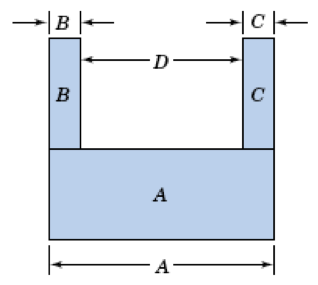
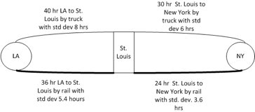

# Monte Carlo Methods {#mcm}

**[Learning Objectives]{.smallcaps}**

- To be able to collect statistics using classes within the KSL
-	To understand the basics of statistical computations supported by the KSL
- To be able to perform simple Monte Carlo simulation experiments using the KSL
- To review statistical concepts and apply them to the analysis of simple Monte Carlo simulation experiments
-	To illustrate generating and collecting statistics for Monte Carlo simulation experiments

This chapter illustrates how to use the KSL for simple Monte-Carlo
simulation experiments. The term Monte Carlo generally refers to the set of methods
and techniques that estimate quantities by repeatedly sampling from
models/equations represented in a computer. As such, this terminology is
somewhat synonymous with computer simulation itself. The term Monte
Carlo gets its origin from the Monte Carlo casino in the Principality of
Monaco, where gambling and games of chance are well known. There is no
one Monte Carlo method. Rather there is a collection of algorithms and
techniques. In fact, the ideas of random number generation and random
variate generation previously discussed form the foundation of Monte
Carlo methods.

For the purposes of this chapter, we limit the term Monte Carlo methods
to those techniques for generating and estimating the expected values of
random variables, especially in regards to static simulation. In static
simulation, the notion of time is relatively straightforward with
respect to system dynamics. For a static simulation, time 'ticks' in a
regular pattern and at each 'tick' the state of the system changes (new
observations are produced). 

A key requirement in performing a Monte Carlo simulation is the ability to collect and report statistics on observations generated by the simulation.  The KSL supports the collection of statistics within the `ksl.utilities.statistics` package.  Before proceeding with examples illustrating Monte Carlo methods, the following section overviews some of the statistical and reporting capabilities of the KSL.

## Collecting Statistics {#kslStatistics}

The KSL has a wide variety of classes that support statistic computations.  A main theme in understanding the usage of the classes within the `ksl.utilities.statistics` package is the concept of collection.  This concept is encapsulated within the interface, `CollectorIfc` interface.  The methods of the `CollectorIfc` interface are illustrated in Figure \@ref(fig:CollectorIfc).

<div class="figure">

<p class="caption">(\#fig:CollectorIfc)CollectorIfc Interface</p>
</div>

Something is a collector, if it implements the `CollectorIfc` interface. The implication is that those values presented to the various `collect` methods will be observed and tabulated into various quantities based on the presented values. The `collect` method has been overloaded to facilitate collection of double values, arrays of double values, and boolean values.  A collector can be reset. Resetting a collector should set the state of the collector as if no values had been observed.  Thus, resetting a collector should clear all previous collection results. The collector may or may not store any of the observations related to the collection process.  By default, the standard approach taken is not to store the observations, but rather to summarize the observations in some manner.  To facilitate the further use of the observed values, the base class, `Collector` is observable and will also emit observed values.  Thus, other classes can be connected to a base observation process.

Figure \@ref(fig:Statistics) presents the major classes and interfaces within the statistics package. The `CollectIfc` interface is implemented within the abstract base class `Collector`, which serves as the basis for various concrete implementations of statistical collectors. There are two major kinds of statistics, one of which assumes that the values presented must be weighted, the `WeightedStatisticIfc` interface and the `WeightedStatistic` class. The other branch of classes, derived from `AbstractStatistic` do not necessarily have to be weighted. The main classes to be discussed in this chapter are `Statistic` and `Histogram`.

<div class="figure">

<p class="caption">(\#fig:Statistics)Major Classes and Interfaces in the Statistics Package</p>
</div>

### Creating and Using a Statistic

The `Statistic` class has a great deal of functionality.  It accumulates summary statistics on the values presented to it via its `collect` methods. Recall also that since the `Statistic` class implements the `CollectorIfc` interface, you can use the `reset()` method to clear all accumulated statistics and reuse the `Statistic` instance.  The major statistical quantities are found in the `StatisticIfc` interface.

<div class="figure" style="text-align: center">

<p class="caption">(\#fig:StatisticIfc)Major Accumulated Statistical Quantities</p>
</div>
As can be seen in Figure \@ref(fig:StatisticIfc), the `Statistic` class not only computes the standard statistical quantities such as the count, average, and variance, it also has functionality to compute confidence intervals, skewness, kurtosis, the minimum, the maximum, and lag 1 covariance and correlation. The computed confidence intervals are based on the assumption that the observed data are normally distributed or that the sample size is large enough to justify using the central limit theorem to assume that the sampling distribution is normal. Thus, we can assume that the confidence intervals are approximate.  The summary statistics are computed via efficient one pass algorithms that do not require any observed data to be stored.  The algorithms are designed to minimize issues related to numerical precision within the calculated results.  The `toString()` method of the `Statistic` class has been overridden to contain all of the computed values.  Let's illustrate the usage of the `Statistic` class with some code. In this code, first we create a normal random variable to be able to generate some data. Then, two statistics are created. The first statistic directly collects the generated values. The second statistic is designed to collect $P(X\geq 20.0)$ by observing whether the generated value meets this criteria as defined by the boolean expression `x >= 20.0`.

```kt
fun main() {
    // create a normal mean = 20.0, variance = 4.0 random variable
    val n = NormalRV(20.0, 4.0)
    // create a Statistic to observe the values
    val stat = Statistic("Normal Stats")
    val pGT20 = Statistic("P(X>=20")
    // generate 100 values
    for (i in 1..100) {
        // getValue() method returns generated values
        val x = n.value
        stat.collect(x)
        pGT20.collect(x >= 20.0)
    }
    println(stat)
    println(pGT20)
    val reporter = StatisticReporter(mutableListOf(stat, pGT20))
    println(reporter.halfWidthSummaryReport())
}
```
The results for the statistics collected directly on the observations from the `toString()` method are as follows. 

```
ID 1
Name Normal Stats
Number 100.0
Average 20.370190128861807
Standard Deviation 2.111292233346322
Standard Error 0.2111292233346322
Half-width 0.4189261806189412
Confidence Level 0.95
Confidence Interval [19.951263948242865, 20.78911630948075]
Minimum 15.020744984423821
Maximum 25.33588436770212
Sum 2037.0190128861807
Variance 4.457554894588499
Weighted Average 20.370190128861797
Weighted Sum 2037.0190128861796
Sum of Weights 100.0
Weighted Sum of Squares 41935.76252316213
Deviation Sum of Squares 441.2979345642614
Last value collected 21.110736402119805
Last weighted collected 1.0
Kurtosis -0.534855387072145
Skewness 0.20030433873223502
Lag 1 Covariance -0.973414579833684
Lag 1 Correlation -0.22057990840016864
Von Neumann Lag 1 Test Statistic -2.2136062395518343
Number of missing observations 0.0
Lead-Digit Rule(1) -1
```
Of course, this is probably more output than what you need, but you can use the properties and methods illustrated in Figure \@ref(fig:StatisticIfc) to access specific desired quantities. Notice that in the code example that the $P(X \geq 20.0)$ is also collected. This is done by using the boolean expression `x >= 20.0` within the `collect()` method. This expression evaluates to either true or false. The true values are presented as 1.0 and the false values as 0.0. Thus, this expression acts as an indicator variable and facilitates the estimation of probabilities. The results from the statistics can be pretty printed by using the `StatisticReporter` class, which takes a list of objects that implement the `StatisticIfc` interface and facilitates the writing and printing of various statistical summary reports.

```kt
    val reporter = StatisticReporter(mutableListOf(stat, pGT20))
    println(reporter.halfWidthSummaryReport())
```

```
Half-Width Statistical Summary Report - Confidence Level (95.000)% 

Name                                     	        Count 	      Average 	   Half-Width 
---------------------------------------------------------------------------------------------------- 
Normal Stats                             	          100 	      20.3702 	       0.4189 
P(X>=20                                  	          100 	       0.5100 	       0.0997 
---------------------------------------------------------------------------------------------------- 
```

The `KSLArrays` object has a number of very useful methods that work on arrays and compute various statistical quantities.

* `indexOfMin(x: DoubleArray): Int` - returns the index of the element that is smallest. If there are ties, the first found is returned.
* `min(x: DoubleArray) : Double` - returns the element that is smallest. If there are ties, the first found is returned.
* `indexOfMax(x: DoubleArray) : Int` - returns the index of the element that is largest If there are ties, the first found is returned.
* `max(x: DoubleArray) : Double` - returns the element that is largest. If there are ties, the first found is returned.
* `countLessEqualTo(data: DoubleArray, x: Double) : Int` - returns the count of the elements that are less than or equal to $x$
* `countLessThan(data: DoubleArray, x: Double) : Int`  - returns the count of the elements that are less than $x$
* `countGreaterEqualTo(data: DoubleArray, x: Double) : Int`  - returns the count of the elements that are greater than or equal to $x$
* `countGreaterThan(data: DoubleArray, x: Double) : Int` - returns the count of the elements that are greater than $x$
* `orderStatistics(data: DoubleArray) : DoubleArray` - returns a sorted copy of the supplied array ordered from smallest to largest

These functions have also been implemented as extension functions of the `DoubleArray` class. The `Statistic` class's companion object also implements a few useful statistical summary functions.

* `estimateSampleSize(desiredHW: Double, stdDev: Double, level: Double) : Long` - returns the approximate sample size necessary to reach the desired half-width at the specified confidence level given the estimate of the sample standard deviation.
* `median(data: DoubleArray) : Double` - the statistical median of the supplied array
* `percentile(data: DoubleArray, p: Double) : Double` - the $p^{th}$ percentile of the data
* `quantile(data: DoubleArray, q: Double) : Double` - the $q^{th}$ percentile of the data based on definition 7 of quantiles as per the R definitions.

As one can see, there is much functionality available for the collection and reporting of summary statistics. In the next section, we present an overview of distribution summaries involving histograms and frequencies.

### Histograms and Frequencies

A histogram tabulates counts and frequencies of observed data over a set of contiguous intervals.  Let $b_{0}, b_{1}, \cdots, b_{k}$ be the breakpoints (end points) of the class intervals such that $\left(b_{0}, b_{1} \right], \left(b_{1}, b_{2} \right], \cdots, \left(b_{k-1}, b_{k} \right]$ form $k$ disjoint and adjacent intervals.  The intervals do not have to be of equal width.  Also, $b_{0}$ can be equal to $-\infty$ resulting in interval $\left(-\infty, b_{1} \right]$ and $b_{k}$ can be equal to $+\infty$ resulting in interval $\left(b_{k-1}, +\infty \right)$. Define $\Delta b_j = b_{j} - b_{j-1}$ and if all the intervals have the same width (except perhaps for the end intervals), $\Delta b = \Delta b_j$. To count the number of observations that fall in each interval, we can use the count function:
$$
c(\vec{x}\leq b) = \#\lbrace x_i \leq b \rbrace \; i=1,\ldots,n
$$
$c(\vec{x}\leq b)$ counts the number of observations less than or equal to $x$. Let $c_{j}$ be the observed count of the $x$ values contained in the $j^{th}$ interval $\left(b_{j-1}, b_{j} \right]$. Then, we can determine $c_{j}$ via the following equation:
$$
c_{j} = c(\vec{x}\leq b_{j}) - c(\vec{x}\leq b_{j-1})
$$ 
The key parameters of a histogram are the break points associated with the bins.  Since knowledge of the data is often necessary to specify good break points, the `Histogram` class's companion object provides a number of methods for creating break points and recommending break points based on sample data. For example, the function, `createBreakPoints` which has input parameters:

* The first bin lower limit ($b_{0}$):  This is the starting point of the range over which the data will be tabulated.
* The number of bins ($k$))
* The width of the bins, ($\Delta b$)

<div class="figure" style="text-align: center">

<p class="caption">(\#fig:Histogram)Histogram Class</p>
</div>
Figure \@ref(fig:Histogram) presents the methods of the `Histogram` class.  The `Histogram` class is utilized in a very similar manner as the `Statistic` class by collecting observations.  The observations are then tabulated into the bins. The `Histogram` class allows the user to tabulate the bin contents via the collect() methods inherited from the `AbstractStatistic` base class.  Since data may fall below the first bin and after the last bin, the implementation also provides counts for those occurrences.  Since a `Histogram` is a sub-class of `AbstractStatistic`, it also implements the `StatisticIfc` to provide summary statistics on the data tabulated within the bins.  

In some cases, the client may not know in advance the appropriate settings for the number of bins or the width of the bins.  In this situation, one can use the `recommendBreakPoints` function, which uses an array of data or statistics computed on the data. The  function `recommendBreakPoints` computes a reasonable lower limit, number of bins, and bin width based on the statistics.

```kt
fun main() {
    val d = ExponentialRV(2.0)
    val points = Histogram.createBreakPoints(0.0, 10, 0.25)
    val h1: HistogramIfc = Histogram(points)
    val h2: HistogramIfc = Histogram(Histogram.addPositiveInfinity(points))
    for (i in 1..100) {
        val x = d.value
        h1.collect(x)
        h2.collect(x)
    }
    println(h1)
    println(h2)
}
```

```
Histogram: ID_2
-------------------------------------
Number of bins = 10
First bin starts at = 0.0
Last bin ends at = 2.5
Under flow count = 0.0
Over flow count = 34.0
Total bin count = 66.0
Total count = 100.0
-------------------------------------
Bin Range        Count CumTot Frac  CumFrac
  1 [ 0.00, 0.25)  = 8   8.0 0.121212 0.121212 
  2 [ 0.25, 0.50)  = 13  21.0 0.196970 0.318182 
  3 [ 0.50, 0.75)  = 8  29.0 0.121212 0.439394 
  4 [ 0.75, 1.00)  = 5  34.0 0.075758 0.515152 
  5 [ 1.00, 1.25)  = 12  46.0 0.181818 0.696970 
  6 [ 1.25, 1.50)  = 6  52.0 0.090909 0.787879 
  7 [ 1.50, 1.75)  = 3  55.0 0.045455 0.833333 
  8 [ 1.75, 2.00)  = 0  55.0 0.000000 0.833333 
  9 [ 2.00, 2.25)  = 7  62.0 0.106061 0.939394 
 10 [ 2.25, 2.50)  = 4  66.0 0.060606 1.000000 
-------------------------------------
Statistics on data collected within bins:
-------------------------------------
ID 3
Name null Histogram
Number 66.0
Average 1.0058762823520362
Standard Deviation 0.6886823403539779
Standard Error 0.08477093608530742
Half-width 0.16929924794988463
Confidence Level 0.95
Confidence Interval [0.8365770344021516, 1.175175530301921]
Minimum 0.012828760487111502
Maximum 2.480434062337268
Sum 66.38783463523438
Variance 0.4742833659154323
Deviation Sum of Squares 30.8284187845031
Last value collected 2.480434062337268
Kurtosis -0.7044116167697082
Skewness 0.5979629072383154
Lag 1 Covariance -0.03136122210241002
Lag 1 Correlation -0.0671406689142141
Von Neumann Lag 1 Test Statistic -0.18534912180084587
Number of missing observations 0.0
Lead-Digit Rule(1) -2
-------------------------------------

Histogram: ID_4
-------------------------------------
Number of bins = 11
First bin starts at = 0.0
Last bin ends at = Infinity
Under flow count = 0.0
Over flow count = 0.0
Total bin count = 100.0
Total count = 100.0
-------------------------------------
Bin Range        Count CumTot Frac  CumFrac
  1 [ 0.00, 0.25)  = 8   8.0 0.080000 0.080000 
  2 [ 0.25, 0.50)  = 13  21.0 0.130000 0.210000 
  3 [ 0.50, 0.75)  = 8  29.0 0.080000 0.290000 
  4 [ 0.75, 1.00)  = 5  34.0 0.050000 0.340000 
  5 [ 1.00, 1.25)  = 12  46.0 0.120000 0.460000 
  6 [ 1.25, 1.50)  = 6  52.0 0.060000 0.520000 
  7 [ 1.50, 1.75)  = 3  55.0 0.030000 0.550000 
  8 [ 1.75, 2.00)  = 0  55.0 0.000000 0.550000 
  9 [ 2.00, 2.25)  = 7  62.0 0.070000 0.620000 
 10 [ 2.25, 2.50)  = 4  66.0 0.040000 0.660000 
 11 [ 2.50,Infinity)  = 34 100.0 0.340000 1.000000 
-------------------------------------
Statistics on data collected within bins:
-------------------------------------
ID 5
Name null Histogram
Number 100.0
Average 2.439434453415103
Standard Deviation 2.4182170804760847
Standard Error 0.24182170804760847
Half-width 0.47982672859345404
Confidence Level 0.95
Confidence Interval [1.959607724821649, 2.919261182008557]
Minimum 0.012828760487111502
Maximum 11.13717343776699
Sum 243.9434453415103
Variance 5.847773848306279
Deviation Sum of Squares 578.9296109823216
Last value collected 2.480434062337268
Kurtosis 1.3785489085086087
Skewness 1.3838241648793819
Lag 1 Covariance -0.5597308485816501
Lag 1 Correlation -0.0966837484149247
Von Neumann Lag 1 Test Statistic -0.976342966871885
Number of missing observations 0.0
Lead-Digit Rule(1) -1
-------------------------------------
```
The KSL will also tabulate count frequencies when the values are only integers.  This is accomplished with the `IntegerFrequency` class. Figure \@ref(fig:Frequency) indicates the methods of the `IntegerFrequency` class. The object can return information on the counts and proportions.  It can even create a `DEmpiricalCDF` distribution based on the observed data.

<div class="figure">

<p class="caption">(\#fig:Frequency)IntegerFrequence Class</p>
</div>

In the following code example, an instance of the `IntegerFrequency` class is created. Then, an instance of a binomial random variable is used to generate a sample of 10,000 observations.  The sample is then collected by the `IntegerFrequency` class's `collect()` method. 

```kt
fun main() {
    val f = IntegerFrequency("Frequency Demo")
    val bn = BinomialRV(0.5, 100)
    val sample = bn.sample(10000)
    f.collect(sample)
    println(f)
}
```
As can be noted in the output, only those integers that are actually observed are tabulated in terms of the count of the number of times the integer is observed and its proportion. The user does not have to specify the range of possible integers; however, instances of `IntegerFrequency` can be created that specify a lower and upper limit on the tabulated values.  The overflow and underflow counts then tabulate when observations fall outside of the specified range.

```
Frequency Tabulation Frequency Demo
----------------------------------------
Number of cells = 39
Lower limit = -2147483648
Upper limit = 2147483647
Under flow count = 0
Over flow count = 0
Total count = 10000
----------------------------------------
Value 	 Count 	 Proportion
31 	 1 	 1.0E-4
33 	 4 	 4.0E-4
34 	 5 	 5.0E-4
35 	 9 	 9.0E-4
36 	 17 	 0.0017
37 	 28 	 0.0028
38 	 41 	 0.0041
39 	 74 	 0.0074
40 	 100 	 0.01
41 	 192 	 0.0192
42 	 236 	 0.0236
43 	 277 	 0.0277
44 	 406 	 0.0406
45 	 453 	 0.0453
46 	 564 	 0.0564
47 	 653 	 0.0653
48 	 741 	 0.0741
49 	 762 	 0.0762
50 	 750 	 0.075
51 	 768 	 0.0768
52 	 783 	 0.0783
53 	 679 	 0.0679
54 	 600 	 0.06
55 	 484 	 0.0484
56 	 407 	 0.0407
57 	 324 	 0.0324
58 	 210 	 0.021
59 	 155 	 0.0155
60 	 108 	 0.0108
61 	 74 	 0.0074
62 	 41 	 0.0041
63 	 15 	 0.0015
64 	 15 	 0.0015
65 	 17 	 0.0017
66 	 3 	 3.0E-4
67 	 1 	 1.0E-4
69 	 1 	 1.0E-4
70 	 1 	 1.0E-4
71 	 1 	 1.0E-4
----------------------------------------
```
Finally, the KSL provides the ability to define labeled states and to tabulate frequencies and proportions related to the visitation and transition between the states.  This functionality is available in the `StateFrequency` class. The following code example creates an instance of `StateFrequency` by providing the number of states. The states are returned in a `List` and then 10,000 states are randomly selected from the list with equal probability using the `KSLRandom` functionality to randomly select from lists. The randomly selected state is then observed via the `collect()` method.

```kt
fun main() {
    val sf = StateFrequency(6)
    val states = sf.states
    for (i in 1..10000) {
        val state = KSLRandom.randomlySelect(states)
        sf.collect(state)
    }
    println(sf)
}
```
The output is what you would expect based on selecting the states with equal probability. Notice that the `StateFrequency` class not only tabulates the visits to the states, similar to `IntegerFrequency`, it also counts and tabulates the transitions between states. These detailed tabulations are available via the various methods of the class. See the documentation for further details.
```
State Frequency Tabulation for: Identity#1
State Labels
State{id=1, number=0, name='State:0'}
State{id=2, number=1, name='State:1'}
State{id=3, number=2, name='State:2'}
State{id=4, number=3, name='State:3'}
State{id=5, number=4, name='State:4'}
State{id=6, number=5, name='State:5'}
State transition counts
[288, 272, 264, 282, 265, 286]
[283, 278, 283, 286, 296, 266]
[286, 298, 263, 264, 247, 282]
[271, 263, 275, 279, 280, 294]
[274, 305, 273, 281, 296, 268]
[254, 277, 282, 270, 313, 255]
State transition proportions
[0.17380808690404345, 0.16415208207604104, 0.15932407966203982, 0.17018708509354255, 0.15992757996378998, 0.17260108630054316]
[0.16725768321513002, 0.16430260047281323, 0.16725768321513002, 0.1690307328605201, 0.17494089834515367, 0.15721040189125296]
[0.174390243902439, 0.18170731707317073, 0.1603658536585366, 0.16097560975609757, 0.15060975609756097, 0.1719512195121951]
[0.16305655836341756, 0.1582430806257521, 0.1654632972322503, 0.16787003610108303, 0.1684717208182912, 0.17689530685920576]
[0.1614614024749558, 0.17972893341190335, 0.16087212728344136, 0.16558632881555688, 0.17442545668827342, 0.15792575132586917]
[0.15384615384615385, 0.16777710478497881, 0.17080557238037553, 0.16353725015142337, 0.18958207147183526, 0.15445184736523318]

Frequency Tabulation Identity#1
----------------------------------------
Number of cells = 6
Lower limit = 0
Upper limit = 5
Under flow count = 0
Over flow count = 0
Total count = 10000
----------------------------------------
Value 	 Count 	 Proportion
0 	 1657 	 0.1657
1 	 1693 	 0.1693
2 	 1640 	 0.164
3 	 1662 	 0.1662
4 	 1697 	 0.1697
5 	 1651 	 0.1651
----------------------------------------
```
## Batch Statistics {#ch3batchStats}

In simulation, we often collect data that is correlated.  That is, the data have a dependence structure.  This causes difficulty in developing valid confidence intervals for the estimators as well as invalidated a number of other statistical procedures that require independent observations.  Grouping the data into batches and computing the average of each batch is one methodology for mitigating the effect of dependence within the data on statistical inference procedures.  The idea is that the average associated with each batch will tend to be less dependent, especially the larger the batch size.  The method of batch means provides a mechanism for developing an estimator for $Var\lbrack \bar{X} \rbrack$.

The method of batch means is based on observations $(X_{1}, X_{2}, X_{3}, \dots, X_{n})$. The idea is to group the output into batches of size, $b$, such that the averages of the data within a batch are more nearly independent and possibly normally distributed.  

\begin{multline*}
\underbrace{X_1, X_2, \ldots, X_b}_{batch 1} \cdots 
\underbrace{X_{b+1}, X_{b+2}, \ldots, X_{2b}}_{batch 2} \cdots \\
\underbrace{X_{(j-1)b+1}, X_{(j-1)b+2}, \ldots, X_{jb}}_{batch j}  \cdots 
\underbrace{X_{(k-1)b+1}, X_{(k-1)b+2}, \ldots, X_{kb}}_{batch k}
\end{multline*}

Let $k$ be the number of batches each of size $b$, where, $b = \lfloor \frac{n}{k}\rfloor$.  Define the $j^{th}$ batch mean (average) as:

$$
\bar{X}_j(b) = \dfrac{1}{b} \sum_{i=1}^b X_{(j-1)b+i}
$$
Each of the batch means are treated like observations in the batch means series.  For example, if the batch means are re-labeled as $Y_j = \bar{X}_j(b)$, the batching process simply produces another series of data, ($Y_1, Y_2, Y_3, \ldots, Y_k$) which may be more like a random sample.  Why should they be more independent?  Typically, in auto-correlated processes the lag-k auto-correlations decay rapidly as $k$ increases.  Since, the batch means are formed from batches of size $b$, provided that $b$ is large enough the data within a batch is *conceptually* far from the data in other batches.  Thus, larger batch sizes are good for ensuring independence; however, as the batch size increases the number of batches decreases and thus variance of the estimator will increase.

To form a $(1 - \alpha)$\% confidence interval, we simply treat this new series like a random sample and compute approximate confidence intervals using the sample average and sample variance of the batch means series: 

$$
\bar{Y}(k) = \dfrac{1}{k} \sum_{j=1}^k Y_j
$$
The sample variance of the batch process is based on the $k$ batches:
$$
S_b^2 (k) = \dfrac{1}{k - 1} \sum_{j=1}^k (Y_j - \bar{Y}^2)
$$
Finally, if the batch process can be considered independent and identically distributed the $1-\alpha$ level confidence interval can be written as follows:
$$
\bar{Y}(k) \pm t_{\alpha/2, k-1} \dfrac{S_b (k)}{\sqrt{k}}
$$
The `BatchStatistic` class within the statistic package implements a basic batching process.  The `BatchStatistic` class works with data as it is presented to its collect method.  Since we do not know in advance how much data we have, the `BatchStatistic` class has rules about the minimum number of batches and the size of batches that can be formed.  Theory indicates that we do not need to have a large number of batches and that it is better to have a relatively small number of batches that are large in size.  

Three properties of the `BatchStatistic` class that are important are:

*	`minNumBatches` – This represents the minimum number of batches required.  The default value for this attribute is determined by `BatchStatistic`. `MIN_NUM_BATCHES`, which is set to 20.
*	`minBatchSize` – This represents the minimum size for forming initial batches.  The default value for this attribute is determined by `BatchStatistic`. `MIN_NUM_OBS_PER_BATCH`, which is set to 16.
*	`maxNumBatchesMultiple` – This represents a multiple of  minimum number of batches which is used to determine the upper limit (maximum) number of batches.  For example, if `maxNumBatchesMultiple = 2` and the `minNumBatches = 20`, then the maximum number of batches we can have is 40 (2*20).  The default value for this property is determined by `BatchStatistic`. `MAX_BATCH_MULTIPLE`, which is set to 2.

The `BatchStatistic` class uses instances of the `Statistic` class to do its calculations.  The bulk of the processing is done in two methods, `collect()` and `collectBatch().` The `collect()` method simply uses an instance of the `Statistic` class (`myStatistic`) to collect statistics.  When the amount of data collected (`myStatistic.count`) equals the current batch size (`currentBatchSize`) then the `collectBatch()` method is called to form a batch.  

```kt
    override fun collect(obs: Double) {
        super.collect(obs)
        myTotNumObs = myTotNumObs + 1.0
        myValue = obs
        myStatistic.collect(myValue)
        if (myStatistic.count == currentBatchSize.toDouble()) {
            collectBatch()
        }
    }
```

Referring to the collectBatch() method in the following code, the batches that are formed are recorded in an array called `bm.`  After recording the batch average, the statistic is reset for collecting the next batch of data.  The number of batches is recorded and if this has reached the maximum number of batches (as determined by the batch multiple calculation), we rebatch the batches back down to the minimum number of batches by combining adjacent batches according to the batch multiple.

```kt
    private fun collectBatch() {
        // increment the current number of batches
        numBatches = numBatches + 1
        // record the average of the batch
        bm[numBatches] = myStatistic.average
        // collect running statistics on the batches
        myBMStatistic.collect(bm[numBatches])
        // reset the within batch statistic for next batch
        myStatistic.reset()
        // if the number of batches has reached the maximum then rebatch down to
        // min number of batches
        if (numBatches == maxNumBatches) {
            numRebatches++
            currentBatchSize = currentBatchSize * minNumBatchesMultiple
            var j = 0 // within batch counter
            var k = 0 // batch counter
            myBMStatistic.reset() // clear for collection across new batches
            // loop through all the batches
            for (i in 1..numBatches) {
                myStatistic.collect(bm[i]) // collect across batches old batches
                j++
                if (j == minNumBatchesMultiple) { // have enough for a batch
                    //collect new batch average
                    myBMStatistic.collect(myStatistic.average)
                    k++ //count the batches
                    bm[k] = myStatistic.average // save the new batch average
                    myStatistic.reset() // reset for next batch
                    j = 0
                }
            }
            numBatches = k // k should be minNumBatches
            myStatistic.reset() //reset for use with new data
        }
    }
```
There are a variety of procedures that have been developed that will automatically batch the data as it is collected. The KSL has a batching algorithm based on the procedure implemented within the Arena simulation language. When a sufficient amount of data has been collected batches are formed.  As more data is collected, additional batches are formed until $k=40$  batches are collected.  When 40 batches are formed, the algorithm collapses the number of batches back to 20, by averaging each pair of batches.  This has the net effect of doubling the batch size.  This process is repeated as more data is collected, thereby ensuring that the number of batches is between 20 and 39. In addition, the procedure also computes the lag-1 correlation so that independence of the batches can be tested.

The `BatchStatistic` class also provides a public `reformBatches()` method to allow the user to rebatch the batches to a user supplied number of batches.  Since the `BatchStatistic` class implements the `StatisticalAccessorIfc` interface, it can return the sample average, sample variance, minimum, maximum, etc. of the batches.  Within the discrete-event modeling constructs of the KSL, batching can be turned on to collect batch statistics during a replication.  The use of these constructs will be discussed when the discrete-event modeling elements of the KSL are presented.

The following code illustrates how to create and use a `BatchStatistic`.

```kt
fun main() {
    val d = ExponentialRV(2.0)

    // number of observations
    val n = 1000

    // minimum number of batches permitted
    // there will not be less than this number of batches
    val minNumBatches = 40

    // minimum batch size permitted
    // the batch size can be no smaller than this amount
    val minBatchSize = 25

    // maximum number of batch multiple
    //  The multiple of the minimum number of batches
    //  that determines the maximum number of batches
    //  e.g. if the min. number of batches is 20
    //  and the max number batches multiple is 2,
    //  then we can have at most 40 batches
    val maxNBMultiple = 2

    // In this example, since 40*25 = 1000, the batch multiple does not matter
    val bm = BatchStatistic(minNumBatches, minBatchSize, maxNBMultiple)
    for (i in 1..n) {
        bm.collect(d.value)
    }
    println(bm)
    val bma = bm.batchMeans
    var i = 0
    for (x in bma) {
        println("bm($i) = $x")
        i++
    }

    // this re-batches the 40 down to 10
    val reformed = bm.reformBatches(10)
    println(Statistic(reformed))
}
```

The `ksl.utilities.statistic` package defines a lot of functionality.  Here is a summary of some of the useful classes and interfaces.

1. `CollectorIfc` defines a set of collect() methods for collecting data. The method is overridden to permit the collection of a wide variety of data type. The collect() method is designed to collect values and a weight associated with the value. This allows the collection of weighted statistics. `Collector` is an abstract base class for building concrete sub-classes.
2. `DoubleArraySaver` defines methods for saving observed data to arrays.
3. `WeightedStatisticIfc` defines statistics that are computed on weighted data values.
`WeightedStatistic` is a concrete implementation of the interface.
4. `AbstractStatistic` is an abstract base class for defining statistics. Sub-classes of `AbstractStatistic` compute summary statistics of some kind.
5. `Histogram` defines a class to collect statistics and tabulate data into bins.
6. `Statistic` is a concrete implementation of `AbstractStatistic` allowing for a multitude of
summary statistics.
7. `BatchStatistic` is also a concrete implementation of `AbstractStatistic` that provides for
summarizing data via a batching process.
8. `IntegerFrequency` tabulates integer values into a frequencies by observed values, similar to a histogram.
9. `StateFrequency` facilitates defining labeled states and tabulating visitation and transition statistics.
10. `StatisticXY` collects statistics on $(x,y)$ pairs computing statistics on the $x$ and $y$ values separately, as well as the covariance and correlation between the observations within a pair.

The most important class within the statistics package is probably the
`Statistic` class. This class summarizes the observed data into summary
statistics such as: minimum, maximum, average, variance, standard
deviation, lag-1 correlation, and count. In addition, confidence
intervals can be formed on the observations based on the student-t
distribution. Finally, there are useful companion object methods for computing
statistics on arrays and for estimating sample sizes. The reader is
encourage to review the KSL documentation for all of the functionality,
including the ability to write nicely printed statistical results.

In the remaining sections of this chapter, we will illustrate the collection of statistics on simple Monte Carlo models. This begins in the next section by estimating the area of a simple one-dimensional function.

## Simple Monte Carlo Integration {#ssMC}

In this example, we illustrate one of the fundamental uses of Monte
Carlo methods: estimating the area of a function. Suppose we have some
function, $g(x)$, defined over the range $a \leq x \leq b$ and we want
to evaluate the integral:

$$ \theta = \int\limits_{a}^{b} g(x) \mathrm{d}x$$

Monte Carlo methods allow us to evaluate this integral by couching the
problem as an estimation problem. It turns out that the problem can be
translated into estimating the expected value of a well-chosen random
variable. While a number of different choices for the random variable
exist, we will pick one of the simplest for illustrative purposes.
Define $Y$ as follows with $X \sim U(a,b)$:

\begin{equation}
Y = \left(b-a\right)g(X)
(\#eq:ch3Y)
\end{equation}

Notice that $Y$ is defined in terms of $g(X)$, which is also a random
variable. Because a function of a random variable is also a random
variable, this makes $Y$ a random variable . Thus, the expectation of
$Y$ can be computed as follows:

\begin{equation}
E\lbrack Y \rbrack = \left(b-a\right)E\lbrack g(X)\rbrack
(\#eq:mcEY)
\end{equation}

Now, let us derive,$E\lbrack g(X) \rbrack$. By definition,

$$ E_{X}\lbrack g(x) \rbrack = \int\limits_{a}^{b} g(x)f_{X}(x)\mathrm{d}x$$

And, the probability density function for a $X \sim U(a,b)$ random
variable is:

$$f_{X}(x) =
\begin{cases}
\frac{1}{b-a} & a \leq x \leq b\\
0   & \text{otherwise}
\end{cases}$$\
Therefore,

\begin{equation}
E_{X}\lbrack g(x) \rbrack  = \int\limits_{a}^{b} g(x)f_{X}(x)\mathrm{d}x = \int\limits_{a}^{b} g(x)\frac{1}{b-a}\mathrm{d}x
\end{equation}

Substituting into Equation \@ref(eq:mcEY), yields,

$$\begin{aligned}
E\lbrack Y \rbrack & = E\lbrack \left(b-a\right)g(X) \rbrack = \left(b-a\right)E\lbrack g(X) \rbrack\\
      & =  \left(b-a\right)\int\limits_{a}^{b} g(x)\frac{1}{b-a}\mathrm{d}x \\
      & = \int\limits_{a}^{b} g(x)\mathrm{d}x = \theta\end{aligned}$$

Therefore, by estimating the expected value of $Y$, we can estimate the
desired integral. From basic statistics, we know that a good estimator
for $E\lbrack Y \rbrack$ is the sample average of observations of $Y$. Let $Y_{1}, Y_{2},...Y_{n}$ be a
random sample of observations of $Y$. Let $X_{i}$ be the $i^{th}$
observation of $X$. Substituting each $X_{i}$ into
Equation \@ref(eq:ch3Y) yields the $i^{th}$ observation of $Y$,

$$Y_{i} = \left(b-a\right)g(X_{i})$$

Then, the sample average of is:

$$\begin{aligned}
\bar{Y}(n) & = \frac{1}{n}\sum\limits_{i=1}^{n} Y_{i} = \left(b-a\right)\frac{1}{n}\sum\limits_{i=1}^{n}\left(b-a\right)g(X_{i})\\
  & = \left(b-a\right)\frac{1}{n}\sum\limits_{i=1}^{n}g(X_{i})\\\end{aligned}$$

where $X_{i} \sim U(a,b)$. Thus, by simply generating
$X_{i} \sim U(a,b)$, plugging the $X_{i}$ into the function of interest,
$g(x)$, taking the average over the values and multiplying by
$\left(b-a\right)$, we can estimate the integral. This works for any
integral and it works for multi-dimensional integrals. While this
discussion is based on a single valued function, the theory scales to
multi-dimensional integration through the use of multi-variate
distributions. 

Suppose that we want to estimate
the area under $f(x) = x^{\frac{1}{2}}$ over the range from $1$ to $4$. That is, we want to evaluate the integral:

$$\theta = \int\limits_{1}^{4} x^{\frac{1}{2}}\mathrm{d}x = \dfrac{14}{3}=4.6\bar{6}$$

According to the previously presented theory, we need to generate
$X_i \sim U(1,4)$ and then compute $\bar{Y}$, where
$Y_i = (4-1)\sqrt{X{_i}}= 3\sqrt{X{_i}}$.  In addition, for this simple example,
we can easily check if our Monte Carlo approach is working because we
know the true area.

```kt
fun main() {
    val a = 1.0
    val b = 4.0
    val ucdf = UniformRV(a, b)
    val stat = Statistic("Area Estimator")
    val n = 100 // sample size
    for (i in 1..n) {
        val x = ucdf.value
        val gx = Math.sqrt(x)
        val y = (b - a) * gx
        stat.collect(y)
    }
    System.out.printf("True Area = %10.3f %n", 14.0 / 3.0)
    System.out.printf("Area estimate = %10.3f %n", stat.average)
    println("Confidence Interval")
    println(stat.confidenceInterval)
}
```

```
True Area =      4.667
Area estimate =      4.781
Confidence Interval
[4.608646560421988, 4.952515649272401]
```
Because confidence intervals may form the basis for decision making, you
can use the confidence interval half-width in determining the sample
size. A review of these and other statistical concepts will be the focus of the next section.

## Review of Statistical Concepts {#ch3StatReview}

The simulation models that have been illustrated have
estimated the quantity of interest with a point estimate (i.e.
$\bar{X}$). For example, in the previous section, we can easily compute the true area under the curve as $4.6\bar{6}$; however, the point estimate returned by the simulation was a value of 4.781, based on 100 samples. Thus, there is
sampling error in our estimate. The key question examined in this
section is how to control the sampling error in a simulation experiment.
The approach that we will take is to determine the number of samples so
that we can have high confidence in our point estimate. In order to
address these issues, we need to review some basic statistical concepts in order to understand the meaning of sampling error.

### Point Estimates and Confidence Intervals

Let $x_{i}$ represent the $i^{th}$ observations in a sample, $x_{1}, x_{2},...x_{n}$ of size $n$. Represent the random variables in the sample as $X_{1}, X_{2},...X_{n}$. The
random variables form a random sample, if 1) the $X_{i}$ are independent
random variables and 2) every $X_{i}$ has the same probability
distribution. Let's assume that these two assumptions have been
established. Denote the unknown cumulative distribution function of $X$
as $F(x)$ and define the unknown expected value and variance of $X$ with
$E[X] = \mu$ and $Var[X] = \sigma^2$, respectively.

A statistic is any function of the random variables in a sample. Any
statistic that is used to estimate an unknown quantity based on the
sample is called an estimator. What would be a good estimator for the
quantity $E[X] = \mu$? Without going into the details of the meaning of
statistical goodness, one should remember that the sample average is
generally a good estimator for $E[X] = \mu$. Define the sample average
as follows: 

\begin{equation}
\bar{X} = \frac{1}{n}\sum_{i=1}^{n}X_i
  (\#eq:sampleAvg)
\end{equation}

Notice that $\bar{X}$ is a function of the
random variables in the sample and therefore it is also a random
variable. This makes $\bar{X}$ a statistic, since it is a function of the
random variables in the sample.

Any random variable has a corresponding probability distribution. The
probability distribution associated with a statistic is called its
sampling distribution. The sampling distribution of a statistic can be
used to form a confidence interval on the point estimate associated with
the statistic. The point estimate is simply the value obtained from the
statistic once the data has been realized. The point estimate for the
sample average is computed from the sample:

$$\bar{x} = \frac{1}{n}\sum_{i=1}^{n}x_i$$ 

A confidence interval expresses a degree of certainty associated with a
point estimate. A specific confidence interval does not imply that the
parameter $\mu$ is inside the interval. In fact, the true parameter is
either in the interval or it is not within the interval. Instead you
should think about the confidence level $1-\alpha$ as an assurance about
the procedure used to compute the interval. That is, a confidence
interval procedure ensures that if a large number of confidence
intervals are computed each based on $n$ samples, then the proportion of
the confidence intervals that actually contain the true value of $\mu$
should be close to $1-\alpha$. The value $\alpha$ represents risk that
the confidence interval procedure will produce a specific interval that
does not contain the true parameter value. Any one particular confidence
interval will either contain the true parameter of interest or it will
not. Since you do not know the true value, you can use the confidence
interval to assess the risk of making a bad decision based on the point
estimate. You can be confident in your decision making or conversely
know that you are taking a risk of $\alpha$ of making a bad decision.
Think of $\alpha$ as the risk that using the confidence interval
procedure will get you fired. If we know the sampling distribution of
the statistic, then we can form a confidence interval procedure.

Under the assumption that the sample size is large enough such that the
distribution of $\bar{X}$ is normally distributed then you can form an
approximate confidence interval on the point estimate, $\bar{x}$.
Assuming that the sample variance:

\begin{equation}
S^{2}(n) = \frac{1}{n-1}\sum_{i=1}^{n}(X_i-\bar{X})^2
  (\#eq:sampleVar)
\end{equation}

is a good estimator for $Var[X] = \sigma^2$, then a $(1-\alpha)100\%$
two-sided confidence interval estimate for $\mu$ is: 

\begin{equation}
\bar{x} \pm t_{1-(\alpha/2), n-1} \dfrac{s}{\sqrt{n}}
  (\#eq:ci)
\end{equation}

where $t_{p, \nu}$ is the $100p$ percentage
point of the Student t-distribution with $\nu$ degrees of freedom. The spreadsheet 
function T.INV(p, degrees freedom) computes the *left-tailed*
Student-t distribution value for a given probability and degrees of
freedom. That is, $t_{p, \nu} = T.INV(p,\nu)$. The spreadsheet tab labeled *Student-t* in
the spreadsheet that accompanies this chapter illustrates functions related to the Student-t distribution. Thus, in order to compute $t_{1-(\alpha/2), n-1}$, use the following formula:

$$t_{1-(\alpha/2), n-1} = T.INV(1-(\alpha/2),n-1)$$
The T.INV.2T($\alpha$, $\nu$) spreadsheet function directly computes the *upper two-tailed* value.  That is,

$$
t_{1-(\alpha/2), n-1} =T.INV.2T(\alpha, n-1)
$$
Within the statistical package R, this computation is straight-forward by using the $t_{p, n} = qt(p,n)$ function.

$$
t_{p, n} = qt(p,n)
$$

```r
#'qt(0.975, 5)
qt(0.975,5)
```

```
## [1] 2.570582
```

```r
#' set alpha
alpha = 0.05
#'qt(1-(alpha/2, 5)
qt(1-(alpha/2),5)
```

```
## [1] 2.570582
```

Using the KSL, we can compute the quantile of the Student-T distribution via the following:

```kt
fun main(){
    val level = 0.95
    val dof = 5.0
    val alpha = 1.0 - level
    val p = 1.0 - alpha / 2.0
    val t: Double = StudentT.invCDF(dof, p)
    println("p = $p dof = $dof t-value = $t")
}
```

With results:

```
p = 0.975 dof = 5.0 t-value = 2.5705818445939186
```

### Sample Size Determination {#ch3SampleSize}

The confidence interval for a point estimator can serve as the basis for
determining how many observations to have in the sample. From Equation (\@ref(eq:ci)), the quantity:

\begin{equation}
h = t_{1-(\alpha/2), n-1} \dfrac{s}{\sqrt{n}}
  (\#eq:hw)
\end{equation}

is called the half-width of the confidence interval. You can place a
bound, $\epsilon$, on the half-width by picking a sample size that satisfies:

\begin{equation}
h = t_{1-(\alpha/2), n-1} \dfrac{s}{\sqrt{n}} \leq \epsilon
  (\#eq:hwBound)
\end{equation}

We call $\epsilon$ the margin of error for the bound.  Unfortunately, $t_{1-(\alpha/2), n-1}$ depends on $n$, and thus
Equation (\@ref(eq:hwBound)) is an iterative equation. That is, you must try different values of $n$ until the condition is satisfied. Within this text, we call this method for determining the sample size the *Student-T iterative method*.

Alternatively, the required sample size can be approximated using the
normal distribution. Solving Equation (\@ref(eq:hwBound)) for $n$ yields:

$$n \geq \left(\dfrac{t_{1-(\alpha/2), n-1} \; s}{\epsilon}\right)^2$$

As $n$ gets large, $t_{1-(\alpha/2), n-1}$ converges to the
$100(1-(\alpha/2))$ percentage point of the standard normal distribution
$z_{1-(\alpha/2)}$. This yields the following approximation:

\begin{equation}
n \geq \left(\dfrac{z_{1-(\alpha/2)} s}{\epsilon}\right)^2
  (\#eq:zSampleSize)
\end{equation}

Within this text, we refer to this method for determining the sample size as the *normal approximation* method. This approximation generally works well for large $n$, say $n > 50$. Both of these methods require an initial value for the standard deviation. This computation is implemented in the function, `estimateSampleSize` of the `Statisitic` class's companion object.

```kt
        /**
         * Estimate the sample size based on a normal approximation
         *
         * @param desiredHW the desired half-width (must be bigger than 0)
         * @param stdDev    the standard deviation (must be bigger than or equal to 0)
         * @param level     the confidence level (must be between 0 and 1)
         * @return the estimated sample size
         */
        fun estimateSampleSize(desiredHW: Double, stdDev: Double, level: Double): Long {
            require(desiredHW > 0.0) { "The desired half-width must be > 0" }
            require(stdDev >= 0.0) { "The desired std. dev. must be >= 0" }
            require(!(level <= 0.0 || level >= 1.0)) { "Confidence Level must be (0,1)" }
            val a = 1.0 - level
            val a2 = a / 2.0
            val z = Normal.stdNormalInvCDF(1.0 - a2)
            val m = z * stdDev / desiredHW * (z * stdDev / desiredHW)
            return (m + .5).roundToLong()
        }
```

In order to use either the *normal approximation* method or the *Student-T iterative* method, you must have an initial value for, $s$, the sample standard deviation. The simplest way to get an initial estimate of $s$ is to make a small initial pilot sample
(e.g. $n_0=5$). Given a value for $s$ you can then set a desired bound and
use the formulas. The bound is problem and performance measure dependent
and is under your subjective control. You must determine what bound is
reasonable for your given situation. One thing to remember is that the
bound is squared in the denominator for evaluating $n$. Thus, very small
values of $\epsilon$ can result in very large sample sizes.

***
::: {.example #ex2SampleSize}
Suppose we are required to estimate the output from a simulation so that we are 99% confidence that we are within $\pm 0.1$ of the true population
mean. After taking a pilot sample of size $n=10$, we have estimated $s=6$. What is the required sample size?
:::

***

We will use Equation (\@ref(eq:zSampleSize)) to determine the sample size requirement. For a 99% confidence interval, we have
$\alpha = 0.01$ and $\alpha/2 = 0.005$. Thus, $z_{1-0.005} = z_{0.995} = 2.576$. Because the margin of error, $\epsilon$ is $0.1$, we have that,

$$n \geq \left(\dfrac{z_{1-(\alpha/2)}\; s}{\epsilon}\right)^2 = \left(\dfrac{2.576 \times 6}{0.1}\right)^2 = 23888.8 \approx 23889$$

If the quantity of interest is a proportion, then a different method can
be used. In particular, a $100\times(1 - \alpha)\%$ large sample two sided 
confidence interval for a proportion, $p$, has the following form:

\begin{equation}
\hat{p} \pm z_{1-(\alpha/2)} \sqrt{\dfrac{\hat{p}(1 - \hat{p})}{n}}
  (\#eq:propCI)
\end{equation}

where $\hat{p}$ is the estimate for $p$. From this, you can determine
the sample size via the following equation:

\begin{equation}
n = \left(\dfrac{z_{1-(\alpha/2)}}{\epsilon}\right)^{2} \hat{p}(1 - \hat{p})
  (\#eq:pSampleSize)
\end{equation}

Again, a pilot run is necessary for obtaining an initial estimate of $\hat{p}$, for use in determining the sample size. If no pilot run is
available, then $\hat{p} =0.5$ is often assumed as a worse case approximation.

If you have more than one performance measure of interest, you can use
these sample size techniques for each of your performance measures and
then use the maximum sample size required across the performance
measures. Now, let's illustrate these methods based on a small Arena simulation.

### Determining the Sample Size for a Monte Carlo Simulation Experiment

To facilitate some of the calculations related to determining the sample size for a simulation experiment, I have constructed a spreadsheet called *SampleSizeDetermination.xlsx*, which is found in the book support files for this chapter. You may want to utilize that spreadsheet as you go through this an subsequent sections. 

Using a simple example, we will illustrate how to determine the sample size necessary to estimate a quantity of interest with a high level of confidence.

***
::: {.example #ex1SampleSize}
Suppose that we want to simulate a normally distributed random variable, $X$, with $E[X] = 10$ and $Var[X] = 16$.  From the simulation, we want to estimate the true population mean with 99 percent confidence for a half-width $\pm 0.50$ margin of error.  In addition to estimating the population mean, we want to estimate the probability that the random variable exceeds 8.  That is, we want to estimate, $p= P[X>8]$.  We want to be 95% confident that our estimate of $P[X>8]$ has a margin of error of $\pm 0.05$.  What are the sample size requirements needed to meet the desired margins of error?  
:::

***

Using simulation for this example is for illustrative purposes.  Naturally, we actually know the true population mean and we can easily compute the $p= P[X>8]$. for this situation. However, the example will illustrate sample size determination, which is an important planning requirement for simulation experiments.

Let $X$ represent the unknown random variable of interest. Then, we are
interested in estimating $E[X]=\mu$ and $p = P[X > 8]$. To estimate
these quantities, we generate a random sample, $(X_1,X_2,...,X_n)$. $E[X]$ can be
estimated using $\bar{X}$. To estimate a probability it is useful to define an indicator variable. An indicator variable has the value 1 if the condition associated with the probability is true and has the value 0 if it is false. To estimate $p$, define the following indicator
variable:

$$
Y_i = 
   \begin{cases}
     1 & X_i > 8\\
     0 & X_i \leq 8 \\
  \end{cases}
$$
This definition of the indicator variable $Y_i$ allows $\bar{Y}$ to be
used to estimate $p$. Recall the definition of the sample average
$\bar{Y}$. Since $Y_{i}$ is a $1$ only if $X_i > 8$, then the
$\sum \nolimits_{i=1}^{n} Y_{i}$ simply adds up the number of $1$'s in
the sample. Thus, $\sum\nolimits_{i=1}^{n} Y_{i}$ represents the count
of the number of times the event $X_i > 8$ occurred in the sample. Call
this $\#\lbrace X_i > 8\rbrace$. The ratio of the number of times an
event occurred to the total number of possible occurrences represents
the proportion. Thus, an estimator for $p$ is:

$$
\hat{p} = \bar{Y} = \frac{1}{n}\sum_{i=1}^{n}Y_i = \frac{\#\lbrace X_i  > 8\rbrace}{n}
$$
Therefore, computing the average of an indicator variable will estimate
the desired probability. The code for this situation is quite simple:

```kt
fun main() {
    val rv = NormalRV(10.0, 4.0)
    val estimateX = Statistic("Estimated X")
    val estOfProb = Statistic("Pr(X>8)")
    val r = StatisticReporter(mutableListOf(estOfProb, estimateX))
    val n = 20 // sample size
    for (i in 1..n) {
        val x = rv.value
        estimateX.collect(x)
        estOfProb.collect(x > 8)
    }
    println(r.halfWidthSummaryReport())
}
```
In the code, an instance of Statistic is used to observe values of the quantity $(x > 8)$.  This quantity is actually a logical condition which will evaluate to true (1) or false (0) given the value of $x$.  Thus, the Statistic will be recording observations of 1’s and 0’s.  Because the Statistic computes that average of the values that it “collects”, we will get an estimate of the probability.  Thus, the quantity, $(x > 8)$ is an indicator variable for the desired event.  Using a Statistic to estimate a probability in this manner is quite effective.  

Now, in more realistic simulation situations, we would not know the true population mean and variance.  Thus, in solving this problem, we will ignore that information.  To apply the previously discussed sample size determination methods, we need estimates of $\sigma = \sqrt{Var[X]}$  and $p = P[X>8]$.  In order to get estimates of these quantities, we need to run our simulation experiment; however, in order to run our simulation experiment, we need to know how many observations to make.  This is quite a catch-22 situation!  

To proceed, we need to run our simulation model for a pilot experiment.  From a small number of samples (called a pilot experiment, pilot run or pilot study), we will estimate $\sigma$ and $p = P[X>8]$ and then use those estimates to determine how many samples we need to meet the desired margins of error.  We will then re-run the simulation using the recommended sample size.

The natural question to ask is how big should your pilot sample be?  In general, this depends on how much it costs for you to collect the sample.  Within a simulation experiment context, generally, cost translates into how long your simulation model takes to execute.  For this small problem, the execution time is trivial, but for large and complex simulation models the execution time may be in hours or even days.  A general rule of thumb is between 10 and 30 observations. For this example, we will use an initial pilot sample size, $n_0 = 20$. 

Running the model for the 20 replications yields the following results.

Performance Measures    Average   95% Half-Width
--------------------    -------   -------------
  Pr(X>8)               0.70         0.22
  Estimated X           10.3224      2.24

Table: (\#tab:exResults) Simulation results for $n_0 = 20$ replications

Notice that the confidence interval for the true mean is $(8.0824,12.5624)$ with a half-width of $2.24$, which exceeds the desired margin of error, $\epsilon = 0.5$. Notice also that this particular confidence interval happens to contain the true mean $E[X] = 10$. To determine the sample size so that we get a half-width that is less than $\epsilon = 0.1$ with 99% confidence, we can use Equation \@ref(eq:zSampleSize). In order to do this, we must first have an estimate of the sample standard deviation, $s$.  Since Table \@ref(tab:exResults) reports a half-width for a 95% confidence interval, we need to use Equation \@ref(eq:hw) and solve for $s$ in terms of $h$. Rearranging Equation \@ref(eq:hw) yields,

\begin{equation} 
s = \dfrac{h\sqrt{n}}{t_{1-(\alpha/2), n-1}}
  (\#eq:sInTermsOfh)
\end{equation} 

Using the results from Table \@ref(tab:exResults) and $\alpha = 0.05$ in Equation \@ref(eq:sInTermsOfh) yields,

$$
s_0 = \dfrac{h\sqrt{n_0}}{t_{1-(\alpha/2), n_0-1}} = \dfrac{2.24\sqrt{20}}{t_{0.975, 19}}= \dfrac{2.24\sqrt{20}}{2.093}=4.7862
$$

Now, we can use Equation \@ref(eq:zSampleSize) to determine the sample size requirement. For a 99% confidence interval, we have
$\alpha = 0.01$ and $\alpha/2 = 0.005$. Thus, $z_{0.995} = 2.576$. Because the margin of error, $\epsilon$ is $0.5$, we have that,

$$n \geq \left(\dfrac{z_{1-(\alpha/2)}\; s}{\epsilon}\right)^2 = \left(\dfrac{2.576 \times 4.7862}{0.5}\right)^2 = 608.042 \approx 609$$
To determine the sample size for estimating $p=P[X>8]$ with 95% confidence to $\pm 0.1$, we can use Equation \@ref(eq:pSampleSize)

$$
n = \left(\dfrac{z_{1-(\alpha/2)}}{\epsilon}\right)^{2} \hat{p}(1 - \hat{p})=\left(\dfrac{z_{0.975}}{0.1}\right)^{2} (0.70)(1 - 0.70)=\left(\dfrac{1.96}{0.1}\right)^{2} (0.70)(0.30) = 80.67 \approx 81
$$
By using the maximum of $\max{(81, 609)=609}$, we can re-run the simulation this number of replications.  Doing so, yields,

Performance Measures    Average   95% Half-Width
--------------------    -------   -------------
   Pr(X>8)               0.69        0.04
   Estimated X           9.9032      0.32

Table: (\#tab:exResultsn609) Simulation Results for $n=609$ Replications

As can be seen in Table \@ref(tab:exResultsn609), the half-width values meet the desire margins of error. It may be possible that the margins of error might not be met. This suggests that more than $n = 609$ observations is needed to meet the margin of error criteria. Equation \@ref(eq:zSampleSize) and Equation \@ref(eq:pSampleSize) are only approximations and based on a pilot sample. Thus, if there was considerable sampling error associated
with the pilot sample, the approximations may be inadequate.

As can be noted from this example in order to apply the normal approximation method for determining the sample size based on the pilot run, we need to compute the initial sample standard deviation, $s_0$, from the initial reported half-width, $h$. This requires the use of Equation \@ref(eq:sInTermsOfh) to first compute the value of $s$ from $h$.  We can avoid this calculation by using the *half-width ratio* method for determining the sample size. 

Let $h_0$ be the initial value for the half-width from the pilot run of
$n_0$ replications. Then, rewriting Equation \@ref(eq:hw) in terms of the pilot data yields:

$$
h_0 = t_{1-(\alpha/2), n_0 - 1} \dfrac{s_0}{\sqrt{n_0}}
$$
Solving for $n_0$ yields:

\begin{equation} 
n_0 = t_{1-(\alpha/2), n_0 -1}^{2} \dfrac{s_{0}^{2}}{h_{0}^{2}}
  (\#eq:nNottsh)
\end{equation} 

Similarly for any $n$, we have:

\begin{equation} 
n = t_{1-(\alpha/2), n-1}^{2} \dfrac{s^{2}}{h^{2}}
  (\#eq:ntsh)
\end{equation} 

Taking the ratio of $n_0$ to $n$ (Equations \@ref(eq:nNottsh) and \@ref(eq:ntsh)) and assuming
that $t_{1-(\alpha/2), n-1}$ is approximately equal to
$t_{1-(\alpha/2), n_0 - 1}$ and $s^2$ is approximately equal to $s_0^2$,
yields,

$$n \cong n_0 \dfrac{h_0^2}{h^2} = n_0 \left(\frac{h_0}{h}\right)^2$$

This is the half-width ratio equation.

\begin{equation} 
n \geq n_0 \left(\frac{h_0}{h}\right)^2
  (\#eq:hwratio)
\end{equation} 

The issue that we face when applying Equation \@ref(eq:hwratio) is that Table \@ref(tab:exResults) only reports the 
95\% confidence interval half-width.  Thus, to apply Equation \@ref(eq:hwratio) the value of $h_0$ will be based on an $\alpha = 0.05$.  If the desired half-width, $h$, is required for a different confidence level, e.g. a 99\% confidence interval, then you must first translate $h_0$ to be based on the desired confidence level or set the confidence level for the StatisticalReporter to be 99\%. To compute the 95\% half-width from Table \@ref(tab:exResults), you can compute $s$ from Equation \@ref(eq:sInTermsOfh) and then recomputing the actual half-width, $h$, for the desired confidence level.   

Using the results from Table \@ref(tab:exResults) and $\alpha = 0.05$ in Equation \@ref(eq:sInTermsOfh) we already know that $s_0 = 4.7862$ for a 95\% confidence interval. Thus, for a 99\% confidence interval, where $\alpha = 0.01$ and $\alpha/2 = 0.005$, we have:

$$
h_0 = t_{1-(\alpha/2), n_0-1} \dfrac{s_0}{\sqrt{n_0}}= t_{0.995, 19}\dfrac{4.7862}{\sqrt{20}}=2.861\dfrac{4.7862}{\sqrt{20}}=3.0618
$$
Now, we can apply Equation \@ref(eq:hwratio) to this problem with the desire half-width bound $\epsilon = 0.5 = h$:

$$
n \geq n_0 \left(\frac{h_0}{h}\right)^2=20\left(\frac{3.0618}{h}\right)^2=20\left(\frac{3.0618}{0.5}\right)^2=749.98 \cong 750
$$
We see that for this pilot sample, the half-width ratio method recommends a substantially large sample size, $750$ versus $609$. In practice, the half-width ratio method tends to be conservative by recommending a larger sample size. We will see another example of these methods within the next section.

Based on these examples, you should have a basic understanding of how a
simulation experiment can be performed to meet a desired margin of error. In general, simulation models are much more interesting than this simple example. 

## Simulating the Game of Craps {#craps}

Consider the game of “craps” as played in Las Vegas.  The basic rules of the game are as follows:  one player, the “shooter”, rolls a pair of dice.  If the outcome of that roll is a 2, 3, or 12, the shooter immediately loses; if it is a 7 or an 11, the shooter wins.  In all other cases, the number the shooter rolls on the first toss becomes the “point”, which the shooter must try to duplicate on subsequent rolls.  If the shooter manages to roll the point before rolling a 7, the shooter wins; otherwise the shooter loses.  It may take several rolls to determine whether the shooter wins or loses.  After the first roll, only a 7 or the point have any significance until the win or loss is decided.  Using the KSL random and statistic packages give answers and corresponding estimates to the following questions. Be sure to report your estimates in the form of confidence intervals.

a)	Before the first roll of the dice, what is the probability the shooter will ultimately win?
b)	What is the expected number of rolls required to decide the win or loss?
 
The solution to this problem involves the use of the `Statistic` class to collect the probability that the shooter will win and for the expected number of rolls.  The following code illustrates the approach.  The `DUniformRV` class is used to represent the two dice.  Two statistics are created to estimate the probability of winning and to estimate the expected number of rolls required to decide a win or a loss.  A for loop is use to simulate 5000 games.  For each game, the logic of winning, losing or matching the first point.  When the game is ended the instances of `Statistic` are used to collect the outcomes.

```kt
fun main() {
    val d1 = DUniformRV(1, 6)
    val d2 = DUniformRV(1, 6)
    val probOfWinning = Statistic("Prob of winning")
    val numTosses = Statistic("Number of Toss Statistics")
    val numGames = 5000
    for (k in 1..numGames) {
        var winner = false
        val point = d1.value.toInt() + d2.value.toInt()
        var numberoftoss = 1
        if (point == 7 || point == 11) {
            // automatic winner
            winner = true
        } else if (point == 2 || point == 3 || point == 12) {
            // automatic loser
            winner = false
        } else { // now must roll to get point
            var continueRolling = true
            while (continueRolling) {
                // increment number of tosses
                numberoftoss++
                // make next roll
                val nextRoll = d1.value.toInt() + d2.value.toInt()
                if (nextRoll == point) {
                    // hit the point, stop rolling
                    winner = true
                    continueRolling = false
                } else if (nextRoll == 7) {
                    // crapped out, stop rolling
                    winner = false
                    continueRolling = false
                }
            }
        }
        probOfWinning.collect(winner)
        numTosses.collect(numberoftoss.toDouble())
    }
    val reporter = StatisticReporter()
    reporter.addStatistic(probOfWinning)
    reporter.addStatistic(numTosses)
    println(reporter.halfWidthSummaryReport())
}
```
As we can see from the results of the statistics reporter, the probability of winning is just a little less than 50 percent.

```
Half-Width Statistical Summary Report - Confidence Level (95.000)% 

Name                            Count 	      Average 	   Half-Width 
-------------------------------------------------------------------------------- 
Prob of winning                   5000 	       0.4960 	       0.0139 
Number of Toss Statistics         5000 	       3.4342 	       0.0856 
-------------------------------------------------------------------------------- 
```

Now let's look at a slightly more complex static simulation.

\FloatBarrier

## The News Vendor Problem

The news vendor model is a classic inventory model that allows for the
modeling of how much to order for a decision maker facing uncertain
demand for an upcoming period of time. It takes on the news vendor
moniker because of the context of selling newspapers at a newsstand. The
vendor must anticipate how many papers to have on hand at the beginning
of a day so as to not run short or have papers left over. This idea can
be generalized to other more interesting situations (e.g. air plane
seats). Discussion of the news vendor model is often presented in
elementary textbooks on inventory theory. The reader is referred to
[@Muckstadt2010aa] for a discussion of this model.

The basic model is considered a single period model; however, it can be
extended to consider an analysis covering multiple (or infinite) future
periods of demand. The representation of the costs within the modeling
offers a number of variations.

Let $D$ be a random variable representing the demand for the period. Let
$F(d)= P[D \leq d]$ be the cumulative distribution function for the
demand. Define $G(q,D)$ as the profit at the end of the period when $q$
units are ordered at the start of the period with $D$ units of demand.
The parameter $q$ is the decision variable associated with this model.
Depending on the value of $q$ chosen by the news vendor, a profit or
loss will occur.

There are two cases to consider $D \geq q$ or $D < q$. That is, when
demand is greater than or equal to the amount ordered at the start of
the period and when demand is less than the amount ordered at the start
of the period. If $D \geq q$ the news vendor runs out of items, and if
$D < q$ the news vendor will have items left over.

In order to develop a profit model for this situation, we need to define
some model parameters. In addition, we need to determine the amount that
we might be short and the amount we might have left over in order to
determine the revenue or loss associated with a choice of $q$. Let $c$
be the purchase cost. This is the cost that the news vendor pays the
supplier for the item. Let $s$ be the selling price. This is the amount
that the news vendor charges customers. Let $u$ be the salvage value
(i.e. the amount per unit that can be received for the item after the
planning period). For example, the salvage value can be the amount that
the news vendor gets when selling a left over paper to a recycling
center. We assume that selling price $>$ purchase cost $>$ salvage
value.

Consider the context of a news vendor planning for the day. What is the
possible amount sold? If $D$ is the demand for the day and we start with
$q$ items, then the most that can be sold is $\min(D, q)$. That is, if
$D$ is bigger than $q$, you can only sell $q$. If $D$ is smaller than
$q$, you can only sell $D$.

What is the possible amount left over (available for salvage)? If $D$ is
the demand and we start with $q$, then there are two cases: 1) demand is
less than the amount ordered ($D < q$) or 2) demand is greater than or
equal to the amount ordered ($D \geq q$). In case 1, we will have $q-D$
items left over. In case 2, we will have $0$ left over. Thus, the amount
left over at the end of the day is $\max(0, q-D)$. Since the news vendor
buys $q$ items for $c$, the cost of the items for the day is
$c \times q$. Thus, the profit has the following form:

\begin{equation}
G(D,q) = s \times \min(D, q) + u \times \max(0, q-D) - c \times q
(\#eq:ExpRev)
\end{equation}

In words, the profit is equal to the sales revenue plus the salvage
revenue minus the ordering cost. The sales revenue is the selling price
times the amount sold. The salvage revenue is the salvage value times
the amount left over. The ordering cost is the cost of the items times
the amount ordered. To find the optimal value of $q$, we should try to
maximize the expected profit. Since $D$ is a random variable, $G(D,q)$
is also a random variable. Taking the expected value of both sides of
Equation \@ref(eq:ExpRev), yields:

$$g(q) = E[G(D,q)] =  sE[\min(D, q)] + uE[\max(0, q-D)] - cq$$

Whether or not this equation can be optimized depends on the form of the
distribution of $D$; however, simulation can be used to estimate this
expected value for any given $q$. Let's look at an example.

***

::: {.example #BBQWing}
Sly's convenience store sells BBQ wings for 25 cents a piece. They cost 15
cents a piece to make. The BBQ wings that are not sold on a given day
are purchased by a local food pantry for 2 cents each. Assuming that Sly
decides to make 30 wings a day, what is the expected revenue for the
wings provided that the demand distribution is as show in
Table \@ref(tab:BBQWingDemand).

:::

***

::: {#tab:BBQWingDemand}
    $d_{i}$      5    10    40    45    50     55     60
  ------------ ----- ----- ----- ----- ----- ------ ------
   $f(d_{i})$   0.1   0.2   0.3   0.2   0.1   0.05   0.05
   $F(d_{i})$   0.1   0.3   0.6   0.8   0.9   0.95   1.0

  Table: (\#tab:BBQWingDemand) Distribution of BBQ wing demand
:::

The code for the news vendor
problem will require the generation of the demand from BBQ Wing demand distribution. In order to generate from this distribution, the DEmpirical class should be used. Since the cumulative distribution has already been computed, it
is straight forward to write the inputs for the DEmpirical class. 

```kt
fun main() {
    val q = 30.0 // order qty
    val s = 0.25 //sales price
    val c = 0.15 // unit cost
    val u = 0.02 //salvage value
    val values = doubleArrayOf(5.0, 10.0, 40.0, 45.0, 50.0, 55.0, 60.0)
    val cdf = doubleArrayOf(0.1, 0.3, 0.6, 0.8, 0.9, 0.95, 1.0)
    val dCDF = DEmpiricalRV(values, cdf)
    val stat = Statistic("Profit")
    val n = 100.0 // sample size
    var i = 1
    while (i <= n) {
        val d = dCDF.value
        val amtSold = minOf(d, q)
        val amtLeft = maxOf(0.0, q - d)
        val g = s * amtSold + u * amtLeft - c * q
        stat.collect(g)
        i++
    }
    System.out.printf("%s \t %f %n", "Count = ", stat.count)
    System.out.printf("%s \t %f %n", "Average = ", stat.average)
    System.out.printf("%s \t %f %n", "Std. Dev. = ", stat.standardDeviation)
    System.out.printf("%s \t %f %n", "Half-width = ", stat.halfWidth)
    println((stat.confidenceLevel * 100).toString() + "% CI = " + stat.confidenceInterval)
}
```
Running the model for 100 days results in the following output.

```
Count =  	 100.000000 
Average =  	 1.677500 
Std. Dev. =  	 2.201324 
Half-width =  	 0.436790 
95.0% CI = [1.2407095787617952, 2.1142904212382048]
```

## Monte-Carlo Experiments

Because running Monte-Carlo experiments is very common the KSL has provided some classes to support simple experimentation on Monte-Carlo problems within the `ksl.utilities.mcintegration` package. Figure \@ref(fig:MCExperimentIfc) illustrates the classes within the package.

<div class="figure">

<p class="caption">(\#fig:MCExperimentIfc)Classes in ksl.utilities.mcintegration</p>
</div>

A Monte-Carlo experiment is conceptualized as a two-step process: 1) an initial pilot sample, and 2) the sampling to meet the desired half-width criteria.  The initial pilot sample determines based on the equations of Section \@ref(ch3SampleSize) how many samples are needed to meet the criteria.  Then, the remaining samples are executed until a maximum number of samples is reached or the half-width criteria is met.

The sampling is performed in the form of micro and macro replications.  A micro replication observes the desired quantity for a pre-determined sample size.  Then, the micro replications are repeated for a pre-determined overall number of macro replications.  Let's use some notation to represent these concepts.

Let $r$ be the number of micro replications and let $n$ be the number of macro replications.  Let $Y_{ij}$ be the $i^{th}$ observation of the $r$ micro replications and let $j$ be the $j^{th}$ observation of the $n$ macro replications. Let $\bar{Y}_{\cdot j} = \frac{1}{r}\sum_{i=1}^{r}Y_{ij}$ be the sample average for the $j^{th}$ macro replication.  Let $k$ be the sample size of the initial set of macro replications.  Thus, they form a random sample of size $k$, as follows:

\begin{equation}
(\bar{Y}_{\cdot 1},\bar{Y}_{\cdot 2}, \dots, \bar{Y}_{\cdot k} )
\end{equation}

From this sample, the number of macro replications needed to meet the criteria is determined using Equation \@ref(eq:zSampleSize). The reason that this sample is formed from the $r$ micro replications is to help ensure that the observations $\bar{Y}_{\cdot j}$ are approximately normally distributed.  According to the Central Limit Theorem, sample averages tend to be normally distributed as the number of observations within the sample increase towards infinity.  

The simulation is performed in two loops: an outer loop called the macro replications and an inner loop called the micro replications. The user specifies a desired (half-width) error bound ($\epsilon$), an initial sample size ($k$), and a maximum sample size limit ($M$) for the macro replications.  The initial sample size is used to generate a pilot sample from which an estimate of the number of samples needed to meet the half-width criteria. Let's call the estimated sample size, $m$.  If $m > k$, then an additional $(m-k)$ samples will be taken or until the error criteria is met or the maximum number of samples $M$ is reached. Thus, if $m > M$, and the error criterion is not met during the macro replications a total of $M$ observations will be observed.  Thus, the total number of macro replications will not exceed $M$.  If the error criteria is met before $M$ is reached, the number of macro replications $n$ will be somewhere between $k$ and $M$.  For each of the $n$, macro replications, a set of micro replications will be executed. Let $r$ be the number of micro replications. The micro replications represent the evaluation of $r$ observations of the Monte-Carlo evaluation. Thus, the total number of observations will be $n \times r$.

By default, the number of macro replications should be relatively small and the number of micro replications large.  Specific settings will be problem dependent.  The default initial sample size, $k$ is 30, with a maximum number of macro replications of$ M = 10000$.  The default half-width error bound is $0.001$.  The default setting
of the number of micro replications, $r$, is 100.  Again, these are all adjustable by the user via the properties of the `MCExperiment` class.  The initial pilot sample is executed automatically as part of the overall sampling; however, using the `runInitialSample()` method, the user can just execute the initial sample and review the results before setting up the overall sampling. In the following code, we re-implement the news vendor problem using the `MCExperiment` class. 

To use the `MCExperiment` class the user can either subclass `MCExperiment` or provide a function that represents a replication of an individual observation.  This can be done by using the `MCReplicationIfc` functional interface. 

```kt
fun interface MCReplicationIfc {
    /**
     * @param j the current replication number. Could be used to implement more advanced
     * sampling that needs the current replication number. For example, antithetic sampling.
     */
    fun replication(j: Int): Double
}
```

A Kotlin functional interface allows the function to be supplied easily as a parameter of a function.  An interface with only one abstract method is called a functional interface, or a Single Abstract Method (SAM) interface. Using the functional programming constructs of Kotlin the user can supply a lamda expression as the function, implement the interface, or reference a class or object method that has the same functional signature. In the example presented here, for simplicity and clarity, we implement the interface.

```kt
class NewsVendor(var demand: RVariableIfc) : MCReplicationIfc {
    var orderQty = 30.0 // order qty
        set(value) {
            require(value > 0)
            field = value
        }
    var salesPrice = 0.25 //sales price
        set(value) {
            require(value > 0)
            field = value
        }
    var unitCost = 0.15 // unit cost
        set(value) {
            require(value > 0)
            field = value
        }
    var salvageValue = 0.02 //salvage value
        set(value) {
            require(value > 0)
            field = value
        }

    override fun replication(j: Int): Double {
        val d = demand.value
        val amtSold = minOf(d, orderQty)
        val amtLeft = maxOf(0.0, orderQty - d)
        return salesPrice * amtSold + salvageValue * amtLeft - unitCost * orderQty
    }

}
```

Notice the function, `replication` which implements computation of the profit equation for the news vendor problem. The key input parameters of the problem have also been implemented as properties of the class so that different problem instances can be easily created. The user of the class must provide a random variable to represent the demand. The running of the experiment is implemented in the following code.

```kt
fun main() {
    val values = doubleArrayOf(5.0, 10.0, 40.0, 45.0, 50.0, 55.0, 60.0)
    val cdf = doubleArrayOf(0.1, 0.3, 0.6, 0.8, 0.9, 0.95, 1.0)
    val dCDF = DEmpiricalRV(values, cdf)
    val nv = NewsVendor(dCDF)
    val exp = MCExperiment(nv)
    exp.desiredHWErrorBound = 0.01
    exp.runSimulation()
    println(exp)
}
```

This code creates an instance of the news vendor problem and supplies the same demand distribution used in the previous section. The instance of `NewsVendor,` which implements the `MCReplicationIfc` interface is supplied to the `MCExperiment` as a constructor parameter. Then the desired half-width bound is set and the simulation executed.

```
Monte Carlo Simulation Results
initial Sample Size = 30
max Sample Size = 10000
reset Stream OptionOn = false
Estimated sample size needed to meet criteria = 2045.0
desired half-width error bound = 0.01
actual half-width = 0.00999980532316225
error gap (hw - bound) = -1.946768377510122E-7
-----------------------------------------------------------
The half-width criteria was met!
-----------------------------------------------------------
**** Sampling results ****
Number of macro replications executed = 2047.0
Number of micro replications per macro replication = 100
Total number of observations = 204700.0
ID 2
Name Statistic_1
Number 2047.0
Average 1.5049719101123593
Standard Deviation 0.23069885711869198
Standard Error 0.005099017725643279
Half-width 0.00999980532316225
Confidence Level 0.95
Confidence Interval [1.494972104789197, 1.5149717154355216]
```

As we can see from the results, the desired half-width criteria of 0.01 was met based on 2045 macro replications. 

The KSL also provides a class called `MC1DIntegration` that is a subclass of `MCExperiment` which facilitates the evaluation of 1-dimensional integration as previously illustrated in Section \@ref(ssMC).  For that situation a function and a sampling distribution can be provided. 

 * Let $f(x)$ be the probability distribution for the random variable supplied by the sampler.
 * Let $g(x)$ be the function that needs to be integrated.
 * Let $h(x)$ be a factorization of $g(x)$ such that $g(x) = h(x)*f(x)$, that is $h(x) = g(x)/f(x)$

The following code illustrates the use of the `MC1DIntegration` class to evaluate the following integral:

$$\theta = \int\limits_{0}^{\pi}  \sin (x) \mathrm{d}x$$
With $g(x) = \sin(x)$, we need to specify a sampling distribution, $f(x)$ over the range of $[0, \pi]$.  By choosing, $f(x)$ as the uniform distribution over $[0, \pi]$, we have that

$$f_{X}(x) =
\begin{cases}
\frac{1}{\pi} & 0 \leq x \leq \pi\\
0   & \text{otherwise}
\end{cases}$$\

Thus, 

$$h(x) =
\begin{cases}
\pi \sin(x) & 0 \leq x \leq \pi\\
0   & \text{otherwise}
\end{cases}$$\

In the following code, notice that we multiply by $\pi$ in the functional evaluation to account for the range of sampling.

```kt
fun main() {
    class SinFunc : FunctionIfc {
        override fun f(x: Double): Double {
            return Math.PI * sin(x)
        }
    }

    val f = SinFunc()
    val mc = MC1DIntegration(f, UniformRV(0.0, Math.PI))
    println()
    mc.runSimulation()
    println(mc)
}
```
The results based on the default settings do not meet the desired half-width criteria. We leave it as an exercise for the reader to further explore this problem.

```
Monte Carlo Simulation Results
initial Sample Size = 30
max Sample Size = 10000
reset Stream OptionOn = false
Estimated sample size needed to meet criteria = 63129.0
desired half-width error bound = 0.001
actual half-width = 0.0025130156865938546
error gap (hw - bound) = 0.0015130156865938546
-----------------------------------------------------------
The half-width criteria was not met!
The user should consider one of the following:
1. increase the desired error bound using desiredHWErrorBound
2. increase the number of macro replications using maxSampleSize
2. increase the number of micro replications using microRepSampleSize
-----------------------------------------------------------
**** Sampling results ****
Number of macro replications executed = 10000.0
Number of micro replications per macro replication = 100
Total number of observations = 1000000.0
ID 2
Name Statistic_1
Number 10000.0
Average 1.9998788102129432
Standard Deviation 0.09754281939519215
Standard Error 9.754281939519214E-4
Half-width 0.0025130156865938546
Confidence Level 0.99
Confidence Interval [1.9973657945263494, 2.002391825899537]
```

## Summary

In this chapter, learned how to use KSL constructs to collect statistics within static simulation models. In addition, we explored how to develop models in for which time is not a significant factor. In the case of the news vendor problem, where
we simulated each day's demand, time advanced at regular intervals. In the case of the area estimation problem, time was not a factor in the simulation. These types of simulation experiments are often termed static. In the next chapter, we begin our exploration of simulation experiments where time is an integral component in driving the behavior of the system. In addition, we will see that time will not necessarily advance at regular intervals (e.g. hour 1, hour 2, etc.). This will be the focus of the rest of the book.

## Exercises

::: {.exercise #ch3P1}
Compute the required sample size necessary to ensure a 95\% confidence interval with a half-width of no larger than 30 minutes for the total time to produce a part. Given the half-width of the system time after 10 runs is 47.25, compute the sample size using the half-width ratio method. Round the answer to the next highest integer.
:::

***

::: {.exercise #ch3P2}
Compute the required sample size necessary to ensure a 95\% confidence interval with a half-width of no larger than 30 minutes for the total time to produce a part. Given the half-width of the system time after 10 runs is 47.25. Find the approximate number of replications needed in order to have a 99\% confidence interval that is within plus or minus 2 minutes of the true mean system time using the half-width ratio method. 
:::

***

::: {.exercise #ch3P3}
Assume that the following results represent the summary statistics for a pilot run of 10 replications from a simulation for the system time in minutes. $\overline{x} = 78.2658 \; \pm 9.39$ with confidence 95\%.
Find the approximate number of *additional* replications in order to have a 99\% confidence interval that is within plus or minus 2 minutes of the true mean system time. 
:::

***

::: {.exercise #ch3P4}
Suppose $n=10$ observations were collected on the time spent in a manufacturing system for a part. The analysis determined a 95\% confidence interval for the
mean system time of $[18.595, 32.421]$.
:::
a. Find the approximate number of samples needed to have a 95\% confidence
interval that is within plus or minus 2 minutes of the true mean system
time.
b. Find the approximate number of samples needed to have a 99\% confidence
interval that is within plus or minus 1 minute of the true mean system
time.

***

::: {.exercise #ch3P5}
Suppose a pilot run of a simulation model estimated that the average waiting time for a customer during the day was 11.485 minutes based on an initial sample size of 15 replications with a 95\% confidence interval half-width of 1.04.
Using the half-width ratio sample size determination techniques, recommend a sample size to be 95\% confident that you are within $\pm$ 0.10 of the true mean waiting time in the queue. The half-width ratio method requires a sample size of what amount?
:::

***

::: {.exercise #ch3P6}
Assume that the following table represents the summary statistics for a pilot run of 10 replications from a simulation. 
:::

| Simulation Statistics |  NPV  | P(NPV $<$ 0) |
|:---------------------:|:-----:|:------------:|
|     Sample Average    | 83.54 |      0.4     |
|   Standard Deviation  |  39.6 |     0.15     |
|         Count         |   10  |      10      |

a. Find the approximate number of additional replications to execute in order to have a 99% confidence interval that is within plus or minus 20 dollars of the true mean net present value using the normal approximation method.

b. Find the number of replications necessary to be 99% confident that you have an interval within plus or minus 2% of the true probability of negative present value.

***
***

::: {.exercise #ch3P7}
The service
times for a automated storage and retrieval system has a shifted
exponential distribution. It is known that it takes a minimum of 15
seconds for any retrieval. The rate parameter of the exponential distribution
is $\lambda = 45$ retrievals per second. Setup a model that will generate 20 observations of
the retrieval times. Report the minimum, maximum, sample average, and 95\%
confidence interval half-width of the observations.
:::

***

::: {.exercise #ch3P8}
The time to failure for a computer printer fan has a Weibull
distribution with shape parameter $\alpha = 2$ and scale parameter
$\beta = 3$. Setup a model that will generate 50 observations of the
failure times. Report the minimum, maximum, sample average, and 95\%
confidence interval half-width of the observations.
:::

***

::: {.exercise #ch3P9}
The time to failure for a computer
printer fan has a Weibull distribution with shape parameter $\alpha = 2$
and scale parameter $\beta = 3$. Testing has indicated that the
distribution is limited to the range from 1.5 to 4.5. Set up a model to
generate 100 observations from this truncated distribution. Report the
minimum, maximum, sample average, and 95\% confidence interval half-width
of the observations.
:::

***

::: {.exercise #ch3P10}
The
interest rate for a capital project is unknown. An accountant has
estimated that the minimum interest rate will between 2\% and 5\% within
the next year. The accountant believes that any interest rate in this
range is equally likely. You are tasked with generating interest rates
for a cash flow analysis of the project. Set up a model to generate 100
observations of the interest rate values for the capital project
analysis. Report the minimum, maximum, sample average, and 95\%
confidence interval half-width of the observations.
:::

***

::: {.exercise #ch3P11}
Develop a model to generate 30 observations from the following probability density
function:

$$
f(x) = 
  \begin{cases}
     \dfrac{3x^2}{2} & -1 \leq x \leq 1\\
     0 & \text{otherwise} \\
  \end{cases}
$$ 
Report the minimum, maximum, sample average, and 95\% confidence interval half-width of the observations.
:::

***

::: {.exercise #ch3P12}
Suppose that the service time for a patient consists of two distributions. There
is a 25% chance that the service time is uniformly distributed with
minimum of 20 minutes and a maximum of 25 minutes, and a 75\% chance that
the time is distributed according to a Weibull distribution with shape
of 2 and a scale of 4.5.

Setup a model to generate 100 observations of the service time. Compute
the theoretical expected value of the distribution. Estimate the expected
value of the distribution and compute a 95\% confidence interval on the
expected value. Did your confidence interval contain the theoretical
expected value of the distribution?
:::

***

::: {.exercise #ch3P13}
Suppose that $X$ is
a random variable with a $N(\mu = 2, \sigma = 1.5)$ normal distribution.
Generate 100 observations of $X$ using a simulation model.

Estimate the mean from your observations. Report a 95\% confidence interval for your point estimate.

Estimate the variance from your observations. Report a 95\% confidence interval for
your point estimate.

Estimate the $P(X>3)$ from your observations. Report a 95\% confidence interval for your point estimate.
:::

***

::: {.exercise #ch3P14}
Samples of 20 parts
from a metal grinding process are selected every hour. Typically 2\% of
the parts need rework. Let $X$ denote the number of parts in the sample
of 20 that require rework. A process problem is suspected if $X$ exceeds
its mean by more than 3 standard deviations. Simulate 30
hours of the process, i.e. 30 samples of size 20, and estimate the
chance that $X$ exceeds its expected value by more than 3 standard
deviations.
:::

***

::: {.exercise #ch3P15}
Consider the following discrete distribution of the random variable $X$ whose
probability mass function is $p(x)$. Setup a model to generate 30 observations of the random variable $X$. Report the minimum, maximum, sample average, and 95\% confidence interval half-width of the observations.
:::

    $x$      0     1     2     3     4
  -------- ----- ----- ----- ----- -----
   $p(x)$   0.3   0.2   0.2   0.1   0.2

***

::: {.exercise #ch3P16}
The demand for parts
at a repair bench per day can be described by the following discrete
probability mass function. Setup a model to generate 30 observations of the demand. Report the minimum, maximum, sample average, and 95\% confidence interval half-width
of the observations.
:::

     Demand       0     1     2
  ------------- ----- ----- -----
   Probability   0.3   0.2   0.5

***

::: {.exercise #ch3P17}
Using and the Monte Carlo method estimate the following integral with 95\% confidence
to within $\pm 0.01$.

$$\int\limits_{1}^{4} \left( \sqrt{x} + \frac{1}{2\sqrt{x}}\right) \mathrm{d}x$$
:::

***

::: {.exercise #ch3P18}
Using and the Monte Carlo method estimate the following integral with 99\% confidence
to within $\pm 0.01$.

$$\int\limits_{0}^{\pi} \left( \sin (x) - 8x^{2}\right) \mathrm{d}x$$

:::

***
::: {.exercise #ch3P19}
Using and the
Monte Carlo method estimate the following integral with 99\% confidence
to within $\pm 0.01$.

$$\theta = \int\limits_{0}^{1} \int\limits_{0}^{1} \left( 4x^{2}y + y^{2}\right) \mathrm{d}x \mathrm{d}y$$

:::

***

::: {.exercise #ch3P20}
A firm is trying to decide whether or not it should purchase a new scale
to check a package filling line in the plant. The scale would allow for
better control over the filling operation and result in less
overfilling. It is known for certain that the scale costs \$800
initially. The annual cost has been estimated to be normally distributed
with a mean of \$100 and a standard deviation of \$10. The extra savings
associated with better control of the filling process has been estimated
to be normally distributed with a mean of \$300 and a standard deviation
of \$50. The salvage value has been estimated to be uniformly
distributed between \$90 and \$100. The useful life of the scale varies
according to the amount of usage of the scale. The manufacturing has
estimated that the useful life can vary between 4 to 7 years with the
chances given in the following table.
:::

    years      4     5     6     7
  ---------- ----- ----- ----- -----
   f(years)   0.3   0.4   0.1   0.2
   F(years)   0.3   0.7   0.8   1.0

The interest rate has been varying recently and the firm is unsure of
the rate for performing the analysis. To be safe, they have decided that
the interest rate should be modeled as a beta random variable over the
range from 6 to 9 percent with alpha = 5.0 and beta = 1.5. Given all the
uncertain elements in the situation, they have decided to perform a
simulation analysis in order to assess the expected present value of the
decision and the chance that the decision has a negative return.

We desire to be 95% confident that our estimate of the true expected
present value is within $\pm$ 10 dollars. Develop a model for this
situation.

***
::: {.exercise #ch3P21}
A firm is trying to decide whether or not to invest in two proposals A
and B that have the net cash flows shown in the following table, where
$N(\mu, \sigma)$ represents that the cash flow value comes from a normal
distribution with the provided mean and standard deviation.
:::

   End of Year         0              1              2              3              4
  ------------- --------------- -------------- -------------- -------------- --------------
        A        $N(-250, 10)$   $N(75, 10)$    $N(75, 10)$    $N(175, 20)$   $N(150, 40)$
        B        $N(-250, 5)$    $N(150, 10)$   $N(150, 10)$   $N(75, 20)$    $N(75, 30)$

The interest rate has been varying recently and the firm is unsure of
the rate for performing the analysis. To be safe, they have decided that
the interest rate should be modeled as a beta random variable over the
range from 2 to 7 percent with $\alpha_1 = 4.0$ and $\alpha_2 = 1.2$.
Given all the uncertain elements in the situation, they have decided to
perform a simulation analysis in order to assess the situation. Use to
answer the following questions:

Compare the expected present worth of the two alternatives. Estimate the
probability that alternative A has a higher present worth than
alternative B.

Determine the number of samples needed to be 95\% confidence that you
have estimated the $P[PW(A) > PW(B)]$ to within $\pm$ 0.10.

***
::: {.exercise #ch3P22}
A U-shaped component is to be formed from
the three parts A, B, and C. The picture is shown in the figure below.
The length of A is lognormally distributed with a mean of 20 millimeters
and a standard deviation of 0.2 millimeter. The thickness of parts B and
C is uniformly distributed with a minimum of 4.98 millimeters and a
maximum of 5.02 millimeters. Assume all dimensions are independent.

Develop a model to estimate the probability that the gap $D$ is less
than 10.1 millimeters with 95\% confidence to within plus or minus 0.01.

:::

<div class="figure" style="text-align: center">

<p class="caption">(\#fig:UShappedComponent)U-Shaped Component</p>
</div>

***
::: {.exercise #ch3P23}
Shipments can be transported by rail or trucks between New York and Los
Angeles. Both modes of transport go through the city of St. Louis. The
mean travel time and standard deviations between the major cities for
each mode of transportation are shown in the following figure.
:::

<div class="figure" style="text-align: center">

<p class="caption">(\#fig:TruckPaths)Truck Paths</p>
</div>

Assume that the travel times (in either direction) are lognormally
distributed as shown in the figure. For example, the time from NY to St.
Louis (or St. Louis to NY) by truck is 30 hours with a standard
deviation of 6 hours. In addition, assume that the transfer time in
hours in St. Louis is triangularly distributed with parameters (8, 10,
12) for trucks (truck to truck). The transfer time in hours involving
rail is triangularly distributed with parameters (13, 15, 17) for rail
(rail to rail, rail to truck, truck to rail). We are interested in
determining the shortest total shipment time combination from NY to LA.
Develop an simulation for this problem.

a. How many shipment combinations are there?

b. Write an expression for the total shipment time of the truck only
combination.

c. We are interested in estimating the average shipment time for each
shipment combination and the probability that the shipment combination
will be able to deliver the shipment within 85 hours.

d. Estimate the probability that a shipping combination will be the
shortest.

***

::: {.exercise #ch3P24}
A firm produces YBox
gaming stations for the consumer market. Their profit function is:
$$\text{Profit} = (\text{unit price} - \text{unit cost})\times(\text{quantity sold}) - \text{fixed costs}$$

Suppose that the unit price is \$200 per gaming station, and that the
other variables have the following probability distributions:
  
:::

     Unit Cost      80      90      100    110
  --------------- ------- ------- ------- ------
    Probability    0.20    0.40    0.30    0.10
    Quantity Sold 1000    2000    3000   
    Probability    0.10    0.60    0.30   
    Fixed Cost     50000   65000   80000  
    Probability    0.40    0.30    0.30   

Use a simulation model to generate 1000 observations of the profit.

Estimate the mean profit from your sample and compute a 95\% confidence
interval for the mean profit. Estimate the probability that the profit
will be positive.


***

::: {.exercise #ch3P25}
T. Wilson operates a sports magazine stand before each game. He can buy
each magazine for 33 cents and can sell each magazine for 50 cents.
Magazines not sold at the end of the game are sold for scrap for 5 cents
each. Magazines can only be purchased in bundles of 10. Thus, he can buy
10, 20, and so on magazines prior to the game to stock his stand. The
lost revenue for not meeting demand is 17 cents for each magazine
demanded that could not be provided. Mr. Wilson's profit is as follows:

$$\begin{aligned}
\text{Profit} & = (\text{revenue from sales}) - (\text{cost of magazines}) \\
 & - (\text{lost profit from excess demand}) \\
 & + (\text{salvage value from sale of scrap magazines})
 \end{aligned}
$$

Not all game days are the same in terms of potential demand. The type of
day depends on a number of factors including the current standings, the
opponent, and whether or not there are other special events planned for
the game day weekend. There are three types of game days demand: high,
medium, low. The type of day has a probability distribution associated
with it.

:::

   Type of Day   High   Medium   Low
  ------------- ------ -------- ------
   Probability   0.35    0.45    0.20

The amount of demand for magazines then depends on the type of day
according to the following distributions:
\ 

  -------- ------ ------ ------ ------ ------ ------
   Demand   PMF    CDF    PMF    CDF    PMF    CDF
     40     0.03   0.03   0.1    0.1    0.44   0.44
     50     0.05   0.08   0.18   0.28   0.22   0.66
     60     0.15   0.23   0.4    0.68   0.16   0.82
     70     0.2    0.43   0.2    0.88   0.12   0.94
     80     0.35   0.78   0.08   0.96   0.06   1.0
     90     0.15   0.93   0.04   1.0          
    100     0.07   1.0                        
  -------- ------ ------ ------ ------ ------ ------

Let $Q$ be the number of units of magazines purchased (quantity on hand)
to setup the stand. Let $D$ represent the demand for the game day. If
$D > Q$, Mr. Wilson sells only $Q$ and will have lost sales of $D-Q$. If
$D < Q$, Mr. Wilson sells only $D$ and will have scrap of $Q-D$. Assume
that he has determined that $Q = 50$.

Make sure that you can estimate the average profit and the probability
that the profit is greater than zero for Mr. Wilson. Develop a model to
estimate the average profit based on 100 observations.

***

::: {.exercise #ch3P26}
The time for an automated storage and retrieval system in a warehouse to
locate a part consists of three movements. Let $X$ be the time to travel
to the correct aisle. Let $Y$ be the time to travel to the correct
location along the aisle. And let $Z$ be the time to travel up to the
correct location on the shelves. Assume that the distributions of $X$,
$Y$, and $Z$ are as follows:

$X \sim$ lognormal with mean 20 and standard deviation 10 seconds

$Y \sim$ uniform with minimum 10 and maximum 15 seconds

$Z \sim$ uniform with minimum of 5 and a maximum of 10 seconds

Develop a model that can estimate the average total time that it takes
to locate a part and can estimate the probability that the time to
locate a part exceeds 60 seconds. Base your analysis on 1000
observations.

:::

***

::: {.exercise #ch3P27}
Lead-time demand may occur in an inventory system when the lead-time is other than
instantaneous. The lead-time is the time from the placement of an order
until the order is received. The lead-time is a random variable. During
the lead-time, demand also occurs at random. Lead-time demand is thus a
random variable defined as the sum of the demands during the lead-time,
or LDT = $\sum_{i=1}^T D_i$ where $i$ is the time period of the
lead-time and $T$ is the lead-time. The distribution of lead-time demand
is determined by simulating many cycles of lead-time and the demands
that occur during the lead-time to get many realizations of the random
variable LDT. Notice that LDT is the *convolution* of a random number of
random demands. Suppose that the daily demand for an item is given by
the following probability mass function:
  
:::

   Daily Demand (items)    4      5      6      7      8
  ---------------------- ------ ------ ------ ------ ------
       Probability        0.10   0.30   0.35   0.10   0.15

The lead-time is the number of days from placing an order until the firm
receives the order from the supplier.

Assume that the lead-time is a constant 10 days. Develop a model to
simulate 1000 instances of LDT. Report the summary statistics for the
1000 observations. Estimate the chance that LDT is greater than or equal
to 10. Report a 95% confidence interval on your estimate.

Assume that the lead-time has a shifted geometric distribution with
probability parameter equal to 0.2 Use a model to simulate 1000
instances of LDT. Report the summary statistics for the 1000
observations. Estimate the chance that LDT is greater than or equal to
10. Report a 95\% confidence interval on your estimate.

***

::: {.exercise #ch3P28}
If $Z \sim N(0,1)$, and $Y = \sum_{i=1}^k Z_i^2$ then $Y \sim \chi_k^2$,
where $\chi_k^2$ is a chi-squared random variable with $k$ degrees of
freedom. Setup a model to generate 50 $\chi_5^2$ random variates.
Report the minimum, maximum, sample average, and 95\% confidence interval
half-width of the observations.

:::

***

::: {.exercise #ch3P29}
Setup a model that
will generate 30 observations from the following probability density
function using the Acceptance-Rejection algorithm for generating random
variates.

$$f(x) = 
  \begin{cases}
     \dfrac{3x^2}{2} & -1 \leq x \leq 1\\
     0 & \text{otherwise} \\
  \end{cases}$$

:::

***

::: {.exercise #ch3P30}
This procedure is due to [@box1958note]. Let $U_1$ and $U_2$ be two independent uniform (0,1) random variables and define:

$$\begin{aligned}
X_1 & = \cos (2 \pi U_2) \sqrt{-2 ln(U_1)}\\
X_2 & = \sin (2 \pi U_2) \sqrt{-2 ln(U_1)}\end{aligned}$$

It can be shown that $X_1$ and $X_2$ will be independent standard normal
random variables, i.e. $N(0,1)$. Use to implement the Box and Muller
algorithm for generating normal random variables. Generate 1000
$N(\mu = 2, \sigma = 0.75)$ random variables via this method. Report the
minimum, maximum, sample average, and 95\% confidence interval half-width
of the observations.

:::

