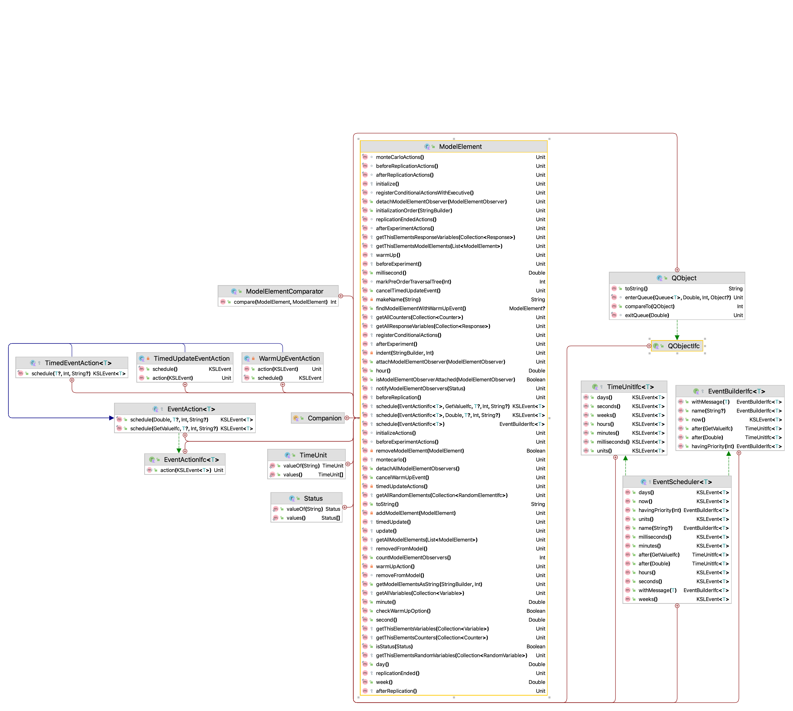
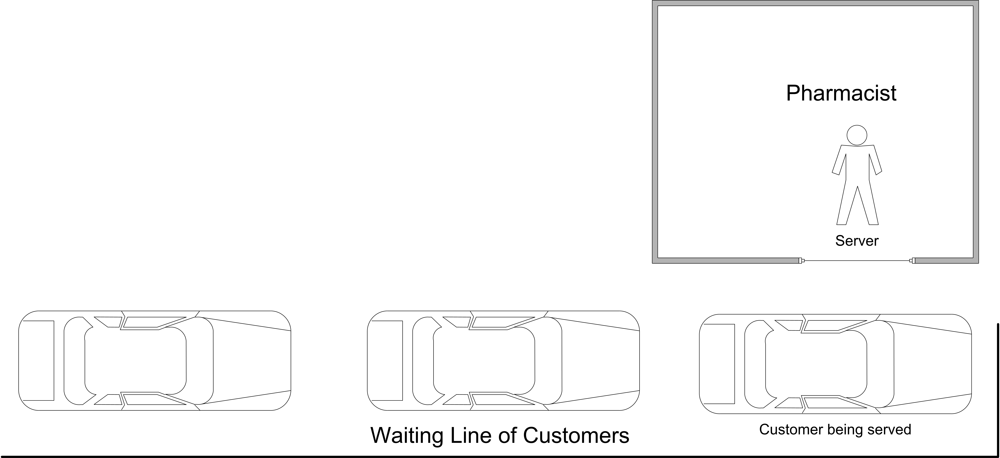

# Introduction to Discrete Event Modeling {#introDEDS}

**[LEARNING OBJECTIVES]{.smallcaps}**

-   To be able to recognize and define the characteristics of a
    discrete-event dynamic system (DEDS)

-   To be able to explain how time evolves in a DEDS

-   To be able to develop and read an activity flow diagram

-   To be able to create, run, and examine the results of a KSL model of
    a simple DEDS

## Introduction {#introDEDSIntro}

In Chapter \@ref(mcm), we
explored how to develop models in the KSL for which time is not a
significant factor. In the case of the news vendor problem, where we
simulated each day's demand, time advanced at regular intervals. In the
case of the area estimation problem, time was not a factor in the
simulation. These types of simulations are often termed static
simulations. In the next section, we begin our exploration of simulation
where time is an integral component in driving the behavior of the
system. In addition, we will see that time will not necessarily advance
at regular intervals (e.g. hour 1, hour 2, etc.). This will be the focus
of the rest of the textbook.

In this chapter, we explore the KSL simulation software platform for
developing and executing simulation models using the event-view. We will begin our study of
the major emphasis of this textbook: modeling discrete-event dynamic
systems. Recall that a discrete-event dynamic system (DEDS) is a system
that evolves dynamically through time. This chapter will introduce how
time evolves for DEDSs and illustrate how the KSL can be used to develop
models for simple discrete-event systems.

We can think of a system as a set of inter-related objects that work
together to accomplish a common objective. The objects within a system
are the concepts, abstractions, things, and processes with definable
boundaries and unique identity given our modeling perspective. Within
the traditional simulation parlance, objects of particular interest
within a system have often been called entities; however, this text
takes a broader view to include other modeling elements of interest
within the system (e.g. resources).

A discrete event system is a system in which the state of the system
changes only at discrete points in time. There are essentially two
fundamental viewpoints for modeling a discrete event system within
simulation: the event view and the process view. These views are simply
different representations for the same system. In the event view, the
system and its elements are conceptualized as reacting to events. In the
process view, the movement of entities through their processes implies
the events within the system in the system. This chapter focuses on the
event view.

The objects within the system change state because events occur within
the system. In addition, the changes in state for an object may cause
additional events to occur, affecting other objects within the system.
Through the propagation of events and object state changes, the entire
system state evolves through time. The state of the system is
essentially the collection of states associated with all the objects in
the system. The notion of modeling what happens to a system at
particular events in time is the basis of discrete event modeling.

## Discrete-Event Dynamic Systems {#introDEDSdeds}

Nelson (1995) states that the event-view "defines system events by
describing what happens to the system as it encounters entities". In
addition, Nelson (1995) states that the process view "implies system
events by describing what happens to an entity as it encounters the
system". One can consider the event-view as taking the perspective of
the system and the process-view as taking the perspective of the entity.
The process-view describes the life cycles of objects within the system.
Because of the way in which the process-view has been implemented
through a network transaction flow approach within many simulation
packages, the term entity has taken on the connotation of objects that
flow or move within the system. To avoid confusion, the more general
term, object, will be used to encompass non-flowing objects as well as
flowing objects within the system.

To understand the event-view, the concepts of event, activity, state,
and process must be clearly defined. Rumbaugh et al. (1991) defines
state and its relationship to events and activities as "an abstraction
of the attribute values and links of an object. Sets of values are
grouped together into a state according to properties that affect the
gross behavior of the object. A state corresponds to the interval
between two events. A state has duration; it occupies an interval of
time. A state is often associated with an activity that takes time to
complete or with the value of an object satisfying some condition. In
defining states, we ignore those attributes that do not affect the
behavior of the object and we lump together in a single state all
combinations of attribute values and links that have the same response
to events." Thus, the state of an object should entail only those
aspects that are required for the modeling.

An event is something that happens at an instant in time that
corresponds to a change in object state. An event is a one-way
transmission of information from one object to another that causes an
action resulting in a change in state. An event is said to be a
scheduled event (or timed, determined, bounded) if its occurrence can be
expressed as a function of system time and can thus be scheduled in
time. For example, suppose you have a doctor's appointment at 11 am. The
beginning of the appointment represents a scheduled event. An event is
said to be a conditional event if it is dependent upon the outcome of
certain conditions that cannot be predicted with certainty in advance
(e.g. the availability of a server). Conditional events are sometimes
called unbounded or contingent. If a scheduled event ends an activity,
then the activity is said to be a scheduled or timed activity;
otherwise, it is said to be a conditional activity.

Associated with an event is an action that is an instantaneous
operation, i.e. it takes zero simulated time to complete. In contrast,
an activity is an operation that takes simulated time to complete. An
activity can be associated with the state of an object over an interval.
Activities are defined by the occurrence of two events that represent
the activity's beginning time and ending time and mark the entrance and
exit of the state associated with the activity. In the simulation
literature, it is common to refer to activities that take a specified
duration of time as simply activities. To be more specific, it is useful
to classify activities of a specified duration as timed activities.
Getting your haircut is an example of a timed activity. There is a clear
beginning and a clear ending for the activity. An activity that
encompasses an interval of time that is unspecified or of indefinite
length is called a conditional activity. An example of a conditional
activity is a customer waiting in a queue for the barber to become
available. The length of the activity depends on when the barber becomes
available.

In the next section, we begin our exploration of simulation where time is an
integral component in driving the behavior of the system. In addition,
we will see that time will not necessarily advance at regular intervals
(e.g. hour 1, hour 2, etc.). As discussed, an event occurs at a specific point in time, thus we need to understand how the simulation time clock works.

## How the Discrete-Event Clock Works {#HowDEDSClockWorks}

This section introduces the concept of how time evolves in a discrete
event simulation. This topic will also be revisited in future chapters
after you have developed a deeper understanding for many of the
underlying elements of simulation modeling.

In discrete-event dynamic systems, an event is something that happens at
an instant in time which corresponds to a change in system state. An
event can be conceptualized as a transmission of information that causes
an action resulting in a change in system state. Let's consider a simple
bank which has two tellers that serve customers from a single waiting
line. In this situation, the system of interest is the bank tellers
(whether they are idle or busy) and any customers waiting in the line.
Assume that the bank opens at 9 am, which can be used to designate time
zero for the simulation. It should be clear that if the bank does not
have any customers arrive during the day that the state of the bank will
not change. In addition, when a customer arrives, the number of
customers in the bank will increase by one. In other words, an arrival
of a customer will change the state of the bank. Thus, the arrival of a
customer can be considered an event.

<div class="figure" style="text-align: center">

<p class="caption">(\#fig:ArrivalProcess)Customer Arrival Process</p>
</div>

::: {#tab:CustArrivals}
   Customer   Time of arrival   Time between arrival
  ---------- ----------------- ----------------------
      1              2                   2
      2              5                   3
      3              7                   2
      4             15                   8

  Table: (\#tab:CustArrivals) Customer Time of Arrivals
:::


Figure \@ref(fig:ArrivalProcess) illustrates a time line of customer
arrival events. The values for the arrival times in Table \@ref(tab:CustArrivals) have been rounded to
whole numbers, but in general the arrival times can be any real valued
numbers greater than zero. According to the figure, the first customer
arrives at time two and there is an elapse of three minutes before
customer 2 arrives at time five. From the discrete-event perspective,
*nothing* is happening in the bank from time $[0,2)$; however, at time 2, an
arrival event occurs and the subsequent actions associated with this
event need to be accounted for with respect to the state of the system. An event denotes an instance of time that changes the state of the system.  Since an event causes actions that result in a change of system state,
it is natural to ask: What are the actions that occur when a customer arrives to the
bank?

-   The customer enters the waiting line.

-   If there is an available teller, the customer will immediately exit
    the line and the available teller will begin to provide service.

-   If there are no tellers available, the customer will remain waiting
    in the line until a teller becomes available.

Now, consider the arrival of the first customer. Since the bank opens at
9 am with no customer and all the tellers idle, the first customer will
enter and immediately exit the queue at time 9:02 am (or time 2) and
then begin service. After the customer completes service, the customer
will exit the bank. When a customer completes service (and departs the
bank) the number of customers in the bank will decrease by one. It
should be clear that some actions need to occur when a customer
completes service. These actions correspond to the second event
associated with this system: the customer service completion event. What
are the actions that occur at this event?

-   The customer departs the bank.

-   If there are waiting customers, the teller indicates to the next
    customer that he/she will serve the customer. The customer will exit
    the waiting line and will begin service with the teller.

-   If there are no waiting customers, then the teller will become idle.

Figure \@ref(fig:ServiceProcess) contains the service times for each
of the four customers that arrived in
Figure \@ref(fig:ArrivalProcess). Examine the figure with respect to
customer 1. Based on the figure, customer 1 can enter service at time
two because there were no other customers present in the bank. Suppose
that it is now 9:02 am (time 2) and that the service time of customer 1
is known *in advance* to be 8 minutes as indicated in Table \@ref(tab:CustServiceTimes). From this information, the time that customer 1 is going to complete service can be pre-computed. From
the information in the figure, customer 1 will complete service at time
10 (current time + service time = 2 + 8 = 10). Thus, it should be
apparent, that for you to recreate the bank's behavior over a time
period that you must have knowledge of the customer's service times. The
service time of each customer coupled with the knowledge of when the
customer began service allows the time that the customer will complete
service and depart the bank to be computed in advance. A careful
inspection of Figure \@ref(fig:ServiceProcess) and knowledge of how banks operate
should indicate that a customer will begin service either immediately
upon arrival (when a teller is available) or coinciding with when
another customer departs the bank after being served. This latter
situation occurs when the queue is not empty after a customer completes
service. The times that service completions occur and the times that
arrivals occur constitute the pertinent events for simulating this
banking system.

<div class="figure" style="text-align: center">

<p class="caption">(\#fig:ServiceProcess)Customer Service Process</p>
</div>

::: {#tab:CustServiceTimes}
   Customer   Service Time Started   Service Time   Service Time Completed
  ---------- ---------------------- -------------- ------------------------
      1                2                  8                   10
      2                5                  7                   12
      3                10                 9                   19
      4                15                 2                   17

  Table: (\#tab:CustServiceTimes) Service Time for First Four Customers
:::

If the arrival and the service completion events are combined, then the
time ordered sequence of events for the system can be determined.
Figure \@ref(fig:TimeOrderedProcess) illustrates the events ordered by time
from smallest event time to largest event time. Suppose you are standing
at time two. Looking forward, the next event to occur will be at time 5
when the second customer arrives. When you simulate a system, you must
be able to generate a sequence of events so that, at the occurrence of
each event, the appropriate actions are invoked that change the state of
the system.

<div class="figure" style="text-align: center">

<p class="caption">(\#fig:TimeOrderedProcess)Events Ordered by Time Process</p>
</div>

   Time         Event         Comment
  ------ -------------------- -------------------------------------------------------------------------------------------
    0         Bank 0pens      
    2          Arrival        Customer 1 arrives, enters service for 8 minutes, one teller becomes busy
    5          Arrival        Customer 2 arrives, enters service for 7 minutes, the second teller becomes busy
    7          Arrival        Customer 3 arrives, waits in queue
    10    Service Completion  Customer 1 completes service, customer 3 exits the queue and enters service for 9 minutes
    12    Service Completion  Customer 2 completes service, no customers are in the queue so a teller becomes idle
    15         Arrival        Customer 4 arrives, enters service for 2 minutes, one teller becomes busy
    17    Service Completion  Customer 4 completes service, a teller becomes idle
    19    Service Completion  Customer 3 completes service

\

The real system will simply evolve over time; however, a simulation of
the system must recreate the events. In simulation, events are created
by adding additional logic to the normal state changing actions. This
additional logic is responsible for scheduling future events that are
implied by the actions of the current event. For example, when a
customer arrives, the time to the next arrival can be generated and
scheduled to occur at some future time. This can be done by generating
the time until the next arrival and adding it to the current time to
determine the actual arrival time. Thus, all the arrival times do not
need to be pre-computed prior to the start of the simulation. For
example, at time two, customer 1 arrived. Customer 2 arrives at time 5.
Thus, the time between arrivals (3 minutes) is added to the current time
and customer 2's arrival at time 5 is scheduled to occur. Every time an
arrival occurs this additional logic is invoked to ensure that more
arrivals will continue within the simulation.

Adding additional scheduling logic also occurs for service completion
events. For example, since customer 1 immediately enters service at time
2, the service completion of customer 1 can be scheduled to occur at
time 12 (current time + service time = 2 + 10 = 12). Notice that other
events may have already been scheduled for times less than time 12. In
addition, other events may be inserted before the service completion at
time 12 actually occurs. From this, you should begin to get a feeling
for how a computer program can implement some of these ideas.

Based on this intuitive notion for how a computer simulation may
execute, you should realize that computer logic processing need only
occur at the event times. That is, the state of the system does not
change between events. Thus, it is *not necessary* to step incrementally
through time checking to see if something happens at time 0.1, 0.2, 0.3,
etc. (or whatever time scale you envision that is fine enough to not
miss any events). Thus, in a discrete-event dynamic system simulation the clock does not
"tick" at regular intervals. Instead, the simulation clock jumps from
event time to event time. As the simulation moves from the current event
to the next event, the current simulation time is updated to the time of
the next event and any changes to the system associated with the next
event are executed. This allows the simulation to evolve over time.

## Simulating a Queueing System By Hand {#QHandExample}

This section builds on the concepts discussed in the previous section in order to provide insights into how discrete event simulations operate.  In order to do this, we will simulate a simple queueing system by hand.  That is, we will process each of the events that occur as well as the state changes in order to trace the operation of the system through time.  

Consider again the simple banking system described in the previous
section. To simplify the situation, we assume that there is only one
teller that is available to provide service to the arriving customers.
Customers that arrive while the teller is already helping a customer
form a single waiting line, which is handled in a first come, first
served manner. Let's assume that the bank opens at 9 am with no
customers present and the teller idle. The time of arrival of the first
eight customers is provided in the following table.

  ----------------- ----------------- --------------
  Customer Number   Time of Arrival   Service Time
  1                 3                 4
  2                 11                4
  3                 13                4
  4                 14                3
  5                 17                2
  6                 19                4
  7                 21                3
  8                 27                2
  ----------------- ----------------- --------------

We are going to process these customers in order to recreate the
behavior of this system over from time 0 to 31 minutes. To do this, we
need to be able to perform the "bookkeeping" that a computer simulation
model would normally perform for us. Thus, we will need to define some
variables associated with the system and some attributes associated with
the customers. Consider the following system variables.

System Variables

-   Let $t$ represent the current simulation clock time.

-   Let $N(t)$ represent the number of customers in the system (bank) at
    any time $t$.

-   Let $Q(t)$ represent the number of customers waiting in line for the
    teller at any time $t$.

-   Let $B(t)$ represent whether or not the teller is busy (1) or
    idle (0) at any time $t$.

Because we know the number of tellers available, we know that the
following relationship holds between the variables:

$$N\left( t \right) = Q\left( t \right) + B(t)$$

Note also that, knowledge of the value of $N(t)$ is sufficient to
determine the values of $Q(t)$ and $B(t)$ at any time $t.$ For example,
if we know that there are 3 customers in the bank, then
$N\left( t \right) = 3$, and since the teller must be serving 1 of those
customers, $B\left( t \right) = 1$ and there must be 2 customers
waiting, $Q\left( t \right) = 2$. In this situation, since
$N\left( t \right)$, is sufficient to determine all the other system
variables, we can say that $N\left( t \right)$ is the system's *state
variable*. The state variable(s) are the minimal set of system
variables that are necessary to represent the system's behavior over
time. We will keep track of the values of all of the system variables
during our processing in order to collect statistics across time.  Quantities such as $N(t), Q(t)$, and $B(t)$ are variables that persist over time. In simulation, we call these variables *time-persistent* variables and we will need to collect specially defined statistics called *time-persistent statistics* on these quantities. This computation will be illustrated later in this section. Within the KSL, we will use the `TWResponse` class to collect time-persistent statistics. 

Attributes are properties of things that move through the system. In the parlance of simulation, we call the things that move through the system entity instances or entities.  In this situation, the entities are the customers, and we can define a number of attributes for each customer. Here, customer is a type of entity or entity type.  If we have other things that flow through the system, we identity the different types (or entity types).  The attributes of the customer entity type are as follows.  Notice that each attribute is subscripted by $i$, which indicates the $i^{th}$ customer instance.

**Entity Attributes**

-   Let $\mathrm{ID}_{i}$ be the identity number of the customer.
    $\mathrm{ID}_{i}$ is a unique number assigned to each customer that
    identifies the customer from other customers in the system.

-   Let $A_{i}$ be the arrival time of the $i^{\mathrm{th}}$ customer.

-   Let $S_{i}$ be the time the $i^{\mathrm{th}}$ customer started
    service.

-   Let $D_{i}$ be the departure time of the $i^{\mathrm{th}}$ customer.

-   Let $\mathrm{ST}_{i}$ be the service time of the $i^{\mathrm{th}}$
    customer.

-   Let $T_{i}$ be the total time spent in the system of the
    $i^{\mathrm{th}}$ customer.

-   Let $W_{i}$ be the time spent waiting in the queue for the
    $i^{\mathrm{th}}$ customer.

Quantities such as $A_{i}, S_{i}, D_{i}, \mathrm{ST}_{i}, T_{i}$ and $W_{i}$ all represent quantities that can be observed at specific event times.  These quantities are often called *observation-based* or *tally based* variables.  As we will see in subsequent sections of this chapter, we will used the KSL construct, `Response`, to capture statistics on these types of variables.

Clearly, there are also relationships between these attributes. We can
compute the total time in the system for each customer from their
arrival and departure times:

$$T_{i} = D_{i} - A_{i}$$

In addition, we can compute the time spent waiting in the queue for each
customer as:

$$W_{i} = T_{i} - \mathrm{ST}_{i} = S_{i} - A_{i}$$

As in the previous section, there are two types of events: arrivals and
departures. Let $E(t)$ be (A) for an arrival event at time $t$ and be
(D) for a departure event at time $t$. As we process each event, we will
keep track of when the event occurs and the type of event. We will also
keep track of the state of the system after each event has been
processed. To make this easier, we will keep track of the system
variables and the entity attributes within a table as follows.

<table class="table" style="font-size: 10px; margin-left: auto; margin-right: auto;">
<caption style="font-size: initial !important;">(\#tab:SQBH1)Hand Bank Simulation Bookkeeping Table.</caption>
 <thead>
<tr>
<th style="border-bottom:hidden;padding-bottom:0; padding-left:3px;padding-right:3px;text-align: center; " colspan="5"><div style="border-bottom: 1px solid #ddd; padding-bottom: 5px; ">System Variables</div></th>
<th style="border-bottom:hidden;padding-bottom:0; padding-left:3px;padding-right:3px;text-align: center; " colspan="7"><div style="border-bottom: 1px solid #ddd; padding-bottom: 5px; ">Entity Attributes</div></th>
<th style="empty-cells: hide;border-bottom:hidden;" colspan="1"></th>
</tr>
  <tr>
   <th style="text-align:right;"> t </th>
   <th style="text-align:left;"> E(t) </th>
   <th style="text-align:right;"> N(t) </th>
   <th style="text-align:right;"> B(t) </th>
   <th style="text-align:right;"> Q(t) </th>
   <th style="text-align:right;"> ID(i) </th>
   <th style="text-align:right;"> A(i) </th>
   <th style="text-align:right;"> ST(i) </th>
   <th style="text-align:right;"> S(i) </th>
   <th style="text-align:right;"> D(i) </th>
   <th style="text-align:right;"> T(i) </th>
   <th style="text-align:right;"> W(i) </th>
   <th style="text-align:left;"> Pending E(t) </th>
  </tr>
 </thead>
<tbody>
  <tr>
   <td style="text-align:right;"> 0 </td>
   <td style="text-align:left;"> NA </td>
   <td style="text-align:right;"> 0 </td>
   <td style="text-align:right;"> 0 </td>
   <td style="text-align:right;"> 0 </td>
   <td style="text-align:right;"> NA </td>
   <td style="text-align:right;"> NA </td>
   <td style="text-align:right;"> NA </td>
   <td style="text-align:right;"> NA </td>
   <td style="text-align:right;"> NA </td>
   <td style="text-align:right;"> NA </td>
   <td style="text-align:right;"> NA </td>
   <td style="text-align:left;"> NA </td>
  </tr>
</tbody>
</table>

In the table, we see that the initial state of the system is empty and
idle. Since there are no customers in the bank, there are no tabulated
attribute values within the table. Reviewing the provided information,
we see that customer 1 arrives at $t = 3$ and has a service time of 4
minutes. Thus,$\ \text{ID}_{1} = 1$, $A_{1} = 3$, and
$\text{ST}_{1} = 4$. We can enter this information directly into our
bookkeeping table. In addition, because the bank was empty and idle when
the customer arrived, we can note that the time that customer 1 starts
service is the same as the time of their arrival and that they did not
spend any time waiting in the queue. Thus, $S_{1} = 3$ and $W_{1} = 0$.
The table has been updated as follows.

<table class="table" style="font-size: 10px; margin-left: auto; margin-right: auto;">
<caption style="font-size: initial !important;">(\#tab:SQBH2)Hand Bank Simulation Bookkeeping Table.</caption>
 <thead>
<tr>
<th style="border-bottom:hidden;padding-bottom:0; padding-left:3px;padding-right:3px;text-align: center; " colspan="5"><div style="border-bottom: 1px solid #ddd; padding-bottom: 5px; ">System Variables</div></th>
<th style="border-bottom:hidden;padding-bottom:0; padding-left:3px;padding-right:3px;text-align: center; " colspan="7"><div style="border-bottom: 1px solid #ddd; padding-bottom: 5px; ">Entity Attributes</div></th>
<th style="empty-cells: hide;border-bottom:hidden;" colspan="1"></th>
</tr>
  <tr>
   <th style="text-align:right;"> t </th>
   <th style="text-align:left;"> E(t) </th>
   <th style="text-align:right;"> N(t) </th>
   <th style="text-align:right;"> B(t) </th>
   <th style="text-align:right;"> Q(t) </th>
   <th style="text-align:right;"> ID(i) </th>
   <th style="text-align:right;"> A(i) </th>
   <th style="text-align:right;"> ST(i) </th>
   <th style="text-align:right;"> S(i) </th>
   <th style="text-align:right;"> D(i) </th>
   <th style="text-align:right;"> T(i) </th>
   <th style="text-align:right;"> W(i) </th>
   <th style="text-align:left;"> Pending E(t) </th>
  </tr>
 </thead>
<tbody>
  <tr>
   <td style="text-align:right;"> 0 </td>
   <td style="text-align:left;"> NA </td>
   <td style="text-align:right;"> 0 </td>
   <td style="text-align:right;"> 0 </td>
   <td style="text-align:right;"> 0 </td>
   <td style="text-align:right;"> NA </td>
   <td style="text-align:right;"> NA </td>
   <td style="text-align:right;"> NA </td>
   <td style="text-align:right;"> NA </td>
   <td style="text-align:right;"> NA </td>
   <td style="text-align:right;"> NA </td>
   <td style="text-align:right;"> NA </td>
   <td style="text-align:left;"> NA </td>
  </tr>
  <tr>
   <td style="text-align:right;"> 3 </td>
   <td style="text-align:left;"> A </td>
   <td style="text-align:right;"> 1 </td>
   <td style="text-align:right;"> 1 </td>
   <td style="text-align:right;"> 0 </td>
   <td style="text-align:right;"> 1 </td>
   <td style="text-align:right;"> 3 </td>
   <td style="text-align:right;"> 4 </td>
   <td style="text-align:right;"> 3 </td>
   <td style="text-align:right;"> NA </td>
   <td style="text-align:right;"> NA </td>
   <td style="text-align:right;"> 0 </td>
   <td style="text-align:left;"> E(7) = D(1), E(11) = A(2) </td>
  </tr>
</tbody>
</table>

Because customer 1 arrived to an empty system, they immediately started
service at time 3. Since we know the service time of the customer,
$\text{ST}_{1} = 4$, and the current time, $t = 3$, we can determine
that customer 1, will depart from the system at time 7
($t = 3 + 4 = 7$). That means we will have a departure event for
customer 1 at time 7. According to the provided data, the next customer,
customer 2, will arrive at time 11. Thus, we have two pending events, a
departure of customer 1 at time 7 and the arrival of customer 2 at time
11. This fact is noted in the column labeled "Pending E(t)" for pending events. Here 
E(7) = D(1), E(11) = A(2) indicates that customer 1 with
depart,$\ D_{1},$ at time 7, $E\left( 7 \right)$ and customer 2 will
arrive, $A_{2}$, at the event at time 11, $E(11)$. Clearly, the next
event time will be the minimum of 7 and 11, which will be the departure
of the first customer. Thus, our bookkeeping table can be updated as
follows.

<table class="table" style="font-size: 10px; margin-left: auto; margin-right: auto;">
<caption style="font-size: initial !important;">(\#tab:SQBH3)Hand Bank Simulation Bookkeeping Table.</caption>
 <thead>
<tr>
<th style="border-bottom:hidden;padding-bottom:0; padding-left:3px;padding-right:3px;text-align: center; " colspan="5"><div style="border-bottom: 1px solid #ddd; padding-bottom: 5px; ">System Variables</div></th>
<th style="border-bottom:hidden;padding-bottom:0; padding-left:3px;padding-right:3px;text-align: center; " colspan="7"><div style="border-bottom: 1px solid #ddd; padding-bottom: 5px; ">Entity Attributes</div></th>
<th style="empty-cells: hide;border-bottom:hidden;" colspan="1"></th>
</tr>
  <tr>
   <th style="text-align:right;"> t </th>
   <th style="text-align:left;"> E(t) </th>
   <th style="text-align:right;"> N(t) </th>
   <th style="text-align:right;"> B(t) </th>
   <th style="text-align:right;"> Q(t) </th>
   <th style="text-align:right;"> ID(i) </th>
   <th style="text-align:right;"> A(i) </th>
   <th style="text-align:right;"> ST(i) </th>
   <th style="text-align:right;"> S(i) </th>
   <th style="text-align:right;"> D(i) </th>
   <th style="text-align:right;"> T(i) </th>
   <th style="text-align:right;"> W(i) </th>
   <th style="text-align:left;"> Pending E(t) </th>
  </tr>
 </thead>
<tbody>
  <tr>
   <td style="text-align:right;"> 0 </td>
   <td style="text-align:left;"> NA </td>
   <td style="text-align:right;"> 0 </td>
   <td style="text-align:right;"> 0 </td>
   <td style="text-align:right;"> 0 </td>
   <td style="text-align:right;"> NA </td>
   <td style="text-align:right;"> NA </td>
   <td style="text-align:right;"> NA </td>
   <td style="text-align:right;"> NA </td>
   <td style="text-align:right;"> NA </td>
   <td style="text-align:right;"> NA </td>
   <td style="text-align:right;"> NA </td>
   <td style="text-align:left;"> NA </td>
  </tr>
  <tr>
   <td style="text-align:right;"> 3 </td>
   <td style="text-align:left;"> A </td>
   <td style="text-align:right;"> 1 </td>
   <td style="text-align:right;"> 1 </td>
   <td style="text-align:right;"> 0 </td>
   <td style="text-align:right;"> 1 </td>
   <td style="text-align:right;"> 3 </td>
   <td style="text-align:right;"> 4 </td>
   <td style="text-align:right;"> 3 </td>
   <td style="text-align:right;"> NA </td>
   <td style="text-align:right;"> NA </td>
   <td style="text-align:right;"> 0 </td>
   <td style="text-align:left;"> E(7) = D(1), E(11) = A(2) </td>
  </tr>
  <tr>
   <td style="text-align:right;"> 7 </td>
   <td style="text-align:left;"> D </td>
   <td style="text-align:right;"> 0 </td>
   <td style="text-align:right;"> 0 </td>
   <td style="text-align:right;"> 0 </td>
   <td style="text-align:right;"> 1 </td>
   <td style="text-align:right;"> 3 </td>
   <td style="text-align:right;"> 4 </td>
   <td style="text-align:right;"> 3 </td>
   <td style="text-align:right;"> 7 </td>
   <td style="text-align:right;"> 4 </td>
   <td style="text-align:right;"> 0 </td>
   <td style="text-align:left;"> E(11) = A(2) </td>
  </tr>
</tbody>
</table>

Since there are no customers in the bank and only the one pending event,
the next event will be the arrival of customer 2 at time 11. The table
can be updated as follows.

<table class="table" style="font-size: 10px; margin-left: auto; margin-right: auto;">
<caption style="font-size: initial !important;">(\#tab:SQBH4)Hand Bank Simulation Bookkeeping Table.</caption>
 <thead>
<tr>
<th style="border-bottom:hidden;padding-bottom:0; padding-left:3px;padding-right:3px;text-align: center; " colspan="5"><div style="border-bottom: 1px solid #ddd; padding-bottom: 5px; ">System Variables</div></th>
<th style="border-bottom:hidden;padding-bottom:0; padding-left:3px;padding-right:3px;text-align: center; " colspan="7"><div style="border-bottom: 1px solid #ddd; padding-bottom: 5px; ">Entity Attributes</div></th>
<th style="empty-cells: hide;border-bottom:hidden;" colspan="1"></th>
</tr>
  <tr>
   <th style="text-align:right;"> t </th>
   <th style="text-align:left;"> E(t) </th>
   <th style="text-align:right;"> N(t) </th>
   <th style="text-align:right;"> B(t) </th>
   <th style="text-align:right;"> Q(t) </th>
   <th style="text-align:right;"> ID(i) </th>
   <th style="text-align:right;"> A(i) </th>
   <th style="text-align:right;"> ST(i) </th>
   <th style="text-align:right;"> S(i) </th>
   <th style="text-align:right;"> D(i) </th>
   <th style="text-align:right;"> T(i) </th>
   <th style="text-align:right;"> W(i) </th>
   <th style="text-align:left;"> Pending E(t) </th>
  </tr>
 </thead>
<tbody>
  <tr>
   <td style="text-align:right;"> 0 </td>
   <td style="text-align:left;"> NA </td>
   <td style="text-align:right;"> 0 </td>
   <td style="text-align:right;"> 0 </td>
   <td style="text-align:right;"> 0 </td>
   <td style="text-align:right;"> NA </td>
   <td style="text-align:right;"> NA </td>
   <td style="text-align:right;"> NA </td>
   <td style="text-align:right;"> NA </td>
   <td style="text-align:right;"> NA </td>
   <td style="text-align:right;"> NA </td>
   <td style="text-align:right;"> NA </td>
   <td style="text-align:left;"> NA </td>
  </tr>
  <tr>
   <td style="text-align:right;"> 3 </td>
   <td style="text-align:left;"> A </td>
   <td style="text-align:right;"> 1 </td>
   <td style="text-align:right;"> 1 </td>
   <td style="text-align:right;"> 0 </td>
   <td style="text-align:right;"> 1 </td>
   <td style="text-align:right;"> 3 </td>
   <td style="text-align:right;"> 4 </td>
   <td style="text-align:right;"> 3 </td>
   <td style="text-align:right;"> NA </td>
   <td style="text-align:right;"> NA </td>
   <td style="text-align:right;"> 0 </td>
   <td style="text-align:left;"> E(7) = D(1), E(11) = A(2) </td>
  </tr>
  <tr>
   <td style="text-align:right;"> 7 </td>
   <td style="text-align:left;"> D </td>
   <td style="text-align:right;"> 0 </td>
   <td style="text-align:right;"> 0 </td>
   <td style="text-align:right;"> 0 </td>
   <td style="text-align:right;"> 1 </td>
   <td style="text-align:right;"> 3 </td>
   <td style="text-align:right;"> 4 </td>
   <td style="text-align:right;"> 3 </td>
   <td style="text-align:right;"> 7 </td>
   <td style="text-align:right;"> 4 </td>
   <td style="text-align:right;"> 0 </td>
   <td style="text-align:left;"> E(11) = A(2) </td>
  </tr>
  <tr>
   <td style="text-align:right;"> 11 </td>
   <td style="text-align:left;"> A </td>
   <td style="text-align:right;"> 1 </td>
   <td style="text-align:right;"> 1 </td>
   <td style="text-align:right;"> 0 </td>
   <td style="text-align:right;"> 2 </td>
   <td style="text-align:right;"> 11 </td>
   <td style="text-align:right;"> 4 </td>
   <td style="text-align:right;"> 11 </td>
   <td style="text-align:right;"> NA </td>
   <td style="text-align:right;"> NA </td>
   <td style="text-align:right;"> 0 </td>
   <td style="text-align:left;"> E(13) = A(3), E(15) = D(2) </td>
  </tr>
</tbody>
</table>

Since the pending event set is E(13) = A(3), E(15) = D(2) the next event
will be the arrival of the third customer at time 13 before the
departure of the second customer at time 15. We will now have a queue
form. Updating our bookkeeping table, yields:

<table class="table" style="font-size: 10px; margin-left: auto; margin-right: auto;">
<caption style="font-size: initial !important;">(\#tab:SQBH5)Hand Bank Simulation Bookkeeping Table.</caption>
 <thead>
<tr>
<th style="border-bottom:hidden;padding-bottom:0; padding-left:3px;padding-right:3px;text-align: center; " colspan="5"><div style="border-bottom: 1px solid #ddd; padding-bottom: 5px; ">System Variables</div></th>
<th style="border-bottom:hidden;padding-bottom:0; padding-left:3px;padding-right:3px;text-align: center; " colspan="7"><div style="border-bottom: 1px solid #ddd; padding-bottom: 5px; ">Entity Attributes</div></th>
<th style="empty-cells: hide;border-bottom:hidden;" colspan="1"></th>
</tr>
  <tr>
   <th style="text-align:right;"> t </th>
   <th style="text-align:left;"> E(t) </th>
   <th style="text-align:right;"> N(t) </th>
   <th style="text-align:right;"> B(t) </th>
   <th style="text-align:right;"> Q(t) </th>
   <th style="text-align:right;"> ID(i) </th>
   <th style="text-align:right;"> A(i) </th>
   <th style="text-align:right;"> ST(i) </th>
   <th style="text-align:right;"> S(i) </th>
   <th style="text-align:right;"> D(i) </th>
   <th style="text-align:right;"> T(i) </th>
   <th style="text-align:right;"> W(i) </th>
   <th style="text-align:left;"> Pending E(t) </th>
  </tr>
 </thead>
<tbody>
  <tr>
   <td style="text-align:right;"> 0 </td>
   <td style="text-align:left;"> NA </td>
   <td style="text-align:right;"> 0 </td>
   <td style="text-align:right;"> 0 </td>
   <td style="text-align:right;"> 0 </td>
   <td style="text-align:right;"> NA </td>
   <td style="text-align:right;"> NA </td>
   <td style="text-align:right;"> NA </td>
   <td style="text-align:right;"> NA </td>
   <td style="text-align:right;"> NA </td>
   <td style="text-align:right;"> NA </td>
   <td style="text-align:right;"> NA </td>
   <td style="text-align:left;"> NA </td>
  </tr>
  <tr>
   <td style="text-align:right;"> 3 </td>
   <td style="text-align:left;"> A </td>
   <td style="text-align:right;"> 1 </td>
   <td style="text-align:right;"> 1 </td>
   <td style="text-align:right;"> 0 </td>
   <td style="text-align:right;"> 1 </td>
   <td style="text-align:right;"> 3 </td>
   <td style="text-align:right;"> 4 </td>
   <td style="text-align:right;"> 3 </td>
   <td style="text-align:right;"> NA </td>
   <td style="text-align:right;"> NA </td>
   <td style="text-align:right;"> 0 </td>
   <td style="text-align:left;"> E(7) = D(1), E(11) = A(2) </td>
  </tr>
  <tr>
   <td style="text-align:right;"> 7 </td>
   <td style="text-align:left;"> D </td>
   <td style="text-align:right;"> 0 </td>
   <td style="text-align:right;"> 0 </td>
   <td style="text-align:right;"> 0 </td>
   <td style="text-align:right;"> 1 </td>
   <td style="text-align:right;"> 3 </td>
   <td style="text-align:right;"> 4 </td>
   <td style="text-align:right;"> 3 </td>
   <td style="text-align:right;"> 7 </td>
   <td style="text-align:right;"> 4 </td>
   <td style="text-align:right;"> 0 </td>
   <td style="text-align:left;"> E(11) = A(2) </td>
  </tr>
  <tr>
   <td style="text-align:right;"> 11 </td>
   <td style="text-align:left;"> A </td>
   <td style="text-align:right;"> 1 </td>
   <td style="text-align:right;"> 1 </td>
   <td style="text-align:right;"> 0 </td>
   <td style="text-align:right;"> 2 </td>
   <td style="text-align:right;"> 11 </td>
   <td style="text-align:right;"> 4 </td>
   <td style="text-align:right;"> 11 </td>
   <td style="text-align:right;"> NA </td>
   <td style="text-align:right;"> NA </td>
   <td style="text-align:right;"> 0 </td>
   <td style="text-align:left;"> E(13) = A(3), E(15) = D(2) </td>
  </tr>
  <tr>
   <td style="text-align:right;"> 13 </td>
   <td style="text-align:left;"> A </td>
   <td style="text-align:right;"> 2 </td>
   <td style="text-align:right;"> 1 </td>
   <td style="text-align:right;"> 1 </td>
   <td style="text-align:right;"> 3 </td>
   <td style="text-align:right;"> 13 </td>
   <td style="text-align:right;"> 4 </td>
   <td style="text-align:right;"> 15 </td>
   <td style="text-align:right;"> NA </td>
   <td style="text-align:right;"> NA </td>
   <td style="text-align:right;"> 2 </td>
   <td style="text-align:left;"> E(14) = A(4), E(15) = D(2) </td>
  </tr>
</tbody>
</table>

Notice that in the last table update, we did not update $S_{i}$ and
$W_{i}$ because customer 3 had to wait in queue and did not start
service. Customer 3 will start service, when customer 2 departs.
Reviewing the pending event set, we see that the next event will be the
arrival of customer 4 at time 14, which yields the following bookkeeping
table.

<table class="table" style="font-size: 10px; margin-left: auto; margin-right: auto;">
<caption style="font-size: initial !important;">(\#tab:SQBH6)Hand Bank Simulation Bookkeeping Table.</caption>
 <thead>
<tr>
<th style="border-bottom:hidden;padding-bottom:0; padding-left:3px;padding-right:3px;text-align: center; " colspan="5"><div style="border-bottom: 1px solid #ddd; padding-bottom: 5px; ">System Variables</div></th>
<th style="border-bottom:hidden;padding-bottom:0; padding-left:3px;padding-right:3px;text-align: center; " colspan="7"><div style="border-bottom: 1px solid #ddd; padding-bottom: 5px; ">Entity Attributes</div></th>
<th style="empty-cells: hide;border-bottom:hidden;" colspan="1"></th>
</tr>
  <tr>
   <th style="text-align:right;"> t </th>
   <th style="text-align:left;"> E(t) </th>
   <th style="text-align:right;"> N(t) </th>
   <th style="text-align:right;"> B(t) </th>
   <th style="text-align:right;"> Q(t) </th>
   <th style="text-align:right;"> ID(i) </th>
   <th style="text-align:right;"> A(i) </th>
   <th style="text-align:right;"> ST(i) </th>
   <th style="text-align:right;"> S(i) </th>
   <th style="text-align:right;"> D(i) </th>
   <th style="text-align:right;"> T(i) </th>
   <th style="text-align:right;"> W(i) </th>
   <th style="text-align:left;"> Pending E(t) </th>
  </tr>
 </thead>
<tbody>
  <tr>
   <td style="text-align:right;"> 0 </td>
   <td style="text-align:left;"> NA </td>
   <td style="text-align:right;"> 0 </td>
   <td style="text-align:right;"> 0 </td>
   <td style="text-align:right;"> 0 </td>
   <td style="text-align:right;"> NA </td>
   <td style="text-align:right;"> NA </td>
   <td style="text-align:right;"> NA </td>
   <td style="text-align:right;"> NA </td>
   <td style="text-align:right;"> NA </td>
   <td style="text-align:right;"> NA </td>
   <td style="text-align:right;"> NA </td>
   <td style="text-align:left;"> NA </td>
  </tr>
  <tr>
   <td style="text-align:right;"> 3 </td>
   <td style="text-align:left;"> A </td>
   <td style="text-align:right;"> 1 </td>
   <td style="text-align:right;"> 1 </td>
   <td style="text-align:right;"> 0 </td>
   <td style="text-align:right;"> 1 </td>
   <td style="text-align:right;"> 3 </td>
   <td style="text-align:right;"> 4 </td>
   <td style="text-align:right;"> 3 </td>
   <td style="text-align:right;"> NA </td>
   <td style="text-align:right;"> NA </td>
   <td style="text-align:right;"> 0 </td>
   <td style="text-align:left;"> E(7) = D(1), E(11) = A(2) </td>
  </tr>
  <tr>
   <td style="text-align:right;"> 7 </td>
   <td style="text-align:left;"> D </td>
   <td style="text-align:right;"> 0 </td>
   <td style="text-align:right;"> 0 </td>
   <td style="text-align:right;"> 0 </td>
   <td style="text-align:right;"> 1 </td>
   <td style="text-align:right;"> 3 </td>
   <td style="text-align:right;"> 4 </td>
   <td style="text-align:right;"> 3 </td>
   <td style="text-align:right;"> 7 </td>
   <td style="text-align:right;"> 4 </td>
   <td style="text-align:right;"> 0 </td>
   <td style="text-align:left;"> E(11) = A(2) </td>
  </tr>
  <tr>
   <td style="text-align:right;"> 11 </td>
   <td style="text-align:left;"> A </td>
   <td style="text-align:right;"> 1 </td>
   <td style="text-align:right;"> 1 </td>
   <td style="text-align:right;"> 0 </td>
   <td style="text-align:right;"> 2 </td>
   <td style="text-align:right;"> 11 </td>
   <td style="text-align:right;"> 4 </td>
   <td style="text-align:right;"> 11 </td>
   <td style="text-align:right;"> NA </td>
   <td style="text-align:right;"> NA </td>
   <td style="text-align:right;"> 0 </td>
   <td style="text-align:left;"> E(13) = A(3), E(15) = D(2) </td>
  </tr>
  <tr>
   <td style="text-align:right;"> 13 </td>
   <td style="text-align:left;"> A </td>
   <td style="text-align:right;"> 2 </td>
   <td style="text-align:right;"> 1 </td>
   <td style="text-align:right;"> 1 </td>
   <td style="text-align:right;"> 3 </td>
   <td style="text-align:right;"> 13 </td>
   <td style="text-align:right;"> 4 </td>
   <td style="text-align:right;"> 15 </td>
   <td style="text-align:right;"> NA </td>
   <td style="text-align:right;"> NA </td>
   <td style="text-align:right;"> 2 </td>
   <td style="text-align:left;"> E(14) = A(4), E(15) = D(2) </td>
  </tr>
  <tr>
   <td style="text-align:right;"> 14 </td>
   <td style="text-align:left;"> A </td>
   <td style="text-align:right;"> 3 </td>
   <td style="text-align:right;"> 1 </td>
   <td style="text-align:right;"> 2 </td>
   <td style="text-align:right;"> 4 </td>
   <td style="text-align:right;"> 14 </td>
   <td style="text-align:right;"> 3 </td>
   <td style="text-align:right;"> 19 </td>
   <td style="text-align:right;"> NA </td>
   <td style="text-align:right;"> NA </td>
   <td style="text-align:right;"> 5 </td>
   <td style="text-align:left;"> E(15) = D(2), E(17) = A(5) </td>
  </tr>
</tbody>
</table>

Notice that we now have 3 customers in the system, 1 in service and 2
waiting in the queue. Reviewing the pending event set, we see that
customer 2 will finally complete service and depart at time 15.

<table class="table" style="font-size: 10px; margin-left: auto; margin-right: auto;">
<caption style="font-size: initial !important;">(\#tab:SQBH7)Hand Bank Simulation Bookkeeping Table.</caption>
 <thead>
<tr>
<th style="border-bottom:hidden;padding-bottom:0; padding-left:3px;padding-right:3px;text-align: center; " colspan="5"><div style="border-bottom: 1px solid #ddd; padding-bottom: 5px; ">System Variables</div></th>
<th style="border-bottom:hidden;padding-bottom:0; padding-left:3px;padding-right:3px;text-align: center; " colspan="7"><div style="border-bottom: 1px solid #ddd; padding-bottom: 5px; ">Entity Attributes</div></th>
<th style="empty-cells: hide;border-bottom:hidden;" colspan="1"></th>
</tr>
  <tr>
   <th style="text-align:right;"> t </th>
   <th style="text-align:left;"> E(t) </th>
   <th style="text-align:right;"> N(t) </th>
   <th style="text-align:right;"> B(t) </th>
   <th style="text-align:right;"> Q(t) </th>
   <th style="text-align:right;"> ID(i) </th>
   <th style="text-align:right;"> A(i) </th>
   <th style="text-align:right;"> ST(i) </th>
   <th style="text-align:right;"> S(i) </th>
   <th style="text-align:right;"> D(i) </th>
   <th style="text-align:right;"> T(i) </th>
   <th style="text-align:right;"> W(i) </th>
   <th style="text-align:left;"> Pending E(t) </th>
  </tr>
 </thead>
<tbody>
  <tr>
   <td style="text-align:right;"> 0 </td>
   <td style="text-align:left;"> NA </td>
   <td style="text-align:right;"> 0 </td>
   <td style="text-align:right;"> 0 </td>
   <td style="text-align:right;"> 0 </td>
   <td style="text-align:right;"> NA </td>
   <td style="text-align:right;"> NA </td>
   <td style="text-align:right;"> NA </td>
   <td style="text-align:right;"> NA </td>
   <td style="text-align:right;"> NA </td>
   <td style="text-align:right;"> NA </td>
   <td style="text-align:right;"> NA </td>
   <td style="text-align:left;"> NA </td>
  </tr>
  <tr>
   <td style="text-align:right;"> 3 </td>
   <td style="text-align:left;"> A </td>
   <td style="text-align:right;"> 1 </td>
   <td style="text-align:right;"> 1 </td>
   <td style="text-align:right;"> 0 </td>
   <td style="text-align:right;"> 1 </td>
   <td style="text-align:right;"> 3 </td>
   <td style="text-align:right;"> 4 </td>
   <td style="text-align:right;"> 3 </td>
   <td style="text-align:right;"> NA </td>
   <td style="text-align:right;"> NA </td>
   <td style="text-align:right;"> 0 </td>
   <td style="text-align:left;"> E(7) = D(1), E(11) = A(2) </td>
  </tr>
  <tr>
   <td style="text-align:right;"> 7 </td>
   <td style="text-align:left;"> D </td>
   <td style="text-align:right;"> 0 </td>
   <td style="text-align:right;"> 0 </td>
   <td style="text-align:right;"> 0 </td>
   <td style="text-align:right;"> 1 </td>
   <td style="text-align:right;"> 3 </td>
   <td style="text-align:right;"> 4 </td>
   <td style="text-align:right;"> 3 </td>
   <td style="text-align:right;"> 7 </td>
   <td style="text-align:right;"> 4 </td>
   <td style="text-align:right;"> 0 </td>
   <td style="text-align:left;"> E(11) = A(2) </td>
  </tr>
  <tr>
   <td style="text-align:right;"> 11 </td>
   <td style="text-align:left;"> A </td>
   <td style="text-align:right;"> 1 </td>
   <td style="text-align:right;"> 1 </td>
   <td style="text-align:right;"> 0 </td>
   <td style="text-align:right;"> 2 </td>
   <td style="text-align:right;"> 11 </td>
   <td style="text-align:right;"> 4 </td>
   <td style="text-align:right;"> 11 </td>
   <td style="text-align:right;"> NA </td>
   <td style="text-align:right;"> NA </td>
   <td style="text-align:right;"> 0 </td>
   <td style="text-align:left;"> E(13) = A(3), E(15) = D(2) </td>
  </tr>
  <tr>
   <td style="text-align:right;"> 13 </td>
   <td style="text-align:left;"> A </td>
   <td style="text-align:right;"> 2 </td>
   <td style="text-align:right;"> 1 </td>
   <td style="text-align:right;"> 1 </td>
   <td style="text-align:right;"> 3 </td>
   <td style="text-align:right;"> 13 </td>
   <td style="text-align:right;"> 4 </td>
   <td style="text-align:right;"> 15 </td>
   <td style="text-align:right;"> NA </td>
   <td style="text-align:right;"> NA </td>
   <td style="text-align:right;"> 2 </td>
   <td style="text-align:left;"> E(14) = A(4), E(15) = D(2) </td>
  </tr>
  <tr>
   <td style="text-align:right;"> 14 </td>
   <td style="text-align:left;"> A </td>
   <td style="text-align:right;"> 3 </td>
   <td style="text-align:right;"> 1 </td>
   <td style="text-align:right;"> 2 </td>
   <td style="text-align:right;"> 4 </td>
   <td style="text-align:right;"> 14 </td>
   <td style="text-align:right;"> 3 </td>
   <td style="text-align:right;"> 19 </td>
   <td style="text-align:right;"> NA </td>
   <td style="text-align:right;"> NA </td>
   <td style="text-align:right;"> 5 </td>
   <td style="text-align:left;"> E(15) = D(2), E(17) = A(5) </td>
  </tr>
  <tr>
   <td style="text-align:right;"> 15 </td>
   <td style="text-align:left;"> D </td>
   <td style="text-align:right;"> 2 </td>
   <td style="text-align:right;"> 1 </td>
   <td style="text-align:right;"> 1 </td>
   <td style="text-align:right;"> 2 </td>
   <td style="text-align:right;"> 11 </td>
   <td style="text-align:right;"> 4 </td>
   <td style="text-align:right;"> 11 </td>
   <td style="text-align:right;"> 15 </td>
   <td style="text-align:right;"> 4 </td>
   <td style="text-align:right;"> 0 </td>
   <td style="text-align:left;"> E(17) = A(5), E(19) = D(3) </td>
  </tr>
</tbody>
</table>

Because customer 2 completes service at time 15 and customer 3 is
waiting in the line, we see that customer 3's attributes for $S_{i}$ and
$W_{i}$ were updated within the table. Since customer 3 has started
service and we know their service time of 4 minutes, we know that they
will depart at time 19. The pending events set has been updated
accordingly and indicates that the next event will be the arrival of
customer 5 at time 17.

<table class="table" style="font-size: 10px; margin-left: auto; margin-right: auto;">
<caption style="font-size: initial !important;">(\#tab:SQBH8)Hand Bank Simulation Bookkeeping Table.</caption>
 <thead>
<tr>
<th style="border-bottom:hidden;padding-bottom:0; padding-left:3px;padding-right:3px;text-align: center; " colspan="5"><div style="border-bottom: 1px solid #ddd; padding-bottom: 5px; ">System Variables</div></th>
<th style="border-bottom:hidden;padding-bottom:0; padding-left:3px;padding-right:3px;text-align: center; " colspan="7"><div style="border-bottom: 1px solid #ddd; padding-bottom: 5px; ">Entity Attributes</div></th>
<th style="empty-cells: hide;border-bottom:hidden;" colspan="1"></th>
</tr>
  <tr>
   <th style="text-align:right;"> t </th>
   <th style="text-align:left;"> E(t) </th>
   <th style="text-align:right;"> N(t) </th>
   <th style="text-align:right;"> B(t) </th>
   <th style="text-align:right;"> Q(t) </th>
   <th style="text-align:right;"> ID(i) </th>
   <th style="text-align:right;"> A(i) </th>
   <th style="text-align:right;"> ST(i) </th>
   <th style="text-align:right;"> S(i) </th>
   <th style="text-align:right;"> D(i) </th>
   <th style="text-align:right;"> T(i) </th>
   <th style="text-align:right;"> W(i) </th>
   <th style="text-align:left;"> Pending E(t) </th>
  </tr>
 </thead>
<tbody>
  <tr>
   <td style="text-align:right;"> 0 </td>
   <td style="text-align:left;"> NA </td>
   <td style="text-align:right;"> 0 </td>
   <td style="text-align:right;"> 0 </td>
   <td style="text-align:right;"> 0 </td>
   <td style="text-align:right;"> NA </td>
   <td style="text-align:right;"> NA </td>
   <td style="text-align:right;"> NA </td>
   <td style="text-align:right;"> NA </td>
   <td style="text-align:right;"> NA </td>
   <td style="text-align:right;"> NA </td>
   <td style="text-align:right;"> NA </td>
   <td style="text-align:left;"> NA </td>
  </tr>
  <tr>
   <td style="text-align:right;"> 3 </td>
   <td style="text-align:left;"> A </td>
   <td style="text-align:right;"> 1 </td>
   <td style="text-align:right;"> 1 </td>
   <td style="text-align:right;"> 0 </td>
   <td style="text-align:right;"> 1 </td>
   <td style="text-align:right;"> 3 </td>
   <td style="text-align:right;"> 4 </td>
   <td style="text-align:right;"> 3 </td>
   <td style="text-align:right;"> NA </td>
   <td style="text-align:right;"> NA </td>
   <td style="text-align:right;"> 0 </td>
   <td style="text-align:left;"> E(7) = D(1), E(11) = A(2) </td>
  </tr>
  <tr>
   <td style="text-align:right;"> 7 </td>
   <td style="text-align:left;"> D </td>
   <td style="text-align:right;"> 0 </td>
   <td style="text-align:right;"> 0 </td>
   <td style="text-align:right;"> 0 </td>
   <td style="text-align:right;"> 1 </td>
   <td style="text-align:right;"> 3 </td>
   <td style="text-align:right;"> 4 </td>
   <td style="text-align:right;"> 3 </td>
   <td style="text-align:right;"> 7 </td>
   <td style="text-align:right;"> 4 </td>
   <td style="text-align:right;"> 0 </td>
   <td style="text-align:left;"> E(11) = A(2) </td>
  </tr>
  <tr>
   <td style="text-align:right;"> 11 </td>
   <td style="text-align:left;"> A </td>
   <td style="text-align:right;"> 1 </td>
   <td style="text-align:right;"> 1 </td>
   <td style="text-align:right;"> 0 </td>
   <td style="text-align:right;"> 2 </td>
   <td style="text-align:right;"> 11 </td>
   <td style="text-align:right;"> 4 </td>
   <td style="text-align:right;"> 11 </td>
   <td style="text-align:right;"> NA </td>
   <td style="text-align:right;"> NA </td>
   <td style="text-align:right;"> 0 </td>
   <td style="text-align:left;"> E(13) = A(3), E(15) = D(2) </td>
  </tr>
  <tr>
   <td style="text-align:right;"> 13 </td>
   <td style="text-align:left;"> A </td>
   <td style="text-align:right;"> 2 </td>
   <td style="text-align:right;"> 1 </td>
   <td style="text-align:right;"> 1 </td>
   <td style="text-align:right;"> 3 </td>
   <td style="text-align:right;"> 13 </td>
   <td style="text-align:right;"> 4 </td>
   <td style="text-align:right;"> 15 </td>
   <td style="text-align:right;"> NA </td>
   <td style="text-align:right;"> NA </td>
   <td style="text-align:right;"> 2 </td>
   <td style="text-align:left;"> E(14) = A(4), E(15) = D(2) </td>
  </tr>
  <tr>
   <td style="text-align:right;"> 14 </td>
   <td style="text-align:left;"> A </td>
   <td style="text-align:right;"> 3 </td>
   <td style="text-align:right;"> 1 </td>
   <td style="text-align:right;"> 2 </td>
   <td style="text-align:right;"> 4 </td>
   <td style="text-align:right;"> 14 </td>
   <td style="text-align:right;"> 3 </td>
   <td style="text-align:right;"> 19 </td>
   <td style="text-align:right;"> NA </td>
   <td style="text-align:right;"> NA </td>
   <td style="text-align:right;"> 5 </td>
   <td style="text-align:left;"> E(15) = D(2), E(17) = A(5) </td>
  </tr>
  <tr>
   <td style="text-align:right;"> 15 </td>
   <td style="text-align:left;"> D </td>
   <td style="text-align:right;"> 2 </td>
   <td style="text-align:right;"> 1 </td>
   <td style="text-align:right;"> 1 </td>
   <td style="text-align:right;"> 2 </td>
   <td style="text-align:right;"> 11 </td>
   <td style="text-align:right;"> 4 </td>
   <td style="text-align:right;"> 11 </td>
   <td style="text-align:right;"> 15 </td>
   <td style="text-align:right;"> 4 </td>
   <td style="text-align:right;"> 0 </td>
   <td style="text-align:left;"> E(17) = A(5), E(19) = D(3) </td>
  </tr>
  <tr>
   <td style="text-align:right;"> 17 </td>
   <td style="text-align:left;"> A </td>
   <td style="text-align:right;"> 3 </td>
   <td style="text-align:right;"> 1 </td>
   <td style="text-align:right;"> 2 </td>
   <td style="text-align:right;"> 5 </td>
   <td style="text-align:right;"> 17 </td>
   <td style="text-align:right;"> 2 </td>
   <td style="text-align:right;"> 22 </td>
   <td style="text-align:right;"> NA </td>
   <td style="text-align:right;"> NA </td>
   <td style="text-align:right;"> 5 </td>
   <td style="text-align:left;"> E(19) = D(3), E(19) = A(6) </td>
  </tr>
</tbody>
</table>

Now, we have a very interesting situation with the pending event set. We
have two events that are scheduled to occur at the same time, the
departure of customer 3 at time 19 and the arrival of customer 6 at time
19. In general, the order in which events are processed that occur at
the same time may affect how future events are processed. That is, the
order of event processing may change the behavior of the system over
time and thus the order of processing is, in general, important.
However, in this particular simple system, the order of processing will
not change what happens in the future. We will simply have an update of
the state variables at the same time. In this instance, we will process
the departure event first and then the arrival event. If you are not
convinced that this will not make a difference, then I encourage you to
change the ordering and continue the processing. In more complex system
simulations, a priority indicator is attached to the events so that the
events can be processed in a consistent manner. Rather than continuing
the step-by-step processing of the events through time 31, we will
present the completed table. We leave it as an exercise for the reader
to continue the processing of the customers. The completed bookkeeping table at
time 31 is as follows.

<table class="table" style="font-size: 10px; margin-left: auto; margin-right: auto;">
<caption style="font-size: initial !important;">(\#tab:SQBHFull)Hand Bank Simulation Bookkeeping Table.</caption>
 <thead>
<tr>
<th style="border-bottom:hidden;padding-bottom:0; padding-left:3px;padding-right:3px;text-align: center; " colspan="5"><div style="border-bottom: 1px solid #ddd; padding-bottom: 5px; ">System Variables</div></th>
<th style="border-bottom:hidden;padding-bottom:0; padding-left:3px;padding-right:3px;text-align: center; " colspan="7"><div style="border-bottom: 1px solid #ddd; padding-bottom: 5px; ">Entity Attributes</div></th>
<th style="empty-cells: hide;border-bottom:hidden;" colspan="1"></th>
</tr>
  <tr>
   <th style="text-align:right;"> t </th>
   <th style="text-align:left;"> E(t) </th>
   <th style="text-align:right;"> N(t) </th>
   <th style="text-align:right;"> B(t) </th>
   <th style="text-align:right;"> Q(t) </th>
   <th style="text-align:right;"> ID(i) </th>
   <th style="text-align:right;"> A(i) </th>
   <th style="text-align:right;"> ST(i) </th>
   <th style="text-align:right;"> S(i) </th>
   <th style="text-align:right;"> D(i) </th>
   <th style="text-align:right;"> T(i) </th>
   <th style="text-align:right;"> W(i) </th>
   <th style="text-align:left;"> Pending E(t) </th>
  </tr>
 </thead>
<tbody>
  <tr>
   <td style="text-align:right;"> 0 </td>
   <td style="text-align:left;"> NA </td>
   <td style="text-align:right;"> 0 </td>
   <td style="text-align:right;"> 0 </td>
   <td style="text-align:right;"> 0 </td>
   <td style="text-align:right;"> NA </td>
   <td style="text-align:right;"> NA </td>
   <td style="text-align:right;"> NA </td>
   <td style="text-align:right;"> NA </td>
   <td style="text-align:right;"> NA </td>
   <td style="text-align:right;"> NA </td>
   <td style="text-align:right;"> NA </td>
   <td style="text-align:left;"> NA </td>
  </tr>
  <tr>
   <td style="text-align:right;"> 3 </td>
   <td style="text-align:left;"> A </td>
   <td style="text-align:right;"> 1 </td>
   <td style="text-align:right;"> 1 </td>
   <td style="text-align:right;"> 0 </td>
   <td style="text-align:right;"> 1 </td>
   <td style="text-align:right;"> 3 </td>
   <td style="text-align:right;"> 4 </td>
   <td style="text-align:right;"> 3 </td>
   <td style="text-align:right;"> NA </td>
   <td style="text-align:right;"> NA </td>
   <td style="text-align:right;"> 0 </td>
   <td style="text-align:left;"> E(7) = D(1), E(11) = A(2) </td>
  </tr>
  <tr>
   <td style="text-align:right;"> 7 </td>
   <td style="text-align:left;"> D </td>
   <td style="text-align:right;"> 0 </td>
   <td style="text-align:right;"> 0 </td>
   <td style="text-align:right;"> 0 </td>
   <td style="text-align:right;"> 1 </td>
   <td style="text-align:right;"> 3 </td>
   <td style="text-align:right;"> 4 </td>
   <td style="text-align:right;"> 3 </td>
   <td style="text-align:right;"> 7 </td>
   <td style="text-align:right;"> 4 </td>
   <td style="text-align:right;"> 0 </td>
   <td style="text-align:left;"> E(11) = A(2) </td>
  </tr>
  <tr>
   <td style="text-align:right;"> 11 </td>
   <td style="text-align:left;"> A </td>
   <td style="text-align:right;"> 1 </td>
   <td style="text-align:right;"> 1 </td>
   <td style="text-align:right;"> 0 </td>
   <td style="text-align:right;"> 2 </td>
   <td style="text-align:right;"> 11 </td>
   <td style="text-align:right;"> 4 </td>
   <td style="text-align:right;"> 11 </td>
   <td style="text-align:right;"> NA </td>
   <td style="text-align:right;"> NA </td>
   <td style="text-align:right;"> 0 </td>
   <td style="text-align:left;"> E(13) = A(3), E(15) = D(2) </td>
  </tr>
  <tr>
   <td style="text-align:right;"> 13 </td>
   <td style="text-align:left;"> A </td>
   <td style="text-align:right;"> 2 </td>
   <td style="text-align:right;"> 1 </td>
   <td style="text-align:right;"> 1 </td>
   <td style="text-align:right;"> 3 </td>
   <td style="text-align:right;"> 13 </td>
   <td style="text-align:right;"> 4 </td>
   <td style="text-align:right;"> 15 </td>
   <td style="text-align:right;"> NA </td>
   <td style="text-align:right;"> NA </td>
   <td style="text-align:right;"> 2 </td>
   <td style="text-align:left;"> E(14) = A(4), E(15) = D(2) </td>
  </tr>
  <tr>
   <td style="text-align:right;"> 14 </td>
   <td style="text-align:left;"> A </td>
   <td style="text-align:right;"> 3 </td>
   <td style="text-align:right;"> 1 </td>
   <td style="text-align:right;"> 2 </td>
   <td style="text-align:right;"> 4 </td>
   <td style="text-align:right;"> 14 </td>
   <td style="text-align:right;"> 3 </td>
   <td style="text-align:right;"> 19 </td>
   <td style="text-align:right;"> NA </td>
   <td style="text-align:right;"> NA </td>
   <td style="text-align:right;"> 5 </td>
   <td style="text-align:left;"> E(15) = D(2), E(17) = A(5) </td>
  </tr>
  <tr>
   <td style="text-align:right;"> 15 </td>
   <td style="text-align:left;"> D </td>
   <td style="text-align:right;"> 2 </td>
   <td style="text-align:right;"> 1 </td>
   <td style="text-align:right;"> 1 </td>
   <td style="text-align:right;"> 2 </td>
   <td style="text-align:right;"> 11 </td>
   <td style="text-align:right;"> 4 </td>
   <td style="text-align:right;"> 11 </td>
   <td style="text-align:right;"> 15 </td>
   <td style="text-align:right;"> 4 </td>
   <td style="text-align:right;"> 0 </td>
   <td style="text-align:left;"> E(17) = A(5), E(19) = D(3) </td>
  </tr>
  <tr>
   <td style="text-align:right;"> 17 </td>
   <td style="text-align:left;"> A </td>
   <td style="text-align:right;"> 3 </td>
   <td style="text-align:right;"> 1 </td>
   <td style="text-align:right;"> 2 </td>
   <td style="text-align:right;"> 5 </td>
   <td style="text-align:right;"> 17 </td>
   <td style="text-align:right;"> 2 </td>
   <td style="text-align:right;"> 22 </td>
   <td style="text-align:right;"> NA </td>
   <td style="text-align:right;"> NA </td>
   <td style="text-align:right;"> 5 </td>
   <td style="text-align:left;"> E(19) = D(3), E(19) = A(6) </td>
  </tr>
  <tr>
   <td style="text-align:right;"> 19 </td>
   <td style="text-align:left;"> D </td>
   <td style="text-align:right;"> 2 </td>
   <td style="text-align:right;"> 1 </td>
   <td style="text-align:right;"> 1 </td>
   <td style="text-align:right;"> 3 </td>
   <td style="text-align:right;"> 13 </td>
   <td style="text-align:right;"> 4 </td>
   <td style="text-align:right;"> 15 </td>
   <td style="text-align:right;"> 19 </td>
   <td style="text-align:right;"> 6 </td>
   <td style="text-align:right;"> 2 </td>
   <td style="text-align:left;"> E(19) = A(6) </td>
  </tr>
  <tr>
   <td style="text-align:right;"> 19 </td>
   <td style="text-align:left;"> A </td>
   <td style="text-align:right;"> 3 </td>
   <td style="text-align:right;"> 1 </td>
   <td style="text-align:right;"> 2 </td>
   <td style="text-align:right;"> 6 </td>
   <td style="text-align:right;"> 19 </td>
   <td style="text-align:right;"> 4 </td>
   <td style="text-align:right;"> 24 </td>
   <td style="text-align:right;"> NA </td>
   <td style="text-align:right;"> NA </td>
   <td style="text-align:right;"> 5 </td>
   <td style="text-align:left;"> E(21) = A(7), E(22) = D(4) </td>
  </tr>
  <tr>
   <td style="text-align:right;"> 21 </td>
   <td style="text-align:left;"> A </td>
   <td style="text-align:right;"> 4 </td>
   <td style="text-align:right;"> 1 </td>
   <td style="text-align:right;"> 3 </td>
   <td style="text-align:right;"> 7 </td>
   <td style="text-align:right;"> 21 </td>
   <td style="text-align:right;"> 3 </td>
   <td style="text-align:right;"> 28 </td>
   <td style="text-align:right;"> NA </td>
   <td style="text-align:right;"> NA </td>
   <td style="text-align:right;"> 7 </td>
   <td style="text-align:left;"> E(22) = D(4), E(24) = D(5) </td>
  </tr>
  <tr>
   <td style="text-align:right;"> 22 </td>
   <td style="text-align:left;"> D </td>
   <td style="text-align:right;"> 3 </td>
   <td style="text-align:right;"> 1 </td>
   <td style="text-align:right;"> 2 </td>
   <td style="text-align:right;"> 4 </td>
   <td style="text-align:right;"> 14 </td>
   <td style="text-align:right;"> 3 </td>
   <td style="text-align:right;"> 19 </td>
   <td style="text-align:right;"> 22 </td>
   <td style="text-align:right;"> 8 </td>
   <td style="text-align:right;"> 5 </td>
   <td style="text-align:left;"> E(24) = D(5), E(27) = A(8) </td>
  </tr>
  <tr>
   <td style="text-align:right;"> 24 </td>
   <td style="text-align:left;"> D </td>
   <td style="text-align:right;"> 2 </td>
   <td style="text-align:right;"> 1 </td>
   <td style="text-align:right;"> 1 </td>
   <td style="text-align:right;"> 5 </td>
   <td style="text-align:right;"> 17 </td>
   <td style="text-align:right;"> 2 </td>
   <td style="text-align:right;"> 22 </td>
   <td style="text-align:right;"> 24 </td>
   <td style="text-align:right;"> 7 </td>
   <td style="text-align:right;"> 5 </td>
   <td style="text-align:left;"> E(27) = A(8), E(28) = D(6) </td>
  </tr>
  <tr>
   <td style="text-align:right;"> 27 </td>
   <td style="text-align:left;"> A </td>
   <td style="text-align:right;"> 3 </td>
   <td style="text-align:right;"> 1 </td>
   <td style="text-align:right;"> 2 </td>
   <td style="text-align:right;"> 8 </td>
   <td style="text-align:right;"> 27 </td>
   <td style="text-align:right;"> 2 </td>
   <td style="text-align:right;"> 31 </td>
   <td style="text-align:right;"> NA </td>
   <td style="text-align:right;"> NA </td>
   <td style="text-align:right;"> 4 </td>
   <td style="text-align:left;"> E(28) = D(6), E(31) = D(7) </td>
  </tr>
  <tr>
   <td style="text-align:right;"> 28 </td>
   <td style="text-align:left;"> D </td>
   <td style="text-align:right;"> 2 </td>
   <td style="text-align:right;"> 1 </td>
   <td style="text-align:right;"> 1 </td>
   <td style="text-align:right;"> 6 </td>
   <td style="text-align:right;"> 19 </td>
   <td style="text-align:right;"> 4 </td>
   <td style="text-align:right;"> 24 </td>
   <td style="text-align:right;"> 28 </td>
   <td style="text-align:right;"> 9 </td>
   <td style="text-align:right;"> 5 </td>
   <td style="text-align:left;"> E(31) = D(7) </td>
  </tr>
  <tr>
   <td style="text-align:right;"> 31 </td>
   <td style="text-align:left;"> D </td>
   <td style="text-align:right;"> 1 </td>
   <td style="text-align:right;"> 1 </td>
   <td style="text-align:right;"> 0 </td>
   <td style="text-align:right;"> 7 </td>
   <td style="text-align:right;"> 21 </td>
   <td style="text-align:right;"> 3 </td>
   <td style="text-align:right;"> 28 </td>
   <td style="text-align:right;"> 31 </td>
   <td style="text-align:right;"> 10 </td>
   <td style="text-align:right;"> 7 </td>
   <td style="text-align:left;"> E(33) = D(8) </td>
  </tr>
</tbody>
</table>

Given that we have simulated the bank over the time frame from 0 to 31
minutes, we can now compute performance statistics for the bank and
measure how well it is operating. Two statistics that we can easily
compute are the average time spent waiting in line and the average time
spent in the system.

Let $n$ be the number of customers observed to depart during the
simulation. In this simulation, we had $n = 7$ customers depart during
the time frame of 0 to 31 minutes. The time frame over which we analyze
the performance of the system is call the simulation time horizon. In
this case, the simulation time horizon is fixed and known in advance.
When we perform a computer simulation experiment, the time horizon is
often referred to as the *simulation run length* (or simulation
*replication length*). To estimate the average time spent waiting in
line and the average time spent in the system, we can simply compute the
sample averages ( $\overline{T}$ and $\bar{W})$ of the observed
quantities ($T_{i}$ and $W_{i}$)for each departed customer.

$$\overline{T} = \frac{1}{7}\sum_{i = 1}^{7}T_{i} = \frac{4 + 4 + 6 + 8 + 7 + 9 + 10}{7} = \frac{48}{7} \cong 6.8571$$

$$\overline{W} = \frac{1}{7}\sum_{i = 1}^{7}W_{i} = \frac{0 + 0 + 2 + 5 + 5 + 5 + 7}{7} = \frac{24}{7} \cong 3.4286$$

These statistical quantities are based on observations and we use our standard approach to computing averages for these observations.  Besides the average time spent in the system and the average time spent waiting, we might also want to compute the average number of customers
in the system, the average number of customers in the queue, and the
average number of busy tellers. You might be tempted to simply average
the values in the $N(t)$, $B(t)$, and $Q(t)$ columns of the bookkeeping table.
Unfortunately, that will result in an incorrect estimate of these values
because a simple average will not take into account how long each of the
variables persisted with its values over time. In this situation, we are
really interested in computed a time average. This is because the
variables, $N(t)$, $B(t)$, and $Q(t)$ are called time-persistent variables. This type of
variable is always encountered in discrete event simulations.

To make the discussion concrete, let's focus on the number of customers
in the queue, $Q(t)$. Notice the number of customers in the queue, $Q(t)$
takes on constant values during intervals of time corresponding to when
the queue has a certain number of customers.
$Q(t) = \{ 0,1,2,3,\ldots\}$. The values of $Q(t)$ form a step
function in this particular case. The following figure illustrates the
step function nature of this type of variable. A realization of the
values of variable is called a sample path.

<div class="figure" style="text-align: center">

<p class="caption">(\#fig:NCInQ)Number of Customers Waiting in Queue for the Bank Simulation</p>
</div>
That is, for a given (realized) sample path, $Q(t)$ is a function that
returns the number of customers in the queue at time $t$. The mean value
theorem of calculus for integrals states that given a function,
$f( \bullet )$, continuous on an interval $(a, b)$, there exists a
constant, c, such that

$$\int_{a}^{b}{f\left( x \right)\text{dx}} = f(c)(b - a)$$

$$f\left( c \right) = \frac{\int_{a}^{b}{f\left( x \right)\text{dx}}}{(b - a)}$$

The value, $f(c)$, is called the mean value of the function. A similar
function can be defined for $Q(t)$ This function is called the
time-average (and represents the *mean value* of the $Q(t)$
function):

$$\overline{Q} = \frac{\int_{t_{0}}^{t_{n}}{Q\left( t \right)\text{dt}}}{t_{n} - t_{0}}$$

This function represents the *average with respect to time* of the given
state variable. This type of statistical variable is called time-persistent
because $Q(t)$ is a function of time.

In the particular case where $Q(t)$ represents the number of customers
in the queue, $Q(t)$ will take on constant values during intervals of
time corresponding to when the queue has a certain number of customers. Let $Q\left( t \right) = \ q_{k}\ $for$\ t_{k - 1} \leq t \leq t_{k}$. Then, the time-average can be rewritten as follows:

$$\overline{Q} = \frac{\int_{t_{0}}^{t_{n}}{Q\left( t \right)\text{dt}}}{t_{n} - t_{0}} = \sum_{k = 1}^{n}\frac{q_{k}(t_{k} - t_{k - 1})}{t_{n} - t_{0}}$$
Note that $q_{k}(t_{k} - t_{k - 1})$ is the area under the curve, $Q\left( t \right)$ over the interval $t_{k - 1} \leq t \leq t_{k}$ and because $$t_{n} - t_{0} = \left( t_{1} - t_{0} \right) + \left( t_{2} - t_{1} \right) + \left( t_{3} - t_{2} \right) + \ \cdots + \left( t_{n - 1} - t_{n - 2} \right) + \ \left( t_{n} - t_{n - 1} \right)$$
we can write, 
$$t_{n} - t_{0} = \sum_{k = 1}^{n}{t_{k} - t_{k - 1}}$$

The quantity $t_{n} - t_{0}$ represents the total time over which the variable is observed. Thus, the time average is simply the area under the curve divided by the amount of time
over which the curve is observed. From this equation, it should be noted
that each value of $q_{k}$ is weighted by the length of time that the
variable has the value. If we define, $w_{k} = (t_{k} - t_{k - 1})$,
then we can re-write the time average as:

$$\overline{Q} = \frac{\int_{t_{0}}^{t_{n}}{Q\left( t \right)\text{dt}}}{t_{n} - t_{0}} = \sum_{k = 1}^{n}\frac{q_{k}(t_{k} - t_{k - 1})}{t_{n} - t_{0}} = \frac{\sum_{k = 1}^{n}{q_{k}w_{k}}}{\sum_{i = 1}^{n}w_{k}}$$

This form of the equation clearly shows that each value of $q_{k}$ is
weighted by:

$$\frac{w_{k}}{\sum_{i = 1}^{n}w_{k}} = \frac{w_{k}}{t_{n} - t_{0}} = \frac{(t_{k} - t_{k - 1})}{t_{n} - t_{0}}$$

This is why the time average is often called the time-weighted average.
If $w_{k} = 1$, then the time-weighted average is the same as the sample
average.

Now we can compute the time average for
$Q\left( t \right),\ N\left( t \right)$ and $B(t)$. Using the following
formula and noting that $t_{n} - t_{0} = 31$

$$\overline{Q} = \sum_{k = 1}^{n}\frac{q_{k}(t_{k} - t_{k - 1})}{t_{n} - t_{0}}$$

We have that the numerator computes as follows:

$$\sum_{k = 1}^{n}{q_{k}\left( t_{k} - t_{k - 1} \right)} = 0\left( 13 - 0 \right) + \ 1\left( 14 - 13 \right) + \ 2\left( 15 - 14 \right) + \ 1\left( 17 - 15 \right) + \ 2\left( 19 - 17 \right)$$

$$\  + 1\left( 19 - 19 \right) + \ 2\left( 21 - 19 \right) + \ 3\left( 22 - 21 \right) + \ 2\left( 24 - 22 \right) + \ $$

$$1\left( 27 - 24 \right) + \ 2\left( 28 - 27 \right) + \ 1\left( 31 - 28 \right) = 28$$

And, the final time-weighted average number in the queue ss:

$$\overline{Q} = \frac{28}{31} \cong 0.903$$

The average number in the system and the average number of busy tellers
can also be computed in a similar manner, resulting in:

$$\overline{N} = \frac{52}{31} \cong 1.677$$

$$\overline{B} = \frac{24}{31} \cong 0.7742$$

The value of $\overline{B}$ is most interesting for this
situation. Because there is only 1 teller, the fraction of the tellers
that are busy is 0.7742. This quantity represents the *utilization* of
the teller. The utilization of a resource represents the proportion of
time that the resource is busy. Let c represent the number of units of a
resource that are available. Then the utilization of the
resource is defined as:

$$\overline{U} = \frac{\overline{B}}{c} = \frac{\int_{t_{0}}^{t_{n}}{B\left( t \right)\text{dt}}}{c(t_{n} - t_{0})}$$

Notice that the numerator of this equation is simply the total time that
the resource is busy. So, we are computing the total time that the
resource is busy divided by the total time that the resource could be
busy, $c(t_{n} - t_{0})$, which is considered the utilization.

In this simple example, when an arrival occurs, you must determine
whether or not the customer will enter service or wait in the queue.
When a customer departs the system, whether or not the server will
become idle must be determined, by checking the queue. If the queue is
empty, then the server becomes idle; otherwise the next customer in the
queue begins service. In order to develop a computer simulation model of
this situation, the actions that occur at an event must be represented
within code. For example, the pseudo-code for the arrival event would
be:

*Pseudo-code for Arrival Event*

1.  schedule arrival time of next customer

    1.  AT = generate time to next arrival according to inter-arrival
        distribution

    2.  schedule arrival event at, t + AT

2.  check status of the servers (idle or busy)

    1.  if idle, do

        1.  allocate a server to the customer

        2.  ST = generate service time according to the service time
            distribution

        3.  schedule departure event at, t + ST

    2.  if busy, do

        1.  increase number in queue by 1 (place customer in queue)

*Pseudo-code for Departure Event*

1.  if queue is not empty

    1.  remove next customer from the queue

    2.  allocate the server to the next customer in the queue

    3.  ST = generate service time according to the service time
        distribution

    4.  schedule departure event at, t + ST

2.  else the queue is empty

    1.  make the customer's server idle

Notice how the arrival event schedules the next arrival and the
departure event may schedule the next departure event (provided the
queue is not empty). Within the KSL, this pseudo-code must be
represented in a class method that will be called at the appropriate
event time.

To summarize, discrete-event modeling requires two key abilities:

-   The ability to represent the actions associated with an event in
    computer code (i.e. in a class method).

-   The ability to schedule events so that they will be called at the
    appropriate event time, i.e. the ability to have the event's logic
    called at the appropriate event time.

Thus, the scheduling and execution of events is critical to
discrete-event modeling. The scheduling of additional events within an
event is what makes the system progress through time (jumping from event
to event). The KSL supports the scheduling and execution of events
within its calendar and model packages. The next section overviews the
libraries available within the KSL for discrete-event modeling.

## Modeling DEDS in the KSL {#introDEDSdedsKSL}

Discrete event modeling within the KSL is facilitated by two packages:
1) the `ksl.simulation` package and 2) the `ksl.calendar` package. The `ksl.simulation`
package has classes that implement behavior associated with simulation
events and models.  The `ksl.calendar` package has classes that facilitate the
scheduling and processing of events.

### Event Scheduling

The following classes within the `ksl.simulation` package work together to
provide for the scheduling and execution of events:

-   `Model` - An instance of `Model` holds the model and
    facilitates the running of the simulation according to run
    parameters such as simulation run length and number of replications. An instance of a Model is required to serve as the parent to any model elements within a simulation model. It is the top-level container for model elements.

-   `Executive` - The Executive controls the execution of the events and
    works with the calendar package to ensure that events are executed
    and the appropriate model logic is called at the appropriate event
    time. This class is responsible for placing the events on a
    calendar, allowing events to be canceled, and executing the events
    in the correct order.

-   `KSLEvent` -- This class represents a simulation event. The
    attributes of `KSLEvent` provide information about the name, time,
    priority, and type of the event. The user can also check whether or
    not the event is canceled or if it has been scheduled. In addition,
    a generic attribute of type `<T>` can be associated with an event and
    can be used to pass information along with the event.

-   `ModelElement` -- This class serves as a base class for all classes
    that are within a simulation model. It provides access to the
    scheduler and ensures that model elements participate in common
    simulation actions (e.g. warm up, initialization, etc.).


Figure \@ref(fig:kslModeling) illustrates the relationships between the
classes `Model,` `ModelElement,` and
`Executive.` The `ModelElement` class represents the primary building block
for KSL models. A `ModelElement` represents something (an element) that
can be placed within an instance of a `Model`. The `Model` class subclasses
`ModelElement.` Every `ModelElement` can contain many other instances of
`ModelElement.` As such, an instance of a `Model` can also contain model
elements. There can only be one instance of the `Model` class within the
simulation. It acts as the parent (container) for all other model
elements. Model elements in turn also hold other model elements.
Instances arranged in this pattern form an object hierarchy that
represents the simulation model. The instance of a `Model` holds
(references) the instance of the `Executive` class. The instance of the `Executive` uses an instance of a class
that implements the `CalendarIfc` interface. The simulation also
references an instance of the `Experiment` class. The `Experiment` class
allows the specification and control of the run parameters for the
simulation. Every instance of a `ModelElement` must be a child of another
`ModelElement` or the `Model.` This implies that instances of `ModelElement`
have access to the main model, which has access to an instance of
`Model` and thus the instance of the `Executive.` Therefore sub-classes
of `ModelElement` have access to the `Executive` and can schedule events.

<div class="figure">

<p class="caption">(\#fig:kslModeling)ksl.simulation Package and Relationships</p>
</div>

`ModelElement` is an abstract base class for building other classes that can exist within a model. Sub-classes
of the `ModelElement` class will have a set of methods that
facilitate the scheduling of events.

<div class="figure">

<p class="caption">(\#fig:ModelElement)ModelElement and its inner classes</p>
</div>

Figure \@ref(fig:ModelElement) illustrates the protected methods of
the `ModelElement` class. Since these methods are protected,
sub-classes will have them available through inheritance.  The scheduling of new
events results in the creation of a new `KSLEvent` instance and the placement of
the event on the event calendar via the `Executive.`

The following code listing illustrates the key method for
scheduling events within the class `ModelElement` Notice that the instance of the `Executive` is called via `executive` property. In addition, the user can supply information for the
creation of an event such as its time, name, and priority. The user can
also provide an instance of classes that implement the `EventActionIfc`
interface. This interface promises to have an `action()` method. Within
the `action()` method the user can provide the code that is necessary to
represent the state changes associated with the event.

```kt
    /**
     * Allows event actions to be scheduled by model elements
     * @param eventAction the event action to schedule
     * @param timeToEvent the time to the next action
     * @param priority the priority of the action
     * @param message a general object to attach to the action
     * @param name a name to associate with the event for the action
     * @return the scheduled event
     */
    protected fun <T> schedule(
        eventAction: EventActionIfc<T>,
        timeToEvent: Double,
        message: T? = null,
        priority: Int = KSLEvent.DEFAULT_PRIORITY,
        name: String? = null
    ): KSLEvent<T> {
        return executive.scheduleEvent(this, eventAction, timeToEvent, message, priority, name)
    }
```

There are two ways that the user can
provide event action code: 1) provide a class that implements the
`EventActionIfc` interface and supply it when scheduling the event or 2)
by treating the `EventActionIfc` as a functional interface and using Kotlin's functional method representation.  

Notice that besides the `schedule()` method of the `ModelElement` class, the `EventAction` class definition also facilitates the scheduling of the event action.

```kt
    protected abstract inner class EventAction<T> : EventActionIfc<T> {

        /**
         * Allows event actions to more conveniently schedule themselves
         * @param timeToEvent the time to the next action
         * @param priority the priority of the action
         * @param message a general object to attach to the action
         * @param name a name to associate with the event for the action
         * @return the scheduled event
         */
        fun schedule(
            timeToEvent: Double,
            message: T? = null,
            priority: Int = KSLEvent.DEFAULT_PRIORITY,
            name: String? = null
        ): KSLEvent<T> {
            return schedule(this, timeToEvent, message, priority, name)
        }

        fun schedule(
            timeToEvent: GetValueIfc,
            message: T? = null,
            priority: Int = KSLEvent.DEFAULT_PRIORITY,
            name: String? = null
        ): KSLEvent<T> {
            return schedule(timeToEvent.value, message, priority, name)
        }
    }
```

These scheduling methods have also been overloaded to allow the specification of time via instances that implement the `GetValueIfc.`  This allows instances of random variables to be used directly with the time until the event ultimately being randomly drawn from the distribution.

### Simple Event Scheduling Examples {#introDEDSschedExamples}

This section presents two simple examples to illustrate event
scheduling. The first example illustrates the scheduling of events using the `EventActionIfc` interface. The second example shows how to simulate a Poisson process and collect
simple statistics.

#### Implementing Event Actions Using the EventActionIfc Interface

In the first example, there will be two events scheduled with actions.
The time between the events will all be deterministic. The specifics of
the events are as follows:

1.  Event Action One: This event occurs only once at time 10.0 and schedules the Action Two event to occur 5.0 time units later. It also prints out a message.
2.  Event Action Two: This event prints out a message. Then, it schedules an action one event 15 time units into the future. It also reschedules itself to reoccur in 20 minutes.

The following code listing provides the code for this simple event
example. Let's walk carefully through the construction and execution of
this code. 

First, the class sub-classes from `ModelElement.` This
enables the class to have access to all the scheduling methods within
`ModelElement` and provides one method that needs to be overridden:
`initialize().` Every `ModelElement` has an `initialize()`
method. The `initialize()` method does nothing within the class `ModelElement.`
However, the `initialize()` method is *critical* to properly modeling
using instances of `ModelElement` within the KSL architecture. The purpose of the
`initialize()` method is to provide code that can occur once at the
beginning of each replication of the simulation, prior to the execution
of any events. Thus, the `initialize()` method is the perfect location to
schedule initial events onto the event calendar so that when the
replications associated with the simulation are executed initial events
will be on the calendar ready for execution. Notice that in this example
the `initialize()` method does two things:

1.  schedules the first event action one event at time 10.0 via the call:
    `scheduleEvent(myEventActionOne, 10.0)`
2.  schedules the first action two event at time 20.0 via the call:
    `scheduleEvent(myEventActionTwo, 20.0)`

```kt
class SchedulingEventExamples (parent: ModelElement, name: String? = null) :
    ModelElement(parent, name) {
    private val myEventActionOne: EventActionOne = EventActionOne()
    private val myEventActionTwo: EventActionTwo = EventActionTwo()

    override fun initialize() {
        // schedule a type 1 event at time 10.0
        schedule(myEventActionOne, 10.0)
        // schedule an event that uses myEventAction for time 20.0
        schedule(myEventActionTwo, 20.0)
    }

    private inner class EventActionOne : EventAction<Nothing>() {
        override fun action(event: KSLEvent<Nothing>) {
            println("EventActionOne at time : $time")
        }
    }

    private inner class EventActionTwo : EventAction<Nothing>() {
        override fun action(event: KSLEvent<Nothing>) {
            println("EventActionTwo at time : $time")
            // schedule a type 1 event for time t + 15
            schedule(myEventActionOne, 15.0)
            // reschedule the EventAction event for t + 20
            schedule(myEventActionTwo, 20.0)
        }
    }
}
```
The the function call `scheduleEvent(myEventActionTwo, 20.0)` schedules an event 20 time
units into the future where the event will be handled via the instance
of the class `EventActionTwo`, which implements the `EventActionIfc` interface.
The reference `myEventActionTwo` refers to an object of type `EventActionTwo,`
which is an instance of the inner classes defined within
`SchedulingEventExamples.` This variable is defined as as class property
on line 4 and an instance is created via the constructor. To
summarize, the `initialize()` method is used to schedule the initial occurrences of the two types of events. The `initialize()` method occurs right before time 0.0. That is, it occurs right before the simulation clock starts.

Now, let us examine the actions that occur for the two types of events.  Within the `action()` method of `EventActionOne,` we see the following code:

```kt
println("EventActionOne at time : $time")
```
Here a simple message is printed that includes the simulation time via the inherited `time` property of the `ModelElement` class. Thus, by implementing the `action()` method of the `EventActionIfc` interface, you can supply the logic that occurs when the event is executed by the simulation executive. In the implemented `EventActionTwo` class, a simple message is printed and event action one is scheduled. In addition, the `schedule()` method is used to reschedule the `action()` method. The following code illustrates how to setup and run the simulation.

```kt
fun main() {
    val m = Model("Scheduling Example")
    SchedulingEventExamples(m.model)
    m.lengthOfReplication = 100.0
    m.simulate()
}
```

The main method associated with the `SchedulingEventExamples` class
indicates how to create and run a simulation model. The first line of the main method creates an instance of a `Model.` The next line makes an instance of
`SchedulingEventExamples` and attaches it to the simulation model. The
property called, `s.model` returns an instance of the `Model` class that is
associated with the instance of the simulation. The next line sets up the
simulation to run for 100 time units and the last line tells the simulation to
begin executing via the `simulate()` method. The output of the code is as follows:

```
EventActionOne at time : 10.0
EventActionTwo at time : 20.0
EventActionOne at time : 35.0
EventActionTwo at time : 40.0
EventActionOne at time : 55.0
EventActionTwo at time : 60.0
EventActionOne at time : 75.0
EventActionTwo at time : 80.0
EventActionOne at time : 95.0
EventActionTwo at time : 100.0
```

Notice that event action one output occurs at time 10.0. This is due to the event that was scheduled within the `initialize()` method. Event action two occurs for the first time at time 20.0 and then every 20 time units. Notice that event action one occurs at time 35.0. This is due to the event being scheduled in the action method of event action two.

#### Overview of Simuation Run Context {#introDEDSOverview}

When the simulation runs, much underlying code is executed. At this
stage it is not critically important to understand how this code works;
however, it is useful to understand, in a general sense, what is
happening. The following outlines the basic processes that are occurring
when `s.simulate()` occurs:

1.  Setup the simulation experiment

2.  For each replication of the simulation:

    a.  Initialize the replication

    b.  Initialize the executive and calendar

    c.  Initialize the model and all model elements

    d.  While there are events on the event calendar or the simulation
        is not stopped

        i.  Determine the next event to execute

        ii.  Update the current simulation time to the time of the next
            event

        iii.  Call the action() method of the instance of `EventActionIfc` that was attached to the next event.

        iv.  Execute the actions associated with the next event

    e.  Execute end of replication model logic

3.  Execute end of simulation experiment logic

Step 2(b) initializes the executive and calendar and ensures that there
are no events at the beginning of the simulation. It also resets the
simulation time to 0.0. Then, step 2(c) initializes the model. In this
step, the initialize() methods of all of the model elements are
executed. This is why it was important to implement the `initialize()`
method in the example and have it schedule the initial events. Then,
step 2(c) begins the execution of the events that were placed on the
calendar. In looking at the code listings, it is not possible to ascertain how the `action()` methods are actually invoked unless you
understand that during step 2(c) each scheduled event is removed from
the calendar and its associated action called. In the case of the event action one
and two events in the example, these actions are specified in the `action()` method of `EventActionOne` and `EventActionTwo.` After all the events in the
calendar are executed or the simulation is not otherwise stopped, the
replication is ended. Any clean up logic (such as statistical
collection) is executed at the end of the replication. Finally, after
all replications have been executed, any logic associated with ending
the simulation experiment is invoked. Thus, even though the code does
not directly call the event logic it is still invoked by the simulation
executive because the events are scheduled. Thus, if you schedule
events, you can be assured that the logic associated with the events
will be executed.

#### Simulating a Poisson Process {#introDEDSPois}

The second simple example illustrates how to simulate a Poisson process.
Recall that a Poisson process models the number of events that occur
within some time interval. For a Poisson process the time between events
is exponentially distributed with a mean that is the reciprocal of the
rate of occurrence for the events. For simplicity, this example
simulates a Poisson process with rate 1 arrival per unit time. Thus, the
mean time between events is 1.0 time unit.  In this case the action is very simple, increment a counter that is tracking the number of events that have
occurred.

The code for this example is as follows. 

```kt
class SimplePoissonProcess (parent: ModelElement, name: String? = null) :
    ModelElement(parent, name) {
    private val myTBE: RandomVariable = RandomVariable(this, ExponentialRV(1.0))
    private val myCount: Counter = Counter(this, name = "Counts events")
    private val myEventHandler: EventHandler = EventHandler()

    override fun initialize() {
        super.initialize()
        schedule(myEventHandler, myTBE.value)
    }

    private inner class EventHandler : EventAction<Nothing>() {
        override fun action(event: KSLEvent<Nothing>) {
            myCount.increment()
            schedule(myEventHandler, myTBE.value)
        }
    }
}
```

There are a few new elements of this code to
note. First, this example uses two new KSL model elements:
`RandomVariable` and `Counter.` A `RandomVariable` is a sub-class of
`ModelElement` that is used to represent random variables within a
simulation model. The `RandomVariable` class must be supplied an instance
of a class that implements the `RandomIfc` interface. Recall that
implementations of the `RandomIfc` interface have a `value` property that
returns a random value and permit random number stream control. The
supplied stream control is important when utilized advanced simulation
statistical methods. For example, stream control is used to advance the
state of the underlying stream to the next substream at the end of every
replication of the model. This helps in synchronizing the use of random
numbers in certain types of experimental setups. 

A `Counter` is also a sub-class of `ModelElement` which facilitates the incrementing and
decrementing of a variable and the statistical collection of the
variable across replications. The value of the variable associated with
the instance of a `Counter` is automatically reset to 0.0 at the beginning
of each replication. Lines 2 and 3 within the constructor create the
instances of the `RandomVariable` and the `Counter.`

Since we are modeling a Poisson process, the `initialize()` method is used
to schedule the first event using the random variable that represents
the time between events. This occurs on the only line of the `initialize()` method. The event logic, found in the inner class `EventHandler,`
causes the counter to be incremented. Then, the next arrival is scheduled
to occur. Thus, it is very easy to model an arrival process using this
pattern. 

```kt
fun main(){
    val s = Model("Simple PP")
    SimplePoissonProcess(s.model)
    s.lengthOfReplication = 20.0
    s.numberOfReplications = 50
    s.simulate()
    println()
    val r = s.simulationReporter
    r.printAcrossReplicationSummaryStatistics()
    println("Done!")
}
```

The last items to note are in the `main()` method of the class,
where the simulation is created and run. In setting up the simulation,
the run length is set to 20 time units and the number of
replications associated with the simulation is set to 50.

A replication represents a sample path of the simulation that starts and
ends under the same conditions. Thus, statistics collected on each
replication represent independent and identically distributed
observations of the simulation model's execution. In this example, there
will be 50 observations of the counter observed. Since we have a Poisson
process with rate 1 event per time unit and we are observing the process
for 20 time units, we should expect that about 20 events should occur on
average.

Right after the `simulate()` method is called, an instance of a `SimulationReporter` is created for the
simulation. A `SimulationReporter` has the ability to write out
statistical output associated with the simulation. The code uses the
`printAcrossReplicationSummaryStatistics()` method to write out a simple
summary report across the 50 replications for the `Counter.` Note that
using the `Counter` to count the events provided for automatically
collected statistics across the replications for the counter. As you can
see from the output, the average number of events is close to the
theoretically expected amount.

```
Across Replication Statistical Summary Report
Tue Nov 29 16:41:25 CST 2022
Simulation Results for Model: MainModel


Number of Replications: 50
Length of Warm up period: 0.0
Length of Replications: 20.0

-------------------------------------------------------------------------------
Counters
-------------------------------------------------------------------------------
Name                           	      Average 	    Std. Dev. 	 Count 
-------------------------------------------------------------------------------
Counts events                  	    20.060000 	     3.235076 	    50.000000 
-------------------------------------------------------------------------------
```

### Up and Down Component Example {#introDEDSUpDown}

This section further illustrates DEDS modeling with a component of a
system that is subject to random failures. The component has two states
UP and DOWN. The time until failure is random and governed by an
exponential distribution with a mean of 1.0 time units. This represents
the time that the component is in the UP state. Once the component
fails, the component goes into the DOWN state. The time that the
component spends in the DOWN state is governed by an exponential
distribution with a mean of 2.0 time units. In this model, we are
interested in estimating the proportion of time that the component is in
the UP state and tracking the number of failures over the running time
of the simulation. In addition, we are interested in measuring the cycle
length of the component. The cycle length is the time between entering
the UP state. The cycle length should be equal to the sum of the time
spent in the up and down states.  

<div class="figure">

<p class="caption">(\#fig:UpDownComponent)Up and Down Component Process</p>
</div>

Figure \@ref(fig:UpDownComponent) illustrates the dynamics of the
component over time. 

The following steps are useful in developing this model:

1.  Conceptualize the system/objects and their states
2.  Determine the events and the actions associated with the events
3.  Determine how to represent the system and objects as ModelElements
4.  Determine how to initialize and run the model

The first step is to conceptualize how to model the system and the state
of the component. A model element, `UpDownComponent,` will be used to
model the component. To track the state of the component, it is
necessary to know whether or not the component is UP or DOWN. A variable
can be used to represent this state. However, since we need to estimate
the proportion of time that the component is in the UP state, a
`TWResponse` variable will be used. `TWResponse` is a sub-class of
`ModelElement` that facilitates the observation and statistical collection
of time-based variables. Time-bases variables, which are discussed
further in the next Chapter, are a type of variable that changes values
at particular instants of time. Time-based variables must have
time-weighted statistics collected. Time-weighted statistics weight the
value of the variable by the proportion of time that the variable is set
to a value. To collect statistics on the cycle length we can use a
`Response.` `Response` is a sub-class of `ModelElement` that
can take on values within a simulation model and allows easy statistical
observation of its values during the simulation run. This class provides
observation-based statistical collection. Further discussion of
observation-based statistics will be presented in subsequent sections.

Because this system is so simple the required performance measures can
be easily computed theoretically. According to renewal theory, the
probability of being in the UP state in the long run should be equal to:

$$P(UP) = \frac{\theta_{u}}{\theta_{u}+\theta_{d}} = \frac{1.0}{1.0+2.0}=0.\overline{33}$$

where $\theta_{u}$ is the mean of the up-time distribution and
$\theta_{d}$ is the mean of the down-time distribution. In addition, the
expected cycle length should be $\theta_{u}+\theta_{d} = 3.0$.

The `UpDownComponent` class extends the `ModelElement` class and has
object references to instances of `RandomVariable,` `TWResponse,`
`Response,` and `Counter` classes. Within the constructor of
`UpDownComponent,` we need to create the instances of these objects for
use within the class, as shown in the following code fragment.

```kt
class UpDownComponent (parent: ModelElement, name: String? = null) : ModelElement(parent, name) {
    companion object {
        const val UP = 1.0
        const val DOWN = 0.0
    }
    private val myUpTime: RandomVariable
    private val myDownTime: RandomVariable
    private val myState: TWResponse
    private val myCycleLength: Response
    private val myCountFailures: Counter
    private val myUpChangeAction = UpChangeAction()
    private val myDownChangeAction = DownChangeAction()
    private var myTimeLastUp = 0.0

    init {
        val utd: RVariableIfc = ExponentialRV(1.0)
        val dtd: RVariableIfc = ExponentialRV(2.0)
        myUpTime = RandomVariable(this, utd, "up time")
        myDownTime = RandomVariable(this, dtd, "down time")
        myState = TWResponse(this, name = "state")
        myCycleLength = Response(this, name = "cycle length")
        myCountFailures = Counter(this, name = "count failures")
    }
```

Lines 3 and 4 define two constants to represent
the up and down states within the companion object. Lines 5-9 declare additional references
needed to represent the up and down time random variables and the
variables that need statistical collection (`myState,` `myCycleLength,` and
`myCountFailures`). Lines 10 and 11 define and create the event actions
associated with the end of the up-time and the end of the down time. The
variable `myTimeLastUp` is used to keep track of the time that the
component last changed into the UP state, which allows the cycle length
to be collected. In lines 20-23, the random variables for the up and
downtime are constructed using exponential distributions.

As show in the following code listing, the `initialize()` method sets up the component.The variable `myTimeLastUp` is set to 0.0 in order to assume that the last time the component was in the UP state started at time 0.0. Thus,
we are assuming that the component starts the simulation in the UP
state. Finally, in line 7 the initial event is scheduled to cause the
component to go down according to the uptime distribution. This is the
first event and then the component can start its regular up and down
pattern. In the action associated with the change to the UP state,
line 18 sets the state to UP. Line 22 schedules the time until the
component goes down. Line 16 causes statistics to be collected on the
value of the cycle length. The code `time - myTimeLastUp` represents
the elapsed time since the value of `myTimeLastUp` was set (in line 20),
which represents the cycle length. The `DownChangeAction` is very similar.
Line 31 counts the number of failures (times that the component has gone
down). Line 32 sets the state of the component to DOWN and line 34
schedules when the component should next transition into the UP state.

```kt
    override fun initialize() {
        // assume that the component starts in the UP state at time 0.0
        myTimeLastUp = 0.0
        myState.value = UP
        // schedule the time that it goes down
        schedule(myDownChangeAction, myUpTime.value)
    }

    private inner class UpChangeAction : EventAction<Nothing>() {
        override fun action(event: KSLEvent<Nothing>) {
            // this event action represents what happens when the component goes up
            // record the cycle length, the time btw up states
            myCycleLength.value = time - myTimeLastUp
            // component has just gone up, change its state value
            myState.value = UP
            // record the time it went up
            myTimeLastUp = time
            // schedule the down state change after the uptime
            schedule(myDownChangeAction, myUpTime.value)
        }
    }

    private inner class DownChangeAction : EventAction<Nothing>() {
        override fun action(event: KSLEvent<Nothing>) {
            // component has just gone down, change its state value
            myCountFailures.increment()
            myState.value = DOWN
            // schedule when it goes up after the downtime
            schedule(myUpChangeAction, myDownTime.value)
        }
    }
```

The following listing presents the code to construct and execute the
simulation. This code is very similar to previously presented code for
running a simulation. In line 3, the simulation is constructed. Then, in
line 5, the model associated with the simulation is accessed. This model
is then used to construct an instance of the `UpDownComponent` in line 5.
Finally, lines 7-12 represent setting up the replication parameters of the simulation, running the
simulation, and causing output to be written to the console via a `SimulationReporter.` 

```kt
fun main() {
    // create the simulation model
    val m = Model("UpDownComponent")
    // create the model element and attach it to the model
    val tv = UpDownComponent(m)
    // set the running parameters of the simulation
    m.numberOfReplications = 5
    m.lengthOfReplication = 5000.0
    // tell the simulation model to run
    m.simulate()

    m.simulationReporter.printAcrossReplicationSummaryStatistics()
}
```

The results for the average time in the up state and the cycle length are consistent
with the theoretically computed results.

    ---------------------------------------------------------
    Across Replication Statistical Summary Report
    Sat Dec 31 18:31:27 EST 2016
    Simulation Results for Model: UpDownComponent_Model

    Number of Replications: 30
    Length of Warm up period: 0.0
    Length of Replications: 5000.0
    ---------------------------------------------------------
    Response Variables
    ---------------------------------------------------------
    Name              Average       Std. Dev.       Count 
    ---------------------------------------------------------
    state             0.335537       0.005846       30.000000 
    cycle length      2.994080       0.040394       30.000000 
    ---------------------------------------------------------

    ---------------------------------------------------------
    Counters
    ---------------------------------------------------------
    Name             Average        Std. Dev.    Count 
    ---------------------------------------------------------
    count failures   1670.066667    22.996152    30.000000 
    ---------------------------------------------------------

This example only scratches the surface of what is possible. Imagine if
there were 20 components. We could easily create 20 instances of the `UpDownComponent` class and add
them to the model. Even more interesting would be to define the state of
the system based on which components were in the up state. This would be
the beginning of modeling the reliability of a complex system. This type
of modeling can be achieved by making the individual model elements
(e.g. `UpDownComponent`) more reusable and allow the modeling objects to
interact in complex ways. More complex modeling will be the focus of the
next chapter.

### Modeling a Simple Queueing System {#introDEDSPharmacy}

This example considers a small pharmacy that has a single line for
waiting customers and only one pharmacist. Assume that customers arrive
at a drive through pharmacy window according to a Poisson distribution
with a mean of 10 per hour. The time that it takes the pharmacist to
serve the customer is random and data has indicated that the time is
well modeled with an exponential distribution with a mean of 3 minutes.
Customers who arrive to the pharmacy are served in the order of arrival
and enough space is available within the parking area of the adjacent
grocery store to accommodate any waiting customers.

<div class="figure">

<p class="caption">(\#fig:DriveThruPharmacy)Drive Through Pharmacy</p>
</div>

The drive through pharmacy system can be conceptualized as a single
server waiting line system, where the server is the pharmacist. An
idealized representation of this system is shown in Figure \@ref(fig:DriveThruPharmacy). If the pharmacist is busy serving a
customer, then additional customers will wait in line. In such a
situation, management might be interested in how long customers wait in
line, before being served by the pharmacist. In addition, management
might want to predict if the number of waiting cars will be large.
Finally, they might want to estimate the utilization of the pharmacist
in order to ensure that he or she is not too busy.

When modeling the system first question to ask is: *What is the system*?
In this situation, the system is the pharmacist and the potential
customers as idealized in Figure \@ref(fig:DriveThruPharmacy). Now you should consider the entities of
the system. An entity is a conceptual thing of importance that flows
through a system potentially using the resources of the system.
Therefore, one of the first questions to ask when developing a model is:
*What are the entities*? In this situation, the entities are the
customers that need to use the pharmacy. This is because customers are
discrete things that enter the system, flow through the system, and then
depart the system.

Since entities often use things as they flow through the system, a
natural question is to ask: *What are the resources that are used by the
entities*? A resource is something that is used by the entities and that
may constrain the flow of the entities within the system. Another way to
think of resources is to think of the things that provide service in the
system. In this situation, the entities "use" the pharmacist in order to
get their medicine. Thus, the pharmacist is a resource.

Another useful conceptual modeling tool is the *activity diagram*. An
*activity* is an operation that takes time to complete. An activity is
associated with the state of an object over an interval of time.
Activities are defined by the occurrence of two events which represent
the activity's beginning time and ending time and mark the entrance and
exit of the state associated with the activity. An activity diagram is a
pictorial representation of the process (steps of activities) for an
entity and its interaction with resources while within the system. If
the entity is a temporary entity (i.e. it flows through the system) the
activity diagram is called an activity flow diagram. If the entity is
permanent (i.e. it remains in the system throughout its life) the
activity diagram is called an activity cycle diagram. The notation of an
activity diagram is very simple, and can be augmented as needed to
explain additional concepts:

- Queues: shown as a circle with queue labeled inside

- Activities: shown as a rectangle with appropriate label inside

- Resources: shown as small circles with resource labeled inside

- Lines/arcs: indicating flow (precedence ordering) for engagement of entities in
    activities or for obtaining resources. Dotted lines are used to
    indicate the seizing and releasing of resources.
    
- zigzag lines: indicate the creation or destruction of entities

Activity diagrams are especially useful for illustrating how entities
interact with resources. In addition, activity diagrams help in finding
the events and in identifying some the state changes that must be
modeled. Activity diagrams are easy to build by hand and serve as a
useful communication mechanism. Since they have a simple set of symbols,
it is easy to use an activity diagram to communicate with people who
have little simulation background. Activity diagrams are an excellent
mechanism to document a conceptual model of the system before building
the model.

<div class="figure">

<p class="caption">(\#fig:DTPActivityDiagram)Activity Diagram of Drive through Pharmacy</p>
</div>

Figure \@ref(fig:DTPActivityDiagram) shows the activity diagram for the
pharmacy situation. The diagram describes the life of an entity within
the system. The zigzag lines at the top of the diagram indicate the
creation of an entity. Consider following the life of the customer
through the pharmacy. Following the direction of the arrows, the
customers are first created and then enter the queue. Notice that the
diagram clearly shows that there is a queue for the drive-through
customers. You should think of the entity flowing through the diagram.
As it flows through the queue, the customer attempts to start an
activity. In this case, the activity requires a resource. The pharmacist
is shown as a resource (circle) next to the rectangle that represents
the service activity.

The customer requires the resource in order to start its service
activity. This is indicated by the dashed arrow from the pharmacist
(resource) to the top of the service activity rectangle. If the customer
does not get the resource, they wait in the queue. Once they receive the
number of units of the resource requested, they proceed with the
activity. The activity represents a delay of time and in this case the
resource is used throughout the delay. After the activity is completed,
the customer releases the pharmacist (resource). This is indicated by
another dashed arrow, with the direction indicating that the units of the resource aare
being put back or released. After the customer completes its service
activity, the customer leaves the system. This is indicated with the
zigzag lines going to no-where and indicating that the object leaves the
system and is disposed The conceptual model of this system can be
summarized as follows:

- System:   The system has a pharmacist that acts as a resource, customers that
    act as entities, and a queue to hold the waiting customers. The
    state of the system includes the number of customers in the system,
    in the queue, and in service.
    
- Events:   Arrivals of customers to the system, which occur within an
    inter-event time that is exponentially distributed with a mean of 6
    minutes.
    
- Activities:   The service time of the customers are exponentially distributed with
    a mean of 3 minutes.
    
- Conditional delays:   A conditional delay occurs when an entity has to wait for a
    condition to occur in order to proceed. In this system, the customer
    may have to wait in a queue until the pharmacist becomes available.

With an activity diagram and pseudo-code to
represent a solid conceptual understanding of the system, you can begin
the model development process.

In the current example, pharmacy customers arrive according to a Poisson
process with a mean of $\lambda$ = 10 per hour. According to probability
theory, this implies that the time between arrivals is exponentially
distributed with a mean of (1/$\lambda$). Thus, for this situation, the
mean time between arrivals is 6 minutes.

$$\frac{1}{\lambda} = \frac{\text{1 hour}}{\text{10 customers}} \times \frac{\text{60 minutes}}{\text{1 hour}} = \frac{\text{6 minutes}}{\text{customers}}$$

Let's assume that the pharmacy is open 24 hours a day, 7 days a week. In
other words, it is always open. In addition, assume that the arrival
process does not vary with respect to time. Finally, assume that
management is interested in understanding the long term behavior of this
system in terms of the average waiting time of customers, the average
number of customers, and the utilization of the pharmacist.

To simulate this situation over time, you must specify how long to run
the model. Ideally, since management is interested in long run
performance, you should run the model for an infinite amount of time to
get long term performance; however, you probably don't want to wait that
long! For the sake of simplicity, assume that 10,000 hours of operation
is long enough.

The logic of this model follows very closely the discussion of the bank
teller example.  Let's define the following variable:

-   Let $t$ represent the current simulation clock time.
-   Let $c$ represent the number of available pharmacists
-   Let $N(t)$ represent the number of customers in the system at any time $t$.
-   Let $Q(t)$ represent the number of customers waiting in line for the at any time $t$.
-   Let $B(t)$ represent the number of pharmacists that are busy at any time $t$.
-   Let $TBA_i$ represent the time between arrivals, which we will assume is exponentially distributed with a mean of 6 minutes.
-   Let $ST_i$ represent the service time of the $i^{th}$ customer, which we will assume is exponentially distributed with a mean of 3 minutes.
-   Let $E_a$ represent the arrival event.
-   Let $E_s$ represent the end of service event.
-   Let $K$ represent the number of customers processed

Within the KSL model, we will model $N(t)$, $Q(t)$, and $B(t)$ with instances of the `TWResponse` class  The use of the `TWResponse` class will automate the collection of time averages for these variables as discussed in Section \@ref(QHandExample).   Both $TBA_i$ and $ST_i$ will be modeled with instances of the `RandomVariable` class instantiated with instances of the `ExponentialRV` class.  The pseudo-code for this situation is as follows.

*Arrival Actions for Event $E_a$*
```
N(t) = N(t) + 1
if (B(t) < c)
  B(t) = B(t) + 1
  schedule E_s at time t + ST_i
else
  Q(t) = Q(t) + 1
endif
schedule E_a at time t + TBA_i
```

In the arrival actions, first we increment the number of customers in the system.  Then, the number of busy pharmacists is compared to the number of pharmacists that are available.  If there is an available pharmacist, the number of busy pharmacists is incremented and the end of service for the arriving customer is scheduled.  If all the pharmacists are busy, then the customer must wait in the queue, which is indicated by incrementing the number in the queue. To continue the arrival process, the arrival of the next customer is scheduled.

*End of Service Actions for Event $E_s$*
```
B(t) = B(t) - 1
if (Q(t) > 0)
  Q(t) = Q(t) - 1
  B(t) = B(t) + 1
  schedule E_s at time t + ST_i
endif
N(t) = N(t) - 1
K = K + 1
```

In the end of service actions, the number of busy pharmacists is decreased by one because the pharmacist has completed service for the departing customer.  Then the queue is checked to see if it has customers.  If the queue has customers, then a customer is removed from the queue (decreasing the number in queue) and the number of busy pharmacists is increased by one. In addition, the end of service event is scheduled.  Finally, the number of customers in the system is decremented and the count of the total customers processes is incremented.

The following code listing presents the definition of the variables and their creation within the KSL. The drive through pharmacy system is modeled via a class `DriveThroughPharmacy` that sub-classes from `ModelElement` to provide the ability to schedule events.  The `RandomVariable` instances `myServiceRV` and `myArrivalRV` are used to represent the $ST_i$ and $TBA_i$ random variables. $B(t)$, $N(t)$, and $Q(t)$ are modeled with the objects `myNumBusy,` `myNS,` and `myQ,` respectively, all instances of the `TWResponse` class. The tabulation of the number of processed customers, $K$, is modeled with a KSL counter, using the `Counter` class.

```kt
class DriveThroughPharmacy(
    parent: ModelElement, numServers: Int = 1,
    timeBtwArrivals: RandomIfc = ExponentialRV(1.0, 1),
    serviceTime: RandomIfc = ExponentialRV(0.5, 2),
    name: String? = null
) : ModelElement(parent, name) {
    init{
        require(numServers >= 1) {"The number of pharmacists must be >= 1"}
    }
    var numPharmacists = numServers
        set(value) {
            require(value >= 1){"The number of pharmacists must be >= 1"}
            field = value
        }

    private val myServiceRV: RandomVariable = RandomVariable(this, serviceTime, "Service RV")
    val serviceRV: RandomSourceCIfc
        get() = myServiceRV

    private val myArrivalRV: RandomVariable = RandomVariable(this, timeBtwArrivals, "Arrival RV")
    val arrivalRV: RandomSourceCIfc
        get() = myArrivalRV

    private val myNumInQ: TWResponse = TWResponse(this, "PharmacyQ")
    val numInQ: TWResponseCIfc
        get() = myNumInQ

    private val myNumBusy: TWResponse = TWResponse(this, "NumBusy")
    private val myNS: TWResponse = TWResponse(this, "# in System")
    private val myNumCustomers: Counter = Counter(this, name = "Num Served")
    private val myTotal: AggregateTWResponse = AggregateTWResponse(this, "aggregate # in system")
    private val myArrivalEventAction: ArrivalEventAction = ArrivalEventAction()
    private val myEndServiceEventAction: EndServiceEventAction = EndServiceEventAction()

    init {
        myTotal.observe(myNumInQ)
        myTotal.observe(myNumBusy)
    }
```

The main constructor of the `DriveThroughPharmacy` class checks for valid input parameters, instantiates the KSL model elements, and instantiates the arrival and end of service event actions.  

As can be seen in the following code, the arrival event is represented by the inner class `ArrivalEventAction` extending the abstract class `EventAction` to model the arrival event action. The Kotlin code closely follows the pseudo-code. Notice the use of the `initialize()` method to schedule the first arrival event. The `initialize()` method is called just prior to the start of the replication for the simulation. The modeler can think of the `initialize()` method as being called at time $t^{-}=0$.

```kt
    override fun initialize() {
        super.initialize()
        // start the arrivals
        schedule(myArrivalEventAction, myArrivalRV)
    }

    private inner class ArrivalEventAction : EventAction<Nothing>() {
        override fun action(event: KSLEvent<Nothing>) {
            myNS.increment() // new customer arrived
            if (myNumBusy.value < numPharmacists) { // server available
                myNumBusy.increment() // make server busy
                // schedule end of service
                schedule(myEndServiceEventAction, myServiceRV)
            } else {
                myNumInQ.increment() // customer must wait
            }
            // always schedule the next arrival
            schedule(myArrivalEventAction, myArrivalRV)
        }
    }
```

In line 4 the first arrival event is scheduled
within the `initialize()` method. Within the `ArrivalEventAction` class implementation of
the `action()` method, we see the number of customers in the system incremented, the status of the pharmacists checked, and customers either starting service or having to wait in the queue.

The following code fragment presents the logic associated with the end
of service event. 

```kt
    private inner class EndServiceEventAction : EventAction<Nothing>() {
        override fun action(event: KSLEvent<Nothing>) {
            myNumBusy.decrement() // customer is leaving server is freed
            if (myNumInQ.value > 0) { // queue is not empty
                myNumInQ.decrement() //remove the next customer
                myNumBusy.increment() // make server busy
                // schedule end of service
                schedule(myEndServiceEventAction, myServiceRV)
            }
            myNS.decrement() // customer left system
            myNumCustomers.increment()
        }
    }
```

First the number of busy servers is decremented
because a pharmacist is becoming idle. Then, the queue is
checked to see if it is not empty. If the queue is not empty, then the
next customer must be removed, the server made busy again
and the customer scheduled into service. Finally,  the `TWResponse` variable,
`myNS,` indicates that a customer has departed the system and the `Counter` for the number of customers processed is incremented. 

The following method can be used to run the model based on a desired number of servers.

```kt
fun main() {
    val model = Model("Drive Through Pharmacy", autoCSVReports = true)
    model.numberOfReplications = 30
    model.lengthOfReplication = 20000.0
    model.lengthOfReplicationWarmUp = 5000.0
    // add DriveThroughPharmacy to the main model
    val dtp = DriveThroughPharmacy(model, 1)
    dtp.arrivalRV.initialRandomSource = ExponentialRV(6.0, 1)
    dtp.serviceRV.initialRandomSource = ExponentialRV(3.0, 2)
    model.simulate()
    model.print()
}
```

The results indicate that the utilization of the pharmacist is about 50%. This means
that about 50% of the time the pharmacist was busy. For this type of
system, this is probably not a bad utilization, considering that the
pharmacist probably has other in-store duties. The reports also indicate
that there was less than one customer on average waiting for service.

```
Name: Drive Through Pharmacy
Last Executive stopping message: 
	Scheduled end event occurred at time 20000.0
Replication Process Information:
-------------------------------
Iterative Process Name: Model: Replication Process
Beginning Execution Time: 2022-11-29T22:58:06.768592Z
End Execution Time: 2022-11-29T22:58:07.479916Z
Elapsed Execution Time: 711.324ms
Max Allowed Execution Time: Not Specified
Done Flag: true
Has Next: false
Current State: EndedState
Ending Status Indicator: COMPLETED_ALL_STEPS
Stopping Message: Completed all steps.
-------------------------------
Experiment Name: Experiment_1
Experiment ID: 2
Planned number of replications: 30
Replication initialization option: true
Antithetic option: false
Reset start stream option: false
Reset next sub-stream option: true
Number of stream advancements: 0
Planned time horizon for replication: 20000.0
Warm up time period for replication: 5000.0
Maximum allowed replication execution time not specified.
Current Replication Number: 30
-------------------------------

Half-Width Statistical Summary Report - Confidence Level (95.000)% 

Name                                     	        Count 	      Average 	   Half-Width 
---------------------------------------------------------------------------------------------------- 
PharmacyQ                                	           30 	       0.5025 	       0.0222 
NumBusy                                  	           30 	       0.5035 	       0.0060 
# in System                              	           30 	       1.0060 	       0.0271 
aggregate # in system                    	           30 	       1.0060 	       0.0271 
Num Served                               	           30 	    2513.2667 	      17.6883 
---------------------------------------------------------------------------------------------------- 
```

This single server waiting line system is a very common situation in
practice. In fact, this exact situation has been studied mathematically
through a branch of operations research called queuing theory. For
specific modeling situations, formulas for the long term performance of
queuing systems can be derived. This particular pharmacy model happens
to be an example of an M/M/1 queuing model. The first M stands for
Markov arrivals, the second M stands for Markov service times, and the 1
represents a single server. Markov was a famous mathematician who
examined the exponential distribution and its properties. According to
queuing theory, the expected number of customer in queue, $L_q$, for the
M/M/1 model is:

$$
\begin{aligned}
\label{ch4:eq:mm1}
L_q & = \dfrac{\rho^2}{1 - \rho} \\
\rho & = \lambda/\mu \\
\lambda & = \text{arrival rate to queue} \\
\mu & = \text{service rate}
\end{aligned}
$$

In addition, the expected waiting time in queue is given by
$W_q = L_q/\lambda$. In the pharmacy model, $\lambda$ = 1/6, i.e. 1
customer every 6 minutes on average, and $\mu$ = 1/3, i.e. 1 customer
every 3 minutes on average. The quantity, $\rho$, is called the
utilization of the server. Using these values in the formulas for $L_q$
and $W_q$ results in:

$$\begin{aligned}
\rho & = 0.5 \\
L_q  & = \dfrac{0.5 \times 0.5}{1 - 0.5} = 0.5  \\
W_q & = \dfrac{0.5}{1/6} = 3 \: \text{minutes}\end{aligned}$$

In comparing these analytical results with the simulation results, you
can see that they match to within statistical error. The appendix presents an analytical treatment of queues. These analytical results are available for this special case
because the arrival and service distributions are exponential; however,
simple analytical results are not available for many common
distributions, e.g. lognormal. With simulation, you can easily estimate
the above quantities as well as many other performance measures of
interest for wide ranging queuing situations. For example, through
simulation you can easily estimate the chance that there are 3 or more
cars waiting.

### More Details About the Pharmacy Model Implementation

There are a few additional concepts to note about the implementation of the pharmacy model. The first set of items to notice is how the random variables and statistical response variables were implemented. In the following code snippet, we see that random variables for the service time and time between arrives were defined using Kotlin private properties.  This encapsulates the random variables within the simulation model.  However, it can be useful to allow users of the code to have some access to the underlying objects.  For this purpose, two public properties `serviceRV` and `arrivalRV` were defined. 

```kt
    private val myServiceRV: RandomVariable = RandomVariable(this, serviceTime, "Service RV")
    val serviceRV: RandomSourceCIfc
        get() = myServiceRV

    private val myArrivalRV: RandomVariable = RandomVariable(this, timeBtwArrivals, "Arrival RV")
    val arrivalRV: RandomSourceCIfc
        get() = myArrivalRV
```

These properties return instances of the `RandomSourceCIfc` interface.  This interface limits what can be changed about the underlying random variable.  This interface allows the user to change the initial random source associated with the random variable.  As noted in the interface comments, this needs to be controlled in such a manner to ensure that each replication starts with the same initial conditions.  A naive user may not realize the implications of these changes and thus there are some limitations imposed.

```kt
interface RandomSourceCIfc : StreamOptionIfc, IdentityIfc {

    /**
     * RandomIfc provides a reference to the underlying source of randomness
     * to initialize each replication.
     * Controls the underlying RandomIfc source for the RandomVariable. This is the
     * source to which each replication will be initialized.  This is only used
     * when the replication is initialized. Changing the reference has no effect
     * during a replication, since the random variable will continue to use
     * the reference returned by property randomSource.  Please also see the
     * discussion in the class documentation.
     * <p>
     * WARNING: If this is used during an experiment to change the characteristics of
     * the random source, then each replication may not necessarily start in the
     * same initial state.  It is recommended that this be used only prior to executing experiments.
     */
    var initialRandomSource: RandomIfc

    var rnStream: RNStreamIfc

    /**
     * Controls whether warning of changing the initial random source during a replication
     * is logged, default is true.
     */
    var initialRandomSourceChangeWarning: Boolean

    fun asString(): String
}
```

Similarly for simulation response variables, there should be controlled access that limits how the properties can be changed from outside of the model element. In the following code snippet, a private property to track the state of the queue is defined.  Since the `TWResponse` class has public methods and properties that permit the user to change its values, we do not want to fully expose this internal state to outside clients. 

```kt
    private val myNumInQ: TWResponse = TWResponse(this, "PharmacyQ")
    val numInQ: TWResponseCIfc
        get() = myNumInQ
```

However, it is useful for outside clients to have access to immutable properties and to summary statistics related to the response variable.  This is permitted by the use of the `TWResponseCIfc` interface, which limits access.  

<div class="figure" style="text-align: center">

<p class="caption">(\#fig:ResponseCIfc)Controlled Access to Responses</p>
</div>

As indicated in Figure \@ref(fig:ResponseCIfc), the two interfaces `TWResponseCIfc` and `ResponseCIfc` limit access to time-weighted and tally-based response variables to access within and across replication statistics and to add count actions.  Count actions permit actions to take place when the number of observations reaches a particular value.  One use of count actions is to stop the simulation with a fixed number of observations have been observed.

Within the implementation, there are a couple of additional items to note.  The KSL allows for the definition of aggregate responses.  Aggregate responses observe other responses and permit the definition of derived responses. In the pharmacy model implementation there is an aggregate response called `myTotal.`  The relevant code is shown below.

```kt
    private val myNumBusy: TWResponse = TWResponse(this, "NumBusy")
    private val myNS: TWResponse = TWResponse(this, "# in System")
    private val myNumCustomers: Counter = Counter(this, name = "Num Served")
    private val myTotal: AggregateTWResponse = AggregateTWResponse(this, "aggregate # in system")
    private val myArrivalEventAction: ArrivalEventAction = ArrivalEventAction()
    private val myEndServiceEventAction: EndServiceEventAction = EndServiceEventAction()

    init {
        myTotal.observe(myNumInQ)
        myTotal.observe(myNumBusy)
    }
```

This code defines an aggregate response that observes two variables, `myNumInQ` and `myNumBusy.`  Thus, whenever either of these two variables change, the aggregate response is updated to ensure that it represents the total of the two variable.  Thus, `myTotal` represents the total number of customers in the system at any time $t$.  As can be noted in the output results, this response has the same statistics as the response collected by the variable `myNS` labeled "# in System".

Finally, the implementation has a couple of interesting new items within the main execution method.  Notice that in line 1 in the model constructor that the parameter `autoCSVReports` is set to true.  This will cause comma separated value files to be produced in the model's default output directory that contains all of the within and across replication statistics.  In addition, note how the initial random sources for the arrival and service distributions are set in lines 8 and 9.  Finally, note the use of `model.print(),` which causes the default simulation running information and results to be printed to the console.

```kt
fun main() {
    val model = Model("Drive Through Pharmacy", autoCSVReports = true)
    model.numberOfReplications = 30
    model.lengthOfReplication = 20000.0
    model.lengthOfReplicationWarmUp = 5000.0
    // add DriveThroughPharmacy to the main model
    val dtp = DriveThroughPharmacy(model, 1)
    dtp.arrivalRV.initialRandomSource = ExponentialRV(6.0, 1)
    dtp.serviceRV.initialRandomSource = ExponentialRV(3.0, 2)
    model.simulate()
    model.print()
}
```

In the next section, we redo the pharmacy model using some new KSL constructs that facilitate the modeling of queues.

## Enhancing the Drive Through Pharmacy Model

In this section, we re-implement the drive through pharmacy model to illustrate a few more KSL constructs. Specifically, we will introduce the `Queue`  and `QObject` classes and the `EventGenerator` class.  The purpose is to cover the basics of these classes for future modeling.  The `Queue`  and `QObject` classes facilitate the holding of entities within waiting lines or queues, while the `EventGenerator` class codifies the basics of generating events according to a repetitive pattern.  We start with the `Queue`  and `QObject` classes.

The `Queue` class, is used to model waiting lines. The `Queue` class is a sub-class
of `ModelElement` that is able to hold instances of the class `QObject` and
will *automatically* collect statistics on the number in the queue and the
time spent in the queue. 

<div class="figure" style="text-align: center">

<p class="caption">(\#fig:QOverview)Overview of Classes Related to Queue and QObject</p>
</div>

Figure \@ref(fig:QOverview) illustrates the classes involved when using the `Queue` and `QObject` classes. The first thing to note is that `QObject` is an inner class of `ModelElement.` This permits subclasses of `ModelElement` to create instances of `QObject` that have access to all the architecture of the model but are not model elements.  That is, instances of `QObject` are transitory and are not added to the model element hierarchy that has been previously described. Users create `QObject` instances, use them to model elements of interest in the system that may experience waiting and then allow the Kotlin garbage collector to deallocate the memory associated with the instances. In Figure \@ref(fig:QOverview), we also see the class `Queue<T: ModelElement.QObject` is a sub-class of `ModelElement` that is parameterized by sub-types of `QObject.` Thus, users can develop sub-classes fo `QObject` and still use `Queue` to hold and collect statistics on those object instances. As noted in the figure, `Queue` also implements iterable.   The last item to notice from Figure \@ref(fig:QOverview) is that queues can be governed by four basic queue disciplines: FIFO, LIFO, random, and ranked.  In the case of a ranked queue, the queue is ordered by the priority property of `QObject.` The KSL permits the changing of the queue discipline during the simulation.  The default queue discipline is FIFO. 

<div class="figure" style="text-align: center">

<p class="caption">(\#fig:QandQObject)Properties and Methods of Queue and QObject</p>
</div>

Figure \@ref(fig:QandQObject) presents the properties and methods of the `Queue` and `QObject` classes. Here we can see that the `Queue` class has some standard methods for inserting and removing `QObject` instances.  For the purposes of this chapter, the most noteworthy of these are:

```kt
fun enqueue(qObject: T, priority: Int = qObject.priority, obj: Any? = qObject.attachedObject)

fun peekNext(): T? 

fun removeNext(): T? 
```

The `enqueue` method places `QObject` instances into the queue using the supplied priority. It also allows the user to attach an instance of `Any` to the `QObject` instance.  The `peekNext` method provides a reference to the next `QObject` to be removed according the specified queue discipline and the `removeNext` method will remove the next `QObject` instance.  During the enqueue and removal processes statistics are tabulated on the number of items in the queue and how much time the items spent in the queue. These responses are available via the `timeInQ` and `numInQ` properties.  We will see how to use these classes within the revised pharmacy model. Before proceeding with reviewing the implementation, let us examine the `EventGenerator` class.

The `EventGenerator` class allows for the periodic generation of events
similar to that achieved by "CREATE" modules in other simulation languages.
This class works in conjunction with the `GeneratorActionIfc`
interface, which is used to listen and react to the events that are
generated by this class. Users of the class can supply an instance of an
`GeneratorActionIfc` to provide the actions that take place when
the event occurs. Alternatively, if no `GeneratorActionIfc` is
supplied, by default the `generator(event: KSLEvent)` method of this class
will be called when the event occurs. Thus, sub-classes can simply
override this method to provide behavior for when the event occurs. If
no instance of an `GeneratorActionIfc` instance is supplied and the
`generate()` method is not overridden, then the events will still occur;
however, no meaningful actions will take place. The key input parameters
to the `EventGenerator` include:

time until the first event

:   This parameter is specified with an object that implements the
    `RandomIfc.` It should be used to represent a positive real value that
    represents the time after time 0.0 for the first event to occur. If
    this parameter is not supplied, then the first event occurs at time
    0.0. This parameter is specified by the `initialTimeUntilFirstEvent` property.

time between events

:   This parameter is specified with an object that implements the
    `RandomIfc.` It should be used to represent a positive real value that
    represents the time between events. If this parameter is not
    supplied, then the time between events is positive infinity. This parameter is specified by the `initialTimeBetweenEvents` property.

time until last event

:   This parameter is specified with an object that implements the
    `RandomIfc.` It should be used to represent a positive real value that
    represents the time that the generator should stop generating. When
    the generator is created, this variable is used to set the ending
    time of the generator. Each time an event is to be scheduled the
    ending time is checked. If the time of the next event is past this
    time, then the generator is turned off and the event will not be
    scheduled. The default is positive infinity. This parameter is specified by the `initialEndingTime` property.

maximum number of events

:   A value of type long that supplies the maximum number of events to
    generate. Each time an event is to be scheduled, the maximum number
    of events is checked. If the maximum has been reached, then the
    generator is turned off. The default is `Long.MAX_VALUE`. This
    parameter cannot be `Long.MAX_VALUE` when the time until next always
    returns a value of 0.0. This is specified by the `initialMaximumNumberOfEvents` property.

the generator action

:   This parameter can be used to supply an instance of
    `GeneratorActionIfc` interface to supply logic to occur when
    the event occurs.

The most common use case for an `EventGenerator` is very similar to a
compound Poisson process. The `EventGenerator` is setup to run
with a time between events until the simulation completes; however,
there are a number of other possibilities that are facilitated through
various methods associated with the `EventGenerator` class. The first
possibility is to sub-class the `EventGenerator` to make a custom
generator for objects of a specific class. To facilitate this the user
need only over ride the generate() method that is part of the
`EventGenerator` class. For example, you could design classes to create
customers, parts, trucks, demands, etc.

In addition to customization through sub-classes, there are a number of
useful methods that are available for controlling the `EventGenerator.`

`turnOffGenerator()`

:   This method allows an `EventGenerator` to be turned off. The next
    scheduled generation event will not occur. This method will cancel a
    previously scheduled generation event if one exists. No future
    events will be scheduled after turning off the generator. Once the
    generator has been turned off, it cannot be restarted until the next
    replication.

`turnOnGenerator(t: GetValueIfc)`

:   If the generator was not started upon initialization at the
    beginning of a replication, then this method can be used to start
    the generator. The generator will be started $t$ time units after
    the call. If this method is used when the generator is already
    started it does nothing. If this method is used after the generator
    is done it does nothing. If this method is used after the generator
    has been suspended it does nothing. In other words, if the generator
    is already on, this method does nothing.

`suspend()`

:   This method suspends the event generation pattern. The generator is
    still on, but the generation of events is suspended. The next
    scheduled generation event is canceled.

`resume()`

:   If the generator is suspended then this method causes the event
    generator to proceed with the event generation pattern by scheduling
    a new event according to the time between event distribution.

`suspended`

:   Checks if the generator is suspended.

`done`

:   Checks if the generator has been turned off. The generator can be
    turned off via the `turnOffGenerator()` method or it may turn off when
    it has reached its time until last event or if the maximum number of
    events is reached. As previously noted, once a generator has been
    turned off, it cannot be turned on again within the same
    replication.

In considering these methods, a generator can turn itself off (as an
action) within or caused by the code within its `generate() `method or in
the supplied `GeneratorActionIfc` interface. It might also
`suspend()` itself in a similar manner. Of course, a class that has a
reference to the generator may also turn it off or suspend it. To resume
a suspended event generator, it is necessary to schedule an event whose
action invokes the `resume()` method. Obviously, this can be within a
sub-class of `EventGenerator` or within another class that has a reference
to the event generator.

Now we are ready to review the revised implementation of the drive through pharmacy model which puts the `Queue,` `QObject,` and `EventGenerator` classes into action.  Only portions of the code are illustrated here.  For full details see the Example4 file in the `ksl.examples.book.chapter4` package. To declare an instance of the Queue class, we use the following code.

```kt
    private val mySTGT4: IndicatorResponse = IndicatorResponse({ x -> x >= 4.0 }, mySysTime, "SysTime > 4.0 minutes")

    private val mySysTime: Response = Response(this, "System Time")
    val systemTime: ResponseCIfc
        get() = mySysTime
        
    private val myWaitingQ: Queue<QObject> = Queue(this, "PharmacyQ")
    val waitingQ: QueueCIfc<QObject>
        get() = myWaitingQ
```

Notice how we also declare a public property that exposes part of the queue functionality, especially related to getting access to the statistical responses. 

We can create and use an instance of `EventGenerator` with the following code.  We see that the event generator uses an instance of the inner class `Arrivals,` which implements the `GeneratorActionIfc.` In addition, the time between arrivals random variable is supplied for both the time until the first event and the time between events.  The `initialize()` method of the `EventGenerator` class ensures that the first event is scheduled at the start of the simulation.  In addition, the `EventGenerator` class continues rescheduling the arrivals according to the time between arrival pattern.  As previously noted, this process can be suspended, resumed, and turned off if needed.  An event generator can also be specified not to automatically start at time 0.

```kt
    private val myArrivalGenerator: EventGenerator = EventGenerator(this, Arrivals(), myArrivalRV, myArrivalRV)
    private val endServiceEvent = this::endOfService

    private inner class Arrivals : GeneratorActionIfc {
        override fun generate(generator: EventGenerator) {
            myNS.increment() // new customer arrived
            val arrivingCustomer = QObject()
            myWaitingQ.enqueue(arrivingCustomer) // enqueue the newly arriving customer
            if (myNumBusy.value < numPharmacists) { // server available
                myNumBusy.increment() // make server busy
                val customer: QObject? = myWaitingQ.removeNext() //remove the next customer
                // schedule end of service, include the customer as the event's message
                schedule(endServiceEvent, myServiceRV, customer)
            }
        }
    }
```

In the code for arrivals, we also see the use of the `Queue` class (via the variable `myWaitingQ`) and the `QObject` class. On line 7 of the code, we see `val arrivingCustomer = QObject()` which creates an instance of `QObject` that represents the arriving customer. Then, using the `enqueue` method the customer is placed within the queue.  This action is performed regardless of whether the customer has to wait to ensure that zero wait times are collected. Then, in lines 9-14, we see that the number busy is checked against the number of pharmacists.  If there is an available pharmacists, the number busy is incremented, the next customer is removed from the queue, and the customer's end of service action is scheduled.  Notice how the `schedule` method is different from the previous implementation.  In this implementation, the customer is attached to the `KSLEvent` instance and is held in the calendar with the event until the event is removed from the calendar and its execution commences. Let's take a look at the revised end of service action.

```kt
    private fun endOfService(event: KSLEvent<QObject>) {
        myNumBusy.decrement() // customer is leaving server is freed
        if (!myWaitingQ.isEmpty) { // queue is not empty
            val customer: QObject? = myWaitingQ.removeNext() //remove the next customer
            myNumBusy.increment() // make server busy
            // schedule end of service
            schedule(endServiceEvent, myServiceRV, customer)
        }
        departSystem(event.message!!)
    }

    private fun departSystem(departingCustomer: QObject) {
        mySysTime.value = (time - departingCustomer.createTime)
        myNS.decrement() // customer left system
        myNumCustomers.increment()
    }
```

Here we see the same basic logic as in the previous example, except in this case we can use the queue.  The queue is checked to see if it is empty, if not the next customer is removed and their service scheduled.  We always handle the departing customer by grabbing it from the message attached to the event via the `event.message` property.  This departing customer is sent to a private method that collects statistics on the customer.  Notice two items.  First, it is perfectly okay to call other methods from within the event routines. In fact, this is encouraged and can help organize your code.  

Secondly, we are passing along the instance of `QObject` until it is no longer needed. In the `departingSystem` method, we get the current simulation time via the `time` property that is available to all model elements. This property represents the current simulation time. We then subtract off the time that the `QObject` was created by using the `createTime` property of the departing customer.  This is assigned to the value property of an instance of `Response` called `mySystemTime.`  This causes the system time of every departing customer to be collected and statistics reported.  The process of collecting statistics on `QObject` instances is extremely common and only works if you understand how to pass the `QObject` instance along via the `KSLEvent` instances. 

There is another little tidbit that is occurring in the reference coded snippet.  Earlier in the arrivals code snippet, you might not have noticed the following line of code:

```kt
private val endServiceEvent = this::endOfService
```

For convenience, this line of code is capturing a `functional` reference to the `endOfService` method. The `EventActionIfc` interface is actually a functional interface, which allows functional references that contain the same signature to be used without having to implement the interface.  This feature of Kotlin allows the functional reference to `private fun endOfService(event: KSLEvent<QObject>)` to serve as a parameter to the `schedule()` method.  This alleviates the need to implement an inner class that extends the `EventActionIfc` interface.  A similar strategy could have been done for the `Arrivals` implementation of `GeneratorActionIfc` for use in the event generator. The style that you employ can be based on your own personal preferences.

The results of running the simulation match the previously reported results.

```
Half-Width Statistical Summary Report - Confidence Level (95.000)% 

Name                                     	        Count 	      Average 	   Half-Width 
---------------------------------------------------------------------------------------------------- 
NumBusy                                  	           30 	       0.5035 	       0.0060 
# in System                              	           30 	       1.0060 	       0.0271 
System Time                              	           30 	       6.0001 	       0.1441 
PharmacyQ:NumInQ                         	           30 	       0.5025 	       0.0222 
PharmacyQ:TimeInQ                        	           30 	       2.9961 	       0.1235 
SysTime > 4.0 minutes                    	           30 	       0.5136 	       0.0071 
Num Served                               	           30 	    2513.2667 	      17.6883 
----------------------------------------------------------------------------------------------------
```
In the results, we see the system time and the queueing time reported.  We also see a statistic called `SysTime > 4.0 minutes.`  This was captured by using an `IndicatorResponse`, which is a subclass of `Response` that allows the user to specify a function that results in boolean expression and an instance of a `Response` to observe. The expression is collected as a 1.0 for true and 0.0 for false. In this example, we are observing the response called `mySysTime.`  

```kt
    private val mySTGT4: IndicatorResponse = IndicatorResponse({ x -> x >= 4.0 }, mySysTime, "SysTime > 4.0 minutes")
```
This allow a probability to be estimated.  In this case, we estimated the probability that a customer's system time was more than 4.0 minutes.

## Summary {#introDEDSSummary}

This chapter introduced how to model discrete event dynamic systems
using the KSL. The KSL facilitates the model building process, the model
running process, and the output analysis process.

The main model elements covered included:

`Model:`   Used to hold all model elements. Automatically created by the
    Simulation class. Used to create and control the execution of the model.
    
`ModelElement:`   Used as an abstract base class for creating new model elements for a
    simulation.
    
`RandomVariable:`   A sub-class of `ModelElement` used to model randomness within a
    simulation.
    
`Response:`   A sub-class of `ModelElement` used to collect statistics on
    observation-based variables.
    
`TWResponse:`   A sub-class of `Response` used to collect statistics on
    time-weighted variables in the model.
    
`Counter:`   A sub-class of `ModelElement` used to count occurrences and collect
    statistics.
    
`IndicatorResponse:`   A sub-class of `Response` used to collect on boolean expressions by observing another response.

`AggregateTWResponse:` A sub-class of `TWResponse` used to collect time weighted statistics by observing other `TWResponse` instances.

`SimulationReporter:`   Used to gather and report statistics on a simulation model.

`KSLEvent:`   Used to model different events scheduled in time during a
    simulation.
    
`EventActionIfc:`   An interface used to define an action() method that represents event
    logic within the simulation.
    
`Queue:` A sub-class of `ModelElement` that holds instances of the class `QObject` and will *automatically* collect statistics on the number in the queue and the time spent in the queue.
    
`EventGenerator:`   A subclass of `ModelElement` that facilitates the repeated generation of events.

`GeneratorActionIfc:` An interface used to implement the actions associated with event generators.

The KSL has many other facets that have yet to be touched upon. Not only
does the KSL allow the modeler to build and analyze simulation models,
but it also facilitates data collection, statistical analysis, and
experimentation.

The next chapter will dive deeper into how to use the KSL to capture, analyze, and report the data associated with a discrete-event simulation.

## Exercises

***

::: {.exercise #ch4P1}
Using the supplied
data set, draw the sample path for the state variable, $Y(t)$. Assume
that the value of $Y(t)$ is the value of the state variable just after
time $t$. Compute the time average over the supplied time range.

:::

  -------- --- --- --- ---- ---- ---- ---- ---- ---- ---- ---- ----
    $t$     0   1   6   10   15   18   20   25   30   34   39   42
   $Y(t)$   1   2   1   1    1    2    2    3    2    1    0    1
  -------- --- --- --- ---- ---- ---- ---- ---- ---- ---- ---- ----

***

::: {.exercise #ch4P2}
Using the supplied data set, draw the sample path for the state
variable, $N(t)$. Give a formula for estimating the time average number
in the system, $N(t)$, and then use the data to compute the time average
number in the system over the range from 0 to 25. Assume that the value
of $N(t$ is the value of the state variable just after time $t$.

:::

  -------- --- --- --- ---- ---- ---- ---- ---- ----
    $t$     0   2   4   5    7    10   12   15   20 
   $N(t)$   0   1   0   1    2    3    2    1    0  
  -------- --- --- --- ---- ---- ---- ---- ---- ----

***

::: {.exercise #ch4P3}
Consider the banking situation described within the chapter.
A simulation analyst observed the operation of the bank and recorded the
information given in the following table. The information was recorded
right after the bank opened during a period of time for which there was
only one teller working. From this information, you would like to
re-create the operation of the system.
:::

  ---------- --------- ---------
   Customer   Time of   Service
    Number    Arrival    Time
      1          3         4
      2         11         4
      3         13         4
      4         14         3
      5         17         2
      6         19         4
      7         21         3
      8         27         2
      9         32         2
      10        35         4
      11        38         3
      12        45         2
      13        50         3
      14        53         4
      15        55         4
  ---------- --------- ---------

Complete a table similar to that used in the chapter and compute the average of 
the system times for the customers. What percentage of the total time was the teller idle? Compute the percentage of time that there were 0, 1, 2, and 3 customers in the queue.

***

::: {.exercise #ch4P4}
Consider the following inter-arrival and service times for the first 25
customers to a single server queuing system.
:::

  ---------- --------------- --------- ---------
   Customer   Inter-Arrival   Service   Time of
    Number        Time         Time     Arrival
      1            22           74        22
      2            89           105       111
      3            21           34        132
      4            26           38        158
      5            80           23     
      6            81           26     
      7            78           90     
      8            20           26     
      9            32           37     
      10           13           88     
      11           28           38     
      12           18           73     
      13           29           93     
      14           19           25     
      15           20           93     
      16           23            5     
      17           78           37     
      18           20           51     
      19           109          28     
      20           78           85     
  ---------- --------------- --------- ---------

We are given the inter-arrival times. Determine the time of arrival of
each customer. Complete the event and state variable change table
associated with this situation. Draw a sample path graph for the
variable $N(t)$ which represents the number of customers in the system
at any time $t$. Compute the average number of customers in the system
over the time period from 0 to 700. Draw a sample path graph for the
variable $NQ(t)$ which represents the number of customers waiting for
the server at any time $t$. Compute the average number of customers in
the queue over the time period from 0 to 700. Draw a sample path graph
for the variable $B(t)$ which represents the number of servers busy at
any time t. Compute the average number of busy servers in the system
over the time period from 0 to 700. Compute the average time spent in
the system for the customers.

***

::: {.exercise #ch4P5}
Parts arrive at a station with a single machine according to a Poisson
process with the rate of 1.5 per minute. The time it takes to process
the part has an exponential distribution with a mean of 30 second. There
is no upper limit on the number of parts that wait for process. Setup an
model to estimate the expected number of parts waiting in the queue and
the utilization of the machine. Run your model for 10000 seconds for 30
replications and report the results. Use M/M/1 queueing results from the 
chatper to verify that your simulation is working as intended.

:::

***
::: {.exercise #ch4P6}
A large car dealer has a policy of providing cars for its customers that
have car problems. When a customer brings the car in for repair, that
customer has use of a dealer's car. The dealer estimates that the dealer
cost for providing the service is \$10 per day for as long as the
customer's car is in the shop. Thus, if the customer's car was in the
shop for 1.5 days, the dealer's cost would be \$15. Arrivals to the shop
of customers with car problems form a Poisson process with a mean rate
of one every other day. There is one mechanic dedicated to the
customer's car. The time that the mechanic spends on a car can be
described by an exponential distribution with a mean of 1.6 days. Setup
a model to estimate the expected time within the shop for the cars and
the utilization of the mechanic. Run your model for 10000 days for 30
replications and report the results. Estimate the total cost per day to
the dealer for this policy. Use the M/M/1 queueing results from the chapter
 to verify that your simulation is working as intended.

:::

***

::: {.exercise #ch4P7}
YBox video game players arrive according to a Poisson process with rate
10 per hour to a two-person station for inspection. The inspection time
per YBox set is EXPO(10) minutes. On the average 82\% of the sets pass
inspection. The remaining 18\% are routed to an adjustment station with a
single operator. Adjustment time per YBox is UNIF(7,14) minutes. After
adjustments are made, the units depart the system. The company is
interested in the total time spent in the system. Run your model for
10000 minutes for 30 replications and report the results.

:::

***

::: {.exercise #ch4P8}
Referring to the pharmacy model discussed in Section \@ref(introDEDSPharmacy), suppose that the customers arriving to the drive through pharmacy can decide to enter the
store instead of entering the drive through lane. Assume a 90% chance
that the arriving customer decides to use the drive through pharmacy and
a 10% chance that the customer decides to use the store. Model this
situation with and discuss the effect on the performance of the drive
through lane. Run your model for 1 year, with 20 replications.
:::

***

::: {.exercise #ch4P9}
SQL queries arrive to a
database server according to a Poisson process with a rate of 1 query
every minute. The time that it takes to execute the query on the server
is typically between 0.6 and 0.8 minutes uniformly distributed. The
server can only execute 1 query at a time. Develop a simulation model to
estimate the average delay time for a query

:::

