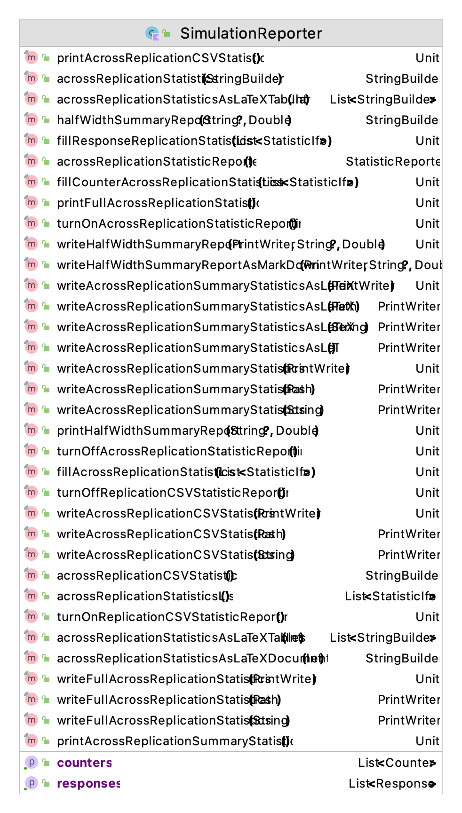
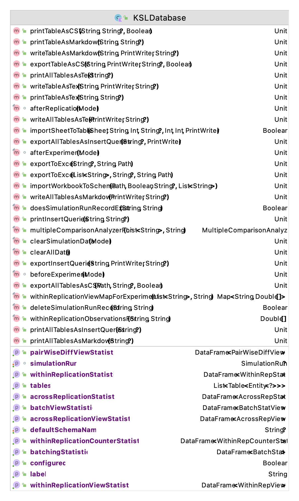
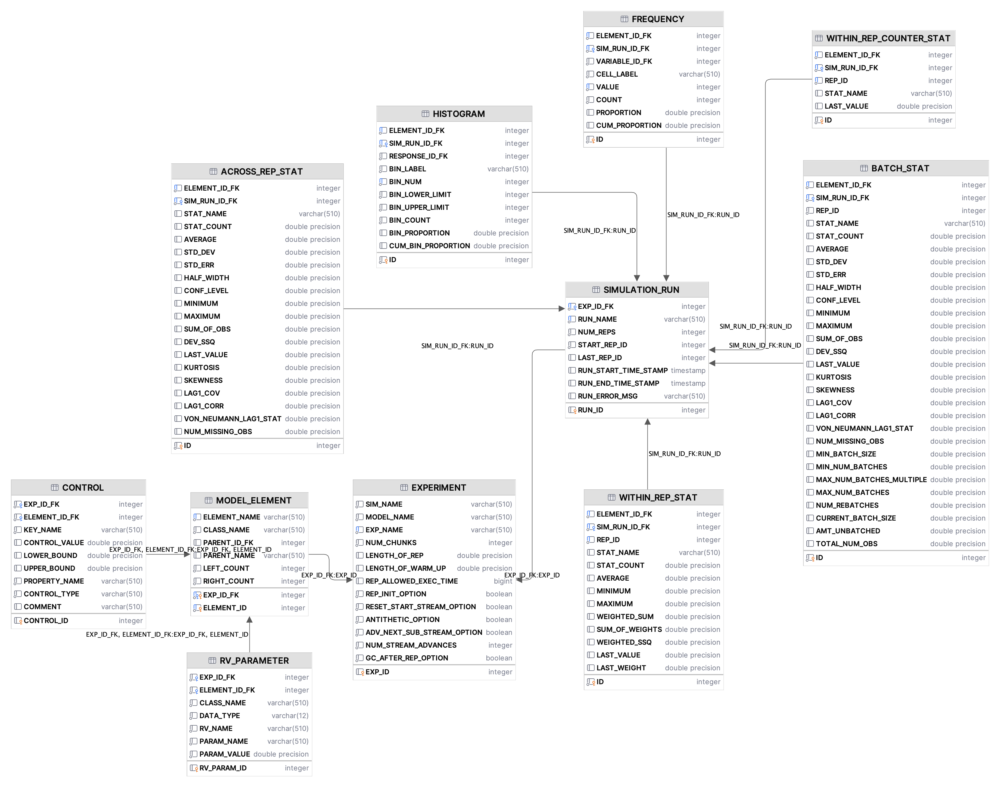
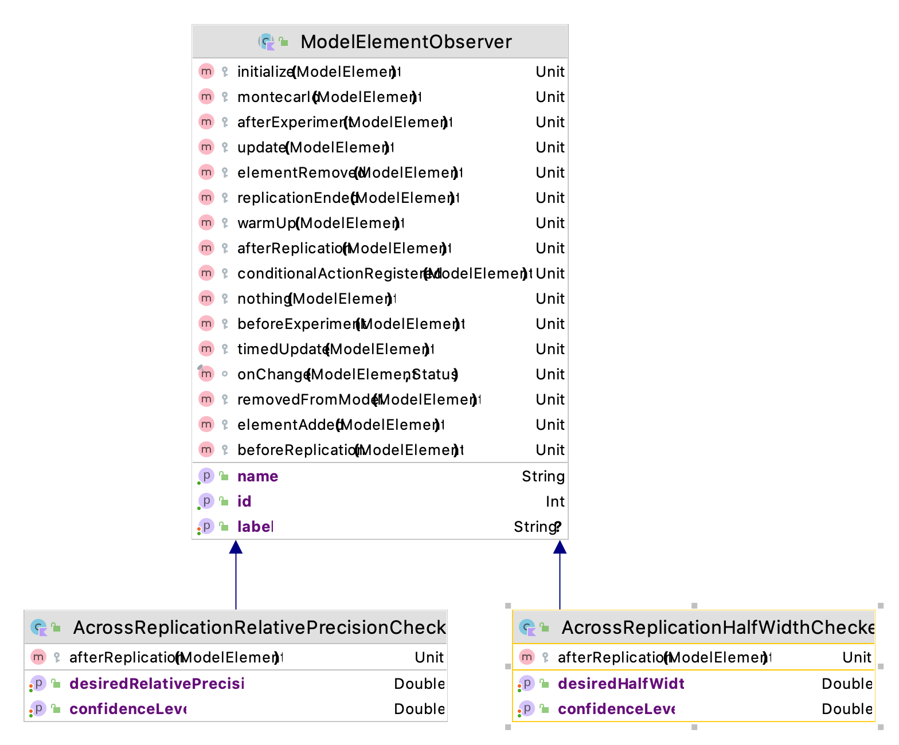
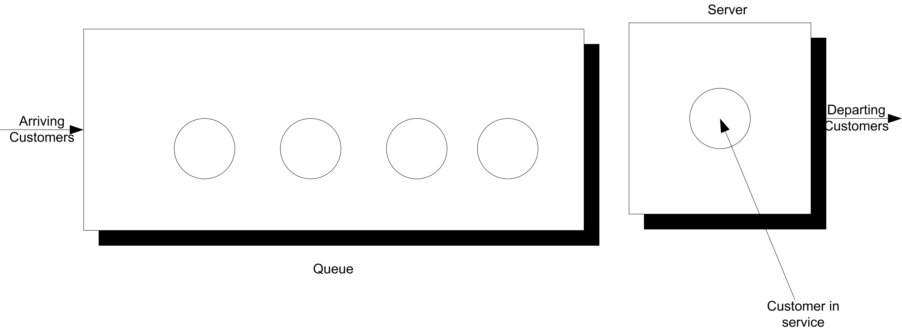
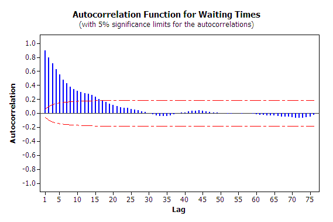
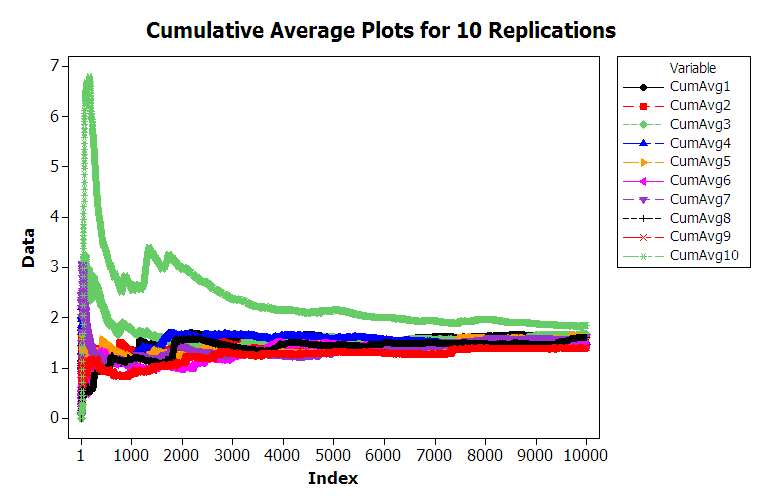
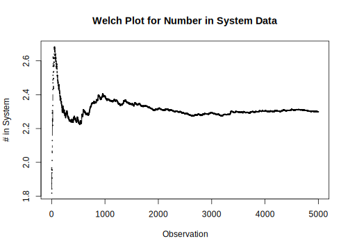

# Analyzing and Accessing Simulation Output {#simoa}

**[LEARNING OBJECTIVES]{.smallcaps}**

-   To be able to recognize the different types of statistical
    quantities used within and produced by simulation models.

-   To be able to analyze finite horizon simulations via the method of
    replications.

-   To be able to analyze infinite horizon simulations via the method of
    batch means and the method of replication-deletion.

-   To be able to compare simulation alternatives and make valid
    decisions based on the statistical output of a simulation.
    
-   To be able to access output from KSL simulation models in many different forms.

Because the inputs to the simulation are random, the outputs from the simulation
are also random. You can think of a simulation model as
a function that maps inputs to outputs. This chapter presents the
statistical analysis of the outputs from simulation models. 

In addition, a number of issues that are related to the proper execution
of simulation experiments are presented. For example, the simulation
outputs are dependent upon the input random variables, input parameters,
and the initial conditions of the model. Initial conditions refer to the
starting conditions for the model, i.e. whether or not the system starts
"empty and idle". The effect of initial conditions on steady state
simulations will be discussed in this chapter.

Input parameters are related to the controllable and uncontrollable
factors associated with the system. For a simulation model, *all* input
parameters are controllable; however, in the system being modeled we
typically have control over only a limited set of parameters. Thus, in
simulation you have the unique ability to control the random inputs into
your model. This chapter will discuss how to take advantage of
controlling the random inputs.

Input parameters can be further classified as decision variables. That
is, those parameters of interest that you want to change in order to
test model configurations for decision-making. The structure of the
model itself may be considered a decision variable when you are trying
to optimize the performance of the system. When you change the input
parameters for the simulation model and then execute the simulation, you
are simulating a different design alternative.

This chapter describes how to analyze the output from a single design
alternative and how to analyze the results of multiple design
alternatives. The focus of this chapter is on understanding the types of data produced by a discrete-event simulation and how to analyze that data.  The KSL facilitates the capture and analysis of various statistical quantities. This chapter will present the most common and useful approaches to instrumenting a model and extracting the captured data. Although the focus will be on demonstrating this functionality on simple models, you will readily see how easily the approaches can be scaled up to larger models with substantial output requirements.

::: {.infobox .note data-latex="{note}"}
**NOTE!**
This chapter provides a series of example Kotlin code that illustrates the use of KSL constructs for working with data generated from KSL models. The full source code of the examples can be found in the accompanying `KSLExamples` project associated with the [KSL repository](https://github.com/rossetti/KSL). The files for each example of this chapter can be found [here](https://github.com/rossetti/KSL/tree/main/KSLExamples/src/main/kotlin/ksl/examples/book/chapter5).
:::

To begin the discussion you need to build an understanding
of the types of statistical quantities that may be produced by a
simulation experiment.

## Types of Statistical Variables {#simoadatatypes}

A simulation experiment occurs when the modeler sets the input
parameters to the model and executes the simulation. This causes events
to occur and the simulation model to evolve over time. During the
execution of the simulation, the behavior of the system is observed and
various statistical quantities computed. When the simulation reaches its
termination point, the statistical quantities are summarized in the form
of output reports.

A simulation experiment may be for a single replication of the model or
may have multiple replications. A *replication* is the generation of one
sample path which represents the evolution of the system from its
initial conditions to its ending conditions. If you have multiple
replications within an experiment, each replication represents a
different sample path, starting from the same initial conditions and
being driven by the same input parameter settings. Because the
randomness within the simulation can be controlled, the underlying
random numbers used within each replication of the simulation can be
made to be independent. Thus, as the name implies, each replication is
an independently generated "repeat" of the simulation.

Within a single sample path (replication), the statistical behavior of
the model can be observed.

::: {.definition #WRS name="Within Replication Statistic"}
The statistical quantities collected during a replication are called *within replication
statistics*.
:::

::: {.definition #ARS name="Across Replication Statistic"}
The statistical quantities
collected across replications are called *across replication
statistics*. Across replication statistics are collected based on the
observation of the final values of within replication statistics.
:::

*Within replication statistics* are collected based on the observation
of the sample path and include observations on entities, state changes,
etc. that occur during a sample path execution. The observations used to
form within replication statistics are not likely to be independent and
identically distributed. Since across replication statistics are formed
from the final values of within replication statistics, one observation
per replication is available. Since each replication is considered
independent, the observations that form the sample for across
replication statistics are likely to be independent and identically
distributed. The statistical properties of within and across replication
statistics are inherently different and require different methods of
analysis. Of the two, within replication statistics are the more
challenging from a statistical standpoint.

As we saw in section \@ref(QHandExample) of Chapter \@ref(introDEDS), there are two primary
types of observations: *tally* and *time-persistent*. Tally data
represent a sequence of equally weighted data values that do not persist
over time. This type of data is associated with the duration or interval of time that an object is in a particular state or how often the object is in a particular state. As such it is observed by marking
(tallying) the time that the object enters the state and the time that
the object exits the state. Once the state change takes place, the
observation is over (it is gone, it does not persist, etc.). If we did
not observe the state change, then we would have missed the observation.
The time spent in queue, the count of the number of customers served,
whether or not a particular customer waited longer than 10 minutes are
all examples of tally data. We have used the KSL `Response` class to collect this type of data.  

Time-persistent observations represent a sequence of values that persist
over some specified amount of time with that value being weighted by the
amount of time over which the value persists. These observations are
directly associated with the values of the state variables within the
model. The value of a time-persistent observation persists in time. For
example, the number of customers in the system is a common state
variable. If we want to collect the average number of customers in the
system *over time*, then this will be a time-persistent statistic. While
the value of the number of customers in the system changes at discrete
points in time, it holds (or persists with) that value over a duration
of time. This is why it is called a time-persistent variable. We have used the KSL `TWResponse` class to collect this type of data.

Figure \@ref(fig:TallyTimePersistent) illustrates a single sample path for the
number of customers in a queue over a period of time. From this sample
path, events and subsequent statistical quantities can be observed.

<div class="figure">

<p class="caption">(\#fig:TallyTimePersistent)Sample Path for Tally and Time-Persistent Data</p>
</div>

-   Let $A_i \; i = 1 \ldots n$ represent the time that the $i^{th}$
    customer enters the queue

-   Let $D_i \; i = 1 \ldots n$ represent the time that the $i^{th}$
    customer exits the queue

-   Let $W_i = D_i - A_i \; i = 1 \ldots n$ represent the time that the
    $i^{th}$ customer spends in the queue

Thus, $W_i \; i = 1 \ldots n$ represents the sequence of wait times for
the queue, each of which can be individually observed and tallied. This
is tally type data because the customer enters a state (the queued
state) at time $A_i$ and exits the state at time $D_i$. When the
customer exits the queue at time $D_i$, the waiting time in queue,
$W_i = D_i - A_i$ can be observed or tallied. $W_i$ is only observable
at the instant $D_i$. This makes $W_i$ tally based data and, once
observed, its value never changes again with respect to time. Tally data
is most often associated with an entity that is moving through states
that are implied by the simulation model. An observation becomes
available each time the entity enters and subsequently exits the state.

With tally data it is natural to compute the sample average as a measure
of the central tendency of the data. Assume that you can observe $n$
customers entering and existing the queue, then the average waiting time
across the $n$ customers is given by:

$$\bar{W}(n) = \dfrac{1}{n} \sum_{i=1}^{n} W_{i}$$

Many other statistical quantities, such as the minimum, maximum, and
sample variance, etc. can also be computed from these observations.
Unfortunately, within replication data is often (if not always)
correlated with respect to time. In other words, within replication
observations like, $W_i \, i = 1 \ldots n$, are not statistically
independent. In fact, they are likely to also not be identically
distributed. Both of these issues will be discussed when the analysis of
infinite horizon or steady state simulation models is presented.

The other type of statistical variable encountered within a replication
is based on time-persistent observations. Let $q(t), t_0 < t \leq t_n$
be the number of customers in the queue at time $t$. Note that
$q(t) \in \lbrace 0,1,2,\ldots\rbrace$. As illustrated in
Figure \@ref(fig:TallyTimePersistent), $q(t)$ is a function of time (a step
function in this particular case). That is, for a given (realized)
sample path, $q(t)$ is a function that returns the number of customers
in the queue at time $t$.

In simulation, we compute the time-average:

$$\bar{L}_q(n) = \frac{1}{t_n - t_0} \int_{t_0}^{t_n} q(t) \mathrm{d}t$$

This function represents the average with respect to time of the given
state variable. This type of statistical variable is called
time-persistent because $q(t)$ is a function of time (i.e. it persists
over time).

Tally-based statistics and time-persistent statistics both are collected **during** a replication and form *within replication* statistical quantities.  When we compute statistics across the replications, we call these statistics *across replication* statistics.

Now that we understand the type of data that occurs within a
replication, we need to develop an understanding for the types of
simulation situations that require specialized statistical analysis. The
next section introduces this important topic.

## Types of Simulation With Respect To Output Analysis {#simoasimtypes}

When modeling a system, specific measurement goals for the simulation
responses are often required. The goals, coupled with how the system
operates, will determine how you execute and analyze the simulation
experiments. In planning the experimental analysis, it is useful to
think of simulations as consisting of two main categories related to the
period of time over which a decision needs to be made:

Finite horizon

:   In a finite-horizon simulation, a well define ending time or ending
    condition can be specified which clearly defines the end of the
    simulation. Finite horizon simulations are often called
    *terminating* simulations, since there are clear terminating
    conditions.

Infinite horizon

:   In an infinite horizon simulation, there is no well defined ending
    time or condition. The planning period is over the life of the
    system, which from a conceptual standpoint lasts forever. Infinite
    horizon simulations are often called *steady state* simulations
    because in an infinite horizon simulation you are often interested
    in the long-term or steady state behavior of the system.

For a finite horizon simulation, an event or condition associated with
the system is present which indicates the end of each simulation
replication. This event can be specified in advance or its time of
occurrence can be a random variable. If it is specified in advance, it
is often because you do not want information past that point in time
(e.g. a 3 month planning horizon). It might be a random variable in the
case of the system stopping when a condition is met. For example, an
ending condition may be specified to stop the simulation when there are
no entities left to process. Finite horizon simulations are very common
since most planning processes are finite. A few example systems
involving a finite horizon include:

-   Bank: bank doors open at 9am and close at 5pm

-   Military battle: simulate until force strength reaches a critical
    value

-   Filling a customer order: suppose a new contract is accepted to
    produce 100 products, you might simulate the production of the 100
    products to see the cost, delivery time, etc.

For a finite horizon simulation, each replication represents a sample
path of the model for one instance of the finite horizon. The length of
the replication corresponds to the finite horizon of interest. For
example, in modeling a bank that opens at 9 am and closes at 5 pm, the
length of the replication would be 8 hours.

In contrast to a finite horizon simulation, an infinite horizon
simulation has no natural ending point. Of course, when you actually
simulate an infinite horizon situation, a finite replication length must
be specified. Hopefully, the replication length will be long enough to
satisfy the goal of observing long run performance. Examples of infinite
horizon simulations include:

-   A factory where you are interested in measuring the steady state
    throughput.

-   A hospital emergency room which is open 24 hours a day, 7 days of
    week.

-   A telecommunications system which is always operational.

Infinite horizon simulations are often tied to systems that operate
continuously and for which the long-run or steady state behavior needs
to be estimated.

Because infinite horizon simulations often model situations where the
system is always operational, they often involve the modeling of
non-stationary processes. In such situations, care must be taken in
defining what is meant by long-run or steady state behavior. For
example, in an emergency room that is open 24 hours a day, 365 days per
year, the arrival pattern to such a system probably depends on time.
Thus, the output associated with the system is also non-stationary. The
concept of steady state implies that the system has been running so long
that the system's behavior (in the form of performance measures) no
longer depends on time; however, in the case of the emergency room since
the inputs depend on time so do the outputs. In such cases it is often
possible to find a period of time or cycle over which the non-stationary
behavior repeats. For example, the arrival pattern to the emergency room
may depend on the day of the week, such that every Monday has the same
characteristics, every Tuesday has the same characteristics, and so on
for each day of the week. Thus, on a weekly basis the non-stationary
behavior repeats. You can then define your performance measure of
interest based on the appropriate non-stationary cycle of the system.
For example, you can define Y as the expected waiting time of patients
*per week*. This random variable may have performance that can be
described as long-term. In others, the long-run weekly performance of
the system may be stationary. This type of simulation has been termed
steady state cyclical parameter estimation within [@law2007simulation].

Of the two types of simulations, finite horizon simulations are easier
to analyze. Luckily they are the more typical type of simulation found
in practice. In fact, when you think that you are faced with an infinite
horizon simulation, you should very carefully evaluate the goals of your
study to see if they can just as well be met with a finite planning
horizon. The analysis of both of these types of simulations will be
discussed in this chapter through examples.

## Analysis of Finite Horizon Simulations {#simoafinhorizon}

This section illustrates how tally-based and time-persistent statistics
are collected within a replication and how statistics are collected
across replications. Finite horizon simulations can be analyzed by
traditional statistical methodologies that assume a random sample, i.e.
independent and identically distributed random variables. A simulation
experiment is the collection of experimental design points (specific
input parameter values) over which the behavior of the model is
observed. For a particular design point, you may want to repeat the
execution of the simulation multiple times to form a sample at that
design point. To get a random sample, you execute the simulation
starting from the same initial conditions and ensure that the random
numbers used within each replication are independent. Each replication
must also be terminated by the same conditions. It is very important to
understand that independence is achieved across replications, i.e. the
replications are independent. The data *within* a replication may or may
not be independent.

The method of *independent replications* is used to analyze finite
horizon simulations. Suppose that $n$ replications of a simulation are
available where each replication is terminated by some event $E$ and
begun with the same initial conditions. Let $Y_{rj}$ be the $j^{th}$
observation on replication $r$ for $j = 1,2,\cdots,m_r$ where $m_r$ is
the number of observations in the $r^{th}$ replication, and
$r = 1,2,\cdots,n$, and define the sample average for each replication
to be:

$$\bar{Y}_r = \frac{1}{m_r} \sum_{j=1}^{m_r} Y_{rj}$$

If the data are time-based then,

$$\bar{Y}_r = \frac{1}{T_E}  \int_0^{T_E} Y_r(t) \mathrm{d}t$$

$\bar{Y}_r$ is the sample average based on the observation within the
$r^{th}$ replication. It is a random variable that can be observed at
the end of each replication, therefore, $\bar{Y}_r$ for
$r = 1,2,\ldots,n$ forms a random sample. Thus, standard statistical
analysis of the random sample can be performed.

To make this concrete, suppose that you are examining a bank that opens
with no customers at 9 am and closes its doors at 5 pm to prevent
further customers from entering. Let, $W_{rj} j = 1,\ldots,m_r$,
represents the sequence of waiting times for the customers that entered
the bank between 9 am and 5 pm on day (replication) $r$ where $m_r$ is
the number of customers who were served between 9 am and 5 pm on day
$r$. For simplicity, ignore the customers who entered before 5 pm but
did not get served until after 5 pm. Let $N_r (t)$ be the number of
customers in the system at time $t$ for day (replication) $r$. Suppose
that you are interested in the mean daily customer waiting time and the
mean number of customers in the bank on any given 9 am to 5 pm day, i.e.
you are interested in $E[W_r]$ and $E[N_r]$ for any given day. At the
end of each replication, the following can be computed:

$$\bar{W}_r = \frac{1}{m_r} \sum_{j=1}^{m_r} W_{rj}$$

$$\bar{N}_r = \dfrac{1}{8}\int_0^8 N_r(t)\ \mathrm{d}t$$

At the end of all replications, random samples: $\bar{W}_r$ and
$\bar{N}_r$ are available from which sample averages, standard
deviations, confidence intervals, etc. can be computed. Both of these
samples are based on observations of within replication data.

Both $\bar{W_r}$ and $\bar{N_r}$ for $r = 1,2,\ldots,n$ are averages of many observations
within the replication. Sometimes, there may only be one observation
based on the entire replication. For example, suppose that you are
interested in the probability that someone is still in the bank when the
doors close at 5 pm, i.e. you are interested in
$\theta = Pr\{N(t = 5 pm) > 0\}$. In order to estimate this probability,
an indicator variable can be defined within the simulation and observed
each time the condition was met or not. For this situation, an indicator
variable,$I_r$, for each replication can be defined as follows:

$$
I_r =
   \begin{cases}
     1 & N(t = 5 pm) > 0\\
     0 & N(t = 5 pm) \leq 0 \\
  \end{cases}
$$

Therefore, at the end of the replication, the simulation must tabulate
whether or not there are customers in the bank and record the value of
this indicator variable. Since this happens only once per replication, a
random sample of the $I_r$ for $r = 1,2,\ldots,n$ will be available after all
replications have been executed.  We can use
the observations of the indicator variable to estimate the desired
probability.

Since the analysis of the system will be based on a random sample, the
key design criteria for the experiment will be the required number of
replications. In other words, you need to determine the sample size.

Because confidence intervals may form the basis for decision making, you
can use the confidence interval half-width in determining the sample
size. For example, in estimating $E[W_r]$ for the bank example, you
might want to be 95% confident that you have estimated the true waiting
time to within $\pm 2$ minutes.

Thus, all of the sample size determination methods discussed in Section \@ref(ch3SampleSize) of Chapter \@ref(mcm) can be applied.

## Capturing Output for a Simple Finite Horizon Simulation {#simoafinhorizonex}

In this section, we will build a model for a simple finite horizon simulation with a couple of new modeling issues to handle.  However, the primary focus of this section is to illustrate how to capture and report statistical results using the KSL.  Let's start with an outline of the example system to be modeled.

***
::: {.example #simpleFHS name="Pallet Processing Work Center"}
A truckload of pallets arrives overnight to a facility. Within the truck there are a random number of pallets.  The number of pallets can be modeled with a binomial random variable with mean of 80 and a variance of 16. This translates to parameters $n=100$ and $p=0.8$.  Each individual pallet is unloaded and transported to a work center for processing, one at a time, sequentially until all pallets are delivered.  The unloading and transport time is exponentially distributed with a mean of 5 minutes.  Once a pallet arrives at the workcenter it requires 1 of 2 workers to be processed. If a worker is available, the pallet is immediately processed by a worker.  If no workers are available, the pallet waits in a FIFO line until a worker becomes available.  The time to process the pallet involves breaking down and processing each package on the pallet. The time to process an entire pallet can be modeled with a triangular distribution with a minimum time of 8 minutes, a most likely time of 12 minutes, and a maximum time of 15 minutes.  The work at the workcenter continues until all pallets are processed for the day. The facility manager is interested in how long the pallets wait at the workcenter and  how long it takes for all pallets to be completed on a given day. In addition, the manager is interested in the probability that there is overtime.  That is, the chance that the total time to process the pallets is more than 480 minutes.
:::

***

This example is a finite horizon simulation because there are a finite (but random) number of pallets to be processed such that the simulation will run until all pallets are processed.  The system starts with an arrival of a random number of pallets, that are then processed until all pallets are completed. Therefore there is a well defined starting and ending point for the simulation.  Although we do no know when the simulation will end, there is a well-specified condition (all pallets processed) that governs the ending of the simulation.  Thus, while the time horizon may be random, it is still finite. Conceptually, this modeling situation is very similar to the pharmacy model discussed in Section \@ref(introDEDSPharmacy). Thus, the implementation of the model will be very similar to the pharmacy model example, but with a couple of minor differences to handle the finite number of pallets that arrive and to capture statistics about the total processing time. The full code is available with the examples.  This presentation focuses on new concepts.

As for previous modeling, we define and use random variables to represent the randomness within the model.

```kt
class PalletWorkCenter(
    parent: ModelElement,
    numWorkers: Int = 2,
    numPallets: RandomIfc = BinomialRV(0.8, 100, 1),
    transportTime: RandomIfc = ExponentialRV(5.0, 2),
    processingTime: RandomIfc = TriangularRV(8.0, 12.0, 15.0, 3)
) :
    ModelElement(parent, theName = null) {
    
    init {
        require(numWorkers >= 1) { "The number of workers must be >= 1" }
    }
    
    private val myProcessingTimeRV: RandomVariable = RandomVariable(this, processingTime)
    val processingTimeRV: RandomSourceCIfc
        get() = myProcessingTimeRV
    private val myTransportTimeRV: RandomVariable = RandomVariable(parent, transportTime)
    val transportTimeRV: RandomSourceCIfc
        get() = myTransportTimeRV
    private val myNumPalletsRV: RandomVariable = RandomVariable(parent, numPallets)
    val numPalletsRV: RandomSourceCIfc
        get() = myNumPalletsRV
```

Notice that we defined the random variables as default parameters of the constructor and assign them to relevant properties within the class body. To capture the total time to process the pallets and the probability of overtime, we define two response variables. Notice that the probability of overtime is implemented as an `IndicatorResponse` that observes the total processing time.

```kt
    private val myTotalProcessingTime = Response(this, "Total Processing Time")
    val totalProcessingTime: ResponseCIfc
        get() = myTotalProcessingTime
    private val myOverTime: IndicatorResponse = IndicatorResponse({ x -> x >= 480.0 }, myTotalProcessingTime, "P{total time > 480 minutes}")
    val probOfOverTime: ResponseCIfc
        get() = myOverTime
```

The main logic of arrivals to the work center and completions of the pallets is essentially the same as previously discussed.  The main difference here is that there is a finite number of pallets that need to be created.  While there are many ways to represent this situation (e.g. use an `EventGenerator`), this presentation keeps it simple.  The first two lines of this code snippet, capture the functional references for the end of service and end of transport event actions. We have seen this kind of code before.  Then, a variable, `numToProcess,` is defined. This variable will hold the randomly generated number of pallets to process and is assigned in the `initialize()` method.  Within the `initialize()` method, the transport of the first pallet is scheduled with the provided transport time random variable.

```kt
    private val endServiceEvent = this::endOfService
    private val endTransportEvent = this::endTransport
    
    var numToProcess: Int = 0
    
    override fun initialize() {
        numToProcess = myNumPalletsRV.value.toInt()
        schedule(endTransportEvent, myTransportTimeRV)
    }

    private fun endTransport(event: KSLEvent<Nothing>) {
        if (numToProcess >= 1) {
            schedule(endTransportEvent, myTransportTimeRV)
            numToProcess = numToProcess - 1
        }
        val pallet = QObject()
        arrivalAtWorkCenter(pallet)
    }
```

The `endTransport` event action checks to see if there are more pallets to transport and if so schedules the end of the next transport.  In addition, it creates a `QObject` that is sent to the work center for processing via the `arrivalAtWorkCenter` method. As shown in the following code, the arrival and end of service actions are essentially the same as in the previous pharmacy example.

```kt
    private fun arrivalAtWorkCenter(pallet: QObject) {
        myNS.increment() // new pallet arrived
        myPalletQ.enqueue(pallet) // enqueue the newly arriving pallet
        if (myNumBusy.value < numWorkers) { // server available
            myNumBusy.increment() // make server busy
            val nextPallet: QObject? = myPalletQ.removeNext() //remove the next pallet
            // schedule end of service, include the pallet as the event's message
            schedule(endServiceEvent, myProcessingTimeRV, nextPallet)
        }
    }

    private fun endOfService(event: KSLEvent<QObject>) {
        myNumBusy.decrement() // pallet is leaving server is freed
        if (!myPalletQ.isEmpty) { // queue is not empty
            val nextPallet: QObject? = myPalletQ.removeNext() //remove the next pallet
            myNumBusy.increment() // make server busy
            // schedule end of service
            schedule(endServiceEvent, myProcessingTimeRV, nextPallet)
        }
        departSystem(event.message!!)
    }
```

Finally, we have the statistical collection code. The `departSystem` method captures the time in the system and the number of pallet processed.  Howevever, we see something new within a method called `replicationEnded()`

```kt
    private fun departSystem(completedPallet: QObject) {
        mySysTime.value = (time - completedPallet.createTime)
        myNS.decrement() // pallet left system
        myNumProcessed.increment()
    }

    override fun replicationEnded() {
        myTotalProcessingTime.value = time
    }
```

Recall the overview of how the underlying simulation code is processed from Section \@ref(introDEDSOverview) of Chapter \@ref(introDEDS).  Step 2(e) of that discussion notes that the actions associated with the end of replication logic is automatically executed.  Just like the `initialize()` method every model element has a `replicationEnded()` method. This method is called automatically for every model element infinitesimally before the end of the simulation replication. Thus, statistical collection can be implemented without the concern that the statistical accumulators will be cleared *after* the replication. Thus, observations within the `replicationEnded()` method are still within the replication (i.e. they produce within replication data). In the above code snippet, the `Response` `myTotalProcessingTime` is assigned the current simulation time, which happens to be the time at which the processing of the pallets was completed. This occurs because after the appropriate number of transports are scheduled, no further pallets arrive to be processed at the work center. Thus, eventually, there will be no more events to process, and according to Step 2(d) of Section \@ref(introDEDSOverview), this will cause the execution of the current replication to stop and proceed with any end of replication model logic. Thus, this logic captures the total time to process the pallets. In addition, because an `IndicatorResponse` was also attached to `myTotalProcessingTime` the collection of the probability of over time will also be captured.  The basic results of the model are as follows:

**Statistical Summary Report**

|Name| Count| Average| Half-Width|
|:---:| :---:| :---:| :---:|
|NumBusyWorkers| 10.0| 1.9174709267367938| 0.04615844720276659|
|PalletQ:NumInQ| 10.0| 7.397061723049351| 2.18200524048673|
|PalletQ:TimeInQ| 10.0| 44.65967086387171| 12.756611150942986|
|Num Pallets at WC| 10.0| 9.314532649786145| 2.2091925024424928|
|System Time| 10.0| 56.32044792861602| 12.742871337228127|
|Total Processing Time| 10.0| 489.20830013021094| 16.326885695752644|
|P{total time > 480 minutes}| 10.0| 0.6| 0.369408717216522|
|Num Processed| 10.0| 80.4| 2.5054518188054615|

If you are paying attention to the presentation of previous summary statistics, you will notice that the last summary report is presented in a nice tabular format. This output was actually generated by the KSL class `SimulationReporter,` which can make MarkDown output.  This and additional output capturing will be discussed in the next section.

### KSL Functionality for Capturing Statistical Results {#simoaCapture}

This section presents a number of methods that can be used to capture and report the results from a KSL model.  The following topics will be covered:

- Automatically capturing within and across replication results to comma separated value files
- Capturing replication data via the `ReplicationDataCollector` class
- Tracing a response variable via the `ResponseTrace` class
- Using the `SimulationReporter` class to output results in MarkDown and adjusting the confidence level of the reports
- Capturing all simulation results to a database using the `KSLDatabaseObserver` class and illustrating how to get results from the database

These topics will be discussed within the context of the pallet example of the previous section. The main method for running the pallet example was expanded to illustrate additional data collection functionality.  It is unlikely that you will want to capture results both as comma separated value files and using a database, but both approaches are illustrated. If you are familiar with database technologies, then using the database will likely serve most if not all of your needs.

```kt
fun main() {
    val model = Model("Pallet Processing", autoCSVReports = true)
    model.numberOfReplications = 10
    model.experimentName = "Two Workers"
    // add the model element to the main model
    val palletWorkCenter = PalletWorkCenter(model)

    // demonstrate how to capture a trace of a response variable
    val trace = ResponseTrace(palletWorkCenter.numInSystem)

    // demonstrate capture of replication data for specific response variables
    val repData = ReplicationDataCollector(model)
    repData.addResponse(palletWorkCenter.totalProcessingTime)
    repData.addResponse(palletWorkCenter.probOfOverTime)

    // demonstrate capturing data to database with an observer
    val kslDatabaseObserver = KSLDatabaseObserver(model)

    // simulate the model
    model.simulate()

    // demonstrate that reports can have specified confidence level
    val sr = model.simulationReporter
    sr.printHalfWidthSummaryReport(confLevel = .99)

    // show that report can be written to MarkDown as a table in the output directory
    var out = model.outputDirectory.createPrintWriter("hwSummary.md")
    sr.writeHalfWidthSummaryReportAsMarkDown(out)
    println()

    //output the collected replication data to prove it was captured
    println(repData)

    // use the database to create a Kotlin DataFrame
    val dataFrame = kslDatabaseObserver.db.acrossReplicationViewStatistics
    println(dataFrame)

    model.experimentName = "Three Workers"
    palletWorkCenter.numWorkers = 3
    model.simulate()

    out = model.outputDirectory.createPrintWriter("AcrossExperimentResults.md")
    kslDatabaseObserver.db.writeTableAsMarkdown("ACROSS_REP_VIEW", out)
}
```

Let's start with automatically collecting responses within comma separated value (CSV) files and how to find them in the file system. 

The first thing to note is how the output from a KSL simulation is organized. The KSL model class allows the user to specify the output directory for the model results.  If the user does not specify an output directory, the default directory will be within a folder called `kslOutput` that will be created within the same folder that the model was executed.  That is, the current working directory for the user. Within the `kslOutput` directory all KSL related work will be stored.  In particular, a unique directory derived from the name of the simulation will be created to hold all the results from a particular simulation model's execution. These locations can be changed, but the defaults are well-specified and useful.

<div class="figure" style="text-align: center">

<p class="caption">(\#fig:KSLOutputDir)Organization of KSL Output Directories</p>
</div>

Figure \@ref(fig:KSLOutputDir) illustrates the output directory after running the pallet model. You should see the `kslOutput` directory and a directory called `Pallet_Processing_OutputDir.` Within the  `Pallet_Processing_OutputDir` directory there are folders called `db` and `excel.`  These folders are the default directories for holding database related files and Excel related output files.  Within the `db` folder there is a file called `MainModel.db,` which is an SQLite database that was created to hold the KSL simulation results. Then, there are two files called `hwSummary.md` and `kslOutput.txt.` There are also three CSV files, two labeled with `_ExperimentReport.csv` and `_ReplicationReport.csv`, and one labeled with `_Trace.csv.` This labeling scheme is the default and is derived from the context of the item.  The setting of the `autoCSVReports` option to true when creating the model is what caused the two files labeled with `_ExperimentReport.csv` and with  `_ReplicationReport.csv` to be produced. The following table is from `MainModel_CSVReplicationReport.csv.`

<table class="table" style="font-size: 10px; margin-left: auto; margin-right: auto;">
<caption style="font-size: initial !important;">(\#tab:unnamed-chunk-1)(\#tab:Ch5WRD)First 8 columns and 5 Rows of MainModel_CSVReplicationReport.csv.</caption>
 <thead>
  <tr>
   <th style="text-align:left;"> SimName </th>
   <th style="text-align:left;"> ModelName </th>
   <th style="text-align:left;"> ExpName </th>
   <th style="text-align:right;"> RepNum </th>
   <th style="text-align:left;"> ResponseType </th>
   <th style="text-align:right;"> ResponseID </th>
   <th style="text-align:left;"> ResponseName </th>
   <th style="text-align:left;"> Statistic.Name </th>
  </tr>
 </thead>
<tbody>
  <tr>
   <td style="text-align:left;"> Pallet Processing </td>
   <td style="text-align:left;"> MainModel </td>
   <td style="text-align:left;"> Two Workers </td>
   <td style="text-align:right;"> 1 </td>
   <td style="text-align:left;"> TWResponse </td>
   <td style="text-align:right;"> 7 </td>
   <td style="text-align:left;"> NumBusyWorkers </td>
   <td style="text-align:left;"> NumBusyWorkers </td>
  </tr>
  <tr>
   <td style="text-align:left;"> Pallet Processing </td>
   <td style="text-align:left;"> MainModel </td>
   <td style="text-align:left;"> Two Workers </td>
   <td style="text-align:right;"> 1 </td>
   <td style="text-align:left;"> TWResponse </td>
   <td style="text-align:right;"> 9 </td>
   <td style="text-align:left;"> PalletQ:NumInQ </td>
   <td style="text-align:left;"> PalletQ:NumInQ </td>
  </tr>
  <tr>
   <td style="text-align:left;"> Pallet Processing </td>
   <td style="text-align:left;"> MainModel </td>
   <td style="text-align:left;"> Two Workers </td>
   <td style="text-align:right;"> 1 </td>
   <td style="text-align:left;"> Response </td>
   <td style="text-align:right;"> 10 </td>
   <td style="text-align:left;"> PalletQ:TimeInQ </td>
   <td style="text-align:left;"> PalletQ:TimeInQ </td>
  </tr>
  <tr>
   <td style="text-align:left;"> Pallet Processing </td>
   <td style="text-align:left;"> MainModel </td>
   <td style="text-align:left;"> Two Workers </td>
   <td style="text-align:right;"> 1 </td>
   <td style="text-align:left;"> TWResponse </td>
   <td style="text-align:right;"> 11 </td>
   <td style="text-align:left;"> Num Pallets at WC </td>
   <td style="text-align:left;"> Num Pallets at WC </td>
  </tr>
  <tr>
   <td style="text-align:left;"> Pallet Processing </td>
   <td style="text-align:left;"> MainModel </td>
   <td style="text-align:left;"> Two Workers </td>
   <td style="text-align:right;"> 1 </td>
   <td style="text-align:left;"> Response </td>
   <td style="text-align:right;"> 12 </td>
   <td style="text-align:left;"> System Time </td>
   <td style="text-align:left;"> System Time </td>
  </tr>
  <tr>
   <td style="text-align:left;"> Pallet Processing </td>
   <td style="text-align:left;"> MainModel </td>
   <td style="text-align:left;"> Two Workers </td>
   <td style="text-align:right;"> 1 </td>
   <td style="text-align:left;"> Response </td>
   <td style="text-align:right;"> 14 </td>
   <td style="text-align:left;"> Total Processing Time </td>
   <td style="text-align:left;"> Total Processing Time </td>
  </tr>
</tbody>
</table>

As can be seen in the previous table, the replication report has information about the simulation, model, experiment, replication number, response type, and name.  In total, the replication report has 19 columns and will contain every replication observation for every response variable in the model. Notice that the experiment name is the string ("Two Workers") that was provided for the experiment's name on line 4 of the main method.

The following table illustrates columns 8 through 12 of the file. 

<table class="table" style="font-size: 10px; margin-left: auto; margin-right: auto;">
<caption style="font-size: initial !important;">(\#tab:unnamed-chunk-2)(\#tab:Ch5WRD)Next 5 columns and 5 Rows of MainModel_CSVReplicationReport.csv.</caption>
 <thead>
  <tr>
   <th style="text-align:left;"> Statistic.Name </th>
   <th style="text-align:right;"> Count </th>
   <th style="text-align:right;"> Average </th>
   <th style="text-align:right;"> Minimum </th>
   <th style="text-align:right;"> Maximum </th>
  </tr>
 </thead>
<tbody>
  <tr>
   <td style="text-align:left;"> NumBusyWorkers </td>
   <td style="text-align:right;"> 79 </td>
   <td style="text-align:right;"> 1.889149 </td>
   <td style="text-align:right;"> 0.00000 </td>
   <td style="text-align:right;"> 2.00000 </td>
  </tr>
  <tr>
   <td style="text-align:left;"> PalletQ:NumInQ </td>
   <td style="text-align:right;"> 150 </td>
   <td style="text-align:right;"> 3.288616 </td>
   <td style="text-align:right;"> 0.00000 </td>
   <td style="text-align:right;"> 7.00000 </td>
  </tr>
  <tr>
   <td style="text-align:left;"> PalletQ:TimeInQ </td>
   <td style="text-align:right;"> 76 </td>
   <td style="text-align:right;"> 20.874804 </td>
   <td style="text-align:right;"> 0.00000 </td>
   <td style="text-align:right;"> 41.56455 </td>
  </tr>
  <tr>
   <td style="text-align:left;"> Num Pallets at WC </td>
   <td style="text-align:right;"> 152 </td>
   <td style="text-align:right;"> 5.177765 </td>
   <td style="text-align:right;"> 0.00000 </td>
   <td style="text-align:right;"> 9.00000 </td>
  </tr>
  <tr>
   <td style="text-align:left;"> System Time </td>
   <td style="text-align:right;"> 76 </td>
   <td style="text-align:right;"> 32.866354 </td>
   <td style="text-align:right;"> 12.61226 </td>
   <td style="text-align:right;"> 52.43014 </td>
  </tr>
  <tr>
   <td style="text-align:left;"> Total Processing Time </td>
   <td style="text-align:right;"> 1 </td>
   <td style="text-align:right;"> 482.417201 </td>
   <td style="text-align:right;"> 482.41720 </td>
   <td style="text-align:right;"> 482.41720 </td>
  </tr>
</tbody>
</table>
This data can be easily processed by other of statistical programs such as R or opened directly within Excel.  The following table is from `MainModel_CSVExperimentReport.csv` and represents the across replication summary statistics for the responses and counters in the model.

<table class="table" style="font-size: 10px; margin-left: auto; margin-right: auto;">
<caption style="font-size: initial !important;">(\#tab:unnamed-chunk-3)(\#tab:Ch5ARD)Columns 7-15 and 9 Rows of MainModel_CSVExperimentReport.csv.</caption>
 <thead>
  <tr>
   <th style="text-align:left;"> Statistic.Name </th>
   <th style="text-align:right;"> Count </th>
   <th style="text-align:right;"> Average </th>
   <th style="text-align:right;"> Standard.Deviation </th>
   <th style="text-align:right;"> Standard.Error </th>
   <th style="text-align:right;"> Half.width </th>
   <th style="text-align:right;"> Confidence.Level </th>
   <th style="text-align:right;"> Minimum </th>
   <th style="text-align:right;"> Maximum </th>
  </tr>
 </thead>
<tbody>
  <tr>
   <td style="text-align:left;"> NumBusyWorkers </td>
   <td style="text-align:right;"> 10 </td>
   <td style="text-align:right;"> 1.917471 </td>
   <td style="text-align:right;"> 0.0645251 </td>
   <td style="text-align:right;"> 0.0204046 </td>
   <td style="text-align:right;"> 0.0461584 </td>
   <td style="text-align:right;"> 0.95 </td>
   <td style="text-align:right;"> 1.772891 </td>
   <td style="text-align:right;"> 1.990707 </td>
  </tr>
  <tr>
   <td style="text-align:left;"> PalletQ:NumInQ </td>
   <td style="text-align:right;"> 10 </td>
   <td style="text-align:right;"> 7.397062 </td>
   <td style="text-align:right;"> 3.0502330 </td>
   <td style="text-align:right;"> 0.9645684 </td>
   <td style="text-align:right;"> 2.1820052 </td>
   <td style="text-align:right;"> 0.95 </td>
   <td style="text-align:right;"> 3.288616 </td>
   <td style="text-align:right;"> 11.554069 </td>
  </tr>
  <tr>
   <td style="text-align:left;"> PalletQ:TimeInQ </td>
   <td style="text-align:right;"> 10 </td>
   <td style="text-align:right;"> 44.659671 </td>
   <td style="text-align:right;"> 17.8325128 </td>
   <td style="text-align:right;"> 5.6391357 </td>
   <td style="text-align:right;"> 12.7566112 </td>
   <td style="text-align:right;"> 0.95 </td>
   <td style="text-align:right;"> 20.874804 </td>
   <td style="text-align:right;"> 68.107389 </td>
  </tr>
  <tr>
   <td style="text-align:left;"> Num Pallets at WC </td>
   <td style="text-align:right;"> 10 </td>
   <td style="text-align:right;"> 9.314533 </td>
   <td style="text-align:right;"> 3.0882382 </td>
   <td style="text-align:right;"> 0.9765867 </td>
   <td style="text-align:right;"> 2.2091925 </td>
   <td style="text-align:right;"> 0.95 </td>
   <td style="text-align:right;"> 5.177765 </td>
   <td style="text-align:right;"> 13.529605 </td>
  </tr>
  <tr>
   <td style="text-align:left;"> System Time </td>
   <td style="text-align:right;"> 10 </td>
   <td style="text-align:right;"> 56.320448 </td>
   <td style="text-align:right;"> 17.8133058 </td>
   <td style="text-align:right;"> 5.6330619 </td>
   <td style="text-align:right;"> 12.7428713 </td>
   <td style="text-align:right;"> 0.95 </td>
   <td style="text-align:right;"> 32.866354 </td>
   <td style="text-align:right;"> 79.752513 </td>
  </tr>
  <tr>
   <td style="text-align:left;"> Total Processing Time </td>
   <td style="text-align:right;"> 10 </td>
   <td style="text-align:right;"> 489.208300 </td>
   <td style="text-align:right;"> 22.8234125 </td>
   <td style="text-align:right;"> 7.2173967 </td>
   <td style="text-align:right;"> 16.3268857 </td>
   <td style="text-align:right;"> 0.95 </td>
   <td style="text-align:right;"> 461.544205 </td>
   <td style="text-align:right;"> 534.281150 </td>
  </tr>
  <tr>
   <td style="text-align:left;"> P{total time &gt; 480 minutes} </td>
   <td style="text-align:right;"> 10 </td>
   <td style="text-align:right;"> 0.600000 </td>
   <td style="text-align:right;"> 0.5163978 </td>
   <td style="text-align:right;"> 0.1632993 </td>
   <td style="text-align:right;"> 0.3694087 </td>
   <td style="text-align:right;"> 0.95 </td>
   <td style="text-align:right;"> 0.000000 </td>
   <td style="text-align:right;"> 1.000000 </td>
  </tr>
  <tr>
   <td style="text-align:left;"> Num Processed </td>
   <td style="text-align:right;"> 10 </td>
   <td style="text-align:right;"> 80.400000 </td>
   <td style="text-align:right;"> 3.5023801 </td>
   <td style="text-align:right;"> 1.1075498 </td>
   <td style="text-align:right;"> 2.5054518 </td>
   <td style="text-align:right;"> 0.95 </td>
   <td style="text-align:right;"> 75.000000 </td>
   <td style="text-align:right;"> 87.000000 </td>
  </tr>
  <tr>
   <td style="text-align:left;"> NumBusyWorkers </td>
   <td style="text-align:right;"> 10 </td>
   <td style="text-align:right;"> 2.239980 </td>
   <td style="text-align:right;"> 0.1880656 </td>
   <td style="text-align:right;"> 0.0594716 </td>
   <td style="text-align:right;"> 0.1345340 </td>
   <td style="text-align:right;"> 0.95 </td>
   <td style="text-align:right;"> 1.864706 </td>
   <td style="text-align:right;"> 2.553376 </td>
  </tr>
</tbody>
</table>

As can be noted in the table, this is essentially the same information as reported in the output summary statistics. Again, these responses are automatically captured by simply setting the `autoCSVReports` option to true when creating the model.  

A user may want to trace the values of specific response variables to files for post processing or display.  This can be accomplished by using the `ResponseTrace` class. This code snippet, attaches an instance of the `ResponseTrace` class to the number in system response variable (`palletWorkCenter.numInSystem`) via the property that exposes the response to clients of the class.  The user needs either an instance of the response variable or the exact name of the variable.  This is one reason why the public property `numInSystem` was supplied.


```kt
    // demonstrate how to capture a trace of a response variable
    val trace = ResponseTrace(palletWorkCenter.numInSystem)
```

Attaching an instance of the `ResponseTrace` class to a response causes the trace to observe any value changes of the variable. 

<table class="table" style="font-size: 10px; margin-left: auto; margin-right: auto;">
<caption style="font-size: initial !important;">(\#tab:unnamed-chunk-4)(\#tab:Ch5Trace)First 10 rows of Num Pallets at WC_Trace.csv.</caption>
 <thead>
  <tr>
   <th style="text-align:right;"> n </th>
   <th style="text-align:right;"> t </th>
   <th style="text-align:right;"> x(t) </th>
   <th style="text-align:right;"> t(n-1) </th>
   <th style="text-align:right;"> x(t(n-1)) </th>
   <th style="text-align:right;"> w </th>
   <th style="text-align:right;"> r </th>
   <th style="text-align:right;"> nr </th>
   <th style="text-align:left;"> sim </th>
   <th style="text-align:left;"> model </th>
   <th style="text-align:left;"> exp </th>
  </tr>
 </thead>
<tbody>
  <tr>
   <td style="text-align:right;"> 1 </td>
   <td style="text-align:right;"> 0.000000 </td>
   <td style="text-align:right;"> 0 </td>
   <td style="text-align:right;"> 0.000000 </td>
   <td style="text-align:right;"> 0 </td>
   <td style="text-align:right;"> 0.0000000 </td>
   <td style="text-align:right;"> 1 </td>
   <td style="text-align:right;"> 1 </td>
   <td style="text-align:left;"> Pallet Processing </td>
   <td style="text-align:left;"> MainModel </td>
   <td style="text-align:left;"> Two Workers </td>
  </tr>
  <tr>
   <td style="text-align:right;"> 2 </td>
   <td style="text-align:right;"> 7.126878 </td>
   <td style="text-align:right;"> 1 </td>
   <td style="text-align:right;"> 0.000000 </td>
   <td style="text-align:right;"> 0 </td>
   <td style="text-align:right;"> 7.1268782 </td>
   <td style="text-align:right;"> 1 </td>
   <td style="text-align:right;"> 2 </td>
   <td style="text-align:left;"> Pallet Processing </td>
   <td style="text-align:left;"> MainModel </td>
   <td style="text-align:left;"> Two Workers </td>
  </tr>
  <tr>
   <td style="text-align:right;"> 3 </td>
   <td style="text-align:right;"> 19.739140 </td>
   <td style="text-align:right;"> 0 </td>
   <td style="text-align:right;"> 7.126878 </td>
   <td style="text-align:right;"> 1 </td>
   <td style="text-align:right;"> 12.6122616 </td>
   <td style="text-align:right;"> 1 </td>
   <td style="text-align:right;"> 3 </td>
   <td style="text-align:left;"> Pallet Processing </td>
   <td style="text-align:left;"> MainModel </td>
   <td style="text-align:left;"> Two Workers </td>
  </tr>
  <tr>
   <td style="text-align:right;"> 4 </td>
   <td style="text-align:right;"> 26.281530 </td>
   <td style="text-align:right;"> 1 </td>
   <td style="text-align:right;"> 19.739140 </td>
   <td style="text-align:right;"> 0 </td>
   <td style="text-align:right;"> 6.5423903 </td>
   <td style="text-align:right;"> 1 </td>
   <td style="text-align:right;"> 4 </td>
   <td style="text-align:left;"> Pallet Processing </td>
   <td style="text-align:left;"> MainModel </td>
   <td style="text-align:left;"> Two Workers </td>
  </tr>
  <tr>
   <td style="text-align:right;"> 5 </td>
   <td style="text-align:right;"> 32.059599 </td>
   <td style="text-align:right;"> 2 </td>
   <td style="text-align:right;"> 26.281530 </td>
   <td style="text-align:right;"> 1 </td>
   <td style="text-align:right;"> 5.7780694 </td>
   <td style="text-align:right;"> 1 </td>
   <td style="text-align:right;"> 5 </td>
   <td style="text-align:left;"> Pallet Processing </td>
   <td style="text-align:left;"> MainModel </td>
   <td style="text-align:left;"> Two Workers </td>
  </tr>
  <tr>
   <td style="text-align:right;"> 6 </td>
   <td style="text-align:right;"> 33.697050 </td>
   <td style="text-align:right;"> 3 </td>
   <td style="text-align:right;"> 32.059599 </td>
   <td style="text-align:right;"> 2 </td>
   <td style="text-align:right;"> 1.6374507 </td>
   <td style="text-align:right;"> 1 </td>
   <td style="text-align:right;"> 6 </td>
   <td style="text-align:left;"> Pallet Processing </td>
   <td style="text-align:left;"> MainModel </td>
   <td style="text-align:left;"> Two Workers </td>
  </tr>
  <tr>
   <td style="text-align:right;"> 7 </td>
   <td style="text-align:right;"> 34.220684 </td>
   <td style="text-align:right;"> 4 </td>
   <td style="text-align:right;"> 33.697050 </td>
   <td style="text-align:right;"> 3 </td>
   <td style="text-align:right;"> 0.5236344 </td>
   <td style="text-align:right;"> 1 </td>
   <td style="text-align:right;"> 7 </td>
   <td style="text-align:left;"> Pallet Processing </td>
   <td style="text-align:left;"> MainModel </td>
   <td style="text-align:left;"> Two Workers </td>
  </tr>
  <tr>
   <td style="text-align:right;"> 8 </td>
   <td style="text-align:right;"> 38.888641 </td>
   <td style="text-align:right;"> 5 </td>
   <td style="text-align:right;"> 34.220684 </td>
   <td style="text-align:right;"> 4 </td>
   <td style="text-align:right;"> 4.6679570 </td>
   <td style="text-align:right;"> 1 </td>
   <td style="text-align:right;"> 8 </td>
   <td style="text-align:left;"> Pallet Processing </td>
   <td style="text-align:left;"> MainModel </td>
   <td style="text-align:left;"> Two Workers </td>
  </tr>
  <tr>
   <td style="text-align:right;"> 9 </td>
   <td style="text-align:right;"> 40.431432 </td>
   <td style="text-align:right;"> 4 </td>
   <td style="text-align:right;"> 38.888641 </td>
   <td style="text-align:right;"> 5 </td>
   <td style="text-align:right;"> 1.5427903 </td>
   <td style="text-align:right;"> 1 </td>
   <td style="text-align:right;"> 9 </td>
   <td style="text-align:left;"> Pallet Processing </td>
   <td style="text-align:left;"> MainModel </td>
   <td style="text-align:left;"> Two Workers </td>
  </tr>
  <tr>
   <td style="text-align:right;"> 10 </td>
   <td style="text-align:right;"> 46.112274 </td>
   <td style="text-align:right;"> 5 </td>
   <td style="text-align:right;"> 40.431432 </td>
   <td style="text-align:right;"> 4 </td>
   <td style="text-align:right;"> 5.6808427 </td>
   <td style="text-align:right;"> 1 </td>
   <td style="text-align:right;"> 10 </td>
   <td style="text-align:left;"> Pallet Processing </td>
   <td style="text-align:left;"> MainModel </td>
   <td style="text-align:left;"> Two Workers </td>
  </tr>
  <tr>
   <td style="text-align:right;"> 11 </td>
   <td style="text-align:right;"> 46.776521 </td>
   <td style="text-align:right;"> 4 </td>
   <td style="text-align:right;"> 46.112274 </td>
   <td style="text-align:right;"> 5 </td>
   <td style="text-align:right;"> 0.6642467 </td>
   <td style="text-align:right;"> 1 </td>
   <td style="text-align:right;"> 11 </td>
   <td style="text-align:left;"> Pallet Processing </td>
   <td style="text-align:left;"> MainModel </td>
   <td style="text-align:left;"> Two Workers </td>
  </tr>
</tbody>
</table>

In the output, $x(t)$ is the value of the variable at time $t$.  Also, $t_{n-1}$ is the previous time and $x(t_{n-1})$ is the value of the variable at the previous time. This facilitates plotting of the variable values over time.  The column $r$ represents the replication number and the column $nr$ represents the number of observations in the current replication.  These files can become quite large. Thus, it is recommended that you take the trace off when not needed and limit your trace coverage.

Before discussing the KSL database, note that the previously mentioned MarkDown functionality is implemented with the following code:

```kt
    // show that report can be written to MarkDown as a table in the output directory
    val out = model.outputDirectory.createPrintWriter("hwSummary.md")
    sr.writeHalfWidthSummaryReportAsMarkDown(out)
```

This code uses the model's output directory property to create a file based on a `PrintWriter` in the directory and then uses the `PrintWriter` instance via the `SimulationReporter` class.  The KSL has a utility class found in the `ksl.io` package called `MarkDown` that facilitates simple construction of MarkDown text constructs, especially tables and rows within tables. 

<div class="figure" style="text-align: center">

<p class="caption">(\#fig:SimualationReporter)The Functionality of the SimulationReporter Class</p>
</div>

As shown in Figure \@ref(fig:SimualationReporter), the `SimualationReporter` class has functionality to write simulation results in a number of formats. If you are a LaTeX user, you may want to try the functionality to create LaTeX tables. Besides reporting functionality, there is some limited ability to create copies of the underlying statistical objects.  But, to directly get raw data, you should use the `ReplicationDataCollector` class or the KSL database.

The `ReplicationDataCollector` class and the `ExperimentDataCollector` class (not discussed here) are observers that can be attached to the model that will hold replication data and across experiment data, respectively.  The collection can be limited to specific responses or all responses. The classes will hold the data observed from the simulation in memory (via arrays).  These arrays can be accessed to perform post processing within code as needed. 

```kt
    // demonstrate capture of replication data for specific response variables
    val repData = ReplicationDataCollector(model)
    repData.addResponse(palletWorkCenter.totalProcessingTime)
    repData.addResponse(palletWorkCenter.probOfOverTime)
```

This code creates a `ReplicationDataCollector` instance and configures the instance to collect the replication data for the total processing time and probability of over time responses. A simple output of the first 10 values of the data arrays is shown here.

```
   Total Processing Time P{total time > 480 minutes}
 0            482.417201                         1.0
 1            461.544205                         0.0
 2            521.417293                         1.0
 3            476.025297                         0.0
 4            534.281150                         1.0
 5            485.735690                         1.0
 6            477.468018                         0.0
 7            482.557886                         1.0
 8            499.628817                         1.0
 9            471.007443                         0.0
```

<div class="figure" style="text-align: center">

<p class="caption">(\#fig:ReplicationDataCollector)The Functionality of the ReplicationDataCollector Class</p>
</div>

The most notable functionality shown in Figure \@ref(fig:ReplicationDataCollector) is the `allReplicationDataAsMap` property.  The map is indexed by the name of the response as the key and the replication data as a `DoubleArray.` Thus, any response data that you need can be readily access within memory.  The `ExperimentDataCollector` class (not discussed here) has similar functionality but will capture the data across different experiments.  Experiment functionality will be discussed in a later chapter.

Now, let's discuss the most useful KSL functionality for capturing simulation data, the `KSLDatabase` class. The following code creates an observer of the model in the form of a `KSLDatabaseObserver.` This class can be attached to a model and then will collect and insert all response and counter related statistical quantities into a well-structured database. The default database is an SQLite database but other database engines will also work. There is built in functionality for creating Derby and PostgreSQL based databases. 

<div class="figure" style="text-align: center">

<p class="caption">(\#fig:KSLDatabaseClass)The Functionality of the KSLDatabase Class</p>
</div>

Figure \@ref(fig:KSLDatabaseClass) presents the functionality of the `KSLDatabase` class. This class is built on top of functionality within the KSL `ksl.utilities.io.dbutil` package for creating databases via the `DatabaseIfc` interface and the `Database` class.  Here our focus is on how the data from a KSL simulation is captured and stored.  The capturing occurs because the user attaches an instance of a `KSLDatabaseObserver` to a model as shown in this code snippet. 

```kt
    // demonstrate capturing data to database with an observer
    val kslDatabaseObserver = KSLDatabaseObserver(model)
```
This code creates an observer that accesses the simulation data after each replication and stores it within a database. The database will be stored within the `dbDir` folder of the simulation model's output directory. Note that if you execute **any** simulation that has the **same name**
as a previously executed simulation then the previous database will be deleted and recreated. This might cause you to lose previous simulation results.
This behavior is the default because generally, when you re-run your
simulation you want the results of that run to be written into the
database. However, it is possible to not overwrite the database and store additional experiments within the same database. To do this, get an instance of an existing KSL database before creating the `KSLDatabaseObserver.` In addition, by changing the name of the experiment associated with the model, then the results from different experiments can be stored in the *same* database. This approach is useful when comparing results across simulation configurations. 

The database will have the table structure shown in Figure \@ref(fig:KSLDatabaseTables).

<div class="figure" style="text-align: center">

<p class="caption">(\#fig:KSLDatabaseTables)KSL Database Tables</p>
</div>

The KSL database consists of six tables that capture information and
data concerning the execution of a simulation and resulting statistical
quantities. Figure \@ref(fig:KSLDatabaseTables) presents the database diagram for the `KSL_DB`
database schema.

-   `SIMULATION_RUN` -- contains information about the simulation runs
    that are contained within the database. Such information as the name
    of the simulation, model, and experiment are captured. In addition,
    time stamps of the start and end of the experiment, the number of
    replications, the replication length, the length of the warm up
    period and options concerning stream control.
-   `MODEL_ELEMENT` contains information about the instances of
    `ModelElement` that were used within the execution of the simulation
    run. A model element has an identifier that is considered unique to
    the simulation run. That is, the simulation run ID and the model
    element ID are the primary key of this table. The name of the model
    element, its class type, the name and ID of its parent element are
    also held for each entity in `MODEL_ELEMENT.` The parent/child
    relationship permits an understanding of the model element hierarchy
    that was present when the simulation executed.
-   `WITHIN_REP_STAT` contains information about within replication
    statistical quantities associated with `TWResponse` and
    `Response` instances from each replication of a set of replications of
    the simulation. The name, count, average, minimum, maximum, weighted
    sum, sum of weights, weighted sum of squares, last observed value,
    and last observed weight are all captured.
-   `WITHIN_REP_COUNTER_STAT` contains information about with
    replication observations associated with Counters used within the
    model. The name of the counter and the its value at the end of the
    replication are captured for each replication of a set of
    replications of the simulation.
-   `ACROSS_REP_STAT` contains information about the across replication
    statistics associated with `TWResponse,` `Response,` and
    `Counter` instances within the model. Statistical summary information across
    the replications is automatically stored.
-   `BATCH_STAT` contains information about the batch statistics
    associated with `TWResponse,` `Response,` and
    `Counter` instances within the model. Statistical summary information across the batches is
    automatically stored.

In addition to the base tables, the KSL database contains views of its
underlying tables to facilitate simpler data extraction. Figure \@ref(fig:KSLDatabaseViews)
presents the pre-defined views for the KSL database. The views, in
essence, reduce the amount of information to the most likely used sets
of data for the across replication, batch, and within replication
captured statistical quantities. In addition, the
`PW_DIFF_WITHIN_REP_VIEW` holds all pairwise differences for every
response variable, time weighted variable, or counter from across all
experiments within the database. This view reports ($A - B$) for every
within replication ending average, where $A$ is a simulation run that has
higher simulation ID than $B$ and they represent an individual performance
measure. From this view, pairwise statistics can be computed across all
replications. Since simulation IDs are assigned sequentially within the database, the lower the ID the earlier the simulation was executed.

<div class="figure" style="text-align: center">

<p class="caption">(\#fig:KSLDatabaseViews)KSL Database Views</p>
</div>

The information within the `SIMULATION_RUN,` `MODEL_ELEMENT,`
`WITHIN_REP_STAT,`  and `WITHIN_REP_COUNTER_STAT` tables are written to the
database at the end of each replication. The `ACROSS_REP_STAT` and
`BATCH_STAT` tables are filled after the entire experiment is completed.
Even though the `ACROSS_REP_STAT` table could be constructed directly
from the data captured within the tables holding with replication data,
this is not done. Instead, the across replication statistics are
directly written from the simulation after all replications of an
experiment are completed.

As an illustration consider running a simulation multiple times within
the same program execution but with different parameters. The following
code illustrates how this might be achieved. Please note the following code at the bottom of the main execution routine.

```kt
    model.experimentName = "Three Workers"
    palletWorkCenter.numWorkers = 3
    model.simulate()

    out = model.outputDirectory.createPrintWriter("AcrossExperimentResults.md")
    kslDatabaseObserver.db.writeTableAsMarkdown("ACROSS_REP_VIEW", out)
```

In this code, the experiment name has been updated to "Three Workers" and the number of workers property changed.  The model was simulated again. The underlying KSL database was accessed to write out the across replication view statistics. As shown in the following table, the database retained the data from the first execution and added the data from the second execution. This only occurred because the name of the experiment was changed between calls to the `simulate()` method. In the results, we see that adding a worker causes the chance of overtime to become zero.

**Table: ACROSS_REP_VIEW**

|SIM_ID| EXP_NAME| STAT_NAME| COUNT| AVERAGE| STD_DEV|
|:---:| :---| :---| :---:| :---:| :---:|
|1| Two Workers| Num Pallets at WC| 10.0| 9.3145| 3.0882|
|2| Three Workers| Num Pallets at WC| 10.0| 3.2083| 0.7035|
|1| Two Workers| Num Processed| 10.0| 80.4| 3.5023|
|2| Three Workers| Num Processed| 10.0| 79.1| 4.1217|
|1| Two Workers| NumBusyWorkers| 10.0| 1.9174| 0.0645|
|2| Three Workers| NumBusyWorkers| 10.0| 2.2399| 0.1881|
|1| Two Workers| PalletQ:NumInQ| 10.0| 7.3971| 3.0502|
|2| Three Workers| PalletQ:NumInQ| 10.0| 0.9683| 0.5725|
|1| Two Workers| PalletQ:TimeInQ| 10.0| 44.6596| 17.8325|
|2| Three Workers| PalletQ:TimeInQ| 10.0| 4.9261| 2.6231|
|1| Two Workers| P{total time > 480 minutes}| 10.0| 0.6| 0.5163|
|2| Three Workers| P{total time > 480 minutes}| 10.0| 0.0| 0.0|
|1| Two Workers| System Time| 10.0| 56.32044792861602| 17.8133|
|2| Three Workers| System Time| 10.0| 16.5628| 2.6346|
|1| Two Workers| Total Processing Time| 10.0| 489.2083| 22.8234|
|2| Three Workers| Total Processing Time| 10.0| 412.6305| 28.1443|

A `KSLDatabase` instance is constructed to hold the data from any KSL
simulation. As such, a simulation execution can have many observers and
thus could have any number of `KSLDatabase` instances that collect data
from the execution. The most common case for multiple databases would be
the use of an embedded database as well as a database that is stored on
a *remote* database server.  

Once you have a database that contains the schema to hold KSL based
data, you can continue to write results to that database as much as you
want. If your database is on a server, then you can easily collect data
from different simulation executions that occur on different computers
by referencing the database on the server. Therefore, if you are running
multiple simulation runs in parallel on different computers or in the
"cloud", you should be able to capture the data from the simulation runs
into one database.

### Additional Remarks

The functionality of the KSL database depends upon how `Response,`
`TWResponse,` and `Counter` instances are named within a KSL model. A KSL
model is organized into a tree of `ModelElement` instances with the
instance of the `Model` at the top of the tree. The `Model` instance for the
simulation model contains instances of `ModelElement,` which are referred
to as children of the parent model element. Each model element instance
can have zero or more children, and those children can have children,
etc. Each `ModelElement` instance must have a unique integer ID and a
unique name. The unique integer ID is automatically provided when a
`ModelElement` instance is created. The user can supply a name for a
`ModelElement` instance when creating the instance. The name must be
unique within the simulation model.

A recommended practice to ensure that model element names are unique is
to use the name of the parent model element as part of the name. If the
parent name is unique, then all children names will be unique relative
to any other model elements. For example, in the following code
`name` references the name of the current model element (an instance
of `Queue`), which is serving as the parent for the children
model element (responses) declared within the constructor body. Unfortunately,
this approach may lead to very long names if the model element hierarchy is deep.

```kt
    protected val myNumInQ: TWResponse = TWResponse(this, name = "${name}:NumInQ")
    override val numInQ : TWResponseCIfc
        get() = myNumInQ

    protected val myTimeInQ: Response = Response(this, name = "${name}:TimeInQ")
    override val timeInQ : ResponseCIfc
        get() = myTimeInQ
```

The name supplied to the `TWResponse` and `Response` constructors
will cause the underlying statistic to have the indicated names. The
response's name cannot be changed once it is set. The statistic name is
important for referencing statistical data within the KSL database. 

One complicating factor involves using the KSL database to analyze the
results from multiple simulation models. In order to more readily
compare the results of the same performance measure between two
different simulation models, the user should try to ensure that the
names of the performance measures are the same. If the above recommended
naming practice is used, the names of the statistics may depend on the
order in which the model element instances are created and added to the
model element hierarchy. If the model structure never changes between
different simulation models then this will not present an issue;
however, if the structure of the model changes between two different
simulation models (which can be the case), the statistic names may
be affected. If this issue causes problems, you can always name the
desired output responses or counters exactly what you want it to be and
use the same name in other simulation models, as long as you ensure unique names.

Since the model element ID is assigned automatically based on the number
of model elements created within the model, the model element numbers
between two instances of the same simulation model will most likely be
different. Thus, there is no guarantee that the IDs will be the same and
using the model element ID as part of queries on the KSL database will
have to take this into account. You can assume that the name of the
underlying statistic is the same as its associated model element and
since it is user definable, it is better suited for queries based on the
KSL database.

### Querying the KSL Database

The KSL database is a database and thus it can be queried from within
Kotlin or from other programs. If you have an instance of the `KSLDatabase,` 
you can extract information about the simulation run using the methods
of the `KSLDatabase` class. Since the underlying data is stored in a
relational database, SQL queries can be used on the database. The
discussion of writing and executing SQL queries is beyond
the scope of this text. To facilitate output when using the KSL, the KSL
has a few methods to be aware of, including:

- `exportAllTablesAsCSV()` -- writes all the tables to separate CSV files
- `exportDbToExcelWorkbook()` -- writes all the tables and views to a single Excel workbook
- `multipleComparisonAnalyzerFor(set of experiment name, response name)` -- returns an instance of the `MultipleComparisonAnalyzer` class in order to perform a multiple comparison analysis of a set of experiments on a specific response name.
- a number of properties that return Kotlin [data frames](https://kotlin.github.io/dataframe/overview.html) of the underlying database tables.

The data frame functionality was illustrated in the following code from the main execution method:

```kt
    // use the database to create a Kotlin DataFrame
    val dataFrame = kslDatabaseObserver.db.acrossReplicationViewStatistics
    println(dataFrame)
```

::: {.infobox .note data-latex="{note}"}
**NOTE!**
The Kotlin [data frames](https://kotlin.github.io/dataframe/overview.html) library has excellent capabilities for processing data within a tablular format. The KSL has additional functionality for processing files via its utilities as described in Section \@ref(appDCSVEtc) of Appendix \@ref(appUtilities).  Also, you might want to explore the extensions for data frames described in Section \@ref(dfUtil) of Appendix \@ref(appUtilities).
:::

Once you have the data frame you can employ whatever data wrangling and extraction methods that you need. Finally, because the KSL database is a *database*, it can be accessed via R or other software programs such as [IntelliJ's DataGrip](https://www.jetbrains.com/datagrip/) or [DBeaver](https://dbeaver.io/) and additional analysis performed on the KSL simulation data.

Based on the discussion in this section, the KSL has very useful functionality for working with the data generated from your simulation models. 

## Sequential Sampling for Finite Horizon Simulations {#simoaseqsampling}

The methods discussed in Section \@ref(ch3SampleSize) of Chapter \@ref(mcm) for determining the sample size are based on
pre-determining a *fixed* sample size and then making the replications.
If the half-width equation is considered as an iterative function of
$n$:

$$h(n) = t_{\alpha/2, n - 1} \dfrac{s(n)}{\sqrt{n}} \leq E$$

Then, it becomes apparent that additional replications of the simulation
can be executed until the desired half-with bound is met. This is called
sequential sampling, and in this case the sample size of the experiment
is not known in advance. The brute force method for implementing this
approach would be to run and rerun the simulation each time increasing
the number of replications until the criterion is met.

To implement this within the KSL, we need a way to stop or end a
simulation when a criteria or condition is met. Because of the
hierarchical nature of the model elements within a model and because
there are common actions that occur when running a model the `Observer`
pattern can be used here.

<div class="figure">

<p class="caption">(\#fig:HWChecker)Half-Width Observer Checking Code</p>
</div>

Figure \@ref(fig:HWChecker) presents part of the
`ksl.observers` package which defines a base class called
`ModelElementObserver` that can be attached to instances of `ModelElement`
and then will be notified if various actions take place. There are a
number of actions associated with a `ModelElement` that occur during a
simulation that can be listened for by a `ModelElementObserver`:

-   `beforeExperiment()` - This occurs prior to the first replication and
    before any events are executed.

-   `beforeReplication()` - This occurs prior to each replication and
    before any events are executed. The event calendar is cleared after
    this action.

-   `initialize()` - This occurs at the start of every replication (after
    beforeReplication() and after the event calendar is cleared) but
    before any events are executed. As we have seen, it is safe to
    schedule events in this method.

-   `warmUp()` - This occurs during a replication if a warm up period has
    been specified for the model. The statistical accumulators are
    cleared during this action if applicable.
    
-   `replicationEnded()` - This occurs at the end of every replication
    prior to the clearing of any statistical accumulators.

-   `afterReplication()` - This occurs at the end of every replication
    after the statistical accumulators have been cleared for the
    replication.

-   `afterExperiment()` - This occurs after all replications have been
    executed and prior to the end of the simulation.

`ModelElementObservers` are notified right *after* the `ModelElement`
experiences the above mentioned actions. Thus, users of the
`ModelElementObserver` need to understand that the state of the model
element is available after the simulation actions of the model element
have occurred.

The `AcrossReplicationHalfWidthChecker` class listens to the
`afterReplication()` method of a `Response` instance and checks the current
value of the half-width. This is illustrated in the following code listing. 

```kt
    override fun afterReplication(modelElement: ModelElement) {
        if (modelElement.model.currentReplicationNumber <= 2){
            return
        }
        val statistic = myResponse.myAcrossReplicationStatistic
        val hw = statistic.halfWidth(confidenceLevel)
        if (hw <= desiredHalfWidth){
            modelElement.model.endSimulation("Half-width = ($desiredHalfWidth) condition met for response ${myResponse.name}")
        }
    }
```

Notice that a reference to the
observed `Response` is used to get access to the across
replication statistics. If there are more than 2 replications, then the
half-width is checked against a user supplied desired half-width. If the
half-width criterion is met, then the simulation is told to end using
the `Model` class's `endSimulation()` method. The `endSimulation()` method causes the simulation to not execute any future replications and to halt further execution.

All that is needed is to get a reference to the response
variable that needs to be checked so that the observer can be attached.
This can be done easily if a reference to the response is exposed through the class's interface.  In this case the property, `totalProcessingTime,` an instance of `ResponseCIfc,` is used. Alternatively if the string name representation of the response is available, it can be used to extract the response from the model via the model's functionality for getting model elements.

```kt
fun response(name: String): Response? 
fun timeWeightedResponse(name: String): TWResponse? 
fun counter(name: String): Counter? 
```

::: {.example #ch5ex2 name="Sequential Sampling"}
The following code listing illustrates how to set up half-width checking for the pallet processing model. 

```kt
fun main() {
    val model = Model("Pallet Processing Ex 2")
    model.numberOfReplications = 10000
    model.experimentName = "Two Workers"
    // add the model element to the main model
    val palletWorkCenter = PalletWorkCenter(model)

    val hwc = AcrossReplicationHalfWidthChecker(palletWorkCenter.totalProcessingTime)
    hwc.desiredHalfWidth = 5.0

    // simulate the model
    model.simulate()

    // demonstrate that reports can have specified confidence level
    val sr = model.simulationReporter

    sr.printHalfWidthSummaryReport()

}
```
:::

Notice that the number of replications is set to an arbitrarily high value (10000) and the desired half-width is specified as 5.0.  In the original example, the half-width for the total processing time was 16.3269 based on 10 replications. As we can see from the following output, the half-width criteria has been met with 149 replications. 

```
Half-Width Statistical Summary Report - Confidence Level (95.000)% 

Name                                     	        Count 	      Average 	   Half-Width 
----------------------------------------------------------------------------------------- 
NumBusyWorkers                           	          149 	       1.9197 	       0.0101 
PalletQ:NumInQ                           	          149 	       7.3231 	       0.4997 
PalletQ:TimeInQ                          	          149 	      44.2002 	       2.9565 
Num Pallets at WC                        	          149 	       9.2428 	       0.5047 
System Time                              	          149 	      55.8544 	       2.9579 
Total Processing Time                    	          149 	     495.6675 	       4.9841 
P{total time > 480 minutes}              	          149 	       0.7114 	       0.0736 
Num Processed                            	          149 	      81.5503 	       0.6339 
----------------------------------------------------------------------------------------- 
```

## Analysis of Infinite Horizon Simulations {#simoainfhorizon}

This section discusses how to plan and analyze infinite horizon
simulations. When analyzing infinite horizon simulations, the primary
difficulty is the nature of within replication data. In the finite
horizon case, the statistical analysis is based on three basic
requirements:

1.  Observations are independent

2.  Observations are sampled from identical distributions

3.  Observations are drawn from a normal distribution (or enough
    observations are present to invoke the central limit theorem)

These requirements were met by performing independent replications of
the simulation to generate a random sample. In a direct sense, the
data within a replication do not satisfy any of these requirements;
however, certain procedures can be imposed on the manner in which the
observations are gathered to ensure that these statistical assumptions
may be acceptable. The following will first explain why within
replication data typically violates these assumptions and then will
provide some methods for mitigating the violations within the context of
infinite horizon simulations.

To illustrate the challenges related to infinite horizon simulations, a
simple spreadsheet simulation was developed for a M/M/1 queue. 

<div class="figure">

<p class="caption">(\#fig:SingleServer)Single Server Queueing System</p>
</div>

Consider a single server queuing system as illustrated Figure \@ref(fig:SingleServer).

For a single server queueing system, there is an equation that allows
the computation of the waiting times of each of the customers based on
knowledge of the arrival and service times. Let $X_1, X_2, \ldots$
represent the successive service times and $Y_1, Y_2, \ldots$ represent
the successive inter-arrival times for each of the customers that visit
the queue. Let $E[Y_i] = 1/\lambda$ be the mean of the inter-arrival
times so that $\lambda$ is the mean arrival rate. Let $E[Y_i] = 1/\mu$
be the mean of the service times so that $\mu$ is the mean service rate.
Let $W_i$ be the waiting time in the queue for the $i^{th}$ customer.
That is, the time between when the customer arrives until they enter
service.

Lindley's equation, see [@gross1998fundamentals], relates the waiting
time to the arrivals and services as follows:

$$W_{i+1} = max(0, W_i + X_i - Y_i)$$

The relationship says that the time that the $(i + 1)^{st}$ customer
must wait is the time the $i^{th}$ waited, plus the $i^{th}$ customer's
service time, $X_i$ (because that customer is in front of the $i^{th}$
customer), less the time between arrivals of the $i^{th}$ and
$(i + 1)^{st}$ customers, $Y_i$. If $W_i + X_i - Y_i$ is less than zero,
then the ($(i + 1)^{st}$ customer arrived after the $i^{th}$ finished
service, and thus the waiting time for the $(i + 1)^{st}$ customer is
zero, because his service starts immediately.

Suppose that $X_i \sim exp(E[X_i] = 0.7)$ and
$Y_i \sim exp(E[Y_i] = 1.0)$. This is a M/M/1 queue with $\lambda$ = 1
and $\mu$ = 10/7. Thus, based on traditional queuing theory results:

$$\rho = 0.7$$

$$L_q = \dfrac{0.7 \times 0.7}{1 - 0.7} = 1.6\bar{33}$$

$$W_q = \dfrac{L_q}{\lambda} = 1.6\bar{33} \; \text{minutes}$$

::: {.example #ch5ex3 name="Lindley Equation"}
Lindley's equation can be readily implemented in using KSL constructs as illustrated in the following code listing.

```kt
class LindleyEquation(
    var tba: RandomIfc = ExponentialRV(1.0),
    var st: RandomIfc = ExponentialRV(0.7),
    var numReps: Int = 30,
    var numObs: Int = 100000,
    var warmUp: Int = 10000
) {
    init {
        require(numReps > 0) { "The number of replications must be > 0" }
        require(numObs > 0) { "The number of replications must be > 0" }
        require(warmUp >= 0) { "The number of replications must be > 0" }
    }

    val avgw = Statistic("Across rep avg waiting time")
    val avgpw = Statistic("Across rep prob of wait")
    val wbar = Statistic("Within rep avg waiting time")
    val pw = Statistic("Within rep prob of wait")

    fun simulate(r: Int = numReps, n: Int = numObs, d: Int = warmUp) {
        require(r > 0) { "The number of replications must be > 0" }
        require(n > 0) { "The number of replications must be > 0" }
        require(d >= 0) { "The number of replications must be > 0" }
        for (i in 1..r) {
            var w = 0.0 // initial waiting time
            for (j in 1..n) {
                w = Math.max(0.0, w + st.value - tba.value)
                wbar.collect(w) // collect waiting time
                pw.collect(w > 0.0) // collect P(W>0)
                if (j == d) { // clear stats at warmup
                    wbar.reset()
                    pw.reset()
                }
            }
            //collect across replication statistics
            avgw.collect(wbar.average)
            avgpw.collect(pw.average)
            // clear within replication statistics for next rep
            wbar.reset()
            pw.reset()
        }

    }

    fun print() {
        println("Replication/Deletion Lindley Equation Example")
        println(avgw)
        println(avgpw)
        println()
        val sr = StatisticReporter(mutableListOf(avgw, avgpw))
        print(sr.halfWidthSummaryReport())
    }

}
```
:::

This implementation can be readily extended to capture the data to files for display in spreadsheets or other plotting software. As part of the plotting process it is useful to display the cumulative sum and cumulative average of the data values.

$$\sum_{i=1}^n W_i \; \text{for} \; n = 1,2,\ldots$$

$$\dfrac{1}{n} \sum_{i=1}^n W_i \; \text{for} \; n = 1,2,\ldots$$

<div class="figure">

<p class="caption">(\#fig:CumulativeAvg)Cumulative Average Waiting Time of 1000 Customers</p>
</div>

Figure \@ref(fig:CumulativeAvg) presents the cumulative average plot
of the first 1000 customers. As seen in the plot, the cumulative average
starts out low and then eventually trends towards 1.2 minutes. 

<div class="figure">

<p class="caption">(\#fig:MM1Results1000)Lindley Equation Results Across 1000 Customers</p>
</div>

The analytical results indicate that the true
long-run expected waiting time in the queue is 1.633 minutes. The
average over the 1000 customers in the simulation is 1.187 minutes. The results in Figure \@ref(fig:MM1Results1000) indicated that the sample average is
significantly lower than the true expected average. We will explore why this occurs shortly.

The first issue to consider with this data is independence. To do this
you should analyze the 1000 observations in terms of its
autocorrelation. 

<div class="figure">

<p class="caption">(\#fig:MM1Autocorelation)Autocorrelation Plot for Waiting Times</p>
</div>

From Figure \@ref(fig:MM1Autocorelation), it is readily apparent that the
data has strong positive correlation. The lag-1
correlation for this data is estimated to be about 0.9.
Figure \@ref(fig:MM1Autocorelation) clearly indicates the strong first
order linear dependence between $W_i$ and $W_{i-1}$. This positive
dependence implies that if the previous customer waited a long time the
next customer is likely to wait a long time. If the previous customer
had a short wait, then the next customer is likely to have a short wait.
This makes sense with respect to how a queue operates.

Strong positive correlation has serious implications when developing
confidence intervals on the mean customer waiting time because the usual
estimator for the sample variance:

$$S^2(n) = \dfrac{1}{n - 1} \sum_{i=1}^n (X_i - \bar{X})^2$$

is a biased estimator for the true population variance when there is
correlation in the observations. This issue will be re-examined when
ways to mitigate these problems are discussed.

The second issue that needs to be discussed is that of the
non-stationary behavior of the data. Non-stationary data indicates some dependence on time. More generally, non-stationary implies that the $W_1, W_2,W_3, \ldots, W_n$ are not
obtained from identical distributions.

Why should the distribution of $W_1$ not be the same as the distribution
of $W_{1000}$? The first customer is likely to enter the queue with no
previous customers present and thus it is very likely that the first
customer will experience little or no wait (the way $W_0$ was initialize
in this example allows a chance of waiting for the first customer).
However, the $1000^{th}$ customer may face an entirely different
situation. Between the $1^{st}$ and the $1000^{th}$ customer there might
likely be a line formed. In fact from the M/M/1 formula, it is known
that the steady state expected number in the queue is 1.633. Clearly,
the conditions that the $1^{st}$ customer faces are different than the
$1000^{th}$ customer. Thus, the distributions of their waiting times are
likely to be different.

This situation can be better understood by considering a model for the underlying data. A time
series, $X_1,X_2,\ldots,$ is said to be *covariance stationary* if:

-   The mean exists and $\theta = E[X_i]$, for i = 1,2,$\ldots$, n

-   The variance exists and $Var[X_i] = \sigma^2$ $>$ 0, for i =
    1,2,$\ldots$, n

-   The lag-k autocorrelation, $\rho_k = cor(X_i, X_{i+k})$, is not a
    function of *i*, i.e. the correlation between any two points in the
    series does not depend upon where the points are in the series, it
    depends only upon the distance between them in the series.

In the case of the customer waiting times, we can conclude from the
discussion that it is very likely that $\theta \neq E[X_i]$ and
$Var[X_i] \neq \sigma^2$ for *each* i = 1,2,$\ldots$, n for the time
series.

Do you think that is it likely that the distributions of $W_{9999}$ and
$W_{10000}$ will be similar? The argument, that the $9999^{th}$ customer
is on average likely to experience similar conditions as the
$10000^{th}$ customer, sure seems reasonable.

<div class="figure">

<p class="caption">(\#fig:MM1MutipleSP)Multiple Sample Paths of Queueing Simulation</p>
</div>

Figure \@ref(fig:MM1MutipleSP) shows 10 different replications of
the cumulative average for a 10000 customer simulation. From the figure, we can see that the cumulative average plots can vary significantly over the 10000 customers with the average tracking above
the true expected value, below the true expected value, and possibly
towards the true expected value. For the case of 10000 customers, you should notice
that the cumulative average starts to approach the expected value of the
steady state mean waiting time in the queue with increasing number of
customers. This is the law of large numbers in action. It appears that
it takes a period of time for the performance measure to *warm up*
towards the true mean. Determining the warm up time will be the basic
way to mitigate the problem of this non-stationary behavior.

From this discussion, we can conclude that the second basic
statistical assumption of identically distributed data is not valid for
within replication data. From this, we can also conclude that it is
very likely that the data are not normally distributed. In fact, for the
M/M/1 it can be shown that the steady state distribution for the waiting
time in the queue is not a normal distribution. Thus, all three of the
basic statistical assumptions are violated for the within replication
data of this example. This problem needs to be addressed in order to
properly analyze infinite horizon simulations.

There are two basic methods for performing infinite horizon simulations.
The first is to perform multiple replications. This approach addresses
independence and normality in a similar fashion as the finite horizon
case, but special procedures will be needed to address the
non-stationary aspects of the data. The second basic approach is to work
with one very long replication. Both of these methods depend on first
addressing the problem of the non-stationary aspects of the data. The
next section looks at ways to mitigate the non-stationary aspect of
within-replication data for infinite horizon simulations.

### Assessing the Effect of Initial Conditions {#simoainfhorizoninitialbias}

Consider the output stochastic process $X_i$ of the simulation. Let
$F_i(x|I)$ be the conditional cumulative distribution function of $X_i$
where $I$ represents the initial conditions used to start the simulation
at time 0. If $F_i(x|I)  \rightarrow F(x)$ when $i \rightarrow \infty$,
for all initial conditions $I$, then $F(x)$ is called the steady state
distribution of the output process. (Law 2007).

In infinite horizon simulations, estimating parameters of the steady
state distribution, $F(x)$, such as the steady state mean, $\theta$, is
often the key objective. The fundamental difficulty associated with
estimating steady state performance is that unless the system is
initialized using the steady state distribution (which is not known),
there is no way to directly observe the steady state distribution.

It is true that if the steady state distribution exists and you run the
simulation long enough the estimators will tend to converge to the
desired quantities. Thus, within the infinite horizon simulation
context, you must decide on how long to run the simulations and how to
handle the effect of the *initial conditions* on the estimates of
performance. The initial conditions of a simulation represent the state
of the system when the simulation is started. For example, in simulating
the pharmacy system, the simulation was started with no customers in
service or in the line. This is referred to as *empty and idle*. The
initial conditions of the simulation affect the rate of convergence of
estimators of steady state performance.

Because the distributions $F_i(x|I)$ at the start of the replication
tend to depend more heavily upon the initial conditions, estimators of
steady state performance such as the sample average, $\bar{X}$, will
tend to be *biased*. A point estimator, $\hat{\theta}$, is an *unbiased*
estimator of the parameter of interest, $\theta$, if
$E[\hat{\theta}] = \theta$. That is, if the expected value of the
sampling distribution is equal to the parameter of interest then the
estimator is said to be unbiased. If the estimator is biased then the
difference, $E[\hat{\theta}] - \theta$, is called the bias of,
$\hat{\theta}$, the estimator.

Note that any individual difference between the true parameter,
$\theta$, and a particular observation, $X_i$, is called error,
$\epsilon_i = X_i -\theta$. If the expected value of the errors is not
zero, then there is bias. A particular observation is not biased. Bias
is a property of the estimator. Bias is analogous to being consistently
off target when shooting at a bulls-eye. It is as if the sights on your
gun are crooked. In order to estimate the bias of an estimator, you must
have multiple observations of the estimator. Suppose that you are
estimating the mean waiting time in the queue as per the previous
example and that the estimator is based on the first 20 customers. That
is, the estimator is:

$$\bar{W}_r = \dfrac{1}{20}\sum_{i=1}^{20} W_{ir}$$

and there are $r = 1, 2, \ldots 10$ replications.
The following table shows the sample average waiting time for the
first 20 customers for 10 different replications. 

    r          $\bar{W}_r$          $B_r = \bar{W}_r - W_q$
  ----- -------------------------- -------------------------
    1            0.194114                  -1.43922
    2            0.514809                  -1.11852
    3            1.127332                   -0.506
    4            0.390004                  -1.24333
    5            1.05056                   -0.58277
    6            1.604883                  -0.02845
    7            0.445822                  -1.18751
    8            0.610001                  -1.02333
    9            0.52462                   -1.10871
   10           0.335311                  -1.29802
         $\bar{\bar{W}}$ = 0.6797     $\bar{B}$ = -0.9536

  : Ten Replications of 20 Customers

In the table, $B_r$ is an estimate of the bias for the $r^{th}$ replication, where
$W_q = 1.6\bar{33}$. Upon averaging across the replications, it can be
seen that $\bar{B}= -0.9536$, which indicates that the estimator based
only on the first 20 customers has significant negative bias, i.e. on
average it is less than the target value.

This is the so called *initialization bias problem* in steady state
simulation. Unless the initial conditions of the simulation can be
generated according to $F(x)$, which is not known, you must focus on
methods that detect and/or mitigate the presence of initialization bias.

One strategy for initialization bias mitigation is to find an index,
$d$, for the output process, ${X_i}$, so that ${X_i; i = d + 1, \ldots}$
will have substantially similar distributional properties as the steady
state distribution $F(x)$. This is called the simulation warm up
problem, where $d$ is called the warm up point, and ${i = 1,\ldots,d}$
is called the warm up period for the simulation. Then, the estimators of
steady state performance are based only on ${X_i; i = d + 1, \ldots}$,
which represent the data after deleting the warm up period.

For example, when estimating the steady state mean waiting time for each
replication $r$ the estimator would be:

$$\bar{W_r} = \dfrac{1}{n-d}\sum_{i=d+1}^{n} W_{ir}$$

For time-based performance measures, such as the average number in
queue, a time $T_w$ can be determined past which the data collection
process can begin. Estimators of time-persistent performance such as the
sample average are computed as:

$$\bar{Y}_r = \dfrac{1}{T_e - T_w}\int_{T_w}^{T_e} Y_r(t) dt$$

<div class="figure">

<p class="caption">(\#fig:WarmUpPeriod)The Concept of the Warm Up Period</p>
</div>

Figure \@ref(fig:WarmUpPeriod) shows the concept of a warm up period for a
simulation replication. When you perform a simulation, you can easily
specify a time-based warm up period using the setLengthOfWarmUp() method
of the Simulation class. In fact, even for observation based data, it
will be more convenient to specify the warm up period in terms of time.
A given value of $T_w$ implies a particular value of $d$ and vice a
versa. Specifying a warm up period, causes an event to be scheduled for
time $T_w$. At that time, all the accumulated statistical counters are
cleared so that the net effect is that statistics are only collected
over the period from $T_w$ to $T_e$. The problem then becomes that of
finding an appropriate warm up period.

Before proceeding with how to assess the length of the warm up period,
the concept of steady state needs to be further examined. This subtle
concept is often misunderstood or misrepresented. Often you will hear
the phrase: *The system has reached steady state*. The correct
interpretation of this phrase is that the distribution of the desired
performance measure has reached a point where it is sufficiently similar
to the desired steady state distribution. Steady state is a concept
involving the performance measures generated by the system as time goes
to infinity. However, sometimes this phrase is interpreted incorrectly
to mean that the system *itself* has reached steady state. Let me state
emphatically that the system *never* reaches steady state. If the system
itself reached steady state, then by implication it would never change
with respect to time. It should be clear that the system continues to
evolve with respect to time; otherwise, it would be a very boring
system! Thus, it is incorrect to indicate that the system has reached
steady state. Because of this, do not to use the phrase: *The system has
reached steady state*.

Understanding this subtle issue raises an interesting implication
concerning the notion of deleting data to remove the initialization
bias. Suppose that the state of the system at the end of the warm up
period, $T_w$, is exactly the same as at $T = 0$. For example, it is
certainly possible that at time $T_w$ for a particular replication that
the system was empty and idle. Since the state of the system at $T_w$ is
the same as that of the initial conditions, there will be no effect of
deleting the warm up period for this replication. In fact there will be
a negative effect, in the sense that data will have been thrown away for
no reason. Deletion methods are predicated on the likelihood that the
state of the system seen at $T_w$ is more representative of steady state
conditions. At the end of the warm up period, the system can be in *any
of the possible* states of the system. Some states will be more likely
than others. If multiple replications are made, then at $T_w$ each
replication will experience a different set of conditions at $T_w$. Let
$I_{T_w}^r$ be the initial conditions (state) at time $T_w$ on
replication $r$. By setting a warm up period and performing multiple
replications, you are in essence sampling from the distribution
governing the state of the system at time $T_w$. If $T_w$ is long
enough, then on average across the replications, you are more likely to
start collecting data when the system is in states that are more
representative over the long term (rather than just empty and idle).

Many methods and rules have been proposed to determine the warm up
period. The interested reader is referred to [@wilson1978a], @lada2003a,
[@Litton:2002aa], @white2000a, @cash1992, and [@rossetti1995control] for
an overview of such methods. This discussion will concentrate on the
visual method proposed in [@welch1983a].

The basic idea behind Welch's graphical procedure is simple:

-   Make $R$ replications. Typically, $R \geq 5$ is recommended.

-   Let $Y_{rj}$ be the $j^{th}$ observation on replication $r$ for
    $j = 1,2,\cdots,m_r$ where $m_r$ is the number of observations in
    the $r^{th}$ replication, and $r = 1,2,\cdots,n$,

-   Compute the averages across the replications for each
    $j = 1, 2, \ldots, m$, where $m = min(m_r)$ for $r = 1,2,\cdots,n$.

    $$\bar{Y}_{\cdot j} = \dfrac{1}{n}\sum_{r=1}^n Y_{rj}$$

-   Plot, $\bar{Y}_{\cdot j}$ for each $j = 1, 2, \ldots, m$

-   Apply smoothing techniques to $\bar{Y}_{\cdot j}$ for
    $j = 1, 2, \ldots, m$

-   Visually assess where the plot start to converge

Let's apply the Welch's procedure to the replications generated from the
Lindley equation simulation. Using the 10 replications stored in a spreadsheet
we can compute the average across each replication for each
customer. 

<div class="figure">

<p class="caption">(\#fig:WelchPlot)Computing the Averages for the Welch Plot</p>
</div>

In Figure \@ref(fig:WelchPlot), cell B2 represents the average across the
10 replications for the $1^{st}$ customer. Column D represents the
cumulative average associated with column B.

<div class="figure">

<p class="caption">(\#fig:CumAvgline)Welch Plot with Superimposed Cumulative Average Line</p>
</div>

Figure \@ref(fig:CumAvgline) is the plot of the cumulative average
(column D) superimposed on the averages across replications (column B).
The cumulative average is one method of smoothing the data. From the
plot, you can infer that after about customer 3000 the cumulative
average has started to converge. Thus, from this analysis you might
infer that $d = 3000$.

When you perform an infinite horizon simulation by specifying a warm up
period and making multiple replications, you are using the method of
*replication-deletion.* If the method of replication-deletion with
$d = 3000$ is used for the current example, a slight reduction in the
bias can be achieved as indicated in the following table.

    $r$       $\bar{W}_r$ $(d = 0)$        $\bar{W}_r(d = 3000)$          $B_r(d = 0)$         $B_r(d = 3000)$
  -------- ---------------------------- ---------------------------- ---------------------- ----------------------
     1               1.594843                     1.592421                  -0.03849               -0.04091
     2               1.452237                     1.447396                  -0.1811                -0.18594
     3               1.657355                     1.768249                  0.024022               0.134915
     4               1.503747                     1.443251                  -0.12959               -0.19008
     5               1.606765                     1.731306                  -0.02657               0.097973
     6               1.464981                     1.559769                  -0.16835               -0.07356
     7               1.621275                     1.75917                   -0.01206               0.125837
     8               1.600563                     1.67868                   -0.03277               0.045347
     9               1.400995                     1.450852                  -0.23234               -0.18248
     10              1.833414                     1.604855                  0.20008                -0.02848
            $\bar{\bar{W}}$ = 1.573617   $\bar{\bar{W}}$ = 1.603595   $\bar{B}$ = -0.05972   $\bar{B}$ = -0.02974
                    s = 0.1248                   s = 0.1286                s = 0.1248             s = 0.1286
   95% LL             1.4843                       1.5116                  -0.149023              -0.121704
   95% UL             1.6629                       1.6959                  -0.029590               0.062228

  : Replication-Deletion Results, d = 3000

While not definitive for this simple example, the results suggest that
deleting the warm up period helps to reduce initialization bias. This
model's warm up period will be further analyzed using additional tools
available in the next section.

In performing the method of replication-deletion, there is a fundamental
trade-off that occurs. Because data is deleted, the variability of the
estimator will tend to increase while the bias will tend to decrease.
This is a trade-off between a reduction in bias and an increase in
variance. That is, accuracy is being traded off against precision when
deleting the warm up period. In addition to this trade off, data from
each replication is also being thrown away. This takes computational
time that could be expended more effectively on collecting usable data.
Another disadvantage of performing replication-deletion is that the
techniques for assessing the warm up period (especially graphical) may
require significant data storage. The Welch plotting procedure requires
the saving of data points for post processing after the simulation run.
In addition, significant time by the analyst may be required to perform
the technique and the technique is subjective.

When a simulation has many performance measures, you may have to perform
a warm up period analysis for every performance measure. This is
particularly important, since in general, the performance measures of
the same model may converge towards steady state conditions at different
rates. In this case, the length of the warm up period must be
sufficiently long enough to cover all the performance measures. Finally,
replication-deletion may simply compound the bias problem if the warm up
period is insufficient relative to the length of the simulation. If you
have not specified a long enough warm up period, you are potentially
compounding the problem for $n$ replications.

Despite all these disadvantages, replication-deletion is very much used
in practice because of the simplicity of the analysis after the warm up
period has been determined. Once you are satisfied that you have a good
warm up period, the analysis of the results is the same as that of
finite horizon simulations. Replication-deletion also facilitates the
use of experimental design techniques that rely on replicating design
points.

The next section illustrates how to perform the method of
replication-deletion on this simple M/M/1 model.

### Performing the Method of Replication-Deletion {#simoainfhorizonrepDeletion}

The first step in performing the method of replication-deletion is to
determine the length of the warm up period. This example illustrates how
to:

-   Save the values from observation and time-based data to files for
    post processing

-   Make Welch plots based on the saved data

-   Setup and run the multiple replications

-   Interpret the results

When performing a warm-up period analysis, the first decision to make is
the length of each replication. In general, there is very little
guidance that can be offered other than to try different run lengths and
check for the sensitivity of your results. Within the context of
queueing simulations, the work by [@whitt1989planning] offers some ideas
on specifying the run length, but these results are difficult to
translate to general simulations.

Since the purpose here is to determine the length of the warm up period,
then the run length should be bigger than what you suspect the warm up
period to be. In this analysis, it is better to be conservative. You
should make the run length as long as possible given your time and data
storage constraints. @banks2005discreteevent offer the rule of thumb
that the run length should be at least 10 times the amount of data
deleted. That is, $n \geq 10d$ or in terms of time, $T_e \geq 10T_w$. Of
course, this is a "catch 22" situation because you need to specify $n$
or equivalently $T_e$ in order to assess $T_w$. Setting $T_e$ very large
is recommended when doing a preliminary assessment of $T_w$. Then, you
can use the rule of thumb of 10 times the amount of data deleted when
doing a more serious assessment of $T_w$ (e.g. using Welch plots etc.)

A preliminary assessment of the current model has already been performed
based on the previously described spreadsheet simulation. That
assessment suggested a deletion point of at least $d = 3000$ customers.
This can be used as a starting point in the current effort. Now, $T_w$
needs to be determined based on $d$. The value of $d$ represents the
customer number for the end of the warm up period. To get $T_w$, you
need to answer the question: How long (on average) will it take for the
simulation to generate $d$ observations. In this model, the mean number
of arrivals is 1 customer per minute. Thus, the initial $T_w$ is

$$3000 \; \text{customers} \times \frac{\text{minute}}{\text{1 customer}} \; = 3000 \; \text{minutes}$$

and therefore the initial $T_e$ should be 30,000 minutes. That is, you
should specify 30,000 minutes for the replication length.

#### Determining the Warm Up Period {#simoainfhorizonwarmup}

To perform a more rigorous analysis of the warm up period, we need to
run the simulation for multiple replications and capture the data
necessary to produce Welch plots for the performance measures of
interest. Within the KSL, this can be accomplished by using the classes
within the `ksl.observers.welch` package. There are two classes
of note:

`WelchDataFileCollector`

:   This class captures data associated with a Response within
    the simulation model. Every observation from every replication is
    written to a binary data file. In addition, a text based data file
    is created that contains the meta data associated with the data
    collection process. The meta data file records the number of
    replications, the number of observations for each replication, and
    the time between observations for each replication.

`WelchDataFileAnalyzer`

:   This class uses the files produced by the `WelchDataFileCollector` to
    produces the Welch data. That is, the average across each row of
    observations and the cumulative average over the observations. This
    class produces files from which the plots can be made.

A warm up period analysis is associated with a particular response. The
goal is to determine the number of observations of the response to
delete at the beginning of the simulation. We can collect the relevant
data by attaching an observer to the response variable. 

::: {.example #ch5ex4 name="Welch Plot Analysis"}
This code illustrates how to capture Welch plot data and to show the Welch
plot within a browser window.
```kt
fun main(){
    val model = Model("Drive Through Pharmacy")
    // add DriveThroughPharmacy to the main model
    val dtp = DriveThroughPharmacyWithQ(model, 1)
    dtp.arrivalRV.initialRandomSource = ExponentialRV(1.0, 1)
    dtp.serviceRV.initialRandomSource = ExponentialRV(0.7, 2)

    val rvWelch = WelchFileObserver(dtp.systemTime, 1.0)
    val twWelch = WelchFileObserver(dtp.numInSystem, 10.0)
    model.numberOfReplications = 5
    model.lengthOfReplication = 50000.0
    model.simulate()
    model.print()
    println(rvWelch)
    println(twWelch)

    val rvFileAnalyzer = rvWelch.createWelchDataFileAnalyzer()
    val twFileAnalyzer = twWelch.createWelchDataFileAnalyzer()

    rvFileAnalyzer.createCSVWelchPlotDataFile()
    twFileAnalyzer.createCSVWelchPlotDataFile()
    
    val wp = WelchPlot(analyzer = rvFileAnalyzer)
    wp.defaultPlotDir = model.outputDirectory.plotDir
    wp.showInBrowser()
    wp.saveToFile("SystemTimeWelchPlot")

}
```
:::

In the code, we create two instances of `WelchFileObserver` one for the system time (`systemTime`) and one for the number in the system (`numInSyste`) both referenced from the exposed properties of the drive through pharmacy class.  Since the number in the system is a time-persistent variable, it is discretized based on intervals of 10 time units. The concept of discretizing the time-persistent data is illustrated in Figure \@ref(fig:DiscretizeTBD). The `WelchFileObserver` instances are used to create `WelchDataFileAnalyzer` instances, which are used to make the data for plotting.  You can use any plotting program that you want to display the plot. 

<div class="figure">

<p class="caption">(\#fig:WelchSysTimePlot)Welch Plot for System Time Analysis</p>
</div>

Figure \@ref(fig:WelchSysTimePlot) illustrates the plot of the
data. From this plot, we can estimate the number of observations
to delete as approximately 20000.

Time-persistent observations are saved within a file from within the
model such that the time of the observation and the value of the state
variable at the time of change are recorded. Thus, the observations are
not equally spaced in time. In order to perform the Welch plot analysis,
we need to cut the data into discrete equally spaced intervals of time.

<div class="figure">

<p class="caption">(\#fig:DiscretizeTBD)Discretizing Time-Persistent Data</p>
</div>

Figure \@ref(fig:DiscretizeTBD) illustrates the concept of discretizing time-persistent data. Suppose that you divide $T_e$ into $k$ intervals of size $\Delta t$, so that $T_e = k \times \Delta t$. The
time average over the $j^{th}$ interval is given by:

$$\bar{Y}_{rj} = \dfrac{1}{\Delta t} \int_{j-1) \Delta t}^{j \Delta t} Y_r(t)dt$$

Thus, the overall time average can be computed from the time average
associated with each interval:

$$\begin{aligned}
\bar{Y}_{r} & = \dfrac{\int_0^{T_e} Y_r (t)dt}{T_e} =\dfrac{\int_0^{T_e} Y_r (t)dt}{k \Delta t} \\
& = \dfrac{\sum_{j=1}^{k}\int_{(j-1) \Delta t}^{j \Delta t} Y_r (t)dt}{k \Delta t} = \dfrac{\sum_{j=1}^{k} \bar{Y}_{rj}}{k}\end{aligned}$$

Each of the $\bar{Y}_{rj}$ are computed over intervals of time that are
equally spaced and can be treated as if they are observation (tally)
based data.

The computation of the $\bar{Y}_{rj}$ for time-persistent data can be
achieved by using the `WelchDataFileCollectorclass` and specifying a
discretization interval. Since the number in queue data is
time-persistent, time based batches are selected, and the batch size is
specified in terms of time. In this case, the data is being batched
based on a time interval of 10 minutes. This produces a file which contains the $\bar{Y}_{rj}$ as observations. This file can then be analyzed as previously illustrated. 

<div class="figure">

<p class="caption">(\#fig:WPDiscretizeTBD)Welch Plot of Time-Persistent Number in System Data</p>
</div>

The resulting plot is show in Figure \@ref(fig:WPDiscretizeTBD). This plot is sparser than the previous
plot because each observation represents the average of 10 minutes.
There are 5000 observations. From the plot, we can conclude that after
observation 2000, we see a steady convergence. The 1000th observation
represents 20000 time units (minutes) because every observation represents 10 time units.

Once you have performed the warm up analysis, you still need to use your
simulation model to estimate system performance. Because the process of
analyzing the warm up period involves saving the data you could use the
already saved data to estimate your system performance after truncating
the initial portion of the data from the data sets. If re-running the
simulation is relatively inexpensive, then you can simply set the warm
up period via the Simulation class and re-run the model. Following the
rule of thumb that the length of the run should be at least 10 times the
warm up period, the simulation was re-run with the settings (30
replications, 20000 minute warm up period, 200,000 minute replication
length). The results shown in the following table indicate that there does not appear to be
any significant bias with these replication settings.

|Name| Count| Average| Half-Width|
|:---:| :---:| :---:| :---:|
|NumBusy| 30.0| .7001| .0008|
|# in System| 30.0| 2.3402| .0103|
|System Time| 30.0| 2.3389| .01|
|PharmacyQ:NumInQ| 30.0| 1.6401| .0098|
|PharmacyQ:TimeInQ| 30.0| 1.6392| .0097|
|SysTime > 4.0 minutes| 30.0| .1806| .0013|
|Num Served| 30.0| 180104.9667| 145.7244|
  
  : Across Replication Statistics for Drive Through Pharmacy

The true waiting time in the queue is $1.6\bar{33}$ and it is clear that
the 95% confidence interval contains this value.

The process described here for determining the warm up period for steady
state simulation is tedious and time consuming. Research into automating
this process is an active area of investigation. The  work
by [@robinson2005automated] and @Rossetti2005aa holds some promise in
this regard; however, there remains the need to integrate these methods
into computer simulation software. Even though determining the warm up
period is tedious, some consideration of the warm up period should be
done for infinite horizon simulations.

Once the warm up period has been found, you can set the warm up period
using the `Model` class. Then, you can use the method of
replication-deletion to perform your simulation experiments. Thus, all
the discussion previously presented on the analysis of finite horizon
simulations can be applied.

When determining the number of replications, you can apply the fixed
sample size procedure after performing a pilot run. If the analysis
indicates that you need to make more runs to meet your confidence
interval half-width you have two alternatives: 1) increase the number of
replications or 2) keep the same number of replications but increase the
length of each replication. If $n_0$ was the initial number of
replications and $n$ is the number of replications recommended by the
sample size determination procedure, then you can instead set $T_e$
equal to $(n/n_0)T_e$ and run $n_0$ replications. Thus, you will still
have approximately the same amount of data collected over your
replications, but the longer run length may reduce the effect of
initialization bias.

As previously mentioned, the method of replication-deletion causes each
replication to delete the initial portion of the run. As an alternative,
you can make one long run and delete the initial portion only once. When
analyzing an infinite horizon simulation based on one long replication,
a method is needed to address the correlation present in the within
replication data. The method of batch means is often used in this case
and has been automated in within the KSL. The next section discusses the
statistical basis for the batch means method and addresses some of the
practical issues of using it within the KSL.

### The Method of Batch Means {#simoainfhorizonbatchmeans}

In the batch means method, only one simulation run is executed. After
deleting the warm up period, the remainder of the run is divided into
$k$ batches, with each batch average representing a single observation.

<div class="figure">

<p class="caption">(\#fig:BatchMeans)Illustration of the Batch Means Method</p>
</div>

Figure \@ref(fig:BatchMeans) illustrates the concept of batching observations. The advantages of the batch means method are that it entails a long simulation run, thus dampening the effect of the initial conditions. The disadvantage is that the within replication data are correlated and
unless properly formed the batches may also exhibit a strong degree of correlation.

The following presentation assumes that a warm up analysis has already
been performed and that the data that has been collected occurs after
the warm up period. For simplicity, the presentation assumes observation
based data. The discussion also applies to time-based data that has been
cut into discrete equally spaced intervals of time as previously described.
Therefore, assume that a series of observations,
$(X_1, X_2, X_3, \ldots, X_n)$, is available from within the one long
replication after the warm up period. As shown earlier, the
within replication data can be highly correlated. In that section, it
was mentioned that standard confidence intervals based on

$$S^2(n) = \dfrac{1}{n - 1}\sum_{i=1}^n (X_i - \bar{X})^2$$

are not appropriate for this type of data. Suppose you were to ignore
the correlation, what would be the harm? In essence, a confidence
interval implies a certain level of confidence in the decisions based on
the confidence interval. When you use $S^2(n)$ as defined above, you
will not achieve the desired level of confidence because $S^2(n)$ is a
biased estimator for the variance of $\bar{X}$ when the data are
correlated. Under the assumption that the data are covariance
stationary, an assessment of the harm in ignoring the correlation can be
made. For a series that is covariance stationary, one can show that

$$Var(\bar{X}) = \dfrac{\gamma_0}{n} \left[1 + 2 \sum_{k=1}^{n-1} \left(1 - \dfrac{k}{n} \right) \rho_k \right]$$

where $\gamma_0 = Var(X_i)$, $\gamma_k = Cov(X_i, X_{i + k})$, and
$\rho_k =  \gamma_k/\gamma_0$ for $k = 1, 2, \ldots, n - 1$.

When the data are correlated, $S^2/n$ is a biased estimator of
$Var(\bar{X})$. To show this, you need to compute the expected value of
$S^2/n$ as follows:

$$E\left[S^2/n\right] = \dfrac{\gamma_0}{n} \left[1 - \dfrac{2R}{n - 1}\right]$$

where

$$R = \sum_{k=1}^{n-1} (1 - \dfrac{k}{n}) \rho_k$$

Bias is defined as the difference between the expected value of the
estimator and the quantity being estimated. In this case, the bias can
be computed with some algebra as:

$$\text{Bias} = E\left[S^2/n\right] - Var(\bar{Y}) = \dfrac{-2 \gamma_0 R}{n - 1}$$

Since $\gamma_0 > 0$ and $n > 1$ the sign of the bias depends on the
quantity *R* and thus on the correlation. There are three cases to
consider: zero correlation, negative correlation, and positive
correlation. Since $-1 \leq \rho_k \leq 1$, examining the limiting
values for the correlation will determine the range of the bias.

For positive correlation, $0 \leq \rho_k \leq 1$, the bias will be
negative, ($- \gamma_0 \leq Bias \leq 0$). Thus, the bias is negative if
the correlation is positive, and the bias is positive if the correlation
is negative. In the case of positive correlation, $S^2/n$ underestimates
the $Var(\bar{X})$. Thus, using $S^2/n$ to form confidence intervals
will make the confidence intervals too short. You will have unjustified
confidence in the point estimate in this case. The true confidence will
not be the desired $1 - \alpha$. Decisions based on positively
correlated data will have a higher than planned risk of making an error
based on the confidence interval.

One can easily show that for negative correlation,
$-1 \leq \rho_k \leq 0$, the bias will be positive
($0 \leq Bias \leq \gamma_0$). In the case of negatively correlated
data, $S^2/n$ over estimates the $Var(\bar{X})$. A confidence interval
based on $S^2/n$ will be too wide and the true quality of the estimate
will be better than indicated. The true confidence coefficient will not
be the desired $1 - \alpha$; it will be greater than $1 - \alpha$.

Of the two cases, the positively correlated case is the more severe in
terms of its effect on the decision making process; however, both are
problems. Thus, the naive use of $S^2/n$ for dependent data is highly
unwarranted. If you want to build confidence intervals on $\bar{X}$ you
need to find an unbiased estimator of the $Var(\bar{X})$.

The method of batch means provides a way to develop (at least
approximately) an unbiased estimator for $Var(\bar{X})$. Assuming that
you have a series of data point, the method of batch means method
divides the data into subsequences of contiguous batches:

$$\begin{gathered}
\underbrace{X_1, X_2, \ldots, X_b}_{batch 1} \cdots
\underbrace{X_{b+1}, X_{b+2}, \ldots, X_{2b}}_{batch 2} \cdots \\
\underbrace{X_{(j-1)b+1}, X_{(j-1)b+2}, \ldots, X_{jb}}_{batch j}  \cdots
\underbrace{X_{(k-1)b+1}, X_{(k-1)b+2}, \ldots, X_{kb}}_{batch k}\end{gathered}$$

and computes the sample average of the batches. Let $k$ be the number of
batches each consisting of $b$ observations, so that
$k = \lfloor n/b \rfloor$. If $b$ is not a divisor of $n$ then the last
$(n - kb)$ data points will not be used. Define $\bar{X}_j(b)$ as the
$j^{th}$ batch mean for $j = 1, 2, \ldots, k$, where,

$$\bar{X}_j(b) = \dfrac{1}{b} \sum_{i=1}^b X_{(j-1)b+i}$$

Each of the batch means are treated like observations in the batch means
series. For example, if the batch means are re-labeled as
$Y_j = \bar{X}_j(b)$, the batching process simply produces another
series of data, ($Y_1, Y_2, Y_3, \ldots, Y_k$) which may be more like a
random sample. To form a $1 - \alpha$% confidence interval, you simply
treat this new series like a random sample and compute approximate
confidence intervals using the sample average and sample variance of the
batch means series:

$$\bar{Y}(k) = \dfrac{1}{k} \sum_{j=1}^k Y_j$$

$$S_b^2 (k) = \dfrac{1}{k - 1} \sum_{j=1}^k (Y_j - \bar{Y}^2)$$

$$\bar{Y}(k) \pm t_{\alpha/2, k-1} \dfrac{S_b (k)}{\sqrt{k}}$$

Since the original X's are covariance stationary, it follows that the
resulting batch means are also covariance stationary. One can show, see
[@alexopoulos1998output], that the correlation in the batch means
reduces as both the size of the batches, $b$ and the number of data
points, $n$ increases. In addition, one can show that $S_b^2 (k)/k$
approximates $\text{Var}(\bar{X})$ with error that reduces as both $b$
and $n$ increase towards infinity.

The basic difficulty with the batch means method is determining the
batch size or alternatively the number of batches. Larger batch sizes
are good for independence but reduce the number of batches, resulting in
higher variance for the estimator. [@schmeiser1982batch] performed an
analysis that suggests that there is little benefit if the number of
batches is larger than 30 and recommended that the number of batches
remain in the range from 10 to 30. However, when trying to assess
whether the batches are independent, it is better to have a large
number of batches ($>$ 100) so that tests on the lag-k correlation have
better statistical properties.

There are a variety of procedures that have been developed that will
automatically batch the data as it is collected, see for example
[@fishman1997an], [@steiger2002an], and @banks2005discreteevent. has its
own batching algorithm. The batching algorithm is described in
@kelton2004simulation page 311. See also [@fishman2001discreteevent]
page 254 for an analysis of the effectiveness of the algorithm.

The discussion here is based on the description in
@kelton2004simulation. When the algorithm has recorded a sufficient
amount of data, it begins by forming k = 20 batches. As more data is
collected, additional batches are formed until k = 40 batches are
collected. When 40 batches are formed, the algorithm collapses the
number of batches back to 20, by averaging each pair of batches. This
has the net effect of doubling the batch size. This process is repeated
as more data is collected, thereby ensuring that the number of batches
is between 20 and 39.

For time-persistent data, the approach requires that the data be
discretized as previously discussed in the section on warm up period
analysis. Then, the same batch method is applied to ensure between 20
and 39 batches. In addition, the process also computes the lag-1
correlation so that a test can be performed to check if the correlation
is significant by testing the hypothesis that the batch means are
uncorrelated using the following test statistic, see
[@alexopoulos1998output]:

$$C = \sqrt{\dfrac{k^2 - 1}{k - 2}}\biggl[ \hat{\rho}_1 + \dfrac{[Y_1 - \bar{Y}]^2 + [Y_k - \bar{Y}]^2}{2 \sum_{j=1}^k (Y_j - \bar{Y})^2}\biggr]$$

$$\hat{\rho}_1 = \dfrac{\sum_{j=1}^{k-1} (Y_j - \bar{Y})(Y_{j+1} - \bar{Y})}{\sum _{j=1}^k (Y_j - \bar{Y})^2}$$

The hypothesis is rejected if $C > z_\alpha$ for a given confidence
level $\alpha$. If the batch means do not pass the test, then increasing the replication run length should permit more data to be collected and increase the size of the batches.  This may permit the correlation test to pass.

### Performing the Method of Batch Means {#simoainfhorizonjslbatching}

Performing the method of batch means in the KSL is relatively straight
forward. The following assumes that a warm up period analysis has
already been performed. Batches are formed during the simulation run and
the confidence intervals are based on the batches. In this situation,
the primary concern will be to determine the run length that will ensure
a desired half-width on the confidence intervals. Both fixed sampling
and sequential sampling methods can be applied.

The following code present the process to set up batching
within the KSL for the Drive Through Pharmacy Model. The key class is
the `StatisticalBatchingElement` class, which must be added to the `Model`
(see line9) prior to running the simulation. The
`StatisticalBatchingElement` has one key parameter which represents the
interval used to discretize the time weighted variables. If no interval
is supplied, then the algorithm ensures that the initial number of
batches collected before applying the previously described batching
algorithm is 512.

::: {.example #ch5ex5 name="Performing a Batch Means Analysis"}
This code illustrates how to perform a single run, batch means analysis, by
adding a batching element to the model.
```kt
fun main(){
    val model = Model("Drive Through Pharmacy")
    // add DriveThroughPharmacy to the main model
    val dtp = DriveThroughPharmacyWithQ(model, 1)
    dtp.arrivalRV.initialRandomSource = ExponentialRV(1.0, 1)
    dtp.serviceRV.initialRandomSource = ExponentialRV(0.7, 2)
    model.numberOfReplications = 1
    model.lengthOfReplication = 1000000.0
    model.lengthOfReplicationWarmUp = 100000.0
    val batchingElement = model.statisticalBatching()
    model.simulate()
    val sr = batchingElement.statisticReporter
    println(sr.halfWidthSummaryReport())
}
```
:::

The analysis performed to determine the warm up period should give you
some information concerning how long to make this single run and how
long to set it's warm up period. Assume that a warm up analysis has been
performed using $n_0$ replications of length $T_e$ and that the analysis
has indicated a warm up period of length $T_w$. Then, we can use this
information is setting up the run length and warm up period for the
single replication experiment.

As previously discussed, the method of replication deletion spreads the
risk of choosing a bad initial condition across multiple replications.
The method of batch means relies on only one replication. If you were
satisfied with the warm up period analysis based on $n_0$ replications
and you were going to perform replication deletion, then you are willing
to throw away the observations contained in at least $n_0 \times T_w$
time units and you are willing to use the data collected over
$n_0 \times (T_e - T_w)$ time units. Therefore, the warm up period for
the single replication can be set at $n_0 \times T_w$ and the run length
can be set at $n_0 \times T_e$. For example, suppose your warm up
analysis was based on the initial results of $n_0$ = 10, $T_e$ = 30000,
$T_w$ = 10000. Thus, your starting run length would be
$n_0 \times T_e = 10 \times 30,000 = 300,000$ and the warm period will
be $n_0 \times T_w = 100,000$. The following table show the results based on replication deletion

  Response Name          $n$   $\bar{x}$     $hw$
  --------------------- ----- ----------- ----------
  PharmacyQ:Num In Q     10    1.656893    0.084475
  PharmacyQ:Time In Q    10    1.659100    0.082517
  NumBusy                10    0.699705    0.004851
  Num in System          10    2.356598    0.088234
  System Time            10    2.359899    0.085361

  : Replication-Deletion Half-Width Summary report $n=10$, $T_e = 30000$, $T_w = 10000$

This table shows the results based on batching one long replication.

  Response Name          $n$   $\bar{x}$     $hw$
  --------------------- ----- ----------- ----------
  PharmacyQ:Num In Q     32    1.631132    0.047416
  PharmacyQ:Time In Q    24    1.627059    0.055888
  NumBusy                32    0.699278    0.004185
  Num in System          32    2.330410    0.049853
  System Time            24    2.324590    0.057446

  : Batch Means Summary Report $T_e = 300000$, $T_w = 100000$

Suppose now you want to ensure that the half-widths from a single
replication are less than a given error bound. The half-widths reported
by the simulation for a single replication are based on the *batch
means*. You can get an approximate idea of how much to increase the
length of the replication by using the half-width sample size
determination formula.

$$n \cong n_0 \left(\dfrac{h_0}{h}\right)^2$$

In this case, you interpret $n$ and $n_0$ as the number of batches. From
previous results, there were 32 batches for the time-weighted
variables. Based on $T_e = 300000$ and $T_w = 100000$ there was a total
of $T_e - T_w = 200000$ time units of observed data. This means that
each batch represents $200,000\div 32 = 6250$ time units. Using this
information in the half-width based sample size formula with $n_0 = 32$,
$h_0 = 0.049$, and $h = 0.02$, for the number in the system, yields:

$$n \cong n_0 \dfrac{h_0^2}{h^2} = 32 \times \dfrac{(0.049)^2}{(0.02)^2} = 192 \ \ \text{batches}$$

Since each batch in the run had 6250 time units, this yields the need
for 1,200,000 time units of observations. Because of the warm up period,
you therefore need to set $T_e$ equal to (1,200,000 + 100,000 =
1,300,000). Re-running the simulation yields the results shown in
the following table. The results show that the half-width meets
the desired criteria. This approach is approximate since you do not know
how the observations will be batched when making the final run.

  Response Name          $n$   $\bar{x}$     $hw$
  --------------------- ----- ----------- ----------
  NumBusy                32    0.698973    0.001652
  Num in System          32    2.322050    0.019413
  PharmacyQ:Num In Q     32    1.623077    0.018586
  PharmacyQ:Time In Q    36    1.625395    0.017383
  System Time            36    2.324915    0.017815

  : Batch Means Summary Report $T_e = 1,300,000$, $T_w = 100000$

Rather than trying to fix the amount of sampling, you might instead try
to use a sequential sampling technique that is based on the half-width
computed during the simulation run. In order to do this, we need to
create a specific observer that can stop the simulation when the
half-width criteria is met for the batch means. Currently, the KSL does not facilitate this approach.

Once the warm up period has been analyzed, performing infinite horizon
simulations using the batch means method is relatively straight forward.
A disadvantage of the batch means method is that it will be more
difficult to use classical experimental design methods.
If you are faced with an infinite horizon simulation, then you can use
either the replication-deletion approach or the batch means method
readily within the KSL. In either case, you should investigate if there
may be any problems related to initialization bias. If you use the
replication-deletion approach, you should play it safe when specifying
the warm up period. Making the warm up period longer than you think it
should be is better than replicating a poor choice. When performing an
infinite horizon simulation based on one long run, you should make sure
that your run length is long enough. A long run length can help to "wash
out" the effects of initial condition bias.

Ideally, in the situation where you have to make many simulation
experiments using different parameter settings of the same model, you
should perform a warm up analysis for **each design configuration**. In
practice, this is not readily feasible when there are a large number of
experiments. In this situation, you should use your common sense to pick
the design configurations (and performance measures) that you feel will
most likely suffer from initialization bias. If you can determine long
enough warm up periods for these configurations, the other
configurations should be relatively safe from the problem by using the
longest warm up period found.

There are a number of other techniques that have been developed for the
analysis of infinite horizon simulations including the standardized time
series method, the regenerative method, and spectral methods. An
overview of these methods and others can be found in
[@alexopoulos1998output] and in [@law2007simulation].

So far you have learned how to analyze the data from one design
configuration. A key use of simulation is to be able to compare
alternative system configurations and to assist in choosing which
configurations are best according to the decision criteria. The next
section discusses how to compare different system configurations.

## Comparing System Configurations {#simoacomparingSystems}

The previous sections have concentrated on estimating the performance of
a system through the execution of a single simulation model. The running
of the model requires the specification of the input variables (e.g.
mean time between arrivals, service distribution, etc.) and the
structure of the model (e.g. FIFO queue, process flow, etc.) The
specification of a set of inputs (variables and/or structure) represents
a particular system configuration, which is then simulated to estimate
performance. To be able to simulate design configurations, you may have
to build different models or you may be able to use the same model
supplied with different values of the program inputs. In either
situation, you now have different design configurations that can be
compared. This allows the performance of the system to be estimated
under a wide-variety of controlled conditions. It is this ability to
easily perform these what-if simulations that make simulation such a
useful analysis tool.


Naturally, when you have different design configurations, you would like
to know which configurations are better than the others. Since the
simulations are driven by random variables, the outputs from each
configuration (e.g. $Y^1, Y^2$) are also random variables. The estimate
of the performance of each system must be analyzed using statistical
methods to ensure that the differences in performance are not simply due
to sampling error. In other words, you want to be confident that one
system is statistically better (or worse) than the other system.

### Comparing Two Systems {#simoacomparingSystems:two}

The techniques for comparing two systems via simulation are essentially
the same as that found in books that cover the statistical analysis of
two samples (e.g. [@montgomery2006applied]). This section begins with a
review of these methods. Assume that samples from two different
populations (system configurations) are available:

$$X_{11}, X_{12},\ldots, X_{1 n_1} \ \ \text{a sample of size $n_1$ from system configuration 1}$$

$$X_{21}, X_{22},\ldots, X_{2 n_2} \ \ \text{a sample of size $n_2$ from system configuration 2}$$

The samples represent a performance measure of the system that will be
used in a decision regarding which system configuration is preferred.
For example, the performance measure may be the average system
throughput per day, and you want to pick the design configuration that
has highest throughput.

Assume that each system configuration has an unknown population mean for
the performance measure of interest, $E[X_1] = \theta_1$ and
$E[X_2] = \theta_2$. Thus, the problem is to determine, with some
statistical confidence, whether $\theta_1 < \theta_2$ or alternatively
$\theta_1 > \theta_2$. Since the system configurations are different, an
analysis of the situation of whether $\theta_1 = \theta_2$ is of less
relevance in this context.

Define $\theta = \theta_1 - \theta_2$ as the mean difference in
performance between the two systems. Clearly, if you can determine
whether $\theta >$ 0 or $\theta <$ 0 you can determine whether
$\theta_1 < \theta_2$ or $\theta_1 > \theta_2$. Thus, it is sufficient
to concentrate on the difference in performance between the two systems.

Given samples from two different populations, there are a number of ways
in which the analysis can proceed based on different assumptions
concerning the samples. The first common assumption is that the
observations within each sample for each configuration form a random
sample. That is, the samples represent independent and identically
distributed random variables. Within the context of simulation, this can
be easily achieved for a given system configuration by performing
replications. For example, this means that
$X_{11}, X_{12},\ldots, X_{1 n_1}$ are the observations from $n_1$
replications of the first system configuration. A second common
assumption is that both populations are normally distributed or that the
central limit theorem can be used so that sample averages are at least
approximately normal.

To proceed with further analysis, assumptions concerning the population
variances must be made. Many statistics textbooks present results for
the case of the population variance being known. In general, this is not
the case within simulation contexts, so the assumption here will be that
the variances associated with the two populations are unknown. Textbooks
also present cases where it is assumed that the population variances are
equal. Rather than making that assumption it is better to test a
hypothesis regarding equality of population variances.

The last assumption concerns whether or not the two samples can be
considered independent of each other. This last assumption is very
important within the context of simulation. Unless you take specific
actions to ensure that the samples will be independent, they will, in
fact, be dependent because of how simulations use (re-use) the same
random number streams. The possible dependence between the two samples
is not necessarily a bad thing. In fact, under certain circumstance it
can be a good thing.

The following sections first presents the methods for analyzing the case
of unknown variance with independent samples. Then, we focus on the case
of dependence between the samples. Finally, how to use the JSL to do the
work of the analysis will be illustrated.

#### Analyzing Two Independent Samples {#simoacomparingSystemstwoIND}

Although the variances are unknown, the unknown variances are either
equal or not equal. In the situation where the variances are equal, the
observations can be pooled when developing an estimate for the variance.
In fact, rather than just assuming equal or not equal variances, you can
(and should) use an F-test to test for the equality of variance. The
F-test can be found in most elementary probability and statistics books
(see [@montgomery2006applied]).

The decision regarding whether $\theta_1 < \theta_2$ can be addressed by
forming confidence intervals on $\theta = \theta_1 - \theta_2$. Let
$\bar{X}_1$, $\bar{X}_2$, $S_1^2$, and $S_2^2$ be the sample averages
and sample variances based on the two samples (k = 1,2):

$$\bar{X}_k = \dfrac{1}{n_k} \sum_{j=1}^{n_k} X_{kj}$$

$$S_k^2 = \dfrac{1}{n_k - 1} \sum_{j=1}^{n_k} (X_{kj} - \bar{X}_k)^2$$

An estimate of $\theta = \theta_1 - \theta_2$ is desired. This can be
achieved by estimating the difference with
$\hat{D} = \bar{X}_1 - \bar{X}_2$. To form confidence intervals on
$\hat{D} = \bar{X}_1 - \bar{X}_2$ an estimator for the variance of
$\hat{D} = \bar{X}_1 - \bar{X}_2$ is required. Because the samples are
independent, the computation of the variance of the difference is:

$$Var(\hat{D}) = Var(\bar{X}_1 - \bar{X}_2) = \dfrac{\sigma_1^2}{n_1} + \dfrac{\sigma_2^2}{n_2}$$

where $\sigma_1^2$ and $\sigma_2^2$ are the unknown population
variances. Under the assumption of equal variance,
$\sigma_1^2 = \sigma_2^2 =\sigma^2$, this can be written as:

$$Var(\hat{D}) = Var(\bar{X}_1 - \bar{X}_2) = \dfrac{\sigma_1^2}{n_1} + \dfrac{\sigma_2^2}{n_2} = \sigma^2 (\dfrac{1}{n_1} + \dfrac{1}{n_2})$$

where $\sigma^2$ is the common unknown variance. A pooled estimator of
$\sigma^2$ can be defined as:

$$S_p^2 = \dfrac{(n_1 - 1)S_1^2 + (n_2 - 1)S_2^2}{n_1 + n_2 - 2}$$

Thus, a ($1 - \alpha$)% confidence interval on
$\theta = \theta_1 - \theta_2$ is:

$$\hat{D} \pm t_{\alpha/2 , v} s_p \sqrt{\dfrac{1}{n_1} + \dfrac{1}{n_2}}$$

where $v = n_1 + n_2 - 2$. For the case of unequal variances, an
approximate ($1 - \alpha$)% confidence interval on
$\theta = \theta_1 - \theta_2$ is given by:

$$\hat{D} \pm t_{\alpha/2 , v} \sqrt{S_1^2/n_1 + S_2^2/n_2}$$

where
$$v = \Biggl\lfloor \frac{(S_1^2/n_1 + S_2^2/n_2)^2}{\frac{(S_1^2/n_1)^2}{n_1 +1} + \frac{(S_2^2/n_2)^2}{n_2 + 1}} - 2 \Biggr\rfloor$$

Let $[l, u]$ be the resulting confidence interval where $l$ and $u$
represent the lower and upper limits of the interval with by
construction $l < u$. Thus, if $u < 0$, you can conclude with
($1 - \alpha$)% confidence that $\theta = \theta_1 - \theta_2 < 0$ (i.e.
that $\theta_1 < \theta_2$). If $l > 0$, you can conclude with
($1 - \alpha$)% that $\theta = \theta_1 - \theta_2 > 0$ (i.e. that
$\theta_1 > \theta_2$). If $[l, u]$ contains 0, then no conclusion can
be made at the given sample sizes about which system is better. This
does not indicate that the system performance is the same for the two
systems. You *know* that the systems are different. Thus, their
performance will be different. This only indicates that you have not
taken enough samples to detect the true difference. If sampling is
relatively cheap, then you may want to take additional samples in order
to discern an ordering between the systems.

Two configurations are under consideration for the design of an airport
security checkpoint. A simulation model of each design was made. The
replication values of the throughput per minute for the security station
for each design are provided in the following table.

               Design 1   Design 2
  ----------- ---------- ----------
       1        10.98       8.93
       2         8.87       9.82
       3        10.53       9.27
       4         9.40       8.50
       5        10.10       9.63
       6        10.28       9.55
       7         8.86       9.30
       8         9.00       9.31
       9         9.99       9.23
      10         9.57       8.88
      11                    8.05
      12                    8.74
   $\bar{x}$     9.76       9.10
      $s$        0.74       0.50
      $n$         10         12

Assume that the two simulations were run independently of each other,
using different random numbers. Recommend the better design with 95%
confidence.

According to the results:

$$\hat{D} = \bar{X}_1 - \bar{X}_2 = 9.76 - 9.1 = 0.66$$

In addition, we should test if the variances of the samples are equal.
This requires an $F$ test, with $H_0: \sigma_{1}^{2} = \sigma_{2}^{2}$
versus $H_1: \sigma_{1}^{2} \neq \sigma_{2}^{2}$. Based on elementary
statistics, the test statistic is: $F_0 = S_{1}^{2}/S_{1}^{2}$. The
rejection criterion is to reject $H_0$ if
$F_0 > f_{\alpha/2, n_1-1, n_2 -1}$ or
$F_0 < f_{1-\alpha/2, n_1-1, n_2 -1}$, where $f_{p, u, v}$ is the upper
percentage point of the $F$ distribution. Assuming a 0.01 significance
level for the $F$ test, we have $F_0 = (0.74)^{2}/(0.50)^{2} = 2.12$.
Since $f_{0.005, 9, 11} = 5.54$ and $f_{0.995, 9, 11} = 0.168$, there is
not enough evidence to conclude that the variances are different at the
0.01 significance level. The value of $f_{p, u, v}$ can be determined in
as F.INV.RT(p, u, v). Note also that $f_{1-p, u, v} = 1/f_{p, v, u}$. In
$R$, the formula is $f_{p, u, v} = qt(1-p, u,v)$, since $R$ provides the
quantile function, not the upper right tail function.

Since the variances can be assumed equal, we can use the pooled
variance, which is:

$$\begin{aligned}
S_p^2 & = \dfrac{(n_1 - 1)S_1^2 + (n_2 - 1)S_2^2}{n_1 + n_2 - 2}\\
  & = \dfrac{(10 - 1)(0.74)^2 + (12 - 1)(0.5)^2}{12 + 10 - 2} \\
  & = 0.384\end{aligned}$$

Thus, a ($1 -0.05$)% confidence interval on
$\theta = \theta_1 - \theta_2$ is:

$$\begin{aligned}
\hat{D} & \pm t_{\alpha/2 , v} s_p \sqrt{\dfrac{1}{n_1} + \dfrac{1}{n_2}} \\
0.66 &  \pm t_{0.025 , 20} (\sqrt{0.384}) \sqrt{\dfrac{1}{10} + \dfrac{1}{12}} \\
0.66 & \pm (2.086)(0.6196)(0.428) \\
0.66 & \pm 0.553\end{aligned}$$

where $v = n_1 + n_2 - 2 = 10 + 12 - 2 = 20$. Since this results in an
interval $[0.10, 1.21]$ that does not contain zero, we can conclude that
design 1 has the higher throughput with 95% confidence.

The confidence interval can assist in making decisions regarding
relative performance of the systems from a *statistically significant*
standpoint. However, if you make a conclusion about the ordering of the
system, it still may not be practically significant. That is, the
difference in the system performance is statistically significant but
the actual difference is of no practical use. For example, suppose you
compare two systems in terms of throughput with resulting output
$\bar{X}_1$ = 5.2 and $\bar{X}_2$ = 5.0 with the difference
statistically significant. While the difference of 0.2 may be
statistically significant, you might not be able to achieve this in the
actual system. After all, you are making a decision based on a *model of
the system* not on the real system. If the costs of the two systems are
significantly different, you should prefer the cheaper of the two
systems since there is no practical difference between the two systems.
The fidelity of the difference is dependent on your modeling
assumptions. Other modeling assumptions may overshadow such a small
difference.

The notion of practical significance is model and performance measure
dependent. One way to characterize the notion of practical significance
is to conceptualize a zone of performance for which you are indifferent
between the two systems.

<div class="figure">

<p class="caption">(\#fig:IndifZone)Indifference Zone Concept</p>
</div>

Figure \@ref(fig:IndifZone) illustrates the concept of an indifference zone
around the difference between the two systems. If the difference between
the two systems falls in this zone, you are indifferent between the two
systems (i.e. there is no practical difference).

Using the indifference zone to model the notion of practical
significance, if $u < -\Delta$, you can conclude confidence that
$\theta_1 < \theta_2$, and if $l > \Delta$, you can conclude with
confidence that $\theta_1 > \theta_2$. If $l$ falls within the
indifference zone and $u$ does not (or vice versa), then there is not
enough evidence to make a confident conclusion. If $[l,u]$ is totally
contained within the indifference zone, then you can conclude with
confidence that there is no practical difference between the two
systems.

#### Analyzing Two Dependent Samples {#simoacomparingSystemstwoDep}

In this situation, continue to assume that the observations within a
sample are independent and identically distributed random variables;
however, the samples themselves are not independent. That is, assume
that the $(X_{11}, X_{12},\ldots, X_{1n_1})$ and $(X_{21}, X_{22}, \ldots, X_{2n_2})$ from the
two systems are dependent.

For simplicity, suppose that the difference in the configurations can be
implemented using a simple parameter change within the model. For
example, the mean processing time is different for the two
configurations. First, run the model to produce
$(X_{11}, X_{12}, \ldots, X_{1n_1})$ for configuration 1. Then, change
the parameter and re-executed the model to produce
$(X_{21}, X_{22}, \ldots, X_{2n_2})$ for configuration 2.

Assuming that you did nothing with respect to the random number streams,
the second configuration used the same random numbers that the first
configuration used. Thus, the generated responses will be correlated
(dependent). In this situation, it is convenient to assume that each
system is run for the same number of replications, i.e. $n_1$ = $n_2$ =
n. Since each replication for the two systems uses the same random
number streams, the correlation between $(X_{1,j}, X_{2,j})$ will not be
zero; however, each pair will still be independent *across* the
replications. The basic approach to analyzing this situation is to
compute the difference for each pair:

$$D_j = X_{1j} - X_{2j} \ \ \text{for} \; j = 1,2,\ldots,n$$

The $(D_1, D_2, \ldots, D_n)$ will form a random sample, which can be
analyzed via traditional methods. Thus, a ($1 - \alpha$)% confidence
interval on $\theta = \theta_1 - \theta_2$ is:

$$\bar{D} = \dfrac{1}{n} \sum_{j=1}^n D_j$$

$$S_D^2 = \dfrac{1}{n-1} \sum_{j=1}^n (D_j - \bar{D})^2$$

$$\bar{D} \pm t_{\alpha/2, n-1} \dfrac{S_D}{\sqrt{n}}$$

The interpretation of the resulting confidence interval $[l, u]$ is the
same as in the independent sample approach. This is the paired-t
confidence interval presented in statistics textbooks.

Assume that the two simulations were run dependently using common random
numbers. Recommend the better design with 95% confidence.

Assume that the two simulations were run dependently using common random
numbers. Recommend the better design with 95% confidence.

::: {#tab:TwoDesignsCRN}
               Design 1   Design 2   Difference
  ----------- ---------- ---------- ------------
       1        52.56       49.92       2.64
       2        48.77       47.08       1.69
       3        53.49       50.62       2.87
       4        50.60       48.45       2.15
       5        51.60       49.20       2.40
       6        51.77       49.33       2.44
       7        51.09       48.81       2.27
       8        53.51       50.64       2.88
       9        47.44       46.08       1.36
      10        47.94       46.45       1.48
   $\bar{x}$    50.88       48.66       2.22
      $s$        2.18        1.64       0.55
      $n$         10         10         10

  Table: (\#tab:TwoDesignsCRN) Comparing two designs with CRN
:::

According to the results:

$$\bar{D} = \bar{X}_1 - \bar{X}_2 = 50.88 - 48.66 = 2.22$$

Also, we have that $S_D^2 = (0.55)^2$. Thus, a ($1 -0.05$)% confidence
interval on $\theta = \theta_1 - \theta_2$ is:

$$\begin{aligned}
\hat{D} & \pm t_{\alpha/2, n-1} \dfrac{S_D}{\sqrt{n}}\\
2.22 &  \pm t_{0.025 , 9}  \dfrac{0.55}{\sqrt{10}}\\
2.22 & \pm (2.261)(0.1739)\\
2.22 & \pm 0.0.393\end{aligned}$$

Since this results in an interval $[1.827, 2.613]$ that does not contain
zero, we can conclude that design 1 has the higher throughput with 95%
confidence.

Of the two approaches (independent versus dependent) samples, the latter
is much more prevalent in simulation contexts. The approach is called
the method of *common random numbers (CRN)* and is a natural by product
of how most simulation languages handle their assignment of random
number streams.

To understand why this method is the preferred method for comparing two
systems, you need to understand the method's affect on the variance of
the estimator. In the case of independent samples, the estimator of
performance was $\hat{D} = \bar{X}_1 - \bar{X}_2$. Since

$$\begin{aligned}
\bar{D} & = \dfrac{1}{n} \sum_{j=1}^n D_j \\
 & =  \dfrac{1}{n} \sum_{j=1}^n (X_{1j} - X_{2j}) \\
 & = \dfrac{1}{n} \sum_{j=1}^n X_{1j} - \dfrac{1}{n} \sum_{j=1}^n X_{2j} \\
 & = \bar{X}_1 - \bar{X}_2 \\
 & = \hat{D}\end{aligned}$$

The two estimators are the same, when $n_1 = n_2 = n$; however, their
variances are not the same. Under the assumption of independence,
computing the variance of the estimator yields:

$$V_{\text{IND}} = Var(\bar{X}_1 - \bar{X}_2) = \dfrac{\sigma_1^2}{n} + \dfrac{\sigma_2^2}{n}$$

Under the assumption that the samples are not independent, the variance
of the estimator is:

$$V_{\text{CRN}} = Var(\bar{X}_1 - \bar{X}_2) = \dfrac{\sigma_1^2}{n} + \dfrac{\sigma_2^2}{n} - 2\text{cov}(\bar{X}_1, \bar{X}_2)$$

If you define $\rho_{12} = corr(\bar{X}_1, \bar{X}_2)$, the variance for
the common random number situation is:

$$V_{\text{CRN}} = V_{\text{IND}} - 2\sigma_1 \sigma_2 \rho_{12}$$

Therefore, whenever there is positive correlation $\rho_{12} > 0$ within
the pairs we have that, $V_{\text{CRN}} < V_{\text{IND}}$.

If the variance of the estimator in the case of common random numbers is
smaller than the variance of the estimator under independent sampling,
then a *variance reduction* has been achieved. The method of common
random numbers is called a variance reduction technique. If the variance
reduction results in a confidence interval for $\theta$ that is tighter
than the independent case, the use of common random numbers should be
preferred. The variance reduction needs to be big enough to overcome any
loss in the number of degrees of freedom caused by the pairing. When the
number of replications is relatively large ($n > 30$) this will
generally be the case since the student-t value does not vary
appreciatively for large degrees of freedom. Notice that the method of
common random numbers might backfire and cause a variance increase if
there is negative correlation between the pairs. An overview of the
conditions under which common random numbers may work is given in
[@law2007simulation].

This notion of pairing the outputs from each replication for the two
system configurations makes common sense. When trying to discern a
difference, you want the two systems to experience the same randomness
so that you can more readily infer that any difference in performance is
due to the inherent difference between the systems and not caused by the
random numbers.

In experimental design settings, this is called blocking on a factor.
For example, if you wanted to perform and experiment to determine
whether a change in a work method was better than the old method, you
should use the same worker to execute both methods. If instead, you had
different workers execute the methods, you would not be sure if any
difference was due to the workers or to the proposed change in the
method. In this context, the worker is the factor that should be
blocked. In the simulation context, the random numbers are being blocked
when using common random numbers.

#### Using Common Random Numbers {#simoacomparingSystemsCRN}

The following explores how independent sampling and common random
numbers can be implemented using the KSL.  To illustrate this situation, we will utilize the familiar pallet processing example.  For this situation, we will compare the performance of the system based on the time to process all pallets using two and three workers.  The following code will demonstrate how to get the results based on not using common random number and based on using common random numbers.  To facilitate this analysis we will use a `KSLDatabaseObserver` and the resulting `KSLDatabase` to capture the output from the simulations. In addition, we will use the `MultipleComparisonAnalyzer` class found in the `ksl.utilities.statistics` package to tabulate and compute the paired difference results.  Based on our previous work with the pallet processing model, the code is very straight-forward.  The following function executes the model twice.  In the code, we make sure to assign different names to the experiments before running them.  Of course, the number of workers is also changed.  The code executes both simulation experiments sequentially and the results are stored in the KSL database.

```kt
fun withoutCommonRandomNumbers(){
    val model = Model("Pallet Model Experiments")
    model.numberOfReplications = 30
    // add the model element to the main model
    val palletWorkCenter = PalletWorkCenter(model)
    // use a database to capture the response data
    val kslDatabaseObserver = KSLDatabaseObserver(model)

    model.experimentName = "Two Workers"
    palletWorkCenter.numWorkers = 2
    model.simulate()

    model.experimentName = "Three Workers"
    palletWorkCenter.numWorkers = 3
    model.simulate()

    val responseName = palletWorkCenter.totalProcessingTime.name
    val db = kslDatabaseObserver.db

    val expNames = listOf("Two Workers", "Three Workers")
    val comparisonAnalyzer = db.multipleComparisonAnalyzerFor(expNames, responseName)
    println(comparisonAnalyzer)
}
```
Notice the second to last line of the code where we use the instance of the `KSLDatabase` to create an instance of the `MultipleComparisonAnalyzer` class based on the names of the experiments and the name of the response variable to be compared.  The `MultipleComparisonAnalyzer` has a significant amount of output, part of which is shown here.

```
Statistical Summary Report

Difference Data 
Name                                     	        Count 	      Average 	    Std. Dev. 
---------------------------------------------------------------------------------------------------- 
Two Workers - Three Workers              	           30 	      64.7723 	      57.8792 
---------------------------------------------------------------------------------------------------- 
95.0% Confidence Intervals on Difference Data
Two Workers - Three Workers	[43.15986335728935, 86.38476883829914]
```

We should note the sample standard deviation on the difference, $s_d = 57.8792$. Since the confidence interval does not contain zero, we can conclude with 95\% confidence that the system with two workers has a longer time to complete the processing of the pallets. Of course, this result should be expected.  

Because the simulation experiments were executed sequentially within the same invocation of the program, the random number streams in the three worker simulation continued from where the streams ended for the two worker simulation.  Thus, the two experiments used different underlying random numbers and can be considered as independent sampling.  To utilize common random numbers we must manipulate the streams.  The following code illustrates how to implement common random numbers within the KSL.

::: {.example #ch5ex6 name="Performing a CRN Analysis"}
This code example illustrates how to perform a common random number analysis for two systems
by running them within the same execution frame and setting the reset start stream option to true.
```kt
fun withCommonRandomNumbers(){
    val model = Model("Pallet Model Experiments")
    model.numberOfReplications = 30
    // add the model element to the main model
    val palletWorkCenter = PalletWorkCenter(model)
    // use a database to capture the response data
    val kslDatabaseObserver = KSLDatabaseObserver(model)

    model.resetStartStreamOption = true
    model.experimentName = "Two Workers"
    palletWorkCenter.numWorkers = 2
    model.simulate()

    model.experimentName = "Three Workers"
    palletWorkCenter.numWorkers = 3
    model.simulate()

    val responseName = palletWorkCenter.totalProcessingTime.name
    val db = kslDatabaseObserver.db

    val expNames = listOf("Two Workers", "Three Workers")
    val comparisonAnalyzer = db.multipleComparisonAnalyzerFor(expNames, responseName)
    println(comparisonAnalyzer)
}
```
:::

The only difference between this code and the previous code is the addition of line 9:

```kt
    model.resetStartStreamOption = true
```

This line tells the model to automatically reset the streams of all of the random variables (and other constructs that use streams) back to their starting point in their stream prior to executing the replications of the experiment.  This causes the three worker simulation to start in the streams in the same location as the two worker simulation.  This facilitates the syncronization of the use of the random numbers.  In addition, there are two other methods that the KSL automatically performs to assist in syncronization. First, each random variable utilizes its own dedicated stream, by default, and secondly, at the end of each replication, the random number streams are advanced (automatically) to the next substream in their main stream. This ensures that every replication starts in the same place in the streams.  The effect of common random numbers on variance reduction can be dramatic.  The results for this situation are as follows:

```
Statistical Summary Report

Difference Data 
Name                                      Count 	      Average 	    Std. Dev. 
--------------------------------------------------------------------------------- 
Two Workers - Three Workers                  30 	      64.9215 	      33.0561 
--------------------------------------------------------------------------------- 
95.0% Confidence Intervals on Difference Data
Two Workers - Three Workers	[52.57814571744155, 77.26483056807177]
```

We see the that the sample standard deviation on the difference, $s_d = 33.0561$ for the case of common random numbers has been significantly reduced (about a 43\% reduction in this case).  What does this mean for the simulation analyst?  First the confidence interval half-width will also be shortened. Thus, we have a tighter margin of error for the same confidence level.  This may be more important when the results are closer and when it takes significantly longer to execute the models.  That is, we get more precision on the estimate of the difference for no extra computing.

It is important to note that setting the reset start stream option to true as indicated here is predicated on running both models in the same program execution.  If we had run the two worker model today and then changed the number of workers to 3 for a run tomorrow, the simulations would have used the same random number streams (common random numbers by default).  If we had saved the results in the database *and* reattached the same database to the execution, we would capture the results from both runs (just like we did in this example).  Thus, we would still have used common random numbers. You need to be careful if you take this approach not to over write your earlier results by properly utilizing the KSL database functionality.

### Concepts for Comparing Systems {#simoacomparingSystemsMCB}

The analysis of multiple systems stems from a number of objectives. First, you may want to perform a *sensitivity analysis* on the
simulation model. In a sensitivity analysis, you want to measure the
effect of small changes to key input parameters to the simulation. For
example, you might have assumed a particular arrival rate of customers
to the system and want to examine what would happen if the arrival rate
decreased or increased by 10%. Sensitivity analysis can help you to
understand how robust the model is to variations in assumptions. When
you perform a sensitivity analysis, there may be a number of factors
that need to be examined in combination with other factors. This may
result in a large number of experiments to run.  Besides
performing a sensitivity analysis, you may want to compare the
performance of multiple alternatives in order to choose the best
alternative. This type of analysis is performed using multiple
comparison statistical techniques. This section will also illustrate how
to perform a multiple comparison with some of the constructs of the KSL.

Suppose that you are interested in analyzing $k$ systems based on
performance measures $\theta_i, \, i = 1,2, \ldots, k$. The goals may be
to compare each of the $k$ systems with a base case (or existing
system), to develop an ordering among the systems, or to select the best
system. In any case, assume that some decision will be made based on the
analysis and that the risk associated with making a bad decision needs
to be controlled. In order to perform an analysis, each $\theta_i$ must
be estimated, which results in sampling error for each individual
estimate of $\theta_i$. The decision will be based upon all the
estimates of $\theta_i$ (for every system). The the sampling error
involves the sampling for each configuration. This compounds the risk
associated with an overall decision. To see this more formally, the
"curse" of the Bonferroni inequality needs to be understood.

The Bonferroni inequality states that given a set of (not necessarily
independent) events, $E_i$, which occur with probability, $1-\alpha_i$,
for $i = 1,2,\ldots, k$ then a lower bound on the probability of the
intersection of the events is given by:

$$P \lbrace \cap_{i=1}^k E_i \rbrace \geq 1 - \sum_{i=1}^k \alpha_i$$

In words, the Bonferroni inequality states that the probability of all
the events occurring is at least one minus the sum of the probability of
the individual events occurring. This inequality can be applied to
confidence intervals, which are probability statements concerning the
chance that the true parameter falls within intervals formed by the
*procedure.*

Suppose that you have $c$ confidence intervals each with confidence
$1-\alpha_i$. The $i^{th}$ confidence interval is a statement $S_i$ that
the confidence interval procedure will result in an interval that
contains the parameter being estimated. The confidence interval
procedure forms intervals such that $S_i$ will be true with probability
$1-\alpha_i$. If you define events,
$E_i = \lbrace S_i \text{is true}\rbrace$, then the intersection of the
events can be interpreted as the event representing all the statements
being true.

$$P\lbrace \text{all} \, S_i \, \text{true}\rbrace = P \lbrace \cap_{i=1}^k E_i \rbrace \geq 1 - \sum_{i=1}^k \alpha_i = 1 - \alpha_E$$

where $\alpha_E = \sum_{i=1}^k \alpha_i$. The value $\alpha_E$ is called
the overall error probability. This statement can be restated in terms
of its complement event as:

$$P\lbrace \text{one or more} \, S_i \, \text{are false} \rbrace \leq \alpha_E$$

This gives an upper bound on the probability of a false conclusion based
on the procedures that generated the confidence intervals.

This inequality can be applied to the use of confidence intervals when
comparing multiple systems. For example, suppose that you have,
$c = 10$, 90% confidence intervals to interpret. Thus,
$\alpha_i = 0.10$, so that

$$\alpha_E = \sum_{i=1}^{10} \alpha_i = \sum_{i=1}^{10} (0.1) = 1.0$$

Thus, $P\lbrace \text{all} \, S_i \, \text{true}\rbrace \geq 0$ or
$P\lbrace\text{one or more} \, S_i \, \text{are false} \rbrace \leq 1$.
In words, this is implying that the chance that all the confidence
intervals procedures result in confidence intervals that cover the true
parameter is greater than zero and less than 1. Think of it this way: If
your boss asked you how confident you were in your decision, you would
have to say that your confidence is somewhere between zero and one. This
would not be very reassuring to your boss (or for your job!).

To combat the "curse" of Bonferroni, you can adjust your confidence
levels in the individual confidence statements in order to obtain a
desired overall risk. For example, suppose that you wanted an overall
confidence of 95% on making a correct decision based on the confidence
intervals. That is you desire, $\alpha_E$ = 0.05. You can pre-specify
the $\alpha_i$ for each individual confidence interval to whatever
values you want provided that you get an overall error probability of
$\alpha_E = 0.05$. The simplest approach is to assume
$\alpha_i = \alpha$. That is, use a common confidence level for all the
confidence intervals. The question then becomes: What should $\alpha$ be
to get $\alpha_E$ = 0.05? Assuming that you have $c$ confidence
intervals, this yields:

$$\alpha_E = \sum_{i=1}^c \alpha_i = \sum_{i=1}^c \alpha = c\alpha$$

So that you should set $\alpha = \alpha_E/c$. For the case of
$\alpha_E = 0.05$ and $c = 10$, this implies that $\alpha = 0.005$. What
does this do to the width of the individual confidence intervals? Since
the $\alpha_i = \alpha$ have gotten smaller, the confidence coefficient
(e.g. $z$ value or $t$ value) used in computation of the confidence interval will be
larger, resulting in a wider confidence interval. Thus, you must
trade-off your overall decision error against wider (less precise)
individual confidence intervals.

Because the Bonferroni inequality does not assume independent events it
can be used for the case of comparing multiple systems when common
random numbers are used. In the case of independent sampling for the
systems, you can do better than simply bounding the error. For the case
of comparing $k$ systems based on independent sampling the overall
confidence is:

$$P \lbrace \text{all}\, S_i \, \text{true}\rbrace = \prod_{i=1}^c (1 - \alpha_i)$$

If you are comparing $k$ systems where one of the systems is the
standard (e.g. base case, existing system, etc.), you can reduce the
number of confidence intervals by analyzing the difference between the
other systems and the standard. That is, suppose system one is the base
case, then you can form confidence intervals on $\theta_1 - \theta_i$
for $i = 2,3,\ldots, k$. Since there are $k - 1$ differences, there are
$c = k - 1$ confidence intervals to compare.

If you are interested in developing an ordering between all the systems,
then one approach is to make all the pair wise comparisons between the
systems. That is, construct confidence intervals on
$\theta_j - \theta_i$ for $i \neq j$. The number of confidence intervals
in this situation is

$$c = \binom{k}{2} = \frac{k(k - 1)}{2}$$

The trade-off between overall error probability and the width of the
individual confidence intervals will become severe in this case for most
practical situations.

Because of this problem a number of techniques have been developed to
allow the selection of the best system (or the ranking of the systems)
and still guarantee an overall pre-specified confidence in the decision.
Multiple comparison procedures are described in [@goldsman1998comparing] and the references
therein. See also [@law2007simulation] for how these methods relate to
other ranking and selection methods.

### Multiple Comparison with the Best Procedures (MCB)

While it is beyond the scope of this textbook to review multiple comparison with the best (MCB) procedures, it is useful to have a basic understanding of the form of the confidence interval constructed by these procedures.  To see how MCB procedures avoid part of the issues with having a large number of confidence intervals, we can note that the confidence interval is based on the difference between the best and the best of the rest.  Suppose we have $k$ system configurations to compare and suppose that somehow you knew that the $i^{th}$ system *is the best*.  Now, consider a confidence interval for system's $i$ performance metric, $\theta_i$, of the following form:

$$
\theta_i - \max_{j \neq i} \theta_j
$$
This difference is the difference between the best ($\theta_i$) and the second best.  This is because if $\theta_i$ is the best, when we find the maximum of those remaining, it will be next best (i.e. second best). Now, let us suppose that system $i$ is *not* the best.  Reconsider, $\theta_i - \max_{j \neq i} \theta_j$.  Then, this difference will represent the difference between system $i$, which is not the best, and the best of the remaining systems. In this case, because $i$ is not the best, the set of systems considered in $\max_{j \neq i} \theta_j$ will contain the best. Therefore, in either case, this difference:

$$
\theta_i - \max_{j \neq i} \theta_j
$$
tells us exactly what we want to know.  This difference allows us to compare the best system with the rest of the best.  MCB procedures build $k$ confidence intervals:

$$
\theta_i - \max_{j \neq i} \theta_j \ \text{for} \ i=1,2, \dots,k
$$
Therefore, only $k$ confidence intervals need to be considered to determine the best rather than, $\binom{k}{2}$. 

This form of confidence interval has also been combined with the concept of an indifference zone.  Indifference zone procedures use a parameter $\delta$ that indicates that the decision maker is indifferent between the performance of two systems, if the difference is less than $\delta$.  This indicates that even if there is a difference, the difference is not practically significant to the decision maker within this context. These procedures attempt to ensure that the overall probability of correct selection of the best is $1-\alpha$, whenever, $\theta_{i^{*}} - \max_{j \neq i^{*}} \theta_j > \delta$, where $i^{*}$ is the best system and $\delta$ is the indifference parameter.  This assumes that larger is better in the decision making context.  There are a number of single stage and multiple stage procedures that have been developed to facilitate decision making in this context. 

One additional item of note to consider when using these procedures. The results may not be able to distinguish between the best and others.  For example, assuming that we desire the maximum (bigger is better), then let $\hat{i}$ be the index of the system found to be the largest and let $\hat{\theta}_{i}$ be the estimated performance for system $i$, then, these procedures allow the following:

- If $\hat{\theta}_{i} - \hat{\theta}_{\hat{i}} + \delta \leq 0$, then we declare that system $i$ not the best.
- If $\hat{\theta}_{i} - \hat{\theta}_{\hat{i}} + \delta > 0$, then we can declare that system $i$ is not statistically different from the best. In this case, system $i$, may in fact be the best. 

The computations necessary to perform many different multiple comparision procedures can be found in the `MultipleComparisonAnalyzer` class illustrated in Figure \@ref(fig:MCAnalyzer).

<div class="figure">

<p class="caption">(\#fig:MCAnalyzer)Properties and Methods of the MultipleComparisonAnalyzer Class</p>
</div>

The `MultipleComparisonAnalyzer` class depends on having the data to be compared in the form of named arrays within a map `dataMap: Map<String, DoubleArray>.`  Each array is associated with the name of the array via the map's key parameter. There needs to be at least 2 data arrays, and the length of each data array must be the same. As we have seen in the previous example, the KSL facilitates extracting and organizing the simulation data in this form from the KSL database. Such data can also be readily extracted from instances of a `ReplicationDataObserver` or an `ExperimentDataObserver.` The following code illustrates setting up a `MultipleComparisonAnalyzer` based on arrays.

```kt
fun main() {
    val data = LinkedHashMap<String, DoubleArray>()
    val d1 = doubleArrayOf(63.72, 32.24, 40.28, 36.94, 36.29, 56.94, 34.10, 63.36, 49.29, 87.20)
    val d2 = doubleArrayOf(63.06, 31.78, 40.32, 37.71, 36.79, 57.93, 33.39, 62.92, 47.67, 80.79)
    val d3 = doubleArrayOf(57.74, 29.65, 36.52, 35.71, 33.81, 51.54, 31.39, 57.24, 42.63, 67.27)
    val d4 = doubleArrayOf(62.63, 31.56, 39.87, 37.35, 36.65, 57.15, 33.30, 62.21, 47.46, 79.60)
    data["One"] = d1
    data["Two"] = d2
    data["Three"] = d3
    data["Four"] = d4
    val mca = MultipleComparisonAnalyzer(data)
    println(mca)
}
```

The `MultipleComparisonAnalyzer` class will automatically compute the following:

- statistical summaries and confidence intervals on the individual data arrays
- statistical summaries and confidence intervals on all pair-wise differences
- the variance of the difference that is the largest
- the data set that has the smallest average and its average
- the data set that has the largest average and its average
- the pair-wise difference that is the smallest and its value
- the pair-wise difference that is the largest and its value
- multiple comparison confidence intervals based on finding the maximum value
- multiple comparison confidence intervals based on finding the minimum value
- screening intervals for best designs by constructing subsets containing the best configuration
 
The user can specify the indifference zone parameter to be included in the confidence interval calculations.  The `MultipleComparisonAnalyzer` class does not utilize the probability of correct selection or assume some underlying distribution.  The confidence intervals that are computed have the following forms.  Define $Y_{ij}$ as the $i^{th}$ observation of system $j$. Thus, $\bar{Y}_{\cdot j}$ is the mean performance of system $j$. Let $\delta$ be the indifference zone parameter.  When selecting the system with the largest $\bar{Y}_{\cdot j}$ as the best, the confidence intervals for configurations $i=1,2,\dots,k$ are computed by:

$\min\{0, \bar{Y}_{\cdot j} - \max_{j \neq i}\bar{Y}_{\cdot j}- \delta \} \leq \theta_i - \max_{j \neq i} \theta_j \leq \max\{0, \bar{Y}_{\cdot j} - \max_{j \neq i}\bar{Y}_{\cdot j}- \delta \}$

When selecting the system with the smallest $\bar{Y}_{\cdot j}$ as the best, the confidence intervals for configurations $i=1,2,\dots,k$ are computed by:

$\min\{0, \bar{Y}_{\cdot j} - \min_{j \neq i}\bar{Y}_{\cdot j}- \delta \} \leq \theta_i - \max_{j \neq i} \theta_j \leq \max\{0, \bar{Y}_{\cdot j} - \min_{j \neq i}\bar{Y}_{\cdot j}- \delta \}$

The results for the example code previously discussed illustrate the form of these confidence intervals.

```
MCB Maximum Intervals
Indifference delta: 0.0
Name	 	Interval
One	 	[0.0, 0.7999999999999972]
Two	 	[-0.7999999999999972, 0.0]
Three	 	[-5.686000000000007, 0.0]
Four	 	[-1.2579999999999956, 0.0]

MCB Minimum Intervals
Indifference delta: 0.0
Name	 	Interval
One	 	[0.0, 5.686000000000007]
Two	 	[0.0, 4.88600000000001]
Three	 	[-4.4280000000000115, 0.0]
Four	 	[0.0, 4.4280000000000115]
```

Notice how the form of these confidence interval equations require that for the case of finding the maximum, systems that are candidates for the maximum have a lower interval limit of 0.0, while candidate systems that should be ruled out have an upper limit of 0.0.  The reverse is true for the case of finding the minimum.  Also, note that the confidence intervals (as defined here) do not have a distribution requirement for computing a test statistic value. Thus, their forms do not depend on the distributional assumptions. However, the probability of correctly selecting the best will depend upon some distributional assumptions. If the confidence interval contains zero, then it cannot be ruled out as the best.  When this occurs, it is advisable to increase the sample size to see if a clear winner emerges.

Further details of such procedures can be found in [@goldsman1998comparing]. As a note, some of those procedures require the computation of critical values from the multivariate $T$ distribution and Rinott's constant. Rinott's constant can be computed using the `Rinott` class within the `ksl.utilities.statistics` package and limited values for the multivariate $T$ distribution are available via the `MultipleComparisonAnalyzer` class's companion object. Finally, the quantiles of the Tukey distribution are available via the `Tukey` class located in the `ksl.utilities.distributions` package.

To illustrate the application of MCB methods, let us consider the two-stage Bonferroni based procedure developed by [@nelsonMatejcik1995] and also described in [@goldsman1998comparing] as well as in [@banks2005discreteevent]. This presentation follows the one in [@banks2005discreteevent]. To apply the procedure, the analyst specifies a probability of correct selection (PCS) as $(1-\alpha)$ and performs the experimentation in two-stages. The first stage is essentially a pilot set of replications from which the variability of the design configurations is estimated and used to plan the second stage of the procedure. The procedure is applicable when the data is normally distributed and can be applied if the observations are independent or if CRN has been used.

**Two-Stage Bonferroni Procedure**

1. Specify the indifference parameter, $\delta$, PCS as $(1-\alpha)$, the initial sample size, $n_0$, and compute $t= t_{1-\alpha/(k-1),n_0 - 1}$

2. Execute the $n_0$ replications for each system and capture $Y_{ij}$ as the $i^{th}$ observation of system $j$

3. Compute $\bar{Y}_{\cdot j}$ as the mean performance of system $j$, for $j=1,2,\cdots,k$. Then for all $i \neq j$, compute the sample variance of the differences and the largest sample variance $\hat{S}^2 = max_{i \neq j}S^{2}_{ij}$
  
\begin{equation}
S^{2}_{ij} = \frac{1}{n_0 - 1} \sum_{r=1}^{n_0} ((Y_{ri} - Y_{rj})  - (\bar{Y}_{\cdot i} - \bar{Y}_{\cdot j}))^2
\end{equation}

4. Calculate the second stage sample size:

\begin{equation}
n = max \Bigl\{ n_0, \Bigl \lceil \frac{t^2\hat{S}^2}{\delta^2} \Bigr \rceil \Bigr\}
\end{equation}

5. Make $n - n_0$ additional replications (or just make $n$ by re-running). Capture $Y_{ij}$ as the $i^{th}$ observation of system $j$

6. Calculate the overall sample means for $j=1, 2,\cdots, k$ for each design.
  
\begin{equation}
\bar{Y}_{\cdot j} = \frac{1}{n}\sum_{r=1}^{n}Y_{rj}
\end{equation}

7. Select the system with the largest $\bar{Y}_{\cdot j}$ as the best and if maximizing form the confidence intervals:
  
  $\min\{0, \bar{Y}_{\cdot j} - \max_{j \neq i}\bar{Y}_{\cdot j}- \delta \} \leq \theta_i - \max_{j \neq i} \theta_j \leq \max\{0, \bar{Y}_{\cdot j} - \max_{j \neq i}\bar{Y}_{\cdot j}- \delta \}$

If minimizing, form the confidence intervals:

$\min\{0, \bar{Y}_{\cdot j} - \min_{j \neq i}\bar{Y}_{\cdot j}- \delta \} \leq \theta_i - \max_{j \neq i} \theta_j \leq \max\{0, \bar{Y}_{\cdot j} - \min_{j \neq i}\bar{Y}_{\cdot j}- \delta \}$


The `MultipleComparisonAnalyzer` class automatically computes everything that is needed to apply the Two-Stage Bonferroni procedure. The `toString()` method can be used to see all the results. The second stage sample size can be computed via the function `secondStageSampleSizeNM(),` and the maximum variance can be found from property, `maxVarianceOfDifferences.` In addition, the maximum or minimum performer can be noted from the `nameOfMaximumAverageOfData` and `nameOfMinimumAverageOfData` properties. The respective performance of the maximum and minimum via the `maximumAverageOfData` and `minimumAverageOfData` properties. Finally, the MCB intervals for each case are found from the `mcbMaxIntervals(delta)` and `mcbMinIntervals(delta)` functions respectively. Note that if $n = n_0$ in step 5, then no additional replications are required and the PCS will still be met.  [@nelsonMatejcik1995] recommend that the initial number of replications in the first stage should be greater than or equal to 10 ($n_0 \geq 10$). The two-stage Bonferroni procedure is somewhat conservative in recommending the sample size requirements. If the number of replications is of concern, then the reader should consult [@banks2005discreteevent] for other procedures.

The following KSL code illustrates the basic use of the `MultipleComparisonAnalyzer` class on some data.

```kt
fun main() {
    val data = LinkedHashMap<String, DoubleArray>()
    data["One"] = doubleArrayOf(63.72, 32.24, 40.28, 36.94, 36.29, 56.94, 34.10, 63.36, 49.29, 87.20)
    data["Two"] = doubleArrayOf(63.06, 31.78, 40.32, 37.71, 36.79, 57.93, 33.39, 62.92, 47.67, 80.79)
    data["Three"] = doubleArrayOf(57.74, 29.65, 36.52, 35.71, 33.81, 51.54, 31.39, 57.24, 42.63, 67.27)
    data["Four"] = doubleArrayOf(62.63, 31.56, 39.87, 37.35, 36.65, 57.15, 33.30, 62.21, 47.46, 79.60)
    val mca = MultipleComparisonAnalyzer(data)
    val out = PrintWriter(System.out, true)
    mca.writeDataAsCSVFile(out)
    out.println()
    println(mca)
    println("num data sets: " + mca.numberDatasets)
    println(mca.dataNames.contentToString())
    val r = mca.secondStageSampleSizeNM(2.0, 0.95)
    println("Second stage sampling recommendation R = $r")
}
```

The output from the running of the code contains everything you need for a MCB analysis.

```
Multiple Comparison Report: Statistical Summary Report

Raw Data 
Name                       Count 	      Average 	    Std. Dev. 
--------------------------------------------------------------- 
One                        10 	      50.0360 	      17.7027 
Two                        10 	      49.2360 	      16.2450 
Three                      10 	      44.3500 	      13.1509 
Four                       10 	      48.7780 	      15.9415 
-------------------------------------------------------------- 

95.0% Confidence Intervals on Data
One	[37.37228240333723, 62.69971759666277]
Two	[37.61502264027472, 60.85697735972529]
Three	[34.94237884397989, 53.7576211560201]
Four	[37.37412553653087, 60.18187446346914]

Statistical Summary Report

Difference Data 
Name                              Count 	      Average 	    Std. Dev. 
----------------------------------------------------------------------- 
One - Two                         10 	       0.8000 	       2.1208 
One - Three                       10 	       5.6860 	       5.3384 
One - Four                        10 	       1.2580 	       2.3430 
Two - Three                       10 	       4.8860 	       3.4435 
Two - Four                        10 	       0.4580 	       0.3445 
Three - Four                      10 	      -4.4280 	       3.1384 
----------------------------------------------------------------------- 

95.0% Confidence Intervals on Difference Data
One - Two	[-0.717163895232598, 2.317163895232595]
One - Three	[1.8671698996711696, 9.504830100328828]
One - Four	[-0.41806967690470764, 2.934069676904709]
Two - Three	[2.422703009361264, 7.349296990638738]
Two - Four	[0.21155519141551002, 0.7044448085844948]
Three - Four	[-6.673063053959199, -2.182936946040797]

Max variance = 28.498048888888913
Min performer = Three
Min performance = 44.349999999999994
Max performer = One
Max performance = 50.036
Min difference = Three - Four
Min difference value = -4.427999999999998
Max difference = One - Three
Max difference value = 5.685999999999999

MCB Maximum Intervals
Indifference delta: 0.0
Name	 	Interval
One	 	[0.0, 0.7999999999999972]
Two	 	[-0.7999999999999972, 0.0]
Three	 	[-5.686000000000007, 0.0]
Four	 	[-1.2579999999999956, 0.0]

MCB Minimum Intervals
Indifference delta: 0.0
Name	 	Interval
One	 	[0.0, 5.686000000000007]
Two	 	[0.0, 4.88600000000001]
Three	 	[-4.4280000000000115, 0.0]
Four	 	[0.0, 4.4280000000000115]

num data sets: 4
[One, Two, Three, Four]
Second stage sampling recommendation R = 45
```

### Screening Procedures {#ch5Screening}

Assuming that the data are normally distributed (with or without CRN), screening procedures can be designed to select a subset of the system designs such that the retained subset will contain the true best system with probability greater than $1-\alpha$. Such procedures are useful when there are a large number of designs or during automated search procedures. Once a reliable subset has been found then MCB procedures can be used to select the best from the designated subset. The following screening procedure is based on [@nelson2001].

- Step 1: Specify the PCS as $(1-\alpha)$, a common sample size, $n \ge 2$, and compute $t= t_{1-\alpha/(k-1),n - 1}$
- Step 2: Execute the $n$ replications for each system and capture $Y_{ij}$ as the $i^{th}$ observation of system $j$
- Step 3: Compute $\bar{Y}_{\cdot j}$ as the mean performance of system $j$, for $j=1,2,\cdots,k$. Then for all $i \neq j$, compute the sample variance of the differences:
  
$$
S^{2}_{ij} = \frac{1}{n_0 - 1} \sum_{r=1}^{n_0} ((Y_{ri} - Y_{rj})  - (\bar{Y}_{\cdot i} - \bar{Y}_{\cdot j}))^2
$$

- Step 4: If bigger is better, then place system $i$ in the selection subset if for all $j \ne i$:
$$
\bar{Y}_{\cdot i} \ge \bar{Y}_{\cdot j} - t \frac{S_{ij}}{\sqrt{n}}
$$
If smaller is better, then place system $i$ in the selection subset if for all $j \ne i$:
$$
\bar{Y}_{\cdot i} \le \bar{Y}_{\cdot j} + t \frac{S_{ij}}{\sqrt{n}}
$$

Suppose we want to apply the screening procedure to the pairwise comparison data and assume that smaller is better.  The screening procedure essentially says to add the system to the subset of remaining alternatives if its sample average is smaller than all the other sample means that have been adjusted by a positive quantity that accounts for sampling error. In the pairwise difference data, we have $\bar{Y}_{\cdot i}$ and $S_{ij}$.

Let's take a look at a simplified example. Note that $\hat{se}_{ij} = S_{ij}/\sqrt{n}$. If smaller is better, then place system $i$ in the selection subset if for all $j \ne i$, $\bar{Y}_{\cdot i} \le \bar{Y}_{\cdot j} + t * \hat{se}_{ij}$.  In this example suppose $k=4$, $\alpha = 0.05$, $n=10$, $t= t_{1-\alpha/(k-1),n - 1} = 2.5096$.  In the following the sample average for system 1, $\bar{Y}_{\cdot 1} = 50.036$ is compared to the computed upper limits for all the other configurations.

$$
\begin{aligned}
\bar{Y}_{\cdot 1} = 50.036 & \overset{?}{\le} \bar{Y}_{\cdot 2} + t * \hat{se}_{12} = 49.236 + 2.5096 \times 0.6707=50.9191\\
& \overset{?}{\le} \bar{Y}_{\cdot 3} + t * \hat{se}_{13} = 44.35 + 2.5096 \times 1.6881 = 48.5865\\
& \overset{?}{\le} \bar{Y}_{\cdot 4} + t * \hat{se}_{14} = 48.778 + 2.5096 \times 0.7409 = 50.6374\\
\end{aligned}
$$

Note that system 1 fails to be less than **all** the limits. Thus, system 1 is eliminated. This calculation is continued for all the systems to form the subset holding the remaining systems that were not eliminated during the screening process.

To apply the `MultipleComparisonAnalyzer` class on a KSL simulation, we can just attach a `KSLDatabaseObserver` instance and ask for the `MultipleComparisonAnalyzer` instance as illustrated in the following code for the pallet model. 

::: {.example #ch5ex7 name="Performing a MCB Analysis"}
In this KSL code example, three configurations are compared using CRN and MCB.
```kt
fun main() {
    val model = Model("Pallet Model MCB")

    // add the model element to the main model
    val palletWorkCenter = PalletWorkCenter(model)
    // use a database to capture the response data
    val kslDatabaseObserver = KSLDatabaseObserver(model)
    // simulate the model
    model.experimentName = "One Worker"
    palletWorkCenter.numWorkers = 1
    model.resetStartStreamOption = true
    model.numberOfReplications = 30
    model.simulate()

    model.experimentName = "Two Workers"
    palletWorkCenter.numWorkers = 2
    model.simulate()

    model.experimentName = "Three Workers"
    palletWorkCenter.numWorkers = 3
    model.simulate()

    val responseName = palletWorkCenter.totalProcessingTime.name
    val db = kslDatabaseObserver.db

    val expNames = listOf("One Worker","Two Workers", "Three Workers")
    val comparisonAnalyzer = db.multipleComparisonAnalyzerFor(expNames, responseName)
    println(comparisonAnalyzer)
}
```
:::

It should be obvious that 3 workers results in the smallest total processing time.  Notice in the
screening output that the 3 worker case is the only system that passes all the screening tests.

```
MCB Minimum Intervals
Indifference delta: 0.0
Name	 	Interval
One Worker	 	[0.0, 517.7287463179446]
Two Workers	 	[0.0, 64.92148814275674]
Three Workers	 	[-64.92148814275674, 0.0]

Min Screening Intervals
One Worker	average = 943.8223691355911		Two Workers	[-Infinity, 499.44125093353716]
One Worker	average = 943.8223691355911		Three Workers	[-Infinity, 444.40016711694113]
Two Workers	average = 491.0151109604032		One Worker	[-Infinity, 952.2485091087251]
Two Workers	average = 491.0151109604032		Three Workers	[-Infinity, 438.43696524296155]
Three Workers	average = 426.09362281764646		One Worker	[-Infinity, 962.1289134348857]
Three Workers	average = 426.09362281764646		Two Workers	[-Infinity, 503.3584533857183]

Alternatives remaining after screening for minimum:
[Three Workers]
```

## Simulating Many Scenarios {#ch5Scenarios}

As illustrated in the previous section, there is often a need to simulate many variations of the same or different models and capture the results for further analysis. This section provides an overview of the KSL constructs that facilitate the running of many scenarios. The primary purpose of this section is to explain the built in constructs and illustrate their use within simple examples.  In most realistic situations, the models will have more complex input and output mapping than illustrated in this section. The illustrated constructs can be readily scaled up to larger models and more complex situations, perhaps even running models in parallel computing environments. However, this section only presents the basic use case.  We start by understanding controls and how to manage the parameters of random variables.

### Control Annotations {#controlAntns}

Because simulation models may have many types of inputs variables that may need to be changed by the modeler, the KSL defines an access protocol based on Kotlin property variables that have been annotated to define them as a controllable variable. The annotations provide meta-data about the KSL model element that can be used to define a generic protocol for setting the values of the properties prior to running a simulation model. This functionality is implemented in the `ksl.controls` package.

The `KSLControl` annotation can be used on the setter method of properties within model elements to indicate that those properties can be used to control the execution of the simulation model. The annotation field type must be supplied and must be one of the valid control types as specified by the enum `ControlType.` The user is responsible for making sure that the type field matches (or is consistent with) the type of the property.  Even though the optional annotation fields (lowerBound and upperBound) are specified as double values, they will be converted to an appropriate value for the specified type.  Boolean properties are represented as a 1.0 (true) and 0.0 (false) within the numerical conversion for the controls.  If a control is BOOLEAN, then the user can supply a 1.0 to represent true and a 0.0 to represent false when setting the control, which will then be set to true or false, appropriately. Current control types include (Double, Int, Long, Short, Byte, Float) and Boolean. In essence, the numeric types are all represented as a Double with appropriate conversions occurring when the property is assigned.

The `PalletWorkCenter` model that has been illustrated in this chapter has an annotated property for control.  In the follow code, we see the Kotlin annotation syntax `@set:KSLControl` to annotate the `numWorkers` property for the `PalletWorkCenter` model.  

```kt
    @set:KSLControl(
        controlType = ControlType.INTEGER,
        lowerBound = 1.0
    )
    var numWorkers = numWorkers
        set(value) {
            require(value >= 1) { "The number of workers must be >= 1" }
            require(!model.isRunning) { "Cannot change the number of workers while the model is running!" }
            field = value
        }
```

The annotation `KSLControl` has been defined with properties `controlType,` `name,` `lowerBound,` `upperBound,` `comment,` and `include.`  The most important properties are `controlType` and the bounds. By default the bounds are positive and negative infinity.  In the example code for the `numWorker` property the lower bound has been specified as 1.0 to indicate that the value of this property cannot be less than 1.0. The control type of `ControlType.INTEGER` ensures that even though the control's value is specified as a `Double,` the supplied value will be converted to an `Int` when it is applied. This approach simplifies the specification of parameter values. 

Model elements can have many properties that have been annotated as a `KSLControl.`  For example, the initial value property for a `Variable` has been annotated as follows.

```kt
@set:KSLControl(
    controlType = ControlType.DOUBLE
)
override var initialValue: Double = theInitialValue
    set(value) {
        require(domain.contains(value)) { "The initial value, $value must be within the specified range for the variable: $domain" }
        if (model.isRunning) {
            Model.logger.info { "The user set the initial value during the replication. The next replication will use a different initial value" }
        }
        field = value
    }
```

These annotations indicate in a generic manner which properties can be controllable. When you develop your own model elements, you can take advantage of the generic access protocol and build interesting ways to set the controls of your models. In what follows, we will illustrate how to use controls. 

The `Model` class has a `controls()` function that returns all of the controls associated with every model element within a model. The following code illustrates how to access the controls for a model and print out their key values.

::: {.example #ch5ex8 name="Illustrating a Control"}
The following example code illustrates how to access a control and change its value, resulting in the change of the associated property.
```kt
fun main() {
    val model = Model("Pallet Model MCB")
    // add the model element to the main model
    val palletWorkCenter = PalletWorkCenter(model, name ="PWC")
    println("Original value of property:")
    println("num workers = ${palletWorkCenter.numWorkers}")
    println()
    val controls =  model.controls()
    println("Control keys:")
    for (controlKey in controls.controlKeys()) {
        println(controlKey)
    }
    // find the control with the desired key
    val control = controls.control("PWC.numWorkers")!!
    // set the value of the control
    control.value = 3.0
    println()
    println("Current value of property:")
    println("num workers = ${palletWorkCenter.numWorkers}")
}
```
:::

This results in the following output.

```
Original value of property:
num workers = 2

Control keys:
PWC.numWorkers
NumBusyWorkers.initialValue
PalletQ:NumInQ.initialValue
Num Pallets at WC.initialValue
Num Processed.initialCounterLimit
Num Processed.initialValue
P{total time > 480 minutes}.initialValue

Current value of property:
num workers = 3
```

The important aspect of this output to notice are the keys associated with the controls.  The `numWorkers` property associated with the `PalletWorkCenter` class has the key `PWC.numWorkers`.  The `PWC` portion of the key has been derived from the assigned name of the created instance of the `PalletWorkCenter` class.  Since the name of the model element is unique and the Kotlin property name `numWorkers` must be unique, this combination is unique and can be used to look up the control associated with the annotated property. 

The second aspect of this example is the fact that prior to setting the control, the underlying `numWorkers` property had a value of 2.0.  Then, after accessing the control and changing its value, the `numWorkers` property value was updated to 3.0.  Now, this is a bit of overkill for changing the value of a single property; however, this illustrates the basic mechanics of using controls. Because the key for a control is unique, as long as you know the associated key you can change the value of the associated property via its associated control. A more useful use case would be to store the key-value pairs in a file and read in the new values of the properties from the file. Then, a generic procedure can be written to change all the controls.

### Random Variable Parameters

Stochastic simulation models use random variables. Thus, it is common to need to change the values of the parameters associated with the random variables when running experiments. The architecture of the KSL with respect to random variables can be somewhat daunting. The key issue is that changing out the random variable or its parameters requires careful methods because random variables are immutable and changing their values must ensure that replications start with same settings (so that they are truly replicates). The second complicating factor is that the number of parameters associated with random variables varies widely by type of random variable.  For example, an exponential random variable has one parameter, its mean, while a triangular random variable has three parameters (min, mode, max).  Because of these challenges, the KSL provides a generic protocol for accessing and changing the parameter values of every random variable associated with a KSL model. This is accomplished via the `RVParameterSetter` class and its associated supporting classes within the `ksl.rvariable.parameters` package. This section will provide a brief overview of how to utilize this generic protocol for changing the parameters associated with the random variables of a KSL model.

::: {.example #ch5ex9 name="Changing Random Variable Parameters"}
The following example code illustrates how to access the parameters of a random variable and how to apply the change within the model.
```kt
fun main() {
    val model = Model("Pallet Model MCB")
    // add the model element to the main model
    val palletWorkCenter = PalletWorkCenter(model, name ="PWC")
    println(palletWorkCenter.processingTimeRV)
    val tmpSetter = RVParameterSetter(model)
    val map = tmpSetter.rvParameters
    println()
    println("Standard Map Representation:")
    for ((key, value) in map) {
        println("$key -> $value")
    }
    val rv  = map["ProcessingTimeRV"]!!
    rv.changeDoubleParameter("mode", 14.0)
    tmpSetter.applyParameterChanges(model)
    println()
    println(palletWorkCenter.processingTimeRV)
}
```
:::

Similar to how controls function, the parameters associated with a model can be retrieved by creating an instance of the `RVParameterSetter` class. The `RVParameterSetter` class has many representations of the parameters associated with random variables within the model. An instance of the `RVParameterSetter` class holds a map that uses the name of the random variable from the model as the key and returns an instance of the `RVParameters` class. The `RVParameters` class holds information about the parameters of the random variable based on their types (Double, Int, DoubleArray).  Currently the `RVParameterSetter` class only holds random variables that have integer or double type parameters. 

In the code example, first the string representation of the random variable is printed. We can see from the output that its name is `ProcessingTimeRV` and its underlying source of randomness is a triangular distributed random variable with minimum 8, mode 12, and maximum 15, using stream 3.  The returned map of random variable parameters is used to get the `RVParameters` associated with the `ProcessingTimeRV` and then the mode parameter is changed to the value of 14.

```
ModelElement{Class Name=RandomVariable, Id=4, Name='ProcessingTimeRV', Parent Name='PWC, Parent ID=3, Model=Pallet_Model_MCB}
Initial random Source: TriangularRV(min=8.0, mode=12.0, max=15.0) with stream 3

Standard Map Representation:
Pallet_Model_MCB:DefaultUniformRV -> RV Type = Uniform
Double Parameters {min=0.0, max=1.0}
ProcessingTimeRV -> RV Type = Triangular
Double Parameters {min=8.0, mode=12.0, max=15.0}
TransportTimeRV -> RV Type = Exponential
Double Parameters {mean=5.0}
NumPalletsRV -> RV Type = Binomial
Double Parameters {probOfSuccess=0.8, numTrials=100.0}

ModelElement{Class Name=RandomVariable, Id=4, Name='ProcessingTimeRV', Parent Name='PWC, Parent ID=3, Model=Pallet_Model_MCB}
Initial random Source: TriangularRV(min=8.0, mode=14.0, max=15.0) with stream 3
```
Then the code, applies the parameter change to the model. It is important to note that changing parameter value in the map **does not** change the parameter in the model. The change is only applied to the model when the `applyParameterChanges()` function is invoked. As we can see from the printed output for the associated random variable, the mode has been updated to 14.  As was the case for controls, changing individual parameter values via this generic protocol is a bit of overkill for a single parameter. However, this protocol defines a general approach that will work as long as you know the name of the random variable within the model and the name of the parameter to change. The code prints out the map relationship from which you can easily make note of the associated names of the random variables and the names of their defined parameters.

The `RVParameterSetter` class also has a flattened structure for holding parameter values similar to how controls work. The name of the random variable is concatenated with its associated parameter name to form a unique key. The following code illustrates this representation.

```kt
    val flatMap = tmpSetter.flatParametersAsDoubles
    println("Flat Map Representation:")
    for ((key, value) in flatMap) {
        println("$key -> $value")
    }
```

The resulting print out of the map is show here.

```
Flat Map Representation:
Pallet_Model_MCB:DefaultUniformRV.min -> 0.0
Pallet_Model_MCB:DefaultUniformRV.max -> 1.0
ProcessingTimeRV.min -> 8.0
ProcessingTimeRV.mode -> 14.0
ProcessingTimeRV.max -> 15.0
TransportTimeRV.mean -> 5.0
NumPalletsRV.probOfSuccess -> 0.8
NumPalletsRV.numTrials -> 100.0
```

Notice that the name of the processing time random variable `ProcessingTimeRV` has been concatenated with its parameter names `min,` `mode,` and `max.` This representation is useful for storing controls and random variable parameters within the same file or data structure for generic processing. 

### Setting Up and Running Multiple Scenarios {#kslScenarios}

This section puts the concepts presented in the last two sections into practice by illustrating how to construct scenarios and how to execute the scenarios.  

The code found in Example \@ref(exm:ch5ex7) has a very common pattern.

- create a model and its elements
- set up the model
- simulate the model
- create another model or change the previous model's parameters
- simulate the model
- repeat for each experimental configuration

Within the KSL these concepts have been generalized by providing the `Scenario` class and the `ScenarioRunner` class. A scenario represents the specification of a model to run, with some inputs.  Each scenario will produce a simulation run (`SimulationRun`). The naming of a scenario is important. The name of the scenario should be unique within the context of running multiple scenarios with a `ScenarioRunner` instance. The name of the scenario is used to assign the name of the model's experiment.  If the scenario names are unique, then the experiment names will be unique. In the context of running multiple scenarios, it is important that the experiment names be unique to permit automated storage within the associated KSL database.

The following code presents the constructor of a scenario.  Notice that the key parameters of the constructor are a model, a map of inputs, and the name of the scenario. The input map represents (key, value) pairs specifying controls or random variable names (in flat map form) along with its assigned value.

```kt
class Scenario(
    val model: Model,
    inputs: Map<String, Double>,
    name: String,
    numberReplications: Int = model.numberOfReplications,
    lengthOfReplication: Double = model.lengthOfReplication,
    lengthOfReplicationWarmUp: Double = model.lengthOfReplicationWarmUp,
) : Identity(name), ExperimentIfc by model {
...
```

Once a scenario is defined, a list of scenarios can be provided to the `ScenarioRunner` class. The purpose of the `ScenarioRunner` class is to facilitate the batch running of all the defined scenarios and the collection of the simulation results from the scenarios into a `KSLDatabase` instance.  Let's take a look at how to use the `ScenarioRunner` class.

::: {.example #ch5ex10 name="Using a ScenarioRunner"}
In this code example, we see that an instance of the `ScenarioRunner` class can be used to run many scenarios.  The loop after running the scenarios is simply for the purpose of displaying the results.

```kt
fun main() {
    val scenarioRunner = ScenarioRunner("Example5_10", buildScenarios())
    scenarioRunner.simulate()
    for (s in scenarioRunner.scenarioList) {
        val sr = s.simulationRun?.statisticalReporter()
        val r = sr?.halfWidthSummaryReport(title = s.name)
        println(r)
        println()
    }
}
```
:::

The `buildScenarios()` function is simply a function that returns a list of scenarios. This is where the real magic happens.  The first thing to note about the following code is that scenarios can be defined on the same or different models.  It makes no difference to the `ScenarioRunner` class whether the scenarios are related to one or more models. The `ScenarioRunner` will simply execute all the scenarios that it is supplied.  In the following code, the `PalletWorkCenter` model is again used in the illustration as one of the scenario models. Here, maps of inputs using the controls and random variable parameters, are used to configure the inputs to three different scenarios.  For illustrative purposes only, a fourth scenario is created and configured using the drive through pharmacy model. 

```kt
fun buildScenarios() : List<Scenario> {
    val model = Model("Pallet Model", autoCSVReports = true)
    // add the model element to the main model
    val palletWorkCenter = PalletWorkCenter(model, name = "PWC")
    // set up the model
    model.resetStartStreamOption = true
    model.numberOfReplications = 30

    val sim1Inputs = mapOf(
        "ProcessingTimeRV.mode" to 14.0,
        "PWC.numWorkers" to 1.0,
        )

    val sim2Inputs = mapOf(
        "ProcessingTimeRV.mode" to 14.0,
        "PWC.numWorkers" to 2.0,
    )

    val sim3Inputs = mapOf(
        "ProcessingTimeRV.mode" to 14.0,
        "PWC.numWorkers" to 3.0,
    )

    val dtpModel = Model("DTP Model", autoCSVReports = true)
    dtpModel.numberOfReplications = 30
    dtpModel.lengthOfReplication = 20000.0
    dtpModel.lengthOfReplicationWarmUp = 5000.0
    val dtp = DriveThroughPharmacyWithQ(dtpModel, name = "DTP")
    val sim4Inputs = mapOf(
        "DTP.numPharmacists" to 2.0,
    )

    val s1 = Scenario(model = model, inputs = sim1Inputs, name = "One Worker")
    val s2 = Scenario(model = model, inputs = sim2Inputs, name = "Two Worker")
    val s3 = Scenario(model = model, inputs = sim3Inputs, name = "Three Worker")
    val s4 = Scenario(model = dtpModel, inputs = sim4Inputs, name = "DTP_Experiment")

    return listOf(s1, s2, s3, s4)
}
```

::: {.infobox .warning data-latex="{warning}"}
**WARNING!**
When configuring the scenarios do not forget to specify the model's experimental run parameters. That is, make sure to provide the run length, number of replications, and the warm up period (if needed). This can be achieved by setting the parameters of the model or by providing the values when constructing a scenario.
:::

The running of the many scenarios will produce much output. The resulting output from running the code from Example \@ref(exm:ch5ex10) in shown is Figure \@ref(fig:exmScenarios).

<div class="figure" style="text-align: center">

<p class="caption">(\#fig:exmScenarios)Output from Running Scenarios</p>
</div>

We see from Figure \@ref(fig:exmScenarios) that an output directory is created having the name of the `ScenarioRunner` instance associated with it. Within that output directory is an output directory for each of the scenarios.  In addition, for this example, a KSL database has been created, `Example5_10.db,` which holds all of the simulation results from the scenario runs.  As we can see from the constructor of the `ScenarioRunner` class, a property is available to access the KSL database within code.  As previously illustrated in Example \@ref(exm:ch5ex7) the KSL database reference could be used to create a `MultipleComparisonAnalyzer` instance and perform a MCB analysis. Or as illustrated in Section \@ref(simoaCapture), the database can be used to access the statistical results and export results to CSV (or Excel) files.

```kt
class ScenarioRunner(
    name: String,
    scenarioList: List<Scenario> = emptyList(),
    val pathToOutputDirectory: Path = KSL.createSubDirectory(name.replace(" ", "_") + "_OutputDir"),
    val kslDb: KSLDatabase = KSLDatabase("${name}.db".replace(" ", "_"), pathToOutputDirectory)
) : Identity(name) {
```

Also, the properties `scenarioList` and `scenariosByName` allow access to the scenarios. The `scenarioList` property was used in illustrating the output from the scenarios as per the code in Example \@ref(exm:ch5ex10).  

::: {.infobox .note data-latex="{note}"}
**BTW**
Configuring a scenario based on only controls and random variable parameters may be difficult for complex models. Because of this the `Scenario` class has a property called `setup` which can hold a reference to a functional interface `ScenarioSetupIfc` that can be supplied and executed prior to simulating the scenario.
```kt
fun interface ScenarioSetupIfc {
    fun setup(model: Model)
}
```
By supplying a setup function, you can invoke any logic that you need to configure the model prior to simulating the scenario.
:::

As you can see, the KSL provides functionality to run many scenarios and collect the statistical results associated with the scenarios with a simple to use protocol.

::: {.infobox .note data-latex="{note}"}
**NOTE!**
The KSL also supports the construction and simulation of experimental designs. This functionality is described in Section \@ref(appExpDesign) of Appendix \@ref(appUtilities).
:::

## Summary {#simoasummary}

This chapter described many of the statistical aspects of simulation
that you will typically encounter in performing a simulation study. An
important aspect of performing a correct simulation analysis is to
understand the type of data associated with your performance measures
(time-based versus observation-based) and how to collect/analyze such
data. Then in your modeling you will be faced with specifying the time
horizon of your simulation. Most situations involve finite-horizons,
which are fortunately easy to analyze via the method of replications.
This allows a random sample to be formed across replications and to
analyze the simulation output via traditional statistical techniques.

In the case of infinite horizon simulations, things are more
complicated. You must first analyze the effect of any warm up period on
the performance measures and decide whether you should use the method of
replication-deletion or the method of batch means.

Since you often want to use simulation to make a recommendation
concerning a design configuration, an analysis across system
configurations must be carefully planned. When performing your analysis,
you should consider how and when to use the method of common random
numbers and you should consider the impact of common random numbers on
how you analyze the simulation results.

Now that you have a solid understanding of how to program and model
using the KSL and how to analyze your results, you are ready to explore
the application of the KSL to additional modeling situations involving
more complicated systems. The next chapter describes how to use the KSL for process view modeling.

## Exercises

***

::: {.exercise #ch5P1}
Indicate whether or not the statistical quantity should be classified as tally-based or time-persistent.
:::

|     Classification    |     Description                                                            |
|-----------------------|----------------------------------------------------------------------------|
|                       |     The number of jobs waiting to be processed by a machine                |
|                       |     The number of jobs completed during a week                             |
|                       |     The number in customers in queue:                                      |
|                       |     The time that the resource spends serving a customer                   |
|                       |     The number of items in sitting on a shelf waiting to be   sold         |
|                       |     The waiting time in a queue                                            |
|                       |     The number of patients processed during the first hour of   the day    |
|                       |     The time that it takes a bus to complete its entire route              |
|                       |     The number of passengers departing the bus at Dickson   street         |
|                       |     The amount of miles that a truck travel empty during a   week          |

***

::: {.exercise #ch5P2}
*True* or *False* A replication is the generation of one sample path which represents the evolution of the system from its initial conditions to its ending conditions.
:::

***

::: {.exercise #ch5P3}
In a $\underline{\hspace{3cm}}$ horizon simulation, a well defined ending time or ending condition can be specified which clearly demarks the end of the simulation.
:::

***
::: {.exercise #ch5P4}
Which of the following are finite horizon situations? Select all that apply.
:::
a. Bank: bank doors open at 9 am and close at 5 pm
b. Military battle: simulate until force strength reaches a critical value
c. A factory where we are interested in measuring the steady state throughput
d. A hospital emergency room which is open 24 hours a day, 7 days a week

***

::: {.exercise #ch5P5}
Consider a manufacturing system comprising two different machines and
two operators. Each operator is assigned to run a single machine. Parts
arrive with an exponentially distributed inter-arrival time with a mean
of 3 minutes. The arriving parts are one of two types. Sixty percent of
the arriving parts are Type 1 and are processed on Machine 1. These
parts require the assigned operator for a one-minute setup operation.
The remaining 40 percent of the parts are Type 2 parts and are processed
on Machine 2. These parts require the assigned operator for a 1.5-minute
setup operation. The service times (excluding the setup time) are
lognormally distributed with a mean of 4.5 minutes and a standard
deviation of 1 minute for Type 1 parts and a mean of 7.5 minutes and a
standard deviation of 1.5 minutes for Type 2 parts. The operator of the machine is required to both setup and operate the machine.

Run your model for 20000 minutes, with 10 replications. 

(a) Report the utilization of the machines and operators. In addition, report the total time spent in the
system for each type of part. 
(b) Perform a warm up analysis on this system.
:::

***

::: {.exercise #ch5P6}
YBox video game players arrive at a two-person station for testing. The inspection time
per YBox set is EXPO(10) minutes. On the average 82\% of the sets pass
inspection. The remaining 18\% are routed to an adjustment station with a
single operator. Adjustment time per YBox is UNIF(7,14) minutes. After
adjustments are made, the units are routed back to the inspection
station to be retested. Build an simulation model of this system. Use a
replication length of 30,000 minutes.

:::
a. Perform a warm up analysis of the total time a set spends in the system and estimate the
system time to within 2 minutes with 95% confidence.

b. Collect statistics to estimate the average number of times a given job is adjusted.

c. Suppose that any one job is not allowed more than two adjustments, after which time the
job must be discarded. Modify your simulation model and estimate the
number of discarded jobs.

***

::: {.exercise #ch5P7}
Create a model to simulate observations from a $N(\mu, \sigma^2)$ random variable. Use your
simulation to generate two independent samples of size $n_1 = 20$ and
$n_2 = 30$ from normal distributions
having $\mu_1 = 2$, $\sigma_1^2 = 0.64$ and  $\mu_2 = 2.2, \sigma_2^2 = 0.64$.
Assume that you don't know the true means and variances. Use the method
of independent samples to test whether $\mu_2 > \mu_1$.
:::

***

::: {.exercise #ch5P8}
Create a model to simulate observations from a $N(\mu, \sigma^2)$ random variable. Use your
simulation to generate two independent samples of size $n_1 = 20$ and
$n_2=30$ from normal distributions having
$\mu_1 = 2$, $\sigma_1^2 = 0.64$, and  $\mu_2 = 2.2$, $\sigma_2^2 = 0.36$. Assume
that you don't know the true means and variances. Use the method of
independent samples to test whether $\mu_2 > \mu_1$.
:::

***

::: {.exercise #ch5P9}
Create a model to simulate observations from a $N(\mu, \sigma^2)$ random variable. Use your
simulation to generate two independent samples of size $n_1 = 30$ and
$n_2 = 30$ from normal distributions having
$\mu_1 = 2$, $\sigma_1^2 = 0.64$ and $\mu_2 = 2.2$, $\sigma_2^2 = 0.36$. Assume
that you don't know the true means and variances. Use the paired-t
method to test whether $\mu_2 > \mu_1$.
:::

***

::: {.exercise #ch5P10}
Create a model to simulate observations from a $N(\mu, \sigma^2)$ random variable. Use your
simulation to generate two dependent samples of size $n_1 = 30$ and
$n_2 = 30$ from normal distributions having
$\mu_1 = 2$, $\sigma_1^2 = 0.64$ and $\mu_2 = 2.2$, $\sigma_2^2 = 0.36$. Use the method of common random number.  Assume that you don't know the true means and variances. Use the paired-t
method to test whether $\mu_2 > \mu_1$.
:::

***

::: {.exercise #ch5P11}
Implement the Lindley equation using the KSL, perform the following:
:::

a. Develop a 95\% confidence interval for your estimate of the mean waiting time based on
the data from 1 replication. Discuss why this is inappropriate. How does
your simulation estimate compare to the theoretical value?

b. How does your running average track the theoretical value? What would happen if you
increased the number of customers?

c. Construct a Welch plot using 5 replications of the 1000 customers. Determine a warm up
point for this simulation. Do you think that 1000 customers are enough?

d. Make an autocorrelation plot of your 1000 customer wait times using your
favorite statistical analysis package. What are the assumptions for
forming the confidence interval in part (a). Is this data independent
and identically distributed? What is the implication of your answer for
your confidence interval in part (a)?

e. Use your warm up period from part (c) and generate an addition 1000 customers after the
warm up point. Use the method of batch means to batch the 1000
observations into 40 batches of size 25. Make an autocorrelation plot of
the 40 batch means. Compute a 95\% confidence interval for the mean
waiting time using the 40 batches.

f. Use the method of replication deletion to develop a 95\% confidence interval for the mean
waiting time. Use your warm period from part (c). Compare the result
with that of (a) and (e) and discuss.


