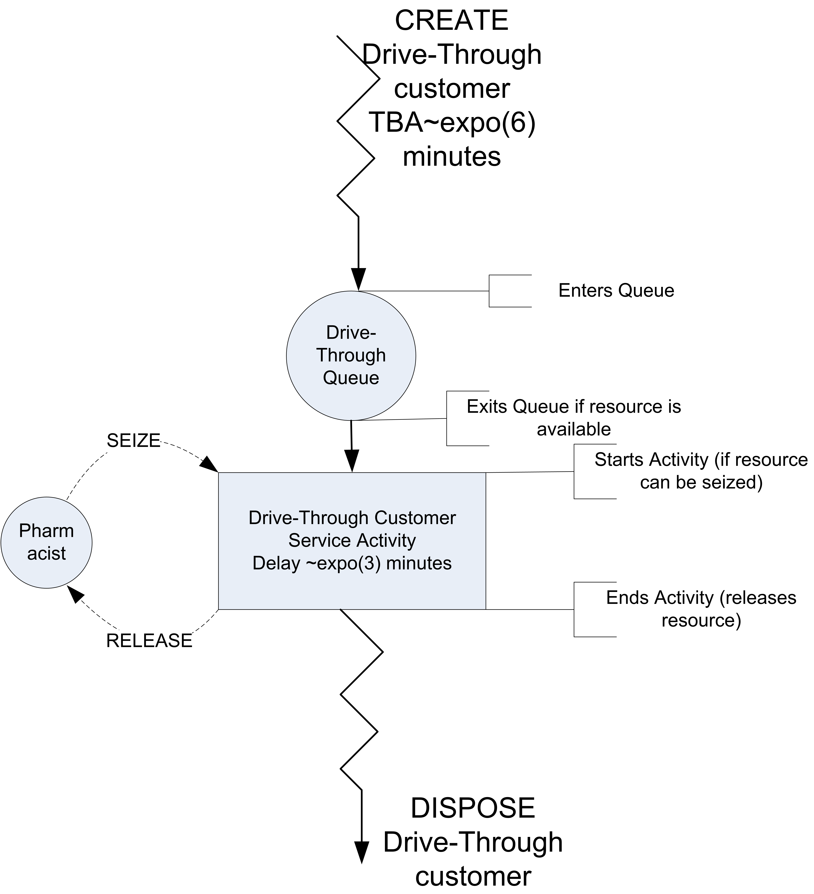
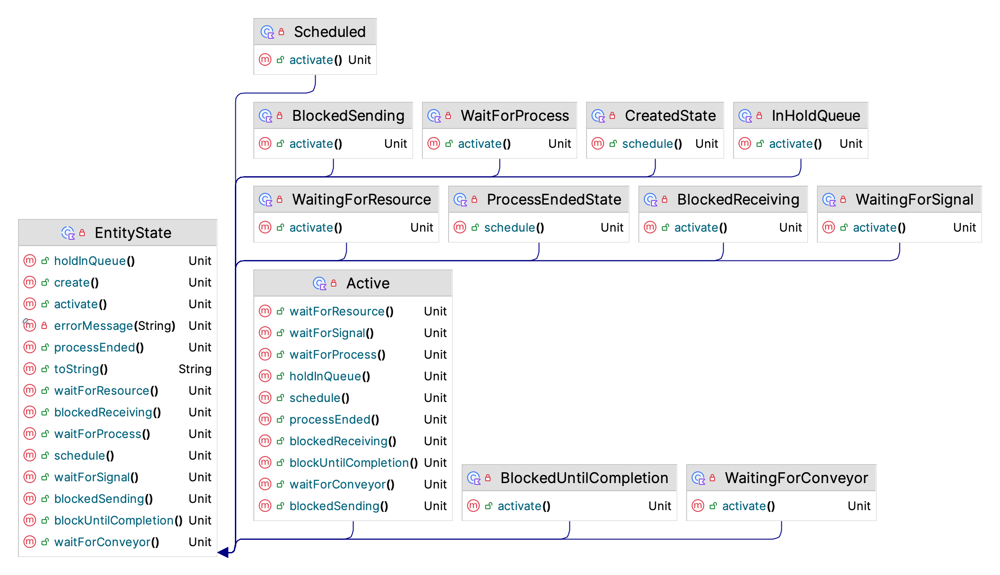
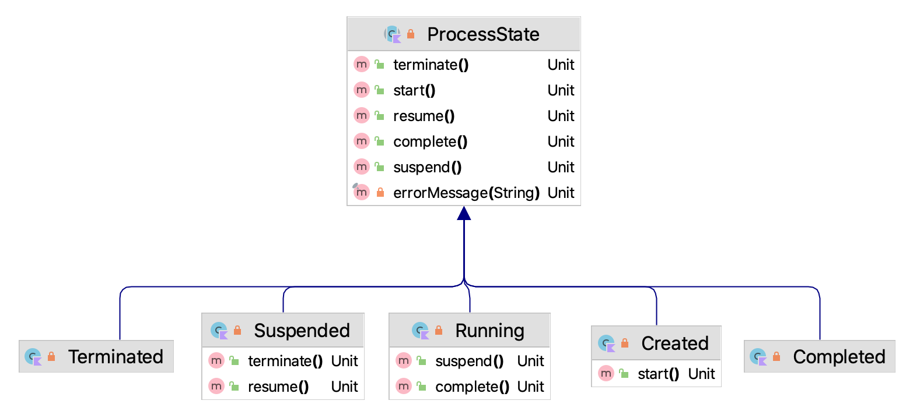
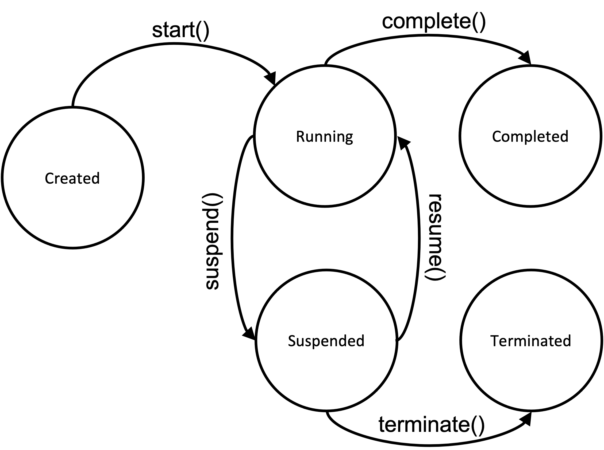
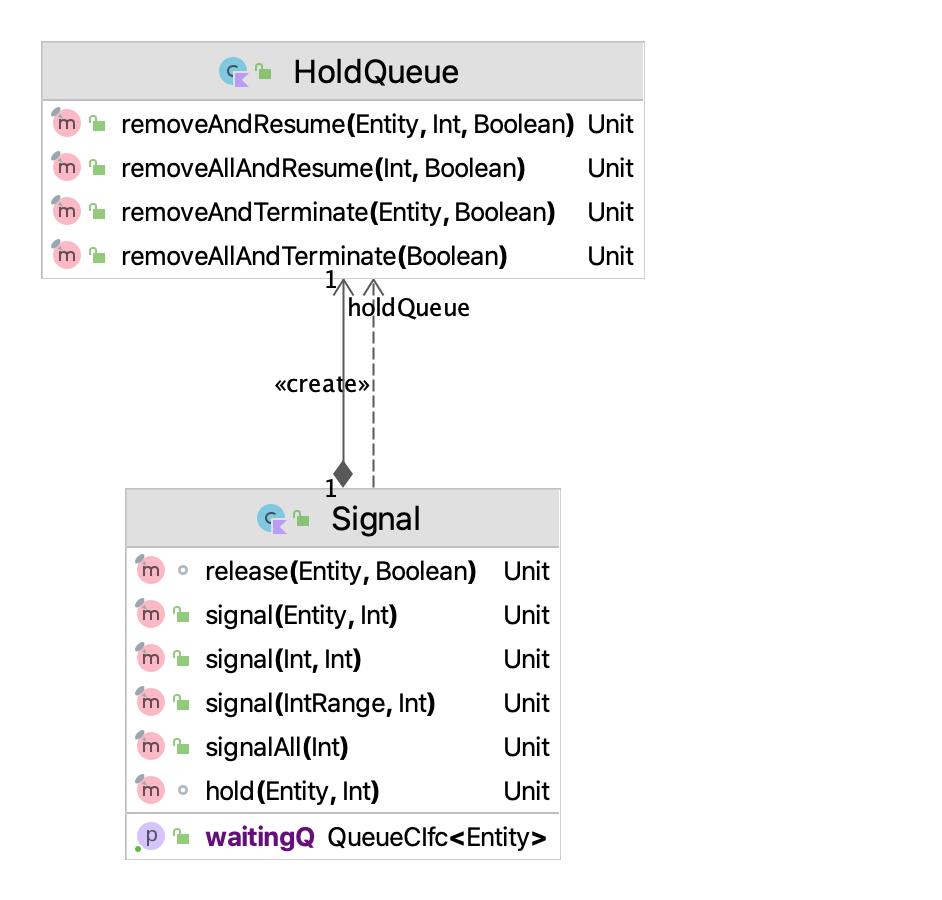
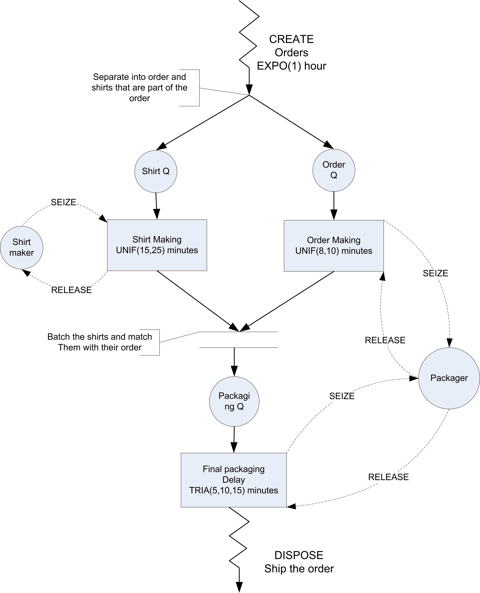

# Process View Modeling Using the KSL {#processview}

**[LEARNING OBJECTIVES]{.smallcaps}**

-   To be able to understand the process view perspective compared to the event view

-   To be able model discrete-event dynamic systems using the process view

-   To be able build process view models using the KSL

There are essentially two fundamental viewpoints for modeling a discrete event system within simulation: the event view and the process view. Chapter \@ref(introDEDS) presented the event view. This chapter will present the process view.  These views are simply different representations for the same system. In the event view, the system and its elements are conceptualized as reacting to events. In the process view, the movement of entities through their processes implies the events within the system in the system. 

In discrete-event dynamic systems, an event is something that happens at
an instant in time which corresponds to a change in system state. An
event can be conceptualized as a transmission of information that causes
an action resulting in a change in system state. In the event view, we *directly* modeled the system state by identifying the events and specifying the state changes.  In the process view, the events will be *implied* by the action of entities within the system.  An *entity* is an object of interest that moves through the system. Entities experience processes as they experience the system. In the
simplest sense, a process can be thought of as a sequence of activities,
where an activity is an element of the system that takes an interval of
time to complete. In the pharmacy example, the service of the customer
by the pharmacist was an activity. The representation of the dynamic
behavior of the system by describing the process flows of the entities
moving through the system is called process-oriented modeling. The modeling perspective based on identifying and describing the system's processes is called the process-view.

::: {.infobox .note data-latex="{note}"}
**NOTE!**
This chapter provides a series of example Kotlin code that illustrates the use of KSL constructs for implementing process view simulation models. The full source code of the examples can be found in the accompanying `KSLExamples` project associated with the [KSL repository](https://github.com/rossetti/KSL). The files for each example of this chapter can be found [here](https://github.com/rossetti/KSL/tree/main/KSLExamples/src/main/kotlin/ksl/examples/book/chapter6).
:::

## What are Entities? {#ch6Entities}

When modeling a system, there are often many entity types. For
example, consider a retail store. Besides customers, the products might
also be considered as entity types. The products (instances of the entity type) are received by the store
and wait on the shelves until customers select them for purchase.
Entities (entity instances) may come in groups and then are processed individually or they
might start out as individual units that are formed into groups. For
example, a truck arriving to the store may be an entity that consists of
many pallets that contain products. The customers select the products
from the shelves and during the check out process the products are
placed in bags. The customers then carry their bags to their cars.
Entities are uniquely identifiable within the system. If there are two
customers in the store, they can be distinguished by the *values* of
their attributes. For example, considering a product as an entity type, it
may have attributes *serial number*, *weight*, *category*, and *price*.
The set of attributes for a type of entity is called its *attribute
set*. While all products might have these attributes, they do not
necessarily have the same values for each attribute. For example,
consider the following two products:

-   (serial number = 12345, weight = 8 ounces, category = green beans,
    price = \$0.87)

-   (serial number = 98765, weight = 8 ounces, category = corn, price =
    \$1.12)

The products carry or retain these attributes and their values as they
move through the system. In other words, attributes are attached to or
associated with entity types. The values of the attributes for particular entity instances might change
during the operation of the system. For example, a mark down on the
price of green beans might occur after some period of time. Attributes
can be thought of as variables that are attached to entity types.

Not all information in a system is local to the entity types. For example,
the number of customers in the store, the number of carts, and the
number of check out lanes are all characteristics of the system. These
types of data are called *system attributes*. In simulation models, this
information can be modeled with global *variables* or other data modules
(e.g. resources) to which all entity instances can have access. By making these
quantities visible at the system level, the information can be shared
between the entity instances within the model and between the components of the
system.

Figure \@ref(fig:Ch5WarehouseSystem) illustrates the difference between
global (system) variables and entities with their attributes in the
context of a warehouse. In the figure, the trucks are entities with
attributes: arrival time, type of product, amount of product, and load
tracking number. Notice that both of the trucks have these attributes,
but each truck has different *values* for their attributes. The figure
also illustrates examples of global variables, such as, number of trucks
loading, number of trucks unloading, number of busy forklifts, etc. This
type of information belongs to the whole system.

<div class="figure" style="text-align: center">

<p class="caption">(\#fig:Ch5WarehouseSystem)Global variables and attributes within a system</p>
</div>

Modeling a system based on entities is the basis of object-oriented programming methods. In object-oriented programming, we identify the classes that describe how the object instances interact.  In the process-view, we start with the entities (classes) and create (object) instances  of the entities.  We can have many different types of classes (entity types) that work together to describe the behavior of the overall system.

Once a basic understanding of the system is accomplished through
understanding system variables, the entities (classes), and their attributes, you
must start to understand the processes within the system. Developing the
process description for the various types of entities within a system
and connecting the flow of entities to the changes in state variables of
the system is the essence of process-oriented modeling.

## The Process View {#pvIntro}

Before introducing the many of the technical details of processing modeling within the KSL, we will start with a simple example. The example will again be the drive through pharmacy model but in this section it will be implemented using the process modeling constructs available within the KSL. 

Recall that we have a small pharmacy that has a single line for
waiting customers and only one pharmacist. Assume that customers arrive
at a drive through pharmacy window according to a Poisson distribution
with a mean of 10 per hour. The time that it takes the pharmacist to
serve the customer is random and data has indicated that the time is
well modeled with an exponential distribution with a mean of 3 minutes.
Customers who arrive to the pharmacy are served in the order of arrival
and enough space is available within the parking area of the adjacent
grocery store to accommodate any waiting customers.

<div class="figure">

<p class="caption">(\#fig:Ch5DriveThruPharmacy)Drive Through Pharmacy</p>
</div>

The drive through pharmacy system can be conceptualized as a single
server waiting line system, where the server is the pharmacist. An
idealized representation of this system is shown in Figure \@ref(fig:Ch5DriveThruPharmacy). In Section \@ref(introDEDSPharmacy) of Chapter \@ref(introDEDS), we presented an activity diagram for the pharmacy.

<div class="figure">

<p class="caption">(\#fig:Ch5DTPActivityDiagram)Activity Diagram of Drive through Pharmacy</p>
</div>

The activity diagram is a basic description of the process experienced by the customer.  In Chapter \@ref(introDEDS), we used the activity diagram to identify the arrival and end of service events.  In this chapter, we will almost directly translate the activity diagram to KSL code.  

Here is the portion of the KSL code to model the process for the customers of the drive through pharmacy:

```kt
    private inner class Customer : Entity() {
        val pharmacyProcess: KSLProcess = process() {
            wip.increment()
            timeStamp = time
            val a = seize(worker)
            delay(serviceTime)
            release(a)
            timeInSystem.value = time - timeStamp
            wip.decrement()
            numCustomers.increment()
        }
    }
```

The code defines a class called `Customer` which is a subclass of `Entity.`  The `Entity` class is a base class that encapsulates the ability to experience processes.  Now, notice the definition and initialization of the variable `pharmacyProcess` within the `Customer` class. This is a very special function builder that allows for the definition of a *coroutine* that defines the process for the entity.  Coroutines are software constructs that permit the suspension and resumption of programming statements.  Kotlin supports the use of coroutines for asynchronous programming.  In this situation, the KSL leverages Kotlin's coroutine library to implement the process view. 

***
::: {.example #ch6ex1 name="Process View Model for Drive Through Pharmacy System"}
This example illustrates how to represent the previously presented drive through pharmacy model of Example \@ref(exm:ch4ex4) in Section \@ref(introDEDSPharmacy) using KSL process view constructs.

```kt
class DriveThroughPharmacy(
    parent: ModelElement,
    numPharmacists: Int = 1,
    ad: RandomIfc = ExponentialRV(1.0, 1),
    sd: RandomIfc = ExponentialRV(0.5, 2),
    name: String? = null
) : ProcessModel(parent, name) {
    init {
        require(numPharmacists > 0) { "The number of pharmacists must be >= 1" }
    }

    private val pharmacists: ResourceWithQ = ResourceWithQ(this, "Pharmacists", numPharmacists)

    private var serviceTime: RandomVariable = RandomVariable(this, sd)
    val serviceRV: RandomSourceCIfc
        get() = serviceTime
    private var timeBetweenArrivals: RandomVariable = RandomVariable(parent, ad)
    val arrivalRV: RandomSourceCIfc
        get() = timeBetweenArrivals
    private val wip: TWResponse = TWResponse(this, "${this.name}:NumInSystem")
    val numInSystem: TWResponseCIfc
        get() = wip
    private val timeInSystem: Response = Response(this, "${this.name}:TimeInSystem")
    val systemTime: ResponseCIfc
        get() = timeInSystem
    private val numCustomers: Counter = Counter(this, "${this.name}:NumServed")
    val numCustomersServed: CounterCIfc
        get() = numCustomers
    private val mySTGT4: IndicatorResponse = IndicatorResponse({ x -> x >= 4.0 }, timeInSystem, "SysTime > 4.0 minutes")
    val probSystemTimeGT4Minutes: ResponseCIfc
        get() = mySTGT4

    override fun initialize() {
        schedule(this::arrival, timeBetweenArrivals)
    }

    private fun arrival(event: KSLEvent<Nothing>) {
        val c = Customer()
        activate(c.pharmacyProcess)
        schedule(this::arrival, timeBetweenArrivals)
    }

    private inner class Customer : Entity() {
        val pharmacyProcess: KSLProcess = process() {
            wip.increment()
            timeStamp = time
            val a = seize(pharmacists)
            delay(serviceTime)
            release(a)
            timeInSystem.value = time - timeStamp
            wip.decrement()
            numCustomers.increment()
        }
    }
}
```
:::

***

Most of this code should look very familiar. It includes the definition of the random variables to model the time between arrivals and service time. It also defines the responses to collect statistics on the performance of the system.  In addition, it uses the functional notation for referencing functional interfaces to schedule the arrival events.  Within the arrival event, the customer is created and it is told to `activate()` its process.

The process called `pharmacyProcess` has a nice linear flow and avoids the event call back approach of the event-view. The first line `wip.increment()` simply increments the number of customers in the system. The next line involving `timeStamp` assigns the arrival time of the customer. Then, the customer attempts to seize the pharmacist.  If the pharmacist is available, it is allocated to the customer. The variable "a" holds the allocation information. If a pharmacist is not available, the customer is held in a queue related to the invocation of the `seize()` function. The `seize()` function is a *suspending* function.  This is the magic of coroutines. The execution of the coroutine literally stops at within the `seize()` function if the pharmacist is not available. When the pharmacist becomes available, the customer (and suspended code) resumes moving through the process. The `delay()` function is another *suspending* function. The delay function essentially schedules an event to represent the service time and when the event occurs the coroutine is resumed.  The `release()` deallocates the resource from the customer.  The final three lines simply collect statistical quantities. 

It is critical to understand that 1) there are many entities created via the `arrival` method, 2) they all experience the same process, and 3) they may all be at different points of their processes at different times. Since many customers are active at the same time (in a pseudo-parallelism) they compete for the pharmacist. This causes queueing. This process view depends on shared state. The primary shared state is via the resource. This is a new construct and was defined with the following line. 

```kt
private val pharmacists: ResourceWithQ = ResourceWithQ(this, "Pharmacists", numPharmacists)
```

A `ResourceWithQ` is a construct that can be used in `ProcessModel` instances. These resources track the number of entities that are allocated and can hold them in a common queue while they wait.  The ability to describe processes in this manner is what makes the process view very popular and often serves as the basis for commercial software. The KSL provides this view in open-source code.

If we run the code, we get the following results. 

```
Half-Width Statistical Summary Report - Confidence Level (95.000)% 

Name                                     Count 	      Average 	   Half-Width 
------------------------------------------------------------------------------------ 
NumBusy                                    30 	       0.5035 	       0.0060 
# in System                                30 	       1.0060 	       0.0271 
System Time                                30 	       6.0001 	       0.1441 
PharmacyQ:NumInQ                           30 	       0.5025 	       0.0222 
PharmacyQ:TimeInQ                          30 	       2.9961 	       0.1235 
SysTime > 4.0 minutes                      30 	       0.5136 	       0.0071 
Num Served                                 30 	    2513.2667 	      17.6883 
----------------------------------------------------------------------------------------- 
```
If you look back at the previous results, you will see that these results are exactly the same! Thus, we can model the pharmacy with either the event view or the process view with confidence. 

Before discussing additional functionality enabled within the `KSLProcessBuilder,` we present some functionality that facilitates the creation and activation of entities.  Notice that within the pharmacy model that after an customer is created to start its process we must schedule its activation. 

```kt
    private fun arrival(event: KSLEvent<Nothing>) {
        val c = Customer()
        activate(c.pharmacyProcess)
        schedule(this::arrival, timeBetweenArrivals)
    }
```

This is so common the KSL provides a class called `EntityGenerator` that automates this process.  The `EntityGenerator` class subclassed from `EventGenerator` and allows for a creation pattern to be specified. Figure \@ref(fig:Ch5EntityGenerator) illustrates this relationship.


<div class="figure" style="text-align: center">

<p class="caption">(\#fig:Ch5EntityGenerator)Overview of the ProcessModel Class</p>
</div>

The `EntityGenerator` class is defined as an inner class of `ProcessModel.` Reviewing its code is useful.

```kt
    protected inner class EntityGenerator<T : Entity>(
        private val entityCreator: () -> T,
        timeUntilTheFirstEntity: RandomIfc = ConstantRV.ZERO,
        timeBtwEvents: RandomIfc = ConstantRV.POSITIVE_INFINITY,
        maxNumberOfEvents: Long = Long.MAX_VALUE,
        timeOfTheLastEvent: Double = Double.POSITIVE_INFINITY,
        var activationPriority: Int = KSLEvent.DEFAULT_PRIORITY + 1,
        name: String? = null
    ) : EventGenerator(
        this@ProcessModel, null, timeUntilTheFirstEntity,
        timeBtwEvents, maxNumberOfEvents, timeOfTheLastEvent, name
    ) {
        override fun generate() {
            val entity = entityCreator()
            startProcessSequence(entity, priority = activationPriority)
        }

    }
```

As shown in the code, the key additional functionality is that the `EntityGenerator` takes in a *function* that knows how to create a subclass of type `Entity.`  The simplest way to provide such a function is to provide a reference to the constructor function of the subclass.  This is illustrated in the following simplified re-do of the pharmacy model.

***
::: {.example #ch6ex2 name="Demonstrating an Entity Generator"}
This example illustrates how to construct an instance of the `EntityGenerator` class and use it to create entity instances according to a time between event pattern.
```kt
class EntityGeneratorExample(
    parent: ModelElement,
    name: String? = null
) : ProcessModel(parent, name) {

    private val worker: ResourceWithQ = ResourceWithQ(this, "worker")
    private val tba = ExponentialRV(6.0, 1)
    private val st = RandomVariable(this, ExponentialRV(3.0, 2))
    private val wip = TWResponse(this, "${this.name}:WIP")
    private val tip = Response(this, "${this.name}:TimeInSystem")
    private val generator = EntityGenerator(::Customer, tba, tba)
    private val counter = Counter(this, "${this.name}:NumServed" )

    private inner class Customer: Entity() {
        val mm1: KSLProcess = process{
            wip.increment()
            timeStamp = time
            val a  = seize(worker)
            delay(st)
            release(a)
            tip.value = time - timeStamp
            wip.decrement()
            counter.increment()
        }
    }
}
```
:::
***

Notice the following line which takes in a reference to the `Customer` class constructor using the functional syntax `::Customer.`  

```kt
private val generator = EntityGenerator(::Customer, tba, tba)
```

There is no arrival method necessary because that logic is within the entity generator's `generate()` method:

```kt
        override fun generate() {
            val entity = entityCreator()
            startProcessSequence(entity, priority = activationPriority)
        }
```
The entity is created using the passed in constructor function and the entity's default sequence of processes is started.  By default, the `process()` function of the `KSLProcessBuilder` class automatically adds each newly defined process to the entity's default sequence of processes unless indicated not to do so. Thus, by using an instance of an `EntityGenerator` associated with a particular subclass of `Entity`, we can automatically create the instances of the subclass and activate their processes. Of course, the creation of the subclass (e.g. `Customer`) might be much more complex; however, the `EntityGenerator` takes in a *function* that creates the instance of the subclass.  Thus, it can be any function, not just the constructor function.  Therefore, instances can be configured in complex ways before they are activated by supplying an appropriate function.

::: {.infobox .important data-latex="{important}"}
**IMPORTANT!**
Note that an `EntityGenerator` relies on the entity having at least one process that has been added to its process sequence via the `process()` method's `addToSequence` parameter being true. The default setting of this parameter is true.  An entity generator will create the entity and start the process that is listed *first* in its process sequence.  If there are no processes in the sequence then although the entity is created, it will not start the process.  Thus, if you create a process with `addToSequence = false,` that process will not be in the entity's process sequence to be started by an `EntityGenerator.` By default, the code-listing order of the `process()` function definitions in the class, defines the order in which the processes are added to the entity's process sequence when `addToSequence` is true. The entity's `processSequence` property provides access to the list, which is mutable.  This allows full control over the ordering via code.
:::

In the next section, we will take a closer look at how the KSL makes the process view possible.  This will help you to better use the process modeling capabilities found in the KSL.

## Understanding KSL Processes and Entities

Entities can experience many processes.  Thus, there needs to be a mechanism to activate the processes and to cleanup after the processes have completed. The `ProcessModel` class facilitates the modeling of entities experiencing processes. A `ProcessModel` has inner classes (`Entity,` `EntityGenerator,` etc.) that can be used to describe entities and the processes that they experience. 

<div class="figure" style="text-align: center">

<p class="caption">(\#fig:Ch5ProcessModelOverview)Overview of the ProcessModel Class</p>
</div>

As noted in Figure \@ref(fig:Ch5ProcessModelOverview) a `ProcessModel` can activate KSL processes, can start entity process sequences, can dispose of entities, and can perform some after replication cleanup.  One of the activities that a process model must perform is to terminate any processes that are still suspended after the replication is completed.  In addition, it ensures that no entity terminates its process while still having allocations to a resource.  Thus, a `ProcessModel` is needed to manage the entities and processes that it represents. This is why in the pharmacy code example, the pharmacy model is a subclass of `ProcessModel.`

```kt
class DriveThroughPharmacy(
    parent: ModelElement,
    numPharmacists: Int = 1,
    ad: RandomIfc = ExponentialRV(1.0, 1),
    sd: RandomIfc = ExponentialRV(0.5, 2),
    name: String? = null
) : ProcessModel(parent, name)
```

This provides the modeler with access to the inner classes e.g. `Entity` that are inherited by the subclass for use in process modeling.

The key inner class is `Entity,` which has a function `process()` that uses a builder to describe the entity's process in the form of a coroutine.  An entity can have many processes described that it may follow based on different modeling logic. A process model facilitates the running of a sequence of processes that are stored in an entity's `processSequence` property. An entity can **experience only one process at a time**. After completing the process, the entity will try to use its sequence to run the next process (if available). Individual processes can be activated for specific entities. But, again, an entity instance may only be activated to experience 1 process at a time, even if it has many defined processes. The entity experiences processes *sequentially.*  
 
An `Entity` instance is something that can experience processes and as such may wait in queues. `Entity` is a subclass of `QObject.`  Thus, statistics can be automatically collected on entities if they experience waiting. The general approach to defining a process for an entity is to use the `process()` function to define a process that a subclass of Entity can follow.  Entity instances may use resources, signals, hold queues, etc. as shared mutable state.  Entities may follow a process sequence if defined.  An entity can have many properties that define different processes that it might experience. The user can store the processes in data structures. In fact, there is a `processSequence` property for this purpose that defines a list of processes that the entity will follow. As previously mentioned, the `process()` function automatically adds each defined process (in the order of definition via the class body) to the `processSequence` property unless told not to do so as an optional argument to the `process()` function. The following code defines a process and assigns the function to the property `pharmacyProcess.`  This property is of type `KSLProcess.` Because there were no arguments to the `process()` function, the process is automatically added to the list of processes for this entity found in the `processSequence` property.  Each process can also be provided a string name via an argument of the `process()` function. The name of a process can be useful in tracing and debugging process code.

```kt
    private inner class Customer : Entity() {
        val pharmacyProcess: KSLProcess = process() {
        ...
        }
```

`KSLProcess` is an interface that provides a limited view of a KSL process instance.  The interface allows the user to check the state of the process, get its identification (id, and name) and access the entity that is associated with the process.  Underneath, the instance of a `KSLProcess` is mapped onto a specially constructed Kotlin coroutine.

```kt
interface KSLProcess {
    val id: Int
    val name: String
    val isCreated: Boolean
    val isSuspended: Boolean
    val isTerminated: Boolean
    val isCompleted: Boolean
    val isRunning: Boolean
    val isActivated: Boolean
    val entity: ProcessModel.Entity
}
```
  
The `process()` function is a special builder function related to a `KSLProcessBuilder.` A `KSLProcessBuilder` provides the functionality for describing a process.  A process is an instance of a coroutine that can be suspended and resumed.  The methods of the `KSLProcessBuilder` are the suspending functions that are allowed within the process modeling paradigm of the KSL.  The various suspending functions have an optional string name parameter to identify the name of the suspension point.  While not required for basic modeling, identifying the suspension point can be useful for more advanced modeling involving the cancellation or interrupting of a process.  A unique name can be used to determine which suspension point is suspending the process when the process has many suspension points.  We will examine the functionality of a `KSLProcessBuilder` later in this section.

First and foremost, process modeling starts with understanding and using instances of the `Entity` class. 

<div class="figure" style="text-align: center">

<p class="caption">(\#fig:Ch5EnityStates)Defined Entity States</p>
</div>

Figure \@ref(fig:Ch5ProcessModelOverview) indicates that there is an inner class called `EntityState` within an Entity. As seen in Figure \@ref(fig:Ch5EnityStates), `EntityState` serves as the base class for defining the legal states for an entity and the legal state transitions using the state pattern as show in Figure \@ref(fig:Ch5EnityStateTransitions).

- `CreatedState` - The entity is placed into this state when it is created. From the created state, the entity can be scheduled to be active.
- `Scheduled` - The scheduled state indicates that the entity is associated with an event that is pending to occur in the event calendar. The entity is scheduled to be active at some future time. The underlying process associated with the entity is suspended.
- `Active` - This is the state that indicates that the entity is executing an underlying process. It is executing non-suspending code within its process.  It is the *active* entity. From the active state, the entity can be suspended for a number of reasons, each mapped to various states.
- `WaitingForResource` - This state indicates that the entity's process is suspended because the entity is waiting for units of a resource.
- `WaitingForSignal` - This state indicates that the entity's process is suspended because the entity is waiting on an arbitrary signal to be sent.
- `BlockedSending` - This state indicates that the entity's process is suspended because the entity is trying to send an item via a shared blocking queue and there is not space for the item in the queue. Blocking queues can be used to communicate between processes.
- `BlockedReceiving` - This state indicates that the entity's process is suspended because the entity is trying to receive items from a blocking queue and there are no items to receive.  This is the other end of the communication channel formed by a blocking queue.
- `InHoldQueue` - This state indicates that the entity's process is suspended because the entity is an arbitrary queue that holds entities until they are removed and re-activated.
- `WaitForProcess` - An entity may activate another process.  This state indicates that the entity's process is suspended because the entity is waiting for the process to complete before proceeding.

<div class="figure" style="text-align: center">

<p class="caption">(\#fig:Ch5EnityStateTransitions)Legal Entity State Transitions</p>
</div>

The entity states are mapped onto the lower level coroutine via an internal inner class (`ProcessCoroutine`). This class defines the legal states of the coroutine shown in Figure \@ref(fig:Ch5EProcessStates). 

<div class="figure" style="text-align: center">

<p class="caption">(\#fig:Ch5EProcessStates)Defined Process States</p>
</div>

Again, these states define the legal states of the underlying process coroutine. In general, users will not care about these internal details, but a basic understanding of what are legal transitions, shown in Figure \@ref(fig:Ch5EProcessStateTransitions) can be helpful. The following are the process coroutine states:

- Created - The process coroutine is placed in this state when it is instantiated.
- Running - The coroutine is running after it is started. This occurs when the entity activates the associated process. Processes are started by scheduling an event that invokes the coroutine code at the appropriate simulated time. The entity moves through its process and when the entity is between suspension points the process is considered to be in the running state.
- Suspended - The underlying process coroutine is suspended using Kotlin's coroutine suspension functionality. Suspension is mapped to the various suspension states associated with an entity.
- Completed - The process coroutine has exited normally from the process routine or reached the end of the process routine. Once completed the coroutine is finished.
- Terminated - The process coroutine has exited abnormally via an error or exception or the user has directly terminated the process. Once terminated the coroutine is finished.

When a process coroutine exits normally the process coroutine is placed in the completed state. Then, the `ProcessModel` checks to see if there are additional processes to execute within the entity's process sequence. If there are, then the next process is automatically started.  If there are no additional processes in the sequence, the entity is disposed. 

If the entity is executing a process and the process is suspended, then the process routine may be terminated. This causes the currently suspended process to exit, essentially with an error condition.  No further programming statements within the process coroutine will execute. The process ends (placed in the terminated state). All resources that the entity has allocated will be deallocated.  If the entity was waiting in a queue, the entity is removed from the queue and no statistics are collected on its queueing.  If the entity is experiencing a delay, then the event associated with the delay is cancelled. If the entity has additional processes in its process sequence they are not automatically executed. If the user requires specific behavior to occur for the entity after termination, then the user should override the Entity's `handleTerminatedProcess()` function to supply specific logic.  Termination happens immediately, with no time delay.

<div class="figure" style="text-align: center">

<p class="caption">(\#fig:Ch5EProcessStateTransitions)Legal Process States Transitions</p>
</div>

The following section will illustrate through some simple models some of the functionality enabled by `KSLProcessBuilder.`  

## Examples of Process Modeling

The following example illustrates how to use a hold queue via the `HoldQueue` class.  A hold queue holds an entity within a queue until it is removed.  It is important to note that the entity that goes into the hold queue cannot remove itself. Thus, as you will see in the following code, we schedule an event that causes the entities to be removed at a specific time. The hold queue is created and an event action defined to represent the event. The entity process is simple, when the entity enters the process it immediately enters the hold queue. The process will be suspended.  After being removed and resumed, the entity continues through a couple of delays. 

***
::: {.example #ch6ex3 name="Illustrating a HoldQueue"}
This example illustrates how to create an instance of the `HoldQueue` class and how to use it to hold entities until they can be released. An event is scheduled to cause held entities to be removed and to resume their processing. 
```kt
class HoldQExample(parent: ModelElement) : ProcessModel(parent, null)  {
    private val myHoldQueue: HoldQueue = HoldQueue(this, "hold")
    private val myEventActionOne: EventActionOne = EventActionOne()

    private inner class Customer: Entity() {
        val holdProcess : KSLProcess = process() {
            println("time = $time : before being held customer = ${this@Customer.name}")
            hold(myHoldQueue)
            println("time = $time : after being held customer = ${this@Customer.name}")
            delay(10.0)
            println("time = $time after the first delay for customer = ${this@Customer.name}")
            delay(20.0)
            println("time = $time after the second delay for customer = ${this@Customer.name}")
        }
    }

    override fun initialize() {
        val e = Customer()
        activate(e.holdProcess)
        val c = Customer()
        activate(c.holdProcess, 1.0)
        schedule(myEventActionOne, 5.0)
    }

    private inner class EventActionOne : EventAction<Nothing>() {
        override fun action(event: KSLEvent<Nothing>) {
            println("Removing and resuming held entities at time : $time")
            myHoldQueue.removeAllAndResume()
        }
    }
}
```
:::
***

The `initialize()` method creates a couple of entities and activates their hold process. In addition, the event representing the release from the hold queue is scheduled for time 5.0.  In the event logic, we see that the hold queue instance is used to call its `removeAllAndResume()` function. The `HoldQueue` class is a subclass of the `Queue` class. Thus, statistics are collected when it is used. In addition, it can be iterated and searched.  If a reference to a particular entity is available, then the `removeAndResume()` function can be used to remove and resume a specific entity.  These two methods automatically resume the entity's process. Other methods inherited from the `Queue` class allows for the entities to be removed *without* resuming their processes. It is then the responsibility of the user to properly resume the suspended processes by directly using the entity instance. There are also methods for terminating the held entity's processes.  The output from this simple simulation is as follows:

```
time = 0.0 : before being held customer = ID_1
time = 1.0 : before being held customer = ID_2
Removing and resuming held entities at time : 5.0
time = 5.0 : after being held customer = ID_1
time = 5.0 : after being held customer = ID_2
time = 15.0 after the first delay for customer = ID_1
time = 15.0 after the first delay for customer = ID_2
time = 35.0 after the second delay for customer = ID_1
time = 35.0 after the second delay for customer = ID_2
```

We see that the two customers are held in the queue right after activation. Then, the event at time 5.0 occurs which removes and resumes the held entities. The rest of the output indicates the the entities continue their processes.

The next example illustrates the use of the `Signal` class, which builds off of the `HoldQueue` class, as shown in Figure \@ref(fig:Ch5HQandSignalClass). 

<div class="figure" style="text-align: center">

<p class="caption">(\#fig:Ch5HQandSignalClass)HoldQueue and Signal Classes</p>
</div>

The `Signal` class uses an instance of the `HoldQueue` class to hold entities until they are notified to move via the index of their rank in the queue.  If you want the first entity to be signaled, then you call `signal(0).` The entity is notified that its suspension is over and it removes itself from the hold queue.  Thus, contrary to the `HoldQueue` class the user does not have to remove and resume the corresponding entity. 
Here is some example code. Notice that the code subclasses from `ProcessModel.` All implementations that use the process modeling constructs must subclass from `ProcessModel.`  Then, the instance of the `Signal` is created. An inner class implements and entity that uses the signal. In the process, the entity immediately waits for the signal. After the signal, the entity has a simple delay and then the process ends.

***
::: {.example #ch6ex4 name="Illustrating how to Hold and Signal Entities"}
This example illustrates how to use the `Signal` class to hold entities until a signal is sent.  Once the signal is received the entity continues its processing. 
```kt
fun main(){
    val m = Model()
    SignalExample(m)
    m.numberOfReplications = 1
    m.lengthOfReplication = 50.0
    m.simulate()
    m.print()
}

class SignalExample(parent: ModelElement, name: String? = null) : ProcessModel(parent, name) {

    private val signal = Signal(this, "SignalExample")

    private inner class SignaledEntity : Entity() {
        val waitForSignalProcess: KSLProcess = process {
            println("$time > before waiting for the signal: ${this@SignaledEntity.name}")
            waitFor(signal)
            println("$time > after getting the signal: ${this@SignaledEntity.name}")
            delay(5.0)
            println("$time > after the second delay for entity: ${this@SignaledEntity.name}")
            println("$time > exiting the process of entity: ${this@SignaledEntity.name}")
        }
    }

    override fun initialize() {
        for (i in 1..10){
            activate(SignaledEntity().waitForSignalProcess)
        }
        schedule(this::signalEvent, 3.0)
    }

    private fun signalEvent(event: KSLEvent<Nothing>){
        signal.signal(0..4)
    }
}
```
:::
***

The `initialize()` method creates 10 instances of the `SignalEntity` subclass of the `Entity` class and activates each entity's `waitForSignalProcess` process. It also schedules an event to cause the signal to occur at time 3.0.  In the signal event, the reference to the signal, `signal,` is used to call the `signal()` method of of the `Signal` class.  The first 5 waiting entities are signaled using a Kotlin [range.](https://kotlinlang.org/docs/ranges.html)  The output from the process is as follows.

```
0.0 > before waiting for the signal: ID_1
0.0 > before waiting for the signal: ID_2
0.0 > before waiting for the signal: ID_3
0.0 > before waiting for the signal: ID_4
0.0 > before waiting for the signal: ID_5
0.0 > before waiting for the signal: ID_6
0.0 > before waiting for the signal: ID_7
0.0 > before waiting for the signal: ID_8
0.0 > before waiting for the signal: ID_9
0.0 > before waiting for the signal: ID_10
3.0 > signaling the entities in range 0..4
3.0 > after getting the signal: ID_1
3.0 > after getting the signal: ID_2
3.0 > after getting the signal: ID_3
3.0 > after getting the signal: ID_4
3.0 > after getting the signal: ID_5
8.0 > after the second delay for entity: ID_1
8.0 > exiting the process of entity: ID_1
8.0 > after the second delay for entity: ID_2
8.0 > exiting the process of entity: ID_2
8.0 > after the second delay for entity: ID_3
8.0 > exiting the process of entity: ID_3
8.0 > after the second delay for entity: ID_4
8.0 > exiting the process of entity: ID_4
8.0 > after the second delay for entity: ID_5
8.0 > exiting the process of entity: ID_5
```

We see that at time 0.0, the 10 entities are created and their process activated so that they wait for the signal.  Then, at time 3.0, the signal occurs and each of the signaled entities (in turn) resume their processes.  Eventually, they complete their process after the 5.0 time unit delay.  Notice that since the simulation run length was 50.0 time units, the simulation continues until that time.  However, since there are no more signals, the last 5 entities remain waiting (suspended) at the end of the simulation. As previously mentioned, the `ProcessModel` class is responsible for removing these entities that are suspended after the replication has completed.  Thus, when the next replication starts, there will not be 5 entities still waiting.  The KSL takes care of these common clean up actions automatically.

This next example illustrates the use of a [blocking queue](https://jenkov.com/tutorials/java-concurrency/blocking-queues.html). Blocking queues are often used in asynchronous programs to communicated between different threads.  In the case of KSL process models, we can use the concept of blocking queues to assist with communication between two processes. 

Blocking queues can block on sending or on receiving. The typical use is to block when trying to dequeue an item from the queue when the queue is empty or if you try to enqueue an item and the queue is full.  A process trying to dequeue from an empty queue is blocked until some other process inserts an item into the queue. A process trying to enqueue an item in a full queue is blocked until some other process makes space in the queue, either by dequeuing one or more items or clearing the queue completely. The KSL provides a class called `BlockingQueue` that facilitates this kind of modeling. In the case of the KSL, depending on the configuration of the queue, both the sender and the receiver may block.

<div class="figure" style="text-align: center">

<p class="caption">(\#fig:Ch5EBlockingQ)The BlockingQueue Class</p>
</div>

There are actually three queues used in the implementation of the `BlockingQueue` class. One queue called the `senderQ` will hold entities that place items into the blocking queue if the queue is full.  Another queue, called the `receiverQ,` will hold entities that are waiting for items to be placed in the queue to be removed.  Lastly, is the blocking queue, itself, which is better conceptualized as a channel between the sender and the receiver. This queue is called the `channelQ` and holds items that are placed into it for eventual removal.  Statistics can be collected (or not) on any of these queues. The sender and receiver queues are essentially instances of the KSL `Queue` class. As such, they have no capacity limitation.  The channel queue can have a capacity. If a capacity is not provided, it is `Int.MAX_VALUE,` which is essentially infinite.

As noted in Figure \@ref(fig:Ch5EBlockingQ) we see that the items within the queue are requested from the receiver. These requests can have a specific amount. The receiver will need to wait until the specific amount of their request becomes available in the queue (channel). Users can provide a selection rule for the requests to determine which requests will be selected for filling when new items arrive within the channel. The default request selection rule is to select the next request. The following code illustrates the basic creation and use of a blocking queue.

::: {.example #ch6ex5 name="Illustrating a Blocking Queue"}
This example illustrates how to use a blocking queue.  A blocking queue can cause an entity to wait until an item is available in the channel or cause an entity to wait until there is space in the channel.
```kt
class BlockingQExample(
    parent: ModelElement,
    name: String? = null
) : ProcessModel(parent, name) {

//    val blockingQ: BlockingQueue<QObject> = BlockingQueue(this)
    val blockingQ: BlockingQueue<QObject> = BlockingQueue(this, capacity = 10)
    
    init {
//        blockingQ.waitTimeStatisticsOption(false)
    }
```
:::

You can create a blocking queue with a capacity (or not) and you can specify whether the statistics are collected (or not) as noted by the commented code of the example. In this example, the queue (channel) has a capacity of 10 items. 

In the following code, we implement the process for receiving items from the blocking queue. Notice that there is a loop within the process.  This illustrates that all normal [Kotlin control structures](https://kotlinlang.org/docs/control-flow.html) are available within process routines. The entity (receiver) will loop through this process 15 time and essentially wait for single item to be placed in the blocking queue. If the entity hits the `waitForItems()` suspending function call and there is an item in the queue, then it immediately receives the item and continues with its process. If an item is not available in the blocking queue when the entity reaches the `waitForItems()` suspending function, then the requesting entity will wait until an item becomes available and will not proceed until it receives the requested amount of items.  After receiving its requested items, the entity continues with its process.

```kt
    private inner class Receiver: Entity() {
        val receiving : KSLProcess = process("receiving") {
            for (i in 1..15) {
                println("$time > before the first delay for entity: ${this@Receiver.name}")
                delay(1.0)
                println("$time > trying to get item for entity: ${this@Receiver.name}")
                waitForItems(blockingQ, 1)
                println("$time > after getting item for entity: ${this@Receiver.name}")
                delay(5.0)
                println("$time > after the second delay in ${this@Receiver.name}")
            }
            println("$time > exiting the process in ${this@Receiver.name}")
        }
    }
```
In this code snippet, the entity (sender), also loops 15 times. Each time within the loop, the entity creates an instance of a `QObject` and places it in the blocking queue via the `send()` method.  Since the blocking queue has capacity 10, and the time between requests by the receive is a little longer than the time between sends, the blocking queue will reach its capacity.  If it does reach its capacity, then the sender will have to wait (blocking) at the `send()` suspending function until space becomes available in the channel.

```kt

    private inner class Sender: Entity() {
        val sending : KSLProcess = process("sending") {
            for (i in 1..15){
                delay(5.0)
                println("$time > after the first delay for sender ${this@Sender.name}")
                val item = QObject()
                println("$time > before sending an item from sender ${this@Sender.name}")
                send(item, blockingQ)
                println("$time > after sending an item from sender ${this@Sender.name}")
            }
            println("$time > exiting the process for sender ${this@Sender.name}")
        }
    }

    override fun initialize() {
        val r = Receiver()
        activate(r.receiving)
        val s = Sender()
        activate(s.sending)
    }

}

```
In the `intialize()` method, single instances of the receiver and sender are created and their processes activated. The model is setup to run for 100 time units

```kt

fun main(){
    val m = Model()
    val test = BlockingQExample(m)

    m.lengthOfReplication = 100.0
    m.numberOfReplications = 1
    m.simulate()
    m.print()
}
```

The output of the simulation is illustrative of the coordination that occurs between the receiver and the sender. We see in this output that the the receiving entity blocks at time 1.0.  Finally, at time 5.0 the sender sends an item and it is received by the receiving entity. Both processes continue.

```
0.0 > before the first delay for receiving entity: ID_1
1.0 > trying to get item for receiving entity: ID_1
5.0 > after the first delay for sender ID_2
5.0 > before sending an item from sender ID_2
5.0 > after sending an item from sender ID_2
5.0 > after getting item for receiving entity: ID_1
10.0 > after the first delay for sender ID_2
10.0 > before sending an item from sender ID_2
10.0 > after sending an item from sender ID_2
10.0 > after the second delay for receiving entity: ID_1
10.0 > before the first delay for receiving entity: ID_1
.
.
.
```

The queueing statistics indicate that the sender never blocked and the receiver had a small amount of blocking.

```
Half-Width Statistical Summary Report - Confidence Level (95.000)% 

Name                                     	        Count 	      Average 	   Half-Width 
-----------------------------------------------------------------------------------------
BlockingQueue_4:SenderQ:NumInQ           	            1 	       0.0000 	          NaN 
BlockingQueue_4:SenderQ:TimeInQ          	            1 	       0.0000 	          NaN 
BlockingQueue_4:RequestQ:NumInQ          	            1 	       0.2100 	          NaN 
BlockingQueue_4:RequestQ:TimeInQ         	            1 	       0.3077 	          NaN 
BlockingQueue_4:ChannelQ:NumInQ          	            1 	       0.3300 	          NaN 
BlockingQueue_4:ChannelQ:TimeInQ         	            1 	       2.2000 	          NaN 
-----------------------------------------------------------------------------------------
```

As illustrated in this example, a blocking queue can facilitate the passing of information between two processes. These types of constructs can serve as the basis for communicating between agents which can invoke different procedures for different messages and wait until receiving and or sending messages.  We will see another example of using a blocking queue later in this chapter.  

In the previous three examples, we saw how we can use a hold queue, a signal, and a blocking queue within a process description. In the case of the blocking queue, we saw how two processes communicated.  In this next simple example, we also see how to processes can coordinate their flow via the use of the `waitFor(process: KSLProcess)` suspending function.  The purpose of the `waitFor(process: KSLProcess)` suspending function is to allow one entity to start another process and have the entity that starts the process wait until the newly activated process is completed.  The following code indicates the signature of the `waitFor(process: KSLProcess)` suspending function.

```kt
    /** Causes the current process to suspend until the specified process has run to completion.
     *  This is like run blocking.  It activates the specified process and then waits for it
     *  to complete before proceeding.
     *
     * @param process the process to start for an entity
     * @param timeUntilActivation the time until the start the process
     * @param priority the priority associated with the event to start the process
     */
    suspend fun waitFor(
        process: KSLProcess,
        timeUntilActivation: Double = 0.0,
        priority: Int = KSLEvent.DEFAULT_PRIORITY,
        suspensionName: String? = null
    )
```
The `waitFor(process: KSLProcess)` suspending function activates the named process and suspends the current process until the activated process completes. Then, the suspending process is resumed.  Let's take a look at a simple example.  Most of this class is simply to define the two interacting processes.

***
::: {.example #ch6ex6 name="Illustrating Waiting for a Process"}
This example illustrates how you can use one process to start another process. In addition, the process that starts the secondary process will wait until the secondary process completes before continuing. 
```kt
class WaitForProcessExample(parent: ModelElement) : ProcessModel(parent, null) {
    private val worker: ResourceWithQ = ResourceWithQ(this, "worker", 1)
    private val tba = RandomVariable(this, ExponentialRV(6.0, 1), "Arrival RV")
    private val st = RandomVariable(this, ExponentialRV(3.0, 2), "Service RV")
    private val wip = TWResponse(this, "${name}:WIP")
    private val tip = Response(this, "${name}:TimeInSystem")
    private val arrivals = Arrivals()
    private val total = 1
    private var n = 1

    private inner class Customer : Entity() {
        val simpleProcess: KSLProcess = process("SimpleProcess", addToSequence = false) {
            println("\t $time > starting simple process for entity: ${this@Customer.name}")
            wip.increment()
            timeStamp = time
            use(worker, delayDuration = st)
            tip.value = time - timeStamp
            wip.decrement()
            println("\t $time > completed simple process for entity: ${this@Customer.name}")
        }

        val wfp = process("WaitForAnotherProcess", addToSequence = false) {
            val c = Customer()
            println("$time > before waitFor simple process for entity: ${this@Customer.name}")
            waitFor(c.simpleProcess)
            println("$time > after waitFor simple process for entity: ${this@Customer.name}")
        }
    }

    override fun initialize() {
        arrivals.schedule(tba)
    }

    private inner class Arrivals : EventAction<Nothing>() {
        override fun action(event: KSLEvent<Nothing>) {
            if (n <= total) {
                val c = Customer()
                println("$time > activating the waitFor process for entity: ${c.name}")
                activate(c.wfp)
                schedule(tba)
                n++
            }
        }
    }

}
```
:::
***

The `Customer` class is very similar to previous examples of a simple queueing situation. However, notice the use of the `use()` function.  Because the combination of seize-delay-release is so common, the KSL provides the `use()` function to combine these into a convenient suspending function. It is illustrative to see the implementation:

```kt
    suspend fun use(
        resource: ResourceWithQ,
        amountNeeded: Int = 1,
        seizePriority: Int = KSLEvent.DEFAULT_PRIORITY,
        delayDuration: GetValueIfc,
        delayPriority: Int = KSLEvent.DEFAULT_PRIORITY,
    ) {
        val a = seize(resource, amountNeeded, seizePriority)
        delay(delayDuration, delayPriority)
        release(a)
    }
```

Getting back to Example \@ref(exm:ch6ex6), the code defines a process called `WaitForAnotherProcess.` The sole purpose of this process is to create an instance of the customer, activate its simple process, and wait for it to complete.  The output from activating one instance of the wait for another process is as follows:

```
0.8149947795247992 > activating the waitFor process for entity: ID_1
0.8149947795247992 > before waitFor simple process for entity: ID_1
	 0.8149947795247992 > starting simple process for entity: ID_2
	 5.091121672376351 > completed simple process for entity: ID_2
5.091121672376351 > after waitFor simple process for entity: ID_1
```
We see that the activation of entity ID_1 occurs at time 0.81, when it then subsequently activates entity ID_2's simple process.  Entity ID_1 then suspends while entity ID_2 executes its simple process, which completes at time 5.09. Then, entity ID_1's process is allowed to complete. Thus, we see that it is easy to activate separate processes and to coordinate their completion.

In the next section, we will develop a more realistically sized process model for a STEM Career Mixer involving students and recruiters.

## Modeling a STEM Career Mixer

In this section, we model the operation of a STEM Career Fair mixer during a six-hour time period. The purpose of the example is to illustrate the following concepts:

- Probabilistic flow of entities 

- Collecting statistics on observational (tally) and time-persistent data using the KSL responses

- Using the `seize(),` `delay(),` and `release()` functions of the `KSLProcessBuilder` class

***
::: {.example #exSTEMCareerFair name="STEM Career Mixer System"}
Students arrive to a STEM career mixer event according to a Poisson
process at a rate of 0.5 student per minute. The students first go to
the name tag station, where it takes between 15 and 45 seconds uniformly
distributed to write their name and affix the tag to themselves. We
assume that there is plenty of space at the tag station, as well has
plenty of tags and markers, such that a queue never forms.

After getting a name tag, 50% of the students wander aimlessly around,
chatting and laughing with their friends until they get tired of
wandering. The time for aimless students to wander around is
triangularly distributed with a minimum of 15 minutes, a most likely
value of 20 minutes, and a maximum value of 45 minutes. After wandering
aimlessly, 90% decide to buckle down and visit companies and the
remaining 10% just are too tired or timid and just leave. Those that
decide to buckle down visit the MalWart station and then the JHBunt
station as described next.

The remaining 50% of the original, newly arriving students (call
them non-aimless students), first visit the MalWart company station
where there are 2 recruiters taking resumes and chatting with
applicants. At the MalWart station, the student waits in a single line
(first come first served) for 1 of the 2 recruiters. After getting 1 of
the 2 recruiters, the student and recruiter chat about the opportunities
at MalWart. The time that the student and recruiter interact is
exponentially distributed with a mean of 3 minutes. After visiting the
MalWart station, the student moves to the JHBunt company station, which
is staffed by 3 recruiters. Again, the students form a single line and
pick the next available recruiter. The time that the student and
recruiter interact at the JHBunt station is also exponentially
distribution, but with a mean of 6 minutes. After visiting the JHBunt
station, the student departs the mixer.
:::
***

The organizer of the mixer is interested in collecting statistics on the
following quantities within the model:

-   number of students attending the mixer at any time t

-   number of students wandering at any time t

-   utilization of the recruiters at the MalWart station

-   utilization of the recruiters at the JHBunt station

-   number of students waiting at the MalWart station

-   number of students waiting at the JHBunt station

-   the waiting time of students waiting at the MalWart station

-   the waiting time of students waiting at the JHBunt station

-   total time students spend at the mixer broken down in the following
    manner

    -   all students regardless of what they do and when they leave

    -   students that wander and then visit recruiters

    -   students that do not wander

The STEM mixer organizer is interested in estimating the average time
students spend at the mixer (regardless of what they do).

### Conceptualizing the System

When developing a simulation model, whether you are an experienced
analyst or a novice, you should follow a modeling recipe. I recommend
developing answers to the following questions:

-   *What is the system?*

    -   *What are the elements of the system?*

    -   *What information is known by the system?*

-   *What are the required performance measures?*

-   *What are the entity types?*

    -   *What information must be recorded or remembered for each entity
        instance?*

    -   *How are entities (entity instances) introduced into the
        system?*

-   *What are the resources that are used by the entity types?*

    -   *Which entity types use which resources and how?*

-   *What are the process flows? Sketch the process or make an activity
    flow diagram*

-   *Develop pseudo-code for the situation*

-   *Implement the model*

We will apply each of these questions to the STEM mixer example. The
first set of questions: *What is the system? What information is known
by the system?* are used to understand what should be included in the
modeling and what should not be included. In addition, understanding the
system to be modeled is essential for validating your simulation model.
If you have not clearly defined what you are modeling (i. e. the
system), you will have a very difficult time validating your simulation
model.

The first thing that I try to do when attempting to understand the
system is to draw a picture. A hand drawn picture or sketch of the
system to be modeled is useful for a variety of reasons. First, a
drawing attempts to put down "on paper" what is in your head. This aids
in making the modeling more concrete and it aids in communicating with
system stakeholders. In fact, a group stakeholder meeting where the
group draws the system on a shared whiteboard helps to identify
important system elements to include in the model, fosters a shared
understanding, and facilitates model acceptance by the potential
end-users and decision makers.

You might be thinking that the system is too complex to sketch or that
it is impossible to capture all the elements of the system within a
drawing. Well, you are probably correct, but drawing an idealized
version of the system helps modelers to understand *that you do not have
to model reality* to get good answers. That is, drawing helps to
*abstract* out the important and essential elements that need to be
modeled. In addition, you might think, why not take some photographs of
the system instead of drawing? I say, go ahead, and take photographs. I
say, find some blueprints or other helpful artifacts that represent the
system and its components. These kinds of things can be very helpful if
the system or process already exists. However, do not stop at
photographs, drawing facilitates free flowing ideas, and it is an
active/engaging process. Do not be afraid to draw. The art of
abstraction is essential to good modeling practice.

Alright, have I convinced you to make a drawing? So, your next question
is, what should my drawing look like and what are the rules for making a
drawing? Really? My response to those kinds of questions is that you
have not really bought into the benefits of drawing and are looking for
reasons to not do it. There are no concrete rules for drawing a picture
of the system. I like to suggest that the drawing can be like one of
your famous kindergarten pictures you used to share with your
grandparents. In fact, if your grandparents could look at the drawing
and be able to describe back to you what you will be simulating, you
will be on the right track! There are not really any rules.

Well, I will take that back. I have one rule. The drawing should not
look like an engineer drew it. Try not to use engineering shapes,
geometric shapes, finely drawn arrows, etc. You are not trying to make a
blueprint. You are not trying to reproduce the reality of the system by
drawing it to perfect scale. You are attempting to conceptualize the
system in a form that facilitates communication. Don't be afraid to put
some labels and text on the drawing. Make the drawing a picture that is
[rich](http://www.mspguide.org/tool/rich-picture) in the elements that are in the
system. Also, the drawing does not have to be perfect, and it does not
have to be complete. Embrace the fact that you may have to circle back
and iterate on the drawing as new modeling issues arise. You have made
an excellent drawing if another simulation analyst could take your
drawing and write a useful narrative description of what you are
modeling.

<div class="figure" style="text-align: center">

<p class="caption">(\#fig:JFERichPicture)Rich picture system drawing of STEM Career Mixer</p>
</div>

Figure \@ref(fig:JFERichPicture) illustrates a drawing for the STEM mixer problem. As you can
see in the drawing, we have students arriving to a room that contains
some tables for conversation between attendees. In addition, the two
company stations are denoted with the recruiters and the waiting
students. We also see the wandering students and the timid students'
paths through the system. At this point, we have a narrative description
of the system (via the problem statement) and a useful drawing of the
system. We are ready to answer the following questions:

-   *What are the elements of the system?*

-   *What information is known by the system?*

When answering the question "what are the elements?", your focus should
be on two things: 1) the concrete structural things/objects that are
required for the system to operate and 2) the things that are operated
on by the system (i.e. the things that flow through the system).

\FloatBarrier
What are the elements?

-   students (non-wanderers, wanderers, timid)

-   recruiters: 2 for MalWart and 3 for JHBunt

-   waiting lines: one line for MalWart recruiters, one line for JHBunt
    recruiters

-   company stations: MalWart and JHBunt

-   The paths that students may take.

Notice that the answers to this question are mostly things that we can
point at within our picture (or the real system).

When answering the question "what information is known at the system
level?", your focus should be identifying facts, input parameters, and
environmental parameters. Facts tend to relate to specific elements
identified by the previous question. Input parameters are key variables,
distributions, etc. that are typically under the control of the analyst
and might likely be varied during the use of the model. Environmental
parameters are also a kind of input parameter, but they are less likely
to be varied by the modeler because they represent the operating
environment of the system that is most likely not under control of the
analyst to change. However, do not get hung up on the distinction
between input parameters and environmental parameters, because their
classification may change based on the objectives of the simulation
modeling effort. Sometimes innovative solutions come from questioning
whether or not an environmental parameter can really be changed.

What information is known at the system level?

-   students arrive according to a Poisson process with mean rate 0.5
    students per minute or equivalently the time between arrivals is
    exponentially distributed with a mean of 2 minutes

-   time to affix a name tag \~ uniform(15, 45) seconds

-   50% of students are go-getters and 50% are wanderers

-   time to wander \~ triangular(15, 20, 45) minutes

-   10% of wanderers become timid/tired, 90% visit recruiters

-   number of MalWart recruiters = 2

-   time spent chatting with MalWart recruiter \~ exponential(3) minutes

-   number of JHBunt recruiters = 3

-   time spent chatting with JHBunt recruiter \~ exponential(6) minutes

A key characteristic of the answers to this question is that the
information is "global". That is, it is known at the system level. We
will need to figure out how to represent the storage of this information
when implementing the model within software.

The next question to address is "*What are the required performance
measures?"* For this situation, we have been given as part of the
problem a list of possible performance measures, mostly related to time
spent in the system and other standard performance measures related to
queueing systems. In general, you will not be given the performance
measures. Instead, you will need to interact with the stakeholders and
potential users of the model to identify the metrics that they need in
order to make decisions based on the model. Identifying the metrics is a
key step in the modeling effort. If you are building a model of an
existing system, then you can start with the metrics that stakeholders
typically use to character the operating performance of the system.
Typical metrics include cost, waiting time, utilization, work in
process, throughput, and probability of meeting design criteria.

Once you have a list of performance measures, it is useful to think
about how you would collect those statistics *if you were an observer
standing within the system*. Let's pretend that we need to collect the
total time that a student spends at the career fair and we are standing
somewhere at the actual mixer. How would you physically perform this
data collection task? In order to record the total time spent by each
student, you would need to note when each student arrived and when each
student departed. Let $A_{i}$ be the arrival time of the $i^{\text{th}}$
student to arrive and let $D_{i}$ be the departure time of the
$i^{\text{th}}$ student. Then, the system time (T) of the
$i^{\text{th}}$ student is ${T_{i} = D}_{i} - A_{i}$. How could we keep
track of $A_{i}$ for each student? One simple method would be to write
the time that the student arrived on a sticky note and stick the note on
the student's back. Hey, this is pretend, right? Then, when the student
leaves the mixer, you remove the sticky note from their back and look at
your watch to get $D_{i}$ and thus compute, $T_{i}$. Easy! We will
essentially do just that when implementing the collection of this
statistic within the simulation model. Now, consider how you would keep
track of the number of students attending the mixer. Again, standing
where you can see the entrance and the exit, you would increment a
counter every time a student entered and decrement the counter every
time a student left. We will essentially do this within the simulation
model.

Thus, identifying the performance measures to collect and how you will
collect them will answer the 2^nd^ modeling question. You should think
about and document how you would do this for every key performance
measure. However, you will soon realize that simulation modeling
languages, like Arena, have specific constructs that automatically
collect common statistical quantities such as resource utilization,
queue waiting time, queue size, etc. Therefore, you should concentrate
your thinking on those metrics that will not automatically be collected
for you by the simulation software environment. In addition to
identifying and describing the performance measures to be collected, you
should attempt to classify the underlying data needed to compute the
statistics as either observation-based (tally) data or time-persistent
(time-weighted) data. This classification will be essential in
determining the most appropriate constructs to use to capture the
statistics within the simulation model. The following table summarizing
the type of each performance measure requested for the STEM mixer
simulation model.

  **Performance Measure**                                                  **Type**
  ------------------------------------------------------------------------ -----------------
  Average number of students attending the mixer at any time t             Time persistent
  Average number of students wandering within the mixer at any time t      Time persistent
  Average utilization of the recruiters at the MalWart station             Time persistent
  Average utilization of the recruiters at the MalWart station             Time persistent
  Average utilization of the recruiters at the JHBunt station              Time persistent
  Average number of students waiting at the MalWart station                Time persistent
  Average number of students waiting at the JHBunt station                 Time persistent
  Average waiting time of students waiting at the MalWart station          Tally
  Average waiting time of students waiting at the JHBunt station           Tally
  Average system time for students regardless of what they do              Tally
  Average system time for students that wander and then visit recruiters   Tally
  Average system time for students that do not wander                      Tally

Now, we are ready to answer the rest of the questions. When performing a
process-oriented simulation, it is important to identify the entity
types and the characteristics of their instances. An entity type is a
classification or indicator that distinguishes between different entity
instances. If you are familiar with object-oriented programming, then an
entity type is a class, and an entity instance is an object of that
class. Thus, an entity type describes the entity instances (entities)
that are in its class. An entity instance (or just entity) is something
that flows through the processes within the system. Entity instances (or
just entities) are realizations of objects within the entity type
(class). Different entity types may experience different processes
within the system. The next set of questions are about understanding
entity types and their instances: *What are the entity types? What
information must be recorded or remembered for each entity (entity
instance) of each entity type? How are entities (entity instances) for
each entity type introduced into the system?*

Clearly, the students are a type of entity. We could think of having
different sub-types of the student entity type. That is, we can
conceptualize three types of students (non-wanderers, wanderers, and
timid/tired). However, rather than defining three different classes or
types of students, we will just characterize one general type of entity
called a Student and denote the different types with an attribute that
indicates the type of student. An attribute is a named property of an
entity type and can have different values for different instances. We
will use the attributes to indicate whether the student wanders or not and whether the wandering student leaves without visiting recruiters. Then, we will these
attributes to help in determining the path that a student takes within
the system and when collecting the required statistics.

We are basically told how the students (instances of the student entity
type) are introduced to the system. That is, we are told that the
arrival process for students is Poisson with a mean rate of 0.5 students
per minute. Thus, we have that the time between arrivals is exponential
with a mean of 2 minutes. *What information do we need to record or be
remembered for each student?* The answer to this question identifies the
attributes of the entity. Recall that an attribute is a named property
of an entity type which can take on different values for different
entity instances. Based on our conceptualization of how to collect the
total time in the system for the students, it should be clear that each
entity (student) needs to remember the time that the student arrived.
That is our sticky note on their backs. In addition, since we need to
collect statistics related to how long the different types of students
spend at the STEM fair, we need each student (entity) to remember what
type of student they are (non-wanderer, wanderer, and timid/tired). 

After identifying the entity types, you should think about identifying
the resources. Resources are system elements that entity instances need
in order to proceed through the system. The lack of a resource causes an
entity to wait (or block) until the resource can be obtained. By the
way, if you need help identifying entity types, you should identify the
things that are waiting in your system. It should be clear from the
picture that students wait in either of two lines for recruiters. Thus,
we have two resources: MalWart Recruiters and JHBunt Recruiters. We
should also note the capacity of the resources. The capacity of a
resource is the total number of units of the resource that may be used.
Conceptually, the 2 MalWart recruiters are identical. There is no
difference between them (as far as noted in the problem statement).
Thus, the capacity of the MalWart recruiter resource is 2 units.
Similarly, the JHBunt recruiter resource has a capacity of 3 units.

In order to answer the "and how" part of the question, I like to
summarize the entities, resources and activities experienced by the
entity types in a table. Recall that an activity is an interval of time
bounded by two events. Entities experience activities as they move
through the system. The following table summarizes the entity types, the
activities, and the resources. This will facilitate the drawing of an
activity diagram for the entity types.

  **Entity Type**       **Activity**                                       **Resource Used**
  --------------------- -------------------------------------------------- -------------------------------
  Student (all)         time to affix a name tag \~ UNIF(15, 45) seconds   None
  Student (wanderer)    Wandering time \~ TRIA(15, 15, 45) minutes         None
  Student (not timid)   Talk with MalWart \~ EXPO(3) minutes               1 of the 2 MalWart recruiters
  Student (not timid)   Talk with JHBunt \~ EXPO(6) minutes                1 of the 3 JHBunt recruiters

Now we are ready to document the processes experienced by the entities.
A good way to do this is through an activity flow diagram. As previously described, an activity diagram will have boxes that show the activities, circles to show the queues and resources, and arrows, to
show the paths taken. Figure \@ref(fig:JFEActivityDiagram) presents the activity diagram for this
situation.

<div class="figure" style="text-align: center">

<p class="caption">(\#fig:JFEActivityDiagram)Activity diagram for STEM Career Mixer</p>
</div>

In Figure \@ref(fig:JFEActivityDiagram), we see that the students are created according to a time between arrival (TBA) process that is exponentially distributed with a
mean of 2 minutes and they immediately experience the activity
associated with affixing the name tag. Note that the activity does not
require any resources and thus has no queue in front of it. Then, the
students follow one of two paths, with 50% becoming "non-wanderers" and
50% becoming "wanderers". The wandering students, wander aimlessly, for
period of time, which is represented by another activity that does not
require any resources. Then, the 90% of the students follow the
non-wanderer path and the remaining 10% of the students, the timid/tired
students, leave the system. The students that decide to visit the
recruiting stations, first visit the MalWart station, where in the
diagram we see that there is an activity box for their talking time with
the recruiter. During this talking time, they require one of the
recruiters and thus we have a resource circle indicating the usage of
the resource. In addition, we have a circle with a queue denoted before
the activity to indicate that the students visiting the station may need
to wait. The JHBunt station is represented in the same fashion. After
visiting the JHBunt station, the students depart the mixer. Now, we are
ready to represent to start representing this system in KSL code.

### Implementing the STEM Mixer Model

The first thing that should be done is to prepare to use a process model by defining the model element that will contain the system. So, we start the modeling by defining a class that is a subclass of `ProcessModel`:

```kt
class StemFairMixer(
    parent: ModelElement,
    name: String? = null
) : ProcessModel(parent, name) {
```

We will place the model elements needed within this class. We have already identified the need for many random variables. So, let's add those next.

```kt
class StemFairMixer(
    parent: ModelElement,
    name: String? = null
) : ProcessModel(parent, name) {
    private val myTBArrivals: RVariableIfc = ExponentialRV(2.0, 1)
    private val myNameTagTimeRV = RandomVariable(this, UniformRV((15.0/60.0), (45.0/60.0), 2))
    private val myWanderingTimeRV = RandomVariable(this, TriangularRV(15.0, 20.0, 45.0, 3),
        name = "WanderingT")
    private val myTalkWithJHBunt = RandomVariable(this, ExponentialRV(6.0, 4))
    private val myTalkWithMalMart = RandomVariable(this, ExponentialRV(3.0, 5))
    private val myDecideToWander = RandomVariable(this, BernoulliRV(0.5, 6))
    private val myDecideToLeave = RandomVariable(this, BernoulliRV(0.1, 7))
```
Notice that I have converted the time for performing the name tag activity to minutes and that all other time units are in minutes. Also, the random variables have specific stream numbers specified. 

We know that we need to collect statistics.  So, using the KSL `Response` and `TWResponse` classes these KSL constructs can be added next.

```kt
class StemFairMixer(
    parent: ModelElement,
    name: String? = null
) : ProcessModel(parent, name) {
    private val myTBArrivals: RVariableIfc = ExponentialRV(2.0, 1)
    private val myNameTagTimeRV = RandomVariable(this, UniformRV((15.0 / 60.0), (45.0 / 60.0), 2))
    private val myWanderingTimeRV = RandomVariable(this, TriangularRV(15.0, 20.0, 45.0, 3),
        name = "WanderingT")
    private val myTalkWithJHBunt = RandomVariable(this, ExponentialRV(6.0, 4))
    private val myTalkWithMalMart = RandomVariable(this, ExponentialRV(3.0, 5))
    private val myDecideToWander = RandomVariable(this, BernoulliRV(0.5, 6))
    private val myDecideToLeave = RandomVariable(this, BernoulliRV(0.1, 7))

    private val myOverallSystemTime = Response(this, "OverallSystemTime")
    private val mySystemTimeNW = Response(this, "NonWanderSystemTime")
    private val mySystemTimeW = Response(this, "WanderSystemTime")
    private val mySystemTimeL = Response(this, "LeaverSystemTime")
    private val myNumInSystem = TWResponse(this, "NumInSystem")
```

Finally, we are ready to add the elements necessary for the process model.

```kt
class StemFairMixer(
    parent: ModelElement,
    name: String? = null
) : ProcessModel(parent, name) {

    private val myTBArrivals: RVariableIfc = ExponentialRV(2.0, 1)
    private val myNameTagTimeRV = RandomVariable(this, UniformRV((15.0/60.0), (45.0/60.0), 2))
    private val myWanderingTimeRV = RandomVariable(this, TriangularRV(15.0, 20.0, 45.0, 3),
        name = "WanderingT")
    private val myTalkWithJHBunt = RandomVariable(this, ExponentialRV(6.0, 4))
    private val myTalkWithMalMart = RandomVariable(this, ExponentialRV(3.0, 5))
    private val myDecideToWander = RandomVariable(this, BernoulliRV(0.5, 6))
    private val myDecideToLeave = RandomVariable(this, BernoulliRV(0.1, 7))

    private val myOverallSystemTime = Response(this, "OverallSystemTime")
    private val mySystemTimeNW = Response(this, "NonWanderSystemTime")
    private val mySystemTimeW = Response(this, "WanderSystemTime")
    private val mySystemTimeL = Response(this, "LeaverSystemTime")
    private val myNumInSystem = TWResponse(this, "NumInSystem")

    private val myJHBuntRecruiters: ResourceWithQ = ResourceWithQ(this, 
      capacity = 3, name = "JHBuntR")
    val jhBuntRecruiters : ResourceWithQCIfc
        get() = myJHBuntRecruiters

    private val myMalWartRecruiters: ResourceWithQ = ResourceWithQ(this, 
      capacity = 2, name = "MalWartR")
    val malWartRecruiters : ResourceWithQCIfc
        get() = myMalWartRecruiters

    private val generator = EntityGenerator(::Student, myTBArrivals, myTBArrivals)
```

Well, actually, we cannot really add the `EntityGenerator` until we have defined the class `Student.`  This is done as an inner class of `StemFairMixer.`  Because it is an inner class of `StemFairMixer,` it will have access to all the previously defined random variables, resources, and statistical responses.

In the following code, two attributes, `isWanderer` and `isLeaver` are defined as properties of `Student.`  Notice how the values of these properties are assigned upon creation using the random variables and how the values of 1.0 or 0.0 are converted to boolean values.  This is performed by using an extension function found in the `ksl.utilities.random.rvariable` package within the `KSLRandom` class file. It is very convenient for use with if statements.  It is important to note that individual instances of the `Student` class will get different values for their `isWanderer` and `isLeaver` properties. When the object instance is created, the assignment to the property occurs. At that time, a new random value is generated, converted from 1.0 or 0.0 to true or false and then assigned to the created student object.

```kt
    private inner class Student : Entity() {
        private val isWanderer = myDecideToWander.value.toBoolean()
        private val isLeaver = myDecideToLeave.value.toBoolean()

        val stemFairProcess = process {
            myNumInSystem.increment()
            delay(myNameTagTimeRV)
            if (isWanderer) {
                delay(myWanderingTimeRV)
                if (isLeaver) {
                    departMixer(this@Student)
                    return@process
                }
            }
            val mw = seize(myMalWartRecruiters)
            delay(myTalkWithMalMart)
            release(mw)
            val jhb = seize(myJHBuntRecruiters)
            delay(myTalkWithJHBunt)
            release(jhb)
            departMixer(this@Student)
        }
```

The process followed by each student is defined in the process property called `stemFairProcess.` Notice how we first increment the number in the system and start the delay for the name tag activity.  If the student is a wandering student, we experience the delay for wandering. And, if the student is a wandering student that leaves early, then the `departingMixer()` function is called. As we will see in a moment, this function will be used to collect statistics on departing students. 

Now we have something new, we have a `return` statement within a process.  As previously noted, Kotlin flow of control statements are available within coroutines and `return` is a flow of control statement.  Because the return is within a process builder, we need to be more specific about the return label.  This can be specified by the name of the builder function. In this case `process.` Kotlin also allows you to [explicitly label the return](https://kotlinlang.org/docs/returns.html#return-to-labels).  This return statement will cause the normal exit from the process routine for those students that leave without visiting recruiters.

The students that visit the recruiter *(seize-delay-release)* the related resources and then depart. The following code shows the `departMixer()` function.  In this function, we decrement the number in the system and collect the system time statistics. Notice how we use the attributes within the boolean conditions of the if statements to get the correct system time response variables.

```kt
        private fun departMixer(departingStudent: Student) {
            myNumInSystem.decrement()
            val st = time - departingStudent.createTime
            myOverallSystemTime.value = st
            if (isWanderer) {
                mySystemTimeW.value = st
                if (isLeaver) {
                    mySystemTimeL.value = st
                }
            } else {
                mySystemTimeNW.value = st
            }
        }
    }
```

The results of this simulation indicate that the JHBunt recruiters have the highest utilization.

```
Half-Width Statistical Summary Report - Confidence Level (95.000)% 

Name                                     	        Count 	      Average 	   Half-Width 
----------------------------------------------------------------------------------------- 
JHBuntR:BusyUnits                        	          400 	       2.5219 	       0.0196 
JHBuntR:Util                             	          400 	       0.8406 	       0.0065 
JHBuntR:Q:NumInQ                         	          400 	       4.9292 	       0.3765 
JHBuntR:Q:TimeInQ                        	          400 	      10.5192 	       0.7647 
MalWartR:BusyUnits                       	          400 	       1.3565 	       0.0138 
MalWartR:Util                            	          400 	       0.6783 	       0.0069 
MalWartR:Q:NumInQ                        	          400 	       1.3083 	       0.1109 
MalWartR:Q:TimeInQ                       	          400 	       2.7696 	       0.2162 
OverallSystemTime                        	          400 	      34.0890 	       0.8409 
NonWanderSystemTime                      	          400 	      22.1052 	       0.8451 
WanderSystemTime                         	          400 	      47.1148 	       0.8315 
LeaverSystemTime                         	          400 	      27.0520 	       0.2334 
NumInSystem                              	          400 	      16.7704 	       0.4829 
-----------------------------------------------------------------------------------------
```

The results produced by the KSL are within statistical variation of the same system modeled with a commercial simulation language discussed in this [book.](https://rossetti.github.io/RossettiArenaBook/modeling-a-stem-career-mixer.html)

## The Tie-Dye T-Shirt Model

This section presents another process modeling situation using the KSL. In this modeling situation the key feature to be illustrated is the use of a `BlockingQueue` to communicate and coordinate between two processes. We will also see that a process can spawn another process.

***
::: {.example #exTieDyeTShirts name="Tie Dye T-Shirts System"}
Suppose production orders for tie-dye T-shirts arrive to a production
facility according to a Poisson process with a mean rate of 1 per hour.
There are two basic psychedelic designs involving either red or blue
dye. For some reason the blue shirts are a little more popular than the
red shirts so that when an order arrives about 70% of the time it is for
the blue dye designs. In addition, there are two different package sizes
for the shirts, 3 and 5 units. There is a 25% chance that the order will
be for a package size of 5 and a 75% chance that the order will be for a
package size of 3. Each of the shirts must be individually hand made to
the customer's order design specifications. The time to produce a shirt
(of either color) is uniformly distributed within the range of 15 to 25
minutes. There are currently two workers who are setup to make either
shirt. When an order arrives to the facility, its type (red or blue) is
determined and the pack size is determined. Then, the appropriate number
of white (un-dyed) shirts are sent to the shirt makers with a note
pinned to the shirt indicating the customer order, its basic design, and
the pack size for the order. Meanwhile, the paperwork for the order is
processed and a customized packaging letter and box is prepared to hold
the order. It takes another worker between 8 to 10 minutes to make the
box and print a custom thank you note. After the packaging is made it
waits prior to final inspection for the shirts associated with the
order. After the shirts are combined with the packaging, they are
inspected by the packaging worker which is distributed according to a
triangular distribution with a minimum of 5 minutes, a most likely value
of 10 minutes, and a maximum value of 15 minutes. Finally, the boxed
customer order is sent to shipping.
:::
***

### Implementing the Tie-Dye T-Shirt Model {#ch4:TieDyeTShirtsSub1}

Before proceeding you might want to jot down your answers to the
modeling recipe questions and then you can compare how you are doing
with respect to what is presented in this section. The modeling recipe
questions are:

-   What is the system? What information is known by the system?

-   What are the required performance measures?

-   What are the entities? What information must be recorded or
    remembered for each entity? How are entities introduced into the
    system?

-   What are the resources that are used by the entities? Which entities
    use which resources and how?

-   What are the process flows? Sketch the process or make an activity
    flow diagram

-   Develop pseudo-code for the situation

-   Implement the model

The entities can be conceptualized as the arriving orders. Since the
shirts are processed individually, they should also be considered
entities. In addition, the type of order (red or blue) and the size of
the order (3 or 5) must be tracked. Since the type of the order and the
size of the order are properties of the order, attributes can be used to
model this information. The resources are the two shirt makers and the
packager. The flow is described in the scenario statement: orders
arrive, shirts are made, meanwhile packaging is made. Then, orders are
assembled, inspected, and finally shipped. It should be clear that a
an `EntityGenerator` can be used to generate Poisson arrivals can create the orders,
but if shirts are entities, how should they be created? 

To create the shirts, the order process start the shirt making process based
on the size of the order. After this, there will be two types of
entities in the model, the orders and the shirts. The shirts can be made
and meanwhile the order can be processed. After the shirts for an order
are made, they need to be combined together and then matched for the
order. This implies that a method is required to uniquely identify the
order and coordinating between the processes. This is another piece of information that both the order and the
shirt require. Thus, an attribute will be used to note the order number.

The activity diagram for this situation is given in
Figure \@ref(fig:ch6TieDyeTShirtsActivityDiagram). After the order is created, the
process separates into the order making process and the shirt making
process. Notice that the orders and shirts must be synchronized together
after each of these processes. In addition, the order making process and
the final packaging process share the packager as a resource.

<div class="figure" style="text-align: center">

<p class="caption">(\#fig:ch6TieDyeTShirtsActivityDiagram)Activity diagram for Tie Dye T-Shirts example</p>
</div>

Just as in the previous example, you should start by subclassing from `ProcessModel` and add the necessary random variables and responses. This is illustrated in the following code. In this situation, we use a discrete empirical distribution to model the type and size of the order. The other random variables are straight forward applications of the `RandomVariable` class. We define two responses to track the total time in the system and the total number of orders in the system.

```kt
class TieDyeTShirts(
    parent: ModelElement,
    name: String? = null
) : ProcessModel(parent, name) {

    private val myTBOrders: RVariableIfc = ExponentialRV(60.0)
    private val myType: RVariableIfc = DEmpiricalRV(doubleArrayOf(1.0, 2.0), doubleArrayOf(0.7, 1.0))
    private val mySize: RVariableIfc = DEmpiricalRV(doubleArrayOf(3.0, 5.0), doubleArrayOf(0.75, 1.0))
    private val myOrderSize = RandomVariable(this, mySize)
    private val myOrderType = RandomVariable(this, myType)
    private val myShirtMakingTime = RandomVariable(this, UniformRV(15.0, 25.0))
    private val myPaperWorkTime = RandomVariable(this, UniformRV(8.0, 10.0))
    private val myPackagingTime = RandomVariable(this, TriangularRV(5.0, 10.0, 15.0))

    private val mySystemTime = Response(this, "System Time")
    private val myNumInSystem = TWResponse(this, "Num in System")

```

Now we can develop the process modeling constructs. We will use an `EntityGenerator,` resources to represent the shirt makers and the packager. Notice that we use a `RequestQ` to represent the queue for the orders.  A `RequestQ` is a subclass of the Queue class that is specifically designed to work with seize requests for resources.  In general, the `seize()` suspend function allows both the specification of the resource being seized and the queue that will hold the entity if the seize request is not immediately filled. As noted in the activity diagram, there are actually two queues involving the use of the packager.  The queue that holds the orders and a queue that holds the completed orders for final packaging. We will see the use of these constructs in the process description. Finally, we use an instance of a `BlockingQueue` to hold completed shirts and communicate that they are ready.

```kt
    private val myShirtMakers: ResourceWithQ = ResourceWithQ(this, capacity = 2, name = "ShirtMakers_R")
    private val myOrderQ : RequestQ = RequestQ(this, name = "OrderQ")
    private val myPackager: ResourceWithQ = ResourceWithQ(this, "Packager_R")
    private val generator = EntityGenerator(::Order, myTBOrders, myTBOrders)
    private val completedShirtQ: BlockingQueue<Shirt> = BlockingQueue(this, name = "Completed Shirt Q")
```

The order process follows the basic outline of the activity diagram. As we have previously seen, we design a class to represent the orders and the order making process by creating a subclass of the `Entity` class.  Similar to the previous examples, this code uses two properties to hold the type and size of the order and assigns their values based on the random variable instances of the outer class. As note in the code, the `type` property is never used in the rest of the model; however, it could be useful if we wanted to count the type of shirts produced or for other statistics by type. We also have a list to hold the complete orders. Again, as noted in the code, the list is not really used in a meaningful manner. In this case, it is used to capture the list of items from the `waitForItems()` function, but not subsequently used.  If a future process required the created shirts, then the list could be useful.

```kt
    private inner class Order: Entity() {
        val type: Int = myOrderType.value.toInt() // in the problem, but not really used
        val size: Int = myOrderSize.value.toInt()
        var completedShirts : List<Shirt> = emptyList() // not really necessary

        val orderMaking : KSLProcess = process("Order Making") {
            myNumInSystem.increment()
            for(i in 1..size){
                val shirt = Shirt(this@Order.id)
                activate(shirt.shirtMaking)
            }
            var a = seize(myPackager, queue = myOrderQ)
            delay(myPaperWorkTime)
            release(a)
            // wait for shirts
            completedShirts = waitForItems(completedShirtQ, size, {it.orderNum == this@Order.id})
            a = seize(myPackager)
            delay(myPackagingTime)
            release(a)
            myNumInSystem.decrement()
            mySystemTime.value = time - this@Order.createTime
        }
    }
```

When the order making process is activated, there is a for-loop that makes the shirts and activates the shirt making process. This activates the process at the current time. It is important to note that the activated shirt making processes are scheduled to be activated at the current time. Since those events are on the event calendar, they will not be executed until the current event finishes.  The current event is essentially the code in the process before the next suspension point. This provides the notion of pseudo-parallelism. The shirt making processes are really pending activation.

Meanwhile, the order continues with its process by using the packager in the classic *(seize-delay-release)* pattern.  However, note the signature of the `seize()` method, which specifies the queue for waiting orders.

```kt
            var a = seize(myPackager, queue = myOrderQ)
```
Thus, this use of the packager causes the entity (the order) to wait in the queue for orders. The later seize of the packager cause the order to wait in the pre-defined queue associated with the `ResourceWithQ` class defined for the packager.

After the paper work is done, the order is ready to start final packaging if it has the shirts associated with the order. This is where the blocking queue is used. The `waitForItems()` call will be explained more fully shortly.  However, at this point, we can think of the order waiting for the correct number of shirts to arrive that are associated with this particular order. After the shirts arrive, the order process continues and again seizes the packager for the packaging time. In this usage of the `seize()` method, we need only specify an instance of a `ResourceWithQ.` A `ResourceWithQ` has a pre-defined `RequestQ` that holds the requests for the resource.  We see that it is simple to share a resource between two different activities. The `seize()` method also takes in an optional argument that specifies the priority of the seize request.  If there are more that one suspending `seize()` functions that compete for the same resource, you can used the priority parameter to specify which seize request has the priority if more than one is waiting at the same time.  Finally, the statistics on the order are collected before its process ends. Now, let's look at the shirt making process.

```kt
    private inner class Shirt(val orderNum: Long): Entity() {
        val shirtMaking: KSLProcess = process( "Shirt Making"){
            val a = seize(myShirtMakers)
            delay(myShirtMakingTime)
            release(a)
            // send to orders
            send(this@Shirt, completedShirtQ)
        }
    }
```

The shirt making process is constructed based on a different entity that represents what happens to a shirt.  There are a couple of interesting things to note.  First a property `orderNum` is defined using Kotlin's [concise syntax](https://kotlinlang.org/docs/classes.html#constructors) for declaring properties in the default constructor. The property `orderNum` is used to identify, for the shirt, which order created it.  Then, the shirt uses the shirt makers resource to make the shirt via the *(seize-delay-release)* code.  

Finally, the blocking queue that was defined as part of the process model is used to send a reference to the shirt to the channel queue that connects the shirt process with the ordering process. A Kotlin [qualified this](https://kotlinlang.org/docs/this-expressions.html) reference must be used to identify the shirt within the `KSLProcessBuilder.` As the shirts are made, they are sent to the channel. When the correct number of shirts for the order are made the waiting order can pull them from the channel and continue with its process.  Now, let's take a closer look at the blocking code statement in the order process:

```kt
completedShirts = waitForItems(completedShirtQ, size, {it.orderNum == this@Order.id})
```

To understand this code fragment, we need to see some of the implementation of the `BlockingQueue` class and the suspend functions that are using it. The signature of this method is as follows:

```kt
    /**
     * This method will block (suspend) until the required number of items that meet the criteria
     * become available within the blocking queue.
     *
     * @param blockingQ the blocking queue channel that has the items
     * @param amount the number of items needed from the blocking queue that match the criteria
     * @param predicate a functional predicate that tests items in the queue for the criteria
     * @param blockingPriority the priority associated with the entity if it has to wait to receive
     * @param suspensionName the name of the suspension point. can be used to identify which receive suspension point
     * the entity is experiencing if there are more than one receive suspension points within the process.
     * The user is responsible for uniqueness.
     */
    suspend fun <T : ModelElement.QObject> waitForItems(
        blockingQ: BlockingQueue<T>,
        amount: Int = 1,
        predicate: (T) -> Boolean = alwaysTrue,
        blockingPriority: Int = KSLEvent.DEFAULT_PRIORITY,
        suspensionName: String? = null
    ): List<T>
```

The first thing to note is the parameter `amount.` This parameter specifies how many items are being requested from the blocking queue.  The next parameter is the `predicate.` This parameter represents a function that takes in the type being held in the queue and returns true or false depending on some condition. In this case, the type is `Shirt.` This is a common functional idiom found in functional programming languages such as Kotlin. The predicate is defined as [lambda expression](https://kotlinlang.org/docs/lambdas.html#lambda-expressions-and-anonymous-functions) that checks if the order number of the shirt `it.orderNum` is equal to the order number of the current order (`this@Order.id`).  If so, the shirt belongs to the order. Once the specified amount is found within the channel the suspension will end and the ordering process will continue.

```kt
completedShirts = waitForItems(completedShirtQ, size, {it.orderNum == this@Order.id})
```

Whenever an item is sent to a blocking queue, the blocking queue will check to see if there are any receivers waiting for items.  If there are receivers waiting for items, then the blocking queue will use the blocking queue's request selector to select the next request to be filled.  The request is examined to see if it can be filled.  That is, the blocking queue checks to see if all the items requested that meet the request criteria are in the queue. In this case, the request criteria is specified by the previously mentioned lambda expression.  If the request can be filled, the items are given to the waiting receiver and the receiver's process can continue. 

As discussed in the previous section introducing blocking queues, the default request selector simply looks only at the next waiting request.  Other rules for selecting requests can also be provided when configuring the blocking queue. For example, you can provide an instance of a `FirstFillableRequest` selector as shown in the following code. This class is available as in inner class of `BlockingQueue.` As can be seen here, this selector will scan the waiting requests and return the first request that can be filled or null if no requests can be filled.

```kt
    /**
     * Allows the next request that can be filled to be selected regardless of its
     * location within the request queue.
     */
    inner class FirstFillableRequest() : RequestSelectorIfc<T> {
        override fun selectRequest(queue: Queue<ChannelRequest>): ChannelRequest? {
            for (request in queue) {
                if (request.canBeFilled) {
                    return request
                }
            }
            return null
        }
    }
```

The results of running the Tie-Dye T-Shirt model indicate that there is substantial waiting done by the order until the shirts are completed.

```
Half-Width Statistical Summary Report - Confidence Level (95.000)% 

Name                                     	        Count 	      Average 	   Half-Width 
------------------------------------------------------------------------------------------
ShirtMakers_R:BusyUnits                  	           30 	       1.0997 	       0.1407 
ShirtMakers_R:Util                       	           30 	       0.5499 	       0.0703 
ShirtMakers_R:Q:NumInQ                   	           30 	       1.6911 	       0.6280 
ShirtMakers_R:Q:TimeInQ                  	           30 	      23.3987 	       5.8618 
Packager_R:BusyUnits                     	           30 	       0.2968 	       0.0376 
Packager_R:Util                          	           30 	       0.2968 	       0.0376 
Packager_R:Q:NumInQ                      	           30 	       0.0424 	       0.0248 
Packager_R:Q:TimeInQ                     	           30 	       1.0717 	       0.5204 
System Time                              	           30 	      66.9589 	       6.3726 
Num in System                            	           30 	       1.1446 	       0.2502 
Completed Shirt Q:RequestQ:NumInQ        	           30 	       0.8054 	       0.1983 
Completed Shirt Q:RequestQ:TimeInQ       	           30 	      46.1496 	       5.8560 
Completed Shirt Q:ChannelQ:NumInQ        	           30 	       0.8047 	       0.1134 
Completed Shirt Q:ChannelQ:TimeInQ       	           30 	      14.8315 	       0.8088 
------------------------------------------------------------------------------------------
```

## Summary

This chapter introduced the concepts involved in process view modeling.  The process view perspective enables the modeler to imagine that they are the entity, experiencing different activities while using resources. The model development approach focuses on what happens to an entity and results in a process description.  A process is a set of activities that change the state of the system.  The execution of a process by an entity causes events and state changes. As such, the underlying mechanisms for implementing the process view are still predicated on understanding the event view. However, the process view allows for a more natural modeling of the flow of events.  Based on the constructs discussed so far, very complex systems can be modeled using the KSL.  In the next chapter, we explore additional advanced modeling constructs.

## Exercises

:::{.exercise #ch6P1}
Suppose that a customer arriving to the drive through pharmacy will decide to balk if
the number of cars waiting in line is 4 or more. A customer is said to
*balk* if he or she refuses to enter the system and simply departs
without receiving service. Model this situation using and estimate the
probability that a customer will balk because the line is too long. Run
your model for 1 year, with 20 replications. Use stream 1 for the arrival process and stream 2 for the service process.
:::

***

:::{.exercise #ch6P2}
Samples of 20 parts from a metal grinding process are selected every hour. Typically 2\% of
the parts need rework. Let X denote the number of parts in the sample of
20 that require rework. A process problem is suspected if X exceeds its
mean by more than 3 standard deviations. Simulate 30 hours of the
process, i.e. 30 samples of size 20, and estimate the chance that X
exceeds its expected value by more than 1 standard deviation.  Use stream 1.
:::

***

:::{.exercise #ch6P3}
Samples of 20 parts
from a metal grinding process are selected every hour. Typically 2\% of
the parts need rework. Let X denote the number of parts in the sample of
20 that require rework. A process problem is suspected if X exceeds its
mean by more than 1 standard deviations. Each time X exceeds its mean by
more than 1 standard deviations all X of the parts requiring rework are
sent to a rework station. Use stream 1 to determine if a sample requires rework.

Each part consists of two subcomponents, which
are split off and repaired separately. The splitting process takes 1
worker and lasts U(10, 20) minutes per part (stream 2). After the subcomponents
have been split, they are repaired in different processes. Subcomponent
1 takes U(5, 10) minutes (stream 3) to repair with 1 worker at its repair process
and subcomponent 2 takes expo(7.5) minutes (stream 4) to repair with 1 worker at
its repair process. Once both of the subcomponents have been repaired,
they are joined back together to form the original part. The joining
process takes 5 minutes with 1 worker. The part is then sent back to the
main production area, which is outside the scope of this problem.
Simulate 8 hours of production and estimate the average time that it
takes a part to be repaired. Use 20 replications.
:::

***

:::{.exercise #ch6P5}
TV sets arrive at a two-inspector station for testing. The time between
arrivals is exponential with a mean of 15 minutes (stream 1). The inspection time
per TV set is exponential with a mean of 10 minutes (stream 2). On the average, 82
percent of the sets pass inspection (stream 3). The remaining 18\% are routed to an
adjustment station with a single operator. Adjustment time per TV set is
uniform between 7 and 14 minutes (stream 4). After adjustments are made, sets are
routed back to the inspection station to be retested. We are interested
in estimating the total time a TV set spends in the system before it is
released.

Develop a model for this situation. Report the average system
time for the TV sets based on 20 replications of 4800 minutes. Also
report statistics for the average number of times a given TV is
adjusted.
:::

***

:::{.exercise #ch6P6}
A simple manufacturing system is staffed by 3 operators. Parts arrive
according to a Poisson process with a mean rate of 15 per hour (stream 1) to a
workstation for a drilling process at one of three identical drill
presses. The parts wait in a single queue until a drill press is
available. Each part has a particular number of holes that need to be
drilled. Each hole takes a Lognormal time to be drilled with an
approximate mean of 1 minute and a standard deviation of 30 seconds (stream 2).
Once the holes are drilled, the part goes to the grinding operation. At
the grinding operation, one of the 3 available operators grinds out the
burrs on the part. This activity takes approximately 5 minutes plus or
minus 30 seconds (stream 3). After the grinding operation the part leaves the
system. Assume that the parts have a discrete uniform number of holes to drill over the range from 2 to 4 (stream 4) 

Develop model for this situation. Report the average system
time for the parts based on 20 replications of 4800 minutes.
:::

***

:::{.exercise #ch6P7}
The Hog BBQ Joint is interested in understanding the flow of customers
for diner (5 pm to 9 pm). Customers arrive in parties of 2, 3, 4, or 5
with probabilities 0.4, 0.3, 0.2, 0.1, respectively (stream 1). The time between
arrivals is exponentially distributed with a mean of 1.4 minutes (stream 2).
Customers must arrive prior to 9 pm in order to be seated. The dining
area has 50 tables. Each table can seat 2 people. For parties, with more
than 2 customers, the tables are moved together. Each arriving group
gets in line to be seated. If there are already 6 parties in line, the
arriving group will leave and go to another restaurant. The time that it
takes to be served is triangularly distributed with parameters (14, 19,
24) in minutes (stream 3). The time that it takes to eat is lognormally distributed
with a mean of 24 minutes and a standard deviation of 5 minutes (stream 4). When
customers are finished eating, they go to the cashier to pay their bill.
The time that it takes the cashier to process the customers is gamma
distributed with a mean of 1.5 minutes and a standard deviation of 0.5
minutes (stream 5).

Develop an model for this situation. Simulate 30 days of operation. Make
a table like the following to summarize your results.

                                                       Average   Half-width
  --------------------------------------------------- --------- ------------
              Number of customers served                        
                 Number of busy tables                          
               Number of waiting parties                        
     Number of parties that depart without eating               
                Utilization of cashier                          
           Customer System Time (in minutes)                    
   Probability of waiting to be seated $>$ 5 minutes            

:::

***

:::{.exercise #ch6P8}
In the Tie-Dye T-Shirt model, the owner is expecting the business to grow during the
summer season. The owner is interested in estimating the average time to
produce an order and the utilization of the workers if the arrival rate
for orders increases. Re-run the model for 30 eight hour days with the
arrival rate increased by 20, 40, 60, and 80 percent. Will the system
have trouble meeting the demand? Use the statistics to justify your conclusions.

Use the following stream allocations:

- Stream 1, time between orders
- Stream 2, order type
- Stream 3, order size
- Stream 4, shirt making time
- Stream 5, paper work time
- Stream 6, packaging time
:::

***

:::{.exercise #ch6P9}
Suppose that the inspection and packaging process has been split into two processes for
the Tie-Dye T-Shirt system and assume that there an additional worker to
perform inspection. The inspection process is uniformly distributed
between 2 and 5 minutes. After inspection there is a 4 percent chance
that the whole order will have to be scrapped (and redone). If the order
fails inspection, the scrapped order should be counted and a new order
should be initiated into the system. If the order passes
inspection, it goes to packaging where the packaging time is distributed
according to a triangular distribution with parameters (2, 4, 10) all in
minutes. Re-run the model for 30, 8-hour days, with the arrival rate
increased by 20, 40, 60, and 80%. Will the system have trouble meeting
the demand? In other words, how does the throughput (number of shirts
produced per day) change in response to the increasing demand rate?

Use the following stream allocations:

- Stream 1, time between orders
- Stream 2, order type
- Stream 3, order size
- Stream 4, shirt making time
- Stream 5, paper work time
- Stream 6, packaging time
- Stream 7, inspection time
- Stream 8, scrapping process
:::

***

:::{.exercise #ch6P10}
Hungry customers arrive to a Mickey R's drive through restaurant at a
mean rate of 10 per hour according to a Poisson process (stream 1). Management is
interested in improving the total time spent within the system (i.e.
from arrival to departure with their food).

Management is considering a proposed system that splits the order
taking, payment activity and the order delivery processes. The first
worker will take the orders from an order-taking speaker. This takes on
average 1 minute plus or minus 20 seconds uniformly distributed (stream 2). When
the order taking activity is completed, the making of the order will
start. It takes approximately 3 minutes (plus or minus 20 seconds) to
make the customer's order, uniformly distributed (stream 3). Meanwhile, the
customer will be instructed to drive to the first window to pay for the
order. Assume that the time that it takes the customer to move forward
is negligible. The first worker accepts the payment from the customer.
This takes on average 45 seconds plus or minus 20 seconds uniformly
distributed (stream 4). After paying for the order the customer is instructed to
pull forward to the second window, where a second worker delivers the
order. Assume that the time that it takes the customer to move forward
is negligible.

If the order is not completed by the time the customer reaches the
second window, then the customer must wait for the order to be
completed. If the order is completed before the customer arrives to the
2nd window, then the order must wait for the customer. After both the
order and the customer are at the 2nd window, the 2nd worker packages
the customer's order and gives it to the customer. This takes
approximately 30 seconds with a standard deviation of 10 seconds,
lognormally distributed (stream 5). After the customer receives their order they
depart.

Simulate this system for the period from 10 am to 2 pm. Report the total
time spent in the system for the customers based on 30 days.
:::

***

:::{.exercise #ch6P11}
The city is considering improving its hazardous waste and bulk item drop
off area to improve service. Cars arrive to the drop off area at a rate
of 10 per hour according to a Poisson process (stream 1). Each car contains items
for drop off. There is a 10% chance that the car will contain 1 item, a
50% chance that the car will contain 2 items, and a 40% chance that the
car will contain 3 items (stream 2). There is an 80% chance that an item will be
hazardous (e.g. chemicals, light bulbs, electronic equipment, etc.) and
a 20% chance that the item will be a bulk item, which cannot be picked
up in the curbside recycling program (stream 3). Of the 80% of items that have
hazardous waste, about 10% are for electronic equipment that must be
inspected and taken apart (stream 4).

A single worker assists the citizen in taking the material out of their
car and moving the material to the recycling center. This typically
takes between 0.5 to 1.5 minutes per item (uniformly distributed (stream 5)) if the
item is not a bulk item. If the item is a bulk item, then the time takes
a minimum of 1 minute, most likely 2.5 minutes, with a maximum of 4
minutes per item triangularly distributed (stream 6). The worker finishes all items
in a car before processing the next car.

Another worker will begin sorting the items immediately after the item
is unloaded. This process takes 1-2 minutes per item uniformly
distributed (stream 7). If the item is electronic equipment, the items are placed
in front of a special disassembly station to be taken apart.

The same worker that performs sorting also performs the disassembly of
the electronic parts. Items that require sorting take priority over
items that require disassembly. Each electronic item takes between 8 to
16 minutes uniformly distributed to disassemble (stream 8).

The hazardous waste recycling center is open for 7 hours per day, 5 days
per week. Simulate 12 weeks of performance and estimate the following
quantities:

-   Utilization of the workers

-   Average waiting time for items waiting to be unloaded

-   Average number of items waiting to be unloaded

-   Average number of items waiting to be sorted

-   Average waiting time of items to be sorted

-   Average number of items waiting to be disassembled

-   Average waiting time for items waiting to be disassembled.

:::

***

:::{.exercise #ch6P12}
Orders for street lighting poles require the production of the tapered pole, the base
assembly, and the wiring/lighting assembly package. Orders are released
to the shop floor with an exponential time between arrival of 20
minutes (stream 1). Assume that all the materials for the order are already
available within the shop floor.

Once the order arrives, the production of the pole begins. Pole
production requires that the sheet metal be cut to a trapezoidal shape.
This process takes place on a cutting shear. After cutting, the pole is
rolled using a press brake machine. This machine rolls the sheet to an
almost closed form. After rolling, the pole is sealed on an automated
welding machine. Each of these processes are uniformly distributed with
ranges $[3, 5]$, $[6,10]$, and $[4,8]$ minutes, (streams 2, 3, 4) respectively.

While the pole is being produced, the base is being prepared. The base
is a square metal plate with four holes drilled for bolting the place to
the mounting piece and a large circular hole for attaching the pole to
the base. The base plates are in stock so that only the holes need to be
cut. This is done on a water jet cutting machine. This process takes
approximately 20 minutes plus or minus 2 minutes, triangularly
distributed (stream 5). After the holes are cut, the plate goes to a
grinding/deburring station, which takes between 10 minutes,
exponentially distributed (stream 6).

Once the plate and the pole are completed, they are transported to the
inspection station. Inspection takes 20 minutes, exponentially
distributed (stream 7) with 1 operator. There could be a quality problem with the
pole or with the base (or both). The chance that the problem is with the
base is 0.02 (stream 8) and the chance that the problem is with the pole is 0.01 (stream 9).
If either or both have a quality issue, the pole and base go to a rework
station for rework. Rework is performed by a single operator and
typically takes on average 100 minutes, exponentially distributed (stream 10). After
rework, the pole and base are sent to final assembly. If no problems
occur with the pole or the base, the pole and base are sent directly to
final assembly.

At the assembly station, the pole is fixed to the base plate and the
wiring assembly is placed within the pole. This process takes 1 operator
approximately 30 minutes with a standard deviation of 4 minutes
according to a lognormal distribution (stream 11). After assembly, the pole is sent
to the shipping area for final delivery.

The shop is interested in taking on additional orders which would
essentially double the arrival rate. Estimate the utilization of each
resource and the average system time to produce an order for a lighting
pole. Assume that the system runs 5 days per week, with two, eight hours
shifts per day. Any production that is not completed within 5 days is
continued on the next available shift. Run the model for 10 years
assuming 52 weeks per year to report your results.
:::

***

:::{.exercise #ch6P13}
Patients arrive at an emergency room where they are treated and then
depart. Arrivals are exponentially distributed with a mean time between
arrivals of 0.3 hours (stream 1). Upon arrival, patients are assigned a rating of 1
to 5, depending on the severity of their ailments. Use stream 2 to determine the category.
Patients in Category 1 are the most severe, and they are immediately sent to a bed where they
await medical attention. All other patients must first wait in the
receiving room until a basic registration form and medical record are
completed. They then proceed to a bed.

The emergency room has three beds, one registration nurse, and two
doctors. In all cases, the priority for allocating these resources is
based on the severity of the ailment. Hint: Read the [documentation](https://rossetti.github.io/KSLDocs/-k-s-l-core/ksl.modeling.queue/-queue/index.html) for the `Queue` class and rank the queue by a severity attribute represented by the `QObject` priority property.

The registration time for patients in Categories 2 through 5 is Uniform (0.1, 0.2) hours (stream 3).
The treatment time for all patients is triangularly distributed with the
minimum, most likely, and maximum values differing according to the
patient's category. The distribution of patients by category and the
corresponding minimum, most likely, and maximum treatment times are
summarized below. Use streams 4-8 for the treatment times of the categories of patients.

    Category      1     2      3      4      5
  ------------- ----- ------ ------ ------ ------
     Percent      6     8      18     33     35
     Minimum     0.8   0.7    0.4    0.2    0.1
   Most Likely   1.2   0.95   0.6    0.45   0.35
     Maximum     1.6   1.1    0.75   0.6    0.45

The required responses for this simulation include:

-   Average number of patients waiting for registration

-   Utilization of beds

-   System time of each type of patient and overall (across patient
    types)
    
Using a run length of 30 days, develop a model to estimate the required responses. Report
the responses based on estimating the system time of a patient
regardless of type based on 50 replications.
:::

***

:::{.exercise #ch6P14}
Customers enter a fast-food restaurant according to an exponential
inter-arrival time with a mean of 0.7 minutes (use stream 1). Customers
have a choice of ordering one of three kinds of meals: (1) a soft drink,
(2) fries, or (3) soft drink, fries, and a burger. Upon arrive to the
restaurant, the customer enters a single queue, awaits the availability
of a cashier, gives the order to the cashier, then the customer pays the
cashier. After the order is placed, the cooking can begin. The customer
then waits until their order is ready. After receiving the order, the
customer exits. A cashier may not take any additional orders until the
current customer has paid. In this system, there are two cooks and two
cashiers. The time to order and pay is represented by a triangular
distribution with parameters (0.4, 0.8, 1.2) minutes and (0.2, 0.4, 0.6) minutes, respectively. The cooking time depends on the order as follows:

   Type   Percentage     Cooking Time
  ------ ------------ -------------------
    1        30%       Uniform(0.3,0.8)
    2        15%       Uniform(0.8,1.1)
    3        55%       Uniform(1.0, 1.4)

Use stream 2 for the ordering distribution, stream 3 for the paying distribution, streams 4, 5 and 6, for the type 1, 2, and 3 cooking distributions, respectively. Use stream 7 for the distribution across the order types.  

Model the system for 8 hours of operation with 30 replications. Make a
table like the following to summarize your answers for your
replications.

                                        Average   Half-width
  ------------------------------------ --------- ------------
           Type 1 Throughput                     
           Type 2 Throughput                     
           Type 3 Throughput                     
        Utilization of cashiers                  
          Utilization of cooks                   
   Customer System Time (in minutes)             
   Customer Waiting Time (in minutes)            
   Probability of wait $>$ 5 minutes             

:::

***

:::{.exercise #ch6P15}
Jobs arrive in batches of ten items each. The inter-arrival time is exponentially distributed with a meand of 2 hours (stream 1). The machine shop contains 2 milling machines and one drill press. About 30%
of the items require drilling before being processed on the milling
machine (stream 2). Drilling time per item is uniformly distributed between (10, 15) minutes (stream 3). The milling
time is exponentially distributed (stream 4) with a mean of 15 minutes for items that do not require drilling, and
uniformly distributed (stream 5) between (15,20) minutes for items that do. Assume that the shop has two 8-hour
shifts each day and that you are only interested in the *first* shift's
performance. Any jobs left over at the end of the first shift are left
to be processed by the second shift. Estimate the average number of jobs
left for the second shift to complete at the end of the first shift to
within plus or minus 5 jobs with 95\% confidence. What is your
replication length? Number of replications? Determine the utilization of
the drill press and the milling machines as well as the average time an
item spends in the system.
:::

***

:::{.exercise #ch6P16a}
A repair and inspection facility consists of two stations, a repair station with two
technicians, and an inspection station with 1 inspector. Each repair
technician works at a rate of 7.5 items per hour (stream 2), while the inspector can
inspect 15 items per hour (stream 3) each exponentially distributed. Approximately
10\% (stream 5) of all items fail inspection and are sent back to the repair station
(this percentage holds even for items that have been repaired two to
three times). If an item fails inspection three times then it is
scrapped. When an item is scrapped, the item is sent to a disassembly
station to recover the usable parts. 

At the disassembly station, the
items wait in a queue until a technician is available. The disassembly
time is quite complex and is distributed according to a Lognormal distribution with a mean of
200 minutes and a standard deviation of 10 minutes (stream 4). Assume that items
arrive according to a Poisson arrival process with a rate of 12 per hour (stream 1).

The weekly performance of the system is the key objective of this
simulation analysis. Assume that the system starts empty and idle on
Monday mornings and runs continuously for 2 shifts per day for 5 days. Each shift has
420 minutes of actual work time available.
Any items not completed by the end of $2^{nd}$ shift are carried over to
the $1^{st}$ shift of the next day. Any items left over at the end of the
week are handled by a separate weekend staff that is not of concern to
the current study. 

Estimate the following:
  
-   The average system time of items that pass inspection on the first
    attempt. Measure this quantity such that you are 95\% confident to
    within +/- 3 minutes.
-   The average number of items in the system at any time.
-   The system time (for completed items) regardless of the number of times the item
failed inspection.
-  The probability that an item will be scrapped.
-   The average number of items completed per week.
-   The average number of items scrapped per week.
-   The average number of items left for the weekend staff.

a. Sketch an activity diagram for this situation.

b. Assume that there are 2 technicians at the repair station, 1 inspector at the
inspection station, and 1 technician at the disassembly station. Develop
a model for this situation.
:::

***

:::{.exercise #ch6P16b}
Reconsider Exercise \@ref(exr:ch6P16a) Assume that there are 2 technicians at the repair station and 1 inspector at the
inspection station. The disassembly station is also staffed by the 2
technicians that are assigned to the repair station. That is, the disassembly and repair stations share their technicians. The repair station should have priority over work at the disassembly station. Develop a model for this situation.  Compare your results to Exercise \@ref(exr:ch6P16a), which design do you recommend?
:::

***

:::{.exercise #ch6P17}
As part of a diabetes prevention program, a clinic is considering
setting up a screening service in a local mall. They are considering two
designs: Design A: After waiting in a single line, each walk-in patient
is served by one of three available nurses. Each nurse has their own
booth, where the patient is first asked some medical health questions,
then the patient's blood pressure and vitals are taken, finally, a
glucose test is performed to check for diabetes. In this design, each
nurse performs the tasks in sequence for the patient. If the glucose
test indicates a chance of diabetes, the patient is sent to a separate
clerk to schedule a follow-up at the clinic. If the test is not
positive, then the patient departs.

Design B: After waiting in a single line, each walk-in is served in
order by a clerk who takes the patient's health information, a nurse who
takes the patient's blood pressure and vitals, and another nurse who
performs the diabetes test. If the glucose test indicates a chance of
diabetes, the patient is sent to a separate clerk to schedule a
follow-up at the clinic. If the test is not positive, then the patient
departs. In this configuration, there is no room for the patient to wait
between the tasks; therefore, a patient who as had their health
information taken cannot move ahead unless the nurse taking the vital
signs is available. Also, a patient having their glucose tested must
leave that station before the patient in blood pressure and vital
checking can move ahead.

Patients arrive to the system according to a Poisson arrival process at
a rate of 9.5 per hour (stream 1). Assume that there is a 5% chance
(stream 2) that the glucose test will be positive. For design A, the
time that it takes to have the paperwork completed, the vitals taken,
and the glucose tested are all log-normally distributed with means of
6.5, 6.0, and 5.5 minutes respectively (streams 3, 4, 5). They all have
a standard deviation of approximately 0.5 minutes. For design B, because
of the specialization of the tasks, it is expected that the mean of the
task times will decrease by 10\%.

Assume that the clinic is open from 10 am to 8 pm (10
hours each day) and that any patients in the clinic before 8 pm are
still served. The distribution used to model the time that it takes to
schedule a follow up visit is a Weibull distribution with shape 2.6 and scale 7.3 using stream 6.

Make a statistically valid recommendation as to the best design based on
the average system time of the patients. We want to be 95\% confident of
our recommendation to within 2 minutes.
:::

***

:::{.exercise #ch6P18}
A copy center has one fast copier
and one slow copier. The copy time per page for the fast copier is
thought to be lognormally distributed with a mean of 1.6 seconds and a
standard deviation of 0.3 seconds (stream 2). A co-op Industrial Engineering
student has collected some time study data on the time to copy a page
for the slow copier. The times, in seconds, are given in the data set 
associated with Exercise \@ref(exr:AppDistFitP13). Use stream 3 for the fitted distribution.

The copy times for the slow and fast copiers are given on a per page
basis. Thus, the total time to perform a copy job of N pages is the sum
of the copy times for the N individual pages. Each individual page's
time is random.

Customers arrive to the copy center according to a Poisson process with
a mean rate of 1 customer every 40 seconds (stream 1). The number of copies
requested by each customer is equally likely over the range of 10 and 50
copies (stream 4). The customer is responsible for filling out a form that
indicates the number of copies to be made. This results in a copy job
which is processed by the copying machines in the copy center. The
copying machines work on the entire job at one time.

The policy for selecting a copier is as follows: If the number of copies
requested is less than or equal to 30, the slow copier will be used. If
the number of copies exceeds 30, the fast copier will be used, with one
exception: If no jobs are in queue on the slow copier and the number
of jobs waiting for the fast copier is at least two, then the customer
will be served by the slow copier. After the customer gives the
originals for copying, the customer proceeds to the service counter to
pay for the copying. Assume that giving the originals for copying
requires no time and thus does not require action by the copy center
personnel. In addition, assume that one cashier handles the payment
counter only so that sufficient workers are available to run the copy
machines. The time to complete the payment transaction is lognormally
distributed with a mean of 20 seconds and a standard deviation of 10
seconds (stream 5). As soon as both the payment and the copying job are finished,
the customer takes the copies and departs the copying center. The copy
center starts out a day with no customers and is open for 10 hours per
day.

Management has requested that the co-op Industrial Engineer develop a
model because they are concerned that customers have to wait too long
for copies. Recently, several customers complained about long waits.
Their standard is that the probability that a customer waits longer than
4 minutes should be no more than 10\%. They define a customer's waiting
time as the time interval from when the customer enters the store to the
time the customer leaves the store with their completed copy job. If the
waiting time criteria is not met, several options are available: The
policy for allocating jobs to the fast copier could be modified or the
company could purchase an additional copier which could be either a slow
copier or a fast copier.

Develop a model for this problem. Based on 25 replications, report in
table form, the appropriate statistics on the waiting time of customers,
the daily throughput of the copy center, and the utilization of the
payment clerk. In addition estimate the probability that a customer
spends in the system is longer than 4 minutes.
:::

***

:::{.exercise #ch6P19}
Passengers arrive at
an airline terminal according to an exponential distribution for the
time between arrivals with a mean of 1.5 minutes (stream 1). Of the
arriving passengers 7\% are frequent flyers (stream 2). The time that it
takes the passenger to walk from the main entrance to the check-in
counter is uniform between 2.5 and 3.5 minutes (stream 3). Once at the
counter the travellers must wait in a single line until one of four
agents is available to serve them. The check-in time (in minutes) is
Gamma distributed with a mean of 5 minutes and a standard deviation of 4
minutes (stream 4). When their check-in is completed, passengers with
carry-on only go directly to security. Those with a bag to check, walk
to another counter to drop their bag. The time to walk to bag check is
uniform(1,2) minutes (stream 9). Since the majority of the flyers are
business, only 25\% of the travellers have a bag to check (stream 5). At
the baggage check, there is a single line served by one agent. The time
to drop off the bag at the bag check stations is lognormally distributed
with a mean of 2 minutes and a standard deviation of 1 minute (stream
6). After dropping off their bags, the traveller goes to security. The
time to walk to security (either after bag check or directly from the
check in counter) is exponentially distributed with a mean of 8 minutes
(stream 10). At the security check point, there is a single line, served
by two TSA agents. The TSA agents check the boarding passes of the
passengers. The time that it takes to check the boarding pass is
triangularly distributed with parameters (2, 3, 4) minutes (stream 7).
After getting their identity checked, the travellers go through the
screening process. We are not interested in the screening process.
However, the time that it takes to get through screening is distributed
according to a triangular distribution with parameters (5, 7, 9) minutes
(stream 8). After screening, the walking time to the passenger's gate is
exponentially distributed with a mean of 5 minutes (stream 11).

We are interested in estimating the average time it takes from arriving
at the terminal until a passenger gets to their gate. This should be
measured overall and by type (frequent flyer versus non-frequent flyer).

Assume that the system should be studied for 16 hours per day.

a. Report the average and 95\% confidence interval half-width on the following based on
the simulation of 10 days of operation. Report all time units in
minutes.

  Statistic                                    Average   Half-Width
  ------------------------------------------- --------- ------------
  Utilization of the check-in agents                    
  Utilization of the TSA agents                         
  Utilization of the Bag Check agent                    
  Frequent Flyer Total time to Gate                     
  Non-Frequent Flyer Total time to Gate                 
  Total time to Gate regardless of type                 
  Number of travellers in the system                    
  Number of travellers waiting for check-in             
  Number of travellers waiting for security             
  Time spent waiting for check-in                       
  Time spent waiting for security                       

b. Based on the results of part (a) determine the number of replications
necessary to estimate the total time to reach their gate regardless of
type to within $\pm$ 1 minute with 95\% confidence.
:::

***

