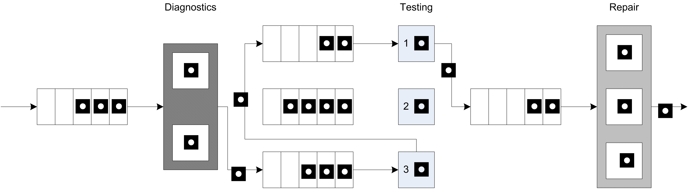
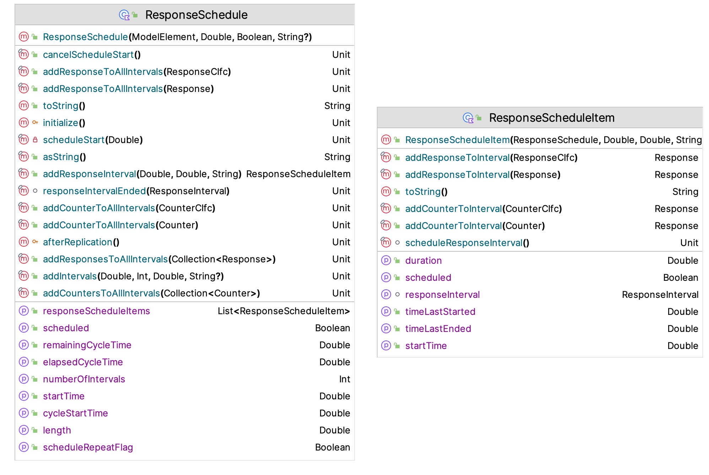

# Advanced Event and Process View Modeling {#ch7AdvModeling}

**[LEARNING OBJECTIVES]{.smallcaps}**

- To develop a deeper understanding of effective modeling with processes and resources.

- To be able to model non-stationary arrivals using arrival schedules.

- To be able to model the staffing/scheduling of resources using resource capacity schedules.

- To be able to capture statistics over specific periods of time.

- To be able to model balking and reneging within queuing situations.

- To develop a deeper understanding of effective modeling with events.

- To develop a basic understanding of verification and validation methods within simulation.

The primary purpose of this chapter is to dive deeper into more complex modeling situations that are commonly experienced within discrete-event dynamic systems. First we will explore how to use the KSL process view constructs to model the common situation of a station where work is performed. Because the KSL is built upon and can take advantage of the flow of control and data structures available within Kotlin, we will see that fairly complex systems can be readily modeled using the primitive elements discussed in the previous chapter.  In addition, when modeling a system, there may be situations where there is limited waiting space for the entities to be processed or we need to maintain some distance between entities that wait (such as social distance requirements)  This situation presents a number of interesting modeling possibilities.  We will look at a way to use resources to handle this situation. 

Many realistic modeling situations have non-stationary characteristics that require the generation of arrivals where the mean rate of arrival depends on the time, such as lunch hour at your favorite fast food restaurant.  We will see how the KSL provides constructs for this situation.  In addition, if the arrivals to a system vary with time, we may want to vary the capacity of the resources with respect to time.  The KSL also provides some basic ways to address this situation.  In addition, because the system performance can be non-stationary, we may want to collect statistics during specific intervals of time.  The KSL has the ability to specify the collect of responses during specific intervals according to a schedule.  

Lastly, the chapter will look at a few miscellaneous modeling situations that should help you to develop ideas for effective modeling of a variety of situations. We will start by looking more closely at processes and resources.

::: {.infobox .note data-latex="{note}"}
**NOTE!**
This chapter provides a series of example Kotlin code that illustrates the use of KSL constructs for implementing process and event view simulation models. The full source code of the examples can be found in the accompanying `KSLExamples` project associated with the [KSL repository](https://github.com/rossetti/KSL). The files for each example of this chapter can be found [here](https://github.com/rossetti/KSL/tree/main/KSLExamples/src/main/kotlin/ksl/examples/book/chapter7).
:::

## Modeling with Processes and Resources

In this section, we explore some of the nuances of modeling systems via process and resources.  Specifically, we will look more carefully at the KSL constructs for modeling resources.  In general, a resource is something that is required or used by the entities within a process.  In real systems, whenever there is requirement for an entity to wait, it is likely that a resource is needed.  Within the KSL, a resource has number of identical units which represent its capacity.  For the purposes of usage, the units of the resource are indistinguishable.  That is, there can be no requirement to use one of the units over some other of the units.  For the entity, it does not matter which unit is supplied for a request. It only matters that it gets the requested number of units from the resource. Resource units are allocated and deallocated to entities that request them. If a request for a specific number of units of the resource cannot be allocated immediately upon request, then the entity (generally) must wait for the units (or not proceed with the request).  If there is a preference between types of resources, then a pool of resources should be used.  Pools of resources will also be discussed in this section. We begin our study of resources by illustrating how resources can be used to model space.

### Modeling Space with Resources

We start the modeling of space with resources by looking at a simple system involving a tandem queue.  A tandem queue is a sequence of queues in order that must be visited to receive service from resources.  Let's setup the situation by first modeling the system without a space requirement between the queues.  The following example presents the specifics of the situation.

***
::: {.example #exTandemQ name="Tandem Queueing System"}
Suppose a service facility
consists of two stations in series (tandem), each with its own FIFO
queue. Each station consists of a queue and a single server. A customer
completing service at station 1 proceeds to station 2, while a customer
completing service at station 2 leaves the facility. Assume that the
inter-arrival times of customers to station 1 are IID exponential random
variables with a mean of 1 minute. Service times of customers at station
1 are exponential random variables with a mean of 0.7 minute, and at
station 2 are exponential random variables with mean 0.9 minute. Develop
an model for this system. Run the simulation for exactly 20000 minutes and estimate for each station the expected average delay in queue for the customer, the expected time-average number of customers in
queue, and the expected utilization. In addition, estimate the average
number of customers in the system and the average time spent in the
system.
:::
***

To model this situation, we need to use two resources, one for each server at the two stations. 

<div class="figure" style="text-align: center">

<p class="caption">(\#fig:Ch7TandemQ)Tandem Queue</p>
</div>

Figure \@ref(fig:Ch7TandemQ) illustrates this situation.  This is a perfect application of what we have previously studied about modeling processes.  The following code sets up the KSL constructs that are needed within the process modeling.

```kt
class TandemQueue(parent: ModelElement, name: String? = null) : ProcessModel(parent, name)  {

    private val worker1: ResourceWithQ = ResourceWithQ(this, "worker1")
    private val worker2: ResourceWithQ = ResourceWithQ(this, "worker2")

    private val tba = ExponentialRV(2.0, 1)

    private val st1 = RandomVariable(this, ExponentialRV(0.7, 2))
    val service1RV: RandomSourceCIfc
        get() = st1
    private val st2 = RandomVariable(this, ExponentialRV(0.9, 3))
    val service2RV: RandomSourceCIfc
        get() = st2
    private val myArrivalGenerator = EntityGenerator(::Customer, tba, tba)
    val generator: EventGeneratorCIfc
        get() = myArrivalGenerator

    private val wip: TWResponse = TWResponse(this, "${this.name}:NumInSystem")
    val numInSystem: TWResponseCIfc
        get() = wip
    private val timeInSystem: Response = Response(this, "${this.name}:TimeInSystem")
    val systemTime: ResponseCIfc
        get() = timeInSystem
```

Since the resources will need a queue, we declare the two resources by using the `ResourceWithQ` class.  Then, we specify the random variables that will be used to represent the time between arrivals and the service time at the two stations. Finally, we define the response variables for collecting the number in the system and the time in the system. The process modeling is a straight-forward application of the *(seize-delay-release)* pattern that was presented in the previous chapter.

```kt
    private inner class Customer : Entity(){
        val tandemQProcess : KSLProcess = process {
            wip.increment()
            timeStamp = time
            seize(worker1)
            delay(st1)
            release(worker1)
            seize(worker2)
            delay(st2)
            release(worker2)
            timeInSystem.value = time - timeStamp
            wip.decrement()
        }
```

Notice that this code does not save the allocations that are returned by the call to the `seize` method.  This is possible because of two reasons.  First, the KSL overloads the `release` method to allow for the specification of the resource to be released. This overloaded method will release **all** previously returned allocations that the entity holds of the named resource. Secondly, this situation is a perfect use case for this, because the entity only has seized the worker *once* before the specified release. Thus, we are simply releasing the last allocation held by the entity via the `release()` function.  It really is user preference whether to save the allocation and then release the allocation or to use the approach of specifying the name of the resource. Of course, this works because releasing **all** previous allocations is the same as releasing the last one in this situation. In fact, this situation is so common that the KSL provides an additional short cut as illustrated in the following code.

```kt
    private inner class Customer : Entity(){
        val tandemQProcess : KSLProcess = process {
            wip.increment()
            timeStamp = time
            use(worker1, delayDuration = st1)
            use(worker2, delayDuration = st2)
            timeInSystem.value = time - timeStamp
            wip.decrement()
        }
    }
```

The `use` method combines the *(seize-delay-release)* pattern into one method call.  The results are not very remarkable.

|Name| Count| Average| Half-Width|
|:---:| :---:| :---:| :---:|
|worker1:InstantaneousUtil| 30| 0.351| 0.002|
|worker1:NumBusyUnits| 30| 0.351| 0.002|
|worker1:ScheduledUtil| 30| 0.351| 0.002|
|worker1:WIP| 30| 0.54| 0.007|
|worker1:Q:NumInQ| 30| 0.189| 0.005|
|worker1:Q:TimeInQ| 30| 0.379| 0.008|
|worker2:InstantaneousUtil| 30| 0.45| 0.003|
|worker2:NumBusyUnits| 30| 0.45| 0.003|
|worker2:ScheduledUtil| 30| 0.45| 0.003|
|worker2:WIP| 30| 0.82| 0.01|
|worker2:Q:NumInQ| 30| 0.37| 0.008|
|worker2:Q:TimeInQ| 30| 0.741| 0.014|
|TandemQModel:NumInSystem| 30| 1.36| 0.014|
|TandemQModel:TimeInSystem| 30| 2.723| 0.02|
|worker1:SeizeCount| 30| 7492.333| 32.526|
|worker2:SeizeCount| 30| 7492.533| 32.356|

Now we are ready to study the situation of modeling finite space between the two stations. 

***
::: {.example #exTandemQWB name="Tandem Queueing System With Blocking"}
Imagine that at the first station there is a chair for the customer to sit in while receiving service from the first worker.  Any customers that arrive while a customer is receiving service at the first station must wait for the server to be free (i.e. the chair to be available).  We assume that there is (at least conceptually) an infinite amount of space for the waiting customers at the first station.  Now, at the second station, there are two chairs.  The customer arriving to the second station will sit in the first chair when receiving service from the server. The second chair is provided for one waiting customer and there is no space for any other customers to wait at the second station.  Thus, a customer finishing service at the first station cannot move into (use) the second station if there is a customer waiting at the second station. If a customer at the first station cannot move into the waiting line (2nd chair) at the second station, then the customer is considered blocked.  What does this customer do? Well, they are selfish and do not give up their current chair until they can get a chair at the second station. Thus, waiting at the second station may cause waiting to occur at the first station.  This situation is called a tandem queue with blocking, as illustrated in Figure \@ref(fig:Ch7TandemQWithBlocking).

<div class="figure" style="text-align: center">

<p class="caption">(\#fig:Ch7TandemQWithBlocking)Tandem Queue with Blocking</p>
</div>
:::
***

Let's see how to model this situation using KSL constructs.  The key is to model the chair that represents the waiting line at the second station with a resource. This is essentially modeling the waiting space with a resource. In the above scenario, there was one space for waiting. 

```kt
class TandemQueueWithBlocking(parent: ModelElement, name: String? = null) : ProcessModel(parent, name) {

    private val buffer: ResourceWithQ = ResourceWithQ(this, "buffer", capacity = 1)
    private val worker1: ResourceWithQ = ResourceWithQ(this, "worker1")
    private val worker2: ResourceWithQ = ResourceWithQ(this, "worker2")

```

In this code, we defined a resource called `buffer` with capacity 1 to represent the chair designated for waiting.  By changing the capacity of this resource, we can study the effect of the limited space at the second station on system performance. 

Exploring the effect of the buffer size is left as an exercise for the reader.  The process modeling needs to be adjusted to account for this space. In the following code, notice the overlapping nature of the seize and release statements.

```kt
    private inner class Customer : Entity() {
        val tandemQProcess: KSLProcess = process {
            wip.increment()
            timeStamp = time
            val a1 = seize(worker1)
            delay(st1)
            val b = seize(buffer)
            release(a1)
            val a2 = seize(worker2)
            release(b)
            delay(st2)
            release(a2)
            timeInSystem.value = time - timeStamp
            wip.decrement()
        }
    }
```

After receiving service at the first station, the customer attempts to seize the buffer (chair for waiting) at the second station. If there is space in the buffer, **then** the customer releases the first worker.  Don't give up your chair until you get the next chair! After moving into the chair (buffer), the customer attempts to seize the second worker.  If the second worker is not available the customer waits; otherwise, the customer delays for service at the second station, releases the second worker, and then departs that system.  Again the key is to have this overlapping seize and release statements.

Figure \@ref(fig:Ch7TandemQWithBlockingAD) provides the activity diagram for this situation. Notice how the arrows for the seize and release of the resources overlap.

<div class="figure" style="text-align: center">

<p class="caption">(\#fig:Ch7TandemQWithBlockingAD)Activity Diagram Tandem Queue with Blocking</p>
</div>

For the given arrival rate and service parameters, the results indicate that the effect of blocking is not too significant. 

|Name| Count| Average| Half-Width|
|:---:| :---:| :---:| :---:|
|buffer:InstantaneousUtil| 30| 0.196| 0.003|
|buffer:NumBusyUnits| 30| 0.196| 0.003|
|buffer:ScheduledUtil| 30| 0.196| 0.003|
|buffer:WIP| 30| 0.267| 0.004|
|buffer:Q:NumInQ| 30| 0.071| 0.002|
|buffer:Q:TimeInQ| 30| 0.143| 0.003|
|worker1:InstantaneousUtil| 30| 0.422| 0.003|
|worker1:NumBusyUnits| 30| 0.422| 0.003|
|worker1:ScheduledUtil| 30| 0.422| 0.003|
|worker1:WIP| 30| 0.761| 0.012|
|worker1:Q:NumInQ| 30| 0.339| 0.009|
|worker1:Q:TimeInQ| 30| 0.678| 0.016|
|worker2:InstantaneousUtil| 30| 0.45| 0.003|
|worker2:NumBusyUnits| 30| 0.45| 0.003|
|worker2:ScheduledUtil| 30| 0.45| 0.003|
|worker2:WIP| 30| 0.646| 0.005|
|worker2:Q:NumInQ| 30| 0.196| 0.003|
|worker2:Q:TimeInQ| 30| 0.392| 0.004|
|TandemQModelWithBlocking:NumInSystem| 30| 1.406| 0.016|
|TandemQModelWithBlocking:TimeInSystem| 30| 2.815| 0.023|
|buffer:SeizeCount| 30| 7492.467| 32.384|
|worker1:SeizeCount| 30| 7492.333| 32.406|
|worker2:SeizeCount| 30| 7492.5| 32.367|

However, the exercises ask the reader to explore what happens if the arrival rate is increased.  A tandem queueing system is just a series of stations. The concept of having stations where work is performed is very useful. A later section illustrates how to generalize these ideas, but first we explore how to organize resources into sets or pools from which resources can be selected.

### Resource Pools

A resource pool is a generalization of the concept of a resource that permits individual instances of the `Resource` class to be combined together into a larger *pool* of units.  Resource pools facilitate the sharing of instances of resources across processes.  The important concepts involved in using resource pools are 1) how to select resources to satisfy a request, and 2) how to allocate a request for units across the pool of resources.  For example, if a request for units of the pool was for 2 units, and the pool contained 3 individual resources all of capacity 1, which of the 3 resources should be selected to provide the requested units?  Also, suppose, for example, the request was for 2 units, and there were 3 individual resources with capacity (1, 2, 3) units, respectively. Should the resource with capacity 2 be used? Should the resource with capacity 3 be used?  Should the resource with capacity 1 be used in combination with one of the other resources? As you can see, there may be many possible ways to allocate units to requests when there is a pool of resources.  The KSL provides a structure for users to supply selection and allocation rules when using pools of resources through some interfaces.

```kt
/**
 * Provides for a method to select resources from a list such that
 * the returned list may contain resources that can fill the amount needed
 */
fun interface ResourceSelectionRuleIfc {
    /**
     * @param amountNeeded the amount needed from resources
     * @param list of resources to consider selecting from
     * @return the selected list of resources. It may be empty
     */
    fun selectResources(amountNeeded: Int, list: List<Resource>): List<Resource>
}

/**
 *  Function to determine how to allocate requirement for units across
 *  a list of resources that have sufficient available units to meet
 *  the amount needed.
 */
fun interface AllocationRuleIfc {

    /** The method assumes that the provided list of resources has
     *  enough units available to satisfy the needs of the request.
     *
     * @param amountNeeded the amount needed from resources
     * @param resourceList list of resources to be allocated from
     * @return the amount to allocate from each resource as a map
     */
    fun makeAllocations(amountNeeded: Int, resourceList: List<Resource>): Map<Resource, Int>
}
```

These two interfaces can be used in combination to form various selection and allocation possibilities for a variety of resource pool situations.  The `ResourcePool` and `ResourcePoolWithQ` classes use default implementations of these functions. The KSL provides two implementations of the `ResourceSelectionRuleIfc` interface.

- `FirstFullyAvailableResource` selects the first resource from a supplied list that can fully meet the request.
- `ResourceSelectionRule` selects a list of resources that (in total) have enough available units to fully meet the request.

It is important to note that the `ResourceSelectionRuleIfc` interface may return an empty list if the request cannot be met.  This is used to determine if the entity must wait. 

The KSL provides a default instance of the `AllocationRuleIfc` interface called `DefaultAllocationRule.` This rule takes in a list of resources that in total has enough units available and allocates from each listed resource (in the order listed) until the entire amount requested is filled. Thus, in both the selection rule and the allocation rule, the order of the resources within the pool are important.  Again, if you want or need to have different rules, then you can implement these interfaces and supply your instances to the `ResourcePool` and `ResourcePoolWithQ` classes to use instead of the default implementations. Let's take a look at an example situation involving resource pools. 

***
::: {.example #exResPool name="Resource Pools"}
In this example, there are two pools. The first pool will have 3 resources (john, paul, and george) and the second pool will have 2 resources (ringo and george).  One of the resources (george) is shared (in common) between the two pools.  The following code creates the four resources, adds them to lists, and then supplies the lists to instances of the `ResourcePoolWithQ` class. 
:::
***

```kt
class ResourcePoolExample(parent: ModelElement) : ProcessModel(parent, null) {

    private val john = Resource(this, name = "John")
    private val paul = Resource(this, name = "Paul")
    private val george = Resource(this, name = "George")
    private val ringo = Resource(this, name = "Ringo")
    private val list1 = listOf(john, paul, george)
    private val list2 = listOf(ringo, george)
    private val pool1: ResourcePoolWithQ = ResourcePoolWithQ(this, list1, name = "pool1")
    private val pool2: ResourcePoolWithQ = ResourcePoolWithQ(this, list2, name = "pool2")
    private val tba = RandomVariable(this, ExponentialRV(1.0, 1), "Arrival RV")
    private val st = RandomVariable(this, ExponentialRV(3.0, 2), "Service RV")
    private val decideProcess = RandomVariable(this, BernoulliRV(0.7, 3))
    private val wip1 = TWResponse(this, "${name}:WIP1")
    private val tip1 = Response(this, "${name}:TimeInSystem1")
    private val wip2 = TWResponse(this, "${name}:WIP2")
    private val tip2 = Response(this, "${name}:TimeInSystem2")
    private val generator = EventGenerator(this, this::arrivals, tba, tba)
```

The two pools are shared between two processes using straightforward *(seize-delay-release)* logic.  

```kt
    private inner class Customer: Entity() {
        val usePool1: KSLProcess = process("Pool 1 Process") {
            wip1.increment()
            timeStamp = time
            val a  = seize(pool1, 1)
            delay(st)
            release(a)
            tip1.value = time - timeStamp
            wip1.decrement()
        }

        val usePool2: KSLProcess = process("Pool 2 Process") {
            wip2.increment()
            timeStamp = time
            val a  = seize(pool2, 1)
            delay(st)
            release(a)
            tip2.value = time - timeStamp
            wip2.decrement()
        }
    }
```

In this example, we randomly activate the two processes based on a distribution. 

```kt
    private fun arrivals(generator: EventGenerator){
        val c = Customer()
        if (decideProcess.value.toBoolean()){
            activate(c.usePool1)
        } else {
            activate(c.usePool2)
        }
    }
```

Since there are four resources and two pools, the performance reports on all the individual resources usage as well as the overall performance of the pool.
  
**Resource Pool Example Statistical Summary Report**
  
|Name| Count| Average| Half-Width|
|:---:| :---:| :---:| :---:|
|John:InstantaneousUtil| 30| 0.663| 0.003|
|John:NumBusyUnits| 30| 0.663| 0.003|
|John:ScheduledUtil| 30| 0.663| 0.003|
|Paul:InstantaneousUtil| 30| 0.663| 0.003|
|Paul:NumBusyUnits| 30| 0.663| 0.003|
|Paul:ScheduledUtil| 30| 0.663| 0.003|
|George:InstantaneousUtil| 30| 0.834| 0.003|
|George:NumBusyUnits| 30| 0.834| 0.003|
|George:ScheduledUtil| 30| 0.834| 0.003|
|Ringo:InstantaneousUtil| 30| 0.833| 0.003|
|Ringo:NumBusyUnits| 30| 0.833| 0.003|
|Ringo:ScheduledUtil| 30| 0.833| 0.003|
|pool1:NumBusy| 30| 2.16| 0.007|
|pool1:FractionBusy| 30| 0.72| 0.002|
|pool1:Q:NumInQ| 30| 0.851| 0.023|
|pool1:Q:TimeInQ| 30| 1.708| 0.044|
|pool2:NumBusy| 30| 1.666| 0.007|
|pool2:FractionBusy| 30| 0.833| 0.003|
|pool2:Q:NumInQ| 30| 2.631| 0.101|
|pool2:Q:TimeInQ| 30| 5.253| 0.193|
|ResourcePoolExample_3:WIP1| 30| 2.34| 0.028|
|ResourcePoolExample_3:TimeInSystem1| 30| 4.698| 0.05|
|ResourcePoolExample_3:WIP2| 30| 4.134| 0.108|
|ResourcePoolExample_3:TimeInSystem2| 30| 8.255| 0.201|
|John:SeizeCount| 30| 3318.533| 19.247|
|Paul:SeizeCount| 30| 3335.833| 24.126|
|George:SeizeCount| 30| 4174.967| 24.294|
|Ringo:SeizeCount| 30| 4151.9| 23.655|

Resource pools can be helpful when modeling the sharing of resources between activities. In the next section, we discuss a more complex situation involving a flow shop.

### Computer Test and Repair Shop Example 

This section presents a common modeling situation in which entities follow a processing plan until they are completed. The KSL makes this type of modeling easy because it can leverage the full functionality of the Kotlin language.


***
::: {.example #exTestAndRepair name="Computer Test and Repair Shop"}
Consider a test and repair shop for computer parts (e.g. circuit boards,
hard drives, etc.) The system consists of an initial diagnostic station
through which all newly arriving parts must be processed. Currently,
newly arriving parts arrive according to a Poisson arrival process with
a mean rate of 3 per hour. The diagnostic station consists of 2
diagnostic machines that are fed the arriving parts from a single queue.
Data indicates that the diagnostic time is quite variable and follows an
exponential distribution with a mean of 30 minutes. Based on the results
of the diagnostics, a testing plan is formulated for the parts. There
are currently three testing stations 1. 2, 3 which consist of one
machine each. The testing plan consists of an ordered sequence of
testing stations that must be visited by the part prior to proceeding to
a repair station. Because the diagnosis often involves similar problems,
there are common sequences that occur for the parts. The company
collected extensive data on the visit sequences for the parts and found
that the sequences in Table \@ref(tab:TestPlans) constituted the vast majority of test plans for the parts.

::: {#tab:TestPlans}
  Test Plan    \% of Parts   Sequence
  ----------- ------------- ----------
  1                25%       2,3,2,1
  2               12.5%        3,1
  3               37.5%       1,3,1
  4                25%         2,3

  Table: (\#tab:TestPlans) Test plan sequences
:::
:::
***

For example, 25% of the newly arriving parts follow test plan 1, which
consists of visiting test stations 2, 3, 2, and 1 prior to proceeding to
the repair station.

The testing of the parts at each station takes time that may depend upon
the sequence that the part follows. That is, while parts that follow
test plan's 1 and 3 both visit test station 1, data shows that the time
spent processing at the station is not necessarily the same. Data on the
testing times indicate that the distribution is well modeled with a
lognormal distribution with mean, $\ \mu$, and standard deviation,
$\sigma$ in minutes. Table \@ref(tab:TestDist) presents the mean and standard
deviation for each of the testing time distributions for each station in
the test plan.

::: {#tab:TestDist}
  Test Plan           Testing Time Parameters           Repair Time Parameters
  ----------- ---------------------------------------- ------------------------
  1            (20,4.1), (12,4.2), (18,4.3), (16,4.0)         (30,60,80)
  2                        (12,4), (15,4)                     (45,55,70)
  3                 (18,4.2), (14,4.4), (12,4.3)              (30,40,60)
  4                        (24,4), (30,4)                     (35,65,75)

  Table: (\#tab:TestDist) Testing and repair distributions
:::

For example, the first pair of parameters, (20, 4.1), for test plan 1
indicates that the testing time at test station 2 has a lognormal
distribution with mean,$\mu = 20$, and standard deviation,$\sigma = 4.1$
minutes.

The repair station has 3 workers that attempt to complete the repairs
based on the tests. The repair time also depends on the test plan that
the part has been following. Data indicates that the repair time can be
characterized by a triangular distribution with the minimum, mode, and
maximum as specified in the previous table. After the repairs, the parts
leave the system. When the parts move between stations assume that there
is always a worker available and that the transfer time takes between 2
to 4 minutes uniformly distributed.
Figure \@ref(fig:TestAndRepairSystem) illustrates the arrangement of the
stations and the flow of the parts following Plan 2 in the test and
repair shop.

<div class="figure" style="text-align: center">

<p class="caption">(\#fig:TestAndRepairSystem)Overview of the test and repair shop</p>
</div>

The company is considering accepting a new contract that will increase
the overall arrival rate of jobs to the system by 10%. They are
interested in understanding where the potential bottlenecks are in the
system and in developing alternatives to mitigate those bottlenecks so
that they can still handle the contract. The new contract stipulates
that 80% of the time the testing and repairs should be completed within
480 minutes. The company runs 2 shifts each day for each 5 day work
week. Any jobs not completed at the end of the second shift are carried
over to first shift of the next working day. Assume that the contract is
going to last for 1 year (52 weeks). Build a simulation model that can
assist the company in assessing the risks associated with the new
contract.

#### Implementing the Test and Repair Model

Before implementing the model, you should prepare by conceptualizing
the process flow.
Figure \@ref(fig:TestAndRepairActivityDiagram) illustrates the activity diagram
for the test and repair system. Parts are created and flow first to the
diagnostic station where they seize a diagnostic machine while the
diagnostic activity occurs. Then, the test plan is assigned. The flow
for the visitation of the parts to the test station is shown with a loop
back to the transfer time between the stations. It should be clear that
the activity diagram is representing any of the three test stations.
After the final test station in the test plan has been visited, the part
goes to the repair station, where 1 of 3 repair workers is seized for
the repair activity. After the repair activity, the part leaves the
system.

<div class="figure" style="text-align: center">

<p class="caption">(\#fig:TestAndRepairActivityDiagram)Activity diagram for test and repair system</p>
</div>

In many modeling contexts, entities will follow a specific path through
the system. In a manufacturing job shop, this is often called the
process plan. In a bus system, this is called a bus route. In the test and
repair system, this is referred to as the test plan. To model a specify
path through the system, we need an approach to specify a sequence of stations. A sequence
consists of an ordered list of *steps*. Each step must indicate
the resources and other information associated with the step.  Thus, a sequence
is built by simply providing the list of steps that must be visited. We will use Kotlin lists to hold this information.  Let's take a look at the implementation.

Because of the requirement that different parts follow different sequences and have different processing times based on what resource they are using and where they are in the sequence, there are many random variables that need to be defined for this model.

```kt
class TestAndRepairShop(parent: ModelElement, name: String? = null) : ProcessModel(parent, name) {

    // define the random variables
    private val tba = ExponentialRV(20.0)
    private val t11 = RandomVariable(this, LognormalRV(20.0, 4.1))
    private val t21 = RandomVariable(this, LognormalRV(12.0, 4.2))
    private val t31 = RandomVariable(this, LognormalRV(18.0, 4.3))
    private val t41 = RandomVariable(this, LognormalRV(16.0, 4.0))
    private val t12 = RandomVariable(this, LognormalRV(12.0, 4.0))
    private val t22 = RandomVariable(this, LognormalRV(15.0, 4.0))
    private val t13 = RandomVariable(this, LognormalRV(18.0, 4.2))
    private val t23 = RandomVariable(this, LognormalRV(14.0, 4.4))
    private val t33 = RandomVariable(this, LognormalRV(12.0, 4.3))
    private val t14 = RandomVariable(this, LognormalRV(24.0, 4.0))
    private val t24 = RandomVariable(this, LognormalRV(30.0, 4.0))
    private val r1 = RandomVariable(this, TriangularRV(30.0, 60.0, 80.0))
    private val r2 = RandomVariable(this, TriangularRV(45.0, 55.0, 70.0))
    private val r3 = RandomVariable(this, TriangularRV(30.0, 40.0, 60.0))
    private val r4 = RandomVariable(this, TriangularRV(35.0, 65.0, 75.0))
    private val diagnosticTime = RandomVariable(this, ExponentialRV(30.0))
    private val moveTime = RandomVariable(this, UniformRV(2.0, 4.0))
```

The code uses a naming convention to keep track of which random variable is using on which sequence. For example, `t21` is the random variable required for the second step of the first test plan and `r1` is the repair time random variable for the first test plan. For each step of the test plan, we need to know the required resource and the processing time. Thus, we define each of the resources as follows.

```kt
    // define the resources
    private val myDiagnostics: ResourceWithQ = ResourceWithQ(this, "Diagnostics", capacity = 2)
    private val myTest1: ResourceWithQ = ResourceWithQ(this, "Test1")
    private val myTest2: ResourceWithQ = ResourceWithQ(this, "Test2")
    private val myTest3: ResourceWithQ = ResourceWithQ(this, "Test3")
    private val myRepair: ResourceWithQ = ResourceWithQ(this, "Repair", capacity = 3)

```

Then, we define a class to hold the information for each step and the lists to represent each of the test plans.

```kt
    inner class TestPlanStep(val resource: ResourceWithQ, val processTime: RandomIfc)

    // make all the plans
    private val testPlan1 = listOf(
        TestPlanStep(myTest2, t11), TestPlanStep(myTest3, t21),
        TestPlanStep(myTest2, t31), TestPlanStep(myTest1, t41), TestPlanStep(myRepair, r1)
    )
    private val testPlan2 = listOf(
        TestPlanStep(myTest3, t12),
        TestPlanStep(myTest1, t22), TestPlanStep(myRepair, r2)
    )
    private val testPlan3 = listOf(
        TestPlanStep(myTest1, t13), TestPlanStep(myTest3, t23),
        TestPlanStep(myTest1, t33), TestPlanStep(myRepair, r3)
    )
    private val testPlan4 = listOf(
        TestPlanStep(myTest2, t14),
        TestPlanStep(myTest3, t24), TestPlanStep(myRepair, r4)
    )
```

Now that the test plans are defined, we can develop a method for determining which plan is assigned to each part.  The situation description provides a distribution associated with the test plans as provided in Table \@ref(tab:TestDist).  We can use a random list (`REmpiricalList`) to model this situation.

```kt
    // set up the sequences and the random selection of the plan
    private val sequences = listOf(testPlan1, testPlan2, testPlan3, testPlan4)
    private val planCDf = doubleArrayOf(0.25, 0.375, 0.7, 1.0)
    private val planList = REmpiricalList<List<TestPlanStep>>(this, sequences, planCDf)
```

The test plans, which are lists, are added to another list called `sequences,` which will be used from which to randomly select the test plan according to the discrete empirical distribution as provided by the CDF across the test plans.

To capture the performance of the system, we can use `Response` and `TWResponse` instances.

```kt
    private val wip: TWResponse = TWResponse(this, "${this.name}:NumInSystem")
    val numInSystem: TWResponseCIfc
        get() = wip
    private val timeInSystem: Response = Response(this, "${this.name}:TimeInSystem")
    val systemTime: ResponseCIfc
        get() = timeInSystem
    private val myContractLimit: IndicatorResponse = IndicatorResponse({ x -> x <= 480.0 }, timeInSystem, "ProbWithinLimit")
    val probWithinLimit: ResponseCIfc
        get() = myContractLimit
```

Notice the use of an `IndicatorResponse` to capture the probability of completing the job within the contract limit.  Finally, we can specify the process description for this situation. 

```kt
    private inner class Part : Entity() {
        val testAndRepairProcess: KSLProcess = process {
            wip.increment()
            timeStamp = time
            //every part goes to diagnostics
            use(myDiagnostics, delayDuration = diagnosticTime)
            // determine the test plan
            val plan: List<TestPlanStep> = planList.element
            // get the iterator
            val itr = plan.iterator()
            // iterate through the plan
            while (itr.hasNext()) {
                val tp = itr.next()
                use(tp.resource, delayDuration = tp.processTime)
                if (tp.resource != myRepair) {
                    delay(moveTime)
                }
            }
            timeInSystem.value = time - timeStamp
            wip.decrement()
        }
    }
```

Notice how the KSL process constructs and the Kotlin language combine to implement a fairly complex situation within a short and compact process description. The critical item to note is the use of an instance of an iterator within the process. The variable `plan` is actually randomly generated using the `planList` discrete empirical list. Then, an iterator for this list is retrieved. The iterator is then used to march through the steps of the assigned test plan within a `while` loop. Notice that we check if we are not at the repair machine.  If we are not, we incur the delay to move to the next machine in the test plan.  The process also includes the code to collect statistics on the part as it moves through the process. To setup to execute this code, we specify the run length and the number of replications.

```kt
fun main() {
    val m = Model()
    val tq = TestAndRepairShop(m, name = "TestAndRepair")
    m.numberOfReplications = 10
    m.lengthOfReplication = 52.0* 5.0*2.0*480.0
    m.simulate()
    m.print()
    val r = m.simulationReporter
    r.writeHalfWidthSummaryReportAsMarkDown(KSL.out, df = MarkDown.D3FORMAT)
}
```

The output is quite lengthy so the code captures it as a Markdown table.

|Name| Count| Average| Half-Width|
|:---:| :---:| :---:| :---:|
|Diagnostics:InstantaneousUtil| 10| 0.744| 0.007|
|Diagnostics:NumBusyUnits| 10| 1.489| 0.013|
|Diagnostics:ScheduledUtil| 10| 0.744| 0.007|
|Diagnostics:WIP| 10| 3.332| 0.123|
|Diagnostics:Q:NumInQ| 10| 1.844| 0.11|
|Diagnostics:Q:TimeInQ| 10| 36.964| 2.043|
|Test1:InstantaneousUtil| 10| 0.855| 0.005|
|Test1:NumBusyUnits| 10| 0.855| 0.005|
|Test1:ScheduledUtil| 10| 0.855| 0.005|
|Test1:WIP| 10| 4.1| 0.283|
|Test1:Q:NumInQ| 10| 3.245| 0.279|
|Test1:Q:TimeInQ| 10| 57.692| 4.736|
|Test2:InstantaneousUtil| 10| 0.773| 0.006|
|Test2:NumBusyUnits| 10| 0.773| 0.006|
|Test2:ScheduledUtil| 10| 0.773| 0.006|
|Test2:WIP| 10| 2.319| 0.132|
|Test2:Q:NumInQ| 10| 1.546| 0.126|
|Test2:Q:TimeInQ| 10| 41.279| 3.062|
|Test3:InstantaneousUtil| 10| 0.858| 0.006|
|Test3:NumBusyUnits| 10| 0.858| 0.006|
|Test3:ScheduledUtil| 10| 0.858| 0.006|
|Test3:WIP| 10| 3.417| 0.273|
|Test3:Q:NumInQ| 10| 2.559| 0.269|
|Test3:Q:TimeInQ| 10| 51.318| 5.176|
|Repair:InstantaneousUtil| 10| 0.864| 0.006|
|Repair:NumBusyUnits| 10| 2.591| 0.017|
|Repair:ScheduledUtil| 10| 0.864| 0.006|
|Repair:WIP| 10| 3.824| 0.135|
|Repair:Q:NumInQ| 10| 1.233| 0.12|
|Repair:Q:TimeInQ| 10| 24.733| 2.273|
|TestAndRepair:NumInSystem| 10| 17.572| 0.803|
|TestAndRepair:TimeInSystem| 10| 352.487| 14.262|
|ProbWithinLimit| 10| 0.817| 0.028|
|Diagnostics:SeizeCount| 10| 12443.4| 75.921|
|Test1:SeizeCount| 10| 14027| 76.189|
|Test2:SeizeCount| 10| 9337.3| 77.976|
|Test3:SeizeCount| 10| 12436.4| 76.419|
|Repair:SeizeCount| 10| 12430.7| 75.528|

It looks like test machine 3 and the repair station have the highest estimated utilization values. An increase in the amount of work to the test and repair shop may have issues at those stations.  The reader is asked to explore the performance of this situation in the exercises.

In the next section, we examine an even more complex situation involving systems that have parameters or distributions that depend on time. 

## Modeling Non-Stationary Systems

This section tackles a number of miscellaneous topics that can enhance
your modeling capabilities. The section first examines the modeling of
non-stationary arrival processes. This will motivate the exploration of
additional concepts in resource modeling, including how to incorporate
time varying resource staffing schedules. This will enable you to better
model and tabulate the effects of realistic staff changes within
systems. Because non-stationary arrivals affect how statistics should be interpreted, we will also study how to collect statistics over specific periods of time.

The section also covers some useful modeling situation involving how entities interact. The first situation that we will see is that of reneging from a queue. This will introduce how to remove entities that are in a queue and terminate their processes. Let's get started by looking at how time dependent arrivals can be generated.

### Non-Stationary Arrival Processes {#ch7secNSPP}

If a process does not depend on time, it is said to be stationary. When
a process depends on time, it is said to be non-stationary. The more
formal definitions of stationary/non-stationary are avoided in the
discussion that follows.

There are many ways in which you can model non-stationary (time varying)
processes in your simulation models. Many of these ways depend entirely
on the system being studied and through that study appropriate modeling
methods will become apparent. For example, suppose that workers
performing a task learn how to more efficiently perform the task every
time that they repeat the task. The task time will depend on the time
(number of previously performed tasks). For this situation, you might
use a learning curve model as a basis for changing the task times as the
number of repetitions of the task increases.

As another example, suppose the worker's availability depends on a
schedule, such as having a 30-minute break after accumulating so much
time. In this situation, the system's resources are dependent on time.
Modeling this situation is described later in this section.

Let's suppose that the following situation needs to be modeled. Workers
are assigned a shift of 8 hours and have a quota to fill. Do you think
that it is possible that their service times would, on average, be less
during the latter part of the shift? Sure. They might work faster in
order to meet their quota during the latter part of the shift. If you
did not suspect this phenomenon and performed a time study on the
workers in the morning and fit a distribution to these data, you would
be developing a distribution for the service times during the morning.
If you applied this distribution to the entire shift, then you may have
a problem matching your simulation throughput numbers to the real
throughput.

As you can see, if you suspect that a non-stationary process is
involved, then it is critical that you also record the time that the
observation was made. The time series plot that was discussed for input
modeling helps in assessing non-stationary behavior; however, it only
plots the order in which the data were collected. If you collect 25
observations of the service time every morning, you might not observe
non-stationary behavior. To observe non-stationary behavior it is
important to collect observations across periods of time.

One way to better plan your observations is to randomize when you will
take the observations. Work sampling methods often require this. The day
is divided into intervals of time and the intervals randomly selected in
which to record an activity. By comparing the behavior of the data
across the intervals, you can begin to assess whether time matters in
the modeling as demonstrated in Section \@ref(AppDisFitPoissonFit). Even if
you do not divide time into logical intervals, it is good practice to
record the date and time for each of the observations that you make so that
the observations can later be placed into logical intervals. As you may
now be thinking, modeling a non-stationary process will take a lot of
care and more observations than a stationary process.

A very common non-stationary process that you have probably experienced
is a non- stationary arrival process. In a non-stationary arrival
process, the arrival process to the system will vary by time (e.g., by
hour of the day). Because the arrival process is a key input to the
system, the system will thus become non-stationary. For example, in the
drive-through pharmacy example, the arrival of customers occurred
according to a Poisson process with mean rate $\lambda$ per hour.

As a reminder, $\lambda$ represents the mean arrival rate or the
expected number of customers per unit time. Suppose that the expected
arrival rate is five per hour. This does not mean that the pharmacy will
get five customers every hour, but rather that on average five customers
will arrive every hour. Some hours will get more than five customers and
other hours will get less. The implication for the pharmacy is that they
should expect about five per hour (every hour of the day) regardless of
the time of day. Is this realistic? It could be, but it is more likely
that the mean number of arriving customers will vary by time of day. For
example, would you expect to get five customers per hour from 4 a.m. to
5 a.m., from 12 noon to 1 p.m., from 4 p.m. to 6 p.m.? Probably not! A
system like the pharmacy will have peaks and valleys associated with the
arrival of customers. Thus, the mean arrival rate of the customers may
vary with the time of day. That is, $\lambda$ is really a function of
time, $\lambda(t)$.

To more realistically model the arrival process to the pharmacy, you
need to model a non-stationary arrival process. Let's think about how
data might be collected in order to model a non-stationary arrival
process. First, as in the previous service time example, you need to
think about dividing the day into logical periods of time. A pilot study
may help in assessing how to divide time, or you might simply pick a
convenient time division such as hours. You know that event generation logic
requires a distribution that represents the time between arrivals.
Ideally, you should collect the time of every arrival, $T_i$, throughout
the day. Then, you can take the difference among consecutive arrivals,
$T_i - T_{i-1}$ and fit a distribution to the inter-arrival times.
Looking at the $T_i$ over time may help to assess whether you need
different distributions for different time periods during the day.
Suppose that you do collect the observations and find that three
different distributions are reasonable models given the following data:

-   Exponential, $E[X] = 60$, for midnight to 8 a.m.

-   Lognormal, $E[X] = 12$, $Var[X] = 4$, for 8 a.m. to 4 p.m.

-   Triangular, min = 10; mode = 16; max = 20, for 4 p.m. to midnight

One simple method for implementing this situation is to switch to the appropriate distribution for the current time. In other words, schedule an event at midnight so that
the time between arrival distribution can be set to exponential,
schedule an event at 8 a.m. to switch to lognormal, and
schedule an event at 4 p.m. to switch to triangular. This can easily be accomplished by holding the distributions within a list and using variable to determine which period of time is active and indexing into the list accordingly. Clearly, this varies the arrival process in a time-varying manner. There is
nothing wrong with this modeling approach if it works well for the
situation. In taking such an approach, you need a lot of data. Not only
do you need to record the time of every arrival, but you need enough
arrivals in order to adequately fit distributions to the time between
events for various time periods. This may or may not be feasible in
practice.

Often in modeling arrival processes, you cannot readily collect the
actual times of the arrivals. If you can, you should try, but sometimes
you just cannot. Instead, you are limited to a count of the number of
arrivals in intervals of time. For example, a computer system records
the number of people arriving every hour but not their individual
arrival times. This is not uncommon since it is much easier to store
summary counts than it is to store all individual arrival times. Suppose
that you had count data as shown in Table \@ref(tab:ExArrivalCounts).

::: {#tab:ExArrivalCounts}
       Interval       Mon   Tue   Wed   Thurs   Fri   Sat   Sun
  ------------------ ----- ----- ----- ------- ----- ----- -----
     12 am -- 6 am    3     2     1      2      4     2     1
     6 am - 9 am       6     4     6      7      8     7     4
     9 am - 12 pm     10     6     4      8     10     9     5
     12 pm - 2 pm     24    25    22     19     26    27    20
     2 pm - 5 pm      10    16    14     16     13    16    15
     5 pm - 8 pm      30    36    26     35     33    32    18
     8 pm - 12 am     14    12     8     13     12    15    10

  Table: (\#tab:ExArrivalCounts) Example arrival counts
:::

Of course, how the data are grouped into intervals will affect how the
data can be modeled. Grouping is part of the modeling process. Let's
accept these groups as appropriate for this situation. Looking at the
intervals, you see that more arrivals tend to occur from 12 pm to 2 pm
and from 5 pm to 8 pm. As discussed in
Section \@ref(AppDisFitPoissonFit), we could
test for this non-stationary behavior and check if the counts depend on
the time of day. It is pretty clear that this is the case for this
situation. Perhaps this corresponds to when people who visit the
pharmacy can get off of work. Clearly, this is a non-stationary
situation. What kinds of models can be used for this type of count data?

A simple and often reasonable approach to this situation is to check
whether the number of arrivals in *each* interval occurs according to a
Poisson distribution. If so, then you know that the time between
arrivals in an interval is exponential. When you can divide time so that
the number of events in the intervals is Poisson (with different mean
rates), then you can use a non-stationary or non-homogeneous Poisson
process as the arrival process.

Consider the first interval to be 12 am to 6 am; to check if the counts
are Poisson in this interval, there are seven data points (one for every
day of the week for the given period). This is not a lot of data to use to perform
a chi-square goodness-of-fit test for the Poisson distribution. So, to
do a better job at modeling the situation, many more days of data are
needed. The next question is: Are all the days the same? It looks like
Sunday may be a little different than the rest of the days. In
particular, the counts on Sunday appear to be a little less on average
than the other days of the week. In this situation, you should also
check whether the day of the week matters to the counts. As we
illustrated in Section \@ref(AppDisFitPoissonFit), one method of doing this is to perform a contingency table test.

Let's assume for simplicity that there is not enough evidence to suggest
that the days are different and that the count data in each interval is
well modeled with a Poisson distribution. In this situation, you can
proceed with using a non-stationary Poisson process. From the data you
can calculate the average arrival rate for each interval and the rate
per hour for each interval as shown in
Table \@ref(tab:MeanArrivalRates). In the table, 2.14 is the average of the
counts across the days for the interval 12 am to 6 pm. In the rate per
hour column, the interval rate has been converted to an hourly basis by
dividing the rate for the interval by the number of hours in the
interval. Figure\@ref(fig:NSArrivals) illustrates the time-varying
behavior of the mean arrival rates over the course of a day.

::: {#tab:MeanArrivalRates}
       Interval       Avg.    Length (hrs)   Rate per hour
  ------------------ ------- -------------- ---------------
     12 am -- 6 am    2.14         6             0.36
     6 am - 9 am       6.0         3              2.0
     9 am - 12 pm     7.43         3             2.48
     12 pm - 2 pm     23.29        2            11.645
     2 pm - 5 pm      14.29        3             4.76
     5 pm - 8 pm      30.0         3              10
     8 pm - 12 am     12.0         4              3.0

  Table: (\#tab:MeanArrivalRates) Mean arrival rates for each time interval
:::

<div class="figure" style="text-align: center">

<p class="caption">(\#fig:NSArrivals)Arrival rate per hour for time intervals</p>
</div>

The two major methods by which a non-stationary Poisson process can be
generated are thinning and rate inversion. Both methods will be briefly
discussed; however, the interested reader is referred to
[@leemis2006discreteevent] or [@ross1997introduction] for more of the
theory underlying these methods. Before these methods are discussed, it
is important to point out that the naive method of using different
Poisson processes for each interval and subsequently different
exponential distributions to represent the inter-arrival times could be
used to model this situation by switching the distributions as
previously discussed. However, the switching method is not technically
correct for generating a non-stationary Poisson process. This is because
it will not generate a non-stationary Poisson process with the correct
probabilistic underpinnings. Thus, if you are going to model a process
with a non-stationary Poisson process, you should use either thinning or
rate inversion to be technically correct.

#### Thinning Method

For the thinning method, a stationary Poisson process with a constant
rate,$\lambda^{*}$, and arrival times, $t_{i}^{*}$, is first generated,
and then potential arrivals, $t_{i}^{*}$, are rejected with probability:

$$p_r = 1 - \frac{\lambda(t_{i}^{*})}{\lambda^{*}}$$

where $\lambda(t)$ is the mean arrival rate as a function of time.
Often, $\lambda^{*}$ is set as the maximum arrival rate over the time
horizon, such as:

$$\lambda^{*} = \max\limits_{t} \lbrace \lambda(t) \rbrace$$

In the example, $\lambda^{*}$ would be the mean of the 5 pm to 8 pm
interval, $\lambda^{*} = 11.645$. 

***
::: {.example #exThinning name="Thinning Algorithm Implementation"}
The following code for
implementing the thinning method creates event times at the maximum rate
and thins them according to the current time.
```kt
fun nhppThinning(rateFunc: RateFunctionIfc, maxTime: Double) : DoubleArray {
    val list = mutableListOf<Double>()
    val rv = ExponentialRV(1.0/rateFunc.maximumRate)
    val u = UniformRV(0.0, rateFunc.maximumRate)
    var t = 0.0
    while (t < maxTime){
        var s = t
        do{
            s = s + rv.value
        } while((s < maxTime) && (u.value > rateFunc.rate(s)))
        t = s
        if (t < maxTime){
            list.add(t)
        }
    }
    return list.toDoubleArray()
}
```
:::
***

The function returns the time of the events. To be able to use such numbers in an event generator, we need to generate the time between random events for the non-homogeneous Poisson process. The KSL provides such a random variable via the `NHPPTimeBtwEventRV` class found in the `ksl.modeling.nhpp` package.  The above code, which can be found in the examples for this chapter, uses an instance that implements the `RateFunctionIfc` interface. The `ksl.modeling.nhpp` package provides implementations for piecewise constant and piecewise linear rate functions.  The following code illustrates how to create and simulate a piecewise constant rate function using the thinning method.

```kt
fun main() {
    val d = doubleArrayOf(15.0, 20.0, 15.0)
    val ar = doubleArrayOf(1.0, 2.0, 1.0)
    val f = PiecewiseConstantRateFunction(d, ar)
    println("-----")
    println("intervals")
    println(f)
    val times = nhppThinning(f, 50.0)
    println(times.contentToString())
}
```

This code simulates the following piecewise rate function:

$$
f(x) =
\begin{cases}
1.0 & 0.0 \leq x \leq 15.0\\
2.0 & 15.0 \leq x \leq 35.0\\
1.0 & 35.0 \leq x \leq 50.0\\
\end{cases}
$$
Notice that the rate and the duration values are provided as arrays. The theoretical basis for why thinning works can be found in [@ross1997introduction].

#### Rate Inversion Method

The second method for generating a non-stationary Poisson process is
through the rate inversion algorithm. In this method, a $\lambda = 1$
Poisson process is generated, and the inverse of the mean arrival rate
function is used to re-scale the times of arrival to the appropriate
scale. Define $m(t)$ as the cumulative mean rate function such that:

$$
m(t) = \int_0^t \lambda(s)ds \quad \text{if} \, \, t \leq 0 < \tau
$$
where $\lambda(\cdot)$ is the instantaneous mean rate function defined over a range from 0 to $\tau$.  Define $m^{-1}(t)$ as the inverse of $m(t)$. Then, the following algorithm will generate a non-homogeneous Poisson process. Define $a_0 = 0$,  $y_0 = 0.0$, and $n = 0$.

while ($a_n < \tau$) \{

$y_{n+1} =  y_n$ + `ExponentialRV(mean=1.0)`

$a_{n+1} = m^{-1}(y_{n+1})$

$n = n + 1$

\}

The resulting array, $a_i$ holds the generated event times. This algorithm is discussed further in [@ross1997introduction]. The algorithm generates a rate 1.0 Poisson process and transforms the resulting event times to the times on the $m^{-1}(t)$ axis.  The resulting event times will be from a non-homogeneous Poisson process.

The KSL provides classes for piecewise constant and piecewise linear rate functions and their inverse cumulative rate functions.

***
::: {.example #exPWRate name="Piecewise Constant Rate Function"}
The following example illustrates how to setup a piecewise linear rate function and generate from it using a `NHPPEventGenerator` instance.

```kt
class NHPPPWLinearExample(parent: ModelElement, f: PiecewiseRateFunction, name: String? = null) 
: ModelElement(parent, name) {

    private val myNHPPGenerator: NHPPEventGenerator = NHPPEventGenerator(this, f, this::arrivals, streamNum = 1)
    private val myCountersFC: MutableList<Counter> = mutableListOf()
    private val myPWRF: PiecewiseRateFunction = f

    init {
        val n: Int = f.numberSegments()
        for (i in 0 until n) {
            val c = Counter(this, "Interval FC $i")
            myCountersFC.add(c)
        }
    }

    private fun arrivals(generator: EventGenerator){
        val t: Double = time
        val i: Int = myPWRF.findTimeInterval(t)
        myCountersFC[i].increment()
    }
}
```
:::
***

In the code, a list of counters is defined to collect the counts within the intervals of the function.  The end points of the segments are the rates at the beginning and end of the segments.  The rate at the beginning of the segment can be the same as the rate at the end of the segment.  The example has two arrays, one for the rate values and one for the duration values.  In the example, the first segment has beginning rate $\lambda_0 = 0.5$, duration 200.0, and ending rate, $\lambda_1 = 0.5$.  The second segment begins with $\lambda_1 = 0.5$, has duration 400.0, and ending rate $\lambda_2 = 0.9$.  Thus, there will be one more specified rate value than there will be duration values. To specify a piecewise linear rate function, you must have at least one segment.

```kt
fun main() {
    val ar = doubleArrayOf(0.5, 0.5, 0.9, 0.9, 1.2, 0.9, 0.5)
    val dd = doubleArrayOf(200.0, 400.0, 400.0, 200.0, 300.0, 500.0)

    val f = PiecewiseLinearRateFunction(dd, ar)
    // create the experiment to run the model
    val s = Model()
    println("-----")
    println("intervals")
    System.out.println(f)
    NHPPPWLinearExample(s, f)

    // set the parameters of the experiment
    s.numberOfReplications = 1000
    s.lengthOfReplication = 2000.0

    // tell the simulation to run
    s.simulate()
    val r = s.simulationReporter
    r.printAcrossReplicationSummaryStatistics()
}
```

The output is what would be expected for this process. The interested reader is referred to
[@leemis2006discreteevent] for why the slope of the segments play such an important role.

```
intervals
 [0.5,0.5] slope = 0.0 [0.0,200.0] width = 200.0 [0.0,100.0] cr width = 100.0
 [0.5,0.9] slope = 0.001 [200.0,600.0] width = 400.0 [100.0,380.0] cr width = 280.0
 [0.9,0.9] slope = 0.0 [600.0,1000.0] width = 400.0 [380.0,740.0] cr width = 360.0
 [0.9,1.2] slope = 0.0014999999999999996 [1000.0,1200.0] width = 200.0 [740.0,950.0] cr width = 210.0
 [1.2,0.9] slope = -9.999999999999998E-4 [1200.0,1500.0] width = 300.0 [950.0,1265.0] cr width = 315.0
 [0.9,0.5] slope = -8.0E-4 [1500.0,2000.0] width = 500.0 [1265.0,1615.0] cr width = 350.0

-------------------------------------------------------------------------------

Across Replication Statistical Summary Report
Sat Dec 31 18:03:58 CST 2022
Simulation Results for Model: MainModel


Number of Replications: 1000
Length of Warm up period: 0.0
Length of Replications: 2000.0

-------------------------------------------------------------------------------
Counters
-------------------------------------------------------------------------------
Name                           	      Average 	    Std. Dev. 	 Count 
-------------------------------------------------------------------------------
Interval FC 0                  	    99.899000 	    10.144837 	  1000.000000 
Interval FC 1                  	   279.526000 	    16.741673 	  1000.000000 
Interval FC 2                  	   359.733000 	    18.398538 	  1000.000000 
Interval FC 3                  	   209.719000 	    14.505532 	  1000.000000 
Interval FC 4                  	   315.231000 	    17.753502 	  1000.000000 
Interval FC 5                  	   349.919000 	    18.208899 	  1000.000000 
-------------------------------------------------------------------------------
```

The advantage of the rate inversion method is that there is a one for one mapping from the underlying pseudo-random numbers and the generated variates. Since the thinning method uses a form of acceptance-rejection, the one-for-one mapping can   not be preserved.  The disadvantage of the rate inversion method is that the mean cumulative rate function, $m(t)$ must be inverted, which may require numerical methods.  The following section discusses the issues involved when using resources under non-stationary conditions.

### Modeling Resources Under Non-Stationary Conditions

From previous modeling, a resource can be something that an entity uses
as it flows through the system. If the required units of the resource
are available for the entity, then the units are allocated to the
entity. If the required units are unavailable for allocation, the
entity's progress through the model stops until the required units
become available. So far, the only way in which the units could become
unavailable was for the units to be seized by an entity. The seizing of
at least one unit of a resource causes the resource to be considered
busy. A resource is considered to be in the idle state when all units
are idle (no units are seized). Thus, in previous modeling a resource
could be in one of two states: Busy or Idle. 

When specifying a resource, its capacity must be given. The capacity
represents the maximum number of units of the resource that can be
seized at any time. In previous modeling, the capacity of the resource
was *fixed*. That is, the capacity did not vary as a function of time.
When the capacity of a resource was set, the resource had that same
capacity for all of the replications; however, in many situations, the
capacity of a resource can vary with time. For example, in the pharmacy
model, you might want to have two or more pharmacists staffing the
pharmacy during peak business hours. This type of capacity change is
predictable and can be managed via a staffing schedule. Alternatively,
the changes in capacity of a resource might be unpredictable or random.
For example, a machine being used to produce products on a manufacturing
line may experience random failures that require repair. During the
repair time, the machine is not available for production. The KSL provides
constructs for modeling scheduled capacity changes. 

Currently, the KSL permits resources that use a singular request queue to experience capacity changes.  That is, the `ResourceWithQ` implementation can handle capacity changes; however, the `Resource` class implementation does not permit the capacity to change.  If you need a resource that experiences capacity changes, then you need to declare it as a `ResourceWithQ` instance.  This limitation occurs because capacity increases require the newly available units to be allocated to any waiting requests. In general, an instance of a `Resource` can be involved with more than one request queue due to arbitrary combinations of `seize()` calls involving the resource.  That is, the requests for an instance of `Resource` may in fact wait in different queues due to the flexible modeling provided by the implementations of the `seize()` method.  Currently, the possible multiple instances of `RequestQ` that could be involved with a `Resource` is not tracked. Even if the tracking occurred, then issues would still remain about how to allocate the new capacity across requests that are waiting in different instances of `RequestQ.` Future work may consider solutions to these issues; however, the current implementation of capacity schedules simplifies this situation by only permitting capacity changes for instances of the `ResourceWithQ` class.  Finally, the modeling of resources that can fail is under consideration for future development.

There are two key resource variables for understanding resources and
their states.

- $c(t)$:   Resource capacity, $c(t)$, returns the number of capacity units currently
    defined for the specified resource. This value can be changed by the
    user via a capacity schedule or through the use capacity change notices.

- $b(t)$:   Number of busy resource units at any time $t$. Each time an entity seizes a resource, $b(t)$ changes
    accordingly.
    
- $a(t) = c(t) - b(t)$:   Number of available resource units at any time $t$. Each time an entity seizes a resource or a capacity change occurs, $a(t)$ changes accordingly.

These variables may change over time for a resource. The changing of these variables defines the possible states of a resource. These states are:

Idle

:   A resource is in the idle state when all units are idle. That is, a resource is idle if there are no busy units, i.e. $b(t) = 0$.

Busy

:   A resource is in the busy state when it has one or more busy
    (seized) units. That is, when $b(t) > 0$.

Inactive

:   A resource is in the inactive state when it has zero capacity and it is not busy. That is, when $b(t) = 0$ and $c(t) = 0$.  Because of how capacity changes can be invoked, it is possible for the capacity of the resource to be $c(t) = 0$ while resources are still busy.  This will be discussed further in what follows.

A capacity schedule governs how capacity changes. The `CapacitySchedule` class specifies the amount of capacity for various durations of time.  For example, in the following code, we specify a resource with a default initial capacity of 2 units, which is overridden by specifying the use of a capacity schedule.

```kt
    private val resource: ResourceWithQ = ResourceWithQ(this, name = "Resource", capacity = 1)
    private val schedule: CapacitySchedule

    init {
        schedule= CapacitySchedule(this, 0.0)
        schedule.addItem(capacity = 0, duration = 15.0)
        schedule.addItem(capacity = 1, duration = 35.0)
        schedule.addItem(capacity = 0, duration = 20.0)
        schedule.addItem(capacity = 2, duration = 30.0)
        resource.useSchedule(schedule, changeRule = CapacityChangeRule.IGNORE)
    }
```

A capacity schedule provides a start time for the schedule.  That is, the time after the start of the replication for which the schedule starts and the items on the schedule get processed. In the example, the starting time of the schedule is specified in the constructor of `CapacitySchedule` as 0.0. Then, the `addItem` method is used to add capacity values and duration values (pairs). In the example, notice that the capacity can be 0 for different segments of time and that a capacity change rule is specified when indicating that the resource uses the schedule.  

If the capacity is increased over its current value and there are no pending changes, then the capacity is immediately increased and requests that are waiting for the resource will be processed to receive allocations from the resource.  If the capacity is decreased from its current value, then the amount of the decrease is first filled from idle units.  If there are not enough idle units to complete the decrease, then the change is processed according to the capacity change rule. The following discusses the two capacity change rule options available within the KSL.  

Ignore

:   starts the time duration of the schedule change 
    immediately, but allows the busy resource to finish processing the
    current entity before causing the capacity change.

Wait

:   waits until the busy resource has finished processing the current
    entity before changing the resource capacity and starting the time duration of the schedule change.

It is important to note that the capacity change rule is invoked only when the resource is busy and there is a requested decrease in capacity. The rules govern when the change occurs.  Basically, the ignore rule indicates that the change starts immediately. That is, the resource acts as if the capacity has been removed by putting up a sign indicating that the change has immediately reduced the capacity.  The variable, $a(t)$, may in fact become less than zero in this case. That is, the ignore rule may cause a deficit in capacity.  Since the resource is also busy, there will not be any available units and any new seize requests will wait and any currently waiting requests will continue to wait.  The requested units will be taken away and not be allowed to be allocated as the required number is released from the resource. Let's consider some cases of this situation.

Let's suppose that your simulation professor has office hours throughout
the day, except from 12-12:30 pm for lunch. What happens for each rule if you arrive at 11:55 am
with a question?

**Ignore Case 1:**

-   You arrive at 11:55 am with a 10 minute question and begin service.

-   At Noon, the professor gets up and hangs a Lunch in Progress sign.

-   Your professor continues to answer your question for the remaining
    service time of 5 minutes.

-   You leave at 12:05 pm.

-   Whether or not there are any students waiting in the hallway, the
    professor still starts lunch.

-   At 12:30 pm the professor finishes lunch and takes down the lunch in
    progress sign. If there were any students waiting in the hallway,
    they can begin service.

The net effect of case 1 is that the professor lost 5 minutes of lunch
time. During the 30 minute scheduled break, the professor was busy for 5
minutes and inactive for 25 minutes. 

**Ignore Case 2:**

-   You arrive at 11:55 am with a 45 minute question and begin service.

-   At Noon, the professor gets up and hangs a Lunch in Progress sign.

-   Your professor continues to answer your question for the remaining
    service time of 40 minutes.

-   At 12:30 pm the professor gets up and takes down the lunch in
    progress sign and continues to answer your question.

-   You leave at 12:40 pm

The net effect of case 2 is that the professor did not get to eat lunch
that day. During the 30 minute scheduled break, the professor was busy
for 30 minutes.

This rule is called Ignore since the scheduled break may be *ignored* by
the resource if the resource is busy when the break occurs. Technically,
the scheduled break actually occurs and the time that was scheduled may be
considered as unscheduled (inactive) time.

Let's assume that the professor is at work for 8 hours each day
(including the lunch break). But because of the scheduled lunch break,
the total time available for useful work is 450 minutes. In case 1, the
professor worked for 5 minutes more than they were scheduled. In case 2,
the professor worked for 30 minutes more than they were scheduled. As
will be indicated shortly, this extra work time, must be factored into
how the utilization of the resource (professor) is computed.

The situation is a bit more complex because another scheduled change may be required to occur (either positive or negative) while a current scheduled change is in progress.  For the ignore case, if a positive change occurs before the end of the currently scheduled change, its duration must be long enough for the change to last longer than the current change's end time.  That is, the next change cannot be scheduled to end before the current change ends.  If we have a legal change notice, then if the change is a positive change, it happens immediately.  In essence the current negative change is cancelled and the positive change occurs. If the change is a negative change, then its end is scheduled, but it waits until the current negative change completes before proceeded with the new negative change.  Thus, for ignore, negative changes can pile up if they occur sequentially.

Now, let's examine what happens if the rule is Wait.

\FloatBarrier
**Wait Case 1:**

-   You arrive at 11:55 am with a 10 minute question and begin service.

-   At Noon, the professor's lunch reminder rings on his or her
    computer. The professor recognizes the reminder but doesn't act on
    it, yet.

-   Your professor continues to answer your question for the remaining
    service time of 5 minutes.

-   You leave at 12:05 pm. The professor recalls the lunch reminder and
    hangs a Lunch in Progress sign. Whether or not there are any
    students waiting in the hallway, the professor still hangs the sign
    and starts a 30 minute lunch.

-   At 12:35 pm the professor finishes lunch and takes down the lunch in
    progress sign. If there were any students waiting in the hallway,
    they can begin service.

**Wait Case 2:**

-   You arrive at 11:55 am with a 45 minute question and begin service.

-   At Noon, the professor's lunch reminder rings on his or her
    computer. The professor recognizes the reminder but doesn't act on
    it, yet.

-   Your professor continues to answer your question for the remaining
    service time of 40 minutes.

-   You leave at 12:40 pm. The professor recalls the lunch reminder and
    hangs a Lunch in Progress sign. Whether or not there are any
    students waiting in the hallway, the professor still hangs the sign
    and starts a 30 minute lunch.

-   At 1:10 pm the professor finishes lunch and takes down the lunch in
    progress sign. If there were any students waiting in the hallway,
    they can begin service.

The net effect of both these cases is that the professor does not miss
lunch (unless the student's question takes the rest of the afternoon!).
Thus, in this case the resource will experience the scheduled break
after *waiting* to complete the entity in progress. Again, in this case,
the tabulation of the amount of busy time may be affected by when the
rule is invoked

The example involving the professor involved a resource with 1 unit of
capacity. But what happens if the resource has a capacity of more than 1
and what happens if the capacity change is more than 1. The rules work
essentially the same. If the scheduled change (decrease) is less than or
equal to the current number of idle units, then the rules are not
invoked. If the scheduled change will require busy units, then any idle
units are first taken away and then the rules are invoked. In the case
of the ignore rule, the units continue serving, the inactive sign goes
up, and whichever unit is released first becomes inactive first.

In the case of the Ignore rule, a positive change happens immediately. In the case of the wait rule, the positive change will be delayed until after the full duration of the negative change. Thus, for the wait rule, the changes are shifted in time, but will always occur (provided that the simulations' replication length is long enough).  Thus, for the wait rule, once a capacity change is delayed because of being invoked when the resource is busy, all subsequent changes will also be delayed. In essence, the capacity changes are handled in a first-come, first served manner.  Both rules ensure that an entity that is using the resource at the time of change will fully complete its current usage. Once the entity releases the resource, the rule governs how the resource's released units are allocated to the change.  In the case of a positive change, the units are given back to the resource at the time of the release. In the case of a negative change, the units are taken away from the current capacity, $c(t)$.  Since the rules affect the allocation of capacity, they can affect how the utilization of the resource is computed.

The calculation of instantaneous and scheduled utilization depends upon
the two variables $b(t)$ and $c(t)$ for a resource. The
instantaneous utilization is defined as the time weighted average of the
ratio of these variables. Let $b(t)$ be the number of busy
resource units at time $t$. Then, the time average number of busy
resources is:

$$\overline{B} = \frac{1}{T}\int\limits_0^T \mathit{b}(t) \mathrm{d}t$$

Let $c(t)$ be the capacity of the resource at time
$t$. Then, the time average capacity of the resource is:

$$\overline{C} = \frac{1}{T}\int\limits_0^T \mathit{c}(t) \mathrm{d}t$$

Now, we can define the instantaneous utilization at time $t$ as:

$$IU(t) =
\begin{cases}
    0 & c(t) = 0\\
    1 & b(t) \geq c(t)\\
    b(t)/c(t) &   \text{otherwise}  
\end{cases}$$

Thus, the time average instantaneous utilization is:

$$\overline{\mathit{IU}} = \frac{1}{T}\int\limits_0^T \mathit{IU}(t)\mathrm{d}t$$

The scheduled utilization is the time average number of busy resources
divided by the time average number scheduled. As can be seen in
Equation \@ref(eq:SchedUtil),
this is the same as the total time spent busy divided by the total time
available for all resource units.

\begin{equation}
\overline{\mathit{SU}} = \frac{\overline{B}}{\overline{C}} = \frac{\frac{1}{T}\int\limits_0^T b(t)dt}{\frac{1}{T}\int\limits_0^T c(t)dt} = \frac{\int\limits_0^T b(t)dt}{\int\limits_0^T c(t)dt}
(\#eq:SchedUtil)
\end{equation}

If $c(t)$ is constant, then
$\overline{\mathit{IU}} = \overline{\mathit{SU}}$. Caution should be used in
interpreting $\overline{\mathit{IU}}$ when $c(t)$ varies with
time.

Now let's return to the example of the professor holding office hours.
Let's suppose that the ignore option is used and consider case 2 and the
45 minute question. Let's also assume for simplicity that the professor
had a take home exam due the next day and was therefore busy all day
long. What would be the average instantaneous utilization and the
scheduled utilization of the professor?
Table\@ref(tab:ProfUtil) illustrates the calculations.

::: {#tab:ProfUtil}
  Time interval    Busy time   Scheduled time   $b(t)$             $c(t)$             $\mathit{IU}(t)$
  --------------- ----------- ---------------- ------------------ ------------------ ------------------
  8 am - noon         240           240               1.0                1.0                1.0
  12 - 12:30 pm       30             0                1.0                 0                 1.0
  12:30 - 4 pm        210           210               1.0                1.0                1.0
                      480           450                                              

  Table: (\#tab:ProfUtil) Example Calculation for professor utilization
:::

From Table\@ref(tab:ProfUtil) we can compute $\overline{B}$ and
$\overline{C}$ as:

$$\begin{aligned}
\overline{B} & = \frac{1}{480}\int\limits_{0}^{480} 1.0 \mathrm{d}t = \frac{480}{480} = 1.0 \\
\overline{C} & = \frac{1}{480}\int\limits_{0}^{480} \mathit{c(t)} \mathrm{d}t = \frac{1}{480}\biggl\lbrace\int\limits_{0}^{240} 1.0 \mathrm{d}t + \int\limits_{270}^{480} 1.0 \mathrm{d}t \biggr\rbrace = 450/480 = 0.9375\\
\overline{\mathit{IU}} & = \frac{1}{480}\int\limits_{0}^{480} 1.0 \mathrm{d}t = \frac{480}{480} = 1.0\\
\overline{\mathit{SU}} & = \frac{\overline{\mathit{NR}}}{\overline{\mathit{MR}}} = \frac{1.0}{0.9375} = 1.0\bar{6}\end{aligned}$$
Table\@ref(tab:ProfUtil) indicates that $\overline{IU}$ = 1.0 (or 100%) and $\overline{SU}$ = 1.06 (or 106%). Who says that professors don't give their all! Thus,
with scheduled utilization, a schedule can result in the resource having
its scheduled utilization higher than 100%. There is nothing wrong with
this result, and if it is the case that the resource is busy for more
time than it is scheduled, you would definitely want to know.

The choice of which rule to use comes down to what is given priority. The Ignore rule gives priority to the entity by cutting short the scheduled change.  The Wait rule gives priority to the resource by ensuring that the scheduled change always occurs. If the resources are people, then using the Wait rule seems more appropriate.  Of course, if these rules do not meet the requirements of your modeling situation, you are always free to implement difference rules.  In the next section, the arrival schedules and capacity schedules are used to enhance the STEM Career Mixer modeling.

### Enhancing the STEM Career Mixer Model

In Chapter \@ref(processview), we discussed the implementation of a model for the
STEM Career Fair Mixer of Example \@ref(exm:exSTEMCareerFair). In this section, we put the non-stationary modeling concepts of the previous sections into practice by exploring an enhanced version of the STEM Career Fair Mixer system.

***
::: {.example #exSTEMEnhanced name="Non-Stationary STEM Career Fair Mixer"}
In this example, we embellish the STEM Career Fair mixer model to add a few modeling issues that will make the model a bit more realistic in order to illustrate the non-stationary modeling constructs provided by the KSL.  The following issues will be addressed in the new model.

-   In reality, those students that wander around before deciding to
    visit the recruiters actually visit the conversation area associated
    with the mixer. The organizer of the event has asked alumni to
    volunteer to be available within the conversation area to chat with
    students and discuss their career development. After all, it is a
    mixer. The organizer of the mixer would like to plan for the size of
    the conversation area.

-   The STEM Fair is scheduled for 6 hours; however, currently, the
    simulation simply ends "abruptly" at 6 hours. How should we handle
    those students that are attending the mixer when the mixer ends? In
    this section, we will model a more realistic approach to ending the
    mixer and handling the students in progress.

After discussing with the STEM Fair organizer, the following additional
facts were discovered. Generally, near the end of the scheduled mixer
time, an announcement is made to everyone in the facility through the
public address (PA) system that the mixer will be ending soon. For the
purposes of this modeling enhancement, we can assume that the
announcement goes out 15 minutes before the end of the mixer. At that
time, we can assume the following:

-   The doors to the mixture are closed to new arrivals. In other words,
    a closed sign goes up so that no new students are admitted to the
    mixer.

-   Any students that were chatting within the conversation area finish
    up their conversations and then head for the exit, without visiting
    the recruiting stations.

-   Any student walking to the name tag area, the conversation area or
    to the recruiting area proceed to the exit.

-   Any students already at the recruiting stations, either in line
    waiting, or talking with the recruiter are allowed to finish up
    their visit and then depart the mixer.
:::
***

Based on additional observations and discussion with the STEM mixer
organizer, the following changes can be assumed:

-   Because the distances between the stations in the hall are now
    important an enhanced drawing of the system has been made that
    better illustrates the standard layout that has been used in the
    past for the mixer. The distances shown in the drawing are rough
    estimates.

-   New data suggest that 60% of the arriving students do not visit the
    conversation area, but instead go directly to the recruiting area to
    pick one of the two recruiting stations to visit, with equal
    probability.

-   The remaining 40% of students will first visit the conversation
    area. The time spent within the conversation area is a little less
    than previously noted to exclude the time spent walking. The
    conversation time is triangularly distribution with a minimum of 10
    minutes, a most likely value of 15 minutes, and a maximum value of
    30 minutes. After having their conversations, 90% of the students
    decide to visit one of the two recruiting stations. The other 10%
    are too tired or timid and decide to leave.

-   The speed of people walking can vary greatly, but prior data
    suggests that for short distances within and around buildings,
    people walk between 1 mile per hour and 3 miles per hour, with a
    most likely time of 2 miles per hour, triangularly distributed.

After further conversations with students who have attended past mixers,
it was discovered that there really isn't a preference for visiting one
of the recruiters first. Instead, after arriving to the recruiting area,
students decide to visit the recruiter that has the least number of
people (waiting and interacting with the recruiters). If both recruiter
locations have the same total number of students, then the students show
no preference between the two recruiters. After visiting both, they depart.

Finally, suppose that new data on the arrival behavior of the students have become
available. Over the course of the 6 hours that the mixer is open, the
new data indicates that the rate varies significantly by the time of day. Let's assume
that the Mixer opens at 2 pm and lasts until 8 pm. Data was collected
over 30 minute intervals during the 6 hours of the mixer and it showed
that there was a larger arrival rate during the middle hours of the
operating hours than during the beginning or ending hours of the data.
The Table \@ref(tab:STEMArrivals) summarizes the arrival rate for each 30 minute period throughout the 6 hour period.

::: {#tab:STEMArrivals}
  Period   Time Frame     Duration   Mean Arrival Rate per Hour
  -------- -------------- ---------- ----------------------------
  1        2 - 2:30 pm    30         5
  2        2:30 -- 3 pm   30         10
  3        3 - 3:30 pm    30         15
  4        3:30 -- 4 pm   30         25
  5        4 - 4:30 pm    30         40
  6        4:30 -- 4 pm   30         50
  7        5 - 5:30 pm    30         55
  8        5:30 -- 6 pm   30         60
  9        6 - 6:30 pm    30         60
  10       6:30 -- 7 pm   30         30
  11       7 - 7:30 pm    30         5
  12       7:30 -- 8 pm   30         5

  Table: (\#tab:STEMArrivals) Student hourly arrival rates by 30 minute periods
:::

Because of the time varying nature of the arrival of students, the STEM
mixer organizers have noticed that during the peak period of the
arrivals there are substantially longer lines of students waiting to
speak to a recruiter and often there are not enough tables within the
conversation area for students. Thus, the mixer organizers would like to
advise the recruiters as to how to staff their recruiting stations
during the event. As part of the analysis, they want to ensure that 90
percent of the students experience an average system time of 35 minutes
or less during the 4:30-6:30 pm time frame. They would also like to
measure the average number of students waiting for recruiters during
this time frame as well as the average number of busy recruiters at the
MalWart and JHBunt recruiting stations. You should first perform an
analysis based on the current staffing recommendations from the previous
modeling and then compare those results to a staffing plan that allows
the recruiters to change their assigned number of recruiters by hour.

Because of these changes to the modeling assumptions, the STEM organizer
would like to better understand the following aspects of potential
system performance.

-   When the PA announcement occurs, how many students on average are:

    -   In the conversation area

    -   Attending the MalWart recruiting station

    -   Attending the JHBunt recruiting station

-   How long after the 6-hour scheduled time does the mixer actually
    end? That is, since all students are permitted to finish up what
    they are currently doing when the PA announcement occurs, how long
    does it take for the hall to be completely empty?

-   How many students, on average, are in the conversation area?

#### Modeling Walking Time {#ch7RevisedJFEModelingWalking}

To model the walking within the mixer, we need to translate the distance
travelled into time. Since we are told the typical velocity for walking
within a building for a person, we can randomly generate the velocity
associated with a walking trip. Then, if we know the distance to walk,
we can determine the time via the following relationship, where $v$ is
the speed (velocity), $d$ is the distance, and $t$ is the time.

$$v = \frac{d}{t}$$

Thus, we can randomly generate the value of $v$, and use the
relationship to determine the time taken.

$$t = \frac{d}{v}$$

We know that the speed of people walking is triangularly distributed
with a minimum of 1 mile per hour, a mode of 2 miles per hour, and a
maximum of 3 miles per hour. This translates into a minimum of 88 feet
per minute, a mode of 176 feet per minute, and a maximum of 264 feet per
minute. Thus, we represent the speed as a random variable, Speed \~
TRIA(88, 176, 264) feet per minute and if we know the distance to
travel, we can compute the time.

We have the following distances between the major locations of the
system:

-   Entrance to Name Tags, 20 feet

-   Name Tags to Conversation Area, 30 feet

-   Name Tags to Recruiting Area (either JHBunt or MalMart), 80 feet

-   Name Tags to Exit, 140 feet

-   Conversation Area to Recruiting Area (either JHBunt or MalMart), 50
    feet

-   Conversation Area to Exit, 110 feet

-   Recruiting Area (either JHBunt or MalMart) to Exit, 60 feet

For simplicity, we assume that the distance between the JHBunt and
MalWart recruiting locations within the recruiting area can be ignored.

#### Collecting Statistics Over Periods of Time

For some modeling situations, we need to be able to collect statistics
during specific intervals of time. To be able to do this, we need to be
able to observe what happens during those intervals. In general, to collect statistics during a particular interval of time will
require the scheduling of events to observe the system (and its
statistics) at the start of the period and then again at the end of the
period in order to record what happened during the period. Let's define
some variables to clarify the concepts. We will start with a discussion
of collecting statistics for tally-based data.

Let $\left( x_{1},\ x_{2},x_{3},\cdots{,x}_{n(t)} \right)$ be a sequence
of observations up to and including time $t$.

Let $n(t)$ be the number of observations up to and including time $t$.

Let $s\left( t \right)$ be the cumulative sum of the observations up to
and including time $t$. That is,

$$s\left( t \right) = \sum_{i = 1}^{n(t)}x_{i}$$

Let $\overline{x}\left( t \right)$ be the cumulative average of the
observations up to and including time $t$. That is,

$$\overline{x}\left( t \right) = \frac{1}{n(t)}\sum_{i = 1}^{n(t)}x_{i} = \frac{s\left( t \right)}{n(t)}$$

We should note that we have
$s\left( t \right) = \overline{x}\left( t \right) \times n(t)$. Let $t_{b}$ be
the time at the beginning of a period (interval) of interest and let
$t_{e}$ be the time at the end of a period (interval) of interest such
that $t_{b} \leq t_{e}$. Define $s(t_{b},t_{e}\rbrack$ as the sum of the
observations during the interval, $(t_{b},t_{e}\rbrack$. Clearly, we
have that,

$$s\left( t_{b},t_{e} \right\rbrack = s\left( t_{e} \right) - s\left( t_{b} \right)$$

Define $n(t_{b},t_{e}\rbrack$ as the count of the observations during
the interval, $(t_{b},t_{e}\rbrack$. Clearly, we have that,

$$n\left( t_{b},t_{e} \right\rbrack = n\left( t_{e} \right) - n\left( t_{b} \right)$$

Finally, we have that the average during the interval,
$(t_{b},t_{e}\rbrack$ as

$$\overline{x}\left( t_{b},t_{e} \right\rbrack = \frac{s\left( t_{b},t_{e} \right\rbrack}{n\left( t_{b},t_{e} \right\rbrack}$$

Thus, if during the simulation we can observe,
$s\left( t_{b},t_{e} \right\rbrack$ and
$n\left( t_{b},t_{e} \right\rbrack$, we can compute the average during a
specific time interval. To do this in a simulation, we can schedule an
event for time, $t_{b}$, and observe, $s\left( t_{b} \right)$ and
$n\left( t_{b} \right)$. Then, we can schedule an event for time,
$t_{e}$, and observe, $s\left( t_{e} \right)$ and
$n\left( t_{e} \right)$. Once these values are captured, we can compute
$\overline{x}\left( t_{b},t_{e} \right\rbrack$. If we observe this
quantity across multiple replications, we will have the average that
occurs during the defined period.

So far, the discussion has been about tally-based data. The process is
essentially the same for time-persistent data. Recall that a
time-persistent variable typically takes on the form of a step function.
For example, let $y(t)$ represents the value of some state variable at
any time $t$. Here $y(t)$ will take on constant values during intervals
of time corresponding to when the state variable changes, for example.
$y(t)$ = {0, 1, 2, 3, ...}. $y(t)$ is a curve (a step function in this
particular case) and we compute the time average over the interval
$(t_{b},t_{e}\rbrack$.as follows.

$$\overline{y}\left( t_{b},t_{e} \right) = \frac{\int_{t_{b}}^{t_{e}}{y\left( t \right)\text{dt}}}{t_{e} - t_{b}}$$

Similar to the tally-based case, we can define the following
notation. Let $a\left( t \right)$ be the cumulative area under the state
variable curve.

$$a\left( t \right) = \int_{0}^{t}{y\left( t \right)\text{dt}}$$

Define $\overline{y}(t)$ as the cumulative average up to and including
time $t$, such that:

$$\overline{y}\left( t \right) = \frac{\int_{0}^{t}{y\left( t \right)\text{dt}}}{t} = \frac{a\left( t \right)}{t}$$

Thus, $a\left( t \right) = t \times \overline{y}\left( t \right)$. So,
if we have a function to compute $\overline{y}\left( t \right)$ we have
the ability to compute,

$$\overline{y}\left( t_{b},t_{e} \right) = \frac{\int_{t_{b}}^{t_{e}}{y\left( t \right)\text{dt}}}{t_{e} - t_{b}} = \frac{a\left( t_{e} \right) - a\left( t_{b} \right)}{t_{e} - t_{b}}$$

Again, a strategy of scheduling events for $t_{b}$ and $t_{e}$ can allow
you to observe the required quantities at the beginning and end of the
period and then observe the desired average.

The key to collecting the statistics on observation-based over an
interval of time is the usage of the `ResponseInterval` class within the KSL. Using the previously defined notation, we can capture $\overline{x}\left( t \right)$,  $\overline{y}\left( t \right)$, and $n(t)$ via the within replication statistics of response variables.  

The `ResponseInterval` class represents an interval of time over which statistical collection
should be performed. An interval is specified by providing an interval start
time and a duration. The duration must be finite and greater than zero.

Simulation responses in the form of instances of `Response,` `TWResponse,`
and `Counter` instances can be added to the interval for observation.
New responses are created and associated with each of the supplied responses.
The new responses collect observations associated with the supplied responses
only during the specified interval. In the case of response variables or
time weighted variables, the average response during the interval is observed.
In the case of counters, the total count during the interval is observed.

If the interval is not associated with a `ResponseSchedule,` the interval may
be repeated. In which case, the statistics are collected across the
intervals. A repeated interval starts immediately after the previous
duration. Note that for `Response` instances that are observed, if there
are no observations during the interval then the average response during
the interval is undefined (and thus not observed). Therefore, interval
statistics for `Response` instances are conditional on the occurrence of at least
one observation.  This is most relevant when the interval is repeated because
intervals with no observations are not tabulated.  For example, suppose that there
are no students that use the MalMart recruiters during the first hour of operation, then
we cannot compute an average for this interval.  Suppose we observe 10 days of operation
of the mixer and on 2 of the days, there were no students that used the MalMart recruiters during 
the first hour of operation.  Then, instead of getting a sample average across 10 days, we will only get
a sample average across 8 days. We cannot compute statistics over observations that do not exist.

A `ResponseInterval` permits collection of statistics over a specific interval, which might repeat. Often we want to collect statistics across many intervals according to some timed pattern.  The `ResponseSchedule` class facilitates the modeling of this situation.  

<div class="figure" style="text-align: center">

<p class="caption">(\#fig:ResponseInterval)ResponseInterval Class</p>
</div>

The `ResponseSchedule` class allows the creation of a schedule that represents a list of
intervals of time. The starting length of a schedule is
0.0. The length of a schedule depends upon the intervals added to it.
The schedule's length encompasses the furthest interval added. If no
intervals are added, then the schedule only has its start time and no
response collection will occur.

The user adds intervals and responses for which statistics need to be collected during the intervals.
The intervals within the cycle may overlap in time. The start time
of an interval is specified relative to the beginning of the cycle.
The length of any interval must be finite.

The schedule can be started any time after the start of the simulation.
The default starting time of the schedule is time 0.0.
The schedule will start automatically at the designated start time.

The schedule can be repeated after the cycle length of the schedule is
reached. The default is for the schedule to automatically repeat.
Note that depending on the simulation run length only a portion of the
scheduled intervals may be executed.

<div class="figure" style="text-align: center">

<p class="caption">(\#fig:ResponseSchedule)ResponseSchedule and ResponseScheduleItem Classes</p>
</div>

The classic use case of this class is to collect statistics for each hour of the day.
In this case, the user would use the `addIntervals()` method to add 24 intervals of 1 hour duration.
Then responses (response variables, time weighted variables, and counters) can be added
to the schedule. In which case, they will be added to each interval. Thus, interval statistics
for each of the 24 intervals will be collected for every one of the added responses.  If more
than one day is simulated and the schedule is allowed to repeat, then statistics are collected
across the days.  That is, the statistics of hour 1 on day 1 are averaged with the
statistics of hour 1 on all subsequent days. The following code illustrates the definition of a schedule to collect hourly responses for the STEM Fair Mixer situation.

```kt
    private val hourlyResponseSchedule = ResponseSchedule(this, 0.0, name = "Hourly")
    private val peakResponseInterval: ResponseInterval = ResponseInterval(this, 120.0, "PeakPeriod:[150.0,270.0]")

    init {
        hourlyResponseSchedule.scheduleRepeatFlag = false
        hourlyResponseSchedule.addIntervals(0.0, 6, 60.0)
        hourlyResponseSchedule.addResponseToAllIntervals(myJHBuntRecruiters.numBusyUnits)
        hourlyResponseSchedule.addResponseToAllIntervals(myMalWartRecruiters.numBusyUnits)
        hourlyResponseSchedule.addResponseToAllIntervals(myJHBuntRecruiters.waitingQ.timeInQ)
        hourlyResponseSchedule.addResponseToAllIntervals(myMalWartRecruiters.waitingQ.timeInQ)
        hourlyResponseSchedule.addResponseToAllIntervals(myJHBuntRecruiters.timeAvgInstantaneousUtil)
        hourlyResponseSchedule.addResponseToAllIntervals(myMalWartRecruiters.timeAvgInstantaneousUtil)
        peakResponseInterval.startTime = 150.0
        peakResponseInterval.addResponseToInterval(myTotalAtRecruiters)
        peakResponseInterval.addResponseToInterval(myJHBuntRecruiters.timeAvgInstantaneousUtil)
        peakResponseInterval.addResponseToInterval(myMalWartRecruiters.timeAvgInstantaneousUtil)
    }
```

In the code, an hourly response schedule is constructed and responses added to all the intervals.  Access to specific intervals can be obtained and specific responses only added to specific intervals if needed. The code also illustrates the construction of a separate `ResponseInterval` and the adding of responses to it. Using a `ResponseSchedule` will result in many statistical quantities being defined.  All the statistical responses will be automatically added to the summary statistical reports and captured within the KSL database (if used).  The next section will overview the revisions to the STEM Mixer model to handle the non-stationary situation.

#### Implementing the Revised STEM Mixer Model

Since the STEM mixer model has been presented in a previous chapter, this section will focus on the aspects associated with the enhancements required for this chapter. Since the mixer can close with a warning time, we need variables to handle this situation.

```kt
class StemFairMixerEnhanced(parent: ModelElement, name: String? = null) : ProcessModel(parent, name) {

    var lengthOfMixer = 360.0
        set(value) {
            require(value > 0.0) { "The length of the mixer must be > 0.0" }
            field = value
        }
    var warningTime = 15.0
        set(value) {
            require(value > 0.0) { "The warning limit must be > 0.0" }
            field = value
        }

    val doorClosingTime
        get() = lengthOfMixer - warningTime

    var isClosed: Boolean = false
        private set
```

The length of the mixer can be varied and the length of the warning changed.  The property `isClosed` will be used to indicate that students need to proceed to the exit.  This situation involves the walking of the students.  Thus, we need to specify the distances, velocity, and walking times.  The following code defines the random variables needed for this modeling.

```kt
    private val myNameTagTimeRV = RandomVariable(this, UniformRV((15.0 / 60.0), (45.0 / 60.0), 2))
    private val myDecideToMix = RandomVariable(this, BernoulliRV(0.4, 3))
    private val myDecideToLeave = RandomVariable(this, BernoulliRV(0.1, 4))
    private val myInteractionTimeRV = RandomVariable(this, TriangularRV(10.0, 15.0, 30.0, 5))
    private val myDecideRecruiter = RandomVariable(this, BernoulliRV(0.5, 6))
    private val myTalkWithJHBunt = RandomVariable(this, ExponentialRV(6.0, 7))
    private val myTalkWithMalMart = RandomVariable(this, ExponentialRV(3.0, 8))
    private val myWalkingSpeedRV = TriangularRV(88.0, 176.0, 264.0, 9)

    private val walkToNameTags = RandomVariable(this, 20.0 / myWalkingSpeedRV)
    private val walkFromNameTagsToConversationArea = RandomVariable(this, 30.0 / myWalkingSpeedRV)
    private val walkFromNameTagsToRecruiting = RandomVariable(this, 80.0 / myWalkingSpeedRV)
    private val walkFromNameTagsToExit = RandomVariable(this, 140.0 / myWalkingSpeedRV)
    private val walkFromConversationAreaToRecruiting = RandomVariable(this, 50.0 / myWalkingSpeedRV)
    private val walkFromConversationAreaToExit = RandomVariable(this, 110.0 / myWalkingSpeedRV)
    private val walkFromRecruitingToExit = RandomVariable(this, 60.0 / myWalkingSpeedRV)
```

Notice that a random variable is used to defined the walking speed and that this random variable is subsequently used to define the time to walk random variable.  Because the walking speed random variable, `myWalkingSpeedRV` implements the `RVariableIfc` interface, the expression `20.0 / myWalkingSpeedRV` actually produces another instance of a `RVariableIfc` and it can be used within the `RandomVariable` instance of the model.

There are many base responses to be defined. Besides the overall system time, we can collect the system time based on the type of student and use an indicator response to capture the probability of completing the visit within 30 minutes.

```kt
    private val myOverallSystemTime = Response(this, "OverallSystemTime")
    private val myRecruitingOnlySystemTime = Response(this, "RecruitingOnlySystemTime")

    init {
        myRecruitingOnlySystemTime.attachIndicator({ x -> x <= 30.0 }, "P(Recruiting Only < 30 minutes)")
    }

    private val myMixingStudentSystemTime = Response(this, "MixingStudentSystemTime")
    private val myMixingAndLeavingSystemTime = Response(this, "MixingStudentThatLeavesSystemTime")
    private val myNumInSystem = TWResponse(this, "NumInSystem")
    private val myNumInConversationArea = TWResponse(this, "NumInConversationArea")

    private val myNumAtJHBuntAtClosing = Response(this, "NumAtJHBuntAtClosing")
    private val myNumAtMalWartAtClosing = Response(this, "NumAtMalWartAtClosing")
    private val myNumAtConversationAtClosing = Response(this, "NumAtConversationAtClosing")
    private val myNumInSystemAtClosing = Response(this, "NumInSystemAtClosing")

    private val myJHBuntRecruiters: ResourceWithQ = ResourceWithQ(this, capacity = 3, name = "JHBuntR")
    val JHBuntRecruiters: ResourceCIfc
        get() = myJHBuntRecruiters
    private val myMalWartRecruiters: ResourceWithQ = ResourceWithQ(this, capacity = 2, name = "MalWartR")
    val MalWartRecruiters: ResourceCIfc
        get() = myMalWartRecruiters

    private val myTotalAtRecruiters: AggregateTWResponse = AggregateTWResponse(this, "StudentsAtRecruiters")
    init {
        myTotalAtRecruiters.observe(myJHBuntRecruiters.numBusyUnits)
        myTotalAtRecruiters.observe(myJHBuntRecruiters.waitingQ.numInQ)
        myTotalAtRecruiters.observe(myMalWartRecruiters.numBusyUnits)
        myTotalAtRecruiters.observe(myMalWartRecruiters.waitingQ.numInQ)
    }

```
We also need to define new responses to capture what is going on at the close of the mixer.  That is, when the warning occurs that the mixer is closing. Notice also that we use an aggregate response to collect the total number of students at both of the recruiters. 

To model the non-stationary arrivals, we use a piecewise constant rate function to define a non-homogeneous Poisson process and an event generator to generate the students.

```kt
    private val myTBArrivals: NHPPTimeBtwEventRV

    init {
        // set up the generator
        val durations = doubleArrayOf(
            30.0, 30.0, 30.0, 30.0, 30.0, 30.0,
            30.0, 30.0, 30.0, 30.0, 30.0, 30.0
        )
        val hourlyRates = doubleArrayOf(
            5.0, 10.0, 15.0, 25.0, 40.0, 50.0,
            55.0, 55.0, 60.0, 30.0, 5.0, 5.0
        )
        val ratesPerMinute = hourlyRates.divideConstant(60.0)
        val f = PiecewiseConstantRateFunction(durations, ratesPerMinute)
        myTBArrivals = NHPPTimeBtwEventRV(this, f, streamNum = 1)
    }

    private val generator = EventGenerator(this, this::createStudents, myTBArrivals, myTBArrivals)
```

The interval responses are defined as previously discussed.  We also define a response to capture when the mixer ends. Notice that the `ResponseSchedule` is told not to repeat.  This is essential because we will not specify a replication run length for this model.

```kt
    private val hourlyResponseSchedule = ResponseSchedule(this, 0.0, name = "Hourly")
    private val peakResponseInterval: ResponseInterval = ResponseInterval(this, 120.0, "PeakPeriod:[150.0,270.0]")

    init {
        hourlyResponseSchedule.scheduleRepeatFlag = false
        hourlyResponseSchedule.addIntervals(0.0, 6, 60.0)
        hourlyResponseSchedule.addResponseToAllIntervals(myJHBuntRecruiters.numBusyUnits)
        hourlyResponseSchedule.addResponseToAllIntervals(myMalWartRecruiters.numBusyUnits)
        hourlyResponseSchedule.addResponseToAllIntervals(myJHBuntRecruiters.waitingQ.timeInQ)
        hourlyResponseSchedule.addResponseToAllIntervals(myMalWartRecruiters.waitingQ.timeInQ)
        hourlyResponseSchedule.addResponseToAllIntervals(myJHBuntRecruiters.timeAvgInstantaneousUtil)
        hourlyResponseSchedule.addResponseToAllIntervals(myMalWartRecruiters.timeAvgInstantaneousUtil)
        peakResponseInterval.startTime = 150.0
        peakResponseInterval.addResponseToInterval(myTotalAtRecruiters)
        peakResponseInterval.addResponseToInterval(myJHBuntRecruiters.timeAvgInstantaneousUtil)
        peakResponseInterval.addResponseToInterval(myMalWartRecruiters.timeAvgInstantaneousUtil)
    }

    private val myEndTime = Response(this, "Mixer Ending Time")
    init{
        myEndTime.attachIndicator({ x -> x > lengthOfMixer }, "Prob(EndTime>$lengthOfMixer)")
    }
```

At the start of the replication, we need to schedule the closing of the mixer at the appropriate time and activate the processes for the students. 

```kt
    override fun initialize() {
        isClosed = false
        schedule(this::closeMixer, doorClosingTime)
    }

    override fun replicationEnded() {
        myEndTime.value = time
    }

    private fun createStudents(eventGenerator: EventGenerator) {
        val student = Student()
        if (student.isMixer) {
            activate(student.mixingStudentProcess)
        } else {
            activate(student.recruitingOnlyStudentProcess)
        }
    }

    private fun closeMixer(event: KSLEvent<Nothing>) {
        isClosed = true
        // turn off the generator
        generator.turnOffGenerator()
        // collect statistics
        myNumAtJHBuntAtClosing.value = myJHBuntRecruiters.waitingQ.numInQ.value + myJHBuntRecruiters.numBusy
        myNumAtMalWartAtClosing.value = myMalWartRecruiters.waitingQ.numInQ.value + myMalWartRecruiters.numBusy
        myNumAtConversationAtClosing.value = myNumInConversationArea.value
        myNumInSystemAtClosing.value = myNumInSystem.value
    }
```

The `initialize()` method is used to schedule the closing of the mixer.  In the event action associated with the closing, we turn off the student generation process and we capture the required statistics about the state of the mixer at that time. Notice the action associated with the event generator.  In this case, we are not using an entity generator so that we can activate the process associated with whether the student visits the conversation area or not.  

Let's first take a look at the process for those students that visit the conversation area. It is quite a lengthy process routine.  In the following code, first we define two properties that capture whether the student mixes (`isMixer`) and whether they leave early (`isLeaver`). Then, the mixing student process is defined.  In the definition, note that we do not add the process to the entity's process sequence.  This is because we will have another process (for non-mixing students) and we do not want the processes to automatically start. We controlled the starting of the processes within the event generator action.

```kt
    private inner class Student : Entity() {
        val isMixer = myDecideToMix.value.toBoolean()
        val isLeaver = myDecideToLeave.value.toBoolean()

        val mixingStudentProcess = process {
            myNumInSystem.increment()
            delay(walkToNameTags)
            // at name tag station
            if (isClosed) {
                // mixer closed during walking
                delay(walkFromNameTagsToExit)
                departMixer(this@Student)
            } else {
                // get name tags
                delay(myNameTagTimeRV)
                if (isClosed) {
                    // mixer closed during name tag
                    delay(walkFromNameTagsToExit)
                    departMixer(this@Student)
                } else {
                    // goto the conversation area
                    delay(walkFromNameTagsToConversationArea)
                    if (isClosed) {
                        // closed during walking, must leave
                        delay(walkFromConversationAreaToExit)
                        departMixer(this@Student)
                    } else {
                        // start the conversation
                        myNumInConversationArea.increment()
                        delay(myInteractionTimeRV)
                        myNumInConversationArea.decrement()
                        if (isClosed) {
                            // closed during conversation, must leave
                            delay(walkFromConversationAreaToExit)
                            departMixer(this@Student)
                        } else {
                            // decide to leave or go to recruiting
                            if (isLeaver) {
                                delay(walkFromConversationAreaToExit)
                                departMixer(this@Student)
                            } else {
                                delay(walkFromConversationAreaToRecruiting)
                                if (!isClosed) {
                                    // proceed with recruiting visit
                                    val firstRecruiter = decideRecruiter()
                                    if (firstRecruiter == myJHBuntRecruiters) {
                                        use(myJHBuntRecruiters, delayDuration = myTalkWithJHBunt)
                                        use(myMalWartRecruiters, delayDuration = myTalkWithMalMart)
                                    } else {
                                        use(myMalWartRecruiters, delayDuration = myTalkWithMalMart)
                                        use(myJHBuntRecruiters, delayDuration = myTalkWithJHBunt)
                                    }
                                }
                                // either closed or they visited recruiting
                                delay(walkFromRecruitingToExit)
                                departMixer(this@Student)
                            }
                        }
                    }
                }
            }
        }
```

The process description is lengthy but fairly self-explanatory. The key complicating factor is that after each delay (for walking, name tags, etc.), we need to check if the warning for the closing of the mixer has occurred. The long if-else constructs ensure that there is only one path through the process for those students that depart early or due to closing. Those students that depart are sent to the `departMixer()` method, which collects statistics.  The process of visiting the recruiters is more complex than in the previous presentation.  In this case, we use a function, `decideRecruiter()` that picks the first station to visit.

```kt
   private fun decideRecruiter(): ResourceWithQ {
        // check the equal case first to show no preference
        val j = myJHBuntRecruiters.waitingQ.size + myJHBuntRecruiters.numBusy
        val m = myMalWartRecruiters.waitingQ.size + myMalWartRecruiters.numBusy
        if (j == m ){
            if (myDecideRecruiter.value.toBoolean()) {
                return myJHBuntRecruiters
            } else {
                return myMalWartRecruiters
            }
        } else if (j < m) {
            return myJHBuntRecruiters
        } else  {
            // MalWart must be smaller
            return myMalWartRecruiters
        }
    }
```

The `decideRecruiter()` function compares the recruiting stations based on the number waiting and in service. If they are the same, we randomly pick between them; otherwise, we pick the recruiter that has less activity. To show no preference to either recruiter, it is important to first check the equality case.  For example, if we were to select the recruiter with the least activity first, then whichever one we listed would be checked in the order of the if statement and thus a preference established. The process for the students that only visit the recruiting area is less complicated. 

```kt
        val recruitingOnlyStudentProcess = process {
            myNumInSystem.increment()
            delay(walkToNameTags)
            // at name tag station
            if (isClosed) {
                // mixer closed during walking
                delay(walkFromNameTagsToExit)
                departMixer(this@Student)
            } else {
                delay(myNameTagTimeRV)
                if (isClosed) {
                    // mixer closed during name tag
                    delay(walkFromNameTagsToExit)
                    departMixer(this@Student)
                } else {
                    // proceed to recruiting
                    delay(walkFromNameTagsToRecruiting)
                    if (!isClosed) {
                        // proceed with recruiting visit
                        val firstRecruiter = decideRecruiter()
                        if (firstRecruiter == myJHBuntRecruiters) {
                            use(myJHBuntRecruiters, delayDuration = myTalkWithJHBunt)
                            use(myMalWartRecruiters, delayDuration = myTalkWithMalMart)
                        } else {
                            use(myMalWartRecruiters, delayDuration = myTalkWithMalMart)
                            use(myJHBuntRecruiters, delayDuration = myTalkWithJHBunt)
                        }
                    }
                    // either closed or they visited recruiting
                    delay(walkFromRecruitingToExit)
                    departMixer(this@Student)
                }
            }
```
As previously mentioned, the `departMixer()` function captures the statistics. We use the `isMixer` and `isLeaver` attributes to ensure the capture of system time for these types of students. 

```kt
        private fun departMixer(departingStudent: Student) {
            myNumInSystem.decrement()
            val st = time - departingStudent.createTime
            myOverallSystemTime.value = st
            if (isMixer) {
                myMixingStudentSystemTime.value = st
                if (isLeaver) {
                    myMixingAndLeavingSystemTime.value = st
                }
            } else {
                myRecruitingOnlySystemTime.value = st
            }

        }
```
Now we are ready to run the base case of the mixer model before investigating the staffing and scheduling of the recruiters. 

#### Running the Revised STEM Mixer Model
The base case assumes that the recruiters have the same capacity for the entire 6 hours of operation. The output from this model is quite lengthy. Notice that the response schedule collects statistics on the average during the interval for both the `Response` and `TWResponse` variables and the value of the variable at the start of the interval for `TWResponse` variables.  There are a few items to note:

- The overall system time is quite high.
- The number of students at the recruiting area is high when the warning occurs, especially at the JHBunt recruiters with more than 35 students on average.
- The utilization of the recruiters over the entire time frame is very reasonable, 0.7838 and 0.5908 for the JHBunt and MalWart recruiters, respectively.
- The number of busy recruiters gets excessively high during the peak period, with the utilization averaging 99\% for both recruiters.
- We see that the mixer ends substantially after the closing time.

The non-stationary aspects of this situation definitely have an effect on the performance.  The hourly performance is especially helpful to understand this situation.  If we only had the average performance over the entire time, we might be fooled into thinking that the capacity of the recruiters was not a problem. 

**Base Case Statistical Summary Report**

|Name| Count| Average| Half-Width|
|:---:| :---:| :---:| :---:|
|OverallSystemTime| 400| 65.9| 1.495|
|RecruitingOnlySystemTime| 400| 58.287| 1.486|
|P(Recruiting Only < 30 minutes)| 400| 0.341| 0.011|
|MixingStudentSystemTime| 400| 77.295| 1.586|
|MixingStudentThatLeavesSystemTime| 400| 19.738| 0.167|
|NumInSystem| 400| 27.092| 0.569|
|NumInConversationArea| 400| 3.033| 0.034|
|NumAtJHBuntAtClosing| 400| 35.618| 1.232|
|NumAtMalWartAtClosing| 400| 8.057| 0.827|
|NumAtConversationAtClosing| 400| 0.635| 0.077|
|NumInSystemAtClosing| 400| 44.615| 1.601|
|JHBuntR:InstantaneousUtil| 400| 0.785| 0.004|
|JHBuntR:NumBusyUnits| 400| 2.356| 0.011|
|JHBuntR:ScheduledUtil| 400| 0.785| 0.004|
|JHBuntR:WIP| 400| 15.739| 0.422|
|JHBuntR:Q:NumInQ| 400| 13.384| 0.417|
|JHBuntR:Q:TimeInQ| 400| 34.2| 1.164|
|MalWartR:InstantaneousUtil| 400| 0.595| 0.006|
|MalWartR:NumBusyUnits| 400| 1.191| 0.011|
|MalWartR:ScheduledUtil| 400| 0.595| 0.006|
|MalWartR:WIP| 400| 7.72| 0.257|
|MalWartR:Q:NumInQ| 400| 6.529| 0.251|
|MalWartR:Q:TimeInQ| 400| 16.474| 0.614|
|StudentsAtRecruiters| 400| 23.459| 0.571|
|JHBuntR:NumBusyUnits:IntervalAvg:Hourly:01:[0_0,60_0]| 400| 0.455| 0.028|
|JHBuntR:NumBusyUnits:ValueAtStart:Hourly:01:[0_0,60_0]| 400| 0| 0|
|JHBuntR:NumBusyUnits:IntervalAvg:Hourly:02:[60_0,120_0]| 400| 1.396| 0.046|
|JHBuntR:NumBusyUnits:ValueAtStart:Hourly:02:[60_0,120_0]| 400| 0.818| 0.083|
|JHBuntR:NumBusyUnits:IntervalAvg:Hourly:03:[120_0,180_0]| 400| 2.716| 0.029|
|JHBuntR:NumBusyUnits:ValueAtStart:Hourly:03:[120_0,180_0]| 400| 2.165| 0.097|
|JHBuntR:NumBusyUnits:IntervalAvg:Hourly:04:[180_0,240_0]| 400| 2.996| 0.002|
|JHBuntR:NumBusyUnits:ValueAtStart:Hourly:04:[180_0,240_0]| 400| 2.983| 0.015|
|JHBuntR:NumBusyUnits:IntervalAvg:Hourly:05:[240_0,300_0]| 400| 3| 0|
|JHBuntR:NumBusyUnits:ValueAtStart:Hourly:05:[240_0,300_0]| 400| 3| 0|
|JHBuntR:NumBusyUnits:IntervalAvg:Hourly:06:[300_0,360_0]| 400| 2.998| 0.002|
|JHBuntR:NumBusyUnits:ValueAtStart:Hourly:06:[300_0,360_0]| 400| 3| 0|
|MalWartR:NumBusyUnits:IntervalAvg:Hourly:01:[0_0,60_0]| 400| 0.25| 0.014|
|MalWartR:NumBusyUnits:ValueAtStart:Hourly:01:[0_0,60_0]| 400| 0| 0|
|MalWartR:NumBusyUnits:IntervalAvg:Hourly:02:[60_0,120_0]| 400| 0.755| 0.026|
|MalWartR:NumBusyUnits:ValueAtStart:Hourly:02:[60_0,120_0]| 400| 0.465| 0.064|
|MalWartR:NumBusyUnits:IntervalAvg:Hourly:03:[120_0,180_0]| 400| 1.638| 0.025|
|MalWartR:NumBusyUnits:ValueAtStart:Hourly:03:[120_0,180_0]| 400| 1.152| 0.077|
|MalWartR:NumBusyUnits:IntervalAvg:Hourly:04:[180_0,240_0]| 400| 1.976| 0.006|
|MalWartR:NumBusyUnits:ValueAtStart:Hourly:04:[180_0,240_0]| 400| 1.92| 0.032|
|MalWartR:NumBusyUnits:IntervalAvg:Hourly:05:[240_0,300_0]| 400| 1.997| 0.003|
|MalWartR:NumBusyUnits:ValueAtStart:Hourly:05:[240_0,300_0]| 400| 1.995| 0.007|
|MalWartR:NumBusyUnits:IntervalAvg:Hourly:06:[300_0,360_0]| 400| 1.834| 0.03|
|MalWartR:NumBusyUnits:ValueAtStart:Hourly:06:[300_0,360_0]| 400| 1.982| 0.016|
|JHBuntR:Q:TimeInQ:IntervalAvg:Hourly:01:[0_0,60_0]| 399| 0.04| 0.023|
|JHBuntR:Q:TimeInQ:IntervalAvg:Hourly:02:[60_0,120_0]| 400| 0.557| 0.098|
|JHBuntR:Q:TimeInQ:IntervalAvg:Hourly:03:[120_0,180_0]| 400| 5.856| 0.376|
|JHBuntR:Q:TimeInQ:IntervalAvg:Hourly:04:[180_0,240_0]| 400| 20.507| 0.776|
|JHBuntR:Q:TimeInQ:IntervalAvg:Hourly:05:[240_0,300_0]| 400| 38.733| 1.04|
|JHBuntR:Q:TimeInQ:IntervalAvg:Hourly:06:[300_0,360_0]| 400| 56.158| 1.319|
|MalWartR:Q:TimeInQ:IntervalAvg:Hourly:01:[0_0,60_0]| 399| 0.03| 0.013|
|MalWartR:Q:TimeInQ:IntervalAvg:Hourly:02:[60_0,120_0]| 400| 0.324| 0.046|
|MalWartR:Q:TimeInQ:IntervalAvg:Hourly:03:[120_0,180_0]| 400| 3.524| 0.247|
|MalWartR:Q:TimeInQ:IntervalAvg:Hourly:04:[180_0,240_0]| 400| 12.886| 0.572|
|MalWartR:Q:TimeInQ:IntervalAvg:Hourly:05:[240_0,300_0]| 400| 26.028| 0.843|
|MalWartR:Q:TimeInQ:IntervalAvg:Hourly:06:[300_0,360_0]| 400| 31.864| 1.39|
|JHBuntR:InstantaneousUtil:IntervalAvg:Hourly:01:[0_0,60_0]| 400| 0.152| 0.009|
|JHBuntR:InstantaneousUtil:ValueAtStart:Hourly:01:[0_0,60_0]| 400| 0| 0|
|JHBuntR:InstantaneousUtil:IntervalAvg:Hourly:02:[60_0,120_0]| 400| 0.465| 0.015|
|JHBuntR:InstantaneousUtil:ValueAtStart:Hourly:02:[60_0,120_0]| 400| 0.272| 0.028|
|JHBuntR:InstantaneousUtil:IntervalAvg:Hourly:03:[120_0,180_0]| 400| 0.905| 0.01|
|JHBuntR:InstantaneousUtil:ValueAtStart:Hourly:03:[120_0,180_0]| 400| 0.722| 0.032|
|JHBuntR:InstantaneousUtil:IntervalAvg:Hourly:04:[180_0,240_0]| 400| 0.999| 0.001|
|JHBuntR:InstantaneousUtil:ValueAtStart:Hourly:04:[180_0,240_0]| 400| 0.994| 0.005|
|JHBuntR:InstantaneousUtil:IntervalAvg:Hourly:05:[240_0,300_0]| 400| 1| 0|
|JHBuntR:InstantaneousUtil:ValueAtStart:Hourly:05:[240_0,300_0]| 400| 1| 0|
|JHBuntR:InstantaneousUtil:IntervalAvg:Hourly:06:[300_0,360_0]| 400| 0.999| 0.001|
|JHBuntR:InstantaneousUtil:ValueAtStart:Hourly:06:[300_0,360_0]| 400| 1| 0|
|MalWartR:InstantaneousUtil:IntervalAvg:Hourly:01:[0_0,60_0]| 400| 0.125| 0.007|
|MalWartR:InstantaneousUtil:ValueAtStart:Hourly:01:[0_0,60_0]| 400| 0| 0|
|MalWartR:InstantaneousUtil:IntervalAvg:Hourly:02:[60_0,120_0]| 400| 0.378| 0.013|
|MalWartR:InstantaneousUtil:ValueAtStart:Hourly:02:[60_0,120_0]| 400| 0.232| 0.032|
|MalWartR:InstantaneousUtil:IntervalAvg:Hourly:03:[120_0,180_0]| 400| 0.819| 0.012|
|MalWartR:InstantaneousUtil:ValueAtStart:Hourly:03:[120_0,180_0]| 400| 0.576| 0.039|
|MalWartR:InstantaneousUtil:IntervalAvg:Hourly:04:[180_0,240_0]| 400| 0.988| 0.003|
|MalWartR:InstantaneousUtil:ValueAtStart:Hourly:04:[180_0,240_0]| 400| 0.96| 0.016|
|MalWartR:InstantaneousUtil:IntervalAvg:Hourly:05:[240_0,300_0]| 400| 0.998| 0.001|
|MalWartR:InstantaneousUtil:ValueAtStart:Hourly:05:[240_0,300_0]| 400| 0.998| 0.003|
|MalWartR:InstantaneousUtil:IntervalAvg:Hourly:06:[300_0,360_0]| 400| 0.917| 0.015|
|MalWartR:InstantaneousUtil:ValueAtStart:Hourly:06:[300_0,360_0]| 400| 0.991| 0.008|
|StudentsAtRecruiters:IntervalAvg:PeakPeriod:[150_0,270_0]| 400| 30.891| 0.809|
|StudentsAtRecruiters:ValueAtStart:PeakPeriod:[150_0,270_0]| 400| 9.905| 0.494|
|JHBuntR:InstantaneousUtil:IntervalAvg:PeakPeriod:[150_0,270_0]| 400| 0.992| 0.002|
|JHBuntR:InstantaneousUtil:ValueAtStart:PeakPeriod:[150_0,270_0]| 400| 0.94| 0.017|
|MalWartR:InstantaneousUtil:IntervalAvg:PeakPeriod:[150_0,270_0]| 400| 0.971| 0.004|
|MalWartR:InstantaneousUtil:ValueAtStart:PeakPeriod:[150_0,270_0]| 400| 0.85| 0.029|
|Mixer Ending Time| 400| 430.291| 3.258|
|Prob(EndTime>360_0)| 400| 0.998| 0.005|
|JHBuntR:SeizeCount| 400| 169.798| 1.25|
|MalWartR:SeizeCount| 400| 169.798| 1.25|

To further investigate this situation, the same model was run but with the capacity of the resources set at infinity.  This will cause no queueing to occur, but will indicate the number of busy resources by hour of the day. This can help in specifying the required staffing. In the following results, only the critical performance measures are presented.

**Infinite Capacity Statistical Summary Report**

|Name| Count| Average| Half-Width|
|:---:| :---:| :---:| :---:|
|OverallSystemTime| 400| 17.389| 0.082|
|JHBuntR:NumBusyUnits:IntervalAvg:Hourly:01:[0_0,60_0]| 400| 0.458| 0.029|
|JHBuntR:NumBusyUnits:IntervalAvg:Hourly:02:[60_0,120_0]| 400| 1.456| 0.051|
|JHBuntR:NumBusyUnits:IntervalAvg:Hourly:03:[120_0,180_0]| 400| 3.693| 0.08|
|JHBuntR:NumBusyUnits:IntervalAvg:Hourly:04:[180_0,240_0]| 400| 5.115| 0.092|
|JHBuntR:NumBusyUnits:IntervalAvg:Hourly:05:[240_0,300_0]| 400| 4.973| 0.095|
|JHBuntR:NumBusyUnits:IntervalAvg:Hourly:06:[300_0,360_0]| 400| 1.62| 0.064|
|MalWartR:NumBusyUnits:IntervalAvg:Hourly:01:[0_0,60_0]| 400| 0.252| 0.015|
|MalWartR:NumBusyUnits:IntervalAvg:Hourly:02:[60_0,120_0]| 400| 0.773| 0.027|
|MalWartR:NumBusyUnits:IntervalAvg:Hourly:03:[120_0,180_0]| 400| 1.961| 0.044|
|MalWartR:NumBusyUnits:IntervalAvg:Hourly:04:[180_0,240_0]| 400| 2.618| 0.047|
|MalWartR:NumBusyUnits:IntervalAvg:Hourly:05:[240_0,300_0]| 400| 2.407| 0.046|
|MalWartR:NumBusyUnits:IntervalAvg:Hourly:06:[300_0,360_0]| 400| 0.716| 0.034|
|JHBuntR:InstantaneousUtil:IntervalAvg:Hourly:01:[0_0,60_0]| 400| 0| 0|
|JHBuntR:InstantaneousUtil:IntervalAvg:Hourly:02:[60_0,120_0]| 400| 0| 0|
|JHBuntR:InstantaneousUtil:IntervalAvg:Hourly:03:[120_0,180_0]| 400| 0| 0|
|JHBuntR:InstantaneousUtil:IntervalAvg:Hourly:04:[180_0,240_0]| 400| 0| 0|
|JHBuntR:InstantaneousUtil:IntervalAvg:Hourly:05:[240_0,300_0]| 400| 0| 0|
|JHBuntR:InstantaneousUtil:IntervalAvg:Hourly:06:[300_0,360_0]| 400| 0| 0|
|MalWartR:InstantaneousUtil:IntervalAvg:Hourly:01:[0_0,60_0]| 400| 0| 0|
|MalWartR:InstantaneousUtil:IntervalAvg:Hourly:02:[60_0,120_0]| 400| 0| 0|
|MalWartR:InstantaneousUtil:IntervalAvg:Hourly:03:[120_0,180_0]| 400| 0| 0|
|MalWartR:InstantaneousUtil:IntervalAvg:Hourly:04:[180_0,240_0]| 400| 0| 0|
|MalWartR:InstantaneousUtil:IntervalAvg:Hourly:05:[240_0,300_0]| 400| 0| 0|
|MalWartR:InstantaneousUtil:IntervalAvg:Hourly:06:[300_0,360_0]| 400| 0| 0|
|Mixer Ending Time| 400| 363.773| 0.699|
|Prob(EndTime>360_0)| 400| 0.427| 0.049|

The results of running the non-stationary arrival schedule with infinite capacity for the recruiting resources indicate the effect on the resources. Notice how the estimated number busy units for the resources track the arrival pattern.  Now considering the JHBunt recruiting station during the fourth hour of the day, we see an average number of recruiters busy of 5.128.  Thus, if we set the resource capacity of the JHBunt recruiting station to 6 recruiters during the fourth hour of the day, we would expect to achieve a utilization of about 88\%, ($5.128/6 = 0.8547$).  With this thinking in mind we can determine the required capacity for each hour of the day and the expected utilization.  

With these results in mind, we can develop a capacity schedule for this situation. The following code illustrates the creation of two schedules, one for controlling the JHBunt resource and one for controlling the MalMart resource.  The capacity increases each hour until the last hour of the mixer.

```kt
    private val myJHBuntSchedule : CapacitySchedule = CapacitySchedule(this, 0.0)
    private val myMalWartSchedule : CapacitySchedule = CapacitySchedule(this, 0.0)

    init {

        myJHBuntSchedule.addItem(capacity = 1, duration = 60.0)
        myJHBuntSchedule.addItem(capacity = 2, duration = 60.0)
        myJHBuntSchedule.addItem(capacity = 4, duration = 60.0)
        myJHBuntSchedule.addItem(capacity = 7, duration = 60.0)
        myJHBuntSchedule.addItem(capacity = 7, duration = 60.0)
        myJHBuntSchedule.addItem(capacity = 3, duration = 60.0)
        myJHBuntRecruiters.useSchedule(myJHBuntSchedule, CapacityChangeRule.WAIT)

        myMalWartSchedule.addItem(capacity = 1, duration = 60.0)
        myMalWartSchedule.addItem(capacity = 2, duration = 60.0)
        myMalWartSchedule.addItem(capacity = 4, duration = 60.0)
        myMalWartSchedule.addItem(capacity = 6, duration = 60.0)
        myMalWartSchedule.addItem(capacity = 6, duration = 60.0)
        myMalWartSchedule.addItem(capacity = 3, duration = 60.0)
        myMalWartRecruiters.useSchedule(myMalWartSchedule, CapacityChangeRule.WAIT)

    }
```

A portion of the results are shown here.  Notice that when using a capacity schedule that additional statistics on the time spent in the busy, idle, and inactive states are collected. The hourly responses for number busy and utilization are more realistic and the utilization during the peak is very much within a reasonable range of operation. However, the chance that the mixer goes over the planned time is still quite high. The reader is asked to suggest ways to address this situation within the exercises.

**Scheduled Capacity Statistical Summary Report**

|Name| Count| Average| Half-Width|
|:---:| :---:| :---:| :---:|
|OverallSystemTime| 400| 19.939| 0.241|
|RecruitingOnlySystemTime| 400| 13.179| 0.25|
|P(Recruiting Only < 30 minutes)| 400| 0.958| 0.005|
|MixingStudentSystemTime| 400| 30.054| 0.24|
|MixingStudentThatLeavesSystemTime| 400| 19.766| 0.166|
|NumInSystem| 400| 9.696| 0.155|
|NumInConversationArea| 400| 3.558| 0.042|
|NumAtJHBuntAtClosing| 400| 1.137| 0.173|
|NumAtMalWartAtClosing| 400| 0.357| 0.057|
|NumAtConversationAtClosing| 400| 0.678| 0.081|
|NumInSystemAtClosing| 400| 2.315| 0.206|
|JHBuntR:PTimeInactive| 400| 0| 0|
|JHBuntR:PTimeIdle| 400| 0.224| 0.005|
|JHBuntR:PTimeBusy| 400| 0.776| 0.005|
|JHBuntR:InstantaneousUtil| 400| 0.621| 0.007|
|JHBuntR:NumActiveUnits| 400| 4.008| 0.002|
|JHBuntR:NumBusyUnits| 400| 2.773| 0.028|
|JHBuntR:ScheduledUtil| 400| 0.692| 0.007|
|JHBuntR:WIP| 400| 3.974| 0.127|
|JHBuntR:Q:NumInQ| 400| 1.201| 0.107|
|JHBuntR:Q:TimeInQ| 400| 2.53| 0.215|
|MalWartR:PTimeInactive| 400| 0| 0|
|MalWartR:PTimeIdle| 400| 0.369| 0.004|
|MalWartR:PTimeBusy| 400| 0.631| 0.004|
|MalWartR:InstantaneousUtil| 400| 0.348| 0.004|
|MalWartR:NumActiveUnits| 400| 3.661| 0.001|
|MalWartR:NumBusyUnits| 400| 1.396| 0.014|
|MalWartR:ScheduledUtil| 400| 0.381| 0.004|
|MalWartR:WIP| 400| 1.46| 0.017|
|MalWartR:Q:NumInQ| 400| 0.064| 0.006|
|MalWartR:Q:TimeInQ| 400| 0.135| 0.012|
|StudentsAtRecruiters| 400| 5.434| 0.135|
|JHBuntR:NumBusyUnits:IntervalAvg:Hourly:01:[0_0,60_0]| 400| 0.388| 0.02|
|JHBuntR:NumBusyUnits:ValueAtStart:Hourly:01:[0_0,60_0]| 400| 0| 0|
|JHBuntR:NumBusyUnits:IntervalAvg:Hourly:02:[60_0,120_0]| 400| 1.339| 0.037|
|JHBuntR:NumBusyUnits:ValueAtStart:Hourly:02:[60_0,120_0]| 400| 1.072| 0.085|
|JHBuntR:NumBusyUnits:IntervalAvg:Hourly:03:[120_0,180_0]| 400| 3.395| 0.049|
|JHBuntR:NumBusyUnits:ValueAtStart:Hourly:03:[120_0,180_0]| 400| 2.983| 0.122|
|JHBuntR:NumBusyUnits:IntervalAvg:Hourly:04:[180_0,240_0]| 400| 5.52| 0.091|
|JHBuntR:NumBusyUnits:ValueAtStart:Hourly:04:[180_0,240_0]| 400| 5.92| 0.171|
|JHBuntR:NumBusyUnits:IntervalAvg:Hourly:05:[240_0,300_0]| 400| 5.069| 0.091|
|JHBuntR:NumBusyUnits:ValueAtStart:Hourly:05:[240_0,300_0]| 400| 5.303| 0.177|
|JHBuntR:NumBusyUnits:IntervalAvg:Hourly:06:[300_0,360_0]| 400| 1.884| 0.068|
|JHBuntR:NumBusyUnits:ValueAtStart:Hourly:06:[300_0,360_0]| 400| 3.555| 0.182|
|MalWartR:NumBusyUnits:IntervalAvg:Hourly:01:[0_0,60_0]| 400| 0.241| 0.013|
|MalWartR:NumBusyUnits:ValueAtStart:Hourly:01:[0_0,60_0]| 400| 0| 0|
|MalWartR:NumBusyUnits:IntervalAvg:Hourly:02:[60_0,120_0]| 400| 0.776| 0.027|
|MalWartR:NumBusyUnits:ValueAtStart:Hourly:02:[60_0,120_0]| 400| 0.603| 0.074|
|MalWartR:NumBusyUnits:IntervalAvg:Hourly:03:[120_0,180_0]| 400| 1.979| 0.043|
|MalWartR:NumBusyUnits:ValueAtStart:Hourly:03:[120_0,180_0]| 400| 1.48| 0.122|
|MalWartR:NumBusyUnits:IntervalAvg:Hourly:04:[180_0,240_0]| 400| 2.626| 0.048|
|MalWartR:NumBusyUnits:ValueAtStart:Hourly:04:[180_0,240_0]| 400| 2.67| 0.166|
|MalWartR:NumBusyUnits:IntervalAvg:Hourly:05:[240_0,300_0]| 400| 2.403| 0.046|
|MalWartR:NumBusyUnits:ValueAtStart:Hourly:05:[240_0,300_0]| 400| 2.692| 0.144|
|MalWartR:NumBusyUnits:IntervalAvg:Hourly:06:[300_0,360_0]| 400| 0.848| 0.041|
|MalWartR:NumBusyUnits:ValueAtStart:Hourly:06:[300_0,360_0]| 400| 1.452| 0.111|
|JHBuntR:Q:TimeInQ:IntervalAvg:Hourly:01:[0_0,60_0]| 399| 2.221| 0.291|
|JHBuntR:Q:TimeInQ:IntervalAvg:Hourly:02:[60_0,120_0]| 400| 3.317| 0.361|
|JHBuntR:Q:TimeInQ:IntervalAvg:Hourly:03:[120_0,180_0]| 400| 4.105| 0.368|
|JHBuntR:Q:TimeInQ:IntervalAvg:Hourly:04:[180_0,240_0]| 400| 2.196| 0.305|
|JHBuntR:Q:TimeInQ:IntervalAvg:Hourly:05:[240_0,300_0]| 400| 1.327| 0.237|
|JHBuntR:Q:TimeInQ:IntervalAvg:Hourly:06:[300_0,360_0]| 399| 1.396| 0.385|
|MalWartR:Q:TimeInQ:IntervalAvg:Hourly:01:[0_0,60_0]| 399| 0.604| 0.102|
|MalWartR:Q:TimeInQ:IntervalAvg:Hourly:02:[60_0,120_0]| 400| 0.377| 0.048|
|MalWartR:Q:TimeInQ:IntervalAvg:Hourly:03:[120_0,180_0]| 400| 0.195| 0.032|
|MalWartR:Q:TimeInQ:IntervalAvg:Hourly:04:[180_0,240_0]| 400| 0.034| 0.009|
|MalWartR:Q:TimeInQ:IntervalAvg:Hourly:05:[240_0,300_0]| 400| 0.022| 0.007|
|MalWartR:Q:TimeInQ:IntervalAvg:Hourly:06:[300_0,360_0]| 398| 0.03| 0.012|
|JHBuntR:InstantaneousUtil:IntervalAvg:Hourly:01:[0_0,60_0]| 400| 0.38| 0.02|
|JHBuntR:InstantaneousUtil:ValueAtStart:Hourly:01:[0_0,60_0]| 400| 0| 0|
|JHBuntR:InstantaneousUtil:IntervalAvg:Hourly:02:[60_0,120_0]| 400| 0.696| 0.017|
|JHBuntR:InstantaneousUtil:ValueAtStart:Hourly:02:[60_0,120_0]| 400| 0.536| 0.042|
|JHBuntR:InstantaneousUtil:IntervalAvg:Hourly:03:[120_0,180_0]| 400| 0.852| 0.012|
|JHBuntR:InstantaneousUtil:ValueAtStart:Hourly:03:[120_0,180_0]| 400| 0.746| 0.031|
|JHBuntR:InstantaneousUtil:IntervalAvg:Hourly:04:[180_0,240_0]| 400| 0.789| 0.013|
|JHBuntR:InstantaneousUtil:ValueAtStart:Hourly:04:[180_0,240_0]| 400| 0.846| 0.024|
|JHBuntR:InstantaneousUtil:IntervalAvg:Hourly:05:[240_0,300_0]| 400| 0.72| 0.013|
|JHBuntR:InstantaneousUtil:ValueAtStart:Hourly:05:[240_0,300_0]| 400| 0.757| 0.025|
|JHBuntR:InstantaneousUtil:IntervalAvg:Hourly:06:[300_0,360_0]| 400| 0.566| 0.019|
|JHBuntR:InstantaneousUtil:ValueAtStart:Hourly:06:[300_0,360_0]| 400| 0.724| 0.024|
|MalWartR:InstantaneousUtil:IntervalAvg:Hourly:01:[0_0,60_0]| 400| 0.235| 0.013|
|MalWartR:InstantaneousUtil:ValueAtStart:Hourly:01:[0_0,60_0]| 400| 0| 0|
|MalWartR:InstantaneousUtil:IntervalAvg:Hourly:02:[60_0,120_0]| 400| 0.41| 0.013|
|MalWartR:InstantaneousUtil:ValueAtStart:Hourly:02:[60_0,120_0]| 400| 0.301| 0.037|
|MalWartR:InstantaneousUtil:IntervalAvg:Hourly:03:[120_0,180_0]| 400| 0.5| 0.011|
|MalWartR:InstantaneousUtil:ValueAtStart:Hourly:03:[120_0,180_0]| 400| 0.37| 0.031|
|MalWartR:InstantaneousUtil:IntervalAvg:Hourly:04:[180_0,240_0]| 400| 0.439| 0.008|
|MalWartR:InstantaneousUtil:ValueAtStart:Hourly:04:[180_0,240_0]| 400| 0.445| 0.028|
|MalWartR:InstantaneousUtil:IntervalAvg:Hourly:05:[240_0,300_0]| 400| 0.396| 0.008|
|MalWartR:InstantaneousUtil:ValueAtStart:Hourly:05:[240_0,300_0]| 400| 0.449| 0.024|
|MalWartR:InstantaneousUtil:IntervalAvg:Hourly:06:[300_0,360_0]| 400| 0.277| 0.013|
|MalWartR:InstantaneousUtil:ValueAtStart:Hourly:06:[300_0,360_0]| 400| 0.452| 0.031|
|StudentsAtRecruiters:IntervalAvg:PeakPeriod:[150_0,270_0]| 400| 9.985| 0.3|
|StudentsAtRecruiters:ValueAtStart:PeakPeriod:[150_0,270_0]| 400| 7.843| 0.416|
|JHBuntR:InstantaneousUtil:IntervalAvg:PeakPeriod:[150_0,270_0]| 400| 0.818| 0.009|
|JHBuntR:InstantaneousUtil:ValueAtStart:PeakPeriod:[150_0,270_0]| 400| 0.867| 0.022|
|MalWartR:InstantaneousUtil:IntervalAvg:PeakPeriod:[150_0,270_0]| 400| 0.476| 0.006|
|MalWartR:InstantaneousUtil:ValueAtStart:PeakPeriod:[150_0,270_0]| 400| 0.481| 0.03|
|Mixer Ending Time| 400| 363.422| 0.487|
|Prob(EndTime>360_0)| 400| 0.505| 0.049|
|JHBuntR:SeizeCount| 400| 168.56| 1.244|
|MalWartR:SeizeCount| 400| 168.56| 1.244|

Non-stationary arrival patterns are a fact of life in many systems that handle people.  The natural daily processes of waking up, working, etc. all contribute to processes that depend on time.  This section illustrated how to model non-stationary arrival processes and illustrated some of the concepts necessary when developing staffing plans for such systems.  Incorporating these modeling issues into your simulation models allows for more realistic analysis; however, this also necessitates much more complex statistical analysis of the input distributions and requires careful capture of meaningful statistics.  Capturing statistics by time periods is especially important because the statistical results that do not account for the time varying nature of the performance measures may mask what may be actually happening within the model.  The overall average across the entire simulation time horizon may be significantly different than what occurs during individual periods of time that correspond to non-stationary situations.  A good design must reflect these variations due to time.  

In the next section, we continue the exploration of advanced process modeling techniques by illustrating how to model the balking and reneging of entities within queues.

## Examples of Advanced Event Models

This section will illustrate situations where combining event based modeling and process modeling is useful.  In addition, we will exam how to simulate an inventory system using the event view.

### Modeling Balking and Reneging {#ch6s1sb4sub3}

This situation has multiple types of customers with different
priorities, different service times, and in the case of one type of
customer, the desire (or ability) to renege from the system. You can find the completed model file for this section in the chapter files under the name, `WalkInHealthClinic.`

***
::: {.example #exWinHCC name="Walk-in Health Care Clinic"}
A walk-in care
clinic has analyzed their operations and they have found that they can
classify their walk-in patients into three categories: high priority
(urgent need of medical attention), medium priority (need standard
medical attention), and low priority (non-urgent need of medical
attention). On a typical day during the period of interest there are
about 15 arrivals per hour with (25% being high priority, 60% being
medium priority, and the remaining being low priority). The clinic is
interested in understanding the waiting time for patients at the clinic.
Upon arrival to the clinic the patients are triaged by a nurse into one
of the three types of patients. This takes only 2-3 minutes uniformly
distributed. Then, the patients wait in the waiting room based on their
priority. Patients with higher priority are placed at the front of the
line. Patients with the same priority are ordered based on a first-come
first served basis. The service time distributions of the customers are
given as follows.

  Priority   Service Time Distribution (in minutes)
  ---------- ----------------------------------------
  High       Lognormal($\mu = 38$, $\sigma = 8$)
  Medium     Triangular(16, 22, 28)
  Low        Lognormal($\mu = 12$, $\sigma = 2$)

The clinic has 4 doctors on staff to attend to the patients during the
period of interest. They have found through a survey that if there are
more than 10 people waiting for service an arriving low priority patient
will exit before being triaged. Finally, they have found that the
non-urgent (low priority) patients may depart if they have to wait
longer than $15 \pm 5$ minutes after triage. That is, a non-urgent
patient may enter the clinic and begin waiting for a doctor, but if they
have to wait more than $15 \pm 5$ minutes (uniformly distributed) they
will decide to renege and leave the clinic without getting service. The
clinic would like to estimate the following:

1.  the average system time of each type of patient

2.  the probability that low priority patients balk

3.  the probability that low priority patients renege
:::
***

**Solution to Example \@ref(exm:exWinHCC)**

For this problem, the system is the walk-in clinic, which includes
doctors and a triage nurse who serve three types of patients. The system
must know how the patients arrive (time between arrival distribution),
how to determine the type of the patient, the triage time, the service
time by type of patient, and the amount of time that a low priority
patient is willing to wait. The following code defines the random variables needed for the modeling as well as the resources. Notice that this code explicitly defines the queue to hold the requests for the doctor.  This is done to permit direct access to the reference for the queue during the implementation of reneging.

```kt
class WalkInHealthClinic(parent: ModelElement, name: String? = null) : ProcessModel(parent, name) {

    private val myTBArrivals: RVariableIfc = ExponentialRV(6.0, 1)

    private val triageRV = RandomVariable(this, UniformRV(2.0, 3.0, 2))
    private val highRV = RandomVariable(this, LognormalRV(38.0, 8.0 * 8.0, 3))
    private val mediumRV = RandomVariable(this, TriangularRV(16.0, 22.0, 28.0, 4))
    private val lowRV = RandomVariable(this, LognormalRV(12.0, 2.0 * 2.0, 5))

    private val renegeTimeRV = RandomVariable(this, UniformRV(10.0, 20.0, 6))

    private val doctorQ: RequestQ = RequestQ(this, "DoctorQ", discipline = Queue.Discipline.RANKED)
    private val doctorR: ResourceWithQ = ResourceWithQ(this, capacity = 5, queue = doctorQ, name = "Doctors")

    private val triageNurseR: ResourceWithQ = ResourceWithQ(this, capacity = 1, name = "TriageNurse")

    var balkCriteria = 10
        set(value) {
            require(value > 0) { "The balk criteria must be > 0" }
            field = value
        }
```

In the following code fragment, we use a `DEmpiricalList` to hold the service distribution for the types of patients. In addition, a map is defined to model the relationship between the type of patient and the priority.

```kt
    // set up the service distribution and the random selection
    private val distributions = listOf(highRV, mediumRV, lowRV)
    private val distributionCDF = doubleArrayOf(0.25, 0.85, 1.0)
    private val serviceRV = REmpiricalList(this, distributions, distributionCDF)
    private val typeMap = mapOf(highRV to 1, mediumRV to 2, lowRV to 3)
```

We will use these constructs within the patient processes. In the following code, we use the `serviceRV` to randomly assign the service time distribution for the patient and then use the map to assign the patient's priority based on the service setting. The `clinicProcess` starts with a test to see if the low priority patient that arrives will balk if the doctor's waiting queue has too many people. If so, we collect statistics on the balking and exit the process.

```kt
    private inner class Patient : Entity() {
        private val service = serviceRV.element

        init {
            priority = typeMap[service]!!
        }

        val clinicProcess = process {
            if ((priority == 3) && (doctorQ.size >= balkCriteria)) {
                // record balking
                balkingProb.value = 1.0
                numBalked.increment()
                return@process
            }
            if (priority == 3){
                balkingProb.value = 0.0
            }
            use(triageNurseR, delayDuration = triageRV)
            // only low priority renege
            if (priority == 3) {
                schedule(this@Patient::renegeAction, renegeTimeRV, message = this@Patient)
            }
            val a = seize(doctorR)
            delay(service)
            release(a)
            if (priority == 3){
                renegingProb.value = 0.0
            }
            val st = time - this@Patient.createTime
            timeInSystem.value = st
            sysTimeMap[priority]?.value = st
            numServed.increment()
        }
```
Patients that get past the balking logic complete the rest of the process and thus do not balk. A response variable is used to collect this statistic. Then, the patient uses the triage nurse. After using the triage nurse, the low priority patient might need to renege.  Thus, the low priority patient schedules the reneging action.  All patients proceed to used the doctor. After using the doctor, if the patient is a low priority patient, then the patient must not have reneging and statistics are collected. Finally, statistics are collected upon departure from the process. Let's take a closer look at the reneging action logic.

```kt
        private fun renegeAction(event: KSLEvent<Patient>) {
            val request: ProcessModel.Entity.Request? = doctorQ.find { it.entity == event.message }
            if (request != null) {
                doctorQ.removeAndTerminate(request)
                // reneging statistics
                renegingProb.value = 1.0
                numReneged.increment()
            }
        }
```

The low priority patient schedules its possible reneging.  One can think of this as
the patient, setting an alarm clock (the event scheduled by the entity) for when to renege. This must be done because once the low priority patient seizes the doctor it may be suspended and cannot proceed (by itself) to exit the queue after a period of time. Thus, an event is scheduled at the time of the reneging (essentially when the patient's patience runs out).  The above code is the event action.  Here, the doctor queue (`doctorQ`) is searched to find the same entity that scheduled the event.  If that entity's request is found then the request is removed from the doctor queue and reneging statistics are collected. If a request is not found, there is nothing to do because the patient has already started seeing the doctor.

Notice that the removal of the entity from the queue uses the `removeAndTerminate()` method of the `RequestQ` class. Since the entity is suspended within the process and is being held in the queue, we must remove the entity's request from the queue and *terminate* its process.  For more complex termination situations, the user can supply a function to be invoked after the process is terminated via a parameter of the `removeAndTerminate()` method. For example, such a function could allow for the sending of the removed entity to further processing.

The results from simulating the clinic for 30 days of operation are as follows.

**Walk-in Clinic Statistical Summary Report**

|Name| Count| Average| Half-Width|
|:---:| :---:| :---:| :---:|
|DoctorQ:NumInQ| 30| 0.93| 0.232|
|DoctorQ:TimeInQ| 30| 4.79| 1.078|
|Doctors:InstantaneousUtil| 30| 0.779| 0.026|
|Doctors:NumBusyUnits| 30| 3.897| 0.129|
|Doctors:ScheduledUtil| 30| 0.779| 0.026|
|Doctors:WIP| 30| 4.828| 0.339|
|TriageNurse:InstantaneousUtil| 30| 0.421| 0.016|
|TriageNurse:NumBusyUnits| 30| 0.421| 0.016|
|TriageNurse:ScheduledUtil| 30| 0.421| 0.016|
|TriageNurse:WIP| 30| 0.575| 0.037|
|TriageNurse:Q:NumInQ| 30| 0.154| 0.022|
|TriageNurse:Q:TimeInQ| 30| 0.889| 0.107|
|Walk-In Clinic:TimeInSystem| 30| 33.165| 1.445|
|Walk-In Clinic:TimeInSystemHigh| 30| 43.77| 0.851|
|Walk-In Clinic:TimeInSystemMedium| 30| 31.47| 1.626|
|Walk-In Clinic:TimeInSystemLow| 30| 17.188| 0.653|
|Walk-In Clinic:ProbBalking| 30| 0| 0|
|Walk-In Clinic:ProbReneging| 30| 0.293| 0.075|
|Doctors:SeizeCount| 30| 94.733| 2.442|
|TriageNurse:SeizeCount| 30| 101.233| 3.791|
|Walk-In Clinic:NumServed| 30| 90.633| 2.273|
|Walk-In Clinic:NumBalked| 30| 0| 0|
|Walk-In Clinic:NumReneged| 30| 4.367| 1.325|

Notice that a fairly high (28\%) of the low priority patients renege before seeing the doctor.  This may
or may not be acceptable in light of the other performance measures for
the system. The reader is asked to further explore this model in the
exercises. While some analytical work has been done for queuing systems involving
balking and reneging, simulation allows for the modeling of more
realistic types of queueing situations as well as even more complicated
systems.  The next subsection will explore such a situation.

### Modeling a Reorder Point, Reorder Quantity Inventory Policy {#rqModel}

In an inventory system, there are units of an item (e.g. computer
printers, etc.) for which customers make demands. If the item is
available (in stock) then the customer can receive the item and depart.
If the item is not on hand when a demand from a customer arrives then
the customer may depart without the item (i.e. lost sales) or the
customer may be placed on a list for when the item becomes available
(i.e. back ordered). In a sense, the item is like a resource that is
consumed by the customer. Unlike the previous notions of a resource,
inventory can be replenished. The proper control of the replenishment
process is the key to providing adequate customer service. There are two
basic questions that must be addressed when controlling the inventory
replenishment process: 1) When to order? and 2) How much to order?. If
the system does not order enough or does not order at the right time,
the system not be able to fill customer demand in a timely manner.
Figure \@ref(fig:Inventory) illustrates a simple inventory system.

<div class="figure" style="text-align: center">

<p class="caption">(\#fig:Inventory)A simple reorder point, reorder quantity inventory system</p>
</div>

There are a number of different ways to manage the replenishment process
for an inventory item. These different methods are called
*inventory control policies*. An inventory control policy must determine (at the
very least) when to place a replenishment order and how much to order.
This section examines the use of a reorder point ($r$), reorder quantity
($Q$) inventory policy. This is often denoted as an $(r, Q)$ inventory
policy. The modeling of a number of other inventory control policies
will be explored as exercises. After developing a basic understanding of
how to model an $(r, Q)$ inventory system, the modeling can be expanded
to study supply chains. A supply chain can be thought of as a network
of locations that hold inventory in order to satisfy end customer
demand.

The topic of inventory systems has been well studied. A full exposition of the
topic of inventory systems is beyond the scope of this text, but the
reader can consult a number of texts within the area, such as
[@hadley1963analysis], [@2006inventory], @silver1998inventory, or
[@zipkin2000foundations] for more details. The reader interested in
supply chain modeling might consult [@nahmias2001production],
[@askin2002design], [@chopra2007supply], or [@ballou2004business].

Within this section we will develop a model of a continuous review $(r, Q)$ inventory
system with back-ordering. In a continuous review $(r, Q)$ inventory
control system, demand arrives according to some stochastic process.
When a demand (customer order) occurs, the amount of the demand is
determined, and then the system checks for the availability of stock. If
the stock on-hand is enough for the order, the demand is filled and the
quantity on-hand is decreased. On the other hand, if the stock on-hand
is not enough to fill the order, the entire order is back-ordered. The
back-orders are accumulated in a queue and they will be filled after the
arrival of a replenishment order. Assume for simplicity that the
back-orders are filled on a first come first served basis. The inventory
position (inventory on-hand plus on-order minus back-orders) is checked
each time after a regular customer demand and the occurrence of a
back-order. If the inventory position reaches or falls under the reorder
point, a replenishment order is placed. The replenishment order will
take a possibly random amount of time to arrive and fill any back-orders
and increase the on-hand inventory. The time from when a replenishment
order is placed until the time that it arrives to fill any back-orders
is often called the lead time for the item.

There are three key state variables that are required to model this
situation. Let $I(t)$, $\mathit{IO}(t)$, and $\mathit{BO}(t)$ be the
amount of inventory on hand, on order, and back-ordered, respectively at
time $t$. The net inventory, $\mathit{IN}(t) = I(t) - \mathit{BO}(t)$,
represents the amount of inventory (positive or negative). Notice that
if $I(t) > 0$, then $\mathit{BO}(t) = 0$, and that if
$\mathit{BO}(t) > 0$, then $I(t) = 0$. These variables compose the
inventory position, which is defined as:

$$\mathit{IP}(t) = I(t) + \mathit{IO}(t) - \mathit{BO}(t)$$

The inventory position represents both the current amount on hand,
$I(t)$, the amounted back ordered, $\mathit{BO}(t)$, and the amount
previously ordered, $\mathit{IO}(t)$. Thus, when placing an order, the
inventory position can be used to determine whether or not a
replenishment order needs to be placed. Since, $\mathit{IO}(t)$, is
included in $\mathit{IP}(t)$, the system will only order, when
outstanding orders are not enough to get $\mathit{IP}(t)$ above the
reorder point.

In the continuous review $(r, Q)$ policy, the inventory position must be
checked against the reorder point as demands arrive to be filled. After
filling (or back-ordering) a demand, either $I(t)$ or $\mathit{BO}(t)$
will have changed (and thus $\mathit{IP}(t)$ will change). If
$\mathit{IP}(t)$ changes, it must be checked against the reorder point.
If $\mathit{IP}(t) \leq r$, then an order for the amount $Q$ is placed.

The key performance measures for this type of system are the average
amount of inventory on hand, the average amount of inventory
back-ordered, the percentage of time that the system is out of stock,
and the average number of orders made per unit time.

Let's discuss these performance measures before indicating how to
collect them within a simulation. The average inventory on hand and the
average amount of inventory back-ordered can be defined as follows:

$$\begin{aligned}
\bar{I} & = \frac{1}{T}\int_0^T I(t)\mathrm{d}t \\
\overline{\mathit{BO}} & = \frac{1}{T}\int_0^T \mathit{BO}(t)\mathrm{d}t\end{aligned}$$

As can be seen from the definitions, both $I(t)$ and $\mathit{BO}(t)$
are time-persistent variables and their averages are time averages. Under
certain conditions as $T$ goes to infinity, these time averages will
converge to the steady state performance for the $(r, Q)$ inventory
model. The percentage of time that the system is out of stock can be
defined based on $I(t)$ as follows:

$$SO(t) = 
   \begin{cases}
     1 & I(t) = 0\\
     0 & I(t) > 0
  \end{cases}$$

$$\overline{\mathit{SO}} = \frac{1}{T}\int_0^T \mathit{SO}(t)\mathrm{d}t$$

Thus, the variable $SO(t)$ indicates whether or not there is no stock on
hand at any time. A time average value for this variable can also be
defined and interpreted as the percentage of time that the system is out
of stock. One minus $\overline{\mathit{SO}}$ can be interpreted as the
proportion of time that the system has stock on hand. Under certain
conditions (but not always), this can also be interpreted as the fill
rate of the system (i.e. the fraction of demands that can be filled
immediately). Let $Y_i$ be an indicator variable that indicates 1 if the
$i^{th}$ demand is immediately filled (without back ordering) and 0 if
the $i^{th}$ demand is back ordered upon arrival. Then, the fill rate is
defined as follows.

$$\overline{\mathit{FR}} = \frac{1}{n} \sum_{i=1}^{n} Y_i$$

Thus, the fill rate is just the average number of demands that are
directly satisfied from on hand inventory. The variables
$\overline{\mathit{SO}}$ and $\overline{\mathit{FR}}$ are measures of
customer service.

To understand the cost of operating the inventory policy, the average
number of replenishment orders made per unit time or the *average order
frequency* needs to be measured. Let $N(t)$ be the number of
replenishment orders placed in $(0,t]$, then the average order frequency
over the period $(0,t]$ can be defined as:

$$\overline{\mathit{OF}} = \frac{N(T)}{T}$$

Notice that the average order frequency is a rate (units/time).

In order to determine the best settings of the reorder point and reorder
quantity, we need an objective function that trades-off the key
performance measures within the system. This can be achieved by
developing a total cost equation on a per time period basis. Let $h$ be
the holding cost for the item in terms of \$/unit/time. That is, for
every unit of inventory held, we accrue $h$ dollars per time period. Let
$b$ be the back order cost for the item in terms of \$/unit/time. That
is, for every unit of inventory back ordered, we accrue $b$ dollars per
time period. finally, let $k$ represent the cost in dollars per order
whenever an order is placed. The settings of the reorder point and
reorder quantity depend on these cost factors. For example, if the cost
per order is very high, then we should not want to order very often.
However, this means that we would need to carry a lot of inventory to
prevent a high chance of stocking out. If we carry more inventory, then
the inventory holding cost is high.

The average total cost per time period can be formulated as follows:

$$\overline{\mathit{TC}} = k\overline{\mathit{OF}} + h\bar{I} + b\overline{\mathit{BO}}$$

A discussion of the technical issues and analytical results related to
these variables can be found in Chapter6 of [@zipkin2000foundations].
Let's take a look at an example that illustrates an inventory situation and simulates it using the KSL.

***
::: {.example #exRQModel name="Reorder Point, Reorder Quantity Inventory Model"}
An inventory manager is
interested in understanding the cost and service trade-offs related to
the inventory management of computer printers. Suppose customer demand
occurs according to a Poisson process at a rate of 3.6 units per month
and the lead time is 0.5 months. The manager has estimated that the
holding cost for the item is approximately \$0.25 per unit per month. In
addition, when a back-order occurs, the estimate cost will be \$1.75 per
unit per month. Every time that an order is placed, it costs
approximately \$0.15 to prepare and process the order. The inventory
manager has set the reorder point to 1 units and the reorder quantity to
2 units. Develop a simulation model that estimates the following
quantities:

1.  Average inventory on hand and back ordered

2.  Average frequency at which orders are placed

3.  Probability that an arriving customer does not have their demand
    immediately filled.
:::   
***

The examples associated with this chapter provide for a framework to model this kind of situation as well as to expand to model other inventory policies. We start the modeling by first defining an interface to represent something that can fill demand.

```kt
interface InventoryFillerIfc {
    /**
     * Represents an arrival of demand to be provided by the filler
     *
     * @param demand
     */
    fun fillInventory(demand: Int)
}
```

Then, we implement an abstract base class to represent different kinds of inventory situations. The class `Inventory` represents the key state variables of on-hand, on-order, and amount back ordered as time weighted response variables. The class requires the specification of the initial amount of inventory on-hand and a reference to an instance of an class that implements the `InventoryFillerIfc` interface. This instance is responsible for resupplying the inventory when it places a replenishment order. 

```kt
abstract class Inventory(parent: ModelElement, initialOnHand: Int = 1, replenisher: InventoryFillerIfc, name: String?) :
    ModelElement(parent, name), InventoryFillerIfc {

    var replenishmentFiller: InventoryFillerIfc = replenisher

    protected val myAmountBackOrdered = TWResponse(this, "${this.name}:AmountBackOrdered")
    val amountBackOrdered: Int
        get() = myAmountBackOrdered.value.toInt()

    protected val myOnOrder = TWResponse(this, "${this.name}:OnOrder")
    val onOrder: Int
        get() = myOnOrder.value.toInt()

    protected val myOnHand = TWResponse(this, theInitialValue = initialOnHand.toDouble(), name = "${this.name}:OnHand")
    val onHand: Int
        get() = myOnHand.value.toInt()

    fun setInitialOnHand(amount: Int){
        require(amount>= 0) {"The initial amount on hand must be >= 0"}
        myOnHand.initialValue = amount.toDouble()
    }
```

The base class also defines some additional responses and a queue to hold demands that must be back ordered because they cannot be immediately filled from stock on-hand.  Then, it defines three abstract methods that must be implemented by sub-classes.  There must be a way to define the initial policy parameters of the inventory control policy, a method for placing replenishment orders, and a method to check the inventory position.

```kt
    val onHandResponse: TWResponseCIfc
        get() = myOnHand

    init {
        myOnHand.attachIndicator({ x -> x > 0 }, name = "${this.name}:PTimeWithStockOnHand")
    }

    val inventoryPosition: Int
        get() = onHand + onOrder - amountBackOrdered

    protected val myBackOrderQ: Queue<Demand> = Queue(this, "${this.name}:BackOrderQ")
    protected val myFirstFillRate = Response(this, "${this.name}:FillRate")

    inner class Demand(val originalAmount: Int = 1, var amountNeeded: Int) : QObject()

    abstract fun setInitialPolicyParameters(param: DoubleArray)

    abstract fun replenishmentArrival(orderAmount: Int)

    protected abstract fun checkInventoryPosition()
```

The base class defines what must happen to fill a demand, how to back order demand, and how to fill waiting back orders. The following code presents the default implementations. The fill demand method implements what happens when demand is fully filled. The back order demand method indicates what should be done for the amount that must be back ordered. 

```kt
    protected open fun fillDemand(demand: Int) {
        myFirstFillRate.value = 1.0
        myOnHand.decrement(demand.toDouble())
    }

    protected open fun backOrderDemand(demand: Int) {
        myFirstFillRate.value = 0.0
        // determine amount to be back ordered
        val amtBO: Int = demand - onHand
        // determine the amount to give
        val amtFilled: Int = onHand
        // give all that can be given
        myOnHand.decrement(amtFilled.toDouble())
        myAmountBackOrdered.increment(amtBO.toDouble())
        // create a demand for the back order queue
        val d = Demand(demand, amtBO)
        myBackOrderQ.enqueue(d)
    }
```

The `fillBackOrders()` method can be called after a replenishment order comes in to fill requests that are waiting for inventory.  In the default implementation, the amount to fill is determined and it is allocated to the waiting demand. If the demand is filled in full, it is removed from the queue; otherwise, its amount needed is reduced and it continues to wait.

```kt

    protected open fun fillBackOrders() {
        var amtToFill: Int = minOf(amountBackOrdered, onHand)
        myAmountBackOrdered.decrement(amtToFill.toDouble())
        myOnHand.decrement(amtToFill.toDouble())
        // now we have to give the amount to those waiting in the backlog queue
        // we assume filling is from first waiting until all of amtToFill is used
        while (myBackOrderQ.isNotEmpty) {
            val d = myBackOrderQ.peekNext()!!
            if (amtToFill >= d.amountNeeded) {
                amtToFill = amtToFill - d.amountNeeded
                d.amountNeeded = 0
                myBackOrderQ.removeNext()
            } else {
                d.amountNeeded = d.amountNeeded - amtToFill
                amtToFill = 0
            }
            if (amtToFill == 0) {
                break
            }
        }
    }

    protected open fun requestReplenishment(orderAmt: Int) {
        myOnOrder.increment(orderAmt.toDouble())
        replenishmentFiller.fillInventory(orderAmt)
    }
```

Finally, the `requestReplenishment()` method increments the amount on order and calls the registered replenishment filler to fill the order.  Thus, an instance of `Inventory` acts like a filler of inventory via its implementation of the `InventoryFillerIfc` interface and the fact that it uses an instance of such a class to meet its own replenishment requirements. Now, we are ready to explore the concrete implementation for the reorder point, reorder quantity inventory policy situation. This is implemented within the `RQInventory` class. 

```kt
class RQInventory(
    parent: ModelElement,
    reOrderPoint: Int = 1,
    reOrderQuantity: Int = 1,
    initialOnHand : Int = reOrderPoint + reOrderQuantity,
    replenisher: InventoryFillerIfc,
    name: String?
) : Inventory(parent, initialOnHand, replenisher, name){

    init {
        require(reOrderQuantity > 0) {"The reorder quantity must be > 0"}
        require(reOrderPoint >= -reOrderQuantity){"reorder point ($reOrderPoint) must be >= - reorder quantity ($reOrderQuantity)"}
    }

    private var myInitialReorderPt = reOrderPoint

    private var myInitialReorderQty = reOrderQuantity

    private var myReorderPt = myInitialReorderPt

    private var myReorderQty = myInitialReorderQty

    fun setInitialPolicyParameters(reorderPt: Int = myInitialReorderPt, reorderQty: Int = myInitialReorderQty) {
        require(reorderQty > 0) { "reorder quantity must be > 0" }
        require(reorderPt >= -reorderQty) { "reorder point must be >= - reorder quantity" }
        myInitialReorderPt = reorderPt
        myInitialReorderQty = reorderQty
    }

    override fun setInitialPolicyParameters(param: DoubleArray) {
        require(param.size == 2) { "There must be 2 parameters" }
        setInitialPolicyParameters(param[0].toInt(), param[1].toInt())
    }
```

Notice that the constructor for the class requires the reorder point and reorder quantity parameters and provides for the setting of the parameters.  The class is a subclass of `Inventory,` which is a subclass of `ModelElement.` We need to have an `initialize()` method. Notice that the initialization resets the reorder point and reorder quantity and checks the inventory position. The check of the inventory position is required because the inventory on-hand at the start of the replication might trigger the need for a replenishment at time 0.0.

```kt
    override fun initialize() {
        super.initialize()
        myReorderPt = myInitialReorderPt
        myReorderQty = myInitialReorderQty
        checkInventoryPosition()
    }
```

To fill the inventory, we simply need to check if the amount on hand is sufficient, if so, the amount is filled, if not the amount to back order is determined. Because the filling of demand or the back ordering of demand may cause the change of the inventory position, the inventory position must be checked to see if a replenishment is required. 

```kt
    override fun fillInventory(demand: Int) {
        require(demand > 0) { "arriving demand must be > 0" }
        if (onHand >= demand) { // fully filled
            fillDemand(demand)
        } else { // some is back ordered
            backOrderDemand(demand)
        }
        checkInventoryPosition()
    }
```

The check of the inventory position for a $(r, q)$ inventory policy checks to see if the inventory position has falled below the reorder point, $r$, and if so, an order must be placed.  Because the amount below the reorder point may be large due to random demand, batch multiples of the reorder quantity may be required to be ordered in order to get above the reorder position. 

```kt
    override fun checkInventoryPosition() {
         if (inventoryPosition <= myReorderPt) {
            // determine the amount to order and request the replenishment
            // need to place an order, figure out the amount below reorder point
            if (inventoryPosition == myReorderPt) { // hit reorder point exactly
                requestReplenishment(myReorderQty)
            } else {
                val gap = (myReorderPt - inventoryPosition).toDouble()
                // find number of batches to order
                val n = ceil(gap / myReorderQty).toInt()
                requestReplenishment(n * myReorderQty)
            }
        }
    }
```

The `requestReplenishment` method is used to place the order.  When the replenishment order arrives, we must increase the amount on-hand, decrease the amount ordered, and process any back ordered demand. 

```kt
    override fun replenishmentArrival(orderAmount: Int) {
        myOnOrder.decrement(orderAmount.toDouble())
        myOnHand.increment(orderAmount.toDouble())
        // need to fill any back orders
        if (amountBackOrdered > 0) { // back orders to fill
            fillBackOrders()
        }
        checkInventoryPosition()
    }
```
Now we are ready to model the inventory situation described in the problem.  In the following code, we encapsulate the problem within a class called `RQInventorySystem.` The key aspects of this model are the use of an event generator to generate the demand and the use of an inner class to provide a warehouse to fill the replenishment orders. 

```kt
class RQInventorySystem(
    parent: ModelElement,
    reorderPt: Int = 1,
    reorderQty: Int = 1,
    name: String? = null
) : ModelElement(parent, name) {

    private var leadTimeRV = RandomVariable(this, ConstantRV(10.0))
    val leadTime: RandomSourceCIfc
        get() = leadTimeRV

    private var timeBetweenDemand: RandomVariable = RandomVariable(parent, ExponentialRV(365.0 / 14.0))
    val timeBetweenDemandRV: RandomSourceCIfc
        get() = timeBetweenDemand

    private val demandGenerator = EventGenerator(this, this::sendDemand, timeBetweenDemand, timeBetweenDemand)

    private val inventory: RQInventory = RQInventory(
        this, reorderPt, reorderQty, replenisher = Warehouse(), name = "Item"
    )

    fun setInitialOnHand(amount: Int){
        inventory.setInitialOnHand(amount)
    }

    fun setInitialPolicyParameters(reorderPt: Int, reorderQty: Int){
        inventory.setInitialPolicyParameters(reorderPt, reorderQty)
    }

    private fun sendDemand(generator: EventGenerator) {
        inventory.fillInventory(1)
    }

    inner class Warehouse : InventoryFillerIfc {
        override fun fillInventory(demand: Int) {
            schedule(this::endLeadTimeAction, leadTimeRV, message = demand)
        }

        private fun endLeadTimeAction(event: KSLEvent<Int>) {
            inventory.replenishmentArrival(event.message!!)
        }
    }
}
```

The implementation of the warehouse simply schedules a delay to represent the lead time and then calls the inventory with the amount of the replenishment after the lead time interval. In this implementation, we assume that the demand occurs in units of one.  The exercises will ask the reader to generalize on this situation. Finally, we create an instance that represents the problem and perform the simulation.

```kt
fun main() {
    val m = Model()
    val reorderPoint = 1
    val reorderQty = 2
    val rqModel = RQInventorySystem(m, reorderPoint, reorderQty, "RQ Inventory Model")
    rqModel.initialOnHand = 0
    rqModel.timeBetweenDemand.initialRandomSource = ExponentialRV(1.0 / 3.6)
    rqModel.leadTime.initialRandomSource = ConstantRV(0.5)

    m.lengthOfReplication = 110000.0
    m.lengthOfReplicationWarmUp = 10000.0
    m.numberOfReplications = 40
    m.simulate()
    m.print()
    val r = m.simulationReporter
    val out = m.outputDirectory.createPrintWriter("R-Q Inventory Results.md")
    r.writeHalfWidthSummaryReportAsMarkDown(out, df = MarkDown.D3FORMAT)
}
```

The results for this simulation match the theoretical expected analytical results for this situation. 

**Inventory Model Statistical Summary Report**

|Name| Count| Average| Half-Width|
|:---:| :---:| :---:| :---:|
|RQ Inventory Model:Item:OnHand| 40| 1.804| 0.001|
|RQ Inventory Model:Item:PTimeWithStockOnHand| 40| 0.72| 0|
|RQ Inventory Model:Item:AmountBackOrdered| 40| 0.104| 0|
|RQ Inventory Model:Item:OnOrder| 40| 1.801| 0.001|
|RQ Inventory Model:Item:BackOrderQ:NumInQ| 40| 0.104| 0|
|RQ Inventory Model:Item:BackOrderQ:TimeInQ| 40| 0.153| 0|
|RQ Inventory Model:Item:FillRate| 40| 0.811| 0|
|RQ Inventory Model:Item:OrderingFrequency| 40| 1.801| 0.001|
|RQ Inventory Model:Item:TotalCost| 40| 3.709| 0.001|
|RQ Inventory Model:Item:OrderingCost| 40| 1.801| 0.001|
|RQ Inventory Model:Item:HoldingCost| 40| 1.804| 0.001|
|RQ Inventory Model:Item:BackorderCost| 40| 0.104| 0|
|RQ Inventory Model:Item:NumReplenishmentOrders| 40| 180060.8| 100.105|

This example should give you a solid basis for developing more
sophisticated inventory models. While analytical results are available
for this example, small changes in the assumptions necessitate the need
for simulation. For example, what if the lead times are stochastic or
the demand is not in units of 1. In the latter case, the filling of the
back-order queue should be done in different ways. For example, suppose
customers wanting 5 and 3 items respectively were waiting in the queue.
Now suppose a replenishment of 4 items comes in. Do you give 4 units of
the item to the customer wanting 5 units (partial fill) or do you choose
the customer wanting 3 units and fill their entire back-order and give
only 1 unit to the customer wanting 5 units. The more realism needed,
the less analytical models can be applied, and the more simulation
becomes useful.

## Applying Queueing Theory Results to Verify and Validate a Simulation {#ch7VandV}

In this section, we overview some verification and validation methods to apply when developing and testing a simulation model. 

Verification is about checking if the model meets the desired output. In
other words, does the model work correctly as designed? In verifying a
model, you select a sample of test cases with known results and show
that the model produces the expected output across the test cases. It is
important to select the test cases in an unbiased manner and that the
test cases encompass a large portion of the space that will be relevant
when using the model. The test cases form the standard that the model
must meet and thus are critical in convincing others that the
verification process was of high quality.

Validation is whether or not the model meets it intended purpose. When
validating a model, we are trying to build credibility that the model
can be used as intended. In other words, that the model adequately
represents the system for its intended purpose. Obviously, verification
is a necessary but not sufficient step in validation. Validation is
predicated on how the model is intended to be used and what it is
supposed to represent.

In the following, we will illustrate a basic approach to verifying and
validating the results of a simulation model by using some analytical
approximations based on queueing theory and common sense. Let's start
with an example system to be simulated.

***
::: {.example #ch7exSmallMfgSys name="Small Manufacturing System"}
A small manufacturing system produces parts. The parts arrive from an
upstream Poisson process with a rate of arrival of 1 part every 5
minutes. All parts that enter the system must go through a preparation
station where there are 2 preparation workers. A part requires only 1 of
the 2 workers during preparation. The preparation time is exponentially
distributed with means of 8 minutes. If all the workers at the
preparation station are busy, then the part waits for the next available
preparation worker.

After preparation, the parts are processed on two different production
lines. There is a 30% chance that the parts are built on line 1 and a
70% chance that they go to line 2. Line 1 has a build station staffed by
2 workers. Line 2 has a build station staffed by 3 workers. The time to
build a part on line 1 is triangularly distributed with a (min = 2, mode
= 6, max = 8) minutes. The time to build a part on line 2 is
triangularly distributed with a (min = 3, mode = 6, max = 7) minutes.
The build operation on the part only requires 1 of the workers available
at the station. If all the workers at the station are busy, then the
part waits for the next available worker.

After the parts are built, they go to a packaging station. The packaging
station is staffed by 2 workers. Only 1 of the 2 workers is needed
during packaging. If all the workers at the packaging station are busy,
then the part waits for the next available packaging worker. The time to
individually wrap a part is exponential with a mean of 2 minutes. After
each individual part is wrapped, the worker fills a box with packing
peanuts, and places the part into a box for shipping. The time to fill
the box with peanuts and seal the box is uniformly distribution between
1 and 2 minutes. After the packaging, the box is placed on a pallet
building machine. Once 10 boxes accumulate, the pallet machine wraps the
pallet. The wrapping time takes 2 minutes. After the wrapping is
completed, the pallet leaves the system.

The production team believes that a batch run of production over 30
days of operation is the best way to produce these parts. Thus, at the
beginning of a month there are currently no parts in production.
Simulate the system for 100 replications of one month (30 days) of
operation. The base time unit for the simulation should be in minutes.
We want to simulate this system in order to measure the following
performance metrics with some high degree of confidence.

  **Performance Measures**
  ---------------------------------------------------------------------------------
  System time for parts regardless of which build line prior to palletizer
  Prob. that the system time before palletizing of a part is less than 60 minutes
  Utilization of preparation workers
  Utilization of packaging workers
  Utilization of line 1 build workers
  Utilization of line 2 build workers
  Utilization of the palletizer
  Total number of parts produced in 30 days
  Total number of pallets completed in 30 days

:::
***

Suppose you build a simulation model for this situation and get the
following results. The building of the model is left as an exercise for
the reader.

  **Performance Measures**                                                          **Average**   **Half-width**
  -------------------------------------------------------------------------------- ------------- ----------------
  System time for parts regardless of which build line prior to palletizer            31.73            0.44
  Prob. that the system time before palletizing of a part is less than 60 minutes      0.89            0.01
  Utilization of preparation workers                                                   0.80            0.00
  Utilization of packaging workers                                                     0.35            0.00
  Utilization of line 1 build workers                                                  0.16            0.00
  Utilization of line 2 build workers                                                  0.25            0.00
  Utilization of the palletizer                                                        0.039           0.00
  Total number of parts produced in 30 days                                         8623.36           17.75
  Total number of pallets completed in 30 days                                       861.85            1.77

How do you know if these results seem reasonable? You can use basic
queueing analysis and some simple math to help verify and validate your
results.

<div class="figure" style="text-align: center">

<p class="caption">(\#fig:MfgFlowDiagram)Small manufacturing system with flow rates</p>
</div>

By examining Figure \@ref(fig:MfgFlowDiagram) and using a little flow analysis, we
can get a pretty good approximation of the results. In the figure, we see each station (preparation, line 1, line 2, packaging, and the palletizer). The flow rate of
the parts to each of the stations has also been noted. In what follows each of the stations
will be analyzed (individually) and then the overall system will be
analyzed using some basic queueing analysis using the results of Appendix \@ref(appqtAndInvT). 

The approach is based on
determining the rate of flow between the stations and using simple
queueing formulas. Let's start with the preparation station.

### Analyzing the Preparation Station

Let $\lambda_{0}$ be the arrival rate to the preparation station. Let
$\mu_{0}$ be the service rate at the preparation station. This is the
rate at which an individual preparation worker works. Let
$\text{MTBA}_{0}$ be the mean time between arrivals for the preparation
station and let $E\lbrack\text{ST}_{0}\rbrack$ be the mean service time
at the preparation station. Clearly from the problem description, we
have:

$$\lambda_{0} = \frac{1}{\text{MTBA}_{0}} = \frac{1}{5\ \min} \times \frac{60\ \min}{1\ \text{hour}} = 12/\text{hour}$$

$$\mu_{0} = \frac{1}{E\lbrack\text{ST}_{0}\rbrack} = \frac{1}{8\ \min} \times \frac{60\ \min}{1\ \text{hour}} = 7.5/\text{hour}$$

Based on queueing theory, we have that the utilization, $\rho,$ is:

$$\rho = \frac{\lambda}{c*\mu} = \frac{E\lbrack\text{ST}\rbrack}{c*\text{MTBA}}$$

where $c$ is the number of servers at the station. For the preparation
station, we have:

$$\rho_{0} = \frac{\lambda_{0}}{c\mu_{0}} = \frac{12}{2 \times 7.5} = 0.8$$

From the simulation output results, we see that the utilization of the
simulation is exactly that as predicted from the basic flow analysis.
Let's examine the build lines.

### Analyzing the Build Lines

In this case, we need to determine the arrival rate to each of the
lines. First, we assume that the rate of arrivals out of the preparation
station will be the same as the rate of arrivals into the preparation
station. Since there is a probabilistic split of the flow to the lines,
we can split the rate of parts flowing to line 1 and line 2 based on the
probability of selecting the lines. Thus, we have that each line
experiences the input rates as follows.

-   Let $\lambda_{1}$ be the arrival rate to the line 1 station and let
    $\lambda_{2}$ be the arrival rate to the line 2 station.

-   Let $p_{1}$ be the probability that line 1 is selected and let
    $p_{2}$ be the probability that line 2 is selected.

Thus, $\lambda_{1} = p_{1} \times$
$\lambda_{0} = 0.3 \times 12 = 3.6$ per hour and
$\lambda_{2} = p_{2} \times$
$\lambda_{0} = 0.7 \times 12 = 8.4$ per hour. Now, we need to get the
mean service time for the build lines. Because the service time
distribution is triangular, we have that the mean of the triangular
random variable, X, is:

$$E\left\lbrack X \right\rbrack = \frac{(\min{+ \ \text{mode} + \max)}}{3}$$

Therefore, we can compute the service rate for each of the lines, where
$\text{ST}_{1}$ and $\text{ST}_{2}$ represent the service time random
variable for line 1 and 2, respectively, as follows:

$$\mu_{1} = \frac{1}{E\left\lbrack \text{ST}_{1} \right\rbrack} = \frac{1}{\frac{(2 + 6 + 8)}{3}} = \frac{1}{5.3\overline{3}\ \min} \times \frac{60\ \min}{1\ \text{hour}} = 11.25/\text{hour}$$

$$\mu_{2} = \frac{1}{E\left\lbrack \text{ST}_{2} \right\rbrack} = \frac{1}{\frac{(3 + 6 + 7)}{3}} = \frac{1}{5.3\overline{3}\ \min} \times \frac{60\ \min}{1\ \text{hour}} = 11.25/\text{hour}$$

And, then we can compute the utilization for each of the lines.

$$\rho_{1} = \frac{\lambda_{1}}{c\mu_{1}} = \frac{3.6}{2 \times 11.25} = 0.16$$

$$\rho_{2} = \frac{\lambda_{2}}{c\mu_{2}} = \frac{8.4}{3 \times 11.25} = 0.24\overline{8}$$

Again, these results, match very closely the results from the simulation
model. We can also approximate the results for packaging in the same
manner.

### Analyzing the Packaging Station

Again, we need to compute the incoming flow rate to the packaging
station in order to compute the utilization at the station. Let
$\lambda_{3}$ be the arrival rate to the packaging station. If we assume
that everything that arrives to each of the two build lines eventually
gets to packaging, we can see that
$\lambda_{3} = \lambda_{1} + \lambda_{2} = \lambda_{0} = 12$ per hour.

The mean service time at the packaging station is the sum of the mean
wrapping process time and the mean box filling time. The wrapping
process has an exponential distribution with a mean of 2 minutes while
the filling process has a continuous uniform distribution on the range
of 1 to 2 minutes. Thus, using the expected values for these respective
distributions, we have:

$$E\left\lbrack ST_{w} \right\rbrack = 2\ \min$$

$$E\left\lbrack ST_{f} \right\rbrack = 1.5\ \min$$

Let $ST_{3}$ be the service time at the packaging station. Because the
time in service at the packaging station include both processing times,
we have a utilization calculation as follows:

$$E\left\lbrack ST_{3} \right\rbrack = \ E\left\lbrack ST_{w} \right\rbrack + E\left\lbrack ST_{f} \right\rbrack = 3.5\ \min$$

$$\mu_{3} = \frac{1}{E\left\lbrack \text{ST}_{3} \right\rbrack} = \frac{1}{3.5\ \min} \times \frac{60\ \min}{1\ \text{hour}} = 17.1428\ \text{per}\ \text{hour}$$

$$\rho_{3} = \frac{\lambda_{3}}{c\mu_{3}} = \frac{12}{2 \times 17.1428} = 0.35$$

Again, the results match very closely to the simulation results. With
some additional thinking, we can even approximate the utilization of the
palletizer.

### Analyzing the Palletizing Station

Assuming that all parts that arrive to packaging also arrive to the
palletizer, we have a rate of arrivals to the palletizer of 12 per hour.
However, we have to wait until there are 10 parts before they are sent
to the palletizer. The rate of 12 per hour is a mean time between
arrivals of 1 part every 5 minutes. To get 10 parts, it will take on
average 50 minutes. Thus, the mean time between arrivals to the
palletizer is 50 minutes. Let $\lambda_{4}$ be the arrival rate to the
palletizer. Thus, the arrival rate to the palletizer is

$$\lambda_{4} = \frac{1}{\text{MTBA}_{4}} = \frac{1}{50\ \min}$$

Thus, the utilization for the palletizer should be:

$$\rho_{4} = \frac{\lambda_{4}}{c\mu_{4}} = \frac{E\lbrack ST_{4}\rbrack}{c*\text{MTBA}_{4}} = \frac{2}{1 \times 50} = 0.04$$

Again, this matches quite well with the simulation results. In general,
as long as $\lambda < c\mu\ $the approximation of utilization will be
quite accurate.

### Analyzing the Total System Time

We can go even further and approximate the total time spent in the
system. If there is no waiting in any of the queues, the approximation
is quite simple. We just need to total the time spent in service for the
parts. Let $E\lbrack ST\rbrack$ be the total time spent in service. To
compute this value, we can simply add up all of the mean service times
for the stations visited. In the case of line 1 and line 2, we can take
the weighted average based on the probability that the line is selected
as follows:

$$E\left\lbrack \text{ST} \right\rbrack = E\left\lbrack \text{ST}_{0} \right\rbrack + p_{1}E\left\lbrack \text{ST}_{1} \right\rbrack + p_{2}E\left\lbrack \text{ST}_{2} \right\rbrack + E\left\lbrack \text{ST}_{3} \right\rbrack + E\lbrack ST_{4}\rbrack$$

$$E\left\lbrack \text{ST} \right\rbrack = 8 + 0.3 \times 5.3\overline{3} + 0.7 \times 5.3\overline{3} + 3.5 + 2.0 = 18.8\overline{3}\ \text{minutes}$$

This can be easily tested within the simulation model by setting all the
resource capacities to "infinite". If you do this, the results will
indicate that the expected time in the system is $18.8951 \pm 0.06$ with
95% confidence. Clearly, these results are close enough to provide even
more credibility to the simulation results.

By using additional queueing theory, we can approximate total time spent
at each station by approximating the time spent within the queues and
then adding up the total time. This will require additional
approximations. For a random variable, $X$, the squared coefficient of
variation is given by:

$$c_{X}^{2} = \frac{\text{Var}(X)}{{(E\left\lbrack X \right\rbrack)}^{2}}$$

Whitt (1983) suggests the following approximation for the queuing time
in a GI/G/c queue, where GI is some general independent inter-arrival
distribution, G is some general service distribution and c is the number
of servers. The approximation has the following form:

$$W_{q}(\text{GI}/G/c) \cong \left( \frac{c_{a}^{2} + c_{s}^{2}}{2} \right)W_{q}(M/M/c)$$

Where $c_{a}^{2}$ and $c_{s}^{2}$ represent the squared coefficient of
variation of the inter-arrival time distribution and the service time
distribution respectively and $W_{q}(M/M/c)$ is the expected waiting
time in a M/M/c queue.

The main difficulty with applying this approximation is determining the
variance of the inter-arrival time distribution. In what follows, we
will simplify the approach even further and assume that the
inter-arrival process at each station is a Poisson process. Thus, the
inter-arrival distribution will be assumed to be exponential. Since the
variance of an exponential distribution is the square of its mean, the
squared coefficient of variation for all the arrival processes will be
$c_{a}^{2} = 1.$ We will just need to compute the squared coefficient of
variation for each of the service time distributions associated with
each station. To determine the waiting time in queue, we will need the
waiting time in queue equations for the M/M/c queueing model. The
following table summarizes the formulas for the cases of 1, 2, and 3
servers.

::: {#tab:MMCFormulas}
   c = \# servers   $W_{q} =$Expected Waiting time in Queue
   ---------------- --------------------------------------------------------------------------------
   1                $$\frac{\rho^{2}}{\lambda\left( 1 - \rho \right)}$$
   2                $$\frac{{2\rho}^{3}}{\lambda\left( 1 - \rho^{2} \right)}$$
   3                $$\frac{{9\rho}^{4}}{\lambda\left( 2 + 2\rho - \rho^{2} - 3\rho^{3} \right)}$$

   Table: (\#tab:MMCFormulas) Formulas for expected waiting time for M/M/c queue $\rho = \lambda/c \mu$
:::

We can now tabulate the waiting time in the queue for each of the
stations. By using the variance associated with each service time
distribution, as well as the mean, we can compute the squared
coefficient of variation for the service time distribution for each
station. The following table summarizes the results. The calculations
are left to the reader.

::: {#tab:MMCResults}
  Station        c   $$\rho = \frac{\lambda}{\text{c}\mu}$$   $$W_{q}(M/M/c)$$       $$c_{a}^{2}$$   $$c_{s}^{2}$$   $$\frac{\left( c_{a}^{2} + c_{s}^{2} \right)}{2}$$   $$W_{q}(\text{GI}/G/c)$$
  -------------- --- -------------------------------------- ---------------------- --------------- --------------- ---------------------------------------------------- --------------------------
  Preparation    2   $$0.8$$                                $$14.\overline{22}$$   1               1               1                                                    $$14.\overline{22}$$
  Line 1 Build   2   $$0.16$$                               $$0.0420$$             1               0.0547          0.5274                                               0.0221
  Line 2 Build   3   $$0.24\overline{8}$$                   $$0.0722$$             1               0.0254          0.5127                                               0.0370
  Packaging      2   $$0.35$$                               $$0.4886$$             1               0.3333          0.6666                                               0.3259
  Palletizing    1   $$0.04$$                               $$0.0722$$             1               0               0.5                                                  0.0361

  Table: (\#tab:MMCResults) Summary queueing results for each station
:::

\FloatBarrier

From these results, we can tabulate an approximation for the total time
in the system. Let $E\lbrack TW_{q}\rbrack$ be the total expected
waiting time of a part and $E\lbrack T\rbrack$ be the expected total
time spent in the system for a part. Clearly, we have that,
$E\left\lbrack T \right\rbrack = E\lbrack TW_{q}\rbrack$
+$\ E\left\lbrack \text{ST} \right\rbrack$, where $E\lbrack ST\rbrack$
is the total time spent in service for a part. Using the results of the
table and taking a weighted average across the waiting time for the two
build lines, we can see that the total expected waiting time in queue
is:

$$E\left\lbrack TW_{q} \right\rbrack = 14.22 + \left( 0.3 \right)*\left( 0.420 \right) + \left( 0.7 \right)*\left( 0.0722 \right) + 0.4886 + 0.0722 =14.957$$

Thus, the total expected time spent in the system should be
approximately, $E\left\lbrack T \right\rbrack = E\lbrack TW_{q}\rbrack$
+$\ E\left\lbrack \text{ST} \right\rbrack = 18.83 + 14.957 = 33.79$
minutes. We can compare this value to the simulation result
($31.73 \pm 0.44$) with 95% confidence.

Based on this comparison, we can see that the approximation is very
good. Again, this should add a great deal of credibility to the reported
results. You might think that, in general, simulation models will be
"too complex" for such validation methods. Well, sure, I agree that
there can be very complex simulation models, but that does not mean that
parts of the model would not lend themselves to a simple analysis as
demonstrated here. If the individual parts of a simulation model can be
validated. Then, as long as we believe that when putting the parts
together to form the entire model, it is still valid, then why wouldn't
the overall results not be valid? By verifying and validating individual
components of the model, we can build up the credibility in the overall
model.

### Other Issues for Verification and Validation

As previously noted, verification is about checking if the model or algorithm produces its desired output.  Verification is an issue of software quality control.  Since computer simulation relies on representing a system within software, we must ensure that we produce software (code) that is error-free. While it is beyond the scope of this book to fully discuss quality control issues within software development, we will not two major approaches that should be applied to simulation model development: 1) testing and 2) debugging.

The test cases should be designed from simple tests to more complicated
tests. Test cases can be designed to test individual components of the
model. If each component passes its test, then testing all components
together should occur. For a stochastic simulation, testing can be
performed using statistical tests over the set of test cases that
indicate with a high level of confidence that the model produces results
that are not significantly different than the expected output. In
addition, you might show that the model converges to the expected
result. Here, error and relative error, their statistical properties,
etc. are important metrics to use to provide overall confidence in the
verification process.

Testing a simulation model begins by developing the model *in stages*.  You should first identify the key modeling issues and develop pseudo-code to address those issues. Then, you should map out a logical development process by which the components of the model can be constructed as independently of each other as possible.  For example, for the small manufacturing system, the first stage of the model building process would be to simulate the preparation station. We can dispose of those parts that leave the preparation station and analyze whether or not the preparation station is working correctly. You should identify parts of the system that can be analyzes with very little dependence on the other components.  If we only want to check if the logic of the component is working correctly, we can adjust the arrival process to have a simpler deterministic arrival pattern and step through the model logic. For example, create a single entity and send it through the model. Does it do what you intended?  Force the entity to take a particular path through the system by setting appropriate attributes or changing appropriate flow of control statements.  Does the entity do what it is supposed to do for the test?  As noted in Example \@ref(exm:ch7exSmallMfgSys) another approach is to set the capacity of all resources to infinity and run the model.  Then, you can check if the basic flow time is as expected without any queueing.  A staged development process that starts with pseudo-code and tests each stage is critical to ensuring that the model works as intended.  Start small. Build small. Test small. And, then integrate the components.

The second recommended method of verification is debugging the model. Use the debugging capability of your software and step through the model. Check edge cases and debug the model. Run the model with watches on variables that stop the model if an
invalid condition occurs, trace output through the debugger or by printing out data or logging the entity flow. Document what you did for the debugging.  State what you did and what you found. The fact that you performed these verification steps is the essential first step in validating your model.  Validation is whether or not the model meets its intended purpose. Validation cannot be accomplished unless verification steps have occurred.

Validation cannot be done without convincing the user that the key
conceptual elements of the system have been adequately represented in
the model. This includes the modeling of the inputs to the system and
how the conceptual model has been translated to a computerized
representation. This is why documenting the input models and the
conceptual model is so important. The old axiom, garbage in equals
garbage out is pertinent here. The user must believe that the inputs
have been well-modeled. The user must understand what is being modeled.

It is also important that everyone agrees on how the model is intended
to be used. If there is no agreement on the conceptual representation or
on the model's use, then validation will be unsuccessful. Validation is
predicated on the model representing the system. Thus, validation often
involves comparing the output of the model to the output of the real
system. If the user of the model cannot tell the difference between
model output and real system output, then the model's representational
power is quite high. If you have data from the real system, especially system output performance measures (e.g. throughput, system time, etc.), then you can compare the results of the simulation model to the actual results from the system.  You can perform statistical tests to show that the results from the simulation model are not statistically different from the actual system. Again, a staged approach can be used.  Do not feel that you have to validate the whole model against the whole system.  Perhaps you can collect data on some critical sub-component of the system being modeled.  You can then compare the results of your simulation of that critical sub-component to the actual results from that sub-component.  Validating each sub-component goes a long way to validating the overall model.  It may be easier to collect data from the actual system in stages or in these smaller components.  Besides checking if the output matches the actual system output, you should check if the simulation model behaves as expected.  The output of the model should react in the same
manner as that expected for the real system or the conceptual understanding
of how the system works.  If you increase the arrival rate, does congestion go up?  If not, it is likely something may be misrepresented within your model.

In many situations, the real system does not exist yet. Thus, you will
not have real data for validation purposes. This is often the case when
simulation is being used to design a system. In such situations, you may
be able to approximate the expected performance via "hand" calculations.
In this context, you can and should approximation the performance of the
simulation model using analytical methods, such as queuing theory. This
can provide bounds on the expected performance and add to the
credibility of the results.  In addition, even if the whole system may not yet exist, perhaps sub-components of the real system exist. If so, you can test output from the sub-components to the associated sub-components of your model. Do not think like you have validate the whole model!  Think about how you can validate parts of the model, with the validation of each part contributing the validation of the whole.

Carefully documenting your conceptual model and your assumptions is also
an important task for validation. If the user of your model does not
understand it through its careful documentation, then they are less
likely to believe the results from the model. Performing sensitivity
analysis on a set of representative test cases can build credibility in
the usage of the model. Validation is ultimately about believability.
Does the user believe the results of the model?
Validation is whether or not the model/algorithm meets it intended
purpose. Verification is about checking if the model/algorithm meets the
desired output. You must perform these functions when building a simulation model.

## Summary

This chapter provided a discussion of miscellaneous modeling constructs
that can improve your modeling. The modeling of non-stationary arrivals
was discussed and it motivated the exploration of advanced resource
modeling constructs. The advanced resource modeling constructs allow for
resources to be subjected to either scheduled capacity changes. Finally, a few interesting and useful miscellaneous modeling constructs were presented. 

The following new KSL constructs were discussed in this chapter:

`ResourcePool`: A class that represents a set of resources from which a resource can be selected and seized.

`ResourcePoolWithQ`: A class that represents a set of resource from which a resource can be selected and seized with a specified queue to hold entities that are not immediately allocated a resource.

`ResourceSelectionRuleIfc`: An interface that defines how a resource can be selected for allocation from a resource pool.

`NHPPEventGenerator`: A class that models the time between events from a non-homogeneous Poisson process. 

`NHPPTimeBtwEventRV`: A specialized random variable that models the time between events according to a non-homogeneous Poisson process.

`CapacitySchedule`: A class that specifies that amount of capacity and the duration of availability for a resource. 

`ResponseInterval`: A class that represents an interval of time over which statistical collection should be performed. 

`ResponseSchedule`: A class that permits the specification of many response intervals and allows the repeating of the intervals over time.

With all of these concepts within your simulation toolkit, you are now prepared to model very advanced situations.

\clearpage

## Exercises

***
::: {.exercise #ch7P1}
Consider the testing and repair
shop. Suppose instead of increasing the overall arrival rate of jobs to
the system, the new contract will introduce a new type of component into
the system that will require a new test plan sequence. The following two
tables represent the specifics associated with the new testing plan.

  Test Plan    \% of parts   Sequence
  ----------- ------------- ----------
  1                20%       2,3,2,1
  2               12.5%        3,1
  3               37.5%       1,3,1
  4                20%         2,3
  5                10%        2,1,3

  Test Plan           Testing Time Parameters           Repair Time Parameters
  ----------- ---------------------------------------- ------------------------
  1            (20,4.1), (12,4.2), (18,4.3), (16,4.0)         (30,60,80)
  2                        (12,4), (15,4)                     (45,55,70)
  3                 (18,4.2), (14,4.4), (12,4.3)              (30,40,60)
  4                        (24,4), (30,4)                     (35,65,75)
  5                  (20,4.1), (15,4), (12,4.2)               (20,30,40)

Management is interested in understanding where the potential bottlenecks are
in the system and in developing alternatives to mitigate those
bottlenecks so that they can still handle the contract. The new contract
stipulates that 80% of the time the testing and repairs should be
completed within 480 minutes. The company runs 2 shifts each day for
each 5 day work week. Any jobs not completed at the end of the second
shift are carried over to first shift of the next working day. Assume
that the contract is going to last for 1 year (52 weeks). Build a
simulation model that can assist the company in assessing the risks
associated with the new contract.

Use the following stream allocations:

- Stream 1, part arrival process
- Stream 2, diagnostic time
- Stream 3, test plan distribution
- Streams 4-8, test plan 1 testing times and repair
- Streams 9-11, test plan 2 testing times and repair
- Streams 12-15, test plan 3 testing times and repair
- Streams 16-18, test plan 4 testing times and repair
- Streams 19-22, test plan 5 testing times and repair
:::

***

::: {.exercise #ch7P2}
Parts arrive at a 4 workstation
system according to an exponential inter-arrival distribution with a
mean of 10 minutes (stream 1). The workstation A has 2 machines. The three
workstations (B, C, D) each have a single machine. There are 3 part
types, each with an equal probability of arriving (stream 2). The process plan for
the part types are given below. The entries are for exponential
distributions with the mean processing time (MPT) parameter given.

  ------------------ ------------------ ------------------
  Workstation, MPT    Workstation, MPT   Workstation, MPT
  A, 9.5                  C, 14.1             B, 15
  A, 13.5                  B, 15              C, 8.5
  A, 12.6                 B, 11.4             D, 9.0
  ------------------ ------------------ ------------------

Assume that the transfer time between arrival and the first station,
between all stations, and between the last station and the system exit
is 3 minutes (stream 3). Simulate the system for 30000 minutes and discuss the potential bottlenecks in
the system.

Use the following stream allocations for the process plans:

- Streams 4-6, Plan 1
- Streams 7-9, Plan 2
- Streams 10-12, Plan 3
:::

***

::: {.exercise #ch7P3}
A small manufacturing system produces three types of parts. There is a 30\%
chance of getting a Type 1 part, a 50\% chance of getting a Type 2 part
and a 20\% chance of getting a Type 3 part. The parts arrive from an
upstream process such that the time between arrivals is exponentially
distributed with a mean of 3 minutes. All parts that enter the system
must go through a preparation station where there are 2 preparation
workers. The preparation time is exponentially distributed with means 3,
5, and 7 for part types 1, 2, and 3, respectively.

There is only space for 6 parts in the preparation queue. Any parts that
that arrive to the system when there are 6 or more parts in the
preparation queue cannot enter the system. These parts are shunted to a
re-circulating conveyor, which takes 10 minutes to re-circulate the
parts before they can try again to enter the preparation queue. Hint:
Model the re-circulating conveyor as a simple deterministic delay.

After preparation, the parts are processed on two different production
lines. A production line is dedicated to type 1 parts and a production
line is dedicated to type 2 and 3 parts. Part types 2 and 3 are built
one at a time on their line by 1 of 4 operators assigned to the build
station. The time to build a part type 2 or 3 part is triangularly
distributed with a (min = 5, mode = 10, max = 15) minutes. After the
parts are built they leave the system.

Part type 1 has a more complicated process because of some special
tooling that is required during the build process. In addition, the
build process is separated into two different operations. Before
starting operation 1, the part must have 1 of 10 special tooling
fixtures. It takes between 1 and 2 minutes uniformly distributed to
place the part in the tooling fixture. An automated machine places the
part in the tooling so that the operator at operation 1 does not have to
handle the part. There is a single operator at operation 1 which takes 3
minutes on average exponentially distributed. The part remains in the
tooling fixture after the first operation and proceeds to the second
operation. There is 1 operator at the second operation which takes
between 3 and 6 minutes uniformly distributed. After the second
operation is complete, the part must be removed from the tooling
fixture. An automated machine removes the part from the tooling so that
the operator at operation 2 does not have to handle the part. It takes
between 20 and 30 seconds uniformly distributed to remove the part from
the tooling fixture. After the part is built, it leaves the system.

In this problem, the steady state performance of this system is required
in order to identify potential long-term bottlenecks in this process.
For this analysis, collect statistics on the following quantities:

-   Queue statistics for all stations. Utilization statistics for all
    resources.

-   The system time of parts by part type. The system time should not
    include the time spent on the re-circulating conveyor.

-   The average number of parts on the conveyor.

Perform a warm up analysis on the system time of a part regardless of type.

Use the following stream allocations:

- Stream 1, part type distribution
- Stream 2, arrival process
- Streams 3-5, preparation time for types 1, 2, 3
- Stream 6, part type 2 or 3 build time
- Stream 7, part type 1 tooling placement time
- Stream 8, part type 1 first operation time
- Stream 9, part type 1 second operation time
- Stream 10, part type 1, tooling removal time
:::

***

::: {.exercise #ch7P4}
Reconsider
Exercise\@ref(exr:ch7P3). A process change is being recommended for
the build station for part type 2 and 3. In particular, a machine change
will cause the processing time to be log-normally distributed with a
mean of 10 and a standard deviation of 2 minutes. Compare the system time of the old configuration and the new
configuration based on 30 replications of length 1000 hours with a warm
up of 200 hours. Which configuration would you recommend?
:::

***
::: {.exercise #ch7P5}
A patient arrives at the Emergency Room about every 20 $\pm$ 10 minutes
(stream 1). The notation X $\pm$ Y means uniformly distributed with
minimum $X-Y$ and maximum $X+Y$. They will be treated by either of two
doctors.

Twenty percent of the patients are classified as NIA (need immediate
attention) and the rest as CW (can wait). NIA patients are given the
highest priority, 3, see a doctor as soon as possible for 40 $\pm$ 37
minutes (stream 2), then have their priority reduced to 2 and wait until
a doctor is free again, when they receive further treatment for 30 $\pm$
25 minutes (stream 3) and are discharged.

CW patients initially receive a priority of 1 and are treated (when
their turn comes) for 15 $\pm$ 14 minutes (stream 4); their priority is
then increased to 2, they wait again until a doctor is free, receive 10
$\pm$ 8 minutes (stream 5) of final treatment, and are discharged.

An important aspect of this system is that patients that have already
seen the doctor once compete with newly arriving patients that need a
doctor. As indicated, patients who have already seen the doctor once,
have a priority level of 2 (either increased from 1 to 2 or decreased
from 3 to 2). Thus, there is one shared queue for the first treatment
activity and the final treatment activity. In addition, we assume that the doctors are
interchangeable. That is, it does not matter which of the 2 doctors
performs the first or final treatment. Assume that the initial treatment
activity has a higher priority over the final treatment for a doctor.

Simulate for 20 days of continuous operation, 24 hours per day. Precede
this by a 2-day initialization period to load the system with patients.

Measure the average queue length of NIA patients from arrival to first
seeing a doctor. What percent have to wait to see the doctor for the
first treatment? Report statistics on the initial waiting time for NIA
patients. What percent wait less than 5 minutes before seeing a doctor
for the first time? Report statistics on the time in system for the
patients. Report statistics on the remaining time in system from after
the first treatment to discharge, for all patients. Discuss what changes
to your model are necessary if the doctors are not interchangeable. That
is, suppose there are two doctors: Dr. House and Dr. Wilson. The patient
must get the same doctor for their final treatment as for their first
treatment. For example, if a patient gets Dr. House for their first
treatment, they must see Dr. House for their final treatment. You do not
have to implement the changes.
:::

***
::: {.exercise #ch7P6}
Consider the M/G/1 queue with
the following variation. The server works continuously as long as there
is at least one customer in the system. The customers are processed
FIFO. When the server finishes serving a customer and finds the system
empty, the server goes away for a length of time called a vacation. At
the end of the vacation the server returns and begins to serve the
customers, if any, who have arrived during the vacation. If the server
finds no customers waiting at the end of a vacation, it immediately
takes another vacation, and continues in this manner until it finds at
least one waiting customer upon return from a vacation. Assume that the
time between customer arrivals is exponentially distributed with mean of
3 minutes (stream 1). The service distribution for each customer is a gamma
distribution with a mean of 4.5 seconds and a variance of 3.375 (stream 2). The
length of a vacation is a random variable uniformly distributed between
8 and 12 minutes (stream 3). 

Run the simulation long enough to adequately develop a
95\% confidence interval on the expected wait time in the queue for a
arbitrary customer arriving in steady state. In addition, develop an
empirical distribution for the number of customers waiting upon the
return of the server from vacation. In other words, estimate the
probability that $j = 0, 1, 2$, etc, where $j$ is the number of waiting
customers in the queue upon the return of the server from a vacation.
This queue has many applications, for example, consider how a bus stop
operates.
:::

***

::: {.exercise #ch7P7}
An airline ticket office has two ticket agents answering incoming phone calls for flight reservations. In addition, six callers can be put on hold until one of the agents is
available to take the call. If all eight phone lines (both agent lines
and the hold lines) are busy, a potential customer gets a busy signal,
and it is assumed that the call goes to another ticket office and that
the business is lost. The calls and attempted calls occur randomly (i.e.
according to Poisson process) at a mean rate of 15 per hour (stream 1). The length
of a telephone conversation has an exponential distribution with a mean
of 4 minutes (stream 2).

In addition, the ticket office has instituted an automated caller identification system that
automatically places First Class Business (FCB) passengers at the head
of the queue, waiting for an agent. Of the original 15 calls per hour,
they estimate that roughly one-third of these come from FCB customers (stream 3).
They have also noticed that FCB customers take approximately 3 minutes
on average for the phone call, still exponentially distributed (stream 4). Regular
customers still take on average 4 minutes, exponentially distributed (stream 2).
Simulate this system with and without the new prioritization scheme and
compare the average waiting time for the two types of customers.
:::

***

::: {.exercise #ch7P8}
Consider a system having 6
machines tended by 2 operators. In this system, there are two types of
stoppages. Type 1 stoppage occurs after a fixed constant amount of
machine running time, $1/\lambda_1$ = 30 minutes, and has a constant
value of $1/\mu_1$ = 10 minutes as the service time for the stoppage.
Type 2 stoppages occur after random intervals of time, negatively
exponentially distributed, with a mean of $1/\lambda_2$ = 10 minutes (stream 1).
Service times for type 2 stoppages are negative exponentially
distributed with a mean of $1/\mu_2$ = 4 minutes (stream 2). Both of the operators
have the same skills and can handle either type of stoppage. The
machines wait for service from the operators in a first come first
served queue with no priority given to either type of stoppage. Simulate
this system for 10000 minutes to estimate the average number of waiting
machines by type of stoppage, the average utilization of the operator,
the average utilization of the machines, and the average waiting time of
the machines by type of stoppage.
:::

***

::: {.exercise #ch7P9}
Suppose a service facility
consists of two stations in series (tandem), each with its own FIFO
queue. Each station consists of a queue and a single server. A customer
completing service at station 1 proceeds to station 2, while a customer
completing service at station 2 leaves the facility. Assume that the
inter-arrival times of customers to station 1 are IID exponential random
variables with a mean of 1 minute (stream 1). Service times of customers at station
1 are exponential random variables with a mean of 0.7 minute (stream 2), and at
station 2 are exponential random variables with mean 0.9 minute (stream 3). Develop
an model for this system.

a. Run the simulation for exactly 20000 minutes and estimate for each station the expected average delay in queue for the customer, the expected time-average number of customers in
queue, and the expected utilization. In addition, estimate the average
number of customers in the system and the average time spent in the
system.

b. Use the results of queueing theory to verify and validate your results for
part (a)

c. Suppose now there is a travel time from the exit of station 1 to the arrival to station 2. Assume that this travel time is distributed uniformly between 0 and 2 minutes. Modify your simulation and rerun it under the same conditions as in part (a).
:::

***

::: {.exercise #ch7P10}
Parts arrive to a machine shop according to an exponential distribution
with a mean of 10 minutes. Before the parts go into the main machining
area they must be prepped. The preparation area has two preparation
machines that are tended by 2 operators. Upon arrival parts are assigned
to either of the two preparation machines with equal probability. Except
for processing times the two preparation machines operate in the same
manner. When a part enters a preparation machine area, it requires the
attention of an operator to setup the part on the machine. After the
machine is setup, the machine can process without the operator. Upon
completion of the processing, the operator is required to remove the
part from the machine. The same operator does all the setups and part
removals. The operator attends to the parts in a first come, first
served manner. The times for the preparation machines are given in the
table below according to a triangular distribution with the provided
parameters:

   Prep Machine   Setup Time   Process Time   Removal Time
  -------------- ------------ -------------- --------------
        1         (8,11,16)     (15,20,23)      (7,9,12)
        2          (6,8,14)     (11,15,20)      (4,6,8)

After preparation the parts must visit the machine shop. There are 4
machines in the machine shop. The parts follow a specific sequence of
machines within the shop. This is determined after they have been
prepped. The percentage for each sequence is given in the table below.
The \#,(min, mode, max) provides the machine number, \#, and the
parameters for the processing times for a triangular distribution in
minutes.

   Sequence   \%   \#,(min, mode, max)   \#,(min, mode, max)   \#,(min, mode, max)    \#,(min, mode, max)
  ---------- ---- --------------------- --------------------- ---------------------- ---------------------
      1       12   1,(10.5,11.9,13.2)     2, (7.1,8.5,9.8)         3,(6.7,8,10)         4, (1,8.9,10.3)
      2       14    1,(7.3,8.6,10.1)      3,(5.4,7.2, 11.3)    2,(9.6, 11.4, 15.3)   
      3       31     2,(8.7,9.9,12)       4,(8.6,10.3,12.8)    1,(10.3, 12.4, 14.8)     3,(8.4,9.7,11)
      4       24    3,(7.9,9.3, 10.9)     4,(7.6,8.9,10.3)       3,(6.5,8.3,9.7)        2,(6.7,7.8,9.4)
      5       19     2,(5.6,7.1,8.8)     1,(8.1, 9.4, 11.7)    4,(9.1, 10.7, 12.8)   

The transfer time between the prep area and the first machine in the
sequence, between all machines, and between the last machine and the
system exit follows a triangular distribution with parameters 2, 4, 6
minutes.

a. Run the model for 200,000 minutes. Report average and 95% half-width
statistics on the utilization of the preparation operator, the
utilization of the preparation machines, the utilization of the job shop
machines 1-4, number of parts in the system, and time spent in the
system (in minutes).

b. Recommend a warm up period for the total time spent in the system. Show
your work to justify your recommendation.

c. Where is the bottleneck for this system? What would you recommend to
improve the performance of this system?

Use the following stream allocations:

- Stream 1, part arrival process
- Stream 2, preparation machine routing
- Streams 3-5, setup, preparation, removal time for prep machine 1
- Streams 6-8, setup, preparation, removal time for prep machine 2
- Stream 9, sequence determination
- Stream 10-13, sequence 1 processing times
- Stream 14-16, sequence 2 processing times
- Stream 17-20, sequence 3 processing times
- Stream 21-24, sequence 4 processing times
- Stream 25-27, sequence 5 processing times
- Stream 28, transfer time
:::

***

::: {.exercise #ch7P11}
Consider the simple three-workstation flow line. Parts entering the system are placed at a
staging area for transfer to the first workstation. The staging area can
be thought as the place where the parts enter the system prior to going
to the first workstation. No processing takes place at the staging area,
other than preparation to be directed to the appropriate stations. After
the parts have completed processing at the first workstation, they are
transferred to a paint station manned by a second worker, and then to a
packaging station where they are packed by a third worker, and then to a
second staging area where they exit the system.

The time between part arrivals at the system is exponentially
distributed with a mean of 28 minutes (stream 1). The processing time at
the first workstation is uniformly distributed between 21 and 25 minutes
(stream 2). The paint time is log-normally distributed with a mean of 22
minutes and a standard deviation of 4 (stream 3). The packing time
follows a triangular distribution with a minimum of 20, mode of 22, and
a maximum of 26 (stream 4). The transfers are unconstrained, in that
they do not require a vehicle or resource, but all transfer times are
exponential with a mean of 2 or 3 minutes (stream 5). Transfer times
from the staging to the workstation and from pack to exit are 3 minutes.
Transfer times from the workstation to paint and from paint to pack are
2 minutes. The performance measures of interest are the utilization and
Work-In-Progress (WIP) at the workstation, paint and packaging
operations. Figure \@ref(fig:SMPaintsExercise) provides an illustration of the system.

*(This problem is based on an example on page 209 and continues on page 217 of [@pegden1995introduction]. Used with permission)*

<div class="figure" style="text-align: center">

<p class="caption">(\#fig:SMPaintsExercise)Simple painting flow line</p>
</div>

Suppose that statistics on the part flow time, i.e. the total time a
part spends in the system need to be collected. However, before
simulating this process, it is discovered that a new part needs to be
considered. This part will be painted a different color. Because the new
part replaces a portion of the sales of the first part, the arrival
process remains the same, but 30 percent of the arriving parts are
randomly designated as the new type of part (stream 10). The remaining
parts (70% of the total) are produced in the same manner as described
above. However, the new part requires the addition of a different
station with a painting time that is log-normally distributed with a
mean of 49 minutes and a standard deviation of 7 minutes (stream 6).
Assume that an additional worker is available at the new station. The
existing station paints only the old type of part and the new station
paints only the new parts. After the painting operation, the new part is
transferred to the existing packing station and requires a packing time
that follows a triangular distribution with a minimum value of 21, a
mode of 23, and a maximum of 26 (stream 7). Run the model for 600,000
minutes with a 50,000 minute warm up period. If you were to select a
resource to add capacity, which would it be?
:::

***

::: {.exercise #ch7P111}
Suppose a service facility
consists of two stations in series (tandem), each with its own FIFO
queue. Each station consists of a queue and a single server. A customer
completing service at station 1 proceeds to station 2, while a customer
completing service at station 2 leaves the facility. Assume that the
inter-arrival times of customers to station 1 are IID exponential random
variables with a mean of 1.25 minutes (stream 1). Service times of customers at station
1 are exponential random variables with a mean of 0.7 minute (stream 2), and at
station 2 are exponential random variables with mean 0.9 minute (stream 3). 

Suppose that there is limited space at the second
station. In particular, there is room for 1 customer to be in service at
the second station and room for only 1 customer to wait at the second
station. A customer completing service at the first station will not
leave the service area at the first station unless there is a space
available for it to wait at the second station. In other words, the
customer will not release the server at the first station unless it can
move to the second station.

Develop a model for this system. Run the simulation for exactly 20000 minutes with a warm up period of 2000 minutes for 20 replications and estimate for each station the expected average delay in queue for the customer, the expected time-average number of customers in queue, and the expected utilization. In addition, estimate the average number of customers in the system and the average time spent in the system.  Is the buffer size between the stations sufficient for this situation?
:::

***

::: {.exercise #ch7P12}
A particular stock keeping unit
(SKU) has demand that averages 14 units per year and is Poisson
distributed. That is, the time between demands is exponentially
distributed with a mean a 1/14 years (stream 1). Assume that 1 year = 360 days. The
inventory is managed according to a $(r, Q)$ inventory control policy
with $r = 3$ and $Q = 4$. The SKU costs \$150. An inventory carrying
charge of 0.20 is used and the annual holding cost for each unit has
been set at 0.2 \* \$150 = \$30 per unit per year. The SKU is purchased
from an outside supplier and it is estimated that the cost of time and
materials required to place a purchase order is about \$15. It takes 45
days to receive a replenishment order. The cost of back-ordering is very
difficult to estimate, but a guess has been made that the annualized
cost of a back-order is about \$25 per unit per year.

a. Using simulate the performance of this
system using $Q = 4$ and $r =3$. Report the average inventory on hand,
the cost for operating the policy, the average number of back-orders,
and the probability of a stock out for your model.

b. Now suppose that the lead-time is
stochastic and governed by a lognormal distribution with a mean of 45
days and a standard deviation of 7 days (stream 2). What assumptions do you have to
make to simulate this situation? Simulate this situation and
compare/contrast the results with part (a).
:::

***

::: {.exercise #ch7P13}
The Super Ready Auto Club has been
serving customers for many years. The Super Ready Auto Club provides
club, travel, and financial services to its members. One of its most
popular services includes auto touring and emergency road service.
Travel provides cruise packages, airline travel, and other vacation
packages with special discounts for members. Finally, the financial
services issues credit cards for members at special interest rates.

Super Ready Auto Club has regional call centers that handle incoming
calls from members within a given region of the country.
Table \@ref(tab:SRAC1) presents the mean of the number of calls, recorded on an hourly basis
over a period of 7 days, aggregated over a three state region.

The three types of service calls occur with 60% for auto service, 35%
for credit card services, and 15% for travel services during the 8 am to
8 pm time frame. For the other hours of the day, the proportion changes
to 90% for auto service, 10% for credit card services, and 0% for travel
services. A sample of call service times were recorded for each of the
types as shown in Tables \@ref(tab:SRAC1), \@ref(tab:SRAC2), (\@ref(tab:SRAC3), and (\@ref(tab:SRAC3). You can find this data in the chapter files that accompany this chapter in the spreadsheet called *Super Ready Auto Club.xlsx*. 
Use stream 1 for road side service calls, stream 2 for vacation service calls, and
stream 3 for credit card service calls.

Call center operators cost \$18 per hour including fringe benefits. It
is important that the probability of a call waiting more than 3 minutes
for an operator be less than 10%. Find a minimum cost staffing plan for
each hour of the day for each day of the week that on-average meets the
call probability waiting criteria. Measure the waiting time for a call,
the average number of calls waiting, and the utilization of the
operators. In addition, measure the waiting time of the calls by type. 

a. What happens to the waiting times if
road-side assistance calls are given priority over the credit card and
travel service calls?

b. Consider how you would handle the
following work rules. The operators should get a 10 minute break every 2
hours and a 30 minute food/beverage break every 4 hours. Discuss how you
would staff the center under these conditions ensuring that there is
always someone present (i.e. they are not all on break at the same
time).
:::

::: {#tab:SRAC1}
  Hour     Mon     Tue     Wed    Thur     Fri     Sat     Sun
  ------ ------- ------- ------- ------- ------- ------- -------
  1        6.7     6.1     8.7     8.9     5.6     6.2     9.4
  2        9.7     9.4     9.3     7.1     1.4     7.0     8.8
  3        8.5     6.0    70.4     8.6     7.9     7.8    13.4
  4        9.0    10.0     6.8     8.3     6.4     6.3     6.7
  5        6.8     9.2    10.9    44.9     8.2     6.5     7.5
  6        8.5     4.2     1.4     6.3     7.5     7.8     8.0
  7        6.7     6.9     9.0     8.9     6.7    46.2     9.8
  8       38.2    35.0    75.8    57.8    37.2    82.5    78.8
  9       20.0    77.6    48.7    25.9    67.1    28.1    99.2
  10      76.2    75.4    71.1    51.3    86.2    106.9   42.0
  11      92.5    105.4   28.2    100.2   90.9    92.4    43.6
  12      76.4    37.3    37.3    77.8    60.3    37.9    68.9
  13      79.1    64.2    25.4    76.8    65.1    77.9    116.6
  14      75.2    102.2   64.1    48.7    93.3    64.5    39.5
  15      117.9   26.8    43.8    80.1    86.4    96.8    52.1
  16      100.2   85.9    54.3    144.7   70.9    167.9   153.5
  17      52.7    64.7    94.7    94.6    152.2   98.0    63.7
  18      65.3    114.9   124.9   213.9   91.5    135.7   79.8
  19      126.1   69.6    89.4    43.7    62.7    111.9   180.5
  20      116.6   70.2    116.8   99.6    113.0   84.3    64.1
  21      38.6    20.5     7.6     3.8    58.6    50.8    68.5
  22       8.5    17.1     8.8    13.5     8.2    68.1     7.8
  23       9.8    48.9     8.9    95.4    40.8    58.5    44.1
  24       9.6     1.3    28.5     9.6    32.2    74.5    46.7

  Table: (\#tab:SRAC1) Mean Number of Calls Received for each Hour
:::

::: {#tab:SRAC2}
  ------ ------ ------ ------ ------ ------ ------ ------ ------ ------
  33.6    34.0   33.2   31.3   32.3   32.1   39.0   35.2   37.6   37.4
  32.3    37.2   39.3   32.1   34.7   35.1   33.6   32.8   32.8   40.0
  37.8    38.0   42.4   37.4   36.6   36.6   33.3   34.7   30.2   33.1
  36.8    34.4   36.4   35.9   32.6   37.6   36.7   32.3   40.0   37.0
  36.0    34.6   33.9   31.7   33.8   39.3   37.8   33.7   35.2   38.2
  34.6    33.5   36.3   38.9   35.5   35.2   35.0   33.8   35.8   35.8
  38.2    38.8   35.7   38.7   30.0   33.6   33.4   34.7   35.1   35.5
  34.0    33.2   33.7   32.5   28.9   34.4   34.2   31.4   38.7   35.3
  35.5    39.4   32.6   36.2   33.2   39.3   41.1   34.3   38.6   33.0
  35.3    38.1   33.5   34.0   36.4   33.6   43.1   37.2   35.6   36.0
  ------ ------ ------ ------ ------ ------ ------ ------ ------ ------

  Table: (\#tab:SRAC2) Road Side Service Call Times in Minutes
:::

::: {#tab:SRAC3}
  ------ ------ ------ ------ ------ ------ ------ ------ ------ ------
  52.2    23.7   33.9   30.5   18.2   45.2   38.4   49.8   53.9   38.8
  33.4    44.2   28.4   49.0   24.9   46.4   35.8   40.3   16.3   41.4
  63.1    37.5   33.5   48.0   27.6   38.2   28.6   35.2   24.5   42.9
  38.9    19.8   32.7   41.4   42.7   27.4   38.7   30.1   39.6   53.5
  28.8    42.2   42.4   29.2   22.7   50.9   34.2   53.1   18.5   26.5
  40.9    20.7   36.6   33.7   26.4   32.8   25.1   39.7   30.9   34.2
  35.5    31.8   27.2   28.6   26.9   30.6   26.1   23.2   33.3   35.0
  29.6    31.6   29.9   28.5   29.3   30.6   31.2   26.7   25.7   41.2
  27.5    52.0   27.3   69.0   34.2   31.4   21.9   29.8   31.4   46.1
  23.8    35.9   41.5   51.0   17.9   33.9   32.2   26.5   25.0   54.6
  ------ ------ ------ ------ ------ ------ ------ ------ ------ ------

  Table: (\#tab:SRAC3) Vacation Package Service Call Times in Minutes
:::

::: {#tab:SRAC4}
  ------ ------ ------ ------ ------ ------ ------ ------ ------ ------
  13.5    10.1   14.4   13.9   14.2   11.4   11.0   14.4   12.0   14.4
  14.4    13.5   13.4   14.5   14.8   14.9   13.2   11.0   14.9   15.0
  14.7    14.3   12.3   14.8   12.4   14.9   15.0   14.0   14.6   14.6
  15.0    10.3   11.3   15.0   15.0   15.0   14.9   14.8   11.5   11.9
  13.5    14.9   11.0   10.8   15.0   13.8   13.8   14.5   14.3   14.0
  14.9    10.9   13.9   13.5   15.0   14.4   13.2   15.0   14.5   14.4
  15.0    14.5   14.5   14.9   11.6   13.6   12.4   11.9   11.6   15.0
  11.1    13.7   13.9   14.6   11.5   14.4   15.0   10.7   10.4   14.5
  12.3    13.8   14.7   13.8   14.7   14.8   14.9   14.2   12.9   14.3
  14.5    11.5   12.1   14.3   13.6   14.1   12.6   11.7   14.7   13.4
  ------ ------ ------ ------ ------ ------ ------ ------ ------ ------

  Table: (\#tab:SRAC4) Credit Card Service Call Times in Minutes
:::

***

::: {.exercise #ch7P14}
Reconsider the STEM Career Fair Mixer Example. The results indicated that the utilization of the JHBunt recruiters was still high, around 90\%, and the MalWart recruiters was low, around 50\% after making the resource schedule changes.  Design a schedule that gets both recruiting stations to about 80\% during the peak period.
:::

***

::: {.exercise #ch7P15}
Suppose a service facility
consists of two stations in series (tandem), each with its own FIFO
queue. Each station consists of a queue and a single server. A customer
completing service at station 1 proceeds to station 2, while a customer
completing service at station 2 leaves the facility. Assume that the
inter-arrival times of customers to station 1 are IID exponential random
variables with a mean of 1 minute (stream 1). Service times of customers at station
1 are exponential random variables with a mean of 0.7 minute (stream 2), and at
station 2 are exponential random variables with mean 0.9 minute (stream 3). Assume that the travel time between the two stations must be modeled. The travel time is distributed according to
a triangular distribution with parameters (1, 2, 4) minutes (stream 4).

a. Model the system assuming that the worker from the first station moves the parts to the second station. The movement of the part should be given priority if there is another part
waiting to be processed at the first station.

b. Model the system with a new worker (resource) to move the parts between the stations.

From your models, estimate the total system time for the parts, the utilization of the workers, and the average number of parts waiting for the workers. Run the simulation for
exactly 20000 minutes with a warm up period of 5000 minutes.
:::

***

::: {.exercise #ch7P16}
Reconsider part (b) of Exercise \@ref(exr:ch7P15).
Instead of immediately moving the part, the transport worker waits until
a batch of 5 parts has been produced at the first station. When this
occurs, the worker moves the batch of parts to the second station. The
parts are still processed individually at the second station. From your
model, estimate the total system time for the parts, the utilization of
the workers, and the average number of parts waiting for the workers.
Run the simulation for exactly 20000 minutes with a warm up period of
5000 minutes.
:::

***

::: {.exercise #ch7P17}
Redo Exercise \@ref(exr:ch7P1) using resource constrained transfer. Assume that there
are 2 workers at the diagnostic station, 1 worker per testing station,
and 3 workers at the repair station. Thus, there are a total of 8
workers in the system. Furthermore, assume that any of these 8 workers
are capable of moving parts between the stations. For example, when a
part completes its operation at the diagnostic station, any worker in
the system can carry the part to the next station. When a part requires
movement, it will wait for the next available idle worker to complete
the movement. Assume that parts waiting for processing at a station will
be given priority over parts that require movement between stations.
Build a simulation model that can assist the company in assessing the
risks associated with the new contract under this resource constrained
situation.
:::

***

::: {.exercise #ch7P18}
Redo Exercise \@ref(exr:ch7P2) assuming that there is a pool of 3 workers that
perform the transport between the stations. Assume that the transport
time is triangularly distributed with parameters (2, 4, 6) all in
minutes (stream 13). Make an assessment for the company for the appropriate number
of workers to have in the transport worker pool.
:::

***

::: {.exercise #ch7P19}
Redo Exercise \@ref(exr:ch7P10) assuming that there is a pool of 3 workers that
perform the transport between the stations. Assume that the transport
time is triangularly distributed with parameters (2, 4, 6) all in
minutes. Make an assessment for the company for the appropriate number
of workers to have in the transport worker pool.
:::

***

