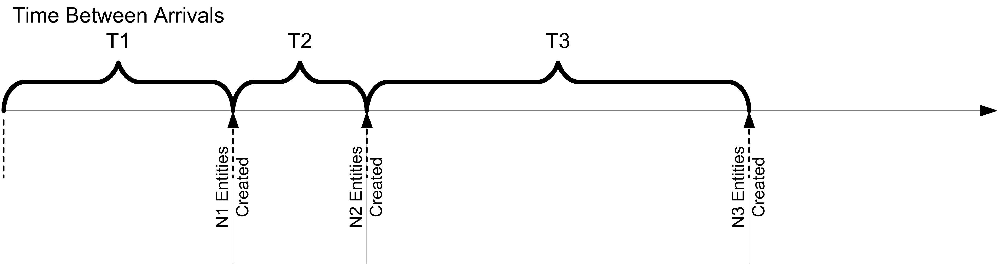
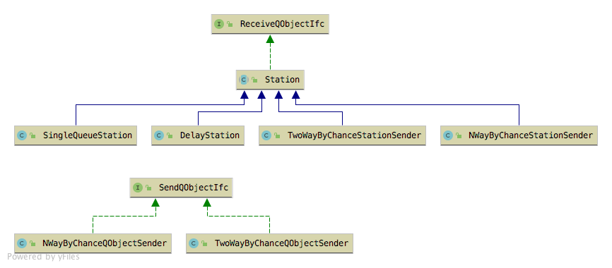
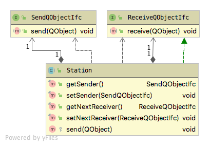
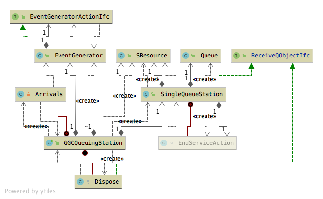
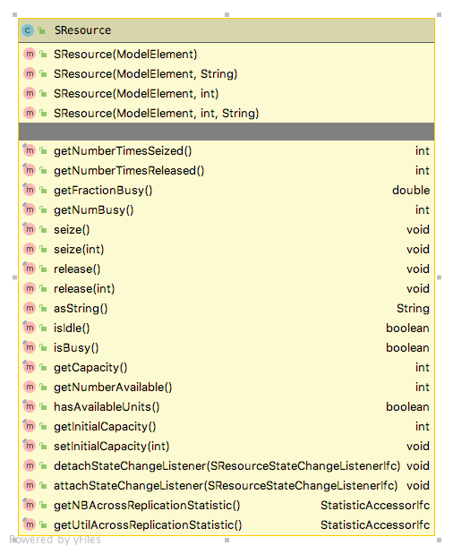
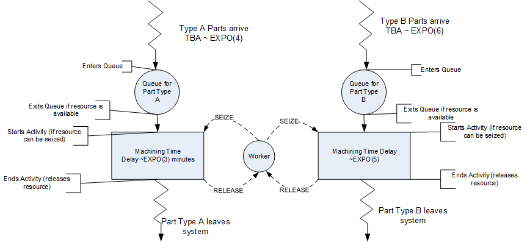

# Modeling with Queues, Resources, and Stations {#dem}

**[LEARNING OBJECTIVES]{.smallcaps}**

-   To be able to define and explain the key elements of discrete event modeling

-   To be able to model arrival processes

-   To be able to model a simple queueing station

-   To be able to model inter-connected stations

-   To be able to introductory resource concepts

In this chapter, a method for modeling the
operation of a system by describing its components is presented. In the
simplest sense, a system can be thought of as a set of objects, where an
object is an element of the system that interacts with other objects.
This chapter takes an object-oriented view of the system by representing
the dynamic behavior of the system via objects that react to discrete-events. 

## Terminology of Simulation Modeling

When developing a simulation model using the event-view, there are a number
of terms and concepts that are often used. Before learning some of these
concepts in more detail, it is important that you begin with an
understanding of some of the vocabulary used within simulation. The
following terms will be used throughout the text:

System

:   A set of inter-related components that act together over time to
    achieve common objectives.

Parameters

:   Quantities that are properties of the system that do not change.
    These are typically quantities (variables) that are part of the
    environment that the modeler feels cannot be controlled or changed.
    Parameters are typically model inputs in the form of variables.

Variables

:   Quantities that are properties of the system (as a whole) that
    change or are determined by the relationships between the components
    of the system as it evolves through time.

System State

:   A "snap shot\" of the system at a particular point in time
    characterized by the values of the variables that are necessary for
    determining the future evolution of the system from the present
    time. The minimum set of variables that are necessary to describe
    the future evolution of the system is called the system's state
    variables.

Entity

:   An object of interest in the system whose movement or operation
    within the system may cause the occurrence of events.

Attribute

:   A property or variable that is associated with an entity.

Event

:   An instantaneous occurrence or action that changes the state of the
    system at a particular point in time.

Activity

:   An interval of time bounded by two events (start event and end
    event).

Resource

:   A limited quantity of items that are used (e.g. seized and released)
    by entities as they proceed through the system. A resource has a
    capacity that governs the total quantity of items that may be
    available. All the items in the resource are homogeneous, meaning
    that they are indistinguishable. If an entity attempts to seize a
    resource that does not have any units available it must wait in a
    queue.

Queue

:   A location that holds entities when their movement is constrained
    within the system.

Future Event List

:   A list that contains the time ordered sequence of events for the
    simulation.

When developing models, it will be useful to identify the elements of
the system that fit some of these definitions. An excellent place to
develop an understanding of these concepts is with entities because
entities represent things that flow through and are processed by the
system.

## Entities and Attributes {#dementities}

When modeling a system, there are often many types of entities. For
example, consider a retail store. Besides customers, the products might
also be considered as entities. The products are received by the store
and wait on the shelves until customers select them for purchase.
Entities may come in groups and then are processed individually or they
might start out as individual units that are formed into groups. For
example, a truck arriving to the store may be an entity that consists of
many pallets that contain products. The customers select the products
from the shelves and during the check out process the products are
placed in bags. The customers then carry their bags to their cars.
Entities are uniquely identifiable within the system. If there are two
customers in the store, they can be distinguished by the *values* of
their attributes. For example, considering a product as an entity, it
may have attributes *serial number*, *weight*, *category*, and *price*.
The set of attributes for a type of entity is called its *attribute
set*. While all products might have these attributes, they do not
necessarily have the same values for each attribute. For example,
consider the following two products:

-   (serial number = 12345, weight = 8 ounces, category = green beans,
    price = \$0.87)

-   (serial number = 98765, weight = 8 ounces, category = corn, price =
    \$1.12)

The products carry or retain these attributes and their values as they
move through the system. In other words, attributes are attached to or
associated with entities. The values of the attributes might change
during the operation of the system. For example, a mark down on the
price of green beans might occur after some period of time. Attributes
can be thought of as variables that are attached to entities.

Not all information in a system is local to the entities. For example,
the number of customers in the store, the number of carts, and the
number of check out lanes are all characteristics of the system. These
types of data are called *system attributes*. In simulation models, that
take on an object-oriented nature, this information can be modeled
within a class that represents the system as a whole. By making these
quantities visible at the system level, the information can be shared
between the different components of the system.

Figure \@ref(fig:SystemVariables) illustrates the difference between
global (system) variables and entities with their attributes in the
context of a warehouse. In the figure, the trucks are entities with
attributes: arrival time, type of product, amount of product, and load
tracking number. Notice that both of the trucks have these attributes,
but each truck has different *values* for their attributes. The figure
also illustrates examples of system-wide variables, such as, number of
trucks loading, number of trucks unloading, number of busy forklifts,
etc. This type of information belongs to the whole system.

<div class="figure">

<p class="caption">(\#fig:SystemVariables)Variables and Attributes within a System</p>
</div>

Once a basic understanding of the system is accomplished through by
conceptualizing system variables, the entities, and their attributes and
various system components, you must start to understand the events that
may occur within the system. In order for entities to flow through the
system, there needs to be mechanisms for causing events to occur that
represent the arrival of objects to the system. The following section
describes how the JSL allows for the modeling of a pattern of events.

## Event Generators {#demeg}

A basic mechanism by which the occurrence of a patterned sequence of
events is modeled is through the EventGenerator class. The
EventGenerator class defines a repeating pattern for a sequence of
events. The time between arrivals specifies an ordered sequence of
events in time at which events are created and introduced to the model.
At each event, the modeler can define the actions (state changes) that
need to occur. The first event is governed by the specification of the
time until the first event, which may be stochastic. The maximum number
of events to occur in the sequence can be specified.

Figure \@ref(fig:ch5EXArrival) illustrates a compound arrival process
where the time of the first arrival is given by T1, the time of the
second arrival is given by T1 + T2, and the time of the third arrival is
given by T1 + T2 + T3. In the figure, the number of arriving entities at
each arriving event is given by N1, N2, and N3 respectively. The modeler
can easily specify this type of arrival process using the EventGenerator
class.

<div class="figure">

<p class="caption">(\#fig:ch5EXArrival)Example Arrival Process</p>
</div>

For example, to specify a Poisson arrival process with mean rate
$\lambda$, an EventGenerator can be used. Why does this specify a
Poisson arrival process? Because the time between arrivals for a Poisson
process with rate $\lambda$ is exponentially distributed with the mean
of the exponential distribution being $1/\lambda$. The the
EventGenerator needs to have its time between arrival distribution
specified as an exponential distribution with mean equal to $1/\lambda$.
To specify a compound arrival process, use a random variable to
represent the number of occurrences per event. For example, suppose you
have a compound Poisson process[^1] where the distribution for the
number created at each arrival is governed by a discrete distribution.

$$
P(X = x) =
   \begin{cases}
     0.2 & \quad \text{x = 1}\\
     0.3 & \quad \text{x = 2}\\
     0.5 & \quad \text{x = 3}
   \end{cases}
$$

The following code illustrates how to use an
`EventGenerator` for this compound Poisson process with the number of
arrivals specified with a discrete empirical random variable. Let's go
through this example before exploring the details of the `EventGenerator`
class. In line 3 the `EventGenerator` is declared and in line 17 the
instance of the `EventGenerator` is created. Notice how the random
variable representing the time between arrivals is provided to
the `EventGenerator` constructor. The `EventGenerator` class uses classes
that implement the `EventGeneratorActionIfc` interface. This interface
defines a single method, called `generate()`, which is called to supply
logic when the generated event occurs. An inner class
called `Arrivals` implements the `EventGeneratorActionIfc` interface.
Notice how a counter is used to count the number of events and a
different counter is used to count the number of arrivals based on the
random variable representing the number of occurrences governed by the
discrete empirical distribution function.

```java
public class EventGeneratorCPP extends SchedulingElement {

    protected EventGenerator myArrivalGenerator;
    protected Counter myEventCounter;
    protected Counter myArrivalCounter;
    protected RandomVariable myTBA;
    protected RandomVariable myNumArrivals;

    public EventGeneratorCPP(ModelElement parent) {
        this(parent, 1.0, null);
    }

    public EventGeneratorCPP(ModelElement parent, double tba, String name) {
        super(parent, name);
        double[] values = {1, 2, 3};
        double[] cdf = {0.2, 0.5, 1.0};
        myNumArrivals = new RandomVariable(this, new DEmpiricalRV(values, cdf));
        myTBA = new RandomVariable(this, new ExponentialRV(tba));
        myEventCounter = new Counter(this, "Counts Events");
        myArrivalCounter = new Counter(this, "Counts Arrivals");
        myArrivalGenerator = new EventGenerator(this, new Arrivals(), myTBA, myTBA);
    }

    protected class Arrivals implements EventGeneratorActionIfc {
        @Override
        public void generate(EventGenerator generator, JSLEvent event) {
            myEventCounter.increment();
            int n = (int)myNumArrivals.getValue();
            myArrivalCounter.increment(n);
        }
    }
}
```
The `EventGenerator` class allows for the periodic generation of events
similar to that achieved by "Create" modules in other simulation languages.
This class works in conjunction with the `EventGeneratorActionIfc`
interface, which is used to listen and react to the events that are
generated by this class. Users of the class can supply an instance of an
`EventGeneratorActionIfc` to provide the actions that take place when
the event occurs. Alternatively, if no `EventGeneratorActionIfc` is
supplied, by default the `generator(JSLEvent event)` method of this class
will be called when the event occurs. Thus, sub-classes can simply
override this method to provide behavior for when the event occurs. If
no instance of an `EventGeneratorActionIfc` instance is supplied and the
`generate()` method is not overridden, then the events will still occur;
however, no meaningful actions will take place. The key input parameters
to the `EventGenerator` include:

time until the first event

:   This parameter is specified with an object that implements the
    `RandomIfc.` It should be used to represent a positive real value that
    represents the time after time 0.0 for the first event to occur. If
    this parameter is not supplied, then the first event occurs at time
    0.0.

time between events

:   This parameter is specified with an object that implements the
    `RandomIfc.` It should be used to represent a positive real value that
    represents the time between events. If this parameter is not
    supplied, then the time between events is positive infinity.

time until last event

:   This parameter is specified with an object that implements the
    `RandomIfc.` It should be used to represent a positive real value that
    represents the time that the generator should stop generating. When
    the generator is created, this variable is used to set the ending
    time of the generator. Each time an event is to be scheduled the
    ending time is checked. If the time of the next event is past this
    time, then the generator is turned off and the event will not be
    scheduled. The default is positive infinity.

maximum number of events

:   A value of type long that supplies the maximum number of events to
    generate. Each time an event is to be scheduled, the maximum number
    of events is checked. If the maximum has been reached, then the
    generator is turned off. The default is Long.MAX\_VALUE. This
    parameter cannot be Long.MAX\_VALUE when the time until next always
    returns a value of 0.0.

listener

:   This parameter can be used to supply an instance of
    EventGeneratorListenerIfc interface to supply logic to occur when
    the event occurs.

The most common use case for an `EventGenerator` is very similar to the
compound Poisson process example. The `EventGenerator` is setup to run
with a time between events until the simulation completes; however,
there are a number of other possibilities that are facilitated through
various method associated with the `EventGenerator` class. The first
possibility is to sub-class the `EventGenerator` to make a custom
generator for objects of a specific class. To facilitate this the user
need only implement the generate() method that is part of the
`EventGenerator` class. For example, you could design classes to create
customers, parts, trucks, demands, etc.

In addition to customization through sub-classes, there are a number of
useful methods that are available for controlling the `EventGenerator.`

`turnOffGenerator()`

:   This method allows an EventGenerator to be turned off. The next
    scheduled generation event will not occur. This method will cancel a
    previously scheduled generation event if one exists. No future
    events will be scheduled after turning off the generator. Once the
    generator has been turned off, it cannot be restarted until the next
    replication.

`turnOnGenerator(GetValueIfc t)`

:   If the generator was not started upon initialization at the
    beginning of a replication, then this method can be used to start
    the generator. The generator will be started $t$ time units after
    the call. If this method is used when the generator is already
    started it does nothing. If this method is used after the generator
    is done it does nothing. If this method is used after the generator
    has been suspended it does nothing. In other words, if the generator
    is already on, this method does nothing.

`suspend()`

:   This method suspends the event generation pattern. The generator is
    still on, but the generation of events is suspended. The next
    scheduled generation event is canceled.

`resume()`

:   If the generator is suspended then this method causes the event
    generator to proceed with the event generation pattern by scheduling
    a new event according to the time between event distribution.

`isSuspended()`

:   Checks if the generator is suspended.

`isGeneratorDone()`

:   Checks if the generator has been turned off. The generator can be
    turned off via the turnOffGenerator() method or it may turn off when
    it has reached its time until last event or if the maximum number of
    events is reached. As previously noted, once a generator has been
    turned off, it cannot be turned on again within the same
    replication.

In considering these methods, a generator can turn itself off (as an
action) within or caused by the code within its generate() method or in
the supplied `EventGeneratorListenerIfc` interface. It might also
`suspend()` itself in a similar manner. Of course, a class that has a
reference to the generator may also turn it off or suspend it. To resume
a suspended event generator, it is necessary to schedule an event whose
action invokes the `resume() `method. Obviously, this can be within a
sub-class of `EventGenerator` or within another class that has a reference
to the event generator.

## The Station Package {#demstation}

This section describes a JSL package that facilitates the modeling of
system components that can send or receive entities. Many systems have
as a basic component a location where something happens or where
processing can occur. A station represents this concept. The goal of
this package is to illustrate the development and use of common
components that help with the modeling of simple queueing system
modeling. First, an overview of the package will be presented and then
the operation of important classes discussed. Then, a number of examples
will illustrate how to utilize the classes.

<div class="figure">

<p class="caption">(\#fig:StationPkg)Major Classes within Station Package</p>
</div>

Figure \@ref(fig:StationPkg) illustrates the primary classes and
interfaces within the station package. There are two key interfaces:
`SendQObjectIfc` and `ReceiveQObjectIfc`. 

```java
public interface SendQObjectIfc {
    
    void send(QObject qObj);
}

public interface ReceiveQObjectIfc {

    void receive(QObject qObj);
}
```

The interfaces define single methods, `send(QObject qObj)` and `receive(QObject qObj)`, which permit
implementors to promise the capability of receiving and sending objects
of type `QObject`. Figure \@ref(fig:Station) illustrates the connection between the Station class and `SendQObjectIfc` and `ReceiveQObjectIfc`. This design permits the development of model elements that
know how to send instances of `QObject` and how to receive instances of
`QObject`. A `Station` is an abstract base class that implements the
`ReceiveQObjectIfc` interface. Sub-classes of `Station` will have a
`receive()` method that can be called to tell the station that an instance
of a `QObject` should be received.

<div class="figure">

<p class="caption">(\#fig:Station)The Station Class</p>
</div>

The following listing shows the implementation of the `Station`
class. The `Station` class may have a reference to an object that
implements the `SendQObjectIfc` interface and may have an object that implements
the `ReceiveQObjectIfc` interface. An object that implements the
`SendQObjectIfc` interface can be supplied to define behavior for sending
a received instance of a `QObject` onwards within the system. If the
`SendQObjectIfc` interface attribute is not supplied, then the
`ReceiveQObjectIfc` object is used to indicate the next location for
receipt. The protected method, s`end(QObject qObj)`,
indicates this logic. The UML diagram for the `Station` class is provided
in Figure \@ref(fig:Station). Notice that `Station` implements the
`ReceiveQObjectIfc` interface, may have a reference to a `ReceiveQObjectIfc`
instance, and has a reference to an instance of a `SendQObjectIfc`
interface.

If the client does not supplier either an object that implements the `ReceiveQObjectIfc` interface or an object that implements the `SendQObjectIfc` interface, then an exception will be thrown.  The object that implements the `ReceiveQObjectIfc` interface is meant to be a direct connection (i.e. something that can directly receive instances of `QObject`).  Sometimes, the logic to determine where to send the `QObject` is complex. In which case, the user can either sub-class the `Station` class or provide a instance of a class that implements the `SendQObjectIfc` interface.  This allows the sending logic to be delegated to another class rather than forcing the user to sub-class the `Station` class.  This flexibility can be confusing to users of the class.

```java
public abstract class Station extends SchedulingElement implements ReceiveQObjectIfc {

    /**
     * Can be supplied in order to provide logic
     *  to send the QObject to its next receiver
     */
    private SendQObjectIfc mySender;

    /** Can be used to directly tell the receiver to receive the departing
     *  QObject
     * 
     */
    private ReceiveQObjectIfc myNextReceiver;

    /**
     *
     * @param parent the parent model element
     */
    public Station(ModelElement parent) {
        this(parent, null, null);
    }

    /**
     *
     * @param parent the parent model element
     * @param name a unique name
     */
    public Station(ModelElement parent, String name) {
        this(parent, null, name);
    }

    /**
     * 
     * @param parent the parent model element
     * @param sender can be null, represents something that can send QObjects
     * @param name a unique name
     */
    public Station(ModelElement parent, SendQObjectIfc sender, String name) {
        super(parent, name);
        setSender(sender);
    }

    /**
     * A Station may or may not have a helper object that implements the 
     *  SendQObjectIfc interface.  If this helper object is supplied it will
     *  be used to send the processed QObject to its next location for
     *  processing.
     * @return the thing that will be used to send the completed QObject
     */
    public final SendQObjectIfc getSender() {
        return mySender;
    }

    /**
     * A Station may or may not have a helper object that implements the 
     *  SendQObjectIfc interface.  If this helper object is supplied it will
     *  be used to send the processed QObject to its next location for
     *  processing.
     * @param sender the thing that will be used to send the completed QObject
     */
    public final void setSender(SendQObjectIfc sender) {
        mySender = sender;
    }

    /**
     *  A Station may or may not have a helper object that implements the 
     *  ReceiveQObjectIfc interface.  If this helper object is supplied and
     *  the SendQObjectIfc helper is not supplied, then the object that implements
     *  the ReceiveQObjectIfc will be the next receiver for the QObject when using 
     *  default send() method.
     * @return the thing that should receive the completed QObject, may be null
     */
    public final ReceiveQObjectIfc getNextReceiver() {
        return myNextReceiver;
    }

    /**
     *  A Station may or may not have a helper object that implements the 
     *  ReceiveQObjectIfc interface.  If this helper object is supplied and
     *  the SendQObjectIfc helper is not supplied, then the object that implements
     *  the ReceiveQObjectIfc will be the next receiver for the QObject when using 
     *  default send() method.
     * @param receiver the thing that should receive the completed QObject, may be null
     */
    public final void setNextReceiver(ReceiveQObjectIfc receiver) {
        myNextReceiver = receiver;
    }

    /**
     *  A Station may or may not have a helper object that implements the 
     *  SendQObjectIfc interface.  If this helper object is supplied it will
     *  be used to send the processed QObject to its next location for
     *  processing.
     * 
     *  A Station may or may not have a helper object that implements the 
     *  ReceiveQObjectIfc interface.  If this helper object is supplied and
     *  the SendQObjectIfc helper is not supplied, then the object that implements
     *  the ReceiveQObjectIfc will be the next receiver for the QObject
     * 
     *  If neither helper object is supplied then a runtime exception will
     *  occur when trying to use the send() method     
     * @param qObj the completed QObject
     */
    protected void send(QObject qObj) {
        if (getSender() != null) {
            getSender().send(qObj);
        } else if (getNextReceiver() != null) {
            getNextReceiver().receive(qObj);
        } else {
            throw new RuntimeException("No valid sender or receiver");
        }
    }

}
```

### Modeling Simple Queueing Stations

In this section, the station package is used to implement a simple
queueing station. Recall the pharmacy model. In that model, we had a Poisson arrival
process with customers arriving to a drive through pharmacy window. The
service time associated with the pharmacy was exponentially distributed
and their was one pharmacist. That situation was labeled as a M/M/1
queue. In this example, we generalize the queueing station to a G/G/c
queue. That is, any general (G) arrival process, any general (G) service
process, and (c) servers. We will model the arrival process using an
`EventGenerator` and model the queueing with a `Queue` class. In addition,
we will generalize the concept of the servers by encapsulating them in a
class called `SResource` (for simple resource). Finally, the `Queue` and the
`SResource` classes will be combined into one class that sub-classes
`Station`, called `SingleQueueStation`. This is illustrated in
Figure \@ref(fig:GGCQueuingStation).

<div class="figure">

<p class="caption">(\#fig:GGCQueuingStation)GGC Queueing Station Classes</p>
</div>

In the figure, the `GGCQueueingStation` class uses inner classes for
handling the arrivals and for disposing customers that have completed
service. In addition, `GGCQueueingStation` uses an instance of
`SingleQueueStation` to process the customers after arrival.

Let's first examine the organization of the `GGCQueueingStation` class and
how it works with the `Station` package. Then, we will present how the
`SingleQueueStation` class was implemented. As shown in
Figure \@ref(fig:GGCQueuingStation)
the `GGCQueueingStation` class uses an instance of `EventGenerator.` The
event generator's action is called `Arrivals`, which is implemented as
an inner class of `GGCQueueingStation.` Secondly, `GGCQueueingStation` uses
an instance of the class `Dispose`, which implements the `ReceiveQObjectIfc`
interface. This instance is used as the receiver after processing by the
`SingleQueueStation` class. The class collects some system level
statistics.

The following code listing shows the code for the GGCQueueingStation
class. The constructor takes in instances of RandomIfc interfaces to
represent the arrival and service processes. The arrival generator and
statistical collection model elements are created within the constructor.
The third line of the constructor creates the resource that is used by the arriving customers.
The fifth line of the constructor creates an instance of a `SingleQueueStation` to handle the
customers. Notice that the next line defines the next receiver for the station
to be an instance of the class `Dispose`. When the `SingleQueueStation` is
done, the `send()` method is called (as previously described) and since a
receiver has been attached, the station uses this receiver to receive
the `QObject` that was completed. In this case, the `QObject` has statistics
collected as it leaves the system. The only other code
to note is how the EventGenerator's action is used to send the `QObject`
to the `SingleQueueStation`. Within the `Arrivals` class, the `receive()` method of the `SingleQueueStation` instance is called with the created `QObject`.  In essence, the
`GGCQueueingStation` class simply defines and hooks up the various
components needed to model the situation. The `RecieveQObjectIfc` and the
`Station` concept play an integral role in facilitating how the object
instances are connected.

```java
public class GGCQueuingStation extends ModelElement {

    private final EventGenerator myArrivalGenerator;
    private final SingleQueueStation mySQS;
    private ResponseVariable mySystemTime;
    private TimeWeighted myNumInSystem;
    private final SResource myServers;
    private final RandomVariable mySTRV;

    public GGCQueuingStation(ModelElement parent, RandomIfc tba, RandomIfc st,
            int numServers) {
        this(parent, tba, st, numServers, null);
    }

    public GGCQueuingStation(ModelElement parent, RandomIfc tba, RandomIfc st,
                             int numServers, String name) {
        super(parent, name);
        myArrivalGenerator = new EventGenerator(this, new Arrivals(), tba, tba);
        myServers = new SResource(this, numServers, "Servers");
        mySTRV = new RandomVariable(this, st);
        mySQS = new SingleQueueStation(this, myServers, mySTRV, "Station");
        mySQS.setNextReceiver(new Dispose());
        mySystemTime = new ResponseVariable(this, "System Time");
        myNumInSystem = new TimeWeighted(this, "Num in System");
    }

    private class Arrivals implements EventGeneratorActionIfc {

        @Override
        public void generate(EventGenerator generator, JSLEvent event) {
            myNumInSystem.increment();
            mySQS.receive(new QObject(getTime()));
        }

    }

    protected class Dispose implements ReceiveQObjectIfc {

        @Override
        public void receive(QObject qObj) {
            // collect final statistics
            myNumInSystem.decrement();
            mySystemTime.setValue(getTime() - qObj.getCreateTime());
        }

    }
```

The last piece of this puzzle is how the `SingleQueueStation` class
implements the abstract base class `Station` and becomes a component that
can be reused in various models. Recall the logic for handling arrivals
and service completions from the pharmacy example. In that code, there was the need to have
the customer enter the queue and then check if the pharmacist was
available. If the pharmacist was available, then the customer was
removed from the queue and the end of service scheduled. In addition,
when the service is completed, if the queue is not empty, then the next
customer is started into service. The `SingleQueueStation` generalizes this
same logic by using an instance of `SResource` to represent the servers.

The following code listing illustrates the critical code for the
`SingleQueueStation` class. The `receive()` method (which must be
implemented by a sub-class of `Station`), shows the `QObject` being placed
in the queue. Then, the resource is checked to
see if it is available and then the next customer is served via the call
to `serveNext()`. Upon the end of service the `EndServiceAction` is called.
Notice that the resource is released, and then the queue is
checked. Finally, the `send()` method is used to send the
`QObject` to whereever it is intended to go. 

```java
    protected double getServiceTime(QObject customer) {
        double t;
        if (getUseQObjectServiceTimeOption()) {
            Optional<GetValueIfc> valueObject = customer.getValueObject();
            if (valueObject.isPresent()){
                t = valueObject.get().getValue();
            } else {
                throw new IllegalStateException("Attempted to use QObject.getValueObject() when no object was set");
            }
        } else {
            t = getServiceTime().getValue();
        }
        return t;
    }

    /**
     * Called to determine which waiting QObject will be served next Determines
     * the next customer, seizes the resource, and schedules the end of the
     * service.
     */
    protected void serveNext() {
        QObject customer = myWaitingQ.removeNext(); //remove the next customer
        myResource.seize();
        // schedule end of service
        scheduleEvent(myEndServiceAction, getServiceTime(customer), customer);
    }

    @Override
    public void receive(QObject customer) {
        myNS.increment(); // new customer arrived
        myWaitingQ.enqueue(customer); // enqueue the newly arriving customer
        if (isResourceAvailable()) { // server available
            serveNext();
        }
    }

    class EndServiceAction implements EventActionIfc<QObject> {

        @Override
        public void action(JSLEvent<QObject> event) {
            QObject leavingCustomer = event.getMessage();
            myNS.decrement(); // customer departed
            myResource.release();
            if (isQueueNotEmpty()) { // queue is not empty
                serveNext();
            }
            send(leavingCustomer);
        }
    }

```

This is the same `send()` method that was previously discussed. Thus, because the receiver was set to be
the instance of `Dispose`, the departing customer will be sent to the
`GGCQueueingStation` where the statistics will be collected, as previously
noted.

Figure \@ref(fig:SResource) shows the `SResource` class. The `SResource`
class models a resource that has a defined capacity, which represents
the number of units of the resource that can be in use. The capacity of
the resource represents the maximum number of units available for use.
For example, if the resource has capacity 3, it may have 2 units busy
and 1 unit idle. A resource cannot have more units busy than the
capacity. A resource is considered busy when it has 1 or more units
busy. A resource is considered idle when all available units are idle.
Units of the resource can be seized via the `seize()` methods and released
via the `release()` methods. It is an error to attempt to seize more units
than are currently available. In addition, it is an error to try to
`release()` more units than are currently in use (busy). Statistics on
resource utilization and number of busy units is automatically
collected.

<div class="figure">

<p class="caption">(\#fig:SResource)The SResource Class</p>
</div>

The following listing illustrates how to build and run an
instance of a GGCQueuingStation by simulating a M/M/2 queue. 

```java
    public static void main(String[] args) {
        Simulation sim = new Simulation("M/M/2");
        // get the model
        Model m = sim.getModel();
        // add system to the main model
        ExponentialRV tba = new ExponentialRV(1);
        ExponentialRV st = new ExponentialRV(.8);
        int ns = 2;
        GGCQueuingStation system = new GGCQueuingStation(m, tba, st, ns);
        // set the parameters of the experiment
        sim.setNumberOfReplications(30);
        sim.setLengthOfReplication(20000.0);
        sim.setLengthOfWarmUp(5000.0);
        SimulationReporter r = sim.makeSimulationReporter();
        System.out.println("Simulation started.");
        sim.run();
        System.out.println("Simulation completed.");
        r.printAcrossReplicationSummaryStatistics();
    }
```

This is the same as any JSL run. In this case, the `GGCQueueingStation` class used a
`SingleQueueStation` to do, essentially, all of the work. Now, imagine
many queueing stations organized into a system. Because the
`SingleQueueStation` is built as a component that can be reused, it is
available for more complicated modeling.

The following code illustrates how easy it is to model a
tandem queue using the `SingleQueueStation` class. A tandem queue is a
sequence of two queueing stations in series, where the customers
departing the first staiton go on for further processing at the second
station. The constructor shows the creation of two
stations, where the receiver of the first station is set to the second
station (line 9). The receiver for the second station is set to an
instance of a class that implements the `ReceiveQObjectIfc` interface and
collects the total time in the system and the number of customers in the
system. This should begin to indicate how complex networks of queueing
stations can be formed and simulated.

```java
    public TandemQueue(ModelElement parent, String name) {
        super(parent, name);
        myTBA = new RandomVariable(this, new ExponentialRV(1.0/1.1));
        myST1 = new RandomVariable(this, new ExponentialRV(0.8));
        myST2 = new RandomVariable(this, new ExponentialRV(0.7));
        myArrivalGenerator = new EventGenerator(this, new Arrivals(), myTBA, myTBA);
        myStation1 = new SingleQueueStation(this, myST1, "Station1");
        myStation2 = new SingleQueueStation(this, myST2, "Station2");
        myStation1.setNextReceiver(myStation2);
        myStation2.setNextReceiver(new Dispose());
        mySysTime = new ResponseVariable(this, "System Time");
        myNumInSystem = new TimeWeighted(this, "NumInSystem");
    }

    protected class Arrivals implements EventGeneratorActionIfc {

        @Override
        public void generate(EventGenerator generator, JSLEvent event) {
            myNumInSystem.increment();
            myStation1.receive(new QObject(getTime()));
        }

    }

    protected class Dispose implements ReceiveQObjectIfc {

        @Override
        public void receive(QObject qObj) {
           // collect system time
            mySysTime.setValue(getTime() - qObj.getCreateTime());
            myNumInSystem.decrement();
        }
        
    }
```

## Sharing a Resource {#demsharedResources}

In the previous queueing situations, at each station there was one
resource that was used during the service operation. It is often the
case that a resource can be shared across multiple activities. For
example, suppose a worker is assigned to attend two machining processes.
The resource is said to be shared.

Figure \@ref(fig:SharedResource) illustrates this notion of sharing a
resource between two activities. Notice that in the figure, there are
two queues, one each for the two different types of parts. If there had
been only a single queue to hold both parts, the modeling is very
similar to the single queue station modeling that has already been
presented. With only one queue, we would need to use a queue discipline
to order the parts in the queue and to schedule the end of service
according to the appropriate service time distribution for the given
part. In the case of two queues, we need to determine how the resource
will select the queue in addition to the queue discipline. For the sake
of simplicity, let us assume that the queue discipline is first in first
out (FIFO). Then, in the case of two queues, we need a mechanism or rule
to determine which queue will be processed first, when the resource
becomes available.

<div class="figure">

<p class="caption">(\#fig:SharedResource)A Resource Shared Between Two Activities</p>
</div>

How many events are there for the situation in Figure \@ref(fig:SharedResource)? From the strict definition of an event, there are six events in this situation. There are the two arrival
events for each type of part. There are two different begin service
events and two different end service events. From an implementation
perspective, we could model this situation with only two events. We can
have a single event that handles both types of arrivals and a single end
service event that handles the departure of either type of part. The
reason we only need one end service event is because the begin service
event logic can be incorporated in the end of service event because whenever a
service completes a waiting part will start into service. How many
events should you use in your modeling? You should implement the events
in a way that facilitates your perspective and your modeling. The
trade-off is that when the event logic is consolidated, the logic may be
more complicated.

The following listing presents the constructor for the shared queue
example. Notice that two instances of the `Queue` and `EventGenerator`
classes are used. The two event generators are used to implement the
arrival processes for the two types of parts. The two queues are used to
hold the two types of parts. An instance of `SResource` is used to
represent the workers that are shared between the two activities. The
activity times are represented by two `RandomVariable` instances. A
`TimeWeighted` instance and a `ResponseVariable` instance are used to
collect statistics on the number of parts in the system and the time
spent in the system, respectively.

```java
public class SharedResource extends SchedulingElement {

    private final EventGenerator myTypeAGenerator;
    private final EventGenerator myTypeBGenerator;
    private final TimeWeighted myNumInSystem;
    private final ResponseVariable mySystemTime;
    private final SResource myServers;
    private final Queue<QObject> myTypeAWaitingQ;
    private final Queue<QObject> myTypeBWaitingQ;
    private final EndServiceEventAction myEndServiceEventAction;
    private final RandomVariable myServiceRVTypeA;
    private final RandomVariable myServiceRVTypeB;
    
    public SharedResource(ModelElement parent, int numServers, RVariableIfc tbaA,
                          RVariableIfc tbaB, RVariableIfc stA, RVariableIfc stB, String name) {
        super(parent, name);
        myTypeAGenerator = new EventGenerator(this, new TypeAArrivals(), tbaA, tbaA);
        myTypeBGenerator = new EventGenerator(this, new TypeBArrivals(), tbaB, tbaB);
        myServiceRVTypeA = new RandomVariable(this, stA, "Service RV A");
        myServiceRVTypeB = new RandomVariable(this, stB, "Service RV B");
        myServers = new SResource(this, numServers, "Servers");
        myTypeAWaitingQ = new Queue<>(this, getName() + "_QA");
        myTypeBWaitingQ = new Queue<>(this, getName() + "_QB");
        mySystemTime = new ResponseVariable(this, "System Time");
        myNumInSystem = new TimeWeighted(this, "Num in System");
        myEndServiceEventAction = new EndServiceEventAction();
    }
```

The following listing presents the arrivals of the parts via the
generator listeners and the beginning of service. In line 5, the number
of parts is incremented. Then, in line 6, the arriving part is
represented with a new `QObject`, which is immediately enqueued. The if
statement starting at line 7, checks if the resource has available units
and if so, begins serving the next part. In the `serveNext()` method, the
two queues are checked. Notice that the queue for type A parts is
checked first. If the queue is not empty, then the part is removed and
started into service using the service time distribution for type A
parts. If there are no type A parts, the queue for type B parts is
checked in a similar fashion. Because the type A queue is checked first,
it will have priority over the type B part queue.

```java
    private class TypeAArrivals implements EventGeneratorActionIfc {

        @Override
        public void generate(EventGenerator generator, JSLEvent event) {
            myNumInSystem.increment();
            myTypeAWaitingQ.enqueue(new QObject(getTime()));
            if (myServers.hasAvailableUnits()) { // server available
                serveNext();
            }
        }

    }

    private class TypeBArrivals implements EventGeneratorActionIfc {

        @Override
        public void generate(EventGenerator generator, JSLEvent event) {
            myNumInSystem.increment();
            myTypeBWaitingQ.enqueue(new QObject(getTime()));
            if (myServers.hasAvailableUnits()) { // server available
                serveNext();
            }
        }

    }

    private void serveNext() {
        //logic to choose next from queues
        // if both have waiting parts, assume part type A has priority
        if (myTypeAWaitingQ.isNotEmpty()) {
            QObject partA = myTypeAWaitingQ.removeNext(); //remove the next customer
            myServers.seize();
            // schedule end of service
            scheduleEvent(myEndServiceEventAction, myServiceRVTypeA, partA);
        } else if (myTypeBWaitingQ.isNotEmpty()) {
            QObject partB = myTypeBWaitingQ.removeNext(); //remove the next customer
            myServers.seize();
            // schedule end of service
            scheduleEvent(myEndServiceEventAction, myServiceRVTypeB, partB);
        }
    }
```

The following code listing presents the end of service event logic for the
shared resource example. The end of service logic is very similar to
logic that we have seen for the departure from a queueing station. In
the end of service action, the part that is leaving is passed to the
outer class for statistical collection in the `departingSystem()` method.
The resource is released and the queues are checked to see if a part is
waiting. Note that both queues are checked, such that if either queue
has a waiting part, the logic for serving the next part is invoked.

```java
    private boolean checkQueues() {
        return (myTypeAWaitingQ.isNotEmpty() || myTypeBWaitingQ.isNotEmpty());
    }

    private class EndServiceEventAction implements EventActionIfc<QObject> {

        @Override
        public void action(JSLEvent<QObject> event) {
            QObject leavingPart = event.getMessage();
            myServers.release();
            if (checkQueues()) { // queue is not empty
                serveNext();
            }
            departSystem(leavingPart);
        }
    }

    private void departSystem(QObject leavingPart) {
        mySystemTime.setValue(getTime() - leavingPart.getCreateTime());
        myNumInSystem.decrement(); // part left system      
    }
```

Finally, the following code shows how to setup and run the example. The system is configured with the time between arrivals for type A parts and type B parts having exponential distributions with
means of 4 and 6 time units, respectively. The service time
distributions are also exponential with means of 3 and 5, respectively
for type A and B parts. The capacity of the resource is set at 2
workers. 

```java
    public static void main(String[] args) {
        Simulation sim = new Simulation("Shared Resource Example");
        // get the model
        Model m = sim.getModel();
        // add to the main model
        RVariableIfc tbaA = new ExponentialRV(4.0);
        RVariableIfc tbaB = new ExponentialRV(6.0);
        RVariableIfc stA = new ExponentialRV(3.0);
        RVariableIfc stB = new ExponentialRV(5.0);
        SharedResource sr = new SharedResource(m, 2, tbaA, tbaB, stA, stB, "SR");
        // set the parameters of the experiment
        sim.setNumberOfReplications(30);
        sim.setLengthOfReplication(20000.0);
        sim.setLengthOfWarmUp(5000.0);
        SimulationReporter r = sim.makeSimulationReporter();
        System.out.println("Simulation started.");
        sim.run();
        System.out.println("Simulation completed.");
        r.printAcrossReplicationSummaryStatistics();
    }
```

The results indicate that the type B parts wait
significantly longer on average than the type A parts. It should be
apparent that with some additional design that the shared resource
example could be generalized into a class that could be used in other
simulation models similar to how the single station queue has been
generalized. This is one of the important advantages of an
object-oriented approach to simulation modeling.

+:---------------------------------------------------------------------:+
| ``` {#fig:RSOutput basicstyle="\\footnotesize" caption="Resource Shar |
| ing Output" label="fig:RSOutput"}                                     |
| Number of Replications: 30                                            |
| Length of Warm up period: 5000.0                                      |
| Length of Replications: 20000.0                                       |
| --------------------------------------------------------------------- |
| ----                                                                  |
| Response Variables                                                    |
| --------------------------------------------------------------------- |
| ----                                                                  |
| Name                              Average       Std. Dev.       Count |
|                                                                       |
| --------------------------------------------------------------------- |
| ----                                                                  |
| Servers_Util                     0.792550        0.015226       30.00 |
| 0000                                                                  |
| Servers_#Busy Units              1.585100        0.030453       30.00 |
| 0000                                                                  |
| SR_QA : Number In Q              0.589924        0.044712       30.00 |
| 0000                                                                  |
| SR_QA : Time In Q                2.361027        0.155425       30.00 |
| 0000                                                                  |
| SR_QB : Number In Q              1.948387        0.363318       30.00 |
| 0000                                                                  |
| SR_QB : Time In Q               11.664922        2.087974       30.00 |
| 0000                                                                  |
| System Time                      9.891819        0.908085       30.00 |
| 0000                                                                  |
| Num in System                    4.123410        0.413465       30.00 |
| 0000                                                                  |
| --------------------------------------------------------------------- |
| ----                                                                  |
| ```                                                                   |
+-----------------------------------------------------------------------+

## Complex System Example {#demtiedyeShirts}

This section presents a more complex system that illustrates how to
model entities that flow through a system and how to coordinate the
flow. The example will reuse the single queue station modeling of
previous examples; however, the entities (objects that flow in the
system) require synchronization.

Suppose production orders for tie-dye T-shirts arrive to a production
facility according to a Poisson process with a mean rate of 4 per hour.
There are two basic psychedelic designs involving either red or blue
dye. For some reason the blue shirts are a little more popular than the
red shirts so that when an order arrives about 70% of the time it is for
the blue dye designs. In addition, there are two different package sizes
for the shirts, 3 and 5 units. There is a 25% chance that the order will
be for a package size of 5 and a 75% chance that the order will be for a
package size of 3. Each of the shirts must be *individually* hand made
to the customer's order design specifications. The time to produce a
shirt (of either color) is uniformly distributed within the range of 3
to 5 minutes. There is currently one worker who is setup to make either
shirt. When an order arrives to the facility, its type (red or blue) is
determined and the pack size is determined. Then, the appropriate number
of white (un-dyed) shirts are sent to the shirt makers with a note
pinned to the shirt indicating the customer order, its basic design, and
the pack size for the order. Meanwhile, the paperwork for the order is
processed by a worker and a customized packaging letter and box is
prepared to hold the order. It takes the paperwork worker between 8 to
10 minutes to make the box and print a custom thank you note. After the
packaging is made the paperwork waits prior to final inspection for the
shirts associated with the order. After the shirts are combined with the
packaging, they are inspected by a packaging worker which is distributed
according to a triangular distribution with a minimum of 5 minutes, a
most likely value of 10 minutes, and a maximum value of 15 minutes.
Finally, the boxed customer order is sent to shipping.

### Conceptualizing the Model {#demtiedyeShirts:cm}

Before proceeding you might want to jot down your answers to the
following modeling recipe questions and then compare how you are doing
with respect to what is presented in this section. The modeling recipe
questions are:

-   What is the system? What information is known by the system?

-   What are the required performance measures?

-   What are the entities? What information must be recorded or
    remembered for each entity? How are entities introduced into the
    system?

-   What are the resources that are used by the entities? Which entities
    use which resources and how?

-   What are the process flows? Sketch the process or make an activity
    flow diagram

-   Develop pseudo-code for the situation

-   Implement the model

The entities can be conceptualized as the arriving orders. Since the
shirts are processed individually, they should also be considered
entities. In addition, the type of order (red or blue) and the size of
the order (3 or 5) must be tracked. Since the type of the order and the
size of the order are properties of the order, attributes can be used to
model this information. The resources are the two shirt makers, the
paperwork worker, and the packager. The flow is described in the
scenario statement: orders arrive, shirts made, meanwhile packaging is
made. Then, orders are assembled, inspected, and finally shipped. It
should be clear that an EventGenerator, setup to generate Poisson
arrivals can create the orders, but if shirts are entities, how should
they be modeled and created? After this, there will be two types of
entities in the model, the orders (paperwork) and the shirts. The shirts
can be made and meanwhile the paperwork for the order can be processed.
When the shirts for an order are made, they need to be combined together
and associated with the order.

The activity diagram for this situation is given in Figure \@ref(fig:TieDyeTShirtACD). After the order is created, the process separates into the order making process and the shirt making
process. Notice that the orders and shirts must be synchronized together
after each of these processes.

<div class="figure">

<p class="caption">(\#fig:TieDyeTShirtACD)Activity Diagram for Tie Dye T-Shirts System</p>
</div>

### Implementing the Model {#demtiedyeShirts:im}

If it was not for the coordination between the orders
(paperwork/packaging) and the shirts in this system, the modeling would
be a straightforward application of concepts that have already been
presented. The processing of the shirts, the paperwork, and the final
packaging can all be modeled with instances of the `SingleQueueStation`
class, where the shirts go to one instance, the paperwork goes to
another instance, and the combined final order goes to the third
instance. Thus, if it was not for the fact that shirts must be combined
into an order and the order has to be combined with its paperwork before
packaging, the classes within the station package could handle this
modeling. In fact, the constructor for the implementation takes exactly
this approach as illustrated in the following code listing. 

```java
    public TieDyeTShirts(ModelElement parent, String name) {
        super(parent, name);
        myTBOrders = new RandomVariable(this, new ExponentialRV(15));
        myOrderGenerator = new EventGenerator(this, new OrderArrivals(),
                myTBOrders, myTBOrders);
        DEmpiricalRV type = new DEmpiricalRV(new double[]{1.0, 2.0}, new double[] {0.7, 1.0});
        DEmpiricalRV size = new DEmpiricalRV(new double[]{3.0, 5.0}, new double[] {0.75, 1.0});
        myOrderSize = new RandomVariable(this, size);
        myOrderType = new RandomVariable(this, type);
        myShirtMakingTime = new RandomVariable(this, new UniformRV(3, 5));
        myPaperWorkTime = new RandomVariable(this, new UniformRV(8, 10));
        myPackagingTime = new RandomVariable(this, new TriangularRV(5, 10, 15));
        myShirtMakers = new SResource(this, 1, "ShirtMakers_R");
        myPackager = new SResource(this, 1, "Packager_R");
        myShirtMakingStation = new SingleQueueStation(this, myShirtMakers,
                myShirtMakingTime, "Shirt_Station");
        myWorker = new SResource(this, 1, "PW-Worker");
        myPWStation = new SingleQueueStation(this, myWorker,
                myPaperWorkTime, "PW_Station");
        myPackagingStation = new SingleQueueStation(this, myPackager,
                myPackagingTime, "Packing_Station");
        // need to set senders/receivers
        myShirtMakingStation.setNextReceiver(new AfterShirtMaking());
        myPWStation.setNextReceiver(new AfterPaperWork());
        myPackagingStation.setNextReceiver(new Dispose());
        mySystemTime = new ResponseVariable(this, "System Time");
        myNumInSystem = new TimeWeighted(this, "Num in System");
    }
```

In the constructor, lines 3 and 4, shows the
specification for the `EventGenerator.` Then, `DEmpiricalRV` random
variables are setup to model the order size and the order type, where 1
represents blue shirts and 2 represents red shirts. Lines 10-12 show the
modeling of the shirt making time, paperwork time, and packaging time
all using instances of the `RandomVariable` class. In lines 13-15 the
workers are modeled with instances of the `SResource` class, and in
lines 16-21, the `SingleQueueStation` class is used to model the use of
the resources and the activities for shirt making, paperwork, and
packaging. All that is left is connecting the stations together, which
is accomplished in lines 23-25 by setting the receivers for the
stations. The 'magic' of modeling the order coordination happens in the
receivers and how orders are modeled.

Before exploring that implementation, we can explore how orders enter
and leave the system. The following listing presents how the orders are generated and how
the orders leave the system. 

```java
    private class OrderArrivals implements EventGeneratorActionIfc {

        @Override
        public void generate(EventGenerator generator, JSLEvent event) {
            myNumInSystem.increment();
            Order order = new Order();
            List<Order.Shirt> shirts = order.getShirts();

            for (Order.Shirt shirt : shirts) {
                myShirtMakingStation.receive(shirt);
            }
            myPWStation.receive(order.getPaperWork());

        }

    }

    protected class Dispose implements ReceiveQObjectIfc {

        @Override
        public void receive(QObject qObj) {
            // collect final statistics
            myNumInSystem.decrement();
            mySystemTime.setValue(getTime() - qObj.getCreateTime());
            Order o = (Order) qObj;
            o.dispose();
        }

    }
```

An implementation of an `EventGeneratorListenerIfc` interface called `OrderArrivals` is provided to
the `EventGenerator.` In line 5, the number of orders in the system is
incremented. Then, in line 6, a new order is made. The shirts associated
with the orders are then retrieved (line 7) and then sent to the shirt
making station (lines 9-11). Finally, line 12 retrieves the paperwork
from the order (`order.getPaperWork()`) and sends it to the paperwork
station. The implementation of the logic for orders to leave the system
is implemented in similar disposal logic as we have previously seen
(atarting at line 18). First, the number of orders is decremented and
the time that an order spent in the system collected. Then, the order is
disposed.

The modeling of the synchronization of the shirts and the paperwork
comes down to the following fact: when all the shirts are completed and
the paperwork is completed, then the order is completed and can be sent
to the packaging station. If the paperwork activity finishes before all
the shirts are completed, the order will be completed when the last
shirt is done. If all the shirts are completed before the paperwork is
completed, then the order waits until the paperwork is done. Thus, when
a shirt associated with an order is completed, we can check if the paper
work is done and if all shirts are done, the order can proceed. When the
paperwork is completed, we need to check if all shirts are done and if
so the order can proceed. Both shirt completion and paperwork completion
are events and these events are modeled within the `SingleQueueStation`
class. However, right after the events occur the `SingleQueueStation`
class uses its attached `QObjectReceiverIfc` instance. The logic for
checking for order completion can be added to the receivers. This logic
is presented in the following listing. 

```java
    protected class AfterShirtMaking implements ReceiveQObjectIfc {

        @Override
        public void receive(QObject qObj) {
            Order.Shirt shirt = (Order.Shirt) qObj;
            shirt.setDoneFlag();
        }

    }

    protected class AfterPaperWork implements ReceiveQObjectIfc {

        @Override
        public void receive(QObject qObj) {
            Order.PaperWork pw = (Order.PaperWork) qObj;
            pw.setDoneFlag();
        }

    }
```

Because of how the Order class is
implemented, this logic is not particularly interesting. As shown in the
code listing, all that occurs is to indicate the the shirt is completed
(line 6) and that the paperwork is completed (line 16). The Order class
is implemented such that it is notified whenever a shirt is completed
and when the paperwork is completed. If during this notification
process, the entire order is completed, the order will be sent to the
packaging station. This is the logic that we will explore next.

Because orders may need to wait, we are going to model them by
sub-classing from the `QObject` class. This allows the use of the `Queue`
class. In addition, shirts and paperwork are also entities that wait.
So, they will also be modeled as sub-classes of the `QObject` class.
Orders have a size and a type. In addition, orders contain shirts and
paperwork.The following listing shows the constructor and instance variables
for the Order class. 

```java
    private class Order extends QObject {

        private int myType;
        private int mySize;
        private PaperWork myPaperWork;
        private List<Shirt> myShirts;
        private int myNumCompleted;
        private boolean myPaperWorkDone;

        public Order(double creationTime, String name) {
            super(creationTime, name);
            myNumCompleted = 0;
            myPaperWorkDone = false;
            myType = (int) myOrderType.getValue();
            mySize = (int) myOrderSize.getValue();
            myShirts = new ArrayList<>();
            for (int i = 1; i <= mySize; i++) {
                myShirts.add(new Shirt());
            }
            myPaperWork = new PaperWork();
        }
```

The `Order` class is a private inner class of the
`TieDyeTShirts` class. This allows orders access to all the instance
variables and methods of the `TieDyeTShirts` class. It is declared private
since its usage is only within the `TieDyeTShirts` class. `Order` extends
`QObject` and has instance variables to represent the type and size of the
orders (lines 3 and 4). Lines 5 and 6 represent the associations between
the order and its shirts (held in a list) and its paperwork. In the
constructor body, the type and size are set from the random variables
declared in the `TieDyeTShirts` class. In addition, a list holding the
shirts is filled and the paperwork is created. The number of completed
shirts is noted as zero and the fact that the paperwork is not completed
is saved in an attribute.

The following listing illustrates the key methods associated with
modeling the behavior of the orders. 

```java
        public boolean isComplete() {
            return ((areShirtsDone()) && (isPaperWorkDone()));
        }

        public boolean areShirtsDone() {
            return (myNumCompleted == mySize);
        }

        public boolean isPaperWorkDone() {
            return (myPaperWorkDone);
        }

        public int getNumShirtsCompleted() {
            return myNumCompleted;
        }

        private void shirtCompleted() {
            if (areShirtsDone()) {
                throw new IllegalStateException("The order already has all its shirts.");
            }
            // okay not complete, need to add shirt
            myNumCompleted = myNumCompleted + 1;
            if (isComplete()) {
                TieDyeTShirts.this.orderCompleted(this);
            }
        }

        private void paperWorkCompleted() {
            if (isPaperWorkDone()) {
                throw new IllegalStateException("The order already has paperwork.");
            }
            myPaperWorkDone = true;
            if (isComplete()) {
                TieDyeTShirts.this.orderCompleted(this);
            }
        }
```

The three methods, `isCompleted()`,
`areShirtsDone()`, and `isPaperWorkDone() `all check on the status of the
order. The two methods `shirtCompleted()` and `paperWorkCompleted()` are
used by shirts and paperwork to update the order's state. The
`shirtCompleted()` method increments the number of shirts completed and if
the order is completed, the outer class, `TieDyeTShirts` is notified by
calling its `orderCompleted()` method. In addition, the
`paperWorkCompleted()` method does the same thing when it is completed.
These two methods are called by shirts and paperwork.

The following code presents the Shirt and PaperWork classes. The
Shirt and PaperWork classes are inner classes of the Order class. 

```java
        protected class Shirt extends QObject {

            protected boolean myDoneFlag = false;

            public Shirt() {
                this(getTime());
            }

            public Shirt(double creationTime) {
                this(creationTime, null);
            }

            public Shirt(double creationTime, String name) {
                super(creationTime, name);
            }

            public Order getOrder() {
                return Order.this;
            }

            public void setDoneFlag() {
                if (myDoneFlag == true) {
                    throw new IllegalStateException("The shirt is already done.");
                }
                myDoneFlag = true;
                Order.this.shirtCompleted();
            }

            public boolean isCompleted() {
                return myDoneFlag;
            }

        }

        protected class PaperWork extends Shirt {

            @Override
            public void setDoneFlag() {
                if (myDoneFlag == true) {
                    throw new IllegalStateException("The paperwork is already done.");
                }
                myDoneFlag = true;
                Order.this.paperWorkCompleted();
            }
        }
    }
```

The key methods are the `setDoneFlag() `methods in both classes. Notice that
when a shirt is completed the call `Order.this.shirtCompleted()` occurs.
Similar logic occurs within the `PaperWork` class. This is the
notification that they are completed so that the `Order` classs is
notified when they are completed.

### Model Results {#demtiedyeShirtsresults}

The following table presents the results of the simulation. From
the utilization of the shirt making resource it is clear that more than
one shirt maker is necessary.

  Response Name                 $\bar{x}$       $s$
  ---------------------------- ------------ -----------
  ShirtMakers\_R:Util            0.934393    0.009719
  ShirtMakers\_R:BusyUnits       0.934393    0.009719
  Packager\_R:Util               0.667315    0.006774
  Packager\_R:BusyUnits          0.667315    0.006774
  Shirt\_Station:Q:NumInQ       27.041158    7.192692
  Shirt\_Station:Q:TimeInQ      115.486332   29.686151
  Shirt\_Station:NS             27.975551    7.200011
  PW-Worker:Util                 0.600392    0.006394
  PW-Worker:BusyUnits            0.600392    0.006394
  PW\_Station:Q:NumInQ           0.452418    0.020481
  PW\_Station:Q:TimeInQ          6.780610    0.256060
  PW\_Station:NS                 1.052810    0.025685
  Packing\_Station:Q:NumInQ      0.015327    0.000827
  Packing\_Station:Q:TimeInQ     0.229741    0.011867
  Packing\_Station:NS            0.682642    0.007135
  System Time                   134.366279   29.657064
  Num in System                  8.982821    2.067345

  : Across Replication Statistics for Tie-Dye T-Shirts Example, Number of Replications 50

## Summary {#demsummary}

In this chapter, you have learned a few fundamental JSL model elements
that facilitate the modeling of simple queueing situations. The classes
and interfaces covered included:

`EventGenerator`

:   Used to cause a sequence of events to occur according to a pattern
    of time.

`EventGeneratorActionIfc`

:   Used to define a method that is called when an EventGenerator's
    event is invoked

`Station`

:   An abstract base class that facilitates the receiving and send of
    QObjects within a model.

`ReceiveQObjectIfc`

:   An interface that defines a receive(QObjectIfc) method for receiving
    instances of the QQObject class.

`SendQObjectIfc`

:   An interface that defines a send(QObjectIfc) method for sending
    instances of the QQObject class.

`SingleQueueStation`

:   A concrete implementation of the abstract Station class that allows
    received instances of QObjects to wait in a Queue in order to use a
    resource (SResource).

`SResource`

:   A simple resource class that models units of capacity that can be
    seized and released.

The `EventGenerator` class provides a reusable component that facilitates
the modeling of arrival processes. This was illustrated by modeling a
compound Poisson process as well as illustrating how to create objects
of user-defined classes (e.g. Order, Shirt, etc.). The station package
with the JSL allows the construction of networks of stations where
processing may occur. The `SingleQueueStation` class is one example of the
kind of station that can be built. By using the `ReceiveQObjectIfc` and
the `SendQObjectIfc` a wide variety of additional components can be built
while taking advantage of the sending and receiving paradigm that is
often common in simulation modeling. We also introduced the SResource
class for modeling simple resource situations where a resource has a
capacity of units that can be used. How to model a simple shared
resource was also illustrated. With just these components you could
model a wide-variety of situations and build additional reusable
components.

As you perform your modeling, I strongly encourage you to plan your
simulation model carefully (on paper) prior to entering it into a
computer model. If you just sit down and try to program at the computer,
the effort can result in confusing spaghetti code. You should have a
plan for defining your classes and use a naming convention for things
that you use in the model. I advise that you use some basic
object-oriented program development methods such as the Unified Modeling
Language (UML) diagrams and Class Responsibility Collaboration (CRC)
cards. In addition, you should list out the logic of your model in some
sort of pseudo-code. You should treat simulation model development like
a programming effort.

The next couple of chapters will build upon the modeling foundations
learned in this chapter. 

[^1]: See [@ross1997introduction] for more information on the theory of
    compound Poisson processes.
