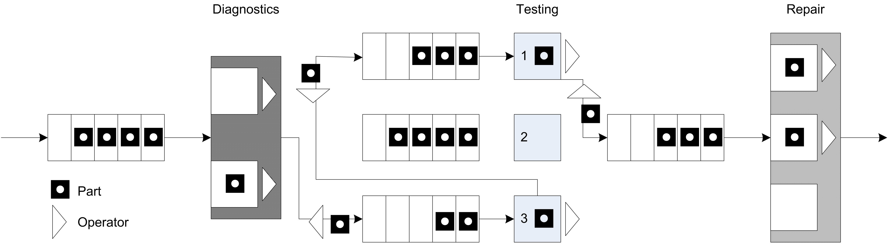
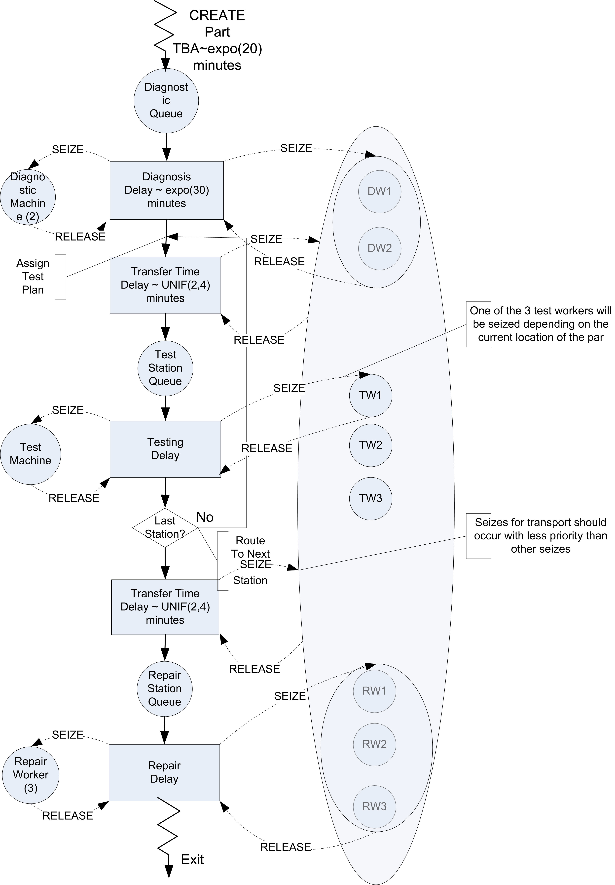
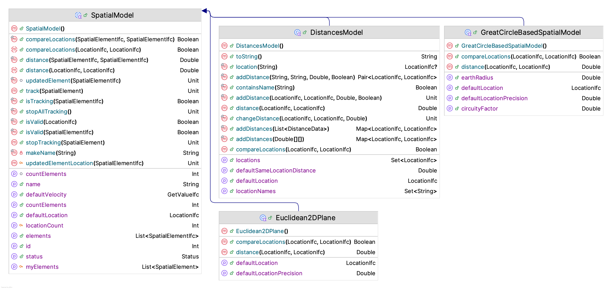
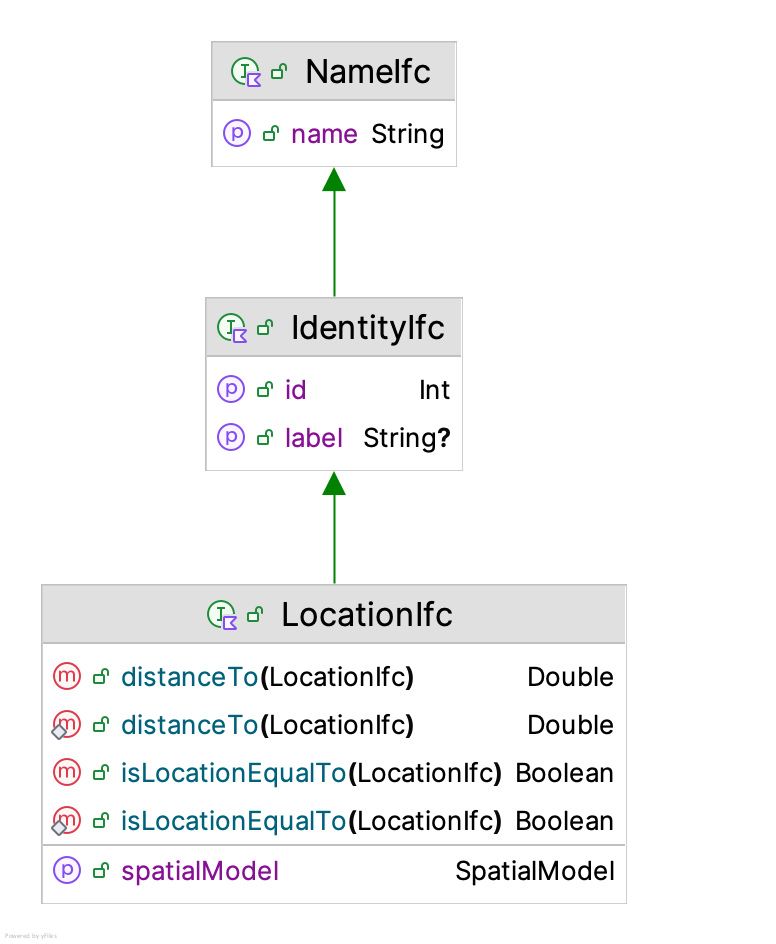
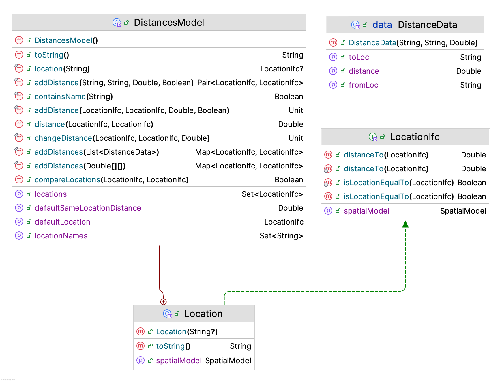
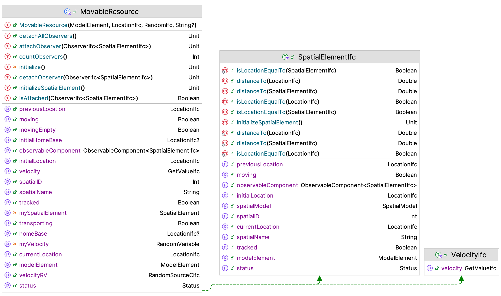
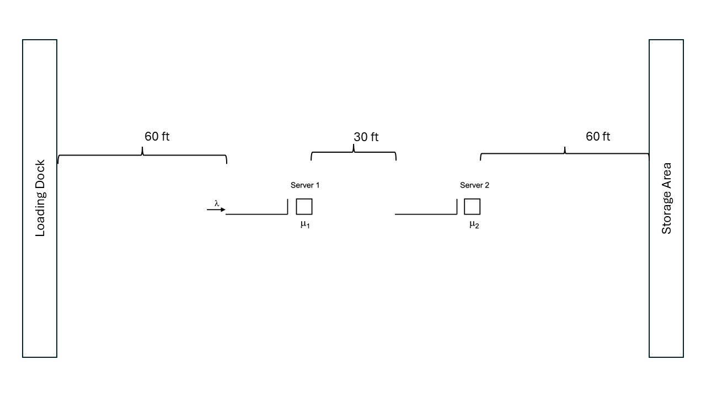

# Modeling Entity Movement {#chEntityMovement}

**[LEARNING OBJECTIVES]{.smallcaps}**

-   To be able to model constrained entity transfer with resources

-   To be able to model constrained entity transfer with movable resources

<!-- -   To be able to model systems involving conveyors -->

<!-- -   To be able to model systems involving automatic guided vehicles -->


Section \@ref(ch7RevisedJFEModelingWalking) of Chapter \@ref(ch7AdvModeling) introduced
the concept entity movement by computing a movement time from a velocity and
a known distance. The entities can be imagined as "having
little feet" that allow them to move from one location to another. That
is, the entity is able to move itself. For example, in the test and repair example of
Section \@ref(secTestAndRepair), the parts
moved between stations with a time delay. But how did they physically
move? 

One way to think about this is that there were workers always
available to move the parts between the stations. If there is *always* a
worker available, then it is as if there is an infinite supply of
workers. Thus, whenever a part must be moved from one location to another
the part uses one of the workers to make the movement. Since there is an
infinite supply of workers, this is the same as the part moving itself
(i.e. having little feet) and only the time delay for moving between the
locations is relevant. If the entity is a person (e.g. a
patient in a clinic), this analogy makes sense; however, if the
entity is a part in a manufacturing system, this analogy begins
to lose its appeal. 

In many situations, modeling transfers with a delay is perfectly
reasonable, especially if you are not interested in how the entities
moved (only that they moved). However, in many situations, the movement
of entities can become constrained by the lack of availability of the
transfer mechanism. For example, the movement of parts may require that
the parts be placed on a pallet and that a fork lift be used to move the
parts. At any point in time, there may not be enough fork lifts
available and thus the parts may have to wait for a fork lift to become
available. When the potential for waiting for transport is significant,
including the details the "how" behind the entity
transfer becomes important. In addition, since movement can be a significant part of an
operation, the design of the material movement system may be the main
focus of the simulation modeling effort.

This chapter explores the various KSL constructs available to
facilitate the modeling of the physical movement of entities between
locations. The chapter begins by describing how to model transfers using
resources. In this case, the transfer delay is accompanied by the use of
a resource. Then, Section \@ref(movableResources) presents how the KSL facilitates resource
constrained movement using resources that can move. Since not all movement is as freely moving through space as people walking or fork trucks moving, the KSL provides constructs for modeling entity
movement when the space between the locations becomes an important
aspect of the modeling. 

<!-- Section \@ref(secConveyors) indicates how conveyors can be -->
<!-- represented within and how they represent the space between stations. -->

::: {.infobox .note data-latex="{note}"}
**NOTE!**
This chapter provides a series of example Kotlin code that illustrates the use of KSL constructs for implementing the modeling of entity movement. The full source code of the examples can be found in the accompanying `KSLExamples` project associated with the [KSL repository](https://github.com/rossetti/KSL). The files for each example of this chapter can be found [here](https://github.com/rossetti/KSL/tree/main/KSLExamples/src/main/kotlin/ksl/examples/book/chapter8).
:::

<!-- Then, in Section \@ref(secAGVs), the modeling of transporters will be -->
<!-- revisited to understand how to model the situation where the -->
<!-- transporters may compete for space while moving. This will involve the -->
<!-- modeling of the space between stations as a fixed path (i.e. like a road -->
<!-- network with intersections, etc.) As usual, these concepts will be -->
<!-- illustrated with example models. -->

## Resource Constrained Transfer {#secRCT}

When an entity requires the use of something to complete the movement
between locations, the KSL's `Resource` class can be used to model the
situation. In this case, the physical (e.g. distance) aspects of
the movement are not of interest; however, the time that may be constrained
by the availability of the transport mechanism should be part of the modeling. For this situation, it is sufficient to
model the transport mechanism with a resource (or resource pool). We will illustrate
the approach by enhancing the test and repair example from Section \@ref(secTestAndRepair).

### Test and Repair with Resource Constrained Transfer {#secTestRepairRCT}

Recall that in the test and repair shop, parts follow 1 of 4 different
test plans through the shop. Each part first goes to the diagnostic
station where it determines the sequence of stations that it will visit
via an assignment of a test plan. After being diagnosed, it then
proceeds to the first station in its test plan. In the example, it was
assumed that a worker (from somewhere) was *always* available to move the
part to the next station and that the transfer time took between 2-4
minutes uniformly distributed. The diagnostic station had two diagnostic
machines and each test station had 1 testing machine. Finally, the
repair station had 3 workers that performed the necessary repairs on the
parts after testing. 

An *implicit* assumption in the model was that
there was a worker staffing each of the two diagnostic machines (1
worker for each machine) and that there was a worker assigned to each
test station. The modeling of the workers was not a key component of the
modeling because the machines cannot operate without the worker.  Thus, seizing 
the machine is essentially the same as seizing the worker.

In this section, the use of the workers to move the entities and to
staff the stations will be explicitly modeled. Assume that there are 2
workers at the diagnostic station, 1 worker per testing station, and 3
workers at the repair station. Thus, there are a total of 8 workers in
the system. For simplicity, assume that any of these 8 workers are
capable of moving parts between the stations. For example, when a part
completes its operation at the diagnostic station, any worker in the
system can carry the part to the next station. In reality, it may be
useful to assign certain workers to certain transfers (e.g. diagnostic
workers move parts to the part's first station); however, for simplicity
these issues will be ignored and any worker will be allowed to do any
transport in this example. 

This approach also requires that any worker is capable
of noticing that a part needs movement. For example, perhaps the part is
put in a basket and a light goes on indicating that the part needs
movement. When a part requires movement, it will wait for the next
available idle worker to complete the movement. In this situation, a
worker may be busy tending to a part in process at a station or the
worker may be busy moving a part between stations.
Figure \@ref(fig:ch8fig1) illustrates the new situation for the test
and repair shop involving the use of workers.

<div class="figure" style="text-align: center">

<p class="caption">(\#fig:ch8fig1)Test and repair shop with workers providing the movement</p>
</div>

Since workers are required for the processing of parts at the stations
and they might have to perform the movement of parts between stations,
the workers must be shared between two activities. Thus, when a worker
completes one activity a mechanism is needed to indicate which activity
should proceed next. A simple mechanism is to assign a priority to one
of the tasks. Thus, it seems reasonable to assume that parts waiting for
processing at a station are given priority over parts that require
movement between stations.

Figure \@ref(fig:ch8fig2) illustrates an activity diagram for
the situation where the workers are called for the transport. In the
figure, each worker is indicated individually. For example, DW1 refers
to worker 1 at the diagnostic station. In the figure, the visitation of
each part to a different test station is illustrated with a loop back to
the transfer time after the testing delay. Thus, the figure represents
all three test stations with the test station queue, testing delay, and
test machine combination. Unfortunately, this does not explicitly
indicate that a test worker is assigned to each test station
individually. In particular, the other resources marked TW2 and TW3
should technically have seize and release arrows associated with them
for the testing activity at a particular station.

<div class="figure" style="text-align: center">

<p class="caption">(\#fig:ch8fig2)Activity diagram for revised test and repair situation</p>
</div>

It should be clear from the figure that three pools of resources will be
required in this model. A resource pool should be defined for the
diagnostic workers with two members. A resource pool should be defined
for the three repair workers. Finally, a resource pool should be defined
to hold each of the workers DW1, DW2, TW1, TW2, TW3, RW1, RW2, RW3 that
are available for transporting parts. Resource pools are discussed in Section \@ref(secResourcePools).

When a part requires diagnostics,
it will seize one of the workers in the diagnostic workers pool. When a
part requires testing, it will seize the appropriate test worker for its
current station. Finally, at the repair station, the part will seize one
of the repair workers. In order to receive transport, the part will
seize from the entire pool of transport workers.

#### Implementing Test and Repair Resource Constrained Transfer {#RCTs1sb1}

Based on Figure \@ref(fig:ch8fig2), the basic process for resource
constrained transfer should be something like that shown in
the following pseudo-code.

```
SEIZE 1 diagnostic machine
SEIZE 1 diagnostic worker from diagnostic worker set
DELAY for diagnostic time
RELEASE diagnostic machine
RELEASE diagnostic worker

SEIZE 1 worker from worker set
DELAY for transfer time
RELEASE worker

SEIZE appropriate test machine
SEIZE appropriate test worker 
DELAY for testing time
RELEASE test machine
RELEASE test worker

SEIZE 1 worker from worker set
IF not at last station
	DELAY for transfer time to next test station
ELSE
	DELAY for transfer time by to Repair
ENDIF

RELEASE worker
SEIZE repair worker
DELAY for repair time
RELEASE repair worker
```

This logic assumes that each worker has been placed in resource pools. 
At the diagnostic station both the machine and a diagnostic worker
are required. When the part completes the processing at the diagnostic
station, the part seizes a worker from the overall set of workers and
routes with a transfer delay to the appropriate testing station.

After arriving at the test station, the part releases the worker that
performed the transport and proceeds with the seizing of the test
machine and worker. Again, prior to the routing to the next station, a
worker from the overall set of workers is seized. Notice also that the
worker is released after the part is transferred to the repair station.

Now let's take a look at how to modify the test and repair model from 
Section \@ref(secTestAndRepair) to use these new concepts.  The key changes 
involve the definition of the resource pools that involve the workers at
each station. Resource pools are discussed in Section \@ref(secResourcePools). 
The diagnostic workers can be defined as follows:

```kt
    private val dw1 = Resource(this, name = "DiagnosticsWorker1")
    private val dw2 = Resource(this, name = "DiagnosticsWorker2")
    private val diagnosticWorkers: ResourcePoolWithQ = ResourcePoolWithQ(
        this,
        listOf(dw1, dw2), name = "DiagnosticWorkersPool"
    )
```
First, the individual resources representing the diagnostic workers are constructed.  
Then, the resource pool to hold the diagnostic workers is created by supplying
the resources in a list. The testing workers and the repair workers can be defined in a similar manner:

```kt
    private val tw1 = ResourceWithQ(this, name = "TestWorker1")
    private val myTest1: ResourceWithQ = ResourceWithQ(this, "Test1", capacity = 1)
    private val tw2 = ResourceWithQ(this, name = "TestWorker2")
    private val myTest2: ResourceWithQ = ResourceWithQ(this, "Test2", capacity = 1)
    private val tw3 = ResourceWithQ(this, name = "TestWorker3")
    private val myTest3: ResourceWithQ = ResourceWithQ(this, "Test3", capacity = 1)

    private val rw1 = Resource(this, name = "RepairWorker1")
    private val rw2 = Resource(this, name = "RepairWorker2")
    private val rw3 = Resource(this, name = "RepairWorker3")
    private val repairWorkers: ResourcePoolWithQ = ResourcePoolWithQ(
        this,
        listOf(rw1, rw2, rw3), name = "RepairWorkersPool"
    )

    private val transportWorkers: ResourcePoolWithQ = ResourcePoolWithQ(
        this, listOf(tw1, tw2, tw3, dw1, dw2, rw1, rw2, rw3), name = "TransportWorkersPool"
    )
```

Finally, the resource pool to represent the transport workers can be defined based
on the previously declared resources (test workers, diagnostic workers, and repair workers). 
The remaining declarations for the model are the same as in Section \@ref(secTestAndRepair).

Now, the process routine needs to be updated to reflect the use of the pools and
the use of transport workers for moving the parts.

```kt
    private inner class Part : Entity() {
        val testAndRepairProcess: KSLProcess = process(isDefaultProcess = true) {
            wip.increment()
            timeStamp = time
            //every part goes to diagnostics
            val dd1 = seize(diagnosticWorkers) // worker is needed to use the machine
            val d1 = seize(myDiagnosticMachines)
            delay(diagnosticTime)
            release(d1) // release machine first, because worker is needed to release
            release(dd1)
            val twa = seize(transportWorkers, seizePriority = KSLEvent.MEDIUM_PRIORITY)
            delay(moveTime)
            release(twa)
            // determine the test plan
            val plan: List<TestPlanStep> = planList.randomElement
            // get the iterator
            val itr = plan.iterator()
            // iterate through the plan
            while (itr.hasNext()) {
                val tp = itr.next()
                // visit tester
                val tt1 = seize(tp.tester)// tester needed first to work on machine
                val t1 = seize(tp.testMachine)
                delay(tp.processTime)
                release(t1)
                release(tt1)
                val twa1 = seize(transportWorkers, seizePriority = KSLEvent.MEDIUM_PRIORITY)
                delay(moveTime)
                release(twa1)
            }
            // visit repair
            val rw = seize(repairWorkers)
            delay(repairTimes[plan]!!)
            release(rw)
            timeInSystem.value = time - timeStamp
            wip.decrement()
        }
    }
```
Notice how the workers are seized before the machine at each station.

```kt
            val dd1 = seize(diagnosticWorkers) // worker is needed to use the machine
            val d1 = seize(myDiagnosticMachines)
            delay(diagnosticTime)
            release(d1) // release machine first, because worker is needed to release
            release(dd1)
```

Also notice the specification of the use of the transport workers when moving to the next location for testing. The seize request for the transport workers has medium priority (as compared to the default high priority for normal seizing of resources.

```kt
              val twa = seize(transportWorkers, seizePriority = KSLEvent.MEDIUM_PRIORITY)
              delay(moveTime)
              release(twa1)
```

Therefore, resource constrained movement can be easily modeled by seizing the required resource for the move; however, the time to move is specified as a delay. The reader is asked to explore the effect of different resource allocation rules on system performance in the exercises.  When the modeling of the distance to move is important, then we can use movable resources.

## Constrained Transfer with Movable Resources {#movableResources}

A *movable resource* refers to one or more identical resources that
can be allocated to an entity for the purpose of moving entities
between locations. The travel time between locations depends on distance and speed.

The standard *delay()* function assumes no resource constrained transfer. As indicated in the last section, the situation of a general resource being used for the transfer can be
easily modeled. In that situation, the time of the transfer was
specified. In the case of movable resources, resource constrained transfer is
still being modeled, but in addition, the physical distance of the
transfer is explicitly modeled. In essence, rather than specifying a time to
transfer, you specify a velocity and a distance for the transfer.
From the velocity and distance associated with the transfer, the time of
the transfer can be computed. In these situations, the physical device
and its movement (with or without the entity) through the system is of
key interest within the modeling.

The modeling of a resource that moves needs to include the following aspects:

- movement of the resource (empty) to the origin location for pick up
- movement of the resource (not empty) to the destination location for drop off

Besides these two aspects, there are natural modeling enhancements that might be considered:

- time to load the entity for the pick up
- time to unload the entity for the drop off
- possible movement of the resource to a home location after drop off

The KSL models this situation using movable resources with a spatial model. 

### Spatial Models

A spatial model represents the physical space associated with the environment. For the purposes of
movable resources, a spatial model provides the distance between locations. The KSL supports
a variety of spatial models. The simplest spatial model is probably the `DistancesModel` class.
Figure \@ref(fig:spatialModelfig) illustrates the main classes for spatial models. A spatial model
holds spatial elements.  Spatial elements are objects that implement the `SpatialElementIfc` interface.

<div class="figure" style="text-align: center">

<p class="caption">(\#fig:spatialModelfig)Spatial Models</p>
</div>

The `SpatialModel` class is an abstract base class.  The key abstract concepts that need to be
implemented by sub-classes are:

```kt
    /**
     *  The default initial location.
     */
    abstract var defaultLocation: LocationIfc
    
    /**
     * Computes the distance between [fromLocation] and [toLocation] based on
     * the spatial model's distance metric
     * @return the distance between the two locations
     */
    abstract fun distance(fromLocation: LocationIfc, toLocation: LocationIfc): Double

    /**
     * Returns true if [firstLocation] is the same as [secondLocation]
     * within the underlying spatial model. This is not object reference
     * equality, but rather whether the locations within the underlying
     * spatial model can be considered spatially (equivalent) according to the model.
     * This may or may not imply that the distance between the locations is zero.
     * No assumptions about distance are implied by true.
     *
     * Requirement: The locations must be valid within the spatial model.
     */
    abstract fun compareLocations(firstLocation: LocationIfc, secondLocation: LocationIfc): Boolean
```

The KSL provides basic spatial model implementations for the following situations.

- Distances - The distance between locations is provided based on an origin-destination matrix.
- Great Circle - A [great circle](https://en.wikipedia.org/wiki/Great-circle_distance) spatial model represents the distance between two coordinates on the earth based on latitude and longitude.  It provides an approximate distance of travelling along the great circle between the coordinates. The model implemented within the KSL allows for the adjustment of the distance based on circuity factor. The circuity factor will adjust the distance based on the mode of transport road or rail.
- Euclidean 2D Plane - The distance is based on computing the distance between two points in the Euclidean 2D plane.
- Rectangular Grid - The 2D plane is divided into a grid with the upper left most corner point representing (0,0). The grid is specified based on the width and height divided into a number of rows and columns. This facilitates the moving between the cells of the grid.

The main abstraction for a spatial model is computing the distance between two locations.

<div class="figure" style="text-align: center">

<p class="caption">(\#fig:Locationfig)Location Interface</p>
</div>

A location has a name and an identity. In addition, a location is associated with a spatial model. From the spatial model, a location can compute the distance to other locations within the spatial model. Spatial models are responsible for creating locations and for computing the distance between locations.  A spatial model is responsible for defining what constitutes a location. For example, a great circle spatial model uses GPS coordinates to define locations. 

As previously mentioned, a basic spatial model is a distances model, which is implemented via the `DistancesModel` class. 

<div class="figure" style="text-align: center">

<p class="caption">(\#fig:Distancesfig)Distances Model</p>
</div>

In essence, a distance model is a matrix that holds the distances between origins and destinations.  Notice from Figure \@ref(fig:Distancesfig) that the inner class `Location` implements the `LocationIfc` interface for the distance model.  The user is responsible for providing the data associated with the locations. The specification can be in the form of matrix or via the data class `DistanceData` or individually specified via the `addDistance()` function.  The following code illustrates the concepts.

```kt
    private val dm = DistancesModel()
    private val enter = dm.Location("Enter")
    private val station1 = dm.Location("Station1")
    private val station2 = dm.Location("Station2")
    private val exit = dm.Location("Exit")

    init {
        // distance is in feet
        dm.addDistance(enter, station1, 60.0, symmetric = true)
        dm.addDistance(station1, station2, 30.0, symmetric = true)
        dm.addDistance(station2, exit, 60.0, symmetric = true)
        dm.addDistance(station2, enter, 90.0, symmetric = true)
        dm.addDistance(exit, station1, 90.0, symmetric = true)
        dm.addDistance(exit, enter, 150.0, symmetric = true)
        dm.defaultVelocity = myWalkingSpeedRV
        spatialModel = dm
    }
```
In the code, a distances model is created, used to define locations, and then used to specify the distance between locations.  As shown in Figure \@ref(fig:spatialModelfig), a distances model also includes a default velocity because it is a sub-class of the `SpatialModel` class.  Now we are ready to discuss movable resources. 

### Movable Resources {#secMovableResources}

As mentioned, a movable resource is a resource that moves.  The class `MovableResource` shown in Figure \@ref(fig:MovableRfig) is a sub-class of the `Resource` class, while implementing the `SpatialElementIfc` and `VelocityIfc` interfaces.  A spatial element is something that can be within a spatial model.  Notice that the `SpatialElementIfc` interface uses locations to specify the initial, previous, and current location of the spatial element. 

<div class="figure" style="text-align: center">

<p class="caption">(\#fig:MovableRfig)Movable Resource</p>
</div>

To use movable resources within a process model, we need to define some new suspending functions and discuss how entities keep track of their location. The `Entity` class implements the `SpatialElementIfc` interface.  Some of the key properties that assist with the use of entities within a spatial model include:

- `initialLocation` The location of the entity when it is created specified as a `LocationIfc` interface instance.
- `previousLocation` The previous location of the entity after it has moved to its current location as specified as a `LocationIfc` interface instance.
- `currentLocation` The current location of the entity within the spatial model as specified as a `LocationIfc` interface instance.
- `isMoving` A boolean property that indicates if the entity is experiencing a movement.
- `velocity` A property that implements the `GetValueIfc` interface that reports the velocity to use when the entity is moving between locations.

To have entities use movable resources within a process, we need to introduce new suspending functions.  To move an entity from one location to another (without a resource), we can use the following variations of the `move()` function:

- `move(fromLoc: LocationIfc, toLoc: Location, velocity: Double, movePriority: Int, suspensionName: String?)`
- `move(fromLoc: LocationIfc, toLoc: Location, velocity: GetValueIfc, movePriority: Int, suspensionName: String?)`

To move something that implements the `SpatialElementIfc` interface use the following `move()` function. Note that the entity experiences the delay while the spatial element is moved to the supplied location.

- `move(spatialElement: SpatialElementIfc, toLoc: Location, velocity: Double, movePriority: Int, suspensionName: String?)`

This function uses the spatial element's current location as the origin. Since movable resources are also spatial elements, we can move them.  Again, the entity experiences the time delay associated with the movement of the resource to the supplied location.

- `move(movableResource: MovableResource, toLoc: Location, velocity: Double, movePriority: Int, suspensionName: String?)`
- `move(movableResourceWithQ: MovableResourceWithQ, toLoc: Location, velocity: Double, movePriority: Int, suspensionName: String?)`

In addition, we can cause both the entity and a spatial model to move together using variations of the `moveWith()` function.

- `moveWith(spatialElement: SpatialElementIfc, toLoc: Location, velocity: Double, movePriority: Int, suspensionName: String?)`
- `moveWith(movableResource: MovableResource, toLoc: Location, velocity: Double, movePriority: Int, suspensionName: String?)`
- `moveWith(movableResourceWithQ: MovableResourceWithQ, toLoc: Location, velocity: Double, movePriority: Int, suspensionName: String?)`

In order to use these functions, the entity and the spatial element must be at the *same* location.  Thus, the standard approach to using a movable resource to move an entity involves first seizing the resource, then moving the resource to the entity's current location, and finally moving with the resource to the destination. Here is a simple pattern:

```kt
val a = seize(movableResource)
move(movableResource, entity.currentLocation, emptyVelocity, emptyMovePriority)
delay(loadingDelay, loadingPriority)
moveWith(movableResource, toLoc, transportVelocity, transportPriority)
delay(unLoadingDelay, unLoadingPriority)
release(a)
```

In fact, this pattern is so common, there is a suspending function that encapsulates it into one function.

```kt
   /**
     *  Causes transport of the entity via the movable resource from the entity's current location to the specified location at
     *  the supplied velocities.
     *  If not specified, the default velocity of the movable resource is used for the movement.
     *  @param movableResource, the spatial element that will be moved
     *  @param toLoc the location to which the entity is supposed to move
     *  @param emptyVelocity the velocity associated with the movement to the entity's location
     *  @param transportVelocity the velocity associated with the movement to the desired location
     *  @param transportQ the queue that the entity waits in if the resource is busy
     *  @param requestPriority, a priority can be used to determine the order of events for
     *  requests for transport
     *  @param emptyMovePriority, since the move is scheduled, a priority can be used to determine the order of events for
     *  moves that might be scheduled to complete at the same time.
     *  @param transportPriority, since the move is scheduled, a priority can be used to determine the order of events for
     *  moves that might be scheduled to complete at the same time.
     */
    suspend fun transportWith(
        movableResource: MovableResource,
        toLoc: LocationIfc,
        emptyVelocity: Double = movableResource.velocity.value,
        transportVelocity: Double = movableResource.velocity.value,
        transportQ: RequestQ,
        loadingDelay: GetValueIfc = ConstantRV.ZERO,
        unLoadingDelay: GetValueIfc = ConstantRV.ZERO,
        requestPriority: Int = TRANSPORT_REQUEST_PRIORITY,
        emptyMovePriority: Int = MOVE_PRIORITY,
        loadingPriority: Int = DELAY_PRIORITY,
        transportPriority: Int = MOVE_PRIORITY,
        unLoadingPriority: Int = DELAY_PRIORITY
    )
```

::: {.infobox .note data-latex="{note}"}
**NOTE!**
The `transportWith()` function is meant to be a convenience function to cover a standard pattern of usage; however, if your situation varies from the standard pattern, then you can always use the basic `move()` and `moveWith()` functions to model a wide variety of situations.
:::

We are now ready to illustrate entity movement and movement using movable resources. 

### Tandem Queue Model With Movement {#secTQMWM}

Recall the tandem queue model in Example \@ref(exm:exTandemQ).  For this section, we are going to enhance the example with movement. In this situation, parts will enter the system at a loading dock that is 60 feet from the station staffed by the first worker.  For simplicity, let's assume that there are always plenty of workers available to move the part from the loading dock to the first station. After the part completes processing at station 1, it is moved to station 2. Again, assume that there are plenty of workers available to move the part from station 1 to station 2.  The distance from station 1 to station 2 is 30 feet.  After completing processing at station 2, the part is moved to a storage area, where it exits the system.  The distance from station 2 to the storage area is 60 feet. We can assume that the walking speed of the workers that move the parts is a triangular distributed random variable with a minimum of 88, a mode of 176, and a maximum of 264, all in feet per minute.

<div class="figure" style="text-align: center">

<p class="caption">(\#fig:Ch7TandemQ2)Tandem Queue</p>
</div>

To model this situation, we will use the distances spatial model. To implement this situation, we will: 

- Use the `Location` class within the `DistancesModel` to define locations
- Use the `addDistance()` function to specify the distance between two locations
- Use the `spatialModel` property to specify the spatial model used by the `ProcessModel`

Let's start by defining the distances via the `DistancesModel` class. In the following code, the `DistancesModel` instance is created 
and then used to create the four locations within the spatial model's context.  Then, the `init` block is used to add the distance
data to the model.

```kt
class TandemQueueWithUnConstrainedMovement(
  parent: ModelElement,
  name: String? = null
) : ProcessModel(parent, name) {

    // velocity is in feet/min
    private val myWalkingSpeedRV = TriangularRV(88.0, 176.0, 264.0)
    private val dm = DistancesModel()
    private val enter = dm.Location("Enter")
    private val station1 = dm.Location("Station1")
    private val station2 = dm.Location("Station2")
    private val exit = dm.Location("Exit")

    init {
        // distance is in feet
        dm.addDistance(enter, station1, 60.0, symmetric = true)
        dm.addDistance(station1, station2, 30.0, symmetric = true)
        dm.addDistance(station2, exit, 60.0, symmetric = true)
        dm.defaultVelocity = myWalkingSpeedRV
        spatialModel = dm
    }
```

Notice that the distances are assumed to be symmetric.  That is the distance from the `enter` location to the `station1` location is the same (60 feet) in both directions. The line `dm.defaultVelocity = myWalkingSpeedRV` indicates that whenever a velocity is needed for a movement, the walking speed distribution is used. Finally, the line `spatialModel = dm` causes the process model to use the distances model for its spatial model.  This ensures that the entities created within the process model will use the distances model as their spatial model context. Once distances have been defined the tandem queue system movement can be easily handled within the process description.

```kt
    private inner class Customer : Entity() {
        val tandemQProcess: KSLProcess = process(isDefaultProcess = true) {
            currentLocation = enter
            wip.increment()
            timeStamp = time
            moveTo(station1)
            use(worker1, delayDuration = st1)
            moveTo(station2)
            use(worker2, delayDuration = st2)
            moveTo(exit)
            timeInSystem.value = time - timeStamp
            wip.decrement()
        }
    }
```
Notice the setting of the entity's `currentLocation` in the first line of the process. This line ensures that the entity is located at the `enter` location when it starts the process.  The current location property will be updated by the `moveTo()` functions so that after the movement, the entity's location is the destination of the movement.  The results of running the model with the additional movement indicate that the movement affects the time spent in the system.

```
Name                                 Count 	      Average 	   Half-Width 
--------------------------------------------------------------------------
worker1:InstantaneousUtil             30 	       0.6982 	       0.0023 
worker1:NumBusyUnits                  30 	       0.6982 	       0.0023 
worker1:ScheduledUtil                 30 	       0.6982 	       0.0023 
worker1:WIP                           30 	       2.2966 	       0.0388 
worker1:Q:NumInQ                      30 	       1.5983 	       0.0371 
worker1:Q:TimeInQ                     30 	       1.6001 	       0.0356 
worker2:InstantaneousUtil             30 	       0.8984 	       0.0037 
worker2:NumBusyUnits                  30 	       0.8984 	       0.0037 
worker2:ScheduledUtil                 30 	       0.8984 	       0.0037 
worker2:WIP                           30 	       8.5321 	       0.4317 
worker2:Q:NumInQ                      30 	       7.6337 	       0.4289 
worker2:Q:TimeInQ                     30 	       7.6378 	       0.4190 
TandemQModel:NumInSystem              30 	      11.7191 	       0.4414 
TandemQModel:TimeInSystem             30 	      11.7288 	       0.4250 
worker1:SeizeCount                    30 	   14981.8667 	      40.6211 
worker2:SeizeCount                    30 	   14979.4667 	      41.3926 
-------------------------------------------------------------------------
```

In the previous example, we assumed that there was an unlimited number of workers available to move the parts. This results in only a simple delay time to move from one location to another. Now, let's make the more realistic assumption that in order to move a finite number of workers are available such that when a part needs to move between the stations one of the workers dedicated to the transport task must be available to move the part; otherwise the part must wait until a transport worker is available. For simplicity, we are going to assume that their are 3 transport workers, with one dedicated to moving parts to station 1, another dedicated to moving parts from station 1 to station 2, and the third worker dedicated to moving parts from the third workstation to storage. We are also going to assume that the transport worker stays at the drop off location until requested for its next movement.

Because the transport workers stay at the drop off location, we may need to consider two-way travel. Also, we will need to consider where the transport workers are located at the start of the simulation.  We are going to assume that the transport workers all start at the `enter` location. These assumptions will require an update to the distances. Why?  Because we now need to account for the distance to move empty.

```kt
    private val myWalkingSpeedRV = TriangularRV(88.0, 176.0, 264.0)
    private val dm = DistancesModel()
    private val enter = dm.Location("Enter")
    private val station1 = dm.Location("Station1")
    private val station2 = dm.Location("Station2")
    private val exit = dm.Location("Exit")

    init {
        // distance is in feet
        dm.addDistance(enter, station1, 60.0, symmetric = true)
        dm.addDistance(station1, station2, 30.0, symmetric = true)
        dm.addDistance(station2, exit, 60.0, symmetric = true)
        dm.addDistance(station2, enter, 90.0, symmetric = true)
        dm.addDistance(exit, station1, 90.0, symmetric = true)
        dm.addDistance(exit, enter, 150.0, symmetric = true)
        dm.defaultVelocity = myWalkingSpeedRV
        spatialModel = dm
    }
```

Notice that we need to specify the distance from the `station2` location to the `enter` location.  This is because the movable resource will be at the `enter` location at the start of the simulation and will need to move to the `station2` location for a pick up.  This movement (as well as others) occur because the resource must move to the pick up location (empty) and because the resource stays at the location of the drop off.  Now, we can define the movable resources.

```kt
   private val mover1: MovableResourceWithQ = MovableResourceWithQ(this, enter, myWalkingSpeedRV, "Mover1")
   private val mover2: MovableResourceWithQ = MovableResourceWithQ(this, enter, myWalkingSpeedRV, "Mover2")
   private val mover3: MovableResourceWithQ = MovableResourceWithQ(this, enter, myWalkingSpeedRV, "Mover3")
```

Notice that we define the resources to have a queue. This queue will hold requests for the resource when more than one part requires a move. The process description can now be updated to use the movable resources.  The following code explicitly seizes the movable resource, moves the resource to the location of the part, and then moves with the resource before then releasing the resource. 

```kt
    private inner class Customer : Entity() {
        val tandemQProcess: KSLProcess = process(isDefaultProcess = true) {
            currentLocation = enter
            wip.increment()
            timeStamp = time
            val a1 = seize(mover1)
            move(mover1, toLoc = enter)
            moveWith(mover1, toLoc = station1)
            release(a1)
            use(worker1, delayDuration = st1)
            val a2 = seize(mover2)
            move(mover2, toLoc = station1)
            moveWith(mover2, toLoc = station2)
            release(a2)
            use(worker2, delayDuration = st2)
            val a3 = seize(mover3)
            move(mover3, toLoc = station2)
            moveWith(mover3, toLoc = exit)
            release(a3)
            timeInSystem.value = time - timeStamp
            wip.decrement()
        }
    }
```

The following code shortens the process by using the `transportWith()` and `use()` functions. 

```kt
    private inner class Customer : Entity() {
        val tandemQProcess: KSLProcess = process(isDefaultProcess = true) {
            currentLocation = enter
            wip.increment()
            timeStamp = time
            transportWith(mover1, station1)
            use(worker1, delayDuration = st1)
            transportWith(mover2, station2)
            use(worker2, delayDuration = st2)
            transportWith(mover3, exit)
            timeInSystem.value = time - timeStamp
            wip.decrement()
        }
    }
```

Suppose that there is a time required to load and unload the part.  Let's assume that the
loading time is uniformly distributed between 0.5 and 0.8 minutes and the unloading time is
uniformly distributed between 0.25 and 0.5 minutes. In addition, suppose that the workers the 
perform the movement are not dedicated to a particular station, but instead, they are in a pool
of workers that may perform the pick up and delivery of the parts. 

For this situation, we can use an instance of the `MovableResourcePoolWithQ` class. To define the pool
the following code can be used.

```kt
    private val mover1 = MovableResource(this, enter, myWalkingSpeedRV, "Mover1")
    private val mover2 = MovableResource(this, enter, myWalkingSpeedRV, "Mover2")
    private val mover3 = MovableResource(this, enter, myWalkingSpeedRV, "Mover3")
    private val moverList = listOf(mover1, mover2, mover3)
    private val movers = MovableResourcePoolWithQ(this, moverList, myWalkingSpeedRV, name = "Movers")
```

By using the `transportWith()` function
we can easily add the loading and unloading time delays as follows:

```kt
    private val myLoadingTime = RandomVariable(this, UniformRV(0.5, 0.8))
    val loadingTimeRV: RandomSourceCIfc
        get() = myLoadingTime
    private val myUnLoadingTime = RandomVariable(this, UniformRV(0.25, 0.5))
    val unloadingTimeRV: RandomSourceCIfc
        get() = myUnLoadingTime
        
    private inner class Customer : Entity() {
        val tandemQProcess: KSLProcess = process(isDefaultProcess = true) {
            currentLocation = enter
            wip.increment()
            timeStamp = time
            transportWith(movers, station1, loadingDelay = myLoadingTime, unLoadingDelay = myUnLoadingTime)
            use(worker1, delayDuration = st1)
            transportWith(movers, station2, loadingDelay = myLoadingTime, unLoadingDelay = myUnLoadingTime)
            use(worker2, delayDuration = st2)
            transportWith(movers, exit, loadingDelay = myLoadingTime, unLoadingDelay = myUnLoadingTime)
            timeInSystem.value = time - timeStamp
            wip.decrement()
        }
    }
```

A pool of movable resources is essentially a "motor pool" or fleet.  An importance aspect of modeling a pool of movable resources is how to dispatch the next movable resource.  The concept of pooled resources was discussed in Section \@ref(secResourcePools). In that section, the need for a resource selection rule was briefly mentioned.  Within a spatial context, how the next resource is selected to respond to a request may become important. Recall that a resource selection rule determines the list of resources that have enough capacity available to meet the request.  In the context of movable resources, the requested capacity is always one unit. Thus, the resource selection rule returns a list of available resources (not seized). Then, from this list a resource must be selected for allocation.  The construction of the list of movable resources for possible allocation is governed by the `MovableResourceSelectionRuleIfc` interface.

```kt
/**
 * Provides for a method to select movable resources from a list such that
 * the returned list will contain movable resources that can satisfy the request
 * or the list will be empty.
 */
fun interface MovableResourceSelectionRuleIfc {
    /**
     * @param list of resources to consider selecting from
     * @return the selected list of resources. It may be empty
     */
    fun selectMovableResources(list: List<MovableResource>): MutableList<MovableResource>
}
```

By default, the movable resource selection rule is provided by the `MovableResourceSelectionRule` class, which simply returns all available units for possible allocation. Since the allocation rules selects from this list, it is likely that the default selection rule will work for the vast majority of situations.

Within a spatial context, the resource selected for allocation may need additional consideration.  For example, it may make sense to allocate the resource that is closest to the requesting entity. The KSL supports a variety of movable resource allocation rules via the `MovableResourceAllocationRuleIfc` interface.

```kt
/**
 *  Function to determine which movable resource should be allocated to
 *  a request. The function provides the location of the request to allow
 *  distance based criteria to be used.
 */
fun interface MovableResourceAllocationRuleIfc {

    /** The method assumes that the provided list of resources has
     *  enough units available to satisfy the needs of the request.
     *
     * @param requestLocation the location associated with the request. This information can be
     * used to determine the allocation based on distances.
     * @param resourceList list of resources to be allocated from
     * @return the amount to allocate from each resource as a map
     */
    fun selectMovableResourceForAllocation(
        requestLocation: LocationIfc,
        resourceList: MutableList<MovableResource>
    ): MovableResource
}
```

The KSL provides the following movable resource allocation rules.

- `ClosestMovableResourceAllocationRule` - This rule determines which of the available movable resources is closest to the request's location.  This is the default rule.
- `FurthestMovableResourceAllocationRule` - This rule determines which of the available movable resources is furthers from the request's location.  This rule may be useful to return movable resources from the outskirts of the spatial model to more central activities.
- `RandomMovableResourceAllocationRule` - This rule randomly selects from the available movable resources. This rule may be useful for a fairer distribution of activity across the resources.
- `MovableResourceAllocateInOrderListedRule` This rule returns the first available resource from the selected resources.
- `MovableResourceAllocationRule` - This rule allows a user to determine the order of allocation based on a user defined comparator. The following comparison based rules are based on this approach.
  - `LeastUtilizedMovableResourceAllocationRule` - Allocates to the movable resource that is currently the least utilized (based on the utilization statistics). This can be useful if fairness is a criteria.
  - `LeastSeizedMovableResourceAllocationRule` - Allocates to the movable resource that has been seized (allocated) the least. This can be useful if fairness is a criteria.

The reader will be asked to explore the use of these different rules within the exercises.

## Modeling the Test and Repair System with Movable Resources {#secTestAndRepairMovableResources}

The results of the constrained resource analysis in Section \@ref(secTestRepairRCT) indicated that modeling
constrained transfer for the parts in the test and repair system may
have a significant effect on the system's ability to meet the contract
requirements. This may be due to having the workers share the roles of
tending the machines and transporting the parts. The following example
investigates whether or not a set of dedicated workers would make sense
for this system. In particular, the number of workers to dedicate to the
transport task needs to be determined. Since there is a lot of walking
involved, the model needs to be more precise in the physical modeling of
the situation. This could also allow different layout configurations to
be simulated if the relocation of the stations would make a difference
in the efficiency of the system.

To model this situation using movable resources, the distance between the
stations and a way to model the velocity of transport are required.
Since the workers have a natural variability in the speed of their
walking, a model for human walking speed is needed. Based on some time
study data, the velocity of a worker walking in the facility has been
determined to be distributed according to a triangular distribution with
a minimum of 22.86, a mode of 45.72, and a maximum of 52.5, all in
meters per minute. Since this distribution will be used in many
locations in the model, a random variable should be defined to represent the velocity.

Based on measuring the distance between the stations, the approximate
distance between the stations has been determined as given in
Table \@ref(tab:TRDistances).
Recall that both the loaded and unloaded distances for the movement
should be specified. For example, even though no parts are routed from
repair to diagnostics, the distance from repair to diagnostics should be
given because the worker (transporter) may be at the repair station when
something needs to be moved from the diagnostic station. Thus, the
worker must walk from the repair station to the diagnostic station
(unloaded) in order to pick up the part. Notice also that the distances
do not have to be symmetric (i.e. the distance from test 1 to test 2
does not have to be the same as the distance from test 2 to test 1).

::: {#tab:TRDistances}
    Station     Diagnostics    Test 1   Test 2   Test 3   Repair
  ------------- ------------- -------- -------- -------- ---------
   Diagnostics     --          40       70       90       100
    Test 1         43          --       10       60       80
    Test 2         70          15       --       65       20
    Test 3         90          80       60       --       25
    Repair         110         85       25       30       --
  ------------- ------------- -------- -------- -------- ---------

  Table: (\#tab:TRDistances) Transporter distances between stations
:::

Starting with the finished model from Example \@ref(exm:exTestAndRepair) of Section \@ref(secTestAndRepair) we can make small changes in order to utilize movable resources. The first step is to define the locations and walking speed for the transport workers.

```kt
    // velocity is in meters/min
    private val myWalkingSpeedRV = RandomVariable(this, TriangularRV(22.86, 45.72, 52.5))
    private val dm = DistancesModel()
    private val diagnosticStation = dm.Location("DiagnosticStation")
    private val testStation1 = dm.Location("TestStation1")
    private val testStation2 = dm.Location("TestStation2")
    private val testStation3 = dm.Location("TestStation3")
    private val repairStation = dm.Location("RepairStation")
```

Since the transport workers need to walk without carrying a part, we need to define the distances to and from the locations as shown in the following code.  Notice that the walking speed is used for the default velocity of movement within the distance model.

```kt
    init {
        // distance is in meters
        dm.addDistance(diagnosticStation, testStation1, 40.0)
        dm.addDistance(diagnosticStation, testStation2, 70.0)
        dm.addDistance(diagnosticStation, testStation3, 90.0)
        dm.addDistance(diagnosticStation, repairStation, 100.0)

        dm.addDistance(testStation1, diagnosticStation, 43.0)
        dm.addDistance(testStation1, testStation2, 10.0)
        dm.addDistance(testStation1, testStation3, 60.0)
        dm.addDistance(testStation1, repairStation, 80.0)

        dm.addDistance(testStation2, diagnosticStation, 70.0)
        dm.addDistance(testStation2, testStation1, 15.0)
        dm.addDistance(testStation2, testStation3, 65.0)
        dm.addDistance(testStation2, repairStation, 20.0)

        dm.addDistance(testStation3, diagnosticStation, 90.0)
        dm.addDistance(testStation3, testStation1, 80.0)
        dm.addDistance(testStation3, testStation2, 60.0)
        dm.addDistance(testStation3, repairStation, 25.0)

        dm.addDistance(repairStation, diagnosticStation, 110.0)
        dm.addDistance(repairStation, testStation1, 85.0)
        dm.addDistance(repairStation, testStation2, 25.0)
        dm.addDistance(repairStation, testStation3, 30.0)

        dm.defaultVelocity = myWalkingSpeedRV
        spatialModel = dm
    }
```

Now, we can define the transport workers as a pool of movable resources.  We will specify that there will be three workers dedicated to the transport task. In this case, the workers will start
active at the diagnostics station.  For the purposes of this example, we will rely on the default movable resource selection and allocation rules.

```kt
    private val transportWorkers = MovableResourcePoolWithQ(
        this, 3, diagnosticStation, myWalkingSpeedRV, name = "TransportWorkerPool")
```

Since this situation involves travelling to and from the stations, we need to make a slight change to the test plan definitions given in Example \@ref(exm:exTestAndRepair) of Section \@ref(secTestAndRepair).  We need to add the destination location to the test plan sequences. 

```kt
    // define steps to represent a plan, include location information
    inner class TestPlanStep(
        val testMachine: ResourceWithQ,
        val processTime: RandomIfc,
        val testStation: LocationIfc)

    // make all the plans
    private val testPlan1 = listOf(
        TestPlanStep(myTest2, t11, testStation2), TestPlanStep(myTest3, t12, testStation3),
        TestPlanStep(myTest2, t13, testStation2), TestPlanStep(myTest1, t14, testStation1)
    )
```

Notice that the property `testStation` has been added to the `TestPlanStep` class. This property will hold the destination information for transport from the entity's current location to its destination. The code illustrates how the information for test plan 1 has been updated.  Recall from Example \@ref(exm:exTestAndRepair) that the test machine visitation sequence for test plan 1 is $2-3-2-1$. This information has been added to the test plan steps for test plan 1. The other test plans are updated in a similar manner. The process description for the test and repair activities becomes straightforward.

```kt
    private inner class Part : Entity() {
        val plan: List<TestPlanStep> = planList.randomElement

        val testAndRepairProcess: KSLProcess = process(isDefaultProcess = true) {
            currentLocation = diagnosticStation
            wip.increment()
            timeStamp = time
            //every part goes to diagnostics
            use(diagnosticWorkers, delayDuration = diagnosticTime)
            // get the iterator
            val itr = plan.iterator()
            // iterate through the plan
            while (itr.hasNext()) {
                val tp = itr.next()
                // goto the location
                transportWith(transportWorkers, toLoc = tp.testStation)
                // use the tester
                use(tp.testMachine, delayDuration = tp.processTime)
            }
            // visit repair
            transportWith(transportWorkers, toLoc = repairStation)
            use(repairWorkers, delayDuration = repairTimes[plan]!! )
            timeInSystem.value = time - timeStamp
            wip.decrement()
        }
    }
```

Notice that the property `plan` is randomly determined when the part is created. The `testAndRepairProcess` has the entity starting at the diagnostic station by setting the part's `currenLocation` property to the diagnostic station location. Then, the part uses the diagnostic workers. Because the test plan has the destination of the next station, the transport is placed at the top of the iteration through the test plan sequence. The `transportWith()` function is used to transport the part using the `transportWorkers` movable resource pool. Then, the appropriate test machine is used for the appropriate processing time for the test plan step. After visiting all the test machines on its sequence the part then transports to the repair station, where it uses the repair workers. 

The following provides the results from running the model under the same settings as in Example \@ref(exm:exTestAndRepair).

**Statistical Summary Report**

|Name| Count| Average| Half-Width|
|:---:| :---:| :---:| :---:|
|DiagnosticWorkers:InstantaneousUtil| 10| 0.75| 0.005|
|DiagnosticWorkers:NumBusyUnits| 10| 1.5| 0.011|
|DiagnosticWorkers:ScheduledUtil| 10| 0.75| 0.005|
|DiagnosticWorkers:Q:NumInQ| 10| 1.928| 0.107|
|DiagnosticWorkers:Q:TimeInQ| 10| 38.512| 2.167|
|DiagnosticWorkers:WIP| 10| 3.428| 0.114|
|Test1:InstantaneousUtil| 10| 0.857| 0.007|
|Test1:NumBusyUnits| 10| 0.857| 0.007|
|Test1:ScheduledUtil| 10| 0.857| 0.007|
|Test1:Q:NumInQ| 10| 3.232| 0.266|
|Test1:Q:TimeInQ| 10| 57.414| 4.459|
|Test1:WIP| 10| 4.088| 0.271|
|Test2:InstantaneousUtil| 10| 0.776| 0.008|
|Test2:NumBusyUnits| 10| 0.776| 0.008|
|Test2:ScheduledUtil| 10| 0.776| 0.008|
|Test2:Q:NumInQ| 10| 1.584| 0.138|
|Test2:Q:TimeInQ| 10| 42.121| 3.445|
|Test2:WIP| 10| 2.36| 0.142|
|Test3:InstantaneousUtil| 10| 0.862| 0.005|
|Test3:NumBusyUnits| 10| 0.862| 0.005|
|Test3:ScheduledUtil| 10| 0.862| 0.005|
|Test3:Q:NumInQ| 10| 2.587| 0.158|
|Test3:Q:TimeInQ| 10| 51.666| 3.03|
|Test3:WIP| 10| 3.449| 0.16|
|RepairWorkers:InstantaneousUtil| 10| 0.868| 0.005|
|RepairWorkers:NumBusyUnits| 10| 2.605| 0.014|
|RepairWorkers:ScheduledUtil| 10| 0.868| 0.005|
|RepairWorkers:Q:NumInQ| 10| 1.294| 0.081|
|RepairWorkers:Q:TimeInQ| 10| 25.864| 1.559|
|RepairWorkers:WIP| 10| 3.899| 0.09|
|TransportWorkerPool:R1:InstantaneousUtil| 10| 0.224| 0.002|
|TransportWorkerPool:R1:NumBusyUnits| 10| 0.224| 0.002|
|TransportWorkerPool:R1:ScheduledUtil| 10| 0.224| 0.002|
|TransportWorkerPool:R1:FracTimeMoving| 10| 0.224| 0.002|
|TransportWorkerPool:R1:FracTimeTransporting| 10| 0.147| 0.001|
|TransportWorkerPool:R1:FracTimeMovingEmpty| 10| 0.076| 0.001|
|TransportWorkerPool:R2:InstantaneousUtil| 10| 0.158| 0.001|
|TransportWorkerPool:R2:NumBusyUnits| 10| 0.158| 0.001|
|TransportWorkerPool:R2:ScheduledUtil| 10| 0.158| 0.001|
|TransportWorkerPool:R2:FracTimeMoving| 10| 0.158| 0.001|
|TransportWorkerPool:R2:FracTimeTransporting| 10| 0.104| 0.001|
|TransportWorkerPool:R2:FracTimeMovingEmpty| 10| 0.054| 0|
|TransportWorkerPool:R3:InstantaneousUtil| 10| 0.085| 0.001|
|TransportWorkerPool:R3:NumBusyUnits| 10| 0.085| 0.001|
|TransportWorkerPool:R3:ScheduledUtil| 10| 0.085| 0.001|
|TransportWorkerPool:R3:FracTimeMoving| 10| 0.085| 0.001|
|TransportWorkerPool:R3:FracTimeTransporting| 10| 0.057| 0.001|
|TransportWorkerPool:R3:FracTimeMovingEmpty| 10| 0.029| 0.001|
|TransportWorkerPool:NumBusy| 10| 0.467| 0.003|
|TransportWorkerPool:FractionBusy| 10| 0.156| 0.001|
|TransportWorkerPool:Q:NumInQ| 10| 0.001| 0|
|TransportWorkerPool:Q:TimeInQ| 10| 0.005| 0|
|TestAndRepairWithMovableResources:NumInSystem| 10| 17.692| 0.363|
|TestAndRepairWithMovableResources:TimeInSystem| 10| 353.457| 5.965|
|ProbWithinLimit| 10| 0.811| 0.015|
|DiagnosticWorkers:SeizeCount| 10| 12498.4| 75.757|
|Test1:SeizeCount| 10| 14038.7| 112.996|
|Test2:SeizeCount| 10| 9377.7| 97.686|
|Test3:SeizeCount| 10| 12491| 74.153|
|RepairWorkers:SeizeCount| 10| 12485.3| 73.123|
|TransportWorkerPool:R1:SeizeCount| 10| 23121.6| 165.847|
|TransportWorkerPool:R2:SeizeCount| 10| 16375.3| 133.58|
|TransportWorkerPool:R3:SeizeCount| 10| 8905.1| 137.667|

As can be seen in the results, the utilization of the three
transporters is very low (0.156). Less than three workers are probably needed for
the transport task. The reader is asked to explore this issue as an exercise. These results match very closely with the results based on a commercial simulation package discussed in this [book.](https://rossetti.github.io/RossettiArenaBook/ch7-sec-transporters.html#ch7:TRTransporters).  

## Summary of New Concepts

The modeling of entity movement can be achieved with a simple delay. If distance and velocity are available, then we can compute the time of the delay.  The KSL provides spatial models and suspending functions that facilitate the movement of entities. The KSL `DistancesModel` is a `SpatialModel` that provides named locations and the distances associated with movement between them. The `Entity` class provides basic tracking of the location of the entity when using movement constructs. Movable resources are resources that can move within a spatial model.

In such situations, the distance between origins and destinations becomes an essential component of the modeling. 

The new suspend functions include:
- `move()` moves a spatial element to a particular location from another location
- `moveWith()` used with movable resources to move both the resource and the entity to the location
- `transportWith()` used to move a movable resource to the entity's location and then move both the entity and the resource to the specified destination.
  
The new KSL modeling constructs include:

- `MovableResource` A resource that can be moved and used for pickup and delivery.
- `MovableResourceWithQ` A movable resource that has a queue to hold requests for pickup and delivery.
- `SpatialModel` A representation of space that can track elements in the space, their movement, and govern how they move.
- `DistancesModel` A special case of a spatial model that holds the distance between named locations with a spatial context.
- `LocationIfc` An interface that describes a location within a spatial model from which distances can be computed.
- `MovableResourcPool` A pool of movable resources that can be used to transport entities between locations.
- `MovableResourcePoolWithQ` A pool of movable resources with a queue to hold requests for pick up and delivery.
- Entity properties, `initialLocation,` `previousLocation,`, `currentLocation,`,`isMoving,`, and `velocity.`
- `MovableResourceSelectionRuleIfc` - to select movable resources within pools.
- `MovableResourceAllocationRuleIfc` - to determine which movable resource will receive the allocation.

## Exercises

:::{.exercise #ch8P1}
Consider the STEM Career Fair Mixer of Example \@ref(exm:exSTEMEnhanced).  Change the model so that the implementation uses 
the `DistancesModel` class to represent the travel distances.  Use the `moveTo()` function to model the movement of the students within the STEM Career Fair.  Compare your results to the implementation in Chapter \@ref(ch7AdvModeling).
:::

***

:::{.exercise #ch8P2}
Consider the implementation of the tandem queue with constrained movement in Section \@ref(secTQMWM).  Change the model so that the implementation uses the following movable resource allocation rules.

- `MovableResourceAllocateInOrderListedRule`
- `FurthestMovableResourceAllocationRule`
- `LeastUtilizedMovableResourceAllocationRule`
- `RandomMovableResourceAllocationRule` (with stream 4)

Compare your results with those of Section \@ref(secTQMWM). Which rule do you recommend and why?
:::

***

:::{.exercise #ch8P3}
Consider the implementation of the Test and Repair Shop of Section \@ref(secTestAndRepairMovableResources).  Change the model so that the implementation uses the following movable resource allocation rules.

- `MovableResourceAllocateInOrderListedRule`
- `FurthestMovableResourceAllocationRule`
- `LeastUtilizedMovableResourceAllocationRule`
- `RandomMovableResourceAllocationRule` (with stream 4)

Compare your results to the results of Section \@ref(secTestAndRepairMovableResources). Which rule do you recommend and why?
:::

***

:::{.exercise #ch8P4}

Reconsider Exercise \@ref(exr:ch7P2). Assume that there is a pool of 3 workers that
perform the transport between the stations. Assume that the transport
time is triangularly distributed with parameters (2, 4, 6) all in
minutes. Make an assessment for the company for the appropriate number
of workers to have in the transport worker pool.
:::

***

:::{.exercise #ch8P5}
Consider the implementation of the Test and Repair Shop of Section \@ref(secTestAndRepairMovableResources). Re-analyze this situation and recommend an appropriate
number of transport workers.
:::

***

:::{.exercise #ch8P6}
Reconsider Exercise \@ref(exr:ch8P4). The distances between the four stations (in feet)
are given in the following table. After the parts finish the processing
at the last station of their sequence they are transported to an exit
station, where they begin their shipping process.

  -- --------- ----- ---- ---- ---- ------
      Station    A    B    C    D    Exit
         A      --    50   60   80    90
         B      55    --   25   55    75
         C      60    20   --   70    30
         D      80    60   65   --    35
       Exit     100   80   35   40    --
  -- --------- ----- ---- ---- ---- ------

There are 2 fork trucks in the system. The velocity of the fork trucks
varies within the facility due to various random congestion effects.
Assume that the fork truck's velocity between the stations is
triangularly distributed with parameters (3, 4, 5) miles per hour.
Simulate the system for 30000 minutes and discuss the potential
bottlenecks in the system.
:::

***

:::{.exercise #ch8P6}
Reconsider the Test and Repair
example from Section \@ref(secTestAndRepairMovableResources) In this problem, the workers have a home base that they return to whenever there are no more waiting requests rather than
idling at their last drop off point. The home base is located at the
center of the shop. The distances from each station to the home base are
given in as follows.

  -- ------------- ------------- -------- -------- -------- -------- -----------
        Station     Diagnostics   Test 1   Test 2   Test 3   Repair   Home base
      Diagnostics       --          40       70       90      100        20
        Test 1          43          --       10       60       80        20
        Test 2          70          15       --       65       20        15
        Test 3          90          80       60       --       25        15
        Repair          110         85       25       30       --        25
       Home base        20          20       15       15       25        --
  -- ------------- ------------- -------- -------- -------- -------- -----------

Rerun the model using the same run parameters as the chapter
example and report the average number of requests waiting for transport.
Give an assessment of the risk associated with meeting the contract
specifications based on this new design.
:::

***

:::{.exercise #ch8P7}
*(This problem is based on an example on page 223 of [@pegden1995introduction]. Used with permission)*
Reconsider Exercise \@ref(exr:ch7P11). Assume that all parts are
transferred by using two fork trucks that travel at an average speed of
150 feet per minute. The distances (in feet) between the stations are
provided in the table below.

                 Enter   Workstation   Paint   New Paint   Pack   Exit
  ------------- ------- ------------- ------- ----------- ------ ------
  Enter           --         325        445       445      565    815
  Workstation                --         120       130      240    490
  Paint                                 --        250      120    370
  New Paint                                       --       130    380
  Pack                                                      --    250
  Exit                                                             --

The distances are symmetric. Both the drop-off and pickup points at a
station are at the same physical location. Once the truck reaches the
pickup/drop-off station, it requires a load/unload time of two minutes.

Analyze this system to determine any potential bottleneck operations.
Report on the average flow times of the parts as a whole and
individually. Also obtain statistics representing the average number of
parts waiting for allocation of a transporter and the number of busy
transporters. Run the model for 600,000 minutes with a 50,000 minute
warm up period. 
:::

***

