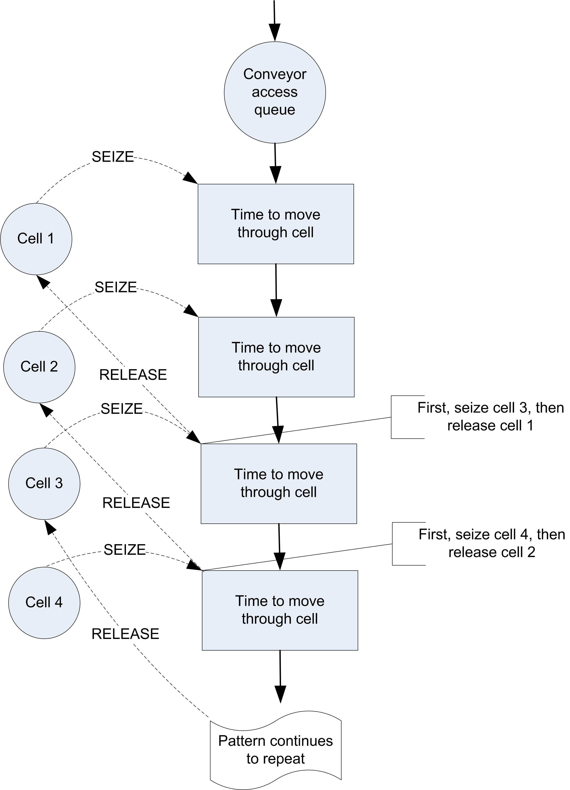
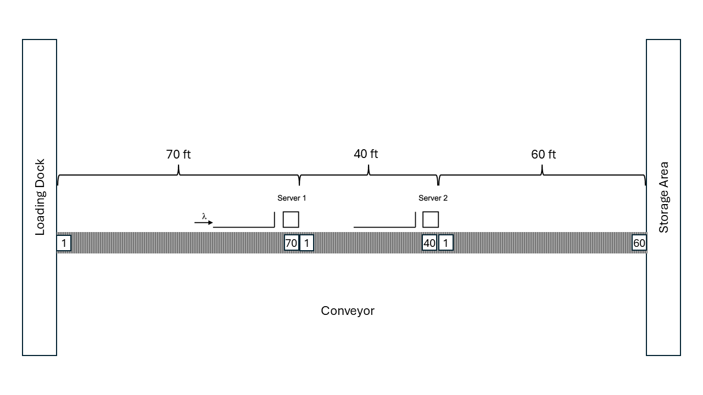
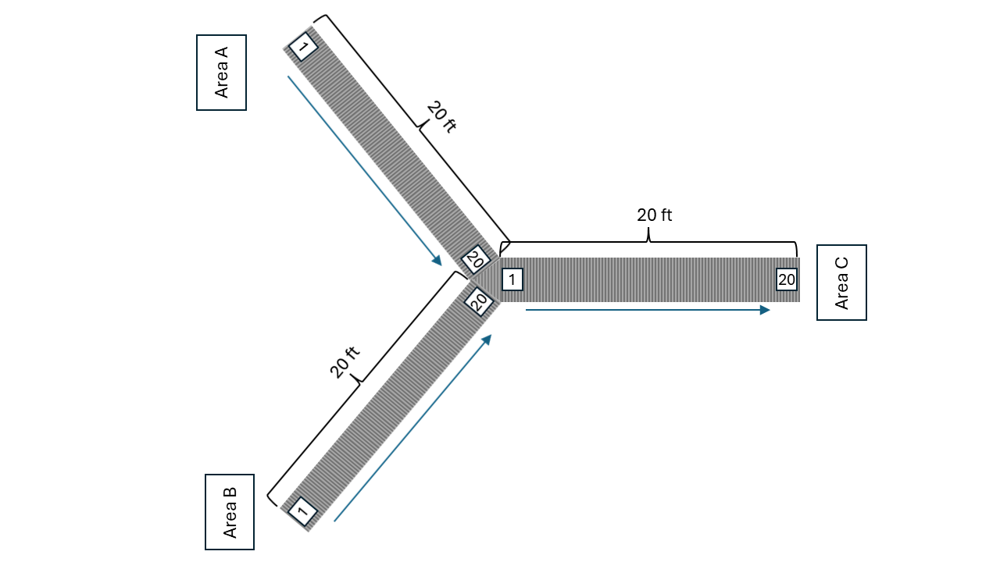

# Modeling Entity Movement {#chEntityMovement}

**[LEARNING OBJECTIVES]{.smallcaps}**

-   To be able to model constrained entity transfer with resources

-   To be able to model constrained entity transfer with movable resources

<!-- -   To be able to model systems involving conveyors -->

<!-- -   To be able to model systems involving automatic guided vehicles -->


Section \@ref(ch7RevisedJFEModelingWalking) of Chapter \@ref(ch7AdvModeling) introduced
the concept entity movement by computing a movement time from a velocity and
a known distance. The entities can be imagined as "having
little feet" that allow them to move from one location to another. That
is, the entity is able to move itself. For example, in the test and repair example of
Section \@ref(secTestAndRepair), the parts
moved between stations with a time delay. But how did they physically
move? 

One way to think about this is that there were workers always
available to move the parts between the stations. If there is *always* a
worker available, then it is as if there is an infinite supply of
workers. Thus, whenever a part must be moved from one location to another
the part uses one of the workers to make the movement. Since there is an
infinite supply of workers, this is the same as the part moving itself
(i.e. having little feet) and only the time delay for moving between the
locations is relevant. If the entity is a person (e.g. a
patient in a clinic), this analogy makes sense; however, if the
entity is a part in a manufacturing system, this analogy begins
to lose its appeal. 

In many situations, modeling transfers with a delay is perfectly
reasonable, especially if you are not interested in how the entities
moved (only that they moved). However, in many situations, the movement
of entities can become constrained by the lack of availability of the
transfer mechanism. For example, the movement of parts may require that
the parts be placed on a pallet and that a fork lift be used to move the
parts. At any point in time, there may not be enough fork lifts
available and thus the parts may have to wait for a fork lift to become
available. When the potential for waiting for transport is significant,
including the details the "how" behind the entity
transfer becomes important. In addition, since movement can be a significant part of an
operation, the design of the material movement system may be the main
focus of the simulation modeling effort.

This chapter explores the various KSL constructs available to
facilitate the modeling of the physical movement of entities between
locations. The chapter begins by describing how to model transfers using
resources. In this case, the transfer delay is accompanied by the use of
a resource. Then, Section \@ref(movableResources) presents how the KSL facilitates resource
constrained movement using resources that can move. Since not all movement is as freely moving through space as people walking or fork trucks moving, the KSL provides constructs for modeling entity
movement when the space between the locations becomes an important
aspect of the modeling. 

<!-- Section \@ref(secConveyors) indicates how conveyors can be -->
<!-- represented within and how they represent the space between stations. -->

::: {.infobox .note data-latex="{note}"}
**NOTE!**
This chapter provides a series of example Kotlin code that illustrates the use of KSL constructs for implementing the modeling of entity movement. The full source code of the examples can be found in the accompanying `KSLExamples` project associated with the [KSL repository](https://github.com/rossetti/KSL). The files for each example of this chapter can be found [here](https://github.com/rossetti/KSL/tree/main/KSLExamples/src/main/kotlin/ksl/examples/book/chapter8).
:::

<!-- Then, in Section \@ref(secAGVs), the modeling of transporters will be -->
<!-- revisited to understand how to model the situation where the -->
<!-- transporters may compete for space while moving. This will involve the -->
<!-- modeling of the space between stations as a fixed path (i.e. like a road -->
<!-- network with intersections, etc.) As usual, these concepts will be -->
<!-- illustrated with example models. -->

## Resource Constrained Transfer {#secRCT}

When an entity requires the use of something to complete the movement
between locations, the KSL's `Resource` class can be used to model the
situation. In this case, the physical (e.g. distance) aspects of
the movement are not of interest; however, the time that may be constrained
by the availability of the transport mechanism should be part of the modeling. For this situation, it is sufficient to
model the transport mechanism with a resource (or resource pool). We will illustrate
the approach by enhancing the test and repair example from Section \@ref(secTestAndRepair).

### Test and Repair with Resource Constrained Transfer {#secTestRepairRCT}

Recall that in the test and repair shop, parts follow 1 of 4 different
test plans through the shop. Each part first goes to the diagnostic
station where it determines the sequence of stations that it will visit
via an assignment of a test plan. After being diagnosed, it then
proceeds to the first station in its test plan. In the example, it was
assumed that a worker (from somewhere) was *always* available to move the
part to the next station and that the transfer time took between 2-4
minutes uniformly distributed. The diagnostic station had two diagnostic
machines and each test station had 1 testing machine. Finally, the
repair station had 3 workers that performed the necessary repairs on the
parts after testing. 

An *implicit* assumption in the model was that
there was a worker staffing each of the two diagnostic machines (1
worker for each machine) and that there was a worker assigned to each
test station. The modeling of the workers was not a key component of the
modeling because the machines cannot operate without the worker.  Thus, seizing 
the machine is essentially the same as seizing the worker.

In this section, the use of the workers to move the entities and to
staff the stations will be explicitly modeled. Assume that there are 2
workers at the diagnostic station, 1 worker per testing station, and 3
workers at the repair station. Thus, there are a total of 8 workers in
the system. For simplicity, assume that any of these 8 workers are
capable of moving parts between the stations. For example, when a part
completes its operation at the diagnostic station, any worker in the
system can carry the part to the next station. In reality, it may be
useful to assign certain workers to certain transfers (e.g. diagnostic
workers move parts to the part's first station); however, for simplicity
these issues will be ignored and any worker will be allowed to do any
transport in this example. 

This approach also requires that any worker is capable
of noticing that a part needs movement. For example, perhaps the part is
put in a basket and a light goes on indicating that the part needs
movement. When a part requires movement, it will wait for the next
available idle worker to complete the movement. In this situation, a
worker may be busy tending to a part in process at a station or the
worker may be busy moving a part between stations.
Figure \@ref(fig:ch8fig1) illustrates the new situation for the test
and repair shop involving the use of workers.

<div class="figure" style="text-align: center">

<p class="caption">(\#fig:ch8fig1)Test and repair shop with workers providing the movement</p>
</div>

Since workers are required for the processing of parts at the stations
and they might have to perform the movement of parts between stations,
the workers must be shared between two activities. Thus, when a worker
completes one activity a mechanism is needed to indicate which activity
should proceed next. A simple mechanism is to assign a priority to one
of the tasks. Thus, it seems reasonable to assume that parts waiting for
processing at a station are given priority over parts that require
movement between stations.

Figure \@ref(fig:ch8fig2) illustrates an activity diagram for
the situation where the workers are called for the transport. In the
figure, each worker is indicated individually. For example, DW1 refers
to worker 1 at the diagnostic station. In the figure, the visitation of
each part to a different test station is illustrated with a loop back to
the transfer time after the testing delay. Thus, the figure represents
all three test stations with the test station queue, testing delay, and
test machine combination. Unfortunately, this does not explicitly
indicate that a test worker is assigned to each test station
individually. In particular, the other resources marked TW2 and TW3
should technically have seize and release arrows associated with them
for the testing activity at a particular station.

<div class="figure" style="text-align: center">

<p class="caption">(\#fig:ch8fig2)Activity diagram for revised test and repair situation</p>
</div>

It should be clear from the figure that three pools of resources will be
required in this model. A resource pool should be defined for the
diagnostic workers with two members. A resource pool should be defined
for the three repair workers. Finally, a resource pool should be defined
to hold each of the workers DW1, DW2, TW1, TW2, TW3, RW1, RW2, RW3 that
are available for transporting parts. Resource pools are discussed in Section \@ref(secResourcePools).

When a part requires diagnostics,
it will seize one of the workers in the diagnostic workers pool. When a
part requires testing, it will seize the appropriate test worker for its
current station. Finally, at the repair station, the part will seize one
of the repair workers. In order to receive transport, the part will
seize from the entire pool of transport workers.

#### Implementing Test and Repair Resource Constrained Transfer {#RCTs1sb1}

Based on Figure \@ref(fig:ch8fig2), the basic process for resource
constrained transfer should be something like that shown in
the following pseudo-code.

```
SEIZE 1 diagnostic machine
SEIZE 1 diagnostic worker from diagnostic worker set
DELAY for diagnostic time
RELEASE diagnostic machine
RELEASE diagnostic worker

SEIZE 1 worker from worker set
DELAY for transfer time
RELEASE worker

SEIZE appropriate test machine
SEIZE appropriate test worker 
DELAY for testing time
RELEASE test machine
RELEASE test worker

SEIZE 1 worker from worker set
IF not at last station
	DELAY for transfer time to next test station
ELSE
	DELAY for transfer time by to Repair
ENDIF

RELEASE worker
SEIZE repair worker
DELAY for repair time
RELEASE repair worker
```

This logic assumes that each worker has been placed in resource pools. 
At the diagnostic station both the machine and a diagnostic worker
are required. When the part completes the processing at the diagnostic
station, the part seizes a worker from the overall set of workers and
routes with a transfer delay to the appropriate testing station.

After arriving at the test station, the part releases the worker that
performed the transport and proceeds with the seizing of the test
machine and worker. Again, prior to the routing to the next station, a
worker from the overall set of workers is seized. Notice also that the
worker is released after the part is transferred to the repair station.

Now let's take a look at how to modify the test and repair model from 
Section \@ref(secTestAndRepair) to use these new concepts.  The key changes 
involve the definition of the resource pools that involve the workers at
each station. Resource pools are discussed in Section \@ref(secResourcePools). 
The diagnostic workers can be defined as follows:

```kt
    private val dw1 = Resource(this, name = "DiagnosticsWorker1")
    private val dw2 = Resource(this, name = "DiagnosticsWorker2")
    private val diagnosticWorkers: ResourcePoolWithQ = ResourcePoolWithQ(
        this,
        listOf(dw1, dw2), name = "DiagnosticWorkersPool"
    )
```
First, the individual resources representing the diagnostic workers are constructed.  
Then, the resource pool to hold the diagnostic workers is created by supplying
the resources in a list. The testing workers and the repair workers can be defined in a similar manner:

```kt
    private val tw1 = ResourceWithQ(this, name = "TestWorker1")
    private val myTest1: ResourceWithQ = ResourceWithQ(this, "Test1", capacity = 1)
    private val tw2 = ResourceWithQ(this, name = "TestWorker2")
    private val myTest2: ResourceWithQ = ResourceWithQ(this, "Test2", capacity = 1)
    private val tw3 = ResourceWithQ(this, name = "TestWorker3")
    private val myTest3: ResourceWithQ = ResourceWithQ(this, "Test3", capacity = 1)

    private val rw1 = Resource(this, name = "RepairWorker1")
    private val rw2 = Resource(this, name = "RepairWorker2")
    private val rw3 = Resource(this, name = "RepairWorker3")
    private val repairWorkers: ResourcePoolWithQ = ResourcePoolWithQ(
        this,
        listOf(rw1, rw2, rw3), name = "RepairWorkersPool"
    )

    private val transportWorkers: ResourcePoolWithQ = ResourcePoolWithQ(
        this, listOf(tw1, tw2, tw3, dw1, dw2, rw1, rw2, rw3), name = "TransportWorkersPool"
    )
```

Finally, the resource pool to represent the transport workers can be defined based
on the previously declared resources (test workers, diagnostic workers, and repair workers). 
The remaining declarations for the model are the same as in Section \@ref(secTestAndRepair).

Now, the process routine needs to be updated to reflect the use of the pools and
the use of transport workers for moving the parts.

```kt
    private inner class Part : Entity() {
        val testAndRepairProcess: KSLProcess = process(isDefaultProcess = true) {
            wip.increment()
            timeStamp = time
            //every part goes to diagnostics
            val dd1 = seize(diagnosticWorkers) // worker is needed to use the machine
            val d1 = seize(myDiagnosticMachines)
            delay(diagnosticTime)
            release(d1) // release machine first, because worker is needed to release
            release(dd1)
            val twa = seize(transportWorkers, seizePriority = KSLEvent.MEDIUM_PRIORITY)
            delay(moveTime)
            release(twa)
            // determine the test plan
            val plan: List<TestPlanStep> = planList.randomElement
            // get the iterator
            val itr = plan.iterator()
            // iterate through the plan
            while (itr.hasNext()) {
                val tp = itr.next()
                // visit tester
                val tt1 = seize(tp.tester)// tester needed first to work on machine
                val t1 = seize(tp.testMachine)
                delay(tp.processTime)
                release(t1)
                release(tt1)
                val twa1 = seize(transportWorkers, seizePriority = KSLEvent.MEDIUM_PRIORITY)
                delay(moveTime)
                release(twa1)
            }
            // visit repair
            val rw = seize(repairWorkers)
            delay(repairTimes[plan]!!)
            release(rw)
            timeInSystem.value = time - timeStamp
            wip.decrement()
        }
    }
```
Notice how the workers are seized before the machine at each station.

```kt
            val dd1 = seize(diagnosticWorkers) // worker is needed to use the machine
            val d1 = seize(myDiagnosticMachines)
            delay(diagnosticTime)
            release(d1) // release machine first, because worker is needed to release
            release(dd1)
```

Also notice the specification of the use of the transport workers when moving to the next location for testing. The seize request for the transport workers has medium priority (as compared to the default high priority for normal seizing of resources.

```kt
              val twa = seize(transportWorkers, seizePriority = KSLEvent.MEDIUM_PRIORITY)
              delay(moveTime)
              release(twa1)
```

Therefore, resource constrained movement can be easily modeled by seizing the required resource for the move; however, the time to move is specified as a delay. The reader is asked to explore the effect of different resource allocation rules on system performance in the exercises.  When the modeling of the distance to move is important, then we can use movable resources.

## Constrained Transfer with Movable Resources {#movableResources}

A *movable resource* refers to one or more identical resources that
can be allocated to an entity for the purpose of moving entities
between locations. The travel time between locations depends on distance and speed.

The standard *delay()* function assumes no resource constrained transfer. As indicated in the last section, the situation of a general resource being used for the transfer can be
easily modeled. In that situation, the time of the transfer was
specified. In the case of movable resources, resource constrained transfer is
still being modeled, but in addition, the physical distance of the
transfer is explicitly modeled. In essence, rather than specifying a time to
transfer, you specify a velocity and a distance for the transfer.
From the velocity and distance associated with the transfer, the time of
the transfer can be computed. In these situations, the physical device
and its movement (with or without the entity) through the system is of
key interest within the modeling.

The modeling of a resource that moves needs to include the following aspects:

- movement of the resource (empty) to the origin location for pick up
- movement of the resource (not empty) to the destination location for drop off

Besides these two aspects, there are natural modeling enhancements that might be considered:

- time to load the entity for the pick up
- time to unload the entity for the drop off
- possible movement of the resource to a home location after drop off

The KSL models this situation using movable resources with a spatial model. 

### Spatial Models

A spatial model represents the physical space associated with the environment. For the purposes of
movable resources, a spatial model provides the distance between locations. The KSL supports
a variety of spatial models. The simplest spatial model is probably the `DistancesModel` class.
Figure \@ref(fig:spatialModelfig) illustrates the main classes for spatial models. A spatial model
holds spatial elements.  Spatial elements are objects that implement the `SpatialElementIfc` interface.

<div class="figure" style="text-align: center">

<p class="caption">(\#fig:spatialModelfig)Spatial Models</p>
</div>

The `SpatialModel` class is an abstract base class.  The key abstract concepts that need to be
implemented by sub-classes are:

```kt
    /**
     *  The default initial location.
     */
    abstract var defaultLocation: LocationIfc
    
    /**
     * Computes the distance between [fromLocation] and [toLocation] based on
     * the spatial model's distance metric
     * @return the distance between the two locations
     */
    abstract fun distance(fromLocation: LocationIfc, toLocation: LocationIfc): Double

    /**
     * Returns true if [firstLocation] is the same as [secondLocation]
     * within the underlying spatial model. This is not object reference
     * equality, but rather whether the locations within the underlying
     * spatial model can be considered spatially (equivalent) according to the model.
     * This may or may not imply that the distance between the locations is zero.
     * No assumptions about distance are implied by true.
     *
     * Requirement: The locations must be valid within the spatial model.
     */
    abstract fun compareLocations(firstLocation: LocationIfc, secondLocation: LocationIfc): Boolean
```

The KSL provides basic spatial model implementations for the following situations.

- Distances - The distance between locations is provided based on an origin-destination matrix.
- Great Circle - A [great circle](https://en.wikipedia.org/wiki/Great-circle_distance) spatial model represents the distance between two coordinates on the earth based on latitude and longitude.  It provides an approximate distance of travelling along the great circle between the coordinates. The model implemented within the KSL allows for the adjustment of the distance based on circuity factor. The circuity factor will adjust the distance based on the mode of transport road or rail.
- Euclidean 2D Plane - The distance is based on computing the distance between two points in the Euclidean 2D plane.
- Rectangular Grid - The 2D plane is divided into a grid with the upper left most corner point representing (0,0). The grid is specified based on the width and height divided into a number of rows and columns. This facilitates the moving between the cells of the grid.

The main abstraction for a spatial model is computing the distance between two locations.

<div class="figure" style="text-align: center">

<p class="caption">(\#fig:Locationfig)Location Interface</p>
</div>

A location has a name and an identity. In addition, a location is associated with a spatial model. From the spatial model, a location can compute the distance to other locations within the spatial model. Spatial models are responsible for creating locations and for computing the distance between locations.  A spatial model is responsible for defining what constitutes a location. For example, a great circle spatial model uses GPS coordinates to define locations. 

As previously mentioned, a basic spatial model is a distances model, which is implemented via the `DistancesModel` class. 

<div class="figure" style="text-align: center">

<p class="caption">(\#fig:Distancesfig)Distances Model</p>
</div>

In essence, a distance model is a matrix that holds the distances between origins and destinations.  Notice from Figure \@ref(fig:Distancesfig) that the inner class `Location` implements the `LocationIfc` interface for the distance model.  The user is responsible for providing the data associated with the locations. The specification can be in the form of matrix or via the data class `DistanceData` or individually specified via the `addDistance()` function.  The following code illustrates the concepts.

```kt
    private val dm = DistancesModel()
    private val enter = dm.Location("Enter")
    private val station1 = dm.Location("Station1")
    private val station2 = dm.Location("Station2")
    private val exit = dm.Location("Exit")

    init {
        // distance is in feet
        dm.addDistance(enter, station1, 60.0, symmetric = true)
        dm.addDistance(station1, station2, 30.0, symmetric = true)
        dm.addDistance(station2, exit, 60.0, symmetric = true)
        dm.addDistance(station2, enter, 90.0, symmetric = true)
        dm.addDistance(exit, station1, 90.0, symmetric = true)
        dm.addDistance(exit, enter, 150.0, symmetric = true)
        dm.defaultVelocity = myWalkingSpeedRV
        spatialModel = dm
    }
```
In the code, a distances model is created, used to define locations, and then used to specify the distance between locations.  As shown in Figure \@ref(fig:spatialModelfig), a distances model also includes a default velocity because it is a sub-class of the `SpatialModel` class.  Now we are ready to discuss movable resources. 

### Movable Resources {#secMovableResources}

As mentioned, a movable resource is a resource that moves.  The class `MovableResource` shown in Figure \@ref(fig:MovableRfig) is a sub-class of the `Resource` class, while implementing the `SpatialElementIfc` and `VelocityIfc` interfaces.  A spatial element is something that can be within a spatial model.  Notice that the `SpatialElementIfc` interface uses locations to specify the initial, previous, and current location of the spatial element. 

<div class="figure" style="text-align: center">

<p class="caption">(\#fig:MovableRfig)Movable Resource</p>
</div>

To use movable resources within a process model, we need to define some new suspending functions and discuss how entities keep track of their location. The `Entity` class implements the `SpatialElementIfc` interface.  Some of the key properties that assist with the use of entities within a spatial model include:

- `initialLocation` The location of the entity when it is created specified as a `LocationIfc` interface instance.
- `previousLocation` The previous location of the entity after it has moved to its current location as specified as a `LocationIfc` interface instance.
- `currentLocation` The current location of the entity within the spatial model as specified as a `LocationIfc` interface instance.
- `isMoving` A boolean property that indicates if the entity is experiencing a movement.
- `velocity` A property that implements the `GetValueIfc` interface that reports the velocity to use when the entity is moving between locations.

To have entities use movable resources within a process, we need to introduce new suspending functions.  To move an entity from one location to another (without a resource), we can use the following variations of the `move()` function:

- `move(fromLoc: LocationIfc, toLoc: Location, velocity: Double, movePriority: Int, suspensionName: String?)`
- `move(fromLoc: LocationIfc, toLoc: Location, velocity: GetValueIfc, movePriority: Int, suspensionName: String?)`

To move something that implements the `SpatialElementIfc` interface use the following `move()` function. Note that the entity experiences the delay while the spatial element is moved to the supplied location.

- `move(spatialElement: SpatialElementIfc, toLoc: Location, velocity: Double, movePriority: Int, suspensionName: String?)`

This function uses the spatial element's current location as the origin. Since movable resources are also spatial elements, we can move them.  Again, the entity experiences the time delay associated with the movement of the resource to the supplied location.

- `move(movableResource: MovableResource, toLoc: Location, velocity: Double, movePriority: Int, suspensionName: String?)`
- `move(movableResourceWithQ: MovableResourceWithQ, toLoc: Location, velocity: Double, movePriority: Int, suspensionName: String?)`

In addition, we can cause both the entity and a spatial model to move together using variations of the `moveWith()` function.

- `moveWith(spatialElement: SpatialElementIfc, toLoc: Location, velocity: Double, movePriority: Int, suspensionName: String?)`
- `moveWith(movableResource: MovableResource, toLoc: Location, velocity: Double, movePriority: Int, suspensionName: String?)`
- `moveWith(movableResourceWithQ: MovableResourceWithQ, toLoc: Location, velocity: Double, movePriority: Int, suspensionName: String?)`

In order to use these functions, the entity and the spatial element must be at the *same* location.  Thus, the standard approach to using a movable resource to move an entity involves first seizing the resource, then moving the resource to the entity's current location, and finally moving with the resource to the destination. Here is a simple pattern:

```kt
val a = seize(movableResource)
move(movableResource, entity.currentLocation, emptyVelocity, emptyMovePriority)
delay(loadingDelay, loadingPriority)
moveWith(movableResource, toLoc, transportVelocity, transportPriority)
delay(unLoadingDelay, unLoadingPriority)
release(a)
```

In fact, this pattern is so common, there is a suspending function that encapsulates it into one function.

```kt
   /**
     *  Causes transport of the entity via the movable resource from the entity's current location to the specified location at
     *  the supplied velocities.
     *  If not specified, the default velocity of the movable resource is used for the movement.
     *  @param movableResource, the spatial element that will be moved
     *  @param toLoc the location to which the entity is supposed to move
     *  @param emptyVelocity the velocity associated with the movement to the entity's location
     *  @param transportVelocity the velocity associated with the movement to the desired location
     *  @param transportQ the queue that the entity waits in if the resource is busy
     *  @param requestPriority, a priority can be used to determine the order of events for
     *  requests for transport
     *  @param emptyMovePriority, since the move is scheduled, a priority can be used to determine the order of events for
     *  moves that might be scheduled to complete at the same time.
     *  @param transportPriority, since the move is scheduled, a priority can be used to determine the order of events for
     *  moves that might be scheduled to complete at the same time.
     */
    suspend fun transportWith(
        movableResource: MovableResource,
        toLoc: LocationIfc,
        emptyVelocity: Double = movableResource.velocity.value,
        transportVelocity: Double = movableResource.velocity.value,
        transportQ: RequestQ,
        loadingDelay: GetValueIfc = ConstantRV.ZERO,
        unLoadingDelay: GetValueIfc = ConstantRV.ZERO,
        requestPriority: Int = TRANSPORT_REQUEST_PRIORITY,
        emptyMovePriority: Int = MOVE_PRIORITY,
        loadingPriority: Int = DELAY_PRIORITY,
        transportPriority: Int = MOVE_PRIORITY,
        unLoadingPriority: Int = DELAY_PRIORITY
    )
```

::: {.infobox .note data-latex="{note}"}
**NOTE!**
The `transportWith()` function is meant to be a convenience function to cover a standard pattern of usage; however, if your situation varies from the standard pattern, then you can always use the basic `move()` and `moveWith()` functions to model a wide variety of situations.
:::

We are now ready to illustrate entity movement and movement using movable resources. 

### Tandem Queue Model With Movement {#secTQMWM}

Recall the tandem queue model in Example \@ref(exm:exTandemQ).  For this section, we are going to enhance the example with movement. In this situation, parts will enter the system at a loading dock that is 60 feet from the station staffed by the first worker.  For simplicity, let's assume that there are always plenty of workers available to move the part from the loading dock to the first station. After the part completes processing at station 1, it is moved to station 2. Again, assume that there are plenty of workers available to move the part from station 1 to station 2.  The distance from station 1 to station 2 is 30 feet.  After completing processing at station 2, the part is moved to a storage area, where it exits the system.  The distance from station 2 to the storage area is 60 feet. We can assume that the walking speed of the workers that move the parts is a triangular distributed random variable with a minimum of 88, a mode of 176, and a maximum of 264, all in feet per minute.

<div class="figure" style="text-align: center">

<p class="caption">(\#fig:Ch7TandemQ2)Tandem Queue with Distances</p>
</div>

To model this situation, we will use the distances spatial model. To implement this situation, we will: 

- Use the `Location` class within the `DistancesModel` to define locations
- Use the `addDistance()` function to specify the distance between two locations
- Use the `spatialModel` property to specify the spatial model used by the `ProcessModel`

Let's start by defining the distances via the `DistancesModel` class. In the following code, the `DistancesModel` instance is created 
and then used to create the four locations within the spatial model's context.  Then, the `init` block is used to add the distance
data to the model.

```kt
class TandemQueueWithUnConstrainedMovement(
  parent: ModelElement,
  name: String? = null
) : ProcessModel(parent, name) {

    // velocity is in feet/min
    private val myWalkingSpeedRV = TriangularRV(88.0, 176.0, 264.0)
    private val dm = DistancesModel()
    private val enter = dm.Location("Enter")
    private val station1 = dm.Location("Station1")
    private val station2 = dm.Location("Station2")
    private val exit = dm.Location("Exit")

    init {
        // distance is in feet
        dm.addDistance(enter, station1, 60.0, symmetric = true)
        dm.addDistance(station1, station2, 30.0, symmetric = true)
        dm.addDistance(station2, exit, 60.0, symmetric = true)
        dm.defaultVelocity = myWalkingSpeedRV
        spatialModel = dm
    }
```

Notice that the distances are assumed to be symmetric.  That is the distance from the `enter` location to the `station1` location is the same (60 feet) in both directions. The line `dm.defaultVelocity = myWalkingSpeedRV` indicates that whenever a velocity is needed for a movement, the walking speed distribution is used. Finally, the line `spatialModel = dm` causes the process model to use the distances model for its spatial model.  This ensures that the entities created within the process model will use the distances model as their spatial model context. Once distances have been defined the tandem queue system movement can be easily handled within the process description.

```kt
    private inner class Customer : Entity() {
        val tandemQProcess: KSLProcess = process(isDefaultProcess = true) {
            currentLocation = enter
            wip.increment()
            timeStamp = time
            moveTo(station1)
            use(worker1, delayDuration = st1)
            moveTo(station2)
            use(worker2, delayDuration = st2)
            moveTo(exit)
            timeInSystem.value = time - timeStamp
            wip.decrement()
        }
    }
```
Notice the setting of the entity's `currentLocation` in the first line of the process. This line ensures that the entity is located at the `enter` location when it starts the process.  The current location property will be updated by the `moveTo()` functions so that after the movement, the entity's location is the destination of the movement.  The results of running the model with the additional movement indicate that the movement affects the time spent in the system.

```
Name                                 Count 	      Average 	   Half-Width 
--------------------------------------------------------------------------
worker1:InstantaneousUtil             30 	       0.6982 	       0.0023 
worker1:NumBusyUnits                  30 	       0.6982 	       0.0023 
worker1:ScheduledUtil                 30 	       0.6982 	       0.0023 
worker1:WIP                           30 	       2.2966 	       0.0388 
worker1:Q:NumInQ                      30 	       1.5983 	       0.0371 
worker1:Q:TimeInQ                     30 	       1.6001 	       0.0356 
worker2:InstantaneousUtil             30 	       0.8984 	       0.0037 
worker2:NumBusyUnits                  30 	       0.8984 	       0.0037 
worker2:ScheduledUtil                 30 	       0.8984 	       0.0037 
worker2:WIP                           30 	       8.5321 	       0.4317 
worker2:Q:NumInQ                      30 	       7.6337 	       0.4289 
worker2:Q:TimeInQ                     30 	       7.6378 	       0.4190 
TandemQModel:NumInSystem              30 	      11.7191 	       0.4414 
TandemQModel:TimeInSystem             30 	      11.7288 	       0.4250 
worker1:SeizeCount                    30 	   14981.8667 	      40.6211 
worker2:SeizeCount                    30 	   14979.4667 	      41.3926 
-------------------------------------------------------------------------
```

In the previous example, we assumed that there was an unlimited number of workers available to move the parts. This results in only a simple delay time to move from one location to another. Now, let's make the more realistic assumption that in order to move a finite number of workers are available such that when a part needs to move between the stations one of the workers dedicated to the transport task must be available to move the part; otherwise the part must wait until a transport worker is available. For simplicity, we are going to assume that their are 3 transport workers, with one dedicated to moving parts to station 1, another dedicated to moving parts from station 1 to station 2, and the third worker dedicated to moving parts from the third workstation to storage. We are also going to assume that the transport worker stays at the drop off location until requested for its next movement.

Because the transport workers stay at the drop off location, we may need to consider two-way travel. Also, we will need to consider where the transport workers are located at the start of the simulation.  We are going to assume that the transport workers all start at the `enter` location. These assumptions will require an update to the distances. Why?  Because we now need to account for the distance to move empty.

```kt
    private val myWalkingSpeedRV = TriangularRV(88.0, 176.0, 264.0)
    private val dm = DistancesModel()
    private val enter = dm.Location("Enter")
    private val station1 = dm.Location("Station1")
    private val station2 = dm.Location("Station2")
    private val exit = dm.Location("Exit")

    init {
        // distance is in feet
        dm.addDistance(enter, station1, 60.0, symmetric = true)
        dm.addDistance(station1, station2, 30.0, symmetric = true)
        dm.addDistance(station2, exit, 60.0, symmetric = true)
        dm.addDistance(station2, enter, 90.0, symmetric = true)
        dm.addDistance(exit, station1, 90.0, symmetric = true)
        dm.addDistance(exit, enter, 150.0, symmetric = true)
        dm.defaultVelocity = myWalkingSpeedRV
        spatialModel = dm
    }
```

Notice that we need to specify the distance from the `station2` location to the `enter` location.  This is because the movable resource will be at the `enter` location at the start of the simulation and will need to move to the `station2` location for a pick up.  This movement (as well as others) occur because the resource must move to the pick up location (empty) and because the resource stays at the location of the drop off.  Now, we can define the movable resources.

```kt
   private val mover1: MovableResourceWithQ = MovableResourceWithQ(this, enter, myWalkingSpeedRV, "Mover1")
   private val mover2: MovableResourceWithQ = MovableResourceWithQ(this, enter, myWalkingSpeedRV, "Mover2")
   private val mover3: MovableResourceWithQ = MovableResourceWithQ(this, enter, myWalkingSpeedRV, "Mover3")
```

Notice that we define the resources to have a queue. This queue will hold requests for the resource when more than one part requires a move. The process description can now be updated to use the movable resources.  The following code explicitly seizes the movable resource, moves the resource to the location of the part, and then moves with the resource before then releasing the resource. 

```kt
    private inner class Customer : Entity() {
        val tandemQProcess: KSLProcess = process(isDefaultProcess = true) {
            currentLocation = enter
            wip.increment()
            timeStamp = time
            val a1 = seize(mover1)
            move(mover1, toLoc = enter)
            moveWith(mover1, toLoc = station1)
            release(a1)
            use(worker1, delayDuration = st1)
            val a2 = seize(mover2)
            move(mover2, toLoc = station1)
            moveWith(mover2, toLoc = station2)
            release(a2)
            use(worker2, delayDuration = st2)
            val a3 = seize(mover3)
            move(mover3, toLoc = station2)
            moveWith(mover3, toLoc = exit)
            release(a3)
            timeInSystem.value = time - timeStamp
            wip.decrement()
        }
    }
```

The following code shortens the process by using the `transportWith()` and `use()` functions. 

```kt
    private inner class Customer : Entity() {
        val tandemQProcess: KSLProcess = process(isDefaultProcess = true) {
            currentLocation = enter
            wip.increment()
            timeStamp = time
            transportWith(mover1, station1)
            use(worker1, delayDuration = st1)
            transportWith(mover2, station2)
            use(worker2, delayDuration = st2)
            transportWith(mover3, exit)
            timeInSystem.value = time - timeStamp
            wip.decrement()
        }
    }
```

Suppose that there is a time required to load and unload the part.  Let's assume that the
loading time is uniformly distributed between 0.5 and 0.8 minutes and the unloading time is
uniformly distributed between 0.25 and 0.5 minutes. In addition, suppose that the workers the 
perform the movement are not dedicated to a particular station, but instead, they are in a pool
of workers that may perform the pick up and delivery of the parts. 

For this situation, we can use an instance of the `MovableResourcePoolWithQ` class. To define the pool
the following code can be used.

```kt
    private val mover1 = MovableResource(this, enter, myWalkingSpeedRV, "Mover1")
    private val mover2 = MovableResource(this, enter, myWalkingSpeedRV, "Mover2")
    private val mover3 = MovableResource(this, enter, myWalkingSpeedRV, "Mover3")
    private val moverList = listOf(mover1, mover2, mover3)
    private val movers = MovableResourcePoolWithQ(this, moverList, myWalkingSpeedRV, name = "Movers")
```

By using the `transportWith()` function
we can easily add the loading and unloading time delays as follows:

```kt
    private val myLoadingTime = RandomVariable(this, UniformRV(0.5, 0.8))
    val loadingTimeRV: RandomSourceCIfc
        get() = myLoadingTime
    private val myUnLoadingTime = RandomVariable(this, UniformRV(0.25, 0.5))
    val unloadingTimeRV: RandomSourceCIfc
        get() = myUnLoadingTime
        
    private inner class Customer : Entity() {
        val tandemQProcess: KSLProcess = process(isDefaultProcess = true) {
            currentLocation = enter
            wip.increment()
            timeStamp = time
            transportWith(movers, station1, loadingDelay = myLoadingTime, unLoadingDelay = myUnLoadingTime)
            use(worker1, delayDuration = st1)
            transportWith(movers, station2, loadingDelay = myLoadingTime, unLoadingDelay = myUnLoadingTime)
            use(worker2, delayDuration = st2)
            transportWith(movers, exit, loadingDelay = myLoadingTime, unLoadingDelay = myUnLoadingTime)
            timeInSystem.value = time - timeStamp
            wip.decrement()
        }
    }
```

A pool of movable resources is essentially a "motor pool" or fleet.  An importance aspect of modeling a pool of movable resources is how to dispatch the next movable resource.  The concept of pooled resources was discussed in Section \@ref(secResourcePools). In that section, the need for a resource selection rule was briefly mentioned.  Within a spatial context, how the next resource is selected to respond to a request may become important. Recall that a resource selection rule determines the list of resources that have enough capacity available to meet the request.  In the context of movable resources, the requested capacity is always one unit. Thus, the resource selection rule returns a list of available resources (not seized). Then, from this list a resource must be selected for allocation.  The construction of the list of movable resources for possible allocation is governed by the `MovableResourceSelectionRuleIfc` interface.

```kt
/**
 * Provides for a method to select movable resources from a list such that
 * the returned list will contain movable resources that can satisfy the request
 * or the list will be empty.
 */
fun interface MovableResourceSelectionRuleIfc {
    /**
     * @param list of resources to consider selecting from
     * @return the selected list of resources. It may be empty
     */
    fun selectMovableResources(list: List<MovableResource>): MutableList<MovableResource>
}
```

By default, the movable resource selection rule is provided by the `MovableResourceSelectionRule` class, which simply returns all available units for possible allocation. Since the allocation rules selects from this list, it is likely that the default selection rule will work for the vast majority of situations.

Within a spatial context, the resource selected for allocation may need additional consideration.  For example, it may make sense to allocate the resource that is closest to the requesting entity. The KSL supports a variety of movable resource allocation rules via the `MovableResourceAllocationRuleIfc` interface.

```kt
/**
 *  Function to determine which movable resource should be allocated to
 *  a request. The function provides the location of the request to allow
 *  distance based criteria to be used.
 */
fun interface MovableResourceAllocationRuleIfc {

    /** The method assumes that the provided list of resources has
     *  enough units available to satisfy the needs of the request.
     *
     * @param requestLocation the location associated with the request. This information can be
     * used to determine the allocation based on distances.
     * @param resourceList list of resources to be allocated from
     * @return the amount to allocate from each resource as a map
     */
    fun selectMovableResourceForAllocation(
        requestLocation: LocationIfc,
        resourceList: MutableList<MovableResource>
    ): MovableResource
}
```

The KSL provides the following movable resource allocation rules.

- `ClosestMovableResourceAllocationRule` - This rule determines which of the available movable resources is closest to the request's location.  This is the default rule.
- `FurthestMovableResourceAllocationRule` - This rule determines which of the available movable resources is furthers from the request's location.  This rule may be useful to return movable resources from the outskirts of the spatial model to more central activities.
- `RandomMovableResourceAllocationRule` - This rule randomly selects from the available movable resources. This rule may be useful for a fairer distribution of activity across the resources.
- `MovableResourceAllocateInOrderListedRule` This rule returns the first available resource from the selected resources.
- `MovableResourceAllocationRule` - This rule allows a user to determine the order of allocation based on a user defined comparator. The following comparison based rules are based on this approach.
  - `LeastUtilizedMovableResourceAllocationRule` - Allocates to the movable resource that is currently the least utilized (based on the utilization statistics). This can be useful if fairness is a criteria.
  - `LeastSeizedMovableResourceAllocationRule` - Allocates to the movable resource that has been seized (allocated) the least. This can be useful if fairness is a criteria.

The reader will be asked to explore the use of these different rules within the exercises.

## Modeling the Test and Repair System with Movable Resources {#secTestAndRepairMovableResources}

The results of the constrained resource analysis in Section \@ref(secTestRepairRCT) indicated that modeling
constrained transfer for the parts in the test and repair system may
have a significant effect on the system's ability to meet the contract
requirements. This may be due to having the workers share the roles of
tending the machines and transporting the parts. The following example
investigates whether or not a set of dedicated workers would make sense
for this system. In particular, the number of workers to dedicate to the
transport task needs to be determined. Since there is a lot of walking
involved, the model needs to be more precise in the physical modeling of
the situation. This could also allow different layout configurations to
be simulated if the relocation of the stations would make a difference
in the efficiency of the system.

To model this situation using movable resources, the distance between the
stations and a way to model the velocity of transport are required.
Since the workers have a natural variability in the speed of their
walking, a model for human walking speed is needed. Based on some time
study data, the velocity of a worker walking in the facility has been
determined to be distributed according to a triangular distribution with
a minimum of 22.86, a mode of 45.72, and a maximum of 52.5, all in
meters per minute. Since this distribution will be used in many
locations in the model, a random variable should be defined to represent the velocity.

Based on measuring the distance between the stations, the approximate
distance between the stations has been determined as given in
Table \@ref(tab:TRDistances).
Recall that both the loaded and unloaded distances for the movement
should be specified. For example, even though no parts are routed from
repair to diagnostics, the distance from repair to diagnostics should be
given because the worker (transporter) may be at the repair station when
something needs to be moved from the diagnostic station. Thus, the
worker must walk from the repair station to the diagnostic station
(unloaded) in order to pick up the part. Notice also that the distances
do not have to be symmetric (i.e. the distance from test 1 to test 2
does not have to be the same as the distance from test 2 to test 1).

::: {#tab:TRDistances}
    Station     Diagnostics    Test 1   Test 2   Test 3   Repair
  ------------- ------------- -------- -------- -------- ---------
   Diagnostics     --          40       70       90       100
    Test 1         43          --       10       60       80
    Test 2         70          15       --       65       20
    Test 3         90          80       60       --       25
    Repair         110         85       25       30       --
  ------------- ------------- -------- -------- -------- ---------

  Table: (\#tab:TRDistances) Transporter distances between stations
:::

Starting with the finished model from Example \@ref(exm:exTestAndRepair) of Section \@ref(secTestAndRepair) we can make small changes in order to utilize movable resources. The first step is to define the locations and walking speed for the transport workers.

```kt
    // velocity is in meters/min
    private val myWalkingSpeedRV = RandomVariable(this, TriangularRV(22.86, 45.72, 52.5))
    private val dm = DistancesModel()
    private val diagnosticStation = dm.Location("DiagnosticStation")
    private val testStation1 = dm.Location("TestStation1")
    private val testStation2 = dm.Location("TestStation2")
    private val testStation3 = dm.Location("TestStation3")
    private val repairStation = dm.Location("RepairStation")
```

Since the transport workers need to walk without carrying a part, we need to define the distances to and from the locations as shown in the following code.  Notice that the walking speed is used for the default velocity of movement within the distance model.

```kt
    init {
        // distance is in meters
        dm.addDistance(diagnosticStation, testStation1, 40.0)
        dm.addDistance(diagnosticStation, testStation2, 70.0)
        dm.addDistance(diagnosticStation, testStation3, 90.0)
        dm.addDistance(diagnosticStation, repairStation, 100.0)

        dm.addDistance(testStation1, diagnosticStation, 43.0)
        dm.addDistance(testStation1, testStation2, 10.0)
        dm.addDistance(testStation1, testStation3, 60.0)
        dm.addDistance(testStation1, repairStation, 80.0)

        dm.addDistance(testStation2, diagnosticStation, 70.0)
        dm.addDistance(testStation2, testStation1, 15.0)
        dm.addDistance(testStation2, testStation3, 65.0)
        dm.addDistance(testStation2, repairStation, 20.0)

        dm.addDistance(testStation3, diagnosticStation, 90.0)
        dm.addDistance(testStation3, testStation1, 80.0)
        dm.addDistance(testStation3, testStation2, 60.0)
        dm.addDistance(testStation3, repairStation, 25.0)

        dm.addDistance(repairStation, diagnosticStation, 110.0)
        dm.addDistance(repairStation, testStation1, 85.0)
        dm.addDistance(repairStation, testStation2, 25.0)
        dm.addDistance(repairStation, testStation3, 30.0)

        dm.defaultVelocity = myWalkingSpeedRV
        spatialModel = dm
    }
```

Now, we can define the transport workers as a pool of movable resources.  We will specify that there will be three workers dedicated to the transport task. In this case, the workers will start
active at the diagnostics station.  For the purposes of this example, we will rely on the default movable resource selection and allocation rules.

```kt
    private val transportWorkers = MovableResourcePoolWithQ(
        this, 3, diagnosticStation, myWalkingSpeedRV, name = "TransportWorkerPool")
```

Since this situation involves travelling to and from the stations, we need to make a slight change to the test plan definitions given in Example \@ref(exm:exTestAndRepair) of Section \@ref(secTestAndRepair).  We need to add the destination location to the test plan sequences. 

```kt
    // define steps to represent a plan, include location information
    inner class TestPlanStep(
        val testMachine: ResourceWithQ,
        val processTime: RandomIfc,
        val testStation: LocationIfc)

    // make all the plans
    private val testPlan1 = listOf(
        TestPlanStep(myTest2, t11, testStation2), TestPlanStep(myTest3, t12, testStation3),
        TestPlanStep(myTest2, t13, testStation2), TestPlanStep(myTest1, t14, testStation1)
    )
```

Notice that the property `testStation` has been added to the `TestPlanStep` class. This property will hold the destination information for transport from the entity's current location to its destination. The code illustrates how the information for test plan 1 has been updated.  Recall from Example \@ref(exm:exTestAndRepair) that the test machine visitation sequence for test plan 1 is $2-3-2-1$. This information has been added to the test plan steps for test plan 1. The other test plans are updated in a similar manner. The process description for the test and repair activities becomes straightforward.

```kt
    private inner class Part : Entity() {
        val plan: List<TestPlanStep> = planList.randomElement

        val testAndRepairProcess: KSLProcess = process(isDefaultProcess = true) {
            currentLocation = diagnosticStation
            wip.increment()
            timeStamp = time
            //every part goes to diagnostics
            use(diagnosticWorkers, delayDuration = diagnosticTime)
            // get the iterator
            val itr = plan.iterator()
            // iterate through the plan
            while (itr.hasNext()) {
                val tp = itr.next()
                // goto the location
                transportWith(transportWorkers, toLoc = tp.testStation)
                // use the tester
                use(tp.testMachine, delayDuration = tp.processTime)
            }
            // visit repair
            transportWith(transportWorkers, toLoc = repairStation)
            use(repairWorkers, delayDuration = repairTimes[plan]!! )
            timeInSystem.value = time - timeStamp
            wip.decrement()
        }
    }
```

Notice that the property `plan` is randomly determined when the part is created. The `testAndRepairProcess` has the entity starting at the diagnostic station by setting the part's `currenLocation` property to the diagnostic station location. Then, the part uses the diagnostic workers. Because the test plan has the destination of the next station, the transport is placed at the top of the iteration through the test plan sequence. The `transportWith()` function is used to transport the part using the `transportWorkers` movable resource pool. Then, the appropriate test machine is used for the appropriate processing time for the test plan step. After visiting all the test machines on its sequence the part then transports to the repair station, where it uses the repair workers. 

The following provides the results from running the model under the same settings as in Example \@ref(exm:exTestAndRepair).

**Statistical Summary Report**

|Name| Count| Average| Half-Width|
|:---:| :---:| :---:| :---:|
|DiagnosticWorkers:InstantaneousUtil| 10| 0.75| 0.005|
|DiagnosticWorkers:NumBusyUnits| 10| 1.5| 0.011|
|DiagnosticWorkers:ScheduledUtil| 10| 0.75| 0.005|
|DiagnosticWorkers:Q:NumInQ| 10| 1.928| 0.107|
|DiagnosticWorkers:Q:TimeInQ| 10| 38.512| 2.167|
|DiagnosticWorkers:WIP| 10| 3.428| 0.114|
|Test1:InstantaneousUtil| 10| 0.857| 0.007|
|Test1:NumBusyUnits| 10| 0.857| 0.007|
|Test1:ScheduledUtil| 10| 0.857| 0.007|
|Test1:Q:NumInQ| 10| 3.232| 0.266|
|Test1:Q:TimeInQ| 10| 57.414| 4.459|
|Test1:WIP| 10| 4.088| 0.271|
|Test2:InstantaneousUtil| 10| 0.776| 0.008|
|Test2:NumBusyUnits| 10| 0.776| 0.008|
|Test2:ScheduledUtil| 10| 0.776| 0.008|
|Test2:Q:NumInQ| 10| 1.584| 0.138|
|Test2:Q:TimeInQ| 10| 42.121| 3.445|
|Test2:WIP| 10| 2.36| 0.142|
|Test3:InstantaneousUtil| 10| 0.862| 0.005|
|Test3:NumBusyUnits| 10| 0.862| 0.005|
|Test3:ScheduledUtil| 10| 0.862| 0.005|
|Test3:Q:NumInQ| 10| 2.587| 0.158|
|Test3:Q:TimeInQ| 10| 51.666| 3.03|
|Test3:WIP| 10| 3.449| 0.16|
|RepairWorkers:InstantaneousUtil| 10| 0.868| 0.005|
|RepairWorkers:NumBusyUnits| 10| 2.605| 0.014|
|RepairWorkers:ScheduledUtil| 10| 0.868| 0.005|
|RepairWorkers:Q:NumInQ| 10| 1.294| 0.081|
|RepairWorkers:Q:TimeInQ| 10| 25.864| 1.559|
|RepairWorkers:WIP| 10| 3.899| 0.09|
|TransportWorkerPool:R1:InstantaneousUtil| 10| 0.224| 0.002|
|TransportWorkerPool:R1:NumBusyUnits| 10| 0.224| 0.002|
|TransportWorkerPool:R1:ScheduledUtil| 10| 0.224| 0.002|
|TransportWorkerPool:R1:FracTimeMoving| 10| 0.224| 0.002|
|TransportWorkerPool:R1:FracTimeTransporting| 10| 0.147| 0.001|
|TransportWorkerPool:R1:FracTimeMovingEmpty| 10| 0.076| 0.001|
|TransportWorkerPool:R2:InstantaneousUtil| 10| 0.158| 0.001|
|TransportWorkerPool:R2:NumBusyUnits| 10| 0.158| 0.001|
|TransportWorkerPool:R2:ScheduledUtil| 10| 0.158| 0.001|
|TransportWorkerPool:R2:FracTimeMoving| 10| 0.158| 0.001|
|TransportWorkerPool:R2:FracTimeTransporting| 10| 0.104| 0.001|
|TransportWorkerPool:R2:FracTimeMovingEmpty| 10| 0.054| 0|
|TransportWorkerPool:R3:InstantaneousUtil| 10| 0.085| 0.001|
|TransportWorkerPool:R3:NumBusyUnits| 10| 0.085| 0.001|
|TransportWorkerPool:R3:ScheduledUtil| 10| 0.085| 0.001|
|TransportWorkerPool:R3:FracTimeMoving| 10| 0.085| 0.001|
|TransportWorkerPool:R3:FracTimeTransporting| 10| 0.057| 0.001|
|TransportWorkerPool:R3:FracTimeMovingEmpty| 10| 0.029| 0.001|
|TransportWorkerPool:NumBusy| 10| 0.467| 0.003|
|TransportWorkerPool:FractionBusy| 10| 0.156| 0.001|
|TransportWorkerPool:Q:NumInQ| 10| 0.001| 0|
|TransportWorkerPool:Q:TimeInQ| 10| 0.005| 0|
|TestAndRepairWithMovableResources:NumInSystem| 10| 17.692| 0.363|
|TestAndRepairWithMovableResources:TimeInSystem| 10| 353.457| 5.965|
|ProbWithinLimit| 10| 0.811| 0.015|
|DiagnosticWorkers:SeizeCount| 10| 12498.4| 75.757|
|Test1:SeizeCount| 10| 14038.7| 112.996|
|Test2:SeizeCount| 10| 9377.7| 97.686|
|Test3:SeizeCount| 10| 12491| 74.153|
|RepairWorkers:SeizeCount| 10| 12485.3| 73.123|
|TransportWorkerPool:R1:SeizeCount| 10| 23121.6| 165.847|
|TransportWorkerPool:R2:SeizeCount| 10| 16375.3| 133.58|
|TransportWorkerPool:R3:SeizeCount| 10| 8905.1| 137.667|

As can be seen in the results, the utilization of the three
transporters is very low (0.156). Less than three workers are probably needed for
the transport task. The reader is asked to explore this issue as an exercise. These results match very closely with the results based on a commercial simulation package discussed in this [book.](https://rossetti.github.io/RossettiArenaBook/ch7-sec-transporters.html#ch7:TRTransporters).  


## Modeling Systems with Conveyors {#secConveyors}

A conveyor is a track, belt, or some other device that provides movement
over a fixed path. Typically, conveyors are used to transport items that
have high volumes over short to medium range distances. The speeds of
conveyance typically range from 20-80 feet per minute to as fast as 500
feet per minute. Conveyors can be gravity based or powered. The modeling
of conveyors can be roughly classified as follows:

Accumulating

:   Items on the conveyor continue to move forward when there is a
    blockage on the conveyor.

Non-accumulating

:   Items on the conveyor stop when the conveyor stops

Fixed spacing

:   Items on the conveyor have a fixed space between them or the items
    ride in a bucket or bin.

Random spacing

:   Items are placed on the conveyor in no particular position and take
    up space on the conveyor.

You have experienced conveyors in some form. For example, the belt
conveyor at a grocery store is like an accumulating conveyor. An
escalator is like a fixed spaced non-accumulating conveyor (the steps
are like a bucket for the person to ride in. People movers in airports
are like non-accumulating, random spacing conveyors. When designing
systems with conveyors there are a number of performance measures to
consider:

Throughput capacity

:   The number of loads processed per time

Delivery time

:   The time taken to move the item from origin to destination

Queue lengths

:   The queues to get on the conveyor and for blockages when the
    conveyor accumulates

Number of carriers used or the space utilized

:   The number of spaces on the conveyor used

The modeling of conveyors does not necessarily require specialized
simulation constructs. For example, gravity based conveyors can be
modeled with a deterministic delay. The delay is
set to model the time that it takes the entity to fall or slide from one
location to another. One simple way to model multiple items moving on a
conveyor is to use a resource to model the front of the conveyor with a
small delay to load the entity on the conveyor. This allows for spacing
between the items on the conveyor. Once on the conveyor the entity
releases the front of the conveyor and delays for its move time to the
end of the conveyor. At the end of the conveyor, there could be another
resource and a delay to unload the conveyor. As long as the delays are
deterministic, the entities will not pass each other on the conveyor. If
you are not interested in modeling the space taken by the conveyor, then
this type of modeling is very reasonable. [@henriksen1986simplified]
discuss a number of ways to approach the simulation modeling of
conveyors. When space becomes an important element of the modeling, then
the simulation language constructs for conveyors become useful. For
example, if there actually is a conveyor between two stations and the
space allocated for the length of the conveyor is important to the
system operation, you might want to use conveyor related constructs.

A conveyor is a material-handling device for transferring or moving
entities along a pre-determined path having fixed pre-defined loading
and discharge points. Each entity to be conveyed must wait for
sufficient space on the conveyor before it can gain entry and begin its
transfer. In essence, simulation modeling constructs for conveyors model
the travel path via a mapping of space/distance to resources. Space
along the path is divided up into units of resources called cells. The
conveyor is then essentially a set of moving cells of equal length.
Whenever an entity reaches a conveyor entry point it must wait for a
predefined amount of unoccupied and available consecutive cells in order
to get on the conveyor.

Figure \@ref(fig:ConveyorAsCells) illustrates the idea of modeling a conveyor
as a set of contiguous cells representing the space on the conveyor. One
way to think of this is like an escalator with each cell being a step.

<div class="figure" style="text-align: center">

<p class="caption">(\#fig:ConveyorAsCells)A conveyor conceptualized as a set of contiguous cells</p>
</div>

In the figure, if each cell represents 1 foot and the total length of
the conveyor is 15 feet, then there will be 15 cells. The cell size of
the conveyor is the smallest portion of a conveyor that an entity can
occupy. In modeling with conveyors, the size of the entity also matters.
For example, think of people riding an escalator. Some people have a
suitcase and take up two steps and others do not have a suitcase an only
take up one step. An entity must acquire enough contiguous cells to hold
their physical size in order to be conveyed.

Conveyors travel in a single direction. For non-accumulating conveyors, the spacing
remains the same between the entities. When an entity is placed on the
conveyor, the entire conveyor is disengaged or stopped until
instructions are given to transfer the entity to its destination. When
the entity reaches its destination, the entire conveyor is again
disengaged until instructions are given to remove the entity from the
conveyor, at which time it is engaged or started.  Thus, all entities on a
non-accumulating conveyor experience the loading and unloading delays of all
the other entities.

As previously mentioned, the conveyor is divided into a number of cells.
To get on the conveyor and begin moving, the entity must have its
required number of contiguous cells. For example, in
Figure \@ref(fig:EntitySizesAndCells), the circle needed 1 cell to get on
the conveyor. Suppose the hexagon was trying to get on the conveyor. As
cell 2 became available, the hexagon would seize it. Then it would wait
for the next cell (cell 1) to become available and seize it. After
having both required cells, it is "on" the conveyor. But moving on a
conveyor is a bit more continuous than this. Conceptually, you can think
of the hexagon, starting to move on the conveyor when it gets cell 2.
When one cell moves, all cells must move, in lock step. Since entities
are mapped on to the cells by their size, when a cell moves the entity
moves. Reversing this analogy becomes useful. Suppose the cells are
fixed, but the entities can move. In order for an entity to "take a
step" it needs the next cell. As it crosses over to the next cell it
releases the previous cell that it occupied. It is as if the entity's
"step size" is 1 cell at a time.

<div class="figure" style="text-align: center">

<p class="caption">(\#fig:EntitySizesAndCells)Different entity sizes on a conveyor</p>
</div>

Figure \@ref(fig:ConveyorActDiagram) illustrates an *approximate*
activity flow diagram for an entity using a non-accumulating conveyor.
Suppose the entity size is 2 feet and each cell is 1 foot on the
conveyor. There is a queue for the entities waiting to access the
conveyor. The cells of the conveyor act as resources modeling the space
on the conveyor. The movements of the entity through the space of each
cell are activities. For the 2 foot entity, it first seizes the first
cell and then moves through the distance of the cell. After the movement
it seizes the next cell and moves through its length. Because it is 2
feet (cells) long it seizes the 3rd cell and then releases the first
cell before delaying for the move time for the 3rd cell. As cells become
released other entities can seize them and continue their movement. The
repeated pattern of overlapping `seize()` and `release()` function calls that underlie
conveyor modeling clearly depends upon the number of cells and the size
of the entity. Thus, the activity diagram would actually vary by the
size of the entity (number of cells required).

<div class="figure" style="text-align: center">

<p class="caption">(\#fig:ConveyorActDiagram)Activity diagram for non-accumulating conveyor</p>
</div>

The larger the number of cells to model a segment of a conveyor the more
slowly the model will execute; however, a larger number of cells allows
for a more "continuous\" representation of how entities actually exit
and leave the conveyor. Larger cell sizes force entities to delay longer
to move and thus waiting entities must delay for available space longer.
A smaller mapping of cells to distance allows then entity to "creep\"
onto the conveyor in a more continuous fashion. For example, suppose the
conveyor was 6 feet long and space was modeled in inches. That is, the
length of the conveyor is 72 inches. Now suppose the entity required 1
foot of space while on the conveyor. If the conveyor is modeled with 72
cells, the entity starts to get on the conveyor after only 1 inch (cell)
and requires 12 cells (inches) when riding on the conveyor. If the
mapping of distance was 1 cell equals 1 foot, the entity would have to
wait until it got a whole cell of 1 foot before it moved onto the
conveyor.

An accumulating conveyor can be thought of as always running. When an
entity stops moving on the conveyor (e.g. to unload), other entities are
still allowed on the conveyor since the conveyor continues moving. When
entities on the conveyor meet up with the stopped entity, they stop, and
a queue (on the conveyor) accumulates behind the stopped entity until the original stopped
entity is removed or transferred to its destination.

As an analogy, imagine wearing a pair of roller blades and being on a
people mover in an airport. Don't ask how you got your roller blades
through security! While on the people mover you aren't skating (you are
standing still, resting, but still moving with the people mover). Up
ahead of you, some seriously deranged simulation book author places a
bar across the people mover. When you reach the bar, you grab on. Since
you are on roller blades, you remain stationary at the bar, while your
roller blades are going like mad underneath you.

Now imagine all the people on the mover having roller blades. The people
following you will continue approaching the bar until they bump into
you. Everyone will pile up behind the bar until the bar is removed. You
are on an accumulating conveyor! Notice that while you were on the
conveyor and there was no blockage, the spacing between the people
remained the same, but that when the blockage occurred the spacing
between the entities decreased until they bump up against each other. To
summarize:

-   Accumulating conveyors are always moving.

-   If an entity stops to exit or receives processing on the conveyor,
    other entities behind it are blocked and begin to queue up on the
    conveyor.

-   Entities in front of the blockage continue moving.

-   When a blockage ends, blocked entities, may continue, but must first
    wait for the entities immediately in front of them to move forward.

In modeling accumulating conveyors, the main differences occur in the
actions of how the entity accesses and exits the conveyor. Instead of disengaging the
conveyor as with non-accumulating conveyors the conveyor continues to
run. The conveyor allocates the required number of cells to any waiting
entities as space becomes available. Any entities that are being
conveyed continue until they reach a blockage. If the blocking entity is
removed or conveyed, the accumulated entities only start to move when
the required number of cells becomes available.

### KSL Conveyor Constructs

The KSL provides suspending functions and classes to support the modeling of conveyors.

A conveyor consists of a series of segments. A segment has a starting location (origin) and an ending location (destination) and is associated with a conveyor. The start and end of each segment represent locations along the conveyor where entities can enter and exit.  A conveyor does not utilize a spatial model. The locations associated with its segments are instances of the `String` class. Thus, movement on the conveyor is disassociated with any spatial model associated with the entity using the conveyor.  Since a spatial model using instances of the `LocationIfc` interface and `LocationIfc` extends the `IdentityIfc.` the locations associated with segments can be the same as those associated with spatial models because the `IdentityIfc` has a `String` property called `name;` however, the entity's location attributes expect instances of the `LocationIfc` interface.  The modeler is responsible for making the update to the entity location, if applicable.
 
A conveyor has a cell size, which represents the length of each cell on all segments of the conveyor. A conveyor also has a maximum permitted number of cells that can be occupied by an item riding on the conveyor.  A conveyor has an initial velocity.  Each segment moves at the same velocity.
 
Each segment has a specified length that is divided into a number of equally sized contiguous cells.  The length of any segment must be an integer multiple of the conveyor's cell size so that each segment will have an integer number of cells to represent its length. If a segment consists of 12 cells and the length of the conveyor is 12 feet then each cell represents 1 foot. If a segment consists of 4 cells and the length of the segment is 12 feet, then each cell of the segment represents 3 feet.  Thus, a cell represents a generalized unit of distance along the segment. Segments may have a different number of cells because they may have different lengths.
 
The cells on a conveyor are numbered from 1 to $n$, with 1 at the entry of the first segment, and $n$ at the exit of the last segment, where $n$ is the number of cells for the conveyor. Items that ride on the conveyor must be allocated cells and then occupy the cells while moving on the conveyor.  Items can occupy more than one cell while riding on the conveyor.  For example, if the conveyor has 5 cells (1, 2, 3, 4, 5) and the item needs 2 cells and is occupying cells 2 and 3, then the front cell associated with the item is cell 3 and the rear cell associated with the item is cell 2.
 
An entity trying to access the conveyor at an entry cell of the conveyor, waits until it can block the entry cell. A request for entry on the conveyor will wait for the entry cell if the entry cell is unavailable (blocked or occupied) or if another item is positioned to use the entry cell.  Once the entity has control of the entry cell, this creates a blockage on the conveyor, which may restrict conveyor movement. For a non-accumulating conveyor the blockage stops all movement on the conveyor. For accumulating conveyors, the blockage restricts movement behind the blocked cell.  Gaining control of the entry cell does not position the entity to ride on the conveyor. The entity simply controls the entry cell and causes a blockage. The entity is not on the conveyor during the blockage.
 
If the entity decides to ride on the conveyor, the entity will be allocated cells based on its request and occupy those cells while moving on the conveyor. First, the entity's request is removed from the request queue and positioned to enter the conveyor at the entry cell. To occupy a cell, the entity must move the distance represented by the cell (essentially covering the cell).  Thus, an entering entity takes the time needed to move through its required cells before being fully on the conveyor.  An entity occupies a cell during the time it traverses the cell's length. Thus, assuming a single item, the time to move from the start of a segment to the end of the segment is the time that it takes to travel through all the cells of the segment, including the entry cell and the exit cell.
 
When an entity riding on the conveyor reaches its destination (an exit cell), the entity causes a blockage on the conveyor. For a non-accumulating conveyor, the entire conveyor stops.  For an accumulating conveyor, the blockage restricts movement behind the blockage causing items behind the blockage to continue to move until they cannot move forward. When an entity exits the conveyor, there will be a delay for the entity to move through the cells that it occupies before the entity can be considered completely off of the conveyor. Thus, exiting the conveyor is not assumed to be instantaneous. This implementation assumes that the entity must move through the occupied cells to get off the conveyor.  Any delay to unload the item from the conveyor will be in addition to the exiting delay.  Thus, a modeling situation in which the entity is picked up off the conveyor may need to account for the "extra" exiting delay. This implementation basically assumes that the item is pushed through the occupying cells at the end of the conveyor in order to exit. Scenarios where the item is picked up would not necessarily require the time to move through the cells.
 
A conveyor is considered circular if the entry location of the first segment is the same as the exit location of the last segment.  The user specifies a conveyor by providing the information associated with the segments. The specification of a conveyor can be performed by using the `ConveyorSegments` class or and the `Segment` class, or via a builder companion object of the `Conveyor` class. Figure \@ref(fig:ConveyorSegments) illustrates the `ConveyorSegments` class and the `Segment` class.

<div class="figure" style="text-align: center">

<p class="caption">(\#fig:ConveyorSegments)Tandem Queue with Conveyors</p>
</div>

The `ConveyorSegments` class provides the data necessary to specify the segments of the conveyor. While the `Segment` class is a data class that can be used to build up the segments. The constructor of the `Conveyor` class takes in an instance of the `ConveyorSegments` class.  Essentially, the `ConveyorSegments` class is a specialized collection that holds instances of the `Segment` class.

```kt
class Conveyor(
    parent: ModelElement,
    segmentData: ConveyorSegments,
    val conveyorType: Type = Type.ACCUMULATING,
    velocity: Double = 1.0,
    val maxEntityCellsAllowed: Int = 1,
    name: String? = null
) : ModelElement(parent, name)
```

Notice from Figure \@ref(fig:ConveyorSegments) that the conveyor segments provide information about the total length of the conveyor, the first location (entry) and the last location (exit).  Also available is a list of the exit locations and whether the conveyor is circular.  A conveyor is circular if the exit location is connected to the entry location. 

While the conveyor can be specified directly via the conveyor segments, a builder can be used to construct the conveyor. An example of builder code to make a circular conveyor is as follows:

```kt
        loopConveyor = Conveyor.builder(this, "LoopConveyor")
            .conveyorType(Conveyor.Type.NON_ACCUMULATING)
            .velocity(30.0)
            .cellSize(10)
            .maxCellsAllowed(2)
            .firstSegment(myDrillingResource.name, myMillingResource.name, 70)
            .nextSegment(myPlaningResource.name, 90)
            .nextSegment(myGrindingResource.name, 50)
            .nextSegment(myInspectionResource.name, 180)
            .nextSegment(myDrillingResource.name, 250)
            .build()
```
Notice that the `myDrillingResource` location is both the first and last location in the conveyor. Also, notice that the *name* of the model element is being used to define the segments because this provides a unique string.

Another important interface that is involved with conveyor modeling is the `ConveyorRequestIfc` interface as shown in Figure \@ref(fig:ConveyorRequestIfc).

<div class="figure" style="text-align: center">

<p class="caption">(\#fig:ConveyorRequestIfc)Conveyor Requests</p>
</div>

Similar to the `Allocation` class when using resources, an entity having control of cells on a conveyor needs an instance of the `ConveyorRequestIfc` interface. Besides providing information about the request and cells associated with using a conveyor, instances of this interface essentially act as a 'ticket' to ride on the conveyor and are necessary when exiting the conveyor.

The suspending functions associated with using a conveyor are as follows.

- `requestConveyor(conveyor: Conveyor, entryLocation: String, numCellsNeeded: Int)` - This function returns an instance of the `ConveyorRequestIfc` interface.  This suspending function requests the number of cells indicated at the entry location of the conveyor. If the number of cells are not immediately available the process is suspended until the number of cells can be allocated (in full).  The request for the cells will wait for the allocation in the queue associated with the start of the segment associated with the entry location of the conveyor. After this suspending function returns, the entity holds the cells in the returned cell allocation, but the entity is not on the conveyor. The entity can then decide to ride on the conveyor using the cell allocation or release the cell allocation by exiting the conveyor without riding. The behavior of the conveyor during access is governed by the type of conveyor.  A blockage occurs at the entry point of the segment while the entity has the allocated cells and before exiting or riding.

- `rideConveyor(conveyorRequest: ConveyorRequestIfc, destination: String)` - This suspending function causes the entity to be associated with an item that occupies the allocated cells on the conveyor. The item will move on the conveyor until it reaches the supplied destination. After this suspending function returns, the item associated with the entity will be occupying the cells it requires at the exit location of the segment associated with the destination. The item will remain on the conveyor until the entity indicates that the cells are to be released by using the exit function. The behavior of the conveyor during the ride and when the item reaches its destination is governed by the type of conveyor. A blockage occurs at the destination location of the segment while the entity occupies the final cells before exiting or riding again.  If the destination implements the `LocationIfc` interface then the current location property of the entity will be updated to this value at the completion of the ride.

- `exitConveyor(conveyorRequest: ConveyorRequestIfc)` - This suspending function causes the item associated with the allocated cells to exit the conveyor. If there is no item associated with the allocated cells, the cells are immediately released without a time delay.  If there is an item occupying the associated cells there will be a delay while the item moves through the deallocated cells and then the cells are deallocated.  After exiting the conveyor, the cell allocation is deallocated and cannot be used for further interaction with the conveyor.

- `convey(conveyor: Conveyor, entryLocation: String, destination: String, numCellsNeeded: Int)` - This suspending function combines the `requestConveyor()`, `rideConveyor()`, and `exit()` functions into one suspending function.

- `transferTo(conveyorRequest: ConveyorRequestIfc, nextConveyor: Conveyor, entryLocation: String,)` This suspending function causes the entity to transfer from one conveyor to another. The entity will suspend while accessing the required cells at the next conveyor. Once the desired cells are obtained the entity will exit its current conveyor and be positioned to ride on the next conveyor.

Now we are ready to put these concepts into action.

### Tandem Queue System with Conveyors

This section revisits the tandem queue system of previous sections and explores the use of conveyors to transport the parts.  For this section, we will assume the distances used in Section \@ref(secMovableResources) as still being relevant. Figure \@ref(fig:TandemQWithConveyors) illustrates the situation. 

<div class="figure" style="text-align: center">

<p class="caption">(\#fig:TandemQWithConveyors)Tandem Queue with Conveyors</p>
</div>

For this situation, we will assume that the conveyor speed is 30 feet per minute.  There is one conveyor with three segments. The first segment will be 70 feet, the second segment will be 40 feet, and the third segment 60 feet. The beginning of the first segment starts at the loading dock and ends at the resource of the first station. The second segment starts at the end of the firs segment and goes to the resource of the second station. Finally, the third segment, goes from the resource at the second station to the store area. Initially, we will assume that the part is removed from the conveyor for the work to occur at the station. The time to remove the part from the conveyor and to place it back on the conveyor after processing is considered to be negligible.

We are going to show multiple models of this situation to compare and contrast different ways to model with conveyors.

- Model the system with simple delays acting as the conveyor.
- Model the system with the part exiting the conveyor for processing at each station using both accumulating and non-accumulating conveyors.
- Model the system with the part staying on the conveyor for processing at each station using both accumulating and non-accumulating conveyors.

#### Tandem Queue System with Conveyors and Deterministic Delays

To model the system with simple delays to represent the conveyor, we can use deterministic delays to represent the time to travel on the conveyor from location to location.

```kt
    private inner class Part : Entity() {
        val tandemQProcess: KSLProcess = process(isDefaultProcess = true) {
            wip.increment()
            timeStamp = time
            delay(delayDuration = 70.0/30.0) // 30 fpm for 70 ft
            use(resource = worker1, delayDuration = st1)
            delay(delayDuration = 40.0/30.0) // 30 fpm for 40 ft
            use(resource = worker2, delayDuration = st2)
            delay(delayDuration = 60.0/30.0) // 30 fpm for 60 ft
            timeInSystem.value = time - timeStamp
            wip.decrement()
        }
    }
```
Using a simple deterministic delay works reasonably well to represent the time of the part in the system. This approximation is reasonable if we do not care about the utilization of the conveyor in terms of space. Because the delay is deterministic, the sequence of parts that enter the conveyor is the same that exits at the stations.  The results are useful for a baseline for more detailed modeling.

**Conveyor via Deterministic Delay: Statistical Summary Report**

|Name| Count| Average| Half-Width|
|:---:| :---:| :---:| :---:|
|worker1:InstantaneousUtil| 30| 0.698| 0.002|
|worker1:NumBusyUnits| 30| 0.698| 0.002|
|worker1:ScheduledUtil| 30| 0.698| 0.002|
|worker1:Q:NumInQ| 30| 1.598| 0.037|
|worker1:Q:TimeInQ| 30| 1.6| 0.035|
|worker1:WIP| 30| 2.296| 0.039|
|worker2:InstantaneousUtil| 30| 0.901| 0.004|
|worker2:NumBusyUnits| 30| 0.901| 0.004|
|worker2:ScheduledUtil| 30| 0.901| 0.004|
|worker2:Q:NumInQ| 30| 7.791| 0.454|
|worker2:Q:TimeInQ| 30| 7.795| 0.44|
|worker2:WIP| 30| 8.692| 0.457|
|TandemQueueWithConveyor:NumInSystem| 30| 16.648| 0.474|
|TandemQueueWithConveyor:TimeInSystem| 30| 16.662| 0.444|
|worker1:SeizeCount| 30| 14982.233| 40.422|
|worker2:SeizeCount| 30| 14978.633| 40.03|

#### Tandem Queue System with Conveyors Work Performed Off the Conveyor

Now, we will model the system using accumulating and non-accumulating conveyors and have the parts exit the conveyor and request the conveyor at each location. Let's start by defining the conveyor. The basic tandem queueing system was modified to define the locations and conveyor with its segments.

```kt
class TandemQueueWithConveyors(
    parent: ModelElement,
    conveyorType: Conveyor.Type = Conveyor.Type.NON_ACCUMULATING,
    name: String? = null
) : ProcessModel(parent, name) {

    private val enter = "Enter"
    private val station1 = "Station1"
    private val station2 = "Station2"
    private val exit = "Exit"

    // velocity is in feet per min
    private val conveyor = Conveyor.builder(this, "Conveyor")
        .conveyorType(conveyorType)
        .velocity(30.0)
        .cellSize(1)
        .maxCellsAllowed(1)
        .firstSegment(enter, station1, 70)
        .nextSegment(station2, 40)
        .nextSegment(exit, 60)
        .build()
```
The velocity of the conveyor is 30 feet per minute. The basic cell size is 1 unit and the maximum number of cells that any part can occupy is one. The conveyor has three segments of 70, 40, and 60 feet, respectively.  The `conveyorType` will be specified as accumulating or non-accumulating. The process description is a straight-forward use of the previously mentioned conveyor suspending functions. 

```kt
    private inner class Part : Entity() {
        val tandemQProcess: KSLProcess = process(isDefaultProcess = true) {
            wip.increment()
            timeStamp = time
            val conveyorRequest = requestConveyor(conveyor = conveyor, entryLocation = enter, numCellsNeeded = 1)
            rideConveyor(conveyorRequest = conveyorRequest, destination = station1)
            exitConveyor(conveyorRequest)
            use(resource = worker1, delayDuration = st1)
            val conveyorRequest2 = requestConveyor(conveyor = conveyor, entryLocation = station1, numCellsNeeded = 1)
            rideConveyor(conveyorRequest = conveyorRequest2, destination = station2)
            exitConveyor(conveyorRequest = conveyorRequest2)
            use(resource = worker2, delayDuration = st2)
            val conveyorRequest3 = requestConveyor(conveyor = conveyor, entryLocation = station2, numCellsNeeded = 1)
            rideConveyor(conveyorRequest = conveyorRequest3, destination = exit)
            exitConveyor(conveyorRequest = conveyorRequest3)
            timeInSystem.value = time - timeStamp
            wip.decrement()
        }
    }
```
Notice how the conveyor request is captured and used within the ride and exit functions. If there is no need to use the conveyor request instances, then by using the `convey()` function, this process description can be significantly shortened.

```kt
        val tandemQProcess: KSLProcess = process(isDefaultProcess = true) {
            wip.increment()
            timeStamp = time
            convey(conveyor = conveyor, entryLocation = enter, destination = station1)
            use(resource = worker1, delayDuration = st1)
            convey(conveyor = conveyor, entryLocation = station1, destination = station2)
            use(resource = worker2, delayDuration = st2)
            convey(conveyor = conveyor, entryLocation = station2, destination = exit)
            timeInSystem.value = time - timeStamp
            wip.decrement()
        }
```
To specify that the conveyor is non-accumulating use `Conveyor.Type.NON_ACCUMULATING` and for accumulating use `Conveyor.Type.ACCUMULATING` when constructing the conveyor.  The results for the non-accumulating case are as follows.

**Non-Accumulating Working Off Conveyor: Statistical Summary Report**

|Name| Count| Average| Half-Width|
|:---:| :---:| :---:| :---:|
|Conveyor:Enter:AccessQ:NumInQ| 30| 0.001| 0|
|Conveyor:Enter:AccessQ:TimeInQ| 30| 0.001| 0|
|Conveyor:Station1:AccessQ:NumInQ| 30| 0.001| 0|
|Conveyor:Station1:AccessQ:TimeInQ| 30| 0.001| 0|
|Conveyor:Station2:AccessQ:NumInQ| 30| 0.001| 0|
|Conveyor:Station2:AccessQ:TimeInQ| 30| 0.001| 0|
|Conveyor:Enter->Station1:NumOccupiedCells| 30| 2.442| 0.007|
|Conveyor:Enter->Station1:CellUtilization| 30| 0.035| 0|
|Conveyor:Station1->Station2:NumOccupiedCells| 30| 1.395| 0.004|
|Conveyor:Station1->Station2:CellUtilization| 30| 0.035| 0|
|Conveyor:Station2->Exit:NumOccupiedCells| 30| 2.092| 0.006|
|Conveyor:Station2->Exit:CellUtilization| 30| 0.035| 0|
|Conveyor:NumOccupiedCells| 30| 5.929| 0.017|
|Conveyor:CellUtilization| 30| 0.035| 0|
|worker1:InstantaneousUtil| 30| 0.698| 0.002|
|worker1:NumBusyUnits| 30| 0.698| 0.002|
|worker1:ScheduledUtil| 30| 0.698| 0.002|
|worker1:Q:NumInQ| 30| 1.611| 0.037|
|worker1:Q:TimeInQ| 30| 1.613| 0.036|
|worker1:WIP| 30| 2.309| 0.039|
|worker2:InstantaneousUtil| 30| 0.901| 0.004|
|worker2:NumBusyUnits| 30| 0.901| 0.004|
|worker2:ScheduledUtil| 30| 0.901| 0.004|
|worker2:Q:NumInQ| 30| 7.803| 0.454|
|worker2:Q:TimeInQ| 30| 7.806| 0.44|
|worker2:WIP| 30| 8.704| 0.457|
|TandemQueueWithConveyor:NumInSystem| 30| 17.049| 0.475|
|TandemQueueWithConveyor:TimeInSystem| 30| 17.064| 0.444|
|worker1:SeizeCount| 30| 14982.133| 40.487|
|worker2:SeizeCount| 30| 14978.7| 40.085|

The first thing to notice is that there are automatic statistics reported for the queues associated with the entry points of the conveyor. In addition, statistics are reported for the number of occupied cells and utilization of the cells for each segment.  Finally, the conveyor's overall cell utilization and number of occupied cells is reported. The results reported here are not very interesting. We see little waiting to get on the conveyor at the enter, station 1, and station 2 entry points. The utilization of the workers and queueing at the stations is almost the same as in the previous results. We notice that the time spent in the system is about 1 minute higher. This is likely due to the time to go through the cells to enter and exit the conveyor segments. 

The same model can be executed with an accumulating conveyor by changing the conveyor type property of the conveyor. The results are presented here.

**Accumulating Working Off the Conveyor: Statistical Summary Report**

|Name| Count| Average| Half-Width|
|:---:| :---:| :---:| :---:|
|Conveyor:Enter:AccessQ:NumInQ| 30| 0.001| 0|
|Conveyor:Enter:AccessQ:TimeInQ| 30| 0.001| 0|
|Conveyor:Station1:AccessQ:NumInQ| 30| 0.001| 0|
|Conveyor:Station1:AccessQ:TimeInQ| 30| 0.001| 0|
|Conveyor:Station2:AccessQ:NumInQ| 30| 0.001| 0|
|Conveyor:Station2:AccessQ:TimeInQ| 30| 0.001| 0|
|Conveyor:Enter->Station1:NumOccupiedCells| 30| 2.331| 0.006|
|Conveyor:Enter->Station1:CellUtilization| 30| 0.033| 0|
|Conveyor:Station1->Station2:NumOccupiedCells| 30| 1.332| 0.004|
|Conveyor:Station1->Station2:CellUtilization| 30| 0.033| 0|
|Conveyor:Station2->Exit:NumOccupiedCells| 30| 1.997| 0.005|
|Conveyor:Station2->Exit:CellUtilization| 30| 0.033| 0|
|Conveyor:NumOccupiedCells| 30| 5.659| 0.015|
|Conveyor:CellUtilization| 30| 0.033| 0|
|worker1:InstantaneousUtil| 30| 0.698| 0.002|
|worker1:NumBusyUnits| 30| 0.698| 0.002|
|worker1:ScheduledUtil| 30| 0.698| 0.002|
|worker1:Q:NumInQ| 30| 1.596| 0.037|
|worker1:Q:TimeInQ| 30| 1.598| 0.035|
|worker1:WIP| 30| 2.294| 0.039|
|worker2:InstantaneousUtil| 30| 0.901| 0.004|
|worker2:NumBusyUnits| 30| 0.901| 0.004|
|worker2:ScheduledUtil| 30| 0.901| 0.004|
|worker2:Q:NumInQ| 30| 7.789| 0.454|
|worker2:Q:TimeInQ| 30| 7.793| 0.44|
|worker2:WIP| 30| 8.691| 0.457|
|TandemQueueWithConveyor:NumInSystem| 30| 16.7| 0.474|
|TandemQueueWithConveyor:TimeInSystem| 30| 16.714| 0.444|
|worker1:SeizeCount| 30| 14982.2| 40.432|
|worker2:SeizeCount| 30| 14978.6| 40.033|

The results for the accumulating conveyor case are a little better than for the non-accumulating conveyor. This is due to the fact that the conveyor continues to be engaged when allowing parts to enter and exit. The total time in the system is not statistically different from the deterministic delay case.

#### Tandem Queue System with Conveyors Work Performed On the Conveyor

In many systems, the work associated with a station can often be performed while the part is on the conveyor. As we will see, more care is needed in synchronizing the movement on the conveyor with the work content. This section illustrates how to change the process when the work is performed on the conveyor. Figure \@ref(fig:TandemQWithWorkOnConveyors) illustrates that the worker is working on the part while it is on the last cells of the segments (cell 70 of segment 1 and cell 40 of segment 2).

<div class="figure" style="text-align: center">

<p class="caption">(\#fig:TandemQWithWorkOnConveyors)Tandem Queue with Conveyors</p>
</div>

To model this situation, we simply do not exit the conveyor at each station. The configuration of the conveyor remains the same. Notice that in the following code, we request the conveyor and ride it between the stations. Finally, we only exit the conveyor at the storage location (exit).

```kt
    private inner class Part : Entity() {
        val tandemQProcess: KSLProcess = process(isDefaultProcess = true) {
            wip.increment()
            timeStamp = time
            val conveyorRequest = requestConveyor(conveyor = conveyor, entryLocation = enter, numCellsNeeded = 1)
            rideConveyor(conveyorRequest = conveyorRequest, destination = station1)
            use(resource = worker1, delayDuration = st1)
            rideConveyor(conveyorRequest = conveyorRequest, destination = station2)
            use(resource = worker2, delayDuration = st2)
            rideConveyor(conveyorRequest = conveyorRequest, destination = exit)
            exitConveyor(conveyorRequest = conveyorRequest)
            timeInSystem.value = time - timeStamp
            wip.decrement()
        }
    }
```
Also, notice that we cannot use the `convey()` function because it assumes that the `exit()` function is used for each conveyance. The `rideConveyor()` function causes the conveyor to block until it is called again or until the `exit()` function is called. Thus, the `use()` functions are conceptually happening while the part is still on the conveyor. During this time, for an accumulating conveyor, the parts will pile up behind the blockage, essentially queueing up on the conveyor.  Recall the analogy of the seriously deranged simulation professor in the airport. As we can see from the following results, working on the conveyor has some interesting effects on the statistics. 

**Accumulating Conveyor with Work On Conveyor: Statistical Summary Report**

|Name| Count| Average| Half-Width|
|:---:| :---:| :---:| :---:|
|Conveyor:Enter:AccessQ:NumInQ| 30| 0.001| 0|
|Conveyor:Enter:AccessQ:TimeInQ| 30| 0.001| 0|
|Conveyor:Station1:AccessQ:NumInQ| 30| 0| 0|
|Conveyor:Station1:AccessQ:TimeInQ| 0| NaN| NaN|
|Conveyor:Station2:AccessQ:NumInQ| 30| 0| 0|
|Conveyor:Station2:AccessQ:TimeInQ| 0| NaN| NaN|
|Conveyor:Enter->Station1:NumOccupiedCells| 30| 4.952| 0.118|
|Conveyor:Enter->Station1:CellUtilization| 30| 0.071| 0.002|
|Conveyor:Station1->Station2:NumOccupiedCells| 30| 11.418| 0.549|
|Conveyor:Station1->Station2:CellUtilization| 30| 0.285| 0.014|
|Conveyor:Station2->Exit:NumOccupiedCells| 30| 1.997| 0.005|
|Conveyor:Station2->Exit:CellUtilization| 30| 0.033| 0|
|Conveyor:NumOccupiedCells| 30| 18.367| 0.643|
|Conveyor:CellUtilization| 30| 0.108| 0.004|
|worker1:InstantaneousUtil| 30| 0.698| 0.002|
|worker1:NumBusyUnits| 30| 0.698| 0.002|
|worker1:ScheduledUtil| 30| 0.698| 0.002|
|worker1:Q:NumInQ| 30| 0| 0|
|worker1:Q:TimeInQ| 30| 0| 0|
|worker1:WIP| 30| 0.698| 0.002|
|worker2:InstantaneousUtil| 30| 0.901| 0.004|
|worker2:NumBusyUnits| 30| 0.901| 0.004|
|worker2:ScheduledUtil| 30| 0.901| 0.004|
|worker2:Q:NumInQ| 30| 0| 0|
|worker2:Q:TimeInQ| 30| 0| 0|
|worker2:WIP| 30| 0.901| 0.004|
|TandemQueueWithConveyor:NumInSystem| 30| 18.386| 0.643|
|TandemQueueWithConveyor:TimeInSystem| 30| 18.401| 0.61|
|worker1:SeizeCount| 30| 14982.167| 40.405|
|worker2:SeizeCount| 30| 14977.633| 40.149|

Notice that the queues for the workers are zero. This is because the entity that seizes the worker blocks all the entities behind it on the conveyor. They never get a chance to seize the worker until the worker is available. Notice how the number of occupied cells mirrors the queue sizes from the previous results. Essentially, the entities are waiting on the conveyor. Notice also that the queues for entry onto the conveyor at station 1 and 2 are zero. This is because no parts exit at those stations and thereby need to wait to get back on the conveyor. The conveyor can be configured not to report these unnecessary statistics.

Now let's see the effect of using a non-accumulating conveyor in the situation. 

**Non-accumulating Conveyor with Work On Conveyor:Statistical Summary Report**

|Name| Count| Average| Half-Width|
|:---:| :---:| :---:| :---:|
|Conveyor:Enter:AccessQ:NumInQ| 30| 2359.251| 42.718|
|Conveyor:Enter:AccessQ:TimeInQ| 30| 2359.658| 40.409|
|Conveyor:Station1:AccessQ:NumInQ| 30| 0| 0|
|Conveyor:Station1:AccessQ:TimeInQ| 0| NaN| NaN|
|Conveyor:Station2:AccessQ:NumInQ| 30| 0| 0|
|Conveyor:Station2:AccessQ:TimeInQ| 0| NaN| NaN|
|Conveyor:Enter->Station1:NumOccupiedCells| 30| 70| 0|
|Conveyor:Enter->Station1:CellUtilization| 30| 1| 0|
|Conveyor:Station1->Station2:NumOccupiedCells| 30| 40| 0|
|Conveyor:Station1->Station2:CellUtilization| 30| 1| 0|
|Conveyor:Station2->Exit:NumOccupiedCells| 30| 60| 0|
|Conveyor:Station2->Exit:CellUtilization| 30| 1| 0|
|Conveyor:NumOccupiedCells| 30| 170| 0|
|Conveyor:CellUtilization| 30| 1| 0|
|worker1:InstantaneousUtil| 30| 0.564| 0.002|
|worker1:NumBusyUnits| 30| 0.564| 0.002|
|worker1:ScheduledUtil| 30| 0.564| 0.002|
|worker1:Q:NumInQ| 30| 0| 0|
|worker1:Q:TimeInQ| 30| 0| 0|
|worker1:WIP| 30| 0.564| 0.002|
|worker2:InstantaneousUtil| 30| 0.728| 0.001|
|worker2:NumBusyUnits| 30| 0.728| 0.001|
|worker2:ScheduledUtil| 30| 0.728| 0.001|
|worker2:Q:NumInQ| 30| 0| 0|
|worker2:Q:TimeInQ| 30| 0| 0|
|worker2:WIP| 30| 0.728| 0.001|
|TandemQueueWithConveyor:NumInSystem| 30| 2530.251| 42.718|
|TandemQueueWithConveyor:TimeInSystem| 30| 2530.917| 40.085|
|worker1:SeizeCount| 30| 12081.5| 31.211|
|worker2:SeizeCount| 30| 12081.5| 31.211|

These results are dramatically different. Why? We again see that the queues for the resources are zero; however, the queue for accessing the conveyor at the enter location is out of control. Why might this be the expected behavior?  Recall that for a non-accumulating conveyor, the segments disengage when a part is entering or has reached its destination.  The `rideConveyor()` function moves the part to its destination on the conveyor. When the part reaches its destination, the conveyor disengages again. The cell that the part occupies on the conveyor remains occupied while the part is being processed.  Thus, when the part is using the worker at station 1 (or station 2) the conveyor is essentially **stopped**. No parts are moving on the conveyor. Therefore, the parts trying to enter at the beginning of the conveyor must wait for the service of **every** part on their segment of the conveyor. This results in a huge bottleneck. Obviously, this is not how we would design such a system. The specification of a non-accumulating conveyor is not appropriate for this situation; however, the usage of an accumulating conveyor is very appropriate.  It may be possible to use non-accumulating conveyors when the work is performed on the conveyor; however, the work needs to be perfectly balanced. In the next section, we will see how to model the test and repair system with a circular conveyor.

### Test and Repair via Conveyors {#secTestAndRepairConveyors}

For simplicity, the test and repair shop will be used for illustrating
the use of conveyors. Figure \@ref(fig:TestAndRepairWithConveyors) shows the test and repair shop with
the conveyors and the distance between the stations. From the figure,
the distances from each station going in clockwise order are as follows:

-   Diagnostic station to test station 1, 20 feet

-   Test station 1 to test station 2, 20 feet

-   Test station 2 to repair, 15 feet

-   Repair to test station 3, 45 feet

-   Test station 3 to diagnostics, 30 feet

<div class="figure" style="text-align: center">

<p class="caption">(\#fig:TestAndRepairWithConveyors)Test and repair shop with conveyors</p>
</div>

Assume that the conveyor's velocity is 10 feet per minute. These figures
have been provided in this example; however, in modeling a real system,
you will have to tabulate this information. To illustrate the use of
entity sizes, assume the following concerning the parts following the
four test plans:

-   Test plan 1 and 2 parts require 1 foot of space while riding on the
    conveyor

-   Test plan 3 and 4 parts require 2 feet of space while riding on the
    conveyor

For this example, we will assume that the conveyor is an accumulating conveyor. Now, we are ready to define the conveyor and its segments. 

#### Test and Repair Conveyor Definitions

To define the conveyor within code, we can use the builder functionality provided by the `Conveyor` class's companion object. Because we have parts that require different amounts of space on the conveyor, we need to set the maximum number of cells allowed by any entity.  The following KSL code provides the conveyor definition.  Also, note the the code turns off the reporting of access queues associated with the repair station. This is done because no parts need to access the conveyor at the repair station. For this illustrative example, the code also prints out the conveyor configuration, which we will review. 

```kt
    private val loopConveyor: Conveyor = Conveyor.builder(this, "LoopConveyor")
        .conveyorType(Conveyor.Type.ACCUMULATING)
        .velocity(10.0)
        .cellSize(1)
        .maxCellsAllowed(2)
        .firstSegment(myDiagnostics.name, myTest1.name, 20)
        .nextSegment(myTest2.name, 20)
        .nextSegment(myRepair.name, 15)
        .nextSegment(myTest3.name, 45)
        .nextSegment(myDiagnostics.name, 30)
        .build()

    init {
        loopConveyor.accessQueueAt(myRepair.name).defaultReportingOption = false
        println(loopConveyor)
    }
```

The configuration of the conveyor can be seen via its `toString()` function.  As we can see from the output, we have an accumulating conveyor with a velocity of 10 feet per minute. The total length of the conveyor is 130 feet. Since each cell equates to 1 foot, there are 130 cells. There are five segments. Since the conveyor's last location is the same as its first location, it is considered a circular conveyor. The conveyor also determines which locations are downstream, relative to the first location. This ensures that the movement request from one location to another location is feasible relative to the path defined by the conveyor. As noted, the segments consist of a sequence of cells. For example, the first segment is between diagnostics and the test 1 station. The entry location for diagnostics is cell 1 and the exit location for test 1 is cell 20.  Note that every location has both an entry cell and an exit cell.

```
Conveyor : LoopConveyor
type = ACCUMULATING
is circular = true
velocity = 10.0
cellSize = 1
max number cells allowed to occupy = 2
cell Travel Time = 0.1
Segments:
first location = Diagnostics
last location = Diagnostics
Segment: 1 = (start = Diagnostics --> end = Test1 : length = 20)
Segment: 2 = (start = Test1 --> end = Test2 : length = 20)
Segment: 3 = (start = Test2 --> end = Repair : length = 15)
Segment: 4 = (start = Repair --> end = Test3 : length = 45)
Segment: 5 = (start = Test3 --> end = Diagnostics : length = 30)
total length = 130
Downstream locations:
Diagnostics : [Test1 -> Test2 -> Repair -> Test3 -> Diagnostics]
Test1 : [Test2 -> Repair -> Test3 -> Diagnostics]
Test2 : [Repair -> Test3 -> Diagnostics]
Repair : [Test3 -> Diagnostics]
Test3 : [Diagnostics]
Segment Cells:
Locations[Diagnostics->Test1] = Cells[1..20]
Locations[Test1->Test2] = Cells[21..40]
Locations[Test2->Repair] = Cells[41..55]
Locations[Repair->Test3] = Cells[56..100]
Locations[Test3->Diagnostics] = Cells[101..130]
```

Now, we are ready to update the process description for the test and repair system to use the conveyor.

#### Test and Repair Conveyor Processing

The test plans for the problem remain the same as in the previous examples; however, the parts that follow different test plans require different cell sizes. To facilitate the specification of cell size requirements for each test plan, we can use a map to hold the requirements.

```kt
    private val cellSizes = mapOf(testPlan1 to 1, testPlan2 to 1, testPlan3 to 2, testPlan4 to 2)
```

We can use the `cellSizes` map to determine the number of cells need by the part when using the conveyor.  By using the `convey()` function, the process description becomes very compact.

```kt
    private inner class Part : Entity() {

        // determine the test plan
        val plan: List<TestPlanStep> = planList.randomElement
        val cellsNeeded = cellSizes[plan]!!

        val testAndRepairProcess: KSLProcess = process(isDefaultProcess = true) {
            wip.increment()
            timeStamp = time
            //every part goes to diagnostics
            use(resource = myDiagnostics, delayDuration = diagnosticTime)
            // get the iterator
            val itr = plan.iterator()
            // iterate through the plan
            var entryLocation = myDiagnostics.name
            while (itr.hasNext()) {
                val tp = itr.next()
                convey(
                    conveyor = loopConveyor,
                    entryLocation = entryLocation,
                    destination = tp.resource.name,
                    numCellsNeeded = cellsNeeded
                )
                use(resource = tp.resource, delayDuration = tp.processTime)
                entryLocation = tp.resource.name
            }
            timeInSystem.value = time - timeStamp
            wip.decrement()
        }
    }
```

When a part is created, its test plan is randomly determined and assigned. Then, the `cellSizes` map is used to look up the assigned number of cells needed when riding on the conveyor. The main challenge associated with the process code is ensuring that the entry location is correctly specified when using the conveyor.  Note that before the iterator loop, we specify the entry location, essentially as the station that we are leaving. This is the location that we need to access to get on the conveyor.  This variable is updated again after using the resource. It may seem strange to specify the location via the stored references of the resources to visit. However, since the locations associated with a conveyor need only be instances of classes that implement the `IdentityIfc` interface, and all model elements implement this interface, model elements such as resources can be used as locations via the model element's `name` property. 

The results of executing the model for 30 replications of 20,000 time units (minutes) with a warm up period of 5000 minutes is as follows.

**Statistical Summary Report**

|Name| Count| Average| Half-Width|
|:---:| :---:| :---:| :---:|
|Diagnostics:InstantaneousUtil| 10| 0.753| 0.007|
|Diagnostics:NumBusyUnits| 10| 1.506| 0.014|
|Diagnostics:ScheduledUtil| 10| 0.753| 0.007|
|Diagnostics:Q:NumInQ| 10| 2.006| 0.129|
|Diagnostics:Q:TimeInQ| 10| 39.92| 2.475|
|Diagnostics:WIP| 10| 3.512| 0.142|
|Test1:InstantaneousUtil| 10| 0.858| 0.007|
|Test1:NumBusyUnits| 10| 0.858| 0.007|
|Test1:ScheduledUtil| 10| 0.858| 0.007|
|Test1:Q:NumInQ| 10| 2.984| 0.272|
|Test1:Q:TimeInQ| 10| 52.914| 4.436|
|Test1:WIP| 10| 3.842| 0.279|
|Test2:InstantaneousUtil| 10| 0.781| 0.006|
|Test2:NumBusyUnits| 10| 0.781| 0.006|
|Test2:ScheduledUtil| 10| 0.781| 0.006|
|Test2:Q:NumInQ| 10| 1.636| 0.07|
|Test2:Q:TimeInQ| 10| 43.209| 1.588|
|Test2:WIP| 10| 2.417| 0.074|
|Test3:InstantaneousUtil| 10| 0.866| 0.006|
|Test3:NumBusyUnits| 10| 0.866| 0.006|
|Test3:ScheduledUtil| 10| 0.866| 0.006|
|Test3:Q:NumInQ| 10| 2.611| 0.19|
|Test3:Q:TimeInQ| 10| 51.966| 3.554|
|Test3:WIP| 10| 3.478| 0.194|
|Repair:InstantaneousUtil| 10| 0.872| 0.004|
|Repair:NumBusyUnits| 10| 2.616| 0.012|
|Repair:ScheduledUtil| 10| 0.872| 0.004|
|Repair:Q:NumInQ| 10| 1.282| 0.091|
|Repair:Q:TimeInQ| 10| 25.535| 1.703|
|Repair:WIP| 10| 3.898| 0.101|
|TestAndRepairWithConveyor:NumInSystem| 10| 18.263| 0.541|
|TestAndRepairWithConveyor:TimeInSystem| 10| 363.6| 8.921|
|ProbWithinLimit| 10| 0.802| 0.018|
|LoopConveyor:NumOccupiedCells| 10| 1.667| 0.01|
|LoopConveyor:CellUtilization| 10| 0.013| 0|
|Diagnostics:SeizeCount| 10| 12540.1| 71.465|
|Test1:SeizeCount| 10| 14057.6| 116.559|
|Test2:SeizeCount| 10| 9442.7| 63.431|
|Test3:SeizeCount| 10| 12532.4| 70.688|
|Repair:SeizeCount| 10| 12526.6| 69.078|

The results produced by the KSL are within statistical variation of the same system modeled with a commercial simulation language discussed in this [book.](https://rossetti.github.io/RossettiArenaBook/ch7-sec-conveyors.html#fig:ch7fig33)

### Miscellaneous Concepts in Conveyor Modeling {#secMiscConveyor}

This section presents some common conveyor modeling situations that can be modeled using the KSL: conveyors that merge, conveyors that diverge, and conveyors that recirculate.

<div class="figure" style="text-align: center">

<p class="caption">(\#fig:MergeTwoIntoOne)Two Conveyors Merge into One</p>
</div>

Figure \@ref(fig:MergeTwoIntoOne) illustrates the concept of merging.  In the figure, there are three conveyors. The first conveyor goes from area A to the sorting area. The second conveyor goes from area B to the sorting area. The third conveyor goes from the sorting area to processing at area C. The most important aspect of modeling this situation is to note that there are three conveyors. Thus, there would be three instances of the KSL `Conveyor` class that need to be specified. Generally, the velocities of the conveyors may be the same, but not necessarily. To model this situation, we must be able to transfer an entity on one conveyor to another conveyor.  The `transferTo()` suspending function provides this functionality.

The `transferTo()` suspending function causes the entity to transfer from its current conveyor to another conveyor. The entity will suspend while accessing the required cells at the next conveyor. Once the desired cells are obtained the entity will exit its current conveyor and be positioned to ride on the next conveyor.  After executing this function, the entity will be blocking the entry cell of the next conveyor and must then execute the `rideConveyor()` function to move on the new conveyor. The transfer will include the time needed for the entity to move through the exit cells of the current conveyor, any waiting to access the next conveyor, and be positioned to ride on the next conveyor. There are some important conditions that must be met to utilize this function. First, the entity must be on a conveyor and located at an exit cell/location. Obviously, the entity must transfer to a different conveyor than the one that it currently occupies.  Finally, the entity's exit cell's location must correspond to the same location on the conveyor to which it is transferring. That is, the location of transfer must be an exit location on the current conveyor and an entry location on the subsequent conveyor.  In Figure \@ref(fig:MergeTwoIntoOne), the cell denoted as 20 on the area A and B conveyors are exit cells. The cell denoted 1 on the conveyor heading towards area C is the entry cell.  Parts ride the two input conveyors until they reach the end of the conveyor (cell 20) and then transfer to cell 1 of the subsequent conveyor.

The situation illustrated in Figure \@ref(fig:MergeTwoIntoOne) can be modeled with code similar to the following.  First we need to define the three conveyors.

```kt
class ConveyorMerging(
    parent: ModelElement,
    name: String? = null
) : ProcessModel(parent, name) {

    private val areaA = "AreaA"
    private val areaB = "AreaB"
    private val sorting = "Sorting"
    private val areaC = "AreaC"

    private val conveyor1 = Conveyor.builder(this, "Conveyor1")
        .conveyorType(Conveyor.Type.ACCUMULATING)
        .velocity(1.0)
        .cellSize(1)
        .maxCellsAllowed(1)
        .firstSegment(areaA, sorting, 20)
        .build()

    private val conveyor2 = Conveyor.builder(this, "Conveyor2")
        .conveyorType(Conveyor.Type.ACCUMULATING)
        .velocity(1.0)
        .cellSize(1)
        .maxCellsAllowed(1)
        .firstSegment(areaB, sorting, 20)
        .build()

    private val conveyor3 = Conveyor.builder(this, "Conveyor3")
        .conveyorType(Conveyor.Type.ACCUMULATING)
        .velocity(1.0)
        .cellSize(1)
        .maxCellsAllowed(1)
        .firstSegment(sorting, areaC, 20)
        .build()
```

Now, we can define processes for the entities that use the conveyors.  There could be a variety of ways to handle this situation; however, for simplicity, we will assume that there are two types of entities, one coming from area 1 and the other coming from area 2.  The process code for a part starting at area 1 would be something like this:

```kt
    private val tba1 = ExponentialRV(10.0, 1)
    private val generateAreaAParts = EntityGenerator(this::AreaAPart, tba1, tba1)

    private val tba2 = TriangularRV(10.0, 16.0, 18.0, 2)
    private val generateAreaBParts = EntityGenerator(this::AreaBPart, tba2, tba2)

    private val myAreaASystemTime = Response(this, "AreaASystemTime")
    private val myAreaBSystemTime = Response(this, "AreaBSystemTime")

    private inner class AreaAPart : Entity() {
        val mergeProcess: KSLProcess = process(isDefaultProcess = true) {
            val cr = requestConveyor(conveyor = conveyor1, entryLocation = areaA, numCellsNeeded = 1)
            rideConveyor(conveyorRequest = cr, destination = sorting)
            val tr = transferTo(conveyorRequest = cr, nextConveyor = conveyor3, entryLocation = sorting)
            rideConveyor(conveyorRequest = tr, destination = areaC)
            exitConveyor(conveyorRequest = tr)
            myAreaASystemTime.value = time - entity.createTime
        }
    }

    private inner class AreaBPart : Entity() {
        val mergeProcess: KSLProcess = process(isDefaultProcess = true) {
            val cr = requestConveyor(conveyor = conveyor2, entryLocation = areaB, numCellsNeeded = 1)
            rideConveyor(conveyorRequest = cr, destination = sorting)
            val tr = transferTo(conveyorRequest = cr, nextConveyor = conveyor3, entryLocation = sorting)
            rideConveyor(conveyorRequest = tr, destination = areaC)
            exitConveyor(conveyorRequest = tr)
            myAreaBSystemTime.value = time - entity.createTime
        }
    }
```

Notice that the part requests the cells on the conveyor at area A, and then rides to sorting. Then, the part transfers from conveyor 1 to conveyor 3.  Notice that the returned conveyor request must be supplied to the `transferTo()` function. Also, notice that the sorting location is both an exit location for conveyor 1 and an entry location for conveyor 3. The `transferTo()` function returns a new conveyor request that represents the fact that the entity is now on the next conveyor. This new conveyor request is used to ride conveyor 3 to the processing at area C and to exit at the processing area.  The logic for the parts travelling from area B to processing is very similar. They start at area B and transfer to conveyor 3 at the sorting area.  It is important to note that the parts from the two feeder conveyors will compete for the entry cell of conveyor 3 at the sorting location. The parts traveling on conveyors 1 and 2 do not immediately exit at the transfer point. They first receive the necessary cells on conveyor 3 before exiting their current conveyor.  Thus, they will block their current conveyor while waiting to access the next conveyor.  Thus, we can see why it may be important to model this situation with accumulating conveyors.  

Figure \@ref(fig:MergeOneIntoOne) also illustrates the concept of merging. In this case, there are two conveyors, with  one conveyor connecting to the mid-point of the other conveyor.  Again, the `transferTo()` function for use with conveyors can be used to address this situation.

<div class="figure" style="text-align: center">

<p class="caption">(\#fig:MergeOneIntoOne)One Conveyor Merges into Another</p>
</div>

The code for this situation would be very similar to the previous example. The important thing to note is that there are only two conveyors.  The main conveyor has two segments. The feeder conveyor has one segment. The exit cell/location of the feeder conveyor matches the entry cell/location of the second segment of the main conveyor at cell 6. For example, the main conveyor goes from area A location to the
midpoint location to the end point location, with lengths 5 feet
respectively. The second conveyor is a single conveyor from the area B
location to the midpoint location with a length of 10 feet. In other words, they *share* a common location positioned at cell 6. 

The entities arrive at the area A and area B locations. Entities that arrive at
the area A location first convey to the midpoint location and then
immediately convey to the end point location They do not exit the
conveyor at the midpoint location. Entities from the area B location are
conveyed to the midpoint location. Once at the midpoint location they
first request cells from the main conveyor and then exit their conveyor.  This would be modeled using the `transferTo()` function.  This causes entities coming from area B to potentially wait for space on the main
conveyor. This basic idea can be expanded to any number of feeder conveyors along a longer main conveyor.  The end of each feeder conveyor would be mapped to the entry cell of a segment along the main conveyor.

Figure \@ref(fig:Diverging) illustrates the concept of a diverging conveyor. This situation is the reverse Figure \@ref(fig:MergeTwoIntoOne) with 3 conveyors. One conveyor from area A to sorting point, connects to two other conveyors, one conveyor from sorting to area B and the other conveyor from sorting to area C.

<div class="figure" style="text-align: center">

<p class="caption">(\#fig:Diverging)One Conveyor Diverges Into Two Conveyors</p>
</div>

Diverging conveyors are often used in systems that sort items. The items
come in on one main conveyor and are transferred to any number of other
conveyors based on their attributes (e.g. destination). In this simple illustration, the parts arrive to the arrival area A and access a conveyor to the sorting area. Once an entity reaches
the sorting station, the entity would need to determine which of the two conveyors to access.  This could be easily accomplished with an if statement or other decision logic. Then the entity would
transfer to the subsequent conveyor, ride and then exit. The exercises ask the reader to implement this situation.

With a little imagination a more sophisticated sorting location can be implemented. For example, a number of conveyors that handle the parts by destination might be used in the system. When the parts are created they
are given an attribute indicating their destination station. When they
get to the sorting location, a Kotlin `when` statement can be used to pick the
correct conveyor handling their destination.  

The final conveyor modeling situation to be described is that of a recirculating conveyor. We saw in Section \@ref(secTestAndRepairConveyors) for modeling the test and repair system, that we can create and use a circular conveyor. That is, a conveyor for which its ending location also corresponds to its entry location. 
A recirculating conveyor is a circular conveyor in which the entities may
ride on the conveyor until there is adequate space at their desired
location. In essence the conveyor is used as space to hold the entities
that cannot get off due to inadequate space at the necessary station.
For example, suppose that in the test and repair shop there was only
space for one waiting part at test station two. Thus, the size of test
station two's queue can be at most 1.  In such a situation, when a part designated for work at test station 2 reaches the location, it needs to check if the available space (queue at test station 2) is available.  If there is space available in front of the testing machine, then the part can exit the conveyor.  Now, what should we do if there is inadequate space at the test station?  

We could wait on the conveyor at test station 2 until there is space, but this will block the entire conveyor while the processing at test station 2 proceeds and its queue reduces. Alternatively, we would not exit the conveyor at test station 2 and instead ride the full conveyor's length *back* to test station 2. By the time that the entity has ridden around the conveyor, there may now be space available at test station 2. As previously noted, in essence, the entire conveyor is being used as waiting space.  This kind of situation can be easily modeled with if statements that check if the there is space and if not cause the entity to continue riding. The exercises ask the reader to implement this situation.

## Summary of New Concepts

The modeling of entity movement can be achieved with a simple delay. If distance and velocity are available, then we can compute the time of the delay.  The KSL provides spatial models and suspending functions that facilitate the movement of entities. The KSL `DistancesModel` is a `SpatialModel` that provides named locations and the distances associated with movement between them. The `Entity` class provides basic tracking of the location of the entity when using movement constructs. Movable resources are resources that can move within a spatial model.

In such situations, the distance between origins and destinations becomes an essential component of the modeling. 

The new suspend functions include:
- `move()` moves a spatial element to a particular location from another location
- `moveWith()` used with movable resources to move both the resource and the entity to the location
- `transportWith()` used to move a movable resource to the entity's location and then move both the entity and the resource to the specified destination.
  
The new KSL modeling constructs include:

- `MovableResource` A resource that can be moved and used for pickup and delivery.
- `MovableResourceWithQ` A movable resource that has a queue to hold requests for pickup and delivery.
- `SpatialModel` A representation of space that can track elements in the space, their movement, and govern how they move.
- `DistancesModel` A special case of a spatial model that holds the distance between named locations with a spatial context.
- `LocationIfc` An interface that describes a location within a spatial model from which distances can be computed.
- `MovableResourcPool` A pool of movable resources that can be used to transport entities between locations.
- `MovableResourcePoolWithQ` A pool of movable resources with a queue to hold requests for pick up and delivery.
- Entity properties, `initialLocation,` `previousLocation,`, `currentLocation,`,`isMoving,`, and `velocity.`
- `MovableResourceSelectionRuleIfc` - to select movable resources within pools.
- `MovableResourceAllocationRuleIfc` - to determine which movable resource will receive the allocation.

In addition to movable resources, this chapter presented the KSL constructs for modeling conveyors. The simplest approach to modeling conveyors is to simply model the transport time with deterministic delays.  However, if the space associated with the conveyors is an important modeling issue, then the KSL `Conveyor` class can be used.  The new suspending functions related to conveyors include:

- `requestConveyor()` - to request cells (space) on the conveyor
- `rideConveyor()` - to cause the entity to move through cells on the conveyor
- `exitConveyor()` - to cause the entity to exit the cell that it occupies on the conveyor
- `convey()` - a combination of requesting, riding, and exiting the conveyor
- `transferTo()` - to cause an entity to transfer from one conveyor to another

## Exercises

:::{.exercise #ch8P1}
Consider the STEM Career Fair Mixer of Example \@ref(exm:exSTEMEnhanced).  Change the model so that the implementation uses 
the `DistancesModel` class to represent the travel distances.  Use the `moveTo()` function to model the movement of the students within the STEM Career Fair.  Compare your results to the implementation in Chapter \@ref(ch7AdvModeling).
:::

***

:::{.exercise #ch8P2}
Consider the implementation of the tandem queue with constrained movement in Section \@ref(secTQMWM).  Change the model so that the implementation uses the following movable resource allocation rules.

- `MovableResourceAllocateInOrderListedRule`
- `FurthestMovableResourceAllocationRule`
- `LeastUtilizedMovableResourceAllocationRule`
- `RandomMovableResourceAllocationRule` (with stream 4)

Compare your results with those of Section \@ref(secTQMWM). Which rule do you recommend and why?
:::

***

:::{.exercise #ch8P3}
Consider the implementation of the Test and Repair Shop of Section \@ref(secTestAndRepairMovableResources).  Change the model so that the implementation uses the following movable resource allocation rules.

- `MovableResourceAllocateInOrderListedRule`
- `FurthestMovableResourceAllocationRule`
- `LeastUtilizedMovableResourceAllocationRule`
- `RandomMovableResourceAllocationRule` (with stream 4)

Compare your results to the results of Section \@ref(secTestAndRepairMovableResources). Which rule do you recommend and why?
:::

***

:::{.exercise #ch8P4}

Reconsider Exercise \@ref(exr:ch7P2). Assume that there is a pool of 3 workers that
perform the transport between the stations. Assume that the transport
time is triangularly distributed with parameters (2, 4, 6) all in
minutes. Make an assessment for the company for the appropriate number
of workers to have in the transport worker pool.
:::

***

:::{.exercise #ch8P5}
Consider the implementation of the Test and Repair Shop of Section \@ref(secTestAndRepairMovableResources). Re-analyze this situation and recommend an appropriate
number of transport workers.
:::

***

:::{.exercise #ch8P6}
Reconsider Exercise \@ref(exr:ch8P4). The distances between the four stations (in feet)
are given in the following table. After the parts finish the processing
at the last station of their sequence they are transported to an exit
station, where they begin their shipping process.

  -- --------- ----- ---- ---- ---- ------
      Station    A    B    C    D    Exit
         A      --    50   60   80    90
         B      55    --   25   55    75
         C      60    20   --   70    30
         D      80    60   65   --    35
       Exit     100   80   35   40    --
  -- --------- ----- ---- ---- ---- ------

There are 2 fork trucks in the system. The velocity of the fork trucks
varies within the facility due to various random congestion effects.
Assume that the fork truck's velocity between the stations is
triangularly distributed with parameters (3, 4, 5) miles per hour.
Simulate the system for 30000 minutes and discuss the potential
bottlenecks in the system.
:::

***

:::{.exercise #ch8P6}
Reconsider the Test and Repair
example from Section\@ref(secTestAndRepairMovableResources) In this problem, the workers have a home base that they return to whenever there are no more waiting requests rather than
idling at their last drop off point. The home base is located at the
center of the shop. The distances from each station to the home base are
given in as follows.

  -- ------------- ------------- -------- -------- -------- -------- -----------
        Station     Diagnostics   Test 1   Test 2   Test 3   Repair   Home base
      Diagnostics       --          40       70       90      100        20
        Test 1          43          --       10       60       80        20
        Test 2          70          15       --       65       20        15
        Test 3          90          80       60       --       25        15
        Repair          110         85       25       30       --        25
       Home base        20          20       15       15       25        --
  -- ------------- ------------- -------- -------- -------- -------- -----------

Rerun the model using the same run parameters as the chapter
example and report the average number of requests waiting for transport.
Give an assessment of the risk associated with meeting the contract
specifications based on this new design.
:::

***

:::{.exercise #ch8P7}
*(This problem is based on an example on page 223 of [@pegden1995introduction]. Used with permission)*
Reconsider Exercise \@ref(exr:ch7P11). Assume that all parts are
transferred by using two fork trucks that travel at an average speed of
150 feet per minute. The distances (in feet) between the stations are
provided in the table below.

                 Enter   Workstation   Paint   New Paint   Pack   Exit
  ------------- ------- ------------- ------- ----------- ------ ------
  Enter           --         325        445       445      565    815
  Workstation                --         120       130      240    490
  Paint                                 --        250      120    370
  New Paint                                       --       130    380
  Pack                                                      --    250
  Exit                                                             --

The distances are symmetric. Both the drop-off and pickup points at a
station are at the same physical location. Once the truck reaches the
pickup/drop-off station, it requires a load/unload time of two minutes.

Analyze this system to determine any potential bottleneck operations.
Report on the average flow times of the parts as a whole and
individually. Also obtain statistics representing the average number of
parts waiting for allocation of a transporter and the number of busy
transporters. Run the model for 600,000 minutes with a 50,000 minute
warm up period. 
:::

***
:::{.exercise #ch8P8}
Three independent conveyors
deliver 1 foot parts to a warehouse. Once inside the warehouse, the
conveyors merge onto one main conveyor to take the parts to shipping.
Parts arriving on conveyor 1 follow a Poisson process with a rate of 6
parts per minute. Parts arriving on conveyor 2 follow a Poisson process
with a rate of 10 parts per minute. Finally, parts arriving on conveyor
3 have an inter-arrival time uniformly distributed between (0.1 and 0.2)
minutes. Conveyors 1 and 2 are accumulating conveyors and are 15 and 20
feet long respectively. They both run at a velocity of 12 feet per
minute. Conveyor 3 is an accumulating conveyor and is 10 feet long. It
runs at a velocity of 20 feet per minute. The main conveyor is 25 feet
long and is an accumulating conveyor operating at a speed of 25 feet per
minute. Consider the parts as being disposed after they reach the end of
the main conveyor. Simulate this system for 480 minutes and estimate the
accessing times and the average number of parts waiting for the
conveyors.
:::

***

:::{.exercise #ch8P9}
Consider the scenario discussed in Section \@ref(secMiscConveyor) concerning recirculating conveyors regarding the test and repair system. Assume that each test station only has room for two parts (the part being processed and one waiting). Implement the conveyor system such that parts that arrive to a full testing station recirculate until they can eventually get processed.  Run the model for the same model settings as used in the textbook example.  What is the effect of recirculating on the conveyor utilization?  How does the finite buffers and recirculating conveyor affect the total system time for the parts?
:::

***

:::{.exercise #ch8P10}
Consider the scenario discussed in Section \@ref(secMiscConveyor) concerning two conveyors with one conveyor merging into the middle of the second conveyor. Entities arrive at the midpoint station from both entry points (A and B). Those arriving from Station A continue on their conveyor. Those arriving from Station B exit the merge belt conveyor and access the main belt conveyor. Type A entities arrive to station A according to a Poisson process with a rate of 1 arrival every 2 minutes. Similarly, Type B entities arrive according to a Poisson process with a rate of 1 arrival every 2 minutes to station B. 

The main belt conveyor has two segments each of length 5 feet. The first segment goes from station A to the middle (merge point) and the second segment goes from the merge point to the exit station. The merging conveyor has one segment of length 10 feet, which goes from station B to the merge point. Both conveyors have velocity of 1 foot per minute with cell size of 1 and the maximum cells occupied as one.  Both conveyors are also accumulating. 

Develop a KSL model for this situation using base time units of minutes. Report the results for system time and throughput for the parts based on 480 minutes of operation.
:::

***

:::{.exercise #ch8P11}
Consider the scenario discussed in Section \@ref(secMiscConveyor) concerning a diverging conveyor. Entities arrive at the arrival station according to a Poisson process with a rate of 1 part every 12 minutes. The parts are conveyed on the main conveyor to a sorting area. The length of the main conveyor is 20 feet. The main conveyor has a velocity of 1 foot per minute and uses a cell size of 1. Assume the maximum cell size is also one.

At the sorting area, the parts are shunted to either of two processing areas: area 1 and area 2. Thus, there is a conveyor from the sorting area to the first processing area.  Call this conveyor the line 1 conveyor.  There is also a conveyor from the sorting area to the second processing area.  Call this conveyor the line 2 conveyor. Both conveyors have one segment of 20 feet and use velocity of 1 foot per minute and single unit cell sizes with maximum cell size of 1.

The logic at the sorting area is simple. Each arriving part is shunted to area 1 or 2 in an alternating fashion. The first arriving part goes to area 1. At the sorting area there is a small delay of 3 seconds as the part is scanned and then sent to the appropriate area.

Develop a KSL model for this situation using base time units of minutes. Report the results for system time and throughput for the parts based on 120 minutes of operation.
:::

***

