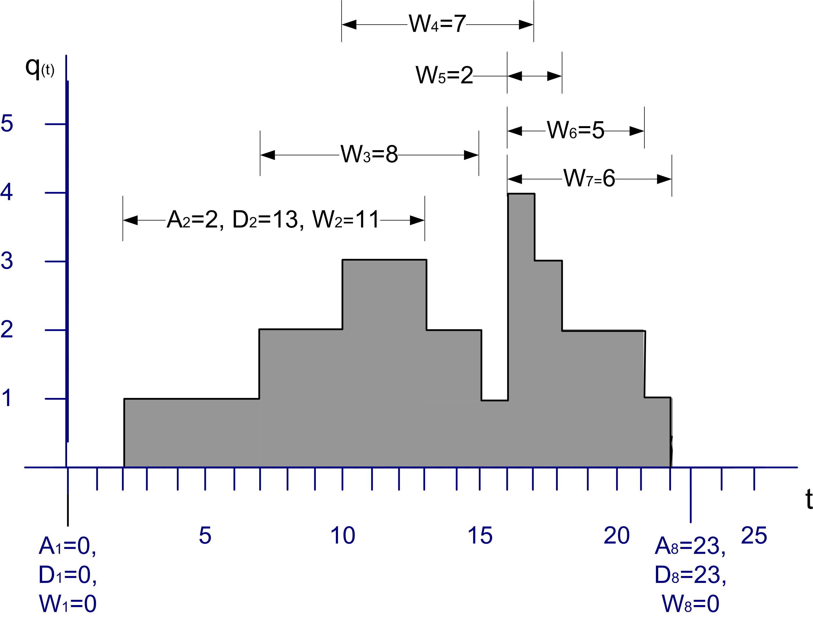
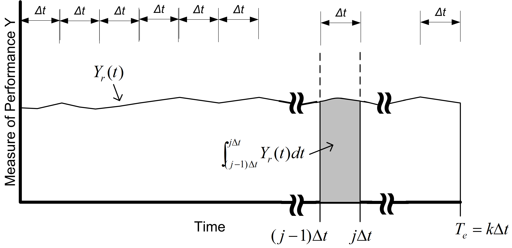
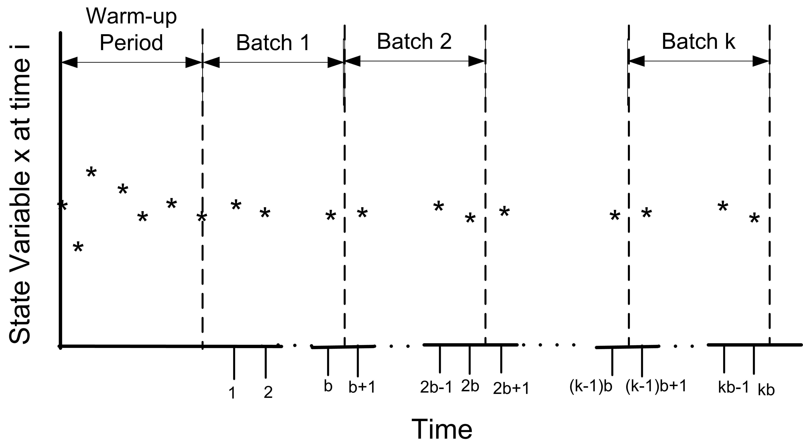

# Analyzing Simulation Output {#simoa}

**[LEARNING OBJECTIVES]{.smallcaps}**

-   To be able to recognize the different types of statistical
    quantities used within and produced by simulation models

-   To be able to analyze finite horizon simulations via the method of
    replications

-   To be able to analyze infinite horizon simulations via the method of
    batch means and the method of replication-deletion

-   To be able to compare simulation alternatives and make valid
    decisions based on the statistical output of a simulation

Because the inputs to the simulation are random, the outputs from the simulation
are also random. You can think of a simulation model as
a function that maps inputs to outputs. This chapter presents the
statistical analysis of the outputs from simulation models. 

In addition, a number of issues that are related to the proper execution
of simulation experiments are presented. For example, the simulation
outputs are dependent upon the input random variables, input parameters,
and the initial conditions of the model. Initial conditions refer to the
starting conditions for the model, i.e. whether or not the system starts
"empty and idle". The effect of initial conditions on steady state
simulations will be discussed in this chapter.

Input parameters are related to the controllable and uncontrollable
factors associated with the system. For a simulation model, *all* input
parameters are controllable; however, in the system being modeled we
typically have control over only a limited set of parameters. Thus, in
simulation you have the unique ability to control the random inputs into
your model. This chapter will discuss how to take advantage of
controlling the random inputs.

Input parameters can be further classified as decision variables. That
is, those parameters of interest that you want to change in order to
test model configurations for decision-making. The structure of the
model itself may be considered a decision variable when you are trying
to optimize the performance of the system. When you change the input
parameters for the simulation model and then execute the simulation, you
are simulating a different design alternative.

This chapter describes how to analyze the output from a single design
alternative and how to analyze the results of multiple design
alternatives. To begin the discussion you need to build an understanding
of the types of statistical quantities that may be produced by a
simulation experiment.

## Types of Statistical Variables {#simoadatatypes}

A simulation experiment occurs when the modeler sets the input
parameters to the model and executes the simulation. This causes events
to occur and the simulation model to evolve over time. During the
execution of the simulation, the behavior of the system is observed and
various statistical quantities computed. When the simulation reaches its
termination point, the statistical quantities are summarized in the form
of output reports.

A simulation experiment may be for a single replication of the model or
may have multiple replications. A *replication* is the generation of one
sample path which represents the evolution of the system from its
initial conditions to its ending conditions. If you have multiple
replications within an experiment, each replication represents a
different sample path, starting from the same initial conditions and
being driven by the same input parameter settings. Because the
randomness within the simulation can be controlled, the underlying
random numbers used within each replication of the simulation can be
made to be independent. Thus, as the name implies, each replication is
an independently generated "repeat" of the simulation.

Within a single sample path (replication), the statistical behavior of
the model can be observed.

::: {.definition #WRS name="Within Replication Statistic"}
The statistical quantities collected during a replication are called *within replication
statistics*.
:::

::: {.definition #ARS name="Across Replication Statistic"}
The statistical quantities
collected across replications are called *across replication
statistics*. Across replication statistics are collected based on the
observation of the final values of within replication statistics.
:::

*Within replication statistics* are collected based on the observation
of the sample path and include observations on entities, state changes,
etc. that occur during a sample path execution. The observations used to
form within replication statistics are not likely to be independent and
identically distributed. Since across replication statistics are formed
from the final values of within replication statistics, one observation
per replication is available. Since each replication is considered
independent, the observations that form the sample for across
replication statistics are likely to be independent and identically
distributed. The statistical properties of within and across replication
statistics are inherently different and require different methods of
analysis. Of the two, within replication statistics are the more
challenging from a statistical standpoint.

For within replication statistical collection there are two primary
types of observations: *tally* and *time-persistent*. Tally data
represent a sequence of equally weighted data values that do not persist
over time. This type of data is associated with the duration or
interval of time that an object is in a particular state or how often
the object is in a particular state. As such it is observed by marking
(tallying) the time that the object enters the state and the time that
the object exits the state. Once the state change takes place, the
observation is over (it is gone, it does not persist, etc.). If we did
not observe the state change, then we would have missed the observation.
The time spent in queue, the count of the number of customers served,
whether or not a particular customer waited longer than 10 minutes are
all examples of tally data.

Time-persistent observations represent a sequence of values that persist
over some specified amount of time with that value being weighted by the
amount of time over which the value persists. These observations are
directly associated with the values of the state variables within the
model. The value of a time-persistent observation persists in time. For
example, the number of customers in the system is a common state
variable. If we want to collect the average number of customers in the
system *over time*, then this will be a time-persistent statistic. While
the value of the number of customers in the system changes at discrete
points in time, it holds (or persists with) that value over a duration
of time. This is why it is called a time-persistent variable.

Figure \@ref(fig:TallyTimePersistent) illustrates a single sample path for the
number of customers in a queue over a period of time. From this sample
path, events and subsequent statistical quantities can be observed.

<div class="figure">

<p class="caption">(\#fig:TallyTimePersistent)Sample Path for Tally and Time-Persistent Data</p>
</div>

-   Let $A_i \; i = 1 \ldots n$ represent the time that the $i^{th}$
    customer enters the queue

-   Let $D_i \; i = 1 \ldots n$ represent the time that the $i^{th}$
    customer exits the queue

-   Let $W_i = D_i - A_i \; i = 1 \ldots n$ represent the time that the
    $i^{th}$ customer spends in the queue

Thus, $W_i \; i = 1 \ldots n$ represents the sequence of wait times for
the queue, each of which can be individually observed and tallied. This
is tally type data because the customer enters a state (the queued
state) at time $A_i$ and exits the state at time $D_i$. When the
customer exits the queue at time $D_i$, the waiting time in queue,
$W_i = D_i - A_i$ can be observed or tallied. $W_i$ is only observable
at the instant $D_i$. This makes $W_i$ tally based data and, once
observed, its value never changes again with respect to time. Tally data
is most often associated with an entity that is moving through states
that are implied by the simulation model. An observation becomes
available each time the entity enters and subsequently exits the state.

With tally data it is natural to compute the sample average as a measure
of the central tendency of the data. Assume that you can observe $n$
customers entering and existing the queue, then the average waiting time
across the $n$ customers is given by:

$$\bar{W}(n) = \dfrac{1}{n} \sum_{i=1}^{n} W_{i}$$

Many other statistical quantities, such as the minimum, maximum, and
sample variance, etc. can also be computed from these observations.
Unfortunately, within replication data is often (if not always)
correlated with respect to time. In other words, within replication
observations like, $W_i \, i = 1 \ldots n$, are not statistically
independent. In fact, they are likely to also not be identically
distributed. Both of these issues will be discussed when the analysis of
infinite horizon or steady state simulation models is presented.

The other type of statistical variable encountered within a replication
is based on time-persistent observations. Let $q(t), t_0 < t \leq t_n$
be the number of customers in the queue at time $t$. Note that
$q(t) \in \lbrace 0,1,2,\ldots\rbrace$. As illustrated in
Figure \@ref(fig:TallyTimePersistent), $q(t)$ is a function of time (a step
function in this particular case). That is, for a given (realized)
sample path, $q(t)$ is a function that returns the number of customers
in the queue at time $t$.

The mean value theorem of calculus for integrals states that given a
function, $f(\cdot)$, continuous on an interval $[a, b]$, there exists a
constant, $c$, such that

$$\int_a^b f(x) \mathrm{d}x = f(c)(b-a)$$

The value, $f(c)$, is called the mean value of the function. A similar
function can be defined for $q(t)$. In simulation, this function is
called the time-average:

$$\bar{L}_q(n) = \frac{1}{t_n - t_0} \int_{t_0}^{t_n} q(t) \mathrm{d}t$$

This function represents the average with respect to time of the given
state variable. This type of statistical variable is called
time-persistent because $q(t)$ is a function of time (i.e. it persists
over time).

In the particular case where $q(t)$ represents the number of customers
in the queue, $q(t)$ will take on constant values during intervals of
time corresponding to when the queue has a certain number of customers.
Let $q(t)$ = $q_k$ for $t_{k-1} \leq t \leq t_k$ and define
$v_k = t_k - t_{k-1}$ then the time-average number in queue can be
rewritten as follows:

$$
\begin{aligned}
\bar{L}_q(n) &= \frac{1}{t_n - t_0} \int_{t_0}^{t_n} q(t) \mathrm{d}t\\
 & = \frac{1}{t_n - t_0} \sum_{k=1}^{n} q_k (t_k - t_{k-1})\\
 & = \frac{\sum_{k=1}^{n} q_k v_k}{t_n - t_0} \\
 & = \frac{\sum_{k=1}^{n} q_k v_k}{\sum_{k=1}^{n} v_k}
\end{aligned}
$$

Note that $q_k (t_k - t_{k-1})$ is the area under $q(t)$ over the
interval $t_{k-1} \leq t \leq t_k$ and

$$t_n - t_0 = \sum_{k=1}^{n} v_k = (t_1 - t_0) + (t_2 - t_1) + \cdots (t_{n-1} - t_{n-2}) + (t_n - t_{n-1})$$

is the total time over which the variable is observed. Thus, the time
average is simply the area under the curve divided by the amount of time
over which the curve is observed. From this equation, it should be noted
that each value of $q_k$ is weighted by the length of time that the
variable has the value. This is why the time average is often called the
time-weighted average. If $v_k = 1$, then the time average is the same
as the sample average.

With time-persistent data, you often want to estimate the percentage of
time that the variable takes on a particular value. Let $T_i$ denote the
*total* time during $t_0 < t \leq t_n$ that the queue had $q(t) = i$
customers. To compute $T_i$, you sum all the rectangles corresponding to
$q(t) = i$, in the sample path. Because
$q(t) \in \lbrace 0,1,2,\ldots\rbrace$ there are an infinite number of
possible value for $q(t)$ in this example; however, within a finite
sample path you can only observe a finite number of the possible values.
The ratio of $T_i$ to $T = t_n - t_0$ can be used to estimate the
percentage of time the queue had $i$ customers. That is, define
$\hat{p}_i = T_i/T$ as an estimate of the proportion of time that the
queue had $i$ customers during the interval of observation.

Let's look at an example. Consider Figure \@ref(fig:TallyTimePersistent), which shows the change in queue
length over a simulated period of 25 time units.

1.  Compute the time average number in queue over the interval of time
    from 0 to 25.

2.  Compute the percentage of time that the queue had
    $\lbrace 0, 1, 2, 3, 4\rbrace$ customers

Since the queue length is a time-persistent variable, the time average queue length can be
computed as:

$$
\begin{aligned}
\bar{L}_q & = \frac{0(2-0) + 1(7-2) + 2(10-7) + 3(13-10) + 2(15-13) + 1(16-15)}{25}\\
 & + \frac{4(17-16) + 3(18-17) + 2(21-18) + 1(22-21) + 0(25-22)}{25} \\
 & = \frac{39}{25} = 1.56
\end{aligned}
$$

To estimate the percentage of time that the queue had
$\lbrace 0, 1, 2, 3, 4\rbrace$ customers, the values of
$v_k = t_k - t_{k-1}$ need to be summed for whenever
$q(t) \in \lbrace 0, 1, 2, 3, 4 \rbrace$. This results in the following:

$$\hat{p}_0 = \dfrac{T_0}{T} = \dfrac{(2-0) + (25-22)}{25} = \dfrac{2 + 3}{25} = \dfrac{5}{25} = 0.2$$

$$\hat{p}_1 = \dfrac{T_1}{T} = \dfrac{(7-2) + (16-15) + (22-21)}{25} = \dfrac{5 + 1 + 1}{25} = \dfrac{7}{25} = 0.28$$

$$\hat{p}_2 = \dfrac{T_2}{T} = \dfrac{3 + 2 + 3)}{25} = \dfrac{8}{25} = 0.28$$

$$\hat{p}_3 = \dfrac{T_3}{T} = \dfrac{3 + 1}{25} = \dfrac{4}{25} = 0.16$$

$$\hat{p}_4 = \dfrac{T_4}{T} = \dfrac{1}{25} = \dfrac{1}{25} = 0.04$$

Notice that the sum of the $\hat{p}_i$ adds to one. To compute the
average waiting time in the queue, use the supplied values for each
waiting time.

$$\bar{W}(8) = \frac{\sum_{i=1}^n W_i}{n} =\dfrac{0 + 11 + 8 + 7 + 2 + 5 + 6 + 0}{8} = \frac{39}{8} = 4.875$$

Notice that there were two customers, one at time 1.0 and another at
time 23.0 that had waiting times of zero. The state graph did not move
up or down at those times. Each unit increment in the queue length is
equivalent to a new customer entering (and staying in) the queue. On the
other hand, each unit decrement of the queue length signifies a
departure of a customer from the queue. If you assume a first-in,
first-out (FIFO) queue discipline, the waiting times of the six
customers that entered the queue (and had to wait) are shown in the
figure.

Now that we understand the type of data that occurs within a
replication, we need to develop an understanding for the types of
simulation situations that require specialized statistical analysis. The
next section introduces this important topic.

## Types of Simulation With Respect To Output Analysis {#simoasimtypes}

When modeling a system, specific measurement goals for the simulation
responses are often required. The goals, coupled with how the system
operates, will determine how you execute and analyze the simulation
experiments. In planning the experimental analysis, it is useful to
think of simulations as consisting of two main categories related to the
period of time over which a decision needs to be made:

Finite horizon

:   In a finite-horizon simulation, a well define ending time or ending
    condition can be specified which clearly defines the end of the
    simulation. Finite horizon simulations are often called
    *terminating* simulations, since there are clear terminating
    conditions.

Infinite horizon

:   In an infinite horizon simulation, there is no well defined ending
    time or condition. The planning period is over the life of the
    system, which from a conceptual standpoint lasts forever. Infinite
    horizon simulations are often called *steady state* simulations
    because in an infinite horizon simulation you are often interested
    in the long-term or steady state behavior of the system.

For a finite horizon simulation, an event or condition associated with
the system is present which indicates the end of each simulation
replication. This event can be specified in advance or its time of
occurrence can be a random variable. If it is specified in advance, it
is often because you do not want information past that point in time
(e.g. a 3 month planning horizon). It might be a random variable in the
case of the system stopping when a condition is met. For example, an
ending condition may be specified to stop the simulation when there are
no entities left to process. Finite horizon simulations are very common
since most planning processes are finite. A few example systems
involving a finite horizon include:

-   Bank: bank doors open at 9am and close at 5pm

-   Military battle: simulate until force strength reaches a critical
    value

-   Filling a customer order: suppose a new contract is accepted to
    produce 100 products, you might simulate the production of the 100
    products to see the cost, delivery time, etc.

For a finite horizon simulation, each replication represents a sample
path of the model for one instance of the finite horizon. The length of
the replication corresponds to the finite horizon of interest. For
example, in modeling a bank that opens at 9 am and closes at 5 pm, the
length of the replication would be 8 hours.

In contrast to a finite horizon simulation, an infinite horizon
simulation has no natural ending point. Of course, when you actually
simulate an infinite horizon situation, a finite replication length must
be specified. Hopefully, the replication length will be long enough to
satisfy the goal of observing long run performance. Examples of infinite
horizon simulations include:

-   A factory where you are interested in measuring the steady state
    throughput

-   A hospital emergency room which is open 24 hours a day, 7 days of
    week

-   A telecommunications system which is always operational

Infinite horizon simulations are often tied to systems that operate
continuously and for which the long-run or steady state behavior needs
to be estimated.

Because infinite horizon simulations often model situations where the
system is always operational, they often involve the modeling of
non-stationary processes. In such situations, care must be taken in
defining what is meant by long-run or steady state behavior. For
example, in an emergency room that is open 24 hours a day, 365 days per
year, the arrival pattern to such a system probably depends on time.
Thus, the output associated with the system is also non-stationary. The
concept of steady state implies that the system has been running so long
that the system's behavior (in the form of performance measures) no
longer depends on time; however, in the case of the emergency room since
the inputs depend on time so do the outputs. In such cases it is often
possible to find a period of time or cycle over which the non-stationary
behavior repeats. For example, the arrival pattern to the emergency room
may depend on the day of the week, such that every Monday has the same
characteristics, every Tuesday has the same characteristics, and so on
for each day of the week. Thus, on a weekly basis the non-stationary
behavior repeats. You can then define your performance measure of
interest based on the appropriate non-stationary cycle of the system.
For example, you can define Y as the expected waiting time of patients
*per week*. This random variable may have performance that can be
described as long-term. In others, the long-run weekly performance of
the system may be stationary. This type of simulation has been termed
steady state cyclical parameter estimation within [@law2007simulation].

Of the two types of simulations, finite horizon simulations are easier
to analyze. Luckily they are the more typical type of simulation found
in practice. In fact, when you think that you are faced with an infinite
horizon simulation, you should very carefully evaluate the goals of your
study to see if they can just as well be met with a finite planning
horizon. The analysis of both of these types of simulations will be
discussed in this chapter through examples.

## Analysis of Finite Horizon Simulations {#simoafinhorizon}

This section illustrates how tally-based and time-persistent statistics
are collected within a replication and how statistics are collected
across replications. Finite horizon simulations can be analyzed by
traditional statistical methodologies that assume a random sample, i.e.
independent and identically distributed random variables. A simulation
experiment is the collection of experimental design points (specific
input parameter values) over which the behavior of the model is
observed. For a particular design point, you may want to repeat the
execution of the simulation multiple times to form a sample at that
design point. To get a random sample, you execute the simulation
starting from the same initial conditions and ensure that the random
numbers used within each replication are independent. Each replication
must also be terminated by the same conditions. It is very important to
understand that independence is achieved across replications, i.e. the
replications are independent. The data *within* a replication may or may
not be independent.

The method of *independent replications* is used to analyze finite
horizon simulations. Suppose that $n$ replications of a simulation are
available where each replication is terminated by some event $E$ and
begun with the same initial conditions. Let $Y_{rj}$ be the $j^{th}$
observation on replication $r$ for $j = 1,2,\cdots,m_r$ where $m_r$ is
the number of observations in the $r^{th}$ replication, and
$r = 1,2,\cdots,n$, and define the sample average for each replication
to be:

$$\bar{Y}_r = \frac{1}{m_r} \sum_{j=1}^{m_r} Y_{rj}$$

If the data are time-based then,

$$\bar{Y}_r = \frac{1}{T_E}  \int_0^{T_E} Y_r(t) \mathrm{d}t$$

$\bar{Y}_r$ is the sample average based on the observation within the
$r^{th}$ replication. It is a random variable that can be observed at
the end of each replication, therefore, $\bar{Y}_r$ for
$r = 1,2,\ldots,n$ forms a random sample. Thus, standard statistical
analysis of the random sample can be performed.

To make this concrete, suppose that you are examining a bank that opens
with no customers at 9 am and closes its doors at 5 pm to prevent
further customers from entering. Let, $W_{rj} j = 1,\ldots,m_r$,
represents the sequence of waiting times for the customers that entered
the bank between 9 am and 5 pm on day (replication) $r$ where $m_r$ is
the number of customers who were served between 9 am and 5 pm on day
$r$. For simplicity, ignore the customers who entered before 5 pm but
did not get served until after 5 pm. Let $N_r (t)$ be the number of
customers in the system at time $t$ for day (replication) $r$. Suppose
that you are interested in the mean daily customer waiting time and the
mean number of customers in the bank on any given 9 am to 5 pm day, i.e.
you are interested in $E[W_r]$ and $E[N_r]$ for any given day. At the
end of each replication, the following can be computed:

$$\bar{W}_r = \frac{1}{m_r} \sum_{j=1}^{m_r} W_{rj}$$

$$\bar{N}_r = \dfrac{1}{8}\int_0^8 N_r(t)\ \mathrm{d}t$$

At the end of all replications, random samples: $\bar{W}_r$ and
$\bar{N}_r$ are available from which sample averages, standard
deviations, confidence intervals, etc. can be computed. Both of these
samples are based on observations of within replication data.

Both $\bar{W_r}$ and $\bar{N_r}$ for $r = 1,2,\ldots,n$ are averages of many observations
within the replication. Sometimes, there may only be one observation
based on the entire replication. For example, suppose that you are
interested in the probability that someone is still in the bank when the
doors close at 5 pm, i.e. you are interested in
$\theta = Pr\{N(t = 5 pm) > 0\}$. In order to estimate this probability,
an indicator variable can be defined within the simulation and observed
each time the condition was met or not. For this situation, an indicator
variable,$I_r$, for each replication can be defined as follows:

$$
I_r =
   \begin{cases}
     1 & N(t = 5 pm) > 0\\
     0 & N(t = 5 pm) \leq 0 \\
  \end{cases}
$$

Therefore, at the end of the replication, the simulation must tabulate
whether or not there are customers in the bank and record the value of
this indicator variable. Since this happens only once per replication, a
random sample of the $I_r$ for $r = 1,2,\ldots,n$ will be available after all
replications have been executed.  We can use
the observations of the indicator variable to estimate the desired
probability.

Since the analysis of the system will be based on a random sample, the
key design criteria for the experiment will be the required number of
replications. In other words, you need to determine the sample size.

Because confidence intervals may form the basis for decision making, you
can use the confidence interval half-width in determining the sample
size. For example, in estimating $E[W_r]$ for the bank example, you
might want to be 95% confident that you have estimated the true waiting
time to within $\pm 2$ minutes.

There are three related methods that are commonly used for determining
the sample size for this situation:

-   an iterative method based on the t-distribution,

-   an approximate method based on the normal distribution, and

-   the half-width ratio method

Each of these methods assumes that the observations in the sample are
independent and identically distributed from a normal distribution. In
addition, the methods also assume that the pilot replications are
representative of the population under study. When the data are not
normally distributed, you must rely on the central limit theorem to get
approximate results. The assumption of normality is typically justified
when across replication statistics are based on within replication
averages.

Determining the sample size for a simulation experiment has already been discussed in Section  \@ref(ch2SampleSize) of Chapter \@ref(mcm), the following section will illustrate the half-width ratio method for determining the number of replications because it is often seen in practice.

### Determining the Number of Replications {#simoafinhorizonsamplesize}

As a reminder, we repeat some of the exposition from Section  \@ref(ch2SampleSize).  If you make a pilot run of $n_0$ replications you can use the half-width from the pilot run
to determine how many replications you need to have to be close to a
desired half-width bound in the full experiment. This is called the
*half-width ratio method*.

Let $h_0$ be the initial value for the half-width from the pilot run of
$n_0$ replications.

\begin{equation}
h_0 = t_{\alpha/2, n_0 - 1} \dfrac{s_0}{\sqrt{n_0}}
(\#eq:hNotc)
\end{equation}

Solving for $n_0$ yields:

\begin{equation}
n_0 = t_{\alpha/2, n_0 -1}^{2} \dfrac{s_{0}^{2}}{h_{0}^{2}}
(\#eq:n_0c)
\end{equation}

Similarly for any $n$, we have:

\begin{equation}
n = t_{\alpha/2, n-1}^{2} \dfrac{s^{2}}{h^{2}}
(\#eq:nc)
\end{equation}

Taking the ratio of $n_0$ to $n$ using equations \@ref(eq:n_0c) and (\@ref(eq:nc) and assuming
that $t_{\alpha/2, n-1}$ is approximately equal to
$t_{\alpha/2, n_0 - 1}$ and $s^2$ is approximately equal to $s_0^2$,
yields,

\begin{equation}
n \cong n_0 \dfrac{h_0^2}{h^2} = n_0 \left(\frac{h_0}{h}\right)^2
(\#eq:hwratioc)
\end{equation}

Equation \@ref(eq:hwratioc) is the half-width ratio equation.

Now, let's look at an example. Suppose a pilot run of a
simulation model estimated that the average waiting time for a customer
during the day was 11.485 minutes based on an initial sample size of 15
replications with a 95% confidence interval half-width of 1.04. Using
the three sample size determination techniques, recommend a sample size
to be 95% confident that you are within $\pm 0.10$ of the true mean
waiting time in the queue.

First we will do the half-width ratio method. We have that $h_0 = 1.04$,
$n_0 = 15$, and $h = 0.1$, thus:

$$n \cong n_0 \left(\frac{h_0}{h}\right)^2 = 15 \left(\frac{1.04}{0.1}\right)^2 = 1622.4 \cong 1623$$

To estimate a sample size based on the normal approximation method, we
need to have the estimate of the initial sample standard deviation.
Unfortunately, this is not directly reported, but it can be computed
using Equation \@ref(eq:hNotc). Rearranging Equation \@ref(eq:hNotc)
to solve for $s_0$, yields:

$$s_0 = \dfrac{h_0\sqrt{n_0}}{t_{\alpha/2, n_0 - 1}}$$

Since we have a 95% confidence interval with $n_0 = 15$, we have that
$t_{0.025, 14} = 2.145$, which yields,

$$s_0 = \dfrac{h_0\sqrt{n_0}}{t_{\alpha/2, n_0 - 1}} = \dfrac{1.04\sqrt{15}}{2.145} =  1.87781$$

Now, we can use the normal approximation method. By using $h$ as the
desired bound $E$ and $z_{0.025} = 1.96$, we have,

$$n \geq \biggl(\dfrac{z_{\alpha/2} s}{E}\biggr)^2 = \biggl(\dfrac{1.96 \times 1.87781}{0.1}\biggr)^2 = 1354.54 \approx 1355$$

The final method is to use the iterative method based on the following equation:

$$h = t_{\alpha/2, n-1} \dfrac{s}{\sqrt{n}} \leq E$$

This can be accomplished easily within a spreadsheet yielding $n=1349$.

<div class="figure">

<p class="caption">(\#fig:SampleSizeViaGoalSeek)Iterative Method for Sample Size via Goal Seek</p>
</div>

The three methods resulted in following recommendations:

-   an iterative method based on the t-distribution, n = 1349

-   an approximate method based on the normal distribution, n = 1355

-   the half-width ratio method, n = 1623

As noted in the discussion, the half-width ratio method recommended the
largest number of replications.

In the case of an indicator variable such as, $I_r$, which was suggested
for use in estimating the probability that there are customers in the
bank after 5 pm, the sampled observations are clearly not normally
distributed. In this case, since you are estimating a proportion, you
can use the sample size determination techniques for estimating
proportions via equations \@ref(eq:propCI) and \@ref(eq:pSampleSize).

## Finite Horizon Example {#simoafinhorizonex}

This section presents a fictitious system involving the production of rings. The example illustrates how to collect tally based
statistics, time based statistics, and statistics that can only be
collected at the end of a replication. The analysis of a finite horizon
simulation will be illustrated. In addition, the
system also represents another example of how to use the station package.

Every morning the sales force at LOTR Makers, Inc. makes a number of confirmation
calls to customers who have previously been visited by the sales force.
They have tracked the success rate of their confirmation calls over time
and have determined that the chance of success varies from day to day.
They have modeled the probability of success for a given day as a beta
random variable with parameters $\alpha_1 = 5$ and $\alpha_2 = 1.5$ so
that the mean success rate is about 77%. They always make 100 calls
every morning. Each sales call will or will not result in an order for a
pair of magical rings for that day. Thus, the number of pairs of rings
to produce every day is a binomial random variable, with $p$ determined
by the success rate for the day and $n = 100$ representing the total
number of calls made. Note that $p$ is random in this modeling.

The sales force is large enough and the time to make the confirmation
calls small enough so as to be able to complete all the calls before
releasing a production run for the day. In essence, ring production does
not start until all the orders have been confirmed, but the actual
number of ring pairs produced every day is unknown until the sales call
confirmation process is completed. The time to make the calls is
negligible when compared to the overall production time.

Besides being magical, one ring is smaller than the other ring so that
the smaller ring must fit snuggly inside the larger ring. The pair of
rings is produced by a master ring maker and takes uniformly between 5
to 15 minutes. The rings are then scrutinized by an inspector with the
time (in minutes) being distributed according to a triangular
distribution with parameters (2, 4, 7) for the minimum, the mode, and
the maximum. The inspection determines whether the smaller ring is too
big or too small when fit inside the bigger outer ring. The inside
diameter of the bigger ring, $D_b$, is normally distributed with a mean
of 1.5 cm and a standard deviation of 0.002. The outside diameter of the
smaller ring, $D_s$, is normally distributed with a mean of 1.49 and a
standard deviation of 0.005. If $D_s > D_b$, then the smaller ring will
not fit in the bigger ring; however, if $D_b - D_s > tol$, then the
rings are considered too loose. The tolerance is currently set at 0.02
cm.

If there are no problems with the rings, the rings are sent to a packer
for custom packaging for shipment. A time study of the packaging time
indicates that it is distributed according to a log-normal distribution
with a mean of 7 minutes and a standard deviation of 1 minute. If the
inspection shows that there is a problem with the pair of rings they are
sent to a rework craftsman. The minimum time that it takes to rework the
pair of rings has been determined to be 5 minutes plus some random time
that is distributed according to a Weibull distribution with a scale
parameter of 15 and a shape parameter of 5. After the rework is
completed, the pair of rings is sent to packaging.

Currently, the company runs two shifts of 480 minutes each. Time after
the end of the second shift is considered overtime. Management is
interested in investigating the following:

-   The daily production time.

-   The probability of overtime.

-   The average number of pairs of rings in both the ring making process
    and the ring inspection process.

-   The average time that it takes for a pair of rings to go through
    both the ring making process and the ring inspection process. In
    addition, a 95% confidence interval for the mean time to complete
    these processes to within $\pm$ 20 minutes is desired.

### Conceptualizing the Model

Now let's proceed with the modeling of this situation. We start with answering the basic model
building questions.

*What is the system? What information is known by the system?*

The system is the LOTR Makers, Inc. sales calls and ring production
processes. The system starts every day with the initiation of sales
calls and ends when the last pair of rings produced for the day is
shipped. The system knows the following:

-   Sales call success probability distribution:
    $p \sim beta(\alpha_1 = 5,\alpha_2 = 1.5)$

-   Number of calls to be made every morning: $n = 100$

-   Distribution of time to make the pair of rings: $U(5,15)$

-   Distributions associated with the big and small ring diameters:
    N($\mu$ = 1.5, $\sigma$ = 0.002) and N($\mu$ = 1.49, $\sigma$ =
    0.005), respectively

-   Distribution of ring-inspection time: triangular(2,4,7)

-   Distribution of packaging time: lognormal($\mu_{l}$ = 7,$\sigma_{l}$
    = 1)

-   Distribution of rework time, 5 + Weibull(scale =15, shape =3)

-   Length of a shift: 480 minutes

*What are the entities? What information must be recorded for each entity?*

Possible entities are the sales calls and the production job (pair of
rings) for every successful sales call. For every pair of rings, the
diameters must be known.

*What are the resources that are used by the entities?*

The sales calls do not use any resources. The production job uses a
master craftsman, an inspector, and a packager. It might also use a
rework craftsman.

*What are the activities? What are the processes? What are the events associated with the processes and activities? Write out or draw sketches of the process.*

There are two processes: sales order and production. An outline of the
sales order process should look like this:

1.  Start the day.

2.  Determine the likelihood of calls being successful.

3.  Make the calls.

4.  Determine the total number of successful calls.

5.  Start the production jobs.

Notice that the sales order process takes zero time and that it occurs
at the beginning of each day. Thus, there appears to be an event that
occurs at time 0.0, that determines the number of production jobs and
sends them to production. This type of situation is best modeled using
the initialize() method to make the orders to be placed into production.
From the problem statement, the number of production jobs is a binomial
random variable with $n= 100$ and
$p \sim BETA(\alpha_1 = 5,\alpha_2 = 1.5)$.

The following listing shows the constructor for this model and the
initialize() method.

```java
public LOTR(ModelElement parent, String name) {
	super(parent, name);
	mySalesCallProb = new RandomVariable(this, new BetaRV(5.0, 1.5));
	myMakeRingTimeRV = new RandomVariable(this, new UniformRV(5, 15));
	mySmallRingODRV = new RandomVariable(this, new NormalRV(1.49, 0.005 * 0.005));
	myBigRingIDRV = new RandomVariable(this, new NormalRV(1.5, 0.002 * 0.002));
	myInspectTimeRV = new RandomVariable(this, new TriangularRV(2, 4, 7));
	myPackingTimeRV = new RandomVariable(this, new LognormalRV(7, 1));
	myReworkTimeRV = new RandomVariable(this, new ShiftedRV(5.0, new WeibullRV(3, 15)));
	myRingMakingStation = new SingleQueueStation(this, myMakeRingTimeRV,
			"RingMakingStation");
	myInspectionStation = new SingleQueueStation(this, myInspectTimeRV,
			"InspectStation");
	myReworkStation = new SingleQueueStation(this, myReworkTimeRV,
			"ReworkStation");
	myPackagingStation = new SingleQueueStation(this, myPackingTimeRV,
			"PackingStation");
	myRingMakingStation.setNextReceiver(myInspectionStation);
	myInspectionStation.setNextReceiver(new AfterInspection());
	myReworkStation.setNextReceiver(myPackagingStation);
	myPackagingStation.setNextReceiver(new Dispose());
	mySystemTime = new ResponseVariable(this, "System Time");
	myNumInSystem = new TimeWeighted(this, "Num in System");
	myNumCompleted = new Counter(this, "Num Completed");
	myProbTooBig = new ResponseVariable(this, "Prob too Big");
	myProbTooSmall = new ResponseVariable(this, "Prob too Small");
	myProbOT = new ResponseVariable(this, "Prob of Over Time");
	myEndTime = new ResponseVariable(this, "Time to Make Orders");
	myNumInRMandInspection = new TimeWeighted(this, "Num in RM and Inspection");
	myTimeInRMandInspection = new ResponseVariable(this, "Time in RM and Inspection");
}

@Override
protected void initialize() {
	super.initialize();
	double p = mySalesCallProb.getValue();
	int n = JSLRandom.rBinomial(p, myNumDailyCalls);
	for (int i = 0; i < n; i++) {
		myRingMakingStation.receive(new RingOrder());
		myNumInSystem.increment();
		myNumInRMandInspection.increment();
	}
}
```

The constructor makes the random variables that
model the number of successful calls and the probability that a call is
successful. Then, the initialize() method, which is automatically called
at the beginning of a replication (essentially at time 0.0), uses the
random variables to first determine the probability of a successful call
and then determines the number of successful calls.
Finally, a for-loop is used to make the orders (new RingOrder()) and
send them into production at the ring making station. Also,
the number of orders in the system and the number of orders at the ring
making and inspection stations is incremented.

The following code listing illustrates the modeling of the orders within
the system.

```java
private class RingOrder extends QObject {

	private double myBigRingID;
	private double mySmallRingOuterD;
	private double myGap;
	private boolean myNeedsReworkFlag = false;
	private boolean myTooBigFlag = false;
	private boolean myTooSmallFlag = false;

	public RingOrder() {
		this(getTime(), null);
	}

	public RingOrder(double creationTime, String name) {
		super(creationTime, name);
		myBigRingID = myBigRingIDRV.getValue();
		mySmallRingOuterD = mySmallRingODRV.getValue();
		myGap = myBigRingID - mySmallRingOuterD;
		if (mySmallRingOuterD > myBigRingID) {
			myTooBigFlag = true;
			myNeedsReworkFlag = true;
		} else if (myGap > myRingTol) {
			myTooSmallFlag = true;
			myNeedsReworkFlag = true;
		}
	}

}
```

A RingOrder represents an order for a pair of rings.
RingOrder is an inner class of LOTR. This was done so that the RingOrder
has easy access to the random variables defined within the LOTR class.
The outer ring's inner diameter and the inner ring's outer diameter are
modeled using attributes for the order. The values for these attributes
are set using the random variables that were defined as instance
variables of the LOTR class and instantiated within the LOTR class's
constructor. The size of the gap and whether or not the ring needs
rework is also computed. The condition of the ring in terms of whether
the gap is too big or too small is specified. Since the RingOrder class
extends the QObject class it has the ability to be held by instances of
the Queue class. Once the order for the rings is made it is passed into
production.

An outline of the production process should be something like this:

1.  Make the rings (determine sizes).

2.  Inspect the rings.

3.  If rings do not pass inspection, perform rework

4.  Package rings and ship.

Notice that in the production of the rings there are a number of
activities that take place during which various resources are used. This
situation is very similar to the Tie-Dye T-Shirt example in that the
rings move from ring making to inspection (possibly rework) and finally
to packaging. Each of these areas can be modeled using the
SingleQueueStation class. The
events associated with this situation include arrival to ring making,
departure from ring making, arrival to inspection, departure from
inspection, arrvial to rework, departure from rework, arrival to
packaging and departure from packaging. Since the departure from an
upstream station also represents an arrival to the downstream station,
the number of events needed to model this situation can be consolidated.
As mentioned, the SingleQueueStation can be used to model this situation
by connecting the stations together. The construction of the stations
and their connection is illustrated in the constructor for the LOTR system. Notice that the setNextReceiver() methods
are used to connect the ring making station to the inspection station
and to have the rework station send work to the packaging station.

One conceptually challenging aspect of this model is the fact that the
rings will probabilistically go to the rework station or the packaging
station. To model this situation, an inner class called AfterInspection
was designed that implements the ReceiveQObjectIfc interface. An
instance of this class is provided as the receiver for the inspection
station. Thus, after the inspection station is done,
the order for the ring (in the form of a QObject) will be sent to this
logic.

In the following listing, lines 4 and 5 finish out the collection of
the number of orders in the ring making and inspection stations and the
collection of the time spent within those stations. Then, starting in
line 6, the order is checked if it needs rework and if so, the rework
station is told to receive it; otherwise, the packaging station is told
to receive it.

```java
protected class AfterInspection implements ReceiveQObjectIfc {
	@Override
	public void receive(QObject qObj) {
		myNumInRMandInspection.decrement();
		myTimeInRMandInspection.setValue(getTime() - qObj.getCreateTime());
		RingOrder order = (RingOrder) qObj;
		if (order.myNeedsReworkFlag) {
			myReworkStation.receive(order);
		} else {
			myPackagingStation.receive(order);
		}
	}
}

protected class Dispose implements ReceiveQObjectIfc {
	@Override
	public void receive(QObject qObj) {
		// collect final statistics
		RingOrder order = (RingOrder) qObj;
		myNumInSystem.decrement();
		mySystemTime.setValue(getTime() - order.getCreateTime());
		myNumCompleted.increment();
		myProbTooBig.setValue(order.myTooBigFlag);
		myProbTooSmall.setValue(order.myTooSmallFlag);
	}
}

@Override
protected void replicationEnded() {
	super.replicationEnded();
	myProbOT.setValue(getTime() > myOTLimit);
	myEndTime.setValue(getTime());
}
```

Similar to previous examples, the Dispose inner class collects
statistics at the system level and on the orders as they depart the
system. Besides the collection of the number orders in the ring making
and inspection stations, management also desired the collection of the
probability of over time and the time that the production run will be
completed. The collection of the chance of over time depends on when all
of the production are completed. The problem statement requests the
estimation of the probability of overtime work. The sales order process
determines the number of rings to produce. The production process
continues until there are no more rings to produce for that day. The
number of rings to produce is a binomial random variable as determined
by the sales order confirmation process. Thus, there is no clear run
length for this simulation.

In the JSL, a replication of a simulation can end based on three
situations:

1.  A scheduled run length

2.  A terminating condition is met

3.  No more events to process

Because the production for the day stops when all the rings are
produced, the third situation applies for this model. The simulation
will end automatically after all the rings are produced. In essence, a
day's worth of production is simulated. Because the number of rings to
produce is random and it takes a random amount of time to make, inspect,
rework, and package the rings, the time that the simulation will end is
a random variable. If this time is less than 960 (the time of two
shifts), there will not be any overtime. If this time is greater than
960, production will have lasted past two shifts and thus overtime will
be necessary. To assess the chance that there is overtime, you need to
record statistics on how often the end of the simulation is past 960.

Thus, the easiest way to observe the over time is to understand that a
replication of the simulation will end when there are no more events to
process. Just like in the case of the initialize() method being called
at the start of a replication, the replicationEnded() method of all
model elements will be called when the simulation replication ends. This
provides for the opportunity to supply code that will be executed when
the replication ends. Also note that the replicationEnded() method is
called *before* any logic that might clear statistical quantities and
that no additional events happen after the replication ends. Lines 3 and 4 of the
replicationEnded() method implement the collection of the probability
of over time and the time that the simulation ends. This is accomplished
with instances of the ResponseVariable class, which were declared as
instance variables of the LOTR class and instantiated within its
constructor.

The method getTime() available on all model elements provides the
current time of the simulation. Thus, when the simulation ends, The
method getTime() will be the time that the simulation ended. In this
case, it will represent the time that the last ring completed
processing. To estimate the chance that there is overtime, we use a
ResponseVariable to capture the time. Since this occurs one time for
each replication, the number of observations of the over time will be
equal to the number of replications.

Running the model results in the user defined statistics for the
probability of overtime and the average time to produce the orders as
shown in in the folloing table. The probability of overtime appears to be about
3%, but their is a lot of variation for these 30 replications. The
average time to produce an order is about 770 minutes. While the average
is under 960, there still appears to be a reasonable chance of overtime
occurring. What do you think causes the overtime? Can you ecommend an alternative to reduce the likelihood of overtime?

  Response Name                    $\bar{x}$       $s$
  ------------------------------- ------------ ------------
  RingMakingStation:R:Util          0.980777     0.007716
  RingMakingStation:R:BusyUnits     0.980777     0.007716
  RingMakingStation:Q:Num In Q     36.877643     7.949062
  RingMakingStation:Q:Time In Q    374.334264   79.128277
  RingMakingStation:NS             37.858420     7.952406
  InspectStation:R:Util             0.426290     0.022779
  InspectStation:R:BusyUnits        0.426290     0.022779
  InspectStation:Q:Num In Q         0.001148     0.001260
  InspectStation:Q:Time In Q        0.011508     0.012382
  InspectStation:NS                 0.427438     0.023260
  ReworkStation:R:Util              0.127256     0.050377
  ReworkStation:R:BusyUnits         0.127256     0.050377
  ReworkStation:Q:Num In Q          0.003795     0.006096
  ReworkStation:Q:Time In Q         0.493970     0.794616
  ReworkStation:NS                  0.131051     0.052790
  PackingStation:R:Util             0.690843     0.033373
  PackingStation:R:BusyUnits        0.690843     0.033373
  PackingStation:Q:Num In Q         0.108125     0.043984
  PackingStation:Q:Time In Q        1.087263     0.411139
  PackingStation:NS                 0.798968     0.071767
  System Time                      398.068177   79.425695
  Num in System                    39.215877     7.992176
  Prob too Big                      0.026853     0.019754
  Prob too Small                    0.041889     0.019552
  Prob of Over Time                 0.033333     0.182574
  Time to Make Orders              770.286991   159.076748
  Num in RM and Inspection         38.285858     7.954368
  Time in RM and Inspection        388.641522   79.155138
  Across Rep Stat Num Completed    75.866667    15.904312
  Number of Replications 30

  : Across Replication Statistics for LOTR Example


The final issue to be handled in this example is to specify the number
of replications. Based on this initial run of 30 replication, the
required number of replications will be computed to ensure a 95%
confidence interval for the mean time to complete the ring making and
inspection processes with an error bound of $\pm$ 20 minutes. The
estimated standard deviation for this time was 79.155138.

Using the normal approximation with $\alpha = 0.05$, $n_0$ = 30, $s_0$ =
79.155138, and $E = 20$, indicates that approximately $n = 61$
replications are needed to meet the criteria.

$$
n \geq \biggl(\dfrac{z_{\alpha/2} s_0}{E}\biggr)^2 = \biggl(\dfrac{1.96 \times 79.155138}{20}\biggr)^2 \approx 61
$$

If you wanted to use the iterative method, you must first determine the
standard deviation from the pilot replications. In the case of multiple
replications, you can use the half-width value and equation (\@ref(eq:hNotc)) to compute $s_0$.

Rerunning the simulation with $n = 61$, yields a half-width of 20.77,
which is very close to the criteria of 20. Note that the make and
inspection time is highly variable. The methods to determine the
half-width assume that the standard deviation, $s_0$, in the pilot runs
will be similar to the standard deviation observed in the final set of
replications. However, when the full set of replications is run, the
actual standard deviation may be different than used in the pilot run.
Thus, the half-width criterion might not be exactly met. If the
assumptions are reasonably met, there will be a high likelihood that the
desired half-width will be very close to the desired criteria, as show
in this example.

### Sequential Sampling for Finite Horizon Simulations {#simoaseqsampling}

The methods discussed for determining the sample size are based on
pre-determining a *fixed* sample size and then making the replications.
If the half-width equation is considered as an iterative function of
$n$:

$$h(n) = t_{\alpha/2, n - 1} \dfrac{s(n)}{\sqrt{n}} \leq E$$

Then, it becomes apparent that additional replications of the simulation
can be executed until the desired half-with bound is met. This is called
sequential sampling, and in this case the sample size of the experiment
is not known in advance. The brute force method for implementing this
approach would be to run and rerun the simulation each time increasing
the number of replications until the criterion is met.

To implement this within the JSL, we need a way to stop or end a
simulation when a criteria or condition is met. Because of the
hierarchical nature of the model elements within a model and because
there are common actions that occur when running a model the `Observer`
pattern can be used here.

<div class="figure">

<p class="caption">(\#fig:HWChecker)Half-Width Observer Checking Code</p>
</div>

Figure \@ref(fig:HWChecker) presents part of the
`jsl.observers.variable` package which defines a base class called
`ModelElementObserver` that can be attached to instances of `ModelElement`
and then will be notified if various actions take place. There are a
number of actions associated with a `ModelElement` that occur during a
simulation that can be listened for by a `ModelElementObserver`:

-   `beforeExperiment()` - This occurs prior to the first replication and
    before any events are executed.

-   `beforeReplication()` - This occurs prior to each replication and
    before any events are executed. The event calendar is cleared after
    this action.

-   `initialize()` - This occurs at the start of every replication (after
    beforeReplication() and after the event calendar is cleared) but
    before any events are executed. As we have seen, it is safe to
    schedule events in this method.

-   `warmUp()` - This occurs during a replication if a warm up period has
    been specified for the model. The statistical accumulators are
    cleared during this action if applicable.
    
-   `replicationEnded()` - This occurs at the end of every replication
    prior to the clearing of any statistical accumulators.

-   `afterReplication()` - This occurs at the end of every replication
    after the statistical accumulators have been cleared for the
    replication.

-   `afterExperiment()` - This occurs after all replications have been
    executed and prior to the end of the simulation.

`ModelElementObservers` are notified right *after* the `ModelElement`
experiences the above mentioned actions. Thus, users of the
`ModelElementObserver` need to understand that the state of the model
element is available after the simulation actions of the model element
have occurred.

The `AcrossReplicationHalfWidthChecker` class listens to the
`afterReplication()` method of a `ResponseVariable` and checks the current
value of the half-width. This is illustrated in the following code listing. 

```java
protected void afterReplication(ModelElement m, Object arg) {
	ResponseVariable x = (ResponseVariable) m;
	Simulation s = x.getSimulation();

	if (s == null) {
		return;
	}
	if (s.getCurrentReplicationNumber() <= 2.0) {
		return;
	}

	StatisticAccessorIfc stat = x.getAcrossReplicationStatistic();
	double hw = stat.getHalfWidth(getConfidenceLevel());
	if (hw <= myDesiredHalfWidth) {
		s.end("Half-width condition met for " + x.getName());
	}
}
```

Notice that a reference to the
observed `ResponseVariable` is used to get access to the across
replication statistics. If there are more than 2 replications, then the
half-width is checked against a user supplied desired half-width. If the
half-width criterion is met, then the simulation is told to end using
the `Simulation` class's `end()` method. The `end()` method causes the simulation to
not execute any future replications and to halt further execution.

The following code listing illustrates how to set up half-width
checking. 

```java
Simulation sim = new Simulation("LOTR Example");
// get the model
Model m = sim.getModel();
// add system to the main model
LOTR system = new LOTR(m, "LOTR");
ResponseVariable rsv = m.getResponseVariable("Time in RM and Inspection");
AcrossReplicationHalfWidthChecker hwc = new AcrossReplicationHalfWidthChecker(20.0);
rsv.addObserver(hwc);
// set the parameters of the experiment
sim.setNumberOfReplications(1000);
System.out.println("Simulation started.");
sim.run();
System.out.println("Simulation completed.");
sim.printHalfWidthSummaryReport();
```

All that is needed is to get a reference to the response
variable that needs to be check so that the observer can be attached.
This can be done easily in the location of the code where the response
variable is created or as in this example, the name of the response
variable is used to get the reference from the model. Line6 of the
listing illustrates using the name to get the reference, followed by the
construction of the checker (line7) and attaching it as an observer
(line8). 

In the sequential sampling experiment there were 66 replications. This
is actually more than the recommended 61 replications for the fixed
half-width method. This is perfectly possible, and emphasizes the fact
that in the sequential sampling method, the number of replications is
actually a random variable. If you were to use different streams and
re-run the sequential sampling experiment, the number of replications
completed may be different each time.

  Response Name                    $\bar{x}$      $hw$
  ------------------------------- ------------ -----------
  RingMakingStation:R:Util          0.981083    0.002039
  RingMakingStation:R:BusyUnits     0.981083    0.002039
  RingMakingStation:Q:Num In Q     37.364044    1.963297
  RingMakingStation:Q:Time In Q    380.608370   19.903070
  RingMakingStation:NS             38.345127    1.964300
  InspectStation:R:Util             0.426379    0.005022
  InspectStation:R:BusyUnits        0.426379    0.005022
  InspectStation:Q:Num In Q         0.000948    0.000263
  InspectStation:Q:Time In Q        0.009558    0.002622
  InspectStation:NS                 0.427327    0.005109
  ReworkStation:R:Util              0.127123    0.011491
  ReworkStation:R:BusyUnits         0.127123    0.011491
  ReworkStation:Q:Num In Q          0.004093    0.001949
  ReworkStation:Q:Time In Q         0.530734    0.255424
  ReworkStation:NS                  0.131216    0.012288
  PackingStation:R:Util             0.687782    0.006946
  PackingStation:R:BusyUnits        0.687782    0.006946
  PackingStation:Q:Num In Q         0.103600    0.008483
  PackingStation:Q:Time In Q        1.050310    0.080851
  PackingStation:NS                 0.791382    0.013703
  System Time                      404.357533   19.948930
  Num in System                    39.695052    1.969934
  Prob too Big                      0.031764    0.004634
  Prob too Small                    0.038146    0.004449
  Prob of Over Time                 0.106061    0.076275
  Time to Make Orders              782.451179   39.996433
  Num in RM and Inspection         38.772454    1.964935
  Time in RM and Inspection        394.965666   19.914630
  Across Rep Stat Num Completed    76.803030    3.936414
  Number of replications: 66

  : Half-Width Summary Report for Sequential Analysis

## Analysis of Infinite Horizon Simulations {#simoainfhorizon}

This section discusses how to plan and analyze infinite horizon
simulations. When analyzing infinite horizon simulations, the primary
difficulty is the nature of within replication data. In the finite
horizon case, the statistical analysis is based on three basic
requirements:

1.  Observations are independent

2.  Observations are sampled from identical distributions

3.  Observations are drawn from a normal distribution (or enough
    observations are present to invoke the central limit theorem)

These requirements were met by performing independent replications of
the simulation to generate a random sample. In a direct sense, the
data within a replication do not satisfy any of these requirements;
however, certain procedures can be imposed on the manner in which the
observations are gathered to ensure that these statistical assumptions
are not grossly violated. The following will first explain why within
replication data typically violates these assumptions and then will
provide some methods for mitigating the violations within the context of
infinite horizon simulations.

To illustrate the challenges related to infinite horizon simulations, a
simple spreadsheet simulation was developed for a M/M/1 queue. 

<div class="figure">

<p class="caption">(\#fig:SingleServer)Single Server Queueing System</p>
</div>

Consider a single server queuing system as illustrated Figure \@ref(fig:SingleServer).

For a single server queueing system, there is an equation that allows
the computation of the waiting times of each of the customers based on
knowledge of the arrival and service times. Let $X_1, X_2, \ldots$
represent the successive service times and $Y_1, Y_2, \ldots$ represent
the successive inter-arrival times for each of the customers that visit
the queue. Let $E[Y_i] = 1/\lambda$ be the mean of the inter-arrival
times so that $\lambda$ is the mean arrival rate. Let $E[Y_i] = 1/\mu$
be the mean of the service times so that $\mu$ is the mean service rate.
Let $W_i$ be the waiting time in the queue for the $i^{th}$ customer.
That is, the time between when the customer arrives until they enter
service.

Lindley's equation, see [@gross1998fundamentals], relates the waiting
time to the arrivals and services as follows:

$$W_{i+1} = max(0, W_i + X_i - Y_i)$$

The relationship says that the time that the $(i + 1)^{st}$ customer
must wait is the time the $i^{th}$ waited, plus the $i^{th}$ customer's
service time, $X_i$ (because that customer is in front of the $i^{th}$
customer), less the time between arrivals of the $i^{th}$ and
$(i + 1)^{st}$ customers, $Y_i$. If $W_i + X_i - Y_i$ is less than zero,
then the ($(i + 1)^{st}$ customer arrived after the $i^{th}$ finished
service, and thus the waiting time for the $(i + 1)^{st}$ customer is
zero, because his service starts immediately.

Suppose that $X_i \sim exp(E[X_i] = 0.7)$ and
$Y_i \sim exp(E[Y_i] = 1.0)$. This is a M/M/1 queue with $\lambda$ = 1
and $\mu$ = 10/7. Thus, based on traditional queuing theory results:

$$\rho = 0.7$$

$$L_q = \dfrac{0.7 \times 0.7}{1 - 0.7} = 1.6\bar{33}$$

$$W_q = \dfrac{L_q}{\lambda} = 1.6\bar{33} \; \text{minutes}$$

Lindley's equation can be readily implemented in Java as illustrated in the following code listing.

```java
// inter-arrival time distribution
RandomIfc y = new ExponentialRV(1.0);
// service time distribution
RandomIfc x = new ExponentialRV(0.7);
int r = 30; // number of replications
int n = 100000; // number of customers
int d = 10000; // warm up
Statistic avgw = new Statistic("Across rep avg waiting time");
Statistic wbar = new Statistic("Within rep avg waiting time");
for (int i = 1; i <= r; i++) {
	double w = 0; // initial waiting time
	for (int j = 1; j <= n; j++) {
		w = Math.max(0.0, w + x.getValue() - y.getValue());
		wbar.collect(w);// collect waiting time
		if (j == d) {// clear stats at warmup
			wbar.reset();
		}
	}
	//collect across replication statistics
	avgw.collect(wbar.getAverage());
	// clear within replication statistics for next rep
	wbar.reset();
}
System.out.println("Replication/Deletion Lindley Equation Example");
System.out.println(avgw);
```

This implementation can be readily extended to capture the data to files for display in spreadsheets or other plotting software. As part of the plotting process it is useful to display the cumulative sum and cumulative average of the data values.

$$\sum_{i=1}^n W_i \; \text{for} \; n = 1,2,\ldots$$

$$\dfrac{1}{n} \sum_{i=1}^n W_i \; \text{for} \; n = 1,2,\ldots$$

<div class="figure">

<p class="caption">(\#fig:CumulativeAvg)Cumulative Average Waiting Time of 1000 Customers</p>
</div>

Figure \@ref(fig:CumulativeAvg) presents the cumulative average plot
of the first 1000 customers. As seen in the plot, the cumulative average
starts out low and then eventually trends towards 1.2 minutes. 

<div class="figure">

<p class="caption">(\#fig:MM1Results1000)Lindley Equation Results Across 1000 Customers</p>
</div>

The analytical results indicate that the true
long-run expected waiting time in the queue is 1.633 minutes. The
average over the 1000 customers in the simulation is 1.187 minutes. The results in Figure \@ref(fig:MM1Results1000) indicated that the sample average is
significantly lower than the true expected average. We will explore why this occurs shortly.

The first issue to consider with this data is independence. To do this
you should analyze the 1000 observations in terms of its
autocorrelation. 

<div class="figure">

<p class="caption">(\#fig:MM1Autocorelation)Autocorrelation Plot for Waiting Times</p>
</div>

From Figure \@ref(fig:MM1Autocorelation), it is readily apparent that the
data has strong positive correlation. The lag-1
correlation for this data is estimated to be about 0.9.
Figure \@ref(fig:MM1Autocorelation) clearly indicates the strong first
order linear dependence between $W_i$ and $W_{i-1}$. This positive
dependence implies that if the previous customer waited a long time the
next customer is likely to wait a long time. If the previous customer
had a short wait, then the next customer is likely to have a short wait.
This makes sense with respect to how a queue operates.

Strong positive correlation has serious implications when developing
confidence intervals on the mean customer waiting time because the usual
estimator for the sample variance:

$$S^2(n) = \dfrac{1}{n - 1} \sum_{i=1}^n (X_i - \bar{X})^2$$

is a biased estimator for the true population variance when there is
correlation in the observations. This issue will be re-examined when
ways to mitigate these problems are discussed.

The second issue that needs to be discussed is that of the
non-stationary behavior of the data. Non-stationary data indicates some dependence on time. More generally, non-stationary implies that the $W_1, W_2,W_3, \ldots, W_n$ are not
obtained from identical distributions.

Why should the distribution of $W_1$ not be the same as the distribution
of $W_{1000}$? The first customer is likely to enter the queue with no
previous customers present and thus it is very likely that the first
customer will experience little or no wait (the way $W_0$ was initialize
in this example allows a chance of waiting for the first customer).
However, the $1000^{th}$ customer may face an entirely different
situation. Between the $1^{st}$ and the $1000^{th}$ customer there might
likely be a line formed. In fact from the M/M/1 formula, it is known
that the steady state expected number in the queue is 1.633. Clearly,
the conditions that the $1^{st}$ customer faces are different than the
$1000^{th}$ customer. Thus, the distributions of their waiting times are
likely to be different.

This situation can be better understood by considering a model for the underlying data. A time
series, $X_1,X_2,\ldots,$ is said to be *covariance stationary* if:

-   The mean exists and $\theta = E[X_i]$, for i = 1,2,$\ldots$, n

-   The variance exists and $Var[X_i] = \sigma^2$ $>$ 0, for i =
    1,2,$\ldots$, n

-   The lag-k autocorrelation, $\rho_k = cor(X_i, X_{i+k})$, is not a
    function of *i*, i.e. the correlation between any two points in the
    series does not depend upon where the points are in the series, it
    depends only upon the distance between them in the series.

In the case of the customer waiting times, we can conclude from the
discussion that it is very likely that $\theta \neq E[X_i]$ and
$Var[X_i] \neq \sigma^2$ for *each* i = 1,2,$\ldots$, n for the time
series.

Do you think that is it likely that the distributions of $W_{9999}$ and
$W_{10000}$ will be similar? The argument, that the $9999^{th}$ customer
is on average likely to experience similar conditions as the
$10000^{th}$ customer, sure seems reasonable.

<div class="figure">

<p class="caption">(\#fig:MM1MutipleSP)Multiple Sample Paths of Queueing Simulation</p>
</div>

Figure \@ref(fig:MM1MutipleSP) shows 10 different replications of
the cumulative average for a 10000 customer simulation. From the figure, we can see that the cumulative average plots can vary significantly over the 10000 customers with the average tracking above
the true expected value, below the true expected value, and possibly
towards the true expected value. For the case of 10000 customers, you should notice
that the cumulative average starts to approach the expected value of the
steady state mean waiting time in the queue with increasing number of
customers. This is the law of large numbers in action. It appears that
it takes a period of time for the performance measure to *warm up*
towards the true mean. Determining the warm up time will be the basic
way to mitigate the problem of this non-stationary behavior.

From this discussion, we can conclude that the second basic
statistical assumption of identically distributed data is not valid for
within replication data. From this, we can also conclude that it is
very likely that the data are not normally distributed. In fact, for the
M/M/1 it can be shown that the steady state distribution for the waiting
time in the queue is not a normal distribution. Thus, all three of the
basic statistical assumptions are violated for the within replication
data of this example. This problem needs to be addressed in order to
properly analyze infinite horizon simulations.

There are two basic methods for performing infinite horizon simulations.
The first is to perform multiple replications. This approach addresses
independence and normality in a similar fashion as the finite horizon
case, but special procedures will be needed to address the
non-stationary aspects of the data. The second basic approach is to work
with one very long replication. Both of these methods depend on first
addressing the problem of the non-stationary aspects of the data. The
next section looks at ways to mitigate the non-stationary aspect of
within-replication data for infinite horizon simulations.

### Assessing the Effect of Initial Conditions {#simoainfhorizoninitialbias}

Consider the output stochastic process $X_i$ of the simulation. Let
$F_i(x|I)$ be the conditional cumulative distribution function of $X_i$
where $I$ represents the initial conditions used to start the simulation
at time 0. If $F_i(x|I)  \rightarrow F(x)$ when $i \rightarrow \infty$,
for all initial conditions $I$, then $F(x)$ is called the steady state
distribution of the output process. (Law 2007).

In infinite horizon simulations, estimating parameters of the steady
state distribution, $F(x)$, such as the steady state mean, $\theta$, is
often the key objective. The fundamental difficulty associated with
estimating steady state performance is that unless the system is
initialized using the steady state distribution (which is not known),
there is no way to directly observe the steady state distribution.

It is true that if the steady state distribution exists and you run the
simulation long enough the estimators will tend to converge to the
desired quantities. Thus, within the infinite horizon simulation
context, you must decide on how long to run the simulations and how to
handle the effect of the *initial conditions* on the estimates of
performance. The initial conditions of a simulation represent the state
of the system when the simulation is started. For example, in simulating
the pharmacy system, the simulation was started with no customers in
service or in the line. This is referred to as *empty and idle*. The
initial conditions of the simulation affect the rate of convergence of
estimators of steady state performance.

Because the distributions $F_i(x|I)$ at the start of the replication
tend to depend more heavily upon the initial conditions, estimators of
steady state performance such as the sample average, $\bar{X}$, will
tend to be *biased*. A point estimator, $\hat{\theta}$, is an *unbiased*
estimator of the parameter of interest, $\theta$, if
$E[\hat{\theta}] = \theta$. That is, if the expected value of the
sampling distribution is equal to the parameter of interest then the
estimator is said to be unbiased. If the estimator is biased then the
difference, $E[\hat{\theta}] - \theta$, is called the bias of,
$\hat{\theta}$, the estimator.

Note that any individual difference between the true parameter,
$\theta$, and a particular observation, $X_i$, is called error,
$\epsilon_i = X_i -\theta$. If the expected value of the errors is not
zero, then there is bias. A particular observation is not biased. Bias
is a property of the estimator. Bias is analogous to being consistently
off target when shooting at a bulls-eye. It is as if the sights on your
gun are crooked. In order to estimate the bias of an estimator, you must
have multiple observations of the estimator. Suppose that you are
estimating the mean waiting time in the queue as per the previous
example and that the estimator is based on the first 20 customers. That
is, the estimator is:

$$\bar{W}_r = \dfrac{1}{20}\sum_{i=1}^{20} W_{ir}$$

and there are $r = 1, 2, \ldots 10$ replications.
The following table shows the sample average waiting time for the
first 20 customers for 10 different replications. 

    r          $\bar{W}_r$          $B_r = \bar{W}_r - W_q$
  ----- -------------------------- -------------------------
    1            0.194114                  -1.43922
    2            0.514809                  -1.11852
    3            1.127332                   -0.506
    4            0.390004                  -1.24333
    5            1.05056                   -0.58277
    6            1.604883                  -0.02845
    7            0.445822                  -1.18751
    8            0.610001                  -1.02333
    9            0.52462                   -1.10871
   10           0.335311                  -1.29802
         $\bar{\bar{W}}$ = 0.6797     $\bar{B}$ = -0.9536

  : Ten Replications of 20 Customers

In the table, $B_r$ is an estimate of the bias for the $r^{th}$ replication, where
$W_q = 1.6\bar{33}$. Upon averaging across the replications, it can be
seen that $\bar{B}= -0.9536$, which indicates that the estimator based
only on the first 20 customers has significant negative bias, i.e. on
average it is less than the target value.

This is the so called *initialization bias problem* in steady state
simulation. Unless the initial conditions of the simulation can be
generated according to $F(x)$, which is not known, you must focus on
methods that detect and/or mitigate the presence of initialization bias.

One strategy for initialization bias mitigation is to find an index,
$d$, for the output process, ${X_i}$, so that ${X_i; i = d + 1, \ldots}$
will have substantially similar distributional properties as the steady
state distribution $F(x)$. This is called the simulation warm up
problem, where $d$ is called the warm up point, and ${i = 1,\ldots,d}$
is called the warm up period for the simulation. Then, the estimators of
steady state performance are based only on ${X_i; i = d + 1, \ldots}$,
which represent the data after deleting the warm up period.

For example, when estimating the steady state mean waiting time for each
replication $r$ the estimator would be:

$$\bar{W_r} = \dfrac{1}{n-d}\sum_{i=d+1}^{n} W_{ir}$$

For time-based performance measures, such as the average number in
queue, a time $T_w$ can be determined past which the data collection
process can begin. Estimators of time-persistent performance such as the
sample average are computed as:

$$\bar{Y}_r = \dfrac{1}{T_e - T_w}\int_{T_w}^{T_e} Y_r(t) dt$$

<div class="figure">

<p class="caption">(\#fig:WarmUpPeriod)The Concept of the Warm Up Period</p>
</div>

Figure \@ref(fig:WarmUpPeriod) shows the concept of a warm up period for a
simulation replication. When you perform a simulation, you can easily
specify a time-based warm up period using the setLengthOfWarmUp() method
of the Simulation class. In fact, even for observation based data, it
will be more convenient to specify the warm up period in terms of time.
A given value of $T_w$ implies a particular value of $d$ and vice a
versa. Specifying a warm up period, causes an event to be scheduled for
time $T_w$. At that time, all the accumulated statistical counters are
cleared so that the net effect is that statistics are only collected
over the period from $T_w$ to $T_e$. The problem then becomes that of
finding an appropriate warm up period.

Before proceeding with how to assess the length of the warm up period,
the concept of steady state needs to be further examined. This subtle
concept is often misunderstood or misrepresented. Often you will hear
the phrase: *The system has reached steady state*. The correct
interpretation of this phrase is that the distribution of the desired
performance measure has reached a point where it is sufficiently similar
to the desired steady state distribution. Steady state is a concept
involving the performance measures generated by the system as time goes
to infinity. However, sometimes this phrase is interpreted incorrectly
to mean that the system *itself* has reached steady state. Let me state
emphatically that the system *never* reaches steady state. If the system
itself reached steady state, then by implication it would never change
with respect to time. It should be clear that the system continues to
evolve with respect to time; otherwise, it would be a very boring
system! Thus, it is incorrect to indicate that the system has reached
steady state. Because of this, do not to use the phrase: *The system has
reached steady state*.

Understanding this subtle issue raises an interesting implication
concerning the notion of deleting data to remove the initialization
bias. Suppose that the state of the system at the end of the warm up
period, $T_w$, is exactly the same as at $T = 0$. For example, it is
certainly possible that at time $T_w$ for a particular replication that
the system was empty and idle. Since the state of the system at $T_w$ is
the same as that of the initial conditions, there will be no effect of
deleting the warm up period for this replication. In fact there will be
a negative effect, in the sense that data will have been thrown away for
no reason. Deletion methods are predicated on the likelihood that the
state of the system seen at $T_w$ is more representative of steady state
conditions. At the end of the warm up period, the system can be in *any
of the possible* states of the system. Some states will be more likely
than others. If multiple replications are made, then at $T_w$ each
replication will experience a different set of conditions at $T_w$. Let
$I_{T_w}^r$ be the initial conditions (state) at time $T_w$ on
replication $r$. By setting a warm up period and performing multiple
replications, you are in essence sampling from the distribution
governing the state of the system at time $T_w$. If $T_w$ is long
enough, then on average across the replications, you are more likely to
start collecting data when the system is in states that are more
representative over the long term (rather than just empty and idle).

Many methods and rules have been proposed to determine the warm up
period. The interested reader is referred to [@wilson1978a], @lada2003a,
[@Litton:2002aa], @white2000a, @cash1992, and [@rossetti1995control] for
an overview of such methods. This discussion will concentrate on the
visual method proposed in [@welch1983a].

The basic idea behind Welch's graphical procedure is simple:

-   Make $R$ replications. Typically, $R \geq 5$ is recommended.

-   Let $Y_{rj}$ be the $j^{th}$ observation on replication $r$ for
    $j = 1,2,\cdots,m_r$ where $m_r$ is the number of observations in
    the $r^{th}$ replication, and $r = 1,2,\cdots,n$,

-   Compute the averages across the replications for each
    $j = 1, 2, \ldots, m$, where $m = min(m_r)$ for $r = 1,2,\cdots,n$.

    $$\bar{Y}_{\cdot j} = \dfrac{1}{n}\sum_{r=1}^n Y_{rj}$$

-   Plot, $\bar{Y}_{\cdot j}$ for each $j = 1, 2, \ldots, m$

-   Apply smoothing techniques to $\bar{Y}_{\cdot j}$ for
    $j = 1, 2, \ldots, m$

-   Visually assess where the plots start to converge

Let's apply the Welch's procedure to the replications generated from the
Lindley equation simulation. Using the 10 replications stored in a spreadsheet
we can compute the average across each replication for each
customer. 

<div class="figure">

<p class="caption">(\#fig:WelchPlot)Computing the Averages for the Welch Plot</p>
</div>

In Figure \@ref(fig:WelchPlot), cell B2 represents the average across the
10 replications for the $1^{st}$ customer. Column D represents the
cumulative average associated with column B.

<div class="figure">

<p class="caption">(\#fig:CumAvgline)Welch Plot with Superimposed Cumulative Average Line</p>
</div>

Figure \@ref(fig:CumAvgline) is the plot of the cumulative average
(column D) superimposed on the averages across replications (column B).
The cumulative average is one method of smoothing the data. From the
plot, you can infer that after about customer 3000 the cumulative
average has started to converge. Thus, from this analysis you might
infer that $d = 3000$.

When you perform an infinite horizon simulation by specifying a warm up
period and making multiple replications, you are using the method of
*replication-deletion.* If the method of replication-deletion with
$d = 3000$ is used for the current example, a slight reduction in the
bias can be achieved as indicated in the following table.

    $r$       $\bar{W}_r$ $(d = 0)$        $\bar{W}_r(d = 3000)$          $B_r(d = 0)$         $B_r(d = 3000)$
  -------- ---------------------------- ---------------------------- ---------------------- ----------------------
     1               1.594843                     1.592421                  -0.03849               -0.04091
     2               1.452237                     1.447396                  -0.1811                -0.18594
     3               1.657355                     1.768249                  0.024022               0.134915
     4               1.503747                     1.443251                  -0.12959               -0.19008
     5               1.606765                     1.731306                  -0.02657               0.097973
     6               1.464981                     1.559769                  -0.16835               -0.07356
     7               1.621275                     1.75917                   -0.01206               0.125837
     8               1.600563                     1.67868                   -0.03277               0.045347
     9               1.400995                     1.450852                  -0.23234               -0.18248
     10              1.833414                     1.604855                  0.20008                -0.02848
            $\bar{\bar{W}}$ = 1.573617   $\bar{\bar{W}}$ = 1.603595   $\bar{B}$ = -0.05972   $\bar{B}$ = -0.02974
                    s = 0.1248                   s = 0.1286                s = 0.1248             s = 0.1286
   95% LL             1.4843                       1.5116                  -0.149023              -0.121704
   95% UL             1.6629                       1.6959                  -0.029590               0.062228

  : Replication-Deletion Results, d = 3000

While not definitive for this simple example, the results suggest that
deleting the warm up period helps to reduce initialization bias. This
model's warm up period will be further analyzed using additional tools
available in the next section.

In performing the method of replication-deletion, there is a fundamental
trade-off that occurs. Because data is deleted, the variability of the
estimator will tend to increase while the bias will tend to decrease.
This is a trade-off between a reduction in bias and an increase in
variance. That is, accuracy is being traded off against precision when
deleting the warm up period. In addition to this trade off, data from
each replication is also being thrown away. This takes computational
time that could be expended more effectively on collecting usable data.
Another disadvantage of performing replication-deletion is that the
techniques for assessing the warm up period (especially graphical) may
require significant data storage. The Welch plotting procedure requires
the saving of data points for post processing after the simulation run.
In addition, significant time by the analyst may be required to perform
the technique and the technique is subjective.

When a simulation has many performance measures, you may have to perform
a warm up period analysis for every performance measure. This is
particularly important, since in general, the performance measures of
the same model may converge towards steady state conditions at different
rates. In this case, the length of the warm up period must be
sufficiently long enough to cover all the performance measures. Finally,
replication-deletion may simply compound the bias problem if the warm up
period is insufficient relative to the length of the simulation. If you
have not specified a long enough warm up period, you are potentially
compounding the problem for $n$ replications.

Despite all these disadvantages, replication-deletion is very much used
in practice because of the simplicity of the analysis after the warm up
period has been determined. Once you are satisfied that you have a good
warm up period, the analysis of the results is the same as that of
finite horizon simulations. Replication-deletion also facilitates the
use of experimental design techniques that rely on replicating design
points.

The next section illustrates how to perform the method of
replication-deletion on this simple M/M/1 model.

### Performing the Method of Replication-Deletion {#simoainfhorizonrepDeletion}

The first step in performing the method of replication-deletion is to
determine the length of the warm up period. This example illustrates how
to:

-   Save the values from observation and time-based data to files for
    post processing

-   Make Welch plots based on the saved data

-   Setup and run the multiple replications

-   Interpret the results

When performing a warm-up period analysis, the first decision to make is
the length of each replication. In general, there is very little
guidance that can be offered other than to try different run lengths and
check for the sensitivity of your results. Within the context of
queueing simulations, the work by [@whitt1989planning] offers some ideas
on specifying the run length, but these results are difficult to
translate to general simulations.

Since the purpose here is to determine the length of the warm up period,
then the run length should be bigger than what you suspect the warm up
period to be. In this analysis, it is better to be conservative. You
should make the run length as long as possible given your time and data
storage constraints. @banks2005discreteevent offer the rule of thumb
that the run length should be at least 10 times the amount of data
deleted. That is, $n \geq 10d$ or in terms of time, $T_e \geq 10T_w$. Of
course, this is a "catch 22" situation because you need to specify $n$
or equivalently $T_e$ in order to assess $T_w$. Setting $T_e$ very large
is recommended when doing a preliminary assessment of $T_w$. Then, you
can use the rule of thumb of 10 times the amount of data deleted when
doing a more serious assessment of $T_w$ (e.g. using Welch plots etc.)

A preliminary assessment of the current model has already been performed
based on the previously described spreadsheet simulation. That
assessment suggested a deletion point of at least $d = 3000$ customers.
This can be used as a starting point in the current effort. Now, $T_w$
needs to be determined based on $d$. The value of $d$ represents the
customer number for the end of the warm up period. To get $T_w$, you
need to answer the question: How long (on average) will it take for the
simulation to generate $d$ observations. In this model, the mean number
of arrivals is 1 customer per minute. Thus, the initial $T_w$ is

$$3000 \; \text{customers} \times \frac{\text{minute}}{\text{1 customer}} \; = 3000 \; \text{minutes}$$

and therefore the initial $T_e$ should be 30,000 minutes. That is, you
should specify 30,000 minutes for the replication length.

#### Determining the Warm Up Period {#simoainfhorizonwarmup}

To perform a more rigorous analysis of the warm up period, we need to
run the simulation for multiple replications and capture the data
necessary to produce Welch plots for the performance measures of
interest. Within the JSL, this can be accomplished by using the classes
within the welch package in the JSL utilities. There are three classes
of note:

`WelchDataFileCollector`

:   This class captures data associated with a ResponseVariable within
    the simulation model. Every observation from every replication is
    written to a binary data file. In addition, a text based data file
    is created that contains the meta data associated with the data
    collection process. The meta data file records the number of
    replications, the number of observations for each replication, and
    the time between observations for each replication.

`WelchDataFileCollectorTW`

:   This class has the same functionality as the WelchDataFileCollector
    class except for TimeWeighted response variables. In this case, a
    discretizing interval must be provided in order to batch the time
    weighted observations into discrete intervals.

`WelchDataFileAnalyzer`

:   This class uses the files produced by the previous two classes to
    produces the Welch data. That is, the average across each row of
    observations and the cumulative average over the observations. This
    class produces files from which the plots can be made.

A warm up period analysis is associated with a particular response. The
goal is to determine the number of observations of the response to
delete at the beginning of the simulation. We can collect the relevant
data by attaching an observer to the response variable. In the following listing, lines8 and 9 get access to the two responses from the model. Then, in lines12-16, the data collectors are
created and attached to the responses. This needs to be done before the
simulation is executed. The simulation is then run and then, the WelchDataFileAnalyzer instances for each of the responses are made. The Welch plot data is written to a file for plotting. Finally, the Welch chart is displayed.  This code illustrates the display for the system time. In a similar manner the Welch plot for the number in the system can be performed.

```java
Simulation sim = new Simulation("DTP");
// get the model
Model m = sim.getModel();
// add DriveThroughPharmacy to the main model
DriveThroughPharmacy driveThroughPharmacy = new DriveThroughPharmacy(m);
driveThroughPharmacy.setArrivalRS(new ExponentialRV(1.0));
driveThroughPharmacy.setServiceRS(new ExponentialRV(0.7));
ResponseVariable rv = m.getResponseVariable("System Time");
TimeWeighted tw = m.getTimeWeighted("# in System");
File d = JSL.makeOutputSubDirectory(sim.getName());
// this creates files to capture welch data from a ResponseVariable
WelchDataFileCollector wdfc = new WelchDataFileCollector(d, "welchsystime");
rv.addObserver(wdfc);
// this creates files to collection welch data from a TimeWeighted variable
WelchDataFileCollectorTW wdfctw = new WelchDataFileCollectorTW(10, d, "numInSystem");
tw.addObserver(wdfctw);
// set the parameters of the experiment
sim.setNumberOfReplications(5);
sim.setLengthOfReplication(5000.0);
SimulationReporter r = sim.makeSimulationReporter();
System.out.println("Simulation started.");
sim.run();
System.out.println("Simulation completed.");
r.printAcrossReplicationSummaryStatistics();
System.out.println(wdfc);
WelchDataFileAnalyzer wa = wdfc.makeWelchDataFileAnalyzer();
System.out.println(wa);

System.out.println("Writing welch data to csv");
wa.makeCSVWelchPlotDataFile();
System.out.println("Writing welch data to welch data file");
wa.makeWelchPlotDataFile();
System.out.println("Plotting the Welch plot for System Times");
WelchChart.display(wa);
```

<div class="figure">

<p class="caption">(\#fig:WelchSysTimePlot)Welch Plot for System Time Analysis</p>
</div>

Figure \@ref(fig:WelchSysTimePlot) illustrates the plot of the
data. From this plot, we can estimate the number of observations
to delete as 2000.

Time-persistent observations are saved within a file from within the
model such that the time of the observation and the value of the state
variable at the time of change are recorded. Thus, the observations are
not equally spaced in time. In order to perform the Welch plot analysis,
we need to cut the data into discrete equally spaced intervals of time.

<div class="figure">

<p class="caption">(\#fig:DiscretizeTBD)Discretizing Time-Persistent Data</p>
</div>

Figure \@ref(fig:DiscretizeTBD) illustrates the concept of discretizing time-persistent data. Suppose that you divide $T_e$ into $k$ intervals of size $\Delta t$, so that $T_e = k \times \Delta t$. The
time average over the $j^{th}$ interval is given by:

$$\bar{Y}_{rj} = \dfrac{1}{\Delta t} \int_{j-1) \Delta t}^{j \Delta t} Y_r(t)dt$$

Thus, the overall time average can be computed from the time average
associated with each interval:

$$\begin{aligned}
\bar{Y}_{r} & = \dfrac{\int_0^{T_e} Y_r (t)dt}{T_e} =\dfrac{\int_0^{T_e} Y_r (t)dt}{k \Delta t} \\
& = \dfrac{\sum_{j=1}^{k}\int_{(j-1) \Delta t}^{j \Delta t} Y_r (t)dt}{k \Delta t} = \dfrac{\sum_{j=1}^{k} \bar{Y}_{rj}}{k}\end{aligned}$$

Each of the $\bar{Y}_{rj}$ are computed over intervals of time that are
equally spaced and can be treated as if they are observation (tally)
based data.

The computation of the $\bar{Y}_{rj}$ for time-persistent data can be
achieved by using the WelchDataFileCollectorTW class and specifying a
discretization interval. Since the number in queue data is
time-persistent, time based batches are selected, and the batch size is
specified in terms of time. In this case, the data is being batched
based on a time interval of 10 minutes in line15 of the code listing. This produces a file which contains the $\bar{Y}_{rj}$ as observations. This file can then be analyzed as
previously illustrated. 

<div class="figure">

<p class="caption">(\#fig:WPDiscretizeTBD)Welch Plot of Time-Persistent Number in System Data</p>
</div>

The resulting plot is show in Figure \@ref(fig:WPDiscretizeTBD). This plot is sparser than the previous
plot because each observation represents the average of 10 minutes.
There are 3000 observations. From the plot, we can conclude that after
observation 1000, we see a steady convergence. The 1000th observation
represents 10000 time units (minutes) because every observation represents 10 time units.

Once you have performed the warm up analysis, you still need to use your
simulation model to estimate system performance. Because the process of
analyzing the warm up period involves saving the data you could use the
already saved data to estimate your system performance after truncating
the initial portion of the data from the data sets. If re-running the
simulation is relatively inexpensive, then you can simply set the warm
up period via the Simulation class and re-run the model. Following the
rule of thumb that the length of the run should be at least 10 times the
warm up period, the simulation was re-run with the settings (30
replications, 10000 minute warm up period, 100,000 minute replication
length). The results shown in the following table indicate that there does not appear to be
any significant bias with these replication settings.

  Response Name          $\bar{x}$     $s$
  --------------------- ----------- ----------
  PharmacyQ:Num In Q     1.637069    0.040491
  PharmacyQ:Time In Q    1.636834    0.037817
  NumBusy                0.700038    0.003435
  Number in System       2.337107    0.043385
  System Time            2.336790    0.039586
  Number of Replications 30
  
  : Across Replication Statistics for Drive Through Pharmacy

The true waiting time in the queue is $1.6\bar{33}$ and it is clear that
the 95% confidence interval contains this value.

The process described here for determining the warm up period for steady
state simulation is tedious and time consuming. Research into automating
this process is still an active area of investigation. The recent work
by [@robinson2005automated] and @Rossetti2005aa holds some promise in
this regard; however, there remains the need to integrate these methods
into computer simulation software. Even though determining the warm up
period is tedious, some consideration of the warm up period should be
done for infinite horizon simulations.

Once the warm up period has been found, you can set the warm up period
using the Simulation class. Then, you can use the method of
replication-deletion to perform your simulation experiments. Thus, all
the discussion previously presented on the analysis of finite horizon
simulations can be applied.

When determining the number of replications, you can apply the fixed
sample size procedure after performing a pilot run. If the analysis
indicates that you need to make more runs to meet your confidence
interval half-width you have two alternatives: 1) increase the number of
replications or 2) keep the same number of replications but increase the
length of each replication. If $n_0$ was the initial number of
replications and $n$ is the number of replications recommended by the
sample size determination procedure, then you can instead set $T_e$
equal to $(n/n_0)T_e$ and run $n_0$ replications. Thus, you will still
have approximately the same amount of data collected over your
replications, but the longer run length may reduce the effect of
initialization bias.

As previously mentioned, the method of replication-deletion causes each
replication to delete the initial portion of the run. As an alternative,
you can make one long run and delete the initial portion only once. When
analyzing an infinite horizon simulation based on one long replication,
a method is needed to address the correlation present in the within
replication data. The method of batch means is often used in this case
and has been automated in within the JSL. The next section discusses the
statistical basis for the batch means method and addresses some of the
practical issues of using it within the JSL.

### The Method of Batch Means {#simoainfhorizonbatchmeans}

In the batch mean method, only one simulation run is executed. After
deleting the warm up period, the remainder of the run is divided into
$k$ batches, with each batch average representing a single observation.

<div class="figure">

<p class="caption">(\#fig:BatchMeans)Illustration of the Batch MeansMethod</p>
</div>

Figure \@ref(fig:BatchMeans) illustrates the concept of batching observations. The advantages of the batch means method are that it entails a long simulation run, thus dampening the effect of the initial conditions. The disadvantage is that the within replication data are correlated and
unless properly formed the batches may also exhibit a strong degree of correlation.

The following presentation assumes that a warm up analysis has already
been performed and that the data that has been collected occurs after
the warm up period. For simplicity, the presentation assumes observation
based data. The discussion also applies to time-based data that has been
cut into discrete equally spaced intervals of time as previously described.
Therefore, assume that a series of observations,
$(X_1, X_2, X_3, \ldots, X_n)$, is available from within the one long
replication after the warm up period. As shown earlier, the
within replication data can be highly correlated. In that section, it
was mentioned that standard confidence intervals based on

$$S^2(n) = \dfrac{1}{n - 1}\sum_{i=1}^n (X_i - \bar{X})^2$$

are not appropriate for this type of data. Suppose you were to ignore
the correlation, what would be the harm? In essence, a confidence
interval implies a certain level of confidence in the decisions based on
the confidence interval. When you use $S^2(n)$ as defined above, you
will not achieve the desired level of confidence because $S^2(n)$ is a
biased estimator for the variance of $\bar{X}$ when the data are
correlated. Under the assumption that the data are covariance
stationary, an assessment of the harm in ignoring the correlation can be
made. For a series that is covariance stationary, one can show that

$$Var(\bar{X}) = \dfrac{\gamma_0}{n} \left[1 + 2 \sum_{k=1}^{n-1} \left(1 - \dfrac{k}{n} \right) \rho_k \right]$$

where $\gamma_0 = Var(X_i)$, $\gamma_k = Cov(X_i, X_{i + k})$, and
$\rho_k =  \gamma_k/\gamma_0$ for $k = 1, 2, \ldots, n - 1$.

When the data are correlated, $S^2/n$ is a biased estimator of
$Var(\bar{X})$. To show this, you need to compute the expected value of
$S^2/n$ as follows:

$$E\left[S^2/n\right] = \dfrac{\gamma_0}{n} \left[1 - \dfrac{2R}{n - 1}\right]$$

where

$$R = \sum_{k=1}^{n-1} (1 - \dfrac{k}{n}) \rho_k$$

Bias is defined as the difference between the expected value of the
estimator and the quantity being estimated. In this case, the bias can
be computed with some algebra as:

$$\text{Bias} = E\left[S^2/n\right] - Var(\bar{Y}) = \dfrac{-2 \gamma_0 R}{n - 1}$$

Since $\gamma_0 > 0$ and $n > 1$ the sign of the bias depends on the
quantity *R* and thus on the correlation. There are three cases to
consider: zero correlation, negative correlation, and positive
correlation. Since $-1 \leq \rho_k \leq 1$, examining the limiting
values for the correlation will determine the range of the bias.

For positive correlation, $0 \leq \rho_k \leq 1$, the bias will be
negative, ($- \gamma_0 \leq Bias \leq 0$). Thus, the bias is negative if
the correlation is positive, and the bias is positive if the correlation
is negative. In the case of positive correlation, $S^2/n$ underestimates
the $Var(\bar{X})$. Thus, using $S^2/n$ to form confidence intervals
will make the confidence intervals too short. You will have unjustified
confidence in the point estimate in this case. The true confidence will
not be the desired $1 - \alpha$. Decisions based on positively
correlated data will have a higher than planned risk of making an error
based on the confidence interval.

One can easily show that for negative correlation,
$-1 \leq \rho_k \leq 0$, the bias will be positive
($0 \leq Bias \leq \gamma_0$). In the case of negatively correlated
data, $S^2/n$ over estimates the $Var(\bar{X})$. A confidence interval
based on $S^2/n$ will be too wide and the true quality of the estimate
will be better than indicated. The true confidence coefficient will not
be the desired $1 - \alpha$; it will be greater than $1 - \alpha$.

Of the two cases, the positively correlated case is the more severe in
terms of its effect on the decision making process; however, both are
problems. Thus, the naive use of $S^2/n$ for dependent data is highly
unwarranted. If you want to build confidence intervals on $\bar{X}$ you
need to find an unbiased estimator of the $Var(\bar{X})$.

The method of batch means provides a way to develop (at least
approximately) an unbiased estimator for $Var(\bar{X})$. Assuming that
you have a series of data point, the method of batch means method
divides the data into subsequences of contiguous batches:

$$\begin{gathered}
\underbrace{X_1, X_2, \ldots, X_b}_{batch 1} \cdots
\underbrace{X_{b+1}, X_{b+2}, \ldots, X_{2b}}_{batch 2} \cdots \\
\underbrace{X_{(j-1)b+1}, X_{(j-1)b+2}, \ldots, X_{jb}}_{batch j}  \cdots
\underbrace{X_{(k-1)b+1}, X_{(k-1)b+2}, \ldots, X_{kb}}_{batch k}\end{gathered}$$

and computes the sample average of the batches. Let $k$ be the number of
batches each consisting of $b$ observations, so that
$k = \lfloor n/b \rfloor$. If $b$ is not a divisor of $n$ then the last
$(n - kb)$ data points will not be used. Define $\bar{X}_j(b)$ as the
$j^{th}$ batch mean for $j = 1, 2, \ldots, k$, where,

$$\bar{X}_j(b) = \dfrac{1}{b} \sum_{i=1}^b X_{(j-1)b+i}$$

Each of the batch means are treated like observations in the batch means
series. For example, if the batch means are re-labeled as
$Y_j = \bar{X}_j(b)$, the batching process simply produces another
series of data, ($Y_1, Y_2, Y_3, \ldots, Y_k$) which may be more like a
random sample. To form a $1 - \alpha$% confidence interval, you simply
treat this new series like a random sample and compute approximate
confidence intervals using the sample average and sample variance of the
batch means series:

$$\bar{Y}(k) = \dfrac{1}{k} \sum_{j=1}^k Y_j$$

$$S_b^2 (k) = \dfrac{1}{k - 1} \sum_{j=1}^k (Y_j - \bar{Y}^2)$$

$$\bar{Y}(k) \pm t_{\alpha/2, k-1} \dfrac{S_b (k)}{\sqrt{k}}$$

Since the original X's are covariance stationary, it follows that the
resulting batch means are also covariance stationary. One can show, see
[@alexopoulos1998output], that the correlation in the batch means
reduces as both the size of the batches, $b$ and the number of data
points, $n$ increases. In addition, one can show that $S_b^2 (k)/k$
approximates $\text{Var}(\bar{X})$ with error that reduces as both $b$
and $n$ increase towards infinity.

The basic difficulty with the batch means method is determining the
batch size or alternatively the number of batches. Larger batch sizes
are good for independence but reduce the number of batches, resulting in
higher variance for the estimator. [@schmeiser1982batch] performed an
analysis that suggests that there is little benefit if the number of
batches is larger than 30 and recommended that the number of batches
remain in the range from 10 to 30. However, when trying to access
whether or not the batches are independent it is better to have a large
number of batches ($>$ 100) so that tests on the lag-k correlation have
better statistical properties.

There are a variety of procedures that have been developed that will
automatically batch the data as it is collected, see for example
[@fishman1997an], [@steiger2002an], and @banks2005discreteevent. has its
own batching algorithm. The batching algorithm is described in
@kelton2004simulation page 311. See also [@fishman2001discreteevent]
page 254 for an analysis of the effectiveness of the algorithm.

The discussion here is based on the description in
@kelton2004simulation. When the algorithm has recorded a sufficient
amount of data, it begins by forming k = 20 batches. As more data is
collected, additional batches are formed until k = 40 batches are
collected. When 40 batches are formed, the algorithm collapses the
number of batches back to 20, by averaging each pair of batches. This
has the net effect of doubling the batch size. This process is repeated
as more data is collected, thereby ensuring that the number of batches
is between 20 and 39.

For time-persistent data, the approach requires that the data be
discretized as previously discussed in the section on warm up period
analysis. Then, the same batch method is applied to ensure between 20
and 39 batches. In addition, the process also computes the lag-1
correlation so that a test can be performed to check if the correlation
is significant by testing the hypothesis that the batch means are
uncorrelated using the following test statistic, see
[@alexopoulos1998output]:

$$C = \sqrt{\dfrac{k^2 - 1}{k - 2}}\biggl[ \hat{\rho}_1 + \dfrac{[Y_1 - \bar{Y}]^2 + [Y_k - \bar{Y}]^2}{2 \sum_{j=1}^k (Y_j - \bar{Y})^2}\biggr]$$

$$\hat{\rho}_1 = \dfrac{\sum_{j=1}^{k-1} (Y_j - \bar{Y})(Y_{j+1} - \bar{Y})}{\sum _{j=1}^k (Y_j - \bar{Y})^2}$$

The hypothesis is rejected if $C > z_\alpha$ for a given confidence
level $\alpha$. If the batch means do not pass the test, *Correlated* is
reported for the half-width on the statistical reports.

### Performing the Method of Batch Means {#simoainfhorizonjslbatching}

Performing the method of batch means in the JSL is relatively straight
forward. The following assumes that a warm up period analysis has
already been performed. Batches are formed during the simulation run and
the confidence intervals are based on the batches. In this situation,
the primary concern will be to determine the run length that will ensure
a desired half-width on the confidence intervals. Both fixed sampling
and sequential sampling methods can be applied.

The following code present the process to set up batching
within the JSL for the Drive Through Pharmacy Model. The key class is
the `StatisticalBatchingElement` class, which must be added to the `Model`
(see line9) prior to running the simulation. Then, starting at line20
the batch summary statistical reporting is captured. The
`StatisticalBatchingElement` has one key parameter which represents the
interval used to discretize the time weighted variables. If no interval
is supplied, then the algorithm ensures that the initial number of
batches collected before applying the previously described batching
algorithm is 512.

```java
Simulation sim = new Simulation("Drive Through Pharmacy");
Model m = sim.getModel();
// add DriveThroughPharmacy to the main model
DriveThroughPharmacy driveThroughPharmacy = new DriveThroughPharmacy(m);
driveThroughPharmacy.setArrivalRS(new ExponentialRV(1.0));
driveThroughPharmacy.setServiceRS(new ExponentialRV(0.7));

// create the batching element for the simulation
StatisticalBatchingElement be = new StatisticalBatchingElement(m);

// set the parameters of the experiment
sim.setNumberOfReplications(1);
sim.setLengthOfReplication(1300000.0);
sim.setLengthOfWarmUp(100000.0);
System.out.println("Simulation started.");
sim.run();
System.out.println("Simulation completed.");

// get a StatisticReport from the batching element
StatisticReporter statisticReporter = be.getStatisticReporter();

// print out the report
System.out.println(statisticReporter.getHalfWidthSummaryReport());
//System.out.println(be.asString());

// use the name of a response to get a reference to a particular response variable
ResponseVariable systemTime = m.getResponseVariable("System Time");
// access the batch statistic from the batching element
BatchStatistic batchStatistic = be.getBatchStatistic(systemTime);
// get the actual batch mean values
double[] batchMeanArrayCopy = batchStatistic.getBatchMeanArrayCopy();
System.out.println(Arrays.toString(batchMeanArrayCopy));
```

The analysis performed to determine the warm up period should give you
some information concerning how long to make this single run and how
long to set it's warm up period. Assume that a warm up analysis has been
performed using $n_0$ replications of length $T_e$ and that the analysis
has indicated a warm up period of length $T_w$. Then, we can use this
information is setting up the run length and warm up period for the
single replication experiment.

As previously discussed, the method of replication deletion spreads the
risk of choosing a bad initial condition across multiple replications.
The method of batch means relies on only one replication. If you were
satisfied with the warm up period analysis based on $n_0$ replications
and you were going to perform replication deletion, then you are willing
to throw away the observations contained in at least $n_0 \times T_w$
time units and you are willing to use the data collected over
$n_0 \times (T_e - T_w)$ time units. Therefore, the warm up period for
the single replication can be set at $n_0 \times T_w$ and the run length
can be set at $n_0 \times T_e$. For example, suppose your warm up
analysis was based on the initial results of $n_0$ = 10, $T_e$ = 30000,
$T_w$ = 10000. Thus, your starting run length would be
$n_0 \times T_e = 10 \times 30,000 = 300,000$ and the warm period will
be $n_0 \times T_w = 100,000$. The following table show the results based on replication deletion

  Response Name          $n$   $\bar{x}$     $hw$
  --------------------- ----- ----------- ----------
  PharmacyQ:Num In Q     10    1.656893    0.084475
  PharmacyQ:Time In Q    10    1.659100    0.082517
  NumBusy                10    0.699705    0.004851
  Num in System          10    2.356598    0.088234
  System Time            10    2.359899    0.085361

  : Replication-Deletion Half-Width Summary report $n=10$, $T_e = 30000$, $T_w = 10000$

This table shows the results based on batching one long replication.

  Response Name          $n$   $\bar{x}$     $hw$
  --------------------- ----- ----------- ----------
  PharmacyQ:Num In Q     32    1.631132    0.047416
  PharmacyQ:Time In Q    24    1.627059    0.055888
  NumBusy                32    0.699278    0.004185
  Num in System          32    2.330410    0.049853
  System Time            24    2.324590    0.057446

  : Batch Means Summary Report $T_e = 300000$, $T_w = 100000$

Suppose now you want to ensure that the half-widths from a single
replication are less than a given error bound. The half-widths reported
by the simulation for a single replication are based on the *batch
means*. You can get an approximate idea of how much to increase the
length of the replication by using the half-width sample size
determination formula.

$$n \cong n_0 \left(\dfrac{h_0}{h}\right)^2$$

In this case, you interpret $n$ and $n_0$ as the number of batches. From
previous results, there were 32 batches for the time-weighted
variables. Based on $T_e = 300000$ and $T_w = 100000$ there was a total
of $T_e - T_w = 200000$ time units of observed data. This means that
each batch represents $200,000\div 32 = 6250$ time units. Using this
information in the half-width based sample size formula with $n_0 = 32$,
$h_0 = 0.049$, and $h = 0.02$, for the number in the system, yields:

$$n \cong n_0 \dfrac{h_0^2}{h^2} = 32 \times \dfrac{(0.049)^2}{(0.02)^2} = 192 \ \ \text{batches}$$

Since each batch in the run had 6250 time units, this yields the need
for 1,200,000 time units of observations. Because of the warm up period,
you therefore need to set $T_e$ equal to (1,200,000 + 100,000 =
1,300,000). Re-running the simulation yields the results shown in
the following table. The results show that the half-width meets
the desired criteria. This approach is approximate since you do not know
how the observations will be batched when making the final run.

  Response Name          $n$   $\bar{x}$     $hw$
  --------------------- ----- ----------- ----------
  NumBusy                32    0.698973    0.001652
  Num in System          32    2.322050    0.019413
  PharmacyQ:Num In Q     32    1.623077    0.018586
  PharmacyQ:Time In Q    36    1.625395    0.017383
  System Time            36    2.324915    0.017815

  : Batch Means Summary Report $T_e = 1,300,000$, $T_w = 100000$

Rather than trying to fix the amount of sampling, you might instead try
to use a sequential sampling technique that is based on the half-width
computed during the simulation run. In order to do this, we need to
create a specific observer that can stop the simulation when the
half-width criteria is met. Currently, the JSL does not facilitate this approach.

<!-- Listing[\[fig:ch7:jslbatchSeq\]](#fig:ch7:jslbatchSeq){reference-type="ref" -->
<!-- reference="fig:ch7:jslbatchSeq"} presents how to do this by using a -->
<!-- TWBatchStatisticObserver. In lines19 and 20, the desired half-width is -->
<!-- set and the collection rule speficied for the underlying statistic. The -->
<!-- results shown in -->
<!-- Table[\[tbl:bmResults3\]](#tbl:bmResults3){reference-type="ref" -->
<!-- reference="tbl:bmResults3"} show that the half-width criteria was met -->
<!-- for the number in the system statistics. -->

<!-- +:---------------------------------------------------------------------:+ -->
<!-- | ``` {#fig:ch7:jslbatchSeq .java language="java" caption="Sequential S | -->
<!-- | ampling with Batching in the JSL" label="fig:ch7:jslbatchSeq"}        | -->
<!-- | Simulation sim = new Simulation("Drive Through Pharmacy");            | -->
<!-- | // get the model                                                      | -->
<!-- | Model m = sim.getModel();                                             | -->
<!-- | // add DriveThroughPharmacy to the main model                         | -->
<!-- | DriveThroughPharmacy driveThroughPharmacy = new DriveThroughPharmacy( | -->
<!-- | m);                                                                   | -->
<!-- | driveThroughPharmacy.setArrivalRS(new ExponentialRV(1.0));            | -->
<!-- | driveThroughPharmacy.setServiceRS(new ExponentialRV(0.7));            | -->
<!-- |                                                                       | -->
<!-- |  // create the batching element for the simulation                    | -->
<!-- | StatisticalBatchingElement be = new StatisticalBatchingElement(m);    | -->
<!-- |                                                                       | -->
<!-- | // create a TWBatchingElement for controlling the half-width          | -->
<!-- | TWBatchingElement twbe = new TWBatchingElement(m);                    | -->
<!-- | // get get response to control                                        | -->
<!-- | TimeWeighted tw = m.getTimeWeighted("# in System");                   | -->
<!-- | // add the response to the TWBatchingElement                          | -->
<!-- | TWBatchingElement.TWBatchStatisticObserver bo = twbe.add(tw);         | -->
<!-- | // set up the observer's stopping criter                              | -->
<!-- | bo.setDesiredHalfWidth(0.02);                                         | -->
<!-- | bo.setCollectionRule(Statistic.CollectionRule.HALF_WIDTH);            | -->
<!-- |                                                                       | -->
<!-- | // set the parameters of the experiment                               | -->
<!-- | sim.setNumberOfReplications(1);                                       | -->
<!-- | //sim.setLengthOfReplication(200000.0);                               | -->
<!-- | sim.setLengthOfWarmUp(100000.0);                                      | -->
<!-- |                                                                       | -->
<!-- | System.out.println("Simulation started.");                            | -->
<!-- | sim.run();                                                            | -->
<!-- | System.out.println("Simulation completed.");                          | -->
<!-- |                                                                       | -->
<!-- | System.out.println(sim);                                              | -->
<!-- | // get a statistical reporter for the batching element                | -->
<!-- |                                                                       | -->
<!-- | StatisticReporter statisticReporter = be.getStatisticReporter();      | -->
<!-- |                                                                       | -->
<!-- | // print out the report                                               | -->
<!-- | System.out.println(statisticReporter.getHalfWidthSummaryReport());    | -->
<!-- | System.out.println(be);                                               | -->
<!-- | ```                                                                   | -->
<!-- +-----------------------------------------------------------------------+ -->

<!-- [\[tbl:bmResults3\]]{#tbl:bmResults3 label="tbl:bmResults3"} -->

<!--   Response Name          $n$   $\bar{x}$     $hw$ -->
<!--   --------------------- ----- ----------- ---------- -->
<!--   PharmacyQ:Num In Q     31    1.623531    0.019370 -->
<!--   NumBusy                31    0.699386    0.001681 -->
<!--   Num in System          31    2.322917    0.019956 -->
<!--   PharmacyQ:Time In Q    38    1.625909    0.016540 -->
<!--   System Time            38    2.325751    0.016995 -->

<!--   : Batch Means Summary Report for Sequentially Sampling -->

Once the warm up period has been analyzed, performing infinite horizon
simulations using the batch means method is relatively straight forward.
A disadvantage of the batch means method is that it will be more
difficult to use the statistical classical experimental design methods.
If you are faced with an infinite horizon simulation, then you can use
either the replication-deletion approach or the batch means method
readily within the JSL. In either case, you should investigate if there
may be any problems related to initialization bias. If you use the
replication-deletion approach, you should play it safe when specifying
the warm up period. Making the warm up period longer than you think it
should be is better than replicating a poor choice. When performing an
infinite horizon simulation based on one long run, you should make sure
that your run length is long enough. A long run length can help to "wash
out" the effects of initial condition bias.

Ideally, in the situation where you have to make many simulation
experiments using different parameter settings of the same model, you
should perform a warm up analysis for each design configuration. In
practice, this is not readily feasible when there are a large number of
experiments. In this situation, you should use your common sense to pick
the design configurations (and performance measures) that you feel will
most likely suffer from initialization bias. If you can determine long
enough warm up periods for these configurations, the other
configurations should be relatively safe from the problem by using the
longest warm up period found.

There are a number of other techniques that have been developed for the
analysis of infinite horizon simulations including the standardized time
series method, the regenerative method, and spectral methods. An
overview of these methods and others can be found in
[@alexopoulos1998output] and in [@law2007simulation].

So far you have learned how to analyze the data from one design
configuration. A key use of simulation is to be able to compare
alternative system configurations and to assist in choosing which
configurations are best according to the decision criteria. The next
section discusses how to compare different system configurations.

## Comparing System Configurations {#simoacomparingSystems}

The previous sections have concentrated on estimating the performance of
a system through the execution of a single simulation model. The running
of the model requires the specification of the input variables (e.g.
mean time between arrivals, service distribution, etc.) and the
structure of the model (e.g. FIFO queue, process flow, etc.) The
specification of a set of inputs (variables and/or structure) represents
a particular system configuration, which is then simulated to estimate
performance. To be able to simulate design configurations, you may have
to build different models or you may be able to use the same model
supplied with different values of the program inputs. In either
situation, you now have different design configurations that can be
compared. This allows the performance of the system to be estimated
under a wide-variety of controlled conditions. It is this ability to
easily perform these what-if simulations that make simulation such a
useful analysis tool.

<!-- Figure[1.21](#fig:ch7MultipleInputs){reference-type="ref" -->
<!-- reference="fig:ch7MultipleInputs"} represents the notion of using -->
<!-- different inputs to get different outputs. -->

<!-- ![Multiple Inputs on Models Represent Different System -->
<!-- Configurations[]{label="fig:ch7MultipleInputs"}](./figures/ch7/ch7fig71.png){#fig:ch7MultipleInputs} -->

Naturally, when you have different design configurations, you would like
to know which configurations are better than the others. Since the
simulations are driven by random variables, the outputs from each
configuration (e.g. $Y^1, Y^2$) are also random variables. The estimate
of the performance of each system must be analyzed using statistical
methods to ensure that the differences in performance are not simply due
to sampling error. In other words, you want to be confident that one
system is statistically better (or worse) than the other system.

### Comparing Two Systems {#simoacomparingSystems:two}

The techniques for comparing two systems via simulation are essentially
the same as that found in books that cover the statistical analysis of
two samples (e.g. [@montgomery2006applied]). This section begins with a
review of these methods. Assume that samples from two different
populations (system configurations) are available:

$$X_{11}, X_{12},\ldots, X_{1 n_1} \ \ \text{a sample of size $n_1$ from system configuration 1}$$

$$X_{21}, X_{22},\ldots, X_{2 n_2} \ \ \text{a sample of size $n_2$ from system configuration 2}$$

The samples represent a performance measure of the system that will be
used in a decision regarding which system configuration is preferred.
For example, the performance measure may be the average system
throughput per day, and you want to pick the design configuration that
has highest throughput.

Assume that each system configuration has an unknown population mean for
the performance measure of interest, $E[X_1] = \theta_1$ and
$E[X_2] = \theta_2$. Thus, the problem is to determine, with some
statistical confidence, whether $\theta_1 < \theta_2$ or alternatively
$\theta_1 > \theta_2$. Since the system configurations are different, an
analysis of the situation of whether $\theta_1 = \theta_2$ is of less
relevance in this context.

Define $\theta = \theta_1 - \theta_2$ as the mean difference in
performance between the two systems. Clearly, if you can determine
whether $\theta >$ 0 or $\theta <$ 0 you can determine whether
$\theta_1 < \theta_2$ or $\theta_1 > \theta_2$. Thus, it is sufficient
to concentrate on the difference in performance between the two systems.

Given samples from two different populations, there are a number of ways
in which the analysis can proceed based on different assumptions
concerning the samples. The first common assumption is that the
observations within each sample for each configuration form a random
sample. That is, the samples represent independent and identically
distributed random variables. Within the context of simulation, this can
be easily achieved for a given system configuration by performing
replications. For example, this means that
$X_{11}, X_{12},\ldots, X_{1 n_1}$ are the observations from $n_1$
replications of the first system configuration. A second common
assumption is that both populations are normally distributed or that the
central limit theorem can be used so that sample averages are at least
approximately normal.

To proceed with further analysis, assumptions concerning the population
variances must be made. Many statistics textbooks present results for
the case of the population variance being known. In general, this is not
the case within simulation contexts, so the assumption here will be that
the variances associated with the two populations are unknown. Textbooks
also present cases where it is assumed that the population variances are
equal. Rather than making that assumption it is better to test a
hypothesis regarding equality of population variances.

The last assumption concerns whether or not the two samples can be
considered independent of each other. This last assumption is very
important within the context of simulation. Unless you take specific
actions to ensure that the samples will be independent, they will, in
fact, be dependent because of how simulations use (re-use) the same
random number streams. The possible dependence between the two samples
is not necessarily a bad thing. In fact, under certain circumstance it
can be a good thing.

The following sections first presents the methods for analyzing the case
of unknown variance with independent samples. Then, we focus on the case
of dependence between the samples. Finally, how to use the JSL to do the
work of the analysis will be illustrated.

#### Analyzing Two Independent Samples {#simoacomparingSystemstwoIND}

Although the variances are unknown, the unknown variances are either
equal or not equal. In the situation where the variances are equal, the
observations can be pooled when developing an estimate for the variance.
In fact, rather than just assuming equal or not equal variances, you can
(and should) use an F-test to test for the equality of variance. The
F-test can be found in most elementary probability and statistics books
(see [@montgomery2006applied]).

The decision regarding whether $\theta_1 < \theta_2$ can be addressed by
forming confidence intervals on $\theta = \theta_1 - \theta_2$. Let
$\bar{X}_1$, $\bar{X}_2$, $S_1^2$, and $S_2^2$ be the sample averages
and sample variances based on the two samples (k = 1,2):

$$\bar{X}_k = \dfrac{1}{n_k} \sum_{j=1}^{n_k} X_{kj}$$

$$S_k^2 = \dfrac{1}{n_k - 1} \sum_{j=1}^{n_k} (X_{kj} - \bar{X}_k)^2$$

An estimate of $\theta = \theta_1 - \theta_2$ is desired. This can be
achieved by estimating the difference with
$\hat{D} = \bar{X}_1 - \bar{X}_2$. To form confidence intervals on
$\hat{D} = \bar{X}_1 - \bar{X}_2$ an estimator for the variance of
$\hat{D} = \bar{X}_1 - \bar{X}_2$ is required. Because the samples are
independent, the computation of the variance of the difference is:

$$Var(\hat{D}) = Var(\bar{X}_1 - \bar{X}_2) = \dfrac{\sigma_1^2}{n_1} + \dfrac{\sigma_2^2}{n_2}$$

where $\sigma_1^2$ and $\sigma_2^2$ are the unknown population
variances. Under the assumption of equal variance,
$\sigma_1^2 = \sigma_2^2 =\sigma^2$, this can be written as:

$$Var(\hat{D}) = Var(\bar{X}_1 - \bar{X}_2) = \dfrac{\sigma_1^2}{n_1} + \dfrac{\sigma_2^2}{n_2} = \sigma^2 (\dfrac{1}{n_1} + \dfrac{1}{n_2})$$

where $\sigma^2$ is the common unknown variance. A pooled estimator of
$\sigma^2$ can be defined as:

$$S_p^2 = \dfrac{(n_1 - 1)S_1^2 + (n_2 - 1)S_2^2}{n_1 + n_2 - 2}$$

Thus, a ($1 - \alpha$)% confidence interval on
$\theta = \theta_1 - \theta_2$ is:

$$\hat{D} \pm t_{\alpha/2 , v} s_p \sqrt{\dfrac{1}{n_1} + \dfrac{1}{n_2}}$$

where $v = n_1 + n_2 - 2$. For the case of unequal variances, an
approximate ($1 - \alpha$)% confidence interval on
$\theta = \theta_1 - \theta_2$ is given by:

$$\hat{D} \pm t_{\alpha/2 , v} \sqrt{S_1^2/n_1 + S_2^2/n_2}$$

where
$$v = \Biggl\lfloor \frac{(S_1^2/n_1 + S_2^2/n_2)^2}{\frac{(S_1^2/n_1)^2}{n_1 +1} + \frac{(S_2^2/n_2)^2}{n_2 + 1}} - 2 \Biggr\rfloor$$

Let $[l, u]$ be the resulting confidence interval where $l$ and $u$
represent the lower and upper limits of the interval with by
construction $l < u$. Thus, if $u < 0$, you can conclude with
($1 - \alpha$)% confidence that $\theta = \theta_1 - \theta_2 < 0$ (i.e.
that $\theta_1 < \theta_2$). If $l > 0$, you can conclude with
($1 - \alpha$)% that $\theta = \theta_1 - \theta_2 > 0$ (i.e. that
$\theta_1 > \theta_2$). If $[l, u]$ contains 0, then no conclusion can
be made at the given sample sizes about which system is better. This
does not indicate that the system performance is the same for the two
systems. You *know* that the systems are different. Thus, their
performance will be different. This only indicates that you have not
taken enough samples to detect the true difference. If sampling is
relatively cheap, then you may want to take additional samples in order
to discern an ordering between the systems.

Two configurations are under consideration for the design of an airport
security checkpoint. A simulation model of each design was made. The
replication values of the throughput per minute for the security station
for each design are provided in the following table.

               Design 1   Design 2
  ----------- ---------- ----------
       1        10.98       8.93
       2         8.87       9.82
       3        10.53       9.27
       4         9.40       8.50
       5        10.10       9.63
       6        10.28       9.55
       7         8.86       9.30
       8         9.00       9.31
       9         9.99       9.23
      10         9.57       8.88
      11                    8.05
      12                    8.74
   $\bar{x}$     9.76       9.10
      $s$        0.74       0.50
      $n$         10         12

Assume that the two simulations were run independently of each other,
using different random numbers. Recommend the better design with 95%
confidence.

According to the results:

$$\hat{D} = \bar{X}_1 - \bar{X}_2 = 9.76 - 9.1 = 0.66$$

In addition, we should test if the variances of the samples are equal.
This requires an $F$ test, with $H_0: \sigma_{1}^{2} = \sigma_{2}^{2}$
versus $H_1: \sigma_{1}^{2} \neq \sigma_{2}^{2}$. Based on elementary
statistics, the test statistic is: $F_0 = S_{1}^{2}/S_{1}^{2}$. The
rejection criterion is to reject $H_0$ if
$F_0 > f_{\alpha/2, n_1-1, n_2 -1}$ or
$F_0 < f_{1-\alpha/2, n_1-1, n_2 -1}$, where $f_{p, u, v}$ is the upper
percentage point of the $F$ distribution. Assuming a 0.01 significance
level for the $F$ test, we have $F_0 = (0.74)^{2}/(0.50)^{2} = 2.12$.
Since $f_{0.005, 9, 11} = 5.54$ and $f_{0.995, 9, 11} = 0.168$, there is
not enough evidence to conclude that the variances are different at the
0.01 significance level. The value of $f_{p, u, v}$ can be determined in
as F.INV.RT(p, u, v). Note also that $f_{1-p, u, v} = 1/f_{p, v, u}$. In
$R$, the formula is $f_{p, u, v} = qt(1-p, u,v)$, since $R$ provides the
quantile function, not the upper right tail function.

Since the variances can be assumed equal, we can use the pooled
variance, which is:

$$\begin{aligned}
S_p^2 & = \dfrac{(n_1 - 1)S_1^2 + (n_2 - 1)S_2^2}{n_1 + n_2 - 2}\\
  & = \dfrac{(10 - 1)(0.74)^2 + (12 - 1)(0.5)^2}{12 + 10 - 2} \\
  & = 0.384\end{aligned}$$

Thus, a ($1 -0.05$)% confidence interval on
$\theta = \theta_1 - \theta_2$ is:

$$\begin{aligned}
\hat{D} & \pm t_{\alpha/2 , v} s_p \sqrt{\dfrac{1}{n_1} + \dfrac{1}{n_2}} \\
0.66 &  \pm t_{0.025 , 20} (\sqrt{0.384}) \sqrt{\dfrac{1}{10} + \dfrac{1}{12}} \\
0.66 & \pm (2.086)(0.6196)(0.428) \\
0.66 & \pm 0.553\end{aligned}$$

where $v = n_1 + n_2 - 2 = 10 + 12 - 2 = 20$. Since this results in an
interval $[0.10, 1.21]$ that does not contain zero, we can conclude that
design 1 has the higher throughput with 95% confidence.

The confidence interval can assist in making decisions regarding
relative performance of the systems from a *statistically significant*
standpoint. However, if you make a conclusion about the ordering of the
system, it still may not be practically significant. That is, the
difference in the system performance is statistically significant but
the actual difference is of no practical use. For example, suppose you
compare two systems in terms of throughput with resulting output
$\bar{X}_1$ = 5.2 and $\bar{X}_2$ = 5.0 with the difference
statistically significant. While the difference of 0.2 may be
statistically significant, you might not be able to achieve this in the
actual system. After all, you are making a decision based on a *model of
the system* not on the real system. If the costs of the two systems are
significantly different, you should prefer the cheaper of the two
systems since there is no practical difference between the two systems.
The fidelity of the difference is dependent on your modeling
assumptions. Other modeling assumptions may overshadow such a small
difference.

The notion of practical significance is model and performance measure
dependent. One way to characterize the notion of practical significance
is to conceptualize a zone of performance for which you are indifferent
between the two systems.

<div class="figure">

<p class="caption">(\#fig:IndifZone)Indifference Zone Concept</p>
</div>

Figure \@ref(fig:IndifZone) illustrates the concept of an indifference zone
around the difference between the two systems. If the difference between
the two systems falls in this zone, you are indifferent between the two
systems (i.e. there is no practical difference).

Using the indifference zone to model the notion of practical
significance, if $u < -\Delta$, you can conclude confidence that
$\theta_1 < \theta_2$, and if $l > \Delta$, you can conclude with
confidence that $\theta_1 > \theta_2$. If $l$ falls within the
indifference zone and $u$ does not (or vice versa), then there is not
enough evidence to make a confident conclusion. If $[l,u]$ is totally
contained within the indifference zone, then you can conclude with
confidence that there is no practical difference between the two
systems.

#### Analyzing Two Dependent Samples {#simoacomparingSystemstwoDep}

In this situation, continue to assume that the observations within a
sample are independent and identically distributed random variables;
however, the samples themselves are not independent. That is, assume
that the $(X_{11}, X_{12},\ldots, X_{1n_1})$ and $(X_{21}, X_{22}, \ldots, X_{2n_2})$ from the
two systems are dependent.

For simplicity, suppose that the difference in the configurations can be
implemented using a simple parameter change within the model. For
example, the mean processing time is different for the two
configurations. First, run the model to produce
$(X_{11}, X_{12}, \ldots, X_{1n_1})$ for configuration 1. Then, change
the parameter and re-executed the model to produce
$(X_{21}, X_{22}, \ldots, X_{2n_2})$ for configuration 2.

Assuming that you did nothing with respect to the random number streams,
the second configuration used the same random numbers that the first
configuration used. Thus, the generated responses will be correlated
(dependent). In this situation, it is convenient to assume that each
system is run for the same number of replications, i.e. $n_1$ = $n_2$ =
n. Since each replication for the two systems uses the same random
number streams, the correlation between $(X_{1,j}, X_{2,j})$ will not be
zero; however, each pair will still be independent *across* the
replications. The basic approach to analyzing this situation is to
compute the difference for each pair:

$$D_j = X_{1j} - X_{2j} \ \ \text{for} \; j = 1,2,\ldots,n$$

The $(D_1, D_2, \ldots, D_n)$ will form a random sample, which can be
analyzed via traditional methods. Thus, a ($1 - \alpha$)% confidence
interval on $\theta = \theta_1 - \theta_2$ is:

$$\bar{D} = \dfrac{1}{n} \sum_{j=1}^n D_j$$

$$S_D^2 = \dfrac{1}{n-1} \sum_{j=1}^n (D_j - \bar{D})^2$$

$$\bar{D} \pm t_{\alpha/2, n-1} \dfrac{S_D}{\sqrt{n}}$$

The interpretation of the resulting confidence interval $[l, u]$ is the
same as in the independent sample approach. This is the paired-t
confidence interval presented in statistics textbooks.

Assume that the two simulations were run dependently using common random
numbers. Recommend the better design with 95% confidence.

According to the results:

$$\bar{D} = \bar{X}_1 - \bar{X}_2 = 50.88 - 48.66 = 2.22$$

Also, we have that $S_D^2 = (0.55)^2$. Thus, a ($1 -0.05$)% confidence
interval on $\theta = \theta_1 - \theta_2$ is:

$$\begin{aligned}
\hat{D} & \pm t_{\alpha/2, n-1} \dfrac{S_D}{\sqrt{n}}\\
2.22 &  \pm t_{0.025 , 9}  \dfrac{0.55}{\sqrt{10}}\\
2.22 & \pm (2.261)(0.1739)\\
2.22 & \pm 0.0.393\end{aligned}$$

Since this results in an interval $[1.827, 2.613]$ that does not contain
zero, we can conclude that design 1 has the higher cost with 95%
confidence.

Of the two approaches (independent versus dependent) samples, the latter
is much more prevalent in simulation contexts. The approach is called
the method of *common random numbers (CRN)* and is a natural by product
of how most simulation languages handle their assignment of random
number streams.

To understand why this method is the preferred method for comparing two
systems, you need to understand the method's affect on the variance of
the estimator. In the case of independent samples, the estimator of
performance was $\hat{D} = \bar{X}_1 - \bar{X}_2$. Since

$$\begin{aligned}
\bar{D} & = \dfrac{1}{n} \sum_{j=1}^n D_j \\
 & =  \dfrac{1}{n} \sum_{j=1}^n (X_{1j} - X_{2j}) \\
 & = \dfrac{1}{n} \sum_{j=1}^n X_{1j} - \dfrac{1}{n} \sum_{j=1}^n X_{2j} \\
 & = \bar{X}_1 - \bar{X}_2 \\
 & = \hat{D}\end{aligned}$$

The two estimators are the same, when $n_1 = n_2 = n$; however, their
variances are not the same. Under the assumption of independence,
computing the variance of the estimator yields:

$$V_{\text{IND}} = Var(\bar{X}_1 - \bar{X}_2) = \dfrac{\sigma_1^2}{n} + \dfrac{\sigma_2^2}{n}$$

Under the assumption that the samples are not independent, the variance
of the estimator is:

$$V_{\text{CRN}} = Var(\bar{X}_1 - \bar{X}_2) = \dfrac{\sigma_1^2}{n} + \dfrac{\sigma_2^2}{n} - 2\text{cov}(\bar{X}_1, \bar{X}_2)$$

If you define $\rho_{12} = corr(\bar{X}_1, \bar{X}_2)$, the variance for
the common random number situation is:

$$V_{\text{CRN}} = V_{\text{IND}} - 2\sigma_1 \sigma_2 \rho_{12}$$

Therefore, whenever there is positive correlation $\rho_{12} > 0$ within
the pairs we have that, $V_{\text{CRN}} < V_{\text{IND}}$.

If the variance of the estimator in the case of common random numbers is
smaller than the variance of the estimator under independent sampling,
then a *variance reduction* has been achieved. The method of common
random numbers is called a variance reduction technique. If the variance
reduction results in a confidence interval for $\theta$ that is tighter
than the independent case, the use of common random numbers should be
preferred. The variance reduction needs to be big enough to overcome any
loss in the number of degrees of freedom caused by the pairing. When the
number of replications is relatively large ($n > 30$) this will
generally be the case since the student-t value does not vary
appreciatively for large degrees of freedom. Notice that the method of
common random numbers might backfire and cause a variance increase if
there is negative correlation between the pairs. An overview of the
conditions under which common random numbers may work is given in
[@law2007simulation].

This notion of pairing the outputs from each replication for the two
system configurations makes common sense. When trying to discern a
difference, you want the two systems to experience the same randomness
so that you can more readily infer that any difference in performance is
due to the inherent difference between the systems and not caused by the
random numbers.

In experimental design settings, this is called blocking on a factor.
For example, if you wanted to perform and experiment to determine
whether a change in a work method was better than the old method, you
should use the same worker to execute both methods. If instead, you had
different workers execute the methods, you would not be sure if any
difference was due to the workers or to the proposed change in the
method. In this context, the worker is the factor that should be
blocked. In the simulation context, the random numbers are being blocked
when using common random numbers.

#### Using Common Random Numbers {#simoacomparingSystemsCRN}

The following explores how independent sampling and common random
numbers can be implemented.

IN PROGRESS

### Multiple Comparisons {#simoacomparingSystemsMCB}

IN PROGRESS

## Summary {#simoasummary}

This chapter described many of the statistical aspects of simulation
that you will typically encounter in performing a simulation study. An
important aspect of performing a correct simulation analysis is to
understand the type of data associated with your performance measures
(time-based versus observation-based) and how to collect/analyze such
data. Then in your modeling you will be faced with specifying the time
horizon of your simulation. Most situations involve finite-horizons,
which are fortunately easy to analyze via the method of replications.
This allows a random sample to be formed across replications and to
analyze the simulation output via traditional statistical techniques.

In the case of infinite horizon simulations, things are more
complicated. You must first analyze the effect of any warm up period on
the performance measures and decide whether you should use the method of
replication-deletion or the method of batch means.

Since you often want to use simulation to make a recommendation
concerning a design configuration, an analysis across system
configurations must be carefully planned. When performing your analysis,
you should consider how and when to use the method of common random
numbers and you should consider the impact of common random numbers on
how you analyze the simulation results.

Now that you have a solid understanding of how to program and model
using the JSL and how to analyze your results, you are ready to explore
the application of the JSL to additional modeling situations involving
more complicated systems. The next chapter concentrates on queueing
systemss. These systems form the building blocks for modeling more
complicated systems in manufacturing, transportation, and service
industries.
