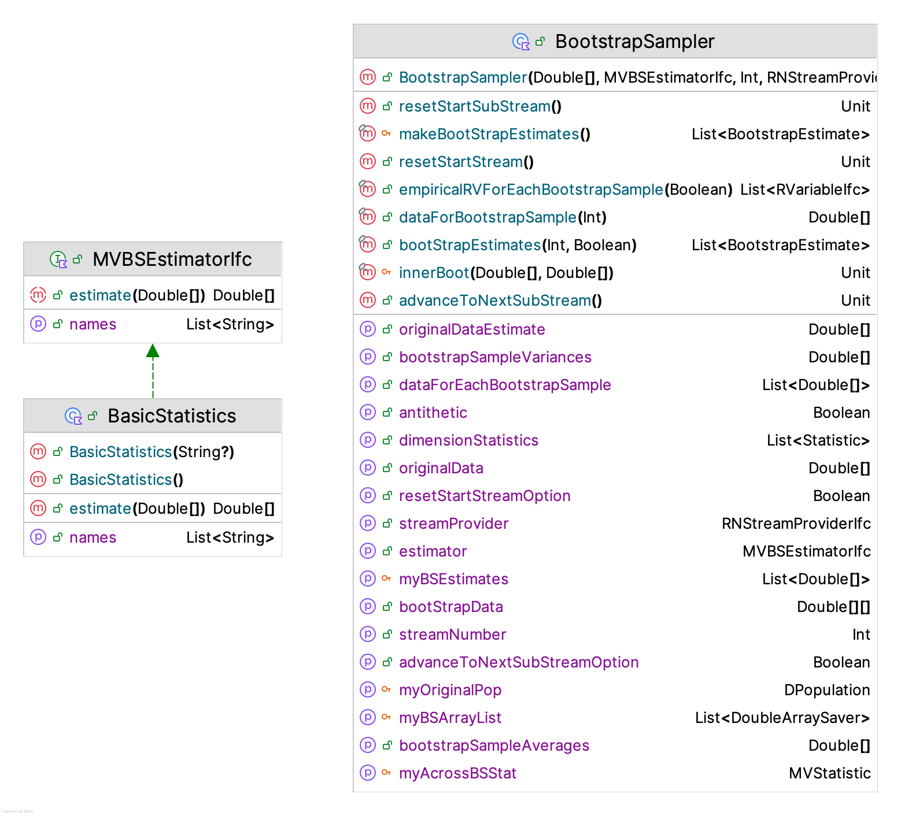

# Advanced Monte Carlo Methods {#ch9AdvMC}

**[Learning Objectives]{.smallcaps}**

- To be able to explain and apply the basic principles of bootstrap sampling
- To be able to apply variance reduction techniques to simulation experiments
- To be able to apply the main techniques recommended for generating multi-variate random variables
- To be able to apply Markov Chain Monte Carlo techniques to the generation of random variables

This chapter builds on the methods presented in Appendix \@ref(appRNRV), Chapter \@ref(ch2rng), and Chapter \@ref(mcm) to present advanced Monte Carlo techniques that are often applied in practice.  The chapter begins with a discussion of bootstrap sampling methods.  Bootstrap sampling was popularized by [@efron-tibshirani] and remains a practical and useful technique that every simulation practitioner should be able understand and apply. Then, the chapter presents more details on the application of variance reduction techniques (VRTs). While some of the facilities of the KSL for the application of two variance reduction techniques (common random numbers and antithetic variates) have already been presented, this chapter will provide more details on the theory of those and other variance reduction techniques. In addition, the application of the techniques will be illustrated via some simple examples.  As discussed in Chapter \@ref(ch2rng), the KSL has exceptional functionality for the generation from uni-variate distributions.  In this chapter, the capabilities for generating from multi-variate distributions will be reviewed and illustrated via some simple examples. Finally, a brief discussion of the important topic of Markov Chain Monte Carlo (MCMC) will be provided. Then, the KSL's framework for performing MCMC will be illustrated.  This chapter assumes that the reader is familiar with the general concepts presented in Appendix \@ref(appRNRV), Chapter \@ref(ch2rng), and Chapter \@ref(mcm).

## Bootstrap Methods {#ch9BootStrapping}

Bootstrapping is a statistical procedure that resamples from a sample to create many simulated samples. Although there are some parametric bootstrapping approaches, bootstrapping is generally considered a non-parametric Monte Carlo method that estimates characteristics of a population by resampling. The samples from the original sample are used to make inferences about the population and about the statistical properties computed from the original sample. The intuitions associated with bootstrapping come from a deep understanding of what it means to sample.

The concepts of estimation theory presented in Section \@ref(ch3StatReview) of Chapter \@ref(mcm) are based on having a random sample. Let $x_{i}$ represent the $i^{th}$ observations in a sample, $x_{1}, x_{2},\cdots,x_{n}$ of size $n$. Represent the *random variables* in the sample as $X_{1}, X_{2},\cdots,X_{n}$. The
random variables form a **random sample**, if 1) the $X_{i}$ are independent
random variables and 2) every $X_{i}$ has the same probability distribution. We assume that the random sample comes from some *population*.  In statistical estimation theory, a population is the complete set of items from which we desire to make inferences. We assume that the population represents a set of things that have one or more characteristics in common.  A population may be finite or infinite. In the case of a finite population, the size of the population may be so large or it may be too time consuming or costly to enumerate all elements of the population. However, conceptually, for a finite population, we can assign an integer to each element and thus count the elements and the final number of elements will be finite number. In the case of an infinite population, the definition of the underlying characteristics of the items makes enumeration impossible.  That is, we cannot represent the number of elements in the population with a finite integer.

The concept of a finite population and an infinite population is sometimes confused with the concepts of discrete and continuous random variables.  A continuous random variable has (by the underlying characteristics of its elements) an infinite population.  For example, consider a random variable representing the time of arrival, $A_i$.  Since the underlying quantity is *time*, we note that time (conceptually) is a continuous thing, it is infinitely divisible and has no limit (at least based on our current understand of physics).  A discrete random variable can have either a finite or an infinite population.  Consider for example, the number of heads within 100 flips of a coin. This random variable is governed by a binomial distribution, and can take on any of the values $0, 1, 2, \cdots, n$ where $n=100$, the (finite) number of trials. In this case, the population (set of possible values) is finite.  However, now consider a geometric random variable. The set of possible values for a geometric random variable $0, 1, 2, \cdots,$. That is, we could (in theory, however unlikely), wait an "infinite" amount of time until the first success occurs. The population of a geometric random variable (although discrete) is infinite. 

Sampling theory and statistical inference are applied to situations involving both finite and infinite populations. In many of the cases of finite populations, it is impractical to enumerate the items. In the case of an infinite population, it is *impossible* to enumerate the items. Thus, we are forced to sample from the population. That is, select through some mechanism, a subset of the elements of the population. If we select the elements in the sample in such a manner that each element in the sample is equally likely to have come from the population, then we have a random sample. 

In essence, bootstrapping takes this notion one step further. In bootstrapping, we **assume** that some original random sample is *essentially* the population. That is, we assume that a random sample, if large enough, can act as the actual population. Thus, sampling from the sample is, in essence, sampling from the population.  This sampling and resampling process can provide information about the properties of statistical quantities computed from the original sample.  Bootstrapping assumes that if the original sample is representative of the true population, then statistics generated from samples of the original sample of the population provide observations of the *sampling* distribution. 

Let's formalize these concepts with some notation and an informal overview of some of the theory associated with bootstrapping.  The interested reader should refer to [@efron-tibshirani-1986], [@efron-tibshirani], and [@davison-hinkley] for more detailed treatments. This presentation follows somewhat the tutorial [@wehrens2000]. Let the cumulative distribution function of some random variable, $X$, be denoted as $F.$ Let $x_{1}, x_{2},\cdots,x_{n}$ be a set of observed values of $X$ from $F.$  Suppose that there is some unknown parameter $\theta$ that represents a population parameter of interest.  For example, $\theta$ might be the mean, median, correlation, etc. Suppose that $\theta$ can be expressed or computed by some function $t(\cdot)$ applied to the distribution function $F$.  That is, we can write $\theta = t(F)$. For example, in the case of the population mean, $E[X] =\theta$, $t(\cdot)$ is the expectation function such that $\theta = \int xdF(x)$.

In general, because the underlying probabilistic description of the population may not be known, we usually do not know $F$. However, we are able to sample (through some mechanism) observations $\vec{x}=(x_{1}, x_{2},\cdots,x_{n})$ from $F$ via the random variable $X$.  This sample represents the empirical distribution, $F_n(x)$, of $F$. That is, $F_n(x)$ is an estimate of $F$.

We can either use $F_n(x)$ to estimate $\theta$ or use some function $u(\cdot)$ applied to the sample to estimate $\theta$. That is, we can formulate an estimator, $\hat{\theta} = t(F_n) = u(\vec{x})$. For example in the case of the population mean, $E[X] =\theta$, $u(\cdot)$  is the sample mean, $\bar{X}=\frac{1}{n}\sum_i^n X_i$. In bootstrapping, this equivalence is called the *plug-in principle*.  As we will see, bootstrapping makes a more explicit use of the empirical distribution, $F_n$.

Since we have that $(x_{1}, x_{2},\cdots,x_{n})$ is a set of observed values of $X$ from $F$, let's define $\vec{x}^{*}=(x^{*}_{1}, x^{*}_{2},\cdots,x^{*}_{n})$ as a set of observations from $F_n$.  That is, define $X^{*}$ to be a possible observation selected at random from $(x_{1}, x_{2},\cdots,x_{n})$. Thus, $F_n(x) = P(X^{*}=x_i)= 1/n$ for $i=1,2,\cdots, n$.  Let $\vec{X}^{*}=(X^{*}_{1}, X^{*}_{2},\cdots,X^{*}_{n})$ be a random sample of size $n$ from $P(X^{*}=x_i)$. Then, the random variables $(X^{*}_{1}, X^{*}_{2},...X^{*}_{n})$ are independent and uniformly distributed over the set $(x_{1}, x_{2},\cdots, x_{n})$.  Notice that values within $(x^{*}_{1}, x^{*}_{2},\cdots,x^{*}_{n})$ may be repeated because the sampling is done with replacement (to ensure that they are uniformly likely).  Note also that we can form as many samples $(x^{*}_{1}, x^{*}_{2},\cdots,x^{*}_{n})$ as we want by repeating the sampling procedure from $F_n$. 

The empirical distribution, $F_n(x)$, is an estimator for $F(x)$ and it can be shown that $F_n$ is a sufficient statistic for $F$.  To summarize, $F$ yields random variables $X$ of which we have a sample, which yields $F_n$. When we sample from $F_n$, we get random variables $X^{*}$. These samples from $F_n$ also have an empirical cumulative distribution function (ECDF).  Let's denote the ECDF of $F_n$ as $F^{*}_n$. Thus, a statistic formed from $(x^{*}_{1}, x^{*}_{2},\cdots,x^{*}_{n})$ will be a *possible* statistic computed on  $(X_{1}, X_{2},\cdots,X_{n})$.  Since a statistic computed from $(x^{*}_{1}, x^{*}_{2},\cdots,x^{*}_{n})$ yields a *possible* statistic computed on  $(X_{1}, X_{2},\cdots,X_{n})$, these are possible observations from the sampling distribution of the estimator. This allows for the estimation of some parameter $\theta$ of $F(x)$ and the variability of the estimator by resampling. This is the basis of the bootstrapping principle. 

We call the samples $(x^{*}_{1}, x^{*}_{2},\cdots,x^{*}_{n})$ bootstrap samples. Let $x^{*(b)}$ be the $b^{th}$ bootstrap sample from $F_n(x)$, with $b=1,2,\cdots,B$, where $B$ is the number of bootstrap samples. Let $\hat{\theta}$ be some estimator of $\theta$ and let $\hat{\theta}^{*}_{b}$ be an observation of $\hat{\theta}$ based on the $b^{th}$ bootstrap sample, $x^{*(b)}$.  The quantities, $\hat{\theta}^{*}_{b}$ for $b=1,2,\cdots,B$ are called the bootstrap replicates (of the estimator).

The bootstrap estimate of the sampling distribution of $\hat{\theta}^{*}_{b}$, $F_{\hat{\theta}^{*}_{b}}(\cdot)$ is the empirical distribution of $(\theta^{*}_{1}, \theta^{*}_{2},\cdots,\theta^{*}_{n})$.  Thus, $F_{\hat{\theta}^{*}_{b}}(\cdot)$ provides information on the sampling distribution of $\hat{\theta}$.  The quality of the information depends entirely on the quality of the original sample $(x_{1}, x_{2},\cdots,x_{n})$ of $X$ from $F$.  Therefore, $\hat{\theta}$ is a statistic computed from the original sample, and $\hat{\theta}^{*}$ is a statistic computed from the resample.  The bootstrap principle assumes that $F^{*}\approx F$ and the variation in $\hat{\theta}$ is well approximated by the variation in $\hat{\theta}^{*}$.

If the bootstrap principle holds, then we can use the bootstrapping process to develop an estimate of the standard error of our estimator. We have an estimator, $\hat{\theta}$. It has some variance, $var(\hat{\theta})$ and standard deviation, $\sqrt{var(\hat{\theta})}$. This quantity is called the standard error of the estimator. That is, $se(\hat{\theta}) = \sqrt{var(\hat{\theta})}$. The bootstrap estimator of the standard error of the estimator,$\hat{\theta}$, is:

$$
\widehat{se(\hat{\theta})} = \sqrt{\frac{1}{B-1}\sum_{b=1}^{B}\big(\hat{\theta}^{*}_{b} - \bar{\hat{\theta^{*}}} \big)^2}
$$
where the quantity, $\bar{\hat{\theta^{*}}}$, is the average over the computed bootstrap estimates of the estimator:

$$
\bar{\hat{\theta^{*}}} =\frac{1}{B}\sum_{b=1}^{B}\hat{\theta}^{*}_{b}
$$

As you can see, the bootstrap estimator for the standard error of the estimator, $\widehat{se(\hat{\theta})}$, is simply the sample standard deviation of the bootstrap replicates.

The bootstrapping process not only provides information about the standard error of the estimator, $\hat{\theta}$, it can also provide information about the bias of the estimator. If $\hat{\theta}$ is an unbiased estimator of $\theta$ then $E[\hat{\theta}] = \theta$.  Thus, the bias of an estimator, $\hat{\theta}$, for $\theta$ is: 

$$
bias(\hat{\theta}) = E[\hat{\theta} - \theta] = E[\hat{\theta}] - \theta
$$
To estimate the bias, the bootstep process uses the bootstrap replicates of $\hat{\theta}^{*}_{b}$ to estimate the sampling distribution of $\hat{\theta}$ to get:

$$
\widehat{bias}(\hat{\theta}) = \bar{\hat{\theta^{*}}} - \hat{\theta}
$$
where $\hat{\theta}$ is the estimate of $\theta$ computed from the original sample,$(x_{1}, x_{2},.\cdots,x_{n})$. The bias and standard error of the estimator provide information about the accuracy and precision of the estimator. We can also provide confidence intervals for the estimator based on the bootstrapping process. 

To derive confidence intervals from the bootstrapping process consider the probability distribution associated with $\hat{\theta} - \theta$.  Suppose $\gamma_{\alpha}$ denotes  the $\alpha$-percentile of the distribution of $\hat{\theta} - \theta$, then a confidence interval for $\theta$ is based on the probability statement:

$$
P\Bigg( \gamma_{\alpha/2} \leq \hat{\theta} - \theta \leq \gamma_{1-\alpha/2}\Bigg) = 1-\alpha
$$
After rewriting this statement, we have an interval of the form:

$$
\hat{\theta}-  \gamma_{1-\alpha/2} \leq \theta \leq \hat{\theta} - \gamma_{\alpha/2}
$$
Within the bootstrap literature a number of approaches have been developed that provide *approximate* confidence intervals based on the previously noted form.  These include:

- standard normal bootstrap confidence interval (SNBCI)
- basic bootstrap confidence interval (BBCI)
- bootstrap percentile confidence interval (BPCI)
- bootstrap bias corrected and acceleration adjusted (BCa)
- bootstrap-t confidence interval (BTCI), sometimes called the percentile-t confidence interval

The standard normal bootstrap confidence interval is useful to consider first because of its simplicity; however, the quality of the confidence intervals can be poor unless its assumptions hold.  Based on the central limit theorem, we know that if the estimator, $\hat{\theta}$, is the sample average, then for large sample sizes, we have:

$$
Z = \frac{\hat{\theta}-E[\hat{\theta}]}{se(\hat{\theta})}
$$
with $Z\approx N(0,1)$.  Therefore if $\hat{\theta}$ is unbiased, an approximate $100\times(1-\alpha)\%$ confidence interval will have the form:

$$
\hat{\theta}-  z_{1-\alpha/2} se(\hat{\theta}) \leq \theta \leq \hat{\theta} + z_{1-\alpha/2}se(\hat{\theta})
$$
To apply bootstrapping to compute this interval, we simply estimate $se(\hat{\theta})$ with the bootstrap estimator of the standard error of the estimator, $\widehat{se(\hat{\theta})}$.

The basic bootstrap confidence interval (BBCI), is also relatively simple. This confidence interval assumes that the distribution of $\hat{\theta} - \theta$ is *approximately* the same as $\hat{\theta} - \theta^*$.  Suppose that $\hat{\theta}$ is an estimator for $\theta$.

$$
\begin{aligned}
1-\alpha & \approx P\Bigg( \hat{\theta}^{*}_{\alpha/2} \leq \hat{\theta}^* \leq \hat{\theta}^{*}_{1-\alpha/2}\Bigg)\\
          & = P\Bigg( \hat{\theta}^{*}_{\alpha/2} - \hat{\theta} \leq \hat{\theta}^{*} - \hat{\theta} \leq \hat{\theta}^{*}_{1-\alpha/2} - \hat{\theta}\Bigg)\\
          & =  P\Bigg(  \hat{\theta} - \hat{\theta}^{*}_{\alpha/2}  \geq \hat{\theta} - \hat{\theta}^{*} \geq \hat{\theta} - \hat{\theta}^{*}_{1-\alpha/2} \Bigg)\\
          & \approx P\Bigg(  \hat{\theta} - \hat{\theta}^{*}_{\alpha/2}  \geq \theta - \hat{\theta} \geq \hat{\theta}-\hat{\theta}^{*}_{1-\alpha/2} \Bigg)\\
          & =  P\Bigg(  2\hat{\theta} - \hat{\theta}^{*}_{\alpha/2}  \geq \theta \geq 2\hat{\theta}-\hat{\theta}^{*}_{1-\alpha/2} \Bigg)\\
\end{aligned}
$$

Thus, we have the lower limit as $L = 2\hat{\theta}-\hat{\theta}^{*}_{1-\alpha/2}$ and the upper limit as $U = 2\hat{\theta} - \hat{\theta}^{*}_{\alpha/2}$. We can estimate $\hat{\theta}^{*}_{\alpha/2}$ and $\hat{\theta}^{*}_{1-\alpha/2}$ by the percentiles of the bootstrap replicates distribution, which yields a final BBCI approximate $100\times(1-\alpha)\%$ confidence interval as:

$$
2\hat{\theta}-  \hat{\theta}^{*}_{1-\alpha/2} \leq \theta \leq 2\hat{\theta} -\hat{\theta}^{*}_{\alpha/2}
$$
where $\theta^{*}_{p}$ is the $p^{th}$ sample quantile from the empirical distribution of the bootstrap replicates.

The percentile bootstrap confidence interval (PBCI) uses the empirical distribution of the bootstrap replicates to estimate the quantiles for the sampling distribution of $\hat{\theta}$.  Suppose $(\theta^{*}_{1}, \theta^{*}_{2},\cdots,\theta^{*}_{n})$ are the bootstrap replicates of $\hat{\theta}$. From the empirical distribution of $(\theta^{*}_{1}, \theta^{*}_{2},\cdots,\theta^{*}_{n})$ compute the $\alpha/2$ quantile, say $\theta^{*}_{\alpha/2}$ and the $1-\alpha/2$ quantile, $\theta^{*}_{1-\alpha/2}$. Then, approximate $100\times(1-\alpha)\%$ PBCI confidence interval is:

$$
(\hat{\theta}^{*}_{1-\alpha/2}, \, \hat{\theta}^{*}_{\alpha/2})
$$

The bootstrap bias corrected and acceleration adjusted (BCa) interval modifies the percentile bootstrap confidence interval by correcting for bias and adjusting for possible skewness in the sampling distribution of the estimator. The theory and quality of this confidence interval is discussed in [@efron-tibshirani]. An approximate $100\times(1-\alpha)\%$ BCa confidence interval is $(\hat{\theta}^{*}_{\alpha_1}, \, \hat{\theta}^{*}_{\alpha_2})$ where $\alpha_1$ and $\alpha_2$ are defined as follows:

$$
\alpha_1 = \Phi\bigg( \hat{z}_0 + \frac{\hat{z}_0 + z_{\alpha/2}}{1-\hat{a}(\hat{z}_0 + z_{\alpha/2})}\bigg)
$$

$$
\alpha_2 = \Phi\bigg( \hat{z}_0 + \frac{\hat{z}_0 + z_{1-\alpha/2}}{1-\hat{a}(\hat{z}_0 + z_{1-\alpha/2})}\bigg)
$$

where $z_p = \Phi^{-1}(p)$. The bias correction factor, $z_0$, is given as follows. 

$$
z_0 =  \Phi^{-1}\bigg( \frac{1}{B}\sum_{b=1}^{B}I(\hat{\theta}^{*}_{b} < \hat{\theta})\bigg)
$$

where $I(\cdot)$ is an indicator function. The acceleration adjustment factor, $\hat{a}$, is given as follows. 

$$
\hat{a} = \frac{\sum_{i=1}^{n}\big( \bar{\theta}_{(\cdot)} - \theta_{(i)} \big)^3}{6\sum_{i=1}^{n}\bigg(\big( \bar{\theta}_{(\cdot)} - \theta_{(i)} \big)^2\bigg)^{3/2}}
$$
The quantity $\bar{\theta}_{(\cdot)}$ is the mean of the estimates of the leave one out jackknife samples, with:

$$
\bar{\theta}_{(\cdot)} = \frac{1}{n}\sum_{i=1}^{n}\hat{\theta}_{(i)}
$$

and $\hat{\theta}_{(i)}$ is the $i^{th}$ jackknife replicate.  The jackknife replicates, $\hat{\theta}_{(i)}$ for $i=1,2,\cdots,n$ are computed by applying the estimator, $\hat{\theta} = T_n(x)$ on the jackknife samples.  A jackknife sample, $\vec{x}_{(i)}$, is a subset of $(x_{1}, x_{2},\cdots, x_{n})$ that leaves out the $i^{th}$ observation such that:

$$
\vec{x}_{(i)} =(x_{1}, \cdots,x_{i-1},x_{i+1},\cdots, x_{n})
$$
Thus, $\hat{\theta}_{(i)} = T_{n-1}(\vec{x}_{(i)})$ for $i=1,2,\cdots,n$.  Jackknifing is another form of resampling that is often applied to reduce the bias in an estimator.  We will not discuss the theory of jackknifing in this text, but we will point out that the KSL has support for the approach.

The bootstrap-t (BTCI) provides an approximate confidence interval by considering the distribution of

$$
\frac{\hat{\theta}-\theta}{se(\hat{\theta})}
$$

As we know from basic statistical theory, if $\hat{\theta}$, is the sample average and the $se(\hat{\theta})$ is estimated by the sample error when the observations are IID normal, then this ratio should have a student-t distribution. In the PTCI approach, does not assume a student-t distribution, but rather uses the bootstrap observations of:

$$
t^{*}_{b} = \frac{\hat{\theta}^{*}_{b}-\hat{\theta}}{\widehat{se}(\hat{\theta}^{*}_{b})}
$$

Notice that $\widehat{se}(\hat{\theta}^{*}_{b})$ is the standard error of the $b^{th}$ *bootstrap sample* and that it may not have a closed form. If $\hat{\theta}$, is the sample average, then we can use the sample standard error of the $b^{th}$ bootstrap sample, $\vec{x}^{*}_{b} = (x^{*}_{1}, x^{*}_{2},...x^{*}_{n})$.

In general for this approach, the reference distribution is formed from resamples from the bootstrap sample.  As usual, suppose that $(x_{1}, x_{2},...x_{n})$ is the original sample. Then, the $100 \times (1-\alpha)\%$ bootstrap t-interval is:

$$
\big( \hat{\theta} - t^{*}_{1-\alpha/2 }\widehat{se}(\hat{\theta}^{*}), \hat{\theta} - t^{*}_{\alpha/2 }\widehat{se}(\hat{\theta}^{*})\big)
$$

We compute $\widehat{se}(\hat{\theta}^{*})$, $t^{*}_{\alpha/2 }$, and $t^{*}_{1-\alpha/2 }$ as follows:

1. Compute $\hat{\theta}$ from $\vec{x}=(x_{1}, x_{2},...x_{n})$
2. For $b = 1 \; \text{to} \;  B$
  a. Sample from $\vec{x}^{*}_{b}$ with replacement from $\vec{x}$.
  b. Compute $\theta^{*}_{b}$ from $\vec{x}^{*}_{b}$.
  c. Estimate the standard error $\widehat{se}(\hat{\theta}^{*}_b)$ from sampling from $\vec{x}^{*}_{b}$. In the case of $\hat{\theta}$ being the mean, then the standard error of the bootstrap sample can be directly computed, without sampling.
  d. Compute
  $$
  t^{*}_b = \frac{\theta^{*}_{b}-\hat{\theta}}{\widehat{se}(\hat{\theta}^{*}_b)}
  $$
3. The sample $(t^{*}_1, t^{*}_2, \cdots, t^{*}_B)$ is the reference distribution for the bootstrap t-statistic. From these observations, find $t^{*}_{\alpha/2 }$, and $t^{*}_{1-\alpha/2 }$.
4. Compute $\widehat{se}(\hat{\theta}^{*})$ as the sample standard deviation of the $\theta^{*}_{b}$ for $b=1,2,\cdots, B$
5. Compute the confidence intervals

$$
\big( \hat{\theta} - t^{*}_{1-\alpha/2 }\widehat{se}(\hat{\theta}^{*}), \hat{\theta} - t^{*}_{\alpha/2 }\widehat{se}(\hat{\theta}^{*})\big)
$$

[@efron-tibshirani-1986] discuss many of the characteristics of the different bootstrap confidence intervals.  Of the five presented here, the bootstrap percentile confidence interval is often utilized; however, because the BCa essentially corrects for bias and skewness issues for the BPCI, we would recommend utilizing the BCa.  The next recommended confidence interval would be the bootstrap-t; however, because it often requires an extra bootstrapping step to estimate $\widehat{se}(\hat{\theta}^{*}_b)$ it can require a substantial amount of extra computation. Thus, the bootstrap-t has not found wide acceptance in practice, except in the case of when the estimator is the sample average.

### Bootstrapping Using the KSL

In this section, we will explore how the KSL supports the application of bootstrapping. First, we will illustrate how to do bootstrapping using basic KSL constructs.  This is intended to illustrate the overall bootstrapping process.  Then we will discuss KSL constructs that encapsulate the bootstrapping process within classes.  In essence, bootstrapping is just sampling again and again from some discrete population.  Thus, the KSL `DPopulation` class can serve as a starting point.  Alternatively, the KSL `EmpiricalRV` class can be used. Let's start with a simple example that has an original sample size of 10 elements. For example, assume through some sampling process we have selected 10 students (at random) and counted the number of books in their backpack. The following code illustrates placing the data in an array and computing some basic statistics related to the sample.

```kt
// make a population for illustrating bootstrapping
val mainSample = doubleArrayOf(6.0, 7.0, 5.0, 1.0, 0.0, 4.0, 6.0, 0.0, 6.0, 1.0)
println("Sample of size 10 from original population")
println(mainSample.joinToString())
println()
// compute statistics on main sample
val mainSampleStats = Statistic(mainSample)
println("Main Sample")
println("average = ${mainSampleStats.average}")
println("90% CI = ${mainSampleStats.confidenceInterval(.90)}")
println()
```

Running this code results in the following:

```
Sample of size 10 from original population
6.0, 7.0, 5.0, 1.0, 0.0, 4.0, 6.0, 0.0, 6.0, 1.0

Main Sample
average = 3.599999999999999
90% CI = [1.978733917471777, 5.221266082528222]
```

In the notation that we have been using $\bar{x} = \hat{\theta} = 3.5\bar{9}$. The sample size is small and it is very unlikely that the distribution of the number books in a student's backpack would be normally distributed. Therefore, the reported confidence interval is certainly approximate.  The KSL `Statistic` class reports its confidence interval assuming a Student-T distribution.  We would like to use bootstrapping to produce a confidence interval.  We can get started by treating our original sample as if it is the population and sampling from it.  Here is some KSL code to illustrate this process.

```kt
// make the sample our pseudo-population
val samplePopulation = DPopulation(mainSample)
val bootStrapAverages = mutableListOf<Double>()
// illustrate 10 bootstrap samples
println("BootStrap Samples:")
for (i in 1..10){
    val bootStrapSample = samplePopulation.sample(10)
    val avg = bootStrapSample.average()
    println("sample_$i  = (${bootStrapSample.joinToString()}) with average = $avg")
   bootStrapAverages.add(avg)
}
println()
val lcl = Statistic.percentile(bootStrapAverages.toDoubleArray(), 0.05)
val ucl = Statistic.percentile(bootStrapAverages.toDoubleArray(), 0.95)
val ci = Interval(lcl, ucl)
println("Percentile based 90% ci = $ci")
```

In this code, we first create an instance of `DPopulation` using the array of observations of the book count data. Then, a list is created to hold the averages of each bootstrap sample.  The loop creates 10 bootstrap samples and captures the average of each sample. Notice that the `DPopulation` is used to sample *with replacement* a sample of size 10. It is important that the sample size, 10, be the same as the size of the original sample because our confidence statements are about the original sample (with size 10).  Given the bootstrap averages are captured in a list, `bootStrapAverages,` we can then use the percentile method to get the lower and upper limits for the confidence interval based on the bootstrap reference distribution.

```
BootStrap Samples:
sample_1  = (0.0, 1.0, 1.0, 7.0, 1.0, 1.0, 1.0, 0.0, 1.0, 1.0) with average = 1.4
sample_2  = (5.0, 1.0, 1.0, 6.0, 4.0, 7.0, 0.0, 1.0, 5.0, 6.0) with average = 3.6
sample_3  = (0.0, 5.0, 4.0, 6.0, 1.0, 4.0, 7.0, 0.0, 1.0, 6.0) with average = 3.4
sample_4  = (6.0, 5.0, 0.0, 1.0, 6.0, 6.0, 6.0, 1.0, 6.0, 1.0) with average = 3.8
sample_5  = (5.0, 1.0, 0.0, 0.0, 0.0, 1.0, 0.0, 6.0, 6.0, 6.0) with average = 2.5
sample_6  = (4.0, 7.0, 1.0, 0.0, 0.0, 0.0, 0.0, 7.0, 0.0, 1.0) with average = 2.0
sample_7  = (5.0, 6.0, 1.0, 6.0, 0.0, 6.0, 6.0, 1.0, 5.0, 7.0) with average = 4.3
sample_8  = (7.0, 6.0, 4.0, 1.0, 1.0, 1.0, 6.0, 1.0, 7.0, 6.0) with average = 4.0
sample_9  = (0.0, 6.0, 1.0, 6.0, 6.0, 5.0, 7.0, 4.0, 1.0, 1.0) with average = 3.7
sample_10  = (5.0, 6.0, 7.0, 0.0, 6.0, 6.0, 5.0, 0.0, 1.0, 0.0) with average = 3.6

Bootstrap sample averages
1.4, 3.6, 3.4, 3.8, 2.5, 2.0, 4.3, 4.0, 3.7, 3.6

Percentile based 90% ci = [1.4, 4.3]
```

The results show 10 bootstrap samples.  Notice that due to sampling with replacement, we can have values in the bootstrap samples that repeat and that it is clearly possible that some observations within the original sample, do not appear in the bootstrap samples. It is important to note that this bootstrap confidence interval is for our original estimate, $\bar{x} = \hat{\theta} = 3.5\bar{9}$.  The bootstrap sample averages, $(1.4, 3.6, 3.4, 3.8, 2.5, 2.0, 4.3, 4.0, 3.7, 3.6)$ represent the bootstrap estimate of the sampling distribution of $\hat{\theta}^{*}_{b}$, $F_{\hat{\theta}^{*}_{b}}(\cdot)$, which we are using as an approximation for the sampling distribution of $\hat{\theta}$.

The idea of repeatedly sampling from a given population has been implemented into a set of classes within the KSL that will perform the bootstrapping process and compute a variety of quantities (including confidence intervals) based on the bootstrap samples.  Figure \@ref(fig:BootstrapFig) presents the `BootstrapEstimateIfc` interface, the main implementation of this interface (`Bootstrap`), and a data class, `BootstrapEstimate,` that is useful when building approaches that require bootstrapping.

<div class="figure">

<p class="caption">(\#fig:BootstrapFig)KSL Bootstrap Classes</p>
</div>

The `Bootstrap` class requires an array of doubles that represents the original data from which resampling will occur. While implementing the `BootstrapEstimateIfc` interface, the `Bootstrap` class also implements the `RNStreamControlIfc,` and `RNStreamChangeIfc` interfaces, which allow for the control of the underlying random numbers used within the sampling. It is useful to review the constructor of the `Bootstrap` class.

```kt
open class Bootstrap(
    originalData: DoubleArray,
    val estimator: BSEstimatorIfc = BSEstimatorIfc.Average(),
    stream: RNStreamIfc = KSLRandom.nextRNStream(),
    name: String? = null
) : IdentityIfc by Identity(name), RNStreamControlIfc, RNStreamChangeIfc, BootstrapEstimateIfc
```

As noted in the constructor, the class requires an array holding the original data, an instance of the `BSEstimatorIfc` interface, the stream for the random sampling and an optional name. The `BSEstimatorIfc` interface is a functional interface with an `estimate()` function.  Thus, this implementation assumes that the estimate can be computed from a uni-variate array of data and produces a single estimated quantity. The KSL also supports multiple estimated quantities from a uni-variate array of data.  

As can be noted from the default parameter for the estimator, the `BSEstimatorIfc` interface provides some basic statistical estimators (average, variance, median, minimum, maximum). Of course, the user should be able to implement others as needed.

```kt
fun interface BSEstimatorIfc {
    fun estimate(data: DoubleArray): Double
}
```

According to Figure \@ref(fig:BootstrapFig), the `Bootstrap` class also will compute the following:

- the bootstrap replicates, $\hat{\theta}^{*}_{b}$
- the bootstrap differences, $\hat{\theta}^{*}_{b} - \hat{\theta}$
- across bootstrap statistics, statistics on the replicates
- statistics for each bootstrap sample
- boot strap bias estimate
- boot strap standard error estimate
- normal bootstrap confidence interval
- basic bootstrap confidence interval
- percentile bootstrap confidence interval
- BCa bootstrap confidence interval
- bootstrap-t confidence interval

Once constructing an instance of the `Bootstrap` class is complete, you can call the `generateSamples()` function. The following code shows the `generateSamples()` function. The function requires the number of bootstrap samples to generate, and optionally, you can have the bootstrap samples saved, and indicate if the bootstrap-t samples are required.

```kt
    fun generateSamples(numBootstrapSamples: Int, saveBootstrapSamples: Boolean = false,
        numBootstrapTSamples: Int = 0
    ) {
        require(numBootstrapSamples > 1) { "The number of bootstrap samples must be greater than 1" }
        if (numBootstrapTSamples > 0) {
            require(numBootstrapTSamples > 1) { "The number of bootstrap-t samples must be greater than 1" }
        }
        this.numBootstrapSamples = numBootstrapSamples
        myAcrossBSStat.reset()
        myBSEstimates.clearData()
        myStudentizedTValues.clearData()
        for (s in myBSArrayList) {
            s.clearData()
        }
        myBSArrayList.clear()
        originalDataEstimate = estimator.estimate(myOriginalData)
        for (i in 0 until numBootstrapSamples) {
            val sample: DoubleArray = myOriginalPop.sample(myOriginalPop.size())
            val x = estimator.estimate(sample)
            myAcrossBSStat.collect(x)
            myBSEstimates.save(x)
            if (saveBootstrapSamples) {
                val das = DoubleArraySaver()
                das.save(sample)
                myBSArrayList.add(das)
            }
            if (numBootstrapTSamples > 1) {
                bootstrapTSampling(numBootstrapTSamples, x, sample)
            }
            innerBoot(x, sample)
        }
    }
```

This code is rather straightforward, having a loop to implement the sampling. In essence, it is not much different conceptually than the previously code using the `DPopulation` class. To setup and run bootstrapping for the book example, we have the following code:

```kt
    // make a population for illustrating bootstrapping
    val mainSample = doubleArrayOf(6.0, 7.0, 5.0, 1.0, 0.0, 4.0, 6.0, 0.0, 6.0, 1.0)
    println("Sample of size 10 from original population")
    println(mainSample.joinToString())
    println()
    // compute statistics on main sample
    val mainSampleStats = Statistic(mainSample)
    println("Main Sample")
    println("average = ${mainSampleStats.average}")
    println("90% CI = ${mainSampleStats.confidenceInterval(.90)}")
    println()
    // now to the bootstrapping
    val bs = Bootstrap(mainSample, estimator = BSEstimatorIfc.Average(), KSLRandom.rnStream(3))
    bs.generateSamples(400, numBootstrapTSamples = 399)
    println(bs)
```

Running this code results in the following:

```
Sample of size 10 from original population
6.0, 7.0, 5.0, 1.0, 0.0, 4.0, 6.0, 0.0, 6.0, 1.0

Main Sample
average = 3.5999999999999996
90% CI = [1.978733917471777, 5.221266082528222]

------------------------------------------------------
Bootstrap statistical results:
label = ID_4
------------------------------------------------------
statistic name = ID_4
number of bootstrap samples = 400
size of original sample = 10
original estimate = 3.5999999999999996
bias estimate = -0.05175000000000063
across bootstrap average = 3.548249999999999
bootstrap std. err. estimate = 0.04007502167379812
default c.i. level = 0.95
norm c.i. = [3.5214544007763693, 3.67854559922363]
basic c.i. = [2.002500000000003, 5.2974999999999985]
percentile c.i. = [1.902500000000001, 5.197499999999996]
BCa c.i. = [1.9000000000000001, 5.062949171806798]
bootstrap-t c.i. = [1.9000000000000001, 5.062949171806798]
------------------------------------------------------
```

In these results, it just happens that the BCa and bootstrap-t result in the same intervals.  The main question that comes up when bootstrapping is what value should be used for the number of bootstrap samples, $B$. [@efron-tibshirani] provide some guidance indicating a range at least starting in the hundreds.  There has been some work that suggests the the quality of the process is a function of $n$, the size of the original sample. The work suggests that larger $n$ requires larger $B$. The relationship $B \approx 40n$ has been suggested.

As previously mentioned, the KSL also supports the estimation of multiple quantities from the sample. This functionality is used extensively within the distribution modeling functionality of the KSL to provide confidence intervals on the parameters of distributions.  Figure \@ref(fig:MVBootstrapFig) presents the `BootstrapSampler` class, which will compute multiple estimators on a sample using the `MVBSEstimatorIfc` interface.

<div class="figure">

<p class="caption">(\#fig:MVBootstrapFig)KSL BootstrapSampler Classes</p>
</div>

As shown in the following code, the `MVBSEstimatorIfc` interface defines a function that takes in a sample and returns many estimated quantities.

```kt
/**
 *  Given some data, produce multiple estimated statistics
 *  from the data and store the estimated quantities in
 *  the returned array. It is up to the user to interpret
 *  the array values appropriately.
 */
interface MVBSEstimatorIfc {
    /**
     * The name to associate with each dimension of the
     * array that is returned by estimate(). The names
     * should be unique. The order of the list of names should
     * match the order of elements in the returned array.
     */
    val names: List<String>

    fun estimate(data: DoubleArray): DoubleArray
}
```

The following code illustrates the use of the `BootstrapSampler` class.

```kt
val ed = ExponentialRV(10.0)
val data = ed.sample(50)
val stat = Statistic(data)
println(stat)
println()
val bss = BootstrapSampler(data, BasicStatistics())
val estimates = bss.bootStrapEstimates(300)
for(e in estimates){
  println(e.asString())
}
```

This code samples from an exponential distribution to get the initial sample and then uses the `BootstrapSampler` class to provide bootstrap estimates for the basic statistics.  The `BasicStatistics` class is just a simple implementation of the `MVBSEstimatorIfc` interface that computes the average, variance, minimum, maximum, skewness, kurtosis, lag-1 correlation, and lag-1 covariance. 

```kt
class BasicStatistics : MVBSEstimatorIfc{

    private val stat = Statistic()

    override val names: List<String> = listOf(
        "average", "variance", "min", "max", "skewness", "kurtosis",
        "lag1Correlation", "lag1Covariance")

    override fun estimate(data: DoubleArray): DoubleArray {
        stat.reset()
        stat.collect(data)
        val array = DoubleArray(8)
        array[0] = stat.average
        array[1] = stat.variance
        array[2] = stat.min
        array[3] = stat.max
        array[4] = stat.skewness
        array[5] = stat.kurtosis
        array[6] = stat.lag1Correlation
        array[7] = stat.lag1Covariance
        return array
    }
}
```

This same approach could be used to add additional statistics. The output from the sampling can be quite extensive and thus is not provided here. For a final discussion of bootstrapping, we discuss the KSL capabilities for bootstrapping cases and illustrate its application to bootstrapping a simple regression model. 

The previous KSL bootstrapping functionality focused on uni-variate data.  The same concepts can also be applied to multi-variate data.  Since the data structures to hold multi-variate data can be complex, we focus on representing the population of items via identifiers.  That is, we assume that each item in the population can be assigned a unique label and that the sampling and resampling process takes place on the set of identifiers.  The sampled identifiers then can be used to index into some complex data structure to select the sampled items.  Then from each item, a set of values are observed.  Thus, each sampled item, $i$, results in a set of observations $\vec{x_i}=x_1, x_2, \cdots, x_m$, where $m$ is the number of attributes observed about each item. In some bootstrapping literature, the set of sampled items is called the cases, with each item called a case. Thus, in this situation, the bootstrapping process is sometimes called case based bootstrapping. 

Within a programming context, we can represent each item with an object, which has some attributes. The attributes represent the data observed about the object. Placing the objects into a collection, permits sampling from the collection.  For example, the cases could be the rows in a regression data set. The data could be stored in arrays, in data frames, database tables, etc.  As long as each item the population can be uniquely labeled, we can sample the labels, and then select the items based on their identifiers.

<div class="figure">

<p class="caption">(\#fig:CaseBootstrapFig)KSL CaseBootstrapSampler Classes</p>
</div>

Figure \@ref(fig:CaseBootstrapFig) presents the `CaseBootstrapSampler` class, which will compute multiple estimators using case based sample via the `CaseBootEstimatorIfc` interface. This sampler has similar functionality as the `BootstrapSampler` class.  As in the `BootstrapSampler` situation, we assume that the estimation process may result in one or more estimated quantities; however, in this situation, the estimation process requires a set of items from which the quantities will be computed. 

It should be instructive to review the associated interfaces in Figure \@ref(fig:CaseBootstrapFig).  The `CaseBootstrapSampler` class requires an instance of the `CaseBootEstimatorIfc` interface. The `CaseBootEstimatorIfc` interface does not define the data structure associated with the sampling process.  Instead, it defines a list of identifiers that represent the finite sample from which bootstrap sampling occurs. 

```kt
interface CaseBootEstimatorIfc {

    /**
     * The name to associate with each dimension of the
     * array that is returned by estimate(). The names
     * should be unique. The order of the list of names should
     * match the order of elements in the returned array. This
     * list is used to label the elements that are estimated.
     */
    val names: List<String>

    /**
     *  The estimates from the estimator based on the original (not resampled) data.
     */
    val originalEstimates: DoubleArray

    /**
     *  The set of case identifiers. This set must hold unique
     *  integers that serve as the sampling population. Elements (cases)
     *  are sampled with replacement from this set to specify
     *  the data that will be used in the estimation process.
     */
    val caseIdentifiers: List<Int>

    /**
     *  The [caseIndices] array contains the case identifiers that
     *  should be used to select the data on which the estimation
     *  process should be executed. The function produces an
     *  array of estimates during the estimation process, which
     *  are associated with the labels in the names list. The
     *  case indices array may have repeated case identifiers
     *  due to sampling with replacement.
     */
    fun estimate(caseIndices: IntArray): DoubleArray
}
```

As we can see from the previous Kotlin code, the `names` and `originalEstimates` properties have a similar functionality as in the `BootstrapSampler` class. The names are the labels for the things estimated from the sample.  

The property, `caseIdentifiers` is a list holding the identifiers for the cases. For example, if the cases are rows in a regression dataset, then the list might hold the values $(0,1,2,\cdots,n-1)$, where $n$ is the number of rows. That is, the list holds the *indices* of the rows.  The sampling process will sample from the identifier population and use the identifiers to access the actual items. This approach necessitates a different `estimate()` function. Here, the estimation process, requires an array of integers that represent the identifiers of the cases selected to be included in the estimation process.  Note that because the sampling is with replacement, the same item can be selected multiple times (or not at all) during the bootstrap sampling. Conceptually, this is no different from what we have previously illustrated, but now our population is simply a set of identifiers. 

The class `MatrixBootEstimator` is simply an implementation of the `CaseBootEstimatorIfc` interface designed to work with a rectangular array (i.e. a matrix) of data, where the rows are the cases. The interface `MatrixEstimatorIfc` is a convenience interface for directly computing the statistical quantities from a supplied matrix. The selection process for `MatrixBootEstimator` is simply to select the rows as shown in the following code.

```kt
    override fun estimate(caseIndices: IntArray): DoubleArray {
        // select the rows of the matrix from the supplied indices
        val m = Array(matrix.size) { matrix[caseIndices[it]] }
        return matrixEstimator.estimate(m)
    }
```

The `CaseBootstrapSampler` class samples the indices (`mySample`) in the following code, which is then supplied to the `estimate(caseIndices: IntArray)` function.

```kt
    fun sampleCases(): IntArray {
        for (i in myOriginalPopulation.indices) {
            val index = rnStream.randInt(0, myOriginalPopulation.size - 1)
            mySample[i] = myOriginalPopulation[index]
        }
        return mySample
    }
```


Finally, the object `OLSBootEstimator,` in Figure \@ref(fig:CaseBootstrapFig), is an object that implements the `MatrixEstimatorIfc` interface an computes the regression coefficients by assuming that the first column of the matrix is the regressor, $Y$, and the remaining columns represent the predictor matrix $X$. Because of the fact that we use the ordinary least squares estimation routines from the [Hipparchus library](https://hipparchus.org/), the $X$ matrix does not need to include the column for estimating the intercept term. 

Putting all of these concepts together, we can illustrate the bootstrapping of a regression estimation process. As shown in the following code, we generate some regression data. For simiplicity, we assume normally distributed predictors and error.

```kt
    // first make some data for the example
    val n1 = NormalRV(10.0, 3.0)
    val n2 = NormalRV(5.0, 1.5)
    val e = NormalRV()
    // make a simple linear model with some error
    val data = Array<DoubleArray>(100) {
        val x1 = n1.value
        val x2 = n2.value
        val y = 10.0 + 2.0*x1 + 5.0*x2 + e.value
        doubleArrayOf(y, x1, x2)
    }
    //data.write()
    // apply bootstrapping to get bootstrap confidence intervals on regression parameters
    val cbs = CaseBootstrapSampler(MatrixBootEstimator(data, OLSBootEstimator))
    val estimates = cbs.bootStrapEstimates(399)
    // print out the bootstrap estimates
    for(be in estimates){
        println(be)
    }
```

The results of the bootstrapping process are as follows. As we can see, the confidence intervals for the known regression coefficients $(\beta_0=10.0, \beta_1=2.0, \beta_2=5.0$) do a reasonable job of covering the known quantities.

```
------------------------------------------------------
Bootstrap statistical results:
------------------------------------------------------
statistic name = b0
number of bootstrap samples = 399
size of original sample = 100
original estimate = 10.997223980092517
bias estimate = 0.09157195462246293
across bootstrap average = 11.08879593471498
bootstrap std. err. estimate = 0.04090939870934704
default c.i. level = 0.95
norm c.i. = [10.917043031928365, 11.07740492825667]
basic c.i. = [9.052998742918017, 12.427568666255603]
percentile c.i. = [9.566879293929432, 12.941449217267017]

------------------------------------------------------
Bootstrap statistical results:
------------------------------------------------------
statistic name = b1
number of bootstrap samples = 399
size of original sample = 100
original estimate = 1.9494963162125691
bias estimate = -0.0037025407662301113
across bootstrap average = 1.945793775446339
bootstrap std. err. estimate = 0.002936548908845975
default c.i. level = 0.95
norm c.i. = [1.9437407861077505, 1.9552518463173878]
basic c.i. = [1.84302999325699, 2.0787441726888636]
percentile c.i. = [1.8202484597362747, 2.0559626391681483]

------------------------------------------------------
Bootstrap statistical results:
------------------------------------------------------
statistic name = b2
number of bootstrap samples = 399
size of original sample = 100
original estimate = 4.9390811206920375
bias estimate = -0.010600231082452005
across bootstrap average = 4.9284808896095855
bootstrap std. err. estimate = 0.004055345194183637
default c.i. level = 0.95
norm c.i. = [4.931132790160152, 4.947029451223923]
basic c.i. = [4.794185241695615, 5.111679266251416]
percentile c.i. = [4.766482975132659, 5.08397699968846]
```

For more of the theory and methods of bootstrapping within the context of regression, we refer the interested reader to the text, [@fox2018r]. Since the purpose of this section was to illustrate how the KSL facilitates bootstrapping, the interested reader may want to explore more of the theory.  From that standpoint, the books by [@efron-tibshirani] and [@davison-hinkley] are good starting points. See also the paper [@efron-tibshirani-1986].
 
## Variance Reduction Techniques {#ch9VRTs}

A variance reduction technique (VRT) represents a sampling strategy that has the overall goal of finding an estimator that will have lower variance than the typical estimator based on straightforward random sampling.  The objective of a VRT is to reduce the theoretical population variance of the **sampling** distribution associated with an estimator $\hat{\theta}$, of some population parameter $\theta$. For example, in many instances, we are interested in the population mean, $\theta$, and thus the standard estimator that is proposed is the sample mean $\hat{\theta} = \bar{Y}$. Suppose we have the following IID observations $(Y_1, Y_2, \cdots, Y_n)$ with $E[Y_i]=\theta$ and $\text{Var}[Y_i] = \sigma^{2}_{Y}$.  Then the standard (or so called crude) estimator for $\theta$ is $\bar{Y}$ and the variance of the estimator is 

$$
\text{Var}[\bar{Y}]=\text{Var}\bigg[\frac{1}{n}\sum_{i=1}^{n}Y_i \bigg] = \frac{1}{n^2}\sum_{i=1}^{n}\text{Var}[Y_i]=\frac{n \,\text{Var}[Y_i]}{n^2} = \frac{\text{Var}[Y_i]}{n}=\frac{\sigma^2_{Y}}{n}
$$


When applying a VRT, the goal is to do better than $\text{Var}[\bar{Y}]$. While it may be obvious, it is worth stating that the simplest variance reduction technique is to use a larger sample.  Consider estimating the population mean, $\theta$ based on a random sample using:

$$
\bar{Y}(n) = \frac{1}{n}\sum_{i=1}^{n}Y_i
$$
Here, we have emphasized that the estimator, $\bar{Y}(n)$ is a function of the sample size, $n$. So consider two estimators, $\hat{\theta}_1 = \bar{Y}(n_1)$ and $\hat{\theta}_2 =\bar{Y}(n_2)$ where $n_1 < n_2$. Thus, we will have that:

$$
\text{Var}[\bar{Y}(n_1)] = \text{Var}[\hat{\theta}_1] = \frac{\sigma^2_{Y}}{n_1}
$$

and, 

$$
\text{Var}[\bar{Y}(n_2)] = \text{Var}[\hat{\theta}_2] = \frac{\sigma^2_{Y}}{n_2}
$$
and thus because $n_1 < n_2$, we have that $\text{Var}[\bar{Y}(n_2)] < \text{Var}[\bar{Y}(n_1)]$. Thus, we have two estimators $\hat{\theta}_1$ and $\hat{\theta}_2$ where the variance of one estimator is smaller than the variance of another. In this particular case, both of the estimators are unbiased, and not considering the extra time that may be required to sample the larger sample, we would prefer the estimator $\hat{\theta}_2$ over the estimator $\hat{\theta}_1$ because  $\hat{\theta}_2$ has lower variance.  That is, the variance of its **sampling** distribution is lower. As noted, we have to ignore the possible extra computation time needed for $\hat{\theta}_2$.  In what follows, we will generally ignore computational issues, and in most of the VRT methods that will be presented, the assumption will be very reasonable.  However, there is also the effort needed to implement a more "complicated" sampling method than straightforward random sampling. In some modeling situations, this extra implementation effort should not be ignored when considering the possible use of a VRT.

The important thing to remember is that the variance reduction refers to reducing the population variance of the *estimator* of $\theta$. The parameter of interest does not have to be the mean.  The parameter $\theta$ can be any parameter of the underlying population. For example, we might try to estimate the median, quantile, or the population variance $\sigma^{2}_{Y}$.  One important point to remember, variance reduction methods do not affect the variability of the process (population).  That is $\sigma^{2}_{Y}$ does not change.  When applying a VRT, we are changing the variance associated with the *sampling distribution* of the estimator, $\hat{\theta}$.

The major types of variance reduction techniques to be discussed in this section, include:

1. Manipulating randomness
    a. Common Random Numbers (CRN)
    b. Antithetic Variates (AV)

2. Exploits process knowledge
    a. Indirect Estimation (IE)
    b. Control Variates (CV)
    c. Stratified and Post Stratified Sampling (PS)
    d. Conditional Expectation (CE)
    e. Importance Sampling (IS)

Manipulating randomness refers to the judicious us of the random number streams. Exploiting process knowledge refers to the general intuition that more information reduces uncertainty.

### Common Random Numbers (CRN)

In Section \@ref(simoacomparingSystemstwoDep), we already discussed use of common random numbers when comparing two systems. Here we will review the key result and mention a couple of implementation issues. 

CRN exploits the idea that if each alternative experiences the same randomness, then the difference between the two alternatives will be because of a true underlying difference, rather than because of the randomness. Define $\theta = \theta_1 - \theta_2$ as the parameter of interest, and define $D_i = X_i - Y_i$ as the difference between the $i^{th}$ pairs of performance observations, for $i=1,2, \cdots, n$, where $n$ is the number of observations.  The point estimator is $\hat{\theta} = \bar{D} = \bar{X} - \bar{Y}$, with interval estimator:

$$
\bar{D} \pm t_{1-\alpha/2,n-1}\frac{s_D}{\sqrt{n}}
$$

By considering the variance of $\bar{D} = \bar{X} - \bar{Y}$, we have that,

$$
\text{Var}[\bar{D}]=\frac{\text{Var}[D_i]}{n}=\frac{1}{n}\text{Var}[X_i - Y_i]=\frac{1}{n}\Bigg[\text{Var}[X_i]+\text{Var}[Y_i]-2\text{cov}[X_i,Y_i] \Bigg]
$$

And, therefore,

$$
\text{Var}[\bar{D}]=\frac{\sigma^{2}_{X}}{n} +\frac{\sigma^{2}_{Y}}{n} - 2\rho_{XY}\sigma_{X}\sigma_{Y}
$$

If the random variables $X$ and $Y$ are independent, then $\rho_{XY}= 0$ and:
$$
V_{IND} = \text{Var}[\bar{D}]=\frac{\sigma^{2}_{X}}{n} +\frac{\sigma^{2}_{Y}}{n}
$$


In analyzing the worth of a VRT, we will need to derive the variance of the estimator.  Thus, deriving the variance for the CRN and the independent (IND) estimators, we have:

$$
V_{CRN} = V_{IND} - 2\rho_{XY}\sigma_{X}\sigma_{Y}
$$

$$
V_{IND} - V_{CRN} = 2\rho_{XY}\sigma_{X}\sigma_{Y}
$$

This implies that if there is positive correlation between $X$ and $Y$, $\rho_{XY} \ge 0$, we will have:

$$
V_{IND} - V_{CRN} \ge 0
$$

$$
V_{CRN} \le V_{IND}
$$

Therefore, the variance of the CRN estimator should be smaller than the variance of the crude estimator if there is positive correlation. If we can induce a positive correlation within the pairs $(X_i, Y_i)$, then when we use 

$$
\hat{\theta} = \frac{1}{n}\sum_{i=1}^{n}D_i = \frac{1}{n}\sum_{i=1}^{n}(X_i - Y_i)
$$ 

we will have a variance reduction (a more precise estimate). It is important to note that the sampling distribution of $\hat{\theta}$ is different *because* the pairs $(X_i, Y_i)$ were sampled in a *dependent* manner. 

So, CRN will work when we can induce a positive correlation within the pairs $(X_i, Y_i)$ and it will backfire (cause an increase in the variance) if there is a negative correlation within the pairs $(X_i, Y_i)$.  In the case of simple Monte Carlo, it should be clear that we can induce positive correlation between $X_i$ and $Y_i$ by using the same random numbers during the generation process.  Suppose $X_i \sim F_{X}(x)$ and $Y_i \sim F_{Y}(y)$ and we have the inverse transform functions for $F_X$ and $F_Y$. Then, to generate $X_i$ and $Y_i$ we use:

$$
U_i \sim U(0,1)\\
X_i = F_{X}^{-1}(U_i)\\
Y_i = F_{Y}^{-1}(U_i)\\
$$
Thus, if $U_i$ is large, then because the inverse CDF, $F^{-1}(p)$ is a monotone function, $X_i$ will be large *and* $Y_i$ will be large. In addition, if $U_i$ is small, then $X_i$ will be small *and* $Y_i$ will be small. Thus, there will be positive correlation. In this simple case of $D_i = X_i - Y_i$ the monotone relationship will be maintained; however, in a general discrete event dynamic simulation modeling context, the situation is much more complex. 

For example, suppose we are estimating the waiting time in bank open from 9 am to 5 pm, $\theta$.  Here we have an arrival distribution, $F_A(x)$, and a service distribution, $F_S(x)$, and the number of tellers that govern the underlying stochastic processes.  Suppose we want to compare the performance (in terms of the average waiting time) for system 1, $\theta_1$ to the average waiting time for system 2, $\theta_2$, where the arrival rate of system 1, $\lambda_1$ is higher than the arrival rate for system 2, $\lambda_2$ and the service distributions remain the same, as well as the number of tellers. 

Now, suspending our analytical thinking about which system actually should have the higher waiting time, we run simulation experiments to compare, $\hat{\theta}_1$ to $\hat{\theta}_2$. Assuming that we run two experiments, each with $r$ as the number of replications, and $m_{r}^{i}$ as the number of observed customers in replication $r$ for system $i$, where $W_{kj}^{i}$ is the observed waiting time for system $i$ for customer $k$ in replication $j$, we have that our estimators of performance for $i=1, 2$ to be:

$$
\hat{\theta}_i = \frac{1}{r}\sum_{j=1}^{r}\bar{W}_{j}^{i}
$$

where,

$$
\bar{W}_{j}^{i} = \frac{1}{m_{j}^{i}}\sum_{k=1}^{m_{j}^{i}} W_{kj}^{i}
$$

Notice that the number of observations for each system $i$, $m_{j}^{i}$ for each replication $j$ can vary by the system being considered and the number of observations within each replication $j$ can be different.  Thus, the differences are $D_j = \bar{W}_{j}^{1} - \bar{W}_{j}^{2}$ for $j = 1, 2, \cdots, r$ and $\bar{D} = \hat{\theta}_1 - \hat{\theta}_2$ is our estimator of the difference between system 1 and system 2.  

For CRN to work, we need to induce a positive correlation within the pairs $(\bar{W}_{j}^{1}, \bar{W}_{j}^{2})$ for $j = 1, 2, \cdots, r$. How can we possibly do that using common random numbers?  Note that we are not **directly** generating $\bar{W}_{j}^{i}$ using an inverse cumulative distribution function as in the previously discussed simple case of $D_i = X_i - Y_i$. The random variables $\bar{W}_{j}^{i}$ are obtained from averaging the observed waiting times, $W_{kj}^{i}$, for system $i$ for the $k = 1, 2, \cdots,m_{j}^{i}$ customers in replication $j$.  Also, note that we are not **directly** generating (via inverse transform functions) the waiting time observations for each customer, $W_{kj}^{i}$.

Focusing on a single replication with subscript $j$, let's consider how the random numbers are used within the replication. Let $A_{kj}$ be the $k^{th}$ inter-arrival time, where $a_{1j}$ is the realized inter-arrival time of the first customer, and so forth on the $j^{th}$ replication. Let $S_{kj}$ be the service time of the $k^{th}$ customer, where $s_{1j}$ is the realized service time of the first customer, and so forth on the $j^{th}$ replication. Assume that we use the inverse transform technique for generating $A_{kj}$ and $S_{kj}$, such that the $k^{th}$ customer's inter-arrival and service times are governed by $a_{kj} = F_{A}^{-1}(u_{kj})$ and $s_{kj} = F_S^{-1}(v_{kj})$, where $U_{kj} \sim U(0,1)$ and $V_{kj} \sim U(0,1)$ resulting in realizations, $u_{kj}$ and $v_{kj}$.  Note that in what follows I have denoted $m_{j}^{1}$ with subscript $j$ to denote the$j^{th}$ replication and with superscript $1$ to denote system 1.

$$
u_{1j}, u_{2j}, u_{3j}, \cdots, u_{m_{j}^{1}j} \\
a_{1j}, a_{2j}, a_{3j}, \cdots, a_{m_{j}^{1}j} \\
v_{1j}, v_{2j}, v_{3j}, \cdots, v_{m_{j}^{1}j} \\
s_{1j}, s_{2j}, s_{3j}, \cdots, s_{m_{j}^{1}j} \\
\vdots \\
\downarrow \\
w_{1j}, w_{2j}, w_{3j}, \cdots, w_{m_{j}^{1}j} \rightarrow \bar{w}_{j}^{1}
$$
Given values for $a_{kj}$ and $s_{kj}$, we can execute the event logic and produce observations of $w_{kj}^{i}$ of the waiting times for the $m_{j}^{i}$ customers within each replication $j$ for system $1$. Notice that the pseudo random numbers for the first customer, $(u_{1j}, v_{1j})$ are used to produced the inter-arrival time and service time for the first customer, $(a_{1j} = F_{A^{1}}^{-1}(u_{1j}), s_{1j} = F_{S^{1}}^{-1}(v_{1j}))$, which then produces the waiting time for the first customer, $w_{1j}$. That is, $(u_{1j}, v_{1j}) \rightarrow (a_{1j}, s_{1j}) \rightarrow w_{1j}$. Here $A^{1}$ and $S^{1}$ denote the arrival and service time distributions for system $1$.

Now, consider the simulation of system 2. 

$$
u_{1j}, u_{2j}, u_{3j}, \cdots, u_{m_{j}^{2}j} \\
a_{1j}, a_{2j}, a_{3j}, \cdots, a_{m_{j}^{2}j} \\
v_{1j}, v_{2j}, v_{3j}, \cdots, v_{m_{j}^{2}j} \\
s_{1j}, s_{2j}, s_{3j}, \cdots, s_{m_{j}^{2}j} \\
\vdots \\
\downarrow \\
w_{1j}, w_{2j}, w_{3j}, \cdots, w_{m_{j}^{2}j} \rightarrow \bar{w}_{j}^{2}
$$
When using common random numbers the same sequences of pseudo-random numbers $(u_{1j}, u_{2j}, u_{3j}, \cdots, u_{m_{j}^{i}j})$ and $(v_{1j}, v_{2j}, v_{3j}, \cdots, v_{m_{j}^{i}j})$ will be used for each replication of system $i$. This will **not** imply that the same inter-arrival and service time values, $(a_{1j}, s_{1j})$, will be used in the two experiments because inter-arrival distribution for system 1, $F_{A^1}$, is not the same as the inter-arrival distribution for system 2, $F_{A^2}$, because the arrival rate of system 1 $(\lambda_1)$ is bigger than the arrival rate of system 2, $(\lambda_2)$. However, it should be clear that the inter-arrival times for the two systems will be correlated because a large $u_{1j}$ will produce a large $a^{1}_{1j}$ for system 1 and a large $a^{2}_{1j}$ for system 2. In addition, because the same $(v_{1j}, v_{2j}, v_{3j}, \cdots, v_{m_{j}^{i}j})$ will be used and the service time distributions are the same for system 1 and system 2, the same service times will be used for each customer.  That is, each customer will experience exactly the same service time when executing the experiments for system 1 and system 2. These insights should suggest to you that correlation will be induced between pairs $(\bar{W}_{j}^{1}, \bar{W}_{j}^{2})$ and thus a variance reduction is likely.  Note that system 1 will use more pseudo random numbers $(u_{1j}, u_{2j}, u_{3j}, \cdots)$ than system 2 because system one's arrival rate is higher than system two's arrival rate, thereby, causing $m_{j}^{1} > m_{j}^{2}$ for $j=1, 2, \cdots, r$. 

A best practice for inducing correlation is to try to *synchronize* the use of the pseudo-random numbers when executing the simulation experiments.  Best practices for synchronization include:

- Utilize the inverse transform technique to generate random variates. The KSL does this by default. Methods such as acceptance/rejection do not have a one-to-one mapping between $U_i$ and $X_i$. A one-to-one mapping occurs by default for the inverse transform technique.

- Dedicate a different stream to each underlying source of randomness within the model. The KSL does this automatically.
    
- Dedicate all the random variates to be used by an entity when the entity is created and store them in attributes for when they are needed. This may be impractical due to storage/memory issues or it may be impossible to know in advance if the attribute will be needed. In addition, in general, it takes extra effort to implement this approach in most simulation packages.
    
- If unable to fully synchronize, then you should try to ensure that the random variables that cannot be synchronized are independent (i.e. use different streams).

- Make sure that each replication (sample path) starts in the same place for each synchronized random number stream.  The KSL does this automatically by advancing to the next sub-stream of the current stream for each random variable at the beginning of each replication. This ensures that at the beginning of each replication, the same pseudo-random numbers are used. 

CRN should work if the performance measure of interest for the alternatives is monotonic (in the same direction for the systems) for the random number stream. A large value of the random variable that causes $\hat{\theta}_{1}$ to go up will also cause $\hat{\theta}_{2}$ to go up. Or, a large value of the random variable that causes $\hat{\theta}_{1}$ to go down will also cause $\hat{\theta}_{2}$ to go down. In addition, a small value of the random variable causes $\hat{\theta}_{1}$ to go up will also cause $\hat{\theta}_{2}$ to go up. Or, a small value of the random variable that causes $\hat{\theta}_{1}$ to go down will also cause $\hat{\theta}_{2}$ to go down. These rules are about inducing positive correlation.  If negative correlation occurs, then the variance will be inflated.  The good news is that you can always check for negative correlation and not utilize CRN if negative correlation is being observed.  Because you are likely to run some small pilot runs to plan the experiments (e.g. sample size), I recommend using those pilot runs to also check if CRN is working as intended.  Almost all modern simulation languages facilitate simulation using common random numbers by allowing the user to specify streams. 

### Antithetic Variates (AV)

Antithetic variates is a class of variance reduction technique that utilizes the manipulation of the underlying random number streams to change the sampling distribution. In contrast to CRN, antithetic variates is applicable to the reduction of variance for estimators from a single simulation experiment (single system). In antithetic variates, we attempt to induce correlation between the (executions or runs) of the simulation. Suppose that we can generate observations of our performance measure $(Y_1, Y_2, \cdots, Y_n)$ where $Y_i$ is the observed performance of on run $i$ of the simulation. Here the observations $(Y_1, Y_2, \cdots, Y_n)$ are not assumed to be independent. Thus, we call them *runs* rather than *replications*.

Assume that we have a covariance stationary process with $(Y_1, Y_2, \cdots, Y_n)$ with $E[Y_i]=\theta$ and $var[Y_i] = \sigma^{2}_{Y}$. We can derive the variance of $\bar{Y}$ as follows:

$$ 
\text{Var}\left[\bar{Y}\right] = \dfrac{\sigma^2_Y}{n} \Bigg[1 + 2\sum_{j=1}^{n-1} \Bigg(1 - \dfrac{j}{n}\Bigg) \rho_j \Bigg]
$$

where $$\rho_j = \frac{cov(Y_i, Y_{i+j})}{\sigma^2_Y}$$ 

Thus, if we can induce negative correlation, then the $\text{Var}\left[\bar{Y}\right]$ can be reduced. The trick is to try to induce negative correlation and still be able to form valid confidence intervals.  To do this we induce correlation within pairs $(Y_i, Y_{i+1})$ by manipulating the random number streams.

Let $n$ be the sample size and ensure that $n$ is even. Consider the sequence of pairs, $(Y_{2j-1}, Y_{2j})$ for $j=1,2,\cdots, (n/2)$ where the random variables within a pair are dependent but they are independent across the pairs. With $m = n/2$, define the AV estimator as:

$$
\hat{Y} = \frac{1}{m}\sum_{j=1}^{m}\frac{Y_{2j-1} + Y_{2j}}{2}=\frac{1}{m}\sum_{j=1}^{m}\hat{Y_j}= \bar{Y}
$$

where

$$
\hat{Y_j} =\frac{Y_{2j-1} + Y_{2j}}{2}
$$

The variance of $\hat{Y}$ is reduced by inducing a negative correlation within pairs $(Y_i, Y_{i+1})$.  Confidence intervals can be computed by treating the sequence $(\hat{Y_1}, \hat{Y_2}, \cdots, \hat{Y_m})$ as a random sample of size $m$ and applying confidence interval methods.

Let's take a look at how AV works. Consider the $var[\hat{Y}]$
$$
\text{Var}[\hat{Y}] = \frac{\text{Var}(\hat{Y_j})}{m}=\frac{1}{m}\Bigg[ \text{Var}\Bigg( \frac{Y_{2j-1} + Y_{2j}}{2}\Bigg) \Bigg]=\frac{1}{4m}\Bigg[ \text{Var}[Y_{2j-1}]+ \text{Var}[Y_{2j}]+2cov[Y_{2j-1},Y_{2j}]\Bigg]
$$

Since the process is covariance stationary $\text{Var}[Y_{2j-1}] = \text{Var}[Y_{2j}] = \sigma^2_Y$. Thus,

$$
\text{Var}[\hat{Y_j}] =\frac{1}{4}\Bigg[ \sigma^2_Y + \sigma^2_Y+2\sigma^2_Y \rho\Bigg]=\frac{\sigma^2_Y}{2}(1+\rho)
$$
where the correlation is defined as:

$$
\rho = corr(Y_{2j-1}, Y_{2j}) = \frac{cov(Y_{2j-1}, Y_{2j})}{\sigma^2_Y}
$$

Because 

$$
\text{Var}[\hat{Y_j}] =\frac{1}{4}\Bigg[ \sigma^2_Y + \sigma^2_Y+2\sigma^2_Y \rho\Bigg]=\frac{\sigma^2_Y}{2}(1+\rho)
$$

we have 

$$
\text{Var}[\hat{Y}]=\frac{\sigma^2_Y}{2m}(1+\rho)=\frac{\sigma^2_Y}{n}(1+\rho)
$$

Therefore,  if $\rho < 0$, then $\text{Var}[\hat{Y}] < \frac{\sigma^2_Y}{n}$. This implies a variance reduction that is directly proportional to the amount of negative correlation that can be induced within the pairs.

To implement antithetic variates, we can consider the following recipe:

- Each simulation run (like a replication) use random number streams such that alternating runs use antithetic streams.
  - Run 1: $(u_1, u_2, \cdots, u_k)$
  - Run 2: $(1-u_1, 1-u_2, \cdots, 1-u_k)$
  - Run 3: $(u_{k+1}, u_{k+2}, \cdots, u_{2k})$
  - Run 4: $(1-u_{k+1}, 1-u_{k+2}, \cdots, 1-u_{2k})$, etc.

- Each stream is mapped to some distribution, $F(x)$ in the model, then, suppose,$X_{2j-1}$ and $X_{2j}$ are inputs on runs $2j-1$ and $2j$, where $j=1,2,\cdots,m$. Then, if the inverse transform method is used we have $X_{2j-1}=F^{-1}(u)$ and $X_{2j}=F^{-1}(1-u)$. 

If the underlying random variables map to outputs monotonically, similar to the CRN situation, then the negative correlation may be preserved within the pairs for the *simulation* performance measures, which will cause a variance reduction. Just like in CRN, synchronization is important and the same best practices are recommended.

An example of how to perform an antithetic experiment within a Monte Carlo context was presented in \@ref(ch2antitheticStreams).  Within a simple Monte Carlo context the implementation of antithetic variates is relatively straight-forward.  Reviewing the implementation of the class `MC1DIntegration` within the `ksl.utilities.mcintegration` package is illustrative of the basic approach. The `MC1DIntegration` class provides for the use of antithetic variates when estimating the area of a 1-dimensional function. In the following Kotlin code, we see that in the `init` block if the `antitheticOption` is true an antithetic instance is created from the random variable used in the sampling. 

```kotlin
class MC1DIntegration (
    function: FunctionIfc,
    sampler: RVariableIfc,
    antitheticOption: Boolean = true
) : MCExperiment() {
    protected val myFunction: FunctionIfc
    protected val mySampler: RVariableIfc
    protected var myAntitheticSampler: RVariableIfc? = null

    init {
        myFunction = function
        mySampler = sampler
        if (antitheticOption){
            myAntitheticSampler = sampler.antitheticInstance()
        }
        confidenceLevel = 0.99
    }

```

Recall that the `MCExperiment` class, see Section \@ref(mcmExperiments), requires the user to provide an implementation of the `MCReplicationIfc` interface. In the `MC1DIntegration` class we have the following implementation. 

```kotlin
    override fun replication(j: Int): Double {
        return if (isAntitheticOptionOn) {
            val y1 = myFunction.f(mySampler.sample())
            val y2 = myFunction.f(myAntitheticSampler!!.sample())
            (y1 + y2) / 2.0
        } else {
            myFunction.f(mySampler.sample())
        }
    }
```

Note that if the antithetic variate option is turned on, then the `replication(j: Int)` function returns 

$$
\hat{Y_j} =\frac{Y_{2j-1} + Y_{2j}}{2}
$$

by using the antithetic sampler for $Y_{2j}$.  Thus, each replication is defined as a pair of runs (antithetic off, antithetic on). This implementation uses a separate antithetic sampler; however, as shown in Section \@ref(ch2antitheticStreams) the same effect can be achieved by using one stream, resetting it and turning on the antithetic option for the stream. 

Implementing antithetic variates within the context of DEDS is more complicated. Similar to the discussion associated with CRN, let's consider what happens for the pairs of runs $2j-1$ and $2j$.

For the $2j-1$ run we have:
$$
u_{1}, u_{2}, u_{3}, \cdots, u_{m} \\
a_{1}, a_{2}, a_{3}, \cdots, a_{m} \\
v_{1}, v_{2}, v_{3}, \cdots, v_{m} \\
s_{1}, s_{2}, s_{3}, \cdots, s_{m} \\
\vdots \\
\downarrow \\
w_{1}, w_{2}, w_{3}, \cdots, w_{m} \rightarrow \bar{w}_{2j-1}
$$
For the $2j$ run we use the antithetic variates such that, $a_{k} = F_{A}^{-1}(1-u_{k})$ and $s_{k} = F_S^{-1}(1-v_{k})$:
$$
1-u_{1}, 1-u_{2}, 1-u_{3}, \cdots, 1-u_{m} \\
a_{1}, a_{2}, a_{3}, \cdots, a_{m} \\
1-v_{1}, 1-v_{2}, 1-v_{3}, \cdots, 1-v_{m} \\
s_{1}, s_{2}, s_{3}, \cdots, s_{m} \\
\vdots \\
\downarrow \\
w_{1}, w_{2}, w_{3}, \cdots, w_{m} \rightarrow \bar{w}_{2j}
$$
This should cause the pairs $(\bar{W}_{2j-1}, \bar{W}_{2j})$ to have negative correlation. Again the actual realization of some variance reduction will depend upon synchronization strategies and responses, such as the waiting time, responding in a monotonic fashion to the antithetic sampling. 

Within a DEDS context, the KSL permits the model to be executed and the streams controlled to implement antithetic sampling. The property `antitheticOption` of the `Model` class controls whether the streams use antithetic sampling. It may be instructive to see how this is implemented within the `Model` class.

```kotlin
    private fun handleAntitheticReplications() {
        // handle antithetic replications
        if (antitheticOption) {
            logger.info { "Executing handleAntitheticReplications() setup" }
            if (currentReplicationNumber % 2 == 0) {
                // even number replication
                // return to beginning of sub-stream
                resetStartSubStream()
                // turn on antithetic sampling
                antitheticOption(true)
            } else  // odd number replication
                if (currentReplicationNumber > 1) {
                    // turn off antithetic sampling
                    antitheticOption(false)
                    // advance to next sub-stream
                    advanceToNextSubStream()
                }
        }
    }
```

In the previous code, we see that if the replication number is even (a multiple of 2), the the streams are reset to the beginning of their current sub-stream and the antithetic option is turned on for *every* random variable (instance of the `RandomVariable` class) used within the model. This causes the sampling performed during an even run to use antithetic pseudo-random numbers. Then, for odd replications, the antithetic option is turned off and the normal stream advancement occurs. Thus, within the KSL a simple change of a property permits antithetic sampling. 

### Indirect Estimation
While not as generalizable as CRN or AV, indirect estimation is interesting because it illustrates the general concept of replacing uncertainty with knowledge to reduce variance. The basic idea is to exploit an analytical relationship involving the parameter of interest with other random variables whose population values are known. The most useful application of indirect estimation has been the use of Little's formula or other conservation law relationships for simulations involving queueuing.

Suppose we are interested in estimating $W_q$, $W_s$, $L_q$, and $L_s$ in a GI/G/c queueing simulation. Little's formulat tells us that $L_s = \lambda W_s$,$L_q = \lambda W_q$, and $B = L_s - L_q = \lambda E[ST]$, where $E[ST]$ is the mean of the service time distribution and $\lambda$ is the mean arrival rate. We also know that $W_s = W_q + E[ST]$. During the simulation, we can directly observe the waiting time $W_{q_i}$ of each customer in the queue and estimate $W_q$ with:

$$
\hat{W}_q = \frac{1}{n}\sum_{i=1}^{n}W_{q_i}
$$

Indirect estimation suggests that we estimate the other performance measures using the operational relationships.

  - $\hat{W}_s = \hat{W}_q + E[ST]$
  - $\hat{L}_q = \lambda \hat{W}_q$, and 
  - $\hat{L}_s = \lambda (\hat{W}_q + E[ST])$

Notice that known quantities $E[ST]$ and $\lambda$ are used. This replaces variability with certainty causing a variance reduction. Experimental studies have shown that this approach will work well provided that the operational formulas are applicable. However, this approach requires the implementation of the analytical relationships and formulation of the estimators which is not standard in any simulation packages. For further references the interested reader should consult Chapter 11 of [@law2007simulation].

### Control Variates (CV)
The idea is to exploit knowledge of the system by other variables for which the true mean is known and exploit any dependence that it might have with our parameter of interest. Let's consider a simplified example.

::: {.example #CVExample name="Simple Health Clinic"}
Suppose that we are simulating a heart disease reduction program operating between 10am and Noon. Suppose that 30 patients per day are scheduled at 5 minute intervals. The clinic process is as follows. The patient first visits a clerk to gather their medical information. Then, the patient visits a medical technician where blood pressure and vitals are recorded and it is determined whether or not the patient should visit the nurse. If the patient visits the nurse practioner, then they receive some medical service and return to a clerk for payment. If the patient does not need to see the nurse practioner, then the patient goes directly to the clerk for checkout.

- Let $Y_j$ be the utilization of the nurse on the $j^{th}$ day. We are interested in estimating the utilization of the nurse on any given day.

- Let $X_j$ be the number of patients who consulted with the nurse on the $j^{th}$ day.

- Let $p$ be the proportion of patients that see the nurse. Because there are 30 patients per day, we have $E[X_j] = 30p = \mu$, which is a known quantity.

:::

<div class="figure" style="text-align: center">

<p class="caption">(\#fig:CVFigure)Simple Health Clinic</p>
</div>

To build up a control variate estimator, define the following random variable, $Z_j = Y_j + C(X_j - \mu)$, where $C$ is assumed to be a known constant.  Since, our parameter of interest is $E[Y_j]$ consider $E[Z_j]$
$$
E[Z_j] = E[Y_j + C(X_j - \mu)] = E[Y_j]+C(E[X_j] -\mu)= E[Y_j]
$$
Thus, we can estimate $E[Y_j]$ by observing $Z_j$, and computing

$$
\bar{Z}= \frac{1}{n}\sum_{i=1}^{n}Z_i
$$

The sample average, $\bar{Z}$, will be an unbiased estimator of $E[Y_j]$ if $C$ is a constant known in advance.  The random variable $Z_j$ forms our control variate estimator and the quantity $X_j$ with known mean $\mu$ is called the control variate. Intuitively, we can see that $X_j$ should be related to the utilization of the nurse. For example, if $X_j$ is high for a particular simulation run, then the nurse should see more patients and thus have a higher utilization. Similarly, if $X_j$ is low for a particular simulation run, then the nurse should see less patients and thus have a lower utilization. Thus, we can conclude that $X_j$ is correlated with our quantity of interest $Y_j$.  The linear form $Z_j = Y_j + C(X_j - \mu)$ adjusts $Y_j$ up or down based on what is observed for $X_j$. Why would we want to do this?  That is why does using a control variate work?

Consider deriving the variance of our control variate estimator, $\text{Var}[Z_j]$. This results in:

$$
\text{Var}[Z_j]= \text{Var}[Y_j + C(X_j -\mu)] = \text{Var}[Y_j] + C^2\text{Var}[X_j]+2C\,\text{cov}(Y_j, X_j)
$$
Rearranging this equation, we have:

$$
\text{Var}[Z_j]= \text{Var}[Y_j] + C(C\text{Var}[X_j]+2\,\text{cov}[Y_j, X_j])
$$
Thus, there will be a variance reduction, $\text{Var}[Z_j] < \text{Var}[Y_j]$, if $C(C\text{Var}[X_j]+2\,\text{cov}[Y_j, X_j]) < 0$.  That is, we will get a variance reduction if this condition is true. There are two cases to consider.  If the constant $C>0$, then the value $C(C\text{Var}[X_j]+2\,\text{cov}[Y_j, X_j]) < 0$ if 

$$C < \frac{-2\text{cov}(Y_j, X_j)}{\text{Var}(X_j)}$$  

However, if the constant $C<0$, then the value $C(C\text{Var}[X_j]+2\,\text{cov}[Y_j, X_j]) > 0$, if 
$$C > \frac{-2\text{cov}(Y_j, X_j)}{\text{Var}(X_j)}$$
Thus, for a suitably chosen value for $C$, we can reduce the variance.  How do we pick $C$?  Well, it makes sense to pick the value of $C$ that minimizes the variance of the estimator, $\text{Var}[Z_j]$, and thus pick the value of $C$ that maximizes the variance reduction. To minimize $\text{Var}[Z_j]$ we can take the derivative with respect to $C$, and set the derivative equal to 0, and solve for the value of $C$.
$$
\frac{d \, \text{Var}[Z_j]}{d\,C}=2C\,\text{Var}(X_j)+ 2\text{cov}(Y_j, X_j) = 0
$$

$$
C^{*}= \frac{-\text{cov}(Y_j, X_j)}{\text{Var}(X_j)}
$$

Substituting $C^{*}$ into $\text{Var}[Z_j]$ yields the following:

$$
\text{Var}[Z_j] = \text{Var}[Y_j](1 - \rho^2_{XY})
$$
where $\rho_{XY}$ is the correlation between $X$ and $Y$, $\text{corr}(Y_j, X_j)$. Thus, the variance of our estimator, $\text{Var}[Z_j]$, depends directly on the correlation between $Y_j$ and $X_j$, with more correlation (either positive or negative), the more variance reduction. 

Unfortunately $C^{*}$ is in general unknown and must be estimated from the data.  Looking at the form for $C^{*}$, we need to estimate the numerator,$\text{cov}(Y_j, X_j)$, and the denominator, $\text{Var}(X_j)$. Consider estimating $\text{cov}(Y_j, X_j)$ with the following:

$$
\widehat{cov(Y_j, X_j)}=\frac{\sum_{i=1}^{n}(Y_i - \bar{Y})(X_i - \bar{X})}{n-1}
$$
And, consider estimating $\text{Var}(X_j)$ with the following:

$$
\widehat{\text{Var}(X_j)}=\frac{\sum_{i=1}^{n}(X_i - \bar{X})^2}{n-1}
$$


Substituting these estimators into the form for $C^{*}$, this implies an estimator for $C^{*}$ of:

$$
\hat{C}^{*}= \frac{\sum_{i=1}^{n}(Y_i - \bar{Y})(X_i - \bar{X})}{\sum_{i=1}^{n}(X_i - \bar{X})^2}
$$

This formula should remind you of the estimator for the slope of a regression line. From the form for $Z_j$ it should now be readily apparent that it is essentially assuming a linear relationship and that the optimal value of $C$ would be the slope of the line (under the assumption that a linear relationship holds).  This leads to a more general basis for the form of control variates. 

Suppose we want to estimate $\theta = E[Y]$, and we can also observe some other random variable, $X$, whose distribution is known, with mean $\mu = E[X]$. Assume that $E[Y|X=x] \approx \beta_0 + \beta_1(x-\mu)$. That is, given we observe $x$, there is an (approximate) linear relationship between $Y$ and $X$.  This might be justified by thinking of $g(x) = E[Y|X=x]$ as a function of $x$ and noting that a linear relationship could at least be possible within a small range of $\mu$ by expanding $g(x)$ as a Taylor series about $\mu$.

$$
g(x) \approx g(\mu) + \frac{d\,g(\mu)}{d\,x}(x- \mu)+\cdots
$$

Recall that $E[Y]= E\bigg[E[Y|X]\bigg] = \beta_0 + \beta_1(X-\mu) = \beta_0 = \theta$. Thus, if we can find an estimator for $\beta_0$ *and* the linear relationship is true, then we will have an unbiased estimator for $\theta$. But, this is exactly the same form of the previously derived control variate estimator.  In what follows, we will assume that the linear form, $E[Y|X=x] = \beta_0 + \beta_1(x-\mu)$ holds. 
 
Assuming that $E[Y|X=x] = \beta_0 + \beta_1(x-\mu)$ is true, then the control variate estimator for $\theta = E[Y]$ is $\hat{\beta_0}$ where:

$$
\hat{\beta_1} = \frac{\sum_{i=1}^{n}(Y_i - \bar{Y})(X_i - \bar{X})}{\sum_{i=1}^{n}(X_i - \bar{X})^2}
$$

And,

$$
\hat{\beta_0}= \bar{Y}-\hat{\beta_1}(\bar{X}-\mu)
$$

If the linear form for $E[Y|X=x]$ is true, then it can be shown that $E[\hat{\beta_0}] = \beta_0$ and $E[\hat{\beta_1}] = \beta_1$.  That is, the control variate estimator $\hat{\beta_0}$ will be unbiased, and as we have shown, there will be a variance reduction if there is some correlation between the control variate and the quantity of interest.  For the technical details of when control variates work and when they do not, please see the following references [@nelson-pei] and [@nelson1990]. As noted in those references, if the relationship between $Y$ and $X$ is bi-variate normal then the linear form for $E[Y|X=x]$ is true. In addition, the results can be extended to more than one control variate and if the relationship between the quantity of interest $Y$ and the controls is multi-variate normal then control variates will again work. Since in many cases the observations of $Y$ and the controls are averages of within replication data, it is likely that the assumption of normality will be approximately true.  In what follows, we indicate some results from [@nelson1990] and refer the interested reader to that paper for the proofs. 

First, if $(Y, X)$ are bivariate normal then it can be shown that:

$$
\text{Var}[\hat{\beta_0}]= (1-\rho^2)\bigg(\frac{n-2}{n-3}\bigg)\frac{\sigma^2_{Y}}{n}
$$

From this, we can see that $\text{Var}[\hat{\beta_0}] \leq \text{Var}[\bar{Y}]$ if and only if $\rho^2 \geq 1/(n-2)$. Suppose $n=10$, then $\rho \geq \sqrt{0.1} = 0.01$. Thus for a small amount of correlation, we can get a variance reduction. These result generalize to more than one control variate. Let $q$ be the number of control variates. We then formulate the control variate estimator from a linear model of the following form:

$$
Y_i = \beta_0 + \beta_1 (X_1  - \mu_1) + \beta_2 (X_2  - \mu_2) + \cdots + \beta_q (X_q - \mu_q) + \epsilon_i
$$
  
If the $Y$ and $X_j$ are multi-variate normally distributed, then

$$
var[\hat{\beta_0}]= (1-R^{2}_{XY})\bigg(\frac{n-2}{n-q-2}\bigg)\frac{\sigma^2_{Y}}{n}
$$
There will be a variance reduction if $R^{2}_{XY} \geq \frac{q}{n-2}$, where $R_{XY}$ is the multiple correlation of $Y$ on $X$. The control variate estimator for $\theta = E[Y]$ will be $\hat{\beta_0}$, which is the intercept term for the regression. Thus, any standard regression program can be used to compute the estimate. Everything works if the linear relationship holds and the $Y$ and $X_j$ are multi-variate normal. If the assumptions do not hold, then the control variate estimator will, in general, be biased.  It may have smaller variance, but it may not be unbiased. The recommendation is to use a small number of controls $1\leq q\leq 10$ and batch the replications if necessary to make the data more normal. If $n$ is the number of replications and $n \geq 100$ with $1\leq q\leq 5$, then batch $n$ into between $30 \leq k\leq 60$ batches.

Control variates is a general variance reduction technique. In general within a DEDS situation, there will be many possible controls because any of the input distributions with their known mean values are candidates for controls. With many possible controls, you should think about which input distributions might have more influence over the estimated performance measure as a method for selecting controls. In addition, there is little extra programming that needs to be implemented other than capturing the output of the $Y$ and the controls $X$ and their mean values. There is little possibility that control variates will backfire (increase the variance); however, you need to be aware of the previously mentioned possibility of bias. Thus, checking for the normality of the responses and controls is essential. As mentioned, batching the output might be useful. In addition, jackknifing the estimator may help in reducing possible bias. However, these fixes required advanced sophistication from the analyst and will likely need to be implemented.

The KSL has support for using control variates within the context of a DEDS simulation via the `ControlVariateDataCollector` class.  The `ControlVariateDataCollector` class works in a similar fashion as the `ReplicationDataCollector` class that was discussed in Section \@ref(simoaCapture). The following code illustrates its use.

```kotlin
    val model = Model("CV Example")
    model.numberOfReplications = 100
    val palletWorkCenter = PalletWorkCenter(model)
    val cvCollector = ControlVariateDataCollector(model)
    cvCollector.addResponse(palletWorkCenter.totalProcessingTime, "TotalTime")
    cvCollector.addControlVariate(palletWorkCenter.processingTimeRV, (8.0+ 12.0+ 15.0)/3.0, "PalletTime")
    cvCollector.addControlVariate(palletWorkCenter.numPalletsRV, (100.0*0.8), "NumPallets")
    model.simulate()
    model.print()
    println(cvCollector)
    val regressionData = cvCollector.collectedData("TotalTime", 20)
    println(regressionData)
    println()
    val regressionResults = cvCollector.regressionResults(regressionData)
    println(regressionResults)
```

Notice the use of the method, `cvCollector.collectedData("TotalTime", 20)`. This method prepares the data for a regression analysis. The value 20 tells the method to form 20 batches from the 100 replications into 20 batches of size 5. The following output is the standard half-width report for the 100 replications. 

```
Half-Width Statistical Summary Report - Confidence Level (95.000)% 

Name                            Count 	      Average 	   Half-Width 
------------------------------------------------------------------------- 
NumBusyWorkers                  100 	       1.9154 	       0.0133 
PalletQ:NumInQ                  100 	       6.9721 	       0.5609 
PalletQ:TimeInQ                 100 	      42.1123 	       3.3255 
Num Pallets at WC               100 	       8.8875 	       0.5674 
System Time                     100 	      53.7523 	       3.3254 
Total Processing Time           100 	     497.7907 	       6.0995 
P{total time > 480 minutes}     100 	       0.7300 	       0.0885 
RandomVariable_4:CVResponse     100 	      11.6400 	       0.0299 
RandomVariable_6:CVResponse     100 	      80.8000 	       0.7316 
Num Processed                   100 	      81.8000 	       0.7316 
----------------------------------------------------------------------- 
```

As you can see in the following output from the `ControlVariateDataCollector` class, the data is organized in a manner that permits the application of linear regression.

```
Control Variate Collector
Responses:
response: TotalTime

Controls:
control: PalletTime 	 mean = 11.666666666666666
control: NumPallets 	 mean = 80.0

Replication Data Collector
   Total Processing Time RandomVariable_4:CVResponse RandomVariable_6:CVResponse
 0            482.417201                   11.991551                        75.0
 1            461.544205                   11.681418                        74.0
 2            521.417293                   11.701470                        78.0
 3            476.025297                   11.699098                        80.0
 4            534.281150                   11.464543                        86.0
 5            485.735690                   11.475689                        82.0
 6            477.468018                   11.645124                        80.0
 7            482.557886                   11.579375                        79.0
 8            499.628817                   11.765892                        82.0
 9            471.007443                   11.603611                        78.0

Control Variate Data
    TotalTime PalletTime NumPallets
 0 482.417201   0.324884       -5.0
 1 461.544205   0.014752       -6.0
 2 521.417293   0.034803       -2.0
 3 476.025297   0.032431        0.0
 4 534.281150  -0.202123        6.0
 5 485.735690  -0.190977        2.0
 6 477.468018  -0.021543        0.0
 7 482.557886  -0.087292       -1.0
 8 499.628817   0.099225        2.0
 9 471.007443  -0.063056       -2.0
```

Thus, you can use your favorite linear regression analysis software to analyze the data and compute the control variate estimate.  The KSL has support for performing ordinary least squares regression. In the previously provided code notice that the control variate collector is used to get the regression data via the lines:

```
    val regressionData = cvCollector.collectedData("TotalTime", 20)
    println(regressionData)
```
Then, the collector uses the regression data to estimate the regression coefficients.  
```
    val regressionResults = cvCollector.regressionResults(regressionData)
    println(regressionResults)
```

Below is a snippet of the results of applying the control variate estimator via the estimated regression. The estimate of the intercept term is the control variate estimate.

```
Regression Results
-------------------------------------------------------------------------------------
Parameter Estimation Results
    Predictor  parameter parameterSE     TValue P-Values LowerLimit UpperLimit
 0  Intercept 494.631368    2.792054 177.156788 0.000000 488.740649 500.522088
 1 PalletTime  89.977513   44.683070   2.013682 0.060151  -4.295525 184.250550
 2 NumPallets   6.943175    1.339181   5.184644 0.000075   4.117751   9.768599
-------------------------------------------------------------------------------------
```

Notice that the estimated response is different than the standard estimate (497.7907) versus (494.631368). In addition,
the half-width of the control variate estimator is smaller.  Further analysis should be performed to check the normality assumptions and assess the quality of the estimated value. The KSL `RegressionResultsIfcThis` interface has the ability to check the normality of the residuals perform additional regression analysis operations. This analysis is left as an exercise for the reader.

### Stratified and Post Stratified Sampling

The idea behind stratified sampling is to take advantage of known properties or characteristics within the underlying population that is being sampled.  In stratified sampling, conditional expectation is used to reduce the variance by conditioning on another variable (similar to how control variates use a control variable). In stratified sampling, we sample within the different strata and then form an overall estimate from the estimated value from each strata.  

For example, suppose that we were estimating the overall GPA of engineering majors (electrical, mechanical, industrial, computer, chemical, biological, etc.). We know that each major has a different number of students within the college of engineering. If we take a simple random sample from the entire population, we might not observe a particular major just due to the sampling.  However, if we knew (or could estimate) the proportion of students within each major, then we could randomly sample from each major (strata) and form a combined GPA estimate from the weighted average of the strata averages.  This is the basic idea of stratified sampling. We can control the variability of the estimator by how many students we sample from each major.

Let's develop some notation to specify these concepts. Recall that $\theta = E[Y]= E\bigg[E[Y|X]\bigg] = \int E[Y|X=x]d\,F(x)$ where $F(x)$ is the CDF of some random variable $X$. Let the range of $X$ be denoted by $\Omega$. Divide $\Omega$ into $k$ sub-ranges $L_i$, $i=1,2,\cdots,k$, such that the $L_i$ are mutually exclusive and collectively exhaustive. The $L_i$ are called the strata for $X$.  Using conditional expectation, we have that:

$$
\theta = \sum_{i=1}^kE[Y|x \in L_i]P(X \in L_i)
$$

Defining $p_j = P(X \in L_i)$ and define $\hat{\theta_j}$ as the estimator of $E[Y|x \in L_j]$. Then, the stratified *estimator* is: 

$$
\hat{\theta} = \sum_{i=j}^k \widehat{E[Y|x \in L_j]} \, p_j= \sum_{j=1}^k \hat{\theta_j} \, p_j
$$

In this situation, $p_j$ are known constants, computed in advance.  This method replaces uncertainty by computing $p_j$ and estimating $\hat{\theta_j}$, where $\hat{\theta_j}$ is the sample average of the observations that fall within strata $L_j$.  

$$
p_j = P(X \in L_i) = \int_{b_{j-1}}^{b_j}f(x)dx
$$
In stratified sampling, we can pre-determine how many observations to sample within each strata as part of the design of the sampling plan. There is another form of stratified sampling, that classifies each observation after sampling from the overall population as belonging to strata $L_j$.  This approach is called post-stratified sampling. 

In post stratified sampling, we observe the IID pairs $(Y_1, X_1), (Y_2, X_2), \cdots ,(Y_n, X_n)$ and form an estimator for $\theta_j$ by computing the observed sample average for the strata.  Let $Y_{ij}$ be the $i^{th}$ observation of $Y$ when $X \in L_j$, for $j=1,2,\cdots,k$ and $i=1,2,\cdots, N_j$, where $N_j$ is the number of observations of $Y_i$ in the $j^{th}$ strata.  Note that $N_j$ is a random variable. The estimator for $\theta_j$ is:

$$
\hat{\theta_j} = \frac{1}{N_j}\sum_{i=1}^{N} Y_{ij}
$$

The post stratified estimator is then 

$$\hat{\theta} = \sum_{j=1}^{k}\hat{\theta_j}\,p_j$$

If $N_j > 0$ for all $j$, then $E[\hat{\theta_j}] = \theta_j$ and thus $E[\hat{\theta}]=\theta$.  That is, it will be an unbiased estimator.

There are two main issues when applying stratified sampling: 1) how to form the strata, and 2) how many observations should be sampled in each strata. The formation of the strata is often problem dependent.  Then, given the chosen strata a sampling plan (i.e. $N_j$ for each strata can be analyzed).  The key idea for picking the strata is to try to ensure that the means for each strata are different from the overall mean.  Let $\sigma^2_j = var[Y_j |X\in L_j]$ be the within strata variance.  One can show that:

$$
\text{Var}(\hat{\theta}) \cong \sum_{j=1}^{k}\frac{p_j \, \sigma^2_j}{n} + \sum_{j=1}^{k}\frac{(1-p_j) \, \sigma^2_j}{n^2}
$$

And, that

$$
\text{Var}(\bar{Y}) = \text{Var}(\hat{\theta}) + \sum_{j=1}^{k}\frac{(\theta_j -\theta)^2 \, p_j}{n}
$$

Thus, a large spread (difference) for the $j^{th}$ strata mean from the overall mean $\theta$ will cause, $\text{Var}(\bar{Y}) \geq \text{Var}(\hat{\theta})$. You should also pick the number of strata $k$ to be small such that you can try to guarantee that $n\,p_j \geq 5$ to ensure that $N_j > 0$.

In the case of stratified sampling, we can control $N_j$. That is, $N_j$ is no longer random and under our control as $n_j$ for $j=1,2,\cdots,k$.  We pre-plan how much to sample in each $L_j$ via $n_j$. One can show that in this case the optimal allocation of $n$ that minimizes that variance is:

$$
n_j = \frac{n \, p_j \, \sigma_j}{\sum_{i=1}^{k}p_i\,\sigma_i}
$$
In essence, the minimal variance will occur if $n_j$ is sampled proportional to $p_i\,\sigma_i$. For further details of these results, see [@rubenstein-kroese] or [@ross2023].   By estimating the within strata variance $\sigma^2_j = \text{Var}[Y_j |X\in L_j]$ via a pilot run a starting value for $n_j$ can be obtained.  Another (convenient) approach is to allocate the $n_j$ proportionally as $n_j = n\,p_j$.  As discussed in [@rubenstein-kroese], the stratified sampling estimator will be unbiased and should have a variance reduction when compared to the crude Monte Carlo (CMC) estimator.

The stratified sampling method within a Monte Carlo context is relatively straight-forward to implement. The KSL utilities package for random sampling and statistical collection can be used in such an implementation.  For the case of a DEDS situation, stratified sampling has less direct appeal.  Although the post-stratified sampling method could be automated by capturing the response $Y_j$ and generated $X$ from the simulation (within replication data), it is not straight-forward to connect the generated $X$ values with the responses.  Thus, the KSL does not provide constructs to specifically implement this variance reduction technique.
  
### Conditional Expectation (CE)

For completeness, this section discusses another less general form of variance reduction technique: conditional expectation. As we will see, this technique is very problem dependent. Thus, this section presents the concepts within the context of a particular example. For more of the theory behind this technique, we refer the interested reader to [@rubenstein-kroese] or [@ross2023].  Like stratified sampling and control variates this method work on using $E[Y|X]$. Recall $\theta = E[Y]= E\bigg[E[Y|X]\bigg]$.  It can be shown, see [@ross2023], that $\text{Var}[E[Y|X]] \leq \text{Var}[\bar{Y}]$. Thus, if we *know* the function $E[Y|X=x]$ and have a sample $X_1, X_2,\cdots, X_n$, then we can use:

$$
\hat{\theta} = \frac{1}{n}\sum_{i=1}^{n}E[Y|X_i]
$$
This technique relies on being able to derive the function $E[Y|X=x]$ from the problem situation, which can be very problem dependent. We will demonstrate this via an example involving a stochastic activity network.

<div class="figure" style="text-align: center">

<p class="caption">(\#fig:SAN)Example Stochastic Activity Network</p>
</div>

Let $X_i$ be the time required to complete arc $i$. Assume that the $X_i$ are independent. A path through an activity network is a sequence of arcs going from a source node to a sink node. For the example network, we have three paths.

  - Path 1: $Y_1 = X_1 + X_4$
  - Path 2: $Y_2 = X_1 + X_3 + X_5$
  - Path 3: $Y_3 = X_2 + X_5$

Activity networks are often simulated in order to observe the longest path,e.g. $Y = max(Y_1, Y_2, Y_3)$ and estimate quantities such as $E[Y]$ and $P(Y \leq t)$.  A crude Monte Carlo algorithm for estimating $E[Y]$ and $P(Y \leq t)$ is as follows.

0. Let $P_j$ be the arcs on path $j$; choose t; let $c=0$; $sum = 0$

for $n=1$ to $k$;

1. generate $X_i \sim F_i(x)$, $i=1,2,3,4,5$
2. compute $Y_j = \sum_{i\in P_j}X_i$, for $j=1,2,3$
3. let $Y = max(Y_1, Y_2, Y_3)$
4. if ($Y \leq t$) then $c=c+1$; $sum = sum + Y$

end for;

5. $\widehat{P(Y \leq t)} = c/k$
6. $\bar{Y} = sum/k$

In what follows, we will develop functional form for $E[Y|X=x]$ so that the conditional expectation variance reduction technique can be applied. We begin by developing the distribution for $P(Y \leq t)$. The distribution of $Y$ the maximum path length is defined as:

$$
P(Y \leq t) = P(max(Y_1, Y_2, Y_3)\leq t)=P(Y_1 \leq t, Y_2 \leq t, Y_3 \leq t)
$$

Thus, the $Y_i$ are not independent random variable because they share arcs.  This dependence can be exploited for the application of CE. Another way to write $P(Y \leq t)$ can be useful. Define an indicator function $g(X_1, X_2, X_3, X_4, X_5)$ as follows:

$$
g(X_1, X_2, X_3, X_4, X_5)=\begin{cases}
1 & \text{if } \, Y \leq t\\
0 & \text{if } \, Y > t\\
\end{cases}
$$
Now, define $f_i(x_i)$ as the distribution function the length, $X_i$, of each arc $i$. Then, the indicator function $g(\cdot)$ can be used to define $P(Y \leq t)$ as follows:

$$
P(Y \leq t) = \int_0^{\infty}\int_0^{\infty}\int_0^{\infty}\int_0^{\infty}\int_0^{\infty}g(X_1, \cdots, X_5)\,f_1(x_1)f_2(x_2)\cdots f_5(x_5)\,dx_1\cdots dx_5
$$
Thus, $P(Y \leq t) = E[g(X_1, \cdots, X_5)]$. This form $P(Y \leq t) = E[g(X_1, \cdots, X_5)]$ allows us to more easily see the conditional expectation possibilities.  

Consider $E[g(X_1, \cdots, X_5)|X_1=x_1, X_5=x_5]$, which is the conditional expectation of $g(\cdot)$ given arcs one and five.  Notice from Figure \@ref(fig:SAN) that $X_1$ and $X_5$ occur in each of the three paths. That is, arcs one and five are common on the three paths. 

Note that by conditional expectation, we can write $P(Y \leq t) = E_{X_1,X_5}\bigg[E[g(X_1, \cdots, X_5)|X_1, X_5]\bigg]$ and that $E[g(X_1, \cdots, X_5)|X_1=x_1, X_5=x_5]$ can be written as:

$$
\begin{aligned}
E[g(X_1, \cdots, X_5)|X_1=x_1, X_5=x_5] &= P(Y \leq t|X_1=x_1, X_5=x_5)\\
  &= P(Y_1 \leq t, Y_2 \leq t, Y_3 \leq t|X_1=x_1, X_5=x_5)\\
  &= P(X_1 + X_4 \leq t, X_1+X_3+X_5 \leq t, X_2+X_5 \leq t|X_1=x_1, X_5=x_5)\\
  &= P( X_4 \leq t-x_1, X_3 \leq t-x_1-x_5, X_2\leq t-x_5)\\
  &= P( X_4 \leq t-x_1)P(X_3 \leq t-x_1-x_5)P( X_2\leq t-x_5)\\
  &= F_4(t-x_1)F_3(t-x_1-x_5)F_2( t-x_5)\\
\end{aligned}
$$
Notice that $E[g(X_1, \cdots, X_5)|X_1=x_1, X_5=x_5]$ is simply a function of $x_1$ and $x_5$. Thus after observing $x_1$ and $x_5$, we can average over this expression and compute $P(Y \leq t)$. A simple algorithm for this can be written as.

0. $sum = 0$

for $n=1$ to $k$;

  1. generate $X_1$ and $X_5$
  2. sum = sum + $F_4(t-x_1)F_3(t-x_1-x_5)F_2( t-x_5)$

end for;

4. $\widehat{P(Y \leq t)} = sum/k$

The conditional expectation estimator (if found) will guarantee a variance reduction. The amount of variance reduction is problem dependent.

Since this technique is problem dependent, the KSL does not provide general support for applying CE; however, as noted in the simple algorithms that were presented, the KSL support for generating random variates and collecting statistics would be essential in such an implementation. The difficulty of applying CE to static Monte Carlo situations is based on the problem situation but relatively straight-forward if the conditional expectation function can be derived; however, CE has received limited application in the more general DEDS situation. 

### Importance Sampling (IS)

The final variance reduction technique to be discussed is general in nature; however, although it has many applications its application is significant within a specific static Monte Carlo situation, specifically the estimation of the area of a function. 

$$ 
\theta = \int\limits_{a}^{b} g(x) \mathrm{d}x
$$
Recall that the crude or simple Monte Carlo evaluation of an integral utilizes the uniform distribution:

$$
f_{X}(x) =
\begin{cases}
\frac{1}{b-a} & a \leq x \leq b\\
0   & \text{otherwise}
\end{cases}
$$

Therefore,

$$
E_{X}\lbrack g(x) \rbrack  = \int\limits_{a}^{b} g(x)f_{X}(x)\mathrm{d}x = \int\limits_{a}^{b} g(x)\frac{1}{b-a}\mathrm{d}x
$$
Defining $Y = \left(b-a\right)g(X)$ and substituting, yields,
$$
\begin{aligned}
E\lbrack Y \rbrack & = E\lbrack \left(b-a\right)g(X) \rbrack = \left(b-a\right)E\lbrack g(X) \rbrack\\
      & =  \left(b-a\right)\int\limits_{a}^{b} g(x)\frac{1}{b-a}\mathrm{d}x = \int\limits_{a}^{b} g(x)\mathrm{d}x = \theta\end{aligned}
$$
Therefore, by estimating the expected value of $Y$ with the sample average of the $Y_i$ values, we can estimate the desired integral.  Importance sampling does this same thing but does not necessarily use the $U(a,b)$ distribution. Importance sampling rewrites the integration as follows:

$$ 
\theta = \int\limits_{a}^{b} g(x) \mathrm{d}x = \int\limits_{a}^{b}\frac{g(x)}{w(x)}w(x)\mathrm{d}x
$$
The function $w(x)$ is a probability density function defined over $[a, b]$, where $X\sim w(x)$. Instead of defining $Y = \left(b-a\right)g(X)$, we define $Y$ as:

$$
Y = \frac{g(X)}{w(X)}
$$

Therefore:

$$
E[Y] = E_X\bigg[\frac{g(X)}{w(X)}\bigg]= \int\limits_{a}^{b}\frac{g(x)}{w(x)}w(x)\mathrm{d}x=\int\limits_{a}^{b} g(x) \mathrm{d}x =\theta
$$

To estimate $\theta$, we use $\bar{Y}$, where $X_i\sim w(x)$ and:

$$
\hat{\theta} = \bar{Y}(n) = \frac{1}{n}\sum_{i=1}^{n}Y_i=\frac{1}{n}\sum_{i=1}^{n}\frac{g(X_i)}{w(X_i)}
$$
A judicious choice of $w(x)$ can reduce the variance of the estimator $\hat{\theta}$ allowing us to get more precision in the same amount of samples. While illustrated for 1-D integration, this same theory applies to higher dimensional integrals. However, higher dimensional integrals requires that $\vec{X} \sim w(\vec{X})$ be a multi-variate distribution.

In general, any function $g(x)$ can be factored into two functions such that $g(x) = h(x)f(x)$ where $f(x)$ is a probability density function. The optimal choice for $w(x)$ is the function $f(x)$. However, to find this function, we would in general need to know $\theta$, which is the thing we are trying to estimate. 

A good choice for $w(x)$ is one that will cause more samples when $g(x)$ is large and sample infrequently when $g(x)$ is small. That is, sample more in the more important areas. This is the genesis for the name importance sampling. Let's take a look at an example to illustrate these insights.

Suppose we want to integrate the function $g(x) = x^2$ over the range $0\leq x \leq 1$. This is easy because we can compute the answer:

$$ 
\theta = \int\limits_{0}^{1} g(x) \mathrm{d}x = \int\limits_{0}^{1}x^2\mathrm{d}x=\frac{x^3}{3}\bigg|_0^1 = \frac{1}{3}
$$

The crude MC estimator has the following factorization, $g(x) = h(x)\, f(x)$, where $h(x) = x^2$ and:

$$
f_{X}(x) =
\begin{cases}
\frac{1}{1-0} & 0 \leq x \leq 1\\
0   & \text{otherwise}
\end{cases}
$$

Thus, the crude MC estimator for $\theta = E_f[h(X)]$ is: 

$$
\bar{Y}(n) = \frac{1}{n}\sum_{i=1}^{n}h(X_i)=\frac{1}{n}\sum_{i=1}^{n}g(X_i)
$$
Let's derive the variance of the crude MC estimator. 

$$
\text{Var}(\bar{Y}(n)) =\frac{1}{n}\text{Var}(g(X_i))=\frac{1}{n}\bigg(E[g^2(X)]-\theta^2\bigg)
$$

$$
E[g^2(X)] = \int_0^{1}g^2(x)dx=\int_0^{1}x^4dx=\frac{x^5}{5}\bigg|_0^1 = \frac{1}{5}
$$

$$
\text{Var}(\bar{Y}(n)) =\frac{1}{n}\bigg(\frac{1}{5}-\theta^2\bigg) =\frac{1}{n}\bigg(\frac{1}{5}-\frac{1}{9}\bigg)=\frac{1}{n}\bigg(\frac{4}{45}\bigg)
$$

We must try to do better than this value using importance sampling. Also, note that in general, we would not know $\theta$ to do this calculation.

The effectiveness of importance sampling hinges on picking the proposal distribution $w(x)$. The goal is to pick a proposal density $w(x)$ that improves on $\text{Var}(\bar{Y}(n))$ of the crude MC estimator.  Consider the following possibility:

$$
w(x) =
\begin{cases}
2x & 0 \leq x \leq 1\\
0   & \text{otherwise}
\end{cases}
$$
Clearly, this $w(x)$ is a probability density function since $\int_0^{1}w(x)dx=\int_0^{1}2x\,dx=\frac{2x^2}{2}\bigg|_0^1 = 1$. The importance sampling estimator is based on the following:

$$
\hat{\theta} = \bar{Y}(n) = \frac{1}{n}\sum_{i=1}^{n}Y_i=\frac{1}{n}\sum_{i=1}^{n}\frac{g(X_i)}{w(X_i)}
$$
Let's derive the variance of this estimator based on the given function $w(x)$.  Using the definition of variance, we have:

$$
\begin{aligned}
\text{Var}(\hat{\theta}) &=\frac{1}{n}\text{Var}\bigg( \frac{g(X_i)}{w(X_i)}\bigg)=\frac{1}{n}\bigg(E_w\Bigg[\Bigg(\frac{g(X_i)}{w(X_i)}\Bigg)^2\Bigg]-\theta^2\bigg)\\
&=\frac{1}{n}\bigg(   \int_0^{1}\frac{g^2(x)}{w^2(x)}\,w(x) \,dx  -\theta^2\bigg)
\end{aligned}
$$

Now, we need to complete this derivation by deriving the second moment for the example problem. 

$$
 \int_0^{1}\frac{g^2(x)}{w(x)} \,dx=\int_0^{1}\frac{x^4}{2x}\,dx = \int_0^{1}\frac{x^3}{2}\,dx =\frac{x^4}{8}\bigg|_0^1 = \frac{1}{8}
$$
Therefore:

$$
\text{Var}(\hat{\theta}) =\frac{1}{n}\bigg(\frac{1}{8}-\theta^2\bigg) =\frac{1}{n}\bigg(\frac{1}{8}-\frac{1}{9}\bigg)=\frac{1}{n}\bigg(\frac{1}{72}\bigg)
$$
Let's look at the ratio of the variances of the two competing estimators: 

$$
VR = \frac{\text{Var}(\hat{\theta})}{\text{Var}(\bar{Y}(n))}=\frac{\frac{1}{n}\bigg(\frac{1}{72}\bigg)}{\frac{1}{n}\bigg(\frac{4}{45}\bigg)}=\frac{4}{3240}< 1
$$

There will be a significant variance reduction with this choice of $w(x)$ over using the standard uniform distribution.

<div class="figure" style="text-align: center">

<p class="caption">(\#fig:ISExample)Importance Sampling Based on w(x)</p>
</div>

Figure \@ref(fig:ISExample) shows the two proposal functions $w_1(x)$ ($U(0,1)$) and $w_2(x) = 2x$ relative to $g(x)$. We can see that the closer the proposal distribution is to $g(x)$ as the intuition behind why there is such a dramatic variance reduction. 

[@rubenstein-kroese] devotes considerable time to the topic of importance sampling. The most interesting aspect of their treatment is the discussion on sequential importance sampling, which dynamically updates the proposal distribution as the sampling procedure proceeds in a manner that tries to converge towards the optimal proposal distribution. We encourage the interested reader to explore the reference for further details. 

The KSL supports the application of importance sampling via the `MC1DIntegration` and `MCMultiVariateIntegration` classes.  Section \@ref(mcmExperiments) described the use of the `MC1DIntegration`, which permits the application of importance sampling by allowing the user to provide $h(x)$, where

 * $w(x)$ is the probability distribution for the random variable supplied by the sampler,
 * $g(x)$ is the function that needs to be integrated, and
 * $h(x)$ is a factorization of $g(x)$ such that $g(x) = h(x)*w(x)$, that is $h(x) = g(x)/w(x)$
 
The exercises will ask the reader to apply importance sampling to some of the problems already faced in Chaper \@ref(mcm).  The KSL also supports the application of importance sampling to multi-dimensional integrals; however, since that topic requires the concepts of how to generate from multi-variate distributions, we will defer that discussion until after the next section.
 
## Generating Multi-Variate and Correlated Random Variates {#ch9GMVRVs}

The purpose of this section is to present the KSL constructs that facilitate the sampling from multi-variate distributions. In order to do this, we will discuss some of the common methods for generating correlated random variables. We will focus on those techniques that have implementations within the KSL.  The presentation will be focused on the practical application of the methods rather than the theory.  Because it will be instructive, we will start with generating from bi-variate distributions, specifically the bi-variate normal distribution.

### Generating from a Bivariate Normal Distribution

A bivariate normal distribution is specified by the expected values, variances, and correlation between the random variables. For an excellent refresher on the mathematical basis for bivariate normal random variables, we refer the reader to [@pishro-nik] and specifically [Section 5.3.2](https://www.probabilitycourse.com/chapter5/5_3_2_bivariate_normal_dist.php). 

We specify a bivariate normal random variables as $(X_1, X_2) \sim BVN(\mu_1, \sigma^2_1,\mu_2, \sigma^2_2,\rho)$.  The key result necessary for generating BVN random variables is the following procedure:

1. Let $Z_1$ and $Z_2$ be independent $N(0,1)$ random variables.
2. Define $X_1 = \sigma_1 Z_1 + \mu_1$ and $X_2 = \sigma_2(\rho Z_1 + \sqrt{(1-\rho^2)} Z_2) + \mu_2$, where $-1<\rho<1$.
3. Then, $(X_1, X_2) \sim BVN(\mu_1, \sigma^2_1,\mu_12, \sigma^2_2,\rho)$

An outline for the proof of this result can be found in [@pishro-nik], [Section 5.3.2](https://www.probabilitycourse.com/chapter5/5_3_2_bivariate_normal_dist.php). Thus, if we can generate independent standard normal random variables, we can generate bivariate normal random variables via simple algebra. As can be seen in the following code, the KSL `BivariateNormalRV` class uses this procedure to generate an array that contains the bivariate normal sample.

```kotlin
class BivariateNormalRV(
    val mean1: Double = 0.0,
    val v1: Double = 1.0,
    val mean2: Double = 0.0,
    val v2: Double = 1.0,
    val corr: Double = 0.0,
    stream: RNStreamIfc = KSLRandom.nextRNStream(),
    name: String? = null
) : MVRVariable(stream, name) {
.
.
.
    override fun generate(array: DoubleArray) {
        require(array.size == dimension) { "The size of the array to fill does not match the sampling dimension!" }
        val z0 = Normal.stdNormalInvCDF(rnStream.randU01())
        val z1 = Normal.stdNormalInvCDF(rnStream.randU01())
        val s1 = sqrt(v1)
        val s2 = sqrt(v2)
        array[0] = mean1 + s1 * z0
        array[1] = mean2 + s2 * (corr * z0 + sqrt(1.0 - corr * corr) * z1)
    }
```

Figure \@ref(fig:BVNRV) presents the key classes and interfaces involved in the generation of a BVN sample. Notice that the `BivariateNormalRV` class sub-classes from the `MVRVariable` class, which in turn implements the `MVRVariableIfc` and the `MVSampleIfc` interfaces. The key is the `generate(array: DoubleArray)` method, in which the generation algorithm must be implemented.  

<div class="figure" style="text-align: center">

<p class="caption">(\#fig:BVNRV)Key Classes for BVN Generation</p>
</div>

The functionality of the `MVSampleIfc` interface is especially noteworthy, with the following methods:

- `sample(): DoubleArray` - generates an array that holds the sample
- `sample(array: DoubleArray)` - fills the supplied array with the generated values
- `sample(sampleSize: Int): List<DoubleArray>` - generates a list holding the randomly generated arrays. This can easily be converted to a 2-dimensional array that contains the samples as its rows.
- `sampleByColumn(sampleSize: Int): Array<DoubleArray>` - generates a 2-dimensional array (matrix) where the columns
contain the samples.
- `sample(values: Array<DoubleArray>)` - fills the supplied array of arrays with randomly generated samples by rows.

The key property is the `dimension` property, which specifies the size of the array from the `sample()` method. In the case of the BVN random variable, the dimension is equal to 2. As you can see from Figure \@ref(fig:BVNRV) the analogies with the one dimensional `SampleIfc` and `RVariableIfc` interfaces described in Section \@ref(rvg) should be clear. In addition, the `MVRVariableIfc`interface implements the `RNStreamControlIfc` and `RNStreamChangeIfc` interfaces. As you may recall, the `RNStreamControlIfc` interface allows you to control the underlying stream of random numbers. The multi-dimensional case works the same as in the single variate case. Thus, sampling multi-variate distributions should be a straightforward step as long as you realize that you are generating arrays of data.

There are only two directly implemented bi-variate distributions the bivariate normal and the bivariate lognormal distribution. The implementation of the bivariate lognormal is conceptually similar to that of the bivariate normal. Since it can be shown that for the previously discussed bivariate normal procedure that the generated $X_1$ and $X_2$ are individually normally distributed then the algorithm for the generating from the bivariate lognormal distribution is straightforward because of the relationship between the two random variables. That is, if $X \sim N(\mu, \sigma^2)$ then the random variable $Y=e^X$ will be lognormally distributed $LN(\mu_l,\sigma_{l}^{2})$, where

$$
E[Y] = \mu_l = e^{\mu + \sigma^{2}/2}
$$

$$
\text{Var}[Y] = \sigma_{l}^{2}  = e^{2\mu + \sigma^{2}}\left(e^{\sigma^{2}} - 1\right)
$$
Thus, in implemented the bivariate lognormal distribution, we just need to generate BVN random variable and apply $Y=e^X$. This is shown in the `generate()` method of the `BivariateLogNormalRV` class.

```kotlin
    override fun generate(array: DoubleArray) {
        require(array.size == dimension) { "The size of the array to fill does not match the sampling dimension!" }
        myBVN.sample(array)
        // transform them to bi-variate lognormal
        array[0] = exp(array[0])
        array[1] = exp(array[1])
    }
```

Developing your own bivariate generation classes can readily be accomplished by following the pattern presented by the `BivariateNormalRV` and `BivariateLogNormalRV` classes and sub-classing from the `MVRVariable` abstract base class. In this section, we discussed the generation of bivariate normal random variables. The key concept to remember moving into the next section is that now we have a procedure for generating correlated random variables. While the generation of bivariate lognormal random variables used the fact that we can generate bivariate normal random variables, we will see that these ideas can be generalized. 

### Copulas and Multi-variate Generation Methods
In this section, we will discuss general approaches for generating multi-variate random variables. To reduce the burden of excessive notation, the presentation will focus on the 2-dimensional case. This should not limit the ideas because the concepts can be readily generalized to higher dimensions. One of the most useful concepts used in the generation of multi-variate random variates is that of a copula.

***

::: {.definition #Copula name="Copula"}
A d-dimensional *copula*, $C : [0,1]^d : \rightarrow [0,1]$ is a cumulative distribution function (CDF) with uniform marginals. That is, if we have a joint distribution of random variables, $(U_1, U_2,\cdots, U_d)$ where each $U_i \sim U(0,1)$, then the copula is the joint CDF:
$$
C(u_1, u_2, \cdots, u_d) = P\{U_1 \leq u_1, U_2 \leq u_2, \cdots, U_d \leq u_d\}
$$
:::

***

Note that in the definition of a copula, the $(U_1, U_2,\cdots, U_d)$ are not assumed to be independent. In fact, the whole point is for them to have a dependence structure.  A definitive reference text on copulas, their properties and their uses can be found in [@rbNelson1999].  The main theorem concerning copulas that is relevant to our discussion is due to [@sklar1959], see [@rbNelson1999] for a proof and further discussion.

***

::: {.theorem #Sklar name="Sklar's Theorem"}
For any random variables, $(X_1, X_2, \cdots, X_d)$ with joint CDF:
$$
F(x_1, x_2, \cdots, x_d) = P\{X_1 \leq x_1, X_2 \leq x_2, \cdots, X_d \leq x_d\}
$$
and marginals $F_j(x) = P(X_j \leq x_j)$ for $j=1, 2, \cdots, d$, there exists a copula, such that:
$$
F(x_1, x_2, \cdots, x_d) = C(F_1(x_1),F_2(x_2), \cdots, F_d(x_d) )
$$
If each $F_j(x)$ is continuous, then the copula, $C(\cdot)$ will be unique.
:::

***

Because of Theorem \@ref(thm:Sklar), we can express the joint CDF, $F(\cdot)$ in terms of a copula, $C(\cdot)$ and a set of marginal distribution functions, $F_j(x_j)$.  This fact allows us to separate the marginals, $F_j(x_j)$ from the dependence structure implied by the copula, $C(\cdot)$.  This is extremely useful because it allows us to generate dependent $(U_1, U_2,\cdots, U_d)$ and then use the inverse transform technique to generate from each marginal, $F_j(x_j)$ so that the resulting $X_j$ have a dependence structure implied by the specified copula.  

There are many possible choices for specifying copulas. One way to specify a copula is to extract it from a known joint distribution $F(\cdot)$ via an inverse transform operation:

$$
C(u_1, u_2, \cdots, u_d) = F(F_1^{-1}(u_1),F_2^{-1}(u_2), \cdots, F_d^{-1}(u_d) )
$$
The resulting copula will then take on its name from the joint distribution, $F$, assuming that the marginals are continuous.  

An example of this is the so called Gaussian copula. Let $\mathbf{X} \sim \text{MVN}_d(\vec{0}, \mathbf{P})$ be a multi-variate normal random variable, where $\mathbf{P}$ is the correlation matrix of $\mathbf{X}$.  Then, the Gaussian copula is as follows:

$$
C^G_{\mathbf{P}}(u_1, u_2, \cdots, u_d) = \Phi_{\mathbf{P}}(\Phi_1^{-1}(u_1),\Phi_2^{-1}(u_2), \cdots, \Phi_d^{-1}(u_d) )
$$
where $\Phi(\cdot)$ is the standard normal CDF and $\Phi_{\mathbf{P}}(\cdot)$ is the joint CDF of $\mathbf{X}$. 

To make this concrete, let's consider the bivariate normal copula. Let $(X_1, X_2)$ be from a bivariate normal distribution such that $\text{BVN}(\mu_1=0, \sigma^2_1=1,\mu_2 =0, \sigma^2_2 = 1,\rho)$. Now to generate from the Gaussian copula, we have the following algorithm:

1. Generate $Z_1 \sim N(0,1)$ and $Z_2 \sim N(0,1)$
    a. Generate $V_1 \sim U(0,1)$ and $V_2 \sim U(0,1)$
    b. Let $z_1 = \Phi^{-1}(v_1)$ and $z_2 = \Phi^{-1}(v_2)$
2. Let $x_1 = z_1$ and $x_2 = \rho z_1 + z_2\sqrt{(1-\rho^2)}$.
3. Let $u_1 = \Phi(x_1)$ and $u_2 = \Phi(x_2)$
4. Return $(u_1, u_2)$

The bivariate random variate $(u_1, u_2)$ returned from this algorithm will be from a bivariate Gaussian copula. The random variables from this copula, $(U_1, U_2)$ will be correlated because the generated $(x_1, x_2)$ will have correlation $\rho$. Thus, we can use the correlated random variables $(U_1, U_2)$ to generate other random variables that have a dependence structure that is implied by the correlation between $(U_1, U_2)$.  

For example let $\vec{Y} = (Y_1, Y_2)$ be a random vector and let $F_{Y_1}(\cdot)$ and $F_{Y_2}(\cdot)$ be the marginal distributions associated with $Y_1$ and $Y_2$. Then, we can generate $\vec{Y}$ as follows:

$$
Y_1 = F^{-1}_{Y_1}(u_1) = F^{-1}_{Y_1}(\Phi(x_1))\\
Y_2 = F^{-1}_{Y_2}(u_1) = F^{-1}_{Y_2}(\Phi(x_2))\\
$$
where $x_1 = z_1$ with $Z_1 \sim N(0,1)$ and $x_2 = \rho z_1 + z_2\sqrt{(1-\rho^2)}$ with $Z_2 \sim N(0,1)$.  This will cause the vector, $\vec{Y}$ to have the corresponding Gaussian BVN copula. The KSL `BVGaussianCopulaRV` class implements these ideas to generate bivariate correlated random variables.  The user is required to supply the inverse CDF functions for the two marginals. Note that, in general, the two distributions, $F_{Y_1}(\cdot)$ and $F_{Y_2}(\cdot)$ do not have to be from the same family.  In addition, as long as the inverse CDF function is available the distribution could be discrete or continuous.

```kotlin
class BVGaussianCopulaRV(
    val marginal1: InverseCDFIfc,
    val marginal2: InverseCDFIfc,
    val bvnCorrelation: Double,
    stream: RNStreamIfc = KSLRandom.nextRNStream()
) : MVRVariable(stream) {

    private val bvGaussianCopula = BVGaussianCopula(bvnCorrelation, stream)

    override val dimension: Int
        get() = bvGaussianCopula.dimension

    override fun generate(array: DoubleArray) {
        require(array.size == dimension) { "The length of the array was not the proper dimension" }
        // generate the uniforms
        val u = bvGaussianCopula.sample()
        // apply the inverse transform for each of the marginals
        array[0] = marginal1.invCDF(u[0])
        array[1] = marginal2.invCDF(u[1])
    }
```

This idea generalizes to the generation of random vectors of dimension, $d$, if we use the $d$-dimensional Gaussian copula, $C^G_{\mathbf{P}}(\cdot)$. Thus, because of Sklar's Theorem the joint distribution of $\vec{Y}$ can be written using the specified Gaussian copula. This is due to the invariance of copulas to monotonic transformations, which is discussed in [@rbNelson1999].

There are many different kinds of copulas that have been developed which can be used to generate correlated random variables. The general procedure is as follows:

1. Specify a copula and its parameters
2. Generate $\vec{U} = (u_1, u_2,\cdots, u_d)$ from the copula
3. Generate $\vec{Y} = (Y_1, Y_2, \cdots, Y_d)$, where $Y_i = F^{-1}_i(u_i)$

The generated vector $\vec{Y}$ will have a dependence structure that is determined by the dependence structure of the vector $\vec{U}$. It is important to realize that the dependence structures of these two random vectors will be related, but not necessarily the same.  The key is to specify a copula that is easy to generate from and to understand how its dependence structure translates to the desired dependence structure. [@Nelsen2004PropertiesAA] presents a survey of the properties of various copulas. In addition, a comprehensive compendium of copulas is available in [@Nadarajah_Afuecheta_Chan_2017].

The KSL supports the generation of random vectors due to its implementation of the multi-variate normal distribution.  Thus, the Gaussian copula is available to KSL users. In addition, the formulas in [@Nadarajah_Afuecheta_Chan_2017] can be readily implemented for other copulas.

<div class="figure" style="text-align: center">

<p class="caption">(\#fig:KSLMVClasses)Key Classes for Multi-Variate Generation</p>
</div>

A d-dimensional multi-variate normal distribution is specified by a vector of means $\vec{\mu} = (\mu_1, \mu_2, \cdots ,\mu_d)^{T}$ and a $d \times d$ covariance matrix, $\mathbf{\Sigma}$. The entries of $\mathbf{\Sigma}$ are $\text{COV}(X_i, X_j)$ and $\mathbf{\Sigma}$ is symmetric and positive definite. Define $\mathbf{C}$ a $d \times d$ matrix representing the Cholesky decomposition of $\mathbf{\Sigma}$, where $\mathbf{\Sigma} =\mathbf{C}\mathbf{C}^{T}$.  Then the algorithm for generating MVN random variables is just an extension to the method for generating BVN random variables:

1. Generate $(Z_1, Z_2, \cdots, Z_d)$ as IID $N(0,1)$ random variables
2. For $i=1,2,\cdots,d$, let $X_i = \mu_i + \sum_{j=1}^{i}c_{ij}Z_j$, where $c_ij$ is the $(i,j)$th element of $\mathbf{C}$, Return $(X_1, X_2, \cdots, X_d)$

The KSL `MVNormalRV` implements this algorithm. 

```kotlin
class MVNormalRV constructor(
    means: DoubleArray,
    covariances: Array<DoubleArray>,
    stream: RNStreamIfc = KSLRandom.nextRNStream()
) : MVRVariableIfc
```

An example for generating from a MVN is shown in the following code.

```kotlin
    val cov = arrayOf(
        doubleArrayOf(1.0, 1.0, 1.0, 1.0, 1.0),
        doubleArrayOf(1.0, 2.0, 2.0, 2.0, 2.0),
        doubleArrayOf(1.0, 2.0, 3.0, 3.0, 3.0),
        doubleArrayOf(1.0, 2.0, 3.0, 4.0, 4.0),
        doubleArrayOf(1.0, 2.0, 3.0, 4.0, 5.0)
    )
    val means = doubleArrayOf(10.0, 10.0, 10.0, 10.0, 10.0)
    val rv = MVNormalRV(means, cov)
    for (i in 1..5) {
        val sample: DoubleArray = rv.sample()
        println(KSLArrays.toCSVString(sample))
    }
```
This code produces the following output.

```
10.608312205708812, 12.427876158938025, 15.095818342789086, 13.895399804504395, 15.82457463544744
12.357092448543806, 12.093733136888977, 12.89119464537901, 12.45554505056937, 13.885758234303694
9.351088769471737, 9.08925546297716, 8.826393183582276, 9.972369809797016, 10.15999988875732
9.094163074400619, 8.983286878421879, 10.986502362541005, 10.212432226337382, 11.371691780443308
9.837869522611827, 9.038466912761681, 9.124068606401634, 9.590808967808215, 11.561395573689001
```

To generate $(U_1, U_2,\cdots, U_d)$ using a Gaussian copula, you can use the `MVGaussianCopula` class. This class requires the specification of the correlation matrix. 

```kotlin
class MVGaussianCopula(
    correlation: Array<DoubleArray>,
    stream: RNStreamIfc = KSLRandom.nextRNStream()
) : MVRVariable(stream){
```

The following examples illustrates how to use the class.

```kotlin
    val cov = arrayOf(
        doubleArrayOf(1.0, 1.0, 1.0, 1.0, 1.0),
        doubleArrayOf(1.0, 2.0, 2.0, 2.0, 2.0),
        doubleArrayOf(1.0, 2.0, 3.0, 3.0, 3.0),
        doubleArrayOf(1.0, 2.0, 3.0, 4.0, 4.0),
        doubleArrayOf(1.0, 2.0, 3.0, 4.0, 5.0)
    )
    val rho = MVNormalRV.convertToCorrelation(cov)
    val rv = MVGaussianCopula(rho)
    for (i in 1..5) {
        val sample: DoubleArray = rv.sample()
        println(KSLArrays.toCSVString(sample))
    }
```
This produces the following output, which are all marginal uniform random variables.

```
0.7285097863655003, 0.9569891872203626, 0.9983698799092053, 0.9742745590896011, 0.9954039933624037
0.9907906696144968, 0.9306291228202694, 0.9524642953735563, 0.8902338139058006, 0.9588737889598452
0.2581978776398398, 0.2597897797244717, 0.24901831402144003, 0.49448874976678453, 0.5285216255173468
0.18251108664042276, 0.2360936451712804, 0.715511037152583, 0.542294556596819, 0.7302070177714262
0.4356015531081042, 0.24828181183321235, 0.3065268847809944, 0.4189440794684452, 0.757498112637931
```

The `MVGaussianCopulaRV` class puts all these components together to generate random vectors using the d-dimensional Gaussian copula by allowing the user to specify the inverse CDF functions for the marginal distributions. 

```kotlin
class MVGaussianCopulaRV(
    val marginals: List<InverseCDFIfc>,
    correlation: Array<DoubleArray>,
    stream: RNStreamIfc = KSLRandom.nextRNStream()
) : MVRVariable(stream) {

    private val myCopula = MVGaussianCopula(correlation, stream)
.
.
    override fun generate(array: DoubleArray) {
        require(array.size == dimension) { "The length of the array was not the proper dimension" }
        // generate the uniforms
        val u = myCopula.sample()
        // apply the inverse transform for each of the marginals
        for (i in u.indices) {
            array[i] = marginals[i].invCDF(u[i])
        }
    }
```
Similar strategies can be implemented for other copula specifications. 

### Autocorrelated Generation

This section involves how to explicitly model dependence (autocorrelation) within random samples.  An important application is to generate correlated values from simulation input models. In the fitting of input models, it was assumed and tested that the sample observations did not have correlation. But, what do you do if the data does have correlation?  For example, let $X_i$ be the service time of the $i^{th}$ customer.  What if the $X_i$  have significant correlation?  That is, the service times are correlated.  Input processes might also correlated.  That is, the time between arrivals might be correlated.  Research has shown, see see
[@patuwo1993the] and [@livny1993the], that ignoring the correlation when it is in fact present can lead to gross underestimation of the actual performance estimates for the system.

The discussion here is based on the Normal-to-Anything Transformation as discussed in @banks2005discreteevent, [@cario1998numerical], [@cario1996autoregressive], and [@biller2003modeling].  Suppose you have a $N(0,1)$ random variable, $Z_i$, and a way to compute the CDF, $\Phi(z)$, of the normal distribution.  Then, from the discussion of the inverse transform technique, the random variable, $\Phi(Z_i)$ will have a U(0,1) distribution.  Suppose that you wanted to generate a random variable $X_i$ with CDF $F(x)$, then you can use $\Phi(Z_i)$ as the source of uniform random numbers in an inverse transform technique.

$$
X_i = F^{-1}(U_i) = F^{-1}((\Phi(Z_i)))
$$
This transform is called the normal-to-anything (NORTA) transformation.  It can be shown that even if the  $Z_i$ are correlated (and thus so are the $\Phi(Z_i)$ then the $X_i$ will have the correct CDF and will also be correlated.  Unfortunately, the correlation is not directly preserved in the transformation so that if the $Z_i$ has correlation $\rho_z$ the $X_i$ will have $\rho_x$ (not necessarily the same).  Thus, in order to induce correlation in the $X_i$ you must have a method to induce correlation in the $Z_i$.

One method to induce correlation in the $Z_i$ is to generate the $Z_i$ from an stationary autoregressive time-series model of order 1, i.e. $AR(1)$.  A stationary $AR(1)$ model with $N(0,1)$ marginal distributions has the following form:


$$
Z_i = \phi(Z_{i-1}) + \varepsilon_i
$$

where $i = 1,2,3,\ldots$  and $\varepsilon_i$ are IID  $N(0,1-\phi^2)$, $i = 1,2,3,\ldots$, $-1<\phi<1$, and $Z_1 \sim N(0,1)$.  Thus, it is relatively straightforward to generate this process by first generating $Z_1$, then generating $\varepsilon_i \sim N(0,1-\phi^2)$ and using $Z_i = \phi(Z_{i-1}) + \varepsilon_i$ to compute the next $Z_i$.  It can be shown that this $AR(1)$ process will have lag-1 correlation:

$$
\phi = \rho^1 = corr(Z_i, Z_{i+1})
$$
Therefore, you can generate a random variable $Z_i$ that has a desired correlation and through the NORTA transformation produce $X_i$ that are correlated with the correlation being functionally related to $\rho_z$.  By changing $\phi$ through trial and error one can get the correlation for the $X_i$ that is desired.  Procedures for accomplishing this are given in the previously mentioned references.  

The implementation of this technique can be readily achieved in a general way within the KSL through the use of the `AR1NormalRV` class and already available constructs.  The `AR1CorrelatedRNStream` class implements these ideas in the form of a stream that can be supplied to random variables and other constructs that require a stream.

```kotlin
class AR1CorrelatedRNStream(
    lag1Corr: Double,
    stream: RNStreamIfc = KSLRandom.nextRNStream(),
) : RNStreamIfc by stream {

    private val myAR1NormalRV = AR1NormalRV(lag1Corr = lag1Corr, stream = stream)
    private var myPrevU : Double = Double.NaN

    val ar1LagCorr
        get() = myAR1NormalRV.lag1Corr

    override val previousU: Double
        get() = myPrevU

    override fun randU01(): Double {
        val z = myAR1NormalRV.value
        val u = Normal.stdNormalCDF(z)
        myPrevU = u
        return u
    }
}
```

The `AR1CorrelatedRNStream` class overrides the `randU01()` method to implement the ARTA concept. To use this class just supply it as the stream for the random variable. 

```kotlin
val e = ExponentialRV(mean=10.0, stream = AR1CorrelatedRNStream(lag1Corr = 0.85))
```

In the next section, we explore a general method for generating multi-variate samples using Markov Chain Monte Carlo methods.

### Introduction to Markov Chain Monte Carlo Methods {#ch9MCMC}

In this section, we present the a brief overview of Markov Chain Monte Carlo (MCMC) methods, especially as they relate to the constructs available within the KSL.  MCMC has a deep and important history of both theoretical and practical applications.  This overview provides a minimal amount of theory and then presents the related KSL classes.  For tutorials on MCMC the reader should consult the following references, [@brooks1998], [@Christian2020], [@geyer2011], [@Ravenzwaaij2018], and [@speagle2020].  For textbook treatments within the context of simulation, the reader might consult [@ross2023], [@fishman2006first], or [@rubenstein-kroese].

MCMC is a numerical simulation technique that facilitates the approximate generation of random variates from arbitrary distributions. The distributions need only be specified up to a multiplicative constant, which is very useful in Bayesian applications. In addition, the theory works for multi-variate distributions, which allows for the generation of random vectors from arbitrary joint probability distributions.  Because MCMC facilitates the generation of samples from multi-variate distributions it often has applications in estimating complex multi-dimensional integrals and has applications in the optimization of multi-variate functions.

Recall that the application of the Monte Carlo method, basically comes down to solving problems of the form for $\vec{x} \in \mathbb{R}^d$ and integration limit set, $S$, such that $S \subseteq \mathbb{R}^d$:

$$ 
\theta = \int\limits_S g(\vec{x}) \mathrm{d}\vec{x}
$$


We estimated $\theta$ by generating random samples of $\vec{X}_i$ according to some probability distribution $w(\vec{x})$ over the limiting set, $S$, and averaging over the $Y_i$, where

$$
Y_i = \frac{g(\vec{X}_i)}{w(\vec{X}_i)}
$$

which is justified because

$$
E[Y] = E_{\vec{X}}\bigg[\frac{g(\vec{X})}{w(\vec{X})}\bigg]=\int\limits_{S} g(\vec{x}) \mathrm{d}\vec{x} =\theta
$$

When we discussed importance sampling, we noted that $g(\vec{x})$ can be factorized as follows $g(\vec{x}) = h(\vec{x})w(\vec{x})$ where $w(\vec{x})$ is a probability distribution with $\vec{x} \in S \subseteq \mathbb{R}^d$. Thus, an estimate of $\theta$ is

$$
\hat{\theta} = \bar{Y}(n) = \frac{1}{n}\sum_{i=1}^{n}Y_i=\frac{1}{n}\sum_{i=1}^{n}\frac{g(\vec{X}_i)}{w(\vec{X}_i)}=\frac{1}{n}\sum_{i=1}^{n}h(\vec{X}_i)
$$
We know that independent $\vec{X}_i$ ensures that the law of large numbers has, $\hat{\theta} \rightarrow \theta$ as $n \rightarrow \infty$ with probability 1.  But what happens if the $\vec{X}_i$ are dependent? Under some technical conditions, it can still be shown that $\hat{\theta} \rightarrow \theta$.  Thus, sequences of dependent $\vec{X}_i$ could be used. One method for generating depended $\vec{X}_i$ would be from a Markov chain that has $w(\vec{X})$ as its stationary limiting distribution. In the Markov Chain literature, $w(\vec{X})$ is often denoted as $\pi(\vec{X})$.  

For simplicity in what follows, we will focus on the univariate case, with the understanding that the presentation can be extended to a multi-dimensional setting. Because it should make it easier to conceptualize the approach, we will first present some basic concepts using discrete Markov Chains. 

A Markov Chain is a collection of random variables $\{X_1,X_2,\cdots\}$ where we interpret the $X_n$ as the state of the process at time step $n$. For simplicity, suppose the state space is finite and labeled $\{1,2,\cdots,N\}$. Let $P\{X_{n+1} =j | X_n =i, X_{n-1} =k, \cdots,X_0 = l \}$ be the probability that the process transitions to state $j$ at time $n+1$ given all previous state visits. If this probability only depends on the previous state, then we have a Markov Chain. Thus, if the following is true

$$
P\{X_{n+1} =j | X_n =i, X_{n-1} =k, \cdots,X_0 = l \} = P\{X_{n+1} =j | X_n =i\}
$$
We call $P\{X_{n+1} =j | X_n =i\}$ the single step transition probabilities, $p_{ij}$, and the process $\{X_n\}$ is a Markov Chain. Notice that the $p_{ij}$ form a conditional probability distribution across the states $j=1, 2,\cdots, N$ for a given state $i$. Thus, we have that

$$
\sum_{j=1}^N p_{ij}= \sum_{j=1}^NP\{X_{n+1} =j | X_n =i\}=1
$$
Therefore the process must be in some state $j \in \{1,2,\cdots,N\}$ after it transitions from state $i$. To simulate $k$ transitions of a discrete state Markov Chain, we can perform the following algorithm:

0. initialize $X_0=i$ and $n=0$

for n = 1 to k;

1. generate $j \sim P\{X_{n+1}| X_n =i\}$
2. let $X_n = j$ and $i=j$

end for;

The KSL `DMarkovChain` class in the `ksl.utilities.random.markovchain` package facilitates the simulation of simple discrete state Markov Chains. 

```kotlin
    val p = arrayOf(
        doubleArrayOf(0.3, 0.1, 0.6),
        doubleArrayOf(0.4, 0.4, 0.2),
        doubleArrayOf(0.1, 0.7, 0.2)
    )

    val mc = DMarkovChain(1, p)
    val f = IntegerFrequency()

    for (i in 1..100000) {
        f.collect(mc.nextState())
    }
    println("True Steady State Distribution")
    println("P{X=1} = " + 238.0 / 854.0)
    println("P{X=2} = " + 350.0 / 854.0)
    println("P{X=3} = " + 266.0 / 854.0)
    println()
    println("Observed Steady State Distribution")
    println(f)
```

This code results in the following output.

```
True Steady State Distribution
P{X=1} = 0.2786885245901639
P{X=2} = 0.4098360655737705
P{X=3} = 0.3114754098360656

Observed Steady State Distribution
Frequency Tabulation ID_2
----------------------------------------
Number of cells = 3
Lower limit = -2147483648
Upper limit = 2147483647
Under flow count = 0
Over flow count = 0
Total count = 100000.0
Minimum value observed = 1
Maximum value observed = 3
----------------------------------------
Value 	 Count 	 Proportion
1 	 27812.0  	 0.27812
2 	 41138.0  	 0.41138
3 	 31050.0  	 0.3105
----------------------------------------
```

As we can see from the output, the distribution of the observations from the chain are converging to the steady state limiting distribution.

There are many issues related to the analysis of Markov Chains that are discussed in some of the aforementioned textbooks. The main property of concern here is that a Markov Chain is said to be *irreducible* if for each pair of states $i$ and $j$, there exists a probability of starting in state $i$ that eventually allows state $j$ to be visited.  For an irreducible Markov Chain that is also aperiodic, there will exist a limiting distribution across the states, $\pi_j = \underset{n \rightarrow \infty}{\text{lim}}P\{X_n = j\}$, which represents the steady state probability that the process is in state $j$ or sometimes called the long run proportion of time that the process is in state $j$. Suppose now that we have a Markov Chain such that $\pi_j$ exists, then it can be shown that for any function $h(\cdot)$ on $X_n$, that:

$$
\underset{n \rightarrow \infty}{\text{lim}}\frac{1}{n}\sum_{i=1}^{n}h(X_i)=\sum_{j=1}^{N}h(j)\pi_j \quad \text{w.p.} \, 1
$$
This result is the motivation for MCMC. 

In MCMC, we want to generate random variables, $X \sim P(X=j)$, for $j=1,2,\cdots,N$ and estimate $E[h(X)]= \sum_{j=1}^{N}h(j)p_j$. Thus, why not set up a Markov Chain with limiting probability $\pi_j = p_j$, then $X_n$ will have approximately the distribution of $X$ after a sufficiently large number of steps $n$ of the Markov Chain. Thus, we can estimate $E[h(X)]$ by $\frac{1}{n}\sum_{i=1}^{n}h(X_i)$ for large $n$.  The key requirement is to be able to set up a Markov Chain such that $\pi_j = p_j$ is true.  You might ask, if we have $p_j$, why not just use:

$$
E[h(X)] =\sum_{j=1}^{N}h(j)p_j
$$
In many cases, especially in the continuous case, $p_j$ is not known or is known only up to a multiplicative constant. This is when MCMC become useful. In traditional Markov Chain theory, we are typically interested in determining the steady state distribution, $\pi_j$ from a given transition matrix, $\mathbf{P}$, assuming that it is irreducible and aperiodic. The key MCMC result, turns this problem around: Given a desired $\pi_j$ what $\mathbf{P}$ should we construct to get the desired $\pi_j$.  The Metropolis-Hastings algorithm prescribes a method to address this problem.  

The basic idea behind the Metropolis-Hastings algorithm is to use an arbitrary transition matrix $\mathbf{Q}$ and accept or reject proposed state changes in such a manner that the resulting observations will come from a transition matrix $\mathbf{P}$ that has the desired $\pi_j$.  The steps are as follows:

1. When $X_n = i$, generate random variable $Y \sim P(Y=j) = q_{ij}$, $j \in S$
2. If $Y=j$, let $X_{n+1} = j$ with probability $\alpha_{ij}$ or $i$ with probability $1-\alpha_{ij}$, where $\alpha_{ij} = min\bigg[\frac{\pi_jq_{ji}}{\pi_iq_{ij}},1\bigg]$

The resulting Markov Chain, $X_n$ will have one step transition probabilities:

$$
p_{ij}=
\begin{cases}
q_{ij}\alpha_{ij} & \text{if} \, i \ne j\\
1 - \sum_{k\ne i}q_{ik}\alpha_{ik}   & \text{if} \, i = j
\end{cases}
$$
and the Markov Chain will have the desired stationary probabilities $\pi_j$.  The proof of this result can be found in [@ross2023].  This seems like a lot of work given that we have to know $\pi_j$; however, close examination of $\alpha_{ij}$ indicates that we need only know $\pi_j$ up to proportionality constant, e.g. $\pi_j = b_i/C$ because of the ratio form of $\alpha_{ij}$.  
 
The payoff is when we want to generate samples from some arbitrary multi-dimensional pdf, $f(\vec{x})$. The theory can be generalized to this case by generalizing from a discrete Markov Chain to a continuous Markov Chain. This is done by defining a probability transition function $q(\vec{x},\vec{y})$ which is called the proposal function. The proposal function proposes the next state and is acting as the arbitrary transition matrix $\mathbf{Q}$. With that in mind, it is really a conditional probability density function $q(\vec{y}|\vec{x})$ which represents the probability of generating $\vec{Y}$ given we are in state $\vec{x}$.  The $\alpha_{ij}$ is generalized to a function, $\alpha(\vec{x},\vec{y})$, which is called the acceptance probability function. The general Metropolis-Hastings algorithm is:

Let $f(\vec{x})$ be the target distribution.

Let $q(\vec{y}|\vec{x})$ be the proposal distribution.

Let $\rho(\vec{x},\vec{y})$ be the acceptance ratio, where

$$
\rho(\vec{x},\vec{y}) = \frac{ q(\vec{x}|\vec{y})\times f(\vec{y})}{ q(\vec{y}|\vec{x}) \times f(\vec{x})}
$$
Let $\alpha(\vec{x},\vec{y}) = min[\rho(\vec{x},\vec{y}),1 ]$ be the acceptance function.

1. Set $t=0$
2. Set $X_0$

for t = 1 to ?;

   3. $Y \sim q(\vec{y}|\vec{x})$
   4. $U \sim U(0,1)$
   5. if $U \leq \alpha(\vec{x},\vec{y})$ then $X_{t+1} = Y$ else $X_{t+1} = X_t$
   
end for;

When applying the Metropolis-Hastings algorithm, you obviously need the distribution from which you intend to generate random variates, $f(\vec{x})$. The function $f(\vec{x})$ can be the distribution function specified up to a proportionality constant.  The second key function is the proposal distribution (or proposal function), $q(\vec{x},\vec{y}) = q(\vec{y}|\vec{x})$.  There are many possible forms for this function and those forms specify the type of sampler for the MCMC.

Figure \@ref(fig:MCMClasses) presents the main classes and interfaces for the Metropolis-Hastings implementation within the KSL. The `MetropolisHastingsMV` class is supported by two interfaces: 1) `FunctionMVIfc` and 2) `ProposalFunctionMVIfc.`. Let's examine these two classes before reviewing the the Metropolis-Hastings implementation.

<div class="figure" style="text-align: center">

<p class="caption">(\#fig:MCMClasses)Key Classes and Interfaces for MCMC</p>
</div>

The purpose of the `FunctionMVIfc` interface is to represent the desired multi-variate distribution, $f(\vec{x})$. This is the probability density of the distribution from which you want the random vectors. This interface requires the dimension of the function and the method to represent the functional transformation.

```kotlin
interface FunctionMVIfc {

    /**
     *
     * the expected size of the array
     */
    val dimension: Int

    /**
     * Returns the value of the function for the specified variable value.
     * The implementor of f(x) should check if the array size is the
     * same as the dimension of the function
     */
    fun f(x: DoubleArray): Double
}
```

The second interface is the `ProposalFunctionMVIfc` interface which represents proposal density function $q(\vec{y}|\vec{x})$ with the  `generateProposedGivenCurrent()` function and the proposal function's contribution to the computation of the acceptance ratio function, $\rho(\vec{x},\vec{y})$ via the `proposalRatio()` function. The examples that follow will illustrate this function.  The `generateProposedGivenCurrent()` function takes in the current state as its parameter and returns a possible next state.

```kotlin
interface ProposalFunctionMVIfc {

    /**
     *
     * the expected size of the array
     */
    val dimension: Int

    /** The ratio of g(y,x)/g(x,y).  The ratio of the proposal function
     * evaluated at x = current and y = proposed, where g() is some
     * proposal function of x and y. The implementor should ensure
     * that the returned ratio is a valid double
     *
     * @param current the x to evaluate
     * @param proposed the y to evaluate
     * @return the ratio of the proposal function
     */
    fun proposalRatio(current: DoubleArray, proposed: DoubleArray): Double

    /**
     *
     * @param current the current state value of the chain (i.e. x)
     * @return the generated possible state (i.e. y) which may or may not be accepted
     */
    fun generateProposedGivenCurrent(current: DoubleArray): DoubleArray
}
```

Let's consider a couple of common samplers. The first to consider is the *independence* sampler. For the independence sampler, the probability of going to $\vec{y}$ from state $\vec{x}$ is independent of $\vec{x}$. Thus, the proposal function, $q(\vec{y}|\vec{x})$ is simply a function of $\vec{y}$. That is, $q(\vec{y}|\vec{x}) = q(\vec{y})$. This causes the acceptance ratio to be:

$$
\rho(\vec{x},\vec{y}) = \frac{ q(\vec{x}|\vec{y})\times f(\vec{y})}{ q(\vec{y}|\vec{x}) \times f(\vec{x})} =  \frac{ q(\vec{x})\times f(\vec{y})}{ q(\vec{y}) \times f(\vec{x})}
$$
Similar in some respects as the acceptance-rejection method, good proposal functions $q(\vec{y})$ should have similar shape as $f(\vec{x})$. Even though the name of this sampler suggests independence, this independence is in the proposal function, not in the resulting Markov Chain and its state values.  That is, the generated $\vec{X}_i$ will be dependent because they come from the underlying Markov Chain implied by the proposal function.

Another common sampler is the *random walk* sampler. For a random walk sampler, the proposal function is symmetric. Because of symmetry, $q(\vec{y}|\vec{x}) = q(\vec{x}|\vec{y})$. This causes the acceptance ratio to be:

$$
\rho(\vec{x},\vec{y}) = \frac{ q(\vec{x}|\vec{y})\times f(\vec{y})}{ q(\vec{y}|\vec{x}) \times f(\vec{x})} =  \frac{f(\vec{y})}{f(\vec{x})}
$$
Typical implementations have, $\vec{Y} = \vec{x} + \vec{W}$, where $\vec{W} \sim G(\vec{W})$ and the distribution $G(\cdot)$ is symmetric, such as the multi-variate normal distribution, $\textbf{MVN}(\vec{0}, \mathbf{\Sigma})$.  Let's look at an example to put these ideas into practice.

***
::: {.example #MCMCExample name="MCMC Sampler Example"}
Suppose that the random variable $X_1$ is the zinc content of an ore sample with a range of values in $[0.5, 1.5]$ and the random variable $X_2$ is the iron content of the ore with values in $[20.0, 35.0]$. The joint distribution density function for the random variables has been modeled as:
  
$$
f(x_1, x_2) =
\begin{cases}
\frac{39}{400} - \frac{17(x_1 - 1)^2}{50} - \frac{(x_2 - 25)^2}{10000} & \, 0.5 \leq x_1 \leq 1.5; \, 20 \leq x_2 \leq 35\\
0.0   & otherwise
\end{cases}
$$

  a) Develop a MCMC independent sampler to generate $(X_1, X_2)$ from this distribution.
  b) Develop a MCMC random walk sampler to generate $(X_1, X_2)$ from this distribution.
:::

***

The key issue is developing a suitable proposal function. Recall that for an independence sampler, we have $q(\vec{y}|\vec{x}) = q(\vec{y})$.  The function, $q(\vec{y})$ is a probability density function and it must be a function of $\vec{y} = (y_1, y_2)^T$. That is, $q(y_1, y_2)$ is a joint density function for random variables $Y_1$ and $Y_2$. Now, it might be more readily apparent as to the reason an independence sampler is common. Notice that the general proposal function $q(\vec{y}|\vec{x})$ would be a conditional distribution of the form $q(y_1,y_2|X_1=x_1,X_2=x_2)$. Thus, an independence sampler avoids having to develop a function that includes $X_1=x_1,X_2=x_2$ in its functional form. So, we need a joint density function that will generate, $(Y_1, Y_2)$.  

The proposed random vector, $\vec{Y}$, needs to be within the set of possible values for $\vec{X}$.  There is no requirement that the joint density have a correlation structure. Thus, it is acceptable to specify the distributions for $Y_1$ and $Y_2$ as independent marginals. Therefore to keep things simple for illustrative purposes, we will specify $Y_1 \sim beta(\alpha_1 = 2, \alpha_2=5, min = 0.5, max=1.5)$ and $Y_2 \sim beta(\alpha_1 = 2, \alpha_2=5, min = 20.0, max=35.0)$. Both of these distributions are not symmetric and cover the ranges for $Y_1$ and $Y_2$. 

We make no claim that these distributions are better than any other distributions for the range of $\vec{X}$ for the purposes of MCMC. They simply meet the requirement. Thus, letting $g_{Y_1}(y_1)$ be the generalized beta PDF for $Y_1$ and $g_{Y_2}(y_2)$ be the generalized beta PDF for $Y_2$, we have that the joint density $q(y_1, y_2) = g_{Y_1}(y_1) \times g_{Y_2}(y_2)$ because of the assumption of independence between $Y_1$ and $Y_2$.

Now we can specify the acceptance ratio function:

$$
\rho(\vec{x},\vec{y}) = \frac{ q(\vec{x}|\vec{y})\times f(\vec{y})}{ q(\vec{y}|\vec{x}) \times f(\vec{x})} =  \frac{ q(\vec{x})\times f(\vec{y})}{ q(\vec{y}) \times f(\vec{x})} =
\frac{ g_{Y_1}(x_1) \times g_{Y_2}(x_2)\times f(y_1, y_2)}{ g_{Y_1}(y_1) \times g_{Y_2}(y_2) \times f(x_1, x_2)}
$$
Notice that $\rho(\vec{x},\vec{y})$ is simply a function of $x_1,x_2,y_1,y_2$. We are *evaluating* the probability density functions at the points $x_1,x_2,y_1,y_2$. Thus, $\rho(\vec{x},\vec{y})$ is essentially a likelihood ratio. In implementing the Metropolis-Hastings algorithm it is useful to define the acceptance ratio, $\rho(\vec{x},\vec{y})$, in terms of the proposal ratio, $p_r(\vec{x},\vec{y})$, and the function ratio, $f_r(\vec{x},\vec{y})$, where:

$$
p_r(\vec{x},\vec{y}) =  \frac{ q(\vec{x}|\vec{y})}{ q(\vec{y}|\vec{x})} 
$$
and,

$$
f_r(\vec{x},\vec{y}) = \frac{ f(\vec{y})}{f(\vec{x})}
$$
which yields, $\rho(\vec{x},\vec{y}) = p_r(\vec{x},\vec{y}) \times f_r(\vec{x},\vec{y})$. The `proposalRatio()` function of the `ProposalFunctionMVIfc` interface implements $p_r(\vec{x},\vec{y})$.


To implement the Metropolis-Hastings algorithm for this sampler we need to implement the `FunctionMVIfc` interface to implement the distribution of interest. Here is the KSL code for the example problem.

```kotlin
object Function : FunctionMVIfc {
    override val dimension: Int
        get() = 2

    override fun f(x: DoubleArray): Double {
        val x0p = 17.0 * (x[0] - 1.0) * (x[0] - 1.0) / 50.0
        val x1p = (x[1] - 25.0) * (x[1] - 25.0) / 10000.0
        return (39.0 / 400.0) - x0p - x1p
    }
}
```

In addition, we need to implement the `ProposalFunctionMVIfc` interface, which requires the proposal ratio, $p_r(\vec{x},\vec{y})$ and the proposal function $q(\vec{x}|\vec{y})$.  The KSL code for the suggested independence sampler is as follows. The code used the `GeneralizedBeta` class from the `ksl.utilities.distributions` package because the distributions package contains the implementations for the probability density function.

```kotlin
object ExampleIndependencePF : ProposalFunctionMVIfc {

    private val myY1Dist = GeneralizedBeta(alphaShape = 2.0, betaShape = 5.0, minimum = 0.5, maximum = 1.5)
    private val myY2Dist = GeneralizedBeta(alphaShape = 2.0, betaShape = 5.0, minimum = 20.0, maximum = 35.0)
    private val myY1RV = myY1Dist.randomVariable
    private val myY2RV = myY2Dist.randomVariable

    override val dimension: Int
        get() = 2

    override fun proposalRatio(currentX: DoubleArray, proposedY: DoubleArray): Double {
        //g(y|x) = g(x,y)
        // proposal ratio = g(x|y)/g(y|x) = g(y,x)/g(x,y)
        // for independent sampler the proposal ratio is g(x)/g(y)
        val gx = myY1Dist.pdf(currentX[0]) * myY2Dist.pdf(currentX[1])
        val gy = myY1Dist.pdf(proposedY[0]) * myY2Dist.pdf(proposedY[1])
        return (gx / gy)
    }

    override fun generateProposedGivenCurrent(currentX: DoubleArray): DoubleArray {
        return doubleArrayOf(myY1RV.value, myY2RV.value)
    }
}
```

To run the simulation and generate the random vectors, we use the `MetropolisHastingsMV` class as illustrated in the following code. Because the function in the example is relatively simple, the expected values of the marginals can be readily computed. In this case, $E[X_1] = 1.0$ and $E[X_2] = 27.5$, which were used as the initial state of the chain. The initial starting point can be some arbitrary state as long as it is a legal. This code warms the chain up by 10000 steps and attaches an observer to the generation process to capture the generated values to a file.

```kotlin
    val f = Function
    val q = ExampleIndependencePF
    val x0 = doubleArrayOf(1.0, 27.5)
    val m = MetropolisHastingsMV(x0, f, q)
    m.runWarmUpPeriod(10000)
    m.attachObserver(WriteData("IndData.csv"))
    m.runAll(10000)
    println(m)
```
The results are only illustrative of the type of default results that are available. 

```
MetropolisHastings1D
Initialized Flag = true
Burn In Flag = true
Initial X =[0.9594860880833775, 28.12096270621112]
Current X = [0.906954110208565, 26.987110000370624]
Previous X = [1.1256323226794631, 30.436063687178418]
Last Proposed Y= [0.906954110208565, 26.987110000370624]
Last Prob. of Acceptance = 0.04051986694353263
Last f(Y) = 0.09416157659823556
Last f(X) = 0.08917853778826954
Acceptance Statistics
Statistic{name='Acceptance Statistics', n=10000.0, avg=0.3430999999999989, sd=0.4747682913728006, ci=[0.3337935942370735, 0.3524064057629243]}
BatchStatistic{name='X_1', n=39.0, avg=0.9967017932134693, sd=0.15875667093683876, ci=[0.9452388337522397, 1.0481647526746989], lag-1 corr=0.496713378422824, Total number observed = 10000.0}
BatchStatistic{name='X_2', n=39.0, avg=26.081192452184705, sd=1.3778407004302573, ci=[25.63454816510158, 26.52783673926783], lag-1 corr=0.23746016384798618, Total number observed = 10000.0}
```

The `MetropolisHastingsMV` class automatically estimates the probability of acceptance for the generation process. Generally, the higher the better for efficiency and other characteristics of the chain. In general, achieving a high probability of acceptance may be quite difficult.  Probability of acceptance values in the range from 20-50% are not uncommon.  Notice that the statistics collected on the marginal output are close to what is expected. The default results use the `BatchStatistic` class because of the correlation that is typically present in MCMC output.  The correlation reported is for the batch means, not the state observations. The raw observation statistics based on the `Statistic` class can be obtained via the `observedStatistics()` method of the `MetropolisHastingsMV` class.  Keep in mind that the confidence intervals reported from the `Statistic` class assume independent observations. Thus, they will have bias as discussed in Section \@ref(simoainfhorizonbatchmeans).

We can see from some of the initial data that the state vector can repeat in the sampling.  Large lengths of runs for repeated observations indicates that the Markov Chain is not mixing very well. This can be a common occurrence for independence samplers. We leave it as an exercise for the reader to improve the sampling.

```
0.6351363119853689, 26.352266492202997
0.5982875748975195, 23.90232944372732
0.6190352791846846, 21.02435324965421
0.9193784433785976, 21.682499716304555
0.9193784433785976, 21.682499716304555
0.9193784433785976, 21.682499716304555
0.931177812433096, 24.40013423216797
0.931177812433096, 24.40013423216797
0.931177812433096, 24.40013423216797
0.931177812433096, 24.40013423216797
0.931177812433096, 24.40013423216797
0.5712462807702627, 30.282898990787338
```

We will reexamine the example, in order to illustrate a random walk sampler. For a random walk sampler, we need to have a symmetric distribution. The random variable $X$ has a symmetric distribution if and only if there is a number $c$ such that $P(X < c  k)=P(X > c+k)$, for all $k$. A partial list of symmetric distributions can be found on this [Wikipedia page](https://en.wikipedia.org/wiki/Symmetric_probability_distribution). The most commonly used distributions in random walk samplers are the uniform and the normal distributions. 

The main challenge that we face in this example is that the proposal distribution, $q(\vec{x}|\vec{y})$ should have the same set of possible values as the multi-variate distribution function $f(\vec{x})$. In the example $f(\vec{x})$ is bounded within the limits, $0.5 \leq x_1 \leq 1.5$ and $20 \leq x_2 \leq 35$. We avoided this issue in the independence sampler implementation because of the choice of the beta distributions for the marginals of the sampler. 

As previously noted, typical implementations have, $\vec{Y} = \vec{x} + \vec{W}$, where $\vec{W} \sim G(\vec{W})$ and $G(\cdot)$ is symmetric. Because the proposed value $\vec{x} + \vec{W}$ may "walk" outside the bounds, we need to handle this situation. One possible choice would be to use the truncated normal distribution $N_{[a,b]}(\mu = x, \sigma^2)$, where $[a,b]$ is specified by our limits on $\vec{X}$.  We leave this possibility as an exercise for the reader. In this example, we will use the uniform distribution $U(x-c,x+c)$ where $c > 0$ is some typically small positive constant. We will handle the boundary situation within the implementation. 

The implementation for $f(\vec{x})$ remains the same. The proposal ratio and proposal function are implemented in the following code. Here we specify the intervals for each of the dimensions, the small constants, $c_i$ for each dimension, and the random variable, $e_i \sim U(-c_i, c_i)$ for each dimension. In this case the proposal ratio is always 1.0. 

```kotlin
object ExampleRandomWalkPF : ProposalFunctionMVIfc {
    private val y1Interval = Interval(0.5, 1.5)
    private val y2Interval = Interval(20.0, 35.0)
    private val y1c = 1.0
    private val y2c = 5.0
    private val e1rv = UniformRV(-y1c, y1c)
    private val e2rv = UniformRV(-y2c, y2c)

    override val dimension: Int
        get() = 2

    override fun proposalRatio(currentX: DoubleArray, proposedY: DoubleArray): Double {
        //g(y|x) = g(x|y) proposal ratio = g(x|y)/g(y|x) = 1.0
        return (1.0)
    }

    private fun genYGivenX(interval: Interval, rv: UniformRV, x: Double): Double {
        var yp: Double
        do {
            val e = rv.value
            yp = x + e
        } while (!interval.contains(yp))
        return yp
    }
    
    override fun generateProposedGivenCurrent(currentX: DoubleArray): DoubleArray {
        val y1 = genYGivenX(y1Interval, e1rv, currentX[0])
        val y2 = genYGivenX(y2Interval, e2rv, currentX[1])
        return doubleArrayOf(y1, y2)
    }
}
```

A small private function `genYGivenX()` is used to sample a value $x_i + e_i$ until the values are within the desired intervals. To setup and run this case, we have the following code, which is similar to previous run simulation code, except for the use of the random walk sampler.

```kotlin
    val f = Function
    val q = ExampleRandomWalkPF
    val x0 = doubleArrayOf(1.0, 27.5)
    val m = MetropolisHastingsMV(x0, f, q)
    m.runWarmUpPeriod(10000)
    m.attachObserver(WriteData("RWData.csv"))
    m.runAll(10000)
    println(m)
```

The results could be considered a bit better than the independence sampler results. Clearly, the acceptance probability is significantly better for this sampler.

```
MetropolisHastings1D
Initialized Flag = true
Burn In Flag = true
Initial X =[0.773680150259463, 25.06436933842605]
Current X = [1.393917079069964, 20.76389519938342]
Previous X = [1.1538567477857675, 25.59456469111667]
Last Proposed Y= [1.393917079069964, 20.76389519938342]
Last Prob. of Acceptance = 0.48031020870117797
Last f(Y) = 0.04294751544959516
Last f(X) = 0.08941620367747521
Acceptance Statistics
Statistic{name='Acceptance Statistics', n=10000.0, avg=0.785899999999997, sd=0.41021703743479404, ci=[0.7778589276061466, 0.7939410723938475]}
BatchStatistic{name='X_1', n=39.0, avg=0.999193515968228, sd=0.0159560164316252, ci=[0.9940211737797846, 1.0043658581566715], lag-1 corr=0.10751413994760596, Total number observed = 10000.0}
BatchStatistic{name='X_2', n=39.0, avg=27.370099404669936, sd=0.6779873978358747, ci=[27.150321314312187, 27.589877495027686], lag-1 corr=-0.11710134097028374, Total number observed = 10000.0}
```

As we can see from the sampled vectors, there appears to be more mixing. 

```
0.7114637098246581, 23.334752715575693
1.3918884893683938, 27.582854620937724
1.0234882610125577, 28.761501219684373
1.0234882610125577, 28.761501219684373
1.0234882610125577, 28.761501219684373
1.022818982310043, 28.05859569138944
0.6279823315850492, 30.684331865598743
1.2590803294191133, 25.866338857499585
0.9952174851225053, 21.43482917651085
0.9882686966013114, 24.419256539368444
0.9882686966013114, 24.419256539368444
0.5990339635411173, 20.575702628065457
```

This section provided an introduction to Markov Chain Monte Carlo methods.  The topic of MCMC is vast and the proliferation of research and applications has been enormously active in the past 20 years. This introduction was meant to only illustrate some of the key concepts that you need to understand when applying the technique using the KSL. There are many additional issues that we did not address, including:

- warm up period determination - This has similar characteristics as to that discussed in Section \@ref(simoainfhorizoninitialbias) but because of the structure of Markov Chains, there are some additional theoretical results that could be explored.

- statistical analysis - As noted in the implementation discussion, the KSL automatically use batch statistics when reporting the MCMC results. There are other procedures, such as standardized time series and others that may be of interest for MCMC. 

- design of efficient samplers - As the example noted, the design of samplers can be challenging work. We did not discuss the Gibbs sampler and I encourage the interested reader to review the suggested references for more details and other samplers.

## Summary

The KSL provides classes within the $ksl.utilities$ package that facilitate the generation and analysis of situations involving advanced Monte Carlo Techniques. The key classes that you should remember include:

- For bootstrapping work, you will use the `Bootstrap,` `BootstrapSampler,` and `CaseBootstrapSampler` classes within the `ksl.utilities.statistics` package
- For variance reduction work, you should review random number streams, their creation and usage. In addition, the classes to collect data from the simulation such as `ReplicationDataCollector` and `ControlVariateDataCollector` can be very useful. Of course the classes for Monte Carlo integration within the `ksl.utilities.mcintegration` package could be useful.
- Finally, for generation of multi-variate random variables, the classes within the `ksl.utilities.random.mcmc` and `ksl.utilities.rvariable` packages, that are especially designed for dealing with generating arrays of data should be noted.

As you can see, the KSL provides many immediately useful implementations for advanced Monte Carlo work and a library structure that facilitates the development of additional implementations.

## Exercises
***
::: {.exercise #Ch9Ex1}
Consider \@ref(exr:Ch9Ex80). Develop a bootstrap confidence interval for the median profit. Report your confidence interval at the 0.99 level. 
:::

***
::: {.exercise #Ch9Ex2}
Consider \@ref(exr:Ch9Ex80). Develop a bootstrap confidence interval for the minimum profit. Report your confidence interval at the 0.99 level. 
:::

***

::: {.exercise #Ch9Ex3}
Consider the following probability density function:
 
$$
f(x) = 
  \begin{cases}
     \frac{5x}{16} + \frac{3x^3}{32} + \frac{5x^4}{256} & 0 \leq x \leq 2\\
     0 & \text{otherwise} \\
  \end{cases}
$$
  
In all cases, implement and test your algorithms.
:::

a)	Develop an algorithm to generate random variables from the probability density function that uses both the inverse transform method and the composition method (together).

b)	Develop an algorithm to generate random variables from the probability density function that uses acceptance rejection.

***

::: {.exercise #Ch9Ex10}
Consider the following probability density function:

$$
f(x) = 
  \begin{cases}
     \dfrac{2x}{25} & 0 \leq x \leq 5\\
     0 & \text{otherwise} \\
  \end{cases}
$$

Write a KSL program to generate observations from this distribution using MCMC.
:::

***

::: {.exercise #Ch9Ex20}
Consider the following probability density function:
:::
$$f(x) = 
  \begin{cases}
     \dfrac{3x^2}{2} & -1 \leq x \leq 1\\
     0 & \text{otherwise} \\
  \end{cases}$$

Write a KSL program to generate observations from this distribution using MCMC.

***

::: {.exercise #Ch9Ex30}
Use the Monte Carlo method and antithetic variates to estimate the following integral with 95\% confidence
to within $\pm 0.01$.

$$\int\limits_{1}^{4} \left( \sqrt{x} + \frac{1}{2\sqrt{x}}\right) \mathrm{d}x$$
:::

***

::: {.exercise #Ch9Ex40}
Use the Monte Carlo method and antithetic variates to estimate the following integral with 99\% confidence
to within $\pm 0.01$.

$$\theta = \int\limits_{0}^{1} \int\limits_{0}^{1} \left( 4x^{2}y + y^{2}\right) \mathrm{d}x \mathrm{d}y$$

:::

***

::: {.exercise #Ch9Ex50}
Use the Monte Carlo method and importance sampling to estimate the following integral with 95\% confidence
to within $\pm 0.01$.

$$\int\limits_{1}^{4} \left( \sqrt{x} + \frac{1}{2\sqrt{x}}\right) \mathrm{d}x$$
:::

***

::: {.exercise #Ch9Ex60}
Use the Monte Carlo method and importance sampling to estimate the following integral with 99\% confidence
to within $\pm 0.01$.

$$\theta = \int\limits_{0}^{1} \int\limits_{0}^{1} \left( 4x^{2}y + y^{2}\right) \mathrm{d}x \mathrm{d}y$$

:::

***

::: {.exercise #Ch9Ex70}
A firm is trying to decide whether or not to invest in two proposals A
and B that have the net cash flows shown in the following table, where
$N(\mu, \sigma)$ represents that the cash flow value comes from a normal
distribution with the provided mean and standard deviation.
:::

   End of Year         0              1              2              3              4
  ------------- --------------- -------------- -------------- -------------- --------------
        A        $N(-250, 10)$   $N(75, 10)$    $N(75, 10)$    $N(175, 20)$   $N(150, 40)$
        B        $N(-250, 5)$    $N(150, 10)$   $N(150, 10)$   $N(75, 20)$    $N(75, 30)$

The interest rate has been varying recently and the firm is unsure of
the rate for performing the analysis. To be safe, they have decided that
the interest rate should be modeled as a beta random variable over the
range from 2 to 7 percent with $\alpha_1 = 4.0$ and $\alpha_2 = 1.2$.
Given all the uncertain elements in the situation, they have decided to
perform a simulation analysis in order to assess the situation. Use to
answer the following questions:

Compare the expected present worth of the two alternatives using common random numbers. Estimate the
probability that alternative A has a higher present worth than
alternative B.

Determine the number of samples needed to be 95\% confidence that you
have estimated the $P[PW(A) > PW(B)]$ to within $\pm$ 0.10.

***

::: {.exercise #Ch9Ex80}
A firm produces YBox
gaming stations for the consumer market. Their profit function is:
$$\text{Profit} = (\text{unit price} - \text{unit cost})\times(\text{quantity sold}) - \text{fixed costs}$$

Suppose that the unit price is \$200 per gaming station, and that the
other variables have the following probability distributions:
  
:::

     Unit Cost      80      90      100    110
  --------------- ------- ------- ------- ------
    Probability    0.20    0.40    0.30    0.10
    Quantity Sold 1000    2000    3000   
    Probability    0.10    0.60    0.30   
    Fixed Cost     50000   65000   80000  
    Probability    0.40    0.30    0.30   

Use a simulation model with antithetic variates to estimate the mean profit from your sample and compute a 95\% confidence
interval for the mean profit. Estimate the probability that the profit will be positive.

***

::: {.exercise #Ch9Ex90}
YBox video game players arrive at a two-person station for testing. The inspection time
per YBox set is EXPO(10) minutes. On the average 82\% of the sets pass
inspection. The remaining 18\% are routed to an adjustment station with a
single operator. Adjustment time per YBox is UNIF(7,14) minutes. After
adjustments are made, the units are routed back to the inspection
station to be retested. Build an simulation model of this system. Use a
replication length of 30,000 minutes.

Use control variates to estimate the total time a set spends in the system. 

:::

***

::: {.exercise #Ch9Ex100}
Create a model to simulate observations from a $N(\mu, \sigma^2)$ random variable. Use your
simulation to generate two independent samples of size $n_1 = 20$ and
$n_2 = 30$ from normal distributions
having $\mu_1 = 2$, $\sigma_1^2 = 0.64$ and  $\mu_2 = 2.2, \sigma_2^2 = 0.64$.
Assume that you don't know the true means and variances. Use the method
of independent samples to test whether $\mu_2 > \mu_1$.
:::

***

::: {.exercise #Ch9Ex110}
Create a model to simulate observations from a $N(\mu, \sigma^2)$ random variable. Use your
simulation to generate two independent samples of size $n_1 = 20$ and
$n_2=30$ from normal distributions having
$\mu_1 = 2$, $\sigma_1^2 = 0.64$, and  $\mu_2 = 2.2$, $\sigma_2^2 = 0.36$. Assume
that you don't know the true means and variances. Use the method of
independent samples to test whether $\mu_2 > \mu_1$.
:::

***

::: {.exercise #Ch9Ex120}
Create a model to simulate observations from a $N(\mu, \sigma^2)$ random variable. Use your
simulation to generate two independent samples of size $n_1 = 30$ and
$n_2 = 30$ from normal distributions having
$\mu_1 = 2$, $\sigma_1^2 = 0.64$ and $\mu_2 = 2.2$, $\sigma_2^2 = 0.36$. Assume
that you don't know the true means and variances. Use the paired-t
method to test whether $\mu_2 > \mu_1$.
:::

***

::: {.exercise #Ch9Ex130}
Create a model to simulate observations from a $N(\mu, \sigma^2)$ random variable. Use your
simulation to generate two dependent samples of size $n_1 = 30$ and
$n_2 = 30$ from normal distributions having
$\mu_1 = 2$, $\sigma_1^2 = 0.64$ and $\mu_2 = 2.2$, $\sigma_2^2 = 0.36$. Use the method of common random number.  Assume that you don't know the true means and variances. Use the paired-t
method to test whether $\mu_2 > \mu_1$.
:::

***

::: {.exercise #Ch9Ex150}
Let $X$ be a random variable with a lognormal distribution with mean 2.0, and variance 4.0.  Let $Y$ be a random variable with a Weibull distribution with shape 5.0 and scale 10.0.  We are interested in generating the joint distribution of $(X, Y)$ when $X$ and $Y$ have dependence specified with the following copulas:

a) Gausian copula with correlation 0.8. Generate 1000 pairs of $(X, Y$). Measure the Pearson, Kendall, and Spearman correlation between $X$ and $Y$.  Make a 2-D plot of $(X, Y)$.

b) [Clayton copula](https://en.wikipedia.org/wiki/Copula_(probability_theory)) with $\theta$, where $U$ is the first coordinate and $V$ is the second coordinate. Generate 1000 pairs of $(U, V)$ from the copula.  Measure the Pearson, Kendall, and Spearman correlation between $U$ and $V$ when $\theta = 2$. Generate 1000 pairs of $(X, Y$) using the copula with mapping $U$ to $X$ and $V$ to $Y$. Measure the Pearson, Kendall, and Spearman correlation between $X$ and $Y$ when $\theta = 2$.  Make a 2-D plot of $(X, Y)$.

c) [Frank copula](https://en.wikipedia.org/wiki/Copula_(probability_theory)) with $\theta$, where $U$ is the first coordinate and $V$ is the second coordinate. Generate 1000 pairs of $(U, V)$ from the copula.  Measure the Pearson, Kendall, and Spearman correlation between $U$ and $V$ when $\theta = 2$. Generate 1000 pairs of $(X, Y$) using the copula with mapping $U$ to $X$ and $V$ to $Y$. Measure the Pearson, Kendall, and Spearman correlation between $X$ and $Y$ when $\theta = 2$.  Make a 2-D plot of $(X, Y)$.

:::

***

::: {.exercise #Ch9Ex160}

Suppose that the random variable $X_1$ is the zinc content of an ore sample with a range of values in $[0.5, 1.5]$ and the random variable $X_2$ is the iron content of the ore with values in $[20.0, 35.0]$. The joint distribution density function for the random variables has been modeled as:
  
$$
f(x_1, x_2) =
\begin{cases}
\frac{39}{400} - \frac{17(x_1 - 1)^2}{50} - \frac{(x_2 - 25)^2}{10000} & \, 0.5 \leq x_1 \leq 1.5; \, 20 \leq x_2 \leq 35\\
0.0   & otherwise
\end{cases}
$$
  
a) Derive the marginal distributions for $X_1$ and $X_2$. Using the marginal distributions compute $E[X_1]$, $\text{Var}[X_1]$, $E[X_2]$, $\text{Var}[X_2]$.

b) Derive and compute $\text{cov}(X_1, X_2)$ and $\text{corr}(X_1, X_2)$.

c) Derive the conditional distributions for $X_1|X_2$ and $X_2|X_1$.

:::

***

::: {.exercise #Ch9Ex170}
Suppose that the random variable $X_1$ is the zinc content of an ore sample with a range of values in $[0.5, 1.5]$ and the random variable $X_2$ is the iron content of the ore with values in $[20.0, 35.0]$. The joint distribution density function for the random variables has been modeled as:
  
$$
f(x_1, x_2) =
\begin{cases}
\frac{39}{400} - \frac{17(x_1 - 1)^2}{50} - \frac{(x_2 - 25)^2}{10000} & \, 0.5 \leq x_1 \leq 1.5; \, 20 \leq x_2 \leq 35\\
0.0   & otherwise
\end{cases}
$$

Design an independence sampler that is better than the sampler in the example from Section \@ref(ch9MCMC). .

a) Estimate the correlation of $(X_1, X_2)$ from the example's implementation and for your sampler. Compare the estimated quantity to the theoretical value.

b) Report the acceptance probability estimate for your sampler.

c) Make a time series plot of the example's $x_1$ and $x_2$ series.  Make an ACF plot for the time series.

d) Make a time series plot of your independence sampler $x_1$ and $x_2$ series. Make an ACF plot for the time series.

:::

***

::: {.exercise #Ch9Ex180}
Suppose that the random variable $X_1$ is the zinc content of an ore sample with a range of values in $[0.5, 1.5]$ and the random variable $X_2$ is the iron content of the ore with values in $[20.0, 35.0]$. The joint distribution density function for the random variables has been modeled as:
  
$$
f(x_1, x_2) =
\begin{cases}
\frac{39}{400} - \frac{17(x_1 - 1)^2}{50} - \frac{(x_2 - 25)^2}{10000} & \, 0.5 \leq x_1 \leq 1.5; \, 20 \leq x_2 \leq 35\\
0.0   & otherwise
\end{cases}
$$

Consider the following algorithm for generating a random vector $(X_1, X_2,\cdots,X_d)$ from a d-dimensional distribution $F_{\vec{X}}(\vec{x})$. Let $F_i(x_i|x_1, x_2,\cdots,x_{i-1})$ be the conditional distribution of $X_i$ given that $X_j = x_j$ for $j=1,2,\cdots,x_{i-1}$. Let $F_{X_i}(x_i)$ be the marginal distribution for $X_i$, for $i=1,2,\cdots,d$. Then a algorithm for generating $\vec{X}$ with distribution $F_{\vec{X}}(\vec{x})$ is:
  
  1. Generate $X_1$ with distribution $F_{X_1}(\cdot)$.
  2. Generate $X_2$ with distribution $F_{2}(\cdot|X_1)$.
  3. Generate $X_3$ with distribution $F_{3}(\cdot|X_1, X_2)$.
  4. etc.
  d. Generate $X_d$ with distribution $F_{d}(\cdot|X_1, X_2, \cdots, X_{d-1})$ and return $\vec{X} = (X_1, X_2,\cdots,X_d)$.

\  
  
a) Prove that the algorithm will result in $\vec{X} \sim F_{\vec{X}}(\vec{x})$ for the 2-dimensional case of $(X_1, X_2)$.

b) Apply the algorithm to generate zinc and iron content, $(X_1, X_2)$, from $f(x_1, x_2)$.

c) Estimate the correlation of $(X_1, X_2)$ from your implementation. Compare the estimated quantity to the theoretical value.

d) Provide a statistical analysis of the marginal samples when compared to the theoretical marginal distributions.

:::

***

::: {.exercise #Ch9Ex190}
Consider the following joint density of two random variables x and y given by:
  
$$
f(x,y) = 
  \begin{cases}
     \frac{6}{5}(x+y^2) & 0 \leq x \leq 1; \, 0 \leq y \leq 1\\
     0 & \text{otherwise} \\
  \end{cases}
$$
  
:::
a)	Develop an algorithm to generate from this joint probability distribution.

b)	Illustrate a histogram of the marginal distributions using your algorithm

c)	Estimate the correlation between x and y using the data from your algorithm

***

::: {.exercise #Ch9Ex200}
Suppose that the random variable $X_1$ is the zinc content of an ore sample with a range of values in $[0.5, 1.5]$ and the random variable $X_2$ is the iron content of the ore with values in $[20.0, 35.0]$. The joint distribution density function for the random variables has been modeled as:
  
$$
f(x_1, x_2) =
\begin{cases}
\frac{39}{400} - \frac{17(x_1 - 1)^2}{50} - \frac{(x_2 - 25)^2}{10000} & \, 0.5 \leq x_1 \leq 1.5; \, 20 \leq x_2 \leq 35\\
0.0   & otherwise
\end{cases}
$$
  
Develop a [Gibbs sampler](https://en.wikipedia.org/wiki/Gibbs_sampling) for generating from this distribution. 

a) Estimate the correlation of $(X_1, X_2)$ for your sampler. Compare the estimated quantity to the theoretical value.

b) Report the acceptance probability estimate for your sampler.

c) Make a time series plot of your Gibbs sampler $x_1$ and $x_2$ series. Make an ACF plot for the time series.
:::

***

::: {.exercise #Ch9Ex210}
Use [Latin hyper-cube](https://en.wikipedia.org/wiki/Latin_hypercube_sampling) sampling to estimate the following integral with 99\% confidence to within $\pm 0.01$.

$$\theta = \int\limits_{0}^{1} \int\limits_{0}^{1} \left( 4x^{2}y + y^{2}\right) \mathrm{d}x \mathrm{d}y$$

Compare and contrast this method to the method you used in Exercise \@ref(exr:Ch9Ex40) or Exercise \@ref(exr:Ch9Ex60).
:::

***
