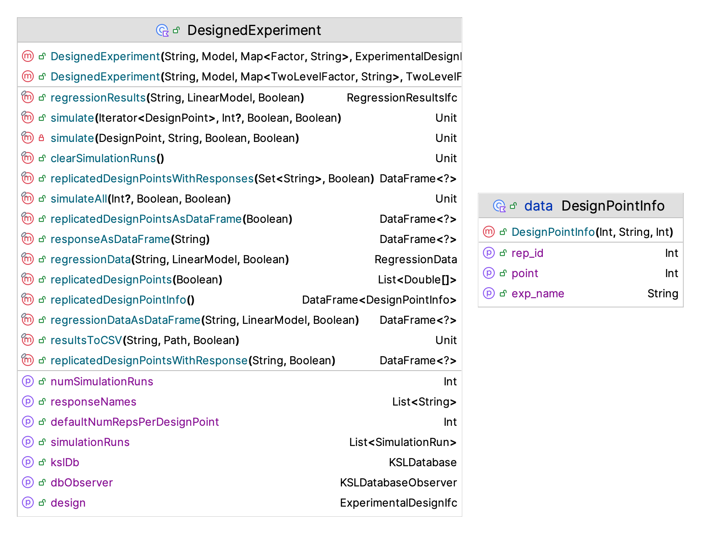
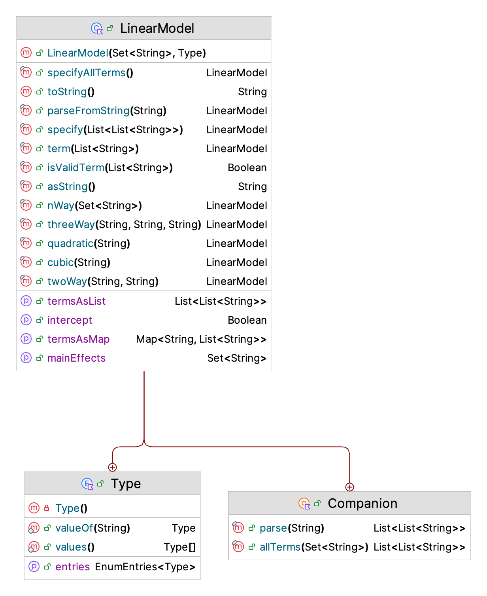
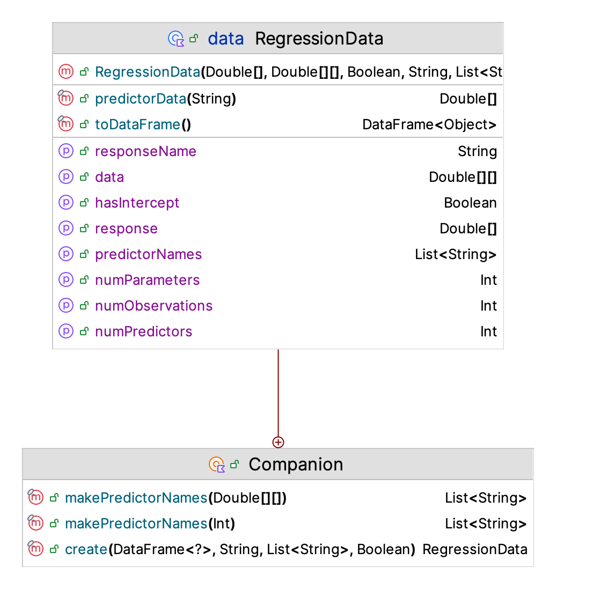
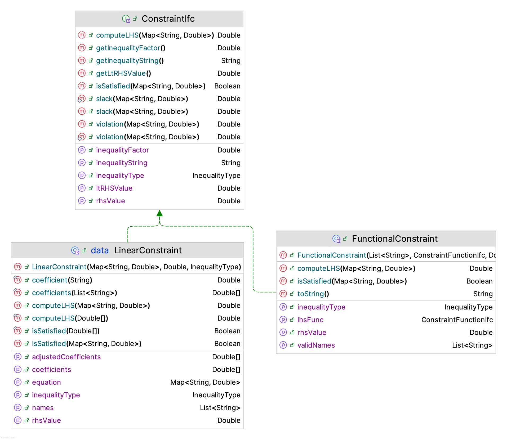

# Experimental Design and Simulation Optimization Methods {#ch10eo}

**[Learning Objectives]{.smallcaps}**

- To be able to explain and discuss the application of experimental design methods within a simulation modeling context
- To be able to recognize how simulation experiments are different from standard application of experimental methods
- To be able to apply experimental design methods within the KSL for simulation analysis
- To be understand how optimization methods can be applied within a simulation context
- To be able to discuss the challenges associated with applying optimization methods to simulation models
- To recognize and explain some common simulation optimization algorithms
- To be able to apply KSL constructs for simulation optimization

This chapter builds on the methods presented in Chapter \@ref(simoa). Section \@ref(simoacomparingSystems) introduced how simulation models can be used to compare different system configurations. An important aspect of the comparison process was to select the best simulation configuration (or to screen out inferior configurations).  In essence, this is optimization.  Section \@ref(ch5Scenarios) illustrates how to simulate many configurations.  Both of these situations beg one particular question.  *How to determine the configurations to be analyzed?*

A simulation model has many parameters that can be varied.  Each parameter setting represents a different system configuration. All possible parameter settings represent the *design* space of the problem. This chapter presents concepts for how to explore the design space of a simulation model.  We do this to make inferences about how the real system will behave under different parameter settings (i.e. for different design configurations).  

Section \@ref(ch10doe) of this chapter presents methods that allow the analyst to systematically explore the design space using experimental design methods.  Using experimental design methods facilitates efficient allocation of simulation runs for the purpose of understanding the relationships between the inputs and outputs of the model. Within this context, the analyst must explicitly specify the framework for setting the parameters to obtain the desired analysis. That is, the analyst must specify an experimental design.

Section \@ref(ch10simOpt) of the chapter presents an approach to exploring the design space that is driven by optimal search methods. Specifically, the section illustrates standard search methods such as stochastic hill climbing, simulated annealing, and the cross-entropy method.  An important aspect of applying these approaches to "optimize" a simulation model is the fact that the output from the simulation model has uncertainty.  The uncertainty of the objective response or in constraints will require additional understanding of the effect of uncertainty on the search process and on the interpretation of the results from the search. Unlike the approach based on experimental designs, a *simulation optimization* approach is driven via an algorithm that may or may not have guarantees on the quality of the solution produced.

::: {.infobox .note data-latex="{note}"}
**NOTE!**
This chapter provides example code of using the KSL to implement experimental design and optimization techniques. The full source code of the examples can be found in the accompanying `KSLExamples` project associated with the [KSL repository](https://github.com/rossetti/KSL). The files for each example of this chapter can be found [here](https://github.com/rossetti/KSL/tree/main/KSLExamples/src/main/kotlin/ksl/examples/book/chapter10).
:::

## Experimental Design Methods {#ch10doe}
As discussed in Section \@ref(kslScenarios) of Chapter \@ref(simoa) when analyzing a situation using simulation, we must often simulate a model many times. This initiates the need to be efficient and effective when running many scenarios.  Experimental design concepts can assist with ensuring an efficient and effective approach to experimenting with a simulation model.

An **experiment** is a data collection procedure that occurs under controlled conditions to identify and understand the relationships between variables. A computer *simulation experiment* is an experiment executed (virtually) on a computer using a *simulation model*. The simulation model is a proxy representation for the actual physical system.  When you run a simulation model, you are performing an experiment. Computer simulation **is** experimentation on a computer. An **experimental design** is a detailed plan for collecting and using data to understand the relationships between variables. An experimental design describes how to execute the experiment. For a computer simulation, an experimental design details the settings for the model's inputs and the specification of the desired outputs. Experimental design is an iterative process. Don't expect to get the plan perfect the first time or without some preliminary ad-hoc experimentation.  The goal of experimental design is to be able to understand the relationships between the variables in the most efficient and effective manner possible.

*Factors* are the attributes of the model (parameters and/or input variables) that may be changed (or controlled) in a simulation experiment. Factors are the parameters/inputs that are of interest during experimentation. The *factor levels* are the set of possible values that factors are changed to (set at) for an experimental run. These are sometimes called treatments in physical experiments, but generally not so for computer experiments. For example, if the reorder quantity is a factor, the the levels might be (5, 20, 50) units. The levels are the settings that can be used for the factor. A *design point* is the specification of an instance of factor settings that will result in observations of the response.  An *experimental run* (or run) is the *execution* of an experimental design point resulting in a single observation of the output variables.  In experimental design, an experimental run is often called a *replicate*. In the simulation context, it is often referred to as a *replication*. An *experimental design* can be thought of as the set of design points and the specification of how many replications are required for each point. 

### Defining Factors {#ch10factors}

The KSL provides functionality to define and run experiments based on experimental design contexts. We start with being able to represent factors. Figure \@ref(fig:KSLFactors) presents the class diagram for the `Factor` class. Factors have a name and a specification of the levels for the factors.

<div class="figure" style="text-align: center">

<p class="caption">(\#fig:KSLFactors)KSL Factors</p>
</div>

When setting up an experimental design, the regressors (factors) are often coded in such a manner to facilitate the interpretation of the model coefficients.  Quite often they are scaled to a range of values between -1 and 1, or between 0 and 1.  Within the KSL, the levels of the factors should be supplied via their uncoded values.  The KSL `Factor` class can perform the translation to and from the coded and uncoded design space. 

Suppose we have non-standardized factor $p$ and denoted as $w_p$. Suppose $w_p$ ranges between its lowest value, $l_p$ and its highest value $u_p$.  That is $w_p$ is in the interval, $w_p \in [l_p,u_p]$. For example, suppose $w_p$ is the mean of the service time distribution and $w_p$ has levels $[5,10,15,20,25]$. Thus, $l_p = 5$ and $u_p = 25$
  
- Let $h_p$ be the half-range, where $h_p = (u_p - l_p)/2$. The half-range measures the spread of the factor.
- Let $m_p$ be the mid-point of the range, where $m_p = (u_p + l_p)/2$.

A standard approach is to the code the factor as:

$$
x_{ip}=\frac{w_{ip} - m_{p}}{h_p}
$$

For example, suppose $w_{ip} \in \{5,10,15,20,25\}$.  Thus $h_p = (25 - 5)/2 = 10$ and $m_p = (25 + 5)/2 = 15$. Thus, we have $x_{ip} \in \{-1,\frac{-1}{2},0,\frac{1}{2},1\}$. Notice that for a factor with **two** levels this always results in a coding of $\pm 1$.  Low is coded to $-1$ and high is coded to $+1$.

The following illustrates the creation of two factors, one with 3 levels and another with 2 levels. 

```kt
    val f1 = Factor("A", doubleArrayOf(1.0, 2.0, 3.0, 4.0))
    val f2 = Factor("B", doubleArrayOf(5.0, 9.0))
    val factors = setOf(f1, f2)
```

### Defining Experimental Designs {#ch10designs}

Once we have defined factors for the experiment, we can proceed with defining an experimental design. The KSL supports factorial designs, two level factorial designs, central composite designs, and general experimental designs. Figure \@ref(fig:KSLExpDesig) presents the major classes and interfaces related to KSL experiments.

<div class="figure" style="text-align: center">

<p class="caption">(\#fig:KSLExpDesig)KSL Experimental Design Classes</p>
</div>

The first important item to note is the use of the `ExperimentalDesignIfc` interface. The experimental designs supported by the KSL all implement this interface.  The `ExperimentalDesignIfc` interface provides functionality that allows the design points in the design to be specified and iterated.  To create an experimental design, you must specify the set of factors, or as in the case of a composite design, the starting factorial design.

The following code illustrates how to create a factorial design and will print out the design points. 

```kt
    val f1 = Factor("A", doubleArrayOf(1.0, 2.0, 3.0, 4.0))
    val f2 = Factor("B", doubleArrayOf(5.0, 9.0))
    val factors = setOf(f1, f2)
    val fd = FactorialDesign(factors)
    println(fd)
    println()
    println("Factorial Design as Data Frame")
    println(fd.designPointsAsDataframe())
    println()
    println("Coded Factorial Design as Data Frame")
    println(fd.designPointsAsDataframe(true))
    println()
```

There are eight design points in this design because we have factor A with 4 levels and factor B with 2 levels, resulting in $4 \times 2 = 8$ design points. 

```
FactorialDesign
name: ID_3
number of design points: 8
Factors
Factor: A
Levels = 1.0,2.0,3.0,4.0
halfRange = 1.5
midPoint = 2.5
Coded Levels = -1.0,-0.3333333333333333,0.3333333333333333,1.0

Factor: B
Levels = 5.0,9.0
halfRange = 2.0
midPoint = 7.0
Coded Levels = -1.0,1.0

Factorial Design as Data Frame
     A   B
 0 1.0 5.0
 1 1.0 9.0
 2 2.0 5.0
 3 2.0 9.0
 4 3.0 5.0
 5 3.0 9.0
 6 4.0 5.0
 7 4.0 9.0
 
 Coded Factorial Design as Data Frame
           A    B
 0 -1.000000 -1.0
 1 -1.000000  1.0
 2 -0.333333 -1.0
 3 -0.333333  1.0
 4  0.333333 -1.0
 5  0.333333  1.0
 6  1.000000 -1.0
 7  1.000000  1.0
```

A two-level factorial design is a special case of the more general factorial design where factors can have more than two levels.  For two-level factorial designs, the KSL provides the `TwoLevelFactorialDesign` class.  The following code illustrates how to create a two-level factorial design.   

```kt
    val design = TwoLevelFactorialDesign(
        setOf(
            TwoLevelFactor("A", 5.0, 15.0),
            TwoLevelFactor("B", 2.0, 11.0),
            TwoLevelFactor("C", 6.0, 10.0),
            TwoLevelFactor("D", 3.0, 9.0),
        )
    )
    val fdf = design.designPointsAsDataframe()
    println("Full design points")
    fdf.print(rowsLimit = 36)
    println("Coded full design points")
    design.designPointsAsDataframe(true).print(rowsLimit = 36)
    println()
```

Note that for this design, you need to define the factors using the `TwoLevelFactor` class, which restricts the levels to only two values. Since there are only two levels, the coded values are (-1) and (+1).  

Once you have a full two-level factorial design, you may want to only simulate a portion of the design. A fractional factorial design is an experimental design that specifies some fraction of the full factorial combination of design points. The most commonly specified fractional designs are one-half fraction of $2^k$ designs.  A $\frac{1}{2}$ fraction of a $2^k$ design has $2^{k-1} = \frac{1}{2}2^k$ runs and is called a $2^{k-1}$ fractional factorial design.  In the context of $2^k$ designs, we may have larger fractions, i.e. $2^{k-p}$ designs, where $p\ge 1$. Running a fraction of the design points reduces the number of runs but also limits what models can be estimated.

Using a $\frac{1}{2}$ fraction creates two sets of runs. Below the rows have been rearranged so that column (123) starts with $+1$ for the first half-fraction. A $2^{3-1}$ fractional factorial design has $2^2 = 4$ runs. Running the rows with $+1$ of column (123), would be running the first (positive) $\frac{1}{2}$ fraction of the design.

$$
\begin{array}{|c|c|c|c|c|c|c|c|c|}
   \hline
   I & (1) & (2) & (3) & (12) & (13) & (23) & (123) & Fraction\\ \hline
   +1 & +1 & -1 & -1 & -1 & -1 & +1 & +1 & Positive \\  \hline
   +1 & -1 & +1 & -1 & -1 & +1 & -1 & +1 & Positive \\  \hline
   +1 & -1 & -1 & +1 & +1 & -1 & -1 & +1 & Positive \\  \hline
   +1 & +1 & +1 & +1 & +1 & +1 & +1 & +1 & Positive \\  \hline 
   +1 & +1 & +1 & -1 & +1 & -1 & -1 & -1 & Negative \\  \hline
   +1 & +1 & -1 & +1 & -1 & +1 & -1 & -1 & Negative \\  \hline
   +1 & -1 & +1 & +1 & -1 & -1 & +1 & -1 & Negative \\  \hline
   +1 & -1 & -1 & -1 & +1 & +1 & +1 & -1 & Negative \\  \hline
\end{array}
$$

We can specify fractional designs within the KSL by requesting an iterator from the full two-level design that contains the desired portion of the design. This can be accomplished with the `halfFractionIterator()` function or the `fractionalIterator()` function. The following code illustrates how to access these iterators. 
```kt
    // create the full design
    val design = TwoLevelFactorialDesign(
        setOf(
            TwoLevelFactor("A", 5.0, 15.0),
            TwoLevelFactor("B", 2.0, 11.0),
            TwoLevelFactor("C", 6.0, 10.0),
            TwoLevelFactor("D", 3.0, 9.0),
            TwoLevelFactor("E", 4.0, 16.0)
        )
    )
    println("Positive half-fraction")
    val hitr = design.halfFractionIterator()
    // convert iterator to data frame for display
    hitr.asSequence().toList().toDataFrame(coded = true).print(rowsLimit = 36)
    println()
    // This is a resolution III 2^(5-2) design
    // This design can be found here: https://www.itl.nist.gov/div898/handbook/pri/section3/eqns/2to5m2.txt
    // Specify a design relation as a set of sets.
    // The sets are the columns of the design that define the associated generator
    val relation = setOf(setOf(1, 2, 4), setOf(1, 3, 5), setOf(2, 3, 4, 5))
    val itr = design.fractionalIterator(relation)
    println("number of factors = ${itr.numFactors}")
    println("number of points = ${itr.numPoints}")
    println("fraction (p) = ${itr.fraction}")
    val dPoints = itr.asSequence().toList()
    val df = dPoints.toDataFrame(coded = true)
    println("Fractional design points")
    df.print(rowsLimit = 36)
```

First the full factorial design is constructed. The `halfFractionIterator()` function has the following signature. The first parameter should be (+1.0) to get the positive half-fraction, or (-1.0) to get the negative half-fraction. 

```kt
    /**
     *  @param half indicates the half-fraction to iterate. 1.0 indicates the positive
     *  half-fraction and -1.0 the negative half-fraction. The default is 1.0
     *  @param numReps the number of replications for the design points.
     *  Must be greater or equal to 1. If null, then the current value for the
     *  number of replications of each design point is used. Null is the default.
     */
    fun halfFractionIterator(half: Double = 1.0, numReps: Int? = null): TwoLevelFractionalIterator
```

The results of the half-fraction code are as follows.  Notice that there are only 16 (of the 32) design points.

```
Positive half-fraction
       A    B    C    D    E
  0 -1.0 -1.0 -1.0 -1.0  1.0
  1 -1.0 -1.0 -1.0  1.0 -1.0
  2 -1.0 -1.0  1.0 -1.0 -1.0
  3 -1.0 -1.0  1.0  1.0  1.0
  4 -1.0  1.0 -1.0 -1.0 -1.0
  5 -1.0  1.0 -1.0  1.0  1.0
  6 -1.0  1.0  1.0 -1.0  1.0
  7 -1.0  1.0  1.0  1.0 -1.0
  8  1.0 -1.0 -1.0 -1.0 -1.0
  9  1.0 -1.0 -1.0  1.0  1.0
 10  1.0 -1.0  1.0 -1.0  1.0
 11  1.0 -1.0  1.0  1.0 -1.0
 12  1.0  1.0 -1.0 -1.0  1.0
 13  1.0  1.0 -1.0  1.0 -1.0
 14  1.0  1.0  1.0 -1.0 -1.0
 15  1.0  1.0  1.0  1.0  1.0
```

The `fractionalIterator()` function is more complicated.  It's signature is as follows.

```kt
    fun fractionalIterator(
        relation: Set<Set<Int>>,
        numReps: Int? = null,
        sign: Double = 1.0
    ): TwoLevelFractionalIterator {
        return TwoLevelFractionalIterator(relation, numReps, sign)
    }
```

This iterator should present each design point in the associated fractional design until all points in the fractional design have been presented.  The iterator checks if the coded values of the design point are in the defining relation specified by the factor numbers stored in the relation set.  Suppose the designing relation is I = 124 = 135 = 2345.  Then relation specification is `setOf(setOf(1,2,4), setOf(1,3,5), setOf(2,3,4,5)).` The values in the words must be valid factor indices. That is, if a design has 5 factors, then the indices must be in the set (1,2,3,4,5), with 1 referencing the first factor, 2 the 2nd, etc.  

To learn more about fractional designs and design generators, we refer the interested reader to the [fractional factorial design section](https://www.itl.nist.gov/div898/handbook/pri/section3/pri334.htm) of the NIST Engineering Statistics Handbook. 

The resulting design points for the $2^{5-2}$ resolution III design are as follows. Notice that there are only 8 design points in this resolution III design.

```
number of factors = 5
number of points = 8
fraction (p) = 2
Fractional design points
      A    B    C    D    E
 0 -1.0 -1.0 -1.0  1.0  1.0
 1 -1.0 -1.0  1.0  1.0 -1.0
 2 -1.0  1.0 -1.0 -1.0  1.0
 3 -1.0  1.0  1.0 -1.0 -1.0
 4  1.0 -1.0 -1.0 -1.0 -1.0
 5  1.0 -1.0  1.0 -1.0  1.0
 6  1.0  1.0 -1.0  1.0 -1.0
 7  1.0  1.0  1.0  1.0  1.0
```

As illustrated for the fractional design case, an iterator over design points is an essential component of how the KSL implements its experimental design functionality.  Figure \@ref(fig:KSLDPIterators) illustrates the basic functionality of a design point iterator. 

<div class="figure" style="text-align: center">

<p class="caption">(\#fig:KSLDPIterators)KSL Design Point Iterator Classes</p>
</div>

There are a couple of items of note. First, a design point knows the number of replications it will require and has access to the factors and to the associated design. The design point can provide coded and uncoded values. The design point iterator also has access to the factors, the design, and can move through the design points. This functionality is essential for how the `DesignedExperiment` class operates.  

### Executing a Designed Experiment {#ch10exp}

The purpose of the `DesignedExperiment` class is to facilitate the simulation of an experimental design. The `DesignedExperiment` class causes each design point in its supplied design to be simulated for the specified number of replications. 

<div class="figure" style="text-align: center">

<p class="caption">(\#fig:KSLDesExp)KSL DesignedExperiment Class</p>
</div>

Figure \@ref(fig:KSLDesExp) illustrates the KSL's `DesignedExperiment` class. The signature of its constructor is as follows.

```kt
class DesignedExperiment(
    name: String,
    private val model: Model,
    private val factorSettings: Map<Factor, String>,
    val design: ExperimentalDesignIfc,
    val kslDb: KSLDatabase = KSLDatabase("${name}.db".replace(" ", "_"),
        model.outputDirectory.dbDir)
) : Identity(name) {
```

Notice that the constructor requires a name for the experiment, the model that will be exercised, the factorial settings, and the experimental design.  The factor settings are specified by using controls or random variable parameter settings.  The following code sets up a three factor, two level factorial design and simulates the design points. 

```kt
    val fA = Factor("Server", doubleArrayOf(1.0, 2.0, 3.0))
    val fB = Factor("MeanST", doubleArrayOf(0.6, 0.7))
    val fC = Factor("MeanTBA", doubleArrayOf(1.0, 5.0))
    val factors = mapOf(
        fA to "MM1Q.numServers",
        fB to "MM1_Test:ServiceTime.mean",
        fC to "MM1_Test:TBA.mean"
    )
    val m = Model("DesignedExperimentDemo")
    m.numberOfReplications = 15
    m.lengthOfReplication = 10000.0
    m.lengthOfReplicationWarmUp = 5000.0
    val ggc = GIGcQueue(m, 1, name = "MM1Q")

    val fd = FactorialDesign(factors.keys)
    val de = DesignedExperiment("FactorDesignTest", m, factors, fd)

    println("Design points being simulated")
    fd.designPointsAsDataframe().print(rowsLimit = 36)
    println()
    de.simulateAll(numRepsPerDesignPoint = 3)
    println("Simulation of the design is completed")
    de.resultsToCSV()

```

Notice that you can specify how many times each design point is replicated when simulating the design. This class works in a very similar manner as that described in Section \@ref(kslScenarios) of Chapter \@ref(simoa) for running multiple scenarios.  The `DesignedExperiment` class captures the results from the simulation runs to a database, which can be found in the `dbDir` directory associated with the model being simulated. The `DesignedExperiment` class also provides multiple ways to capture the design and its results, especially in the form of a data frame. The results can be easily exported to a CSV file for further analysis by your favorite statistical software.

```kt
    println("Replicated design points")
    de.replicatedDesignPointsAsDataFrame().print(rowsLimit = 36)
    println()
    println("Responses as a data frame")
    de.responseAsDataFrame("System Time").print(rowsLimit = 36)
    println()
    de.replicatedDesignPointsWithResponse("System Time").print(rowsLimit = 36)
    println()
    de.replicatedDesignPointsWithResponses().print(rowsLimit = 36)
    println()
    de.replicatedDesignPointsWithResponses(coded = true).print(rowsLimit = 36)
```

Notice that the results for all responses, an individual response, and the design points (coded or uncoded) are readily available for further analysis. 

### Analyzing a Designed Experiment {#ch10analysis}

This final example illustrates how the results from a designed experiment can be analyzed using linear regression. The following code creates a model for a reorder level, reorder quantity inventory model. Details of this model can be found in Section \@ref(rqModel) of Chapter \@ref(ch7AdvModeling).  The following code  creates the KSL discrete-event simulation model.

```kt
    val m = Model("ResponseSurfaceDemo")
    val rqModel = RQInventorySystem(m, name = "RQInventory")
    rqModel.costPerOrder = 0.15 //$ per order
    rqModel.unitHoldingCost = 0.25 //$ per unit per month
    rqModel.unitBackorderCost = 1.75 //$ per unit per month
    rqModel.initialReorderPoint = 2
    rqModel.initialReorderQty = 3
    rqModel.initialOnHand = rqModel.initialReorderPoint + rqModel.initialReorderQty
    rqModel.timeBetweenDemand.initialRandomSource = ExponentialRV(1.0 / 3.6)
    rqModel.leadTime.initialRandomSource = ConstantRV(0.5)
    m.lengthOfReplication = 72.0
    m.lengthOfReplicationWarmUp = 12.0
    m.numberOfReplications = 30
```

In the following code, we setup two factors, one for the reorder level and one for the reorder quantity.  Then, we specify the factorial design.

```kt
    val r = TwoLevelFactor("ReorderLevel", low = 1.0, high = 5.0)
    println(r)
    val q = TwoLevelFactor("ReorderQty", low = 1.0, high = 7.0)
    println(q)
    println()
    val design = TwoLevelFactorialDesign(setOf(r, q))
    println("Design points being simulated")
    val df = design.designPointsAsDataframe()
    df.print(rowsLimit = 36)
```

Finally, we specify the settings of the factors using controls. See Section \@ref(controlAntns) for more on controls. Then, we specify the designed experiment and simulate all of the design points.  Each design point is replicated 20 times. 

```kt
    val settings = mapOf(
        r to "RQInventory:Item.initialReorderPoint",
        q to "RQInventory:Item.initialReorderQty",
    )
    val de = DesignedExperiment("R-Q Inventory Experiment", m, settings, design)
    de.simulateAll(numRepsPerDesignPoint = 20)
    println("Simulation of the design is completed")
```

After running the design, we can access the design points and the results.  Then, we can run a linear regression based on the results stored in the data frame.  Figure \@ref(fig:KSLLinearModel) presents the functions and properties of the KSL `LinearModel` class. 

<div class="figure" style="text-align: center">

<p class="caption">(\#fig:KSLLinearModel)KSL LinearModel Class</p>
</div>


The KSL `LinearModel` class provides the ability to specify a linear model (for use in regression and design of experiments). This is only a string specification of the linear model. The terms are specified by the names of the factors. As an example, consider a model with three factors, "A", "B", "C", with full model = "A B C A\*B A\*C B\*C A\*B\*C".  The full regression model for this situation is:

$$
y  =  \beta_0 + \beta_1 x_1 + \beta_2 x_2 + \beta_3 x_3 + \beta_{12} x_1 x_2 + \beta_{13} x_1 x_3 + \beta_{23} x_2 x_3 + \beta_{123} x_1 x_2 x_3 + \epsilon
$$

To specify this model using the KSL `LinearModel` class, we use the following.

```kt
val m3 = LinearModel(setOf("A", "B", "C"))
m3.specifyAllTerms()
```

The KSL `LinearModel` class has functions that allow you to build the terms of the model. In addition, you can parse a string representation, such as "A B C A\*B A\*C B\*C A\*B\*C", to build the model.  Let's take a look at the code for specifying the linear model for the reorder point, reorder quantity model. 

```kt
    val resultsDf = de.replicatedDesignPointsWithResponse("RQInventory:Item:TotalCost", coded = true)
    resultsDf.print(rowsLimit = 80)
    println()
    val lm = design.linearModel(type = LinearModel.Type.AllTerms)
    println(lm.asString())
    println()
    val lmDF = resultsDf.addColumnsFor(lm)
    lmDF.print(rowsLimit = 80)
    val regressionResults = de.regressionResults("RQInventory:Item:TotalCost", lm)
    println()
    println(regressionResults)
    regressionResults.showResultsInBrowser()

```

The design points and the responses are extracted from the designed experiment into a data frame with the following line of code. 

```kt
    val resultsDf = de.replicatedDesignPointsWithResponse("RQInventory:Item:TotalCost", coded = true)
```

Then, an instance of the `LinearModel` class is created based on all the terms available in the model. 

```kt
    val lm = design.linearModel(type = LinearModel.Type.AllTerms)
    println(lm.asString())
```

This results in the output representing the linear model.

```
ReorderQty ReorderLevel ReorderLevel*ReorderQty
```

This is essentially the following linear regression model. 

$$
y  =  \beta_0 + \beta_1 x_1 + \beta_2 x_2 + \beta_{12} x_1 x_2 + \epsilon
$$

To illustrate how to use the linear model to setup the data frame to perform the regression analysis we can use the following line of code. 

```kt
    val lmDF = resultsDf.addColumnsFor(lm)
```

In this case, the product term "ReorderLevel\*ReorderQty" is added to the data frame to allow for the estimation of the interaction term. This line invokes an extension function for the `DataFrame` class to add the columns needed to the data frame that will allow the regression of the specified linear model. 

Actually, this line is unnecessary within this example because the following line of code tells the designed experiment to perform the regression using the linear model and as part of that process, the associated data frame is created before the regression is performed to get the regression results.

```kt
    val regressionResults = de.regressionResults("RQInventory:Item:TotalCost", lm)
```

The regression results along with a browser representation (not shown here) are as follows.  Notice that the regression analysis prepares an ANOVA table and estimates the parameters of the proposed linear model.

```
Regression Results
-------------------------------------------------------------------------------------
Analysis of Variance
Source               SumSq        DOF              MS             f_0         P(F>f0) 
Regression         6.76108          3        2.253694      296.385197        0.000000 
Error             0.577899         76        0.007604 
Total              7.33898         79 
-------------------------------------------------------------------------------------
Error Variance (MSE) = 0.007603935211425039
Regression Standard Error = 0.0872005459353612
R-Squared = 0.9212562194800762
Adjusted R-Squared = 0.9181479123542897
-------------------------------------------------------------------------------------
Parameter Estimation Results
                 Predictor parameter parameterSE   t0-ratio 2*P(T>|t0|) LowerLimit UpperLimit
 0               Intercept  1.489621    0.009749 152.792382    0.000000   1.470204   1.509039
 1            ReorderLevel  0.235961    0.009749  24.202793    0.000000   0.216543   0.255378
 2              ReorderQty -0.032746    0.009749  -3.358832    0.001226  -0.052164  -0.013329
 3 ReorderLevel*ReorderQty  0.166625    0.009749  17.090893    0.000000   0.147207   0.186042
-------------------------------------------------------------------------------------
```

As presented in Figure \@ref(fig:KSLRegression1), the KSL provides basic support for performing linear regression analysis.

<div class="figure" style="text-align: center">

<p class="caption">(\#fig:KSLRegression1)KSL Linear Regression Support</p>
</div>

The functionality includes support for performing the ANOVA analysis, estimating the parameters, displaying diagnostic plots, and for performing an analysis of the residuals.  The most useful functionality is to use the `showResultsInBrowser()` and `showDiagnosticPlotsInBrowser()` functions.

The performing of an regression analysis is made possible by the `RegressionData` class as shown in Figure \@ref(fig:KSLRegressionData).  The key purpose of this class is to organize the regression matrix and the response array for analysis.  The predictor names and response names are also specified.

<div class="figure" style="text-align: center">

<p class="caption">(\#fig:KSLRegressionData)KSL Regression Data</p>
</div>

The `OLSRegression` class with the following signature performs the regression. Notice that there is a constructor that will use a data frame, which requires the specification of the column name of the response variable and the columns needed for the predictor (regressor) variables.

```kt
class OLSRegression(regressionData: RegressionData) : RegressionResultsIfc {

    /**
     *  Create the regression data from a data frame. The data frame
     *  must have a column with the response name [responseName] and
     *  columns with the names in the list [predictorNames]. The
     *  data type of these columns must be Double. [hasIntercept] indicates
     *  if the regression should include an intercept term. The default is
     *  true. The data in the data frame does not need to have a column
     *  for estimating the intercept.
     */
    constructor(
        df: AnyFrame,
        responseName: String,
        predictorNames: List<String>,
        hasIntercept: Boolean = true
    ) : this(RegressionData.create(df, responseName, predictorNames, hasIntercept))

```

The KSL regression functionality is available with in the `ksl.utilities.statistics` package.

## Simulation Optimization Methods {#ch10simOpt}
The field of simulation optimization encompasses the use of computer simulation models as part of optimization search process. As was discussed in Chapter \@ref(ch1), simulation models take on numerous forms including deterministic/stochastic, static/dynamic, and continuous/discrete models.  Each of these forms may require specialized optimization methods in order to utilize the simulation model as part of the search process.  Consider Figure \@ref(fig:ch10PrescriptiveSimulation) within the context of optimization, we can visualize how a simulation model (the box labeled "Model for Predicting System Performance" in the figure), can be used as part of an optimization process.

<div class="figure" style="text-align: center">

<p class="caption">(\#fig:ch10PrescriptiveSimulation)Simulation as Part of an Optimization Process</p>
</div>

The dark-shaded area of Figure \@ref(fig:ch10PrescriptiveSimulation) represents an optimization model.  In general form, an optimization model has the ability to generate candidate alternatives which are evaluated by the simulation model.  The output from the simulation model is used by some kind of "evaluation model", typically an objective function, but the evaluation may in fact constitute multiple objectives.  The optimization model is an iterative process that continues generating alternatives for evaluation and evaluating the alternatives until the desire solution quality is achieved. In Chapter \@ref(simoa) and in Section \@ref(ch10doe) of this chapter, the decision maker or analyst is the "optimization model". That is, it is up to the analyst to determine the set of alternatives to evaluate and to make conclusions about which are to be recommended.  This section will describe processes for which the optimization model presented in Figure \@ref(fig:ch10PrescriptiveSimulation) is automated in some fashion via algorithms. 

From this context, we can conclude that simulation optimization has substantial areas that can be extremely complex, theoretical, yet with many practical applications.  Thus, for the purposes of this chapter, we will not attempt to present a discussion of the wide-range of algorithms and topics that underpin the area of simulation optimization.  Excellent tutorials already exist on this extensive topic.  We refer the interested reader to [@jian_henderson_2015], [@topaloglu_simulation_2013], [@nelson_optimization_2014], and [@gentle_stochastic_2012] for introductions. In addition, the focus of this section is to present the practical concepts that users of such algorithms need for understanding some of the trade-offs and issues that occur when using the algorithms.  

While some algorithms offer theoretical proofs of convergence, that issue is by-passed within this presentation.  The focus here is how to use the algorithm to obtain useful solutions within a reasonable time-frame. In this regard, the concepts presented in [@henderson_reflections_2021] are relevant because we are interested in algorithms that are well equipped to tackle problems with little structure and which provide solutions that improve an objective function over practical time-scales. In general, we desire algorithms that are general, relatively easy to use or setup, and can be applied in a variety of contexts.

With respect to this chapter, the general form of a simulation optimization problem can be written as:

$$
\min_{x\in S} g(x)
$$
where $g$ is an objective function, $x$ represents the decision variables, with constraints $x \in S$. The objective function can be linear or non-linear and the decision variables may be continuous or discrete.  The objective function and/or constraints may involve randomness and one (or both) require a simulation model for evaluation.  That is, the simulation model is like a "black-box" to which we can provide inputs and then observe outputs for use in the optimization process.

Because our use case primarily involves systems that include randomness, a common method is to present the formulation in terms of expected values, where the objective function $g$ and the constraint set $S$ is written as:

$$
g(x) = E[g(x, \xi_i)] \\
S = \{x: E[h(x, \xi_i)] \leq 0 \}
$$
where $\xi_i$ represents the randomness associated with the $i^{th}$ observation (sample) for the objective function, $g(\cdot)$ and $h(\cdot)$ represents a performance measure, both, estimated from the simulation. In addition, we must note that while the formulation does not indicate this explicitly, the inputs, $x$, are vector-valued and the responses $h(\cdot)$ may also be vectors.  A wide variety of formulations are also seen in the literature. See [@jian_henderson_2015] and [@topaloglu_simulation_2013] for further characterizations. The point here is that the general formulation is quite challenging and even more so because uncertainty (randomness) is involved. 

The KSL provides a framework of classes that permit the construction of problem instances, which can be solved via different optimization algorithms as illustrated in Figure \@ref(fig:ch10PrescriptiveSimulation).  The KSL's `ksl.simopt` package contains functionality to implement and use simulation optimization algorithms for KSL models. The package has the following sub-packages:

- `ksl.simopt.problem` This package has classes that facilitate the definition of optimization problem instances. The functionality includes specifying the objective function, the decision variables, and the constraints.
- `ksl.simopt.evaluator` This package has classes that provide a well-defined interaction protocol with a simulation model. In essence, a general contract for what constitutes the inputs and outputs from the model is defined. This allows responses to be translated to solutions for problem instances that can be used by algorithms.
- `ksl.simopt.solvers` This package provides the algorithms and general functionality for iterative optimization methods. The KSL denotes these simulation optimization algorithms as *solvers*.
- `ksl.simopt.cache` This package provides basic functionality to cache (in memory) executions of simulation models. Because the execution of a simulation model may be a long-running task and algorithms may visit design points multiple times during the search process, the caching of solutions may be useful. This package defines general interfaces for caching solutions and simulation runs.

The following sections present the KSL constructs found in the `ksl.simopt` packages for simulation optimization and illustrate their application.

## Defining Simulation Optimization Problems {#ch10ProbDefn}

This section describes the `ksl.simopt.problem` package. The main purpose of this package is to define an optimization problem (decision variables, objective function, and constraints) and to connect the problem with the inputs and outputs of a simulation model. The most important class within this package is the `ProblemDefinition` class. The `ProblemDefinition` class requires an identifier for the model, a string that represents the name of the response variable in the model that represents the objective function, the names of any response variables used in defining response related constraints, the names of the model variables that represent the inputs (decision variables), and the type of optimization (minimize or maximize).  Let $I$ represent the set of input variables, let $x_i$ represent the $i^{th}$ input variable, and $\vec{x}$ represent a member of $I$. Let $G(\vec{x})$ be a random variable representing the objective function response from the simulation at input variable settings $\vec{x}$. Let $L$ represent the set of deterministic linear constraints. Let $F$ represent the set of deterministic functional constraints with members $f_i(\vec{x})$. Let $R$ represent the set of constraints based on simulation responses with $R_{i}(\vec{x})$ representing a random response from the simulation model as a function of the input variables. Finally, let $l_i$ and $u_i$ represent known bounds on input variable $x_i$.  

An instance of the `ProblemDefinition` class represents the following mathematical program:

$$
\min g(\vec{x}) = E[G(\vec{x})] \\
\sum_{i=1}^{|I|}a_{ij}x_i \leq b_j \quad \textrm{for} \quad j=1,\dots,|L|\\
f_{i} (\vec{x}) \leq c_{i}  \quad \textrm{for} \quad i=1,\dots,|F|\\
E[R_{i}(\vec{x})] \leq r_i \quad \textrm{for} \quad i=1,\dots,|R|\\
l_i \leq x_i \leq u_i \quad \textrm{for} \quad i=1,\dots,|I|\\
$$
Thus, the problems represented by the `ProblemDefinition` class may contain deterministic linear and functional constraints and constraints that are based on observed responses. We call the latter *response* constraints. The input variables must be specified to be limited within some *finite* bounds.  For the purposes of the problem, the input range bounds provide the largest space of interest that define the search bounds.  These bounds are finite to impose some limits on the search and to facilitate the generation of input values within the search space.

As part of the problem definition building process, the user specifies the objective function. The value of the objective function, $G(\vec{x})$, should be a **response from the simulation model**.  Thus, it is up to the user to implement the simulation model such that it will return $G(\vec{x})$. Also, note that the mathematical formulation is in terms of a minimization problem.  Thus, if the actual mathematical objective is for maximization: $\max g(\vec{x}) = E[G(\vec{x})]$, then the user should specify the type of the problem as maximization. The problem defintion class will translate the problem into a minimization problem such that objective function is the negative of $G(\vec{x})$.

$$
\max_{x\in S} g(x) = \min_{x\in S} -g(x)
$$

The constraints can be specified in terms of the type of inequality (less than or greater than).  Figure \@ref(fig:PDProperties) presents the constructor and properties for the `ProblemDefinition` class.

<div class="figure" style="text-align: center">

<p class="caption">(\#fig:PDProperties)Problem Definition Properties</p>
</div>

Let's take a closer look at the constructor for the `ProblemDefinition` class.

```kt
class ProblemDefinition @JvmOverloads constructor(
    problemName: String? = null,
    val modelIdentifier: String,
    val objFnResponseName: String,
    inputNames: List<String>,
    responseNames: List<String> = emptyList(),
    val optimizationType: OptimizationType = OptimizationType.MINIMIZE,
    indifferenceZoneParameter: Double = 0.0,
    objFnGranularity: Double = 0.0
) : IdentityIfc by Identity(problemName) 
```

The constructor requires a string `modelIdentifier` that represents a unique identifier for the model associated with the optimization problem. This identifier will be used to ensure that the simulation evaluation process connects the requests for simulation evaluations with the correct model.  

We do not specify a functional form for the objective function, $G(\vec{x})$. Instead, the problem definition must specify a valid name for the simulation response variable that represents the objective function via the `objFnResponseName` property.  Similarly, the problem definition requires the names of the response variables associated with the response constraints in the form of the `responseNames` list. The type of optimization problem must be specified. Finally, the list of strings, `inputNames` represents the named input (decision) variables related to the model. This list must not be empty.  If the list has repeated elements, they are removed. We will discuss how to specify these names when an example is presented.  The `indifferenceZoneParameter` parameter represents the smallest actual difference that is important to detect for the objective function response. This parameter can be used by solvers to determine if differences between solutions are considered practically significant. We will discuss the concept of granularity in Section \@ref(inputvariables).

Figure \@ref(fig:PDPMethods) presents the functions for the `ProblemDefinition` class.  This functionality includes:

- adding/defining/validating input variables
- adding/defining linear constraints
- adding/defining functional constraints
- adding/defining response constraints
- randomly generating feasible points in the input space
- converting arrays of variables to valid input variables
- checking for different feasibility conditions and computing constraint violations
- specifying a penalty function for translating a constrained problem to an unconstrained problem
- representing neighborhoods for the problem

<div class="figure" style="text-align: center">

<p class="caption">(\#fig:PDPMethods)Problem Definition Properties</p>
</div>

### Specifying Penalty Functions

Many algorithms utilize penalty functions to address constraint violations within the search process.  Penalty functions are a variation on the Lagrangian approach of converting a constrained optimization into an unconstrained optimization problem. Recall the standardized minimization representation:

$$
\min g(\vec{x}) = E[G(\vec{x})] \\
\sum_{i=1}^{|I|}a_{ij}x_i \leq b_j \quad \textrm{for} \quad j=1,\dots,|L|\\
f_{i} (\vec{x}) \leq c_{i}  \quad \textrm{for} \quad i=1,\dots,|F|\\
E[R_{i}(\vec{x})] \leq r_i \quad \textrm{for} \quad i=1,\dots,|R|\\
l_i \leq x_i \leq u_i \quad \textrm{for} \quad i=1,\dots,|I|\\
$$
We see that each constraint is presented as a less than or equal to constraint. Let's call the left-hand side of any constraint, $LHS_k$, and the right-hand side $RHS_k$, where $k$ represents one of the linear, functional or response constraints.  A violation of the constraint occurs if $LHS_k > RHS_k$.  If this occurs, then we have a violation, and the amount of the violation is the difference, $LHS_k - RHS_k$.  Let $v_k$ represent the violation associated with constraint $k$, where $v_k = \max(0, LHS_k - RHS_k)$.  Let $K$ represent the total number of constraints. That is $K = |L| + |F| + |R|$. For the purposes of the penalty function, we ignore the lower and upper bound constraints. If you need to include a bound type constraint within the penalty function processing, then you can easily do that by using a linear constraint.  There are many possible approaches to defining a penalty function.  To facilitate different kinds of penalty functions, the `ksl.simopt.problem` package provides a `PenaltyFunctionIfc` interface.

```kt
fun interface PenaltyFunctionIfc {

    /**
     *  The penalty function.
     *  @param solution The solution for which the penalty is being computed.
     *  @param iterationCounter The current iteration count. The iteration associated
     *  with the solver's process.
     */
    fun penalty(solution: Solution, iterationCounter: Int): Double

}
```
The penalty function is a function of the solution and an iteration counter. The iteration counter represents the current iteration of the solver that produced the solution.  Note that the `PenalityFunctionIfc` interface is a functional interface. Thus, Kotlin's anonymous functions can be used to supply your own implementation of a penalty function.  

The default penalty function has the following mathematical form.  Define $M(k,\xi)$ as an increasing sequence in the form $M_0 k^\xi$, where $M_0 \in \mathbb{R}^+$ is called the initial penalty parameter and $\xi > 0$.  This form of penalty function is suggest in [@park_penalty_2015].  Let $l_v$, $f_v$, and $r_v$, represent the total violations associated with the linear, functional, and response constraints, respectively. Let $l_0$, $f_0$, and $r_0$ represent the initial penalty parameters for the linear, functional, and response constraints, respectively.  Finally, let $t_v$ be the total penalized violations, $k$ be the iteration number, and $P(\vec{x},k)$ be the penalty as a function of the solution and iteration number.

$$
l_v = \sum_{k \in L} v_k \\
f_v = \sum_{k \in F} v_k \\
r_v = \sum_{k \in R} v_k \\
t_v = l_0*l_v + f_0*f_v * r_0*r_v\\
P(\vec{x},k) = k^\xi*t_v
$$
The optimization problem becomes:

$$
\min g(\vec{x}) = E[G(\vec{x})] + P(\vec{x},k)\\
$$
The `DefaultPenaltyFunction` class implements these concepts. The default initial penalty values of $l_0$, $f_0$, and $r_0$ are set to 1000, and the default exponent, $\xi= 2$.  In essence, the default penalty function penalizes the total violations and increases the penalty as the iteration number increases. Users can change these defaults or provide there own initial penalty values or exponent value. The `ProblemDefinition` class facilitates the computation of each type of violation, individually for each constraint and in total via the functions:

- `linearConstraintViolations(inputs: Map<String, Double>): DoubleArray`
- `totalLinearConstrainViolations(inputs: Map<String, Double>): Double`
- `functionalConstraintViolations(inputs: Map<String, Double>): DoubleArray`
- `totalFunctionalConstraintViolations(inputs: Map<String, Double>): Double`

Users can use these functions to define their own penalty function forms.

### Defining Input Variables {#inputvariables}

For optimization problems, the decision variables are the key quantities that need to be determined. For a `ProblemDefinition` instance, the `InputDefinition` class, illustrated in Figure \@ref(fig:InputDefinition) is used to define the decision variables.

<div class="figure" style="text-align: center">

<p class="caption">(\#fig:InputDefinition)The InputDefinition Class</p>
</div>

The constructor for defining inputs is as follows:

```kt
class InputDefinition @JvmOverloads constructor(
    val name: String,
    val lowerBound: Double,
    val upperBound: Double,
    granularity: Double = 0.0
) 
```
The user provides the name of the input and its bounds.  The name must match one of the input names within the problem definition instance. 

Finally, there is the `granularity` parameter. The specified granularity indicates the acceptable precision for the variable's value with respect to decision-making. If the granularity is 0 then no rounding will be applied when evaluating the variable. Granularity defines the level of precision for an input variable to which the problem will be solved. Setting granularity to 0, the default, means that the solver will attempt to find a solution to the level of machine precision. For any positive granularity value, the solution will be found to some multiple of that granularity. As a special case, setting granularity to 1 implies an integer-ordered input variable. The specification of granularity reflects a reality for the decision maker that there is a level of precision beyond which it is not practical to implement a solution.

Granularity represents the finest division of the measurement scale. For example, a 12-inch rule that has inches divided into 4 quarters has a granularity of 1/4 or 0.25. The granularity parameter specifies the degree of this precision so that a function can be applied which rounds the supplied value to the nearest multiple of the granularity.  Suppose, we had a quarter inch granularity, the rounding process would round 3.1459 to 3.25 because 3.25 is the nearest multiple of the granularity of (0.25). For the case of 3.0459 with a granularity of 0.25, the value of 3.0459 would be rounded to 3.0.  Thus, with a quarter inch granularity we can only have values that are multiples of 0.25. In essence, this permits a discretization of a continuous variable to points that are realistic with respect to the measurement scale associated with the variable. Thus, continuous variables can be handled as discrete variables if necessary. This functionality recognizes that any variable represented on a digital computer is a discrete representation (even to machine precision).  For many realistic problems, from a practical standpoint, we cannot implement decision variables beyond some level of granularity.

If an input variable is defined with a granularity of 1.0, then it is considered integer-ordered.  If an optimization problem has only integer-ordered decision variables, then the problem is considered integer-ordered. Some solvers are constructed to specifically handle this kind of problem. The R-SPLINE solver discussed in [@wang_integer-ordered_2013] is an integer-ordered solver and has been implemented within the KSL. 

### Linear and Functional Constraints

The specification of constraints is similar to defining input variables. The `ProblemDefinition` class provides functions that allow the specification of each type of constraint: linear, functional, and response.  The `LinearConstraint` class indicates how to compute a linear constraint. Figure \@ref(fig:DConstraints) presents the `ConstraintIfc` interface with two implementations in the `LinearConstraint` and `FunctionalConstraint` classes.

<div class="figure" style="text-align: center">

<p class="caption">(\#fig:DConstraints)Deterministic Constraints</p>
</div>

The `LinearConstraint` class takes in a map that provides the coefficient $a_i$ associated with each decision variable $x_i$.  Because of the linear form of the equation, this representation is sufficient to define the linear equation.  In addition, the right-hand side variable $b_j$ and the form of the inequality is specified.  The class will translate a greater than constraint to the mathematically equivalent less than constraint.

```kt
data class LinearConstraint(
    val equation: Map<String, Double>,
    override var rhsValue: Double = 0.0,
    override val inequalityType: InequalityType = InequalityType.LESS_THAN
) : ConstraintIfc
```

As noted in Figure \@ref(fig:DConstraints), deterministic constraints can compute the left-hand side of the constraint and compare it with the right-hand side to determine if the constraint is satisfied, whether there is slack in the constraint, and the amount of the constraint's violation.

As shown in the `FunctionalConstraint` constructor, the constraint is defined as a function of the input parameters.
```kt
class FunctionalConstraint(
    validNames: List<String>,
    val lhsFunc: ConstraintFunctionIfc,
    override val rhsValue: Double = 0.0,
    override val inequalityType: InequalityType = InequalityType.LESS_THAN
) : ConstraintIfc {
```

The `ConstraintFunctionIfc` interface is a functional interface.  It simply takes in a map containing the named input variables and their values and returns the left-hand side of the constraint.  Thus, the user can specify any functional form by implementing this interface.

```kt
fun interface ConstraintFunctionIfc {

    fun lhs(inputs: Map<String, Double>): Double

}
```

### Response Constraints

The final type of constraint is the *response* constraint.  Response constraints are different from deterministic constraints because these constraints rely on the execution of the simulation model for the observation of their values.  These are very difficult constraints within a mathematical programming context. Figure \@ref(fig:RConstraints) provides the KSL representation for modeling response constraints.

<div class="figure" style="text-align: center">

<p class="caption">(\#fig:RConstraints)Response Constraints</p>
</div>

A response constraint requires the name of a valid simulation response variable, the right-hand side value, and the type of inequality. In addition, some solvers may utilize information about a constraint in the form of a target and a tolerance. The target parameter is used by some algorithms to serve as a cut-off point between desirable and unacceptable solutions with respect to the constraint. The tolerance parameter is used by some algorithms to specify how much the decision maker is willing to be off from the target and is conceptually similar to an indifference parameter.

```kt
class ResponseConstraint(
    val responseName: String,
    val rhsValue: Double,
    val inequalityType: InequalityType = InequalityType.LESS_THAN,
    val target: Double = 0.0,
    val tolerance: Double = 0.0
) {
```

Response constraints will also compute the slack and violation amounts.  The default implementation is to not take into account randomness in these calculations. In essence, this treats the estimated response value as "deterministic" when computing the violation. Recognizing that feasibility checking may be more complex with these stochastic constraints, the `ResponseConstraint` class permits the user to supply an instance of a the `FeasibilityCheckerIfc` interface. 

```kt
fun interface FeasibilityCheckerIfc {

    fun isFeasible(
        responseConstraint: ResponseConstraint,
        estimatedResponse: EstimatedResponse,
        confidenceLevel: Double
    ): Boolean
}
```

The `FeasibilityCheckerIfc` interface allows for the checking of feasibility based on some statistical confidence. If the user supplies an instance of this interface, then it will be used when testing for feasibility for a response constraint. Now, let's take a look at an example to illustrate how to specify a problem. 

### Setting Up a Problem Definition {#ch10ProbDefnExample}

::: {.example #exCh10RQModel name="Reorder Point, Reorder Quantity Inventory Model"}
An inventory manager is interested in understanding the cost and service trade-offs related to
the inventory management of computer printers. Suppose customer demand
occurs according to a Poisson process at a rate of 3.6 units per month
and the lead time is 0.5 months. The manager has estimated that the
holding cost for the item is approximately \$0.25 per unit per month. In
addition, when a back-order occurs, the estimate cost will be \$1.75 per
unit per month. Every time that an order is placed, it costs
approximately \$0.15 to prepare and process the order. The inventory
manager wants to find the optimal setting for the reorder point and the reorder quantity
with respect to the total ordering and holding cost while ensuring a fill rate  of at least 0.95.
Set up a KSL simulation optimization problem for this situation.
:::

This is Example \@ref(exm:exRQModel) from Chapter \@ref(ch7AdvModeling).  To prepare to use the implemented model from Example \@ref(exm:exRQModel), we need to ensure that controls are defined for the input variables and to note the names of the responses involved in the problem. The two decision variables are the reorder point and the reorder quantity.  Within the [`RQInventory` class](https://github.com/rossetti/KSL/blob/main/KSLExamples/src/main/kotlin/ksl/examples/book/chapter7/RQInventory.kt), we have the following defined controls:

```kt
    @set:KSLControl(
        controlType = ControlType.INTEGER,
        lowerBound = 0.0
    )
    var initialReorderPoint: Int
        get() = myInitialReorderPt
        set(value) {
            setInitialPolicyParameters(value, myInitialReorderQty)
        }

    @set:KSLControl(
        controlType = ControlType.INTEGER,
        lowerBound = 1.0
    )
    var initialReorderQty: Int
        get() = myInitialReorderQty
        set(value) {
            setInitialPolicyParameters(myInitialReorderPt, value)
        }
```
Recall from Section \@ref(controlAntns) of Chapter \@ref(simoa) that the name of the control will be the model element's name concatenated with the name of the property separated by a "dot".  In the `RQInventorySystem` class [definition](https://github.com/rossetti/KSL/blob/main/KSLExamples/src/main/kotlin/ksl/examples/book/chapter7/RQInventorySystem.kt), we see that the instances of inventory use the name supplied for the parent with the string "Item" as shown in the following code.

```kt
private val inventory: RQInventory = RQInventory(
    this, reorderPt, reorderQty, replenisher = Warehouse(), name = "${this.name}:Item"
)
```

Thus, the names of the two controls will be the strings:

- "Inventory:Item.initialReorderQty"
- "Inventory:Item.initialReorderPoint"

The fill rate and total ordering and holding cost responses have similar naming conventions resulting in these strings:

- "Inventory:Item:FillRate"
- "Inventory:Item:OrderingAndHoldingCost"

These names are essential for constructing the problem definition. Section \@ref(controlAntns) also describes how to get the names of all controls within a model.

Finally, we need to know the model identifier. By default, this will be the assigned the name of the model, but in general it is user assignable. The basic code for building the reorder point, reorder quantity inventory model is as follows:

```kt
val reorderQty: Int = 2
val reorderPoint: Int = 1
val model = Model("RQInventoryModel")
val rqModel = RQInventorySystem(model, reorderPoint, reorderQty, "Inventory")
rqModel.initialOnHand = 0
rqModel.demandGenerator.initialTimeBtwEvents = ExponentialRV(1.0 / 3.6)
rqModel.leadTime.initialRandomSource = ConstantRV(0.5)
model.lengthOfReplication = 20000.0
model.lengthOfReplicationWarmUp = 10000.0
model.numberOfReplications = 40
```

Thus, the model identifier will be the string "RQInventoryModel".  Now, the code for constructing the problem definition can be completed.

```kt
val problemDefinition = ProblemDefinition(
    problemName = "InventoryProblem",
    modelIdentifier = "RQInventoryModel",
    objFnResponseName = "Inventory:Item:OrderingAndHoldingCost",
    inputNames = listOf("Inventory:Item.initialReorderQty", "Inventory:Item.initialReorderPoint"),
    responseNames = listOf("Inventory:Item:FillRate")
)
problemDefinition.inputVariable(
    name = "Inventory:Item.initialReorderQty",
    interval = Interval(1.0, 100.0),
    granularity = 1.0
)
problemDefinition.inputVariable(
    name = "Inventory:Item.initialReorderPoint",
    interval = Interval(1.0, 100.0),
    granularity = 1.0
)
problemDefinition.responseConstraint(
    name = "Inventory:Item:FillRate",
    rhsValue = 0.95,
    inequalityType = InequalityType.GREATER_THAN
)
```
The constructor uses a user assignable name for the problem, the model identifier, the name of the response for the objective function, the names of the input (decision) variables, and the names of the responses. Note that the type of optimization was not specified. Thus, the type is minimization by default. Then, the two input variables representing the initial reorder point and initial reorder quantity are defined over search intervals.  Notice that the granularity is set to 1.0, which indicates that this is an integer-ordered (discrete) problem.  Finally, the fill rate constraint is added to indicate that desired solutions need to have the fill-rate response greater than 95 percent.  The problem definition instance will be required when setting up the solver and the simulation evaluation process.

## Representing the Simulation Oracle

The simulation *oracle* is a term used to represent the concept of the simulation model as a "black-box" that accepts inputs and returns outputs as illustrated in Figure \@ref(fig:ch10PrescriptiveSimulation). To be able to define general problems and have them solved by general algorithms, a protocol needs to be established to represent the inputs, the model, and the outputs for generation, use, and consumption by optimization solvers. The purpose of the `ksl.simopt.evaluator` package is to provide classes and interfaces that establish this interaction protocol. 

<div class="figure" style="text-align: center">

<p class="caption">(\#fig:SimOracle)Simulation Oracle Interfaces</p>
</div>

Figure \@ref(fig:SimOracle) presents three major interfaces which support the general execution of KSL simulation models. The `SimulationOracleIfc` interface provides behavior that receives evaluation requests (inputs) and translates those requests to simulation results.  An implementer of the `SimulationProviderIfc` interface is a simulation oracle that has additional functionality to validate evaluation requests. A simulation provider is associated with a single simulation model. The `SimulationServiceIfc` interface also implements the `SimulationOracleIfc` interface and has the capability to execute simulation requests for multiple models.  

### Requesting Simulation Evaluations

This discussion will focus on the simulation oracle and how it relates to the `EvaluatorIfc` interface shown in Figure \@ref(fig:EvaluatorIfc).

<div class="figure" style="text-align: center">

<p class="caption">(\#fig:EvaluatorIfc)Simulation Evaluator Interfaces</p>
</div>

As we will see in the section concerning solvers, solvers use implementations of the `EvaluatorIfc` interface to request simulation evaluations. As can be seen in Figure \@ref(fig:EvaluatorIfc), the constructor for the `Evaluator` class requires an instance of the `ProblemDefinition` class and an instance of an implementation of the `SimulationOracleIfc` interface.  In essence, implementations of the `EvaluatorIfc` interface translate simulation results into in solutions that solvers can use. The following will overview this process starting with what it means to make a request for a simulation evaluation.

The process for requesting a simulation execution starts with an instance of the `EvaluationRequest` class. As shown in Figure \@ref(fig:EvaluationRequest), an evaluation request is a data class which holds model inputs and options for the simulation execution process.

<div class="figure" style="text-align: center">

<p class="caption">(\#fig:EvaluationRequest)Evaluation Requests</p>
</div>

An evaluation request represents many possible evaluations in the form of a list of model inputs.  The evaluation request specifies the model via the model identifier, whether the evaluations should be run with common random numbers, and whether cached results can be used to satisfy the request.  The option to run the evaluations with common random numbers is only valid if there are two or more requested evaluations (i.e. the list of model inputs has two or more elements).  In addition, using cached results is not allowed if the request uses common random numbers.  Thus, an evaluation request represents a set of simulation executions that will be handled by the simulation oracle. The evaluation requests are translated into a map of model inputs with the results within a map of responses. Let's take a closer examination of these two concepts.

### Representing Model Inputs

As noted in Figure \@ref(fig:EvaluationRequest), an evaluation request consists of a list of model inputs. A model input is a specification for the inputs that will be used for the simulation run and the outputs that are requested.  Figure \@ref(fig:ModelInputs) shows the `ModelInputs` class.

<div class="figure" style="text-align: center">

<p class="caption">(\#fig:ModelInputs)Model Inputs</p>
</div>

The `ModelInputs` class is also a Kotlin data class. As can be noted in the data class's constructor, model inputs require the model identifier, the number of replications for the simulation run, the inputs (specified as name, value pairs in a map), and the names of the responses required from the simulation run. If the inputs map is empty, the current settings of the simulation model are used for the simulation execution. If the set of response names is empty, then all responses from the simulation are returned.

```kt
data class ModelInputs(
    val modelIdentifier: String,
    val numReplications: Int,
    val inputs: Map<String, Double> = emptyMap(),
    val responseNames: Set<String> = emptySet(),
    val requestTime: Instant = Clock.System.now()
)
```

Model inputs have a very special representation for determining their equality. Two instances of the `ModelInputs` class are considered equal if:

1. the `modelIdentifier` properties are equal, and
2. the `responseNames` properties are equal (contain all the same response names), and
3. the `inputs` properties are equal (contain the same (key, value) pairs)

It is important to note that two instances will be considered equal even if their number of requested replications are **different**. This definition of equality facilitates the caching of results by model inputs.  

So far, we have discussed the inputs to the `simulate()` function of the `SimulationOracleIfc` interface.  Each model input in the evaluation request is paired with the requested responses in the form of a map. The `SimulationOracleIfc` interface prescribes that the responses are wrapped within a Kotlin [`Result`](https://kotlinlang.org/api/core/kotlin-stdlib/kotlin/-result/) instance. A Kotlin `Result` indicates whether an outcome from a process was a success or a failure. Since simulation evaluations may be executed remotely via simulation services, there are many opportunities for failure to occur (e.g. network failure, service denial, etc.). A more likely scenario is that some execution error occurred during the simulation run. Thus, the user of the simulation oracle can react according to the success or failure of the request.

```kt
interface SimulationOracleIfc {

    fun simulate(evaluationRequest: EvaluationRequest): Map<ModelInputs, Result<ResponseMap>>

}
```

### Representing Model Outputs

Now we can discuss the `ResponseMap` class. The `ResponseMap` class, illustrated in Figure \@ref(fig:ResponseMap), is also a Kotlin data class. The use of data classes for the mappings between inputs and outputs is an intentional part of the package design. The data classes are *serializable*, which facilitates their distribution via network calls. 

<div class="figure" style="text-align: center">

<p class="caption">(\#fig:ResponseMap)The ResponseMap Class</p>
</div>

The `ResponseMap` class is a map.  In fact, it implements the `Map<String, EstimatedResponse>` interface.  The string key for the map is the name of the response (as per the model and the `EvaluationRequest`) and the paired value is an instance of the `EstimatedResponse` class. The `EstimatedResponse` class, illustrated in Figure \@ref(fig:EstimatedResponse), holds basic summary statistics across the replications associated with the simulation run. The `ResponseMap` class has functionality that facilitates the reporting of statistics for its contained `EstimatedResponse` instances.  In addition, the `ResponseMap` class facilitates the *merging* of the responses that it contains.  This is important for the case of solvers that may revisit decision points with additional requests for replications.  If caching is available, then the results from previous samples are merged with new samples so that the cached replications can partially fill the request.

<div class="figure" style="text-align: center">

<p class="caption">(\#fig:EstimatedResponse)The EstimatedResponse Class</p>
</div>

Suppose we have two estimates for the same response, with summary statistics ($\bar{x}_1$, $s^2_1$, $n_1$) and ($\bar{x}_2$, $s^2_2$, $n_2$). Merging of the two response estimates, creates a single estimated response ($\bar{x}$, $s^2$, $n$).  We assume that the two estimates are from independent samples. The values for $n$ and $\bar{x}$ are as follows:

$$
n = n_1 + n_2\\
\bar{x} = \frac{n_1\bar{x}_1+n_2\bar{x}_2}{n}
$$
Thus, $\bar{x}$ is the weight-average of the estimates. The computation of $s^2$ follows the idea of a pooled variance.  For the case where $n_1 >2$ and $n_2 > 2$, we can compute the weighted average:

$$
s^2 = \frac{(n_1-1)s^2_1+(n_2-1)s^2_2}{n-2}
$$
The case where $n_1 = 1$ and $n_2 = 1$ can be handled easily by noting that this is the same as two independent observations. The cases where $n_1 = 1$ and $n_2 = 2$ or $n_1 = 2$ and $n_2 = 1$ can be handled by noting that the situation with $n_i=1$ is just adding an additional observation to a statistical summary. The assumption that the estimates are independent is important when computing the variances. This is one of the main reasons that necessitates not using cached results when common random numbers is used.

Within the context of an optimization problem, the algorithms require *solutions*.  This brings up the final topic of this section. The translation of responses to solutions.  As noted at the beginning of this section, solvers require the implementation of the `EvaluatorIfc` interface. As we can see from the definition of the interface, the interface provides a translation from evaluation requests to solutions. Every request to the simulation oracle for a set of inputs is translated to a map that contains the model inputs that resulted in the returned solution.

```kt
interface EvaluatorIfc {

    /**
     *  A possible cache to hold evaluated solutions
     */
    val cache: SolutionCacheIfc?

    /**
     *  Processes the supplied requests for solutions. The solutions may come from an associated
     *  solution cache (if present or allowed) or via evaluations by the simulation oracle.
     *  The CRN option is applied to the set of requests and does not permit
     *  cached solutions, even if caching is permitted.
     *
     *  @param evaluationRequest a request for evaluation
     *  @return a map containing the model inputs and resulting solutions as pairs
     */
    fun evaluate(evaluationRequest: EvaluationRequest): Map<ModelInputs, Solution>

}
```

Figure \@ref(fig:Solution) presents the `Solution` class. Again, the `Solution` class is a Kotlin data class. It holds the inputs that caused the solution, the objective function, and a list of the estimated responses for the response constraints.

<div class="figure" style="text-align: center">

<p class="caption">(\#fig:Solution)The Solution Class</p>
</div>

As we can see from the constructor, the `inputMap` property holds the inputs associated with the solution. The `estimatedObjFnc` property represents the estimated objective function value as an `EstimatedResponse` instance. The `responseEstimates` property hold the list of the response associated with the response constraints. The `evaluationNumber` is an integer that marks the current number of evaluations performed by the evaluator that produced the solution.  In essence, calls for evaluation produce a sequence of solutions.  The `isValid` property is used to indicate whether the solution is valid. A solution will be invalid if there was some problem or exception that occurred during the evaluation process.  Invalid solutions will also be constructed as *bad* solutions.  Essentially, a bad solution is a solution that is infeasible and has the worse possible objective function value with respect to the problem instance.

```kt
data class Solution(
    val inputMap: InputMap,
    val estimatedObjFnc: EstimatedResponse,
    val responseEstimates: List<EstimatedResponse>,
    val evaluationNumber: Int,
    val isValid: Boolean = true
) : Comparable<Solution>, FeasibilityIfc by inputMap, EstimatedResponseIfc by estimatedObjFnc
```

As can be noted by the constructor, solutions can be compared and their feasibility checked. Feasibility is established with respect to the problem instance. There are four types of feasibility modeled.

- Input range feasibility - If the input values are within the ranges defined for the input variable, then the solution is considered *input range* feasible.
- Linear constraint feasibility - If the input values satisfy all linear constraints, then the solution is considered feasible with respect to the linear constraints.
- Functional constraint feasibility - If the input values satisfy all functional constraints, then the solution is consider feasible with respect to the functional constraints.
- Input feasible - If the input values are input range feasible, linear constraint feasible, and functional constraint feasible, then the solution is considered *input feasible*.

Notice that feasibility ignores the issue of feasibility with respect to the response constraints. Essentially, input feasibility is checking the inputs. It does not check the outputs (response).  A solution implements the `EstimatedResponseIfc` interface based on the value of the estimated objective function response.

To summarize, the procedures defined in the `ksl.simopt.evaluator` package permit requests for simulation evaluations.  The inputs to the simulation model are contained within the request. The simulation model is executed at the specified inputs and the requested results returned. For simulation optimization algorithms, the input-output mapping is encapsulated within instances of the `Solution` class.  The `Solution` class contains information on the following:

- The inputs used to execute the simulation.
- The value of the objective function estimated via simulation, the penalized objective function value, and the constraint violations.
- The estimated responses involved in any response constraints.
- The ability to assess the feasibility of the solution with respect to the inputs and deterministic constraints.

The information from solutions is designed to be consumed by simulation optimization algorithms, which is the topic of the next section.

## Characterizing Simulation Optimization Algorithms

The KSL `ksl.simopt.solvers` package provides a general framework for designing and implementing simulation optimization algorithms.  For the purpose of this section, we call these algorithms, *solvers*.  The `solver` package provides the `Solver` abstract base class that can be specialized to implement different algorithms.  The KSL also provides a set of implemented algorithms for use on simulation optimization problems. Figure \@ref(fig:SolverHierarchy) illustrates the class hierarchy for existing solvers. The `Solver` class and the `StochasticSolver` classes are abstract base classes. Essentially, the `Solver` class defines the basic properties and methods needed for solving an optimization problem. The `StochasticSolver` class assumes that the optimization process may incorporate random search and provides the solver access to random streams.

<div class="figure" style="text-align: center">

<p class="caption">(\#fig:SolverHierarchy)The Solver Class Hierarchy</p>
</div>

The constructors for the `Solver` class and the `StochasticSolver` class show that a solver must have a reference to the problem and an evaluator.  In addition, solvers are conceptualized as iterative processes.  Each iteration of a solver may evaluate solutions and move towards a "best" solution. Thus, solvers require a limit on the maximum number of iterations. As we will see, there will be more general ways to implement stopping conditions; however, every solver has a pre-specified maximum number of iterations permitted before it will stop. 

Within the context of simulation optimization, the supplied evaluator promises to execute requests for evaluations of the simulation model at particular design points (as determined by the algorithm). In addition, because of the stochastic nature of the evaluation, the solver may request one or more replications for its evaluation requests. The number of replications may change dynamically, and thus the user needs to supply a function to determine the number of replications per evaluation.  Within the framework of the hooks for sub-classes, the user could specify more complex procedures for determining the number of replications per evaluation. The constructor provides a the `ReplicationPerEvaluationIfc` interface to specify the current number of replications for each evaluation request. The number of replications can vary as the solver proceeds. Solvers also *emit* solutions to permit tracking/tracing the solution process.

```kt
abstract class Solver(
    val problemDefinition: ProblemDefinition,
    evaluator: EvaluatorIfc,
    maximumIterations: Int,
    var replicationsPerEvaluation: ReplicationPerEvaluationIfc,
    name: String? = null
) : IdentityIfc by Identity(name), Comparator<Solution>, SolverEmitterIfc by SolverEmitter() {
```

The `StochasticSolver` inherits from the `Solver` class and requires that a source of random streams be provided.  It also allows stream control.

```kt
abstract class StochasticSolver(
    problemDefinition: ProblemDefinition,
    evaluator: EvaluatorIfc,
    maxIterations: Int,
    replicationsPerEvaluation: ReplicationPerEvaluationIfc,
    streamNum: Int = 0,
    val streamProvider: RNStreamProviderIfc = KSLRandom.DefaultRNStreamProvider,
    name: String? = null
) : Solver(problemDefinition, evaluator, maxIterations, replicationsPerEvaluation, name), RNStreamControlIfc {
```

### Structure of the Iterative Process

A solver is an iterative algorithm that searches for the optimal solution for a defined problem. In the abstract `Solver` class, the algorithm is conceptualized as having a main iterative loop. The basic algorithm is structured conceptually as an iterative loop:

```kt
initializeIterations()
while(hasNextIteration()){
  mainIteration()
  iterationCounter++
  checkStoppingCondition()
}
endIterations()
```
First the algorithm is initialized.  Then, while there are additional iterations or the stopping criteria has not been met the main iteration is executed.  After all the iterations have ended, there is a clean up phase. The loop is the main loop that ultimately determines the convergence of the algorithm and recommended solution.  Some algorithms have additional "inner" loops". In general, inner loops are often used to control localized search for solutions.  If an algorithm has additional inner loops, these can be embedded within the main loop via the sub-classing process.  Specialized implementations may have specific methods for determining stopping criteria; however, to avoid the execution of a large number of iterations, the iterative process has a specified maximum number of iterations.

The `Solver` class has three abstract protected functions that must be implemented.

- `protected abstract fun startingPoint(): InputMap` - The purpose of this function is to determine the starting point for the solver's process. In the default implementation, this function is called from the `initializeIterations()` function.
- `protected abstract fun nextPoint(): InputMap` - The purpose of this function is to determine the next point to be evaluated for the solver's process. Specific implementations will call this function within their implementations of the `mainIteration()` function.
- `protected abstract fun mainIteration()` - The purpose of this function is to contain the logic that iteratively executes until the maximum number of iterations is reached or until the stopping criteria is met.
 
The `Solver` class has these protected open functions that can be overridden with more specific behavior:

- `protected open fun initializeIterations()` - This function is called prior to the running of the main loop of iterations.  The base implementation determines a starting point, requests an evaluation, and sets the initial current solution.
- `protected open fun isStoppingCriteriaSatisfied(): Boolean` - This function is called from `checkStoppingCondition()` to implement a stopping criteria that is based on the quality of the solution. The user has the option to specify a function via the `solutionQualityEvaluator` property that will be used from this function. If no solution quality checker is supplied or this function is not overridden, then this function should report false. In that case, the main loop will only stop when the maximum number of iterations has been reached.
- `protected open fun beforeMainIteration()` - An empty hook function to permit logic to be inserted prior to the call to `mainIteration()`.
- `protected open fun afterMainIteration()` - An empty hook function to permit logic to be inserted after the call to `mainIteration()`.
- `protected open fun mainIterationsEnded() ` - An empty hook function to permit logic to be inserted after the main iterative loop completes.
- `protected open fun generateNeighbor(currentPoint: InputMap,rnStream: RNStreamIfc): InputMap` - A basic function that can be used by sub-classes to generate a point that is a neighbor to the current point. The process can be random. The user has the option of either overriding this function or supplying an instance of the `GenerateNeighborIfc` interface via the `neighborGenerator` property. If a `neighborGenerator` is not supplied, the base algorithm, randomly selects one of the coordinates from the current point and then randomly generates an input range feasible value for the coordinate.

To better understand how these functions work together it is useful to review a specific implementation. A simple algorithm is based on stochastic hill climbing.  The following code presents the implementations. The main iteration function is as follows:

```kt
    override fun mainIteration() {
        // generate a random neighbor of the current solution
        val nextPoint = nextPoint()
        // evaluate the solution
        val nextSolution = requestEvaluation(nextPoint)
        if (compare(nextSolution, currentSolution) < 0) {
            currentSolution = nextSolution
        }
        // capture the last solution
        solutionChecker.captureSolution(currentSolution)
    }
```

This algorithm searches for an optimal solution by iteratively evaluating and moving to neighborhood solutions, as determined by the evaluator and the problem definition. It uses a stochastic approach to explore the solution space by leveraging a random number stream.  Randomly generated points are evaluated and if the new point has a better solution than the current solution, the proposed point becomes the current solution. This process continues until the maximum number of iterations is met.
 
The implementations of `startingPoint()` and `nextPoint()` both inherited from `StochasticSolver` are as follows:

```kt
    override fun startingPoint(): InputMap {
        return startingPointGenerator?.startingPoint(problemDefinition) ?: problemDefinition.startingPoint(rnStream)
    }
    
    override fun nextPoint(): InputMap {
        return generateNeighbor(currentPoint, rnStream)
    }
```

We see that `nextPoint()` leverages the availability of the supplied `generateNeighbor()` function. We also see that the implementation of the `startingPoint()` function will use an instance of the `StartingPointIfc` interface via the `startingPointGenerator` property or rely on the problem definition to randomly generate an input feasible point.

To summarize, an implementation of a solver must at the very least specify:

- how to determine its starting point (`startingPoint()`),
- how to determine its next point for evaluation (`nextPoint()`), and
- how to search its the solution space (`mainIteration()`).

### Solver Plug-in Behavior

As mentioned in the previous section, the base implementation allows for developers to either sub-class for adding specific behavior or for providing behavior through specific functional forms.  This section overviews the capabilities for plugging in behavior.  The following functional interfaces are important to this process.

- `ReplicationPerEvaluationIfc` interface - This functional interface can be used by solvers to determined the number of replications to request when asking the simulation oracle for evaluations. This permits strategies that start with less replications during the initial search and then increase replications when exploring higher quality solutions.  As shown in Figure \@ref(fig:ReplicationPerEvaluation), there are two concrete implementations: the `FixedReplicationsPerEvaluation` and `FixedGrowthRateReplicationSchedule` classes.  The fixed schedule causes a constant number of replications to be used for every evaluation request. The fixed growth rate replication schedule models an increasing number of replications based on a growth rate factor that is a function of the number of iterations.

```kt
fun interface ReplicationPerEvaluationIfc {

    fun numReplicationsPerEvaluation(solver: Solver) : Int
}
```

<div class="figure" style="text-align: center">

<p class="caption">(\#fig:ReplicationPerEvaluation)Replications Per Evaluation Hierarchy</p>
</div>

- `GenerateNeighborIfc` interface - This functional interface can be used by solvers to specify how to generate a neighbor relative to the supplied input.  The `ensureFeasibility` parameter should indicate if the generation method should ensure that the returned input map is feasible with respect the constraints of the problem.

```kt
fun interface GenerateNeighborIfc {

    fun generateNeighbor(inputMap: InputMap, solver: Solver, ensureFeasibility: Boolean) : InputMap

}
```

- `NeighborSelectorIfc` interface - This functional interface defines functions for selecting a neighbor (point) from a defined neighborhood represented as as set containing inputs. The supplied solver could be used to allow memory during the selection process.

```kt
fun interface NeighborSelectorIfc {

    fun select(neighborhood: Set<InputMap>, solver: Solver) : InputMap

}
```

- `SolutionQualityStoppingCriteriaIfc` interface - This functional interface represents functions that define when to stop the iterative process based on the quality of the solution. As previously noted, the `solutionQualityEvaluator` property will be used when the stopping criteria is evaluated within the main loop. Examples of different ways to stop the algorithms will be presented during the discussion of specific algorithms. The `solutionQualityEvaluator` property provides the user with an approach to overriding the base behavior with different behavior rather than through sub-classing. 

```kt
fun interface SolutionQualityEvaluatorIfc {

    fun isStoppingCriteriaReached(solver: Solver): Boolean

}
```
### Miscellaneous Concepts in the `Solver` Class

This section presents some additional functionality within the `Solver` class that can be used when implementing specific algorithms.  Figure \@ref(fig:SolverProperties) represents the properties associated with the `Solver` and `StochasticSolver` abstract base classes. 

<div class="figure" style="text-align: center">

<p class="caption">(\#fig:SolverProperties)The Solution Class</p>
</div>

The primary functionality to understand is how the `Solver` class keeps track of the solutions that it produces. The most important property to understand how to use is the `currentSolution` property.  For this property, it is useful to see how the current solution is defined:

```kt
    var currentSolution: Solution = problemDefinition.badSolution()
        protected set(value) {
            // save the previous solution
            previousSolution = field
            // update the current solution
            field = value
            myBestSolutions.add(value)
        }
```

The current solution is initialized as a bad solution.  Recall that a bad solution is a solution that is the worse possible solution for the problem.  This can be retrieved via the `ProblemDefinition` class's `badSolution()` function.  The implementation of the solver algorithm should set the current solution during its search process. Notice that the previous solution is set during the assignment.  This property provides access to the previous solution visited by the solver. Some solvers may compare the current solution with the previous solution as part of the stopping criteria evaluation process. 

Also note that the `myBestSolutions` protected property is used to capture the newly assigned solution.  The protected `myBestSolutions` property is an instance of the `Solutions` class. Figure \@ref(fig:SolutionsIfc) presents the `SolutionsIfc` interface and the `Solutions` class. 

<div class="figure" style="text-align: center">

<p class="caption">(\#fig:SolutionsIfc)The Solutions Class</p>
</div>

The `SolutionsIfc` implements the `List<Solution>` interface, which allows instances of the `Solutions` class to be treated as a list. The implementation of the `Solutions` class provides an ordering to the solutions based on the order in which they are added to the list and based on the value of the penalized objective function.  The constructor of the `Solutions` class is presented in the following code.

```kt
class Solutions(
    capacity: Int = defaultCapacity,
    var allowInfeasibleSolutions: Boolean = false
) : SolutionsIfc
```

Conceptually, an instance of the `Solutions` class is like a cache, with a default capacity.  It also controls whether it can store infeasible solutions. While the `SolutionsIfc` interface implements the `List<Solution>` interface, the implementation within the `Solutions` class allows mutability by providing specialized `add()`, `addAll()`, and `remove()` functions. Three functions facilitate extracting the best of the stored solutions.

- `peekBest(): Solution?` - This function returns the solution with the lowest penalized objective function value.
- `possiblyBest(comparator: Comparator<Solution>): Solutions` - This function returns a list of solutions that are possibly the best using the supplied comparator.
- `possiblyBest(level: Double = DEFAULT_CONFIDENCE_LEVEL,indifferenceZone: Double = 0.0): Solutions` - This function returns solutions that could be considered best using a penalized objective function confidence interval comparator. The basic procedure is to select the smallest or largest solution as the best depending on the direction of the objective.  Then, this procedure uses the best solution as the standard and compares all the solutions with it in a pair-wise manner.  Any solutions that are considered not statistically different from the best solution are returned. The confidence interval is for each individual comparison with the best.  Thus, to control the overall confidence, users will want to adjust the individual confidence interval level such that the overall confidence in the process is controlled as discussed in Section \@ref(simoacomparingSystemsMCB).

The property `enteredSolutions` returns the solutions in the order in which they occurred (i.e. the order in which they were added to the solutions).  The properties `orderedInputFeasibleSolutions` and `orderedSolutions` return the solutions ordered by penalized objective function values.

In some situations, you may want to compare the effectiveness of different solvers for a problem. There are four properties of the `Solver` class that can help with this assessment process. 

- `iterationCounter` - The `iterationCounter` property counts the number of iterations performed by a solver. Since some solvers may used additional stopping criteria, this property can be used to assess the total number of iterations performed.
- `numOracleCalls` - Each time a solver requests evaluations from the oracle, this property is incremented. It can be used to indicate how may simulation evaluations were performed.  Since simulation evaluations can be computationally expensive, this property can help understand how efficient a solver is with respect to simulation evaluations.
- `numReplicationsRequested` - Similar to the `numOracleCalls` property, this property totals the number of replications requested during the solver's execution. This property can help understand how efficient a solver is in terms of its sampling.
- `iterativeProcess` - This property references the underlying iterative process via the `IterativeProcessStatusIfc` interface. Figure \@ref(fig:IterativeProcessStatus) presents this interface. From the perspective of evaluating a solver's efficiency, the `beginExecutionTime` and `endExecutionTime` properties can be used to compute the total time spent by the solver.

<div class="figure" style="text-align: center">

<p class="caption">(\#fig:IterativeProcessStatus)IterativeProcessStatusIfc Interface</p>
</div>

The final concept to discuss involves classes that assist with checking for convergence. Recall that algorithms will select a candidate point and evaluate that point via the simulation oracle. For many algorithms, the selection of the point is driven by a process that may converge such that the same point (or nearly the same point) is repeatedly selected.  We may choose to stop the algorithm if the same point is repeatedly selected. The `SolutionChecker` class is designed to hold and test if its contained solutions are all the same.  Figure \@ref(fig:SolutionChecker) presents the `SolutionChecker` class and the `SolutionEqualityIfc` interfaces.

<div class="figure" style="text-align: center">

<p class="caption">(\#fig:SolutionChecker)The Solution Checker Class</p>
</div>

The purpose of the `SolutionEqualityIfc` interface is to provide a mechanism to check for the equality between two solutions. As can be noted in Figure \@ref(fig:SolutionChecker) there are a variety of ways to define equality.

- `ConfidenceIntervalEquality` - This class checks for equality between solutions based whether the confidence interval on the difference contains the indifference zone parameter.  This is based on an approximate confidence interval on the difference between the unpenalized objective function values.
- `PenalizedObjectiveFunctionEquality` - This class checks if the penalized objective function values are within some specified precision. The uncertainty of the values is not taken into consideration.
- `InputEquality` This class indicates that two solutions are equal based only on the values of their inputs.  If the solutions do not have the same inputs, then the penalized objective function is used to determine the ordering. Thus, two solutions are considered the same if they have the same input values, regardless of the value of the objective functions.
- `InputsAndConfidenceIntervalEquality` - This class checks for equality between solutions based whether the confidence interval on the difference contains the indifference zone parameter and whether the input variable values are the same.

The `SolutionChecker` class uses an instance of the `SolutionEqualityIfc` interface to check if the elements that it holds all test as equal. The constructor requires a threshold value that represents the number of solutions to check. When the solution checker contains the specified number of solutions, the user can call the `checkSolutions()` function, which will return true if the all the contained solutions test as equal. The specified threshold limit also specifies the capacity. The checker will only hold the specified number of solutions.

```kt
class SolutionChecker(
    var equalityChecker: SolutionEqualityIfc = InputEquality,
    noImproveThreshold: Int = defaultNoImproveThreshold
)
```

An instance of the `SolutionChecker` class can be used as part of the logic for checking if the stopping criteria for the algorithm indicates if the algorithm should stop.  Examples of this will be illustrated when covering specific algorithms.

## Implemented Solvers

This section will overview the set of solvers provided within the KSL for use on simulation optimization problems. As shown in Figure \@ref(fig:SolverHierarchy), the following algorithms are available.

- `StochasticHillClimber` - A [stochastic hill climbing](https://algorithmafternoon.com/stochastic/stochastic_hill_climbing/) solver implements the idea of randomly moving through the search space. As new solutions are found, the current solution is updated if the next solution is better than the previous solution. Variations of stochastic hill climbing involve how to select points. It is one of the simplest algorithms to implement and it is still useful because in the limit, the algorithm will eventually visit the optimal solution.
- `SimulatedAnnealing` - Simulated annealing is a stochastic optimization algorithm that models the optimization process based on an analogy with a metallurgical annealing process. Popularized by [@kirkpatrick_optimization_1983], simulated annealing has been widely used as a general purpose optimization methodology. For further background on simulation annealing, the interested reader should consider this [on-line book](https://algorithmafternoon.com/books/simulated_annealing/).
- `CrossEntropySolver` - The cross-entropy method is a population based algorithm that is based on minimizing the cross-entropy between a target distribution and a parametric distribution. [@de_boer_tutorial_2005] present a detailed tutorial on the cross-entropy method. The cross-entropy method is a general purpose meta-heuristic. While designed for deterministic optimization problems, the cross-entropy method has also been applied to stochastic optimization problems. 
- `RSplineSolver` - The R-SPLINE method is presented in [@wang_integer-ordered_2013]. This method is designed for integer-ordered (discrete) optimization problems. The overall theory guarantees convergence to locally optimal solutions.
- `RandomRestartSolver` - Many solvers require an initial starting point.  The algorithm's final solution may be sensitive to the choice of the initial starting point. A common strategy is to repeat the algorithm at different starting points and selecting the solution that is best across the starting points. This solver permits other solvers to be called repeatedly for randomly selected starting points.

The previously discussed framework should allow users to implement their own solvers. This section discusses some of the key features of the provided solvers, which may be of interest when using the solvers.  Since the `StochasticHillClimber` solver was already discussed, it will not be discussed here. We will start with the classic *simulated annealing* algorithm.

### Simulated Annealing
Simulated annealing is an optimization approach that is based on the concepts of Markov Chain Monte Carlo (MCMC) (see Section \@ref(ch9MCMC)).  As presented in Chapter \@ref(ch9AdvMC), MCMC can be used to generate from arbitrarily specified multivariate distributions. Simulated annealing exploits the MCMC sampling process to find a mode of density function, $f(x)$.  This mode represents a point where $f(x)$ is maximized. The process produces a sequence of density functions $f_T(x) \propto [f(x)]^{1/T}$, where $T$ denotes the *temperature* of the distribution.  The sampling process produces a Markov chain such that the generated values $x_k$ are from the distributions $f_{T_k}$ for decreasing temperatures $T_1, T_2, \dots$. As the temperatures decrease, the distributions converge to a highly peaked distribution, where the peak is at the maximum of the distribution, $f$. The point causing the peak will also be the solution to the optimization problem. A key factor in this process is the cooling schedule that determines the temperature sequence. 

As we can see from the constructor, the user must supply the problem definition, the evaluator and values for the key parameters of the annealing process:

- `initialTemperature` - The starting temperature for the process.
- `coolingSchedule` - An implementation of the `CoolingScheduleIfc` interface to determining the temperature at each iteration. 
- `stoppingTemperature` - If the current temperature goes below this value, the algorithm will stop. 

```kt
class SimulatedAnnealing @JvmOverloads constructor(
    problemDefinition: ProblemDefinition,
    evaluator: EvaluatorIfc,
    initialTemperature: Double = defaultInitialTemperature,
    var coolingSchedule: CoolingScheduleIfc = ExponentialCoolingSchedule(initialTemperature),
    stoppingTemperature: Double = defaultStoppingTemperature,
    maxIterations: Int = defaultMaxNumberIterations,
    replicationsPerEvaluation: ReplicationPerEvaluationIfc,
    streamNum: Int = 0,
    streamProvider: RNStreamProviderIfc = KSLRandom.DefaultRNStreamProvider,
    name: String? = null
) : StochasticSolver(problemDefinition, evaluator, maxIterations, replicationsPerEvaluation, streamNum, streamProvider, name) {
```

Pseudo-code for the overall algorithm is as follows:

```
1. Initialize the solution and the temperature
2. While not converged
  2.1. Generate a possible solution based on some probabilistic process
  2.2. Calculate the change in the objective function
  2.3. If an improvement or acceptance probability is met
    2.3.1 accept the new solution
  2.4 Reduce the temparture according the cooling schedule
3. Return the best solution found
```

A unique aspect of the simulated annealing process is that a solution that is not an improvement over the current solution can be accepted as the current solution.  This permits exploration of the solution space.  As the temperature decreases it becomes less likely that non-improving solutions will be accepted. 

Although the algorithm will stop when the maximum number of iterations is met, implementations often use approaches that stop when consecutive objective function values are less than some tolerance, when the temperature becomes too small, or when the objective function value has not changed after a number of iterations. 

The `SimulatedAnnealing` class implements the `initializeIterations(),` `mainIteration(),` and the `isStoppingCriteriaSatisfied()` functions.  The `mainIteration()` function follows closely the outlined pseudo-code:

```kt
    override fun mainIteration() {
        // generate a random neighbor of the current solution
        val nextPoint = nextPoint()
        // evaluate the point to get the next solution
        val nextSolution = requestEvaluation(nextPoint)
        // calculate the cost difference
        costDifference = nextSolution.penalizedObjFncValue - currentSolution.penalizedObjFncValue
        // if the cost difference is negative, it is automatically an acceptance
        if (costDifference < 0.0) {
            // no need to generate a random variate
            currentSolution = nextSolution
            lastAcceptanceProbability = 1.0
            logger.trace { "Solver: $name : solution improved to $nextSolution" }
        } else {
            // decide whether an increased cost should be accepted
            val u = rnStream.randU01()
            lastAcceptanceProbability = acceptanceProbability(costDifference, currentTemperature)
            if (u < lastAcceptanceProbability) {
                currentSolution = nextSolution
                logger.trace { "Solver: $name : non-improving solution was accepted: $nextSolution" }
            } else {
                // stay at the current solution
                logger.trace { "Solver: $name : rejected solution $nextSolution" }
            }
        }
        // update the current temperature based on the cooling schedule
        currentTemperature = coolingSchedule.nextTemperature(iterationCounter)
        // capture the last solution
        solutionChecker.captureSolution(currentSolution)
    }
```

The implementation uses the `nextPoint()` function from the `StochasticSolver` class to generate a neighbor of the current point. The new point is evaluated via the simulation oracle. Then, the objective function cost difference is computed.  If there is an improvement, the next solution is automatically accepted as the current solution. If the proposed point caused an increase in the objective function, then the algorithm randomly generates a U(0,1) variate and compares it to the current acceptance probability.  If the randomly generated value is less than the acceptance probability, the proposed point is accepted; otherwise, the current solution stays the same.  The acceptance probability criteria is based on the Boltzman distribution and is a function of the objective function difference and the current value of the temperature.  

```kt
    fun acceptanceProbability(costDifference: Double, temperature: Double) : Double {
        require(temperature > 0.0) { "The temperature must be positive" }
        return if (costDifference <= 0.0) {
            1.0
        } else {
            exp(-costDifference / temperature)
        }
    }
```

The current temperature is computed based on a user definable function to implement the cooling schedule.  The default implementation uses an exponential cooling schedule.  The `ksl.solvers.algorithms` package also provides implementations for linear and logarithmic cooling schedules.

```kt
class ExponentialCoolingSchedule(
    initialTemperature: Double,
    val coolingRate: Double = defaultCoolingRate
) : CoolingSchedule (initialTemperature)  {
    init {
        require(coolingRate > 0.0) { "Cooling rate must be positive" }
        require(coolingRate < 1.0) { "Cooling rate must be less than 1.0" }
    }

    override fun nextTemperature(iteration: Int): Double {
        require(iteration > 0) { "The iteration must be positive. It was $iteration." }
        return initialTemperature * coolingRate.pow(iteration)
    }
}
```

The implementation of the `SimulatedAnnealing` class uses an instance of the previously discussed `SolutionChecker` class as part of the stopping criteria to check if the last 5 solutions are the same or if the temperature has become too small.

```kt
    override fun isStoppingCriteriaSatisfied(): Boolean {
        return solutionQualityEvaluator?.isStoppingCriteriaReached(this) ?:
        checkTemperature() || solutionChecker.checkSolutions()
    }
    
    private fun checkTemperature() : Boolean {
        return currentTemperature < stoppingTemperature
    }
```


### Cross Entropy
Similar in some respect to simulated annealing, the cross-entropy method is a stochastic optimization procedure that can be applied to both deterministic and stochastic optimization problems. The basic procedure is described in [@de_boer_tutorial_2005] and can be characterized as a population based approach because it uses a sample of the search space to define an elite population. Cross-entropy uses rare-event simulation techniques to cause the parameters of a sampling distribution to converge to the desired solution of the related optimization problem.  The cross-entropy method can be applied to optimization problems involving both continuous and discrete variables. 

As presented in [@rubenstein-kroese] the basic cross-entropy algorithm is as follows. The value $\rho$ is called the elite percentage.  The algorithm presented here is in terms of minimizing the objective function.

1. Let $k=0$ be the iteration counter. Initialize $\hat{v}_0$ as the initial parameters of some density function $f(\cdot;v_{k})$. Let $N^e = \lceil \rho N \rceil$ be the size of the elite sample. Let $N$ be the size of the cross-entropy population.
2. **Repeat**
    1. Generate a sample $\vec{X}_1, \vec{X}_2, \dots, \vec{X}_N$ from $f(\cdot;v_{k-1})$.
    2. Calculate the performance $G(\vec{X}_1), G(\vec{X}_2),\dots, G(\vec{X}_N)$.
    3. Order the performance from smallest to largest: $G_{(1)}, G_{(2)},\dots, G_{(N)}$
    4. Let $\hat{\gamma}_k = G_{(N^e)}$
    5. Use the same sample $\vec{X}_1, \vec{X}_2, \dots, \vec{X}_N$ and solve a corresponding stochastic program, see [@rubenstein-kroese] resulting in the estimated parameters of the sampling distribution $\tilde{v}_k$. 
    6. Update the parameters according to: $\hat{v}_k = \alpha \tilde{v}_k + (1-\alpha) \hat{v}_{k-1}$.
    7. k = k + 1 
3. **Until** : a stopping criteria is met.

The stochastic program mentioned in step 2.5 of the algorithm is essentially the estimation of the parameters of $f(\cdot;v_{k})$ via the maximum likelihood method based on the *elite sample* at each iteration. The elite sample consists of those $\vec{X}_i$ such that $G(\vec{X}_i) \ge \hat{\gamma}_k$.  [@rubenstein-kroese] recommend that the procedure be stopped if for some $k \ge d$, say $d=5$, when  $\hat{v}_k = \hat{v}_{k-1} = \cdots = \hat{v}_{k-d}$.  

The choice of the density function $f(\cdot;v_{k})$ is an important aspect of the algorithm because the parameters converge to the optimal solution of the associated optimization problem. Actually, similar to simulated annealing, the sequence of density functions $f(\cdot;\hat{v}_{1}),f(\cdot;\hat{v}_{2}), \dots$ converges to a degenerate distribution assigning all probability  to a single point $x_k$, for which the objective function value is greater than or equal to $\hat{\gamma}_k$. This point represents the solution to optimization problem. [@de_boer_tutorial_2005] discuss different possibilities for the density function. The normal distribution is recommended for continuous optimization problems while the Bernoulli distribution has been used for discrete optimization problems. The critical aspect of this choice is the ability to easily compute the maximum likelihood estimates for the parameters of the distribution based on the elite sample.

The KSL implementation of the cross-entropy solver follows this general algorithm and builds from the `StochasticSolver` class. You must specify an instance of the `CESamplerIfc` interface or accept the default of a sampler based on the multivariate normal distribution. The stopping criteria is based on providing an instance of the `InputsAndConfidenceIntervalEquality` class, which implements the `SolutionEqualityIfc` interface. This will test if $\hat{v}_k = \hat{v}_{k-1} = \cdots = \hat{v}_{k-d}$ is true based on equal values of inputs and a comparison of the solutions based on confidence interval comparisons with the best solution.

```kt
class CrossEntropySolver @JvmOverloads constructor(
    problemDefinition: ProblemDefinition,
    evaluator: EvaluatorIfc,
    val ceSampler: CESamplerIfc = CENormalSampler(problemDefinition),
    maxIterations: Int = ceDefaultMaxIterations,
    replicationsPerEvaluation: ReplicationPerEvaluationIfc,
    solutionEqualityChecker: SolutionEqualityIfc = InputsAndConfidenceIntervalEquality(),
    name: String? = null
) : StochasticSolver(problemDefinition,
    evaluator, maxIterations,
    replicationsPerEvaluation, ceSampler.streamNumber,
    ceSampler.streamProvider, name
)
```

The implementation uses the instance of the `CESamplerIfc` interface to generate the points $\vec{X}_1, \vec{X}_2, \dots, \vec{X}_N$ via the function call `ceSampler.sample(sampleSize())` within the `mainIteration()` function. The function `sampleSize()` computes the size, $N$, of the cross-entropy population at each iteration.  Then, the solver requests the evaluation of those points to produce the estimated performance of the objective function, $G(\vec{X}_1), G(\vec{X}_2),\dots, G(\vec{X}_N)$.

```kt
    override fun mainIteration() {
        // Generate the cross-entropy sample population
        val points = ceSampler.sample(sampleSize())
        // Convert the points to be able to evaluate.
        val inputs = problemDefinition.convertPointsToInputs(points)
        // request evaluations for solutions
        val evaluations = requestEvaluations(inputs)
        val results = evaluations.values.toList()
        if (results.isEmpty()) {
            // Returning will cause no updating on this iteration.
            // New points will be generated for another try on the next iteration.
            return
        }
        // At least one result, so proceed with processing.
        // Process the results to find the elites. This should fill myEliteSolutions.
        myEliteSolutions = findEliteSolutions(results)
        // convert elite solutions to points
        val elitePoints = extractSolutionInputPoints(myEliteSolutions)
        // update the sampler's parameters
        ceSampler.updateParameters(elitePoints)
        // specify the current solution
        currentSolution = myEliteSolutions.first()
        // capture the last solution
        solutionChecker.captureSolution(currentSolution)
    }
```
The elite solutions are found via the call to `findEliteSolutions()` and the points associated with the elite solutions are used to update the parameters of the cross-entropy sampler.  The best solution from the elite sample is used to represent the current solution. Just like the simulated annealing algorithm, the cross-entropy implementation uses an instance of the `SolutionChecker` class to remember the last $d$ solutions and to stop when they have converged. 

There are a number of key issues that must be implemented for the cross-entropy method.

- How large should the population ($N$) be?
- What should the elite percentage $\rho$ be? Alternatively, what should be the size of the elite sample?
- What parametric family of distributions should be used for the sampling distribution?
  - How to initialize the parameters of the sampling distribution?
  - How to update the parameters of the sampling distribution?
  - What should the value of the smoothing parameter $\alpha$ be?

[@de_boer_tutorial_2005] recommends that the size of the population, $N$, be related to the dimension of the problem. If we let $K$ be the number of parameters that need to be estimated for the sampling distribution, then [@de_boer_tutorial_2005] recommends $N=cK$, where $c$ is a number between 1 and 10.  For example, if the sampling distribution family is the normal distribution, we must estimate two parameters for each input variable, that is $(\mu_i, \sigma_i)$ for $i=1,2,\dots, |I|$. Thus, $K=2*|I|$.  The KSL provides more flexibility with respect to determining the population size. As previously mentioned, the implementation provides the `sampleSize()` function, which can be customized by providing an implementation of the `SampleSizeFnIfc` functional interface.

```kt
fun interface SampleSizeFnIfc {
    fun sampleSize(ceSolver: CrossEntropySolver): Int
}
```

The base implementation will use a supplied sample size function or use the value of the `ceSampleSize` property.

```kt
    fun sampleSize(): Int {
        return sampleSizeFn?.sampleSize(this) ?: ceSampleSize
    }
```

The value of the `ceSampleSize` property is based on a user changeable default value or a recommended sample size based on the size of a sample needed to adequately estimate the quantile of a distribution.

```kt
    var ceSampleSize: Int = minOf(recommendCESampleSize(), defaultMaxCESampleSize)
        set(value) {
            require(value >= defaultMinCESampleSize) { "The CE sample size must be >= $defaultMinCESampleSize" }
            field = minOf(value, defaultMaxCESampleSize)
        }
```

The recommended cross-entropy sample size is based on the results presented in [@chen_simulation-based_1999] and is implemented in the `recommedCESampleSize()` companion function. 

```kt
        fun recommendCESampleSize(
            elitePct: Double = defaultElitePct,
            ceQuantileConfidenceLevel: Double = defaultCEQuantileConfidenceLevel,
            maxProportionHalfWidth: Double = defaultMaxProportionHalfWidth,
        ): Int 
```

The computed sample size may be sufficient to adequately estimate the quantile associated with the desired elite percentage using a desired quantile confidence level and an adjusted half-width bound for the associated quantile proportion. Defaults are provided for each of these parameters.

Lastly, the KSL cross-entropy implementation permits customization of the size of the elite sample. In some situations, you may want to vary the size of the elite sample as the algorithm progresses to improve estimation of the parameters of the sampling distribution. The KSL implementation provides the `eliteSize()` function for this purpose.

```kt
    fun eliteSize(): Int {
        return eliteSizeFn?.eliteSize(this) ?: maxOf(ceil(elitePct * ceSampleSize).toInt(),
            defaultMinEliteSize)
    }
```
Note that a user can supply an instance of the `EliteSizeIfc` functional interface, which simply promises to compute the size of the elite sample. 

```kt
fun interface EliteSizeIfc {

    fun eliteSize(ceSolver: CrossEntropySolver): Int

}
```
The implementation of the `eliteSize()` function will use a supplied function specified by the `eliteSizeFn` property or determine the size based on the specified elite percentage.

The questions associated with the sampling distribution and the updating of its parameters should be addressed by the choice of the implementation of the `CESamplerIfc` interface chosen for the algorithm. 

<div class="figure" style="text-align: center">

<p class="caption">(\#fig:CESamplerIfc)CESamplerIfc Interface</p>
</div>

Figure \@ref(fig:CESamplerIfc) presents the `CESamplerIfc` interface and the `CENormalSampler` class, which implements the sampling process based on the normal distribution. Note that the `CESamplerIfc` interface implements the `MVSampleIfc` and `RNStreamControlIfc` interfaces. Thus, it can act as a multivariate sampler and can control the underlying random number stream.  The four most relevant functions are:

- `updateParameters(elites: List<DoubleArray>)` - This function should update the parameters based on the points from the elite sample (held in a list of double arrays).
- `parameters(): DoubleArray` - This function returns the current parameter values.
- `initializeParameters(values: DoubleArray)` - This function is used to specify the initial values of the parameters. 
- `hasConverged(): Boolean` - This function should return true if the parameters of the underlying sampling distribution are considered converged. 

The initialization of the parameters of the cross-entropy sampling distribution is interesting because we do not have any knowledge from an elite sample when the algorithm starts. In essence, this is like determining the starting point of the optimization problem. For the `CENormalSampler` class, the implementation uses a randomly generated point in the solution space as the specification of the means of the multivariate normal distribution. Then, the input range of each point is used to approximate the initial values of the standard deviations for the distributions. The standard approximation for the standard deviation as a function of the range ($R$) is used: $\sigma = R/4$. Thus, input variables that have a wider range of possible values start off with a higher variance parameter.  The means associated with the normal distribution will converge to the recommended solution, while the standard deviations will continue to get closer and closer to zero as the process converges to a degenerate distribution.

As noted in Figure \@ref(fig:CESamplerIfc), the `CENormalSampler` class requires the specification of the smoothing constant, $\alpha$, for both the mean and the standard deviation parameters. The user also has the ability to specify more or less variability via the `initialVariabilityFactor` property, which will be used to multiply the approximated initial values for the standard deviation parameters. Its default value is 1.0. The user must also specify the `cvThreshold` parameter value. This threshold is used to test if the parameters have converged. The default implementation computes the coefficient of variation of the parameters and if the coefficient of variation goes below this threshold, then the parameter is consider to have converged. If all the parameters have converged, then the `hasConverged()` function will return true. The default coefficient of variation threshold is set to $0.03$. 

Updating the parameters of the normal sampler is easy.  We can just use the sample average and sample standard deviation of the elite points associated with the elite sample as the new estimates, and then smooth those estimate using the smoothing constants. Based on the recommendations from [@de_boer_tutorial_2005], the default smoothing constants are set to $0.85$.  The KSL only supplies the `CENormalSampler` because testing has indicated that it performs okay for both discrete and continuous problems. Users can implement the defined interfaces if they require other parametric distributions.

### R-SPLINE
This section will present an overview of the R-SPLINE algorithm discussed in [@wang_integer-ordered_2013].  Since that paper has substantial details of the algorithm, the emphasis in this presentation will be on how the `ksl.simopt` package facilitates its implementation.  As previously noted, the R-SPLINE algorithm is for discrete integer ordered optimization problems. If the user attempts to solve a problem that is not integer ordered, the R-SPLINE implementation will report an illegal argument exception for the problem definition parameter.

As a `StochasticSolver,` the `RSplineSolver` class requires a specification of the replications per evaluation and an implementation of a stopping criteria.  Similar to the cross-entropy method, the R-SPLINE implementation also uses the `InputsAndConfidenceIntervalEquality` class for checking it the algorithm should stop. This is different than the approaches recommended in [@wang_integer-ordered_2013].  Unique to the R-SPLINE algorithm is that the algorithm does not use a fixed replication sampling mechanism but rather the number of replications per evaluation will grow as the number of iterations increases.  This is an important aspect of the theory behind the algorithm to justify claims that in the limit the algorithm will converge to local neighborhood optimal solutions.

```kt
class RSplineSolver @JvmOverloads constructor(
    problemDefinition: ProblemDefinition,
    evaluator: EvaluatorIfc,
    maxIterations: Int = defaultMaxNumberIterations,
    replicationsPerEvaluation: FixedGrowthRateReplicationSchedule,
    solutionEqualityChecker: SolutionEqualityIfc = InputsAndConfidenceIntervalEquality(),
    streamNum: Int = 0,
    streamProvider: RNStreamProviderIfc = KSLRandom.DefaultRNStreamProvider,
    name: String? = null
) : StochasticSolver(problemDefinition, evaluator, maxIterations,
    replicationsPerEvaluation, streamNum, streamProvider, name)
```

The R-SPLINE algorithm combines three ideas: 1) piece-wise linear interpolation search, 2) discrete neighborhood enumeration, and 3) retrospective solving of a sequence of sample path problems with an increasing sample size using the previous solution as the starting point for the next problem. [@wang_integer-ordered_2013] specifies algorithm 1 of R-SPLINE as

1. Set $X^{*}_{0} = x_0$
2. for $k=1,2,\dots$
3.  $X^{*}_{k} = SPLINE(X^{*}_{k-1}, m_k, b_k)$
4. end for

The sequences $m_k$ and $b_k$, specify the sample size for the $k^{th}$ iteration and $b_k$ is the limit on the number of simulation evaluation calls. As you can see the `mainIteration()` function represents this algorithm. [@wang_integer-ordered_2013]  recommends $m_{k+1} = \lceil 1.1m_k \rceil$, which increases the sample size by 10 percent for each iteration.

```kt
    override fun mainIteration() {
        // The initial (current) solution is randomly selected or specified by the user.
        // It will be the current solution until beaten by the SPLINE search process.
        // Call SPLINE for the next solution using the current sample size (m_k) and
        // current SPLINE oracle call limit (b_k).
        val splineSolution = spline(
            currentSolution,
            rSPLINESampleSize, splineCallLimit
        )
        currentSolution = splineSolution
        // capture the last solution
        solutionChecker.captureSolution(currentSolution)
    }
```
The SPLINE function is fairly complex. Given a specification of the sample size for the iteration, $m_k$, the supplied solution may need additional replications evaluated, which will result in a new estimated solution. Then, an inner loop of the spline searching process commences. This involves two phases. First, a search of a piece-wise linear interpolation of the objective function and then a search of the neighborhood resulting from the piece-wise linear interpolation search. The details of this process can be found as algorithm 2 in  [@wang_integer-ordered_2013].

```kt
    private fun spline(
        initSolution: Solution,
        sampleSize: Int,
        splineCallLimit: Int
    ): Solution {
        require(initSolution.isInputFeasible()) { "The initial solution to the SPLINE function must be input feasible!" }
        // use the initial solution as the new (starting) solution for the line search (SPLI)
        var newSolution = if (sampleSize > initSolution.count){
            requestEvaluation(initSolution.inputMap, sampleSize)
        } else {
            initSolution
        }
        // save the starting solution
        val startingSolution = newSolution
        // initialize the number of oracle calls
        var splineOracleCalls = 0
        for(i in 1..splineCallLimit){
            // perform the line search to get a solution based on the new solution
            val spliResults = searchPiecewiseLinearInterpolation(newSolution, sampleSize)
            // SPLI cannot cause harm
            val neStartingSolution = if (compare(spliResults.solution, newSolution) <= 0){
                spliResults.solution
            } else {
                newSolution
            }
            // search the neighborhood starting from the SPLI solution
            val neSearchResults = neighborhoodSearch(neStartingSolution, sampleSize)
            splineOracleCalls = splineOracleCalls + spliResults.numOracleCalls + neSearchResults.numOracleCalls
            newSolution = neSearchResults.solution
            // if the candidate solution and the NE search starting solution are the same, we can stop
            if ((neStartingSolution == neSearchResults.solution) || compare(neStartingSolution, neSearchResults.solution) == 0) {
                break
            }
        }
        // Check if the starting solution is better than the solution from the SPLINE search.
        return if (compare(startingSolution, newSolution) < 0) {
            startingSolution
        } else {
            // The new solution might be better, but it might be input-infeasible.
            if (newSolution.isInputFeasible()) {
                newSolution
            } else {
                // not feasible, go back to the last feasible solution
                startingSolution
            }
        }
    }
```
The piece-wise linear search process proceeds roughly as follows. Given a point, $x\in\mathbb{R}^d \setminus \mathbb{Z}^d$ in the space, consider the $2^d$ integer points that are the vertices of the hyper-cube that contains $x$. The algorithm chooses $d+1$ vertices so that the convex hull of the points form a simplex that contains $x$.  An interpolation of the objective function evaluated at the points of the simplex provides a linear interpolation function from which an estimate of the gradient associated with the objective function can be computed. The gradient is used to determine a direction and then a linear line search is used to proceed in the specified direction. 

This process continues until no improvement can be made in the direction of search at which point the piece-wise linear search process returns with the last point associated with its search. Then, an Von Neumann neighborhood is found around the the returned point and the neighborhood is enumerated and the best solution from the enumeration process returned.  If the enumeration solution is the same as the solution from the piece-wise linear search process then the SPLINE process stops; otherwise, another SPLINE cycle occurs. The cycles will stop when the number of spline calls is reached or the SPLINE search and the enumeration search are the same. An important aspect of the gradient estimation process is that common random numbers are used when evaluating the points that form the simplex around the proposed point.  To implement these procedures the KSL provides the following functions.

- `searchPiecewiseLinearInterpolation(solution: Solution, sampleSize: Int): SPLIResults` - This is essentially algorithm 4 of [@wang_integer-ordered_2013].
- `piecewiseLinearInterpolation(solution: Solution,sampleSize: Int,perturbation: Double): PLIResults` - This is algorithm 3 of [@wang_integer-ordered_2013].
- `perturb(point: DoubleArray, perturbation: Double): DoubleArray` - This is the PERTURB function mentioned in [@wang_integer-ordered_2013].
- `neighborhoodSearch(solution: Solution,sampleSize: Int): NESearchResults` - This function implements the enumeration and search of the neighborhood defined in the SPLINE process.

### Randomized Restart Solvers
In general, optimization algorithms rely on a starting point to initialize the search process. The performance of the algorithm may be sensitive to the choice of the starting point, which may cause the search process to converge to a local optimal or to limit the exploration of the search space. A random restart solver is a solver that starts another solver using different randomly generated starting points. As we can see from the constructor of the `RandomRestartSolver` class, the user must supply a solver. 

```kt
class RandomRestartSolver(
    val restartingSolver: Solver,
    maxNumRestarts: Int = defaultMaxRestarts,
    streamNum: Int = 0,
    streamProvider: RNStreamProviderIfc = KSLRandom.DefaultRNStreamProvider,
    name: String? = null
) : StochasticSolver(
    restartingSolver.problemDefinition, restartingSolver.evaluator, maxNumRestarts,
    restartingSolver.replicationsPerEvaluation, streamNum, streamProvider, name
)
```

The `mainIterations()` function is very straightforward. Since we want independent solutions, we clear a solution cache if it is being used. Then, a new starting point is generated and assigned as the starting point for the solver.  The solver is executed for all of its iterations (or until its stopping criteria are met).  The best solution from the execution of the solver is captured.

```kt
    override fun mainIteration() {
        // clear the evaluator cache between randomized runs, but allow caching during the run itself
        // this will cause new replications to be generated
        if (clearCacheBetweenRuns){
            evaluator.cache?.clear()
        }
        // randomly assign a new starting point
        val startPoint = startingPoint()
        restartingSolver.startingPoint = startPoint
        // run the solver until it finds a solution
        restartingSolver.runAllIterations()
        numOracleCalls = numOracleCalls + restartingSolver.numOracleCalls
        numReplicationsRequested = numReplicationsRequested + restartingSolver.numReplicationsRequested
        // get the best solution from the solver run
        val bestSolution = restartingSolver.bestSolution
        currentSolution = bestSolution
    }
```

Thus, repeated executions of the solver start with a different starting point and may produced different solutions. In the next section, we will illustrate how to set up solvers to solve an optimization problem.

## Using a Solver on a Problem {#secApplySolver}

Section \@ref(ch10ProbDefnExample) presented how to define a problem definition for a reorder point, reorder quantity inventory system.  This section will use that problem definition to setup a cross-entropy solver and a random restart solver for optimizing the problem. Recall that the problem is to minimize the inventory ordering and holding costs subject to a fill-rate constraint. To use a solver, we need at a minimum the following:

- an instance of the `ProblemDefinition` class
- an instance of something that implements the `ModelBuilderIfc` interface
- an instance of the `EvaluatorIfc` interface

The companion object of the `Solver` class provides factory functions that facilitate the creation of the available solvers with default configurations. The factory functions will create an evaluator for executing the model that is configured to run the simulations locally (within the same execution thread) and is configured to use a `MemorySolutionCache()` to store and reuse solutions requested by the solver.  

### Illustrating the Cross-Entropy Solver {#applyCE}

This section illustrates how to setup and run the cross-entropy solver for the reorder point, reorder quantity inventory model. Let's start with a review of the factory function that facilitates the creation of a cross-entropy solver. The factory function requires a problem definition, something that will build the model, and the necessary parameters to construct the cross-entropy solver.

```kt
        fun crossEntropySolver(
            problemDefinition: ProblemDefinition,
            modelBuilder: ModelBuilderIfc,
            ceSampler: CESamplerIfc = CENormalSampler(problemDefinition),
            startingPoint: MutableMap<String, Double>? = null,
            maxIterations: Int = defaultMaxNumberIterations,
            replicationsPerEvaluation: Int = defaultReplicationsPerEvaluation,
            solutionCache: SolutionCacheIfc = MemorySolutionCache(),
            simulationRunCache: SimulationRunCacheIfc? = null,
            printer: ((Solver) -> Unit)? = null,
            experimentRunParameters: ExperimentRunParametersIfc? = null,
            defaultKSLDatabaseObserverOption: Boolean = false
        ): CrossEntropySolver {
            val evaluator = Evaluator.createProblemEvaluator(
                problemDefinition = problemDefinition, modelBuilder = modelBuilder, solutionCache = solutionCache,
                simulationRunCache = simulationRunCache, experimentRunParameters = experimentRunParameters,
                defaultKSLDatabaseObserverOption = defaultKSLDatabaseObserverOption
            )
            val ce = CrossEntropySolver(
                problemDefinition = problemDefinition,
                evaluator = evaluator,
                ceSampler = ceSampler,
                maxIterations = maxIterations,
                replicationsPerEvaluation = replicationsPerEvaluation
            )
            if (startingPoint != null) {
                ce.startingPoint = evaluator.problemDefinition.toInputMap(startingPoint)
            }
            printer?.let { ce.emitter.attach(it) }
            return ce
        }
```

Notice the factory function allows passing through key parameters for both the construction of the evaluator and the solver. The evaluator is setup with the problem definition and the model builder.  The rest of the parameters for the creation of the evaluator use the defaults. 

One useful parameter of this function is the `printer` parameter, which allows for the attachment of a function that will react to the emission of solutions found during the iterations of the solver. Notice that the `printer` parameter is a function that has a `Solver` as a parameter and does not return anything. Thus, instead of printing the emitted solutions, we could save them to a file or perform more complex functionality.  We will supply a simple printer function as part of this discussion.  Every solver implements the `SolverEmitterIfc` interface and is supplied a default emitter.  The line involving the `printer` parameter tells the constructed solver to use its emitter to attach the printer. This is similar to the observer/observable pattern common in many software architectures.

```kt
printer?.let { ce.emitter.attach(it) }
```

The following code defines an object that implements the `ModelBuilderIfc` interface.  This code is very similar to the code used to create models throughout the textbook. For this simple example, there will not be a need to use the parameters passed to the `build()` function.  One important item to note is that the settings of the run parameters (length of warm up and the length of the replications) will stay as specified in this function; however, these base settings could be changed during the building process.  The solver architecture via the previously described `EvaluationRequest` class only permits the changing of the number of replications. So, once a model is built, and provided to the solver, its basic configuration cannot be changed except for inputs and number of replications.

```kt
object BuildRQModel : ModelBuilderIfc {
    override fun build(
        modelConfiguration: Map<String, String>?,
        experimentRunParameters: ExperimentRunParametersIfc?,
        defaultKSLDatabaseObserverOption: Boolean
    ): Model {
        val reorderQty: Int = 2
        val reorderPoint: Int = 1
        val model = Model("RQInventoryModel")
        val rqModel = RQInventorySystem(model, reorderPoint, reorderQty, "Inventory")
        rqModel.initialOnHand = 0
        rqModel.demandGenerator.initialTimeBtwEvents = ExponentialRV(1.0 / 3.6)
        rqModel.leadTime.initialRandomSource = ConstantRV(0.5)
        model.lengthOfReplication = 20000.0
        model.lengthOfReplicationWarmUp = 10000.0
        model.numberOfReplications = 40
        if (defaultKSLDatabaseObserverOption) {
            model.createDefaultDatabaseObserver()
        }
        return model
    }
}
```
To specify the printing of results, we need to write the function to print the results.  This code is setup to handle the situation of a random restart solver so that the emissions from both solvers can be printed.

```kt
fun printRQInventoryModel(solver: Solver) {
    println("**** iteration = ${solver.iterationCounter} ************************************")
    if (solver is RandomRestartSolver){
        val rs = solver.restartingSolver
        val initialSolution = rs.initialSolution
        if (initialSolution != null) {
            val q = initialSolution.inputMap["Inventory:Item.initialReorderQty"]
            val rp = initialSolution.inputMap["Inventory:Item.initialReorderPoint"]
            val fillRate = initialSolution.responseEstimatesMap["Inventory:Item:FillRate"]!!.average
            println("initial solution: id = ${initialSolution.id}")
            println("n = ${initialSolution.count} : objFnc = ${initialSolution.estimatedObjFncValue} \t q = $q \t r = $rp \t penalized objFnc = ${initialSolution.penalizedObjFncValue} \t fillrate = $fillRate")
        }
    }
    val solution = solver.currentSolution
    val q = solution.inputMap["Inventory:Item.initialReorderQty"]
    val rp = solution.inputMap["Inventory:Item.initialReorderPoint"]
    val fillRate = solution.responseEstimatesMap["Inventory:Item:FillRate"]!!.average
    println("solution: id = ${solution.id}")
    println("n = ${solution.count} : objFnc = ${solution.estimatedObjFncValue} \t q = $q \t r = $rp \t penalized objFnc = ${solution.penalizedObjFncValue} \t fillrate = $fillRate ")
    println("********************************************************************************")
}
```

Now we can construct the solver and run it. The following code provides a function for constructing and running the iterations of a solver and for printing out results from the optimization process.

```kt
fun runCESolver(
    simulationRunCache: SimulationRunCacheIfc? = null,
    experimentRunParameters: ExperimentRunParametersIfc? = null,
    defaultKSLDatabaseObserverOption: Boolean = false
) {
    val problemDefinition = makeRQInventoryModelProblemDefinition()
    val modelBuilder = BuildRQModel
    val printer = ::printRQInventoryModel

    val solver = Solver.crossEntropySolver(
        problemDefinition = problemDefinition,
        modelBuilder = modelBuilder,
        startingPoint = null,
        maxIterations = 100,
        replicationsPerEvaluation = 50,
        printer = printer,
        simulationRunCache = simulationRunCache,
        experimentRunParameters = experimentRunParameters,
        defaultKSLDatabaseObserverOption = defaultKSLDatabaseObserverOption
    )
    solver.runAllIterations()
    println()
    println("Solver Results:")
    println(solver)
    println()
    println("Final Solution:")
    println(solver.bestSolution.asString())
    println()
    println("Approximate screening:")
    val solutions = solver.bestSolutions.possiblyBest()
    println(solutions)
    println("Dataframe")
    val df = solver.bestSolutions.toDataFrame()
    df.schema().print()
    df.print()
}
```

The required problem definition is supplied by the previously reviewed `makeRQInventoryModelProblemDefinition()` function, the model builder is supplied by the object that builds the model, and the printer is specified as the provided printing function.  The cross-entropy solver is constructed and all the iterations of the solver are executed.  Note that even though the maximum number of iteration was specified as 100, the actual number of iterations may be less due to the stopping criteria.  Solvers have a useful `toString()` method and also provide functions and properties to examine the solutions.

Let's take a look at some of the emitted solutions.

```
**** iteration = 1 ************************************
solution: id = 27
n = 50.0 : objFnc = 10.799191735323431 	 q = 1.0 	 r = 8.0 	 penalized objFnc = 10.799191735323431 	 fillrate = 0.9998949093510683 
********************************************************************************
**** iteration = 2 ************************************
solution: id = 64
n = 50.0 : objFnc = 6.813700138425201 	 q = 1.0 	 r = 4.0 	 penalized objFnc = 6.813700138425201 	 fillrate = 0.963396108753269 
********************************************************************************
**** iteration = 3 ************************************
solution: id = 89
n = 50.0 : objFnc = 5.405770841050546 	 q = 3.0 	 r = 4.0 	 penalized objFnc = 5.405770841050546 	 fillrate = 0.9835876248620253 
********************************************************************************
```

We see that the solution is improving over the first 3 iterations and that the fill rate constraint is satisfied. As shown for iterations 28 through 34, we see solutions might not always improve; however, we see that the last 5 solutions are the same and thus the cross-entropy solver will stop.

```
**** iteration = 28 ************************************
solution: id = 346
n = 50.0 : objFnc = 4.933739982242459 	 q = 5.0 	 r = 3.0 	 penalized objFnc = 4.933739982242459 	 fillrate = 0.9681095923274622 
********************************************************************************
**** iteration = 29 ************************************
solution: id = 213
n = 50.0 : objFnc = 5.508897772861848 	 q = 2.0 	 r = 4.0 	 penalized objFnc = 5.508897772861848 	 fillrate = 0.9768196645340352 
********************************************************************************
**** iteration = 30 ************************************
solution: id = 446
n = 50.0 : objFnc = 4.616279897738635 	 q = 4.0 	 r = 3.0 	 penalized objFnc = 4.616279897738635 	 fillrate = 0.9605229975268885 
********************************************************************************
**** iteration = 31 ************************************
solution: id = 446
n = 50.0 : objFnc = 4.616279897738635 	 q = 4.0 	 r = 3.0 	 penalized objFnc = 4.616279897738635 	 fillrate = 0.9605229975268885 
********************************************************************************
**** iteration = 32 ************************************
solution: id = 446
n = 50.0 : objFnc = 4.616279897738635 	 q = 4.0 	 r = 3.0 	 penalized objFnc = 4.616279897738635 	 fillrate = 0.9605229975268885 
********************************************************************************
**** iteration = 33 ************************************
solution: id = 446
n = 50.0 : objFnc = 4.616279897738635 	 q = 4.0 	 r = 3.0 	 penalized objFnc = 4.616279897738635 	 fillrate = 0.9605229975268885 
********************************************************************************
**** iteration = 34 ************************************
solution: id = 446
n = 50.0 : objFnc = 4.616279897738635 	 q = 4.0 	 r = 3.0 	 penalized objFnc = 4.616279897738635 	 fillrate = 0.9605229975268885 
********************************************************************************
```

The `toString()` function prints out the final results of the solver and its basic parameter settings.  It took about 5 minutes of execution time for the solver to converge, with a total fo 1020 simulation calls and 51000 replications executed.

```
Solver Results:
Cross-Entropy Solver with parameters: 
Elite Pct: 0.1
No improvement threshold: 5
CE Sample Size: 35
Elite Size: 5
CE Sampler:
CENormalSampler
streamNumber = 1
dimension = 2
variabilityFactor = 1.0
meanSmoother = 0.85
sdSmoother = 0.85
coefficient of variation threshold = 0.03
mean values = [4.423515385086519, 3.8787077250760036]
standard deviations = [2.112587139353944, 0.8138046208457131]
std deviation thresholds = [0.13270546155259558, 0.11636123175228011]
Have standard deviation thresholds converge? = false
==================================================================
Solver name = ID_46
Replications Per Evaluation = Fixed replications per evaluation: 50
Ensure Problem Feasible Requests = false
Maximum Number Iterations = 100
Begin Execution Time = 2025-09-15T19:54:19.338208Z
End Execution Time = 2025-09-15T19:59:39.355562Z
Elapsed Execution Time = 5m 20.017354s
Number of simulation calls = 1020
Number of replications requested = 51000
==================================================================
Current Solution:
Solution id = 446
evaluation number = 22
objective function value = 4.616279897738635
penalized objective function = 4.616279897738635
granular function value = 4.616279897738635
penality function value = 0.0
Inputs:
Name = Inventory:Item.initialReorderQty = 4.0)
Name = Inventory:Item.initialReorderPoint = 3.0)
Estimated Objective Function:
name = Inventory:Item:OrderingAndHoldingCost
average = 4.616279897738635
variance = 4.2126312844488165E-5
count = 50.0
Response Constraints:
Inventory:Item:FillRate: LHS = 0.9605229975268885 >= RHS = 0.95 : (LHS-RHS) = 0.010522997526888567

Previous solution penalized objective function value (POFV) = 4.616279897738635
Current solution POFV - Previous solution POFV  = 0.0
==================================================================
Best Solutions Found:
id = 446 : n = 50.0 : objFnc = 4.616279897738635 : 95%ci = [4.614435324122555, 4.618124471354715] : inputs : 4.0, 3.0 
id = 346 : n = 50.0 : objFnc = 4.933739982242459 : 95%ci = [4.931164260295049, 4.936315704189869] : inputs : 5.0, 3.0 
id = 458 : n = 50.0 : objFnc = 5.310563363995046 : 95%ci = [5.307489409147018, 5.313637318843074] : inputs : 6.0, 3.0 
id = 89 : n = 50.0 : objFnc = 5.405770841050546 : 95%ci = [5.404227591025683, 5.407314091075409] : inputs : 3.0, 4.0 
id = 213 : n = 50.0 : objFnc = 5.508897772861848 : 95%ci = [5.508281507870848, 5.509514037852847] : inputs : 2.0, 4.0 
id = 417 : n = 50.0 : objFnc = 5.604303895271229 : 95%ci = [5.601951343786538, 5.606656446755921] : inputs : 4.0, 4.0 
id = 382 : n = 50.0 : objFnc = 5.922447519514469 : 95%ci = [5.920115184447707, 5.924779854581231] : inputs : 5.0, 4.0 
id = 399 : n = 50.0 : objFnc = 6.160531680487158 : 95%ci = [6.156322093895311, 6.1647412670790045] : inputs : 8.0, 3.0 
id = 291 : n = 50.0 : objFnc = 6.5511923736709265 : 95%ci = [6.546115066629831, 6.556269680712022] : inputs : 11.0, 2.0 
id = 64 : n = 50.0 : objFnc = 6.813700138425201 : 95%ci = [6.810408603713308, 6.816991673137094] : inputs : 1.0, 4.0 
==================================================================
```

The best solution appears to be at a reorder point of 3 and a reorder quantity of 4, with a total cost of 4.62.  Notice that confidence intervals on the solutions are provided. The output from the code for screening indicates that the found solution is likely the best **observed** solution because the other solutions are screened out.  We have no real guarantee that there is some point that was not observed that could be better.

```kt
    println("Approximate screening:")
    val solutions = solver.bestSolutions.possiblyBest()
    println(solutions)
```

```
Final Solution:
id = 446 : n = 50.0 : objFnc = 4.616279897738635 : 95%ci = [4.614435324122555, 4.618124471354715] : inputs : 4.0, 3.0 

Approximate screening:
Solutions:
totalSolutions = 1
capacity = 10
allowInfeasibleSolutions = false
orderedSolutions:
id = 446 : n = 50.0 : objFnc = 4.616279897738635 : 95%ci = [4.614435324122555, 4.618124471354715] : inputs : 4.0, 3.0 
```

As noted in the specification of the problem definition, this is an integer ordered problem, where the reorder point and reorder quantity are limited to integer values. As we can note from the output of the optimization process, the evaluated points are limited to integer values.  However, you might note that the cross-entropy method estimates the parameters of the sampling distribution as continuous values. 

```
mean values = [4.423515385086519, 3.8787077250760036]
standard deviations = [2.112587139353944, 0.8138046208457131]
```

Because of the specification of granularity equal to 1.0, the evaluation of these points are rounded to the specified granularity for the evaluation process.  If you run the code, you will notice a distinct speed up once (4.0, 3.0) is found. This is due to the fact that the estimates for the distribution parameters via the maximum likelihood estimation process and the application of the smoothing constants have essentially converged to those points which are within the specified granularity. 

In addition, the optimization process was run with a solution cache.  Thus, every time that those points are requested for evaluation, we get back the same solution without additional simulation runs.  This is avoiding the time to execute the simulation model and quickly causes 5 iterations to have the same solution, meeting the stopping criteria. The use of a solution cache limits the variability of the iterations. An exercise suggests running experiments to understand how caching effects the convergence of solvers.

### Illustrating Simulated Annealing with Random Restarts

In this section, the same reorder point, reorder quantity problem will be solved using a simulated annealing solver that is restarted at randomly generated points.  Simulated annealing may be sensitive to the initial point so it makes sense to explore different starting points. There are factory functions available for constructing random restart solvers for the basic set of solvers.  Let's review the function for constructing a solver that restarts a simulated annealing solver.

```kt
        fun simulatedAnnealingSolverWithRestarts(
            problemDefinition: ProblemDefinition,
            modelBuilder: ModelBuilderIfc,
            maxNumRestarts: Int = defaultMaxRestarts,
            initialTemperature: Double = defaultInitialTemperature,
            maxIterations: Int = defaultMaxNumberIterations,
            replicationsPerEvaluation: Int = defaultReplicationsPerEvaluation,
            solutionCache: SolutionCacheIfc = MemorySolutionCache(),
            simulationRunCache: SimulationRunCacheIfc? = null,
            restartPrinter: ((Solver) -> Unit)? = null,
            printer: ((Solver) -> Unit)? = null,
            experimentRunParameters: ExperimentRunParametersIfc? = null,
            defaultKSLDatabaseObserverOption: Boolean = false
        ): RandomRestartSolver {
            val evaluator = Evaluator.createProblemEvaluator(
                problemDefinition = problemDefinition, modelBuilder = modelBuilder, solutionCache = solutionCache,
                simulationRunCache = simulationRunCache, experimentRunParameters = experimentRunParameters,
                defaultKSLDatabaseObserverOption = defaultKSLDatabaseObserverOption
            )
            val sa = SimulatedAnnealing(
                problemDefinition = problemDefinition,
                evaluator = evaluator,
                initialTemperature = initialTemperature,
                maxIterations = maxIterations,
                replicationsPerEvaluation = replicationsPerEvaluation
            )
            val restartSolver = RandomRestartSolver(
                sa, maxNumRestarts
            )
            restartPrinter?.let { restartSolver.emitter.attach(it) }
            printer?.let { sa.emitter.attach(it) }
            return restartSolver
        }
```

This factory function has a similar structure as the cross-entropy factory function.  In this case, the parameters for both the restarting solver (simulated annealing) and the restart solver need to be provided. An evaluator is made, the simulated annealing solver constructed, and then it is provided to the `RandomRestartSolver` instance.  Notice that a printer can be attached to both of the solvers.

Since we already have a model builder, printer, and problem definition, for this example we can reuse those functions from the previous example.  Thus, we only need to write code to instantiate and run the random restart solver.  We will accept the default settings for both solvers. For this situation, the maximum number of restarts defaults to 5 and the maximum number of iterations for the simulated annealing solver is 100. An initial temperature of 1000 is used. This code only attaches the printer to the restart solver.

```kt
fun runSimulatedAnnealingWithRestarts(
    simulationRunCache: SimulationRunCacheIfc? = null,
    experimentRunParameters: ExperimentRunParametersIfc? = null,
    defaultKSLDatabaseObserverOption: Boolean = false
) {
    val problemDefinition = makeRQInventoryModelProblemDefinition()
    val modelBuilder = BuildRQModel
    val printer = ::printRQInventoryModel
    val initialTemperature = 1000.0
    val solver = Solver.simulatedAnnealingSolverWithRestarts(
        problemDefinition = problemDefinition,
        modelBuilder = modelBuilder,
        initialTemperature = initialTemperature,
        maxIterations = 100,
        replicationsPerEvaluation = 50,
        restartPrinter = printer,
        printer = null,
        simulationRunCache = simulationRunCache,
        experimentRunParameters = experimentRunParameters,
        defaultKSLDatabaseObserverOption = defaultKSLDatabaseObserverOption
    )
    solver.runAllIterations()
    println()
    println("Solver Results:")
    println(solver)
    println()
    println("Final Solution:")
    println(solver.bestSolution.asString())
    println()
    println("Approximate screening:")
    val solutions = solver.bestSolutions.possiblyBest()
    println(solutions)
    println("Dataframe")
    val df = solver.bestSolutions.toDataFrame()
    df.schema().print()
    df.print()
}
```
The print trace of the 5 restart solver iterations is as follows. Within the trace, we can see the point where the simulated annealing solver started and the resulting solution. It should be clear from the output that the simulated annealing process improves upon the initial starting point's solution in each of the iterations.

```
**** iteration = 1 ************************************
initial solution: id = 7
n = 50.0 : objFnc = 93.85435955308694 	 q = 24.0 	 r = 83.0 	 penalized objFnc = 93.85435955308694 	 fillrate = 1.0
solution: id = 93
n = 50.0 : objFnc = 5.310870719728758 	 q = 6.0 	 r = 3.0 	 penalized objFnc = 5.310870719728758 	 fillrate = 0.9733468768826896 
********************************************************************************
**** iteration = 2 ************************************
initial solution: id = 99
n = 50.0 : objFnc = 122.75503178367077 	 q = 94.0 	 r = 77.0 	 penalized objFnc = 122.75503178367077 	 fillrate = 1.0
solution: id = 146
n = 50.0 : objFnc = 11.476180247608118 	 q = 13.0 	 r = 6.0 	 penalized objFnc = 11.476180247608118 	 fillrate = 0.9997439617100352 
********************************************************************************
**** iteration = 3 ************************************
initial solution: id = 188
n = 50.0 : objFnc = 37.25543995083427 	 q = 59.0 	 r = 9.0 	 penalized objFnc = 37.25543995083427 	 fillrate = 0.9999994456916382
solution: id = 273
n = 50.0 : objFnc = 17.81239341644692 	 q = 36.0 	 r = 1.0 	 penalized objFnc = 17.81239341644692 	 fillrate = 0.9730845269288125 
********************************************************************************
**** iteration = 4 ************************************
initial solution: id = 279
n = 50.0 : objFnc = 8.963623230455 	 q = 14.0 	 r = 3.0 	 penalized objFnc = 8.963623230455 	 fillrate = 0.9887414135304179
solution: id = 301
n = 50.0 : objFnc = 8.50097189053639 	 q = 2.0 	 r = 7.0 	 penalized objFnc = 8.50097189053639 	 fillrate = 0.9996895379757809 
********************************************************************************
**** iteration = 5 ************************************
initial solution: id = 379
n = 50.0 : objFnc = 84.78199562986019 	 q = 44.0 	 r = 64.0 	 penalized objFnc = 84.78199562986019 	 fillrate = 1.0
solution: id = 443
n = 50.0 : objFnc = 9.919247701181797 	 q = 5.0 	 r = 8.0 	 penalized objFnc = 9.919247701181797 	 fillrate = 0.9999689303150257 
********************************************************************************
```

The solver results indicate that the total number of simulation calls was 470 with 23500 total replications over the approximately 4 minutes of execution time.  The random restart solver will remember the initial solutions and the solution found from the underlying solver. We see that a solution with reorder point 3.0 and reorder quantity of 6 is recommended.  This solution is slightly worse than the one found from the cross-entropy optimization process.

```
Solver Results:
==================================================================
Solver name = ID_46
Replications Per Evaluation = Fixed replications per evaluation: 50
Ensure Problem Feasible Requests = false
Maximum Number Iterations = 5
Begin Execution Time = 2025-09-16T16:15:11.636147Z
End Execution Time = 2025-09-16T16:19:53.562212Z
Elapsed Execution Time = 4m 41.926065s
Number of simulation calls = 470
Number of replications requested = 23500
==================================================================
Initial Solution:
Solution id = 5
evaluation number = 1
objective function value = 71.05955523050149
penalized objective function = 71.05955523050149
granular function value = 71.05955523050149
penality function value = 0.0
Inputs:
Name = Inventory:Item.initialReorderQty = 10.0)
Name = Inventory:Item.initialReorderPoint = 67.0)
Estimated Objective Function:
name = Inventory:Item:OrderingAndHoldingCost
average = 71.05955523050149
variance = 3.0560452742137536E-4
count = 50.0
Response Constraints:
Inventory:Item:FillRate: LHS = 1.0 >= RHS = 0.95 : (LHS-RHS) = 0.050000000000000044

==================================================================
Current Solution:
Solution id = 443
evaluation number = 445
objective function value = 9.919247701181797
penalized objective function = 9.919247701181797
granular function value = 9.919247701181797
penality function value = 0.0
Inputs:
Name = Inventory:Item.initialReorderPoint = 8.0)
Name = Inventory:Item.initialReorderQty = 5.0)
Estimated Objective Function:
name = Inventory:Item:OrderingAndHoldingCost
average = 9.919247701181797
variance = 8.128019398796645E-5
count = 50.0
Response Constraints:
Inventory:Item:FillRate: LHS = 0.9999689303150257 >= RHS = 0.95 : (LHS-RHS) = 0.049968930315025695

Previous solution penalized objective function value (POFV) = 8.50097189053639
Current solution POFV - Previous solution POFV  = 1.418275810645408
==================================================================
A better solution was found than the current solution.
Best Solution:
Solution id = 93
evaluation number = 90
objective function value = 5.310870719728758
penalized objective function = 5.310870719728758
granular function value = 5.310870719728758
penality function value = 0.0
Inputs:
Name = Inventory:Item.initialReorderPoint = 3.0)
Name = Inventory:Item.initialReorderQty = 6.0)
Estimated Objective Function:
name = Inventory:Item:OrderingAndHoldingCost
average = 5.310870719728758
variance = 6.503490862573595E-5
count = 50.0
Response Constraints:
Inventory:Item:FillRate: LHS = 0.9733468768826896 >= RHS = 0.95 : (LHS-RHS) = 0.02334687688268966

==================================================================
Best Solutions Found:
id = 93 : n = 50.0 : objFnc = 5.310870719728758 : 95%ci = [5.308578836243111, 5.313162603214405] : inputs : 3.0, 6.0 
id = 301 : n = 50.0 : objFnc = 8.50097189053639 : 95%ci = [8.500342348760027, 8.501601432312752] : inputs : 7.0, 2.0 
id = 443 : n = 50.0 : objFnc = 9.919247701181797 : 95%ci = [9.916685509400358, 9.921809892963237] : inputs : 8.0, 5.0 
id = 146 : n = 50.0 : objFnc = 11.476180247608118 : 95%ci = [11.47012805674839, 11.482232438467847] : inputs : 6.0, 13.0 
id = 273 : n = 50.0 : objFnc = 17.81239341644692 : 95%ci = [17.798872900323207, 17.825913932570632] : inputs : 1.0, 36.0 
id = 5 : n = 50.0 : objFnc = 71.05955523050149 : 95%ci = [71.05458702947743, 71.06452343152554] : inputs : 10.0, 67.0 
==================================================================
```

The screening results indicate that the reorder point equals 3 and reorder quantity of 6 is likely the best of those observed.

```
Approximate screening:
Solutions:
totalSolutions = 1
capacity = 10
allowInfeasibleSolutions = false
orderedSolutions:
id = 93 : n = 50.0 : objFnc = 5.310870719728758 : 95%ci = [5.308578836243111, 5.313162603214405] : inputs : 3.0, 6.0 
```

## Summary

The KSL provides classes to construct, run, and analyze experiments for a simulation model. In addition, the KSL provides a comprehensive set of classes that facilitate the development and use of simulation optimization algorithms. The optimization problem can contain both deterministic and stochastic constraints and facilitates both continuous and discrete variables within the search space.

The following classes or interfaces were highlighted in this chapter for working with experiments.

- `Factor` - This class provides a general approach to defining the factors used within an experiment and tying them to the simulation model. In addition, the coding of the factor at different levels is facilitated.
- `ExperimentalDesignIfc` - This interface defines how an experiment behaves.
- `ExperimentalDesign` - This class is a concrete implementation of the `ExperimentalDesignIfc` interface to specify a general experiment.
- `FactorialDesign` - This class implements the `ExperimentalDesignIfc` interface and provides the ability to define an experiment that has many factors with many levels.
- `TwoLevelFactorialDesign` - This class is a special case of `FactorialDesign` class and provides a representation for the use of the classic full $2^K$ factorial design and its fractions.
- `CentralCompositeDesign` - This class facilitates the construction of a factorial design that uses central composite points.
- `DesignedExperiment` - This class facilitates the running of an experimental design and the tabulation of the results in a database.
- `LinearModel` - This class can be used to specify a linear model for the output of a designed experiment and prepare the output for use in a linear regression.

The following classes or interfaces were highlighted in this chapter for working in the area of simulation optimization.

- `ProblemDefinition` - This class facilitates the definition of an optimization problem involving an objective function, deterministic linear constraints, deterministic functional constraints, and response constraints.
- `PenaltyFunctionIfc` - This interface specifies a functional interface for the definition of penalty functions that can be used to handle constraints within an optimization problem.
- `InputDefinition` - This class facilitates the definition of input variables for an optimization problem.
- `ConstraintIfc` - This interface defines the behavior of deterministic constraints for an optimization problem.  There are two types of deterministic constraints specified by the `LinearConstraint` and `FunctionalConstraint` classes.
- `ResponseConstraint` - This class models constraints in a simulation optimization problem that are based on responses from the execution of the simulation model. 
- `SimulationOracleIfc` - This interface provides a general protocol for translating evaluation requests into evaluation results.
- `SimulationProviderIfc` - This interface implements the `SimulationOracleIfc` interface and provides functionality to validate evaluation requests.
- `SimulationServiceIfc` - This interface implements the `SimulationOracleIfc` interface to enable the requesting of simulation evaluations from many models. 
- `EvaluatorIfc` - This interface defines a general protocol for translating evaluation requests into solutions that are needed by simulation optimization solvers.
- `Evaluator` - This class is a concrete implementation of the `EvaluatorIfc` interface that executes a model in a local execution.
- `EvaluationRequest` - A key class for communicating between solvers and evaluators. It represents the inputs associated with the evaluation, the outputs needed for the evaluation, and options for running common random numbers and using solution caching.
- `ModelInputs` - This class is an intermediary between input variables within a problem definition and the input variables of a simulation model.
- `ResponseMap` - This class represents the named responses from the simulation and their estimated value.
- `EstimatedResponseIfc` - This interface encapsulates summary statistics for the simulation responses across the replications.
- `EstimatedResponse` - This class is a concrete implementation of the `EstimatedResponseIfc` interface.
- `Solution` - This fundamental class encapsulates the inputs, outputs, and constraints associated with an evaluation request placed by a solver.
- `Solver` - This is an abstract base class the represents the concepts needed by all simulation optimization algorithms.
- `StochasticSolver` - This is an abstract class that represents solvers that use randomness in the search process. It has concrete implementations of `StochasticHillClimber,` `SimulatedAnnealing,` `CrossEntropySolver,` `RSplineSovler,` and `RandomRestartSolver.`
- `ReplicationPerEvaluationIfc` - This interface facilitates algorithms that change the number of replications during the search process. It has concrete implementations of `FixedReplicationsPerEvaluation` and `FixedGrowthRateReplicationSchedule.`
- `SolutionEqualtyIfc` - This interface as its variations allow for different processes to compare or check for solution equality, which is essential in implementing stopping criteria for algorithms.

The KSL provides comprehensive functionality that facilitates the use of simulation models within the context of experimental design and simulation optimization.

## Exercises
***
:::{.exercise #Ch10Ex1}
Use an RSPLINE solver to solve the reorder point, reorder quantity problem discussed in the chapter. Compare its results to the results from Section \@ref(secApplySolver).
:::

***
:::{.exercise #Ch10Ex2}
Use a simulated annealing solver for the reorder point, reorder quantity problem discussed in the chapter.  Run a set of experiments to evaluate the effect of the initial temperature on the performance of the algorithm.  Use different starting points to understand if their is an interaction between the starting point and the initial temperature in terms of execution time to achieve a solution.
:::

***
:::{.exercise #Ch10Ex3}
Suppose a manufacturing system contains 5 machines, each subject to randomly occurring breakdowns.  A machine runs for an amount of time that is an exponential random variable with a mean of 10 hours before breaking down.  At present there are 2 operators to fix the broken machines. The amount of time that an operator takes to service the machines is exponential with a mean of 4 hours.  An operator repairs only 1 machine at a time.  If more machines are broken down than the current number of operators, the machines must wait for the next available operator for repair.  They form a FIFO queue to wait for the next available operator.  The number of operators required to tend to the machines in order to minimize down time in a cost effective manner is desired. Assume that it costs the system 60 dollars per hour for each machine that is broken down.  Each operator is paid 15 dollars per hour regardless of whether they are repairing a machine or not.

a. Formulate an optimization problem that minimizes the total expected cost per hour of operating this system in terms of the number operators.
b. Build a discrete-event dynamic simulation model to estimate the total expected cost per hour as a function of the number of operators.
c. Apply a simulated annealing solver to find the optimal number of operators to this problem. How confident are you in your result?
d. Did you need simulation optimization to solve this problem?
:::

***
:::{.exercise #Ch10Ex4}
Consider Exercise \@ref(exr:ch7P12) of Chapter \@ref(ch7AdvModeling). After building a simulation model for the situation, apply the following solvers to find the optimal reorder point and reorder quantity that minimizes the total cost in terms of ordering, holding, and back order costs.

a. Stochastic hill climbing
b. Cross entropy
c. Simulated annealing
d. RSPLINE

Compare the performance of the solvers in terms of execution time, number of oracle calls, number of replications, and solution quality.
:::

***
:::{.exercise #Ch10Ex5}
A key issue for the simulated annealing algorithm is the specification of the initial temperature. An approach to determining a good initial temperature is discussed in this stack exchange [discussion](https://cs.stackexchange.com/questions/11126/initial-temperature-in-simulated-annealing-algorithm) which references [@ben-ameur_computing_2004].  Read the paper and implement a function that will provide a default initial temperature for the simulated annealing solver.
:::

***
:::{.exercise #Ch10Ex6}
Consider the application of the cross-entropy solver to the reorder point, reorder quantity inventory problem in Section \@ref(applyCE).  Run the solver with and without using a solution cache. Compare the performance of the cases in terms of execution time, number of oracle calls, number of replications, and solution quality.
:::

***
:::{.exercise #Ch10Ex7}
In a continuous review (s, S) inventory control system, the
system operates essentially the same as an (r, Q) control policy except
that when the reorder point, s, is reached, the system instead orders
enough inventory to reach a maximum inventory level of S. Thus, the
amount of the order will vary with each order. Repeat the analysis of
Exercise \@ref(exr:Ch10Ex4) assuming that the SKU is controlled with a (s, S)
policy. Assume that s = 4 and S = 7. 

a. Develop a KSL simulation model for this system and simulate this system and compare the cost results to the results found in Exercise \@ref(exr:ch7P12).
b. Apply the solvers suggested in Exercise \@ref(exr:Ch10Ex4) and evaluate their performance on this problem.
:::

***
:::{.exercise #Ch10Ex8}
Consider a shop that produces and stocks items. The items are produced
in lots. The demand process for each item is Poisson with the rate given
below. Back ordering is permitted. The pertinent data for each of the
items is given in the following table. The carrying charge on each item
is 0.20. The lead time is considered constant with the value provided in
the table. Assume that there are 360 days in each year.

  ------------------------------- ------- ----- ------- ----- ------- -----
  Item                            1       2     3       4     5       6

  Demand Rate (units per year)    1000    500   2000    100   50      250

  Unit cost (dollars per unit)    20      100   50      500   1000    200

  Lead time mean (days)           2       5     5       6     14      8
  ------------------------------- ------- ----- ------- ----- ------- -----

Suppose that management desires to set the optimal (r, Q) policy variables for each of the items so as to minimize the total holding cost and ordering costs. Assume that it costs approximately \$5 to prepare and process each order. In addition, they desire to have the system fill rate to be no lower than 80% and no individual item's fill rate to be below 60%. They also desire to have the average customer wait time (for any part) to be less than or equal to 3 days. Simulate this system and use simulation optimization to find an optimal policy recommendation for the items. You might start by analyzing the parts individually to have initial starting values for the optimization search.
:::

***
:::{.exercise #Ch10Ex9}
As illustrated in Figure \@ref(fig:MEInventory), a multi-echelon system consists of an external supplier, a warehouse, and a set of retailers. Assume that there is only 1 item type stocked at each location within the system. The warehouse supplies each of the four retailers when they make a replenishment request.

<div class="figure" style="text-align: center">

<p class="caption">(\#fig:MEInventory)Multi-Echelon Inventory System</p>
</div>
Suppose that the retail locations do not allow back ordering. That is, customers who arrive when there is not
enough to fill their demand are lost. In addition, suppose that the
amount demanded for each customer is governed by a shifted geometric random
variable with parameter p = 0.9. The warehouse and the retailers control
the SKU with (s, S) policies as shown in the following table.

  -----------------------------------------------------------------------
                     Policy (s, S)       Demand Poisson
                                         (mean rate per day)
  ------------------ ------------------- --------------------------------
  Retailer 1         (1, 3)              (0.2)

  Retailer 2         (1, 5)              (0.1)

  Retailer 3         (2, 6)              (0.3)

  Retailer 4         (1, 4)              (0.4)

  Warehouse          (4, 16)             
  -----------------------------------------------------------------------

The overall rate to the retailers is 1 demand per day, but individually they experience the rates as shown in the table. In other words, the retailers are not identical in terms of the policy or the demand that they experience. The lead time is 5 days for the warehouse and 1 day for each retailer. The warehouse allows back ordering. 

a. Develop an KSL model for this situation. Estimate the
expected number of lost sales per year for each retailer, the average amount of inventory on hand at the retailers and at the warehouse, the fill rate for each retailer and for the warehouse, and the average number of items back ordered at the warehouse. Run the model for 10 replications of 3960 days with a warm up of 360 days.
b. The unit cost of the item is 10 dollars and the holding charge at each retailer is (10, 15, 20, 25) percent per unit per year for the four retailers, respectively.  Suppose the the holding charge at the warehouse is 15 percent per unit per year.  Assume that the ordering cost at each location is approximately 2 dollars for each order placed. Develop an optimization model that will determine the optimal inventory policy parameters for each location that minimizes the overall total cost of inventory ordering and holding costs subject to at least 96 percent fill rates at each of the retailer locations and at least a 90 percent fill rate at the warehouse.
:::
