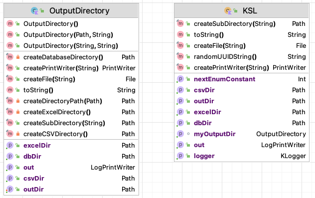
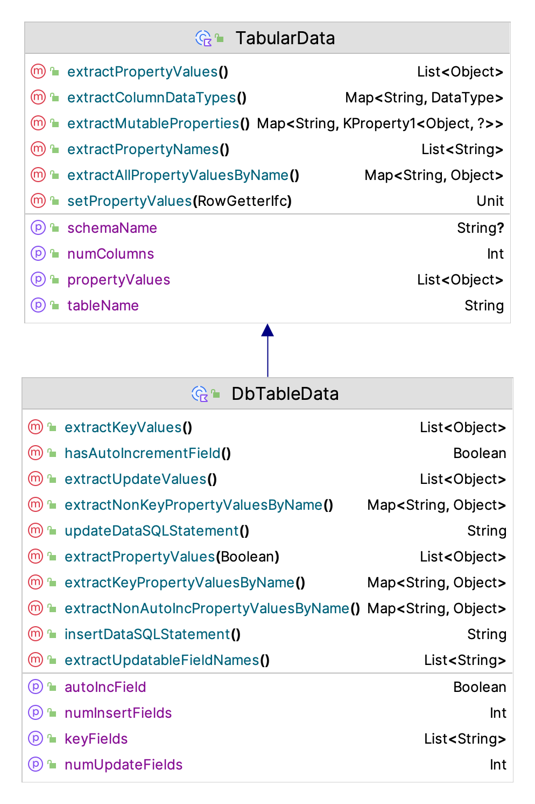
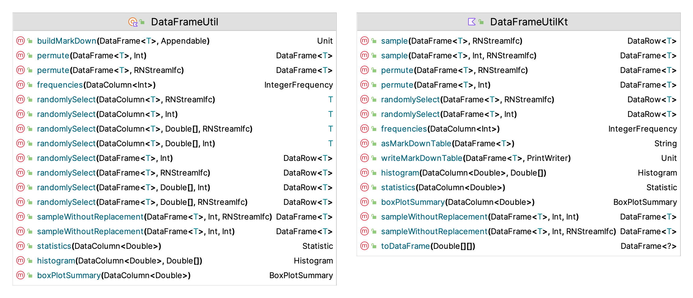
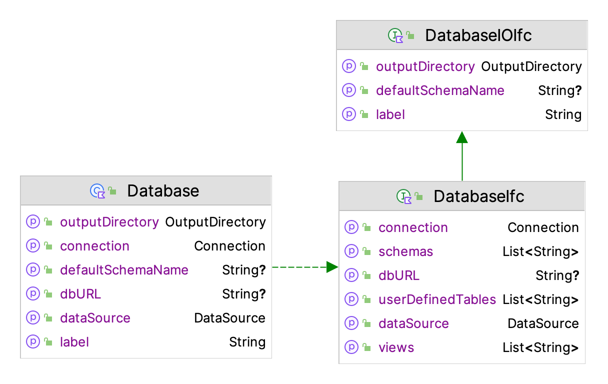
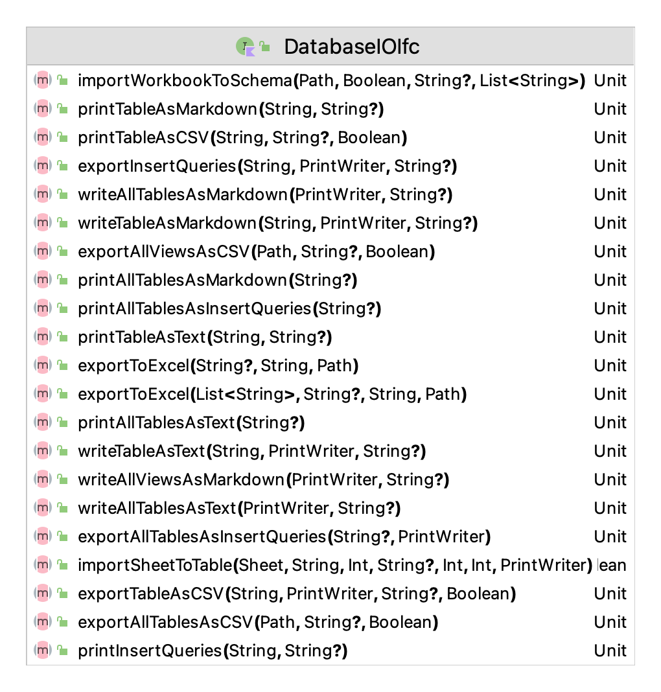
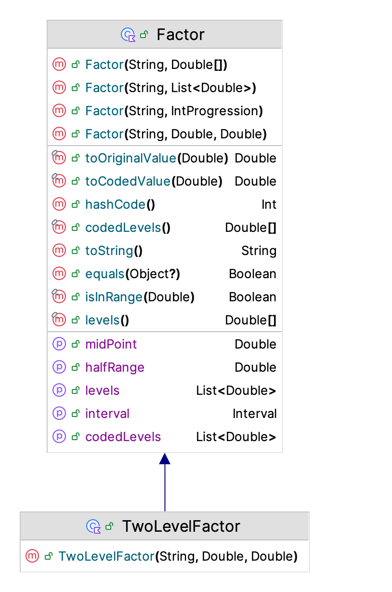

\clearpage 

# KSL Utility Packages {#appUtilities}

**[Learning Objectives]{.smallcaps}**

-   To be become familiar with the classes and functionality associated with KSL utilities

-   To be able to use the KSL file input and output related utilities for CSV, Excel, data frames, and databases

-   To be able to use the KSL array related utilities

-   To be able to use the KSL plotting functionality

-   To be able to use the KSL functionality for performing designed experiments

The purpose of this appendix is to describe the general utilities available within the KSL. The utilities are meant to assist programmers in using Kotlin and especially the use of the simulation constructs available within the KSL. The package `ksl.utilities` hold a wide variety of classes that support both the programmer and the developer of simulation models.  The important items to be discussed in this appendix include: 

- The `ksl.utilities.io` package, which provides support mostly for file input and output some of which, e.g. the `MarkDown` and `StatisticReporter` classes have already been mentioned.
- The `KSLArrays` and `RArrays` classes provide support for working with 1-D and 2-D arrays, including a number of extension functions that are useful for computational work and simulation related activities.
- Miscellaneous utilities involving observers, math, and useful interfaces and classes that facilitate working within the KSL

::: {.infobox .note data-latex="{note}"}
**NOTE!**
This chapter provides illustrative examples of some of the functionality of the `ksl.utilities` package. The full source code of the examples can be found in the accompanying `KSLExamples` project associated with the [KSL repository](https://github.com/rossetti/KSL). The files for each example of this chapter can be found [here](https://github.com/rossetti/KSL/tree/main/KSLExamples/src/main/kotlin/ksl/examples/book/appendixD).
:::

We will start by looking at the utilities for input and output.

## The `OutputDirectory` Class and `KSL` Object

We often need to get data into a program or to write data out.  Because of the plethora of file formats and differing methods for creating and using files, the KSL provides some utilities for working with comma separated value (CSV), Excel, Markdown, text, and database files. The most relevant classes include `OutputDirectory` class, the `KSL` *object* and the `KSLFileUtil` class. 
Figure \@ref(fig:FileUtilities) illustrates the functions and properties of the `KSL` object and the `OutputDirectory` class.

<div class="figure" style="text-align: center">

<p class="caption">(\#fig:FileUtilities)OutputDirectory and KSL</p>
</div>

The `OutputDirectory` class is an abstraction for a file directory to store output. When working with a particular simulation model, it is useful to store all of the results and files generated by the model in one directory. The `OutputDirectory` class facilitates this common use case. An instance of `OutputDirectory` requires a path to the file directory and then forms some standard sub-directories (`excelDir`, `dbDir`, `csvDir`, `outDir`) to hold various files that may be generated for these common types of files. The `KSL` object is, in essence, a default directory to hold all KSL output.  Notice that `OutputDirectory` provides functions for creating files and directories within it. The most useful of the functions is the `createPrintWriter(name: String)` function which takes in the name of the file and creates a `PrintWriter` set up to write to the file. Also, notice the `createSubDirectory()` function. The directories created by this function are relative to the defined output directory.  This alleviates the burden of fully specifying path strings and working with paths.

Here is some sample code that uses the `OutputDirectory` class.

```kt
    // get the working directory
    val path = Paths.get("").toAbsolutePath()
    println("Working Directory = $path")
    // creates a directory called TestOutputDir in the current working directory
    // Creates subdirectories: csvDir, dbDir, excelDir and file out.txt
    val outDir = OutputDirectory(path.resolve("TestOutputDir"))
    // write to the default file
    outDir.out.println("Use out property to write out text to a file.")
    // Creates a PrintWriter (and file) to write to within TestOutputDir
    val pw = outDir.createPrintWriter("PW_File.txt")
    pw.println("Hello, World")
    val subDir = outDir.createSubDirectory("SubDir")
    println(outDir)
```

The `KSL` object is essentially a predefined instance of `OutputDirectory` that creates a default directory called `kslOutput` within the current working directory. The property `out` is an instance of a `LogPrintWriter`, which is a class that wraps a `PrintWriter` but also has a property called `OUTPUT_ON`, which has type boolean, where true indicates that output will be written and false turns off the output. You can use this to stop excessive print messages globally. I find this useful for simple debugging messages.  Besides this field, `KSL` has a standard logger for logging program messages. 

```kt
    // use KSL like you use OutputDirectory but with some added functionality
    // The PW_File.txt file with be within the kslOutput directory within the working directory
    val pw = KSL.createPrintWriter("PW_File.txt")
    pw.println("Hello, World!")
    // Creates subdirectory SubDir within the kslOutput directory
    KSL.createSubDirectory("SubDir")
    // use KSL.out to write to kslOutput.txt
    KSL.out.println("Information written into kslOutput.txt")
    println(KSL)
    // KSL also has logger. This logs to logs/ksl.log
    KSL.logger.info { "This is an informational log comment!" }
```

## Logging Options

Logging is controlled by a [logback](https://logback.qos.ch/) XML file for configuring the loggers. The `logback.xml` file can be found in the resources folder within the source code repository. The more interesting classes that have default loggers written to the logs directory include:

- `KSL` useful for general purpose logging and written to `ksl.log` with default level DEBUG.
- `DatabaseIfc` captures database interaction, written to `kslDbLog.log` with default level INFO.
- `ExcelUtil` captures Excel file interactions, written to `kslExcelLog.log` with default level INFO.
- `KSLFileUtil` captures file interactions, written to `ksl_io.log` with default level INFO.
- `Model` captures key model actions as the model is processed, written to `kslSim.log` with default level of INFO.
- `ModelElement` captures detailed actions related to model element processing, written to `kslModelElement.log` with default level INFO.
- `ProcessModel` captures detailed actions related to entity processing, written to `kslEntity.log` with default level INFO. Very detailed entity tracing can be achieved by setting the log level to TRACE.
- `RNStreamProvider` captures random number stream assignments, written to `kslStreams.log` with default level INFO.
- `Controls` captures simulation control assignment, written to `controlsFile.log` with default level INFO.

For diagnosing issues related to these classes, you can change the debug level within the `logback.xml` file.  Be careful with setting the `ProcessModel` logger to trace because the generated files will be large and the execution time of the model will be longer because of the extra IO. 

## The `KSLFileUtil` Object

The `KSLFileUtil` Object supports the creation/deletion of files, directories, and working with file extensions. It also facilitates the reading and writing of 1-D and 2-D arrays. Figure \@ref(fig:KSLFileUtil) illustrates the functions and properties of the `KSLFileUtil` object

<div class="figure" style="text-align: center">

<p class="caption">(\#fig:KSLFileUtil)KSLFileUtil Class</p>
</div>

- `copyDirectory()` and `copyFile()` facilitate path and file based copying
- `createFile()`, `createDirectories()`, `createPrintWriter()`,  all create according to their function names
- `deleteDirectory()` will delete a directory based on a `File` or a `Path`
- `createCSVFileName()`, `createTxtFileName()` will make a string that has the appropriate extension
- `isCSVFile()`, `isTeXFile()`, `isTextFile()` check for the appropriate extension

As previously noted, there is a logger available for logging file interactions.  A useful property is the `programLaunchDirectory`, which provides the path to the directory in which the program is executing. 

The `KSLFileUtil` object also helps with array IO. 

- `write(array, out: PrintWriter)` has versions for working with arrays of primitives: `Array<DoubleArray>`, `Array<IntArray>`, `DoubleArray`, `IntArray`.  The functions that write double values also have an optional argument to control formatting, `df: DecimalFormat?`.  There are equivalent extension functions for `Array<DoubleArray>`, `Array<IntArray>`, `DoubleArray`, `IntArray` for writing to files.
- `scanToArray(path:  Path)` will read the values file associated with the path into an `DoubleArray.` 
- `toCSVString(array: DoubleArray, df: DecimalFormat?)` will format a line representing the array of data as a comma separated value string.

These functions are used in a number of other packages when working with data and files.

## CSV, Excel, and Tabular Data Files {#appDCSVEtc}

The KSL also has simple utilities to work with comma separated value (CSV) files and Excel files. The underlying CSV file processing library used by the KSL is [Commons CSV](https://commons.apache.org/proper/commons-csv/). The KSL provision of working with CSV files is not meant to replace the functionality of those libraries. Instead, the purpose is to provide a simple facade so that users can do some simple processing without worrying about the complexities of a full featured CSV library.  Figure \@ref(fig:CSVUtil) illustrates the functions and properties of the `CSVUtil` object

<div class="figure" style="text-align: center">

<p class="caption">(\#fig:CSVUtil)CSVUtil Class</p>
</div>

Assuming that the CSV data is organized with first row as a header and each subsequent row as the data for each column as follows:

```
"x", "y"
1.1, 2.0
4.3, 6.4
```

The KSL class `CSVUtil` has the following functions:

- `readRows() : List<Array<String>>` Reads all rows into list holding the rows within an array of strings
- `readRows() : Array<DoubleArray>` Reads all rows into array holding the rows within an array of doubles
- `readToColumns() : Array<DoubleArray>` reads all of the rows and transposes them into the columns
- `writeArrayToCSVFile(array: Array<DoubleArray>)` will write a 2-D array to a file with the CSV format, allowing an optional header and whether quotes are added to strings. 
- `csvIterator(): Iterator<Array<String>>` will iterate through a CSV file.

The following code illustrates the use of the `CSVUtil` class.  An instance of a `NormalRV` random variable is used to make a 5 row, 4 column matrix of normal $\mu = 0$ and $\sigma = 1$ random variates. 

```kt
    val n = NormalRV()
    val matrix = n.sampleAsColumns(sampleSize = 5, nCols = 4)
    for(i in matrix.indices){
        println(matrix[i].contentToString())
    }
    val h = listOf("col1", "col2", "col3", "col4")
    val p = KSL.csvDir.resolve("data.csv")
    CSVUtil.writeArrayToCSVFile(matrix, header = h.toMutableList(), pathToFile = p)
    println()
    val dataAsList: List<Array<String>> = CSVUtil.readRowsToListOfStringArrays(p, skipLines = 1)
    val m = KSLArrays.parseTo2DArray(dataAsList)
    for(i in matrix.indices){
        println(m[i].joinToString(prefix = "[", postfix = "]"))
    }
```

The contents of the matrix are printed to console. The header is made for the CSV file and then the matrix is written to the file using the `CSVUtil` function to write an array to a CSV file.  Then, the `CSVUtil` object is used to read the data into list of strings, which are parsed to double values. You can use the [Commons CSV](https://commons.apache.org/proper/commons-csv/) functionality to read and write values via its API. The approach illustrated here is only meant for simple file processing. 

Excel file operations are available within the KSL through the [Apache POI library](https://poi.apache.org/). The KSL provision of working with Excel files is not meant to replace the functionality of the POI library. Instead, the purpose is to provide a simple facade so that users can do some simple processing without worrying about the complexities of a full featured POI library.  Figure \@ref(fig:ExcelUtil) illustrates the functions and properties of the `ExcelUtil` object.

<div class="figure" style="text-align: center">

<p class="caption">(\#fig:ExcelUtil)ExcelUtil Class</p>
</div>

The KSL class `ExcelUtil` provides the basic functions primarily concerned with reading and writing tabular data:

- `createSheet(workbook: Workbook, sheetName:String)` Creates a sheet within the workbook with the name.
- `writeSheetToCSV()` Treats the columns as fields in a csv file, writes each row as a separate csv row in the resulting csv file
- `writeCell()` Writes the object to the Excel cell
- `readCellAsObject() : Any?` the data in the form of an object
- `readCellAsString() : String` the data in the form of a String
- `readRowAsObjectList() : List<Any?>` an list of strings representing the contents of the cells
- `readRowAsStringArray() : Array<String?>` an array of strings representing the contents of the cells
- `readRowAsStringList() : List<String?>` a list of strings representing the contents of the cells
- `readSheetAsObjects() : List<List<Any?>>` a list of lists of the objects representing each cell of each row of the sheet
- `columnSize()` number of rows that have data in a particular column as defined by not having
     a null cell.
     
To use the `ExcelUtil` object, it is useful to know how the Apache POI library works because you need to know how to create workbooks.  The functionality of the POI library is also exposed as part of the KSL API.  The main use of the object `ExcelUtil` within the KSL is for importing and exporting database tables and record sets to Excel.  
     
Comma separated value (CSV) files and Excel files are commonly used to store data in a tabular (row/column) format.  The KSL also provides some basic functionality for reading and writing tabular files. 

A common programming necessity is to write or read data that is organized in rows and columns.  While libraries that support CSV file processing are readily available, it is sometimes useful to have a quick and easy way to write (or read) tabular data that is not as sophisticated as a database.  While Excel files also provide this ability, using the Apache POI may be more than is required.  To make this type of file processing easier, the KSL provides a general interface for representing tabular data as a data class via the `TabularData` class. In addition, the `TabularFile`, `TabularOutputFile,` and `TabularInputFile` classes permit simple row oriented reading and writing of tabular data. 

<div class="figure" style="text-align: center">

<p class="caption">(\#fig:TabularData)TabularData Class</p>
</div>

Figure \@ref(fig:TabularData) illustrates the functions and properties of the `TabularData` class. The basic usage of this class is to subclass a data class from it to define the contents of a row of data. This can be used for database processing as well as for working with the tabular file classes. 

<div class="figure" style="text-align: center">

<p class="caption">(\#fig:TabularFile)Tabular File Classes</p>
</div>

Figure \@ref(fig:TabularFile) illustrates the functions and properties of the classes for working with tabular data stored in files. 

The following code illustrates how to make a tabular file with 5 columns. The first three columns hold numeric data. The fourth column holds text, and the fifth column holds numeric data. The enum `DataType` defines two types of data to be held in columns: numeric or text. This covers a vast majority of simple computing needs. 

```kt
    val path: Path = KSL.outDir.resolve("demoFile")
    // configure the columns
    val columns: MutableMap<String, DataType> = TabularFile.columns(3, DataType.NUMERIC).toMutableMap()
    columns["c4"] = DataType.TEXT
    columns["c5"] = DataType.NUMERIC
    // make the file
    val tif = TabularOutputFile(columns, path)
    println(tif)
```

The `columns()` function is used to define the columns as a map of column names and the data types.   This describes a type of column within the tabular file.  

The numeric type should be used for numeric data (float, double, long, int, etc.). In addition, use the numeric type for boolean values, which are stored 1.0 = true, 0.0 = false).  The text type should be used for strings and date/time data.  Date and time data is saved as ISO8601 strings ("YYYY-MM-DD HH:MM:SS.SSS").  If you need more type complexity, you should use a database or some other more advanced serialization method such as [JSON](https://www.json.org/json-en.html), [Parquet](https://parquet.apache.org/), or [Arrow](https://arrow.apache.org/).  

The following code creates some random data and writes rows of data to the file. The `RowSetterIfc` interface is use in that it allows for the writing of any numeric columns and any text columns as separate row operations. 

```kt
    // needed for some random data
    val n = NormalRV(10.0, 1.0)
    val k = 15
    // get a row
    val row: RowSetterIfc = tif.row()
    // write some data to each row
    println("Writing rows...")
    for (i in 1..k) {
        // reuse the same row, many times
        // can fill all numeric columns
        row.setNumeric(n.sample(5))
        // can set specific columns
        row.setText(3, "text data $i")
        // need to write the row to the buffer
        tif.writeRow(row)
    }
    // don't forget to flush the buffer
    tif.flushRows()
    println("Done writing rows!")
```

The tabular file package also allows for the defintion of the data schema via data class. The type of the properties of the data class are translated to either text or numeric columns. The following code illustrates this functionality. Here a data class is used to define a text field and a numeric field, which are then written to the file.

```kt
    val path: Path = KSL.outDir.resolve("TabularDataFile")
    data class SomeData(var someText: String = "", var someData: Double = 0.0): TabularData("SomeData")
    val rowData = SomeData()
    // use the data class instance to define the columns and their types
    val tof = TabularOutputFile(rowData, path)
    println(tof)

    // needed for some random data
    val n = NormalRV(10.0, 1.0)
    val k = 15
    // write some data to each row
    println("Writing rows...")
    for (i in 1..k) {
        // reuse the same row, many times
        // can fill all numeric columns
        rowData.someData = n.value
        rowData.someText = "text data $i"
        // need to write the row to the buffer
        tof.writeRow(rowData)
    }
    // don't forget to flush the buffer
    tof.flushRows()
    println("Done writing rows!")

```

As long as the data class is compatible with the rows of the file, then the same approach can be used to read in the data as illustrated in the next code snippet.

```kt
    val tif = TabularInputFile(path)
    println(tif)

    // TabularInputFile is Iterable and foreach construct works across rows
    println("Printing all rows from an iterator using data class")
    for (row in tif.iterator()) {
        rowData.setPropertyValues(row)
        println(rowData)
    }
    println()
```

Reading data from the file has a bit more functionality through some useful iterators. The following code opens a tabular file and iterates the rows. 

```kt
    val path: Path = KSL.outDir.resolve("demoFile")
    val tif = TabularInputFile(path)
    println(tif)

    // TabularInputFile is Iterable and foreach construct works across rows
    println("Printing all rows from an iterator")
    for (row in tif.iterator()) {
        println(row)
    }
    println()
```

You can fetch specific rows or a subset of rows. Multiple iterators can be active at the same time.

```kt
    // You can fetch rows as a list
    println("Printing a subset of rows")
    val rows: List<RowGetterIfc> = tif.fetchRows(1, 5)
    for (row in rows) {
        println(row)
    }
    println()
```

You can start the iterator at a particular row.

```kt
    println("Print starting at row 9")
    val iterator: TabularInputFile.RowIterator = tif.iterator(9)
    while (iterator.hasNext()) {
        println(iterator.next())
    }
    println()
```
You can grab various columns as arrays.

```kt
    println("Printing column 0")
    val numericColumn: DoubleArray = tif.fetchNumericColumn(0, 10, true)
    for (v in numericColumn) {
        println(v)
    }
```

You can write the data to an Excel workbook.

```kt
    try {
        tif.exportToExcelWorkbook("demoData.xlsx", KSL.excelDir)
    } catch (e: IOException) {
        e.printStackTrace()
    }
```

You can pretty print rows of the data and export the data to a CSV file.

```kt
    tif.printAsText(1, 5)
    val printWriter: PrintWriter = KSL.createPrintWriter("data.csv")
    tif.exportToCSV(printWriter, true)
    printWriter.close()
```

You can even convert the tabular data to an SQLLite database or turn the data into a data frame.

```kt
    try {
        val database: DatabaseIfc = tif.asDatabase()
    } catch (e: IOException) {
        e.printStackTrace()
    }
    println()
    println("Printing a data frame version")
    val df = tif.asDataFrame()
    println(df)
```

Much of this functionality is used within the implementation of the KSL database implementation, which will be discussed in a subsequent section. Since we just mentioned data frames, we discuss that functionality in the next section.

## The `DataFrameUtil` Object {#dfUtil}

A data frame is an in-memory data structure that holds tabular data. That is, data having rows and columns. Kotlin has a library to support this type of functionality and the `DataFrameUtil` object has been designed to facilitate the use of data frame within the `KSL.` Documentation, examples, and the basic functionality of Kotlin data frames can be found at this [repository](https://github.com/Kotlin/dataframe). Kotlin data frames provide similar functionality as that found in other data frame libraries such as R. Figure \@ref(fig:DataFrameUtil) illustrates the functions and properties of the `DataFrameUtil` object.


<div class="figure" style="text-align: center">

<p class="caption">(\#fig:DataFrameUtil)The DataFrameUtil Object</p>
</div>

The main functionality added by `DataFrameUtil` is sampling from rows and columns of the data frame and computing some basic statistics. The functions for sampling without replacement return a new data frame with the sampled rows. The functions for permutation return a new data frame with the permuted rows. The functions for randomly selection will select an element from the a column of the data frame or for selecting an entire row. The element or row can be selected with equal probability or via an empirical distribution over the elements (by row).  `KSL` statistics, histogram, box plot statistics, and frequencies can all be computed over the columns. 

  + sampleWithoutReplacement(DataFrame$<T>$, Int, RNStreamIfc) DataFrame$<T>$
  + sampleWithoutReplacement(DataFrame$<T>$ Int, Int) DataFrame$<T>$
  + permute(DataFrame$<T>$, Int) DataFrame$<T>$
  + permute(DataFrame$<T>$, RNStreamIfc) DataFrame$<T>$
  + randomlySelect(DataColumn$<T>$, RNStreamIfc) T
  + randomlySelect(DataColumn$<T>$, Int) T
  + randomlySelect(DataColumn$<T>$, Double[], RNStreamIfc) T
  + randomlySelect(DataColumn$<T>$, Double[], Int) T
  + randomlySelect(DataFrame$<T>$, Int) DataRow$<T>$
  + randomlySelect(DataFrame$<T>$, RNStreamIfc) DataRow$<T>$
  + randomlySelect(DataFrame$<T>$, Double[], Int) DataRow$<T>$
  + randomlySelect(DataFrame$<T>$, Double[], RNStreamIfc) DataRow$<T>$
  + buildMarkDown(DataFrame$<T>$, Appendable) Unit
  + histogram(DataColumn$<Double>$, Double[]) Histogram
  + statistics(DataColumn$<Double>$) Statistic
  + frequencies(DataColumn$<Int>$) IntegerFrequency
  + boxPlotSummary(DataColumn$<Double>$) BoxPlotSummary
  
Extension functions are also available for a data frame and its columns. The Kotlin data frame library has been included in the KSL as part of the API. Thus, clients also have access to the full features associated with the library. The main usage within the KSL is in the capturing of simulation output data. The easiest way to do this is by using the `KSLDatabase` class. Data frame instances can be requested as part of the database functionality of the KSL. 

## KSL Database Utilities

Some of the database functionality for use when accessing simulation results has already been discussed in Chapter \@ref(simoa).  This section presents some of the more general database utilities available within the KSL framework. These utilities basically exist to help with implementing the KSL database functionality. However, users may find some of this functionality useful for other purpose.  However, these utilities are not meant as a substitute for more advanced database frameworks such as [JOOQ](https://www.jooq.org/), [Exposed](https://github.com/JetBrains/Exposed), and [KTorm](https://www.ktorm.org/). We refer the interested reader to those libraries for more advanced work for database processing using Kotlin. 

Figure \@ref(fig:DbProperties) illustrates the properties of the interfaces, `DatabaseIOIfc` and `DatabaseIfc` which represent the main functionality for working with databases.  

<div class="figure" style="text-align: center">

<p class="caption">(\#fig:DbProperties)Properties of the Main Database Classes</p>
</div>

The `DatabaseIOIfc` interface is responsible for defining the functionality related to input and output. As shown in Figure \@ref(fig:DatabaseIOIfc) the capabilities are easily discerned from the names of the methods. Exporting tables and views to Excel or CSV files are probably the most useful functions. For small tables, capturing the table as a Markdown table can be useful. 

<div class="figure" style="text-align: center">

<p class="caption">(\#fig:DatabaseIOIfc)Methods of the DatabaseIOIfc Interface</p>
</div>

The `DatabaseIfc` interface defines what a database can do and the `Database` class provides a concrete implementation for working with a database. The functionality of the `DatabaseIfc` interface is extensive. Besides the IO related functions, we note a few useful methods here. The `execute` methods allow the execution of an SQL string, list of SQL commands, or script file. It is the user's responsibility for forming an appropriate SQL string.

  + executeCommand(String) Boolean
  + executeCommand(String) Boolean
  + executeCommands(List$<$String$>$) Boolean
  + executeCommands(List$<$String$>$) Boolean
  + executeScript(Path) Boolean
  + executeScript(Path) Boolean

There are methods for checking if the database contains specific named tables or views.

  + containsSchema(String) Boolean
  + containsSchema(String) Boolean
  + containsTable(String) Boolean
  + containsTable(String, String) Boolean
  + containsTable(String, String) Boolean
  + containsTable(String) Boolean
  + containsView(String) Boolean
  + containsView(String) Boolean

A set of methods for fetching data from the database facilitate the execution of SQL select statements. The select all methods will select all the data from a named table or view.

  + fetchCachedRowSet(String) CachedRowSet?
  + fetchCachedRowSet(String) CachedRowSet?
  + fetchOpenResultSet(String) ResultSet?
  + fetchOpenResultSet(String) ResultSet?
  + selectAll(String, String?) CachedRowSet?
  + selectAll(String, String?) CachedRowSet?
  + selectAllIntoOpenResultSet(String, String?) ResultSet?
  + selectAllIntoOpenResultSet(String, String?) ResultSet?
  
The interface also provides some basic methods for inserting and updating data within the database by using Kotlin data classes, specifically sub-classes of the `DbTableData` class, which extends the `TabularData` class and allows the user to supply the data for a table in a data class instance similar to how it was done for working with tabular files. However, in this case more general mapping of data types to database types is permitted besides just numeric or text.
  
  + insertDbDataIntoTable(List$<$String$>$, String, String?) Int
  + insertDbDataIntoTable(T, String, String?) Int
  + insertDbDataIntoTable(List$<$String$>$, String, String?) Int
  + insertDbDataIntoTable(T, String, String?) Int
  + updateDbDataInTable(List$<$String$>$, String, String?) Int
  + updateDbDataInTable(T, String, String?) Int
  + updateDbDataInTable(List$<$String$>$, String, String?) Int
  + updateDbDataInTable(T, String, String?) Int

When working with the database it is useful to get a connection, access table meta data, check if tables have data, check if tables or views exist.

  + getConnection() Connection
  + getSchemas() List$<$String$>$
  + getUserDefinedTables() List~$<$String$>$
  + getViews() List$<$String$>$
  + hasData(String?) Boolean
  + hasData(String?) Boolean
  + hasTables(String) Boolean
  + hasTables(String) Boolean
  + isTableEmpty(String, String?) Boolean
  + isTableEmpty(String, String?) Boolean
  + numRows(String, String?) Long
  + numRows(String, String?) Long
  + tableMetaData(String, String?) List$<$ColumnMetaData$>$
  + tableMetaData(String, String?) List$<$ColumnMetaData$>$
  + tableNames(String) List$<$String$>$
  + tableNames(String) List$<$String$>$
  + viewNames(String) List$<$String$>$
  + viewNames(String) List$<$String$>$
  
We refer the interested reader to the [KSL KDoc](https://rossetti.github.io/KSLDocs/) documentation for further details about using these methods. 

The `DatabaseIfc` functionality defines basic capabilities for working with any database implementation. The KSL provides functionality to create [SQLite](https://www.sqlite.org/index.html), [Derby](https://db.apache.org/derby/) , and [DuckDb](https://duckdb.org/) embedded databases. In addition, the KSL facilitates the creation of a database on a [Postgres](https://www.postgresql.org/) database server. 

<div class="figure" style="text-align: center">

<p class="caption">(\#fig:EmbeddedDb)Working with Embedded Databases</p>
</div>

Figure \@ref(fig:EmbeddedDb) illustrates the functionality of the `EmbeddedDbIfc` interface, and its SQLite, Derby, and DuckDb implementations. Readers interested in other databases can review these implementations for how to structure code for other databases. The `PostgresDb` class provides similar functionality. The main purpose is to be able to supply a data source to the `Database` class.

Figure \@ref(fig:Ch13KSLDatabase) provides the functionality for the `KSLDatabase` class. Although most of this functionality has been mentioned within Chapter 5, it is useful to note that since the `KSLDatabase` class is a database, it also has all of the previously mentioned database functionality.

<div class="figure" style="text-align: center">

<p class="caption">(\#fig:Ch13KSLDatabase)The KSLDatabase Class</p>
</div>

The main notable methods involve the export, printing, or writing of the underlying data from the tables or views storing the simulation statistical results. In addition, there are a number of properties that will provide data frame representations of the simulation output data. For example, the data class `WithinRepStatTableData` represents the statistics collected within each replication and is used to by the `withinReplicationResponseStatistics` property to create a data frame that holds the statistical data. Figure \@ref(fig:WithinRepStatTableData) provides the data elements held for within replication data. 

<div class="figure" style="text-align: center">

<p class="caption">(\#fig:WithinRepStatTableData)Within Replication Statistical Data</p>
</div>

The within replication statistical data represents the summary statistics of the data collected during a replication.  The most relevant properties are the `average`, `minimum`, and `maximum`.  To compute across replication statistics we can use the `average` for each replication. The statistical quantities are captured within the underlying database as discussed in Chapter \@ref(simoa).  The user can post-process any of this data using commonly available database technology and SQL.

The database utilities also offers the ability to quickly create simple databases via the `Database` companion object's `createSimpleDb()` function. The purpose of this function is to allow the creation of a quick and dirty database solution based on the `DbTableData` data classes.  By defining data classes that are sub-classes of `DbTableData`, a `CREATE TABLE` specification can be obtained and the database created. Then, the database can be used to insert data from instances of the `DbTableData` sub-classes.  The following code illustrates this possibility.

First, we define two data classes that extend the `DbTableData` class. In this code, we define a `Person` and a `City` class, each with a property `id` that will act as the primary key of the table.  The primary key must be specified; however, the use of an auto-generated (surrogate) key is not supported at this time. 

```kt
data class Person(
    var id: Int,
    var name: String,
    var age: Int
) : DbTableData("Persons", listOf("id"))

data class City(
    var id: Int,
    var name: String,
    var population: Int
) : DbTableData("Cities", listOf("id"))
```

Then, by providing a simple instance of these classes to the `SimpleDb` class constructor, we will cause a database to be created that is setup to hold the data from the supplied data classes. If you want to see the `CREATE TABLE` statements used to define the tables, then uncomment the two print statements in the following code.

```kt
    val p = Person(1, "manuel", age = 10)
//    println(p.createTableSQLStatement())
    val c = City(1, "London", population = 1000)
//    println(c.createTableSQLStatement())
    val db = Database.createSimpleDb(setOf(p, c), "TestSimpleDb")
    db.insertDbDataIntoTable(p)
    db.insertDbDataIntoTable(c)
```

You can then used the full functionality provided by the KSL database utilities because the `createSimpleDb()` function returns an instance of the `DatabaseIfc` and `DatabaseIOIfc` interfaces. This functionality is useful for setting up small databases to hold generated data.  It does not facilitate more advanced data definition or object-relational mappings.  Please see more advanced database frameworks such as [JOOQ](https://www.jooq.org/), [Exposed](https://github.com/JetBrains/Exposed), and [KTorm](https://www.ktorm.org/) for more robust solutions.

## Array Utilities {#appUtilitiesArrays}

The KSL provides a wide-variety of functions and extensions for working with `Double`, `Int`, and `Long` arrays. Most of the functionality is focused on working with one-dimensional `Double` arrays. 
Figure \@ref(fig:KSLArrays) illustrates the many methods for working with arrays via the `KSLArrays` object. These methods are also available as extension functions. 

<div class="figure" style="text-align: center">

<p class="caption">(\#fig:KSLArrays)Array Utilities</p>
</div>

There are a number of functions that facilitate conversions: to primitive types, to strings, conversion between types, and parsing.

  + toPrimitives(Double[], Double) Double[]
  + toPrimitives(List$<$Double$>$, Double) Double[]
  + toPrimitives(Int[], Int) Int[]
  + toPrimitives(List$<$Int$>$, Int) Int[]
  + toPrimitives(Long[], Long) Long[]
  + toPrimitives(List$<$Long$>$, Long) Long[]
  + toCSVString(Double[]) String
  + toCSVString(Int[]) String
  + toCSVString(Long[]) String
  + toDoubles(Int[]) Double[]
  + toDoubles(Int[]) Double[]
  + toDoubles(Long[]) Double[]
  + toDoubles(Long[]) Double[]
  + toDoubles(Double[][]) Double[][]
  + parseToDoubles(String[], Double) Double[]
  + parseToDoubles(List$<$String$>$, Double) Double[]
  + toStrings(Double[]) String[]
  + toInts(Int[][]) Int[][]
  + toLongs(Long[][]) Long[][]
  
Then, there are useful functions for performing basic statistical computations such as finding the indices of the minimum or maximum, counting elements, finding the minimum, finding the maximum, and computing statistics. 

  + indexOfMax(Double[]) Int
  + indexOfMax(Int[]) Int
  + indexOfMax(Long[]) Int
  + indexOfMin(Double[]) Int
  + indexOfMin(Int[]) Int
  + indexOfMin(Long[]) Int
  + countLessEqualTo(Double[], Double) Int
  + countLessEqualTo(Int[], Int) Int
  + countLessThan(Double[], Double) Int
  + countLessThan(Int[], Int) Int
  + statistics(Double[]) Statistic
  + min(Double[]) Double
  + min(Int[]) Int
  + min(Long[]) Long
  + histogram(Double[], Double[]) Histogram
  + countGreaterEqualTo(Double[], Double) Int
  + max(Double[]) Double
  + countGreaterEqualTo(Int[], Int) Int
  + max(Int[]) Int
  + max(Long[]) Long
  + range(Double[]) Double
  + countGreaterThan(Double[], Double) Int
  + countGreaterThan(Int[], Int) Int
  + subtractConstant(Double[], Double) Double[]
  + orderStatistics(Double[]) Double[]
  + sumOfSquares(Double[]) Double
  + sumOfSquareRoots(Double[]) Double

In addition, there are methods for checking the arrays. For example, methods exist to check if the 2-D array is rectangular in shape.  That is, the rows all have the same number of elements. You can also check if the elements are all different, are strictly increasing or decreasing, and contain a zero value. 

  + isRectangular(T[][]) Boolean
  + isRectangular(Double[][]) Boolean
  + isRectangular(Int[][]) Boolean
  + isRectangular(Long[][]) Boolean
  + isIncreasing(Double[]) Boolean
  + isIncreasing(Int[]) Boolean
  + isAllDifferent(Double[]) Boolean
  + isAllDifferent(Int[]) Boolean
  + isStrictlyIncreasing(Double[]) Boolean
  + isStrictlyIncreasing(Int[]) Boolean
  + hasElement(Double[], Double) Boolean
  + hasElement(Int[], Int) Boolean
  + hasElement(Long[], Long) Boolean
  + findIndex(Double[], Double) Int
  + findIndex(Int[], Int) Int
  + findIndex(Long[], Long) Int
  + findIndex(String[], String) Int
  + isStrictlyDecreasing(Double[]) Boolean
  + isStrictlyDecreasing(Int[]) Boolean
  + hasZero(Double[]) Boolean
  + hasZero(Int[]) Boolean
  + hasZero(Long[]) Boolean
  + isDecreasing(Double[]) Boolean
  + isDecreasing(Int[]) Boolean

Then, there are methods for operating on the entire array. First, there are functions to reshape the arrays such as trimming non-rectangular arrays to rectangular, transposing the arrays, and expanding non-rectangular arrays to be rectangular. Then, there are functions to apply to each element such as multiplying the elements by a constant, adding a constant, and dividing by a constant. You can also apply a function to the elements in-place. That is transform each element without creating a new array.

  + trimToRectangular(Double[][]) Double[][]
  + minMaxScaledArray(Double[]) Double[]
  + multiplyElements(Double[], Double[]) Double[]
  + multiplyConstant(Double[], Double) Double[]
  + addConstant(Double[], Double) Double[]
  + copyWithout(Double[], Int) Double[]
  + expandToRectangular(Double[][], Double) Double[][]
  + transpose(Int[][]) Int[][]
  + transpose(Double[][]) Double[][]
  + transpose(Long[][]) Long[][]
  + divideConstant(Double[], Double) Double[]
  + normScaledArray(Double[]) Double[]
  + toMapOfLists(Double[][], List$<$String$>$) Map$<$String, List$<$Double$>$$>$
  + toMapOfColumns(Double[][], List$<$String$>$) Map$<$String, Double[]$>$
  + toMapOfRows(Double[][], List$<$String$>$) Map$<$String, Double[]$>$
  + mapInPlace(T[], (T) -$>$ T) Unit
  + mapInPlace(Int[], (Int) -$>$ Int) Unit
  + mapInPlace(Double[], (Double) -$>$ Double) Unit
  + fillColumn(Double[][], Int, Double[]) Unit
  + fill(Double[], GetValueIfc) Unit
  + fill(Double[][], GetValueIfc) Unit

Figure \@ref(fig:RArrays) illustrates the many methods for permuting and sampling arrays.

<div class="figure" style="text-align: center">

<p class="caption">(\#fig:RArrays)Random Array Utilities</p>
</div>

Much of the functionality described here can (and has been) used to implement more complex operations used within the KSL. There are other libraries that are under active develop for working with arrays with design goals that focus on efficiency and memory.  The interested reader might look at [kmath](https://github.com/SciProgCentre/kmath) and the multi-dimensional arrays library, [multik](https://github.com/Kotlin/multik).

## KSL Plotting Utilities {#appPlotting}

This file demonstrates how to create many of the plots that
are available within the ksl.utilities.io.plotting package.
The KSL uses the [lets-plot library](https://github.com/JetBrains/lets-plot-kotlin)
as its underlying plotting platform. 

The KSL wraps the lets-plot functionality into a set of classes to create commonly
used plots within simulation. The KSL has classes that facilitate the construction of
the following plots.

- `ACFPlot` - The autocorrelation function (ACF) for an array of data plots the correlation between $X_i$ and $X_{i+k}$ for different values of $k$.
- `BoxPlot` - The box plot summary for an array of data plots the summary statistics representing the first quartile, median, and third quartile of the data along with outliers.
- `MultiBoxPlot` A multi-box plot presents multiple box plots on the same plotting frame.
- `CDFDiffPlot` - CDF difference plot, as defined in Chapter 6 of [@law2007simulation], plots the difference between the theoretical distribution $F(x)$ and the empirical distribution $F_n(x)$ over the range of the data. 
- `ConfidenceIntervalsPlot` - A confidence intervals plot presents a set of confidence interval on one plotting frame.
- `DensityPlot` - A density plot presents the density of the data relative to a possible probability distribution.
- `DiscreteCDFPlot` - A discrete CDF plot presents the cumulative distribution function for a discrete empirical random variable with a step-function representation.
- `DotPlot` - A dot plot present the distribution of the data as a sequence of dots.
- `ECDFPlot` - An empirical CDF plot presents the distribution of the data as a cumulative estimate of the CDF.
- `FitDistPlot` - A fit distribution plot presents four plots (ECDFPlot, PPPlot, QQPlot, HistogramPlot) of data for distribution fitting diagnostics.
- `FunctionPlot` - A function plot facilitates the plotting of a univariate function.
- `HistogramPlot` - A histogram plot summarizes the distribution of the data over well-defined bins.
- `HistogramDensityPlot` - A histogram plot summarizes the distribution of the data over well-defined bins and super imposes a density representation over the histogram.
- `IntegerFrequencyPlot` - An integer frequency plot presents a bar graph representation of integer frequency tabulated data.
- `StateFrequencyPlot` - A state frequency plot presents a bar graph representation of integer frequency data tabulated across state observations.
- `ObservationsPlot` - An observations plot presents a time-ordered plot of the data.
- `PMFComparisonsPlot` - A PMF comparison plot presents plots the theoretical PMF versus an empirical PMF.
- `PMFPlot` - A PMF plot presents a dot bar graph representation of a probability mass function.
- `PPPlot` - A P-P plot presents the model probability $\hat{F}(x_{(i)})$ versus the empirical probability $\tilde{F}_n (x_{(i)})$ based on the sample for i= 1, 2,$\ldots$ n
- `QQPlot` A Q-Q plot presents the order statistics versus the theoretical order statistics, $x_{q_i}$ versus $x_{(i)}$ for i = 1, 2, $\ldots$ n.
- `ScatterPlot` - A scatter plot is a simple x-y plot of two data arrays.
- `StateVariablePlot` - A state variable plot presents a step-function representation for time-persistent variables as per Figure \@ref(fig:NCInQ).
- `WelchPlot` - A Welch plot presents the cumulative sum plot of Welch data as illustrate in Figure \@ref(fig:WelchPlot).
- `PartialSumsPlot` - A partial sums plot presents the partial sums process for diagnosing whether initialization bias is present.

In what follows, we present some example code for creating a few of these plots. The full code can be found in the files associated with this appendix.

In the following code, a bivariate normal random variable is created and a sample array is made containing the $X$ and $Y$ data. Then a scatter plot is made from the data.

```kt
    val bvn = BivariateNormalRV(0.0, 1.0, 0.0, 1.0, 0.8)
    val data = bvn.sampleByColumn(1000)
    val plot = ScatterPlot(data[0], data[1])
    plot.showInBrowser(plotTitle =  "Scatter Plot of Bivariate Normal RV")
    plot.saveToFile("ScatterPlotDemo", plotTitle = "Scatter Plot of Bivariate Normal RV")
```

Figure \@ref(fig:ScatterPlotDemo) presents the plot as generated by the `saveToFile()` function.

<div class="figure" style="text-align: center">

<p class="caption">(\#fig:ScatterPlotDemo)Example Scatter Plot</p>
</div>

The returned `plot` variable implements the `PlotIfc` interface.  The `PlotIfc` interface is shown in Figure \@ref(fig:PlotIfc). The function `buildPlot()` returns an instance of the `Plot` class from the lets-plot library. This instance can be further customized using the concepts of that library.  The `toHTML()` function generates an HTML file that can be opened by a browser. This is what the `showInBrowser()` function does.

<div class="figure" style="text-align: center">

<p class="caption">(\#fig:PlotIfc)PlotIfc Interface</p>
</div>

The following code illustrates how to display multiple box plots.

```kt
    val n = NormalRV()
    val m = mutableMapOf<String, BoxPlotSummary>()
    for (i in 1..5) {
        val bps = BoxPlotSummary(n.sample(200), "BPS$i")
        m[bps.name] = bps
    }
    val plot = MultiBoxPlot(m)
    plot.showInBrowser(plotTitle =  "Box Plots")
    plot.saveToFile("BoxPlotDemo", plotTitle = "Box Plots")
```

The code makes a map of `BoxPlot` instances indexed by their names and then displays them together on a single plot axis.

<div class="figure" style="text-align: center">

<p class="caption">(\#fig:BoxPlotDemo)Example Multiple Box Plots</p>
</div>

The following code illustrates how to display multiple confidence intervals on the same plot.

```kt
    val n = NormalRV()
    val m = mutableMapOf<String, Interval>()
    for (i in 1..5) {
        val s = Statistic(n.sample(200))
        m[s.name] = s.confidenceInterval
    }
    val plot = ConfidenceIntervalsPlot(m, referencePoint = 0.0)
    plot.showInBrowser(plotTitle = "Confidence Intervals")
    plot.saveToFile("ConfidenceIntervalsPlot", plotTitle = "Confidence Intervals")
```

The code makes a map of `Interval` instances indexed by the names of their associated statistics and then displays them together on a single plot axis.

<div class="figure" style="text-align: center">

<p class="caption">(\#fig:CIPlotDemo)Example Multiple Confidence Interval Plots</p>
</div>

Finally, the following code illustrates how to create a state variable plot. In this case, two arrays are required. The first arrays hold the times at which the state variable changes. The second array holds the value of the state variable for the associated times.

```kt
    val t = doubleArrayOf(0.0, 2.0, 5.0, 11.0, 14.0, 17.0, 22.0, 26.0, 28.0, 31.0, 35.0, 36.0)
    val n = doubleArrayOf(0.0, 1.0, 0.0, 1.0, 2.0, 3.0, 4.0, 3.0, 2.0, 1.0, 0.0, 0.0)
    val plot = StateVariablePlot(n, t, "Response")
    plot.showInBrowser()
    plot.saveToFile("StateVariableDemo", plotTitle = "State Variable Plot")
```

<div class="figure" style="text-align: center">

<p class="caption">(\#fig:ResponseTraceFig)ResponseTrace Class</p>
</div>

Section \@ref(simoaCapture) of Chapter \@ref(simoa) presented how to make a `ResponseTrace` of a variable from a simulation model.  In reviewing, Figure \@ref(fig:ResponseTraceFig), we see that the `traceDataMap()` function will allow you to grab the data for a state variable plot. The function returns a map that has the time and values for the variable for a particular replication less than or equal to the provided `time` value.

```kt
fun traceDataMap(repNum: Double, time: Double = Double.MAX_VALUE) : Map<String, DoubleArray>{
```

Thus, you can easily create a state variable plot for a response trace when needed.

<div class="figure" style="text-align: center">

<p class="caption">(\#fig:SVPlotDemo)Example State Variable Plot</p>
</div>

## Experimental Design Utilities {#appExpDesign}

As discussed in Section \@ref(kslScenarios) of Chapter \@ref(simoa) when analyzing a situation using simulation, we must often simulate a model many times. This initiates the need to be efficient and effective when running many scenarios.  Experimental design concepts can assist with ensuring an efficient and effective approach to experimenting with a simulation model.

An **experiment** is a data collection procedure that occurs under controlled conditions to identify and understand the relationships between variables. A computer *simulation experiment* is an experiment executed (virtually) on a computer using a *simulation model*. The simulation model is a proxy representation for the actual physical system.  When you run a simulation model, you are performing an experiment. Computer simulation **is** experimentation on a computer. An **experimental design** is a detailed plan for collecting and using data to understand the relationships between variables. An experimental design describes how to execute the experiment. For a computer simulation, an experimental design details the settings for the model's inputs and the specification of the desired outputs. Experimental design is an iterative process. Don't expect to get the plan perfect the first time or without some preliminary ad-hoc experimentation.  The goal of experimental design is to be able to understand the relationships between the variables in the most efficient and effective manner possible.

*Factors* are the attributes of the model (parameters and/or input variables) that may be changed (or controlled) in a simulation experiment. Factors are the parameters/inputs that are of interest during experimentation. The *factor levels* are the set of possible values that factors are changed to (set at) for an experimental run. These are sometimes called treatments in physical experiments, but generally not so for computer experiments. For example, if the reorder quantity is a factor, the the levels might be (5, 20, 50) units. The levels are the settings that can be used for the factor. A *design point* is the specification of an instance of factor settings that will result in observations of the response.  An *experimental run* (or run) is the *execution* of an experimental design point resulting in a single observation of the output variables.  In experimental design, an experimental run is often called a *replicate*. In the simulation context, it is often referred to as a *replication*. An *experimental design* can be thought of as the set of design points and the specification of how many replications are required for each point. 

The KSL provides functionality to define and run experiments based on experimental design contexts. We start with being able to represent factors. Figure \@ref(fig:KSLFactors) presents the class diagram for the `Factor` class. Factors have a name and a specification of the levels for the factors.

<div class="figure" style="text-align: center">

<p class="caption">(\#fig:KSLFactors)KSL Factors</p>
</div>

When setting up an experimental design, the regressors (factors) are often coded in such a manner to facilitate the interpretation of the model coefficients.  Quite often they are scaled to a range of values between -1 and 1, or between 0 and 1.  Withing the KSL, the levels of the factors should be supplied via their uncoded values.  The KSL `Factor` class can perform the translation to and from the coded and uncoded design space. 

Suppose we have non-standardized factor $p$ and denoted as $w_p$. Suppose $w_p$ ranges between its lowest value, $l_p$ and its highest value $u_p$.  That is $w_p$ is in the interval, $w_p \in [l_p,u_p]$. For example, suppose $w_p$ is the mean of the service time distribution and $w_p$ has levels $[5,10,15,20,25]$. Thus, $l_p = 5$ and $u_p = 25$
  
- Let $h_p$ be the half-range, where $h_p = (u_p - l_p)/2$. The half-range measures the spread of the factor.
- Let $m_p$ be the mid-point of the range, where $m_p = (u_p + l_p)/2$.

A standard approach is to the code the factor as:

$$
x_{ip}=\frac{w_{ip} - m_{p}}{h_p}
$$

For example, suppose $w_{ip} \in \{5,10,15,20,25\}$.  Thus $h_p = (25 - 5)/2 = 10$ and $m_p = (25 + 5)/2 = 15$. Thus, we have $x_{ip} \in \{-1,\frac{-1}{2},0,\frac{1}{2},1\}$. Notice that for a factor with **two** levels this always results in a coding of $\pm 1$.  Low is coded to $-1$ and high is coded to $+1$.

The following illustrates the creation of two factors, one with 3 levels and another with 2 levels. 

```kt
    val f1 = Factor("A", doubleArrayOf(1.0, 2.0, 3.0, 4.0))
    val f2 = Factor("B", doubleArrayOf(5.0, 9.0))
    val factors = setOf(f1, f2)
```

Once we have defined factors for the experiment, we can proceed with defining an experimental design. The KSL supports factorial designs, two level factorial designs, central composite designs, and general experimental designs. Figure \@ref(fig:KSLExpDesig) presents the major classes and interfaces related to KSL experiments.

<div class="figure" style="text-align: center">

<p class="caption">(\#fig:KSLExpDesig)KSL Experimental Design Classes</p>
</div>

The first important item to note is the use of the `ExperimentalDesignIfc` interface. The experimental designs supported by the KSL all implement this interface.  The `ExperimentalDesignIfc` interface provides functionality that allows the design points in the design to be specified and iterated.  To create an experimental design, you must specify the set of factors, or as in the case of a composite design, the starting factorial design.

The following code illustrates how to create a factorial design and will print out the design points. 

```kt
    val f1 = Factor("A", doubleArrayOf(1.0, 2.0, 3.0, 4.0))
    val f2 = Factor("B", doubleArrayOf(5.0, 9.0))
    val factors = setOf(f1, f2)
    val fd = FactorialDesign(factors)
    println(fd)
    println()
    println("Factorial Design as Data Frame")
    println(fd.designPointsAsDataframe())
    println()
    println("Coded Factorial Design as Data Frame")
    println(fd.designPointsAsDataframe(true))
    println()
```

There are eight design points in this design because we have factor A with 4 levels and factor B with 2 levels, resulting in $4 \times 2 = 8$ design points. 

```
FactorialDesign
name: ID_3
number of design points: 8
Factors
Factor: A
Levels = 1.0,2.0,3.0,4.0
halfRange = 1.5
midPoint = 2.5
Coded Levels = -1.0,-0.3333333333333333,0.3333333333333333,1.0

Factor: B
Levels = 5.0,9.0
halfRange = 2.0
midPoint = 7.0
Coded Levels = -1.0,1.0

Factorial Design as Data Frame
     A   B
 0 1.0 5.0
 1 1.0 9.0
 2 2.0 5.0
 3 2.0 9.0
 4 3.0 5.0
 5 3.0 9.0
 6 4.0 5.0
 7 4.0 9.0
 
 Coded Factorial Design as Data Frame
           A    B
 0 -1.000000 -1.0
 1 -1.000000  1.0
 2 -0.333333 -1.0
 3 -0.333333  1.0
 4  0.333333 -1.0
 5  0.333333  1.0
 6  1.000000 -1.0
 7  1.000000  1.0
```

A two-level factorial design is a special case of the more general factorial design where factors can have more than two levels.  For two-level factorial designs, the KSL provides the `TwoLevelFactorialDesign` class.  The following code illustrates how to create a two-level factorial design.   

```kt
    val design = TwoLevelFactorialDesign(
        setOf(
            TwoLevelFactor("A", 5.0, 15.0),
            TwoLevelFactor("B", 2.0, 11.0),
            TwoLevelFactor("C", 6.0, 10.0),
            TwoLevelFactor("D", 3.0, 9.0),
        )
    )
    val fdf = design.designPointsAsDataframe()
    println("Full design points")
    fdf.print(rowsLimit = 36)
    println("Coded full design points")
    design.designPointsAsDataframe(true).print(rowsLimit = 36)
    println()
```

Note that for this design, you need to define the factors using the `TwoLevelFactor` class, which restricts the levels to only two values. Since there are only two levels, the coded values are (-1) and (+1).  

Once you have a full two-level factorial design, you may want to only simulate a portion of the design. A fractional factorial design is an experimental design that specifies some fraction of the full factorial combination of design points. The most commonly specified fractional designs are one-half fraction of $2^k$ designs.  A $\frac{1}{2}$ fraction of a $2^k$ design has $2^{k-1} = \frac{1}{2}2^k$ runs and is called a $2^{k-1}$ fractional factorial design.  In the context of $2^k$ designs, we may have larger fractions, i.e. $2^{k-p}$ designs, where $p\ge 1$. Running a fraction of the design points reduces the number of runs but also limits what models can be estimated.

Using a $\frac{1}{2}$ fraction creates two sets of runs. Below the rows have been rearranged so that column (123) starts with $+1$ for the first half-fraction. A $2^{3-1}$ fractional factorial design has $2^2 = 4$ runs. Running the rows with $+1$ of column (123), would be running the first (positive) $\frac{1}{2}$ fraction of the design.

$$
\begin{array}{|c|c|c|c|c|c|c|c|c|}
   \hline
   I & (1) & (2) & (3) & (12) & (13) & (23) & (123) & Fraction\\ \hline
   +1 & +1 & -1 & -1 & -1 & -1 & +1 & +1 & Positive \\  \hline
   +1 & -1 & +1 & -1 & -1 & +1 & -1 & +1 & Positive \\  \hline
   +1 & -1 & -1 & +1 & +1 & -1 & -1 & +1 & Positive \\  \hline
   +1 & +1 & +1 & +1 & +1 & +1 & +1 & +1 & Positive \\  \hline 
   +1 & +1 & +1 & -1 & +1 & -1 & -1 & -1 & Negative \\  \hline
   +1 & +1 & -1 & +1 & -1 & +1 & -1 & -1 & Negative \\  \hline
   +1 & -1 & +1 & +1 & -1 & -1 & +1 & -1 & Negative \\  \hline
   +1 & -1 & -1 & -1 & +1 & +1 & +1 & -1 & Negative \\  \hline
\end{array}
$$

We can specify fractional designs within the KSL by requesting an iterator from the full two-level design that contains the desired portion of the design. This can be accomplished with the `halfFractionIterator()` function or the `fractionalIterator()` function. The following code illustrates how to access these iterators. 
```kt
    // create the full design
    val design = TwoLevelFactorialDesign(
        setOf(
            TwoLevelFactor("A", 5.0, 15.0),
            TwoLevelFactor("B", 2.0, 11.0),
            TwoLevelFactor("C", 6.0, 10.0),
            TwoLevelFactor("D", 3.0, 9.0),
            TwoLevelFactor("E", 4.0, 16.0)
        )
    )
    println("Positive half-fraction")
    val hitr = design.halfFractionIterator()
    // convert iterator to data frame for display
    hitr.asSequence().toList().toDataFrame(coded = true).print(rowsLimit = 36)
    println()
    // This is a resolution III 2^(5-2) design
    // This design can be found here: https://www.itl.nist.gov/div898/handbook/pri/section3/eqns/2to5m2.txt
    // Specify a design relation as a set of sets.
    // The sets are the columns of the design that define the associated generator
    val relation = setOf(setOf(1, 2, 4), setOf(1, 3, 5), setOf(2, 3, 4, 5))
    val itr = design.fractionalIterator(relation)
    println("number of factors = ${itr.numFactors}")
    println("number of points = ${itr.numPoints}")
    println("fraction (p) = ${itr.fraction}")
    val dPoints = itr.asSequence().toList()
    val df = dPoints.toDataFrame(coded = true)
    println("Fractional design points")
    df.print(rowsLimit = 36)
```

First the full factorial design is constructed. The `halfFractionIterator()` function has the following signature. The first parameter should be (+1.0) to get the positive half-fraction, or (-1.0) to get the negative half-fraction. 

```kt
    /**
     *  @param half indicates the half-fraction to iterate. 1.0 indicates the positive
     *  half-fraction and -1.0 the negative half-fraction. The default is 1.0
     *  @param numReps the number of replications for the design points.
     *  Must be greater or equal to 1. If null, then the current value for the
     *  number of replications of each design point is used. Null is the default.
     */
    fun halfFractionIterator(half: Double = 1.0, numReps: Int? = null): TwoLevelFractionalIterator
```

The results of the half-fraction code are as follows.  Notice that there are only 16 (of the 32) design points.

```
Positive half-fraction
       A    B    C    D    E
  0 -1.0 -1.0 -1.0 -1.0  1.0
  1 -1.0 -1.0 -1.0  1.0 -1.0
  2 -1.0 -1.0  1.0 -1.0 -1.0
  3 -1.0 -1.0  1.0  1.0  1.0
  4 -1.0  1.0 -1.0 -1.0 -1.0
  5 -1.0  1.0 -1.0  1.0  1.0
  6 -1.0  1.0  1.0 -1.0  1.0
  7 -1.0  1.0  1.0  1.0 -1.0
  8  1.0 -1.0 -1.0 -1.0 -1.0
  9  1.0 -1.0 -1.0  1.0  1.0
 10  1.0 -1.0  1.0 -1.0  1.0
 11  1.0 -1.0  1.0  1.0 -1.0
 12  1.0  1.0 -1.0 -1.0  1.0
 13  1.0  1.0 -1.0  1.0 -1.0
 14  1.0  1.0  1.0 -1.0 -1.0
 15  1.0  1.0  1.0  1.0  1.0
```

The `fractionalIterator()` function is more complicated.  It's signature is as follows.

```kt
    fun fractionalIterator(
        relation: Set<Set<Int>>,
        numReps: Int? = null,
        sign: Double = 1.0
    ): TwoLevelFractionalIterator {
        return TwoLevelFractionalIterator(relation, numReps, sign)
    }
```

This iterator should present each design point in the associated fractional design until all points in the fractional design have been presented.  The iterator checks if the coded values of the design point are in the defining relation specified by the factor numbers stored in the relation set.  Suppose the designing relation is I = 124 = 135 = 2345.  Then relation specification is `setOf(setOf(1,2,4), setOf(1,3,5), setOf(2,3,4,5)).` The values in the words must be valid factor indices. That is, if a design has 5 factors, then the indices must be in the set (1,2,3,4,5), with 1 referencing the first factor, 2 the 2nd, etc.  

To learn more about fractional designs and design generators, we refer the interested reader to the [fractional factorial design section](https://www.itl.nist.gov/div898/handbook/pri/section3/pri334.htm) of the NIST Engineering Statistics Handbook. 

The resulting design points for the $2^{5-2}$ resolution III design are as follows. Notice that there are only 8 design points in this resolution III design.

```
number of factors = 5
number of points = 8
fraction (p) = 2
Fractional design points
      A    B    C    D    E
 0 -1.0 -1.0 -1.0  1.0  1.0
 1 -1.0 -1.0  1.0  1.0 -1.0
 2 -1.0  1.0 -1.0 -1.0  1.0
 3 -1.0  1.0  1.0 -1.0 -1.0
 4  1.0 -1.0 -1.0 -1.0 -1.0
 5  1.0 -1.0  1.0 -1.0  1.0
 6  1.0  1.0 -1.0  1.0 -1.0
 7  1.0  1.0  1.0  1.0  1.0
```

As illustrated for the fractional design case, an iterator over design points is an essential component of how the KSL implements its experimental design functionality.  Figure \@ref(fig:KSLDPIterators) illustrates the basic functionality of a design point iterator. 

<div class="figure" style="text-align: center">

<p class="caption">(\#fig:KSLDPIterators)KSL Design Point Iterator Classes</p>
</div>

There are a couple of items of note. First, a design point knows the number of replications it will require and has access to the factors and to the associated design. The design point can provide coded and uncoded values. The design point iterator also has access to the factors, the design, and can move through the design points. This functionality is essential for how the `DesignedExperiment` class operates.  The purpose of the `DesignedExperiment` class is to facilitate the simulation of an experimental design. The `DesignedExperiment` class causes each design point in its supplied design to be simulated for the specified number of replications. 

<div class="figure" style="text-align: center">

<p class="caption">(\#fig:KSLDesExp)KSL DesignedExperiment Class</p>
</div>

Figure \@ref(fig:KSLDesExp) illustrates the KSL's `DesignedExperiment` class. The signature of its constructor is as follows.

```kt
class DesignedExperiment(
    name: String,
    private val model: Model,
    private val factorSettings: Map<Factor, String>,
    val design: ExperimentalDesignIfc,
    val kslDb: KSLDatabase = KSLDatabase("${name}.db".replace(" ", "_"),
        model.outputDirectory.dbDir)
) : Identity(name) {
```

Notice that the constructor requires a name for the experiment, the model that will be exercised, the factorial settings, and the experimental design.  The factor settings are specified by using controls or random variable parameter settings.  The following code sets up a three factor, two level factorial design and simulates the design points. 

```kt
    val fA = Factor("Server", doubleArrayOf(1.0, 2.0, 3.0))
    val fB = Factor("MeanST", doubleArrayOf(0.6, 0.7))
    val fC = Factor("MeanTBA", doubleArrayOf(1.0, 5.0))
    val factors = mapOf(
        fA to "MM1Q.numServers",
        fB to "MM1_Test:ServiceTime.mean",
        fC to "MM1_Test:TBA.mean"
    )
    val m = Model("DesignedExperimentDemo")
    m.numberOfReplications = 15
    m.lengthOfReplication = 10000.0
    m.lengthOfReplicationWarmUp = 5000.0
    val ggc = GIGcQueue(m, 1, name = "MM1Q")

    val fd = FactorialDesign(factors.keys)
    val de = DesignedExperiment("FactorDesignTest", m, factors, fd)

    println("Design points being simulated")
    fd.designPointsAsDataframe().print(rowsLimit = 36)
    println()
    de.simulateAll(numRepsPerDesignPoint = 3)
    println("Simulation of the design is completed")
    de.resultsToCSV()

```

Notice that you can specify how many times each design point is replicated when simulating the design. This class works in a very similar manner as that described in Section \@ref(kslScenarios) of Chapter \@ref(simoa) for running multiple scenarios.  The `DesignedExperiment` class captures the results from the simulation runs to a database, which can be found in the `dbDir` directory associated with the model being simulated. The `DesignedExperiment` class also provides multiple ways to capture the design and it results, especially in the form of a data frame. The results can be easily exported to a CSV file for further analysis by your favorite statistical software.

```kt
    println("Replicated design points")
    de.replicatedDesignPointsAsDataFrame().print(rowsLimit = 36)
    println()
    println("Responses as a data frame")
    de.responseAsDataFrame("System Time").print(rowsLimit = 36)
    println()
    de.replicatedDesignPointsWithResponse("System Time").print(rowsLimit = 36)
    println()
    de.replicatedDesignPointsWithResponses().print(rowsLimit = 36)
    println()
    de.replicatedDesignPointsWithResponses(coded = true).print(rowsLimit = 36)
```

Notice that the results for all responses, an individual response, and the design points (coded or uncoded) are readily available for further analysis. 

This final example illustrates how the results from a designed experiment can be analyzed using linear regression. The following code creates a model for a reorder level, reorder quantity inventory model. Details of this model can be found in Section \@ref(rqModel) of Chapter \@ref(ch7AdvModeling).  The following code  creates the KSL discrete-event simulation model.

```kt
    val m = Model("ResponseSurfaceDemo")
    val rqModel = RQInventorySystem(m, name = "RQInventory")
    rqModel.costPerOrder = 0.15 //$ per order
    rqModel.unitHoldingCost = 0.25 //$ per unit per month
    rqModel.unitBackorderCost = 1.75 //$ per unit per month
    rqModel.initialReorderPoint = 2
    rqModel.initialReorderQty = 3
    rqModel.initialOnHand = rqModel.initialReorderPoint + rqModel.initialReorderQty
    rqModel.timeBetweenDemand.initialRandomSource = ExponentialRV(1.0 / 3.6)
    rqModel.leadTime.initialRandomSource = ConstantRV(0.5)
    m.lengthOfReplication = 72.0
    m.lengthOfReplicationWarmUp = 12.0
    m.numberOfReplications = 30
```

In the following code, we setup two factors, one for the reorder level and one for the reorder quantity.  Then, we specify the factorial design.

```kt
    val r = TwoLevelFactor("ReorderLevel", low = 1.0, high = 5.0)
    println(r)
    val q = TwoLevelFactor("ReorderQty", low = 1.0, high = 7.0)
    println(q)
    println()
    val design = TwoLevelFactorialDesign(setOf(r, q))
    println("Design points being simulated")
    val df = design.designPointsAsDataframe()
    df.print(rowsLimit = 36)
```

Finally, we specify the settings of the factors using controls. See Section \@ref(controlAntns) for more on controls. Then, we specify the designed experiment and simulate all of the design points.  Each design point is replicated 20 times. 

```kt
    val settings = mapOf(
        r to "RQInventory:Item.initialReorderPoint",
        q to "RQInventory:Item.initialReorderQty",
    )
    val de = DesignedExperiment("R-Q Inventory Experiment", m, settings, design)
    de.simulateAll(numRepsPerDesignPoint = 20)
    println("Simulation of the design is completed")
```

After running the design, we can access the design points and the results.  Then, we can run a linear regression based on the results stored in the data frame.  Figure \@ref(fig:KSLLinearModel) presents the functions and properties of the KSL `LinearModel` class. 

<div class="figure" style="text-align: center">

<p class="caption">(\#fig:KSLLinearModel)KSL LinearModel Class</p>
</div>


The KSL `LinearModel` class provides the ability to specify a linear model (for use in regression and design of experiments). This is only a string specification of the linear model. The terms are specified by the names of the factors. As an example, consider a model with three factors, "A", "B", "C", with full model = "A B C A\*B A\*C B\*C A\*B\*C".  The full regression model for this situation is:

$$
y  =  \beta_0 + \beta_1 x_1 + \beta_2 x_2 + \beta_3 x_3 + \beta_{12} x_1 x_2 + \beta_{13} x_1 x_3 + \beta_{23} x_2 x_3 + \beta_{123} x_1 x_2 x_3 + \epsilon
$$

To specify this model using the KSL `LinearModel` class, we use the following.

```kt
val m3 = LinearModel(setOf("A", "B", "C"))
m3.specifyAllTerms()
```

The KSL `LinearModel` class has functions that allow you to build the terms of the model. In addition, you can parse a string representation, such as "A B C A\*B A\*C B\*C A\*B\*C", to build the model.  Let's take a look at the code for specifying the linear model for the reorder point, reorder quantity model. 

```kt
    val resultsDf = de.replicatedDesignPointsWithResponse("RQInventory:Item:TotalCost", coded = true)
    resultsDf.print(rowsLimit = 80)
    println()
    val lm = design.linearModel(type = LinearModel.Type.AllTerms)
    println(lm.asString())
    println()
    val lmDF = resultsDf.addColumnsFor(lm)
    lmDF.print(rowsLimit = 80)
    val regressionResults = de.regressionResults("RQInventory:Item:TotalCost", lm)
    println()
    println(regressionResults)
    regressionResults.showResultsInBrowser()

```

The design points and the responses are extracted from the designed experiment into a data frame with the following line of code. 

```kt
    val resultsDf = de.replicatedDesignPointsWithResponse("RQInventory:Item:TotalCost", coded = true)
```

Then, an instance of the `LinearModel` class is created based on all the terms available in the model. 

```kt
    val lm = design.linearModel(type = LinearModel.Type.AllTerms)
    println(lm.asString())
```

This results in the output representing the linear model.

```
ReorderQty ReorderLevel ReorderLevel*ReorderQty
```

This is essentially the following linear regression model. 

$$
y  =  \beta_0 + \beta_1 x_1 + \beta_2 x_2 + \beta_{12} x_1 x_2 + \epsilon
$$

To illustrate how to use the linear model to setup the data frame to perform the regression analysis we can use the following line of code. 

```kt
    val lmDF = resultsDf.addColumnsFor(lm)
```

In this case, the product term "ReorderLevel\*ReorderQty" is added to the data frame to allow for the estimation of the interaction term. This line invokes an extension function for the `DataFrame` class to add the columns needed to the data frame that will allow the regression of the specified linear model. 

Actually, this line is unnecessary within this example because the following line of code tells the designed experiment to perform the regression using the linear model and as part of that process, the associated data frame is created before the regression is performed to get the regression results.

```kt
    val regressionResults = de.regressionResults("RQInventory:Item:TotalCost", lm)
```

The regression results along with a browser representation (not shown here) are as follows.  Notice that the regression analysis prepares an ANOVA table and estimates the parameters of the proposed linear model.

```
Regression Results
-------------------------------------------------------------------------------------
Analysis of Variance
Source               SumSq        DOF              MS             f_0         P(F>f0) 
Regression         6.76108          3        2.253694      296.385197        0.000000 
Error             0.577899         76        0.007604 
Total              7.33898         79 
-------------------------------------------------------------------------------------
Error Variance (MSE) = 0.007603935211425039
Regression Standard Error = 0.0872005459353612
R-Squared = 0.9212562194800762
Adjusted R-Squared = 0.9181479123542897
-------------------------------------------------------------------------------------
Parameter Estimation Results
                 Predictor parameter parameterSE   t0-ratio 2*P(T>|t0|) LowerLimit UpperLimit
 0               Intercept  1.489621    0.009749 152.792382    0.000000   1.470204   1.509039
 1            ReorderLevel  0.235961    0.009749  24.202793    0.000000   0.216543   0.255378
 2              ReorderQty -0.032746    0.009749  -3.358832    0.001226  -0.052164  -0.013329
 3 ReorderLevel*ReorderQty  0.166625    0.009749  17.090893    0.000000   0.147207   0.186042
-------------------------------------------------------------------------------------
```

As presented in Figure \@ref(fig:KSLRegression1), the KSL provides basic support for performing linear regression analysis.

<div class="figure" style="text-align: center">

<p class="caption">(\#fig:KSLRegression1)KSL Linear Regression Support</p>
</div>

The functionality includes support for performing the ANOVA analysis, estimating the parameters, displaying diagnostic plots, and for performing an analysis of the residuals.  The most useful functionality is to use the `showResultsInBrowser()` and `showDiagnosticPlotsInBrowser()` functions.

The performing of an regression analysis is made possible by the `RegressionData` class as shown in Figure \@ref(fig:KSLRegressionData).  The key purpose of this class is to organize the regression matrix and the response array for analysis.  The predictor names and response names are also specified.

<div class="figure" style="text-align: center">

<p class="caption">(\#fig:KSLRegressionData)KSL Regression Data</p>
</div>

The `OLSRegression` class with the following signature performs the regression. Notice that there is a constructor that will use a data frame, which requires the specification of the column name of the response variable and the columns needed for the predictor (regressor) variables.

```kt
class OLSRegression(regressionData: RegressionData) : RegressionResultsIfc {

    /**
     *  Create the regression data from a data frame. The data frame
     *  must have a column with the response name [responseName] and
     *  columns with the names in the list [predictorNames]. The
     *  data type of these columns must be Double. [hasIntercept] indicates
     *  if the regression should include an intercept term. The default is
     *  true. The data in the data frame does not need to have a column
     *  for estimating the intercept.
     */
    constructor(
        df: AnyFrame,
        responseName: String,
        predictorNames: List<String>,
        hasIntercept: Boolean = true
    ) : this(RegressionData.create(df, responseName, predictorNames, hasIntercept))

```

The KSL regression functionality is available with in the `ksl.utilities.statistics` package.

## Miscellaneous Utilities {#appUtilitiesMisc}

The KSL also provides a number of other useful class within the utilities package.  The `KSLMath` class provides for working with finer levels of numerical precision and has some useful functions for computing factorials and binomial coefficients. In addition, there are functions for converting doubles to other numeric values.
 
 * `double getDefaultNumericalPrecision()` - returns the default numerical precision that can be expected on the machine
* `boolean equal(double a, double b)` - returns true if the two doubles are equal with respect to the default numerical precision
* `boolean equal(double a, double b, double precision)` - returns true if the two doubles are equal with respect to the specified precision
* `boolean within(double a, double b, double precision)` - returns true if the absolute difference between the double is within the specified precision
* `double factorial(int n)` - returns a numerically stable computed value of the factorial
* `double binomialCoefficient(int n, int k)` - returns a numerically stable computed value of the binomial coefficient
* `double logFactorial(int n)` - returns the natural logarithm of the factorial

The following list may be of interest and lead the reader to further exploration of the details.  

+ `GetValueIfc` defines a general function and property to return a value
+ `IdentityIfc` a general interface to ensure that an implementer have an identity and a name.
+ `Interval` is useful to representing an inclusive real-valued interval such as a confidence interval.
+ `PreviousValueIfc` allows an implementer to remember and return the previous value.
+ `KSLMaps` hold utility functions for making maps from arrays, flattening maps of maps, unflattening maps, and converting maps to JSON. 
+ `utilities.rootfinding` This package has an implementation for finding the root of a function via binary search
+ `utilities.observers` has base classes for implementing and using components that implement the [observer pattern](https://en.wikipedia.org/wiki/Observer_pattern). 

